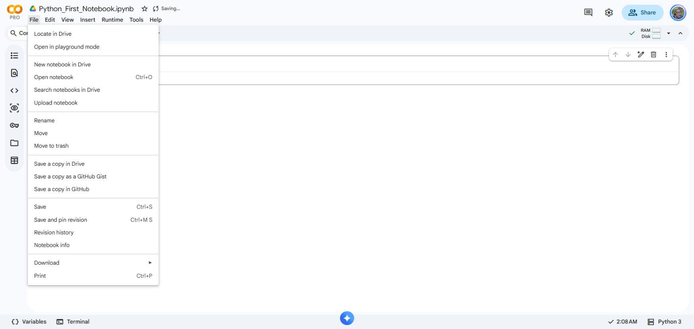
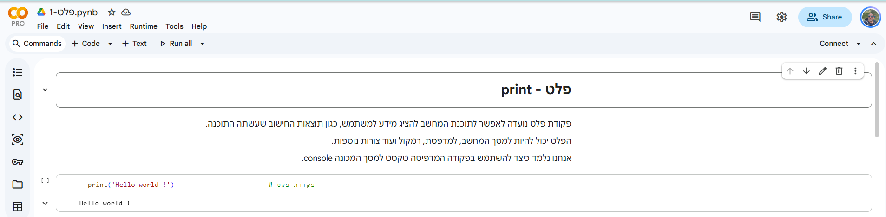
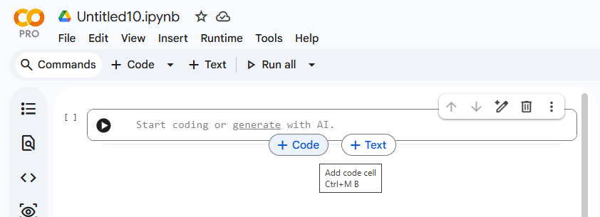
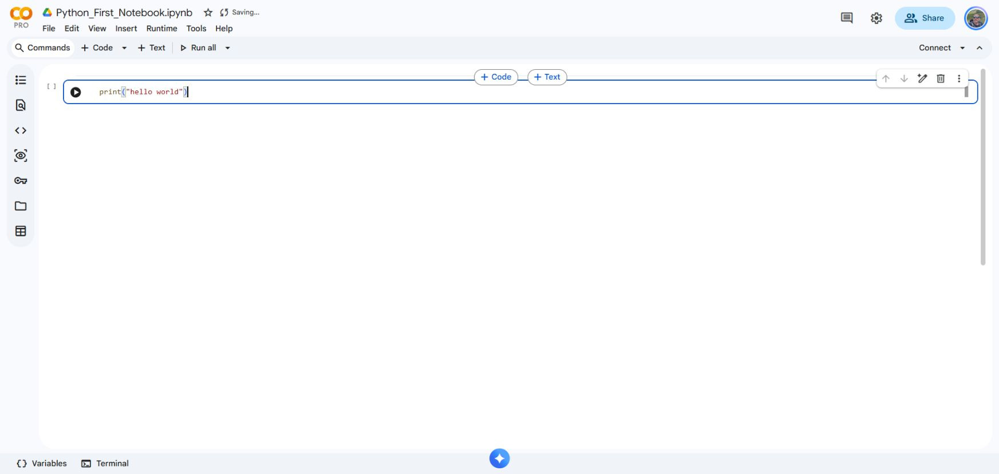
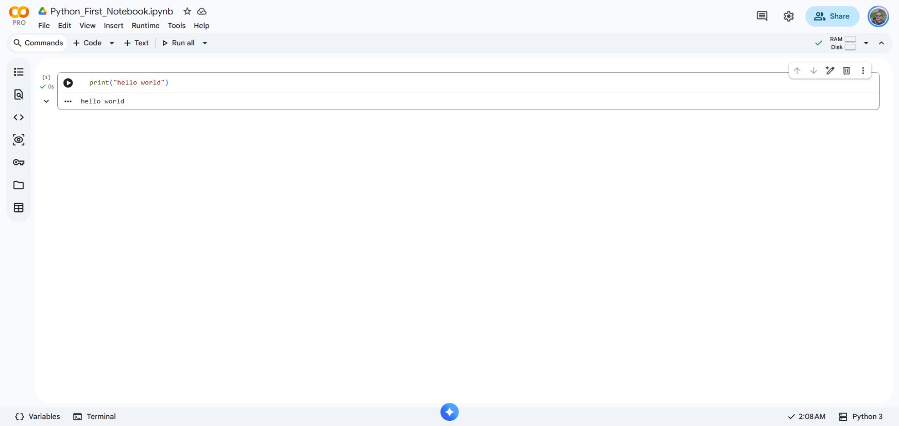

<!-- editorlm-hebrew-html-start -->
<style>
html, body, .vscode-body, .markdown-body, .markdown-preview, #write {
  direction: rtl !important; text-align: right !important;
}
ul, ol { padding-right: 2em !important; padding-left: 0 !important; }
blockquote { border-right: 3px solid #999; border-left: 0; padding-right: 1rem; padding-left: 0; }
@media print {
  html, body, .vscode-body, .markdown-body, .markdown-preview, #write {
    direction: rtl !important; text-align: right !important;
  }
}
</style>
<!-- editorlm-hebrew-html-end -->

<style>
.book { max-width: 900px; margin: auto; line-height: 1.8; font-family: Arial, sans-serif; }
.book .cover { min-height: 680px; box-sizing: border-box; padding: 64px 48px; margin: 24px 0 60px; background: #112b41; color: #f5f8fc; border-top: 9px solid #39c4b5; position: relative; }
.book .cover .eyebrow { color: #81e0d5; font-size: 15px; letter-spacing: 2px; }
.book .cover h1 { color: #fff; font-size: 48px; line-height: 1.3; border: 0; margin: 50px 0 18px; }
.book .cover .subtitle { font-size: 28px; color: #d8e6f0; }
.book .cover .author { font-size: 30px; color: #fff; margin-top: 52px; }
.book .cover .audience { color: #c1d3df; margin-top: 12px; }
.book .cover .motif { direction: ltr; text-align: left; font-family: Consolas, monospace; color: #81e0d5; font-size: 19px; margin-top: 54px; }
.book h1, .book h2, .book h3 { line-height: 1.4; font-weight: 700; }
.book > h1 { font-size: 32px !important; text-align: center !important; margin: 28px 0; }
.book h2 { font-size: 34px !important; text-align: center !important; color: #153b56 !important; background: #eef5fc; border: 0; border-bottom: 4px solid #299c91; border-radius: 10px 10px 0 0; padding: 28px 20px; margin: 24px 0 36px; }
.book h3 { font-size: 24px !important; text-align: right !important; color: #174e49 !important; background: #edf7f5; border: 0; border-right: 5px solid #299c91; border-radius: 6px; padding: 10px 16px; margin: 36px 0 18px; }
.book .chapter { height: 0; margin: 76px 0 0; border-top: 1px solid #ccd7df; break-before: page; page-break-before: always; break-after: avoid; page-break-after: avoid; }
.book .toc { padding: 24px; border-right: 5px solid #39a99d; background: rgba(70,150,155,.09); margin: 24px 0 48px; }
.book pre, .book pre code { direction: ltr !important; text-align: left !important; unicode-bidi: isolate; }
.book pre { box-sizing: border-box !important; width: 100% !important; max-width: 100% !important; margin: 0 !important; padding: 16px 20px; border: 1px solid #ccd7df; border-radius: 8px; line-height: 1.6; overflow-x: auto; }
.book code { direction: ltr; unicode-bidi: isolate; font-family: Consolas, "Courier New", monospace; }
.book pre { background: #f3f6fa !important; color: #1f2937 !important; }
.book pre code, .book pre code.hljs { background: transparent !important; color: #1f2937 !important; }
.book pre .hljs-keyword, .book pre .hljs-literal { color: #6f299c !important; }
.book pre .hljs-string { color: #216338 !important; }
.book pre .hljs-number { color: #075e68 !important; }
.book pre .hljs-comment { color: #526174 !important; }
.book pre .hljs-built_in, .book pre .hljs-title { color: #135b96 !important; }
.book table { width: 75%; max-width: 75%; margin: 18px auto; }
.book th, .book td { text-align: right; }
.book .small { font-size: .9em; opacity: .8; }
.book .python-intro { display: flex; align-items: center; gap: 28px; padding: 22px 28px; margin: 24px 0; background: #eef5fc; color: #183e63; border-right: 6px solid #3776ab; border-radius: 10px; }
.book .python-intro strong { font-size: 30px; }
.book .python-fact { background: #fff7d6; color: #423611; border-right: 6px solid #ffd343; border-radius: 8px; padding: 18px 24px; margin: 22px 0; }
.book .python-fact strong { font-size: 24px; }
.book img { max-width: 100%; height: auto; }
.book figure { margin: 24px auto; text-align: center; }
.book figure img { display: block; margin: auto; }
.book figcaption { direction: rtl; text-align: center; font-size: .9em; color: #445566; }
@media print { .book > h2 { break-before: page; page-break-before: always; } }
.book .screen-strip { width: 760px; max-width: 100%; height: 220px; overflow: hidden; border: 1px solid #bccad5; border-radius: 8px; margin: 20px auto 8px; direction: ltr; }
.book .screen-strip.output { height: 265px; }
.book .screen-strip img { display: block; width: 1745px; max-width: none; }
.book .screen-menu { width: 400px; max-width: 100%; height: 295px; overflow: hidden; direction: ltr; margin: 20px auto 8px; border: 1px solid #bccad5; border-radius: 8px; }
.book .screen-menu img { display: block; width: 1745px; max-width: none; }
.book .code-panel { box-sizing: border-box !important; display: block !important; width: 75% !important; max-width: 75% !important; margin: 18px auto !important; }
@media print {
  .book .cover { min-height: 85vh; break-after: page; print-color-adjust: exact; -webkit-print-color-adjust: exact; }
  .book pre { white-space: pre-wrap; break-inside: avoid; }
  .book .chapter { margin: 0; border: 0; }
  .book h1, .book h2, .book h3 { break-after: avoid; page-break-after: avoid; break-inside: avoid; }
  .book h2 { margin-top: 0; }
  .book h2, .book h3 { print-color-adjust: exact; -webkit-print-color-adjust: exact; }
}
</style>

<style>
.book .book-nav { display: flex; flex-wrap: wrap; gap: 10px; justify-content: center; align-items: center; padding: 16px 0; margin: 20px 0 32px; border-top: 1px solid #ccd7df; border-bottom: 1px solid #ccd7df; }
.book .book-nav a { display: inline-block; padding: 10px 18px; border-radius: 8px; background: #eef5fc; color: #153b56 !important; border: 1px solid #b5ccd9; text-decoration: none !important; font-size: 16px; font-weight: bold; }
.book .book-nav a.toc-link { background: #174e49; color: #fff !important; border-color: #174e49; }
.book .book-nav a:hover, .book .book-nav a:focus { background: #d4eee8; color: #153b56 !important; outline: 2px solid #299c91; outline-offset: 2px; }
.book .section-list { line-height: 2; }
@media print { .book .book-nav { display: none; } }

/* Explicit Hebrew direction, including prose beginning with English. */
.book p, .book ul, .book ol, .book li,
.book blockquote, .book h1, .book h2, .book h3,
.book h4, .book th, .book td {
  direction: rtl !important;
  text-align: right !important;
  unicode-bidi: isolate;
}
/* Chapter titles keep their agreed centered layout. */
.book h2 { text-align: center !important; }
.book pre, .book pre code, .book .code-panel {
  direction: ltr !important;
  text-align: left !important;
  unicode-bidi: isolate;
}
</style>

<style>
.book img { max-width: 100%; height: auto; object-fit: contain; }
.book .python-intro { display: flex; align-items: center; gap: 24px; padding: 22px; background: #edf7f5; border-radius: 12px; margin: 24px 0; color: #153b56; }
.book .python-intro img { width: 105px; height: auto; }
.book .python-fact { padding: 20px; background: #fff5ce; border-right: 5px solid #f0c444; border-radius: 8px; color: #153b56; }
.book .screen-menu, .book .screen-strip, .book .screen-strip.output { text-align: center; margin: 20px auto; max-width: 100%; height: auto !important; overflow: visible; }
.book .screen-menu img, .book .screen-strip img { width: auto; max-width: 100%; height: auto; }
.book h4 { font-size: 21px; color: #153b56; margin-top: 28px; }
@media print { .book > h2 { break-before: page; page-break-before: always; } }
</style>

<div class="book" dir="rtl" lang="he" style="direction: rtl !important; text-align: right !important;">

<nav class="book-nav" aria-label="ניווט בפרקים">
<a href="01-%D7%9E%D7%91%D7%95%D7%90.md">→ הקודם</a>
<a class="toc-link" href="../index.md#book-toc">תוכן העניינים</a>
<a href="03-%D7%A4%D7%A7%D7%95%D7%93%D7%95%D7%AA%20%D7%91%D7%A1%D7%99%D7%A1%D7%99%D7%95%D7%AA.md">הבא ←</a>
</nav>

## א.2 — סביבת העבודה: Google Colab

בפרק הקודם ראינו שפייתון מופעלת באמצעות אינטרפרטר: כותבים הוראות, והתוכנה מבצעת אותן מיד. כדי להתחיל לכתוב בעצמנו, אנחנו צריכים מקום שבו נוכל להקליד קוד, להריץ אותו ולראות מה קרה. סביבת עבודה היא בדיוק המקום הזה: בה כותבים את הקוד, מריצים אותו ורואים את התוצאה. בחלק זה נשתמש ב־Google Colab, סביבת עבודה שפועלת בדפדפן ומריצה את הקוד בשרתים של Google.

העבודה נעשית במחברת המחולקת לתאים: בתא קוד כותבים הוראות פייתון, ומתחתיו רואים את הפלט לאחר הרצה; בתאי טקסט אפשר לשלב הסברים ותמונות. כך נשמור יחד את ההסבר, התוכנית והתוצאות שלה.

אין צורך להתקין פייתון במחשב. השירות כולל מסלול **חינמי**, המספיק לתרגול שבפרקים אלה; אין צורך לרכוש מנוי. [מידע רשמי על Colab](https://research.google.com/colaboratory/faq.html).

<!-- editorlm-source-ref: [sources/Python/Python_Intro_Colab.pptx#L13-L23] -->

**[מחברות האוניברסיטה הפתוחה — 1-יסודות השפה](https://drive.google.com/drive/folders/1yLN-J12Mq3KZ0i6XJwpaA3XMC6xoh4GJ?usp=sharing)**


### 1. נכנסים ופותחים מחברת

1. פתחו בדפדפן את [Google Colab](https://colab.research.google.com/).
2. אם נדרש, לחצו **Sign in** והיכנסו לחשבון Google שלכם.
3. במסך הבית לחצו **New notebook**. אם כבר פתוחה מחברת, בחרו **File → New notebook in Drive**.
4. לחצו על שם המחברת בראש המסך ותנו לה שם, למשל **Python_First_Notebook.ipynb**.

<div class="screen-menu">

</div>

[פתיחת צילום המסך בגודל מלא](../assets/colab-file-menu.png)


*פתיחת מחברת חדשה מתוך File. באותו תפריט נמצאות גם Open notebook ו־Upload notebook לפתיחת מחברת קיימת.*

### 2. מכירים את המסך

אחרי שהמחברת פתוחה, נכיר את החלקים העיקריים של המסך. בצילום שלפניכם מופיעה מחברת מהקורס, ומתחתיו רשימה של הכפתורים שנשתמש בהם הכי הרבה.



*מחברת הקורס: בחלק העליון כותרת והסבר; מתחתיהם תא קוד ופלט.*

- **שם המחברת** — בראש המסך, לצד סמל Colab.
- **‎+ Code** — הוספת תא לכתיבת קוד.
- **‎+ Text** — הוספת תא לכותרת או להסבר.
- **Connect** — התחברות למחשב של Google שמריץ את הקוד.
- **▶ ליד התא** — הרצת תא הקוד.

#### מוסיפים תא קוד או תא טקסט

**הדרך הנוחה ביותר היא להוסיף תא בדיוק במקום הרצוי בעזרת העכבר:** העבירו את מצביע העכבר אל הקצה העליון או התחתון של תא קיים, באזור שבין התאים. יופיעו הכפתורים <b dir="ltr">+ Code</b> ו־<b dir="ltr">+ Text</b>. לחיצה על אחד מהם תוסיף תא חדש באותו מקום:

1. **תא קוד:** לחצו על <b dir="ltr">+ Code</b>. ייפתח תא קוד חדש; לחצו בתוכו והקלידו את הוראות הפייתון. משמאל לתא מופיע כפתור ההרצה **▶**.
2. **תא טקסט:** לחצו על <b dir="ltr">+ Text</b>. ייפתח תא טקסט חדש; לחצו באזור העריכה והקלידו כותרת או הסבר, למשל „התוכנית הראשונה שלי”. תא זה מיועד לתיעוד ואינו מריץ קוד פייתון.

<figure>

<figcaption>הכפתורים מופיעים בקצה התא: <b dir="ltr">+ Code</b> מוסיף תא קוד ו־<b dir="ltr">+ Text</b> מוסיף תא טקסט במקום המסומן.</figcaption>
</figure>

[פתיחת צילום המסך בגודל מלא](../assets/colab-add-cells-user.png)

אפשר גם להוסיף תאים באמצעות הכפתורים <b dir="ltr">+ Code</b> ו־<b dir="ltr">+ Text</b> שבסרגל הכלים העליון, מתחת לתפריטים.

הצילום נעשה בחשבון המציג סמל Pro. **המנוי הזה אינו נדרש** לביצוע ההוראות כאן. בצילום מהמחברת מופיעה אותה דוגמת הדפסה באות גדולה ועם סימן קריאה.

### 3. כותבים קוד

עכשיו נכתוב את התוכנית הראשונה שלנו. היא עושה דבר אחד בלבד: מציגה על המסך את הטקסט hello world. הפקודה `print` היא הדרך של פייתון להדפיס משהו למסך, ומה שכתוב בין המירכאות הוא הטקסט שיודפס. לחצו בתוך תא קוד ריק והקלידו שורה אחת:

<div class="code-panel" dir="ltr" style="box-sizing: border-box !important; display: block !important; width: 75% !important; max-width: 75% !important; margin: 18px auto !important; direction: ltr !important; text-align: left !important;">

```python
print("hello world")
```

</div>

<div class="screen-strip">

</div>

[פתיחת צילום המסך בגודל מלא](../assets/colab-code.png)


*כותבים בתוך התא, באזור שמימין לכפתור המשולש. שימו לב למירכאות ולסוגריים.*

### 4. מריצים ורואים פלט

לחצו על **▶ משמאל לתא**. בהרצה הראשונה המתינו לחיבור סביבת הריצה; אפשר גם ללחוץ קודם על **Connect**. להרצת התא הפעיל אפשר להשתמש בקיצור **Ctrl+Enter**.

<div class="screen-strip output">

</div>

[פתיחת צילום המסך בגודל מלא](../assets/colab-output.png)


*הטקסט hello world מופיע מתחת לקוד — זהו הפלט.*

**פלט**

<div class="code-panel" dir="ltr" style="box-sizing: border-box !important; display: block !important; width: 75% !important; max-width: 75% !important; margin: 18px auto !important; direction: ltr !important; text-align: left !important;">

```text
hello world
```

</div>

### 5. שומרים וממשיכים

המחברת נשמרת ב־Google Drive. לפני הסגירה ודאו שסמל השמירה בראש המסך מציין שהשינויים נשמרו. אפשר לפתוח אותה שוב מ־Drive או ממסך הבית של Colab.

**המחברת נשמרת, אך סביבת הריצה זמנית:** בפעם הבאה ייתכן שתצטרכו להתחבר ולהריץ שוב את התאים. [שמירה וסביבת ריצה ב־Colab](https://research.google.com/colaboratory/faq.html).

### עבודה עם מחברות הליווי

לכל נושא בחלק זה מצורפת מחברת ליווי מוכנה ובה דוגמאות הקוד של הפרק. כדי להתנסות בהן בלי לפגוע במקור, עובדים על עותק אישי. פתחו את תיקיית המחברות הציבוריות, בחרו מחברת לפי הנושא ושמרו עותק ב־Drive שלכם לפני השינוי. עבדו בעותק האישי. במחברת חדשה או לאחר חיבור מחדש, הריצו את התאים מלמעלה למטה: תא מאוחר עשוי להשתמש במשתנה או בפונקציה שהוגדרו קודם. שמירת קובץ המחברת אינה שומרת את הזיכרון של סביבת הריצה.

<nav class="book-nav" aria-label="ניווט בפרקים">
<a href="01-%D7%9E%D7%91%D7%95%D7%90.md">→ הקודם</a>
<a class="toc-link" href="../index.md#book-toc">תוכן העניינים</a>
<a href="03-%D7%A4%D7%A7%D7%95%D7%93%D7%95%D7%AA%20%D7%91%D7%A1%D7%99%D7%A1%D7%99%D7%95%D7%AA.md">הבא ←</a>
</nav>

</div>

<!-- editorlm-source-versions: {"schemaVersion": 1, "sources": {"sources/Python/Python_Intro_Colab.pptx": {"sourceSha256": "6661ef452ccbf6f70f9e9d413207d0f16914ac4da9a38026e817f7e8d932658c", "canonicalTextSha256": "2cca9ddeeb2f1c940efaadd82221ebda54fb08e2814fd46db348a62cdc164917"}, "sources/Python/Python_Basic.pptx": {"sourceSha256": "32a2d56f6cb0e1eacf4a8a28f14d7932648610f4248f7178dae91b80b6ef7e84", "canonicalTextSha256": "0a301b7608d0440e9cfaab4e39bd7bbb9518eaf76710de862723aa719cc60e4a"}, "sources/Python/converted/1.Python_Basic/notebook.md": {"sourceSha256": "2d605efefadda4ead3844d4ae7e8066d8443ea6927868f6b4ca26a4bdc66d16c", "canonicalTextSha256": "2d605efefadda4ead3844d4ae7e8066d8443ea6927868f6b4ca26a4bdc66d16c"}, "sources/Python/Python_Classes_Inheritance.pptx": {"sourceSha256": "ad085713a21c8b50a6210c1b43f31e3421aad37238c20ec5a6c78825cf178af4", "canonicalTextSha256": "09ec2e29ca4c246d64556136e69fee1eeac8a6234f55b06dac6d77cecd09e7e5"}, "sources/Python/Python_Data_Strucrures.pptx": {"sourceSha256": "af0d66fc064d82bd80d368b0e9d39716f653abe73240936a8fce03b3ad2ff283", "canonicalTextSha256": "80dd4b6c86b82109570ee1c3b0062963aab08de123e173c90e0967af586bfee4"}, "sources/Python/Python_Numpy.pptx": {"sourceSha256": "d1a86b84fd49ca2baee3a81586a78246cf31d582742844b229c2f8f576d52fa3", "canonicalTextSha256": "fe990439bdef892516fa8983a16f5eed04168924c84b6e9d819b5a94be5ca314"}, "sources/Python/Python_PyPlot.pptx": {"sourceSha256": "01cadb34d9c969eeb2e63490275e6f56122c7ce9f3d9f193296e1e796656d85b", "canonicalTextSha256": "f2ef11e858c11340a1d069dd7301e7a03b3358c273cf91681d80970717fb6b1c"}, "sources/Python/converted/2.Python_Data_Struct/notebook.md": {"sourceSha256": "b22b730af709e02d0009f11919302963e3efaa6c020949866f1e86d6f47e25fc", "canonicalTextSha256": "b22b730af709e02d0009f11919302963e3efaa6c020949866f1e86d6f47e25fc"}, "sources/Python/converted/3.numpy/notebook.md": {"sourceSha256": "f2bccd1d5c7492037ac66a7c4de1b34220d0b8812f4773a0978eca434b5bcfa9", "canonicalTextSha256": "f2bccd1d5c7492037ac66a7c4de1b34220d0b8812f4773a0978eca434b5bcfa9"}, "sources/Python/converted/4.PyPlot/notebook.md": {"sourceSha256": "8f0bf07a3cf8561f8fccfce4736fa515597960640d561e98ada980abcb68cd18", "canonicalTextSha256": "8f0bf07a3cf8561f8fccfce4736fa515597960640d561e98ada980abcb68cd18"}, "sources/אוניברסיטה פתוחה/converted/1-יסודות השפה/notebook.md": {"sourceSha256": "804b496290d70530dd3ef21750b3913f2d9ca91bf408c1d299e9b4e6662a2b17", "canonicalTextSha256": "804b496290d70530dd3ef21750b3913f2d9ca91bf408c1d299e9b4e6662a2b17"}}} -->
