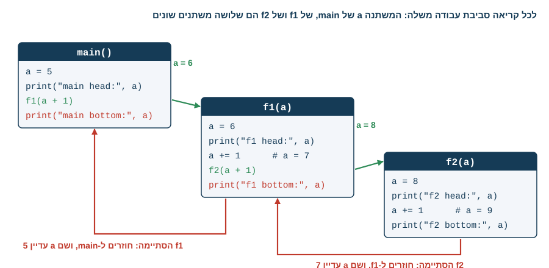
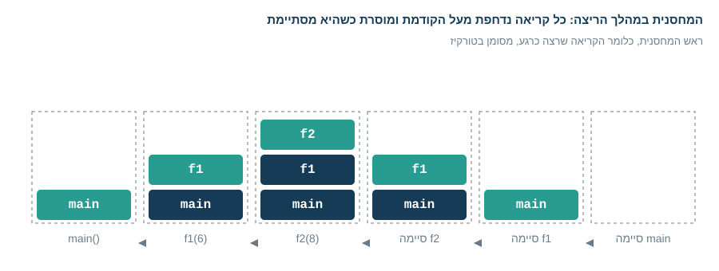
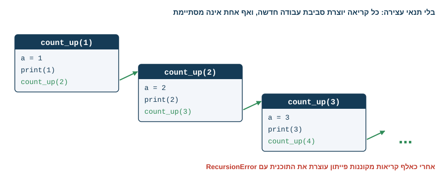
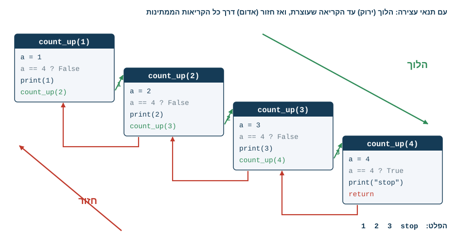
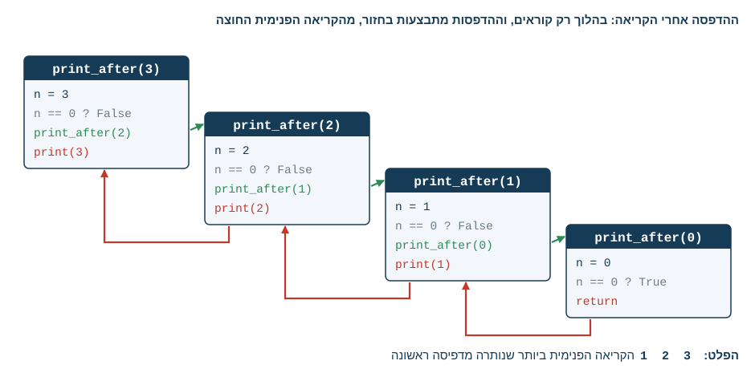
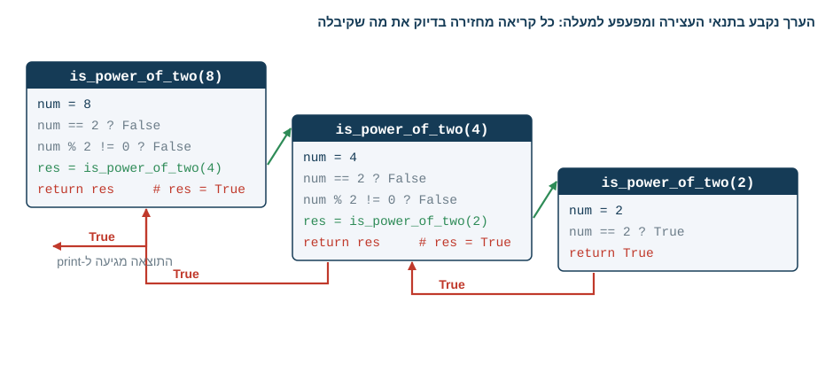
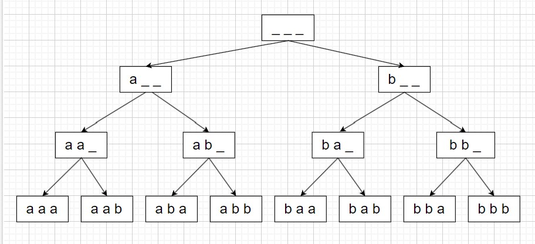
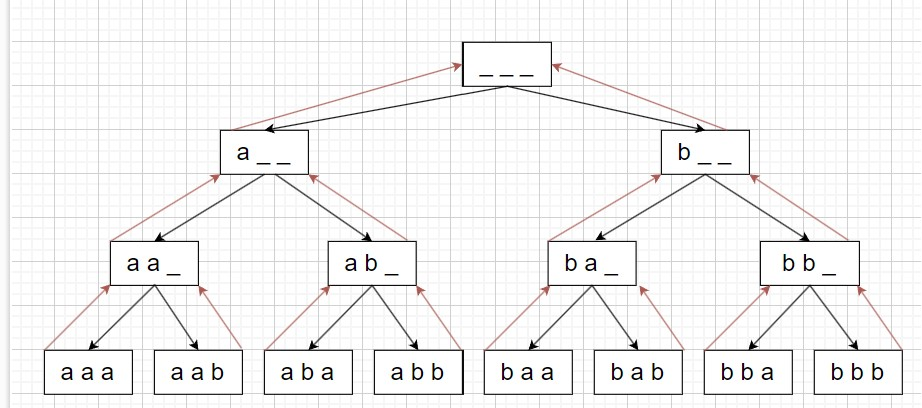
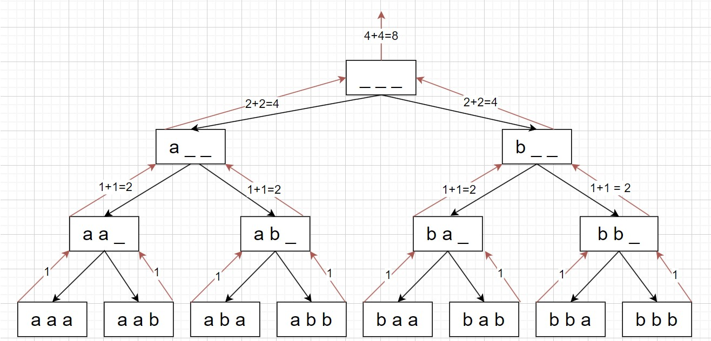

<!-- editorlm-hebrew-html-start -->
<style>
html, body, .vscode-body, .markdown-body, .markdown-preview, #write {
  direction: rtl !important; text-align: right !important;
}
ul, ol { padding-right: 2em !important; padding-left: 0 !important; }
blockquote { border-right: 3px solid #999; border-left: 0; padding-right: 1rem; padding-left: 0; }
@media print {
  html, body, .vscode-body, .markdown-body, .markdown-preview, #write {
    direction: rtl !important; text-align: right !important;
  }
}
</style>
<!-- editorlm-hebrew-html-end -->

<style>
.book { max-width: 900px; margin: auto; line-height: 1.8; font-family: Arial, sans-serif; }
.book .cover { min-height: 680px; box-sizing: border-box; padding: 64px 48px; margin: 24px 0 60px; background: #112b41; color: #f5f8fc; border-top: 9px solid #39c4b5; position: relative; }
.book .cover .eyebrow { color: #81e0d5; font-size: 15px; letter-spacing: 2px; }
.book .cover h1 { color: #fff; font-size: 48px; line-height: 1.3; border: 0; margin: 50px 0 18px; }
.book .cover .subtitle { font-size: 28px; color: #d8e6f0; }
.book .cover .author { font-size: 30px; color: #fff; margin-top: 52px; }
.book .cover .audience { color: #c1d3df; margin-top: 12px; }
.book .cover .motif { direction: ltr; text-align: left; font-family: Consolas, monospace; color: #81e0d5; font-size: 19px; margin-top: 54px; }
.book h1, .book h2, .book h3 { line-height: 1.4; font-weight: 700; }
.book > h1 { font-size: 32px !important; text-align: center !important; margin: 28px 0; }
.book h2 { font-size: 34px !important; text-align: center !important; color: #153b56 !important; background: #eef5fc; border: 0; border-bottom: 4px solid #299c91; border-radius: 10px 10px 0 0; padding: 28px 20px; margin: 24px 0 36px; }
.book h3 { font-size: 24px !important; text-align: right !important; color: #174e49 !important; background: #edf7f5; border: 0; border-right: 5px solid #299c91; border-radius: 6px; padding: 10px 16px; margin: 36px 0 18px; }
.book .chapter { height: 0; margin: 76px 0 0; border-top: 1px solid #ccd7df; break-before: page; page-break-before: always; break-after: avoid; page-break-after: avoid; }
.book .toc { padding: 24px; border-right: 5px solid #39a99d; background: rgba(70,150,155,.09); margin: 24px 0 48px; }
.book pre, .book pre code { direction: ltr !important; text-align: left !important; unicode-bidi: isolate; }
.book pre { box-sizing: border-box !important; width: 100% !important; max-width: 100% !important; margin: 0 !important; padding: 16px 20px; border: 1px solid #ccd7df; border-radius: 8px; line-height: 1.6; overflow-x: auto; }
.book code { direction: ltr; unicode-bidi: isolate; font-family: Consolas, "Courier New", monospace; }
.book pre { background: #f3f6fa !important; color: #1f2937 !important; }
.book pre code, .book pre code.hljs { background: transparent !important; color: #1f2937 !important; }
.book pre .hljs-keyword, .book pre .hljs-literal { color: #6f299c !important; }
.book pre .hljs-string { color: #216338 !important; }
.book pre .hljs-number { color: #075e68 !important; }
.book pre .hljs-comment { color: #526174 !important; }
.book pre .hljs-built_in, .book pre .hljs-title { color: #135b96 !important; }
.book table { width: 100%; }
.book th, .book td { text-align: right; }
.book .small { font-size: .9em; opacity: .8; }
.book .python-intro { display: flex; align-items: center; gap: 28px; padding: 22px 28px; margin: 24px 0; background: #eef5fc; color: #183e63; border-right: 6px solid #3776ab; border-radius: 10px; }
.book .python-intro strong { font-size: 30px; }
.book .python-fact { background: #fff7d6; color: #423611; border-right: 6px solid #ffd343; border-radius: 8px; padding: 18px 24px; margin: 22px 0; }
.book .python-fact strong { font-size: 24px; }
.book img { max-width: 100%; height: auto; }
.book figure { margin: 24px auto; text-align: center; }
.book figure img { display: block; margin: auto; }
.book figcaption { direction: rtl; text-align: center; font-size: .9em; color: #445566; }
@media print { .book > h2 { break-before: page; page-break-before: always; } }
.book .screen-strip { width: 760px; max-width: 100%; height: 220px; overflow: hidden; border: 1px solid #bccad5; border-radius: 8px; margin: 20px auto 8px; direction: ltr; }
.book .screen-strip.output { height: 265px; }
.book .screen-strip img { display: block; width: 1745px; max-width: none; }
.book .screen-menu { width: 400px; max-width: 100%; height: 295px; overflow: hidden; direction: ltr; margin: 20px auto 8px; border: 1px solid #bccad5; border-radius: 8px; }
.book .screen-menu img { display: block; width: 1745px; max-width: none; }
.book .code-panel { box-sizing: border-box !important; display: block !important; width: 75% !important; max-width: 75% !important; margin: 18px auto !important; }
@media print {
  .book .cover { min-height: 85vh; break-after: page; print-color-adjust: exact; -webkit-print-color-adjust: exact; }
  .book pre { white-space: pre-wrap; break-inside: avoid; }
  .book .chapter { margin: 0; border: 0; }
  .book h1, .book h2, .book h3 { break-after: avoid; page-break-after: avoid; break-inside: avoid; }
  .book h2 { margin-top: 0; }
  .book h2, .book h3 { print-color-adjust: exact; -webkit-print-color-adjust: exact; }
}
</style>

<style>
.book .book-nav { display: flex; flex-wrap: wrap; gap: 10px; justify-content: center; align-items: center; padding: 16px 0; margin: 20px 0 32px; border-top: 1px solid #ccd7df; border-bottom: 1px solid #ccd7df; }
.book .book-nav a { display: inline-block; padding: 10px 18px; border-radius: 8px; background: #eef5fc; color: #153b56 !important; border: 1px solid #b5ccd9; text-decoration: none !important; font-size: 16px; font-weight: bold; }
.book .book-nav a.toc-link { background: #174e49; color: #fff !important; border-color: #174e49; }
.book .book-nav a:hover, .book .book-nav a:focus { background: #d4eee8; color: #153b56 !important; outline: 2px solid #299c91; outline-offset: 2px; }
.book .section-list { line-height: 2; }
@media print { .book .book-nav { display: none; } }

/* Explicit Hebrew direction, including prose beginning with English. */
.book p, .book ul, .book ol, .book li,
.book blockquote, .book h1, .book h2, .book h3,
.book h4, .book th, .book td {
  direction: rtl !important;
  text-align: right !important;
  unicode-bidi: isolate;
}
/* Chapter titles keep their agreed centered layout. */
.book h2 { text-align: center !important; }
.book pre, .book pre code, .book .code-panel {
  direction: ltr !important;
  text-align: left !important;
  unicode-bidi: isolate;
}
</style>

<style>
.book img { max-width: 100%; height: auto; object-fit: contain; }
.book .python-intro { display: flex; align-items: center; gap: 24px; padding: 22px; background: #edf7f5; border-radius: 12px; margin: 24px 0; color: #153b56; }
.book .python-intro img { width: 105px; height: auto; }
.book .python-fact { padding: 20px; background: #fff5ce; border-right: 5px solid #f0c444; border-radius: 8px; color: #153b56; }
.book .screen-menu, .book .screen-strip, .book .screen-strip.output { text-align: center; margin: 20px auto; max-width: 100%; height: auto !important; overflow: visible; }
.book .screen-menu img, .book .screen-strip img { width: auto; max-width: 100%; height: auto; }
.book h4 { font-size: 21px; color: #153b56; margin-top: 28px; }
@media print { .book > h2 { break-before: page; page-break-before: always; } }
</style>

<div class="book" dir="rtl" lang="he" style="direction: rtl !important; text-align: right !important;">

<nav class="book-nav" aria-label="ניווט בפרקים">
<a href="14-%D7%97%D7%A8%D7%99%D7%92%D7%95%D7%AA.md">→ הקודם</a>
<a class="toc-link" href="../index.md#book-toc">תוכן העניינים</a>
<a href="16-%D7%97%D7%99%D7%A4%D7%95%D7%A9%20%D7%95%D7%9E%D7%99%D7%95%D7%9F.md">הבא ←</a>
</nav>

## א.15 — רקורסיה

עד כה פתרנו בעיות שחוזרות על עצמן בעזרת לולאות. יש דרך נוספת לחשוב על חזרה: להגדיר את הפתרון של בעיה בעזרת פתרון של מקרה קטן יותר מאותה בעיה. חשבו על ערמת ספרים שרוצים לספור: כדי לדעת כמה ספרים יש בערמה, מסירים ספר אחד ושואלים כמה ספרים יש בערמה שנותרה, ומוסיפים אחד. ממשיכים כך עד שהערמה ריקה, ואז התשובה היא אפס.

דרך חשיבה זו נקראת **רקורסיה — Recursion**, ובקוד היא מתבטאת בפונקציה שקוראת לעצמה. גם במתמטיקה נפוצות הגדרות כאלה: בסדרה חשבונית כל איבר הוא האיבר הקודם ועוד הפרש קבוע, ובסדרת פיבונאצ׳י כל איבר הוא סכום שני קודמיו. בכל הגדרה כזאת יש נקודת התחלה שאינה תלויה באיברים קודמים, ובלעדיה ההגדרה לא הייתה מסתיימת לעולם. כך גם בקוד: כל פתרון רקורסיבי בנוי מ**תנאי עצירה** (מכונה גם תנאי הבסיס), שבו התשובה ידועה מיד ואין צורך בקריאה נוספת, ומגוף שמקטין את הבעיה וקורא לפונקציה שוב.

כדי להבין רקורסיה באמת צריך להבין מה קורה בזיכרון כשפונקציה קוראת לפונקציה. לכן הפרק פותח בקריאה רגילה בין שתי פונקציות שונות, ורק אחר כך עובר לפונקציה שקוראת לעצמה: תחילה בלי תנאי עצירה, אחר כך עם תנאי עצירה, ואז עם ערך מוחזר. בסוף הפרק נראה פונקציה שקוראת לעצמה פעמיים, ואת עץ הקריאות שנוצר ממנה. דרך החשיבה הזאת, פירוק בעיה לתת־בעיות קטנות מאותו סוג, עומדת בבסיסם של אלגוריתמים רבים שנפגוש בהמשך.

**[מחברות האוניברסיטה הפתוחה — 8-רקורסיה](https://drive.google.com/drive/folders/1yLN-J12Mq3KZ0i6XJwpaA3XMC6xoh4GJ?usp=sharing)**


### מה קורה בקריאה לפונקציה?

בפרק א.7 ראינו שהפרמטרים והמשתנים של פונקציה הם מקומיים. כעת נדייק מה קורה ברגע הקריאה עצמו. כשפונקציה קוראת לפונקציה אחרת, פייתון אינה ממשיכה לרוץ באותה סביבה: היא שומרת בצד את סביבת העבודה של הפונקציה הקוראת, כלומר את כל המשתנים שלה ואת המקום שבו נעצרה, ויוצרת סביבת עבודה חדשה ונפרדת לפונקציה שנקראה. הערכים שהועברו בקריאה מוצבים בפרמטרים החדשים. כשהפונקציה שנקראה מסתיימת, סביבת העבודה שלה נמחקת, הסביבה של הקוראת חוזרת לחיים על כל ערכיה, והריצה ממשיכה מהשורה שאחרי הקריאה.

בדוגמה הבאה שלוש פונקציות משתמשות באותו שם משתנה, `a`. נסו לנחש את הפלט לפני שתריצו:

<div class="code-panel" dir="ltr" style="box-sizing: border-box !important; width: 75% !important; max-width: 75% !important; margin: 18px auto !important; direction: ltr !important; text-align: left !important;">

```python
def main():
    a = 5
    print("main head:", a)
    f1(a + 1)
    print("main bottom:", a)

def f1(a):
    print("f1 head:", a)
    a += 1
    f2(a + 1)
    print("f1 bottom:", a)

def f2(a):
    print("f2 head:", a)
    a += 1
    print("f2 bottom:", a)

main()
```

</div>

**פלט**

<div class="code-panel" dir="ltr" style="box-sizing: border-box !important; width: 75% !important; max-width: 75% !important; margin: 18px auto !important; direction: ltr !important; text-align: left !important;">

```text
main head: 5
f1 head: 6
f2 head: 8
f2 bottom: 9
f1 bottom: 7
main bottom: 5
```

</div>

יש כאן שלושה משתנים שונים ששמם `a`, אחד בכל סביבת עבודה. `main` העבירה ל־`f1` את הערך 6, ו־`f1` הגדילה את ה־`a` שלה ל־7 והעבירה ל־`f2` את הערך 8. `f2` הגדילה את ה־`a` שלה ל־9, אבל כשהיא הסתיימה וחזרנו ל־`f1`, ה־`a` של `f1` היה עדיין 7, וכשחזרנו ל־`main` ה־`a` שלה היה עדיין 5. שינוי בסביבה אחת אינו נראה בסביבה אחרת. התרשים מציג את שלוש סביבות העבודה, את הקריאות בירוק ואת החזרות באדום:

<figure>

<figcaption>קריאה לפונקציה פותחת סביבת עבודה חדשה. כשהיא מסתיימת חוזרים לסביבה הקוראת, והערכים שבה לא השתנו.</figcaption>
</figure>

הסביבות האלה נשמרות במבנה שנקרא **מחסנית — Stack**. מחסנית פועלת כמו ערמת צלחות: מניחים צלחת חדשה תמיד למעלה, ולוקחים תמיד את העליונה. האחרון שנכנס הוא הראשון שיוצא, ובאנגלית LIFO, כלומר Last In First Out. כל קריאה לפונקציה נדחפת לראש המחסנית, והפונקציה שבראש היא זו שרצה כרגע. כשהיא מסתיימת היא מוסרת מהמחסנית, והפונקציה שמתחתיה חוזרת להיות בראש וממשיכה מהמקום שבו נעצרה. לכן הפונקציה שנכנסה אחרונה, `f2`, היא הראשונה שמסיימת, ו־`main`, שנכנסה ראשונה, מסיימת אחרונה:

<figure>

<figcaption>המחסנית לאורך הריצה. הקריאה שבראש המחסנית היא זו שרצה; כשהיא מסתיימת, הקריאה שמתחתיה ממשיכה.</figcaption>
</figure>

ההסבר הזה נכון למספרים, למחרוזות ולטאפלים. כשמעבירים רשימה, שתי הסביבות מפנות לאותה רשימה, ושינוי איבריה בפונקציה אחת נראה גם באחרת, כפי שראינו בפרק א.10.

### פונקציה שקוראת לעצמה בלי תנאי עצירה

עכשיו אפשר להבין מה קורה כשפונקציה קוראת לעצמה. מבחינת פייתון אין הבדל: כל קריאה פותחת סביבת עבודה חדשה עם פרמטרים משלה, גם אם זו אותה פונקציה. הפונקציה הבאה מדפיסה את המספר שקיבלה וקוראת לעצמה עם המספר הבא, בלי שום תנאי שיעצור אותה:

<div class="code-panel" dir="ltr" style="box-sizing: border-box !important; width: 75% !important; max-width: 75% !important; margin: 18px auto !important; direction: ltr !important; text-align: left !important;">

```python
def count_up(a):
    print(a, end=" ")
    count_up(a + 1)

count_up(1)
```

</div>

**פלט**

<div class="code-panel" dir="ltr" style="box-sizing: border-box !important; width: 75% !important; max-width: 75% !important; margin: 18px auto !important; direction: ltr !important; text-align: left !important;">

```text
1 2 3 4 5 6 7 8 9 10 11 12 ... 995 996 997 998
RecursionError: maximum recursion depth exceeded
```

</div>

כל קריאה מדפיסה, פותחת קריאה חדשה וממתינה לה, ואף קריאה אינה מסתיימת. המחסנית מתמלאת בסביבות עבודה: `a = 1`, מעליה `a = 2`, מעליה `a = 3`, וכן הלאה:

<figure>

<figcaption>בלי תנאי עצירה כל קריאה פותחת קריאה נוספת, והמחסנית גדלה עד שפייתון עוצרת את התוכנית.</figcaption>
</figure>

פייתון מגבילה את עומק הקריאות המקוננות, כברירת מחדל לכאלף, וכשעוברים את הגבול היא מפסיקה את התוכנית עם החריגה `RecursionError`. המספר האחרון שיודפס תלוי בסביבה שבה מריצים. בשפות אחרות המחסנית פשוט נגמרת, והתקלה נקראת **גלישת מחסנית — Stack Overflow**. זהו שם התקלה הנפוצה ביותר בכתיבת רקורסיה, ומכאן גם שמו של אתר השאלות המוכר למתכנתים.

### תנאי עצירה

כדי שהרקורסיה תסתיים, צריך שבאחת הקריאות הפונקציה תחזור בלי לקרוא לעצמה שוב. זהו **תנאי העצירה**: בדיקה בתחילת הפונקציה, שכאשר היא מתקיימת מבצעים משהו פשוט ויוצאים ב־`return`. נעצור את הספירה כשמגיעים ל־4:

<div class="code-panel" dir="ltr" style="box-sizing: border-box !important; width: 75% !important; max-width: 75% !important; margin: 18px auto !important; direction: ltr !important; text-align: left !important;">

```python
def count_up(a):
    if a == 4:
        print("stop")
        return
    print(a)
    count_up(a + 1)

count_up(1)
```

</div>

**פלט**

<div class="code-panel" dir="ltr" style="box-sizing: border-box !important; width: 75% !important; max-width: 75% !important; margin: 18px auto !important; direction: ltr !important; text-align: left !important;">

```text
1
2
3
stop
```

</div>

עכשיו נוצרות ארבע סביבות עבודה, ובקריאה הרביעית התנאי מתקיים: מודפס `stop` והפונקציה חוזרת בלי קריאה נוספת. מכאן מתחילה הדרך חזרה. הקריאה עם `a = 3` הייתה ממתינה בשורה שאחרי `count_up(a + 1)`, ומכיוון שאין שם עוד פקודות היא מסתיימת אף היא, וכך גם הקריאות עם `a = 2` ועם `a = 1`. את הריצה נוח לתאר בשני שלבים. **הלוך**: הקריאות נערמות זו על זו עד שמגיעים לתנאי העצירה. **חזור**: הקריאות מסתיימות בסדר הפוך, מהפנימית ביותר החוצה, וכל אחת ממשיכה מהמקום שבו נעצרה:

<figure>

<figcaption>הלוך וחזור: הקריאות נערמות עד לתנאי העצירה, ואז מסתיימות בסדר הפוך. הפלט הוא 1, 2, 3, stop.</figcaption>
</figure>

שימו לב לשני פרטים חשובים בקוד. הפרמטר משתנה בכל קריאה, `a + 1`, ולכן כל קריאה מתקרבת לתנאי העצירה. ובלי ה־`return` שבתוך התנאי, הפונקציה הייתה ממשיכה להדפיס ולקרוא לעצמה גם אחרי `stop`. הדוגמה מיועדת להתחלה שאינה גדולה מ־4; אם נתחיל ב־5, לעולם לא נגיע לתנאי העצירה ונקבל שוב `RecursionError`.

### הלוך וחזור: הסדר בתוך הפונקציה קובע

בדוגמה הקודמת ההדפסה הופיעה לפני הקריאה הרקורסיבית, ולכן היא בוצעה בדרך הלוך. מה יקרה אם נעביר אותה אחרי הקריאה? נכתוב פונקציה שמקבלת `n` ועוצרת ב־0, ונשווה את שתי הגרסאות:

<div class="code-panel" dir="ltr" style="box-sizing: border-box !important; width: 75% !important; max-width: 75% !important; margin: 18px auto !important; direction: ltr !important; text-align: left !important;">

```python
def print_before(n):
    if n == 0:
        return
    print(n)
    print_before(n - 1)

def print_after(n):
    if n == 0:
        return
    print_after(n - 1)
    print(n)

print_before(3)
print("---")
print_after(3)
```

</div>

**פלט**

<div class="code-panel" dir="ltr" style="box-sizing: border-box !important; width: 75% !important; max-width: 75% !important; margin: 18px auto !important; direction: ltr !important; text-align: left !important;">

```text
3
2
1
---
1
2
3
```

</div>

ב־`print_before` כל קריאה מדפיסה ומיד קוראת הלאה, ולכן המספרים מודפסים בדרך הלוך, מ־3 ל־1. ב־`print_after` כל קריאה קודם קוראת הלאה וממתינה, ורק כשהקריאה הפנימית חזרה היא מדפיסה. שום דבר אינו מודפס בדרך הלוך; ההדפסות מתבצעות בחזור, ולכן הקריאה הפנימית ביותר שנותרה, זו עם `n = 1`, מדפיסה ראשונה:

<figure>

<figcaption>כשההדפסה אחרי הקריאה, היא מתבצעת בחזור: 1 מודפס ראשון ו־3 אחרון. אותם מספרים, סדר הפוך.</figcaption>
</figure>

אותה פונקציה יכולה לעשות משהו גם לפני הקריאה וגם אחריה. אם נדפיס את `n` בשני המקומות נקבל `3 2 1` בהלוך ואז `1 2 3` בחזור. זו הנקודה המרכזית בפרק: ברקורסיה הולכים וחוזרים, ומקומה של פקודה ביחס לקריאה הרקורסיבית קובע אם היא תתבצע בדרך פנימה או בדרך החוצה. כשהקריאה הרקורסיבית היא הפעולה האחרונה בפונקציה, כמו ב־`print_before`, מדברים על **רקורסיית זנב — Tail Recursion**: כל העבודה נעשית בהלוך, ובחזור לא נותר מה לעשות. כשהקריאה מופיעה בתחילה והעבודה אחריה, כמו ב־`print_after`, מדברים על **רקורסיית ראש — Head Recursion**: העבודה נעשית בחזור.

### סכמת הרקורסיה

אפשר עכשיו לסכם את המבנה של פונקציה רקורסיבית לינארית, כזו שקוראת לעצמה פעם אחת בכל רמה:

<div class="code-panel" dir="ltr" style="box-sizing: border-box !important; width: 75% !important; max-width: 75% !important; margin: 18px auto !important; direction: ltr !important; text-align: left !important;">

```python
def func(params):
    if stop_condition:
        # do something
        return

    # do something      (optional, on the way in)
    func(smaller_params)
    # do something      (optional, on the way back)
```

</div>

- **תנאי העצירה** נבדק ראשון. כשהוא מתקיים מבצעים פעולה פשוטה, לעיתים לא כלום, וחוזרים.
- **גוף הפונקציה** מבצע פעולה, קורא לפונקציה עם פרמטרים שמקרבים אותה לתנאי העצירה, ולעיתים מבצע פעולה נוספת אחרי שהקריאה חזרה.
- **הפרמטר המתכנס** משתנה בכל קריאה לכיוון תנאי העצירה: מספר שקטן עד אפס, אינדקס שגדל עד אורך הרשימה, מחרוזת שמתקצרת. בלי התכנסות כזאת נקבל `RecursionError`.

כשכותבים פונקציה רקורסיבית כדאי לענות על שלוש שאלות לפי הסדר: מתי עוצרים, מה הופך את הבעיה לקטנה יותר בכל קריאה, ומה עושים בהלוך ומה בחזור.

### פונקציה שמחזירה ערך

עד כאן הפונקציות רק הדפיסו. לרוב אנחנו רוצים שהפונקציה תחזיר תשובה. נתחיל במקרה הפשוט ביותר: התשובה נקבעת בתנאי העצירה, וכל קריאה מחזירה בדיוק את מה שקיבלה מהקריאה שבתוכה. נבדוק אם מספר חיובי הוא חזקה של 2. מספר כזה אפשר לחלק ב־2 שוב ושוב עד שמגיעים ל־2; אם באחד השלבים המספר אי־זוגי, הוא אינו חזקה של 2. נכתוב תחילה גרסה מפורשת, שבה התשובה של הקריאה הפנימית נשמרת במשתנה ורק אז מוחזרת:

<div class="code-panel" dir="ltr" style="box-sizing: border-box !important; width: 75% !important; max-width: 75% !important; margin: 18px auto !important; direction: ltr !important; text-align: left !important;">

```python
def is_power_of_two(num):
    if num == 2:
        return True
    if num % 2 != 0:
        return False
    res = is_power_of_two(num // 2)
    return res

print(is_power_of_two(8))
print(is_power_of_two(12))
```

</div>

**פלט**

<div class="code-panel" dir="ltr" style="box-sizing: border-box !important; width: 75% !important; max-width: 75% !important; margin: 18px auto !important; direction: ltr !important; text-align: left !important;">

```text
True
False
```

</div>

כאן יש שני תנאי עצירה: `num == 2` מחזיר `True`, ומספר אי־זוגי מחזיר `False`. הקריאה עם 8 אינה יודעת את התשובה, ולכן היא קוראת לקריאה עם 4 וממתינה. הקריאה עם 4 גם היא אינה יודעת, וקוראת לקריאה עם 2, שם התשובה ידועה ומוחזר `True`. עכשיו מתחיל החזור: הקריאה עם 4 מקבלת את `True` לתוך `res` ומחזירה אותו כפי שהוא, הקריאה עם 8 מקבלת אותו לתוך ה־`res` שלה ומחזירה גם היא, עד שהערך מגיע ל־`print`. הערך שנקבע פעם אחת בתנאי העצירה **מפעפע** למעלה דרך כל הקריאות הממתינות:

<figure>

<figcaption>הערך המוחזר נקבע פעם אחת בתנאי העצירה. כל קריאה ממתינה מקבלת אותו לתוך res ומעבירה אותו למעלה.</figcaption>
</figure>

המשתנה `res` אינו הכרחי. אפשר להחזיר את תוצאת הקריאה ישירות, וזו הצורה המקובלת:

<div class="code-panel" dir="ltr" style="box-sizing: border-box !important; width: 75% !important; max-width: 75% !important; margin: 18px auto !important; direction: ltr !important; text-align: left !important;">

```python
def is_power_of_two(num):
    if num == 2:
        return True
    if num % 2 != 0:
        return False
    return is_power_of_two(num // 2)

print(is_power_of_two(8))
```

</div>

**פלט**

<div class="code-panel" dir="ltr" style="box-sizing: border-box !important; width: 75% !important; max-width: 75% !important; margin: 18px auto !important; direction: ltr !important; text-align: left !important;">

```text
True
```

</div>

השורה `return is_power_of_two(num // 2)` עושה בדיוק את שני הדברים שעשו שתי השורות הקודמות: ממתינה לתשובה של הקריאה הפנימית, ומחזירה אותה. לכן בפונקציה שמחזירה ערך חובה לכתוב `return` בשני מקומות, בתנאי העצירה שבו התשובה נקבעת, ולפני הקריאה הרקורסיבית, כדי שהתשובה תועבר הלאה. אם נשכח את ה־`return` שלפני הקריאה, הקריאה הפנימית תחשב את התשובה, אבל הקריאה החיצונית תזרוק אותה ותחזיר `None`.

עם 12 הריצה קצרה יותר: 12 זוגי, הקריאה עם 6 גם, אבל 3 אי־זוגי, ומשם מפעפע `False`. הגרסה הבאה מחזירה את המעריך במקום `True`. הפרמטר הנוסף `exp` סופר בהלוך כמה פעמים חילקנו, ותנאי העצירה מחזיר את הספירה שהצטברה:

<div class="code-panel" dir="ltr" style="box-sizing: border-box !important; width: 75% !important; max-width: 75% !important; margin: 18px auto !important; direction: ltr !important; text-align: left !important;">

```python
def power_of_two_exponent(num, exp=1):
    if num == 2:
        return exp
    if num % 2 != 0:
        return -1
    return power_of_two_exponent(num // 2, exp + 1)

print(power_of_two_exponent(8))
print(power_of_two_exponent(12))
```

</div>

**פלט**

<div class="code-panel" dir="ltr" style="box-sizing: border-box !important; width: 75% !important; max-width: 75% !important; margin: 18px auto !important; direction: ltr !important; text-align: left !important;">

```text
3
-1
```

</div>

### צבירה בדרך פנימה — חישוב בהלוך

הפרמטר `exp` מדגים רעיון כללי: אפשר להעביר מקריאה לקריאה, בדרך הלוך, ערך שנצבר עד כה. פרמטר כזה נקרא צובר. נחשב כך את סכום הרשימה מהפתיחה. כל קריאה אחראית לאיבר אחד: היא מוסיפה אותו לצובר ומעבירה את הצובר המעודכן לקריאה הבאה. כשהאינדקס מגיע לאורך הרשימה, הסכום מוכן ותנאי העצירה מחזיר אותו:

<div class="code-panel" dir="ltr" style="box-sizing: border-box !important; width: 75% !important; max-width: 75% !important; margin: 18px auto !important; direction: ltr !important; text-align: left !important;">

```python
def sum_list_forward(numbers, total=0, index=0):
    if index == len(numbers):
        return total
    return sum_list_forward(
        numbers, total + numbers[index], index + 1)

print(sum_list_forward([3, 5, 3, 0, 7, -2]))
```

</div>

**פלט**

<div class="code-panel" dir="ltr" style="box-sizing: border-box !important; width: 75% !important; max-width: 75% !important; margin: 18px auto !important; direction: ltr !important; text-align: left !important;">

```text
16
```

</div>

הפרמטר `index` מציין מאיזה מקום ברשימה מתחילים, ו־`total` נושא את הסכום שנצבר. ברירות המחדל `0` מאפשרות לקרוא לפונקציה עם הרשימה בלבד. הפרמטרים של פונקציה רקורסיבית מתחלקים אפוא לשני סוגים: פרמטר שמתכנס לתנאי העצירה, כאן `index`, ופרמטר חישוב, כאן `total`, שנועד להעביר ערכים בהלוך ואינו הכרחי בכל פונקציה. כמו ב־`power_of_two_exponent`, כל החישוב נעשה בהלוך, והתוצאה רק מפעפעת בחזור.

### חישוב בדרך חזרה — חישוב בחזור

יש דרך הפוכה, שאינה זקוקה לצובר. כל קריאה מבקשת מהקריאה שבתוכה את סכום שאר האיברים, ורק כשהתשובה חוזרת היא מוסיפה לה את האיבר שלה. כלומר, החיבור מתבצע בחזור:

<div class="code-panel" dir="ltr" style="box-sizing: border-box !important; width: 75% !important; max-width: 75% !important; margin: 18px auto !important; direction: ltr !important; text-align: left !important;">

```python
def sum_list(numbers, index=0):
    if index == len(numbers):
        return 0
    return numbers[index] + sum_list(numbers, index + 1)

print(sum_list([3, 1, 9, 10, -4]))
```

</div>

**פלט**

<div class="code-panel" dir="ltr" style="box-sizing: border-box !important; width: 75% !important; max-width: 75% !important; margin: 18px auto !important; direction: ltr !important; text-align: left !important;">

```text
19
```

</div>

בתנאי העצירה אין עוד איברים לסכום, ולכן מוחזר `0`. בדרך חזרה כל קריאה מוסיפה את האיבר שלה לתוצאה שקיבלה. למשל, עבור `[3, 1]` מתקבל בהדרגה `0`, אחר כך `1 + 0`, ולבסוף `3 + 1`. פייתון אינה יכולה לחשב את `numbers[index] + ...` לפני שהקריאה הפנימית חזרה, ולכן כל קריאה ממתינה במחסנית עם האיבר שלה עד שהתשובה מגיעה. באותה דרך מחשבים עצרת: `n!` הוא `n` כפול `(n-1)!`, ו־`1!` הוא 1:

<div class="code-panel" dir="ltr" style="box-sizing: border-box !important; width: 75% !important; max-width: 75% !important; margin: 18px auto !important; direction: ltr !important; text-align: left !important;">

```python
def factorial(n):
    if n == 1:
        return 1
    return n * factorial(n - 1)

print(factorial(4))
```

</div>

**פלט**

<div class="code-panel" dir="ltr" style="box-sizing: border-box !important; width: 75% !important; max-width: 75% !important; margin: 18px auto !important; direction: ltr !important; text-align: left !important;">

```text
24
```

</div>

שתי הדרכים נותנות אותה תוצאה, ובדרך כלל אפשר לבחור ביניהן לפי הנוחות. חישוב בהלוך דורש פרמטר נוסף אך התשובה מוכנה כבר בתנאי העצירה; חישוב בחזור קצר יותר לכתיבה, כי הפונקציה מחזירה ביטוי שמשלב את האיבר הנוכחי עם התוצאה של שאר הרשימה. בהמשך נפגוש בעיות שבהן ההחלטה מה להחזיר תלויה בתוצאה שחזרה מלמטה, ואז החישוב חייב להיעשות בחזור. בשתי הגרסאות נשמרות קריאות מקוננות, וכל קריאה תופסת מקום במחסנית עד שהאחרונה מסתיימת. לרשימה ארוכה, לולאה פשוטה חוסכת את עומק הקריאות. רקורסיה מתאימה במיוחד לבעיות שמתחלקות באופן טבעי לתת־בעיות, ולא נדרשת לכל סריקה פשוטה של רשימה.

<!-- editorlm-source-ref: [sources/אוניברסיטה פתוחה/converted/8-רקורסיה/notebook.md#L59-L137] -->

<!-- editorlm-source-ref: [sources/אוניברסיטה פתוחה/converted/8-רקורסיה/notebook.md#L283-L662] -->

<!-- editorlm-source-ref: [sources/אוניברסיטה פתוחה/converted/8-רקורסיה/notebook.md#L1083-L1200] -->

<!-- editorlm-source-ref: [sources/אוניברסיטה פתוחה/converted/8-רקורסיה/notebook.md#L1289-L1376] -->

<!-- editorlm-source-ref: [sources/אוניברסיטה פתוחה/converted/8-רקורסיה/notebook.md#L1687-L1760] -->

<!-- editorlm-source-ref: [sources/אוניברסיטה פתוחה/converted/8-רקורסיה/notebook.md#L1829-L1955] -->


### רקורסיה עם שתי קריאות — עץ הקריאות

בכל הדוגמאות עד כה כל קריאה הפעילה קריאה אחת נוספת, ולכן הקריאות הסתדרו בשרשרת ואפשר היה לדמות את הריצה למסלול קווי של הלוך ושוב. הכוח האמיתי של הרקורסיה מתגלה כשפונקציה קוראת לעצמה יותר מפעם אחת. אז הקריאות אינן שרשרת אלא **עץ**: כל קריאה מסתעפת לכמה קריאות, וכל אחת מהן מסתעפת שוב.

נדגים זאת בשאלה מקומבינטוריקה: מהן כל המחרוזות באורך 3 שאפשר לבנות משתי האותיות `a` ו־`b`? הרעיון: בכל מקום פנוי מציבים פעם `a` ופעם `b`, וממשיכים למקום הבא. הפרמטר `n` סופר כמה מקומות נותרו למלא, והמחרוזת `st` נבנית בהלוך. כשלא נותרו מקומות, המחרוזת שלמה ומדפיסים אותה:

<div class="code-panel" dir="ltr" style="box-sizing: border-box !important; width: 75% !important; max-width: 75% !important; margin: 18px auto !important; direction: ltr !important; text-align: left !important;">

```python
def combination_string(n, st=""):
    if n == 0:
        print(st)
        return
    combination_string(n - 1, st + "a")
    combination_string(n - 1, st + "b")

combination_string(3)
```

</div>

**פלט**

<div class="code-panel" dir="ltr" style="box-sizing: border-box !important; width: 75% !important; max-width: 75% !important; margin: 18px auto !important; direction: ltr !important; text-align: left !important;">

```text
aaa
aab
aba
abb
baa
bab
bba
bbb
```

</div>

<figure>

<figcaption>עץ הקריאות: כל קריאה מסתעפת לשתיים, אחת שמוסיפה a ואחת שמוסיפה b. שמונת העלים הם שמונה המחרוזות שהודפסו.</figcaption>
</figure>

איך נראים ההלוך והחזור בעץ? הקריאה הראשונה, עם מחרוזת ריקה, קוראת קודם לענף `a`. הענף הזה קורא לענף `aa`, וזה לענף `aaa`, שם תנאי העצירה מתקיים ומודפס `aaa`. עכשיו הקריאה `aaa` מסתיימת, וחוזרים לקריאה `aa`, אבל היא עדיין לא סיימה: נותרה לה הקריאה השנייה, עם `aab`. רק אחרי ששני הענפים שלה חזרו, `aa` מסתיימת וחוזרים ל־`a`, שפונה לענף השני שלה, `ab`. כך ממשיכים: יורדים לעומק עד לעלה, חוזרים צעד אחד למעלה, ויורדים לענף הבא. סדר סריקה זה נקרא **חיפוש לעומק — DFS, Depth First Search**, ונפגוש אותו שוב באלגוריתמים על גרפים. בתרשים הבא החצים השחורים הם הקריאות בהלוך, והאדומים הם החזרות:

<figure>

<figcaption>הלוך וחזור בעץ: מכל צומת יורדים לענף השמאלי, חוזרים, ורק אז יורדים לענף הימני.</figcaption>
</figure>

כמו ברקורסיה לינארית, גם כאן אפשר להחזיר ערך במקום להדפיס. נספור כמה מחרוזות כאלה יש. כל עלה תורם 1, וכל צומת פנימי מחזיר את סכום התוצאות שקיבל משני הענפים שלו:

<div class="code-panel" dir="ltr" style="box-sizing: border-box !important; width: 75% !important; max-width: 75% !important; margin: 18px auto !important; direction: ltr !important; text-align: left !important;">

```python
def count_combinations(n, st=""):
    if len(st) == n:
        return 1
    return (count_combinations(n, st + "a")
            + count_combinations(n, st + "b"))

print(count_combinations(3))
print(count_combinations(4))
```

</div>

**פלט**

<div class="code-panel" dir="ltr" style="box-sizing: border-box !important; width: 75% !important; max-width: 75% !important; margin: 18px auto !important; direction: ltr !important; text-align: left !important;">

```text
8
16
```

</div>

ברקורסיה כפולה החישוב נעשה בחזור: כל צומת ממתין לשתי התוצאות מהרמה שמתחתיו, ורק אז מחליט מה לפעפע למעלה. בספירה פשוט סוכמים:

<figure>

<figcaption>ספירה בחזור: כל עלה מחזיר 1, וכל צומת מחזיר את סכום שני ענפיו. השורש מקבל 4+4 ומחזיר 8.</figcaption>
</figure>

יש בעיות שבהן ההגדרה עצמה נשענת על שני מקרים קטנים יותר. בסדרת פיבונאצ׳י מתחילים ב־0 וב־1, וכל איבר נוסף הוא סכום שני קודמיו: 0, 1, 1, 2, 3, 5, 8 וכן הלאה. לכן המימוש הישיר מפעיל שתי קריאות, אחת לכל אחד משני האיברים הקודמים; הוא מיועד לאינדקס שלם שאינו שלילי:

<div class="code-panel" dir="ltr" style="box-sizing: border-box !important; width: 75% !important; max-width: 75% !important; margin: 18px auto !important; direction: ltr !important; text-align: left !important;">

```python
def fibonacci(n):
    if n == 0:
        return 0
    if n == 1:
        return 1
    return fibonacci(n - 1) + fibonacci(n - 2)

print(fibonacci(6))
```

</div>

**פלט**

<div class="code-panel" dir="ltr" style="box-sizing: border-box !important; width: 75% !important; max-width: 75% !important; margin: 18px auto !important; direction: ltr !important; text-align: left !important;">

```text
8
```

</div>

כאן יש שני תנאי עצירה, לאינדקס 0 ולאינדקס 1, ו־`fibonacci(6)` מחזירה 8, האיבר השביעי בסדרה. גם כאן עץ הקריאות מתפצל, אך בניגוד לעץ המחרוזות, אותו חישוב חוזר בענפים שונים: `fibonacci(6)` קוראת ל־`fibonacci(5)` ול־`fibonacci(4)`, ו־`fibonacci(5)` קוראת שוב ל־`fibonacci(4)`. הקוד מתאים להמחשת ההגדרה, אך אינו יעיל לחישוב איברים רחוקים. בהמשך הקורס נפגוש את הרעיון של שמירת תוצאות במקום לחשבן שוב.

<!-- editorlm-source-ref: [sources/אוניברסיטה פתוחה/converted/8-רקורסיה/notebook.md#L3300-L3572] -->

### בחירה בין שתי אפשרויות — Backtracking

עץ הקריאות מאפשר לפתור סוג שלם של בעיות שבהן צריך לבדוק צירופים. הדוגמה האופיינית: האם קיימת תת־קבוצה של איברי הרשימה שסכומה שווה למספר נתון? למשל ברשימה `[3, 7, 2, 5]` אפשר להגיע ל־9 בעזרת 7 ו־2. בלולאה רגילה קשה לעבור על כל הצירופים, כי מספר הצירופים גדל פי 2 עם כל איבר. ברקורסיה הפתרון טבעי: על כל איבר מחליטים החלטה אחת, לקחת אותו או לדלג עליו, ומעבירים את ההחלטה הלאה. כל החלטה היא ענף בעץ, וכל מסלול מהשורש לעלה הוא צירוף אחד.

הפונקציה מקבלת את הרשימה, את סכום המטרה ואת האינדקס הנוכחי. אם המטרה הגיעה לאפס, מצאנו צירוף. אם נגמרו האיברים בלי שהמטרה התאפסה, הצירוף בענף הזה נכשל. אחרת מנסים את שתי האפשרויות: דילוג על האיבר, כלומר מעבר לאיבר הבא עם אותה מטרה, ולקיחתו, כלומר מעבר לאיבר הבא עם מטרה שקטנה בגודלו. מספיק שאחת מהן תצליח:

<div class="code-panel" dir="ltr" style="box-sizing: border-box !important; width: 75% !important; max-width: 75% !important; margin: 18px auto !important; direction: ltr !important; text-align: left !important;">

```python
def has_subset_sum(lst, target, i=0):
    if target == 0:
        return True
    if i == len(lst):
        return False
    skip = has_subset_sum(lst, target, i + 1)
    take = has_subset_sum(lst, target - lst[i], i + 1)
    return skip or take

print(has_subset_sum([3, 7, 2, 5], 9))
print(has_subset_sum([4, 8, 10], 7))
```

</div>

**פלט**

<div class="code-panel" dir="ltr" style="box-sizing: border-box !important; width: 75% !important; max-width: 75% !important; margin: 18px auto !important; direction: ltr !important; text-align: left !important;">

```text
True
False
```

</div>

שיטה זו נקראת **נסיגה — Backtracking**: יורדים בענף אחד עד הסוף, ואם הוא נכשל חוזרים אחורה, כלומר נסוגים לצומת הקודם, ומנסים את הענף השני. הנסיגה אינה דורשת קוד מיוחד; היא בדיוק החזור של הרקורסיה. כשקריאה מחזירה `False`, הקריאה שמעליה ממשיכה לאפשרות הבאה שלה. ההחלטה מה להחזיר תלויה בתוצאות שחזרו משני הענפים, ולכן זו דוגמה לחישוב שחייב להיעשות בחזור. שימו לב שהרשימה עצמה אינה משתנה: ההתקדמות נעשית באינדקס, וכל ענף מקבל מטרה משלו.

אותה תבנית, שתי קריאות לכל איבר, פותרת גם בעיות שנשמעות שונות. האם אפשר לחלק את כל איברי הרשימה לשתי קבוצות בעלות סכום שווה? כל איבר מצטרף לקבוצה הראשונה או לשנייה, ושני הסכומים נצברים בהלוך. כשנגמרו האיברים, בודקים אם הסכומים שווים:

<div class="code-panel" dir="ltr" style="box-sizing: border-box !important; width: 75% !important; max-width: 75% !important; margin: 18px auto !important; direction: ltr !important; text-align: left !important;">

```python
def can_split_equal_sum(lst, i=0, sum1=0, sum2=0):
    if i == len(lst):
        return sum1 == sum2
    first = can_split_equal_sum(lst, i + 1, sum1 + lst[i], sum2)
    second = can_split_equal_sum(lst, i + 1, sum1, sum2 + lst[i])
    return first or second

print(can_split_equal_sum([1, 5, 6]))
print(can_split_equal_sum([1, 2, 5]))
```

</div>

**פלט**

<div class="code-panel" dir="ltr" style="box-sizing: border-box !important; width: 75% !important; max-width: 75% !important; margin: 18px auto !important; direction: ltr !important; text-align: left !important;">

```text
True
False
```

</div>

ברשימה `[1, 5, 6]` הענף שבו 1 ו־5 בקבוצה הראשונה ו־6 בשנייה מגיע לשוויון, ולכן התשובה `True`. ברשימה `[1, 2, 5]` כל שמונת המסלולים בעץ נבדקים, אף אחד אינו מגיע לשוויון, והתשובה `False`. כשניגשים לשאלה כזאת כדאי לזהות תחילה את שלושת הרכיבים: מהי ההחלטה שמקבלים על כל איבר, מה מועבר בהלוך, ומה ההחלטה בחזור על סמך שתי התוצאות.

<!-- editorlm-source-ref: [sources/אוניברסיטה פתוחה/converted/15.1 חזרה למבחן מעודכן/notebook.md#L66-L118] -->

<!-- editorlm-source-ref: [sources/אוניברסיטה פתוחה/converted/15.1 חזרה למבחן מעודכן/notebook.md#L4325-L4400] -->

<!-- editorlm-source-ref: [sources/אוניברסיטה פתוחה/converted/15.1 חזרה למבחן מעודכן/notebook.md#L4546-L4660] -->

<nav class="book-nav" aria-label="ניווט בפרקים">
<a href="14-%D7%97%D7%A8%D7%99%D7%92%D7%95%D7%AA.md">→ הקודם</a>
<a class="toc-link" href="../index.md#book-toc">תוכן העניינים</a>
<a href="16-%D7%97%D7%99%D7%A4%D7%95%D7%A9%20%D7%95%D7%9E%D7%99%D7%95%D7%9F.md">הבא ←</a>
</nav>

</div>

<!-- editorlm-source-versions: {"schemaVersion": 1, "sources": {"sources/אוניברסיטה פתוחה/converted/8-רקורסיה/notebook.md": {"sourceSha256": "a880ba83def4afef3bb320a649f79f670afe81eb2fe9c980267a0e69aff4bfe0", "canonicalTextSha256": "a880ba83def4afef3bb320a649f79f670afe81eb2fe9c980267a0e69aff4bfe0"}, "sources/אוניברסיטה פתוחה/converted/15.1 חזרה למבחן מעודכן/notebook.md": {"sourceSha256": "6d2013d2efb13f74fc607e788264990ee357076e1261186671c58f38bc089019", "canonicalTextSha256": "6d2013d2efb13f74fc607e788264990ee357076e1261186671c58f38bc089019"}}} -->
