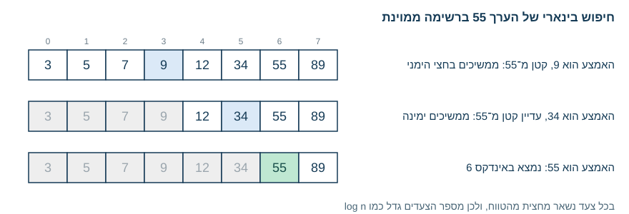
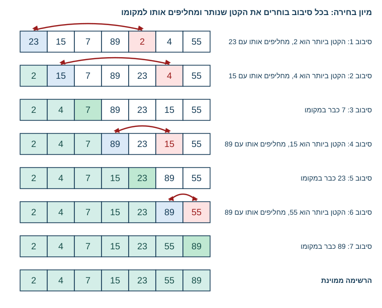
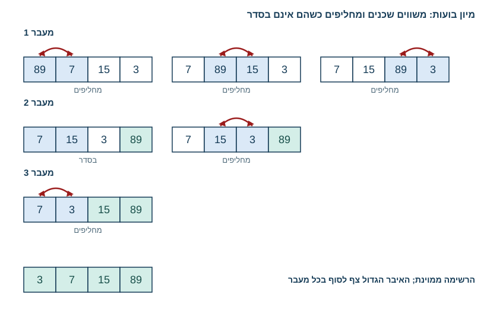
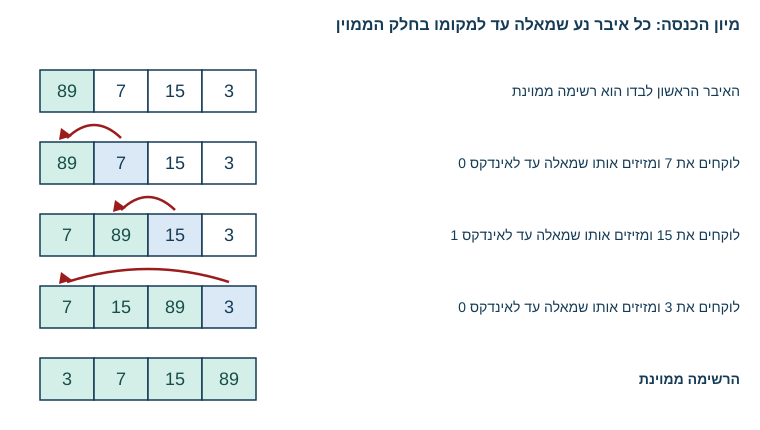
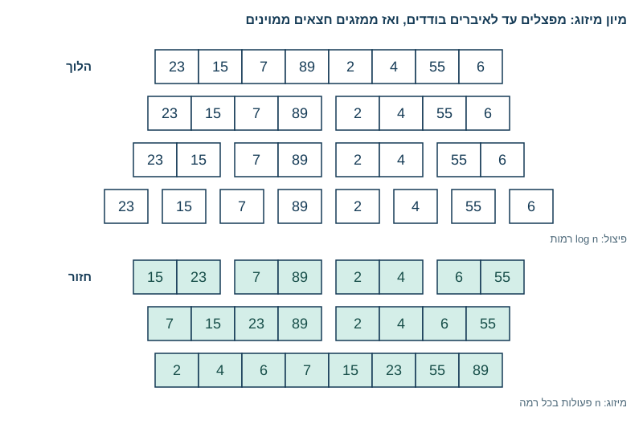
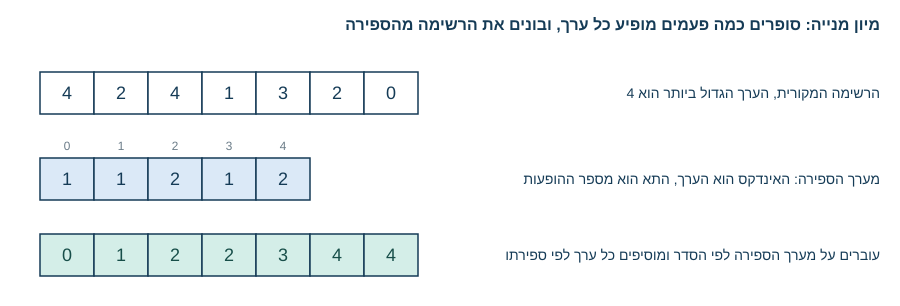

<!-- editorlm-hebrew-html-start -->
<style>
html, body, .vscode-body, .markdown-body, .markdown-preview, #write {
  direction: rtl !important; text-align: right !important;
}
ul, ol { padding-right: 2em !important; padding-left: 0 !important; }
blockquote { border-right: 3px solid #999; border-left: 0; padding-right: 1rem; padding-left: 0; }
@media print {
  html, body, .vscode-body, .markdown-body, .markdown-preview, #write {
    direction: rtl !important; text-align: right !important;
  }
}
</style>
<!-- editorlm-hebrew-html-end -->

<style>
.book { max-width: 900px; margin: auto; line-height: 1.8; font-family: Arial, sans-serif; }
.book .cover { min-height: 680px; box-sizing: border-box; padding: 64px 48px; margin: 24px 0 60px; background: #112b41; color: #f5f8fc; border-top: 9px solid #39c4b5; position: relative; }
.book .cover .eyebrow { color: #81e0d5; font-size: 15px; letter-spacing: 2px; }
.book .cover h1 { color: #fff; font-size: 48px; line-height: 1.3; border: 0; margin: 50px 0 18px; }
.book .cover .subtitle { font-size: 28px; color: #d8e6f0; }
.book .cover .author { font-size: 30px; color: #fff; margin-top: 52px; }
.book .cover .audience { color: #c1d3df; margin-top: 12px; }
.book .cover .motif { direction: ltr; text-align: left; font-family: Consolas, monospace; color: #81e0d5; font-size: 19px; margin-top: 54px; }
.book h1, .book h2, .book h3 { line-height: 1.4; font-weight: 700; }
.book > h1 { font-size: 32px !important; text-align: center !important; margin: 28px 0; }
.book h2 { font-size: 34px !important; text-align: center !important; color: #153b56 !important; background: #eef5fc; border: 0; border-bottom: 4px solid #299c91; border-radius: 10px 10px 0 0; padding: 28px 20px; margin: 24px 0 36px; }
.book h3 { font-size: 24px !important; text-align: right !important; color: #174e49 !important; background: #edf7f5; border: 0; border-right: 5px solid #299c91; border-radius: 6px; padding: 10px 16px; margin: 36px 0 18px; }
.book .chapter { height: 0; margin: 76px 0 0; border-top: 1px solid #ccd7df; break-before: page; page-break-before: always; break-after: avoid; page-break-after: avoid; }
.book .toc { padding: 24px; border-right: 5px solid #39a99d; background: rgba(70,150,155,.09); margin: 24px 0 48px; }
.book pre, .book pre code { direction: ltr !important; text-align: left !important; unicode-bidi: isolate; }
.book pre { box-sizing: border-box !important; width: 100% !important; max-width: 100% !important; margin: 0 !important; padding: 16px 20px; border: 1px solid #ccd7df; border-radius: 8px; line-height: 1.6; overflow-x: auto; }
.book code { direction: ltr; unicode-bidi: isolate; font-family: Consolas, "Courier New", monospace; }
.book pre { background: #f3f6fa !important; color: #1f2937 !important; }
.book pre code, .book pre code.hljs { background: transparent !important; color: #1f2937 !important; }
.book pre .hljs-keyword, .book pre .hljs-literal { color: #6f299c !important; }
.book pre .hljs-string { color: #216338 !important; }
.book pre .hljs-number { color: #075e68 !important; }
.book pre .hljs-comment { color: #526174 !important; }
.book pre .hljs-built_in, .book pre .hljs-title { color: #135b96 !important; }
.book table { width: 75%; max-width: 75%; margin: 18px auto; }
.book th, .book td { text-align: right; }
.book .small { font-size: .9em; opacity: .8; }
.book .python-intro { display: flex; align-items: center; gap: 28px; padding: 22px 28px; margin: 24px 0; background: #eef5fc; color: #183e63; border-right: 6px solid #3776ab; border-radius: 10px; }
.book .python-intro strong { font-size: 30px; }
.book .python-fact { background: #fff7d6; color: #423611; border-right: 6px solid #ffd343; border-radius: 8px; padding: 18px 24px; margin: 22px 0; }
.book .python-fact strong { font-size: 24px; }
.book img { max-width: 100%; height: auto; }
.book figure { margin: 24px auto; text-align: center; }
.book figure img { display: block; margin: auto; }
.book figcaption { direction: rtl; text-align: center; font-size: .9em; color: #445566; }
@media print { .book > h2 { break-before: page; page-break-before: always; } }
.book .screen-strip { width: 760px; max-width: 100%; height: 220px; overflow: hidden; border: 1px solid #bccad5; border-radius: 8px; margin: 20px auto 8px; direction: ltr; }
.book .screen-strip.output { height: 265px; }
.book .screen-strip img { display: block; width: 1745px; max-width: none; }
.book .screen-menu { width: 400px; max-width: 100%; height: 295px; overflow: hidden; direction: ltr; margin: 20px auto 8px; border: 1px solid #bccad5; border-radius: 8px; }
.book .screen-menu img { display: block; width: 1745px; max-width: none; }
.book .code-panel { box-sizing: border-box !important; display: block !important; width: 75% !important; max-width: 75% !important; margin: 18px auto !important; }
@media print {
  .book .cover { min-height: 85vh; break-after: page; print-color-adjust: exact; -webkit-print-color-adjust: exact; }
  .book pre { white-space: pre-wrap; break-inside: avoid; }
  .book .chapter { margin: 0; border: 0; }
  .book h1, .book h2, .book h3 { break-after: avoid; page-break-after: avoid; break-inside: avoid; }
  .book h2 { margin-top: 0; }
  .book h2, .book h3 { print-color-adjust: exact; -webkit-print-color-adjust: exact; }
}
</style>

<style>
.book .book-nav { display: flex; flex-wrap: wrap; gap: 10px; justify-content: center; align-items: center; padding: 16px 0; margin: 20px 0 32px; border-top: 1px solid #ccd7df; border-bottom: 1px solid #ccd7df; }
.book .book-nav a { display: inline-block; padding: 10px 18px; border-radius: 8px; background: #eef5fc; color: #153b56 !important; border: 1px solid #b5ccd9; text-decoration: none !important; font-size: 16px; font-weight: bold; }
.book .book-nav a.toc-link { background: #174e49; color: #fff !important; border-color: #174e49; }
.book .book-nav a:hover, .book .book-nav a:focus { background: #d4eee8; color: #153b56 !important; outline: 2px solid #299c91; outline-offset: 2px; }
.book .section-list { line-height: 2; }
@media print { .book .book-nav { display: none; } }

/* Explicit Hebrew direction, including prose beginning with English. */
.book p, .book ul, .book ol, .book li,
.book blockquote, .book h1, .book h2, .book h3,
.book h4, .book th, .book td {
  direction: rtl !important;
  text-align: right !important;
  unicode-bidi: isolate;
}
/* Chapter titles keep their agreed centered layout. */
.book h2 { text-align: center !important; }
.book pre, .book pre code, .book .code-panel {
  direction: ltr !important;
  text-align: left !important;
  unicode-bidi: isolate;
}
</style>

<style>
.book img { max-width: 100%; height: auto; object-fit: contain; }
.book .python-intro { display: flex; align-items: center; gap: 24px; padding: 22px; background: #edf7f5; border-radius: 12px; margin: 24px 0; color: #153b56; }
.book .python-intro img { width: 105px; height: auto; }
.book .python-fact { padding: 20px; background: #fff5ce; border-right: 5px solid #f0c444; border-radius: 8px; color: #153b56; }
.book .screen-menu, .book .screen-strip, .book .screen-strip.output { text-align: center; margin: 20px auto; max-width: 100%; height: auto !important; overflow: visible; }
.book .screen-menu img, .book .screen-strip img { width: auto; max-width: 100%; height: auto; }
.book h4 { font-size: 21px; color: #153b56; margin-top: 28px; }
@media print { .book > h2 { break-before: page; page-break-before: always; } }
</style>

<div class="book" dir="rtl" lang="he" style="direction: rtl !important; text-align: right !important;">


<div class="book" dir="rtl" lang="he" style="direction: rtl !important; text-align: right !important;">

<nav class="book-nav" aria-label="ניווט בפרקים">
<a href="15-%D7%A8%D7%A7%D7%95%D7%A8%D7%A1%D7%99%D7%94.md">→ הקודם</a>
<a class="toc-link" href="../index.md#book-toc">תוכן העניינים</a>
<a href="17-%D7%92%D7%99%D7%91%D7%95%D7%91.md">הבא ←</a>
</nav>

## א.16 — חיפוש, מיון ויעילות

כשמחפשים מילה במילון מודפס, איש אינו קורא אותו מהעמוד הראשון: פותחים באמצע, בודקים אם המילה נמצאת לפני או אחרי, וממשיכים רק בחצי המתאים. בספר טלפונים לא ממוין, לעומת זאת, לא הייתה ברירה אלא לעבור שם אחר שם. שתי הדרכים מוצאות את אותה תשובה, אך כמות העבודה שונה מאוד, וההבדל גדל ככל שהאוסף גדול יותר.

**אלגוריתם — Algorithm** הוא סדר צעדים לפתרון בעיה. שתי תוכניות יכולות למצוא אותו מספר, אך לבצע כמות שונה מאוד של עבודה. בפרק זה נשתמש בשתי בעיות בסיסיות, חיפוש ערך ברשימה ומיון רשימה, כדי להבין כיצד גודל הרשימה משפיע על מספר הפעולות, וכיצד משווים בין אלגוריתמים לפי היעילות שלהם. נכיר שני אלגוריתמי חיפוש וחמישה אלגוריתמי מיון, נממש כל אחד מהם בפייתון ונעקוב אחרי הפעולות שלו על רשימה קטנה. הבנה זו תלווה אותנו בהמשך הספר, כשנעבד כמויות גדולות של נתונים באימון מודלים.

**[מחברות האוניברסיטה הפתוחה — 10-אלגורתמים](https://drive.google.com/drive/folders/1yLN-J12Mq3KZ0i6XJwpaA3XMC6xoh4GJ?usp=sharing)**


### חיפוש לינארי

הדרך הפשוטה ביותר לחפש ערך ברשימה היא **חיפוש לינארי — Linear Search**: עוברים על האיברים לפי הסדר עד שמוצאים את הערך. הפונקציה הבאה מחזירה את האינדקס הראשון שלו, או `-1` אם אינו מופיע:

<div class="code-panel" dir="ltr" style="box-sizing: border-box !important; width: 75% !important; max-width: 75% !important; margin: 18px auto !important; direction: ltr !important; text-align: left !important;">

```python
def find(numbers, value):
    for i in range(len(numbers)):
        if numbers[i] == value:
            return i
    return -1

print(find([3, 6, 1, 9, 10, 4], 10))
```

</div>

**פלט**

<div class="code-panel" dir="ltr" style="box-sizing: border-box !important; width: 75% !important; max-width: 75% !important; margin: 18px auto !important; direction: ltr !important; text-align: left !important;">

```text
4
```

</div>

הערך `10` נמצא במקום החמישי, ולכן מוחזר האינדקס `4`. ברשימה באורך `n`, במקרה הגרוע, כשהערך נמצא בסוף או אינו קיים כלל, נבדוק `n` איברים. כדי להשוות בין אלגוריתמים נהוג לתאר לא את מספר הפעולות המדויק אלא את קצב הגידול שלו ביחס לגודל הקלט. מסמנים קצב גידול כזה ב־`O(n)` (קוראים: "סדר גודל של n"): אם הרשימה גדלה פי עשרה, גם העבודה גדלה בערך פי עשרה. הסימון מתאר כיצד העבודה גדלה, לא זמן בשניות, ולכן הוא אינו תלוי במהירות המחשב.

### חיפוש בינארי

אם הרשימה ממוינת, למשל מהקטן לגדול, אפשר לחפש בה מהר מאוד. בודקים את האיבר שבאמצע הרשימה: אם המספר שמחפשים גדול ממנו, הוא יכול להימצא רק בחצי הימני, ואם הוא קטן ממנו, רק בחצי השמאלי. בוחרים את החצי המתאים, בודקים שוב את האיבר האמצעי שלו ומחלקים גם אותו לשניים, וכך ממשיכים עד שמגיעים למספר שמחפשים, או עד שלא נותר טווח לבדוק והמספר אינו ברשימה. שיטה זו נקראת **חיפוש בינארי — Binary Search**, והיא עובדת רק על רשימה ממוינת: בלי מיון אי אפשר לדעת באיזה חצי להמשיך.

בקוד מחזיקים שני אינדקסים, `left` ו־`right`, שמסמנים את גבולות הטווח שעדיין רלוונטי. בכל סיבוב מחשבים את האינדקס האמצעי, משווים את האיבר שבו לערך המבוקש, ומזיזים את אחד הגבולות אל מעבר לאמצע:

<div class="code-panel" dir="ltr" style="box-sizing: border-box !important; width: 75% !important; max-width: 75% !important; margin: 18px auto !important; direction: ltr !important; text-align: left !important;">

```python
def binary_find(numbers, value):
    left = 0
    right = len(numbers) - 1
    while left <= right:
        middle = (left + right) // 2
        if numbers[middle] == value:
            return middle
        if numbers[middle] < value:
            left = middle + 1
        else:
            right = middle - 1
    return -1

numbers = [3, 5, 7, 9, 12, 34, 55, 89]
print(binary_find(numbers, 55))
print(binary_find(numbers, 8))
```

</div>

**פלט**

<div class="code-panel" dir="ltr" style="box-sizing: border-box !important; width: 75% !important; max-width: 75% !important; margin: 18px auto !important; direction: ltr !important; text-align: left !important;">

```text
6
-1
```

</div>

<figure>

<figcaption>חיפוש בינארי של הערך 55: בכל צעד נבדק האמצע של הטווח שנותר, והחצי שאינו יכול להכיל את הערך נפסל.</figcaption>
</figure>

בחיפוש אחר `55` נבדקו רק שלושה איברים, `9`, `34` ו־`55`, במקום שבעה בחיפוש לינארי. הגבול הימני הוא האינדקס האחרון, `len(numbers) - 1`. הלולאה נמשכת כל עוד נותר אזור לחיפוש; כשהערך אינו קיים, כמו `8` בדוגמה, הגבולות מצטלבים ומוחזר `-1`. מכיוון שכל צעד מחצה את הטווח, מספר הצעדים גדל כמו `O(log n)`: הכפלת אורך הרשימה מוסיפה רק צעד אחד. זה הבדל עצום לעומת חיפוש לינארי ברשימות גדולות. עם זאת, מיון חדש של הרשימה לפני כל חיפוש הוא עבודה נוספת; החיסכון מתאים במיוחד לנתונים שכבר ממוינים או לחיפושים חוזרים באותה רשימה.

<!-- editorlm-source-ref: [sources/אוניברסיטה פתוחה/converted/10-אלגורתמים/notebook.md#L14-L115] -->

### מיון — מה קורה בתוך sorted?

ראינו שחיפוש יעיל נשען על רשימה ממוינת, ולכן נעבור למיון. בפרק א.13 השתמשנו ב־`sort` וב־`sorted` בלי לשאול כיצד הן ממיינות. **מיון — Sorting** הוא סידור האיברים מהקטן לגדול, ויש כמה דרכים שונות להגיע לאותה תוצאה. כל דרך מבצעת כמות שונה של עבודה, ולכן שווה להכיר אותן ולהשוות ביניהן. נממש חמישה אלגוריתמים: שלושת הראשונים פשוטים אך יקרים ברשימות גדולות, הרביעי מהיר בהרבה ונשען על רקורסיה, והחמישי מהיר עוד יותר אך מתאים רק לסוג מסוים של נתונים. הפונקציות של שלושת האלגוריתמים הראשונים ממיינות את הרשימה במקומה, כמו `sort`; שתי האחרונות מחזירות רשימה ממוינת חדשה, כמו `sorted`.

### מיון בחירה — Selection Sort

הרעיון של מיון בחירה פשוט: בונים את החלק הממוין של הרשימה איבר אחרי איבר, מההתחלה.

- עוברים על הרשימה ומוצאים את האינדקס של הערך הקטן ביותר.
- מחליפים בין הערך הראשון ברשימה לבין הערך הקטן ביותר שמצאנו. כעת האיבר הראשון במקומו הסופי.
- ממשיכים באותה דרך עם הרשימה שמתחילה באיבר השני: מוצאים בה את הקטן ביותר ומחליפים אותו עם האיבר השני.
- חוזרים על כך עד סוף הרשימה.

בקוד, הלולאה החיצונית מתקדמת על המקום `i` שאותו ממלאים כעת, והלולאה הפנימית מחפשת את הקטן ביותר מבין האיברים שאחריו. ההחלפה בשורה האחרונה משתמשת בהשמה לטאפל שלמדנו בפרק א.9:

<div class="code-panel" dir="ltr" style="box-sizing: border-box !important; width: 75% !important; max-width: 75% !important; margin: 18px auto !important; direction: ltr !important; text-align: left !important;">

```python
def selection_sort(numbers):
    for i in range(len(numbers)):
        min_index = i
        for j in range(i + 1, len(numbers)):
            if numbers[j] < numbers[min_index]:
                min_index = j
        numbers[i], numbers[min_index] = numbers[min_index], numbers[i]

numbers = [23, 15, 7, 89, 2, 4, 55]
selection_sort(numbers)
print(numbers)
```

</div>

**פלט**

<div class="code-panel" dir="ltr" style="box-sizing: border-box !important; width: 75% !important; max-width: 75% !important; margin: 18px auto !important; direction: ltr !important; text-align: left !important;">

```text
[2, 4, 7, 15, 23, 55, 89]
```

</div>

<figure>

<figcaption>מיון בחירה: בכל סיבוב נמצא הקטן ביותר מבין האיברים שטרם מוינו (באדום) ומוחלף עם המקום הנוכחי (בכחול). החלק הממוין גדל באיבר אחד בכל סיבוב.</figcaption>
</figure>

כמה עבודה זה דורש? הלולאה החיצונית מבצעת `n` סיבובים, ובכל סיבוב הלולאה הפנימית משווה את המקום הנוכחי לכל האיברים שאחריו: `n-1` השוואות בסיבוב הראשון, `n-2` בשני, וכן הלאה עד השוואה אחת. סכום הסדרה הוא `n(n-1)/2`, כלומר בערך חצי `n²`. בסימון סדר הגודל מתעלמים מהקבוע ואומרים שמיון בחירה הוא `O(n²)`: הכפלת אורך הרשימה מכפילה את העבודה פי ארבעה. מספר ההשוואות אינו תלוי בסדר ההתחלתי: גם רשימה ממוינת מראש תעבור את כל ההשוואות.

<!-- editorlm-source-ref: [sources/אוניברסיטה פתוחה/converted/10-אלגורתמים/notebook.md#L196-L267] -->

### מיון בועות — Bubble Sort

מיון בועות עובד על זוגות של איברים צמודים, ומקבל את שמו מהאיבר הגדול ש„צף” לסוף הרשימה כמו בועה במים.

- מתחילים בזוג שבאינדקסים `0` ו־`1`. אם הזוג אינו מסודר, מחליפים בין השניים.
- עוברים לזוג הבא, באינדקסים `1` ו־`2`, ושוב מחליפים אם צריך. כך ממשיכים עד סוף הרשימה.
- כשמגיעים לסוף, האיבר הגדול ביותר נמצא במקומו הסופי: הוא „צף” לסוף במהלך המעבר.
- חוזרים למעבר נוסף מההתחלה, אך עוצרים איבר אחד לפני הסוף, כי האחרון כבר ממוין.
- אם במעבר שלם לא הייתה אף החלפה, הרשימה ממוינת ואפשר לעצור.

[סרטון: אנימציה של מיון בועות](https://youtu.be/9I2oOAr2okY?si=k3FN12Mp2uij8gmB)

בקוד, המשתנה `swapped` מסמן אם הייתה החלפה במעבר הנוכחי. מאפסים אותו בתחילת כל מעבר, ואם נשאר `False` בסוף המעבר, יוצאים מהלולאה באמצעות `break`:

<div class="code-panel" dir="ltr" style="box-sizing: border-box !important; width: 75% !important; max-width: 75% !important; margin: 18px auto !important; direction: ltr !important; text-align: left !important;">

```python
def bubble_sort(numbers):
    for i in range(len(numbers) - 1):
        swapped = False
        for j in range(len(numbers) - 1 - i):
            if numbers[j] > numbers[j + 1]:
                numbers[j], numbers[j + 1] = numbers[j + 1], numbers[j]
                swapped = True
        if not swapped:
            break

numbers = [89, 7, 15, 3]
bubble_sort(numbers)
print(numbers)

numbers = [23, 15, 7, 19, 2, 4, 55, 6, 57, 8, 5, 1]
bubble_sort(numbers)
print(numbers)
```

</div>

**פלט**

<div class="code-panel" dir="ltr" style="box-sizing: border-box !important; width: 75% !important; max-width: 75% !important; margin: 18px auto !important; direction: ltr !important; text-align: left !important;">

```text
[3, 7, 15, 89]
[1, 2, 4, 5, 6, 7, 8, 15, 19, 23, 55, 57]
```

</div>

<figure>

<figcaption>מיון בועות על רשימה של ארבעה איברים: בכל מעבר משווים זוגות שכנים, והאיבר הגדול ביותר שנותר מגיע לסופה של הרשימה.</figcaption>
</figure>

בדוגמה שבתרשים, `89` צף לסוף כבר במעבר הראשון, ובכל מעבר נוסף החלק הממוין שבסוף הרשימה גדל. במקרה הגרוע, כשהרשימה ממוינת בסדר הפוך, מספר ההשוואות הוא שוב `(n-1) + (n-2) + ... + 1`, כלומר `O(n²)`. היתרון של מיון בועות הוא הבדיקה `swapped`: רשימה שכבר ממוינת עוברת מעבר אחד בלבד בלי החלפות, והפונקציה מסיימת אחרי `n-1` השוואות.

<!-- editorlm-source-ref: [sources/אוניברסיטה פתוחה/converted/10-אלגורתמים/notebook.md#L268-L351] -->

### מיון הכנסה — Insertion Sort

מיון הכנסה דומה לדרך שבה מסדרים קלפים ביד: לוקחים קלף אחד בכל פעם ומכניסים אותו למקומו בין הקלפים שכבר מסודרים.

- האיבר הראשון לבדו הוא רשימה ממוינת באורך אחד.
- לוקחים את האיבר השני ומזיזים אותו שמאלה, צעד אחר צעד, עד שהוא מגיע למקומו. כעת שני האיברים הראשונים ממוינים.
- לוקחים את האיבר השלישי ומזיזים אותו שמאלה עד למקומו. כעת שלושת הראשונים ממוינים.
- ממשיכים כך עד סוף הרשימה: בכל שלב האיבר הבא מוכנס לחלק הממוין שמשמאלו.

[סרטון: אנימציה של מיון הכנסה](https://youtu.be/Q1JdRUh1_98?si=dEGO--Sl71Dd9cyT)

בקוד, הלולאה החיצונית בוחרת את האיבר שמכניסים, החל מהאינדקס `1`. הלולאה הפנימית הולכת אחורה, מ־`i` ועד `1`, ומחליפה את האיבר עם שכנו השמאלי כל עוד השכן גדול ממנו. ברגע שהשכן קטן או שווה, האיבר במקומו ויוצאים מהלולאה הפנימית באמצעות `break`:

<div class="code-panel" dir="ltr" style="box-sizing: border-box !important; width: 75% !important; max-width: 75% !important; margin: 18px auto !important; direction: ltr !important; text-align: left !important;">

```python
def insertion_sort(numbers):
    for i in range(1, len(numbers)):
        for j in range(i, 0, -1):
            if numbers[j] < numbers[j - 1]:
                numbers[j], numbers[j - 1] = numbers[j - 1], numbers[j]
            else:
                break

numbers = [89, 7, 15, 3]
insertion_sort(numbers)
print(numbers)

numbers = [23, 15, 7, 19, 2, 4, 55, 6, 57, 8, 5]
insertion_sort(numbers)
print(numbers)
```

</div>

**פלט**

<div class="code-panel" dir="ltr" style="box-sizing: border-box !important; width: 75% !important; max-width: 75% !important; margin: 18px auto !important; direction: ltr !important; text-align: left !important;">

```text
[3, 7, 15, 89]
[2, 4, 5, 6, 7, 8, 15, 19, 23, 55, 57]
```

</div>

<figure>

<figcaption>מיון הכנסה: החלק הממוין (משמאל) גדל באיבר אחד בכל שלב, והאיבר החדש נע שמאלה עד למקומו.</figcaption>
</figure>

במקרה הגרוע, כשהרשימה ממוינת בסדר הפוך, כל איבר נע עד תחילת הרשימה: איבר אחד, שניים, ועד `n-1` צעדים, ובסך הכול `O(n²)`. אבל כשהרשימה כמעט ממוינת, כל איבר זז צעדים ספורים בלבד, ולכן מיון הכנסה מהיר מאוד במצב כזה.

<!-- editorlm-source-ref: [sources/אוניברסיטה פתוחה/converted/10-אלגורתמים/notebook.md#L352-L407] -->

### מיזוג שתי רשימות ממוינות

לפני האלגוריתם הבא נפתור בעיה קטנה: נתונות שתי רשימות ממוינות, ורוצים לאחד אותן לרשימה אחת ממוינת. הדרך היעילה היא להחזיק אינדקס בכל רשימה, להשוות בכל פעם את שני האיברים שהאינדקסים מצביעים עליהם, להעביר את הקטן מביניהם לרשימה החדשה ולקדם את האינדקס שלו. כשאחת הרשימות נגמרת, מוסיפים את כל מה שנותר בשנייה, כי הוא כבר ממוין:

<div class="code-panel" dir="ltr" style="box-sizing: border-box !important; width: 75% !important; max-width: 75% !important; margin: 18px auto !important; direction: ltr !important; text-align: left !important;">

```python
def merge(left, right):
    i, j = 0, 0
    merged = []
    while i < len(left) and j < len(right):
        if left[i] < right[j]:
            merged.append(left[i])
            i += 1
        else:
            merged.append(right[j])
            j += 1
    merged += left[i:]
    merged += right[j:]
    return merged

print(merge([2, 4, 6, 8], [3, 4, 5, 9]))
```

</div>

**פלט**

<div class="code-panel" dir="ltr" style="box-sizing: border-box !important; width: 75% !important; max-width: 75% !important; margin: 18px auto !important; direction: ltr !important; text-align: left !important;">

```text
[2, 3, 4, 4, 5, 6, 8, 9]
```

</div>

בכל סיבוב של הלולאה מתקדם אחד משני האינדקסים, ולכן מספר הסיבובים אינו עולה על מספר האיברים בשתי הרשימות יחד: המיזוג הוא `O(n)`. שני הביטויים `left[i:]` ו־`right[j:]` הם חיתוכים שלמדנו בפרק א.8; אחד מהם ריק, והשני מכיל את השארית.

<!-- editorlm-source-ref: [sources/אוניברסיטה פתוחה/converted/10-אלגורתמים/notebook.md#L408-L451] -->

### מיון מיזוג — Merge Sort

**מיון מיזוג — Merge Sort** נשען על הרעיון הרקורסיבי מפרק א.15. מיון של רשימה ארוכה הוא בעיה קשה, אבל מיזוג של שני חצאים ממוינים הוא פעולה קלה שכבר כתבנו. לכן: מפצלים את הרשימה לשני חצאים, ממיינים כל חצי באותה שיטה, וממזגים. הפיצול נמשך עד שמגיעים לרשימות באורך אחד, שהן ממוינות מעצם היותן: זהו מקרה הבסיס. בדרך חזרה ממזגים את החצאים לרשימות הולכות וגדלות.

[סרטון: אנימציה של מיון מיזוג](https://youtu.be/4VqmGXwpLqc?si=M21Rtp_dnrc6aG3d)

<div class="code-panel" dir="ltr" style="box-sizing: border-box !important; width: 75% !important; max-width: 75% !important; margin: 18px auto !important; direction: ltr !important; text-align: left !important;">

```python
def merge_sort(numbers):
    if len(numbers) <= 1:
        return numbers
    middle = len(numbers) // 2
    left = merge_sort(numbers[:middle])
    right = merge_sort(numbers[middle:])
    return merge(left, right)

print(merge_sort([23, 15, 7, 89, 2, 4, 55, 6]))
```

</div>

**פלט**

<div class="code-panel" dir="ltr" style="box-sizing: border-box !important; width: 75% !important; max-width: 75% !important; margin: 18px auto !important; direction: ltr !important; text-align: left !important;">

```text
[2, 4, 6, 7, 15, 23, 55, 89]
```

</div>

<figure>

<figcaption>מיון מיזוג: בדרך הלוך הרשימה מתפצלת לחצאים עד לאיברים בודדים; בדרך חזור כל שני חצאים ממוינים ממוזגים לרשימה ממוינת גדולה יותר.</figcaption>
</figure>

כמה עבודה זה דורש? בכל פיצול הרשימה מתחלקת לשניים, ולכן מספר הרמות בתרשים הוא `log n`. בכל רמה ממזגים את כל `n` האיברים, פעולה שראינו שהיא `O(n)`. סך הכול `O(n log n)`. ההבדל לעומת `n²` עצום ברשימות גדולות: עבור מיליון איברים, `n²` הוא מיליון מיליונים, ואילו `n log n` הוא כעשרים מיליון בלבד.

<!-- editorlm-source-ref: [sources/אוניברסיטה פתוחה/converted/10-אלגורתמים/notebook.md#L452-L509] -->

### מיון מנייה — Counting Sort

כל האלגוריתמים עד כה השוו בין איברים. **מיון מנייה — Counting Sort** אינו משווה כלל, ולכן הוא מהיר יותר, אך הוא מתאים רק כשהאיברים הם מספרים שלמים לא שליליים והערך הגדול ביותר, `k`, ידוע ואינו גדול מדי. הרעיון:

- יוצרים רשימת ספירה באורך `k + 1`, שכל איבריה אפס. האינדקס ברשימה הזו מייצג ערך אפשרי.
- עוברים על הרשימה המקורית פעם אחת, ובכל איבר מגדילים באחד את התא שבאינדקס של הערך. אם הערך `10` מופיע פעמיים, בתא `10` יהיה `2`.
- עוברים על רשימת הספירה לפי הסדר, ומוסיפים לרשימת התוצאה כל ערך כמספר הפעמים שנספר.

<div class="code-panel" dir="ltr" style="box-sizing: border-box !important; width: 75% !important; max-width: 75% !important; margin: 18px auto !important; direction: ltr !important; text-align: left !important;">

```python
def counting_sort(numbers, k):
    counts = [0] * (k + 1)
    for number in numbers:
        counts[number] += 1
    result = []
    for value in range(k + 1):
        result += [value] * counts[value]
    return result

print(counting_sort([4, 2, 4, 1, 3, 2, 0], 4))
print(counting_sort([23, 15, 7, 19, 2, 0, 4, 55, 6, 57, 8, 5, 1], 57))
```

</div>

**פלט**

<div class="code-panel" dir="ltr" style="box-sizing: border-box !important; width: 75% !important; max-width: 75% !important; margin: 18px auto !important; direction: ltr !important; text-align: left !important;">

```text
[0, 1, 2, 2, 3, 4, 4]
[0, 1, 2, 4, 5, 6, 7, 8, 15, 19, 23, 55, 57]
```

</div>

<figure>

<figcaption>מיון מנייה: רשימת הספירה נבנית במעבר אחד על הרשימה המקורית, והרשימה הממוינת נבנית במעבר אחד על רשימת הספירה.</figcaption>
</figure>

הביטוי `[value] * counts[value]` יוצר רשימה שבה הערך חוזר כמספר הפעמים שנספר, ו־`+=` מצרף אותה לתוצאה. האלגוריתם עובר פעם אחת על הרשימה המקורית ופעם אחת על רשימת הספירה, ולכן העבודה היא `O(n + k)`. כשטווח הערכים קטן ביחס לאורך הרשימה, זהו מיון לינארי, מהיר מכל שיטה שמשווה בין איברים. אבל כש־`k` ענק, למשל מספרי תעודת זהות, רשימת הספירה תהיה גדולה מהרשימה עצמה, ולמספרים ממשיים או למחרוזות השיטה אינה מתאימה כלל.

<!-- editorlm-source-ref: [sources/אוניברסיטה פתוחה/converted/10-אלגורתמים/notebook.md#L510-L563] -->

### השוואה בין השיטות

| אלגוריתם | הרעיון | מקרה גרוע | הערה |
|---|---|---|---|
| מיון בחירה | בוחרים את הקטן שנותר ומעבירים למקומו | `O(n²)` | אותה עבודה בכל סדר התחלתי |
| מיון בועות | מחליפים שכנים שאינם בסדר | `O(n²)` | רשימה ממוינת: מעבר אחד בלבד |
| מיון הכנסה | מכניסים כל איבר למקומו בחלק הממוין | `O(n²)` | מהיר ברשימה כמעט ממוינת |
| מיון מיזוג | מפצלים, ממיינים כל חצי וממזגים | `O(n log n)` | רקורסיבי, מתאים לכל רשימה |
| מיון מנייה | סופרים הופעות של כל ערך | `O(n + k)` | רק למספרים שלמים בטווח מוגבל |

אין צורך לממש מיון מחדש בכל תוכנית: `sorted` ו־`sort` של פייתון משתמשות באלגוריתם יעיל מסוג `O(n log n)`. ההיכרות עם השיטות עוזרת להבין את העלות של הפתרון שבחרנו, ולזהות מתי כדאי למיין פעם אחת ולחפש בינארית, ומתי מספיק חיפוש לינארי פשוט. בפרק הבא נכיר דרך שלישית לחיפוש, שאינה דורשת מיון ואינה סורקת את הרשימה כלל: חישוב המיקום ישירות מתוך המפתח.

<!-- editorlm-source-ref: [sources/אוניברסיטה פתוחה/converted/10-אלגורתמים/notebook.md#L196-L562] -->

<nav class="book-nav" aria-label="ניווט בפרקים">
<a href="15-%D7%A8%D7%A7%D7%95%D7%A8%D7%A1%D7%99%D7%94.md">→ הקודם</a>
<a class="toc-link" href="../index.md#book-toc">תוכן העניינים</a>
<a href="17-%D7%92%D7%99%D7%91%D7%95%D7%91.md">הבא ←</a>
</nav>

</div>

<!-- editorlm-source-versions: {"schemaVersion": 1, "sources": {"sources/אוניברסיטה פתוחה/converted/10-אלגורתמים/notebook.md": {"sourceSha256": "bf4672f3bc7dfed0b32fa8d0f919c97e2863965ad0b85997dd45d0f626c0b82d", "canonicalTextSha256": "bf4672f3bc7dfed0b32fa8d0f919c97e2863965ad0b85997dd45d0f626c0b82d"}}} -->
