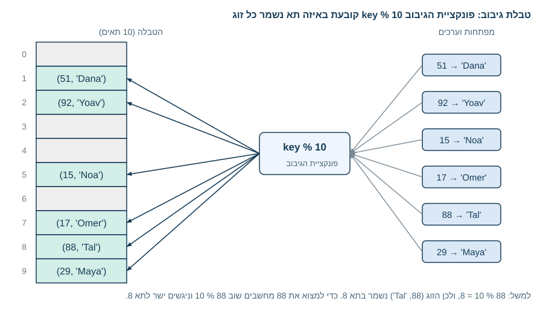
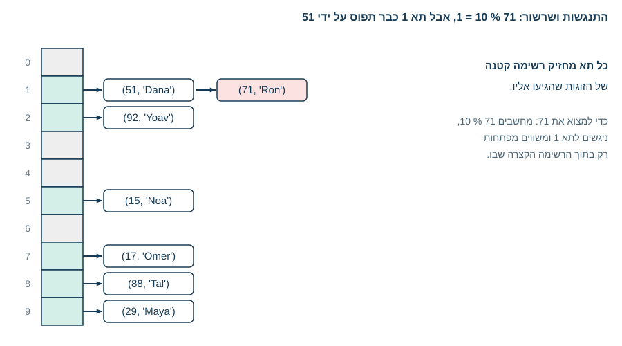
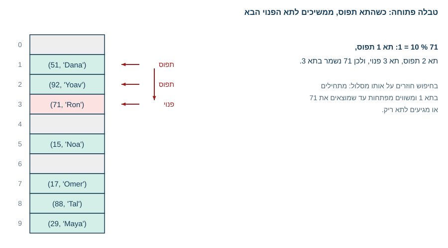

<!-- editorlm-hebrew-html-start -->
<style>
html, body, .vscode-body, .markdown-body, .markdown-preview, #write {
  direction: rtl !important; text-align: right !important;
}
ul, ol { padding-right: 2em !important; padding-left: 0 !important; }
blockquote { border-right: 3px solid #999; border-left: 0; padding-right: 1rem; padding-left: 0; }
@media print {
  html, body, .vscode-body, .markdown-body, .markdown-preview, #write {
    direction: rtl !important; text-align: right !important;
  }
}
</style>
<!-- editorlm-hebrew-html-end -->

<style>
.book { max-width: 900px; margin: auto; line-height: 1.8; font-family: Arial, sans-serif; }
.book .cover { min-height: 680px; box-sizing: border-box; padding: 64px 48px; margin: 24px 0 60px; background: #112b41; color: #f5f8fc; border-top: 9px solid #39c4b5; position: relative; }
.book .cover .eyebrow { color: #81e0d5; font-size: 15px; letter-spacing: 2px; }
.book .cover h1 { color: #fff; font-size: 48px; line-height: 1.3; border: 0; margin: 50px 0 18px; }
.book .cover .subtitle { font-size: 28px; color: #d8e6f0; }
.book .cover .author { font-size: 30px; color: #fff; margin-top: 52px; }
.book .cover .audience { color: #c1d3df; margin-top: 12px; }
.book .cover .motif { direction: ltr; text-align: left; font-family: Consolas, monospace; color: #81e0d5; font-size: 19px; margin-top: 54px; }
.book h1, .book h2, .book h3 { line-height: 1.4; font-weight: 700; }
.book > h1 { font-size: 32px !important; text-align: center !important; margin: 28px 0; }
.book h2 { font-size: 34px !important; text-align: center !important; color: #153b56 !important; background: #eef5fc; border: 0; border-bottom: 4px solid #299c91; border-radius: 10px 10px 0 0; padding: 28px 20px; margin: 24px 0 36px; }
.book h3 { font-size: 24px !important; text-align: right !important; color: #174e49 !important; background: #edf7f5; border: 0; border-right: 5px solid #299c91; border-radius: 6px; padding: 10px 16px; margin: 36px 0 18px; }
.book .chapter { height: 0; margin: 76px 0 0; border-top: 1px solid #ccd7df; break-before: page; page-break-before: always; break-after: avoid; page-break-after: avoid; }
.book .toc { padding: 24px; border-right: 5px solid #39a99d; background: rgba(70,150,155,.09); margin: 24px 0 48px; }
.book pre, .book pre code { direction: ltr !important; text-align: left !important; unicode-bidi: isolate; }
.book pre { box-sizing: border-box !important; width: 100% !important; max-width: 100% !important; margin: 0 !important; padding: 16px 20px; border: 1px solid #ccd7df; border-radius: 8px; line-height: 1.6; overflow-x: auto; }
.book code { direction: ltr; unicode-bidi: isolate; font-family: Consolas, "Courier New", monospace; }
.book pre { background: #f3f6fa !important; color: #1f2937 !important; }
.book pre code, .book pre code.hljs { background: transparent !important; color: #1f2937 !important; }
.book pre .hljs-keyword, .book pre .hljs-literal { color: #6f299c !important; }
.book pre .hljs-string { color: #216338 !important; }
.book pre .hljs-number { color: #075e68 !important; }
.book pre .hljs-comment { color: #526174 !important; }
.book pre .hljs-built_in, .book pre .hljs-title { color: #135b96 !important; }
.book table { width: 75%; max-width: 75%; margin: 18px auto; }
.book th, .book td { text-align: right; }
.book .small { font-size: .9em; opacity: .8; }
.book .python-intro { display: flex; align-items: center; gap: 28px; padding: 22px 28px; margin: 24px 0; background: #eef5fc; color: #183e63; border-right: 6px solid #3776ab; border-radius: 10px; }
.book .python-intro strong { font-size: 30px; }
.book .python-fact { background: #fff7d6; color: #423611; border-right: 6px solid #ffd343; border-radius: 8px; padding: 18px 24px; margin: 22px 0; }
.book .python-fact strong { font-size: 24px; }
.book img { max-width: 100%; height: auto; }
.book figure { margin: 24px auto; text-align: center; }
.book figure img { display: block; margin: auto; }
.book figcaption { direction: rtl; text-align: center; font-size: .9em; color: #445566; }
@media print { .book > h2 { break-before: page; page-break-before: always; } }
.book .screen-strip { width: 760px; max-width: 100%; height: 220px; overflow: hidden; border: 1px solid #bccad5; border-radius: 8px; margin: 20px auto 8px; direction: ltr; }
.book .screen-strip.output { height: 265px; }
.book .screen-strip img { display: block; width: 1745px; max-width: none; }
.book .screen-menu { width: 400px; max-width: 100%; height: 295px; overflow: hidden; direction: ltr; margin: 20px auto 8px; border: 1px solid #bccad5; border-radius: 8px; }
.book .screen-menu img { display: block; width: 1745px; max-width: none; }
.book .code-panel { box-sizing: border-box !important; display: block !important; width: 75% !important; max-width: 75% !important; margin: 18px auto !important; }
@media print {
  .book .cover { min-height: 85vh; break-after: page; print-color-adjust: exact; -webkit-print-color-adjust: exact; }
  .book pre { white-space: pre-wrap; break-inside: avoid; }
  .book .chapter { margin: 0; border: 0; }
  .book h1, .book h2, .book h3 { break-after: avoid; page-break-after: avoid; break-inside: avoid; }
  .book h2 { margin-top: 0; }
  .book h2, .book h3 { print-color-adjust: exact; -webkit-print-color-adjust: exact; }
}
</style>

<style>
.book .book-nav { display: flex; flex-wrap: wrap; gap: 10px; justify-content: center; align-items: center; padding: 16px 0; margin: 20px 0 32px; border-top: 1px solid #ccd7df; border-bottom: 1px solid #ccd7df; }
.book .book-nav a { display: inline-block; padding: 10px 18px; border-radius: 8px; background: #eef5fc; color: #153b56 !important; border: 1px solid #b5ccd9; text-decoration: none !important; font-size: 16px; font-weight: bold; }
.book .book-nav a.toc-link { background: #174e49; color: #fff !important; border-color: #174e49; }
.book .book-nav a:hover, .book .book-nav a:focus { background: #d4eee8; color: #153b56 !important; outline: 2px solid #299c91; outline-offset: 2px; }
.book .section-list { line-height: 2; }
@media print { .book .book-nav { display: none; } }

/* Explicit Hebrew direction, including prose beginning with English. */
.book p, .book ul, .book ol, .book li,
.book blockquote, .book h1, .book h2, .book h3,
.book h4, .book th, .book td {
  direction: rtl !important;
  text-align: right !important;
  unicode-bidi: isolate;
}
/* Chapter titles keep their agreed centered layout. */
.book h2 { text-align: center !important; }
.book pre, .book pre code, .book .code-panel {
  direction: ltr !important;
  text-align: left !important;
  unicode-bidi: isolate;
}
</style>

<style>
.book img { max-width: 100%; height: auto; object-fit: contain; }
.book .python-intro { display: flex; align-items: center; gap: 24px; padding: 22px; background: #edf7f5; border-radius: 12px; margin: 24px 0; color: #153b56; }
.book .python-intro img { width: 105px; height: auto; }
.book .python-fact { padding: 20px; background: #fff5ce; border-right: 5px solid #f0c444; border-radius: 8px; color: #153b56; }
.book .screen-menu, .book .screen-strip, .book .screen-strip.output { text-align: center; margin: 20px auto; max-width: 100%; height: auto !important; overflow: visible; }
.book .screen-menu img, .book .screen-strip img { width: auto; max-width: 100%; height: auto; }
.book h4 { font-size: 21px; color: #153b56; margin-top: 28px; }
@media print { .book > h2 { break-before: page; page-break-before: always; } }
</style>

<div class="book" dir="rtl" lang="he" style="direction: rtl !important; text-align: right !important;">


<div class="book" dir="rtl" lang="he" style="direction: rtl !important; text-align: right !important;">

<nav class="book-nav" aria-label="ניווט בפרקים">
<a href="16-%D7%97%D7%99%D7%A4%D7%95%D7%A9%20%D7%95%D7%9E%D7%99%D7%95%D7%9F.md">→ הקודם</a>
<a class="toc-link" href="../index.md#book-toc">תוכן העניינים</a>
<a href="18-%D7%9E%D7%97%D7%9C%D7%A7%D7%95%D7%AA.md">הבא ←</a>
</nav>

## א.17 — טבלאות גיבוב

בבניין דירות גדול הדוור אינו מחפש את השם של הדייר על כל תיבות הדואר. על המכתב כתוב מספר דירה, והמספר הזה מוביל ישירות לתיבה המתאימה: דירה 17, תיבה 17. לא משנה כמה דירות יש בבניין, מציאת התיבה אורכת אותו זמן. זהו בדיוק הרעיון שמאחורי **טבלת גיבוב — Hash Table**: במקום לחפש את המקום שבו נשמר נתון, **מחשבים** אותו מתוך המפתח.

בפרק הקודם ראינו שחיפוש ערך ברשימה דורש מעבר על האיברים, `O(n)`, ושחיפוש בינארי מקצר את העבודה ל־`O(log n)` אבל דורש רשימה ממוינת. בפרקים א.11 ו־א.12 השתמשנו במילון ובקבוצה, וגילינו שגישה לפי מפתח ובדיקת `in` מהירות מאוד גם כשהאוסף גדול. בפרק זה נבין מדוע: המילון והקבוצה בנויים על טבלת גיבוב, שבה הוספה, שליפה ועדכון לפי מפתח אורכות בממוצע זמן קבוע, `O(1)`, בלי תלות במספר האיברים. נכיר את פונקציית הגיבוב, נבנה טבלה קטנה בעצמנו, נראה מה קורה כששני מפתחות מגיעים לאותו מקום, ונחזור למילון ולקבוצה של פייתון עם הבנה של המנגנון שמאחוריהם.

**[מחברות האוניברסיטה הפתוחה — 11-מבני נתונים מתקדמים](https://drive.google.com/drive/folders/1yLN-J12Mq3KZ0i6XJwpaA3XMC6xoh4GJ?usp=sharing)**


### הרעיון: לחשב את המיקום במקום לחפש אותו

טבלת גיבוב מורכבת משני חלקים. הראשון הוא **מערך של תאים**, למשל רשימה באורך קבוע, שבכל תא שלה אפשר לשמור זוג של מפתח וערך. השני הוא **פונקציית גיבוב — Hash Function**: פונקציה שמקבלת מפתח ומחזירה אינדקס של תא במערך. הדרישה היחידה ממנה היא שתחזיר תמיד את אותו אינדקס עבור אותו מפתח, ושהאינדקס יהיה בתחום המערך.

הפונקציה הפשוטה ביותר למפתחות שהם מספרים שלמים היא **שארית החלוקה** בגודל המערך, הפעולה `%` שלמדנו בפרק א.3. במערך של 10 תאים, `key % 10` מחזירה תמיד מספר בין `0` ל־`9`: זו בדיוק ספרת האחדות של המפתח. נשמור בטבלה מספרי חברים במועדון ואת שמותיהם:

<div class="code-panel" dir="ltr" style="box-sizing: border-box !important; width: 75% !important; max-width: 75% !important; margin: 18px auto !important; direction: ltr !important; text-align: left !important;">

```python
SIZE = 10

def hash_index(key):
    return key % SIZE

members = [(51, "Dana"), (92, "Yoav"), (15, "Noa"),
           (17, "Omer"), (88, "Tal"), (29, "Maya")]

table = [None] * SIZE
for key, value in members:
    table[hash_index(key)] = (key, value)
print(table)
```

</div>

**פלט**

<div class="code-panel" dir="ltr" style="box-sizing: border-box !important; width: 75% !important; max-width: 75% !important; margin: 18px auto !important; direction: ltr !important; text-align: left !important;">

```text
[None, (51, 'Dana'), (92, 'Yoav'), None, None, (15, 'Noa'), None, (17, 'Omer'), (88, 'Tal'), (29, 'Maya')]
```

</div>

<figure>

<figcaption>פונקציית הגיבוב ממפה כל מפתח לתא: 51 לתא 1, 92 לתא 2, וכן הלאה. בכל תא נשמר הזוג המלא, המפתח והערך.</figcaption>
</figure>

כל זוג נשמר בתא שספרת האחדות של המפתח מצביעה עליו. כדי למצוא את השם של חבר מספר 88, אין צורך לעבור על הטבלה: מחשבים שוב `hash_index(88)`, מקבלים `8`, וניגשים ישירות לתא:

<div class="code-panel" dir="ltr" style="box-sizing: border-box !important; width: 75% !important; max-width: 75% !important; margin: 18px auto !important; direction: ltr !important; text-align: left !important;">

```python
print(table[hash_index(88)])
```

</div>

**פלט**

<div class="code-panel" dir="ltr" style="box-sizing: border-box !important; width: 75% !important; max-width: 75% !important; margin: 18px auto !important; direction: ltr !important; text-align: left !important;">

```text
(88, 'Tal')
```

</div>

שימו לב ששמרנו בתא גם את המפתח ולא רק את הערך. הסיבה תתברר מיד: כמה מפתחות שונים עשויים להגיע לאותו תא, ולכן צריך לוודא שהתא אכן מכיל את המפתח שחיפשנו.

### מדוע הגישה היא O(1)?

שליפה לפי מפתח דורשת שתי פעולות בלבד: חישוב של פונקציית הגיבוב, וגישה לתא אחד במערך לפי אינדקס. אף אחת מהן אינה תלויה במספר האיברים שבטבלה. בטבלה עם עשרה זוגות ובטבלה עם מיליון זוגות, מציאת המפתח 88 היא אותו חישוב ואותה גישה. לכן אומרים שהפעולה היא `O(1)`: זמן קבוע. אותו הדבר נכון להוספה ולעדכון: מחשבים את התא ושמים בו את הזוג.

ההשוואה לרשימה ממחישה את ההבדל. בדיקה אם ערך נמצא ברשימה של מיליון מספרים דורשת עד מיליון השוואות; בקבוצה, שבנויה על טבלת גיבוב, היא דורשת חישוב אחד וגישה אחת. אפשר למדוד זאת בעזרת המודול `time`, שמחזיר את הזמן הנוכחי בשניות: נבדוק אלף פעמים אם המספר האחרון נמצא ברשימה ובקבוצה, ונמדוד כמה זמן זה אורך.

<div class="code-panel" dir="ltr" style="box-sizing: border-box !important; width: 75% !important; max-width: 75% !important; margin: 18px auto !important; direction: ltr !important; text-align: left !important;">

```python
import time

numbers_list = list(range(1_000_000))
numbers_set = set(numbers_list)

start = time.time()
for i in range(1000):
    999_999 in numbers_list
print(f"list: {time.time() - start:.2f} seconds")

start = time.time()
for i in range(1000):
    999_999 in numbers_set
print(f"set: {time.time() - start:.2f} seconds")
```

</div>

**פלט**

<div class="code-panel" dir="ltr" style="box-sizing: border-box !important; width: 75% !important; max-width: 75% !important; margin: 18px auto !important; direction: ltr !important; text-align: left !important;">

```text
list: 3.34 seconds
set: 0.00 seconds
```

</div>

הזמנים המדויקים משתנים ממחשב למחשב, אבל היחס ביניהם נשמר: אלף בדיקות ברשימה נמשכו שניות, ואלף בדיקות בקבוצה הסתיימו מהר מכדי שנוכל למדוד. הכתיב `1_000_000` הוא רק דרך לכתוב מיליון בצורה קריאה; הקווים התחתונים אינם משנים את הערך.

### התנגשויות

מה קורה כשמצטרף למועדון חבר מספר 71? `71 % 10` הוא `1`, אבל בתא 1 כבר נמצא הזוג של 51. מצב שבו שני מפתחות שונים מקבלים אותו אינדקס נקרא **התנגשות — Collision**. התנגשויות הן בלתי נמנעות: לטבלה יש מספר קבוע של תאים, ומספר המפתחות האפשריים גדול ממנו בהרבה. לכן טבלת גיבוב אמיתית חייבת לדעת לטפל בהן. יש שתי גישות עיקריות.

#### שרשור: כל תא מחזיק רשימה

בגישה הראשונה, שנקראת **שרשור — Chaining** (במחברת הקורס: טבלה סגורה), כל תא במערך מחזיק רשימה קטנה של כל הזוגות שהגיעו אליו, במקום זוג יחיד. הוספה מצרפת את הזוג לרשימה של התא; שליפה מחשבת את התא ומשווה את המפתח לכל זוג ברשימה הקצרה שבו. נכתוב את שתי הפעולות:

<div class="code-panel" dir="ltr" style="box-sizing: border-box !important; width: 75% !important; max-width: 75% !important; margin: 18px auto !important; direction: ltr !important; text-align: left !important;">

```python
def insert(table, key, value):
    bucket = table[hash_index(key)]
    for i in range(len(bucket)):
        if bucket[i][0] == key:
            bucket[i] = (key, value)
            return
    bucket.append((key, value))

def get(table, key):
    bucket = table[hash_index(key)]
    for stored_key, value in bucket:
        if stored_key == key:
            return value
    return None

table = [[] for _ in range(SIZE)]
for key, value in members:
    insert(table, key, value)
insert(table, 71, "Ron")
print(table)
```

</div>

**פלט**

<div class="code-panel" dir="ltr" style="box-sizing: border-box !important; width: 75% !important; max-width: 75% !important; margin: 18px auto !important; direction: ltr !important; text-align: left !important;">

```text
[[], [(51, 'Dana'), (71, 'Ron')], [(92, 'Yoav')], [], [], [(15, 'Noa')], [], [(17, 'Omer')], [(88, 'Tal')], [(29, 'Maya')]]
```

</div>

<figure>

<figcaption>שרשור: תא 1 מחזיק שני זוגות, של 51 ושל 71. שליפה של 71 מגיעה ישירות לתא 1 ומשווה מפתחות רק בתוך הרשימה הקצרה שבו.</figcaption>
</figure>

ב־`insert`, הלולאה בודקת תחילה אם המפתח כבר קיים בתא, ואם כן מעדכנת את הערך במקום להוסיף זוג כפול; כך מתנהג גם מילון כשמציבים ערך למפתח קיים. הביטוי `[[] for _ in range(SIZE)]` יוצר עשר רשימות ריקות נפרדות; הכתיב `[[]] * SIZE` היה יוצר עשר הפניות לאותה רשימה אחת, בדומה לשני השמות לאותה רשימה שראינו בפרק א.10. נבדוק את השליפה:

<div class="code-panel" dir="ltr" style="box-sizing: border-box !important; width: 75% !important; max-width: 75% !important; margin: 18px auto !important; direction: ltr !important; text-align: left !important;">

```python
print(get(table, 71))
print(get(table, 51))
print(get(table, 33))
```

</div>

**פלט**

<div class="code-panel" dir="ltr" style="box-sizing: border-box !important; width: 75% !important; max-width: 75% !important; margin: 18px auto !important; direction: ltr !important; text-align: left !important;">

```text
Ron
Dana
None
```

</div>

המפתח 33 מוביל לתא 3, שרשימתו ריקה, ולכן מוחזר `None`: המפתח אינו בטבלה.

#### טבלה פתוחה: מחפשים את התא הפנוי הבא

בגישה השנייה, **טבלה פתוחה — Open Addressing**, כל תא מחזיק זוג אחד בלבד. כשהתא שחושב תפוס, מחפשים תא אחר לפי כלל קבוע מראש. הכלל הפשוט ביותר הוא לעבור לתא הבא, ושוב לבא אחריו, עד שמוצאים תא פנוי. בשליפה חוזרים על אותו מסלול בדיוק: מתחילים בתא שחושב ומשווים מפתחות עד שמוצאים את המפתח או מגיעים לתא ריק, שמעיד שהמפתח אינו בטבלה.

<figure>

<figcaption>טבלה פתוחה: 71 מגיע לתא 1, מוצא אותו תפוס, ממשיך לתא 2 ונשמר בתא 3, התא הפנוי הראשון אחריו.</figcaption>
</figure>

כלל אחר לבחירת התא הבא הוא הפעלה חוזרת של פונקציית גיבוב, שמפזרת את המפתחות המתנגשים במקום לרכז אותם בתאים סמוכים. בכל מקרה, כשהטבלה מתמלאת החיפוש אחר תא פנוי מתארך, ולכן מימושים אמיתיים מגדילים את המערך ומסדרים בו מחדש את כל הזוגות כשהוא נעשה צפוף מדי.

<!-- editorlm-source-ref: [sources/אוניברסיטה פתוחה/converted/11-מבני נתונים מתקדמים/notebook.md#L576-L676] -->

### מה קובע כמה התנגשויות יהיו?

ככל שיש פחות התנגשויות, הרשימות בתאים קצרות יותר והגישה קרובה יותר ל־`O(1)`. שני גורמים קובעים זאת.

- **גודל הטבלה ביחס למספר האיברים.** בטבלה של עשרה תאים עם מאה זוגות, לכל תא יגיעו בממוצע עשרה זוגות, וכל שליפה תצטרך לעבור עליהם. לכן שומרים על טבלה גדולה מספיק, ומגדילים אותה כשהיא מתמלאת.
- **איכות פונקציית הגיבוב.** פונקציה טובה מפזרת את המפתחות באופן אחיד על פני התאים. `key % 10` מתאימה למפתחות שספרת האחדות שלהם מגוונת, אבל אם כל מספרי החברים מסתיימים באפס, כולם יתנגשו בתא 0, והטבלה תתנוון לרשימה אחת ארוכה שבה החיפוש הוא `O(n)`.

זו הסיבה שאומרים שהגישה לטבלת גיבוב היא `O(1)` **בממוצע**: עם פונקציה סבירה וטבלה מרווחת זה המצב הרגיל, אבל במקרה הגרוע, כשכל המפתחות מתנגשים, הפעולה עלולה לדרוש מעבר על כל האיברים.

| פעולה | בממוצע | במקרה הגרוע |
|---|---|---|
| חיפוש לפי מפתח | `O(1)` | `O(n)` |
| הכנסה | `O(1)` | `O(n)` |
| הסרה | `O(1)` | `O(n)` |

### גיבוב של מחרוזות ושל ערכים אחרים

עד כה המפתחות היו מספרים שלמים, שאפשר לחשב מהם שארית ישירות. כדי להשתמש במפתחות מסוג אחר, למשל שמות, צריך פונקציית גיבוב שהופכת את המפתח למספר. דרך פשוטה למחרוזת היא לסכום את קודי התווים באמצעות `ord`, שלמדנו בפרק א.4, ולקחת שארית:

<div class="code-panel" dir="ltr" style="box-sizing: border-box !important; width: 75% !important; max-width: 75% !important; margin: 18px auto !important; direction: ltr !important; text-align: left !important;">

```python
def string_hash(text):
    total = 0
    for char in text:
        total += ord(char)
    return total % SIZE

for name in ["Dana", "Yoav", "Noa", "Maya"]:
    print(name, string_hash(name))
```

</div>

**פלט**

<div class="code-panel" dir="ltr" style="box-sizing: border-box !important; width: 75% !important; max-width: 75% !important; margin: 18px auto !important; direction: ltr !important; text-align: left !important;">

```text
Dana 2
Yoav 5
Noa 6
Maya 2
```

</div>

עכשיו אפשר לבנות טבלה שהמפתחות שלה הם שמות והערכים מספרי טלפון. שימו לב ש־`Dana` ו־`Maya` קיבלו אותו אינדקס, `2`: התנגשות, בדיוק כמו עם המספרים, וטבלה אמיתית תטפל בה באחת הדרכים שראינו. פונקציה שסוכמת תווים היא גם פונקציה חלשה: כל שתי מחרוזות שמורכבות מאותן אותיות בסדר שונה מתנגשות. פונקציות הגיבוב שפייתון משתמשת בהן מתוחכמות בהרבה, ומפזרות את המפתחות היטב.

לפייתון יש פונקציה מובנית בשם `hash`, שמחזירה את מספר הגיבוב של ערך. עבור מספר שלם קטן התוצאה היא המספר עצמו; עבור מחרוזות התוצאה משתנה בין הרצות, ולכן לא נדפיס אותה. חשוב יותר מה קורה עם רשימה:

<div class="code-panel" dir="ltr" style="box-sizing: border-box !important; width: 75% !important; max-width: 75% !important; margin: 18px auto !important; direction: ltr !important; text-align: left !important;">

```python
print(hash(42))
try:
    hash([1, 2, 3])
except TypeError as error:
    print(error)
```

</div>

**פלט**

<div class="code-panel" dir="ltr" style="box-sizing: border-box !important; width: 75% !important; max-width: 75% !important; margin: 18px auto !important; direction: ltr !important; text-align: left !important;">

```text
42
unhashable type: 'list'
```

</div>

רשימה אינה ניתנת לגיבוב, וכעת אפשר להבין מדוע. מספר הגיבוב מחושב מתוכן הערך. אילו שמרנו רשימה כמפתח ואחר כך שינינו את תוכנה, מספר הגיבוב שלה היה משתנה, והזוג היה נשאר בתא הישן, במקום שבו איש לא יחפש אותו. לכן פייתון מרשה כמפתחות רק ערכים שאינם משתנים: מספרים, מחרוזות וטאפלים של ערכים כאלה. זהו הכלל שפגשנו בפרקים א.11 ו־א.12 בלי הסבר.

### מילון וקבוצה הם טבלאות גיבוב

עכשיו אפשר לסגור את המעגל. **מילון** בפייתון הוא טבלת גיבוב שבה כל מפתח עובר דרך `hash`, והזוג של המפתח והערך נשמר בתא המתאים; זו הסיבה שהגישה `phones["Dana"]` מהירה גם במילון ענק, ושמפתח חייב להיות ערך שאינו משתנה. **קבוצה** היא טבלת גיבוב שבה שומרים מפתחות בלבד, בלי ערכים, ולכן בדיקת `in` בקבוצה היא `O(1)`, בעוד שאותה בדיקה ברשימה היא `O(n)`.

מכאן נובע כלל מעשי: כשצריך לבדוק שוב ושוב אם ערך נמצא באוסף, או לשלוף נתון לפי מזהה, מילון או קבוצה יהיו מהירים בהרבה מרשימה. לעומת זאת, חיפוש לפי **ערך** במילון, למשל מציאת המפתח שהערך שלו הוא מספר טלפון מסוים, אינו נהנה מהגיבוב ודורש מעבר על כל הזוגות: המנגנון מהיר רק בכיוון שממפתח אל ערך.

<!-- editorlm-source-ref: [sources/אוניברסיטה פתוחה/converted/11-מבני נתונים מתקדמים/notebook.md#L576-L676] -->

<nav class="book-nav" aria-label="ניווט בפרקים">
<a href="16-%D7%97%D7%99%D7%A4%D7%95%D7%A9%20%D7%95%D7%9E%D7%99%D7%95%D7%9F.md">→ הקודם</a>
<a class="toc-link" href="../index.md#book-toc">תוכן העניינים</a>
<a href="18-%D7%9E%D7%97%D7%9C%D7%A7%D7%95%D7%AA.md">הבא ←</a>
</nav>

</div>

<!-- editorlm-source-versions: {"schemaVersion": 1, "sources": {"sources/אוניברסיטה פתוחה/converted/11-מבני נתונים מתקדמים/notebook.md": {"sourceSha256": "f7509e4035df5b42e87d3f3aa435502c09fdef179928cd43262c16a77c1734b9", "canonicalTextSha256": "f7509e4035df5b42e87d3f3aa435502c09fdef179928cd43262c16a77c1734b9"}}} -->
