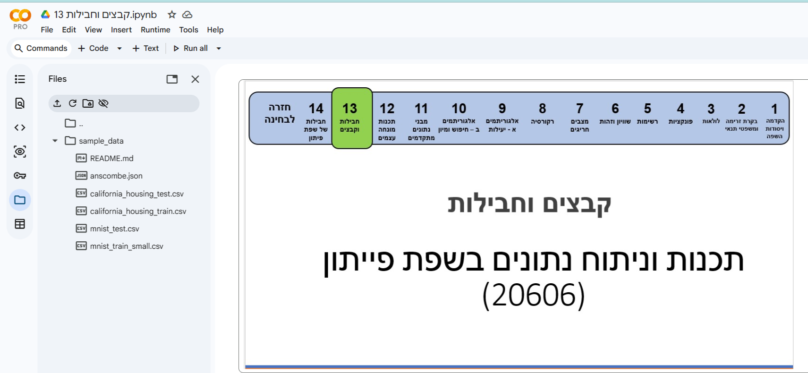

<!-- editorlm-hebrew-html-start -->
<style>
html, body, .vscode-body, .markdown-body, .markdown-preview, #write {
  direction: rtl !important; text-align: right !important;
}
ul, ol { padding-right: 2em !important; padding-left: 0 !important; }
blockquote { border-right: 3px solid #999; border-left: 0; padding-right: 1rem; padding-left: 0; }
@media print {
  html, body, .vscode-body, .markdown-body, .markdown-preview, #write {
    direction: rtl !important; text-align: right !important;
  }
}
</style>
<!-- editorlm-hebrew-html-end -->

<style>
.book { max-width: 900px; margin: auto; line-height: 1.8; font-family: Arial, sans-serif; }
.book .cover { min-height: 680px; box-sizing: border-box; padding: 64px 48px; margin: 24px 0 60px; background: #112b41; color: #f5f8fc; border-top: 9px solid #39c4b5; position: relative; }
.book .cover .eyebrow { color: #81e0d5; font-size: 15px; letter-spacing: 2px; }
.book .cover h1 { color: #fff; font-size: 48px; line-height: 1.3; border: 0; margin: 50px 0 18px; }
.book .cover .subtitle { font-size: 28px; color: #d8e6f0; }
.book .cover .author { font-size: 30px; color: #fff; margin-top: 52px; }
.book .cover .audience { color: #c1d3df; margin-top: 12px; }
.book .cover .motif { direction: ltr; text-align: left; font-family: Consolas, monospace; color: #81e0d5; font-size: 19px; margin-top: 54px; }
.book h1, .book h2, .book h3 { line-height: 1.4; font-weight: 700; }
.book > h1 { font-size: 32px !important; text-align: center !important; margin: 28px 0; }
.book h2 { font-size: 34px !important; text-align: center !important; color: #153b56 !important; background: #eef5fc; border: 0; border-bottom: 4px solid #299c91; border-radius: 10px 10px 0 0; padding: 28px 20px; margin: 24px 0 36px; }
.book h3 { font-size: 24px !important; text-align: right !important; color: #174e49 !important; background: #edf7f5; border: 0; border-right: 5px solid #299c91; border-radius: 6px; padding: 10px 16px; margin: 36px 0 18px; }
.book .chapter { height: 0; margin: 76px 0 0; border-top: 1px solid #ccd7df; break-before: page; page-break-before: always; break-after: avoid; page-break-after: avoid; }
.book .toc { padding: 24px; border-right: 5px solid #39a99d; background: rgba(70,150,155,.09); margin: 24px 0 48px; }
.book pre, .book pre code { direction: ltr !important; text-align: left !important; unicode-bidi: isolate; }
.book pre { box-sizing: border-box !important; width: 100% !important; max-width: 100% !important; margin: 0 !important; padding: 16px 20px; border: 1px solid #ccd7df; border-radius: 8px; line-height: 1.6; overflow-x: auto; }
.book code { direction: ltr; unicode-bidi: isolate; font-family: Consolas, "Courier New", monospace; }
.book pre { background: #f3f6fa !important; color: #1f2937 !important; }
.book pre code, .book pre code.hljs { background: transparent !important; color: #1f2937 !important; }
.book pre .hljs-keyword, .book pre .hljs-literal { color: #6f299c !important; }
.book pre .hljs-string { color: #216338 !important; }
.book pre .hljs-number { color: #075e68 !important; }
.book pre .hljs-comment { color: #526174 !important; }
.book pre .hljs-built_in, .book pre .hljs-title { color: #135b96 !important; }
.book table { width: 100%; }
.book th, .book td { text-align: right; }
.book .small { font-size: .9em; opacity: .8; }
.book .python-intro { display: flex; align-items: center; gap: 28px; padding: 22px 28px; margin: 24px 0; background: #eef5fc; color: #183e63; border-right: 6px solid #3776ab; border-radius: 10px; }
.book .python-intro strong { font-size: 30px; }
.book .python-fact { background: #fff7d6; color: #423611; border-right: 6px solid #ffd343; border-radius: 8px; padding: 18px 24px; margin: 22px 0; }
.book .python-fact strong { font-size: 24px; }
.book img { max-width: 100%; height: auto; }
.book figure { margin: 24px auto; text-align: center; }
.book figure img { display: block; margin: auto; }
.book figcaption { direction: rtl; text-align: center; font-size: .9em; color: #445566; }
@media print { .book > h2 { break-before: page; page-break-before: always; } }
.book .screen-strip { width: 760px; max-width: 100%; height: 220px; overflow: hidden; border: 1px solid #bccad5; border-radius: 8px; margin: 20px auto 8px; direction: ltr; }
.book .screen-strip.output { height: 265px; }
.book .screen-strip img { display: block; width: 1745px; max-width: none; }
.book .screen-menu { width: 400px; max-width: 100%; height: 295px; overflow: hidden; direction: ltr; margin: 20px auto 8px; border: 1px solid #bccad5; border-radius: 8px; }
.book .screen-menu img { display: block; width: 1745px; max-width: none; }
.book .code-panel { box-sizing: border-box !important; display: block !important; width: 75% !important; max-width: 75% !important; margin: 18px auto !important; }
@media print {
  .book .cover { min-height: 85vh; break-after: page; print-color-adjust: exact; -webkit-print-color-adjust: exact; }
  .book pre { white-space: pre-wrap; break-inside: avoid; }
  .book .chapter { margin: 0; border: 0; }
  .book h1, .book h2, .book h3 { break-after: avoid; page-break-after: avoid; break-inside: avoid; }
  .book h2 { margin-top: 0; }
  .book h2, .book h3 { print-color-adjust: exact; -webkit-print-color-adjust: exact; }
}
</style>

<style>
.book .book-nav { display: flex; flex-wrap: wrap; gap: 10px; justify-content: center; align-items: center; padding: 16px 0; margin: 20px 0 32px; border-top: 1px solid #ccd7df; border-bottom: 1px solid #ccd7df; }
.book .book-nav a { display: inline-block; padding: 10px 18px; border-radius: 8px; background: #eef5fc; color: #153b56 !important; border: 1px solid #b5ccd9; text-decoration: none !important; font-size: 16px; font-weight: bold; }
.book .book-nav a.toc-link { background: #174e49; color: #fff !important; border-color: #174e49; }
.book .book-nav a:hover, .book .book-nav a:focus { background: #d4eee8; color: #153b56 !important; outline: 2px solid #299c91; outline-offset: 2px; }
.book .section-list { line-height: 2; }
@media print { .book .book-nav { display: none; } }

/* Explicit Hebrew direction, including prose beginning with English. */
.book p, .book ul, .book ol, .book li,
.book blockquote, .book h1, .book h2, .book h3,
.book h4, .book th, .book td {
  direction: rtl !important;
  text-align: right !important;
  unicode-bidi: isolate;
}
/* Chapter titles keep their agreed centered layout. */
.book h2 { text-align: center !important; }
.book pre, .book pre code, .book .code-panel {
  direction: ltr !important;
  text-align: left !important;
  unicode-bidi: isolate;
}
</style>

<style>
.book img { max-width: 100%; height: auto; object-fit: contain; }
.book .python-intro { display: flex; align-items: center; gap: 24px; padding: 22px; background: #edf7f5; border-radius: 12px; margin: 24px 0; color: #153b56; }
.book .python-intro img { width: 105px; height: auto; }
.book .python-fact { padding: 20px; background: #fff5ce; border-right: 5px solid #f0c444; border-radius: 8px; color: #153b56; }
.book .screen-menu, .book .screen-strip, .book .screen-strip.output { text-align: center; margin: 20px auto; max-width: 100%; height: auto !important; overflow: visible; }
.book .screen-menu img, .book .screen-strip img { width: auto; max-width: 100%; height: auto; }
.book h4 { font-size: 21px; color: #153b56; margin-top: 28px; }
@media print { .book > h2 { break-before: page; page-break-before: always; } }
</style>

<div class="book" dir="rtl" lang="he" style="direction: rtl !important; text-align: right !important;">

<nav class="book-nav" aria-label="ניווט בפרקים">
<a href="19-%D7%99%D7%A8%D7%95%D7%A9%D7%94.md">→ הקודם</a>
<a class="toc-link" href="../index.md#book-toc">תוכן העניינים</a>
<a href="21-NumPy.md">הבא ←</a>
</nav>

## א.20 — קבצים — קריאה וכתיבה

כל המשתנים, הרשימות והאובייקטים שיצרנו עד כה נשמרים בזיכרון של התוכנית, ונעלמים ברגע שהיא מסתיימת. משחק ששומר טבלת שיאים, או תוכנית שמעבדת נתונים שנאספו במקום אחר, זקוקים למידע שנשאר גם אחרי סיום ההרצה. לשם כך שומרים אותו בקובץ: למשל רשימת שמות, תוצאות משחק או טבלה. בהמשך הספר נקרא מקבצים גם את הנתונים שעליהם נאמן מודלים, ונשמור בקבצים את המודלים המאומנים.

עבודה עם קובץ נעשית תמיד באותו דפוס: התוכנית **פותחת** קובץ, **קוראת** ממנו או **כותבת** בו, ו**סוגרת** אותו בסיום. בפרק זה נלמד תחילה היכן הקבצים נמצאים כשעובדים ב־Colab, נבחין בין קובצי טקסט לקבצים בינאריים, ואז נלמד את הפעולות עצמן לפי הסדר הזה: פתיחה וסגירה, מצבי פתיחה, קריאה, כתיבה ומיקום הקריאה בקובץ. בסוף הפרק נשתמש בכל אלה כדי לקרוא טבלת נתונים אמיתית.

**[מחברות האוניברסיטה הפתוחה — 13 קבצים וחבילות](https://drive.google.com/drive/folders/1yLN-J12Mq3KZ0i6XJwpaA3XMC6xoh4GJ?usp=sharing)**

### קבצים ב־Colab

לפני שפותחים קובץ צריך להבין היכן הוא נמצא. המחברת ב־Colab אינה רצה במחשב שלכם אלא במחשב של Google, הנקרא **סביבת הריצה**. כשקוד במחברת פותח קובץ, הוא מחפש אותו במחשב הזה. לכן קובץ שנמצא על שולחן העבודה שלכם אינו זמין למחברת עד שמעבירים אותו לסביבת הריצה.

**היכן הקבצים נמצאים.** תיקיית העבודה של המחברת היא `/content`. בתוכה Colab יוצרת תיקייה בשם `sample_data` עם כמה קובצי דוגמה, ובה נשמור גם את קובצי התרגול שלנו. נתיב כגון `/content/sample_data/hello_world.txt` מציין את הקובץ `hello_world.txt` שבתיקייה זו. הנתיב מתחיל בלוכסן ומופרד בלוכסנים, כמקובל במערכת Linux שעליה פועלת סביבת הריצה.

**חלונית הקבצים.** בסרגל שבצד שמאל של המחברת יש סמל של תיקייה. לחיצה עליו פותחת את חלונית הקבצים, שבה רואים את תיקיית `/content` ואת מה שיש בה:

<figure>

<figcaption>חלונית הקבצים פתוחה לצד המחברת: סמל התיקייה מודגש בסרגל השמאלי, ובחלונית רואים את תיקיית sample_data ואת קובצי הדוגמה שבה.</figcaption>
</figure>

בחלונית הזו אפשר להעלות קובץ מהמחשב האישי בלחיצה על סמל ההעלאה, לרענן את התצוגה אחרי שהקוד יצר קובץ חדש, ולהוריד קובץ למחשב האישי בלחיצה ימנית עליו ובחירת Download. אפשר גם לפתוח קובץ טקסט לצפייה בלחיצה כפולה.

**הורדת קובצי התרגול בקוד.** בפרק זה נשתמש בשלושה קבצים: טבלת נוסעי הטיטאניק, ספר „אליס בארץ הפלאות” ותמונה. במקום להעלות אותם ידנית, המחברת מורידה אותם מהאינטרנט ישירות לתיקיית `sample_data` באמצעות הספרייה `urllib`. הריצו תא זה בתחילת העבודה:

<div class="code-panel" dir="ltr" style="box-sizing: border-box !important; width: 75% !important; max-width: 75% !important; margin: 18px auto !important; direction: ltr !important; text-align: left !important;">

```python
import urllib.request

titanic_csv = "https://drive.google.com/uc?export=download&id=11wvh-YNx-rlxsduR3Ft98i2BUh17JVCu"
alice_txt = "https://drive.google.com/uc?export=download&id=11u401jy4N3_tM3UuKVlgtAWvdUqszxYa"
openu_jpeg = "https://drive.google.com/uc?export=download&id=12-GF-17FDcjnqiYa6OxhLWDR9gbZl2Ug"
save_path = "/content/sample_data/"

urllib.request.urlretrieve(titanic_csv, save_path + "titanic.csv")
urllib.request.urlretrieve(alice_txt, save_path + "alice_in_wonderland.txt")
urllib.request.urlretrieve(openu_jpeg, save_path + "openu.jpeg")
print("Files downloaded to", save_path)
```

</div>

**פלט**

<div class="code-panel" dir="ltr" style="box-sizing: border-box !important; width: 75% !important; max-width: 75% !important; margin: 18px auto !important; direction: ltr !important; text-align: left !important;">

```text
Files downloaded to /content/sample_data/
```

</div>

הפונקציה `urlretrieve` מקבלת כתובת אינטרנט ונתיב שמירה, ומורידה את הקובץ. אחרי ההרצה לחצו על סמל הרענון בחלונית הקבצים ותראו את שלושת הקבצים בתוך `sample_data`.

**הקבצים זמניים.** המחברת עצמה נשמרת ב־Drive, אבל סביבת הריצה אינה נשמרת: כשמתנתקים ממנה, למשל אחרי זמן ללא פעילות, כל הקבצים שהעליתם או יצרתם בה נמחקים. לכן בכל חיבור מחדש מריצים שוב את תא ההורדה, וקובץ שנוצר בקוד ורוצים לשמור מורידים למחשב האישי או מעתיקים ל־Drive לפני הסגירה.

### סוגי קבצים — טקסט ובינארי

כל המידע במחשב, כולל תוכן הקבצים, נשמר כרצף של **בתים — Bytes**, וכל בית מורכב משמונה סיביות. השאלה היא מה כל בית מייצג, ולפי התשובה מחלקים את הקבצים לשני סוגים:

- **קובצי טקסט**: כל בית, או קבוצה קטנה של בתים, מייצג תו אחד לפי טבלת קודים מוסכמת. תוכן הקובץ הוא רצף של תווים, ולכן כל עורך טקסט מציג אותו כמו שהוא. ראינו בפרק א.4 שלכל תו יש מספר ב־ASCII וב־Unicode; קובץ טקסט שומר את המספרים האלה.
- **קבצים בינאריים**: הבתים מייצגים מידע לפי מבנה שתלוי בסוג הקובץ, למשל צבעי הפיקסלים בתמונה, צלילים בקובץ שמע או קוד מהודר. בלי לדעת את המבנה, הפורמט, אי אפשר לפענח את התוכן, ופתיחה בעורך טקסט מציגה ג׳יבריש.

הכלל שמתרגם תווים לבתים ובחזרה נקרא **קידוד — Encoding**. הקידוד הנפוץ כיום הוא UTF-8: תווי ASCII כמו אותיות באנגלית וספרות תופסים בו בית אחד, ותווים אחרים, כולל אותיות עבריות, תופסים כמה בתים. כדי שפייתון תקרא ותכתוב עברית כראוי, נציין את הקידוד במפורש בכל פתיחה של קובץ טקסט באמצעות `encoding="utf-8"`.

מקובל לציין את סוג הקובץ בסיומת שמו: `txt` לטקסט פשוט, `csv` לטבלה בטקסט, `png` ו־`jpeg` לתמונות, `pdf` למסמכים. הסיומת היא מוסכמה בלבד ואינה משנה את התוכן: אפשר לשנות את שם הקובץ בלי לשנות את הבתים שבו.

### פתיחה וסגירה — open ו־close

כדי לקרוא מקובץ או לכתוב בו, צריך קודם **לפתוח** אותו באמצעות הפונקציה `open`. היא מקבלת את נתיב הקובץ ואת **מצב הפתיחה**, שאומר למערכת ההפעלה מה בכוונתנו לעשות: `"w"` לכתיבה, `"r"` לקריאה. הפונקציה מחזירה **אובייקט קובץ**, ודרכו מבצעים את הפעולות: `write` כותבת מחרוזת, `read` קוראת. בסיום העבודה **סוגרים** את הקובץ בקריאה ל־`close`. נכתוב קובץ ראשון:

<div class="code-panel" dir="ltr" style="box-sizing: border-box !important; width: 75% !important; max-width: 75% !important; margin: 18px auto !important; direction: ltr !important; text-align: left !important;">

```python
hello_path = "/content/sample_data/hello_world.txt"

file = open(hello_path, "w", encoding="utf-8")   # open for writing
file.write("Hello, World!")                       # write to the file
file.close()                                      # close the file
```

</div>

לאחר ההרצה לחצו על סמל הרענון בחלונית הקבצים: הקובץ `hello_world.txt` נוצר בתוך `sample_data`, ולחיצה כפולה עליו מציגה את הטקסט. עכשיו נפתח את אותו הקובץ לקריאה. הפעולה `read` מחזירה את כל תוכן הקובץ כמחרוזת אחת:

<div class="code-panel" dir="ltr" style="box-sizing: border-box !important; width: 75% !important; max-width: 75% !important; margin: 18px auto !important; direction: ltr !important; text-align: left !important;">

```python
file = open(hello_path, "r", encoding="utf-8")   # open for reading
content = file.read()                             # read the whole file
file.close()
print(content)
```

</div>

**פלט**

<div class="code-panel" dir="ltr" style="box-sizing: border-box !important; width: 75% !important; max-width: 75% !important; margin: 18px auto !important; direction: ltr !important; text-align: left !important;">

```text
Hello, World!
```

</div>

מדוע הסגירה חשובה? קובץ פתוח הוא משאב של מערכת ההפעלה. כל עוד הוא פתוח, תוכניות אחרות עלולות להיחסם מגישה אליו. חשוב מזה: מטעמי יעילות, טקסט שנכתב אינו נשמר מיד בדיסק אלא נאסף בזיכרון זמני, ורק הסגירה מבטיחה שכל מה שנכתב אכן הגיע לקובץ. תוכנית ששוכחת לסגור קובץ עלולה להשאיר אותו חסר או פגום.

### מצבי פתיחה — mode

הפרמטר השני של `open` קובע מה מותר לעשות בקובץ ומה קורה לתוכן שכבר יש בו. ארבעת המצבים הבסיסיים לקובצי טקסט:

| מצב | שם | מה קורה |
|---|---|---|
| `r` | קריאה — Read | פותח קובץ קיים לקריאה בלבד. אם הקובץ אינו קיים, נוצרת שגיאה. זהו מצב ברירת המחדל כשלא מציינים מצב. |
| `w` | כתיבה — Write | פותח לכתיבה. **אם הקובץ קיים, תוכנו נמחק**; אם אינו קיים, הוא נוצר. |
| `a` | הוספה — Append | פותח לכתיבה בסוף הקובץ, בלי למחוק את התוכן הקיים. אם הקובץ אינו קיים, הוא נוצר. |
| `x` | יצירה בלעדית — Exclusive | יוצר קובץ חדש לכתיבה. אם הקובץ כבר קיים, נוצרת שגיאה. |

הוספת הסימן `+` לכל אחד מהמצבים מאפשרת גם קריאה וגם כתיבה באותה פתיחה: `r+` פותח קובץ קיים לקריאה ולכתיבה בלי למחוק אותו; `w+` מוחק את התוכן ומאפשר לכתוב ולקרוא; `a+` מוסיף בסוף ומאפשר גם לקרוא; `x+` יוצר קובץ חדש לקריאה ולכתיבה.

המצב `x` שימושי כשרוצים להיזהר לא לדרוס קובץ קיים בטעות. הקובץ `hello_world.txt` כבר קיים, ולכן הניסיון הבא נכשל בשגיאה:

<div class="code-panel" dir="ltr" style="box-sizing: border-box !important; width: 75% !important; max-width: 75% !important; margin: 18px auto !important; direction: ltr !important; text-align: left !important;">

```python
file = open(hello_path, "x", encoding="utf-8")
```

</div>

**פלט**

<div class="code-panel" dir="ltr" style="box-sizing: border-box !important; width: 75% !important; max-width: 75% !important; margin: 18px auto !important; direction: ltr !important; text-align: left !important;">

```text
FileExistsError: [Errno 17] File exists: '/content/sample_data/hello_world.txt'
```

</div>

לעומת זאת, המצב `a` מוסיף לקובץ הקיים. נוסיף שורה שנייה לקובץ ונקרא אותו מחדש. `\n` בתחילת המחרוזת הוא תו ירידת שורה, ובלעדיו הטקסט החדש היה נצמד לסוף השורה הקודמת:

<div class="code-panel" dir="ltr" style="box-sizing: border-box !important; width: 75% !important; max-width: 75% !important; margin: 18px auto !important; direction: ltr !important; text-align: left !important;">

```python
file = open(hello_path, "a", encoding="utf-8")
file.write("\nit is a wonderful day")
file.close()

file = open(hello_path, "r", encoding="utf-8")
print(file.read())
file.close()
```

</div>

**פלט**

<div class="code-panel" dir="ltr" style="box-sizing: border-box !important; width: 75% !important; max-width: 75% !important; margin: 18px auto !important; direction: ltr !important; text-align: left !important;">

```text
Hello, World!
it is a wonderful day
```

</div>

**מצב בינארי.** הוספת האות `b` למצב, למשל `rb` או `wb`, פותחת את הקובץ במצב בינארי: קוראים וכותבים בתים ולא תווים, ולכן לא מציינים `encoding`. כך פותחים תמונות, קובצי שמע ומודלים שמורים. נקרא את עשרת הבתים הראשונים של התמונה שהורדנו:

<div class="code-panel" dir="ltr" style="box-sizing: border-box !important; width: 75% !important; max-width: 75% !important; margin: 18px auto !important; direction: ltr !important; text-align: left !important;">

```python
image_path = "/content/sample_data/openu.jpeg"
file = open(image_path, "rb")
print(file.read(10))
file.close()
```

</div>

**פלט**

<div class="code-panel" dir="ltr" style="box-sizing: border-box !important; width: 75% !important; max-width: 75% !important; margin: 18px auto !important; direction: ltr !important; text-align: left !important;">

```text
b'\xff\xd8\xff\xe0\x00\x10JFIF'
```

</div>

התוצאה היא אובייקט מסוג `bytes`, ולכן היא מודפסת עם הקידומת `b`. בית שמתאים לתו ASCII קריא מוצג כתו, כמו האותיות JFIF, וכל בית אחר מוצג כמספר הקסדצימלי כגון `\xff`. הבתים הראשונים האלה הם „חתימה” שמזהה קובץ JPEG; כל פורמט בינארי מתחיל בחתימה משלו, וכך תוכנות מזהות את סוג הקובץ גם בלי הסיומת.

### with — סגירה אוטומטית

בדוגמאות עד כה סגרנו כל קובץ בעצמנו. הבעיה: קל לשכוח את `close`, וגם כשלא שוכחים, אם נוצרה חריגה בין הפתיחה לסגירה, שורת הסגירה כלל לא מתבצעת והקובץ נשאר פתוח. פייתון מציעה לכך פתרון מובנה: הפקודה `with`. כותבים את הפתיחה אחרי `with`, נותנים לאובייקט הקובץ שם אחרי `as`, ומבצעים את העבודה בבלוק מוזח. ביציאה מהבלוק פייתון סוגרת את הקובץ בעצמה, גם אם הבלוק הסתיים בחריגה. זו הדרך הנוחה לסגירה שהזכרנו בפרק א.14 כשלמדנו על `finally`:

<div class="code-panel" dir="ltr" style="box-sizing: border-box !important; width: 75% !important; max-width: 75% !important; margin: 18px auto !important; direction: ltr !important; text-align: left !important;">

```python
with open(hello_path, "r", encoding="utf-8") as f:   # open for reading
    content = f.read()
print(content)
```

</div>

**פלט**

<div class="code-panel" dir="ltr" style="box-sizing: border-box !important; width: 75% !important; max-width: 75% !important; margin: 18px auto !important; direction: ltr !important; text-align: left !important;">

```text
Hello, World!
it is a wonderful day
```

</div>

`with` אינה מצב פתיחה חדש ואינה משנה את `open`; היא רק דואגת לסגירה. אחרי הבלוק המשתנה `content` עדיין קיים, אבל הקובץ `f` כבר סגור. מכאן והלאה נשתמש ב־`with` בכל פתיחת קובץ, וכך מקובל לכתוב בפייתון.

### חריגות בעבודה עם קבצים

קובץ הוא משאב מחוץ לתוכנית, ולכן דברים רבים יכולים להשתבש בלי קשר לקוד שלנו: הקובץ אינו קיים, אין הרשאה לקרוא אותו, הדיסק מלא או פגום. כל אחד מהמצבים האלה יוצר חריגה מהסוג שלמדנו לטפל בו בפרק א.14. ניסיון לקרוא קובץ שאינו קיים יוצר `FileNotFoundError`, וחוסר הרשאה יוצר `PermissionError`:

<div class="code-panel" dir="ltr" style="box-sizing: border-box !important; width: 75% !important; max-width: 75% !important; margin: 18px auto !important; direction: ltr !important; text-align: left !important;">

```python
error_path = "/content/sample_data/error.txt"
try:
    with open(error_path, "r", encoding="utf-8") as f:
        content = f.read()
        print(content)
except FileNotFoundError:
    print("Error: The file does not exist.")
except PermissionError:
    print("Error: You do not have permission to read the file.")
except Exception as e:
    print(f"An unexpected error occurred: {e}")
```

</div>

**פלט**

<div class="code-panel" dir="ltr" style="box-sizing: border-box !important; width: 75% !important; max-width: 75% !important; margin: 18px auto !important; direction: ltr !important; text-align: left !important;">

```text
Error: The file does not exist.
```

</div>

לאחר הטיפול בחריגה אין להניח ש־`content` קיבל ערך, שכן ההשמה לא התבצעה. בדוגמאות הבאות נשמיט את `try` לטובת בהירות, אך בתוכנית אמיתית כל עבודה עם קבצים צריכה לטפל בחריגות.

### קריאה מהקובץ

אובייקט הקובץ מציע כמה דרכי קריאה, לפי מה שנוח לתוכנית: הכול בבת אחת, שורה אחת בכל פעם, או רשימה של שורות.

**`read()`** ללא פרמטר קוראת את כל תוכן הקובץ, כפי שראינו. **`read(n)`** קוראת רק `n` ערכים: בקובץ טקסט `n` תווים, בקובץ בינארי `n` בתים. קריאה אינה מתחילה מחדש בכל פעם: הקובץ זוכר עד לאן קראנו, וכל קריאה ממשיכה מהמקום שבו הקודמת הסתיימה:

<div class="code-panel" dir="ltr" style="box-sizing: border-box !important; width: 75% !important; max-width: 75% !important; margin: 18px auto !important; direction: ltr !important; text-align: left !important;">

```python
with open(hello_path, "r", encoding="utf-8") as f:
    content1 = f.read(5)    # first 5 characters
    content2 = f.read(8)    # the next 8 characters

print(content1)
print(content2)
```

</div>

**פלט**

<div class="code-panel" dir="ltr" style="box-sizing: border-box !important; width: 75% !important; max-width: 75% !important; margin: 18px auto !important; direction: ltr !important; text-align: left !important;">

```text
Hello
, World!
```

</div>

**`readline()`** קוראת שורה שלמה, עד תו ירידת השורה `\n` ועד בכלל. אם מוסיפים מספר, היא מחזירה עד סוף השורה או עד המספר הזה של תווים, הקטן מביניהם. שימו לב לפלט: המחרוזת הראשונה מסתיימת ב־`\n`, ולכן `print` שמוסיפה ירידת שורה משלה יוצרת שורה ריקה. הקריאה השנייה מחזירה חמישה תווים בלבד, והשלישית ממשיכה מאותה נקודה עד סוף השורה:

<div class="code-panel" dir="ltr" style="box-sizing: border-box !important; width: 75% !important; max-width: 75% !important; margin: 18px auto !important; direction: ltr !important; text-align: left !important;">

```python
with open(hello_path, "r", encoding="utf-8") as f:
    content1 = f.readline()
    content2 = f.readline(5)
    content3 = f.readline()

print(content1)
print(content2)
print(content3)
```

</div>

**פלט**

<div class="code-panel" dir="ltr" style="box-sizing: border-box !important; width: 75% !important; max-width: 75% !important; margin: 18px auto !important; direction: ltr !important; text-align: left !important;">

```text
Hello, World!

it is
 a wonderful day
```

</div>

**`readlines()`** קוראת את כל הקובץ ומחזירה רשימה של שורות, וכל שורה כוללת את ה־`\n` שלה. זו דרך נוחה לעבור על קובץ בעזרת אינדקסים או פרוסות, כמו על כל רשימה. נקרא את ספר „אליס בארץ הפלאות” ונדפיס את חמש השורות הראשונות. `end=""` מבטלת את ירידת השורה של `print`, כי השורה כבר מכילה אחת:

<div class="code-panel" dir="ltr" style="box-sizing: border-box !important; width: 75% !important; max-width: 75% !important; margin: 18px auto !important; direction: ltr !important; text-align: left !important;">

```python
alice_path = "/content/sample_data/alice_in_wonderland.txt"
with open(alice_path, "r", encoding="utf-8") as f:
    lines = f.readlines()

print(len(lines))
for i in range(5):
    print(lines[i], end="")
```

</div>

**פלט**

<div class="code-panel" dir="ltr" style="box-sizing: border-box !important; width: 75% !important; max-width: 75% !important; margin: 18px auto !important; direction: ltr !important; text-align: left !important;">

```text
3600
Alice's Adventures in Wonderland

                ALICE'S ADVENTURES IN WONDERLAND

                          Lewis Carroll
```

</div>

ל־`readlines` אפשר להעביר מספר בתים משוער: היא קוראת שורות שלמות עד שסך הבתים שנקרא מגיע למספר הזה, ואז עוצרת. כך מציצים בתחילת קובץ גדול בלי לטעון את כולו לזיכרון. נציץ בטבלת נוסעי הטיטאניק:

<div class="code-panel" dir="ltr" style="box-sizing: border-box !important; width: 75% !important; max-width: 75% !important; margin: 18px auto !important; direction: ltr !important; text-align: left !important;">

```python
titanic_path = "/content/sample_data/titanic.csv"
with open(titanic_path, "r", encoding="utf-8") as f:
    lines = f.readlines(300)   # about 300 bytes, whole lines only

for line in lines:
    print(line, end="")
```

</div>

**פלט**

<div class="code-panel" dir="ltr" style="box-sizing: border-box !important; width: 75% !important; max-width: 75% !important; margin: 18px auto !important; direction: ltr !important; text-align: left !important;">

```text
PassengerId,Survived,Pclass,Name,Sex,Age,SibSp,Parch,Ticket,Fare,Cabin,Embarked
1,0,3,"Braund, Mr. Owen Harris",male,22,1,0,A/5 21171,7.25,,S
2,1,1,"Cumings, Mrs. John Bradley (Florence Briggs Thayer)",female,38,1,0,PC 17599,71.2833,C85,C
3,1,3,"Heikkinen, Miss. Laina",female,26,0,0,STON/O2. 3101282,7.925,,S
```

</div>

**סריקה ב־`for`.** אובייקט קובץ אפשר לסרוק ישירות בלולאת `for`, וכל איטרציה מחזירה שורה אחת. זו הדרך המומלצת לעבור על קובץ טקסט גדול, כי בכל רגע נמצאת בזיכרון שורה אחת בלבד ולא כל הקובץ:

<div class="code-panel" dir="ltr" style="box-sizing: border-box !important; width: 75% !important; max-width: 75% !important; margin: 18px auto !important; direction: ltr !important; text-align: left !important;">

```python
with open(hello_path, "r", encoding="utf-8") as f:
    for line in f:
        print(line, end="")
```

</div>

**פלט**

<div class="code-panel" dir="ltr" style="box-sizing: border-box !important; width: 75% !important; max-width: 75% !important; margin: 18px auto !important; direction: ltr !important; text-align: left !important;">

```text
Hello, World!
it is a wonderful day
```

</div>

### כתיבה לקובץ

**`write(text)`** כותבת מחרוזת לקובץ במיקום הנוכחי ומחזירה את מספר התווים שנכתבו. שני דברים חשוב לזכור: היא **אינה מוסיפה ירידת שורה** מעצמה, ולכן יש לכתוב `\n` במפורש בכל מקום שרוצים שורה חדשה; והיא מקבלת רק מחרוזות, ולכן מספר יש להמיר ל־`str` או לשלב ב־f-string. נפתח את הקובץ במצב `a`, שבו הכתיבה מתבצעת בסוף התוכן הקיים:

<div class="code-panel" dir="ltr" style="box-sizing: border-box !important; width: 75% !important; max-width: 75% !important; margin: 18px auto !important; direction: ltr !important; text-align: left !important;">

```python
age = 57
with open(hello_path, "a", encoding="utf-8") as f:
    f.write("Gilad Markman ")           # no line break
    f.write("age: " + str(age) + "\n")  # number converted to string
    f.write(f"Yael Cohen age 24")       # f-string

with open(hello_path, "r", encoding="utf-8") as f:
    print(f.read())
```

</div>

**פלט**

<div class="code-panel" dir="ltr" style="box-sizing: border-box !important; width: 75% !important; max-width: 75% !important; margin: 18px auto !important; direction: ltr !important; text-align: left !important;">

```text
Hello, World!
it is a wonderful dayGilad Markman age: 57
Yael Cohen age 24
```

</div>

שימו לב לשורה השנייה: הטקסט שהיה בקובץ הסתיים ללא `\n`, ולכן „Gilad Markman” נצמד אליו. לעומת זאת אחרי הגיל כתבנו `\n`, ולכן „Yael Cohen” התחילה בשורה חדשה.

**`writelines(lines)`** כותבת רשימה של מחרוזות בזו אחר זו. גם היא אינה מוסיפה מפרידים, ולכן כל מחרוזת ברשימה צריכה להסתיים ב־`\n` בעצמה. המחרוזת הראשונה ברשימה כאן היא `"\n"` בלבד, כדי לסיים את השורה של Yael לפני השורות החדשות:

<div class="code-panel" dir="ltr" style="box-sizing: border-box !important; width: 75% !important; max-width: 75% !important; margin: 18px auto !important; direction: ltr !important; text-align: left !important;">

```python
lines = [
    "\n",
    "First line\n",
    "Second line\n",
    "Third line\n"
]
with open(hello_path, "a", encoding="utf-8") as f:
    f.writelines(lines)

with open(hello_path, "r", encoding="utf-8") as f:
    print(f.read())
```

</div>

**פלט**

<div class="code-panel" dir="ltr" style="box-sizing: border-box !important; width: 75% !important; max-width: 75% !important; margin: 18px auto !important; direction: ltr !important; text-align: left !important;">

```text
Hello, World!
it is a wonderful dayGilad Markman age: 57
Yael Cohen age 24
First line
Second line
Third line

```

</div>

### מצביע הקובץ — seek ו־tell

ראינו שקריאות רצופות ממשיכות זו מהמקום שבו הקודמת הסתיימה. הסיבה היא **מצביע הקובץ — File Pointer**: סימנייה שאובייקט הקובץ מחזיק, והיא קובעת היכן תתבצע הקריאה או הכתיבה הבאה. כל קריאה וכל כתיבה מקדמות אותה. מיקומה ההתחלתי תלוי במצב הפתיחה:

- בפתיחה במצב `r`, `r+`, `w` ו־`w+` המצביע נמצא בתחילת הקובץ. ב־`w` התוכן הישן כבר נמחק, ולכן הקובץ ריק.
- בפתיחה במצב `a` ו־`a+` המצביע נמצא בסוף הקובץ, ולכן כתיבה מוסיפה אחרי התוכן הקיים.
- ב־`r+` התוכן אינו נמחק, ולכן כתיבה שלא בסוף הקובץ **דורסת** את התווים שבמקום הזה.

שתי פעולות מטפלות במצביע: **`tell()`** מחזירה את מיקומו הנוכחי, ו־**`seek(offset)`** מזיזה אותו למיקום `offset` מתחילת הקובץ. `seek(0)` מחזירה את המצביע להתחלה, וזו הצורה שבה נשתמש כמעט תמיד. לפעולה יש פרמטר שני, `whence`, שמאפשר לספור מהמיקום הנוכחי או מסוף הקובץ, אך בקובצי טקסט הוא פועל רק עם היסט אפס. המספר ש־`tell` מחזירה נספר בבתים; בטקסט באנגלית הוא זהה למספר התווים, אבל בעברית ב־UTF-8 כל תו תופס כמה בתים.

הדוגמה הבאה מראה למה המצביע חשוב. במצב `a+` אפשר גם לקרוא, אבל אחרי הכתיבה המצביע נמצא בסוף הקובץ, ולכן `read()` מחזירה מחרוזת ריקה. רק אחרי `seek(0)` הקריאה מחזירה את הקובץ כולו, כולל השורה שזה עתה נוספה:

<div class="code-panel" dir="ltr" style="box-sizing: border-box !important; width: 75% !important; max-width: 75% !important; margin: 18px auto !important; direction: ltr !important; text-align: left !important;">

```python
with open(hello_path, "a+", encoding="utf-8") as f:
    f.write("new line")
    content1 = f.read()      # pointer is at the end: nothing to read
    f.seek(0)                # move the pointer to the start
    content2 = f.read()

print("content1:", content1)
print("content2:", content2)
```

</div>

**פלט**

<div class="code-panel" dir="ltr" style="box-sizing: border-box !important; width: 75% !important; max-width: 75% !important; margin: 18px auto !important; direction: ltr !important; text-align: left !important;">

```text
content1: 
content2: Hello, World!
it is a wonderful dayGilad Markman age: 57
Yael Cohen age 24
First line
Second line
Third line
new line
```

</div>

בדוגמה האחרונה נשתמש במצב `w+`, שמוחק את הקובץ ומאפשר לכתוב ולקרוא. נעקוב אחרי המצביע בעזרת `tell`, ונראה שכתיבה באמצע הקובץ דורסת תווים קיימים במקום לדחוף אותם:

<div class="code-panel" dir="ltr" style="box-sizing: border-box !important; width: 75% !important; max-width: 75% !important; margin: 18px auto !important; direction: ltr !important; text-align: left !important;">

```python
with open(hello_path, "w+", encoding="utf-8") as f:
    print("Read after open with w:", f.read())   # file is empty
    f.write("Hello world!")
    print("pointer:", f.tell())                  # 12 characters written
    f.seek(0)
    print("Read after writing:", f.read())
    f.seek(2)
    print("pointer:", f.tell())
    f.write("**")                                # overwrites "ll"
    f.seek(0)
    print("Read after seek:", f.read())
```

</div>

**פלט**

<div class="code-panel" dir="ltr" style="box-sizing: border-box !important; width: 75% !important; max-width: 75% !important; margin: 18px auto !important; direction: ltr !important; text-align: left !important;">

```text
Read after open with w: 
pointer: 12
Read after writing: Hello world!
pointer: 2
Read after seek: He**o world!
```

</div>

### דוגמה מסכמת — טבלת נוסעי הטיטאניק

נתונים ללמידת מכונה מגיעים לרוב כטבלה: כל שורה היא דוגמה אחת, וכל עמודה היא תכונה. הדרך הנפוצה ביותר לשמור טבלה כזו בקובץ טקסט היא פורמט **CSV — Comma-Separated Values**: השורה הראשונה מכילה את שמות העמודות, כל שורה אחריה היא רשומה אחת, והערכים מופרדים בפסיקים. הקובץ `titanic.csv` שהורדנו הוא טבלה כזו, ובה 891 נוסעי האונייה טיטאניק עם 12 עמודות, בהן מספר הנוסע, האם שרד (`Survived`, 1 או 0), מחלקה, שם, מין, גיל ומחיר הכרטיס.

המשימה: לטעון את הקובץ לרשימה של רשימות, כך שכל תת־רשימה תתאר נוסע אחד, ואז לחשב כמה נתונים ולשמור אותם בקובץ טקסט. נבנה זאת מכמה פונקציות קטנות, כפי שלמדנו בפרק א.7.

**שלב 1 — טעינת השורות.** הפונקציה הראשונה קוראת את הקובץ ומחזירה רשימה של שורות. הצצה בשורות הראשונות מלמדת על מבנה הקובץ:

<div class="code-panel" dir="ltr" style="box-sizing: border-box !important; width: 75% !important; max-width: 75% !important; margin: 18px auto !important; direction: ltr !important; text-align: left !important;">

```python
def load_csv(path):
    """Load a text file into a list of lines."""
    with open(path, "r", encoding="utf-8") as f:
        lines = f.readlines()
    return lines

titanic_path = "/content/sample_data/titanic.csv"
lines = load_csv(titanic_path)
print(len(lines))
for i in range(4):
    print(lines[i], end="")
```

</div>

**פלט**

<div class="code-panel" dir="ltr" style="box-sizing: border-box !important; width: 75% !important; max-width: 75% !important; margin: 18px auto !important; direction: ltr !important; text-align: left !important;">

```text
892
PassengerId,Survived,Pclass,Name,Sex,Age,SibSp,Parch,Ticket,Fare,Cabin,Embarked
1,0,3,"Braund, Mr. Owen Harris",male,22,1,0,A/5 21171,7.25,,S
2,1,1,"Cumings, Mrs. John Bradley (Florence Briggs Thayer)",female,38,1,0,PC 17599,71.2833,C85,C
3,1,3,"Heikkinen, Miss. Laina",female,26,0,0,STON/O2. 3101282,7.925,,S
```

</div>

**שלב 2 — למה `split` לא מספיקה.** המחשבה הראשונה היא לפצל כל שורה בפסיקים בעזרת `split(",")` שלמדנו בפרק א.8. אבל שימו לב לשמות: „Braund, Mr. Owen Harris” מכיל פסיק, ולכן הוא עטוף במירכאות. בפורמט CSV מירכאות אומרות „הפסיק שבפנים הוא חלק מהערך ולא מפריד”. `split` אינה מכירה את הכלל הזה, ובנוסף משאירה את `\n` בסוף הערך האחרון:

<div class="code-panel" dir="ltr" style="box-sizing: border-box !important; width: 75% !important; max-width: 75% !important; margin: 18px auto !important; direction: ltr !important; text-align: left !important;">

```python
print(lines[1].split(","))
```

</div>

**פלט**

<div class="code-panel" dir="ltr" style="box-sizing: border-box !important; width: 75% !important; max-width: 75% !important; margin: 18px auto !important; direction: ltr !important; text-align: left !important;">

```text
['1', '0', '3', '"Braund', ' Mr. Owen Harris"', 'male', '22', '1', '0', 'A/5 21171', '7.25', '', 'S\n']
```

</div>

**שלב 3 — פירוק שורה תו אחר תו.** נכתוב פונקציה שעוברת על השורה תו אחר תו ובונה את הערכים בעצמה. הדגל `in_quotes` זוכר אם אנחנו בתוך מירכאות: פסיק בתוך מירכאות מצטרף לערך, ופסיק מחוץ להן סוגר ערך ומתחיל ערך חדש. גם `\n` בסוף השורה סוגר את הערך האחרון, וכך הוא אינו נכנס לתוצאה:

<div class="code-panel" dir="ltr" style="box-sizing: border-box !important; width: 75% !important; max-width: 75% !important; margin: 18px auto !important; direction: ltr !important; text-align: left !important;">

```python
def line_to_passenger(line):
    """Convert one CSV line into a list of string values."""
    passenger = []
    value = ""
    in_quotes = False
    for ch in line:
        if ch == '"':
            in_quotes = not in_quotes
        elif (ch == "," or ch == "\n") and not in_quotes:
            passenger.append(value)
            value = ""
        else:
            value += ch
    return passenger

passenger = line_to_passenger(lines[1])
print(passenger)
```

</div>

**פלט**

<div class="code-panel" dir="ltr" style="box-sizing: border-box !important; width: 75% !important; max-width: 75% !important; margin: 18px auto !important; direction: ltr !important; text-align: left !important;">

```text
['1', '0', '3', 'Braund, Mr. Owen Harris', 'male', '22', '1', '0', 'A/5 21171', '7.25', '', 'S']
```

</div>

**שלב 4 — המרה למספרים.** כל הערכים שנקראו מקובץ טקסט הם מחרוזות, גם `'22'`. כדי לחשב איתם נמיר את העמודות המספריות: מספר הנוסע, שרידה, מחלקה, גיל ושתי עמודות בני המשפחה ל־`int`, ואת מחיר הכרטיס ל־`float`. לחלק מהנוסעים הגיל חסר, והמחרוזת הריקה יוצרת `ValueError` בהמרה; לצורך הדוגמה נרשום במקומה 0. בפרק א.24 נלמד דרכים טובות יותר לטפל בערכים חסרים:

<div class="code-panel" dir="ltr" style="box-sizing: border-box !important; width: 75% !important; max-width: 75% !important; margin: 18px auto !important; direction: ltr !important; text-align: left !important;">

```python
def convert_to_numbers(passenger):
    """Convert the numeric columns of one passenger in place."""
    int_columns = [0, 1, 2, 5, 6, 7]
    for i in int_columns:
        try:
            passenger[i] = int(passenger[i])
        except ValueError:
            passenger[i] = 0
    passenger[9] = float(passenger[9])
    return passenger

print(convert_to_numbers(passenger))
```

</div>

**פלט**

<div class="code-panel" dir="ltr" style="box-sizing: border-box !important; width: 75% !important; max-width: 75% !important; margin: 18px auto !important; direction: ltr !important; text-align: left !important;">

```text
[1, 0, 3, 'Braund, Mr. Owen Harris', 'male', 22, 1, 0, 'A/5 21171', 7.25, '', 'S']
```

</div>

**שלב 5 — הרכבת הטבלה.** הפונקציה הראשית משתמשת בכל הקודמות: שורת הכותרת מפוצלת ב־`split` אחרי הסרת ה־`\n` בעזרת `rstrip`, כי בכותרת אין מירכאות, וכל שאר השורות עוברות פירוק והמרה. התוצאה היא רשימה של 892 רשימות, כותרת ועוד 891 נוסעים:

<div class="code-panel" dir="ltr" style="box-sizing: border-box !important; width: 75% !important; max-width: 75% !important; margin: 18px auto !important; direction: ltr !important; text-align: left !important;">

```python
def csv_to_list(path):
    """Convert a CSV file into a list of lists."""
    lines = load_csv(path)
    table = []
    table.append(lines[0].rstrip("\n").split(","))
    for i in range(1, len(lines)):
        passenger = line_to_passenger(lines[i])
        passenger = convert_to_numbers(passenger)
        table.append(passenger)
    return table

titanic = csv_to_list(titanic_path)
print(len(titanic))
for i in range(3):
    print(titanic[i])
```

</div>

**פלט**

<div class="code-panel" dir="ltr" style="box-sizing: border-box !important; width: 75% !important; max-width: 75% !important; margin: 18px auto !important; direction: ltr !important; text-align: left !important;">

```text
892
['PassengerId', 'Survived', 'Pclass', 'Name', 'Sex', 'Age', 'SibSp', 'Parch', 'Ticket', 'Fare', 'Cabin', 'Embarked']
[1, 0, 3, 'Braund, Mr. Owen Harris', 'male', 22, 1, 0, 'A/5 21171', 7.25, '', 'S']
[2, 1, 1, 'Cumings, Mrs. John Bradley (Florence Briggs Thayer)', 'female', 38, 1, 0, 'PC 17599', 71.2833, 'C85', 'C']
```

</div>

**שלב 6 — חישוב ושמירה לקובץ.** עכשיו הטבלה היא רשימה רגילה, ואפשר לעבור עליה בלולאה כמו בפרק א.8. נספור את הנוסעים ואת השורדים, בנפרד לנשים ולגברים, ונכתוב את התוצאות לקובץ טקסט חדש במצב `w`. הערך בעמודה 1 הוא 1 לשורד, והערך בעמודה 4 הוא המין. את התוצאות נכתוב ב־f-string עם שלוש ספרות אחרי הנקודה:

<div class="code-panel" dir="ltr" style="box-sizing: border-box !important; width: 75% !important; max-width: 75% !important; margin: 18px auto !important; direction: ltr !important; text-align: left !important;">

```python
def titanic_statistics(table, save_path):
    """Count survivors and save the results to a text file."""
    passengers = len(table) - 1          # first row is the header
    survived = 0
    women = men = 0
    survived_women = survived_men = 0
    for i in range(1, len(table)):
        p = table[i]
        if p[4] == "female":
            women += 1
        else:
            men += 1
        if p[1] == 1:
            survived += 1
            if p[4] == "female":
                survived_women += 1
            else:
                survived_men += 1
    with open(save_path, "w", encoding="utf-8") as f:
        f.write(f"passengers: {passengers}\n")
        f.write(f"survived: {survived / passengers:.3f}\n")
        f.write(f"women survived: {survived_women / women:.3f}\n")
        f.write(f"men survived: {survived_men / men:.3f}\n")

summary_path = "/content/sample_data/titanic_summary.txt"
titanic_statistics(titanic, summary_path)

with open(summary_path, "r", encoding="utf-8") as f:
    print(f.read(), end="")
```

</div>

**פלט**

<div class="code-panel" dir="ltr" style="box-sizing: border-box !important; width: 75% !important; max-width: 75% !important; margin: 18px auto !important; direction: ltr !important; text-align: left !important;">

```text
passengers: 891
survived: 0.384
women survived: 0.742
men survived: 0.189
```

</div>

הקובץ `titanic_summary.txt` נוצר בתיקיית `sample_data`, ואפשר לראות אותו בחלונית הקבצים ולהוריד אותו למחשב. שימו לב שכשליש מהנוסעים שרדו, אך שיעור השורדות בקרב הנשים גבוה בהרבה משיעור השורדים בקרב הגברים. בחלק ג נבנה מודלים שלומדים לחזות תוצאה כזו מתוך טבלת נתונים.

כתיבת מפענח CSV בעצמנו לימדה אותנו כיצד קובץ טקסט הופך לנתונים שאפשר לחשב איתם. במציאות אין צורך לכתוב אותו בכל פעם: בפרק א.24 נטען את אותו הקובץ בשורה אחת באמצעות `read_csv` של Pandas, שמטפלת במירכאות, בהמרת המספרים ובערכים החסרים בעצמה.

<!-- editorlm-source-ref: [sources/אוניברסיטה פתוחה/converted/13 קבצים וחבילות/notebook.md#L39-L233] -->

<!-- editorlm-source-ref: [sources/אוניברסיטה פתוחה/converted/13 קבצים וחבילות/notebook.md#L235-L579] -->

<!-- editorlm-source-ref: [sources/אוניברסיטה פתוחה/converted/13 קבצים וחבילות/notebook.md#L581-L822] -->

<nav class="book-nav" aria-label="ניווט בפרקים">
<a href="19-%D7%99%D7%A8%D7%95%D7%A9%D7%94.md">→ הקודם</a>
<a class="toc-link" href="../index.md#book-toc">תוכן העניינים</a>
<a href="21-NumPy.md">הבא ←</a>
</nav>

</div>

<!-- editorlm-source-versions: {"schemaVersion": 1, "sources": {"sources/אוניברסיטה פתוחה/converted/13 קבצים וחבילות/notebook.md": {"sourceSha256": "72f78d2cc269130b155ab95d725252bc74229ef4e72f4eaedc2906dc9d4980a3", "canonicalTextSha256": "72f78d2cc269130b155ab95d725252bc74229ef4e72f4eaedc2906dc9d4980a3"}}} -->
