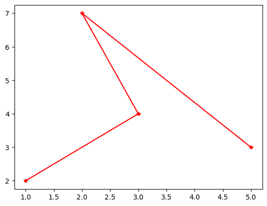
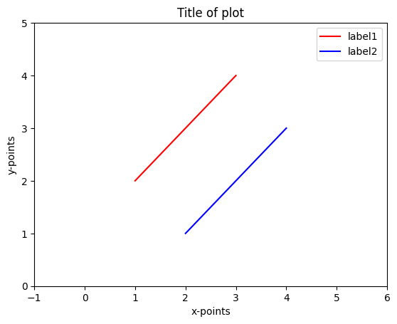
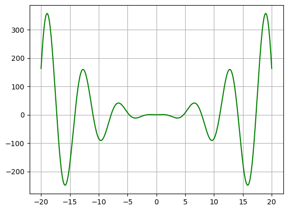
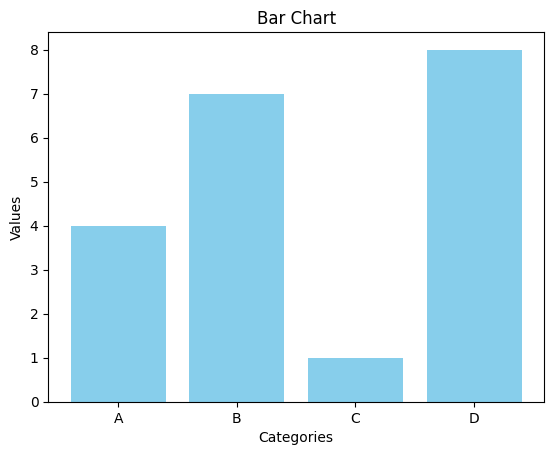

<!-- editorlm-hebrew-html-start -->
<style>
html, body, .vscode-body, .markdown-body, .markdown-preview, #write {
  direction: rtl !important; text-align: right !important;
}
ul, ol { padding-right: 2em !important; padding-left: 0 !important; }
blockquote { border-right: 3px solid #999; border-left: 0; padding-right: 1rem; padding-left: 0; }
@media print {
  html, body, .vscode-body, .markdown-body, .markdown-preview, #write {
    direction: rtl !important; text-align: right !important;
  }
}
</style>
<!-- editorlm-hebrew-html-end -->

<style>
.book { max-width: 900px; margin: auto; line-height: 1.8; font-family: Arial, sans-serif; }
.book .cover { min-height: 680px; box-sizing: border-box; padding: 64px 48px; margin: 24px 0 60px; background: #112b41; color: #f5f8fc; border-top: 9px solid #39c4b5; position: relative; }
.book .cover .eyebrow { color: #81e0d5; font-size: 15px; letter-spacing: 2px; }
.book .cover h1 { color: #fff; font-size: 48px; line-height: 1.3; border: 0; margin: 50px 0 18px; }
.book .cover .subtitle { font-size: 28px; color: #d8e6f0; }
.book .cover .author { font-size: 30px; color: #fff; margin-top: 52px; }
.book .cover .audience { color: #c1d3df; margin-top: 12px; }
.book .cover .motif { direction: ltr; text-align: left; font-family: Consolas, monospace; color: #81e0d5; font-size: 19px; margin-top: 54px; }
.book h1, .book h2, .book h3 { line-height: 1.4; font-weight: 700; }
.book > h1 { font-size: 32px !important; text-align: center !important; margin: 28px 0; }
.book h2 { font-size: 34px !important; text-align: center !important; color: #153b56 !important; background: #eef5fc; border: 0; border-bottom: 4px solid #299c91; border-radius: 10px 10px 0 0; padding: 28px 20px; margin: 24px 0 36px; }
.book h3 { font-size: 24px !important; text-align: right !important; color: #174e49 !important; background: #edf7f5; border: 0; border-right: 5px solid #299c91; border-radius: 6px; padding: 10px 16px; margin: 36px 0 18px; }
.book .chapter { height: 0; margin: 76px 0 0; border-top: 1px solid #ccd7df; break-before: page; page-break-before: always; break-after: avoid; page-break-after: avoid; }
.book .toc { padding: 24px; border-right: 5px solid #39a99d; background: rgba(70,150,155,.09); margin: 24px 0 48px; }
.book pre, .book pre code { direction: ltr !important; text-align: left !important; unicode-bidi: isolate; }
.book pre { box-sizing: border-box !important; width: 100% !important; max-width: 100% !important; margin: 0 !important; padding: 16px 20px; border: 1px solid #ccd7df; border-radius: 8px; line-height: 1.6; overflow-x: auto; }
.book code { direction: ltr; unicode-bidi: isolate; font-family: Consolas, "Courier New", monospace; }
.book pre { background: #f3f6fa !important; color: #1f2937 !important; }
.book pre code, .book pre code.hljs { background: transparent !important; color: #1f2937 !important; }
.book pre .hljs-keyword, .book pre .hljs-literal { color: #6f299c !important; }
.book pre .hljs-string { color: #216338 !important; }
.book pre .hljs-number { color: #075e68 !important; }
.book pre .hljs-comment { color: #526174 !important; }
.book pre .hljs-built_in, .book pre .hljs-title { color: #135b96 !important; }
.book table { width: 100%; }
.book th, .book td { text-align: right; }
.book .small { font-size: .9em; opacity: .8; }
.book .python-intro { display: flex; align-items: center; gap: 28px; padding: 22px 28px; margin: 24px 0; background: #eef5fc; color: #183e63; border-right: 6px solid #3776ab; border-radius: 10px; }
.book .python-intro strong { font-size: 30px; }
.book .python-fact { background: #fff7d6; color: #423611; border-right: 6px solid #ffd343; border-radius: 8px; padding: 18px 24px; margin: 22px 0; }
.book .python-fact strong { font-size: 24px; }
.book img { max-width: 100%; height: auto; }
.book figure { margin: 24px auto; text-align: center; }
.book figure img { display: block; margin: auto; }
.book figcaption { direction: rtl; text-align: center; font-size: .9em; color: #445566; }
@media print { .book > h2 { break-before: page; page-break-before: always; } }
.book .screen-strip { width: 760px; max-width: 100%; height: 220px; overflow: hidden; border: 1px solid #bccad5; border-radius: 8px; margin: 20px auto 8px; direction: ltr; }
.book .screen-strip.output { height: 265px; }
.book .screen-strip img { display: block; width: 1745px; max-width: none; }
.book .screen-menu { width: 400px; max-width: 100%; height: 295px; overflow: hidden; direction: ltr; margin: 20px auto 8px; border: 1px solid #bccad5; border-radius: 8px; }
.book .screen-menu img { display: block; width: 1745px; max-width: none; }
.book .code-panel { box-sizing: border-box !important; display: block !important; width: 75% !important; max-width: 75% !important; margin: 18px auto !important; }
@media print {
  .book .cover { min-height: 85vh; break-after: page; print-color-adjust: exact; -webkit-print-color-adjust: exact; }
  .book pre { white-space: pre-wrap; break-inside: avoid; }
  .book .chapter { margin: 0; border: 0; }
  .book h1, .book h2, .book h3 { break-after: avoid; page-break-after: avoid; break-inside: avoid; }
  .book h2 { margin-top: 0; }
  .book h2, .book h3 { print-color-adjust: exact; -webkit-print-color-adjust: exact; }
}
</style>

<style>
.book .book-nav { display: flex; flex-wrap: wrap; gap: 10px; justify-content: center; align-items: center; padding: 16px 0; margin: 20px 0 32px; border-top: 1px solid #ccd7df; border-bottom: 1px solid #ccd7df; }
.book .book-nav a { display: inline-block; padding: 10px 18px; border-radius: 8px; background: #eef5fc; color: #153b56 !important; border: 1px solid #b5ccd9; text-decoration: none !important; font-size: 16px; font-weight: bold; }
.book .book-nav a.toc-link { background: #174e49; color: #fff !important; border-color: #174e49; }
.book .book-nav a:hover, .book .book-nav a:focus { background: #d4eee8; color: #153b56 !important; outline: 2px solid #299c91; outline-offset: 2px; }
.book .section-list { line-height: 2; }
@media print { .book .book-nav { display: none; } }

/* Explicit Hebrew direction, including prose beginning with English. */
.book p, .book ul, .book ol, .book li,
.book blockquote, .book h1, .book h2, .book h3,
.book h4, .book th, .book td {
  direction: rtl !important;
  text-align: right !important;
  unicode-bidi: isolate;
}
/* Chapter titles keep their agreed centered layout. */
.book h2 { text-align: center !important; }
.book pre, .book pre code, .book .code-panel {
  direction: ltr !important;
  text-align: left !important;
  unicode-bidi: isolate;
}
</style>

<style>
.book img { max-width: 100%; height: auto; object-fit: contain; }
.book .python-intro { display: flex; align-items: center; gap: 24px; padding: 22px; background: #edf7f5; border-radius: 12px; margin: 24px 0; color: #153b56; }
.book .python-intro img { width: 105px; height: auto; }
.book .python-fact { padding: 20px; background: #fff5ce; border-right: 5px solid #f0c444; border-radius: 8px; color: #153b56; }
.book .screen-menu, .book .screen-strip, .book .screen-strip.output { text-align: center; margin: 20px auto; max-width: 100%; height: auto !important; overflow: visible; }
.book .screen-menu img, .book .screen-strip img { width: auto; max-width: 100%; height: auto; }
.book h4 { font-size: 21px; color: #153b56; margin-top: 28px; }
@media print { .book > h2 { break-before: page; page-break-before: always; } }
</style>

<div class="book" dir="rtl" lang="he" style="direction: rtl !important; text-align: right !important;">

<nav class="book-nav" aria-label="ניווט בפרקים">
<a href="20-NumPy%20%D7%97%D7%99%D7%A9%D7%95%D7%91%D7%99%D7%9D.md">→ הקודם</a>
<a class="toc-link" href="../index.md#book-toc">תוכן העניינים</a>
<a href="22-%D7%AA%D7%9E%D7%95%D7%A0%D7%95%D7%AA%20%D7%9B%D7%9E%D7%A2%D7%A8%D7%9B%D7%99%D7%9D.md">הבא ←</a>
</nav>

## א.21 — PyPlot — גרפים ותרשימים

בשני הפרקים הקודמים למדנו לחשב על מערכים גדולים של מספרים. אבל מערך של אלף תוצאות שמודפס על המסך אינו אומר לנו הרבה: קשה לראות בו מגמה, קפיצה חריגה או קשר בין שני משתנים. בני אדם מבינים תמונה הרבה יותר מהר מטור מספרים, ולכן כמעט כל עבודה עם נתונים מתחילה בציור שלהם.

PyPlot הוא מודול בספריית Matplotlib שמאפשר להציג נתונים כגרפים ותרשימים. במקום לקרוא רשימה ארוכה של מספרים, אפשר לראות על גבי תרשים איך הם משתנים ומה הקשר ביניהם.

למשל, זוגות של ערכי x ו־y הופכים לנקודות על מערכת צירים, ואפשר לחבר אותן בקו. נתחיל בתרשים פשוט, ובהמשך נוסיף כותרות, צבעים ומקרא שיעזרו להבין את הנתונים.

למי שלומד למידת מכונה, PyPlot הוא כלי עבודה יומיומי ולא רק קישוט. בחלק ג נצייר את נקודות הנתונים ואת הקו שהמודל למד כדי לראות אם הוא מתאים להן; נצייר את עקומת ההפסד לאורך האימון כדי לבדוק שהרשת אכן משתפרת ולא „מתבדרת”; ונציג תמונות שהרשת מסווגת. לכן כדאי להכיר כאן היטב את שלוש הפעולות הבסיסיות — קו, נקודות והצבת כמה תרשימים זה לצד זה — שבהן נשתמש שוב ושוב.

**[פתיחת המחברת ב־Colab](https://colab.research.google.com/drive/14I3GNo887HXmECW4HhFHGX00lNU6EON7?usp=share_link) · [השיעור וההרצאה באתר הקורס](https://webprogramming.azurewebsites.net/Pages/Python/PyPlot.aspx)**

מריצים תחילה את תא הייבוא, ואחריו את הדוגמאות לפי הסדר. כל קריאה ל־`plt.figure()` בדוגמאות פותחת תרשים חדש, כדי שהשרטוטים לא יצטברו בטעות על אותה מסגרת.

**[מחברות האוניברסיטה הפתוחה — 14 חבילות](https://drive.google.com/drive/folders/1yLN-J12Mq3KZ0i6XJwpaA3XMC6xoh4GJ?usp=sharing)**


### ייבוא וציור קו

נתחיל בחיבור שתי נקודות בקו. נייבא את כלי השרטוט בשם הקצר `plt`, ונמסור את הקואורדינטות של הנקודות בשתי רשימות.

<div class="code-panel" dir="ltr" style="box-sizing: border-box !important; display: block !important; width: 75% !important; max-width: 75% !important; margin: 18px auto !important; direction: ltr !important; text-align: left !important;">

```python
import matplotlib.pyplot as plt

x = [1, 3]
y = [2, 9]
plt.figure()
plt.plot(x, y)
plt.show()
```

</div>

כל זוג איברים תואמים ב־`x` וב־`y` מייצג נקודה. כאן מחברים את `(1, 2)` ואת `(3, 9)`. **שתי הרשימות צריכות להיות באותו אורך.** `figure()` פותחת מסגרת חדשה; `show()` מציגה את התרשים. שימו לב לסדר הקבוע שילווה את כל הדוגמאות: פותחים מסגרת, מוסיפים אליה מה שרוצים לצייר, ורק בסוף מציגים.

<!-- editorlm-source-ref: [sources/Python/converted/4.PyPlot/notebook.md#L17-L58] -->

### קו שעובר בכמה נקודות

בדרך כלל יש לנו יותר משתי נקודות, למשל מדידה בכל יום לאורך שבוע. מוסרים ל־`plot` את כל הנקודות באותו אופן, והיא מחברת אותן בזו אחר זו. אפשר להעביר ל־`plot` רשימות או מערכי NumPy. **הנקודות מתחברות לפי סדר הנתונים**, גם אם ערכי `x` אינם ממוינים. `color` קובע צבע ו־`marker` את סימון הנקודות.

<div class="code-panel" dir="ltr" style="box-sizing: border-box !important; display: block !important; width: 75% !important; max-width: 75% !important; margin: 18px auto !important; direction: ltr !important; text-align: left !important;">

```python
x = [1, 3, 2, 5]
y = [2, 4, 7, 3]
plt.figure()
plt.plot(x, y, color="red", marker="*")
plt.show()
```

</div>



האיור הוא הפלט השמור במחברת הקורס עבור אותם נתונים. אפשר לראות בו שהקו „חוזר אחורה”: מהנקודה `(3, 4)` הוא ממשיך ל־`(2, 7)`, כי זה הסדר שבו הנקודות נמסרו. כשמציירים גרף של פונקציה, נקפיד למסור את ערכי `x` ממוינים.

<!-- editorlm-source-ref: [sources/Python/converted/4.PyPlot/notebook.md#L74-L105] -->

### נקודות ללא קו מחבר

לא תמיד יש היגיון בחיבור הנקודות בקו. כשכל נקודה היא מדידה נפרדת, למשל גובה ומשקל של תלמיד, הקו המחבר רק מטעה. במקרים כאלה מציגים את הנקודות בלבד. כדי להציג את מיקומי הנקודות בלי לחבר ביניהן, משתמשים בסימון **`"o"`** לבדו ב־`plot`. נשתמש באותן ארבע נקודות מהדוגמה הקודמת:

<div class="code-panel" dir="ltr" style="box-sizing: border-box !important; display: block !important; width: 75% !important; max-width: 75% !important; margin: 18px auto !important; direction: ltr !important; text-align: left !important;">

```python
plt.figure()
plt.plot(x, y, "o", color="red")
plt.show()
```

</div>

<!-- editorlm-source-ref: [sources/Python/converted/4.PyPlot/notebook.md#L111-L136] -->

### ישר שאינו מוגבל לשתי נקודות

לפעמים אנחנו רוצים לצייר לא קטע אלא ישר שלם, למשל הקו שמודל רגרסיה לינארית למד: הוא מתאר קשר בין x ל־y ותקף גם מחוץ לנקודות שמדדנו. `plot` מחברת את הנקודות שנמסרו. **`axline` מגדירה ישר העובר בשתי נקודות ונמשך עד גבולות אזור התצוגה.** בדוגמה נצייר ישר אדום באמצעות `axline`, ולצידו קטע כחול רגיל באמצעות `plot`, כדי לראות את ההבדל:

<div class="code-panel" dir="ltr" style="box-sizing: border-box !important; display: block !important; width: 75% !important; max-width: 75% !important; margin: 18px auto !important; direction: ltr !important; text-align: left !important;">

```python
plt.figure()
plt.axline(xy1=(-2, 2), xy2=(4, 5),
           color="red")
plt.plot([-1, 4], [2, 6])
plt.show()
```

</div>

<!-- editorlm-source-ref: [sources/Python/converted/4.PyPlot/notebook.md#L140-L164] -->

### שתי קבוצות נקודות — scatter

כשמציירים נקודות מכמה מקורות על אותו תרשים, חשוב שהצופה יוכל להבדיל ביניהן. זו בדיוק התמונה שנפגוש בסיווג בחלק ג: נקודות מקטגוריה אחת בצבע אחד, נקודות מקטגוריה אחרת בצבע שני, ואנחנו מחפשים את הקו שמפריד ביניהן. `scatter` מציירת נקודות ללא קו מחבר. ניצור תרשים ובו שתי קבוצות קטנות, ונבדיל ביניהן בצבע ובשם:

<div class="code-panel" dir="ltr" style="box-sizing: border-box !important; display: block !important; width: 75% !important; max-width: 75% !important; margin: 18px auto !important; direction: ltr !important; text-align: left !important;">

```python
plt.figure()
plt.scatter([1, 2, 3], [2, 4, 3],
            color="blue", label="A")
plt.scatter([1, 2, 3], [5, 6, 7],
            color="orange", label="B")
plt.legend()
plt.show()
```

</div>

**`label` מגדירה שם לקבוצה; `legend()` מציגה את השמות במקרא.** הנתונים כאן מדגימים שתי קבוצות בלבד, ללא משמעות מדידה מסוימת.

<!-- editorlm-source-ref: [sources/Python/converted/4.PyPlot/notebook.md#L166-L198] -->

### כותרת, צירים וגבולות

תרשים ללא כותרת ושמות לצירים הוא כמו טבלה ללא כותרות עמודות: המספרים נכונים, אבל אי אפשר לדעת מה הם מייצגים. כותרת ושמות לצירים מסבירים מה מוצג בתרשים, וגבולות התצוגה קובעים איזה תחום נראה. `title` מוסיפה כותרת, `xlabel` ו־`ylabel` שמות לצירים, ו־`xlim` ו־`ylim` קובעות את תחום התצוגה.

<div class="code-panel" dir="ltr" style="box-sizing: border-box !important; display: block !important; width: 75% !important; max-width: 75% !important; margin: 18px auto !important; direction: ltr !important; text-align: left !important;">

```python
plt.figure()
plt.plot([1, 3], [2, 4],
         color="red", label="label1")
plt.plot([2, 4], [1, 3],
         color="blue", label="label2")
plt.title("Title of plot")
plt.xlabel("x-points")
plt.ylabel("y-points")
plt.xlim(-1, 6)
plt.ylim(0, 5)
plt.legend()
plt.show()
```

</div>



האיור הוא הפלט השמור במחברת הקורס עבור אותם נתונים והגדרות.

<!-- editorlm-source-ref: [sources/Python/converted/4.PyPlot/notebook.md#L208-L239] -->

### תרשימים מרובים — subplot

לעיתים קרובות רוצים לראות כמה תרשימים יחד: למשל, באימון רשת נוירונים מציגים בתרשים אחד את ההפסד על נתוני האימון ובתרשים סמוך את הדיוק, או מציגים כמה תמונות זו לצד זו. אפשר להציג כמה תרשימים זה לצד זה באותה מסגרת כדי להשוות ביניהם. **`subplot(rows, columns, index)`** מחלקת את המסגרת לאזורי ציור ובוחרת את האזור הפעיל. **מספור האזורים מתחיל ב־`1`.**

<div class="code-panel" dir="ltr" style="box-sizing: border-box !important; display: block !important; width: 75% !important; max-width: 75% !important; margin: 18px auto !important; direction: ltr !important; text-align: left !important;">

```python
plt.figure(figsize=(8, 3))
plt.subplot(1, 2, 1)
plt.plot([0, 1, 2], [0, 1, 4])
plt.title("Curve")

plt.subplot(1, 2, 2)
plt.scatter([0, 1, 2], [0, 1, 4])
plt.title("Points")
plt.tight_layout()
plt.show()
```

</div>

כאן יש שורה אחת ושתי עמודות. הקריאה `subplot(1, 2, 1)` בוחרת את האזור השמאלי, ומרגע זה פקודות הציור והכותרת מתייחסות אליו; `subplot(1, 2, 2)` עוברת לאזור הימני. הפרמטר `figsize` קובע את רוחב המסגרת ואת גובהה באינצ׳ים. `tight_layout()` מתאימה את הריווח בין התרשימים והכותרות.

<!-- editorlm-source-ref: [sources/Python/converted/4.PyPlot/notebook.md#L250-L278] -->

### Figure ו־Axes

בדרך שראינו עד כה, כל פקודת `plt` פועלת על „התרשים הפעיל”, ואנחנו צריכים לזכור איזה תרשים פעיל ברגע נתון. כשיש כמה תרשימים זה נעשה מבלבל. PyPlot מציעה דרך מפורשת יותר: לקבל אובייקט לכל תרשים ולפנות אליו בשמו. שתי הדרכים ישמשו אותנו בהמשך הספר, ולכן כדאי להכיר את שתיהן.

**`Figure` היא המסגרת הכוללת; `Axes` הוא אזור ציור אחד בתוכה.** `subplots` מחזירה אותם כדי שנוכל לפנות ישירות לכל תרשים.

<div class="code-panel" dir="ltr" style="box-sizing: border-box !important; display: block !important; width: 75% !important; max-width: 75% !important; margin: 18px auto !important; direction: ltr !important; text-align: left !important;">

```python
fig, axes = plt.subplots(1, 2,
                         figsize=(8, 3))
axes[0].plot([0, 1, 2], [0, 1, 4])
axes[0].set_title("Curve")
axes[1].scatter([0, 1, 2], [0, 1, 4])
axes[1].set_title("Points")
fig.tight_layout()

fig2, ax = plt.subplots()
ax.plot([0, 1, 2], [0, 2, 4])
ax.set_title("Another figure")
ax.set_xlabel("Time")
ax.set_ylabel("Distance")
plt.show()
```

</div>

**ב־`subplots()` עם תרשים יחיד מתקבל אובייקט `Axes` יחיד; בדוגמה עם שני תרשימים מתקבל מערך שלהם.** הפנייה למערך מתחילה באינדקס `0`. ברשת דו־ממדית, למשל `subplots(2, 2)`, פונים לתרשים באמצעות `axes[row, column]`.

בגישה הזאת כותבים `ax.set_title(...)` במקום `plt.title(...)`, וכך ברור לאיזה תרשים מוסיפים את הכותרת.

<!-- editorlm-source-ref: [sources/Python/converted/4.PyPlot/notebook.md#L298-L326] -->

### פנייה לתרשים ברשת של שתי שורות ושתי עמודות

אחרי שהכרנו מערך של שני תרשימים בשורה, נרחיב לרשת כמו במחברת הקורס. `axes[row, column]` בוחרת תרשים לפי שורה ועמודה, והאינדקסים מתחילים באפס:

<div class="code-panel" dir="ltr" style="box-sizing: border-box !important; display: block !important; width: 75% !important; max-width: 75% !important; margin: 18px auto !important; direction: ltr !important; text-align: left !important;">

```python
fig, axes = plt.subplots(2, 2,
                         figsize=(7, 7))
x = [0, 1, 2, 3]
y = [3, 8, 1, 10]
axes[0, 0].plot([1, 2], [1, 3])
axes[0, 1].plot(x, y)
axes[1, 0].plot(x, [10, 20, 30, 40])
axes[1, 1].plot(x, y, "o", color="red")
fig.tight_layout()
plt.show()
```

</div>

`axes[0, 1]` הוא התרשים הימני בשורה העליונה; `axes[1, 0]` הוא השמאלי בשורה התחתונה. כך כל פקודת ציור מופנית במפורש לאזור שלה.

<!-- editorlm-source-ref: [sources/Python/converted/4.PyPlot/notebook.md#L305-L327] -->
### גרף של פונקציה

כעת נחבר את מה שלמדנו בפרק הקודם לציור. למחשב אין דרך לצייר עקומה „חלקה” ישירות; במקום זאת מחשבים את הפונקציה בהרבה נקודות צפופות ומחברים אותן בקווים קצרים, והעין רואה עקומה. כדי לשרטט פונקציה, נחשב את ערכה בנקודות רבות ונציג את זוגות הקלט והפלט. NumPy מבצעת את החישוב באמצעות `linspace` והפעולות איבר מול איבר, ו־PyPlot מציירת; בדוגמה נציג את `x² cos(x)` ב־400 נקודות בין `-20` ל־`20`:

<div class="code-panel" dir="ltr" style="box-sizing: border-box !important; width: 75% !important; max-width: 75% !important; margin: 18px auto !important; direction: ltr !important; text-align: left !important;">

```python
import numpy as np
import matplotlib.pyplot as plt
x = np.linspace(-20, 20, 400)
y = x ** 2 * np.cos(x)
plt.figure()
plt.plot(x, y, color="green")
plt.grid()
plt.show()
```

</div>



האיור הוא הפלט השמור במחברת. ככל שמתרחקים מאפס, גורם `x²` מגדיל את גובה התנודות; `grid` מוסיפה רשת לקריאת המיקומים.

### תרשים עמודות

תרשים עמודות משווה ערכים בין קטגוריות; למשל מספר פריטים מכל סוג. הגובה מייצג את הערך, ולא מיקום של נקודה ברצף זמן.

<div class="code-panel" dir="ltr" style="box-sizing: border-box !important; width: 75% !important; max-width: 75% !important; margin: 18px auto !important; direction: ltr !important; text-align: left !important;">

```python
categories = ["A", "B", "C", "D"]
values = [4, 7, 1, 8]
plt.figure()
plt.bar(categories, values, color="skyblue")
plt.title("Bar Chart")
plt.xlabel("Categories")
plt.ylabel("Values")
plt.show()
```

</div>



`barh` מציגה את אותה השוואה בעמודות אופקיות.

### היסטוגרמה

כשיש בידינו הרבה מדידות של אותו דבר, למשל גילים של מאות נוסעים, השאלה הראשונה היא כיצד הן מתפלגות: האם רובן מרוכזות סביב ערך אחד, או פזורות באופן אחיד? היסטוגרמה עונה על השאלה הזאת, ובלמידת מכונה היא הכלי הראשון להכרת הנתונים לפני האימון. היסטוגרמה מחלקת נתונים מספריים לטווחים וסופרת כמה ערכים נפלו בכל טווח. בניגוד לעמודות של קטגוריות, כאן הציר מתאר תחום מספרי. `bins` קובעת את החלוקה:

<div class="code-panel" dir="ltr" style="box-sizing: border-box !important; width: 75% !important; max-width: 75% !important; margin: 18px auto !important; direction: ltr !important; text-align: left !important;">

```python
values = [10, 12, 15, 21, 23, 25, 29, 35]
plt.figure()
plt.hist(values, bins=[0, 10, 20, 30, 40])
plt.xlabel("Value")
plt.ylabel("Count")
plt.show()
```

</div>

הרשימה `bins` מגדירה כאן ארבעה טווחים: `0–10`, `10–20`, `20–30` ו־`30–40`. בטווח הראשון אין ערכים, ובשלושת הטווחים האחרונים יש בהתאמה 3, 4 ו־1 ערכים. במחברת מודגמת גם היסטוגרמה של נתונים אקראיים; התרשים המדויק שלה עשוי להשתנות בין הרצות. בפרק ניתוח הנתונים נראה היסטוגרמת גילים אמיתית מתוך Titanic.

<!-- editorlm-source-ref: [sources/אוניברסיטה פתוחה/converted/14 חבילות/notebook.md#L1023-L1136] -->

<nav class="book-nav" aria-label="ניווט בפרקים">
<a href="20-NumPy%20%D7%97%D7%99%D7%A9%D7%95%D7%91%D7%99%D7%9D.md">→ הקודם</a>
<a class="toc-link" href="../index.md#book-toc">תוכן העניינים</a>
<a href="22-%D7%AA%D7%9E%D7%95%D7%A0%D7%95%D7%AA%20%D7%9B%D7%9E%D7%A2%D7%A8%D7%9B%D7%99%D7%9D.md">הבא ←</a>
</nav>

</div>

<!-- editorlm-source-versions: {"schemaVersion": 1, "sources": {"sources/Python/Python_Intro_Colab.pptx": {"sourceSha256": "6661ef452ccbf6f70f9e9d413207d0f16914ac4da9a38026e817f7e8d932658c", "canonicalTextSha256": "2cca9ddeeb2f1c940efaadd82221ebda54fb08e2814fd46db348a62cdc164917"}, "sources/Python/Python_Basic.pptx": {"sourceSha256": "32a2d56f6cb0e1eacf4a8a28f14d7932648610f4248f7178dae91b80b6ef7e84", "canonicalTextSha256": "0a301b7608d0440e9cfaab4e39bd7bbb9518eaf76710de862723aa719cc60e4a"}, "sources/Python/converted/1.Python_Basic/notebook.md": {"sourceSha256": "2d605efefadda4ead3844d4ae7e8066d8443ea6927868f6b4ca26a4bdc66d16c", "canonicalTextSha256": "2d605efefadda4ead3844d4ae7e8066d8443ea6927868f6b4ca26a4bdc66d16c"}, "sources/Python/Python_Classes_Inheritance.pptx": {"sourceSha256": "ad085713a21c8b50a6210c1b43f31e3421aad37238c20ec5a6c78825cf178af4", "canonicalTextSha256": "09ec2e29ca4c246d64556136e69fee1eeac8a6234f55b06dac6d77cecd09e7e5"}, "sources/Python/Python_Data_Strucrures.pptx": {"sourceSha256": "af0d66fc064d82bd80d368b0e9d39716f653abe73240936a8fce03b3ad2ff283", "canonicalTextSha256": "80dd4b6c86b82109570ee1c3b0062963aab08de123e173c90e0967af586bfee4"}, "sources/Python/Python_Numpy.pptx": {"sourceSha256": "d1a86b84fd49ca2baee3a81586a78246cf31d582742844b229c2f8f576d52fa3", "canonicalTextSha256": "fe990439bdef892516fa8983a16f5eed04168924c84b6e9d819b5a94be5ca314"}, "sources/Python/Python_PyPlot.pptx": {"sourceSha256": "01cadb34d9c969eeb2e63490275e6f56122c7ce9f3d9f193296e1e796656d85b", "canonicalTextSha256": "f2ef11e858c11340a1d069dd7301e7a03b3358c273cf91681d80970717fb6b1c"}, "sources/Python/converted/2.Python_Data_Struct/notebook.md": {"sourceSha256": "b22b730af709e02d0009f11919302963e3efaa6c020949866f1e86d6f47e25fc", "canonicalTextSha256": "b22b730af709e02d0009f11919302963e3efaa6c020949866f1e86d6f47e25fc"}, "sources/Python/converted/3.numpy/notebook.md": {"sourceSha256": "f2bccd1d5c7492037ac66a7c4de1b34220d0b8812f4773a0978eca434b5bcfa9", "canonicalTextSha256": "f2bccd1d5c7492037ac66a7c4de1b34220d0b8812f4773a0978eca434b5bcfa9"}, "sources/Python/converted/4.PyPlot/notebook.md": {"sourceSha256": "8f0bf07a3cf8561f8fccfce4736fa515597960640d561e98ada980abcb68cd18", "canonicalTextSha256": "8f0bf07a3cf8561f8fccfce4736fa515597960640d561e98ada980abcb68cd18"}, "sources/אוניברסיטה פתוחה/converted/14 חבילות/notebook.md": {"sourceSha256": "1b2a8d7b594e9ebfd2457b50aa08ae88b06ce08ac64fd6ef1c76667fe316d373", "canonicalTextSha256": "1b2a8d7b594e9ebfd2457b50aa08ae88b06ce08ac64fd6ef1c76667fe316d373"}}} -->
