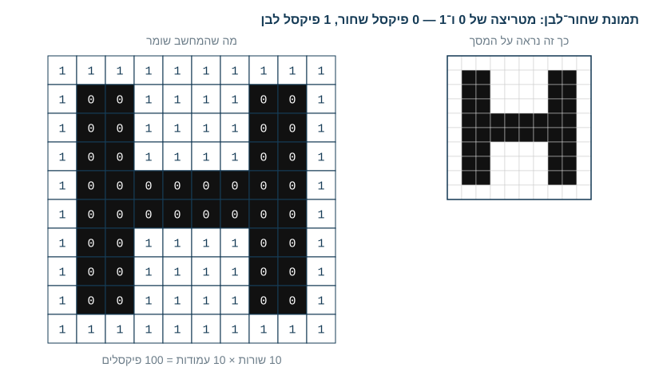
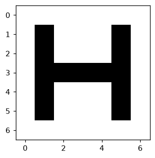
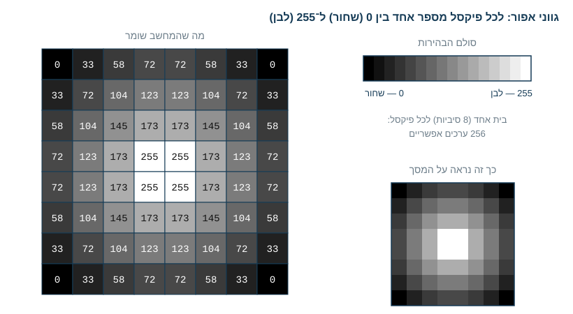
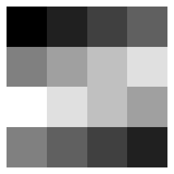
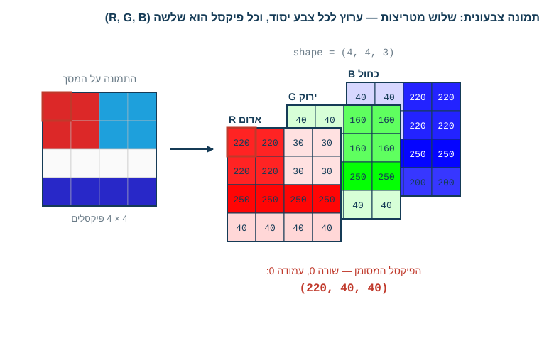
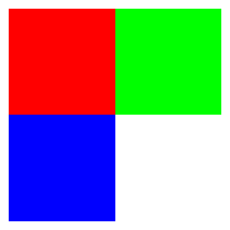
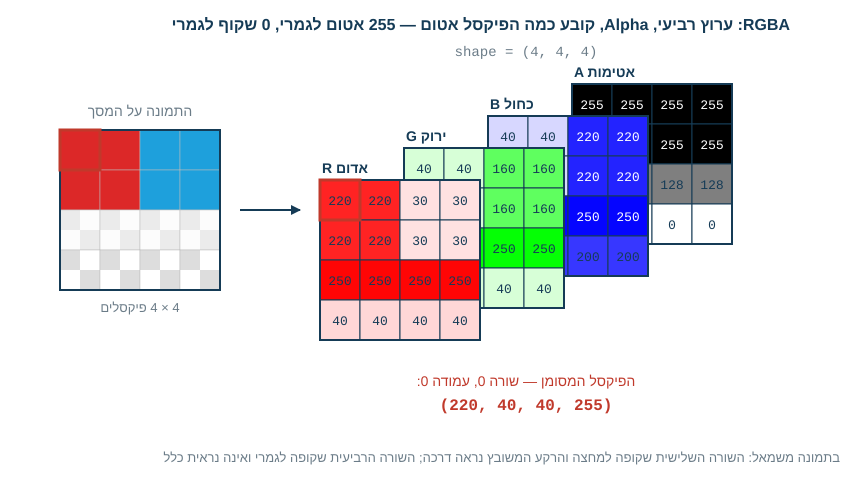
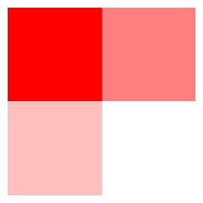
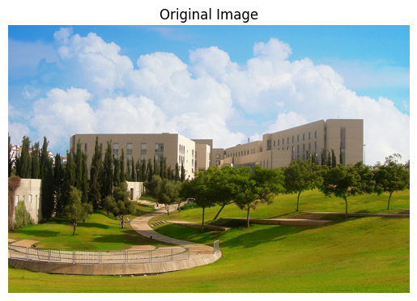
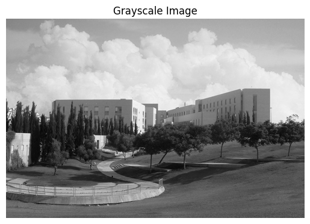

<!-- editorlm-hebrew-html-start -->
<style>
html, body, .vscode-body, .markdown-body, .markdown-preview, #write {
  direction: rtl !important; text-align: right !important;
}
ul, ol { padding-right: 2em !important; padding-left: 0 !important; }
blockquote { border-right: 3px solid #999; border-left: 0; padding-right: 1rem; padding-left: 0; }
@media print {
  html, body, .vscode-body, .markdown-body, .markdown-preview, #write {
    direction: rtl !important; text-align: right !important;
  }
}
</style>
<!-- editorlm-hebrew-html-end -->

<style>
.book { max-width: 900px; margin: auto; line-height: 1.8; font-family: Arial, sans-serif; }
.book .cover { min-height: 680px; box-sizing: border-box; padding: 64px 48px; margin: 24px 0 60px; background: #112b41; color: #f5f8fc; border-top: 9px solid #39c4b5; position: relative; }
.book .cover .eyebrow { color: #81e0d5; font-size: 15px; letter-spacing: 2px; }
.book .cover h1 { color: #fff; font-size: 48px; line-height: 1.3; border: 0; margin: 50px 0 18px; }
.book .cover .subtitle { font-size: 28px; color: #d8e6f0; }
.book .cover .author { font-size: 30px; color: #fff; margin-top: 52px; }
.book .cover .audience { color: #c1d3df; margin-top: 12px; }
.book .cover .motif { direction: ltr; text-align: left; font-family: Consolas, monospace; color: #81e0d5; font-size: 19px; margin-top: 54px; }
.book h1, .book h2, .book h3 { line-height: 1.4; font-weight: 700; }
.book > h1 { font-size: 32px !important; text-align: center !important; margin: 28px 0; }
.book h2 { font-size: 34px !important; text-align: center !important; color: #153b56 !important; background: #eef5fc; border: 0; border-bottom: 4px solid #299c91; border-radius: 10px 10px 0 0; padding: 28px 20px; margin: 24px 0 36px; }
.book h3 { font-size: 24px !important; text-align: right !important; color: #174e49 !important; background: #edf7f5; border: 0; border-right: 5px solid #299c91; border-radius: 6px; padding: 10px 16px; margin: 36px 0 18px; }
.book .chapter { height: 0; margin: 76px 0 0; border-top: 1px solid #ccd7df; break-before: page; page-break-before: always; break-after: avoid; page-break-after: avoid; }
.book .toc { padding: 24px; border-right: 5px solid #39a99d; background: rgba(70,150,155,.09); margin: 24px 0 48px; }
.book pre, .book pre code { direction: ltr !important; text-align: left !important; unicode-bidi: isolate; }
.book pre { box-sizing: border-box !important; width: 100% !important; max-width: 100% !important; margin: 0 !important; padding: 16px 20px; border: 1px solid #ccd7df; border-radius: 8px; line-height: 1.6; overflow-x: auto; }
.book code { direction: ltr; unicode-bidi: isolate; font-family: Consolas, "Courier New", monospace; }
.book pre { background: #f3f6fa !important; color: #1f2937 !important; }
.book pre code, .book pre code.hljs { background: transparent !important; color: #1f2937 !important; }
.book pre .hljs-keyword, .book pre .hljs-literal { color: #6f299c !important; }
.book pre .hljs-string { color: #216338 !important; }
.book pre .hljs-number { color: #075e68 !important; }
.book pre .hljs-comment { color: #526174 !important; }
.book pre .hljs-built_in, .book pre .hljs-title { color: #135b96 !important; }
.book table { width: 100%; }
.book th, .book td { text-align: right; }
.book .small { font-size: .9em; opacity: .8; }
.book .python-intro { display: flex; align-items: center; gap: 28px; padding: 22px 28px; margin: 24px 0; background: #eef5fc; color: #183e63; border-right: 6px solid #3776ab; border-radius: 10px; }
.book .python-intro strong { font-size: 30px; }
.book .python-fact { background: #fff7d6; color: #423611; border-right: 6px solid #ffd343; border-radius: 8px; padding: 18px 24px; margin: 22px 0; }
.book .python-fact strong { font-size: 24px; }
.book img { max-width: 100%; height: auto; }
.book figure { margin: 24px auto; text-align: center; }
.book figure img { display: block; margin: auto; }
.book figcaption { direction: rtl; text-align: center; font-size: .9em; color: #445566; }
@media print { .book > h2 { break-before: page; page-break-before: always; } }
.book .screen-strip { width: 760px; max-width: 100%; height: 220px; overflow: hidden; border: 1px solid #bccad5; border-radius: 8px; margin: 20px auto 8px; direction: ltr; }
.book .screen-strip.output { height: 265px; }
.book .screen-strip img { display: block; width: 1745px; max-width: none; }
.book .screen-menu { width: 400px; max-width: 100%; height: 295px; overflow: hidden; direction: ltr; margin: 20px auto 8px; border: 1px solid #bccad5; border-radius: 8px; }
.book .screen-menu img { display: block; width: 1745px; max-width: none; }
.book .code-panel { box-sizing: border-box !important; display: block !important; width: 75% !important; max-width: 75% !important; margin: 18px auto !important; }
@media print {
  .book .cover { min-height: 85vh; break-after: page; print-color-adjust: exact; -webkit-print-color-adjust: exact; }
  .book pre { white-space: pre-wrap; break-inside: avoid; }
  .book .chapter { margin: 0; border: 0; }
  .book h1, .book h2, .book h3 { break-after: avoid; page-break-after: avoid; break-inside: avoid; }
  .book h2 { margin-top: 0; }
  .book h2, .book h3 { print-color-adjust: exact; -webkit-print-color-adjust: exact; }
}
</style>

<style>
.book .book-nav { display: flex; flex-wrap: wrap; gap: 10px; justify-content: center; align-items: center; padding: 16px 0; margin: 20px 0 32px; border-top: 1px solid #ccd7df; border-bottom: 1px solid #ccd7df; }
.book .book-nav a { display: inline-block; padding: 10px 18px; border-radius: 8px; background: #eef5fc; color: #153b56 !important; border: 1px solid #b5ccd9; text-decoration: none !important; font-size: 16px; font-weight: bold; }
.book .book-nav a.toc-link { background: #174e49; color: #fff !important; border-color: #174e49; }
.book .book-nav a:hover, .book .book-nav a:focus { background: #d4eee8; color: #153b56 !important; outline: 2px solid #299c91; outline-offset: 2px; }
.book .section-list { line-height: 2; }
@media print { .book .book-nav { display: none; } }

/* Explicit Hebrew direction, including prose beginning with English. */
.book p, .book ul, .book ol, .book li,
.book blockquote, .book h1, .book h2, .book h3,
.book h4, .book th, .book td {
  direction: rtl !important;
  text-align: right !important;
  unicode-bidi: isolate;
}
/* Chapter titles keep their agreed centered layout. */
.book h2 { text-align: center !important; }
.book pre, .book pre code, .book .code-panel {
  direction: ltr !important;
  text-align: left !important;
  unicode-bidi: isolate;
}
</style>

<style>
.book img { max-width: 100%; height: auto; object-fit: contain; }
.book .python-intro { display: flex; align-items: center; gap: 24px; padding: 22px; background: #edf7f5; border-radius: 12px; margin: 24px 0; color: #153b56; }
.book .python-intro img { width: 105px; height: auto; }
.book .python-fact { padding: 20px; background: #fff5ce; border-right: 5px solid #f0c444; border-radius: 8px; color: #153b56; }
.book .screen-menu, .book .screen-strip, .book .screen-strip.output { text-align: center; margin: 20px auto; max-width: 100%; height: auto !important; overflow: visible; }
.book .screen-menu img, .book .screen-strip img { width: auto; max-width: 100%; height: auto; }
.book h4 { font-size: 21px; color: #153b56; margin-top: 28px; }
@media print { .book > h2 { break-before: page; page-break-before: always; } }
</style>

<div class="book" dir="rtl" lang="he" style="direction: rtl !important; text-align: right !important;">

<nav class="book-nav" aria-label="ניווט בפרקים">
<a href="22-PyPlot.md">→ הקודם</a>
<a class="toc-link" href="../index.md#book-toc">תוכן העניינים</a>
<a href="24-Pandas.md">הבא ←</a>
</nav>

## א.23 — תמונות כמערכים

כשאנחנו מסתכלים על תמונה במסך אנחנו רואים בניין, פנים או חתול. המחשב לא רואה דבר מזה. עבורו התמונה היא רשת צפופה של נקודות זעירות — **פיקסלים** — ולכל נקודה יש מספר שאומר כמה היא בהירה, או שלושה מספרים שאומרים כמה אדום, ירוק וכחול יש בה. מרגע שמבינים זאת, מתברר שתמונה היא פשוט מערך NumPy, ולכן כל מה שלמדנו בפרקים הקודמים — צורה, חיתוך, פעולות איבר מול איבר וסיכום לאורך ציר — עובד גם על תמונות.

הרעיון הזה הוא הבסיס לזיהוי תמונות בלמידת מכונה. בחלק ג נבנה רשתות שמסווגות תמונות של בגדים ואותיות ורשת שמבדילה בין חתול ללא־חתול; בשני המקרים הרשת אינה מקבלת „תמונה”, אלא מערך של מספרים בדיוק כמו זה שניצור כאן, ולומדת למצוא בו דפוסים.

הפרק מתחיל מהשאלה הבסיסית: איך תמונה נשמרת בזיכרון המחשב? נכיר ארבע דרכים לתאר פיקסל, מהפשוטה למורכבת — שחור־לבן, גווני אפור, צבע (RGB) וצבע עם שקיפות (RGBA) — ונבנה בעצמנו תמונות זעירות מכל סוג. לאחר מכן נטען תמונה אמיתית מקובץ, נבדוק את צורתה, ונראה שפעולות חשבוניות פשוטות על המערך משנות את התמונה בדרכים מוכרות.

**[מחברות האוניברסיטה הפתוחה — 14 חבילות](https://drive.google.com/drive/folders/1yLN-J12Mq3KZ0i6XJwpaA3XMC6xoh4GJ?usp=sharing)**


### מבנה התמונה בזיכרון — מטריצה של פיקסלים

אם נתקרב מאוד למסך המחשב נגלה שהוא בנוי מרשת של נקודות זעירות, וכל תמונה שמוצגת עליו היא למעשה צביעה של הנקודות האלה. הנקודה הזעירה נקראת **פיקסל** (pixel, קיצור של picture element), והמחשב שומר תמונה בדיוק כך: **מערך דו־ממדי — מטריצה — של פיקסלים**, שורה אחר שורה. **הרזולוציה** של תמונה היא ממדי המטריצה הזאת: תמונה ברזולוציה של 1024×768 היא מערך של 768 שורות ו־1024 עמודות, ובסך הכול קרוב ל־800 אלף פיקסלים. שימו לב להבדל בסדר: רזולוציה נהוג לכתוב כרוחב×גובה, ואילו צורת המערך ב־NumPy היא תמיד (שורות, עמודות), כלומר (גובה, רוחב).

מה שמור בכל תא של המטריצה? מספר, או כמה מספרים, שמתארים את צבע הפיקסל. כמה מספרים צריך ומה טווח הערכים שלהם — זה בדיוק ההבדל בין סוגי התמונות שנכיר עכשיו.

#### תמונת שחור־לבן: 0 או 1

הייצוג הפשוט ביותר הוא תמונה שיש בה שני צבעים בלבד. כל פיקסל הוא או שחור או לבן, ולכן די במספר אחד משני ערכים אפשריים: `0` לפיקסל שחור ו־`1` לפיקסל לבן. המטריצה כולה היא טבלה של אפסים ואחדים, וכדי לצייר אות או צורה פשוט מסמנים באפסים את התאים שצריכים להיות כהים.



*משמאל, מה שהמחשב שומר: מטריצה 10×10 של 0 ו־1. מימין, אותם ערכים כפי שהם נראים על המסך.*

נבנה תמונה כזאת בעצמנו: מטריצה 7×7 שבה האפסים מציירים את האות H, ונציג אותה בעזרת `imshow` מספריית PyPlot, שמציגה מערך כתמונה. הפרמטר `cmap="gray"` אומר לה לצייר את הערך הנמוך ביותר בשחור ואת הגבוה ביותר בלבן:

<div class="code-panel" dir="ltr" style="box-sizing: border-box !important; width: 75% !important; max-width: 75% !important; margin: 18px auto !important; direction: ltr !important; text-align: left !important;">

```python
import numpy as np
import matplotlib.pyplot as plt

bw = np.array([
    [1, 1, 1, 1, 1, 1, 1],
    [1, 0, 1, 1, 1, 0, 1],
    [1, 0, 1, 1, 1, 0, 1],
    [1, 0, 0, 0, 0, 0, 1],
    [1, 0, 1, 1, 1, 0, 1],
    [1, 0, 1, 1, 1, 0, 1],
    [1, 1, 1, 1, 1, 1, 1],
])
print(bw.shape)
plt.imshow(bw, cmap="gray")
plt.show()
```

</div>

**פלט**

<div class="code-panel" dir="ltr" style="box-sizing: border-box !important; width: 75% !important; max-width: 75% !important; margin: 18px auto !important; direction: ltr !important; text-align: left !important;">

```text
(7, 7)
```

</div>



*המטריצה מוצגת כתמונה: כל 0 הפך לריבוע שחור וכל 1 לריבוע לבן.*

הצירים שסביב התמונה מראים את מספרי השורות והעמודות. שימו לב ששורה 0 נמצאת **למעלה**, בדיוק כמו בטבלה או במטריצה, ולא למטה כמו בגרף רגיל. תמונה כזאת חסכונית מאוד: כל פיקסל דורש סיבית (bit) אחת בלבד.

#### גווני אפור: 0 עד 255

שני צבעים לא מספיקים לצילום. תמונה בגווני אפור עדיין שומרת מספר אחד לכל פיקסל, אבל המספר מציין **בהירות** ויכול לקבל כל ערך שלם בין `0` ל־`255`: `0` הוא שחור, `255` הוא לבן, וכל מספר ביניהם הוא גוון של אפור — ככל שהמספר גדול יותר הפיקסל בהיר יותר. מדוע דווקא 255? כי הבהירות נשמרת בבית (byte) אחד, שהוא 8 סיביות, ובית אחד יכול להכיל 256 ערכים שונים. זהו הטיפוס `uint8`: מספר שלם ללא סימן (unsigned) של 8 סיביות, בתחום 0–255. על `dtype`, הטיפוס האחיד של איברי המערך, למדנו בפרק א.21.



*מטריצה 8×8 של ערכי בהירות. הערכים הקטנים בפינות מוצגים בשחור, ו־255 במרכז מוצג בלבן.*

נבנה מטריצה קטנה של ערכי בהירות ונציג אותה:

<div class="code-panel" dir="ltr" style="box-sizing: border-box !important; width: 75% !important; max-width: 75% !important; margin: 18px auto !important; direction: ltr !important; text-align: left !important;">

```python
gray = np.array([
    [0, 32, 64, 96],
    [128, 160, 192, 224],
    [255, 224, 192, 160],
    [128, 96, 64, 32],
], dtype=np.uint8)
print(gray.dtype, gray.min(), gray.max())
plt.imshow(gray, cmap="gray")
plt.axis("off")
plt.show()
```

</div>

**פלט**

<div class="code-panel" dir="ltr" style="box-sizing: border-box !important; width: 75% !important; max-width: 75% !important; margin: 18px auto !important; direction: ltr !important; text-align: left !important;">

```text
uint8 0 255
```

</div>



*הערכים עולים לאורך השורה הראשונה והשנייה, ולכן הריבועים נעשים בהירים יותר משמאל לימין.*

`plt.axis("off")` מסתירה את הצירים והמספרים שסביב התמונה. הערה קטנה על `imshow`: היא מציירת את הערך הקטן ביותר במערך בשחור ואת הגדול ביותר בלבן, ולכן כאן, כשהמטריצה מכילה גם 0 וגם 255, התצוגה נאמנה לערכים. אם המערך אינו מכיל את שני הקצוות, אפשר לקבוע את הסולם במפורש עם `vmin=0` ו־`vmax=255`.

#### תמונה צבעונית: RGB

מסך מחשב יוצר כל צבע מערבוב של שלושה אורות: **אדום, ירוק וכחול** — Red, Green, Blue, ובקיצור **RGB**. לכן תמונה צבעונית שומרת לכל פיקסל **שלושה מספרים**, כל אחד בין 0 ל־255: כמה אדום, כמה ירוק וכמה כחול יש בו. במקום מטריצה אחת יש עכשיו שלוש מטריצות באותו גודל, אחת לכל צבע יסוד; לכל מטריצה כזאת קוראים **ערוץ** (channel). ב־NumPy שלוש המטריצות נשמרות יחד כמערך תלת־ממדי בצורה (שורות, עמודות, 3), והציר השלישי הוא ציר הערוצים.



*תמונה של 4×4 פיקסלים ושלושת הערוצים שלה. הפיקסל המסומן בשורה 0, עמודה 0 הוא השלשה (220, 40, 40): הרבה אדום ומעט ירוק וכחול, ולכן הוא אדום.*

כל פיקסל הוא אם כן שלשה של מספרים. `(0, 0, 0)` — אין אור כלל — הוא שחור; `(255, 255, 255)` — שלושת האורות במלוא העוצמה — הוא לבן; `(255, 0, 0)` הוא אדום טהור, וכל צבע אחר הוא שילוב של שלושת המספרים. מספר השילובים האפשריים הוא 256×256×256, יותר מ־16 מיליון צבעים. נבנה תמונה של 2×2 פיקסלים, אחד מכל צבע:

<div class="code-panel" dir="ltr" style="box-sizing: border-box !important; width: 75% !important; max-width: 75% !important; margin: 18px auto !important; direction: ltr !important; text-align: left !important;">

```python
rgb = np.array([
    [[255, 0, 0], [0, 255, 0]],
    [[0, 0, 255], [255, 255, 255]],
], dtype=np.uint8)
print(rgb.shape)
print(rgb[1, 0])
plt.imshow(rgb)
plt.axis("off")
plt.show()
```

</div>

**פלט**

<div class="code-panel" dir="ltr" style="box-sizing: border-box !important; width: 75% !important; max-width: 75% !important; margin: 18px auto !important; direction: ltr !important; text-align: left !important;">

```text
(2, 2, 3)
[  0   0 255]
```

</div>



*אדום וירוק בשורה העליונה, כחול ולבן בשורה התחתונה.*

הצורה `(2, 2, 3)` אומרת: שתי שורות, שתי עמודות, ושלושה ערכים לכל פיקסל. האינדקס `rgb[1, 0]` בוחר את הפיקסל בשורה 1 ובעמודה 0 — הפיקסל השמאלי התחתון — ומחזיר את השלשה שלו, `[0, 0, 255]`: אפס אדום, אפס ירוק, כחול מלא. כאשר מעבירים ל־`imshow` מערך תלת־ממדי היא מזהה שמדובר בתמונה צבעונית ואין צורך ב־`cmap`.

#### שקיפות: RGBA

יש מצבים שבהם צריך לדעת לא רק באיזה צבע הפיקסל, אלא גם **כמה הוא אטום**. חשבו על דמות במשחק שמצוירת מעל רקע: התמונה שלה מלבנית, אבל הפינות שמסביב לדמות צריכות להיות שקופות כדי שהרקע ייראה דרכן. לשם כך מוסיפים לכל פיקסל מספר רביעי, **Alpha**, גם הוא בין 0 ל־255: `255` הוא פיקסל אטום לגמרי, `0` הוא פיקסל שקוף לגמרי, וערך ביניים כמו `128` הוא שקיפות למחצה, שבה הצבע מתמזג עם מה שמאחוריו. ייצוג כזה נקרא **RGBA**, והמערך שלו הוא בצורה (שורות, עמודות, 4). קובצי PNG יכולים לשמור ערוץ Alpha; קובצי JPEG אינם תומכים בו, ולכן תמונה שנטענת מ־JPEG תמיד תהיה בת שלושה ערוצים.



*אותה תמונה עם ערוץ Alpha. בשתי השורות העליונות Alpha הוא 255 והפיקסלים אטומים; בשורה השלישית 128, והרקע נראה דרכם; בשורה הרביעית 0, והפיקסלים אינם נראים כלל.*

נבנה ארבעה פיקסלים אדומים זהים, שנבדלים רק בערך ה־Alpha:

<div class="code-panel" dir="ltr" style="box-sizing: border-box !important; width: 75% !important; max-width: 75% !important; margin: 18px auto !important; direction: ltr !important; text-align: left !important;">

```python
rgba = np.array([
    [[255, 0, 0, 255], [255, 0, 0, 128]],
    [[255, 0, 0, 64], [255, 0, 0, 0]],
], dtype=np.uint8)
print(rgba.shape)
plt.imshow(rgba)
plt.axis("off")
plt.show()
```

</div>

**פלט**

<div class="code-panel" dir="ltr" style="box-sizing: border-box !important; width: 75% !important; max-width: 75% !important; margin: 18px auto !important; direction: ltr !important; text-align: left !important;">

```text
(2, 2, 4)
```

</div>



*אותו אדום בארבע דרגות אטימות: 255, 128, 64 ו־0. ככל ש־Alpha קטן, האדום מתמזג יותר עם הרקע הלבן, והפיקסל השקוף לגמרי אינו נראה.*

בחלק ב, כשנצייר דמויות במשחק, נשתמש בדיוק בערוץ הזה. בלמידת מכונה, לעומת זאת, השקיפות בדרך כלל אינה מעניינת אותנו, ותמונות מומרות ל־RGB או לגווני אפור לפני שהן נכנסות לרשת.

#### סיכום: ארבעה ייצוגים

| ייצוג | מספרים לפיקסל | טווח הערכים | צורת המערך |
|---|---|---|---|
| שחור־לבן | 1 | 0 או 1 | (שורות, עמודות) |
| גווני אפור | 1 | 0–255 | (שורות, עמודות) |
| RGB | 3 | 0–255 לכל ערוץ | (שורות, עמודות, 3) |
| RGBA | 4 | 0–255 לכל ערוץ | (שורות, עמודות, 4) |

בכל המקרים התמונה היא מערך NumPy, וההבדל היחיד הוא כמה ערכים שמורים לכל פיקסל. זו הסיבה שבדיקת **צורת המערך** היא הדבר הראשון שעושים כשטוענים תמונה.

<!-- editorlm-source-ref: [sources/אוניברסיטה פתוחה/converted/14 חבילות/notebook.md#L1228-L1289] -->

### צורת מערך התמונה

עד כאן בנינו תמונות זעירות בעצמנו. עכשיו נטען תמונה אמיתית מקובץ, והשאלה הראשונה שנשאל עליה היא: מה גודלה וכמה ערוצי צבע יש בה? התשובה מסתתרת בצורת המערך. נבדוק זאת באמצעות דוגמת תמונת הקמפוס במחברת 14. לאחר הורדת קובץ הליווי בנתיב המופיע במחברת, הקוד טוען אותו בעזרת `Image` מספריית Pillow, ספרייה לפתיחת קובצי תמונה; הקריאה `np.array(image)` ממירה את התמונה למערך NumPy, ו־`plt.imshow` של PyPlot מציגה מערך כתמונה:

<div class="code-panel" dir="ltr" style="box-sizing: border-box !important; width: 75% !important; max-width: 75% !important; margin: 18px auto !important; direction: ltr !important; text-align: left !important;">

```python
import numpy as np
import matplotlib.pyplot as plt
from PIL import Image

image = Image.open("/content/sample_data/openu.jpeg")
pixels = np.array(image)
print(pixels.shape)
print(pixels.dtype)
plt.imshow(pixels)
plt.axis("off")
plt.show()
```

</div>

**פלט**

<div class="code-panel" dir="ltr" style="box-sizing: border-box !important; width: 75% !important; max-width: 75% !important; margin: 18px auto !important; direction: ltr !important; text-align: left !important;">

```text
(500, 750, 3)
uint8
```

</div>

זהו הגודל השמור לדוגמת הקמפוס: 500 שורות, 750 עמודות ושלושה ערוצים. במילים אחרות, זהו מערך תלת־ממדי: שני הצירים הראשונים הם גובה ורוחב התמונה בפיקסלים, והציר השלישי מחזיק לכל פיקסל את שלושת ערכי הצבע — אדום, ירוק וכחול. זו תמונת RGB כפי שתיארנו: 750 פיקסלים ברוחב, 500 בגובה, ושלושה ערכים לכל פיקסל, כל אחד בבית אחד מסוג `uint8`. לתמונה אחרת יכולה להיות צורה אחרת.



*התמונה השמורה במחברת לאחר טעינה והצגה.*

קובץ הקמפוס הוא JPEG, ולכן יש בו שלושה ערוצים. נבדוק גם קובץ PNG עם שקיפות: [תמונת הכוכב](../assets/pygame/star.png) שתשמש אותנו בחלק ב. הורידו אותה, העלו אותה ל־Colab דרך חלונית הקבצים כפי שלמדנו בפרק א.20, וטענו אותה באותה דרך:

<div class="code-panel" dir="ltr" style="box-sizing: border-box !important; width: 75% !important; max-width: 75% !important; margin: 18px auto !important; direction: ltr !important; text-align: left !important;">

```python
star = np.array(Image.open("/content/star.png"))
print(star.shape)
print(star[0, 0])
print(star[50, 50])
```

</div>

**פלט**

<div class="code-panel" dir="ltr" style="box-sizing: border-box !important; width: 75% !important; max-width: 75% !important; margin: 18px auto !important; direction: ltr !important; text-align: left !important;">

```text
(100, 100, 4)
[0 0 0 0]
[245 170  45 255]
```

</div>

הפעם הציר השלישי הוא באורך 4: זהו מערך RGBA. הפיקסל בפינה, `star[0, 0]`, הוא `[0, 0, 0, 0]` — ערך Alpha אפס, כלומר שקוף לגמרי, ולכן הרקע ייראה דרכו. הפיקסל במרכז הכוכב, `star[50, 50]`, הוא כתום אטום: הרבה אדום, ירוק בינוני, מעט כחול, ו־Alpha מלא.

### מפיקסל צבעוני לבהירות

לעיתים קרובות הצבע אינו חשוב לנו, ואפילו מפריע: רשת שמזהה צורות של אותיות אינה צריכה לדעת באיזה צבע נכתבו, ותמונה בערוץ אחד קטנה פי שלושה משלושה ערוצים. לכן שלב נפוץ בהכנת תמונות ללמידה הוא המרה לגווני אפור. כדי להציג תמונה בגווני אפור, נייצג כל פיקסל בערך בהירות יחיד. בדוגמה נחשב לשם כך את ממוצע שלושת ערוצי הצבע שלו, באמצעות `mean` עם `axis=2` — ציר הערוצים, שהוא הציר השלישי במערך.

<div class="code-panel" dir="ltr" style="box-sizing: border-box !important; width: 75% !important; max-width: 75% !important; margin: 18px auto !important; direction: ltr !important; text-align: left !important;">

```python
gray = pixels.mean(axis=2)
print(gray.shape)
plt.imshow(gray, cmap="gray")
plt.axis("off")
plt.show()
```

</div>

**פלט**

<div class="code-panel" dir="ltr" style="box-sizing: border-box !important; width: 75% !important; max-width: 75% !important; margin: 18px auto !important; direction: ltr !important; text-align: left !important;">

```text
(500, 750)
```

</div>

הממוצע לאורך ציר הערוצים הופך שלושה ערכים לערך אחד בכל פיקסל, ולכן ציר הערוצים נעלם מהצורה: מ־`(500, 750, 3)` נשארנו עם `(500, 750)`. הפרמטר `cmap="gray"` אומר ל־`imshow` להציג מערך דו־ממדי כגווני אפור, מבהירות `0` (שחור) ועד הבהירות הגבוהה ביותר (לבן). זו המחשה פשוטה לגווני אפור, ולא המרה המשקללת את רגישות העין לצבעים.



*אותם פרטים בתמונה, מיוצגים כעת בבהירות בלבד.*

### שינוי צבע, סיבוב ובחירת ערוץ

אם תמונה היא מערך, אז עריכת תמונה היא חשבון על מערך. פעולות שבתוכנת עריכה נראות כ„אפקטים” — נגטיב, סיבוב, סינון צבע — הן כאן שורת קוד אחת של NumPy. שינוי ערכי המערך או סידורם משנה את התמונה המוצגת. נדגים היפוך של ערכי הצבע, סיבוב התמונה והצגת הערוץ האדום בלבד, ונציג את שלוש התוצאות זו לצד זו באמצעות `subplots` שלמדנו בפרק הקודם.

<div class="code-panel" dir="ltr" style="box-sizing: border-box !important; width: 75% !important; max-width: 75% !important; margin: 18px auto !important; direction: ltr !important; text-align: left !important;">

```python
inverted = 255 - pixels
rotated = np.rot90(pixels, k=-1)
red = np.zeros_like(pixels)
red[:, :, 0] = pixels[:, :, 0]

fig, axes = plt.subplots(1, 3, figsize=(9, 3))
for ax, data in zip(axes, [inverted, rotated, red]):
    ax.imshow(data)
    ax.axis("off")
plt.show()
```

</div>

`255 - pixels` הופכת כל ערך צבע: זהו broadcasting של מספר יחיד מול כל המערך, ופיקסל בהיר (קרוב ל־255) הופך לכהה ולהפך, כמו בנגטיב של צילום. `rot90` עם `k=-1` מסובבת רבע סיבוב עם כיוון השעון. `np.zeros_like(pixels)` יוצרת מערך אפסים באותה צורה ובאותו `dtype` כמו התמונה; ההשמה לחיתוך `[:, :, 0]` מעתיקה לתוכו את כל השורות והעמודות של הערוץ הראשון בלבד. האינדקס האחרון `0` בוחר את הערוץ האדום; שאר הערוצים נשארים אפס. `zip` מצמידה כל אזור ציור למערך הבא ומפסיקה כשהרצף הקצר מסתיים.

<!-- editorlm-source-ref: [sources/אוניברסיטה פתוחה/converted/14 חבילות/notebook.md#L1228-L1504] -->

<nav class="book-nav" aria-label="ניווט בפרקים">
<a href="22-PyPlot.md">→ הקודם</a>
<a class="toc-link" href="../index.md#book-toc">תוכן העניינים</a>
<a href="24-Pandas.md">הבא ←</a>
</nav>

</div>

<!-- editorlm-source-versions: {"schemaVersion": 1, "sources": {"sources/אוניברסיטה פתוחה/converted/14 חבילות/notebook.md": {"sourceSha256": "1b2a8d7b594e9ebfd2457b50aa08ae88b06ce08ac64fd6ef1c76667fe316d373", "canonicalTextSha256": "1b2a8d7b594e9ebfd2457b50aa08ae88b06ce08ac64fd6ef1c76667fe316d373"}}} -->
