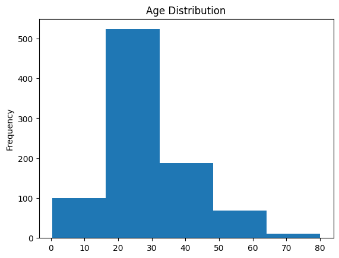

<!-- editorlm-hebrew-html-start -->
<style>
html, body, .vscode-body, .markdown-body, .markdown-preview, #write {
  direction: rtl !important; text-align: right !important;
}
ul, ol { padding-right: 2em !important; padding-left: 0 !important; }
blockquote { border-right: 3px solid #999; border-left: 0; padding-right: 1rem; padding-left: 0; }
@media print {
  html, body, .vscode-body, .markdown-body, .markdown-preview, #write {
    direction: rtl !important; text-align: right !important;
  }
}
</style>
<!-- editorlm-hebrew-html-end -->

<style>
.book { max-width: 900px; margin: auto; line-height: 1.8; font-family: Arial, sans-serif; }
.book .cover { min-height: 680px; box-sizing: border-box; padding: 64px 48px; margin: 24px 0 60px; background: #112b41; color: #f5f8fc; border-top: 9px solid #39c4b5; position: relative; }
.book .cover .eyebrow { color: #81e0d5; font-size: 15px; letter-spacing: 2px; }
.book .cover h1 { color: #fff; font-size: 48px; line-height: 1.3; border: 0; margin: 50px 0 18px; }
.book .cover .subtitle { font-size: 28px; color: #d8e6f0; }
.book .cover .author { font-size: 30px; color: #fff; margin-top: 52px; }
.book .cover .audience { color: #c1d3df; margin-top: 12px; }
.book .cover .motif { direction: ltr; text-align: left; font-family: Consolas, monospace; color: #81e0d5; font-size: 19px; margin-top: 54px; }
.book h1, .book h2, .book h3 { line-height: 1.4; font-weight: 700; }
.book > h1 { font-size: 32px !important; text-align: center !important; margin: 28px 0; }
.book h2 { font-size: 34px !important; text-align: center !important; color: #153b56 !important; background: #eef5fc; border: 0; border-bottom: 4px solid #299c91; border-radius: 10px 10px 0 0; padding: 28px 20px; margin: 24px 0 36px; }
.book h3 { font-size: 24px !important; text-align: right !important; color: #174e49 !important; background: #edf7f5; border: 0; border-right: 5px solid #299c91; border-radius: 6px; padding: 10px 16px; margin: 36px 0 18px; }
.book .chapter { height: 0; margin: 76px 0 0; border-top: 1px solid #ccd7df; break-before: page; page-break-before: always; break-after: avoid; page-break-after: avoid; }
.book .toc { padding: 24px; border-right: 5px solid #39a99d; background: rgba(70,150,155,.09); margin: 24px 0 48px; }
.book pre, .book pre code { direction: ltr !important; text-align: left !important; unicode-bidi: isolate; }
.book pre { box-sizing: border-box !important; width: 100% !important; max-width: 100% !important; margin: 0 !important; padding: 16px 20px; border: 1px solid #ccd7df; border-radius: 8px; line-height: 1.6; overflow-x: auto; }
.book code { direction: ltr; unicode-bidi: isolate; font-family: Consolas, "Courier New", monospace; }
.book pre { background: #f3f6fa !important; color: #1f2937 !important; }
.book pre code, .book pre code.hljs { background: transparent !important; color: #1f2937 !important; }
.book pre .hljs-keyword, .book pre .hljs-literal { color: #6f299c !important; }
.book pre .hljs-string { color: #216338 !important; }
.book pre .hljs-number { color: #075e68 !important; }
.book pre .hljs-comment { color: #526174 !important; }
.book pre .hljs-built_in, .book pre .hljs-title { color: #135b96 !important; }
.book table { width: 100%; }
.book th, .book td { text-align: right; }
.book .small { font-size: .9em; opacity: .8; }
.book .python-intro { display: flex; align-items: center; gap: 28px; padding: 22px 28px; margin: 24px 0; background: #eef5fc; color: #183e63; border-right: 6px solid #3776ab; border-radius: 10px; }
.book .python-intro strong { font-size: 30px; }
.book .python-fact { background: #fff7d6; color: #423611; border-right: 6px solid #ffd343; border-radius: 8px; padding: 18px 24px; margin: 22px 0; }
.book .python-fact strong { font-size: 24px; }
.book img { max-width: 100%; height: auto; }
.book figure { margin: 24px auto; text-align: center; }
.book figure img { display: block; margin: auto; }
.book figcaption { direction: rtl; text-align: center; font-size: .9em; color: #445566; }
@media print { .book > h2 { break-before: page; page-break-before: always; } }
.book .screen-strip { width: 760px; max-width: 100%; height: 220px; overflow: hidden; border: 1px solid #bccad5; border-radius: 8px; margin: 20px auto 8px; direction: ltr; }
.book .screen-strip.output { height: 265px; }
.book .screen-strip img { display: block; width: 1745px; max-width: none; }
.book .screen-menu { width: 400px; max-width: 100%; height: 295px; overflow: hidden; direction: ltr; margin: 20px auto 8px; border: 1px solid #bccad5; border-radius: 8px; }
.book .screen-menu img { display: block; width: 1745px; max-width: none; }
.book .code-panel { box-sizing: border-box !important; display: block !important; width: 50% !important; max-width: 50% !important; margin: 18px auto !important; }
@media print {
  .book .cover { min-height: 85vh; break-after: page; print-color-adjust: exact; -webkit-print-color-adjust: exact; }
  .book pre { white-space: pre-wrap; break-inside: avoid; }
  .book .chapter { margin: 0; border: 0; }
  .book h1, .book h2, .book h3 { break-after: avoid; page-break-after: avoid; break-inside: avoid; }
  .book h2 { margin-top: 0; }
  .book h2, .book h3 { print-color-adjust: exact; -webkit-print-color-adjust: exact; }
}
</style>

<style>
.book .book-nav { display: flex; flex-wrap: wrap; gap: 10px; justify-content: center; align-items: center; padding: 16px 0; margin: 20px 0 32px; border-top: 1px solid #ccd7df; border-bottom: 1px solid #ccd7df; }
.book .book-nav a { display: inline-block; padding: 10px 18px; border-radius: 8px; background: #eef5fc; color: #153b56 !important; border: 1px solid #b5ccd9; text-decoration: none !important; font-size: 16px; font-weight: bold; }
.book .book-nav a.toc-link { background: #174e49; color: #fff !important; border-color: #174e49; }
.book .book-nav a:hover, .book .book-nav a:focus { background: #d4eee8; color: #153b56 !important; outline: 2px solid #299c91; outline-offset: 2px; }
.book .section-list { line-height: 2; }
@media print { .book .book-nav { display: none; } }

/* Explicit Hebrew direction, including prose beginning with English. */
.book p, .book ul, .book ol, .book li,
.book blockquote, .book h1, .book h2, .book h3,
.book h4, .book th, .book td {
  direction: rtl !important;
  text-align: right !important;
  unicode-bidi: isolate;
}
/* Chapter titles keep their agreed centered layout. */
.book h2 { text-align: center !important; }
.book pre, .book pre code, .book .code-panel {
  direction: ltr !important;
  text-align: left !important;
  unicode-bidi: isolate;
}
</style>

<style>
.book img { max-width: 100%; height: auto; object-fit: contain; }
.book .python-intro { display: flex; align-items: center; gap: 24px; padding: 22px; background: #edf7f5; border-radius: 12px; margin: 24px 0; color: #153b56; }
.book .python-intro img { width: 105px; height: auto; }
.book .python-fact { padding: 20px; background: #fff5ce; border-right: 5px solid #f0c444; border-radius: 8px; color: #153b56; }
.book .screen-menu, .book .screen-strip, .book .screen-strip.output { text-align: center; margin: 20px auto; max-width: 100%; height: auto !important; overflow: visible; }
.book .screen-menu img, .book .screen-strip img { width: auto; max-width: 100%; height: auto; }
.book h4 { font-size: 21px; color: #153b56; margin-top: 28px; }
@media print { .book > h2 { break-before: page; page-break-before: always; } }
</style>

<div class="book" dir="rtl" lang="he" style="direction: rtl !important; text-align: right !important;">

<nav class="book-nav" aria-label="ניווט בפרקים">
<a href="23-Pandas%20%D7%98%D7%91%D7%9C%D7%90%D7%95%D7%AA.md">→ הקודם</a>
<a class="toc-link" href="../index.md#book-toc">תוכן העניינים</a>
<a href="../03-%D7%9C%D7%9E%D7%99%D7%93%D7%AA%20%D7%9E%D7%9B%D7%95%D7%A0%D7%94/01-%D7%9E%D7%91%D7%95%D7%90.md">הבא ←</a>
</nav>

## א.24 — Pandas — ניקוי, קיבוץ וניתוח נתונים

טבלה שנקראת מקובץ אינה בהכרח מוכנה לניתוח. ייתכן שחסרים בה ערכים, שהעמודות מכילות טיפוסים לא מתאימים, או שהשאלה דורשת להשוות בין קבוצות. נלמד לבדוק את הנתונים, לבחור טיפול מפורש בחסרים ולסכם תוצאות.

**[מחברות האוניברסיטה הפתוחה — 13 קבצים וחבילות](https://drive.google.com/drive/folders/1yLN-J12Mq3KZ0i6XJwpaA3XMC6xoh4GJ?usp=sharing)**


### מתחילים מטבלה קטנה

ערך חסר אומר שהנתון אינו ידוע; הוא אינו שקול לאפס. `isna()` מסמנת חסרים ו־`sum()` סופרת אותם בכל עמודה.

<div class="code-panel" dir="ltr" style="box-sizing: border-box !important; width: 50% !important; max-width: 50% !important; margin: 18px auto !important; direction: ltr !important; text-align: left !important;">

```python
import pandas as pd
data = pd.DataFrame({
    "Group": ["A", "A", "B"],
    "Score": [80, None, 100]
})
print(data["Score"].isna().sum())
print(data["Score"].mean())
```

</div>

**פלט**

<div class="code-panel" dir="ltr" style="box-sizing: border-box !important; width: 50% !important; max-width: 50% !important; margin: 18px auto !important; direction: ltr !important; text-align: left !important;">

```text
1
90.0
```

</div>

הממוצע מחושב מהערכים הקיימים. נחליט אם להסיר רשומה באמצעות `dropna`, או למלא בעזרת `fillna`. מילוי בממוצע אינו נתון שנמדד, ויש להבין כיצד הוא משפיע על המסקנות.

<div class="code-panel" dir="ltr" style="box-sizing: border-box !important; width: 50% !important; max-width: 50% !important; margin: 18px auto !important; direction: ltr !important; text-align: left !important;">

```python
filled = data.copy()
filled["Score"] = filled["Score"].fillna(
    filled["Score"].mean())
print(filled["Score"].tolist())
```

</div>

**פלט**

<div class="code-panel" dir="ltr" style="box-sizing: border-box !important; width: 50% !important; max-width: 50% !important; margin: 18px auto !important; direction: ltr !important; text-align: left !important;">

```text
[80.0, 90.0, 100.0]
```

</div>

`ffill` מעתיקה את הערך הקודם ו־`bfill` את הבא. משתמשים בהן רק אם לסדר הרשומות יש משמעות שמצדיקה זאת, ולא כהשלמה אוטומטית לכל טבלה.

### קיבוץ — groupby

`groupby` מחלקת רשומות לקבוצות לפי ערכי עמודה. אחריה בוחרים עמודה מספרית ופעולת סיכום:

<div class="code-panel" dir="ltr" style="box-sizing: border-box !important; width: 50% !important; max-width: 50% !important; margin: 18px auto !important; direction: ltr !important; text-align: left !important;">

```python
means = filled.groupby("Group")["Score"].mean()
print(means.loc["A"])
print(means.loc["B"])
```

</div>

**פלט**

<div class="code-panel" dir="ltr" style="box-sizing: border-box !important; width: 50% !important; max-width: 50% !important; margin: 18px auto !important; direction: ltr !important; text-align: left !important;">

```text
85.0
100.0
```

</div>

קבוצה A מכילה שני ציונים, וקבוצה B ציון אחד. `value_counts` סופרת הופעות של כל ערך; `count` סופרת ערכים שאינם חסרים. תמיד בדקו מה נספר ומאיזו טבלה חושבה התוצאה.

### דוגמת המחברת — Titanic

פתחו במחברת 13 את קובץ הליווי `titanic.csv` והעלו אותו לנתיב המופיע בדוגמה. כל שורה מייצגת נוסע; `Age` היא גיל, `Pclass` מחלקת נסיעה ו־`Survived` מציינת 1 לשורד ו־0 למי שלא שרד.

<div class="code-panel" dir="ltr" style="box-sizing: border-box !important; width: 50% !important; max-width: 50% !important; margin: 18px auto !important; direction: ltr !important; text-align: left !important;">

```python
df = pd.read_csv("/content/sample_data/titanic.csv")
print(df.shape)
print(df["Age"].isna().sum())
```

</div>

**פלט**

<div class="code-panel" dir="ltr" style="box-sizing: border-box !important; width: 50% !important; max-width: 50% !important; margin: 18px auto !important; direction: ltr !important; text-align: left !important;">

```text
(891, 12)
177
```

</div>

אלה נתוני הגרסה שבמחברת: 714 גילים ידועים מתוך 891. אפשר לחשב שיעור הישרדות בקבוצות באמצעות ממוצע העמודה הבינארית:

<div class="code-panel" dir="ltr" style="box-sizing: border-box !important; width: 50% !important; max-width: 50% !important; margin: 18px auto !important; direction: ltr !important; text-align: left !important;">

```python
rates = df.groupby("Sex")["Survived"].mean()
print(round(rates.loc["female"], 6))
print(round(rates.loc["male"], 6))
```

</div>

**פלט**

<div class="code-panel" dir="ltr" style="box-sizing: border-box !important; width: 50% !important; max-width: 50% !important; margin: 18px auto !important; direction: ltr !important; text-align: left !important;">

```text
0.742038
0.188908
```

</div>

ממוצע של אפסים ואחדים הוא החלק היחסי של האחדים. זה תיאור של הקבוצות שבטבלה, ולא הוכחה לסיבת ההבדל.

### מציגים התפלגות

בדוגמה השמורה במחברת משלימים גילים חסרים בממוצע ואז מציגים חמישה טווחים בהיסטוגרמה:

<div class="code-panel" dir="ltr" style="box-sizing: border-box !important; width: 50% !important; max-width: 50% !important; margin: 18px auto !important; direction: ltr !important; text-align: left !important;">

```python
import matplotlib.pyplot as plt
ages = df["Age"].fillna(df["Age"].mean())
ages.plot(kind="hist", bins=5, title="Age Distribution")
plt.show()
```

</div>



ריבוי הערכים סביב הממוצע מושפע גם מהמילוי שביצענו. כדי לראות את ההתפלגות של הגילים הידועים בלבד, אפשר לצייר את העמודה לפני המילוי ולציין שהחסרים לא נספרו. `plot(kind="bar")` מתאימה להשוואת קבוצות, ואילו `hist` מציגה טווחים מספריים.

### ממשיכים לאותה שאלה בנתונים אחרים

בחלק הבא של מחברת 13 מנותח דו״ח האושר העולמי לשנת 2017: בודקים רשומות, מאתרים מדינות ומחשבים ממוצע לפי אזור. מחברת 15.1 מדגימה ניקוי וסינון של טבלת דירות Airbnb. בשתיהן נשאל אותן שאלות: מה מייצגת שורה, מה משמעות עמודה, אילו ערכים חסרים ומה בדיוק מסכם הגרף. פלטי המקור הם תוצאות של גרסאות הנתונים שבמחברות, ולא נתונים עדכניים על המדינות או הדירות.

<!-- editorlm-source-ref: [sources/אוניברסיטה פתוחה/converted/13 קבצים וחבילות/notebook.md#L5271-L5366] -->

<!-- editorlm-source-ref: [sources/אוניברסיטה פתוחה/converted/13 קבצים וחבילות/notebook.md#L5873-L6003] -->

<!-- editorlm-source-ref: [sources/אוניברסיטה פתוחה/converted/13 קבצים וחבילות/notebook.md#L6005-L6034] -->

<!-- editorlm-source-ref: [sources/אוניברסיטה פתוחה/converted/13 קבצים וחבילות/notebook.md#L7306-L7404] -->

<!-- editorlm-source-ref: [sources/אוניברסיטה פתוחה/converted/15.1 חזרה למבחן מעודכן/notebook.md#L2123-L2152] -->

<nav class="book-nav" aria-label="ניווט בפרקים">
<a href="23-Pandas%20%D7%98%D7%91%D7%9C%D7%90%D7%95%D7%AA.md">→ הקודם</a>
<a class="toc-link" href="../index.md#book-toc">תוכן העניינים</a>
<a href="../03-%D7%9C%D7%9E%D7%99%D7%93%D7%AA%20%D7%9E%D7%9B%D7%95%D7%A0%D7%94/01-%D7%9E%D7%91%D7%95%D7%90.md">הבא ←</a>
</nav>

</div>

<!-- editorlm-source-versions: {"schemaVersion": 1, "sources": {"sources/אוניברסיטה פתוחה/converted/13 קבצים וחבילות/notebook.md": {"sourceSha256": "72f78d2cc269130b155ab95d725252bc74229ef4e72f4eaedc2906dc9d4980a3", "canonicalTextSha256": "72f78d2cc269130b155ab95d725252bc74229ef4e72f4eaedc2906dc9d4980a3"}, "sources/אוניברסיטה פתוחה/converted/15.1 חזרה למבחן מעודכן/notebook.md": {"sourceSha256": "6d2013d2efb13f74fc607e788264990ee357076e1261186671c58f38bc089019", "canonicalTextSha256": "6d2013d2efb13f74fc607e788264990ee357076e1261186671c58f38bc089019"}}} -->
