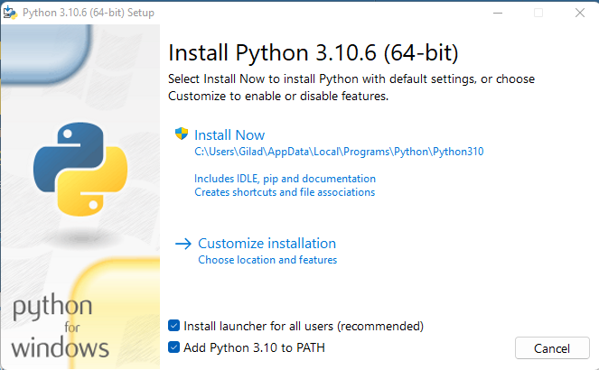
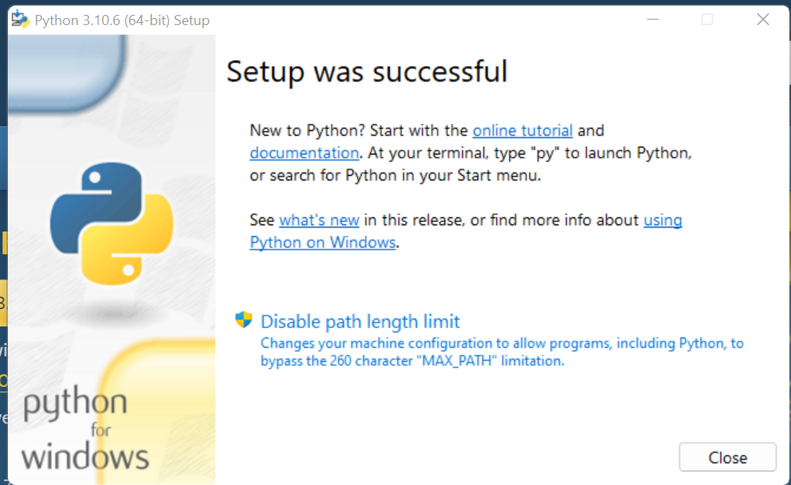
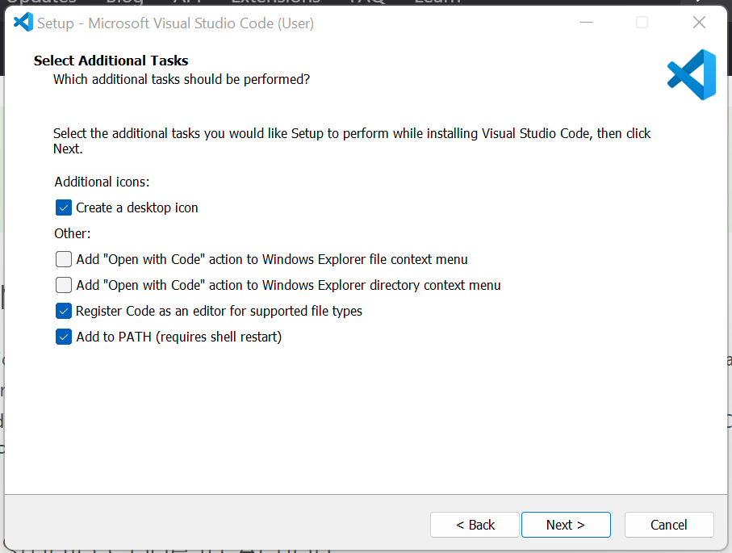
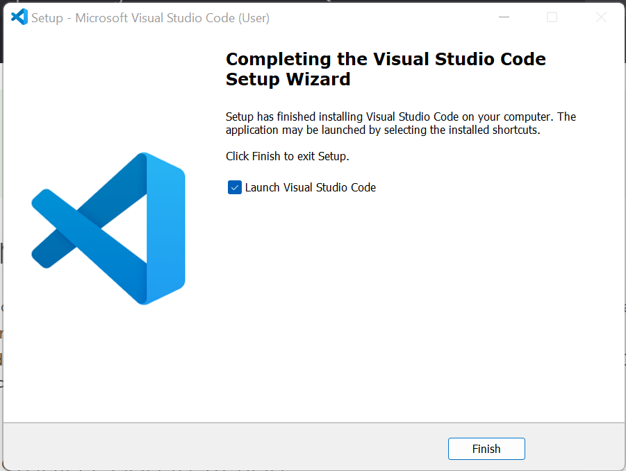
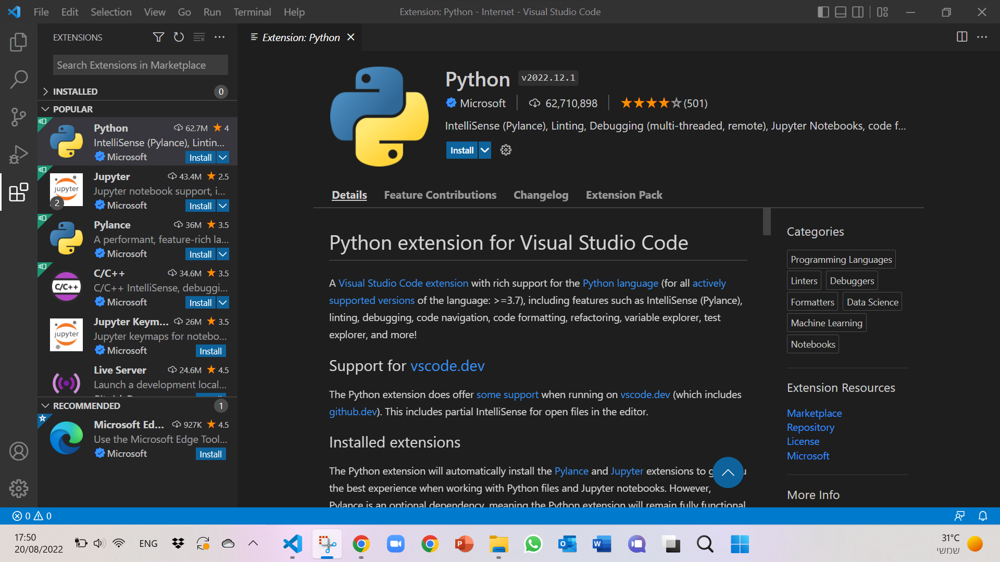
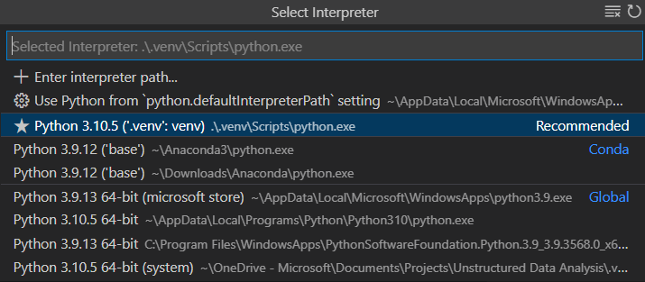
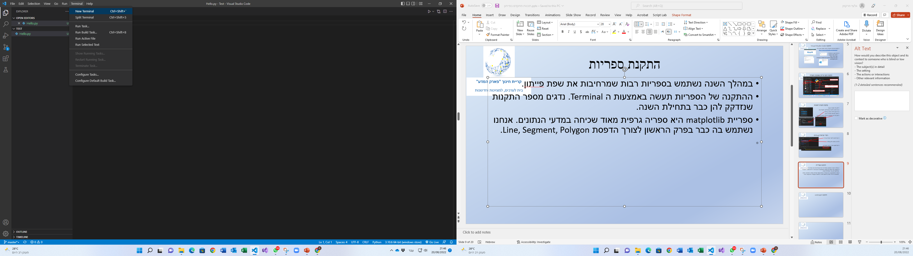
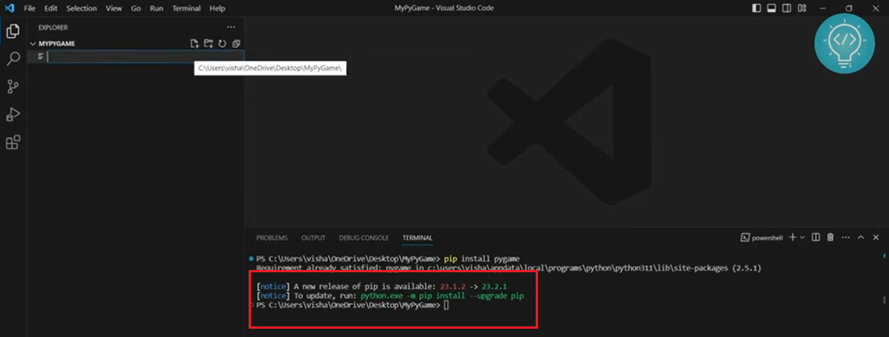
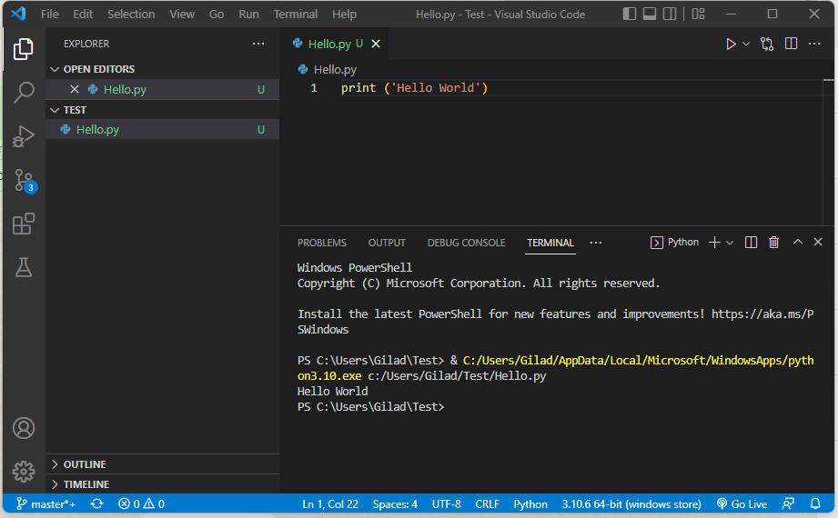

<!-- editorlm-hebrew-html-start -->
<style>
html, body, .vscode-body, .markdown-body, .markdown-preview, #write {
  direction: rtl !important; text-align: right !important;
}
ul, ol { padding-right: 2em !important; padding-left: 0 !important; }
blockquote { border-right: 3px solid #999; border-left: 0; padding-right: 1rem; padding-left: 0; }
@media print {
  html, body, .vscode-body, .markdown-body, .markdown-preview, #write {
    direction: rtl !important; text-align: right !important;
  }
}
</style>
<!-- editorlm-hebrew-html-end -->
<style>
.book { max-width: 900px; margin: auto; line-height: 1.8; font-family: Arial, sans-serif; }
.book .cover { min-height: 680px; box-sizing: border-box; padding: 64px 48px; margin: 24px 0 60px; background: #112b41; color: #f5f8fc; border-top: 9px solid #39c4b5; position: relative; }
.book .cover .eyebrow { color: #81e0d5; font-size: 15px; letter-spacing: 2px; }
.book .cover h1 { color: #fff; font-size: 48px; line-height: 1.3; border: 0; margin: 50px 0 18px; }
.book .cover .subtitle { font-size: 28px; color: #d8e6f0; }
.book .cover .author { font-size: 30px; color: #fff; margin-top: 52px; }
.book .cover .audience { color: #c1d3df; margin-top: 12px; }
.book .cover .motif { direction: ltr; text-align: left; font-family: Consolas, monospace; color: #81e0d5; font-size: 19px; margin-top: 54px; }
.book h1, .book h2, .book h3 { line-height: 1.4; font-weight: 700; }
.book > h1 { font-size: 32px !important; text-align: center !important; margin: 28px 0; }
.book h2 { font-size: 34px !important; text-align: center !important; color: #153b56 !important; background: #eef5fc; border: 0; border-bottom: 4px solid #299c91; border-radius: 10px 10px 0 0; padding: 28px 20px; margin: 24px 0 36px; }
.book h3 { font-size: 24px !important; text-align: right !important; color: #174e49 !important; background: #edf7f5; border: 0; border-right: 5px solid #299c91; border-radius: 6px; padding: 10px 16px; margin: 36px 0 18px; }
.book .chapter { height: 0; margin: 76px 0 0; border-top: 1px solid #ccd7df; break-before: page; page-break-before: always; break-after: avoid; page-break-after: avoid; }
.book .toc { padding: 24px; border-right: 5px solid #39a99d; background: rgba(70,150,155,.09); margin: 24px 0 48px; }
.book pre, .book pre code { direction: ltr !important; text-align: left !important; unicode-bidi: isolate; }
.book pre { box-sizing: border-box !important; width: 100% !important; max-width: 100% !important; margin: 0 !important; padding: 16px 20px; border: 1px solid #ccd7df; border-radius: 8px; line-height: 1.6; overflow-x: auto; }
.book code { direction: ltr; unicode-bidi: isolate; font-family: Consolas, "Courier New", monospace; }
.book pre { background: #f3f6fa !important; color: #1f2937 !important; }
.book pre code, .book pre code.hljs { background: transparent !important; color: #1f2937 !important; }
.book pre .hljs-keyword, .book pre .hljs-literal { color: #6f299c !important; }
.book pre .hljs-string { color: #216338 !important; }
.book pre .hljs-number { color: #075e68 !important; }
.book pre .hljs-comment { color: #526174 !important; }
.book pre .hljs-built_in, .book pre .hljs-title { color: #135b96 !important; }
.book table { width: 100%; }
.book th, .book td { text-align: right; }
.book .small { font-size: .9em; opacity: .8; }
.book .python-intro { display: flex; align-items: center; gap: 28px; padding: 22px 28px; margin: 24px 0; background: #eef5fc; color: #183e63; border-right: 6px solid #3776ab; border-radius: 10px; }
.book .python-intro strong { font-size: 30px; }
.book .python-fact { background: #fff7d6; color: #423611; border-right: 6px solid #ffd343; border-radius: 8px; padding: 18px 24px; margin: 22px 0; }
.book .python-fact strong { font-size: 24px; }
.book img { max-width: 100%; height: auto; }
.book figure { margin: 24px auto; text-align: center; }
.book figure img { display: block; margin: auto; }
.book figcaption { direction: rtl; text-align: center; font-size: .9em; color: #445566; }
@media print { .book > h2 { break-before: page; page-break-before: always; } }
.book .screen-strip { width: 760px; max-width: 100%; height: 220px; overflow: hidden; border: 1px solid #bccad5; border-radius: 8px; margin: 20px auto 8px; direction: ltr; }
.book .screen-strip.output { height: 265px; }
.book .screen-strip img { display: block; width: 1745px; max-width: none; }
.book .screen-menu { width: 400px; max-width: 100%; height: 295px; overflow: hidden; direction: ltr; margin: 20px auto 8px; border: 1px solid #bccad5; border-radius: 8px; }
.book .screen-menu img { display: block; width: 1745px; max-width: none; }
.book .code-panel { box-sizing: border-box !important; display: block !important; width: 75% !important; max-width: 75% !important; margin: 18px auto !important; }
@media print {
  .book .cover { min-height: 85vh; break-after: page; print-color-adjust: exact; -webkit-print-color-adjust: exact; }
  .book pre { white-space: pre-wrap; break-inside: avoid; }
  .book .chapter { margin: 0; border: 0; }
  .book h1, .book h2, .book h3 { break-after: avoid; page-break-after: avoid; break-inside: avoid; }
  .book h2 { margin-top: 0; }
  .book h2, .book h3 { print-color-adjust: exact; -webkit-print-color-adjust: exact; }
}
</style>

<style>
.book .book-nav { display: flex; flex-wrap: wrap; gap: 10px; justify-content: center; align-items: center; padding: 16px 0; margin: 20px 0 32px; border-top: 1px solid #ccd7df; border-bottom: 1px solid #ccd7df; }
.book .book-nav a { display: inline-block; padding: 10px 18px; border-radius: 8px; background: #eef5fc; color: #153b56 !important; border: 1px solid #b5ccd9; text-decoration: none !important; font-size: 16px; font-weight: bold; }
.book .book-nav a.toc-link { background: #174e49; color: #fff !important; border-color: #174e49; }
.book .book-nav a:hover, .book .book-nav a:focus { background: #d4eee8; color: #153b56 !important; outline: 2px solid #299c91; outline-offset: 2px; }
.book .section-list { line-height: 2; }
@media print { .book .book-nav { display: none; } }

/* Explicit Hebrew direction, including prose beginning with English. */
.book p, .book ul, .book ol, .book li,
.book blockquote, .book h1, .book h2, .book h3,
.book h4, .book th, .book td {
  direction: rtl !important;
  text-align: right !important;
  unicode-bidi: isolate;
}
/* Chapter titles keep their agreed centered layout. */
.book h2 { text-align: center !important; }
.book pre, .book pre code, .book .code-panel {
  direction: ltr !important;
  text-align: left !important;
  unicode-bidi: isolate;
}
</style>

<div class="book" dir="rtl" lang="he" style="direction: rtl !important; text-align: right !important;">


<nav class="book-nav" aria-label="ניווט בספר">
<a href="../01-%D7%A4%D7%99%D7%99%D7%AA%D7%95%D7%9F/24-Pandas%20%D7%A0%D7%99%D7%AA%D7%95%D7%97%20%D7%A0%D7%AA%D7%95%D7%A0%D7%99%D7%9D.md">→ הקודם</a>
<a class="toc-link" href="../index.md">תוכן העניינים</a>
<a href="02-%D7%94%D7%9C%D7%95%D7%9C%D7%90%D7%94%20%D7%94%D7%A8%D7%90%D7%A9%D7%99%D7%AA.md">הבא ←</a>
</nav>

## ב.1 — מעבר מ־Colab לעבודה מקומית

עד עכשיו כתבנו קוד במחברות Colab, והקוד רץ במחשב מרוחק דרך הדפדפן. בחלק זה נעבוד **במחשב המקומי**: תוכנית Pygame תפתח חלון על המסך שלנו ותקלוט לחיצות מהמקלדת ומהעכבר. נכתוב קובצי Python רגילים ונריץ אותם מתוך VS Code.

לשם כך דרושים שלושה כלים נפרדים: **Python** מריצה את הקוד; **VS Code** היא סביבת העריכה; והרחבת **Python של Microsoft** מחברת את העורך לכלי ההרצה של השפה. לאחר התקנתם נוסיף את ספריית Pygame.

**המצגות:** [התקנת פייתון וסביבת העבודה](../../../sources/ML/0.%20התקנת%20פייתון%20וסביבת%20העבודה.pptx) · [מבוא ל־Pygame](../../../sources/PyGame/2.PyGame.pptx)

ההוראות כאן מדגימות עבודה ב־Windows. צילומי המתקינים מהקורס מציגים גרסאות קודמות, ולכן מספרי הגרסה ועיצוב החלונות עשויים להיות שונים; הפעולות החשובות מוסברות ליד כל צילום.

### א. מתקינים Python

נתקין תחילה את Python, שתאפשר למחשב להריץ את קובצי הקוד שלנו. פותחים את [עמוד ההורדות ל־Windows באתר Python](https://www.python.org/downloads/windows/). לצורך מסלול ההתקנה המוצג כאן בוחרים מתקין רגיל, **Windows installer (64-bit)** של Python 3.13, עבור מחשב Windows עם מעבד x64. אין לבחור בחבילת `embeddable` המיועדת לשילוב Python בתוך יישומים. מחשב ARM דורש מתקין מתאים לארכיטקטורה שלו.

מריצים את קובץ ההתקנה. במסך הראשון מסמנים **Add python.exe to PATH** ולוחצים **Install Now**. ההוספה ל־PATH מאפשרת להפעיל את Python מתוך הטרמינל בלי לכתוב את הנתיב המלא שלה. ממתינים להודעת סיום ההתקנה ולוחצים **Close**.

<figure>

<figcaption>דוגמת המתקין הקלאסי: Add Python to PATH ו־Install Now. בצילום מופיעה גרסה קודמת, 3.10.6.</figcaption>
</figure>

<figure>

<figcaption>הודעת סיום מוצלח במתקין הקלאסי.</figcaption>
</figure>

אם כבר מותקנת במחשב גרסת Python מתאימה, אין צורך להתקין אותה שוב. לאחר התקנה חדשה יש לפתוח טרמינל חדש, כדי שיזהה את שינויי ההתקנה. נבדוק את הגרסה לאחר פתיחת VS Code.

### ב. מתקינים VS Code ואת הרחבת Python

כעת נכין את העורך שבו נכתוב ונריץ את התוכניות. מורידים את [VS Code](https://code.visualstudio.com/download) עבור Windows ומריצים את המתקין. בוחרים את שפת ההתקנה אם מתבקשים, מאשרים את תנאי הרישיון ומתקדמים באמצעות **Next**. במסך האפשרויות הנוספות אפשר להשאיר את ההוספה ל־PATH מסומנת. לוחצים **Install**, ובסיום מפעילים את VS Code.

<figure>

<figcaption>אפשרויות נוספות בהתקנת VS Code; בצילום מסומנת גם ההוספה ל־PATH.</figcaption>
</figure>

<figure>

<figcaption>סיום התקנת VS Code והפעלת העורך.</figcaption>
</figure>

בעורך פותחים את לשונית **Extensions** שבסרגל הצד, או משתמשים בקיצור **Ctrl+Shift+X**. מחפשים `Python`, בוחרים את ההרחבה שהמפרסם שלה הוא **Microsoft** ולוחצים **Install**. התקנת ההרחבה אינה מתקינה את Python עצמה.

<figure>

<figcaption>הרחבת Python של Microsoft: חיפוש ההרחבה וכפתור Install. צילום מגרסה קודמת.</figcaption>
</figure>

### פותחים תיקיית עבודה ובוחרים את Python

תיקיית עבודה מרכזת את קובצי התוכנית, ובחירת המפרש קובעת איזו התקנת Python תריץ אותם. יוצרים תיקייה בשם `pygame_lessons`. ב־VS Code בוחרים **File → Open Folder** ופותחים אותה. יוצרים קובץ בשם `check_pygame.py`. לא משתמשים בשם `pygame.py`, כדי שלא להסתיר בטעות את הספרייה שנרצה לייבא.

פותחים את לוח הפקודות באמצעות **Ctrl+Shift+P**, מחפשים **Python: Select Interpreter** ובוחרים את Python שהתקנו. המפרש הוא התוכנית שמריצה את הקוד שלנו; הבחירה הזו חשובה כאשר מותקנות במחשב כמה גרסאות.

<figure>

<figcaption>רשימת המפרשים — בחרו את ההתקנה שלכם, ולא בהכרח את השורה המסומנת בדוגמה. צילום מתוך <a href="https://code.visualstudio.com/docs/python/python-tutorial">התיעוד של Microsoft</a>.</figcaption>
</figure>

### ג. מתקינים Pygame בטרמינל של VS Code

כדי להשתמש ביכולות הגרפיקה והקלט של Pygame, נוסיף אותה להתקנת Python. בוחרים **Terminal → New Terminal**. בתחתית העורך ייפתח הטרמינל — המקום שבו מקלידים פקודות התקנה והרצה. הוא שונה מקובץ הקוד שמעליו.

<figure>
<div style="width:740px;max-width:100%;height:360px;overflow:hidden;direction:ltr;margin:auto;border:1px solid #ccd7df;border-radius:8px">

</div>
<figcaption>תקריב תפריט Terminal ובחירת New Terminal. <a href="../assets/pygame/install/related-8-image16.png">הצילום המלא</a>.</figcaption>
</figure>

תחילה בודקים שהפקודה Python זמינה:

<div class="code-panel" dir="ltr">

```powershell
python --version
```

</div>

אמורה להופיע גרסת Python. לאחר מכן מתקינים את הספרייה:

<div class="code-panel" dir="ltr">

```powershell
pip install pygame
```

</div>

ממתינים לסיום הפקודה. הודעה כגון `Successfully installed pygame...` מציינת התקנה מוצלחת. אם הספרייה כבר מותקנת, עשויה להופיע `Requirement already satisfied`. את פקודת `pip install` מקלידים בטרמינל, **לא בקובץ Python ולא אחרי הסימן `>>>`** של המפרש האינטראקטיבי.

<figure>
<div style="width:850px;max-width:100%;height:220px;overflow:hidden;direction:ltr;margin:auto;border:1px solid #ccd7df;border-radius:8px">

</div>
<figcaption>הפקודה והודעת Requirement already satisfied כאשר הספרייה כבר מותקנת. זהו צילום מגרסה קודמת, מתוך <a href="https://www.thecodecity.com/python/install-and-setup-pygame-with-vs-code/">The Code City</a>; <a href="../assets/pygame/install/pygame-pip-vscode.png">הצילום המלא</a>.</figcaption>
</figure>

אם `pip` אינו מזוהה, או כדי לוודא שמתקינים עבור Python שבה משתמשים בטרמינל, מפעילים:

<div class="code-panel" dir="ltr">

```powershell
python -m pip install pygame
```

</div>

אם ההתקנה מצליחה אבל הייבוא נכשל, בדקו שב־**Python: Select Interpreter** בחרתם את אותו מפרש. בחירת מפרש בעורך ופקודת `python` בטרמינל אינן בהכרח מפנות לאותה התקנה כשיש כמה גרסאות; אפשר לבדוק את הנתיב באמצעות `python -c "import sys; print(sys.executable)"` ולהשוות למפרש הנבחר.

### ד. מייבאים את הספרייה ובודקים את ההתקנה

נריץ תוכנית קצרה כדי לוודא ש־Python מצליחה לטעון את Pygame. בקובץ `check_pygame.py` כותבים:

<div class="code-panel" dir="ltr">

```python
import pygame

print("Pygame import succeeded")
```

</div>

שומרים באמצעות **Ctrl+S** ולוחצים על **Run Python File** — כפתור המשולש בפינה העליונה של העורך. אפשר גם להריץ מהטרמינל מתוך תיקיית העבודה:

<div class="code-panel" dir="ltr">

```powershell
python check_pygame.py
```

</div>

**פלט**

<div class="code-panel" dir="ltr">

```text
Pygame import succeeded
```

</div>

זוהי שורת ההצלחה של הקוד שלנו; Pygame עשויה להציג לפניה גם הודעת פתיחה ופרטי גרסה. אם אין שגיאה והודעת ההצלחה מופיעה, הספרייה זמינה למפרש שהריץ את הקובץ. בשלב זה לא נפתח חלון גרפי — ניצור אותו בפרק הבא.

<figure>

<figcaption>כפתור ההרצה והטרמינל ב־VS Code. הצילום מדגים Hello World; בקובץ שלנו נריץ את בדיקת הייבוא.</figcaption>
</figure>

אם מופיעה השגיאה `ModuleNotFoundError: No module named 'pygame'`, חוזרים לבחירת המפרש ולהתקנה עבורו. שגיאה אינה נפתרת על ידי העתקת פקודת ההתקנה אל הקובץ.

**מכאן והלאה עובדים בקבצים המקומיים ב־VS Code.** קובץ הקוד, התמונות והטרמינל שייכים לתיקיית העבודה המקומית, ולא למחברת Colab.

מקורות להוראות ההתקנה: [Python ב־VS Code](https://code.visualstudio.com/docs/python/python-tutorial), [התקנת VS Code ב־Windows](https://code.visualstudio.com/docs/setup/windows).

**קוד להורדה:** [הדוגמה המלאה](../assets/pygame/examples/01-demo.py).

<!-- editorlm-source-ref: [sources/ML/0. התקנת פייתון וסביבת העבודה.pptx#L7-L39] [sources/ML/0. התקנת פייתון וסביבת העבודה.pptx#L47-L51] [sources/PyGame/2.PyGame.pptx#L13-L17] -->

<!-- editorlm-source-versions: {"schemaVersion": 1, "sources": {"sources/PyGame/2.PyGame.pptx": {"sourceSha256": "ad8a1baf72d2e6232ec3fd8d896c4a4c9e76d5f5f8c4376432567af68cb4f3cc", "canonicalTextSha256": "33ec3ad2594bbcce74bc94565c260c8f572a208e4ec22e740ca97792fc85d99e"}, "sources/ML/0. התקנת פייתון וסביבת העבודה.pptx": {"sourceSha256": "0d45f2b9f985d2440a4a7f60c83731c3cd542c55a3c78e15a8ad2b2c57f65695", "canonicalTextSha256": "f10a53a297a98bec13fb4460a65c21bac99fcca645ce99f8b4aa8486f8ca2304"}}} -->
<nav class="book-nav" aria-label="ניווט בספר">
<a href="../01-%D7%A4%D7%99%D7%99%D7%AA%D7%95%D7%9F/24-Pandas%20%D7%A0%D7%99%D7%AA%D7%95%D7%97%20%D7%A0%D7%AA%D7%95%D7%A0%D7%99%D7%9D.md">→ הקודם</a>
<a class="toc-link" href="../index.md">תוכן העניינים</a>
<a href="02-%D7%94%D7%9C%D7%95%D7%9C%D7%90%D7%94%20%D7%94%D7%A8%D7%90%D7%A9%D7%99%D7%AA.md">הבא ←</a>
</nav>

</div>
