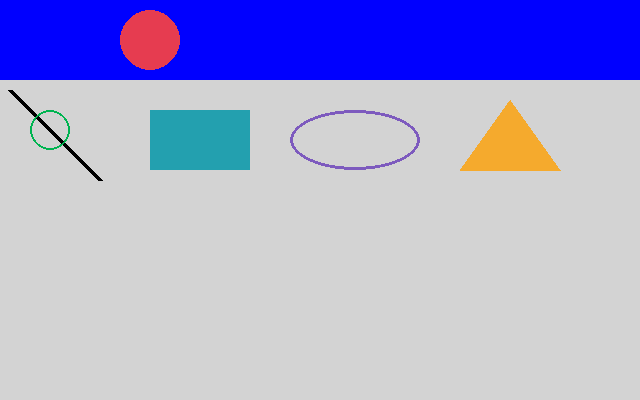
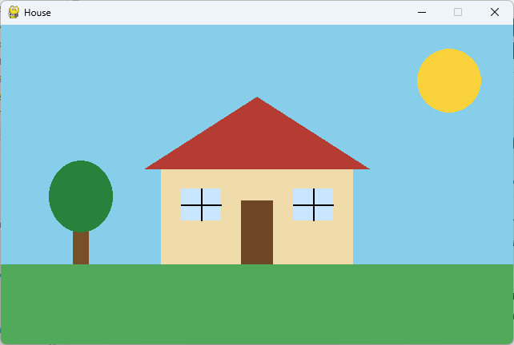

<!-- editorlm-hebrew-html-start -->
<style>
html, body, .vscode-body, .markdown-body, .markdown-preview, #write {
  direction: rtl !important; text-align: right !important;
}
ul, ol { padding-right: 2em !important; padding-left: 0 !important; }
blockquote { border-right: 3px solid #999; border-left: 0; padding-right: 1rem; padding-left: 0; }
@media print {
  html, body, .vscode-body, .markdown-body, .markdown-preview, #write {
    direction: rtl !important; text-align: right !important;
  }
}
</style>
<!-- editorlm-hebrew-html-end -->
<style>
.book { max-width: 900px; margin: auto; line-height: 1.8; font-family: Arial, sans-serif; }
.book .cover { min-height: 680px; box-sizing: border-box; padding: 64px 48px; margin: 24px 0 60px; background: #112b41; color: #f5f8fc; border-top: 9px solid #39c4b5; position: relative; }
.book .cover .eyebrow { color: #81e0d5; font-size: 15px; letter-spacing: 2px; }
.book .cover h1 { color: #fff; font-size: 48px; line-height: 1.3; border: 0; margin: 50px 0 18px; }
.book .cover .subtitle { font-size: 28px; color: #d8e6f0; }
.book .cover .author { font-size: 30px; color: #fff; margin-top: 52px; }
.book .cover .audience { color: #c1d3df; margin-top: 12px; }
.book .cover .motif { direction: ltr; text-align: left; font-family: Consolas, monospace; color: #81e0d5; font-size: 19px; margin-top: 54px; }
.book h1, .book h2, .book h3 { line-height: 1.4; font-weight: 700; }
.book > h1 { font-size: 32px !important; text-align: center !important; margin: 28px 0; }
.book h2 { font-size: 34px !important; text-align: center !important; color: #153b56 !important; background: #eef5fc; border: 0; border-bottom: 4px solid #299c91; border-radius: 10px 10px 0 0; padding: 28px 20px; margin: 24px 0 36px; }
.book h3 { font-size: 24px !important; text-align: right !important; color: #174e49 !important; background: #edf7f5; border: 0; border-right: 5px solid #299c91; border-radius: 6px; padding: 10px 16px; margin: 36px 0 18px; }
.book .chapter { height: 0; margin: 76px 0 0; border-top: 1px solid #ccd7df; break-before: page; page-break-before: always; break-after: avoid; page-break-after: avoid; }
.book .toc { padding: 24px; border-right: 5px solid #39a99d; background: rgba(70,150,155,.09); margin: 24px 0 48px; }
.book pre, .book pre code { direction: ltr !important; text-align: left !important; unicode-bidi: isolate; }
.book pre { box-sizing: border-box !important; width: 100% !important; max-width: 100% !important; margin: 0 !important; padding: 16px 20px; border: 1px solid #ccd7df; border-radius: 8px; line-height: 1.6; overflow-x: auto; }
.book code { direction: ltr; unicode-bidi: isolate; font-family: Consolas, "Courier New", monospace; }
.book pre { background: #f3f6fa !important; color: #1f2937 !important; }
.book pre code, .book pre code.hljs { background: transparent !important; color: #1f2937 !important; }
.book pre .hljs-keyword, .book pre .hljs-literal { color: #6f299c !important; }
.book pre .hljs-string { color: #216338 !important; }
.book pre .hljs-number { color: #075e68 !important; }
.book pre .hljs-comment { color: #526174 !important; }
.book pre .hljs-built_in, .book pre .hljs-title { color: #135b96 !important; }
.book table { width: 75%; max-width: 75%; margin: 18px auto; }
.book th, .book td { text-align: right; }
.book .small { font-size: .9em; opacity: .8; }
.book .python-intro { display: flex; align-items: center; gap: 28px; padding: 22px 28px; margin: 24px 0; background: #eef5fc; color: #183e63; border-right: 6px solid #3776ab; border-radius: 10px; }
.book .python-intro strong { font-size: 30px; }
.book .python-fact { background: #fff7d6; color: #423611; border-right: 6px solid #ffd343; border-radius: 8px; padding: 18px 24px; margin: 22px 0; }
.book .python-fact strong { font-size: 24px; }
.book img { max-width: 100%; height: auto; }
.book figure { margin: 24px auto; text-align: center; }
.book figure img { display: block; margin: auto; }
.book figcaption { direction: rtl; text-align: center; font-size: .9em; color: #445566; }
@media print { .book > h2 { break-before: page; page-break-before: always; } }
.book .screen-strip { width: 760px; max-width: 100%; height: 220px; overflow: hidden; border: 1px solid #bccad5; border-radius: 8px; margin: 20px auto 8px; direction: ltr; }
.book .screen-strip.output { height: 265px; }
.book .screen-strip img { display: block; width: 1745px; max-width: none; }
.book .screen-menu { width: 400px; max-width: 100%; height: 295px; overflow: hidden; direction: ltr; margin: 20px auto 8px; border: 1px solid #bccad5; border-radius: 8px; }
.book .screen-menu img { display: block; width: 1745px; max-width: none; }
.book .code-panel { box-sizing: border-box !important; display: block !important; width: 75% !important; max-width: 75% !important; margin: 18px auto !important; }
@media print {
  .book .cover { min-height: 85vh; break-after: page; print-color-adjust: exact; -webkit-print-color-adjust: exact; }
  .book pre { white-space: pre-wrap; break-inside: avoid; }
  .book .chapter { margin: 0; border: 0; }
  .book h1, .book h2, .book h3 { break-after: avoid; page-break-after: avoid; break-inside: avoid; }
  .book h2 { margin-top: 0; }
  .book h2, .book h3 { print-color-adjust: exact; -webkit-print-color-adjust: exact; }
}
</style>

<style>
.book .book-nav { display: flex; flex-wrap: wrap; gap: 10px; justify-content: center; align-items: center; padding: 16px 0; margin: 20px 0 32px; border-top: 1px solid #ccd7df; border-bottom: 1px solid #ccd7df; }
.book .book-nav a { display: inline-block; padding: 10px 18px; border-radius: 8px; background: #eef5fc; color: #153b56 !important; border: 1px solid #b5ccd9; text-decoration: none !important; font-size: 16px; font-weight: bold; }
.book .book-nav a.toc-link { background: #174e49; color: #fff !important; border-color: #174e49; }
.book .book-nav a:hover, .book .book-nav a:focus { background: #d4eee8; color: #153b56 !important; outline: 2px solid #299c91; outline-offset: 2px; }
.book .section-list { line-height: 2; }
@media print { .book .book-nav { display: none; } }

/* Explicit Hebrew direction, including prose beginning with English. */
.book p, .book ul, .book ol, .book li,
.book blockquote, .book h1, .book h2, .book h3,
.book h4, .book th, .book td {
  direction: rtl !important;
  text-align: right !important;
  unicode-bidi: isolate;
}
/* Chapter titles keep their agreed centered layout. */
.book h2 { text-align: center !important; }
.book pre, .book pre code, .book .code-panel {
  direction: ltr !important;
  text-align: left !important;
  unicode-bidi: isolate;
}
</style>

<div class="book" dir="rtl" lang="he" style="direction: rtl !important; text-align: right !important;">


<nav class="book-nav" aria-label="ניווט בספר">
<a href="04-%D7%9E%D7%A9%D7%98%D7%97%D7%99%D7%9D%20%D7%95%D7%A6%D7%91%D7%A2%D7%99%D7%9D.md">→ הקודם</a>
<a class="toc-link" href="../index.md">תוכן העניינים</a>
<a href="06-%D7%AA%D7%9E%D7%95%D7%A0%D7%95%D7%AA.md">הבא ←</a>
</nav>

## ב.5 — ציור צורות גאומטריות

בפרק הקודם למדנו למלא משטח שלם בצבע אחד. משחק, כמובן, צריך יותר מזה: כדור עגול, מחבט מלבני, מסלול מסומן בקווים, לוח חיים בפינת המסך. הרבה משחקים קלאסיים — פונג, נחש, פריצת לבנים — בנויים כולם מצורות פשוטות כאלה, ללא תמונה אחת. גם במשחקים שנבנה בהמשך הספר, שסוכני למידה ישחקו בהם, נסתפק פעמים רבות בצורות גאומטריות: הן קלות לציור וקל לחשב מהן את מצב המשחק.

קו, מעגל ומלבן מספיקים כדי לבנות תצוגות רבות. Pygame מספקת פעולות ציור תחת `pygame.draw`. לכל פעולה מציינים על איזה משטח לצייר, באיזה צבע, והיכן תופיע הצורה. אין צורך ליצור משטח נפרד לכל צורה: פעולת הציור משנה ישירות את הפיקסלים של המשטח שמעבירים לה, בדיוק כפי ש־`fill()` עשתה בפרק הקודם.

**המצגת:** [מבוא ל־Pygame](../../../sources/PyGame/2.PyGame.pptx)

### קו, מעגל וקו מתאר

נראה כיצד מציירים קו ומעגל, וכיצד עובי הקו משפיע על צורתם. נמשיך עם המשטחים `header` ו־`main` מהפרק הקודם. נוסיף את הפעולות הבאות אחרי צביעתם ולפני העתקתם למסך:

<div class="code-panel" dir="ltr">

```python
pygame.draw.line(main, (0, 0, 0),
                 (10, 10), (100, 100), 5)
pygame.draw.circle(main, (0, 180, 80),
                   (50, 50), 20, 2)
pygame.draw.circle(header, (230, 60, 80),
                   (150, 40), 30, 0)
```

</div>

בכל הפעולות שני הארגומנטים הראשונים זהים: המשטח שעליו מציירים והצבע. אחריהם באים נתוני הצורה. ב־`line` מעבירים נקודת התחלה, נקודת סיום ועובי הקו. ב־`circle` מעבירים מרכז, רדיוס ועובי. העובי 2 יוצר קו מתאר; העובי 0 ממלא את המעגל. המרכז נמדד במערכת הצירים של המשטח שעליו מציירים: המעגל האדמדם שצויר על `header` במיקום `(150, 40)` יופיע ברצועת הכותרת, ולא באזור התוכן.

### מלבן, אליפסה ומצולע

נמשיך לצורות שמבוססות על מלבן. מלבן מתואר באמצעות ארבעה מספרים: `(x, y, width, height)`. שני הראשונים הם מיקום הפינה השמאלית העליונה, ושני האחרונים הם הרוחב והגובה. האליפסה נפרשת בתוך המלבן המתאר אותה, ולכן מקבלת אותם ארבעה מספרים; מצולע מוגדר באמצעות רשימת קודקודים, ו־Pygame מחברת אותם בקווים לפי הסדר וסוגרת את הצורה. נצייר מלבן, אליפסה ומשולש על `main`, ליד המעגל והקו מהסעיף הקודם:

<div class="code-panel" dir="ltr">

```python
pygame.draw.rect(main, (35, 160, 175),
                 (150, 30, 100, 60))
pygame.draw.ellipse(main, (125, 90, 190),
                    (290, 30, 130, 60), 3)
pygame.draw.polygon(main, (245, 170, 45),
                    [(460, 90), (510, 20), (560, 90)])
```

</div>

כאשר משמיטים את העובי בצורות האלה, ברירת המחדל היא מילוי. בהמשך נכיר את המחלקה `Rect`, שתאפשר לשמור ולשנות בנוחות את נתוני המלבן.

<figure>

<figcaption>קו ושני מעגלים, ובהמשך מלבן, אליפסה ומשולש בצבעים שונים.</figcaption>
</figure>

### דוגמה: בית מצורות פשוטות

נחבר את כל הצורות שהכרנו לציור אחד. הבית מורכב ממלבן לקירות, משולש לגג, מלבנים לדלת ולחלונות וקווים לשבכות החלונות; השמש היא מעגל, העץ הוא מלבן לגזע ואליפסה לצמרת, והדשא הוא מלבן ברוחב החלון. הפעם מציירים ישירות על `screen`, בלי משטחים נוספים. שימו לב לסדר: קודם הרקע והדשא, אחר כך הקירות, ורק אז הגג, הדלת והחלונות שמונחים עליהם. צבעים שחוזרים כמה פעמים שמורים בקבועים בעלי שמות, וכך קל לשנות למשל את צבע הגג במקום אחד.

<div class="code-panel" dir="ltr">

```python
import pygame

pygame.init()
screen = pygame.display.set_mode((640, 400))
pygame.display.set_caption("House")

SKY = (135, 206, 235)
GRASS = (80, 170, 90)
WALL = (240, 220, 170)
ROOF = (180, 60, 50)
DOOR = (110, 70, 40)
GLASS = (200, 230, 255)
SUN = (250, 210, 60)
TRUNK = (120, 80, 40)
LEAVES = (40, 130, 60)
BLACK = (0, 0, 0)

screen.fill(SKY)
pygame.draw.rect(screen, GRASS, (0, 300, 640, 100))
pygame.draw.circle(screen, SUN, (560, 70), 40)
pygame.draw.rect(screen, WALL, (200, 180, 240, 120))
pygame.draw.polygon(screen, ROOF,
                    [(180, 180), (320, 90), (460, 180)])
pygame.draw.rect(screen, DOOR, (300, 220, 40, 80))
pygame.draw.rect(screen, GLASS, (225, 205, 50, 40))
pygame.draw.rect(screen, GLASS, (365, 205, 50, 40))
pygame.draw.line(screen, BLACK, (250, 205), (250, 245), 2)
pygame.draw.line(screen, BLACK, (225, 225), (275, 225), 2)
pygame.draw.line(screen, BLACK, (390, 205), (390, 245), 2)
pygame.draw.line(screen, BLACK, (365, 225), (415, 225), 2)
pygame.draw.rect(screen, TRUNK, (90, 240, 20, 60))
pygame.draw.ellipse(screen, LEAVES, (60, 170, 80, 90))
running = True

while running:
    for event in pygame.event.get():
        if event.type == pygame.QUIT:
            running = False
    if not running:
        break

    pygame.display.update()

pygame.quit()
```

</div>

<figure>

<figcaption>התוצאה בהרצה: כל הציור נעשה פעם אחת לפני הלולאה, והלולאה רק מציגה אותו.</figcaption>
</figure>

כל פעולות הציור נמצאות **לפני** הלולאה, כי הציור אינו משתנה. הלולאה עצמה רק קוראת אירועים ומרעננת את החלון. נסו לשנות מספרים בקוד: להזיז את השמש, להגביה את הגג או להוסיף חלון שלישי, ולראות איך כל שינוי משפיע על התמונה.

### מתי מציירים?

נשאלת השאלה היכן בתוכנית למקם את פעולות הציור — לפני הלולאה או בתוכה. התשובה תלויה בשאלה אם הצורה משתנה. אם הצורות קבועות, אפשר לצייר אותן פעם אחת על המשטח לפני הלולאה ולהעתיק את המשטח בכל פריים. אם המיקום או הצבע משתנים, מנקים את המשטח ומציירים עליו מחדש בתוך הלולאה. הצורות אינן נשמרות כאובייקטים שנעים מעצמם: פעולת הציור משנה פיקסלים במשטח.

[תיעוד פעולות הציור](https://www.pygame.org/docs/ref/draw.html)

**קוד להורדה:** [הדוגמה המלאה](../assets/pygame/examples/05-demo.py). [דוגמת הבית](../assets/pygame/examples/05-house-demo.py).

<!-- editorlm-source-ref: [sources/PyGame/2.PyGame.pptx#L51-L55] -->
<!-- editorlm-source-versions: {"schemaVersion": 1, "sources": {"sources/PyGame/2.PyGame.pptx": {"sourceSha256": "ad8a1baf72d2e6232ec3fd8d896c4a4c9e76d5f5f8c4376432567af68cb4f3cc", "canonicalTextSha256": "33ec3ad2594bbcce74bc94565c260c8f572a208e4ec22e740ca97792fc85d99e"}}} -->
<nav class="book-nav" aria-label="ניווט בספר">
<a href="04-%D7%9E%D7%A9%D7%98%D7%97%D7%99%D7%9D%20%D7%95%D7%A6%D7%91%D7%A2%D7%99%D7%9D.md">→ הקודם</a>
<a class="toc-link" href="../index.md">תוכן העניינים</a>
<a href="06-%D7%AA%D7%9E%D7%95%D7%A0%D7%95%D7%AA.md">הבא ←</a>
</nav>

</div>
