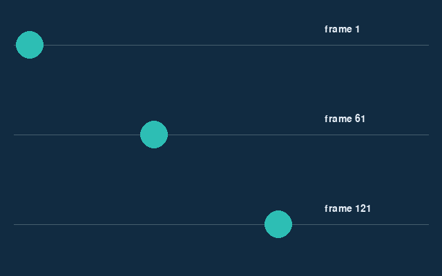

<!-- editorlm-hebrew-html-start -->
<style>
html, body, .vscode-body, .markdown-body, .markdown-preview, #write {
  direction: rtl !important; text-align: right !important;
}
ul, ol { padding-right: 2em !important; padding-left: 0 !important; }
blockquote { border-right: 3px solid #999; border-left: 0; padding-right: 1rem; padding-left: 0; }
@media print {
  html, body, .vscode-body, .markdown-body, .markdown-preview, #write {
    direction: rtl !important; text-align: right !important;
  }
}
</style>
<!-- editorlm-hebrew-html-end -->
<style>
.book { max-width: 900px; margin: auto; line-height: 1.8; font-family: Arial, sans-serif; }
.book .cover { min-height: 680px; box-sizing: border-box; padding: 64px 48px; margin: 24px 0 60px; background: #112b41; color: #f5f8fc; border-top: 9px solid #39c4b5; position: relative; }
.book .cover .eyebrow { color: #81e0d5; font-size: 15px; letter-spacing: 2px; }
.book .cover h1 { color: #fff; font-size: 48px; line-height: 1.3; border: 0; margin: 50px 0 18px; }
.book .cover .subtitle { font-size: 28px; color: #d8e6f0; }
.book .cover .author { font-size: 30px; color: #fff; margin-top: 52px; }
.book .cover .audience { color: #c1d3df; margin-top: 12px; }
.book .cover .motif { direction: ltr; text-align: left; font-family: Consolas, monospace; color: #81e0d5; font-size: 19px; margin-top: 54px; }
.book h1, .book h2, .book h3 { line-height: 1.4; font-weight: 700; }
.book > h1 { font-size: 32px !important; text-align: center !important; margin: 28px 0; }
.book h2 { font-size: 34px !important; text-align: center !important; color: #153b56 !important; background: #eef5fc; border: 0; border-bottom: 4px solid #299c91; border-radius: 10px 10px 0 0; padding: 28px 20px; margin: 24px 0 36px; }
.book h3 { font-size: 24px !important; text-align: right !important; color: #174e49 !important; background: #edf7f5; border: 0; border-right: 5px solid #299c91; border-radius: 6px; padding: 10px 16px; margin: 36px 0 18px; }
.book .chapter { height: 0; margin: 76px 0 0; border-top: 1px solid #ccd7df; break-before: page; page-break-before: always; break-after: avoid; page-break-after: avoid; }
.book .toc { padding: 24px; border-right: 5px solid #39a99d; background: rgba(70,150,155,.09); margin: 24px 0 48px; }
.book pre, .book pre code { direction: ltr !important; text-align: left !important; unicode-bidi: isolate; }
.book pre { box-sizing: border-box !important; width: 100% !important; max-width: 100% !important; margin: 0 !important; padding: 16px 20px; border: 1px solid #ccd7df; border-radius: 8px; line-height: 1.6; overflow-x: auto; }
.book code { direction: ltr; unicode-bidi: isolate; font-family: Consolas, "Courier New", monospace; }
.book pre { background: #f3f6fa !important; color: #1f2937 !important; }
.book pre code, .book pre code.hljs { background: transparent !important; color: #1f2937 !important; }
.book pre .hljs-keyword, .book pre .hljs-literal { color: #6f299c !important; }
.book pre .hljs-string { color: #216338 !important; }
.book pre .hljs-number { color: #075e68 !important; }
.book pre .hljs-comment { color: #526174 !important; }
.book pre .hljs-built_in, .book pre .hljs-title { color: #135b96 !important; }
.book table { width: 75%; max-width: 75%; margin: 18px auto; }
.book th, .book td { text-align: right; }
.book .small { font-size: .9em; opacity: .8; }
.book .python-intro { display: flex; align-items: center; gap: 28px; padding: 22px 28px; margin: 24px 0; background: #eef5fc; color: #183e63; border-right: 6px solid #3776ab; border-radius: 10px; }
.book .python-intro strong { font-size: 30px; }
.book .python-fact { background: #fff7d6; color: #423611; border-right: 6px solid #ffd343; border-radius: 8px; padding: 18px 24px; margin: 22px 0; }
.book .python-fact strong { font-size: 24px; }
.book img { max-width: 100%; height: auto; }
.book figure { margin: 24px auto; text-align: center; }
.book figure img { display: block; margin: auto; }
.book figcaption { direction: rtl; text-align: center; font-size: .9em; color: #445566; }
@media print { .book > h2 { break-before: page; page-break-before: always; } }
.book .screen-strip { width: 760px; max-width: 100%; height: 220px; overflow: hidden; border: 1px solid #bccad5; border-radius: 8px; margin: 20px auto 8px; direction: ltr; }
.book .screen-strip.output { height: 265px; }
.book .screen-strip img { display: block; width: 1745px; max-width: none; }
.book .screen-menu { width: 400px; max-width: 100%; height: 295px; overflow: hidden; direction: ltr; margin: 20px auto 8px; border: 1px solid #bccad5; border-radius: 8px; }
.book .screen-menu img { display: block; width: 1745px; max-width: none; }
.book .code-panel { box-sizing: border-box !important; display: block !important; width: 75% !important; max-width: 75% !important; margin: 18px auto !important; }
@media print {
  .book .cover { min-height: 85vh; break-after: page; print-color-adjust: exact; -webkit-print-color-adjust: exact; }
  .book pre { white-space: pre-wrap; break-inside: avoid; }
  .book .chapter { margin: 0; border: 0; }
  .book h1, .book h2, .book h3 { break-after: avoid; page-break-after: avoid; break-inside: avoid; }
  .book h2 { margin-top: 0; }
  .book h2, .book h3 { print-color-adjust: exact; -webkit-print-color-adjust: exact; }
}
</style>

<style>
.book .book-nav { display: flex; flex-wrap: wrap; gap: 10px; justify-content: center; align-items: center; padding: 16px 0; margin: 20px 0 32px; border-top: 1px solid #ccd7df; border-bottom: 1px solid #ccd7df; }
.book .book-nav a { display: inline-block; padding: 10px 18px; border-radius: 8px; background: #eef5fc; color: #153b56 !important; border: 1px solid #b5ccd9; text-decoration: none !important; font-size: 16px; font-weight: bold; }
.book .book-nav a.toc-link { background: #174e49; color: #fff !important; border-color: #174e49; }
.book .book-nav a:hover, .book .book-nav a:focus { background: #d4eee8; color: #153b56 !important; outline: 2px solid #299c91; outline-offset: 2px; }
.book .section-list { line-height: 2; }
@media print { .book .book-nav { display: none; } }

/* Explicit Hebrew direction, including prose beginning with English. */
.book p, .book ul, .book ol, .book li,
.book blockquote, .book h1, .book h2, .book h3,
.book h4, .book th, .book td {
  direction: rtl !important;
  text-align: right !important;
  unicode-bidi: isolate;
}
/* Chapter titles keep their agreed centered layout. */
.book h2 { text-align: center !important; }
.book pre, .book pre code, .book .code-panel {
  direction: ltr !important;
  text-align: left !important;
  unicode-bidi: isolate;
}
</style>

<div class="book" dir="rtl" lang="he" style="direction: rtl !important; text-align: right !important;">


<nav class="book-nav" aria-label="ניווט בספר">
<a href="08-%D7%A9%D7%A2%D7%95%D7%9F%20%D7%95%D7%A8%D7%A2%D7%A0%D7%95%D7%9F.md">→ הקודם</a>
<a class="toc-link" href="../index.md">תוכן העניינים</a>
<a href="10-Rect.md">הבא ←</a>
</nav>

## ב.9 — אנימציה פשוטה

עד כה הציורים שלנו היו סטטיים, או זזו רק בתגובה לקלט של המשתמש. במשחק אמיתי דברים זזים גם בעצמם: כדור מתגלגל, אויב מתקדם, כוכב נופל. בפרק זה נלמד כיצד ליצור תנועה כזו, שנקראת **אנימציה — Animation**.

הרעיון זהה לזה של סרט מצויר: כדי ליצור אשליה של תנועה מציירים אותו עצם במקומות מעט שונים, במהירות, והעין מחברת את התמונות הבודדות לתנועה רציפה. בכל פריים מוחקים את הציור הישן, מעדכנים את המיקום ומציירים שוב. העצם נשאר אותו עצם; המשתנים שמציינים את מיקומו משתנים. הלולאה הראשית שכבר בנינו, שמציירת פריים אחר פריים, היא בדיוק המנגנון שדרוש לכך. נתחיל בתנועה בקצב קבוע, נטפל בהגעה לקצה החלון, ולבסוף נראה כיצד להפוך את התנועה לבלתי תלויה בקצב הפריימים.

**המצגת:** [מבוא ל־Pygame](../../../sources/PyGame/2.PyGame.pptx)

### מיקום ומהירות בכל פריים

הדרך הפשוטה ביותר להזיז עצם היא להוסיף למיקומו מספר קבוע בכל סיבוב של הלולאה. נשמור את מיקום המרכז במשתנים `x` ו־`y`. המשתנה `speed_x` מציין כמה פיקסלים להוסיף ל־`x` בכל סיבוב, כלומר את **המהירות** בכיוון האופקי. ערך חיובי מזיז ימינה וערך שלילי שמאלה.

<div class="code-panel" dir="ltr">

```python
x, y = 40, 200
speed_x = 3

# Inside the main loop:
x += speed_x
screen.fill((17, 43, 65))
pygame.draw.circle(screen, (45, 190, 180),
                   (x, y), 20)
```

</div>

אם משמיטים את `fill()`, המעגל מהמיקום הקודם נשאר על המשטח ונוצר שובל. זה עשוי להתאים לתוכנת ציור, אך אינו מתאים כאן לתצוגת מעגל יחיד שנע.

### שינוי כיוון בקצה החלון

אם נמשיך להוסיף ל־`x` בכל פריים, המעגל יצא מהחלון וייעלם. נרצה שיתנהג כמו כדור שפוגע בקיר וחוזר: כשהוא מגיע לקצה הימני הוא יתחיל לנוע שמאלה, וכשיגיע לקצה השמאלי, שוב ימינה. למעגל יש רדיוס, ולכן מרכזו צריך להישאר במרחק הרדיוס מהקצוות. כאשר מגיעים לקצה, מציבים אותו בגבול והופכים את סימן המהירות. בקוד שלהלן, `abs()` מחזירה את הערך המוחלט, ולכן `-abs(speed_x)` תמיד שלילי (תנועה שמאלה) ו־`abs(speed_x)` תמיד חיובי (תנועה ימינה):

<div class="code-panel" dir="ltr">

```python
import pygame

pygame.init()
screen = pygame.display.set_mode((640, 400))
clock = pygame.time.Clock()
x, y = 40, 200
radius = 20
speed_x = 3
running = True

while running:
    for event in pygame.event.get():
        if event.type == pygame.QUIT:
            running = False
    if not running:
        break

    x += speed_x
    if x >= 640 - radius:
        x = 640 - radius
        speed_x = -abs(speed_x)
    elif x <= radius:
        x = radius
        speed_x = abs(speed_x)

    screen.fill((17, 43, 65))
    pygame.draw.circle(screen, (45, 190, 180),
                       (x, y), radius)
    pygame.display.update()
    clock.tick(60)

pygame.quit()
```

</div>

<figure>

<figcaption>שלוש נקודות זמן בתנועת המעגל; בכל פריים מוצג מעגל יחיד.</figcaption>
</figure>

<figure>

<figcaption>התוכנית בהרצה: המעגל חוזר מהקצוות. (אנימציה; בגרסה המודפסת מוצג פריים אחד.)</figcaption>
</figure>

### תנועה לפי הזמן שחלף

עד עכשיו המהירות נמדדה בפיקסלים לפריים, ולכן היא תלויה בכמה פריימים המחשב מספיק לצייר. בקצב של 60 פריימים בשנייה, שלושה פיקסלים לפריים הם כ־180 פיקסלים בשנייה. אם הקצב יורד, למשל במחשב איטי או כשהמשחק מתמלא בעצמים, אותה תוספת לפריים תיצור תנועה איטית יותר, והמשחק ירגיש שונה ממחשב למחשב. הפתרון הוא להגדיר את המהירות בפיקסלים לשנייה, יחידה שאינה תלויה במחשב, ולחשב בכל פריים כמה מרחק לעבור לפי הזמן שעבר מהפריים הקודם:

**מרחק = מהירות × זמן.**

את הזמן שעבר מספק לנו השעון: הערך שמחזירה `clock.tick()` הוא משך הזמן מאז הקריאה הקודמת לה, כלומר אורך הפריים הקודם, והוא נמדד באלפיות שנייה. נחלק ב־1000 לקבלת שניות ונקרא לתוצאה `dt` (קיצור מקובל ל־delta time, הפרש הזמן).

<div class="code-panel" dir="ltr">

```python
# Before the loop:
x = 40.0
speed_x = 180.0

# Once per frame, before updating x:
dt = clock.tick(60) / 1000
x += speed_x * dt
```

</div>

בגרסה זו מעבירים את קריאת `tick()` מסוף הסיבוב אל **תחילת עדכון התנועה**, ומסירים את הקריאה הישנה מסוף הלולאה: קוראים לשעון פעם אחת בכל פריים. שומרים את `x` כמספר עשרוני, ובציור משתמשים ב־`round(x)`. כך נשמרים גם חלקי פיקסל שהצטברו בתנועה.

<div class="code-panel" dir="ltr">

```python
pygame.draw.circle(screen, (45, 190, 180),
                   (round(x), y), radius)
```

</div>

בדיקת גבולות החלון נשארת כמו קודם. התאמה לזמן משפרת את עקביות מהירות התנועה: המעגל יעבור את אותו מרחק בשנייה בכל מחשב. עם זאת, היא אינה מוסיפה תמונות שהמחשב לא הספיק לצייר; במחשב איטי התנועה תיראה קופצנית יותר, אך המהירות הכוללת תישמר.

**קוד להורדה:** [הדוגמה המלאה](../assets/pygame/examples/09-demo.py). בדוגמאות המשתמשות בתמונה, שמרו את [הכוכב](../assets/pygame/star.png) בתוך `img/star.png` לצד הקובץ והריצו מתוך התיקייה שלו.

[גרסת האנימציה המלאה לפי זמן](../assets/pygame/examples/09-dt-demo.py).

<!-- editorlm-source-ref: [sources/PyGame/2.PyGame.pptx#L69-L73] -->
<!-- editorlm-source-versions: {"schemaVersion": 1, "sources": {"sources/PyGame/2.PyGame.pptx": {"sourceSha256": "ad8a1baf72d2e6232ec3fd8d896c4a4c9e76d5f5f8c4376432567af68cb4f3cc", "canonicalTextSha256": "33ec3ad2594bbcce74bc94565c260c8f572a208e4ec22e740ca97792fc85d99e"}}} -->
<nav class="book-nav" aria-label="ניווט בספר">
<a href="08-%D7%A9%D7%A2%D7%95%D7%9F%20%D7%95%D7%A8%D7%A2%D7%A0%D7%95%D7%9F.md">→ הקודם</a>
<a class="toc-link" href="../index.md">תוכן העניינים</a>
<a href="10-Rect.md">הבא ←</a>
</nav>

</div>
