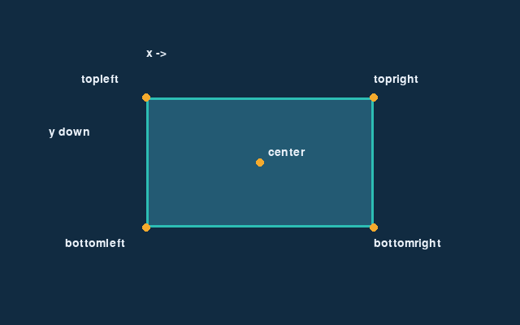

<!-- editorlm-hebrew-html-start -->
<style>
html, body, .vscode-body, .markdown-body, .markdown-preview, #write {
  direction: rtl !important; text-align: right !important;
}
ul, ol { padding-right: 2em !important; padding-left: 0 !important; }
blockquote { border-right: 3px solid #999; border-left: 0; padding-right: 1rem; padding-left: 0; }
@media print {
  html, body, .vscode-body, .markdown-body, .markdown-preview, #write {
    direction: rtl !important; text-align: right !important;
  }
}
</style>
<!-- editorlm-hebrew-html-end -->
<style>
.book { max-width: 900px; margin: auto; line-height: 1.8; font-family: Arial, sans-serif; }
.book .cover { min-height: 680px; box-sizing: border-box; padding: 64px 48px; margin: 24px 0 60px; background: #112b41; color: #f5f8fc; border-top: 9px solid #39c4b5; position: relative; }
.book .cover .eyebrow { color: #81e0d5; font-size: 15px; letter-spacing: 2px; }
.book .cover h1 { color: #fff; font-size: 48px; line-height: 1.3; border: 0; margin: 50px 0 18px; }
.book .cover .subtitle { font-size: 28px; color: #d8e6f0; }
.book .cover .author { font-size: 30px; color: #fff; margin-top: 52px; }
.book .cover .audience { color: #c1d3df; margin-top: 12px; }
.book .cover .motif { direction: ltr; text-align: left; font-family: Consolas, monospace; color: #81e0d5; font-size: 19px; margin-top: 54px; }
.book h1, .book h2, .book h3 { line-height: 1.4; font-weight: 700; }
.book > h1 { font-size: 32px !important; text-align: center !important; margin: 28px 0; }
.book h2 { font-size: 34px !important; text-align: center !important; color: #153b56 !important; background: #eef5fc; border: 0; border-bottom: 4px solid #299c91; border-radius: 10px 10px 0 0; padding: 28px 20px; margin: 24px 0 36px; }
.book h3 { font-size: 24px !important; text-align: right !important; color: #174e49 !important; background: #edf7f5; border: 0; border-right: 5px solid #299c91; border-radius: 6px; padding: 10px 16px; margin: 36px 0 18px; }
.book .chapter { height: 0; margin: 76px 0 0; border-top: 1px solid #ccd7df; break-before: page; page-break-before: always; break-after: avoid; page-break-after: avoid; }
.book .toc { padding: 24px; border-right: 5px solid #39a99d; background: rgba(70,150,155,.09); margin: 24px 0 48px; }
.book pre, .book pre code { direction: ltr !important; text-align: left !important; unicode-bidi: isolate; }
.book pre { box-sizing: border-box !important; width: 100% !important; max-width: 100% !important; margin: 0 !important; padding: 16px 20px; border: 1px solid #ccd7df; border-radius: 8px; line-height: 1.6; overflow-x: auto; }
.book code { direction: ltr; unicode-bidi: isolate; font-family: Consolas, "Courier New", monospace; }
.book pre { background: #f3f6fa !important; color: #1f2937 !important; }
.book pre code, .book pre code.hljs { background: transparent !important; color: #1f2937 !important; }
.book pre .hljs-keyword, .book pre .hljs-literal { color: #6f299c !important; }
.book pre .hljs-string { color: #216338 !important; }
.book pre .hljs-number { color: #075e68 !important; }
.book pre .hljs-comment { color: #526174 !important; }
.book pre .hljs-built_in, .book pre .hljs-title { color: #135b96 !important; }
.book table { width: 100%; }
.book th, .book td { text-align: right; }
.book .small { font-size: .9em; opacity: .8; }
.book .python-intro { display: flex; align-items: center; gap: 28px; padding: 22px 28px; margin: 24px 0; background: #eef5fc; color: #183e63; border-right: 6px solid #3776ab; border-radius: 10px; }
.book .python-intro strong { font-size: 30px; }
.book .python-fact { background: #fff7d6; color: #423611; border-right: 6px solid #ffd343; border-radius: 8px; padding: 18px 24px; margin: 22px 0; }
.book .python-fact strong { font-size: 24px; }
.book img { max-width: 100%; height: auto; }
.book figure { margin: 24px auto; text-align: center; }
.book figure img { display: block; margin: auto; }
.book figcaption { direction: rtl; text-align: center; font-size: .9em; color: #445566; }
@media print { .book > h2 { break-before: page; page-break-before: always; } }
.book .screen-strip { width: 760px; max-width: 100%; height: 220px; overflow: hidden; border: 1px solid #bccad5; border-radius: 8px; margin: 20px auto 8px; direction: ltr; }
.book .screen-strip.output { height: 265px; }
.book .screen-strip img { display: block; width: 1745px; max-width: none; }
.book .screen-menu { width: 400px; max-width: 100%; height: 295px; overflow: hidden; direction: ltr; margin: 20px auto 8px; border: 1px solid #bccad5; border-radius: 8px; }
.book .screen-menu img { display: block; width: 1745px; max-width: none; }
.book .code-panel { box-sizing: border-box !important; display: block !important; width: 75% !important; max-width: 75% !important; margin: 18px auto !important; }
@media print {
  .book .cover { min-height: 85vh; break-after: page; print-color-adjust: exact; -webkit-print-color-adjust: exact; }
  .book pre { white-space: pre-wrap; break-inside: avoid; }
  .book .chapter { margin: 0; border: 0; }
  .book h1, .book h2, .book h3 { break-after: avoid; page-break-after: avoid; break-inside: avoid; }
  .book h2 { margin-top: 0; }
  .book h2, .book h3 { print-color-adjust: exact; -webkit-print-color-adjust: exact; }
}
</style>

<style>
.book .book-nav { display: flex; flex-wrap: wrap; gap: 10px; justify-content: center; align-items: center; padding: 16px 0; margin: 20px 0 32px; border-top: 1px solid #ccd7df; border-bottom: 1px solid #ccd7df; }
.book .book-nav a { display: inline-block; padding: 10px 18px; border-radius: 8px; background: #eef5fc; color: #153b56 !important; border: 1px solid #b5ccd9; text-decoration: none !important; font-size: 16px; font-weight: bold; }
.book .book-nav a.toc-link { background: #174e49; color: #fff !important; border-color: #174e49; }
.book .book-nav a:hover, .book .book-nav a:focus { background: #d4eee8; color: #153b56 !important; outline: 2px solid #299c91; outline-offset: 2px; }
.book .section-list { line-height: 2; }
@media print { .book .book-nav { display: none; } }

/* Explicit Hebrew direction, including prose beginning with English. */
.book p, .book ul, .book ol, .book li,
.book blockquote, .book h1, .book h2, .book h3,
.book h4, .book th, .book td {
  direction: rtl !important;
  text-align: right !important;
  unicode-bidi: isolate;
}
/* Chapter titles keep their agreed centered layout. */
.book h2 { text-align: center !important; }
.book pre, .book pre code, .book .code-panel {
  direction: ltr !important;
  text-align: left !important;
  unicode-bidi: isolate;
}
</style>

<div class="book" dir="rtl" lang="he" style="direction: rtl !important; text-align: right !important;">


<nav class="book-nav" aria-label="ניווט בספר">
<a href="09-%D7%90%D7%A0%D7%99%D7%9E%D7%A6%D7%99%D7%94.md">→ הקודם</a>
<a class="toc-link" href="../index.md">תוכן העניינים</a>
<a href="11-Sprite.md">הבא ←</a>
</nav>

## ב.10 — מלבני מיקום: pygame.Rect

עד עכשיו מיקמנו תמונה באמצעות זוג מספרים: הפינה השמאלית העליונה שלה. במשחק אמיתי זה מהר מאוד נעשה מסורבל. כדי למרכז דמות בחלון צריך לחסר חצי מרוחבה ומגובהה; כדי לבדוק אם היא נגעה בקצה הימני של החלון צריך לחשב את הקצה הימני שלה מהפינה ומהרוחב; וכדי לדעת אם שני עצמים נוגעים זה בזה צריך להשוות את כל הגבולות שלהם. בכל המקרים האלה אנו חוזרים ומחשבים את אותם ערכים מתוך אותם ארבעה מספרים: מיקום, רוחב וגובה.

כשצריך ליישר תמונה למרכז, לבדוק את הקצה הימני שלה או להזיז אותה בלי לחשב מחדש כל נקודה, נוח לשמור את מסגרת התמונה באובייקט אחד. **Rect** הוא מלבן ששומר מיקום ומידות ומאפשר לגשת אליהם בכמה דרכים: דרך הפינה, דרך המרכז או דרך הקצוות, כשהכול נשאר עקבי מאליו. המלבן הזה הוא גם הבסיס לשני הפרקים הבאים, שבהם נעטוף כל עצם במשחק בספרייט ונבדוק התנגשויות.

**המצגת:** [Pygame Rect](../../../sources/PyGame/PyGame%20-%20Rect.pptx) · [תיעוד Rect](https://www.pygame.org/docs/ref/rect.html)

### יוצרים מסגרת לתמונה

הדרך הנוחה לקבל מלבן בגודל התמונה היא לקרוא ל־`get_rect()` על המשטח. התמונה `image` היא זו שטענו בפרק התמונות:

<div class="code-panel" dir="ltr">

```python
rect = image.get_rect()
rect.center = (320, 200)
```

</div>

הקריאה הראשונה יוצרת מלבן בגודל התמונה, שמתחיל ב־`(0, 0)`. ההצבה השנייה מעבירה את **מרכז** המלבן לאמצע החלון. אפשר לכתוב זאת גם בפעולה אחת:

<div class="code-panel" dir="ltr">

```python
rect = image.get_rect(center=(320, 200))
```

</div>

אם אין תמונה, אפשר ליצור מלבן ישירות מתוך מיקום ומידות:

<div class="code-panel" dir="ltr">

```python
rect = pygame.Rect(100, 80, 120, 60)
```

</div>

### מאפייני המיקום והמידות

אפשר לתאר את אותו מלבן דרך מרכזו, קצותיו או פינותיו. המאפיינים הבאים מאפשרים לקרוא ולעדכן את המיקום והמידות בלי לחשב כל נקודה בנפרד.

| מאפיינים | משמעות |
| --- | --- |
| `x`, `y` או `left`, `top` | הפינה השמאלית העליונה |
| `right`, `bottom` | הגבול הימני והתחתון |
| `width`, `height`, `size` | רוחב, גובה וזוג המידות |
| `center`, `centerx`, `centery` | מרכז המלבן ורכיביו |
| `topleft`, `topright`, `bottomleft`, `bottomright` | ארבע הפינות |
| `midtop`, `midbottom`, `midleft`, `midright` | אמצע כל צלע |

כל המאפיינים מתארים אותו מלבן, ולכן עדכון של אחד מהם מעדכן את כל השאר. למשל, שינוי `center` מזיז גם את הקצוות והפינות; הוא אינו משנה את המידות. שינוי `width` משנה את רוחב המלבן, אך **אינו משנה את גודל התמונה**, כי המלבן הוא רק תיאור של מיקום ומידות ואינו קשור לפיקסלים עצמם. לשינוי התמונה משתמשים ב־`transform.scale()` ומעדכנים את המלבן בהתאם. בדוגמה הבאה ניצור מלבן שפינתו ב־`(100, 80)` ורוחבו וגובהו 120 ו־60, ונדפיס כמה מהמאפיינים שלו:

<div class="code-panel" dir="ltr">

```python
rect = pygame.Rect(100, 80, 120, 60)
print(rect.topleft)
print(rect.center)
print(rect.right, rect.bottom)
```

</div>

**פלט**
<div class="code-panel" dir="ltr">

```text
(100, 80)
(160, 110)
220 140
```

</div>

<figure>

<figcaption>מסגרת מלבנית, מרכז ופינות: כמה דרכים לתאר את אותו מיקום.</figcaption>
</figure>

### הזזה: move לעומת move_ip

בהזזת מלבן אפשר לקבל מלבן חדש במיקום אחר, או לשנות את מיקומו של המלבן הקיים. נראה את ההבדל בין שתי האפשרויות.

<div class="code-panel" dir="ltr">

```python
rect = pygame.Rect(100, 80, 120, 60)
moved = rect.move(30, -10)
print(rect.topleft)
print(moved.topleft)
rect.move_ip(30, -10)
print(rect.topleft)
```

</div>

**פלט**
<div class="code-panel" dir="ltr">

```text
(100, 80)
(130, 70)
(130, 70)
```

</div>

שני הארגומנטים הם ההזזה בפיקסלים בציר x ובציר y; כאן 30 ימינה ו־10 למעלה. `move()` מחזירה מלבן חדש ואינה משנה את המקורי, ולכן ההדפסה הראשונה עדיין מראה `(100, 80)`. `move_ip()` (הסיומת `ip` מציינת in place, "במקום") משנה את המלבן הקיים עצמו. אין לכתוב `rect = rect.move_ip(...)`, משום שערך ההחזרה שלה הוא `None`, וכך נאבד את המלבן. בלולאת משחק, שבה מזיזים את אותו עצם בכל פריים, `move_ip()` היא בדרך כלל הבחירה הנוחה.

### משתמשים במלבן להצבת התמונה

המלבן יכול לקבוע היכן התמונה תופיע בחלון. לשם כך מעבירים אותו ל־`blit()` במקום זוג קואורדינטות:

<div class="code-panel" dir="ltr">

```python
rect.move_ip(3, 0)
screen.blit(image, rect)
```

</div>

ה־`Rect` אינו מצויר בעצמו. `blit` משתמשת בפינה השמאלית העליונה שלו להצבת התמונה. אם רוצים לראות את המסגרת לצורך הבנה, מציירים אותה במפורש:

<div class="code-panel" dir="ltr">

```python
pygame.draw.rect(screen, (245, 170, 45), rect, 2)
```

</div>

הערה אחרונה: המלבן שומר קואורדינטות שלמות בלבד, ולכן אם נוסיף לו בכל פריים תזוזה קטנה מפיקסל היא תיעלם. בתנועה לפי זמן עדיף לשמור מיקום עשרוני במשתנה נפרד, כמו בפרק הקודם, ולהעתיק את המיקום המעוגל ל־`rect` לצורך הציור.

**קוד להורדה:** [הדוגמה המלאה](../assets/pygame/examples/10-demo.py). בדוגמאות המשתמשות בתמונה, שמרו את [הכוכב](../assets/pygame/star.png) בתוך `img/star.png` לצד הקובץ והריצו מתוך התיקייה שלו.

<!-- editorlm-source-ref: [sources/PyGame/PyGame - Rect.pptx#L7-L47] -->

<!-- editorlm-source-versions: {"schemaVersion": 1, "sources": {"sources/PyGame/PyGame - Rect.pptx": {"sourceSha256": "3224b4737220b8100842bd0eac22bf00c8ee343ffbec134de78050255ee2b470", "canonicalTextSha256": "375441cb1a1a21f6bdd31aed0d83d764adef4aee4489c4ba0f5bcbcdcc359e19"}}} -->
<nav class="book-nav" aria-label="ניווט בספר">
<a href="09-%D7%90%D7%A0%D7%99%D7%9E%D7%A6%D7%99%D7%94.md">→ הקודם</a>
<a class="toc-link" href="../index.md">תוכן העניינים</a>
<a href="11-Sprite.md">הבא ←</a>
</nav>

</div>
