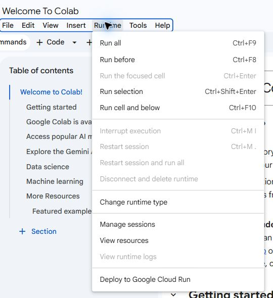
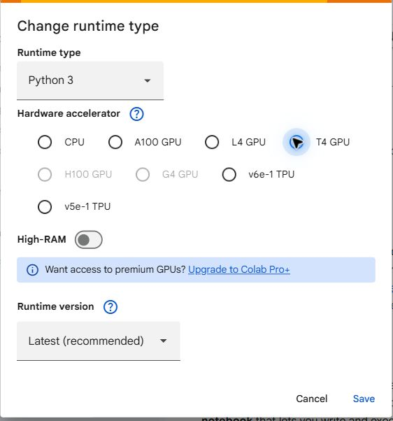

<!-- editorlm-hebrew-html-start -->
<style>
html, body, .vscode-body, .markdown-body, .markdown-preview, #write {
  direction: rtl !important; text-align: right !important;
}
ul, ol { padding-right: 2em !important; padding-left: 0 !important; }
blockquote { border-right: 3px solid #999; border-left: 0; padding-right: 1rem; padding-left: 0; }
@media print {
  html, body, .vscode-body, .markdown-body, .markdown-preview, #write {
    direction: rtl !important; text-align: right !important;
  }
}
</style>
<!-- editorlm-hebrew-html-end -->
<style>
.book { max-width: 900px; margin: auto; line-height: 1.8; font-family: Arial, sans-serif; }
.book .cover { min-height: 680px; box-sizing: border-box; padding: 64px 48px; margin: 24px 0 60px; background: #112b41; color: #f5f8fc; border-top: 9px solid #39c4b5; position: relative; }
.book .cover .eyebrow { color: #81e0d5; font-size: 15px; letter-spacing: 2px; }
.book .cover h1 { color: #fff; font-size: 48px; line-height: 1.3; border: 0; margin: 50px 0 18px; }
.book .cover .subtitle { font-size: 28px; color: #d8e6f0; }
.book .cover .author { font-size: 30px; color: #fff; margin-top: 52px; }
.book .cover .audience { color: #c1d3df; margin-top: 12px; }
.book .cover .motif { direction: ltr; text-align: left; font-family: Consolas, monospace; color: #81e0d5; font-size: 19px; margin-top: 54px; }
.book h1, .book h2, .book h3 { line-height: 1.4; font-weight: 700; }
.book > h1 { font-size: 32px !important; text-align: center !important; margin: 28px 0; }
.book h2 { font-size: 34px !important; text-align: center !important; color: #153b56 !important; background: #eef5fc; border: 0; border-bottom: 4px solid #299c91; border-radius: 10px 10px 0 0; padding: 28px 20px; margin: 24px 0 36px; }
.book h3 { font-size: 24px !important; text-align: right !important; color: #174e49 !important; background: #edf7f5; border: 0; border-right: 5px solid #299c91; border-radius: 6px; padding: 10px 16px; margin: 36px 0 18px; }
.book .chapter { height: 0; margin: 76px 0 0; border-top: 1px solid #ccd7df; break-before: page; page-break-before: always; break-after: avoid; page-break-after: avoid; }
.book .toc { padding: 24px; border-right: 5px solid #39a99d; background: rgba(70,150,155,.09); margin: 24px 0 48px; }
.book pre, .book pre code { direction: ltr !important; text-align: left !important; unicode-bidi: isolate; }
.book pre { box-sizing: border-box !important; width: 100% !important; max-width: 100% !important; margin: 0 !important; padding: 16px 20px; border: 1px solid #ccd7df; border-radius: 8px; line-height: 1.6; overflow-x: auto; }
.book code { direction: ltr; unicode-bidi: isolate; font-family: Consolas, "Courier New", monospace; }
.book pre { background: #f3f6fa !important; color: #1f2937 !important; }
.book pre code, .book pre code.hljs { background: transparent !important; color: #1f2937 !important; }
.book pre .hljs-keyword, .book pre .hljs-literal { color: #6f299c !important; }
.book pre .hljs-string { color: #216338 !important; }
.book pre .hljs-number { color: #075e68 !important; }
.book pre .hljs-comment { color: #526174 !important; }
.book pre .hljs-built_in, .book pre .hljs-title { color: #135b96 !important; }
.book table { width: 100%; }
.book th, .book td { text-align: right; }
.book .small { font-size: .9em; opacity: .8; }
.book .python-intro { display: flex; align-items: center; gap: 28px; padding: 22px 28px; margin: 24px 0; background: #eef5fc; color: #183e63; border-right: 6px solid #3776ab; border-radius: 10px; }
.book .python-intro strong { font-size: 30px; }
.book .python-fact { background: #fff7d6; color: #423611; border-right: 6px solid #ffd343; border-radius: 8px; padding: 18px 24px; margin: 22px 0; }
.book .python-fact strong { font-size: 24px; }
.book img { max-width: 100%; height: auto; }
.book figure { margin: 24px auto; text-align: center; }
.book figure img { display: block; margin: auto; }
.book figcaption { direction: rtl; text-align: center; font-size: .9em; color: #445566; }
@media print { .book > h2 { break-before: page; page-break-before: always; } }
.book .screen-strip { width: 760px; max-width: 100%; height: 220px; overflow: hidden; border: 1px solid #bccad5; border-radius: 8px; margin: 20px auto 8px; direction: ltr; }
.book .screen-strip.output { height: 265px; }
.book .screen-strip img { display: block; width: 1745px; max-width: none; }
.book .screen-menu { width: 400px; max-width: 100%; height: 295px; overflow: hidden; direction: ltr; margin: 20px auto 8px; border: 1px solid #bccad5; border-radius: 8px; }
.book .screen-menu img { display: block; width: 1745px; max-width: none; }
.book .code-panel { box-sizing: border-box !important; display: block !important; width: 50% !important; max-width: 50% !important; margin: 18px auto !important; }
@media print {
  .book .cover { min-height: 85vh; break-after: page; print-color-adjust: exact; -webkit-print-color-adjust: exact; }
  .book pre { white-space: pre-wrap; break-inside: avoid; }
  .book .chapter { margin: 0; border: 0; }
  .book h1, .book h2, .book h3 { break-after: avoid; page-break-after: avoid; break-inside: avoid; }
  .book h2 { margin-top: 0; }
  .book h2, .book h3 { print-color-adjust: exact; -webkit-print-color-adjust: exact; }
}
</style>

<style>
.book .book-nav { display: flex; flex-wrap: wrap; gap: 10px; justify-content: center; align-items: center; padding: 16px 0; margin: 20px 0 32px; border-top: 1px solid #ccd7df; border-bottom: 1px solid #ccd7df; }
.book .book-nav a { display: inline-block; padding: 10px 18px; border-radius: 8px; background: #eef5fc; color: #153b56 !important; border: 1px solid #b5ccd9; text-decoration: none !important; font-size: 16px; font-weight: bold; }
.book .book-nav a.toc-link { background: #174e49; color: #fff !important; border-color: #174e49; }
.book .book-nav a:hover, .book .book-nav a:focus { background: #d4eee8; color: #153b56 !important; outline: 2px solid #299c91; outline-offset: 2px; }
.book .section-list { line-height: 2; }
@media print { .book .book-nav { display: none; } }

/* Explicit Hebrew direction, including prose beginning with English. */
.book p, .book ul, .book ol, .book li,
.book blockquote, .book h1, .book h2, .book h3,
.book h4, .book th, .book td {
  direction: rtl !important;
  text-align: right !important;
  unicode-bidi: isolate;
}
/* Chapter titles keep their agreed centered layout. */
.book h2 { text-align: center !important; }
.book pre, .book pre code, .book .code-panel {
  direction: ltr !important;
  text-align: left !important;
  unicode-bidi: isolate;
}
</style>

<div class="book" dir="rtl" lang="he" style="direction: rtl !important; text-align: right !important;">

<nav class="book-nav" aria-label="ניווט בספר">
<a href="01-%D7%9E%D7%91%D7%95%D7%90.md">→ הקודם</a>
<a class="toc-link" href="../index.md">תוכן העניינים</a>
<a href="03-%D7%98%D7%A0%D7%A1%D7%95%D7%A8%D7%99%D7%9D.md">הבא ←</a>
</nav>

## ב.2 הכנת PyTorch ב־Colab


**[השיעור וההרצאות באתר של גלעד מרקמן](https://webprogramming.azurewebsites.net/Pages/PyTorch/Intro.aspx)**

**חומרי הליווי:** [1. מבוא והתקנה](../../../sources/ML/1.%20%D7%9E%D7%91%D7%95%D7%90%20%D7%95%D7%94%D7%AA%D7%A7%D7%A0%D7%94.pptx) · [2_Torch_Tensors](../../../sources/ML/converted/2_Torch_Tensors/notebook.md)


### מהי PyTorch?

**PyTorch היא ספרייה לחישובים מספריים ולבניית מודלים של למידת מכונה.** היא כוללת טנסורים, חישוב נגזרות אוטומטי, שכבות של רשתות וכלים לאימון. מקורה בצוות המחקר של Facebook.

בחלק זה ממשיכים לעבוד במחברות Colab. פתיחת מחברת והרצת תאים כבר נלמדו בחלק א; כעת נבדוק שהספריות הדרושות זמינות.

### מי עושה מה בסביבת העבודה?

מחברת Colab היא מסמך שמחבר טקסט, קוד ופלט. סביבת הריצה היא המחשב שמבצע את הקוד; המחברת עצמה אינה אותו מחשב. שמירת המחברת שומרת את התאים ואת הפלט שנשמר בהם, אך אינה שומרת אוטומטית את כל המשתנים והקבצים הזמניים של הריצה.

| רכיב | תפקיד בשיעורים |
|---|---|
| Python | השפה שבה נכתוב את ההוראות |
| PyTorch | טנסורים, נגזרות, שכבות ואימון |
| NumPy | מערכים וחישובים מספריים המשמשים גם ספריות אחרות |
| Matplotlib | הצגת נתונים, עקומות הפסד ותחזיות |
| pandas | קריאת טבלאות ובחירת עמודות |
| scikit-learn | מאגרי הדגמה, פיצול נתונים והכנתם |
| torchvision | מאגרי תמונות ופעולות הכנה לתמונות |

אין צורך ללמוד את כל הספריות לפני שמתחילים. בכל פרק נייבא רק את הדרוש בו. הכינוי `nn` הוא קיצור שניתן ל־`torch.nn`, ולא ספרייה נוספת שצריך לטעון בנפרד.

### בדיקת הספרייה

בתא קוד הריצו:

<div class="code-panel" dir="ltr">

```python
import torch
print(torch.__version__)
print(torch.cuda.is_available())
```

</div>

השורה הראשונה מציגה את הגרסה המותקנת. השורה השנייה בודקת אם PyTorch יכולה להשתמש כעת ב־GPU התומך ב־CUDA. ערך False אינו מונע עבודה: הדוגמאות יכולות לפעול גם על CPU, אם כי אימון רשתות עשוי להיות איטי יותר.

אם הייבוא נכשל כי הספרייה חסרה, הריצו בתא Colab את פקודת ההתקנה הבאה, ואז חזרו לתא הבדיקה. אין צורך להריץ אותה כשייבוא הספריות כבר מצליח.

<div class="code-panel" dir="ltr">

```text
%pip install torch torchvision
```

</div>

**torchvision** מספקת בהמשך את מאגרי התמונות ואת פעולות ההכנה שלהן. אם נדרשת הפעלה מחדש של סביבת הריצה לאחר התקנה, יש להריץ שוב את תאי ההגדרות.

### הפעלת GPU ב־Colab

באימון רשת מבצעים חישובים רבים על מערכי מספרים. מעבד גרפי (**GPU**) יכול לבצע חישובים רבים במקביל וכך לקצר אימון מתאים. ב־Colab המעבד נמצא בשרת מרוחק של Google, ולכן אין צורך בכרטיס מסך מתאים במחשב האישי. **CUDA** היא התשתית שבאמצעותה PyTorch משתמשת כאן ב־GPU של NVIDIA. [היכרות עם Colab](https://colab.research.google.com/notebooks/intro.ipynb).

**1. פותחים את הגדרות סביבת הריצה.** בתוך המחברת, לחצו בתפריט העליון על **Runtime** (סביבת ריצה), ואז על **Change runtime type** (שינוי סוג סביבת הריצה).

<figure>

<figcaption>שלב 1: האפשרות Change runtime type נמצאת בחלק התחתון של תפריט Runtime.</figcaption>
</figure>

**2. בוחרים מאיץ גרפי ושומרים.** בחלון שנפתח השאירו את **Runtime type** על **Python 3**. תחת **Hardware accelerator** בחרו **T4 GPU**, ואז לחצו על **Save**. לצורך הדוגמאות כאן בוחרים GPU; האפשרויות מסוג TPU דורשות מסלול עבודה אחר. [הוראות ההגדרה הרשמיות של PyTorch](https://docs.pytorch.org/tutorials/beginner/colab#enabling-cuda).

<figure>

<figcaption>שלב 2: בחירת T4 GPU תחת Hardware accelerator ולחיצה על Save. צילומי הממשק נבדקו ב־12.9.2026; אפשרויות נוספות עשויות להשתנות לפי החשבון והזמינות.</figcaption>
</figure>

**3. מתחברים ובודקים.** אם מופיע **Connect** בראש המחברת, לחצו עליו והמתינו לחיבור. לאחר החלפת סביבת הריצה הריצו מחדש את תאי הייבוא וההכנה מלמעלה למטה. בתא קוד הריצו:

<div class="code-panel" dir="ltr">

```python
import torch

gpu_available = torch.cuda.is_available()
print("CUDA available:", gpu_available)
if gpu_available:
    print("GPU:", torch.cuda.get_device_name(0))
```

</div>

**פלט**

<div class="code-panel" dir="ltr">

```text
CUDA available: True
GPU: Tesla T4
```

</div>

זהו פלט לדוגמה כאשר מוקצה T4; שם הכרטיס בפועל עשוי להיות שונה. הערך `True` מאשר ש־PyTorch מזהה התקן CUDA זמין. את שם הכרטיס בודקים רק בתוך התנאי, כדי שלא לבקש פרטי GPU כשאין כזה. [בדיקת זמינות CUDA](https://docs.pytorch.org/docs/stable/generated/torch.cuda.is_available.html) · [קריאת שם הכרטיס](https://docs.pytorch.org/docs/stable/generated/torch.cuda.get_device_name.html).

**אם מתקבל `False`:** חזרו לחלון ההגדרות, ודאו שנבחר T4 GPU ושמרו. התחברו לסביבת הריצה והריצו שוב את הבדיקה. אם Colab מציג הודעה שאין GPU זמין או שהגעתם למגבלת שימוש, אפשר להמשיך בתרגילים הקטנים על CPU ולנסות GPU מאוחר יותר. זמינות המשאבים ומגבלות השימוש משתנות; בחירת המאיץ אינה מבטיחה הקצאה בכל זמן. [שאלות ותשובות של Colab על זמינות GPU](https://research.google.com/colaboratory/faq.html#gpu-availability).

### בחירת ההתקן בקוד

לאחר הגדרת סביבת הריצה, בוחרים בקוד את ההתקן שבו נשתמש:

<div class="code-panel" dir="ltr">

```python
device = torch.device(
    "cuda" if torch.cuda.is_available()
    else "cpu"
)
print(device)
```

</div>

המשתנה device ישמש אותנו להעברת הנתונים והמודל לאותו התקן. חשוב לקרוא לפונקציה עם **סוגריים**: בלעדיהם לא מתבצעת בדיקת זמינות.

### ההתקן של הנתונים חייב להתאים לחישוב

בחירת GPU אינה מעבירה אליו אוטומטית כל משתנה. הטנסור והמודל המשתתפים בחישוב צריכים להימצא בהתקנים תואמים. הפעולה `to` מחזירה טנסור בהתקן המבוקש, ולכן שומרים את התוצאה.

<div class="code-panel" dir="ltr">

```python
x = torch.tensor([1., 2., 3.])
x = x.to(device)
y = 2 * x + 1
print(y.cpu())
```

</div>

**פלט**

<div class="code-panel" dir="ltr">

```text
tensor([3., 5., 7.])
```

</div>

לצורך הצגת מערך עם NumPy נחזיר אותו ל־CPU. בהמשך, כאשר הוא גם מחובר לגרף נגזרות, נשתמש ב־`tensor.detach().cpu().numpy()`. אלה פעולות שונות: ניתוק ממעקב, מעבר התקן והמרת ייצוג.

GPU יעיל במיוחד בחישובים גדולים ומקביליים. בדוגמה של שלושה מספרים עיקר המטרה היא להבין את העברת הנתונים; עצם הבחירה ב־GPU אינה מבטיחה שחישוב זעיר יהיה מהיר יותר.

### עבודה רציפה במחברת

מריצים את תאי המחברת לפי הסדר. ניתוק או איפוס של סביבת הריצה מוחקים את המשתנים שבזיכרון; קוד שנשמר במחברת אינו שומר אוטומטית את המודל המאומן. בפרק ב.20 נלמד לשמור אותו לקובץ.

התקנת פייתון ו־VS Code במחשב האישי תילמד בפתיחת חלק ג, לקראת העבודה עם pygame.

<!-- editorlm-source-ref: [sources/ML/1. מבוא והתקנה.pptx#L1-L93] -->
<!-- editorlm-source-ref: [sources/ML/converted/2_Torch_Tensors/notebook.md#L1-L743] -->

### קריאה נכונה של מחברת ושל שגיאה

נניח שתא אחד יוצר `x`, ותא מאוחר יותר מחשב `x + 1`. הפעלת התא השני לפני הראשון תיכשל. שינוי התא הראשון בלי להריץ אותו אינו משנה את `x` שבזיכרון. לכן גם קוד שנראה נכון על המסך יכול להשתמש בערך ישן.

דרך עבודה טובה היא להתחיל מתאי הייבוא, להמשיך בהכנת הנתונים ואז במודל ובאימון. לאחר שינוי מהותי בדקו שהמחברת מסוגלת לרוץ מלמעלה למטה בסביבה נקייה. פלט שמור ממחברת המקור מתעד ריצה קודמת; הוא אינו הוכחה שהקוד הנוכחי כבר הורץ אצלכם.

בשגיאה קוראים תחילה את סוג השגיאה ואת השורה שבה אירעה: `NameError` מצביע לרוב על שם שלא הוגדר; אי־התאמת ממדים מחייבת לבדוק `shape`; אי־התאמת התקנים מחייבת לבדוק `device`. אם טעינת מאגר נכשלה, תיקון שכבת הרשת לא יפתור את החוסר בנתונים.


<nav class="book-nav" aria-label="ניווט בספר">
<a href="01-%D7%9E%D7%91%D7%95%D7%90.md">→ הקודם</a>
<a class="toc-link" href="../index.md">תוכן העניינים</a>
<a href="03-%D7%98%D7%A0%D7%A1%D7%95%D7%A8%D7%99%D7%9D.md">הבא ←</a>
</nav>

</div>

<!-- editorlm-source-versions: {"schemaVersion": 1, "sources": {"sources/ML/1. מבוא והתקנה.pptx": {"sourceSha256": "cc614ed332af917ea4116f22f36868e183726b3a444d235c07551c32ca4e16fd", "canonicalTextSha256": "162ea4af01c5d7238e8852c7861210896f3cecb964a804686a36b600191ed501"}, "sources/ML/converted/2_Torch_Tensors/notebook.md": {"sourceSha256": "37aed7bc845aec5890156588597f79dd5a650d21d59e35d7b76415413359b4dd", "canonicalTextSha256": "37aed7bc845aec5890156588597f79dd5a650d21d59e35d7b76415413359b4dd"}}} -->
