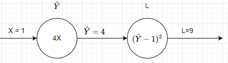

<!-- editorlm-hebrew-html-start -->
<style>
html, body, .vscode-body, .markdown-body, .markdown-preview, #write {
  direction: rtl !important; text-align: right !important;
}
ul, ol { padding-right: 2em !important; padding-left: 0 !important; }
blockquote { border-right: 3px solid #999; border-left: 0; padding-right: 1rem; padding-left: 0; }
@media print {
  html, body, .vscode-body, .markdown-body, .markdown-preview, #write {
    direction: rtl !important; text-align: right !important;
  }
}
</style>
<!-- editorlm-hebrew-html-end -->
<style>
.book { max-width: 900px; margin: auto; line-height: 1.8; font-family: Arial, sans-serif; }
.book .cover { min-height: 680px; box-sizing: border-box; padding: 64px 48px; margin: 24px 0 60px; background: #112b41; color: #f5f8fc; border-top: 9px solid #39c4b5; position: relative; }
.book .cover .eyebrow { color: #81e0d5; font-size: 15px; letter-spacing: 2px; }
.book .cover h1 { color: #fff; font-size: 48px; line-height: 1.3; border: 0; margin: 50px 0 18px; }
.book .cover .subtitle { font-size: 28px; color: #d8e6f0; }
.book .cover .author { font-size: 30px; color: #fff; margin-top: 52px; }
.book .cover .audience { color: #c1d3df; margin-top: 12px; }
.book .cover .motif { direction: ltr; text-align: left; font-family: Consolas, monospace; color: #81e0d5; font-size: 19px; margin-top: 54px; }
.book h1, .book h2, .book h3 { line-height: 1.4; font-weight: 700; }
.book > h1 { font-size: 32px !important; text-align: center !important; margin: 28px 0; }
.book h2 { font-size: 34px !important; text-align: center !important; color: #153b56 !important; background: #eef5fc; border: 0; border-bottom: 4px solid #299c91; border-radius: 10px 10px 0 0; padding: 28px 20px; margin: 24px 0 36px; }
.book h3 { font-size: 24px !important; text-align: right !important; color: #174e49 !important; background: #edf7f5; border: 0; border-right: 5px solid #299c91; border-radius: 6px; padding: 10px 16px; margin: 36px 0 18px; }
.book .chapter { height: 0; margin: 76px 0 0; border-top: 1px solid #ccd7df; break-before: page; page-break-before: always; break-after: avoid; page-break-after: avoid; }
.book .toc { padding: 24px; border-right: 5px solid #39a99d; background: rgba(70,150,155,.09); margin: 24px 0 48px; }
.book pre, .book pre code { direction: ltr !important; text-align: left !important; unicode-bidi: isolate; }
.book pre { box-sizing: border-box !important; width: 100% !important; max-width: 100% !important; margin: 0 !important; padding: 16px 20px; border: 1px solid #ccd7df; border-radius: 8px; line-height: 1.6; overflow-x: auto; }
.book code { direction: ltr; unicode-bidi: isolate; font-family: Consolas, "Courier New", monospace; }
.book pre { background: #f3f6fa !important; color: #1f2937 !important; }
.book pre code, .book pre code.hljs { background: transparent !important; color: #1f2937 !important; }
.book pre .hljs-keyword, .book pre .hljs-literal { color: #6f299c !important; }
.book pre .hljs-string { color: #216338 !important; }
.book pre .hljs-number { color: #075e68 !important; }
.book pre .hljs-comment { color: #526174 !important; }
.book pre .hljs-built_in, .book pre .hljs-title { color: #135b96 !important; }
.book table { width: 100%; }
.book th, .book td { text-align: right; }
.book .small { font-size: .9em; opacity: .8; }
.book .python-intro { display: flex; align-items: center; gap: 28px; padding: 22px 28px; margin: 24px 0; background: #eef5fc; color: #183e63; border-right: 6px solid #3776ab; border-radius: 10px; }
.book .python-intro strong { font-size: 30px; }
.book .python-fact { background: #fff7d6; color: #423611; border-right: 6px solid #ffd343; border-radius: 8px; padding: 18px 24px; margin: 22px 0; }
.book .python-fact strong { font-size: 24px; }
.book img { max-width: 100%; height: auto; }
.book figure { margin: 24px auto; text-align: center; }
.book figure img { display: block; margin: auto; }
.book figcaption { direction: rtl; text-align: center; font-size: .9em; color: #445566; }
@media print { .book > h2 { break-before: page; page-break-before: always; } }
.book .screen-strip { width: 760px; max-width: 100%; height: 220px; overflow: hidden; border: 1px solid #bccad5; border-radius: 8px; margin: 20px auto 8px; direction: ltr; }
.book .screen-strip.output { height: 265px; }
.book .screen-strip img { display: block; width: 1745px; max-width: none; }
.book .screen-menu { width: 400px; max-width: 100%; height: 295px; overflow: hidden; direction: ltr; margin: 20px auto 8px; border: 1px solid #bccad5; border-radius: 8px; }
.book .screen-menu img { display: block; width: 1745px; max-width: none; }
.book .code-panel { box-sizing: border-box !important; display: block !important; width: 50% !important; max-width: 50% !important; margin: 18px auto !important; }
@media print {
  .book .cover { min-height: 85vh; break-after: page; print-color-adjust: exact; -webkit-print-color-adjust: exact; }
  .book pre { white-space: pre-wrap; break-inside: avoid; }
  .book .chapter { margin: 0; border: 0; }
  .book h1, .book h2, .book h3 { break-after: avoid; page-break-after: avoid; break-inside: avoid; }
  .book h2 { margin-top: 0; }
  .book h2, .book h3 { print-color-adjust: exact; -webkit-print-color-adjust: exact; }
}
</style>

<style>
.book .book-nav { display: flex; flex-wrap: wrap; gap: 10px; justify-content: center; align-items: center; padding: 16px 0; margin: 20px 0 32px; border-top: 1px solid #ccd7df; border-bottom: 1px solid #ccd7df; }
.book .book-nav a { display: inline-block; padding: 10px 18px; border-radius: 8px; background: #eef5fc; color: #153b56 !important; border: 1px solid #b5ccd9; text-decoration: none !important; font-size: 16px; font-weight: bold; }
.book .book-nav a.toc-link { background: #174e49; color: #fff !important; border-color: #174e49; }
.book .book-nav a:hover, .book .book-nav a:focus { background: #d4eee8; color: #153b56 !important; outline: 2px solid #299c91; outline-offset: 2px; }
.book .section-list { line-height: 2; }
@media print { .book .book-nav { display: none; } }

/* Explicit Hebrew direction, including prose beginning with English. */
.book p, .book ul, .book ol, .book li,
.book blockquote, .book h1, .book h2, .book h3,
.book h4, .book th, .book td {
  direction: rtl !important;
  text-align: right !important;
  unicode-bidi: isolate;
}
/* Chapter titles keep their agreed centered layout. */
.book h2 { text-align: center !important; }
.book pre, .book pre code, .book .code-panel {
  direction: ltr !important;
  text-align: left !important;
  unicode-bidi: isolate;
}
</style>

<div class="book" dir="rtl" lang="he" style="direction: rtl !important; text-align: right !important;">

<nav class="book-nav" aria-label="ניווט בספר">
<a href="03-%D7%98%D7%A0%D7%A1%D7%95%D7%A8%D7%99%D7%9D.md">→ הקודם</a>
<a class="toc-link" href="../index.md">תוכן העניינים</a>
<a href="05-Gradient%20Descent%20%D7%91%D7%9E%D7%A9%D7%AA%D7%A0%D7%94%20%D7%90%D7%97%D7%93.md">הבא ←</a>
</nav>

## ב.4 נגזרות ו־Autograd


**[השיעור וההרצאות באתר של גלעד מרקמן](https://webprogramming.azurewebsites.net/Pages/PyTorch/Autograd.aspx)**

**חומרי הליווי:** [3. PyTorch Autograd](../../../sources/ML/3.%20PyTorch%20Autograd.pptx) · [3_Torch_autograd](../../../sources/ML/converted/3_Torch_autograd/notebook.md)


### למה צריך נגזרת?

הנגזרת מתארת כיצד ערך הפונקציה משתנה כשמשנים מעט את הקלט. היא השיפוע המקומי: נגזרת חיובית מצביעה על עלייה, ושלילית על ירידה. בהמשך נשתמש בה כדי לבחור כיוון שמקטין את השגיאה של המודל.

בפונקציה בעלת כמה משתנים מחשבים **נגזרת חלקית** ביחס לכל משתנה, כשהאחרים נחשבים קבועים. אוסף הנגזרות הוא **הגרדיאנט**. נגזרת אפס מצביעה על נקודה נייחת, אך אינה מבטיחה מינימום.

### לפני הקוד: מה הנגזרת אומרת במספרים?

אם ערך פונקציה משתנה מעט כאשר מזיזים את x, הנגזרת מתארת את קצב השינוי המקומי. בקירוב, שינוי קטן Δx גורם לשינוי `f′(x)·Δx` בפלט. הנגזרת אינה ערך הפונקציה: פונקציה יכולה להיות גבוהה מאוד ובכל זאת שטוחה באותו מקום.

במצגת מופיעה `f(x)=3x²+6x`. לפי כלל החזקה הנגזרת של x² היא 2x, ולכן `f′(x)=6x+6`. ב־x=0 השיפוע הוא 6; ב־x=2 הוא 18; ב־x=−2 הוא ‎−6. בנקודה x=−1 השיפוע אפס. השלמת ריבוע נותנת `f(x)=3(x+1)²−3`, ולכן כאן אכן מדובר במינימום, שערכו ‎−3.

<figure>

<figcaption>הנגזרת היא שיפוע המשיק בנקודה. המשיק מתאר את התנהגות הגרף בסביבה קטנה של הנקודה.</figcaption>
</figure>
<!-- editorlm-source-ref: [sources/ML/3. PyTorch Autograd.pptx#L13-L18] -->
אין להסיק ממנגנון זה שכל נגזרת אפס היא מינימום. בפונקציה x³ הנגזרת ב־0 אפס, אך משמאל יש ערכים נמוכים יותר ומימין גבוהים יותר. גם בקצה תחום או בנקודה שאינה גזירה צריך לבחון את הפונקציה עצמה.

### נגזרת חלקית וכלל השרשרת

כשיש כמה משתנים, גוזרים לפי אחד מהם ומחזיקים את האחרים קבועים. עבור `f(x,y)=3x²+2y³+4xy` נקבל `∂f/∂x=6x+4y` ו־`∂f/∂y=6y²+4x`. הגרדיאנט הוא אוסף הנגזרות החלקיות, אחת לכל משתנה. הוא אומר איך כל כיוון בנפרד משפיע על התוצאה.

בפונקציה מורכבת עוקבים אחרי שלבי החישוב. אם `u=3x²+2` ו־`f=u³`, אז `du/dx=6x` ו־`df/du=3u²`. כופלים את הנגזרות לאורך המסלול ומקבלים `df/dx=18x(3x²+2)²`. אין להסתפק בנגזרת החיצונית ולשכוח שגם u תלוי ב־x.

### גרף חישוב: קדימה לערכים, אחורה להשפעות

נפרק את `L=(4x−1)²` לשני שלבים: תחילה `ŷ=4x`, ואחר כך `L=(ŷ−1)²`. כאשר x=1, המעבר קדימה נותן ŷ=4 והפסד 9. במעבר אחורה הנגזרת לפי ŷ היא 6, והנגזרת של ŷ לפי x היא 4, ולכן הנגזרת הכוללת היא 24.

<figure>

<figcaption>הגרף במצגת לאחר המעבר קדימה ולאחור. מכפלת הנגזרות המקומיות מעבירה את השפעת הקלט עד להפסד.</figcaption>
</figure>
<!-- editorlm-source-ref: [sources/ML/3. PyTorch Autograd.pptx#L53-L56] -->
PyTorch בונה את התלות הזאת מתוך פעולות על טנסורים. `requires_grad=True` מבקשת לעקוב אחרי המשתנה; היא אינה מחשבת מיד את הנגזרת. `backward` מתחילה את החישוב לאחור, והנגזרת של משתנה העלה נשמרת ב־`grad`. המאפיין `grad_fn` של תוצאת ביניים מצביע על הפעולה שיצרה אותה.

### דוגמה ראשונה: משתנה אחד

נחשב את הפונקציה `(4x − 1)²` בנקודה x=2. לפי כלל השרשרת נגזרתה היא `8(4x − 1)`, ולכן בנקודה זו הנגזרת היא 56.

<div class="code-panel" dir="ltr">

```python
import torch

x = torch.tensor(2., requires_grad=True)
loss = (4 * x - 1) ** 2
loss.backward()
print(loss.item())
print(x.grad.item())
```

</div>

**פלט**

<div class="code-panel" dir="ltr">

```text
49.0
56.0
```

</div>

**requires_grad=True** מבקשת לעקוב אחרי הפעולות התלויות ב־x. חישוב loss הוא המעבר קדימה — Forward. הקריאה backward היא המעבר לאחור: PyTorch מפעילה את כלל השרשרת ושומרת את הנגזרת ב־x.grad.

המעקב דורש טיפוס מתאים, כגון float. אין צורך לכתוב בעצמנו את נוסחת הנגזרת.

### כמה משתנים

בדוגמת המחברת מחשבים `(w*x − y)²`. מבקשים נגזרות ביחס ל־w ול־y, בעוד x קבוע.

<div class="code-panel" dir="ltr">

```python
x = torch.tensor(1.)
w = torch.tensor(3., requires_grad=True)
y = torch.tensor(4., requires_grad=True)
loss = (w * x - y) ** 2
loss.backward()
print(w.grad.item())
print(y.grad.item())
```

</div>

**פלט**

<div class="code-panel" dir="ltr">

```text
-2.0
2.0
```

</div>

כל נגזרת מתארת שינוי ביחס למשתנה שלה; היא אינה התשובה הרצויה ואינה משקל חדש.

### הפסד של כמה דוגמאות

כאשר הקלט הוא וקטור מתקבלת שגיאה לכל איבר. כדי לקבל מספר יחיד אפשר לסכום את השגיאות או לחשב ממוצע.

<div class="code-panel" dir="ltr">

```python
x = torch.tensor([1., 2., 3., 4.])
w = torch.tensor([4., 4.5, 2., 3.],
                 requires_grad=True)
y = torch.tensor([1.5, 3., 4.5, 6.])
loss = ((w * x - y) ** 2).sum()
loss.backward()
print(loss.item())
print(w.grad)
```

</div>

**פלט**

<div class="code-panel" dir="ltr">

```text
80.5
tensor([ 5., 24.,  9., 48.])
```

</div>

אם משאירים את התוצאה כווקטור, צריך לציין ל־backward כיצד לשקלל את רכיביו. וקטור של אחדות **בצורת הפלט** שקול לגזירת סכום הרכיבים:

<div class="code-panel" dir="ltr">

```python
w = torch.tensor([4., 4., 4., 4.],
                 requires_grad=True)
errors = (w * x - y) ** 2
errors.backward(torch.ones_like(errors))
print(w.grad)
```

</div>

**פלט**

<div class="code-panel" dir="ltr">

```text
tensor([ 5., 20., 45., 80.])
```

</div>

### נגזרות מצטברות

קריאות backward מצטברות בשדה grad. אם רוצים נגזרת של חישוב חדש בלבד, מאפסים קודם.

<div class="code-panel" dir="ltr">

```python
x = torch.tensor(1., requires_grad=True)
((4 * x - 1) ** 2).backward()
print(x.grad.item())
(2 * x).backward()
print(x.grad.item())
x.grad.zero_()
(2 * x).backward()
print(x.grad.item())
```

</div>

**פלט**

<div class="code-panel" dir="ltr">

```text
24.0
26.0
2.0
```

</div>

בכל קריאה כאן נבנה ביטוי חדש. שימוש חוזר באותו גרף לאחר backward הוא נושא נפרד; בדרך כלל נחשב את התחזית מחדש בכל צעד אימון.

### חישוב ללא מעקב

<div class="code-panel" dir="ltr">

```python
x = torch.tensor(2., requires_grad=True)
with torch.no_grad():
    y = 3 * x

detached = x.detach()
print(y.requires_grad)
print(detached.requires_grad)
```

</div>

**פלט**

<div class="code-panel" dir="ltr">

```text
False
False
```

</div>

**no_grad** מתאימה לחישוב שאינו צריך להשתתף בגזירה. **detach** מחזירה טנסור מנותק מגרף הנגזרות, אך הוא משתף זיכרון עם המקור. אם צריך גם עותק עצמאי משתמשים ב־`x.detach().clone()`.

### דוגמה נוספת מהמחברת

אפשר לגזור אותה פונקציה בכמה נקודות יחד. עבור `3x² + 0.5x + 5`, הנגזרת היא `6x + 0.5`.

<div class="code-panel" dir="ltr">

```python
x = torch.tensor([-3., 1., 4., 9.],
                 requires_grad=True)
y = 3 * x ** 2 + 0.5 * x + 5
y.sum().backward()
print(x.grad)
```

</div>

**פלט**

<div class="code-panel" dir="ltr">

```text
tensor([-17.5000,   6.5000,  24.5000,  54.5000])
```

</div>

אותו מנגנון יעבוד גם כשבמקום פולינום קצר נחשב פלט של רשת נוירונים שלמה.

<!-- editorlm-source-ref: [sources/ML/3. PyTorch Autograd.pptx#L1-L125] -->
<!-- editorlm-source-ref: [sources/ML/converted/3_Torch_autograd/notebook.md#L1-L662] -->

### דוגמאות פתורות מהמחברת: אותו מנגנון, פונקציות אחרות

נבדוק תחילה פולינום במספר נקודות. כל פלט תלוי כאן רק באיבר המקביל בקלט, ולכן גזירת סכום הפלטים נותנת את הנגזרת בכל נקודה.

<div class="code-panel" dir="ltr">

```python
x = torch.tensor([-2., 0., 0.5, 1., 2.],
                 requires_grad=True)
f = 2 * x**3 - 3 * x**2
f.sum().backward()
print(f.detach())
print(x.grad)
```

</div>

**פלט**

<div class="code-panel" dir="ltr">

```text
tensor([-28.0000, 0.0000, -0.5000, -1.0000, 4.0000])
tensor([36.0000, 0.0000, -1.5000, 0.0000, 12.0000])
```

</div>

הנגזרת הידנית היא `6x²−6x`. המספר 0 בנגזרת בנקודות 0 ו־1 אינו אומר שערכי הפונקציה שווים שם. הוא אומר רק שהשיפוע מתאפס בכל אחת מהן.

בדוגמת `f=3x₁²+2(x₂+2)³`, עבור x₁=1 ו־x₂=2, ערך הפונקציה הוא 131 והגרדיאנט הוא (6,96). השינוי המקומי רגיש הרבה יותר ל־x₂. בדוגמה `f=(3x₁+x₂)²(x₃+5)`, בנקודה (2,1,3), הערך הוא 392 והנגזרות הן (336,112,49). בכל נגזרת בוחרים מסלול אחר בגרף; אין ״נגזרת אחת״ המחליפה את שלושת הרכיבים.

<div class="code-panel" dir="ltr">

```python
x1 = torch.tensor(2., requires_grad=True)
x2 = torch.tensor(1., requires_grad=True)
x3 = torch.tensor(3., requires_grad=True)
f = (3*x1 + x2)**2 * (x3 + 5)
f.backward()
print(f.item())
print(x1.grad.item(), x2.grad.item(), x3.grad.item())
```

</div>

**פלט**

<div class="code-panel" dir="ltr">

```text
392.0
336.0 112.0 49.0
```

</div>

### מדוע mean משנה גם את הנגזרת?

אם מסכמים ארבע שגיאות מקבלים S, ואם מחשבים ממוצע מקבלים S/4. גם כל נגזרת תחולק ב־4. לכן מעבר מ־sum ל־mean משנה את גודל העדכון כאשר קצב הלמידה נשאר קבוע.

<div class="code-panel" dir="ltr">

```python
w = torch.tensor([4., 4., 4., 4.],
                 requires_grad=True)
x = torch.tensor([1., 2., 3., 4.],
                 requires_grad=True)
y = torch.tensor([1.5, 3., 4.5, 6.])
loss = ((w*x - y)**2).mean()
loss.backward()
print(loss.item())
print(w.grad)
print(x.grad)
```

</div>

**פלט**

<div class="code-panel" dir="ltr">

```text
46.875
tensor([ 1.2500, 5.0000, 11.2500, 20.0000])
tensor([ 5., 10., 15., 20.])
```

</div>

למשל, הנגזרת לפי המשקל הראשון היא `2·(4·1−1.5)·1/4=1.25`. חשוב לשים לב שבדוגמה הזאת יש ארבעה משקלים נפרדים. ברגרסיה עם משקל משותף אחד, כל הדוגמאות תורמות לאותו משקל והתרומות מצטברות בו.

דוגמה נוספת במחברת משתמשת ב־w=[−0.5,1,2,3], בקלטים 1–4 וביעדים 2,4,6,8. ההפסד הממוצע הוא 6.5625 והגרדיאנט לפי w הוא [−1.25,−2,0,8]. הנגזרת השלישית אפס משום שהתחזית השלישית כבר תואמת ליעד, אף ששאר התחזיות עדיין שגויות.

### שלוש פעולות שקל לבלבל ביניהן

| פעולה | מה היא עושה | מה אינה עושה |
|---|---|---|
| `zero_grad` | מנקה נגזרות שנצברו | אינה משנה משקלים |
| `no_grad` | מונעת רישום פעולות חדשות לגרף בתוך ההקשר | אינה מוחקת נגזרות ישנות |
| `detach` | מחזירה טנסור מנותק מגרף החישוב | אינה מבטיחה העתק של האחסון |

הצטברות ב־grad מתרחשת בקריאות backward, ולא רק משום שחישבנו עוד ביטוי קדימה. אם נחשב שוב את אותו ביטוי ונבצע backward בלי איפוס, נוסיף את תרומתו לנגזרת הקודמת. כשנרצה גם ניתוק וגם זיכרון עצמאי נשתמש ב־`detach().clone()`. כדי להפסיק מעקב אחר משתנה עלה אפשר להשתמש ב־`requires_grad_(False)`; הדבר אינו תחליף לאיפוס הנגזרות בלולאת אימון.


<nav class="book-nav" aria-label="ניווט בספר">
<a href="03-%D7%98%D7%A0%D7%A1%D7%95%D7%A8%D7%99%D7%9D.md">→ הקודם</a>
<a class="toc-link" href="../index.md">תוכן העניינים</a>
<a href="05-Gradient%20Descent%20%D7%91%D7%9E%D7%A9%D7%AA%D7%A0%D7%94%20%D7%90%D7%97%D7%93.md">הבא ←</a>
</nav>

</div>

<!-- editorlm-source-versions: {"schemaVersion": 1, "sources": {"sources/ML/3. PyTorch Autograd.pptx": {"sourceSha256": "064f18aeb958f4c721de77f96a0cce97fa4abe80cc0001f498b47e145a0c779d", "canonicalTextSha256": "67a0e680fa66b10fa7d7fbd4b971bec4f9c1eb3e5265b2e234654fc1f2ba2866"}, "sources/ML/converted/3_Torch_autograd/notebook.md": {"sourceSha256": "457633280c3ac87bfeb9558cefee749e41976e54b330037a03f6341b344a8ebb", "canonicalTextSha256": "457633280c3ac87bfeb9558cefee749e41976e54b330037a03f6341b344a8ebb"}}} -->
