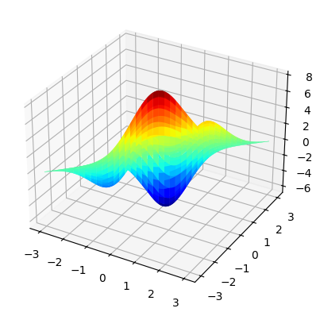

<!-- editorlm-hebrew-html-start -->
<style>
html, body, .vscode-body, .markdown-body, .markdown-preview, #write {
  direction: rtl !important; text-align: right !important;
}
ul, ol { padding-right: 2em !important; padding-left: 0 !important; }
blockquote { border-right: 3px solid #999; border-left: 0; padding-right: 1rem; padding-left: 0; }
@media print {
  html, body, .vscode-body, .markdown-body, .markdown-preview, #write {
    direction: rtl !important; text-align: right !important;
  }
}
</style>
<!-- editorlm-hebrew-html-end -->
<style>
.book { max-width: 900px; margin: auto; line-height: 1.8; font-family: Arial, sans-serif; }
.book .cover { min-height: 680px; box-sizing: border-box; padding: 64px 48px; margin: 24px 0 60px; background: #112b41; color: #f5f8fc; border-top: 9px solid #39c4b5; position: relative; }
.book .cover .eyebrow { color: #81e0d5; font-size: 15px; letter-spacing: 2px; }
.book .cover h1 { color: #fff; font-size: 48px; line-height: 1.3; border: 0; margin: 50px 0 18px; }
.book .cover .subtitle { font-size: 28px; color: #d8e6f0; }
.book .cover .author { font-size: 30px; color: #fff; margin-top: 52px; }
.book .cover .audience { color: #c1d3df; margin-top: 12px; }
.book .cover .motif { direction: ltr; text-align: left; font-family: Consolas, monospace; color: #81e0d5; font-size: 19px; margin-top: 54px; }
.book h1, .book h2, .book h3 { line-height: 1.4; font-weight: 700; }
.book > h1 { font-size: 32px !important; text-align: center !important; margin: 28px 0; }
.book h2 { font-size: 34px !important; text-align: center !important; color: #153b56 !important; background: #eef5fc; border: 0; border-bottom: 4px solid #299c91; border-radius: 10px 10px 0 0; padding: 28px 20px; margin: 24px 0 36px; }
.book h3 { font-size: 24px !important; text-align: right !important; color: #174e49 !important; background: #edf7f5; border: 0; border-right: 5px solid #299c91; border-radius: 6px; padding: 10px 16px; margin: 36px 0 18px; }
.book .chapter { height: 0; margin: 76px 0 0; border-top: 1px solid #ccd7df; break-before: page; page-break-before: always; break-after: avoid; page-break-after: avoid; }
.book .toc { padding: 24px; border-right: 5px solid #39a99d; background: rgba(70,150,155,.09); margin: 24px 0 48px; }
.book pre, .book pre code { direction: ltr !important; text-align: left !important; unicode-bidi: isolate; }
.book pre { box-sizing: border-box !important; width: 100% !important; max-width: 100% !important; margin: 0 !important; padding: 16px 20px; border: 1px solid #ccd7df; border-radius: 8px; line-height: 1.6; overflow-x: auto; }
.book code { direction: ltr; unicode-bidi: isolate; font-family: Consolas, "Courier New", monospace; }
.book pre { background: #f3f6fa !important; color: #1f2937 !important; }
.book pre code, .book pre code.hljs { background: transparent !important; color: #1f2937 !important; }
.book pre .hljs-keyword, .book pre .hljs-literal { color: #6f299c !important; }
.book pre .hljs-string { color: #216338 !important; }
.book pre .hljs-number { color: #075e68 !important; }
.book pre .hljs-comment { color: #526174 !important; }
.book pre .hljs-built_in, .book pre .hljs-title { color: #135b96 !important; }
.book table { width: 100%; }
.book th, .book td { text-align: right; }
.book .small { font-size: .9em; opacity: .8; }
.book .python-intro { display: flex; align-items: center; gap: 28px; padding: 22px 28px; margin: 24px 0; background: #eef5fc; color: #183e63; border-right: 6px solid #3776ab; border-radius: 10px; }
.book .python-intro strong { font-size: 30px; }
.book .python-fact { background: #fff7d6; color: #423611; border-right: 6px solid #ffd343; border-radius: 8px; padding: 18px 24px; margin: 22px 0; }
.book .python-fact strong { font-size: 24px; }
.book img { max-width: 100%; height: auto; }
.book figure { margin: 24px auto; text-align: center; }
.book figure img { display: block; margin: auto; }
.book figcaption { direction: rtl; text-align: center; font-size: .9em; color: #445566; }
@media print { .book > h2 { break-before: page; page-break-before: always; } }
.book .screen-strip { width: 760px; max-width: 100%; height: 220px; overflow: hidden; border: 1px solid #bccad5; border-radius: 8px; margin: 20px auto 8px; direction: ltr; }
.book .screen-strip.output { height: 265px; }
.book .screen-strip img { display: block; width: 1745px; max-width: none; }
.book .screen-menu { width: 400px; max-width: 100%; height: 295px; overflow: hidden; direction: ltr; margin: 20px auto 8px; border: 1px solid #bccad5; border-radius: 8px; }
.book .screen-menu img { display: block; width: 1745px; max-width: none; }
.book .code-panel { box-sizing: border-box !important; display: block !important; width: 50% !important; max-width: 50% !important; margin: 18px auto !important; }
@media print {
  .book .cover { min-height: 85vh; break-after: page; print-color-adjust: exact; -webkit-print-color-adjust: exact; }
  .book pre { white-space: pre-wrap; break-inside: avoid; }
  .book .chapter { margin: 0; border: 0; }
  .book h1, .book h2, .book h3 { break-after: avoid; page-break-after: avoid; break-inside: avoid; }
  .book h2 { margin-top: 0; }
  .book h2, .book h3 { print-color-adjust: exact; -webkit-print-color-adjust: exact; }
}
</style>

<style>
.book .book-nav { display: flex; flex-wrap: wrap; gap: 10px; justify-content: center; align-items: center; padding: 16px 0; margin: 20px 0 32px; border-top: 1px solid #ccd7df; border-bottom: 1px solid #ccd7df; }
.book .book-nav a { display: inline-block; padding: 10px 18px; border-radius: 8px; background: #eef5fc; color: #153b56 !important; border: 1px solid #b5ccd9; text-decoration: none !important; font-size: 16px; font-weight: bold; }
.book .book-nav a.toc-link { background: #174e49; color: #fff !important; border-color: #174e49; }
.book .book-nav a:hover, .book .book-nav a:focus { background: #d4eee8; color: #153b56 !important; outline: 2px solid #299c91; outline-offset: 2px; }
.book .section-list { line-height: 2; }
@media print { .book .book-nav { display: none; } }

/* Explicit Hebrew direction, including prose beginning with English. */
.book p, .book ul, .book ol, .book li,
.book blockquote, .book h1, .book h2, .book h3,
.book h4, .book th, .book td {
  direction: rtl !important;
  text-align: right !important;
  unicode-bidi: isolate;
}
/* Chapter titles keep their agreed centered layout. */
.book h2 { text-align: center !important; }
.book pre, .book pre code, .book .code-panel {
  direction: ltr !important;
  text-align: left !important;
  unicode-bidi: isolate;
}
</style>

<div class="book" dir="rtl" lang="he" style="direction: rtl !important; text-align: right !important;">

<nav class="book-nav" aria-label="ניווט בספר">
<a href="05-Gradient%20Descent%20%D7%91%D7%9E%D7%A9%D7%AA%D7%A0%D7%94%20%D7%90%D7%97%D7%93.md">→ הקודם</a>
<a class="toc-link" href="../index.md">תוכן העניינים</a>
<a href="07-%D7%A8%D7%92%D7%A8%D7%A1%D7%99%D7%94%20%D7%9C%D7%99%D7%A0%D7%90%D7%A8%D7%99%D7%AA.md">הבא ←</a>
</nav>

## ב.6 Gradient Descent בשני משתנים


עד עכשיו שינינו מספר אחד ונענו על ציר. כעת נבחר שני מספרים יחד ונחפש נקודה נמוכה על משטח. נתחיל בקערה שאפשר לחשב ביד, ואחריה נבחן משטחים בעלי כמה עמקים. כל צעד משתמש בשתי נגזרות חלקיות שחושבו באותה נקודה.

**[השיעור וההרצאות באתר של גלעד מרקמן](https://webprogramming.azurewebsites.net/Pages/PyTorch/SGD.aspx)**

[פתיחת מחברת Colab 1](https://colab.research.google.com/drive/15eZyICJwZ7G2N2P6uQiRZtXV3o4RdPfe?usp=sharing) · [פתיחת מחברת Colab 2](https://colab.research.google.com/drive/1wTS7NIob52DLTdhGiEcqtDKmjJufPKj3?usp=sharing)

**חומרי הליווי:** [4. Gradient Descent](../../../sources/ML/4.%20Gradient%20Descent.pptx) · [4_Gradient_Descent](../../../sources/ML/converted/4_Gradient_Descent/notebook.md) · [4.1_Gradient_Descent_2D](../../../sources/ML/converted/4.1_Gradient_Descent_2D/notebook.md)

### הכנת סביבת הפרק

<div class="code-panel" dir="ltr">

```python
import torch
from torch import nn
import numpy as np
import matplotlib.pyplot as plt
from torch.utils.data import DataLoader, TensorDataset

device = torch.device(
    "cuda" if torch.cuda.is_available() else "cpu"
)
```

</div>


### איך קוראים משטח ומפת קווי גובה?

במשתנה אחד הנקודה נעה על ציר, וערך הפונקציה מוצג כגובה. בשני משתנים המיקום הוא זוג (x,y) והפונקציה היא הגובה מעל המישור. מפת קווי גובה מציגה מבט מלמעלה: כל קו מחבר נקודות בעלות אותו ערך. קווים צפופים עשויים לציין שינוי מהיר בגובה.

הגרדיאנט מכיל שני רכיבים. כל רכיב מתאר שינוי כאשר מזיזים ציר אחד והאחר קבוע. העדכון בו־זמני: מחשבים את שתי הנגזרות באותה נקודה, ואז משנים את שני המשתנים. אין לחשב את הנגזרת השנייה אחרי שכבר שינינו את הראשון, אם רוצים לבצע את צעד הגרדיאנט שהוגדר.

### דוגמה פשוטה לפני Peaks

נבחר קערה `f(x,y)=(x−1)²+2(y+2)²`. המינימום הוא (1,−2), והגרדיאנט הוא `(2(x−1),4(y+2))`. נתחיל ב־(3,0) ונבחר קצב 0.1: הגרדיאנט (4,8), ולכן הנקודה הבאה (2.6,−0.8). ההפסד יורד מ־12 ל־5.44.

<div class="code-panel" dir="ltr">

```python
import torch

point = torch.tensor([3., 0.], requires_grad=True)
optimizer = torch.optim.SGD([point], lr=0.1)
path = []
for step in range(50):
    optimizer.zero_grad()
    value = (point[0]-1)**2 + 2*(point[1]+2)**2
    path.append(point.detach().clone())
    value.backward()
    optimizer.step()
path = torch.stack(path)
```

</div>

שמירת `clone` חשובה: אנחנו רוצים תמונת מצב של כל צעד, ולא כמה הפניות לאותם ערכים המשתנים בהמשך. אפשר להציג את `path[:,0]` מול `path[:,1]` ולראות את המסלול במישור.

### מעבר לשני משתנים

כעת לכל נקודה יש שני ערכים, x ו־y. לכל אחד מחשבים נגזרת חלקית, ושניהם מתעדכנים. במחברת מדגימים זאת באמצעות פונקציית Peaks:

<div class="code-panel" dir="ltr">

```python
def peaks(x, y):
    first = 3 * (1-x)**2 * torch.exp(
        -x**2 - (y+1)**2)
    second = -10 * (x/5-x**3-y**5)
    second *= torch.exp(-x**2-y**2)
    third = -torch.exp(
        -(x+1)**2-y**2) / 3
    return first + second + third

x = torch.tensor(1.5, requires_grad=True)
y = torch.tensor(-1., requires_grad=True)
optimizer = torch.optim.SGD([x, y], lr=0.01)
path = []
for step in range(200):
    path.append((x.item(), y.item()))
    optimizer.zero_grad()
    loss = peaks(x, y)
    loss.backward()
    optimizer.step()
```

</div>

<figure>

<!-- editorlm-source-ref: [sources/ML/converted/4.1_Gradient_Descent_2D/notebook.md#L129] -->
<figcaption>משטח Peaks מתוך המחברת: גובה המשטח הוא ערך הפונקציה.</figcaption>
</figure>

<figure>

<!-- editorlm-source-ref: [sources/ML/converted/4.1_Gradient_Descent_2D/notebook.md#L271] -->
<figcaption>מסלול החיפוש על מפת גבהים. כל נקודה במסלול היא זוג ערכים של x ו־y.</figcaption>
</figure>

בתוצאה השמורה מתקבלים בקירוב x=0.228, y=−1.626 וערך פונקציה −6.551. כאן ממזערים פונקציה מתמטית, ולכן ערך שלילי תקין.

בדוגמה נוספת במחברת מחליפים את הביטוי בפונקציה הבאה, מתחילים ב־x=0.5, y=1 ומבצעים 2,000 צעדים:

<div class="code-panel" dir="ltr">

```python
loss = x * torch.exp(-(x**2 + y**2))
```

</div>

<figure>

<!-- editorlm-source-ref: [sources/ML/converted/4.1_Gradient_Descent_2D/notebook.md#L394] -->
<figcaption>המסלול בדוגמה השנייה מתעקל בדרך למינימום סמוך ל־x=−0.707 ול־y=0.</figcaption>
</figure>

הנוסחאות משתנות, אך מנגנון האימון נשאר אותו מנגנון. המחברת מציינת שחלק מהדגמות שני המשתנים מבוססות על חומר של Mike X Cohen.

<!-- editorlm-source-ref: [sources/ML/4. Gradient Descent.pptx#L1-L101] -->
<!-- editorlm-source-ref: [sources/ML/converted/4_Gradient_Descent/notebook.md#L1-L523] -->
<!-- editorlm-source-ref: [sources/ML/converted/4.1_Gradient_Descent_2D/notebook.md#L1-L415] -->

### משפחת הדוגמאות בשני משתנים

ב־Peaks שינוי ההתחלה ל־(−1,−1) עשוי להביא לעמק אחר, סביב (−1.347,0.205), שערכו ‎−3.050. זהו אותו רעיון של כמה מינימות, אך כעת אפשר להגיע אליהן במסלולים המתעקלים במישור.

שתי מחברות ההמשך כוללות גם פונקציות מבחן פולינומיות. נכתוב את כל פונקציה בשם ברור, ונעביר לאופטימייזר בדיוק את המשתנים שבהם היא משתמשת.

<div class="code-panel" dir="ltr">

```python
def three_hump(x, y):
    return 2*x**2 - 1.05*x**4 + x**6/6 + x*y + y**2

def six_hump(x, y):
    return (x**2 * (4 - 2.1*x**2 + x**4/3)
            + x*y + y**2 * (-4 + 4*y**2))

def descend_2d(function, start, lr=0.01, steps=2000):
    p = torch.tensor(start, dtype=torch.float32,
                     requires_grad=True)
    optimizer = torch.optim.SGD([p], lr=lr)
    path = []
    for step in range(steps):
        optimizer.zero_grad()
        value = function(p[0], p[1])
        path.append(p.detach().clone())
        value.backward()
        optimizer.step()
    return p.detach(), torch.stack(path)

point, path = descend_2d(six_hump, [0.5, -0.5])
```

</div>

בדוגמת three_hump המסלול במחברת מגיע בקירוב ל־(0,0), עם ערך 0. בדוגמת six_hump מופיע מינימום סמוך ל־(0.090,−0.713), שערכו ‎−1.032. שימו לב לסימנים בנוסחה ולשם הפונקציה בשרטוט: גרף של פונקציה אחת אינו בדיקה של אימון פונקציה אחרת.

<figure>

<figcaption>משטח הפונקציה x·exp(−x²−y²) במחברת ההמשך.</figcaption>
</figure>
<!-- editorlm-source-ref: [sources/ML/converted/4.2_Gradient_Descent_2D.ipynb - פתרון תרגילים/notebook.md#L302] --><figure>

<figcaption>מסלול על קווי הגובה של אותה פונקציה: הרכיבים משתנים יחד לאורך החיפוש.</figcaption>
</figure>
<!-- editorlm-source-ref: [sources/ML/converted/4.2_Gradient_Descent_2D.ipynb - פתרון תרגילים/notebook.md#L399] --><figure>

<figcaption>מסלול החיפוש בפונקציית six-hump camel מתוך הפלט השמור במחברת.</figcaption>
</figure>
<!-- editorlm-source-ref: [sources/ML/converted/4.2_Gradient_Descent_2D.ipynb - פתרון תרגילים/notebook.md#L469] -->

### מה הקשר לאימון רשת?

ברשת יש בדרך כלל הרבה יותר משני פרמטרים, ולכן אי אפשר לצייר את משטח ההפסד כולו. העיקרון נשאר: מחשבים נגזרת חלקית לכל פרמטר, ומעדכנים את כולם לפי אותה פונקציית הפסד. ההדמיות בשני משתנים נותנות לנו אפשרות לראות התנהגות שאחר כך נזהה רק דרך עקומות הפסד ומדדי בדיקה.
<!-- editorlm-source-ref: [sources/ML/converted/4.2_Gradient_Descent_2D.ipynb - פתרון תרגילים/notebook.md#L1-L508] --><!-- editorlm-source-ref: [sources/ML/converted/4.2_Gradient_Descent_2D.ipynb - פתרון/notebook.md#L1-L646] -->


<!-- editorlm-source-ref: [sources/ML/converted/4_Gradient_Descent/notebook.md#L351] -->
<!-- editorlm-source-ref: [sources/ML/converted/4_Gradient_Descent/notebook.md#L523] -->
<!-- editorlm-source-ref: [sources/ML/converted/4_Gradient_Descent_exe/notebook.md#L313-L1097] -->
<!-- editorlm-source-ref: [sources/ML/converted/4_Gradient_Descent_exe/notebook.md#L690-L690] -->
<!-- editorlm-source-ref: [sources/ML/converted/4_Gradient_Descent_exe/notebook.md#L823-L823] -->


<nav class="book-nav" aria-label="ניווט בספר">
<a href="05-Gradient%20Descent%20%D7%91%D7%9E%D7%A9%D7%AA%D7%A0%D7%94%20%D7%90%D7%97%D7%93.md">→ הקודם</a>
<a class="toc-link" href="../index.md">תוכן העניינים</a>
<a href="07-%D7%A8%D7%92%D7%A8%D7%A1%D7%99%D7%94%20%D7%9C%D7%99%D7%A0%D7%90%D7%A8%D7%99%D7%AA.md">הבא ←</a>
</nav>

</div>

<!-- editorlm-source-versions: {"schemaVersion": 1, "sources": {"sources/ML/4. Gradient Descent.pptx": {"sourceSha256": "b48907df5d0c0c0b1a33b91aaa72327091593bcbc6e52f35f5342e6d140e7037", "canonicalTextSha256": "00c2d04628cae8ae2f273729094b4c0103d0e42bbd6229887328b96e870ec65e"}, "sources/ML/converted/4_Gradient_Descent/notebook.md": {"sourceSha256": "207b2e48facd692f83e0bbe9a9616c5d643dda1fc30f43823eb9141dc9fcd9d2", "canonicalTextSha256": "207b2e48facd692f83e0bbe9a9616c5d643dda1fc30f43823eb9141dc9fcd9d2"}, "sources/ML/converted/4.1_Gradient_Descent_2D/notebook.md": {"sourceSha256": "e5972e87af2be2a5fcbb0a04dcf94634a80eaaa8b305404940bb524b523a998c", "canonicalTextSha256": "e5972e87af2be2a5fcbb0a04dcf94634a80eaaa8b305404940bb524b523a998c"}, "sources/ML/converted/4.2_Gradient_Descent_2D.ipynb - פתרון תרגילים/notebook.md": {"sourceSha256": "6b47acb7a0a43cffd09299b833b02ad1c528fcf7b086602f89951bbfa026f654", "canonicalTextSha256": "6b47acb7a0a43cffd09299b833b02ad1c528fcf7b086602f89951bbfa026f654"}, "sources/ML/converted/4_Gradient_Descent_exe/notebook.md": {"sourceSha256": "f4c557c72e2f515fc58fc598b9b7f3e4aa22020e14400650f1c62e43c2524d4d", "canonicalTextSha256": "f4c557c72e2f515fc58fc598b9b7f3e4aa22020e14400650f1c62e43c2524d4d"}, "sources/ML/converted/4.2_Gradient_Descent_2D.ipynb - פתרון/notebook.md": {"sourceSha256": "dc679d567a3fd655c6e8c7b5fa152d2607824344596a70c65a64d1d572efe9e2", "canonicalTextSha256": "dc679d567a3fd655c6e8c7b5fa152d2607824344596a70c65a64d1d572efe9e2"}}} -->
