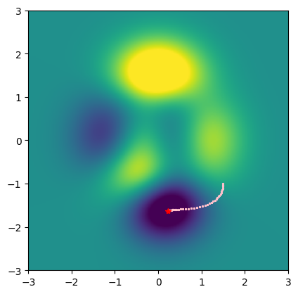
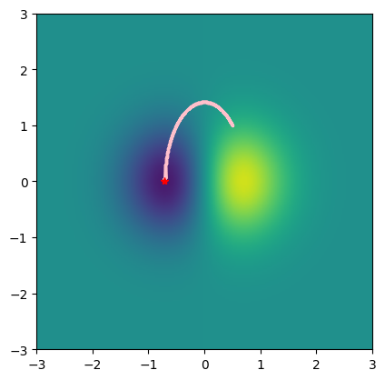

<!-- editorlm-hebrew-html-start -->
<style>
html, body, .vscode-body, .markdown-body, .markdown-preview, #write {
  direction: rtl !important; text-align: right !important;
}
ul, ol { padding-right: 2em !important; padding-left: 0 !important; }
blockquote { border-right: 3px solid #999; border-left: 0; padding-right: 1rem; padding-left: 0; }
@media print {
  html, body, .vscode-body, .markdown-body, .markdown-preview, #write {
    direction: rtl !important; text-align: right !important;
  }
}
</style>
<!-- editorlm-hebrew-html-end -->
<style>
.book { max-width: 900px; margin: auto; line-height: 1.8; font-family: Arial, sans-serif; }
.book .cover { min-height: 680px; box-sizing: border-box; padding: 64px 48px; margin: 24px 0 60px; background: #112b41; color: #f5f8fc; border-top: 9px solid #39c4b5; position: relative; }
.book .cover .eyebrow { color: #81e0d5; font-size: 15px; letter-spacing: 2px; }
.book .cover h1 { color: #fff; font-size: 48px; line-height: 1.3; border: 0; margin: 50px 0 18px; }
.book .cover .subtitle { font-size: 28px; color: #d8e6f0; }
.book .cover .author { font-size: 30px; color: #fff; margin-top: 52px; }
.book .cover .audience { color: #c1d3df; margin-top: 12px; }
.book .cover .motif { direction: ltr; text-align: left; font-family: Consolas, monospace; color: #81e0d5; font-size: 19px; margin-top: 54px; }
.book h1, .book h2, .book h3 { line-height: 1.4; font-weight: 700; }
.book > h1 { font-size: 32px !important; text-align: center !important; margin: 28px 0; }
.book h2 { font-size: 34px !important; text-align: center !important; color: #153b56 !important; background: #eef5fc; border: 0; border-bottom: 4px solid #299c91; border-radius: 10px 10px 0 0; padding: 28px 20px; margin: 24px 0 36px; }
.book h3 { font-size: 24px !important; text-align: right !important; color: #174e49 !important; background: #edf7f5; border: 0; border-right: 5px solid #299c91; border-radius: 6px; padding: 10px 16px; margin: 36px 0 18px; }
.book .chapter { height: 0; margin: 76px 0 0; border-top: 1px solid #ccd7df; break-before: page; page-break-before: always; break-after: avoid; page-break-after: avoid; }
.book .toc { padding: 24px; border-right: 5px solid #39a99d; background: rgba(70,150,155,.09); margin: 24px 0 48px; }
.book pre, .book pre code { direction: ltr !important; text-align: left !important; unicode-bidi: isolate; }
.book pre { box-sizing: border-box !important; width: 100% !important; max-width: 100% !important; margin: 0 !important; padding: 16px 20px; border: 1px solid #ccd7df; border-radius: 8px; line-height: 1.6; overflow-x: auto; }
.book code { direction: ltr; unicode-bidi: isolate; font-family: Consolas, "Courier New", monospace; }
.book pre { background: #f3f6fa !important; color: #1f2937 !important; }
.book pre code, .book pre code.hljs { background: transparent !important; color: #1f2937 !important; }
.book pre .hljs-keyword, .book pre .hljs-literal { color: #6f299c !important; }
.book pre .hljs-string { color: #216338 !important; }
.book pre .hljs-number { color: #075e68 !important; }
.book pre .hljs-comment { color: #526174 !important; }
.book pre .hljs-built_in, .book pre .hljs-title { color: #135b96 !important; }
.book table { width: 100%; }
.book th, .book td { text-align: right; }
.book .small { font-size: .9em; opacity: .8; }
.book .python-intro { display: flex; align-items: center; gap: 28px; padding: 22px 28px; margin: 24px 0; background: #eef5fc; color: #183e63; border-right: 6px solid #3776ab; border-radius: 10px; }
.book .python-intro strong { font-size: 30px; }
.book .python-fact { background: #fff7d6; color: #423611; border-right: 6px solid #ffd343; border-radius: 8px; padding: 18px 24px; margin: 22px 0; }
.book .python-fact strong { font-size: 24px; }
.book img { max-width: 100%; height: auto; }
.book figure { margin: 24px auto; text-align: center; }
.book figure img { display: block; margin: auto; }
.book figcaption { direction: rtl; text-align: center; font-size: .9em; color: #445566; }
@media print { .book > h2 { break-before: page; page-break-before: always; } }
.book .screen-strip { width: 760px; max-width: 100%; height: 220px; overflow: hidden; border: 1px solid #bccad5; border-radius: 8px; margin: 20px auto 8px; direction: ltr; }
.book .screen-strip.output { height: 265px; }
.book .screen-strip img { display: block; width: 1745px; max-width: none; }
.book .screen-menu { width: 400px; max-width: 100%; height: 295px; overflow: hidden; direction: ltr; margin: 20px auto 8px; border: 1px solid #bccad5; border-radius: 8px; }
.book .screen-menu img { display: block; width: 1745px; max-width: none; }
.book .code-panel { box-sizing: border-box !important; display: block !important; width: 50% !important; max-width: 50% !important; margin: 18px auto !important; }
@media print {
  .book .cover { min-height: 85vh; break-after: page; print-color-adjust: exact; -webkit-print-color-adjust: exact; }
  .book pre { white-space: pre-wrap; break-inside: avoid; }
  .book .chapter { margin: 0; border: 0; }
  .book h1, .book h2, .book h3 { break-after: avoid; page-break-after: avoid; break-inside: avoid; }
  .book h2 { margin-top: 0; }
  .book h2, .book h3 { print-color-adjust: exact; -webkit-print-color-adjust: exact; }
}
</style>

<style>
.book .book-nav { display: flex; flex-wrap: wrap; gap: 10px; justify-content: center; align-items: center; padding: 16px 0; margin: 20px 0 32px; border-top: 1px solid #ccd7df; border-bottom: 1px solid #ccd7df; }
.book .book-nav a { display: inline-block; padding: 10px 18px; border-radius: 8px; background: #eef5fc; color: #153b56 !important; border: 1px solid #b5ccd9; text-decoration: none !important; font-size: 16px; font-weight: bold; }
.book .book-nav a.toc-link { background: #174e49; color: #fff !important; border-color: #174e49; }
.book .book-nav a:hover, .book .book-nav a:focus { background: #d4eee8; color: #153b56 !important; outline: 2px solid #299c91; outline-offset: 2px; }
.book .section-list { line-height: 2; }
@media print { .book .book-nav { display: none; } }

/* Explicit Hebrew direction, including prose beginning with English. */
.book p, .book ul, .book ol, .book li,
.book blockquote, .book h1, .book h2, .book h3,
.book h4, .book th, .book td {
  direction: rtl !important;
  text-align: right !important;
  unicode-bidi: isolate;
}
/* Chapter titles keep their agreed centered layout. */
.book h2 { text-align: center !important; }
.book pre, .book pre code, .book .code-panel {
  direction: ltr !important;
  text-align: left !important;
  unicode-bidi: isolate;
}
</style>

<div class="book" dir="rtl" lang="he" style="direction: rtl !important; text-align: right !important;">

<nav class="book-nav" aria-label="ניווט בספר">
<a href="05-Gradient%20Descent%20%D7%91%D7%9E%D7%A9%D7%AA%D7%A0%D7%94%20%D7%90%D7%97%D7%93.md">→ הקודם</a>
<a class="toc-link" href="../index.md">תוכן העניינים</a>
<a href="07-%D7%A8%D7%92%D7%A8%D7%A1%D7%99%D7%94%20%D7%9C%D7%99%D7%A0%D7%90%D7%A8%D7%99%D7%AA.md">הבא ←</a>
</nav>

## ב.6 Gradient Descent בשני משתנים

פונקציה במשתנה אחד מתארת עקומה במישור. פונקציה בשני משתנים מתארת משטח במרחב: לכל זוג ערכים x ו־y מתאים גובה. כשיש יותר משני משתני קלט, אי אפשר להציג את כל גרף הפונקציה במרחב תלת־ממדי רגיל.

גם בפונקציות במספר משתנים אפשר לחפש מינימום מקומי בעזרת Gradient Descent. בכל איטרציה מחשבים נגזרת חלקית לפי כל משתנה ומעדכנים את המשתנים בהתאם לנגזרות ולקצב הלמידה.

<!-- editorlm-source-ref: [sources/ML/converted/4.1_Gradient_Descent_2D/notebook.md#L12-L26] -->

<!-- editorlm-source-ref: [sources/ML/pdf/4. Gradient Descent.pdf#L188-L210] -->

**[השיעור וההרצאות באתר של גלעד מרקמן](https://webprogramming.azurewebsites.net/Pages/PyTorch/SGD.aspx)**

**חומרי הליווי:** [4. Gradient Descent](../../../sources/ML/4.%20Gradient%20Descent.pptx) · [מחברת Gradient Descent 2D](../../../sources/ML/Colab/4.1_Gradient_Descent_2D.ipynb)

נייבא את הספריות:

<div class="code-panel" dir="ltr">

```python
import torch
import numpy as np
import matplotlib.pyplot as plt
```

</div>

### פונקציית Peaks

נחפש מינימום של הפונקציה:

$$
z=3(1-x)^2e^{-x^2-(y+1)^2}
-10\left(\frac{x}{5}-x^3-y^5\right)e^{-x^2-y^2}
-\frac{1}{3}e^{-(x+1)^2-y^2}
$$

הדוגמה מבוססת על הקורס *A deep understanding of deep learning* של Mike X Cohen. במפת הצבעים, צהוב מציין נקודות גבוהות וכחול נקודות נמוכות.

<!-- editorlm-source-ref: [sources/ML/converted/4.1_Gradient_Descent_2D/notebook.md#L35-L52] -->

<!-- editorlm-source-ref: [sources/ML/pdf/4. Gradient Descent.pdf#L213-L218] -->

### הצגת הגרף

נגדיר את הפונקציה באמצעות NumPy. הפעולה `meshgrid` יוצרת רשת של זוגות ערכי x ו־y, שעליה נחשב את גובה המשטח.

<div class="code-panel" dir="ltr">

```python
# From Udemy, A deep understanding of deep learning, Mike X Cohen
# the "peaks" function
def peaks(x,y):
    # expand to a 2D mesh
    x,y = np.meshgrid(x,y)

    z = 3*(1-x)**2 * np.exp(-(x**2) - (y+1)**2) \
            - 10*(x/5 - x**3 - y**5) * np.exp(-x**2-y**2) \
            - 1/3*np.exp(-(x+1)**2 - y**2)
    return z
```

</div>

ניצור את ערכי הצירים ונציג את מפת הצבעים:

<div class="code-panel" dir="ltr">

```python
# create the landscape
x = np.linspace(-3,3,201)
y = np.linspace(-3,3,201)

z = peaks(x,y)

# let's have a look!
plt.imshow(z,extent=[x[0],x[-1],y[0],y[-1]],vmin=-5,vmax=5,origin='lower')
plt.show()
```

</div>

נציג גם את המשטח במרחב:

<div class="code-panel" dir="ltr">

```python
from matplotlib import projections
# create a surface plot with the jet color scheme
figure = plt.figure(figsize=(10, 8))
axis = plt.subplot(projection='3d')
grid_x, grid_y = np.meshgrid(x, y)
axis.plot_surface(grid_x, grid_y, z, cmap='jet', vmin=-5, vmax=5)

# Add labels and a title
axis.set_xlabel('X-axis')
axis.set_ylabel('Y-axis')
axis.set_zlabel('Z-axis (f(x,y))')
axis.set_title('Peaks')

# Adjust view angle for better visualization
axis.view_init(elev=30, azim=-45)

# show the plot
plt.show()
```

</div>

נחשב את ערך הפונקציה בשלוש נקודות:

<div class="code-panel" dir="ltr">

```python
print(peaks(0.5,-1.5))
print(peaks(0.5,2))
print(peaks(0,0))
```

</div>

**פלט**

<div class="code-panel" dir="ltr">

```text
[[-5.76161334]]
[[4.56754951]]
[[0.98101184]]
```

</div>


<!-- editorlm-source-ref: [sources/ML/converted/4.1_Gradient_Descent_2D/notebook.md#L57-L147] -->

### הגדרת הפונקציה באמצעות טנסורים

נשתמש בפעולות של PyTorch כדי שנוכל לחשב נגזרות:

<div class="code-panel" dir="ltr">

```python
def Peaks(x, y):
    return 3*(1-x)**2 * torch.exp(-(x**2) - (y+1)**2) \
            - 10*(x/5 - x**3 - y**5) * torch.exp(-x**2-y**2) \
            - 1/3*torch.exp(-(x+1)**2 - y**2)
```

</div>


<!-- editorlm-source-ref: [sources/ML/converted/4.1_Gradient_Descent_2D/notebook.md#L154-L163] -->

נאתחל את שני המשתנים ואת קצב הלמידה:

<div class="code-panel" dir="ltr">

```python
# Initialize parameters
X = torch.tensor(1.5, dtype=torch.float32 ,requires_grad=True)
Y = torch.tensor(-1.0, dtype=torch.float32,requires_grad=True)
learning_rate = 0.01
print (X, Y)
```

</div>

**פלט**

<div class="code-panel" dir="ltr">

```text
tensor(1.5000, requires_grad=True) tensor(-1., requires_grad=True)
```

</div>


<!-- editorlm-source-ref: [sources/ML/converted/4.1_Gradient_Descent_2D/notebook.md#L168-L184] -->

ניצור אופטימייזר שמקבל את שני המשתנים:

<div class="code-panel" dir="ltr">

```python
# init optimizer
optimizer = torch.optim.SGD([X,Y], lr=learning_rate)
```

</div>


<!-- editorlm-source-ref: [sources/ML/converted/4.1_Gradient_Descent_2D/notebook.md#L189-L196] -->

### חישוב Gradient Descent

נבצע 200 איטרציות. בכל איטרציה נשמור את המיקום ברשימות, נחשב את הנגזרות, נעדכן את שני המשתנים ונאפס את הנגזרות:

<div class="code-panel" dir="ltr">

```python
x_lst, y_lst = [], []
for epoch in range (200):
    # Forward
    Z = Peaks(X,Y)

    x_lst.append(X.item())
    y_lst.append(Y.item())

    # Calculate gradients
    Z.backward()

    if epoch % 10 == 0:
        print(f"epoch= {epoch} \t X,Y = {X.item():.3f}, {Y.item():.3f} \t Z={Z:.3f} \t X_grad, Y_grad= {X.grad:.3f} , {Y.grad:.3f}")

    # Update parameters
    optimizer.step()


    # Zero gradients
    optimizer.zero_grad()

print(f"End X,Y = {X.item():.3f}, {Y.item():.3f} Z={Z:.3f}")
```

</div>

השורה האחרונה של הפלט:

**פלט**

<div class="code-panel" dir="ltr">

```text
End X,Y = 0.228, -1.626 Z=-6.551
```

</div>


<!-- editorlm-source-ref: [sources/ML/converted/4.1_Gradient_Descent_2D/notebook.md#L201-L254] -->

נציג את המסלול ואת נקודת הסיום על מפת הפונקציה:

<div class="code-panel" dir="ltr">

```python
plt.imshow(z,extent=[x[0],x[-1],y[0],y[-1]],vmin=-5,vmax=5,origin='lower')
plt.plot(x_lst, y_lst, '*', color='pink', markersize=2)
plt.plot(X.item(), Y.item(),'*', color='red')
plt.show()
```

</div>


<figure>

<figcaption>מסלול החיפוש בוורוד ונקודת הסיום באדום על מפת Peaks.</figcaption>
</figure>


<!-- editorlm-source-ref: [sources/ML/converted/4.1_Gradient_Descent_2D/notebook.md#L255-L272] -->

כעת שנו את נקודת ההתחלה של Peaks ל־(‎−1, ‎−1) והריצו שוב 200 איטרציות בקצב 0.01. מתקבלת נקודת סיום אחרת:

**פלט**

<div class="code-panel" dir="ltr">

```text
End X,Y = -1.347, 0.205 Z=-3.050
```

</div>

זו דוגמה להשפעת נקודת ההתחלה על המינימום המקומי שאליו מגיע החיפוש.
<!-- editorlm-source-ref: [sources/ML/converted/4.2_Gradient_Descent_2D.ipynb - פתרון תרגילים/notebook.md#L162-L261] -->

### תרגיל

הריצו שוב את החיפוש ב־Peaks עם צירופי האתחול וקצב הלמידה הבאים, והסבירו את ההבדלים בתוצאות:

| קצב למידה | x התחלתי | y התחלתי |
|---|---:|---:|
| 0.1 | 0 | 1.5 |
| 0.1 | 0 | 2 |
| 0.01 | 0 | ‎−1 |
| 0.01 | ‎−2 | 0 |
| 0.5 | ‎−2 | 0 |

<!-- editorlm-source-ref: [sources/ML/pdf/4. Gradient Descent.pdf#L302-L310] -->

לאחר מכן חפשו נקודת מינימום של הפונקציה:

$$
f(x,y)=xe^{-(x^2+y^2)}
$$

<!-- editorlm-source-ref: [sources/ML/converted/4.1_Gradient_Descent_2D/notebook.md#L273-L286] -->

נציג תחילה את הפונקציה:

<div class="code-panel" dir="ltr">

```python
def graph(x,y):
    x,y = np.meshgrid(x,y)
    return x * np.exp(-(x**2+y**2))

# create the landscape
x = np.linspace(-3,3,201)
y = np.linspace(-3,3,201)

z = graph(x,y)

# let's have a look!
plt.imshow(z,extent=[x[0],x[-1],y[0],y[-1]],vmin=-0.5,vmax=0.5,origin='lower')
plt.show()
```

</div>

נגדיר אותה באמצעות טנסורים ונריץ 2,000 איטרציות מנקודת ההתחלה (0.5, 1):

<div class="code-panel" dir="ltr">

```python
def f(x,y):
    return x * torch.exp(-(x**2+y**2))

x_lst, y_lst = [], []
# Initialize parameters
X = torch.tensor(0.5, dtype=torch.float32 ,requires_grad=True)
Y = torch.tensor(1, dtype=torch.float32,requires_grad=True)
learning_rate = 0.01

# init optimizer
optimizer = torch.optim.SGD([X,Y], lr=learning_rate)

for epoch in range(2000):
    # Forward
    F = f(X,Y)

    x_lst.append(X.item())
    y_lst.append(Y.item())

    # Calculate gradients
    F.backward()

    # Update parameters
    optimizer.step()

    if epoch % 100 == 0:
        print(f"epoch= {epoch} \t X,Y = {X.item():.3f}, {Y.item():.3f} \t F={F:.3f} \t X_grad, Y_grad= {X.grad:.3f} , {Y.grad:.3f}")

    # zero Grads
    optimizer.zero_grad()

print(f"End X,Y = {X.item():.3f}, {Y.item():.3f} F={F:.3f}")
```

</div>

השורה האחרונה של הפלט:

**פלט**

<div class="code-panel" dir="ltr">

```text
End X,Y = -0.707, 0.000 F=-0.429
```

</div>

בפלט שבתוך לולאה זו, x ו־y מוצגים אחרי העדכון, ואילו ערך הפונקציה והנגזרות חושבו לפניו.

<!-- editorlm-source-ref: [sources/ML/converted/4.1_Gradient_Descent_2D/notebook.md#L287-L377] -->

נציג את מסלול החיפוש:

<div class="code-panel" dir="ltr">

```python
plt.imshow(z,extent=[x[0],x[-1],y[0],y[-1]],vmin=-0.5,vmax=0.5,origin='lower')
plt.plot(x_lst, y_lst, '*', color='pink', markersize=2)
plt.plot(X.item(), Y.item(),'*', color='red')
plt.show()
```

</div>


<figure>

<figcaption>מסלול החיפוש ונקודת הסיום ליד x=−0.707 ו־y=0.</figcaption>
</figure>

נציג גם את המשטח במרחב:

<div class="code-panel" dir="ltr">

```python
# create a surface plot with the jet color scheme
figure = plt.figure()
axis = plt.subplot(projection='3d')
grid_x, grid_y = np.meshgrid(x, y)
axis.plot_surface(grid_x, grid_y, z, cmap='jet')
# show the plot
plt.show()
```

</div>


<!-- editorlm-source-ref: [sources/ML/converted/4.1_Gradient_Descent_2D/notebook.md#L378-L415] -->


### תרגילים נוספים

המשיכו בחיפוש מינימום לשתי הפונקציות הבאות. שימו לב לתחומי הצירים ולתחומי הצבעים `vmin` ו־`vmax` בגרפים.

<!-- editorlm-source-ref: [sources/ML/converted/4.2_Gradient_Descent_2D.ipynb - פתרון/notebook.md#L280-L286] -->


**תרגיל 2**

$$
f(x_1,x_2)=2x_1^2-1.05x_1^4+\frac{x_1^6}{6}+x_1x_2+x_2^2
$$

נגדיר את הפונקציה ונציג אותה:

<div class="code-panel" dir="ltr">

```python
def F(x1,x2):
    return 2*x1**2 - 1.05*x1**4 + x1**6 / 6 + x1*x2 + x2**2

# create the landscape
x1_v = np.linspace(-3,3,201)
x2_v = np.linspace(-3,3,201)
x1_mesh,x2_mesh = np.meshgrid(x1_v,x2_v)

z = F(x1_mesh,x2_mesh)

# let's have a look!
plt.imshow(z,extent=[x1_v[0],x1_v[-1],x2_v[0],x2_v[-1]],vmin=-0.5,vmax=2,origin='lower')
plt.show()
```

</div>

נריץ את החיפוש מנקודת ההתחלה (1, 0), בקצב 0.01, במשך 2,000 איטרציות:

<div class="code-panel" dir="ltr">

```python
x1_lst, x2_lst = [], []
# Initialize parameters
x1 = torch.tensor(1, dtype=torch.float32 ,requires_grad=True)
x2 = torch.tensor(0, dtype=torch.float32,requires_grad=True)
learning_rate = 0.01

# init optimizer
optimizer = torch.optim.SGD([x1,x2], lr=learning_rate)

for epoch in range(2000):
    # Forward
    f = F(x1,x2)

    x1_lst.append(x1.item())
    x2_lst.append(x2.item())

    # Calculate gradients
    f.backward()

    # Update parameters
    optimizer.step()

    if epoch % 100 == 0:
        print(f"epoch= {epoch} \t X,Y = {x1.item():.3f}, {x2.item():.3f} \t F={f.item():.3f} \t X_grad, Y_grad= {x1.grad:.3f} , {x2.grad:.3f}")

    # zero Grads
    optimizer.zero_grad()

print(f"End X,Y = {x1.item():.3f}, {x2.item():.3f} F={f:.3f}")
```

</div>

השורה האחרונה של הפלט:

**פלט**

<div class="code-panel" dir="ltr">

```text
End X,Y = 0.000, -0.000 F=0.000
```

</div>

נציג את המסלול:

<div class="code-panel" dir="ltr">

```python
plt.imshow(z,extent=[x1_v[0],x1_v[-1],x2_v[0],x2_v[-1]],vmin=-0.5,vmax=2,origin='lower')
plt.plot(x1_lst, x2_lst, '*', color='pink', markersize=2)
plt.plot(x1.item(), x2.item(),'*', color='red')
plt.show()
```

</div>

<figure>

<figcaption>המסלול בוורוד ונקודת הסיום באדום.</figcaption>
</figure>

<!-- editorlm-source-ref: [sources/ML/converted/4.2_Gradient_Descent_2D.ipynb - פתרון/notebook.md#L416-L530] -->

**תרגיל 3**

$$
f(x_1,x_2)=x_1^2\left(4-2.1x_1^2+\frac{x_1^4}{3}\right)+x_1x_2+x_2^2(-4+4x_2^2)
$$

נגדיר את הפונקציה ונציג אותה:

<div class="code-panel" dir="ltr">

```python
def F(x1,x2):
    return x1**2*(4-2.1*x1**2 + x1**4/3) + x1*x2 + x2**2 * (-4 + 4 * x2**2)

# create the landscape
x1_v = np.linspace(-2,2,201)
x2_v = np.linspace(-1.2,1.2,201)
x1_mesh,x2_mesh = np.meshgrid(x1_v,x2_v)

z = F(x1_mesh,x2_mesh)

# let's have a look!
plt.imshow(z,extent=[x1_v[0],x1_v[-1],x2_v[0],x2_v[-1]],vmin=-1,vmax=1,origin='lower')
plt.show()
```

</div>

נריץ את החיפוש מנקודת ההתחלה (1, 0), בקצב 0.01, במשך 2,000 איטרציות:

<div class="code-panel" dir="ltr">

```python
x1_lst, x2_lst = [], []
# Initialize parameters
x1 = torch.tensor(1, dtype=torch.float32 ,requires_grad=True)
x2 = torch.tensor(0, dtype=torch.float32,requires_grad=True)
learning_rate = 0.01

# init optimizer
optimizer = torch.optim.SGD([x1,x2], lr=learning_rate)

for epoch in range(2000):
    # Forward
    f = F(x1,x2)

    x1_lst.append(x1.item())
    x2_lst.append(x2.item())

    # Calculate gradients
    f.backward()

    # Update parameters
    optimizer.step()

    if epoch % 100 == 0:
        print(f"epoch= {epoch} \t X,Y = {x1.item():.3f}, {x2.item():.3f} \t F={f.item():.3f} \t X_grad, Y_grad= {x1.grad:.3f} , {x2.grad:.3f}")

    # zero Grads
    optimizer.zero_grad()

print(f"End X,Y = {x1.item():.3f}, {x2.item():.3f} F={f:.3f}")
```

</div>

השורה האחרונה של הפלט:

**פלט**

<div class="code-panel" dir="ltr">

```text
End X,Y = 0.090, -0.713 F=-1.032
```

</div>

נציג את המסלול:

<div class="code-panel" dir="ltr">

```python
plt.imshow(z,extent=[x1_v[0],x1_v[-1],x2_v[0],x2_v[-1]],vmin=-0.5,vmax=2,origin='lower')
plt.plot(x1_lst, x2_lst, '*', color='pink', markersize=2)
plt.plot(x1.item(), x2.item(),'*', color='red')
plt.show()
```

</div>

<figure>

<figcaption>המסלול בוורוד ונקודת הסיום באדום.</figcaption>
</figure>

<!-- editorlm-source-ref: [sources/ML/converted/4.2_Gradient_Descent_2D.ipynb - פתרון/notebook.md#L532-L646] -->


<nav class="book-nav" aria-label="ניווט בספר">
<a href="05-Gradient%20Descent%20%D7%91%D7%9E%D7%A9%D7%AA%D7%A0%D7%94%20%D7%90%D7%97%D7%93.md">→ הקודם</a>
<a class="toc-link" href="../index.md">תוכן העניינים</a>
<a href="07-%D7%A8%D7%92%D7%A8%D7%A1%D7%99%D7%94%20%D7%9C%D7%99%D7%A0%D7%90%D7%A8%D7%99%D7%AA.md">הבא ←</a>
</nav>

</div>

<!-- editorlm-source-versions: {"schemaVersion": 1, "sources": {"sources/ML/pdf/4. Gradient Descent.pdf": {"sourceSha256": "c18d2622343a1b388da9ab639c4bd006841cf2dda9bb5135d4390db873478c4e", "canonicalTextSha256": "80fecee360f06548411df640cf471709095926be7a3940fc5b99a14bbe235950"}, "sources/ML/converted/4.1_Gradient_Descent_2D/notebook.md": {"sourceSha256": "e5972e87af2be2a5fcbb0a04dcf94634a80eaaa8b305404940bb524b523a998c", "canonicalTextSha256": "e5972e87af2be2a5fcbb0a04dcf94634a80eaaa8b305404940bb524b523a998c"}, "sources/ML/converted/4.2_Gradient_Descent_2D.ipynb - פתרון תרגילים/notebook.md": {"sourceSha256": "6b47acb7a0a43cffd09299b833b02ad1c528fcf7b086602f89951bbfa026f654", "canonicalTextSha256": "6b47acb7a0a43cffd09299b833b02ad1c528fcf7b086602f89951bbfa026f654"}, "sources/ML/converted/4.2_Gradient_Descent_2D.ipynb - פתרון/notebook.md": {"sourceSha256": "dc679d567a3fd655c6e8c7b5fa152d2607824344596a70c65a64d1d572efe9e2", "canonicalTextSha256": "dc679d567a3fd655c6e8c7b5fa152d2607824344596a70c65a64d1d572efe9e2"}}} -->
