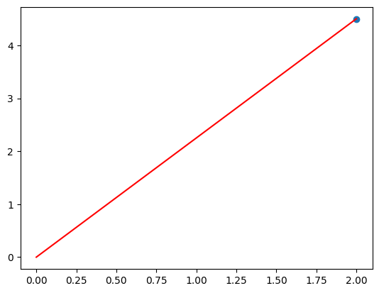
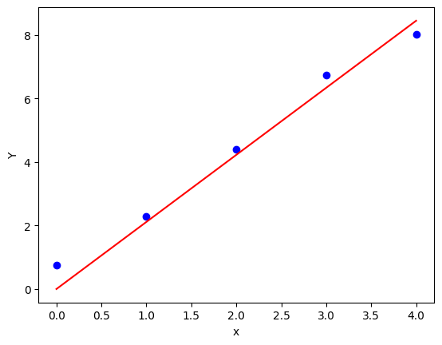

<!-- editorlm-hebrew-html-start -->
<style>
html, body, .vscode-body, .markdown-body, .markdown-preview, #write {
  direction: rtl !important; text-align: right !important;
}
ul, ol { padding-right: 2em !important; padding-left: 0 !important; }
blockquote { border-right: 3px solid #999; border-left: 0; padding-right: 1rem; padding-left: 0; }
@media print {
  html, body, .vscode-body, .markdown-body, .markdown-preview, #write {
    direction: rtl !important; text-align: right !important;
  }
}
</style>
<!-- editorlm-hebrew-html-end -->
<style>
.book { max-width: 900px; margin: auto; line-height: 1.8; font-family: Arial, sans-serif; }
.book .cover { min-height: 680px; box-sizing: border-box; padding: 64px 48px; margin: 24px 0 60px; background: #112b41; color: #f5f8fc; border-top: 9px solid #39c4b5; position: relative; }
.book .cover .eyebrow { color: #81e0d5; font-size: 15px; letter-spacing: 2px; }
.book .cover h1 { color: #fff; font-size: 48px; line-height: 1.3; border: 0; margin: 50px 0 18px; }
.book .cover .subtitle { font-size: 28px; color: #d8e6f0; }
.book .cover .author { font-size: 30px; color: #fff; margin-top: 52px; }
.book .cover .audience { color: #c1d3df; margin-top: 12px; }
.book .cover .motif { direction: ltr; text-align: left; font-family: Consolas, monospace; color: #81e0d5; font-size: 19px; margin-top: 54px; }
.book h1, .book h2, .book h3 { line-height: 1.4; font-weight: 700; }
.book > h1 { font-size: 32px !important; text-align: center !important; margin: 28px 0; }
.book h2 { font-size: 34px !important; text-align: center !important; color: #153b56 !important; background: #eef5fc; border: 0; border-bottom: 4px solid #299c91; border-radius: 10px 10px 0 0; padding: 28px 20px; margin: 24px 0 36px; }
.book h3 { font-size: 24px !important; text-align: right !important; color: #174e49 !important; background: #edf7f5; border: 0; border-right: 5px solid #299c91; border-radius: 6px; padding: 10px 16px; margin: 36px 0 18px; }
.book .chapter { height: 0; margin: 76px 0 0; border-top: 1px solid #ccd7df; break-before: page; page-break-before: always; break-after: avoid; page-break-after: avoid; }
.book .toc { padding: 24px; border-right: 5px solid #39a99d; background: rgba(70,150,155,.09); margin: 24px 0 48px; }
.book pre, .book pre code { direction: ltr !important; text-align: left !important; unicode-bidi: isolate; }
.book pre { box-sizing: border-box !important; width: 100% !important; max-width: 100% !important; margin: 0 !important; padding: 16px 20px; border: 1px solid #ccd7df; border-radius: 8px; line-height: 1.6; overflow-x: auto; }
.book code { direction: ltr; unicode-bidi: isolate; font-family: Consolas, "Courier New", monospace; }
.book pre { background: #f3f6fa !important; color: #1f2937 !important; }
.book pre code, .book pre code.hljs { background: transparent !important; color: #1f2937 !important; }
.book pre .hljs-keyword, .book pre .hljs-literal { color: #6f299c !important; }
.book pre .hljs-string { color: #216338 !important; }
.book pre .hljs-number { color: #075e68 !important; }
.book pre .hljs-comment { color: #526174 !important; }
.book pre .hljs-built_in, .book pre .hljs-title { color: #135b96 !important; }
.book table { width: 100%; }
.book th, .book td { text-align: right; }
.book .small { font-size: .9em; opacity: .8; }
.book .python-intro { display: flex; align-items: center; gap: 28px; padding: 22px 28px; margin: 24px 0; background: #eef5fc; color: #183e63; border-right: 6px solid #3776ab; border-radius: 10px; }
.book .python-intro strong { font-size: 30px; }
.book .python-fact { background: #fff7d6; color: #423611; border-right: 6px solid #ffd343; border-radius: 8px; padding: 18px 24px; margin: 22px 0; }
.book .python-fact strong { font-size: 24px; }
.book img { max-width: 100%; height: auto; }
.book figure { margin: 24px auto; text-align: center; }
.book figure img { display: block; margin: auto; }
.book figcaption { direction: rtl; text-align: center; font-size: .9em; color: #445566; }
@media print { .book > h2 { break-before: page; page-break-before: always; } }
.book .screen-strip { width: 760px; max-width: 100%; height: 220px; overflow: hidden; border: 1px solid #bccad5; border-radius: 8px; margin: 20px auto 8px; direction: ltr; }
.book .screen-strip.output { height: 265px; }
.book .screen-strip img { display: block; width: 1745px; max-width: none; }
.book .screen-menu { width: 400px; max-width: 100%; height: 295px; overflow: hidden; direction: ltr; margin: 20px auto 8px; border: 1px solid #bccad5; border-radius: 8px; }
.book .screen-menu img { display: block; width: 1745px; max-width: none; }
.book .code-panel { box-sizing: border-box !important; display: block !important; width: 50% !important; max-width: 50% !important; margin: 18px auto !important; }
@media print {
  .book .cover { min-height: 85vh; break-after: page; print-color-adjust: exact; -webkit-print-color-adjust: exact; }
  .book pre { white-space: pre-wrap; break-inside: avoid; }
  .book .chapter { margin: 0; border: 0; }
  .book h1, .book h2, .book h3 { break-after: avoid; page-break-after: avoid; break-inside: avoid; }
  .book h2 { margin-top: 0; }
  .book h2, .book h3 { print-color-adjust: exact; -webkit-print-color-adjust: exact; }
}
</style>

<style>
.book .book-nav { display: flex; flex-wrap: wrap; gap: 10px; justify-content: center; align-items: center; padding: 16px 0; margin: 20px 0 32px; border-top: 1px solid #ccd7df; border-bottom: 1px solid #ccd7df; }
.book .book-nav a { display: inline-block; padding: 10px 18px; border-radius: 8px; background: #eef5fc; color: #153b56 !important; border: 1px solid #b5ccd9; text-decoration: none !important; font-size: 16px; font-weight: bold; }
.book .book-nav a.toc-link { background: #174e49; color: #fff !important; border-color: #174e49; }
.book .book-nav a:hover, .book .book-nav a:focus { background: #d4eee8; color: #153b56 !important; outline: 2px solid #299c91; outline-offset: 2px; }
.book .section-list { line-height: 2; }
@media print { .book .book-nav { display: none; } }

/* Explicit Hebrew direction, including prose beginning with English. */
.book p, .book ul, .book ol, .book li,
.book blockquote, .book h1, .book h2, .book h3,
.book h4, .book th, .book td {
  direction: rtl !important;
  text-align: right !important;
  unicode-bidi: isolate;
}
/* Chapter titles keep their agreed centered layout. */
.book h2 { text-align: center !important; }
.book pre, .book pre code, .book .code-panel {
  direction: ltr !important;
  text-align: left !important;
  unicode-bidi: isolate;
}
</style>

<div class="book" dir="rtl" lang="he" style="direction: rtl !important; text-align: right !important;">

<nav class="book-nav" aria-label="ניווט בספר">
<a href="06-Gradient%20Descent%20%D7%91%D7%A9%D7%A0%D7%99%20%D7%9E%D7%A9%D7%AA%D7%A0%D7%99%D7%9D.md">→ הקודם</a>
<a class="toc-link" href="../index.md">תוכן העניינים</a>
<a href="08-%D7%A8%D7%92%D7%A8%D7%A1%D7%99%D7%94%20%D7%A2%D7%9D%20%D7%94%D7%98%D7%99%D7%94%20%D7%95-nn.Linear.md">הבא ←</a>
</nav>

## ב.7 רגרסיה לינארית — משקל אחד


**[השיעור וההרצאות באתר של גלעד מרקמן](https://webprogramming.azurewebsites.net/Pages/PyTorch/Linear_Reg.aspx)**

[פתיחת מחברת Colab 1](https://colab.research.google.com/drive/1SmZS-SFjSwCk86_DgC3PK2D-WIZtn9Tj?usp=sharing) · [פתיחת מחברת Colab 2](https://colab.research.google.com/drive/1kgpJD9tOxAmNvnp9pUbqutjKn9LOhHv4?usp=sharing) · [פתיחת מחברת Colab 3](https://colab.research.google.com/drive/1UNGKPm_713YpfIkGHIhlkRfDRFBUtMcb?usp=sharing)

**חומרי הליווי:** [5. רגרסיה לינארית](../../../sources/ML/5.%20%D7%A8%D7%92%D7%A8%D7%A1%D7%99%D7%94%20%D7%9C%D7%99%D7%A0%D7%90%D7%A8%D7%99%D7%AA.pptx) · [5.2. רגרסיה לינארית](../../../sources/ML/5.2.%20%D7%A8%D7%92%D7%A8%D7%A1%D7%99%D7%94%20%D7%9C%D7%99%D7%A0%D7%90%D7%A8%D7%99%D7%AA.pptx) · [5.3. רגרסיה לינארית ונרמול נתונים](../../../sources/ML/5.3.%20%D7%A8%D7%92%D7%A8%D7%A1%D7%99%D7%94%20%D7%9C%D7%99%D7%A0%D7%90%D7%A8%D7%99%D7%AA%20%D7%95%D7%A0%D7%A8%D7%9E%D7%95%D7%9C%20%D7%A0%D7%AA%D7%95%D7%A0%D7%99%D7%9D.pptx) · [5_Linear_Regresion](../../../sources/ML/converted/5_Linear_Regresion/notebook.md) · [5.2_Linear_Regresion](../../../sources/ML/converted/5.2_Linear_Regresion/notebook.md) · [5.3_Linear_Regresion-solved](../../../sources/ML/converted/5.3_Linear_Regresion-solved/notebook.md)


### מתחילים ממודל של קו

**רגרסיה לינארית** מתאימה קשר לינארי בין הקלט לתוצאה מספרית. נתחיל במודל `ŷ = w*x`: הקלט x ידוע, והמשקל w נלמד. הסימן ŷ מציין תחזית, לעומת y שהוא הערך האמיתי.

### דוגמה אחת: הנקודה מהמחברת

נתונה הנקודה x=2, y=4.5. נחפש שיפוע שיביא את הקו העובר בראשית דרך הנקודה. ההפסד הוא ריבוע ההפרש בין התחזית לתשובה.

<div class="code-panel" dir="ltr">

```python
import torch
import matplotlib.pyplot as plt
from torch import nn

x = torch.tensor(2.)
y = torch.tensor(4.5)
w = torch.tensor(-1.5, requires_grad=True)
optimizer = torch.optim.SGD([w], lr=0.01)

for step in range(300):
    optimizer.zero_grad()
    prediction = w * x
    loss = (prediction - y) ** 2
    loss.backward()
    optimizer.step()

print(round(w.item(), 2))
```

</div>

**פלט**

<div class="code-panel" dir="ltr">

```text
2.25
```

</div>

<figure>

<!-- editorlm-source-ref: [sources/ML/converted/5_Linear_Regresion/notebook.md#L227] -->
<figcaption>הקו לאחר ההתאמה לנקודה (2, 4.5), מתוך המחברת.</figcaption>
</figure>

בדוגמה זו אפשר לבדוק גם ישירות: כאשר מכפילים 2 ב־2.25 מקבלים 4.5.

### מה ההפסד אומר על המשקל?

בדוגמת הנקודה (2,4.5) ההפסד הוא `(2w−4.5)²`. לפי כלל השרשרת נגזרתו `4(2w−4.5)`. עבור המשקל ההתחלתי ‎−1.5, התחזית ‎−3 והשגיאה ‎−7.5, ולכן הנגזרת ‎−30. בקצב 0.01 הצעד הראשון מעלה את w ל־‎−1.2: הוא זז בכיוון שמגדיל את התחזית.

במצגת מודגמת גם הנקודה (2,5), שעבורה השיפוע המתאים הוא 2.5. זו אותה שיטת פתרון עם יעד אחר. בדיקה ידנית של נקודה אחת עוזרת לוודא שהנוסחה וקוד האימון מתייחסים לאותו יעד.

### כמה נקודות ו־MSE

כשיש כמה דוגמאות, בדרך כלל אין קו שעובר בכולן בדיוק. **MSE — Mean Squared Error** הוא ממוצע ריבועי השגיאות, כך שכל הדוגמאות משפיעות על האימון.

תחילה המחברת מציגה ארבע נקודות:

<div class="code-panel" dir="ltr">

```python
torch.manual_seed(1)
x = torch.arange(4, dtype=torch.float32)
y = 2 * x + torch.rand(4)
plt.scatter(x.numpy(), y.numpy())
plt.xlabel("X")
plt.ylabel("Y")
plt.show()
```

</div>

הרעש האקראי מונע מהנקודות לשבת בדיוק על אותו קו. דוגמת האימון הבאה במחברת משתמשת בחמש נקודות:

<div class="code-panel" dir="ltr">

```python
torch.manual_seed(1)
x = torch.arange(5, dtype=torch.float32)
y = 2 * x + torch.rand(5)
w = torch.tensor(8., requires_grad=True)
optimizer = torch.optim.SGD([w], lr=0.01)
for step in range(200):
    optimizer.zero_grad()
    prediction = w * x
    loss = ((prediction - y) ** 2).mean()
    loss.backward()
    optimizer.step()

with torch.no_grad():
    prediction = w * x
plt.scatter(x.numpy(), y.numpy())
plt.plot(x.numpy(), prediction.numpy())
plt.show()
```

</div>

<figure>

<!-- editorlm-source-ref: [sources/ML/converted/5_Linear_Regresion/notebook.md#L642] -->
<figcaption>התאמת קו לחמש נקודות. אין דרישה שיעבור בכל נקודה בדיוק.</figcaption>
</figure>

### מדוע מרבעים ומדוע מחשבים ממוצע?

נניח ששתי שגיאות הן ‎−2 ו־2. ממוצען אפס, אף ששתי התחזיות שגויות. ריבוע מבטל את ביטול הסימנים: ממוצע הריבועים הוא 4. הוא גם נותן משקל גדול יותר לשגיאות גדולות. MSE נמדד ביחידות היעד בריבוע; אם המחיר במיליוני שקלים, ההפסד אינו ״מספר מיליוני השקלים שטעינו בו״.

במודל `ŷᵢ=wxᵢ`, הנגזרת של MSE לפי w היא `2·mean((wx−y)·x)`. כל דוגמה תורמת לפי גודל השגיאה ולפי ערך הקלט שלה. כאשר x=0, שינוי w אינו משנה את התחזית לאותה דוגמה. זו אחת הסיבות שנצטרך בהמשך גם הטיה.

### לראות את משטח ההפסד לפני האימון

במחברת בודקים מאה משקלים אפשריים מול ארבע הדוגמאות. במקום לולאה על כל משקל, יוצרים טבלה: כל שורה שייכת למשקל אחר, וכל עמודה לדוגמה אחרת.

<div class="code-panel" dir="ltr">

```python
torch.manual_seed(1)
x4 = torch.arange(4, dtype=torch.float32)
y4 = 2*x4 + torch.rand(4)
weights = torch.linspace(-2, 6, 100).reshape(-1, 1)
predictions = weights @ x4.reshape(1, -1)
loss_per_weight = ((predictions-y4)**2).mean(dim=1)
plt.plot(weights[:, 0], loss_per_weight)
plt.xlabel("Weight")
plt.ylabel("MSE on four examples")
plt.show()
```

</div>

צורת התחזיות היא `[100,4]`. הממוצע לפי `dim=1` מחזיר מאה הפסדים, אחד לכל משקל. בחירה מתוך רשת של מאה ערכים נותנת חיפוש מוגבל ברזולוציה שנבחרה; Gradient Descent מעדכנת משקל רציף בעזרת הנגזרת.

באימון חמש הנקודות שבמחברת מתקבל משקל בסביבות 2.1136 והפסד כ־0.194. רעש הנתונים והגבלת המודל לקו העובר בראשית מסבירים מדוע אין צורך לצפות לאפס.


<!-- editorlm-source-ref: [sources/ML/converted/5.2_Linear_Regresion/notebook.md#L82] -->
<!-- editorlm-source-ref: [sources/ML/converted/5.2_Linear_Regresion/notebook.md#L344] -->
<!-- editorlm-source-ref: [sources/ML/converted/5.2_Linear_Regresion/notebook.md#L550] -->
<!-- editorlm-source-ref: [sources/ML/converted/5.3_Linear_Regresion-solved/notebook.md#L65] -->
<!-- editorlm-source-ref: [sources/ML/converted/5.3_Linear_Regresion-solved/notebook.md#L208-L244] -->
<!-- editorlm-source-ref: [sources/ML/converted/5.3_Linear_Regresion-solved/notebook.md#L345-L345] -->
<!-- editorlm-source-ref: [sources/ML/converted/5.3_Linear_Regresion-solved/notebook.md#L388] -->
<!-- editorlm-source-ref: [sources/ML/5. רגרסיה לינארית.pptx#L1-L89] -->
<!-- editorlm-source-ref: [sources/ML/5.2. רגרסיה לינארית.pptx#L1-L57] -->
<!-- editorlm-source-ref: [sources/ML/5.3. רגרסיה לינארית ונרמול נתונים.pptx#L1-L93] -->
<!-- editorlm-source-ref: [sources/ML/converted/5_Linear_Regresion/notebook.md#L1-L659] -->
<!-- editorlm-source-ref: [sources/ML/converted/5.2_Linear_Regresion/notebook.md#L1-L593] -->
<!-- editorlm-source-ref: [sources/ML/converted/5.3_Linear_Regresion-solved/notebook.md#L1-L416] -->
<!-- editorlm-source-ref: [sources/ML/converted/5.3_Linear_Regresion/notebook.md#L20-L44] -->

<nav class="book-nav" aria-label="ניווט בספר">
<a href="06-Gradient%20Descent%20%D7%91%D7%A9%D7%A0%D7%99%20%D7%9E%D7%A9%D7%AA%D7%A0%D7%99%D7%9D.md">→ הקודם</a>
<a class="toc-link" href="../index.md">תוכן העניינים</a>
<a href="08-%D7%A8%D7%92%D7%A8%D7%A1%D7%99%D7%94%20%D7%A2%D7%9D%20%D7%94%D7%98%D7%99%D7%94%20%D7%95-nn.Linear.md">הבא ←</a>
</nav>

</div>

<!-- editorlm-source-versions: {"schemaVersion": 1, "sources": {"sources/ML/5. רגרסיה לינארית.pptx": {"sourceSha256": "0847767c1511ef53cc603758c98686ba5525cdb4711a69a227cc212890237ac7", "canonicalTextSha256": "444c083d5c44acc1396f2d9f0effdccd9056e73372db64138ce50971d9a8abe5"}, "sources/ML/5.2. רגרסיה לינארית.pptx": {"sourceSha256": "3c5f4974d755f74eb075d7ad320515c05e7492668533755cbf31091eb167ff9a", "canonicalTextSha256": "19029213d3382c9259970defcf94d29adbd037561914e28037ad4060154abbe7"}, "sources/ML/5.3. רגרסיה לינארית ונרמול נתונים.pptx": {"sourceSha256": "d1c9b2a713940952df6b00aa378ed33f57e5efbe5fa5673a04e790809be88502", "canonicalTextSha256": "26cb6ad902eef0885a330fea22fc1821030fb87f87b9528978fa3259439abe0e"}, "sources/ML/converted/5_Linear_Regresion/notebook.md": {"sourceSha256": "cbb2256b907203695559af190d5e84ceba2124d6324a38efa0b3e753ca817987", "canonicalTextSha256": "cbb2256b907203695559af190d5e84ceba2124d6324a38efa0b3e753ca817987"}, "sources/ML/converted/5.2_Linear_Regresion/notebook.md": {"sourceSha256": "7d69a903b6a51f1744f4f8c4c4b0087eb7c73d03d46096e8d1e43c5a4301a795", "canonicalTextSha256": "7d69a903b6a51f1744f4f8c4c4b0087eb7c73d03d46096e8d1e43c5a4301a795"}, "sources/ML/converted/5.3_Linear_Regresion-solved/notebook.md": {"sourceSha256": "1e5073bf22d1fe3fa3ed0415549429518f315a9294f8cba1be02bcf9203753ad", "canonicalTextSha256": "1e5073bf22d1fe3fa3ed0415549429518f315a9294f8cba1be02bcf9203753ad"}, "sources/ML/converted/5.3_Linear_Regresion/notebook.md": {"sourceSha256": "b46617f8090bfe52492d9f1ea4cf7a216a79cae2c2fe3b39cc2da904f304b56b", "canonicalTextSha256": "b46617f8090bfe52492d9f1ea4cf7a216a79cae2c2fe3b39cc2da904f304b56b"}}} -->
