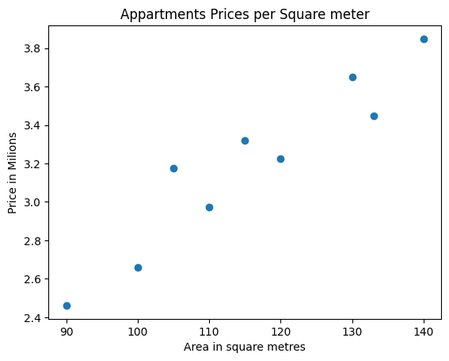
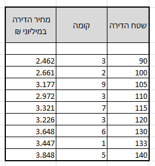
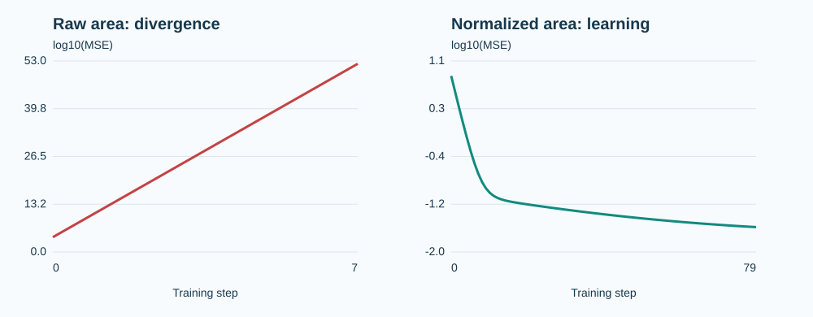
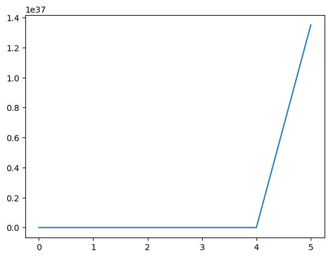
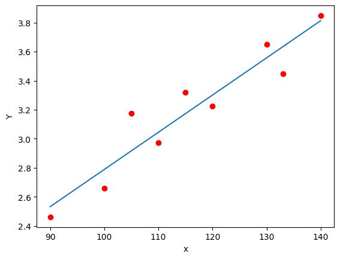

<!-- editorlm-hebrew-html-start -->
<style>
html, body, .vscode-body, .markdown-body, .markdown-preview, #write {
  direction: rtl !important; text-align: right !important;
}
ul, ol { padding-right: 2em !important; padding-left: 0 !important; }
blockquote { border-right: 3px solid #999; border-left: 0; padding-right: 1rem; padding-left: 0; }
@media print {
  html, body, .vscode-body, .markdown-body, .markdown-preview, #write {
    direction: rtl !important; text-align: right !important;
  }
}
</style>
<!-- editorlm-hebrew-html-end -->
<style>
.book { max-width: 900px; margin: auto; line-height: 1.8; font-family: Arial, sans-serif; }
.book .cover { min-height: 680px; box-sizing: border-box; padding: 64px 48px; margin: 24px 0 60px; background: #112b41; color: #f5f8fc; border-top: 9px solid #39c4b5; position: relative; }
.book .cover .eyebrow { color: #81e0d5; font-size: 15px; letter-spacing: 2px; }
.book .cover h1 { color: #fff; font-size: 48px; line-height: 1.3; border: 0; margin: 50px 0 18px; }
.book .cover .subtitle { font-size: 28px; color: #d8e6f0; }
.book .cover .author { font-size: 30px; color: #fff; margin-top: 52px; }
.book .cover .audience { color: #c1d3df; margin-top: 12px; }
.book .cover .motif { direction: ltr; text-align: left; font-family: Consolas, monospace; color: #81e0d5; font-size: 19px; margin-top: 54px; }
.book h1, .book h2, .book h3 { line-height: 1.4; font-weight: 700; }
.book > h1 { font-size: 32px !important; text-align: center !important; margin: 28px 0; }
.book h2 { font-size: 34px !important; text-align: center !important; color: #153b56 !important; background: #eef5fc; border: 0; border-bottom: 4px solid #299c91; border-radius: 10px 10px 0 0; padding: 28px 20px; margin: 24px 0 36px; }
.book h3 { font-size: 24px !important; text-align: right !important; color: #174e49 !important; background: #edf7f5; border: 0; border-right: 5px solid #299c91; border-radius: 6px; padding: 10px 16px; margin: 36px 0 18px; }
.book .chapter { height: 0; margin: 76px 0 0; border-top: 1px solid #ccd7df; break-before: page; page-break-before: always; break-after: avoid; page-break-after: avoid; }
.book .toc { padding: 24px; border-right: 5px solid #39a99d; background: rgba(70,150,155,.09); margin: 24px 0 48px; }
.book pre, .book pre code { direction: ltr !important; text-align: left !important; unicode-bidi: isolate; }
.book pre { box-sizing: border-box !important; width: 100% !important; max-width: 100% !important; margin: 0 !important; padding: 16px 20px; border: 1px solid #ccd7df; border-radius: 8px; line-height: 1.6; overflow-x: auto; }
.book code { direction: ltr; unicode-bidi: isolate; font-family: Consolas, "Courier New", monospace; }
.book pre { background: #f3f6fa !important; color: #1f2937 !important; }
.book pre code, .book pre code.hljs { background: transparent !important; color: #1f2937 !important; }
.book pre .hljs-keyword, .book pre .hljs-literal { color: #6f299c !important; }
.book pre .hljs-string { color: #216338 !important; }
.book pre .hljs-number { color: #075e68 !important; }
.book pre .hljs-comment { color: #526174 !important; }
.book pre .hljs-built_in, .book pre .hljs-title { color: #135b96 !important; }
.book table { width: 100%; }
.book th, .book td { text-align: right; }
.book .small { font-size: .9em; opacity: .8; }
.book .python-intro { display: flex; align-items: center; gap: 28px; padding: 22px 28px; margin: 24px 0; background: #eef5fc; color: #183e63; border-right: 6px solid #3776ab; border-radius: 10px; }
.book .python-intro strong { font-size: 30px; }
.book .python-fact { background: #fff7d6; color: #423611; border-right: 6px solid #ffd343; border-radius: 8px; padding: 18px 24px; margin: 22px 0; }
.book .python-fact strong { font-size: 24px; }
.book img { max-width: 100%; height: auto; }
.book figure { margin: 24px auto; text-align: center; }
.book figure img { display: block; margin: auto; }
.book figcaption { direction: rtl; text-align: center; font-size: .9em; color: #445566; }
@media print { .book > h2 { break-before: page; page-break-before: always; } }
.book .screen-strip { width: 760px; max-width: 100%; height: 220px; overflow: hidden; border: 1px solid #bccad5; border-radius: 8px; margin: 20px auto 8px; direction: ltr; }
.book .screen-strip.output { height: 265px; }
.book .screen-strip img { display: block; width: 1745px; max-width: none; }
.book .screen-menu { width: 400px; max-width: 100%; height: 295px; overflow: hidden; direction: ltr; margin: 20px auto 8px; border: 1px solid #bccad5; border-radius: 8px; }
.book .screen-menu img { display: block; width: 1745px; max-width: none; }
.book .code-panel { box-sizing: border-box !important; display: block !important; width: 50% !important; max-width: 50% !important; margin: 18px auto !important; }
@media print {
  .book .cover { min-height: 85vh; break-after: page; print-color-adjust: exact; -webkit-print-color-adjust: exact; }
  .book pre { white-space: pre-wrap; break-inside: avoid; }
  .book .chapter { margin: 0; border: 0; }
  .book h1, .book h2, .book h3 { break-after: avoid; page-break-after: avoid; break-inside: avoid; }
  .book h2 { margin-top: 0; }
  .book h2, .book h3 { print-color-adjust: exact; -webkit-print-color-adjust: exact; }
}
</style>

<style>
.book .book-nav { display: flex; flex-wrap: wrap; gap: 10px; justify-content: center; align-items: center; padding: 16px 0; margin: 20px 0 32px; border-top: 1px solid #ccd7df; border-bottom: 1px solid #ccd7df; }
.book .book-nav a { display: inline-block; padding: 10px 18px; border-radius: 8px; background: #eef5fc; color: #153b56 !important; border: 1px solid #b5ccd9; text-decoration: none !important; font-size: 16px; font-weight: bold; }
.book .book-nav a.toc-link { background: #174e49; color: #fff !important; border-color: #174e49; }
.book .book-nav a:hover, .book .book-nav a:focus { background: #d4eee8; color: #153b56 !important; outline: 2px solid #299c91; outline-offset: 2px; }
.book .section-list { line-height: 2; }
@media print { .book .book-nav { display: none; } }

/* Explicit Hebrew direction, including prose beginning with English. */
.book p, .book ul, .book ol, .book li,
.book blockquote, .book h1, .book h2, .book h3,
.book h4, .book th, .book td {
  direction: rtl !important;
  text-align: right !important;
  unicode-bidi: isolate;
}
/* Chapter titles keep their agreed centered layout. */
.book h2 { text-align: center !important; }
.book pre, .book pre code, .book .code-panel {
  direction: ltr !important;
  text-align: left !important;
  unicode-bidi: isolate;
}
</style>

<div class="book" dir="rtl" lang="he" style="direction: rtl !important; text-align: right !important;">

<nav class="book-nav" aria-label="ניווט בספר">
<a href="08-%D7%A8%D7%92%D7%A8%D7%A1%D7%99%D7%94%20%D7%A2%D7%9D%20%D7%94%D7%98%D7%99%D7%94%20%D7%95-nn.Linear.md">→ הקודם</a>
<a class="toc-link" href="../index.md">תוכן העניינים</a>
<a href="10-%D7%A8%D7%92%D7%A8%D7%A1%D7%99%D7%94%20%D7%91%D7%9E%D7%A1%D7%A4%D7%A8%20%D7%9E%D7%A9%D7%AA%D7%A0%D7%99%D7%9D.md">הבא ←</a>
</nav>

## ב.9 רגרסיה לינארית וחשיבות נרמול הנתונים


הצלחנו לאמן קו על מספרים קטנים. מה יקרה אם נשתמש באותו קצב למידה כשהקלט הוא שטח דירה של יותר ממאה מטרים רבועים? נבנה ניסוי שבו האימון מתבדר, נבין את הסיבה ונשנה רק את סולם הקלט. זהו הצעד החדש בפרק: להכין נתונים כך שעדכוני המשקלים יהיו מתאימים לחישוב.

**[השיעור וההרצאות באתר של גלעד מרקמן](https://webprogramming.azurewebsites.net/Pages/PyTorch/Linear_Reg.aspx)**

[פתיחת מחברת Colab 1](https://colab.research.google.com/drive/1SmZS-SFjSwCk86_DgC3PK2D-WIZtn9Tj?usp=sharing) · [פתיחת מחברת Colab 2](https://colab.research.google.com/drive/1kgpJD9tOxAmNvnp9pUbqutjKn9LOhHv4?usp=sharing) · [פתיחת מחברת Colab 3](https://colab.research.google.com/drive/1UNGKPm_713YpfIkGHIhlkRfDRFBUtMcb?usp=sharing)

**חומרי הליווי:** [5. רגרסיה לינארית](../../../sources/ML/5.%20%D7%A8%D7%92%D7%A8%D7%A1%D7%99%D7%94%20%D7%9C%D7%99%D7%A0%D7%90%D7%A8%D7%99%D7%AA.pptx) · [5.2. רגרסיה לינארית](../../../sources/ML/5.2.%20%D7%A8%D7%92%D7%A8%D7%A1%D7%99%D7%94%20%D7%9C%D7%99%D7%A0%D7%90%D7%A8%D7%99%D7%AA.pptx) · [5.3. רגרסיה לינארית ונרמול נתונים](../../../sources/ML/5.3.%20%D7%A8%D7%92%D7%A8%D7%A1%D7%99%D7%94%20%D7%9C%D7%99%D7%A0%D7%90%D7%A8%D7%99%D7%AA%20%D7%95%D7%A0%D7%A8%D7%9E%D7%95%D7%9C%20%D7%A0%D7%AA%D7%95%D7%A0%D7%99%D7%9D.pptx) · [5_Linear_Regresion](../../../sources/ML/converted/5_Linear_Regresion/notebook.md) · [5.2_Linear_Regresion](../../../sources/ML/converted/5.2_Linear_Regresion/notebook.md) · [5.3_Linear_Regresion-solved](../../../sources/ML/converted/5.3_Linear_Regresion-solved/notebook.md)

### הכנת סביבת הפרק

<div class="code-panel" dir="ltr">

```python
import torch
from torch import nn
import numpy as np
import matplotlib.pyplot as plt
from torch.utils.data import DataLoader, TensorDataset

device = torch.device(
    "cuda" if torch.cuda.is_available() else "cpu"
)
```

</div>


### נתונים בסדרי גודל שונים

בדוגמת הדירות הקלט הוא שטח במטרים רבועים, והיעד הוא מחיר במיליוני שקלים. ערכי קלט גדולים משפיעים על גודל הנגזרות; קצב למידה שהיה מתאים לנתונים קטנים עשוי להביא לצעדים גדולים מדי.

<div class="code-panel" dir="ltr">

```python
area = torch.tensor([
    90, 100, 105, 110, 115,
    120, 130, 133, 140
], dtype=torch.float32).reshape(-1, 1)
price = torch.tensor([
    2.462, 2.661, 3.177, 2.972, 3.321,
    3.226, 3.648, 3.447, 3.848
]).reshape(-1, 1)
```

</div>

<figure>

<!-- editorlm-source-ref: [sources/ML/converted/5.3_Linear_Regresion-solved/notebook.md#L65] -->
<figcaption>נתוני המחברת: מחיר הדירה מול שטחה. ציר המחיר הוא במיליוני שקלים, ולא מחיר למ״ר.</figcaption>
</figure>

<figure>

<figcaption>טבלת הדירות המקורית. בפרק הנרמול משתמשים בשטח ובמחיר; הקומה תתווסף בפרק הבא.</figcaption>
</figure>
<!-- editorlm-source-ref: [sources/ML/converted/5.3_Linear_Regresion/notebook.md#L31] -->

### הניסוי החשוב: אותו קוד, סולם מספרים אחר

במחברת נרמול הדירות מופיע פלט שמור של התבדרות. ההפסד מתחיל בכ־580, מזנק למיליארדים, מגיע ל־`inf` ולאחר מכן ל־`nan`. `inf` מציין חריגה לטווח אינסופי בייצוג המספרי; `nan` מציין תוצאה מספרית לא מוגדרת. אלה סימני כישלון של החישוב, ולא ״אימון שעוד צריך זמן״.

הפלט נשמר לצד מחברת שקוד הנרמול בה שונה בהמשך. לכן נבצע ניסוי השוואתי מפורש: אותו מודל התחלתי (w=1, b=0), אותם יעדים, אותו קצב ואותו מספר צעדים. רק הקלט משתנה בין שטח גולמי לשטח מנורמל. כך נוכל לייחס את ההבדל לשינוי הסולם.

<div class="code-panel" dir="ltr">

```python
def fit_scale_comparison(inputs, targets, steps=100):
    model = nn.Linear(1, 1)
    with torch.no_grad():
        model.weight.fill_(1.)
        model.bias.zero_()
    optimizer = torch.optim.SGD(model.parameters(), lr=0.1)
    history = []
    for step in range(steps):
        optimizer.zero_grad()
        loss = nn.functional.mse_loss(model(inputs), targets)
        history.append(loss.item())
        if not torch.isfinite(loss):
            break
        loss.backward()
        optimizer.step()
    return model, history

area_min = area.min(dim=0).values
area_span = area.max(dim=0).values - area_min
area_normalized = (area-area_min) / area_span
raw_model, raw_loss = fit_scale_comparison(area, price)
scaled_model, scaled_loss = fit_scale_comparison(
    area_normalized, price
)

import math
for history, label in [(raw_loss, "Raw area"),
                       (scaled_loss, "Normalized area")]:
    finite = [(i, v) for i, v in enumerate(history)
              if math.isfinite(v) and v > 0]
    plt.semilogy([i for i, v in finite],
                 [v for i, v in finite], label=label)
plt.xlabel("Step")
plt.ylabel("MSE, logarithmic scale")
plt.legend()
plt.show()
```

</div>

הקוד יוצר את גרף ההשוואה בעת ההרצה. הגרף הלוגריתמי מאפשר לראות יחד הפסדים בסדרי גודל שונים; הסינון מיועד לתצוגה בלבד ואינו מתקן מודל שהתבדר.

<figure>

<figcaption>חישוב של כלל עדכון הגרדיאנט עם w=1, b=0 וקצב 0.1. הציר האנכי מציג log10 של MSE; טווחי הצירים שונים כדי להראות את שתי ההתנהגויות.</figcaption>
</figure>

האיור חושב ישירות מנוסחת הנגזרת של MSE על תשע הדירות. הוא מדגים את האלגוריתם בחשבון מספרי, ולא פלט של הרצת PyTorch. בצד הגולמי מוצגים שמונת הצעדים הראשונים בלבד, ובצד המנורמל 80 צעדים. קוד PyTorch שלמעלה מתחיל באותם משקלים; הבדלי דיוק מספרי עשויים לשנות את הצעד שבו מופיעים inf או nan.

### מדוע גודל הקלט משפיע כל כך?

לפי w, הנגזרת של שגיאה ריבועית היא `2(wx+b−y)x`. אם x בסביבות 100, יש בה כפל נוסף במספר גדול. עבור דוגמה יחידה x=100, יעד 3, משקל התחלתי 1 והטיה 0, השגיאה 97 והנגזרת לפי w היא 19,400. קצב 0.1 יזיז את w מ־1 ל־‎−1,939 בצעד אחד. התחזית הבאה תהיה רחוקה הרבה יותר מהיעד.

נרמול מקטין את סולם הקלט ומשנה את הגאומטריה של בעיית האימון. הוא אינו משנה את העובדה שדירה גדולה מאחרת. אין כלל שאומר שכל נתון לא מנורמל חייב להתבדר: אפשר גם להקטין מאוד את קצב הלמידה. הניסוי מראה שקצב שמתאים לסולם אחד עלול להיות בלתי מתאים לסולם אחר.
<!-- editorlm-source-ref: [sources/ML/converted/5.3_Linear_Regresion-solved/notebook.md#L208-L244] -->

<figure>

<figcaption>עקומת ההפסד השמורה במחברת הנרמול מתעדת את הריצה שהתבדרה. היא אינה גרף הצלחה לאחר הנרמול.</figcaption>
</figure>
<!-- editorlm-source-ref: [sources/ML/converted/5.3_Linear_Regresion-solved/notebook.md#L345-L345] -->

### נרמול Min–Max

נחסר מכל שטח את השטח המינימלי ונחלק בטווח. כך השטחים בנתוני האימון יהיו בתחום שבין 0 ל־1.

<div class="code-panel" dir="ltr">

```python
minimum = area.min(dim=0).values
maximum = area.max(dim=0).values
scale = maximum - minimum
x = (area - minimum) / scale
y = price

model = nn.Linear(1, 1)
optimizer = torch.optim.SGD(
    model.parameters(), lr=0.1
)
loss_function = nn.MSELoss()
losses = []
for epoch in range(1000):
    optimizer.zero_grad()
    loss = loss_function(model(x), y)
    loss.backward()
    optimizer.step()
    losses.append(loss.item())
```

</div>

<figure>

<!-- editorlm-source-ref: [sources/ML/converted/5.3_Linear_Regresion-solved/notebook.md#L388] -->
<figcaption>קו ההתאמה השמור בדוגמת הדירות. בפלט המקורי הצירים מסומנים X ו־Y: שטח ומחיר.</figcaption>
</figure>

נרמול אינו מבטיח אימון תקין בכל קצב למידה, ואינו מבטל את הצורך לבדוק את ההפסד. אם עמודה קבועה, הטווח שלה אפס ויש לטפל בה לפני החלוקה.

### תחזית לנתון חדש

**מנרמלים גם קלט חדש בעזרת אותם מינימום ומקסימום של האימון.** המודל למד לקבל שטח מנורמל, ולכן אין להעביר אליו ישירות 110.

<div class="code-panel" dir="ltr">

```python
new_area = torch.tensor([[110.]])
new_x = (new_area - minimum) / scale
with torch.no_grad():
    predicted_price = model(new_x)
print(predicted_price.item())
```

</div>

המחיר נשאר במיליוני שקלים, משום שבדוגמה זו נרמלנו את הקלט בלבד.

### תקנון לפי ממוצע וסטיית תקן

אפשרות נוספת היא **Z-score**: חיסור הממוצע וחלוקה בסטיית התקן. התוצאה אינה מוגבלת ל־0 עד 1.

<div class="code-panel" dir="ltr">

```python
mean = area.mean(dim=0)
std = area.std(dim=0)
standardized = (area - mean) / std
```

</div>

בוחרים שיטת הכנה אחת ושומרים את הפרמטרים שלה גם לתחזיות בהמשך. את המינימום, המקסימום, הממוצע וסטיית התקן מחשבים מנתוני האימון בלבד.

<!-- editorlm-source-ref: [sources/ML/5. רגרסיה לינארית.pptx#L1-L89] -->
<!-- editorlm-source-ref: [sources/ML/5.2. רגרסיה לינארית.pptx#L1-L57] -->
<!-- editorlm-source-ref: [sources/ML/5.3. רגרסיה לינארית ונרמול נתונים.pptx#L1-L93] -->
<!-- editorlm-source-ref: [sources/ML/converted/5_Linear_Regresion/notebook.md#L1-L659] -->
<!-- editorlm-source-ref: [sources/ML/converted/5.2_Linear_Regresion/notebook.md#L1-L593] -->
<!-- editorlm-source-ref: [sources/ML/converted/5.3_Linear_Regresion-solved/notebook.md#L1-L416] -->

### ליישם נרמול בלי לשנות את משמעות התחזית

בטווח השטחים שבדוגמה, המינימום 90 והמקסימום 140. לכן 90 הופך ל־0, ‏140 ל־1 ו־110 ל־0.4. שטח 150 יקבל 1.2; אין זו שגיאה בנוסחה, אלא נקודה מחוץ לטווח שנצפה באימון. אין לחתוך אותה אוטומטית ל־1, משום שבכך מאבדים מידע.

אם שטח כל הדירות זהה, הטווח אפס ואי אפשר לחלק בו. אפשר לזהות עמודה קבועה, להסיר אותה או להשתמש במחלק 1 כדי למפותה לאפס. ההחלטה על הטיפול צריכה להישאר זהה בזמן חיזוי.

ב־Z-score, ערך 0 פירושו ״שווה לממוצע האימון״ וערך 2 פירושו ״גבוה ממנו בשתי סטיות תקן״. ב־Min–Max, ערך 0 פירושו ״שווה למינימום האימון״. אלה פירושים שונים; בחירת שיטה אחת אינה סיבה להפעיל את האחרת שוב על נתון חדש.

אם גם היעד מנורמל, צריך לבצע לו המרה הפוכה לאחר החיזוי. בדוגמת הדירות בפרק זה המחיר נשאר ביחידותיו, ולכן אין להפעיל עליו המרה הפוכה שלא הייתה באימון. כאשר מודל כבר מכיל משקלים של `nan`, נרמול הקלט בהמשך לא ירפא אותו: מאתחלים מודל ואופטימייזר חדשים ומתחילים ניסוי נקי.
<!-- editorlm-source-ref: [sources/ML/converted/5.3_Linear_Regresion/notebook.md#L20-L44] -->


<!-- editorlm-source-ref: [sources/ML/converted/5_Linear_Regresion/notebook.md#L227] -->
<!-- editorlm-source-ref: [sources/ML/converted/5_Linear_Regresion/notebook.md#L642] -->
<!-- editorlm-source-ref: [sources/ML/converted/5.2_Linear_Regresion/notebook.md#L82] -->
<!-- editorlm-source-ref: [sources/ML/converted/5.2_Linear_Regresion/notebook.md#L344] -->
<!-- editorlm-source-ref: [sources/ML/converted/5.2_Linear_Regresion/notebook.md#L550] -->


<nav class="book-nav" aria-label="ניווט בספר">
<a href="08-%D7%A8%D7%92%D7%A8%D7%A1%D7%99%D7%94%20%D7%A2%D7%9D%20%D7%94%D7%98%D7%99%D7%94%20%D7%95-nn.Linear.md">→ הקודם</a>
<a class="toc-link" href="../index.md">תוכן העניינים</a>
<a href="10-%D7%A8%D7%92%D7%A8%D7%A1%D7%99%D7%94%20%D7%91%D7%9E%D7%A1%D7%A4%D7%A8%20%D7%9E%D7%A9%D7%AA%D7%A0%D7%99%D7%9D.md">הבא ←</a>
</nav>

</div>

<!-- editorlm-source-versions: {"schemaVersion": 1, "sources": {"sources/ML/5. רגרסיה לינארית.pptx": {"sourceSha256": "0847767c1511ef53cc603758c98686ba5525cdb4711a69a227cc212890237ac7", "canonicalTextSha256": "444c083d5c44acc1396f2d9f0effdccd9056e73372db64138ce50971d9a8abe5"}, "sources/ML/5.2. רגרסיה לינארית.pptx": {"sourceSha256": "3c5f4974d755f74eb075d7ad320515c05e7492668533755cbf31091eb167ff9a", "canonicalTextSha256": "19029213d3382c9259970defcf94d29adbd037561914e28037ad4060154abbe7"}, "sources/ML/5.3. רגרסיה לינארית ונרמול נתונים.pptx": {"sourceSha256": "d1c9b2a713940952df6b00aa378ed33f57e5efbe5fa5673a04e790809be88502", "canonicalTextSha256": "26cb6ad902eef0885a330fea22fc1821030fb87f87b9528978fa3259439abe0e"}, "sources/ML/converted/5_Linear_Regresion/notebook.md": {"sourceSha256": "cbb2256b907203695559af190d5e84ceba2124d6324a38efa0b3e753ca817987", "canonicalTextSha256": "cbb2256b907203695559af190d5e84ceba2124d6324a38efa0b3e753ca817987"}, "sources/ML/converted/5.2_Linear_Regresion/notebook.md": {"sourceSha256": "7d69a903b6a51f1744f4f8c4c4b0087eb7c73d03d46096e8d1e43c5a4301a795", "canonicalTextSha256": "7d69a903b6a51f1744f4f8c4c4b0087eb7c73d03d46096e8d1e43c5a4301a795"}, "sources/ML/converted/5.3_Linear_Regresion-solved/notebook.md": {"sourceSha256": "1e5073bf22d1fe3fa3ed0415549429518f315a9294f8cba1be02bcf9203753ad", "canonicalTextSha256": "1e5073bf22d1fe3fa3ed0415549429518f315a9294f8cba1be02bcf9203753ad"}, "sources/ML/converted/5.3_Linear_Regresion/notebook.md": {"sourceSha256": "b46617f8090bfe52492d9f1ea4cf7a216a79cae2c2fe3b39cc2da904f304b56b", "canonicalTextSha256": "b46617f8090bfe52492d9f1ea4cf7a216a79cae2c2fe3b39cc2da904f304b56b"}}} -->
