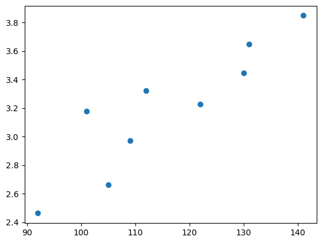
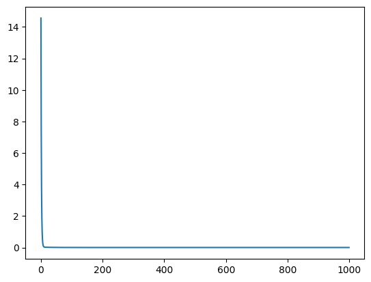
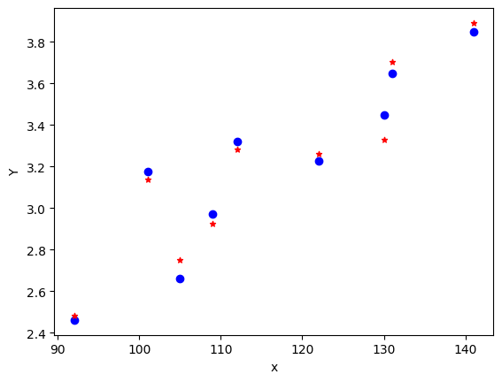

<!-- editorlm-hebrew-html-start -->
<style>
html, body, .vscode-body, .markdown-body, .markdown-preview, #write {
  direction: rtl !important; text-align: right !important;
}
ul, ol { padding-right: 2em !important; padding-left: 0 !important; }
blockquote { border-right: 3px solid #999; border-left: 0; padding-right: 1rem; padding-left: 0; }
@media print {
  html, body, .vscode-body, .markdown-body, .markdown-preview, #write {
    direction: rtl !important; text-align: right !important;
  }
}
</style>
<!-- editorlm-hebrew-html-end -->
<style>
.book { max-width: 900px; margin: auto; line-height: 1.8; font-family: Arial, sans-serif; }
.book .cover { min-height: 680px; box-sizing: border-box; padding: 64px 48px; margin: 24px 0 60px; background: #112b41; color: #f5f8fc; border-top: 9px solid #39c4b5; position: relative; }
.book .cover .eyebrow { color: #81e0d5; font-size: 15px; letter-spacing: 2px; }
.book .cover h1 { color: #fff; font-size: 48px; line-height: 1.3; border: 0; margin: 50px 0 18px; }
.book .cover .subtitle { font-size: 28px; color: #d8e6f0; }
.book .cover .author { font-size: 30px; color: #fff; margin-top: 52px; }
.book .cover .audience { color: #c1d3df; margin-top: 12px; }
.book .cover .motif { direction: ltr; text-align: left; font-family: Consolas, monospace; color: #81e0d5; font-size: 19px; margin-top: 54px; }
.book h1, .book h2, .book h3 { line-height: 1.4; font-weight: 700; }
.book > h1 { font-size: 32px !important; text-align: center !important; margin: 28px 0; }
.book h2 { font-size: 34px !important; text-align: center !important; color: #153b56 !important; background: #eef5fc; border: 0; border-bottom: 4px solid #299c91; border-radius: 10px 10px 0 0; padding: 28px 20px; margin: 24px 0 36px; }
.book h3 { font-size: 24px !important; text-align: right !important; color: #174e49 !important; background: #edf7f5; border: 0; border-right: 5px solid #299c91; border-radius: 6px; padding: 10px 16px; margin: 36px 0 18px; }
.book .chapter { height: 0; margin: 76px 0 0; border-top: 1px solid #ccd7df; break-before: page; page-break-before: always; break-after: avoid; page-break-after: avoid; }
.book .toc { padding: 24px; border-right: 5px solid #39a99d; background: rgba(70,150,155,.09); margin: 24px 0 48px; }
.book pre, .book pre code { direction: ltr !important; text-align: left !important; unicode-bidi: isolate; }
.book pre { box-sizing: border-box !important; width: 100% !important; max-width: 100% !important; margin: 0 !important; padding: 16px 20px; border: 1px solid #ccd7df; border-radius: 8px; line-height: 1.6; overflow-x: auto; }
.book code { direction: ltr; unicode-bidi: isolate; font-family: Consolas, "Courier New", monospace; }
.book pre { background: #f3f6fa !important; color: #1f2937 !important; }
.book pre code, .book pre code.hljs { background: transparent !important; color: #1f2937 !important; }
.book pre .hljs-keyword, .book pre .hljs-literal { color: #6f299c !important; }
.book pre .hljs-string { color: #216338 !important; }
.book pre .hljs-number { color: #075e68 !important; }
.book pre .hljs-comment { color: #526174 !important; }
.book pre .hljs-built_in, .book pre .hljs-title { color: #135b96 !important; }
.book table { width: 100%; }
.book th, .book td { text-align: right; }
.book .small { font-size: .9em; opacity: .8; }
.book .python-intro { display: flex; align-items: center; gap: 28px; padding: 22px 28px; margin: 24px 0; background: #eef5fc; color: #183e63; border-right: 6px solid #3776ab; border-radius: 10px; }
.book .python-intro strong { font-size: 30px; }
.book .python-fact { background: #fff7d6; color: #423611; border-right: 6px solid #ffd343; border-radius: 8px; padding: 18px 24px; margin: 22px 0; }
.book .python-fact strong { font-size: 24px; }
.book img { max-width: 100%; height: auto; }
.book figure { margin: 24px auto; text-align: center; }
.book figure img { display: block; margin: auto; }
.book figcaption { direction: rtl; text-align: center; font-size: .9em; color: #445566; }
@media print { .book > h2 { break-before: page; page-break-before: always; } }
.book .screen-strip { width: 760px; max-width: 100%; height: 220px; overflow: hidden; border: 1px solid #bccad5; border-radius: 8px; margin: 20px auto 8px; direction: ltr; }
.book .screen-strip.output { height: 265px; }
.book .screen-strip img { display: block; width: 1745px; max-width: none; }
.book .screen-menu { width: 400px; max-width: 100%; height: 295px; overflow: hidden; direction: ltr; margin: 20px auto 8px; border: 1px solid #bccad5; border-radius: 8px; }
.book .screen-menu img { display: block; width: 1745px; max-width: none; }
.book .code-panel { box-sizing: border-box !important; display: block !important; width: 50% !important; max-width: 50% !important; margin: 18px auto !important; }
@media print {
  .book .cover { min-height: 85vh; break-after: page; print-color-adjust: exact; -webkit-print-color-adjust: exact; }
  .book pre { white-space: pre-wrap; break-inside: avoid; }
  .book .chapter { margin: 0; border: 0; }
  .book h1, .book h2, .book h3 { break-after: avoid; page-break-after: avoid; break-inside: avoid; }
  .book h2 { margin-top: 0; }
  .book h2, .book h3 { print-color-adjust: exact; -webkit-print-color-adjust: exact; }
}
</style>

<style>
.book .book-nav { display: flex; flex-wrap: wrap; gap: 10px; justify-content: center; align-items: center; padding: 16px 0; margin: 20px 0 32px; border-top: 1px solid #ccd7df; border-bottom: 1px solid #ccd7df; }
.book .book-nav a { display: inline-block; padding: 10px 18px; border-radius: 8px; background: #eef5fc; color: #153b56 !important; border: 1px solid #b5ccd9; text-decoration: none !important; font-size: 16px; font-weight: bold; }
.book .book-nav a.toc-link { background: #174e49; color: #fff !important; border-color: #174e49; }
.book .book-nav a:hover, .book .book-nav a:focus { background: #d4eee8; color: #153b56 !important; outline: 2px solid #299c91; outline-offset: 2px; }
.book .section-list { line-height: 2; }
@media print { .book .book-nav { display: none; } }

/* Explicit Hebrew direction, including prose beginning with English. */
.book p, .book ul, .book ol, .book li,
.book blockquote, .book h1, .book h2, .book h3,
.book h4, .book th, .book td {
  direction: rtl !important;
  text-align: right !important;
  unicode-bidi: isolate;
}
/* Chapter titles keep their agreed centered layout. */
.book h2 { text-align: center !important; }
.book pre, .book pre code, .book .code-panel {
  direction: ltr !important;
  text-align: left !important;
  unicode-bidi: isolate;
}
</style>

<div class="book" dir="rtl" lang="he" style="direction: rtl !important; text-align: right !important;">

<nav class="book-nav" aria-label="ניווט בספר">
<a href="09-%D7%A0%D7%A8%D7%9E%D7%95%D7%9C%20%D7%A0%D7%AA%D7%95%D7%A0%D7%99%D7%9D.md">→ הקודם</a>
<a class="toc-link" href="../index.md">תוכן העניינים</a>
<a href="11-%D7%92%D7%9C%D7%98%D7%95%D7%9F%20-%20%D7%A8%D7%92%D7%A8%D7%A1%D7%99%D7%94%20%D7%9E%D7%98%D7%91%D7%9C%D7%94.md">הבא ←</a>
</nav>

## ב.10 רגרסיה לינארית במספר משתנים

נמשיך בדוגמת מחירי הדירות, והפעם נתחשב גם בשטח הדירה וגם בקומה. נחפש פונקציה בשני משתנים:

<div dir="ltr" style="text-align:center;">

price(area, floor) = W₁ × area + W₂ × floor + W₃

</div>

המשקלים W₁ ו־W₂ שייכים לשטח ולקומה, ו־W₃ הוא ההטיה (bias).

<!-- editorlm-source-ref: [sources/ML/pdf/6.1. רגרסיה לינארית במספר משתנים.pdf#L8-L24] -->

**[השיעור וההרצאות באתר של גלעד מרקמן](https://webprogramming.azurewebsites.net/Pages/PyTorch/Linear_Reg_2D.aspx)**

[פתיחת מחברת Colab](https://colab.research.google.com/drive/1Cr1kRWHKlROeHoF2-eXrkSDWHwbq1hMA?usp=sharing)

**חומרי הליווי:** [6.1. רגרסיה לינארית במספר משתנים](../../../sources/ML/6.1.%20%D7%A8%D7%92%D7%A8%D7%A1%D7%99%D7%94%20%D7%9C%D7%99%D7%A0%D7%90%D7%A8%D7%99%D7%AA%20%D7%91%D7%9E%D7%A1%D7%A4%D7%A8%20%D7%9E%D7%A9%D7%AA%D7%A0%D7%99%D7%9D.pptx) · [מחברת התרגול](../../../sources/ML/Colab/6.1_Linear_Regresion_2D.ipynb)

### מספר משתנים ונגזרות חלקיות

אלגוריתם האימון נשאר כפי שהכרנו. מחשבים נגזרת חלקית של ההפסד ביחס לכל פרמטר, ומעדכנים אותו בהתאם: כאן יש שני משקלים והטיה, כלומר שלושה פרמטרים נלמדים.

<!-- editorlm-source-ref: [sources/ML/pdf/6.1. רגרסיה לינארית במספר משתנים.pdf#L27-L33] -->

### הכנת הנתונים

נייבא את הספריות:

<div class="code-panel" dir="ltr">

```python
import torch
import numpy as np
import matplotlib.pyplot as plt
import torch.nn as nn
```

</div>

נגדיר מערך לשטח, מערך לקומה ומערך למחיר במיליוני שקלים, ונציג את המחירים מול השטח:

<div class="code-panel" dir="ltr">

```python
X_np = np.array([92,105,101,109,112,122,131,130,141])
F_np = np.array([3,2,9,3,7,3,6,1,5])
P_np = np.array([2.462,2.661,3.177,2.972,3.321,3.226,3.648,3.447,3.848])
# P_np = np.around((X_np * 25.5 + F_np * 55.5)/1000, decimals=3)
plt.scatter(X_np, P_np)
print(P_np)
```

</div>

**פלט**

<div class="code-panel" dir="ltr">

```text
[2.462 2.661 3.177 2.972 3.321 3.226 3.648 3.447 3.848]
```

</div>


<figure>

<figcaption>מחירי הדירות מול שטחן.</figcaption>
</figure>

<!-- editorlm-source-ref: [sources/ML/converted/6.1_Linear_Regresion_2D/notebook.md#L62-L62] -->


<!-- editorlm-source-ref: [sources/ML/converted/6.1_Linear_Regresion_2D/notebook.md#L11-L62] -->

### הכנת הטנסורים

נמיר את המערכים לטנסורים ונשרשר את השטח ואת הקומה בעמודות. כל שורה ב־X מייצגת דירה: תחילה השטח ואחריו הקומה; ב־Y מופיע המחיר.

<div class="code-panel" dir="ltr">

```python
X1 = torch.from_numpy(X_np.astype(np.float32))  # area
X2 = torch.from_numpy(F_np.astype(np.float32))  # floor
Y = torch.from_numpy(P_np.astype(np.float32))   # price
Y = Y.reshape(-1,1)
X1 = X1.reshape(-1,1)
X2 = X2.reshape(-1,1)
X = torch.cat((X1,X2),dim=1)

print(X)
print(Y)
```

</div>

**פלט**

<div class="code-panel" dir="ltr">

```text
tensor([[ 92.,   3.],
        [105.,   2.],
        [101.,   9.],
        [109.,   3.],
        [112.,   7.],
        [122.,   3.],
        [131.,   6.],
        [130.,   1.],
        [141.,   5.]])
tensor([[2.4620],
        [2.6610],
        [3.1770],
        [2.9720],
        [3.3210],
        [3.2260],
        [3.6480],
        [3.4470],
        [3.8480]])
```

</div>


<!-- editorlm-source-ref: [sources/ML/converted/6.1_Linear_Regresion_2D/notebook.md#L64-L107] -->

### נרמול הנתונים

תחילה נמצא את הערך הקטן ביותר בכל הטנסור:

<div class="code-panel" dir="ltr">

```python
print(X.min())
```

</div>

**פלט**

<div class="code-panel" dir="ltr">

```text
tensor(1.)
```

</div>

לנרמול נצטרך מינימום ומקסימום לכל עמודה בנפרד. הפעולות עם `dim=0` מחזירות גם את הערכים וגם את אינדקסי השורות שבהן נמצאו:

<div class="code-panel" dir="ltr">

```python
min, minIndex = X.min(dim=0)
max, maxIndex = X.max(dim=0)
print (min, minIndex)
print (max, maxIndex)
```

</div>

**פלט**

<div class="code-panel" dir="ltr">

```text
tensor([92.,  1.]) tensor([0, 7])
tensor([141.,   9.]) tensor([8, 2])
```

</div>


<!-- editorlm-source-ref: [sources/ML/converted/6.1_Linear_Regresion_2D/notebook.md#L109-L141] -->

נגדיר נרמול Min–Max ואת הפעולה ההפוכה, המחזירה את הנתונים לסולם המקורי. נגדיר גם נרמול Z; בדוגמה נפעיל את Min–Max.

<div class="code-panel" dir="ltr">

```python
def Normalize_minMax(X):
    return (X - min) / (max - min)

def UnNormalize_minMax(X):
    return X * (max-min) + min

def Normalize_z(X):
    return (X - X.mean(dim=0)) / X.std(dim=0)
```

</div>

ננרמל את X, נדפיס אותו ונבדוק את החזרה לערכים המקוריים:

<div class="code-panel" dir="ltr">

```python
X = Normalize_minMax(X)
print(min, max)
print (X)
print (UnNormalize_minMax(X))
```

</div>

**פלט**

<div class="code-panel" dir="ltr">

```text
tensor([92.,  1.]) tensor([141.,   9.])
tensor([[0.0000, 0.2500],
        [0.2653, 0.1250],
        [0.1837, 1.0000],
        [0.3469, 0.2500],
        [0.4082, 0.7500],
        [0.6122, 0.2500],
        [0.7959, 0.6250],
        [0.7755, 0.0000],
        [1.0000, 0.5000]])
tensor([[ 92.,   3.],
        [105.,   2.],
        [101.,   9.],
        [109.,   3.],
        [112.,   7.],
        [122.,   3.],
        [131.,   6.],
        [130.,   1.],
        [141.,   5.]])
```

</div>


<!-- editorlm-source-ref: [sources/ML/converted/6.1_Linear_Regresion_2D/notebook.md#L143-L190] -->

### הגדרת המודל, ההפסד והאופטימייזר

נגדיר `nn.Linear(2, 1, bias=True)`: שני קלטים, פלט אחד והטיה. נשתמש ב־MSE וב־SGD, בקצב למידה 0.1 וב־1,000 צעדי אימון.

<div class="code-panel" dir="ltr">

```python
learning_rate = 0.1
epochs = 1000
losses = []

# design model
Model = nn.Linear(2, 1, bias=True)  #in_features = 2; out_features=1

#construct loss and optimizer
Loss = nn.MSELoss()

# init optimizer
optim = torch.optim.SGD(Model.parameters(), lr=learning_rate)
# optim = torch.optim.Adam(Model.parameters(), lr=learning_rate)
```

</div>


<!-- editorlm-source-ref: [sources/ML/converted/6.1_Linear_Regresion_2D/notebook.md#L192-L212] -->

### לולאת האימון

בכל צעד נחשב תחזיות, הפסד ונגזרות, נעדכן את הפרמטרים ונאפס את הנגזרות לקראת הצעד הבא.

<div class="code-panel" dir="ltr">

```python
for epoch in range(epochs):
    # forward
    Y_predict = Model(X)

    # backward
    loss = Loss(Y_predict, Y)
    loss.backward()

    # update wights
    optim.step()

    if epoch % 20 == 0:
        print(f"epoch= {epoch} loss={loss.item():.9f} ")
        # print (Y_predict)

    losses.append(loss.item())

    # zero grads
    optim.zero_grad()
```

</div>

שורות ראשונות ואחרונה מתוך פלט האימון השמור; האתחול האקראי עשוי לשנות את הפלט בהרצה חדשה.

**פלט**

<div class="code-panel" dir="ltr">

```text
epoch= 0 loss=14.559171677
epoch= 20 loss=0.018344976
epoch= 40 loss=0.011297960
...
epoch= 980 loss=0.003825781
```

</div>


<!-- editorlm-source-ref: [sources/ML/converted/6.1_Linear_Regresion_2D/notebook.md#L214-L297] -->

נציג את ההפסד לאורך האימון:

<div class="code-panel" dir="ltr">

```python
plt.plot(losses)
```

</div>


<figure>

<figcaption>ירידת ההפסד במהלך האימון.</figcaption>
</figure>

<!-- editorlm-source-ref: [sources/ML/converted/6.1_Linear_Regresion_2D/notebook.md#L320-L320] -->


<!-- editorlm-source-ref: [sources/ML/converted/6.1_Linear_Regresion_2D/notebook.md#L299-L320] -->

### הצגת התוצאה

נציג את המחירים בכחול ואת התחזיות בכוכביות אדומות. החיזוי משתמש גם בקומה, אף שהציר האופקי בגרף מציג רק את השטח.

<div class="code-panel" dir="ltr">

```python
print(f"END: loss={loss.item():.4f}")
plt.scatter(X_np, P_np, color='b')
plt.xlabel("x")
plt.ylabel("Y")

with torch.no_grad():
    predicted = Model(X).detach().numpy()
    plt.scatter (X_np, predicted, marker='*', s=20, color='r')


#   apartment = torch.tensor([[110, 4], [112,9]], dtype=torch.float32)
#   apartment_size = apartment[:,0]
#   apartment_price = Model(Normalize_minMax(apartment))
#   print(Normalize_minMax(apartment))
#   print (apartment, '\n',apartment_price)
#   plt.scatter(apartment_size,apartment_price, color='g' )
plt.show()
# P_np = np.around((X_np * 25.5 + F_np * 55.5)/1000, decimals=3)
```

</div>

דוגמת פלט שמור:

**פלט**

<div class="code-panel" dir="ltr">

```text
END: loss=0.0038
```

</div>


<figure>

<figcaption>מחירי הדירות והתחזיות לאחר האימון.</figcaption>
</figure>

<!-- editorlm-source-ref: [sources/ML/converted/6.1_Linear_Regresion_2D/notebook.md#L363-L363] -->


<!-- editorlm-source-ref: [sources/ML/converted/6.1_Linear_Regresion_2D/notebook.md#L322-L363] -->

### הצגת המשקלים

נציג את שני המשקלים ואת ההטיה שנלמדו:

<div class="code-panel" dir="ltr">

```python
for name, param in Model.named_parameters():
    print(name, param)
```

</div>

דוגמת פלט שמור:

**פלט**

<div class="code-panel" dir="ltr">

```text
weight Parameter containing:
tensor([[1.2669, 0.5587]], requires_grad=True)
bias Parameter containing:
tensor([2.3454], requires_grad=True)
```

</div>


<!-- editorlm-source-ref: [sources/ML/converted/6.1_Linear_Regresion_2D/notebook.md#L365-L385] -->


<nav class="book-nav" aria-label="ניווט בספר">
<a href="09-%D7%A0%D7%A8%D7%9E%D7%95%D7%9C%20%D7%A0%D7%AA%D7%95%D7%A0%D7%99%D7%9D.md">→ הקודם</a>
<a class="toc-link" href="../index.md">תוכן העניינים</a>
<a href="11-%D7%92%D7%9C%D7%98%D7%95%D7%9F%20-%20%D7%A8%D7%92%D7%A8%D7%A1%D7%99%D7%94%20%D7%9E%D7%98%D7%91%D7%9C%D7%94.md">הבא ←</a>
</nav>

</div>

<!-- editorlm-source-versions: {"schemaVersion":1,"sources":{"sources/ML/converted/6.1_Linear_Regresion_2D/notebook.md":{"sourceSha256":"98ba5a2d7bd0c10aa4c1da165b598b1ef793cfb72d8413af17711cfa93b5d26a","canonicalTextSha256":"98ba5a2d7bd0c10aa4c1da165b598b1ef793cfb72d8413af17711cfa93b5d26a"},"sources/ML/pdf/6.1. רגרסיה לינארית במספר משתנים.pdf":{"sourceSha256":"73b3830d488075b50edeff49e46e2e6e2888b001cc53be6f354b3ea48b07bb96","canonicalTextSha256":"92fb79170e5b4e7185f077822a1895e51cd9931cf4a615a529bf50a71ac8b71d"}}} -->
