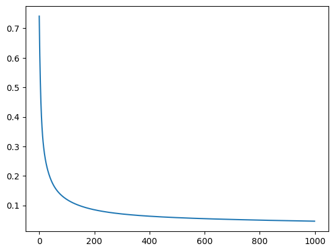
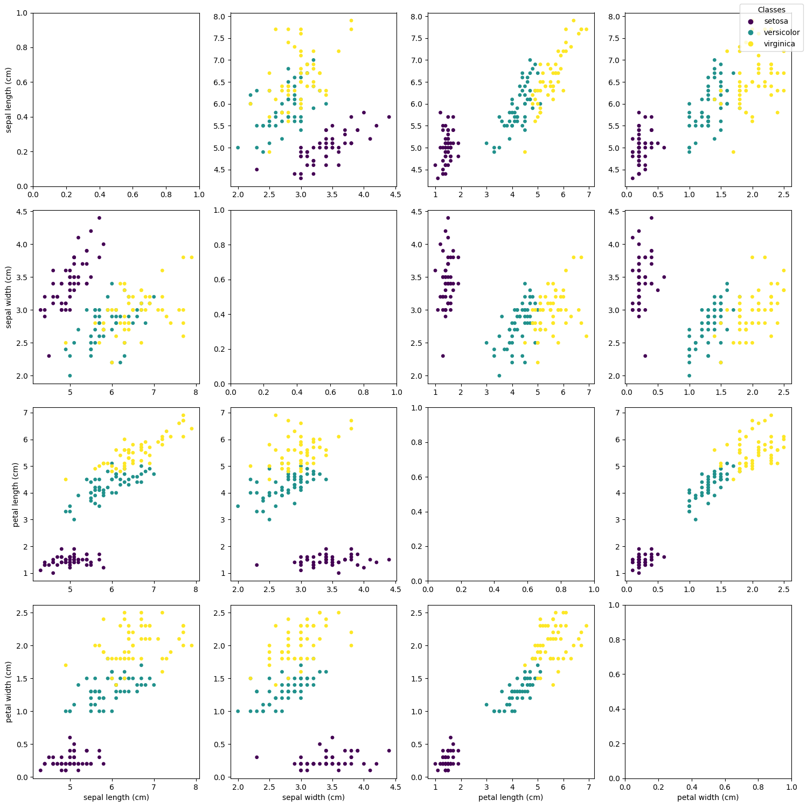
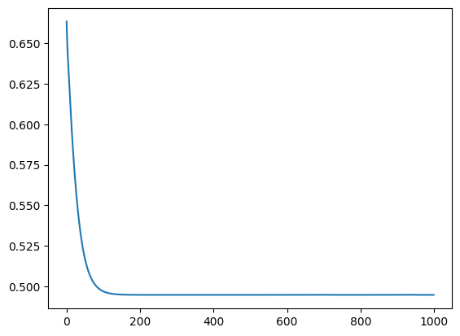

<!-- editorlm-hebrew-html-start -->
<style>
html, body, .vscode-body, .markdown-body, .markdown-preview, #write {
  direction: rtl !important; text-align: right !important;
}
ul, ol { padding-right: 2em !important; padding-left: 0 !important; }
blockquote { border-right: 3px solid #999; border-left: 0; padding-right: 1rem; padding-left: 0; }
@media print {
  html, body, .vscode-body, .markdown-body, .markdown-preview, #write {
    direction: rtl !important; text-align: right !important;
  }
}
</style>
<!-- editorlm-hebrew-html-end -->
<style>
.book { max-width: 900px; margin: auto; line-height: 1.8; font-family: Arial, sans-serif; }
.book .cover { min-height: 680px; box-sizing: border-box; padding: 64px 48px; margin: 24px 0 60px; background: #112b41; color: #f5f8fc; border-top: 9px solid #39c4b5; position: relative; }
.book .cover .eyebrow { color: #81e0d5; font-size: 15px; letter-spacing: 2px; }
.book .cover h1 { color: #fff; font-size: 48px; line-height: 1.3; border: 0; margin: 50px 0 18px; }
.book .cover .subtitle { font-size: 28px; color: #d8e6f0; }
.book .cover .author { font-size: 30px; color: #fff; margin-top: 52px; }
.book .cover .audience { color: #c1d3df; margin-top: 12px; }
.book .cover .motif { direction: ltr; text-align: left; font-family: Consolas, monospace; color: #81e0d5; font-size: 19px; margin-top: 54px; }
.book h1, .book h2, .book h3 { line-height: 1.4; font-weight: 700; }
.book > h1 { font-size: 32px !important; text-align: center !important; margin: 28px 0; }
.book h2 { font-size: 34px !important; text-align: center !important; color: #153b56 !important; background: #eef5fc; border: 0; border-bottom: 4px solid #299c91; border-radius: 10px 10px 0 0; padding: 28px 20px; margin: 24px 0 36px; }
.book h3 { font-size: 24px !important; text-align: right !important; color: #174e49 !important; background: #edf7f5; border: 0; border-right: 5px solid #299c91; border-radius: 6px; padding: 10px 16px; margin: 36px 0 18px; }
.book .chapter { height: 0; margin: 76px 0 0; border-top: 1px solid #ccd7df; break-before: page; page-break-before: always; break-after: avoid; page-break-after: avoid; }
.book .toc { padding: 24px; border-right: 5px solid #39a99d; background: rgba(70,150,155,.09); margin: 24px 0 48px; }
.book pre, .book pre code { direction: ltr !important; text-align: left !important; unicode-bidi: isolate; }
.book pre { box-sizing: border-box !important; width: 100% !important; max-width: 100% !important; margin: 0 !important; padding: 16px 20px; border: 1px solid #ccd7df; border-radius: 8px; line-height: 1.6; overflow-x: auto; }
.book code { direction: ltr; unicode-bidi: isolate; font-family: Consolas, "Courier New", monospace; }
.book pre { background: #f3f6fa !important; color: #1f2937 !important; }
.book pre code, .book pre code.hljs { background: transparent !important; color: #1f2937 !important; }
.book pre .hljs-keyword, .book pre .hljs-literal { color: #6f299c !important; }
.book pre .hljs-string { color: #216338 !important; }
.book pre .hljs-number { color: #075e68 !important; }
.book pre .hljs-comment { color: #526174 !important; }
.book pre .hljs-built_in, .book pre .hljs-title { color: #135b96 !important; }
.book table { width: 100%; }
.book th, .book td { text-align: right; }
.book .small { font-size: .9em; opacity: .8; }
.book .python-intro { display: flex; align-items: center; gap: 28px; padding: 22px 28px; margin: 24px 0; background: #eef5fc; color: #183e63; border-right: 6px solid #3776ab; border-radius: 10px; }
.book .python-intro strong { font-size: 30px; }
.book .python-fact { background: #fff7d6; color: #423611; border-right: 6px solid #ffd343; border-radius: 8px; padding: 18px 24px; margin: 22px 0; }
.book .python-fact strong { font-size: 24px; }
.book img { max-width: 100%; height: auto; }
.book figure { margin: 24px auto; text-align: center; }
.book figure img { display: block; margin: auto; }
.book figcaption { direction: rtl; text-align: center; font-size: .9em; color: #445566; }
@media print { .book > h2 { break-before: page; page-break-before: always; } }
.book .screen-strip { width: 760px; max-width: 100%; height: 220px; overflow: hidden; border: 1px solid #bccad5; border-radius: 8px; margin: 20px auto 8px; direction: ltr; }
.book .screen-strip.output { height: 265px; }
.book .screen-strip img { display: block; width: 1745px; max-width: none; }
.book .screen-menu { width: 400px; max-width: 100%; height: 295px; overflow: hidden; direction: ltr; margin: 20px auto 8px; border: 1px solid #bccad5; border-radius: 8px; }
.book .screen-menu img { display: block; width: 1745px; max-width: none; }
.book .code-panel { box-sizing: border-box !important; display: block !important; width: 50% !important; max-width: 50% !important; margin: 18px auto !important; }
@media print {
  .book .cover { min-height: 85vh; break-after: page; print-color-adjust: exact; -webkit-print-color-adjust: exact; }
  .book pre { white-space: pre-wrap; break-inside: avoid; }
  .book .chapter { margin: 0; border: 0; }
  .book h1, .book h2, .book h3 { break-after: avoid; page-break-after: avoid; break-inside: avoid; }
  .book h2 { margin-top: 0; }
  .book h2, .book h3 { print-color-adjust: exact; -webkit-print-color-adjust: exact; }
}
</style>

<style>
.book .book-nav { display: flex; flex-wrap: wrap; gap: 10px; justify-content: center; align-items: center; padding: 16px 0; margin: 20px 0 32px; border-top: 1px solid #ccd7df; border-bottom: 1px solid #ccd7df; }
.book .book-nav a { display: inline-block; padding: 10px 18px; border-radius: 8px; background: #eef5fc; color: #153b56 !important; border: 1px solid #b5ccd9; text-decoration: none !important; font-size: 16px; font-weight: bold; }
.book .book-nav a.toc-link { background: #174e49; color: #fff !important; border-color: #174e49; }
.book .book-nav a:hover, .book .book-nav a:focus { background: #d4eee8; color: #153b56 !important; outline: 2px solid #299c91; outline-offset: 2px; }
.book .section-list { line-height: 2; }
@media print { .book .book-nav { display: none; } }

/* Explicit Hebrew direction, including prose beginning with English. */
.book p, .book ul, .book ol, .book li,
.book blockquote, .book h1, .book h2, .book h3,
.book h4, .book th, .book td {
  direction: rtl !important;
  text-align: right !important;
  unicode-bidi: isolate;
}
/* Chapter titles keep their agreed centered layout. */
.book h2 { text-align: center !important; }
.book pre, .book pre code, .book .code-panel {
  direction: ltr !important;
  text-align: left !important;
  unicode-bidi: isolate;
}
</style>

<div class="book" dir="rtl" lang="he" style="direction: rtl !important; text-align: right !important;">

<nav class="book-nav" aria-label="ניווט בספר">
<a href="11-%D7%92%D7%9C%D7%98%D7%95%D7%9F%20-%20%D7%A8%D7%92%D7%A8%D7%A1%D7%99%D7%94%20%D7%9E%D7%98%D7%91%D7%9C%D7%94.md">→ הקודם</a>
<a class="toc-link" href="../index.md">תוכן העניינים</a>
<a href="13-%D7%A8%D7%A9%D7%AA%20%D7%A0%D7%95%D7%99%D7%A8%D7%95%D7%A0%D7%99%D7%9D%20ANN.md">הבא ←</a>
</nav>

## ב.12 רגרסיה לוגית ופונקציות אקטיבציה


**[השיעור וההרצאות באתר של גלעד מרקמן](https://webprogramming.azurewebsites.net/Pages/PyTorch/Logic_Reg.aspx)**

[פתיחת מחברת Colab 1](https://colab.research.google.com/drive/11Tbo2bNWLKPkbrf-yDvldKzpFNvQ2Jdm?usp=sharing)

**חומרי הליווי:** [7. רגרסיה לוגית](../../../sources/ML/7.%20%D7%A8%D7%92%D7%A8%D7%A1%D7%99%D7%94%20%D7%9C%D7%95%D7%92%D7%99%D7%AA.pptx) · [‏‏7. רגרסיה לוגית - אקטיבציה](../../../sources/ML/%E2%80%8F%E2%80%8F7.%20%D7%A8%D7%92%D7%A8%D7%A1%D7%99%D7%94%20%D7%9C%D7%95%D7%92%D7%99%D7%AA%20-%20%D7%90%D7%A7%D7%98%D7%99%D7%91%D7%A6%D7%99%D7%94.pptx) · [7_Logic_regression](../../../sources/ML/converted/7_Logic_regression/notebook.md) · [Iris](../../../sources/ML/converted/Iris/notebook.md)


### המודל הלינארי

המודל שבנינו עד כה מחשב כפל וחיבור: כל קלט X מוכפל במשקל שלו (W), ומחברים את המכפלות. עבור שלושה קלטים החישוב הוא:

<div dir="ltr" style="text-align:center;">

WᵀX = X₁ × W₁ + X₂ × W₂ + X₃ × W₃

</div>

לאחר חישוב הפלט מחשבים את ההפסד, ובעזרת הנגזרות מעדכנים את המשקלים.

<!-- editorlm-source-ref: [sources/ML/pdf/‏‏7. רגרסיה לוגית - אקטיבציה.pdf#L8-L19] -->

### פרספטרון ופונקציית אקטיבציה

כדי להוסיף חישוב לא־לינארי, מפעילים על תוצאת החישוב הלינארי פונקציה נוספת, הנקראת **פונקציית אקטיבציה** ומסומנת ב־σ. תחילה מחשבים WᵀX, אחר כך מפעילים את האקטיבציה, ולבסוף מחשבים את ההפסד.

<!-- editorlm-source-ref: [sources/ML/pdf/‏‏7. רגרסיה לוגית - אקטיבציה.pdf#L21-L26] -->

### פונקציות אקטיבציה

| פונקציה | הפעולה |
| --- | --- |
| Sigmoid | מחזירה ערך בין 0 ל־1: `1 / (1 + exp(-z))` |
| Tanh | מחזירה ערך בין ‎−1 ל־1: `(exp(z) - exp(-z)) / (exp(z) + exp(-z))` |
| ReLU | מחזירה את z כאשר הוא חיובי, ואפס אחרת |
| Leaky ReLU | מחזירה את z כאשר הוא חיובי, ו־a כפול z אחרת; בדוגמה a=0.2 |

קיימת גם פונקציית Softmax, שאותה נלמד בהמשך.

<!-- editorlm-source-ref: [sources/ML/pdf/‏‏7. רגרסיה לוגית - אקטיבציה.pdf#L28-L39] -->

### Sigmoid וסיווג בינארי

נשתמש ב־Sigmoid כאשר התשובה היא אחת משתי קטגוריות, המסומנות ב־0 וב־1. הפונקציה מחזירה ערך בין 0 ל־1: מעל 0.5 נסווג כ־1, ומתחת ל־0.5 נסווג כ־0. עבור קלט 0 הפונקציה מחזירה 0.5.

<!-- editorlm-source-ref: [sources/ML/pdf/‏‏7. רגרסיה לוגית - אקטיבציה.pdf#L41-L48] -->

### פונקציית ההפסד

בוחרים את פונקציית ההפסד בהתאם למשימה ולפלט של המודל. בסיווג הבינארי שנבנה כאן נשתמש ב־Sigmoid וב־Binary Cross Entropy, ובסיווג למספר קטגוריות נפגוש Cross Entropy.

| פונקציית אקטיבציה | פונקציית הפסד |
| --- | --- |
| Sigmoid | Binary Cross Entropy |
| Softmax | Categorical Cross Entropy |
| ReLU | Mean Squared Error במשימת רגרסיה מתאימה |
| Tanh | Mean Squared Error במשימת רגרסיה מתאימה |
| Leaky ReLU | Mean Squared Error במשימת רגרסיה מתאימה |

פלט Tanh עשוי להיות שלילי, ולכן אינו מתאים ישירות ל־BCE, המקבלת הסתברויות בין 0 ל־1.

<!-- editorlm-source-ref: [sources/ML/pdf/‏‏7. רגרסיה לוגית - אקטיבציה.pdf#L50-L62] -->

הפונקציות זמינות ב־PyTorch:

| אקטיבציה | פונקציית ההפסד |
| --- | --- |
| `nn.Sigmoid()` | `nn.BCELoss()` |
| `nn.Softmax(dim=1)` להצגת הסתברויות | `nn.CrossEntropyLoss()` מקבלת את הציונים שלפני Softmax |
| `nn.ReLU()` | `nn.MSELoss()` במשימת רגרסיה מתאימה |
| `nn.Tanh()` | `nn.MSELoss()` במשימת רגרסיה מתאימה |
| `nn.LeakyReLU()` | `nn.MSELoss()` במשימת רגרסיה מתאימה |


<!-- editorlm-source-ref: [sources/ML/pdf/‏‏7. רגרסיה לוגית - אקטיבציה.pdf#L64-L76] -->

### Binary Cross Entropy — BCE

BCE היא פונקציית הפסד לבדיקת הטעות בשאלות בינאריות. נסמן את התשובה האמיתית ב־y ואת ההסתברות שמחזיר המודל ב־p:

<div dir="ltr" style="text-align:center;">

BCE = −mean(y × log(p) + (1 − y) × log(1 − p))

</div>

כאשר y=0, האיבר הראשון מתאפס ונשאר `−log(1−p)`. כאשר y=1, האיבר השני מתאפס ונשאר `−log(p)`.

<!-- editorlm-source-ref: [sources/ML/pdf/‏‏7. רגרסיה לוגית - אקטיבציה.pdf#L78-L87] -->

עבור תשובה אמיתית 1, ההפסד מתקרב לאפס כאשר p מתקרב ל־1, וגדל ללא גבול כאשר p מתקרב לאפס. עבור תשובה אמיתית 0, ההפסד מתקרב לאפס כאשר p מתקרב לאפס, וגדל ללא גבול כאשר p מתקרב ל־1.

<!-- editorlm-source-ref: [sources/ML/pdf/‏‏7. רגרסיה לוגית - אקטיבציה.pdf#L89-L98] -->


### דוגמת Breast Cancer — טעינת הנתונים

נבנה מודל לסיווג דוגמאות לשתי תוויות: ממאיר ושפיר. המאגר מכיל 569 דוגמאות, ובכל אחת 30 תכונות מספריות.

נייבא את הספריות:

<div class="code-panel" dir="ltr">

```python
import torch
import torch.nn as nn
import numpy as np
import matplotlib.pyplot as plt
from sklearn import datasets
from sklearn.model_selection import train_test_split
```

</div>

<!-- editorlm-source-ref: [sources/ML/converted/7_Logic_regression/notebook.md#L24-L34] -->

נטען את המאגר ונציג את שמות הקטגוריות, צורות המערכים ודוגמאות מהנתונים:

<div class="code-panel" dir="ltr">

```python
bc = datasets.load_breast_cancer()
X, y = bc.data, bc.target
print ("target_names",bc.target_names)
print ("X, y",X.shape, y.shape)
print (X[0:5])
print (y)
```

</div>

תחילת הפלט השמור:

**פלט**

<div class="code-panel" dir="ltr">

```text
target_names ['malignant' 'benign']
X, y (569, 30) (569,)
```

</div>

<!-- editorlm-source-ref: [sources/ML/converted/7_Logic_regression/notebook.md#L39-L98] -->

התווית 0 מציינת malignant והתווית 1 מציינת benign. נציג גם את תיאור המאגר:

<div class="code-panel" dir="ltr">

```python
print (bc.DESCR)
```

</div>

<!-- editorlm-source-ref: [sources/ML/converted/7_Logic_regression/notebook.md#L99-L229] -->

התיאור מפרט את התכונות, ובהן רדיוס, מרקם, היקף ושטח. התכונות חושבו מתמונות של דגימות שנלקחו במחט.
<!-- editorlm-source-ref: [sources/ML/converted/7_Logic_regression/notebook.md#L113-L192] -->

### פיצול הנתונים ובניית טנסורים

נחלק את הנתונים באקראי ל־80% אימון ו־20% בדיקה. נמיר את המערכים לטנסורים ואת התשובות לעמודה:

<div class="code-panel" dir="ltr">

```python
n_samples, n_features = X.shape
X_train_np, X_test_np, y_train_np, y_test_np = train_test_split (X,y, test_size=0.2, random_state = 2)

X_train = torch.from_numpy(X_train_np.astype(np.float32))
X_test = torch.from_numpy(X_test_np.astype(np.float32))

y_train = torch.from_numpy(y_train_np.astype(np.float32))
y_test = torch.from_numpy(y_test_np.astype(np.float32))

y_train = y_train.view(-1,1)
y_test = y_test.view(-1,1)
```

</div>

<!-- editorlm-source-ref: [sources/ML/converted/7_Logic_regression/notebook.md#L234-L249] -->

נציג את הצורות:

<div class="code-panel" dir="ltr">

```python
print (X_train.shape, y_train.shape)
print (X_test.shape, y_test.shape)
```

</div>

**פלט**

<div class="code-panel" dir="ltr">

```text
torch.Size([455, 30]) torch.Size([455, 1])
torch.Size([114, 30]) torch.Size([114, 1])
```

</div>

<!-- editorlm-source-ref: [sources/ML/converted/7_Logic_regression/notebook.md#L250-L264] -->

### נרמול הנתונים

נתחיל בתזכורת לחישוב מקסימום בכל עמודה:

<div class="code-panel" dir="ltr">

```python
t = torch.tensor([
    [4, 6, 3, 7, 9],
    [4, 2, 6, 9, 1]])

print(t.max(dim=0))
```

</div>

**פלט**

<div class="code-panel" dir="ltr">

```text
torch.return_types.max(
values=tensor([4, 6, 6, 9, 9]),
indices=tensor([0, 0, 1, 1, 0]))
```

</div>

<!-- editorlm-source-ref: [sources/ML/converted/7_Logic_regression/notebook.md#L269-L287] -->

נחשב את פרמטרי הנרמול מנתוני האימון ונגדיר את שתי הפונקציות:

<div class="code-panel" dir="ltr">

```python
max,__ = X_train.max(dim=0)
min, __ = X_train.min(dim=0)

def Normalize_minMax(X):
    return (X - min) / (max - min)

mean = X_train.mean(dim=0)
std = X_train.std(dim=0)

def Normalize_z(X):
    return (X - mean) / std

print (max.shape, min.shape)
print (mean.shape, std.shape)
```

</div>

**פלט**

<div class="code-panel" dir="ltr">

```text
torch.Size([30]) torch.Size([30])
torch.Size([30]) torch.Size([30])
```

</div>

<!-- editorlm-source-ref: [sources/ML/converted/7_Logic_regression/notebook.md#L288-L314] -->

נשתמש ב־Min–Max עבור שתי הקבוצות, עם אותם מינימום ומקסימום:

<div class="code-panel" dir="ltr">

```python
X_train = Normalize_minMax(X_train)
X_test = Normalize_minMax(X_test)
# X_train = Normalize_z(X_train)
# X_test = Normalize_z(X_test)
print (X_train[0:5])
print (X_train.max(dim=0))
```

</div>

**פלט**

<div class="code-panel" dir="ltr">

```text
tensor([[0.3346, 0.5898, 0.3289, 0.1938, 0.4212, 0.2769, 0.1045, 0.2139, 0.1975,
         0.2566, 0.0916, 0.2501, 0.1004, 0.0430, 0.1884, 0.1795, 0.0682, 0.3976,
         0.1573, 0.2007, 0.2622, 0.5637, 0.2480, 0.1282, 0.3495, 0.1932, 0.1059,
         0.3610, 0.1636, 0.1839],
        [0.1964, 0.2337, 0.1844, 0.1008, 0.2607, 0.0463, 0.0321, 0.0681, 0.1837,
         0.2516, 0.0109, 0.1341, 0.0099, 0.0054, 0.1418, 0.0246, 0.0309, 0.1513,
         0.1470, 0.0675, 0.1334, 0.2204, 0.1192, 0.0580, 0.2102, 0.0339, 0.0366,
         0.1393, 0.1972, 0.1026],
        [0.5774, 0.4322, 0.5785, 0.4261, 0.2943, 0.3707, 0.2610, 0.3366, 0.3203,
         0.1164, 0.1174, 0.1575, 0.1449, 0.0886, 0.1296, 0.2566, 0.0891, 0.2985,
         0.0609, 0.1139, 0.5489, 0.5341, 0.5777, 0.3693, 0.4030, 0.5169, 0.3087,
         0.5884, 0.4020, 0.2430],
        [0.3232, 0.4748, 0.3301, 0.1927, 0.7192, 0.4763, 0.3650, 0.4561, 0.5788,
         0.5296, 0.1641, 0.3469, 0.1485, 0.0858, 0.2417, 0.2120, 0.1024, 0.3156,
         0.1454, 0.1644, 0.4009, 0.7950, 0.3889, 0.2379, 1.0000, 0.4789, 0.3711,
         0.6934, 0.7153, 0.3506],
        [0.1878, 0.3936, 0.1943, 0.0965, 0.6326, 0.3055, 0.2446, 0.2818, 0.3887,
         0.4093, 0.0453, 0.2360, 0.0502, 0.0190, 0.2159, 0.1105, 0.0854, 0.2535,
         0.0525, 0.0977, 0.1747, 0.6215, 0.1833, 0.0808, 0.7907, 0.2353, 0.3213,
         0.4905, 0.3441, 0.2682]])
torch.return_types.max(
values=tensor([1., 1., 1., 1., 1., 1., 1., 1., 1., 1., 1., 1., 1., 1., 1., 1., 1., 1.,
        1., 1., 1., 1., 1., 1., 1., 1., 1., 1., 1., 1.]),
indices=tensor([ 39, 354,  39, 358, 241, 319, 289, 289,  53, 200,  39,  35,  39, 358,
        238, 208,  83,  11, 319, 286, 358, 146, 358, 358,   3, 276,  83, 189,
        433, 276]))
```

</div>

<!-- editorlm-source-ref: [sources/ML/converted/7_Logic_regression/notebook.md#L315-L357] -->

### הגדרת המודל, ההפסד והאופטימייזר

`nn.Sequential` מפעילה את השכבות לפי סדרן: שכבה לינארית בעלת 30 קלטים ופלט אחד, ואחריה Sigmoid. נגדיר BCE ואופטימייזר Adam, בקצב למידה 0.1 וב־1,000 צעדים.

<div class="code-panel" dir="ltr">

```python
learning_rate = 0.1
epochs = 1000
losses = torch.zeros(epochs) # tensor to save losses for print

# design model
Model = nn.Sequential(
        nn.Linear(30,1),
        nn.Sigmoid()
)

#construct loss and optimizer
Loss = nn.BCELoss()

# init optimizer
optim = torch.optim.Adam(Model.parameters(), lr=learning_rate)
```

</div>

<!-- editorlm-source-ref: [sources/ML/converted/7_Logic_regression/notebook.md#L362-L381] -->

### לולאת האימון

הלולאה נשארת כפי שהכרנו: חיזוי, חישוב הפסד ונגזרות, עדכון המשקלים ואיפוס הנגזרות.

<div class="code-panel" dir="ltr">

```python
for epoch in range(epochs):
    # forward
    y_predict = Model(X_train)

    # backward
    loss = Loss(y_predict, y_train)
    loss.backward()

    # update wights
    optim.step()
    losses[epoch]=loss.item()

    if epoch % 10 == 0:
        print(f"epoch= {epoch} loss={loss.item():.4f} ")

    # zero grads
    optim.zero_grad()
```

</div>

שורות ראשונות ואחרונה מתוך הפלט השמור:

**פלט**

<div class="code-panel" dir="ltr">

```text
epoch= 0 loss=0.7413 
epoch= 10 loss=0.3653 
epoch= 20 loss=0.2684 
...
epoch= 990 loss=0.0466
```

</div>

<!-- editorlm-source-ref: [sources/ML/converted/7_Logic_regression/notebook.md#L386-L513] -->

נציג את ההפסד לאורך האימון:

<div class="code-panel" dir="ltr">

```python
plt.plot(losses.detach())
plt.show()
```

</div>

<!-- editorlm-source-ref: [sources/ML/converted/7_Logic_regression/notebook.md#L518-L533] -->


<figure>

<figcaption>ירידת הפסד האימון בדוגמת Breast Cancer.</figcaption>
</figure>
<!-- editorlm-source-ref: [sources/ML/converted/7_Logic_regression/notebook.md#L532] -->

### בדיקת המודל

נחשב תחזיות על נתוני הבדיקה, נעגל אותן ל־0 או ל־1 ונחשב את שיעור הסיווגים הנכונים. `round()` מעגלת גם ערך של 0.5 בדיוק ל־0.

<div class="code-panel" dir="ltr">

```python
with torch.no_grad():
    y_predicted = Model(X_test)
    y_predicted_bin = y_predicted.round()
    accuracy = y_predicted_bin.eq(y_test).sum() / float(y_test.shape[0])
    print (f'accuracy = {accuracy:.4f}')

print(y_test.shape)
print(y_predicted_bin.shape)
```

</div>

**פלט**

<div class="code-panel" dir="ltr">

```text
accuracy = 0.9649
torch.Size([114, 1])
torch.Size([114, 1])
```

</div>

<!-- editorlm-source-ref: [sources/ML/converted/7_Logic_regression/notebook.md#L538-L559] -->

הפלטים הם דוגמאות שמורות; האתחול האקראי עשוי לשנות את התוצאה בהרצה חדשה.

נציג זו לצד זו את ההסתברות, התווית החזויה והתווית האמיתית:

<div class="code-panel" dir="ltr">

```python
print ("predicted, test \n", torch.cat((y_predicted,y_predicted_bin, y_test), dim=1))
```

</div>

שורות ראשונות ואחרונה מתוך הפלט השמור:

**פלט**

<div class="code-panel" dir="ltr">

```text
predicted, test 
 tensor([[9.9294e-01, 1.0000e+00, 1.0000e+00],
        [5.5413e-01, 1.0000e+00, 1.0000e+00],
...
        [1.8337e-05, 0.0000e+00, 0.0000e+00]])
```

</div>

<!-- editorlm-source-ref: [sources/ML/converted/7_Logic_regression/notebook.md#L560-L685] -->

### דוגמה נוספת — Iris

נבצע סיווג בינארי גם בנתוני הפרחים. נתחיל בטעינת המאגר ובבחינת התכונות והתוויות שלו.

<div class="code-panel" dir="ltr">

```python
import torch
import torch.nn as nn
import numpy as np
import matplotlib.pyplot as plt
from sklearn import datasets
from sklearn.model_selection import train_test_split
```

</div>

<!-- editorlm-source-ref: [sources/ML/converted/Iris/notebook.md#L7-L18] -->


<div class="code-panel" dir="ltr">

```python
iris = datasets.load_iris()
data, targets = iris.data, iris.target

print(iris.DESCR)
```

</div>

<!-- editorlm-source-ref: [sources/ML/converted/Iris/notebook.md#L23-L102] -->

המאגר מכיל 150 פרחים משלושה מינים, ולכל פרח ארבע מדידות: אורך ורוחב של עלי הגביע ושל עלי הכותרת, בסנטימטרים.
<!-- editorlm-source-ref: [sources/ML/converted/Iris/notebook.md#L41-L53] -->

<div class="code-panel" dir="ltr">

```python
print ("target_names",iris.target_names)
print ("X, y",data.shape, targets.shape)
print(data[0:5],'\n', targets)
```

</div>

**פלט**

<div class="code-panel" dir="ltr">

```text
target_names ['setosa' 'versicolor' 'virginica']
X, y (150, 4) (150,)
[[5.1 3.5 1.4 0.2]
 [4.9 3.  1.4 0.2]
 [4.7 3.2 1.3 0.2]
 [4.6 3.1 1.5 0.2]
 [5.  3.6 1.4 0.2]] 
 [0 0 0 0 0 0 0 0 0 0 0 0 0 0 0 0 0 0 0 0 0 0 0 0 0 0 0 0 0 0 0 0 0 0 0 0 0
 0 0 0 0 0 0 0 0 0 0 0 0 0 1 1 1 1 1 1 1 1 1 1 1 1 1 1 1 1 1 1 1 1 1 1 1 1
 1 1 1 1 1 1 1 1 1 1 1 1 1 1 1 1 1 1 1 1 1 1 1 1 1 1 2 2 2 2 2 2 2 2 2 2 2
 2 2 2 2 2 2 2 2 2 2 2 2 2 2 2 2 2 2 2 2 2 2 2 2 2 2 2 2 2 2 2 2 2 2 2 2 2
 2 2]
```

</div>

<!-- editorlm-source-ref: [sources/ML/converted/Iris/notebook.md#L103-L128] -->

### הצגת זוגות התכונות

נציג גרף לכל זוג תכונות, כשהצבעים מציינים את שלושת המינים המקוריים:

<div class="code-panel" dir="ltr">

```python
fig, axes = plt.subplots(4, 4, figsize=(15, 15))
features = iris.feature_names

for i in range(4):
    for j in range(4):
        ax = axes[i, j]
        # Plot scatter plots only on off-diagonal combinations
        if i != j:
            scatter = ax.scatter(data[:, j], data[:, i], c=iris.target, cmap='viridis', s=15)

        # Add labels to the outer edges of the grid
        if i == 3:
            ax.set_xlabel(features[j])
        if j == 0:
            ax.set_ylabel(features[i])

# Add a main legend to the figure
handles, labels = scatter.legend_elements()
fig.legend(handles, iris.target_names, loc='upper right', title="Classes")

plt.tight_layout()
plt.show()
```

</div>

<!-- editorlm-source-ref: [sources/ML/converted/Iris/notebook.md#L133-L168] -->


<figure>

<figcaption>זוגות תכונות בנתוני Iris, בצבעים לפי המין.</figcaption>
</figure>
<!-- editorlm-source-ref: [sources/ML/converted/Iris/notebook.md#L167] -->

### מעבר לתוויות בינאריות

נגדיר 1 לפרח מסוג versicolor, שתוויתו המקורית היא 1, ו־0 לשאר הפרחים:

<div class="code-panel" dir="ltr">

```python
# Original logic:
# targets[targets == 0] = -1
# targets[targets != -1] = 0
# targets[targets == -1] = 1
targets = (targets == 1).astype(int)
print(targets)
```

</div>

**פלט**

<div class="code-panel" dir="ltr">

```text
[0 0 0 0 0 0 0 0 0 0 0 0 0 0 0 0 0 0 0 0 0 0 0 0 0 0 0 0 0 0 0 0 0 0 0 0 0
 0 0 0 0 0 0 0 0 0 0 0 0 0 1 1 1 1 1 1 1 1 1 1 1 1 1 1 1 1 1 1 1 1 1 1 1 1
 1 1 1 1 1 1 1 1 1 1 1 1 1 1 1 1 1 1 1 1 1 1 1 1 1 1 0 0 0 0 0 0 0 0 0 0 0
 0 0 0 0 0 0 0 0 0 0 0 0 0 0 0 0 0 0 0 0 0 0 0 0 0 0 0 0 0 0 0 0 0 0 0 0 0
 0 0]
```

</div>

<!-- editorlm-source-ref: [sources/ML/converted/Iris/notebook.md#L173-L194] -->

### פיצול הנתונים ובניית טנסורים

נחלק ל־80% אימון ו־20% בדיקה ונמיר לטנסורים:

<div class="code-panel" dir="ltr">

```python
n_samples, n_features = data.shape
X_train_np, X_test_np, y_train_np, y_test_np = train_test_split (data,targets, test_size=0.2, random_state = 4)

X_train = torch.from_numpy(X_train_np.astype(np.float32))
X_test = torch.from_numpy(X_test_np.astype(np.float32))

y_train = torch.from_numpy(y_train_np.astype(np.float32))
y_test = torch.from_numpy(y_test_np.astype(np.float32))

y_train = y_train.view(-1,1)
y_test = y_test.view(-1,1)
```

</div>

<!-- editorlm-source-ref: [sources/ML/converted/Iris/notebook.md#L199-L214] -->


<div class="code-panel" dir="ltr">

```python
print (X_train.shape, y_train.shape)
print (X_test.shape, y_test.shape)
```

</div>

**פלט**

<div class="code-panel" dir="ltr">

```text
torch.Size([120, 4]) torch.Size([120, 1])
torch.Size([30, 4]) torch.Size([30, 1])
```

</div>

<!-- editorlm-source-ref: [sources/ML/converted/Iris/notebook.md#L215-L229] -->

### נרמול Iris

נחשב מינימום ומקסימום מתוך קבוצת האימון ונשתמש בהם לנרמול שתי הקבוצות:

<div class="code-panel" dir="ltr">

```python
max_train,__ = X_train.max(dim=0)
min_train, __ = X_train.min(dim=0)

def Normalize_minMax(X):
    return (X - min_train) / (max_train - min_train)


print (max_train, min_train)
```

</div>

**פלט**

<div class="code-panel" dir="ltr">

```text
tensor([7.9000, 4.4000, 6.9000, 2.5000]) tensor([4.3000, 2.2000, 1.0000, 0.1000])
```

</div>

<!-- editorlm-source-ref: [sources/ML/converted/Iris/notebook.md#L234-L254] -->


<div class="code-panel" dir="ltr">

```python
X_train = Normalize_minMax(X_train)
X_test = Normalize_minMax(X_test)
# X_train = Normalize_z(X_train)
# X_test = Normalize_z(X_test)
print (X_train[0:5])
max_val, max_idx = X_train.max(dim=0)
print (max_val, max_idx)
```

</div>

**פלט**

<div class="code-panel" dir="ltr">

```text
tensor([[0.3056, 0.3636, 0.5932, 0.5833],
        [0.0833, 0.4545, 0.0678, 0.0417],
        [0.6667, 0.1364, 0.8136, 0.7083],
        [0.1667, 0.3636, 0.0678, 0.0417],
        [0.1944, 0.0455, 0.3898, 0.3750]])
tensor([1., 1., 1., 1.]) tensor([102,  16,  22,   5])
```

</div>

<!-- editorlm-source-ref: [sources/ML/converted/Iris/notebook.md#L255-L278] -->

### המודל והאימון

נגדיר מודל עם ארבעה קלטים, Sigmoid ו־BCE. נשתמש ב־Adam בקצב 0.1 וב־1,000 צעדים:

<div class="code-panel" dir="ltr">

```python
learning_rate = 0.1
epochs = 1000
losses = [] # list to save losses for print

# design model
Model = nn.Sequential(
        nn.Linear(4,1),
        nn.Sigmoid()
)

#construct loss and optimizer
Loss = nn.BCELoss()

# init optimizer
optim = torch.optim.Adam(Model.parameters(), lr=learning_rate)
```

</div>

<!-- editorlm-source-ref: [sources/ML/converted/Iris/notebook.md#L283-L302] -->


<div class="code-panel" dir="ltr">

```python
for epoch in range(epochs):
    # forward
    y_predict = Model(X_train)

    # backward
    loss = Loss(y_predict, y_train)
    loss.backward()

    # update wights
    optim.step()
    losses.append(loss.item())

    if epoch % 10 == 0:
        print(f"epoch= {epoch} loss={loss.item():.4f} ")

    # zero grads
    optim.zero_grad()
```

</div>

שורות ראשונות ואחרונה מתוך הפלט השמור:

**פלט**

<div class="code-panel" dir="ltr">

```text
epoch= 0 loss=0.6635 
epoch= 10 loss=0.6136 
epoch= 20 loss=0.5757 
...
epoch= 990 loss=0.4946
```

</div>

<!-- editorlm-source-ref: [sources/ML/converted/Iris/notebook.md#L307-L434] -->

נציג את הפסד האימון:

<div class="code-panel" dir="ltr">

```python
plt.plot(losses)
plt.show()
```

</div>

<!-- editorlm-source-ref: [sources/ML/converted/Iris/notebook.md#L439-L454] -->


<figure>

<figcaption>הפסד האימון בדוגמת Iris.</figcaption>
</figure>
<!-- editorlm-source-ref: [sources/ML/converted/Iris/notebook.md#L453] -->

### בדיקת הסיווג ב־Iris

נחשב את שיעור הסיווגים הנכונים ונציג אותו באחוזים:

<div class="code-panel" dir="ltr">

```python
with torch.no_grad():
    y_predicted = Model(X_test)
    y_predicted_bin = y_predicted.round()
    accuracy = y_predicted_bin.eq(y_test).sum() / float(y_test.shape[0])
    print (f'accuracy = {accuracy*100:.4f}%')

print(y_test.shape)
print(y_predicted_bin.shape)
```

</div>

**פלט**

<div class="code-panel" dir="ltr">

```text
accuracy = 73.3333%
torch.Size([30, 1])
torch.Size([30, 1])
```

</div>

<!-- editorlm-source-ref: [sources/ML/converted/Iris/notebook.md#L459-L480] -->

נציג את התווית החזויה לצד התווית האמיתית:

<div class="code-panel" dir="ltr">

```python
print ("predicted, test \n", torch.cat((y_predicted_bin, y_test), dim=1))
```

</div>

**פלט**

<div class="code-panel" dir="ltr">

```text
predicted, test 
 tensor([[0., 0.],
        [0., 0.],
        [1., 0.],
        [1., 0.],
        [1., 0.],
        [0., 1.],
        [1., 1.],
        [0., 0.],
        [0., 0.],
        [1., 0.],
        [0., 0.],
        [0., 0.],
        [0., 0.],
        [1., 1.],
        [1., 0.],
        [0., 0.],
        [1., 1.],
        [0., 0.],
        [0., 0.],
        [1., 0.],
        [0., 0.],
        [0., 0.],
        [1., 1.],
        [0., 0.],
        [0., 0.],
        [0., 0.],
        [1., 0.],
        [0., 0.],
        [0., 0.],
        [0., 0.]])
```

</div>

<!-- editorlm-source-ref: [sources/ML/converted/Iris/notebook.md#L481-L522] -->


<nav class="book-nav" aria-label="ניווט בספר">
<a href="11-%D7%92%D7%9C%D7%98%D7%95%D7%9F%20-%20%D7%A8%D7%92%D7%A8%D7%A1%D7%99%D7%94%20%D7%9E%D7%98%D7%91%D7%9C%D7%94.md">→ הקודם</a>
<a class="toc-link" href="../index.md">תוכן העניינים</a>
<a href="13-%D7%A8%D7%A9%D7%AA%20%D7%A0%D7%95%D7%99%D7%A8%D7%95%D7%A0%D7%99%D7%9D%20ANN.md">הבא ←</a>
</nav>

</div>

<!-- editorlm-source-versions: {"schemaVersion": 1, "sources": {"sources/ML/7. רגרסיה לוגית.pptx": {"sourceSha256": "a92c997f6c1254fc7b3db621da823ffdcbda718a78b1f0b3426dcbe25c757932", "canonicalTextSha256": "429f04c69c436b52fc5dcd968b2979d6376980d984af1ecbfe142b136e544214"}, "sources/ML/‏‏7. רגרסיה לוגית - אקטיבציה.pptx": {"sourceSha256": "841709a292a051af10ad5c46831ee2286ab80d955b4adfc1758a0d7184a507f6", "canonicalTextSha256": "4260704ff7278388758008928c938bdf80e63848b727873f6253afa6cc4b1b22"}, "sources/ML/converted/7_Logic_regression/notebook.md": {"sourceSha256": "27938126cfd0bb3b2dcc628a5e0b36c24fc0d82f66ad8549731432f366dd7b03", "canonicalTextSha256": "27938126cfd0bb3b2dcc628a5e0b36c24fc0d82f66ad8549731432f366dd7b03"}, "sources/ML/converted/Iris/notebook.md": {"sourceSha256": "66222a66bb405b21a6eea3f1f8d8fcc70b8ee82622989dc029e1c10ccb7c7661", "canonicalTextSha256": "66222a66bb405b21a6eea3f1f8d8fcc70b8ee82622989dc029e1c10ccb7c7661"}, "sources/ML/pdf/‏‏7. רגרסיה לוגית - אקטיבציה.pdf": {"sourceSha256": "ae2c0fe6f2aa409320e9d5fb43f5841bfd7597cd72ea7118f03eddd404069e8a", "canonicalTextSha256": "b7d7f35f375d1bc1952dfd8e18bae75eac7dbbf7f0e25d26a485955f7735169f"}}} -->
