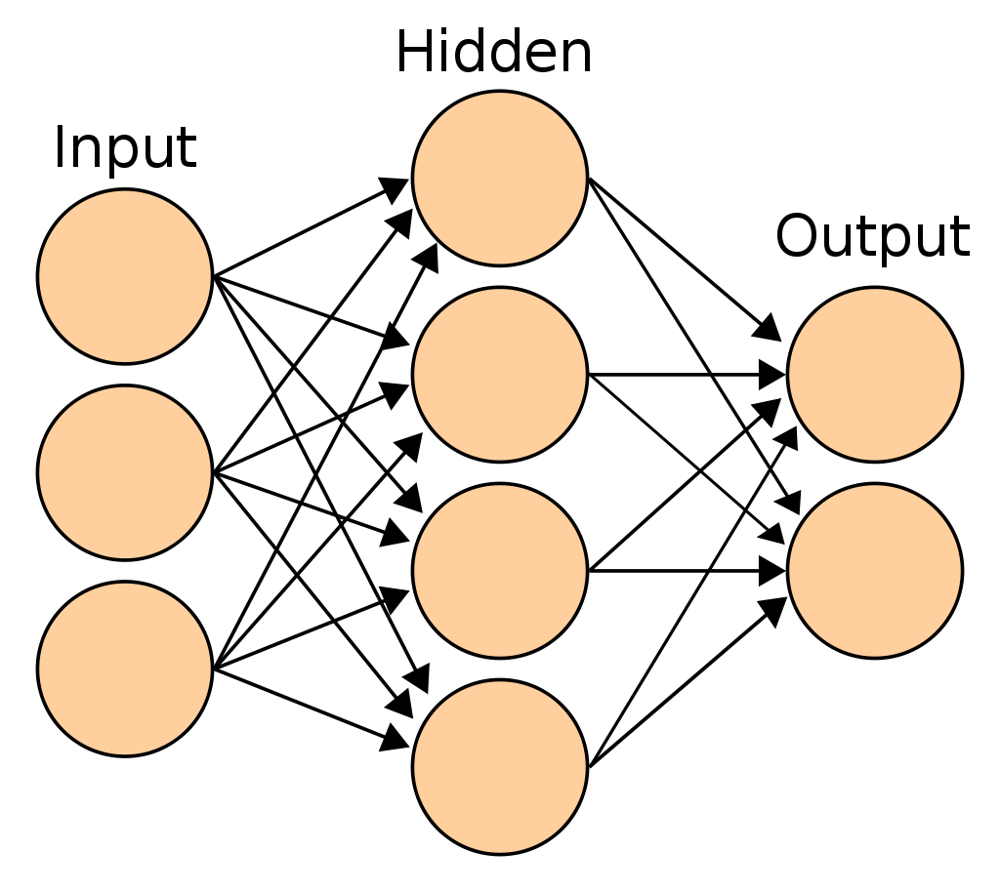

<!-- editorlm-hebrew-html-start -->
<style>
html, body, .vscode-body, .markdown-body, .markdown-preview, #write {
  direction: rtl !important; text-align: right !important;
}
ul, ol { padding-right: 2em !important; padding-left: 0 !important; }
blockquote { border-right: 3px solid #999; border-left: 0; padding-right: 1rem; padding-left: 0; }
@media print {
  html, body, .vscode-body, .markdown-body, .markdown-preview, #write {
    direction: rtl !important; text-align: right !important;
  }
}
</style>
<!-- editorlm-hebrew-html-end -->
<style>
.book { max-width: 900px; margin: auto; line-height: 1.8; font-family: Arial, sans-serif; }
.book .cover { min-height: 680px; box-sizing: border-box; padding: 64px 48px; margin: 24px 0 60px; background: #112b41; color: #f5f8fc; border-top: 9px solid #39c4b5; position: relative; }
.book .cover .eyebrow { color: #81e0d5; font-size: 15px; letter-spacing: 2px; }
.book .cover h1 { color: #fff; font-size: 48px; line-height: 1.3; border: 0; margin: 50px 0 18px; }
.book .cover .subtitle { font-size: 28px; color: #d8e6f0; }
.book .cover .author { font-size: 30px; color: #fff; margin-top: 52px; }
.book .cover .audience { color: #c1d3df; margin-top: 12px; }
.book .cover .motif { direction: ltr; text-align: left; font-family: Consolas, monospace; color: #81e0d5; font-size: 19px; margin-top: 54px; }
.book h1, .book h2, .book h3 { line-height: 1.4; font-weight: 700; }
.book > h1 { font-size: 32px !important; text-align: center !important; margin: 28px 0; }
.book h2 { font-size: 34px !important; text-align: center !important; color: #153b56 !important; background: #eef5fc; border: 0; border-bottom: 4px solid #299c91; border-radius: 10px 10px 0 0; padding: 28px 20px; margin: 24px 0 36px; }
.book h3 { font-size: 24px !important; text-align: right !important; color: #174e49 !important; background: #edf7f5; border: 0; border-right: 5px solid #299c91; border-radius: 6px; padding: 10px 16px; margin: 36px 0 18px; }
.book .chapter { height: 0; margin: 76px 0 0; border-top: 1px solid #ccd7df; break-before: page; page-break-before: always; break-after: avoid; page-break-after: avoid; }
.book .toc { padding: 24px; border-right: 5px solid #39a99d; background: rgba(70,150,155,.09); margin: 24px 0 48px; }
.book pre, .book pre code { direction: ltr !important; text-align: left !important; unicode-bidi: isolate; }
.book pre { box-sizing: border-box !important; width: 100% !important; max-width: 100% !important; margin: 0 !important; padding: 16px 20px; border: 1px solid #ccd7df; border-radius: 8px; line-height: 1.6; overflow-x: auto; }
.book code { direction: ltr; unicode-bidi: isolate; font-family: Consolas, "Courier New", monospace; }
.book pre { background: #f3f6fa !important; color: #1f2937 !important; }
.book pre code, .book pre code.hljs { background: transparent !important; color: #1f2937 !important; }
.book pre .hljs-keyword, .book pre .hljs-literal { color: #6f299c !important; }
.book pre .hljs-string { color: #216338 !important; }
.book pre .hljs-number { color: #075e68 !important; }
.book pre .hljs-comment { color: #526174 !important; }
.book pre .hljs-built_in, .book pre .hljs-title { color: #135b96 !important; }
.book table { width: 100%; }
.book th, .book td { text-align: right; }
.book .small { font-size: .9em; opacity: .8; }
.book .python-intro { display: flex; align-items: center; gap: 28px; padding: 22px 28px; margin: 24px 0; background: #eef5fc; color: #183e63; border-right: 6px solid #3776ab; border-radius: 10px; }
.book .python-intro strong { font-size: 30px; }
.book .python-fact { background: #fff7d6; color: #423611; border-right: 6px solid #ffd343; border-radius: 8px; padding: 18px 24px; margin: 22px 0; }
.book .python-fact strong { font-size: 24px; }
.book img { max-width: 100%; height: auto; }
.book figure { margin: 24px auto; text-align: center; }
.book figure img { display: block; margin: auto; }
.book figcaption { direction: rtl; text-align: center; font-size: .9em; color: #445566; }
@media print { .book > h2 { break-before: page; page-break-before: always; } }
.book .screen-strip { width: 760px; max-width: 100%; height: 220px; overflow: hidden; border: 1px solid #bccad5; border-radius: 8px; margin: 20px auto 8px; direction: ltr; }
.book .screen-strip.output { height: 265px; }
.book .screen-strip img { display: block; width: 1745px; max-width: none; }
.book .screen-menu { width: 400px; max-width: 100%; height: 295px; overflow: hidden; direction: ltr; margin: 20px auto 8px; border: 1px solid #bccad5; border-radius: 8px; }
.book .screen-menu img { display: block; width: 1745px; max-width: none; }
.book .code-panel { box-sizing: border-box !important; display: block !important; width: 50% !important; max-width: 50% !important; margin: 18px auto !important; }
@media print {
  .book .cover { min-height: 85vh; break-after: page; print-color-adjust: exact; -webkit-print-color-adjust: exact; }
  .book pre { white-space: pre-wrap; break-inside: avoid; }
  .book .chapter { margin: 0; border: 0; }
  .book h1, .book h2, .book h3 { break-after: avoid; page-break-after: avoid; break-inside: avoid; }
  .book h2 { margin-top: 0; }
  .book h2, .book h3 { print-color-adjust: exact; -webkit-print-color-adjust: exact; }
}
</style>

<style>
.book .book-nav { display: flex; flex-wrap: wrap; gap: 10px; justify-content: center; align-items: center; padding: 16px 0; margin: 20px 0 32px; border-top: 1px solid #ccd7df; border-bottom: 1px solid #ccd7df; }
.book .book-nav a { display: inline-block; padding: 10px 18px; border-radius: 8px; background: #eef5fc; color: #153b56 !important; border: 1px solid #b5ccd9; text-decoration: none !important; font-size: 16px; font-weight: bold; }
.book .book-nav a.toc-link { background: #174e49; color: #fff !important; border-color: #174e49; }
.book .book-nav a:hover, .book .book-nav a:focus { background: #d4eee8; color: #153b56 !important; outline: 2px solid #299c91; outline-offset: 2px; }
.book .section-list { line-height: 2; }
@media print { .book .book-nav { display: none; } }

/* Explicit Hebrew direction, including prose beginning with English. */
.book p, .book ul, .book ol, .book li,
.book blockquote, .book h1, .book h2, .book h3,
.book h4, .book th, .book td {
  direction: rtl !important;
  text-align: right !important;
  unicode-bidi: isolate;
}
/* Chapter titles keep their agreed centered layout. */
.book h2 { text-align: center !important; }
.book pre, .book pre code, .book .code-panel {
  direction: ltr !important;
  text-align: left !important;
  unicode-bidi: isolate;
}
</style>

<div class="book" dir="rtl" lang="he" style="direction: rtl !important; text-align: right !important;">

<nav class="book-nav" aria-label="ניווט בספר">
<a href="12-%D7%A8%D7%92%D7%A8%D7%A1%D7%99%D7%94%20%D7%9C%D7%95%D7%92%D7%99%D7%AA.md">→ הקודם</a>
<a class="toc-link" href="../index.md">תוכן העניינים</a>
<a href="14-%D7%A8%D7%92%D7%A8%D7%A1%D7%99%D7%94%20%D7%9C%D7%90%20%D7%9C%D7%99%D7%A0%D7%90%D7%A8%D7%99%D7%AA.md">הבא ←</a>
</nav>

## ב.13 רשת נוירונים — זיהוי הספרה 7


**[השיעור וההרצאות באתר של גלעד מרקמן](https://webprogramming.azurewebsites.net/Pages/PyTorch/ANN.aspx)**

**חומרי הליווי:** [8. רשת נורונים ANN](../../../sources/ML/8.%20%D7%A8%D7%A9%D7%AA%20%D7%A0%D7%95%D7%A8%D7%95%D7%A0%D7%99%D7%9D%20ANN.pptx) · [8_ANN_MNIST](../../../sources/ML/converted/8_ANN_MNIST/notebook.md) · [5.4_Linear_Regresion-Limitation](../../../sources/ML/converted/5.4_Linear_Regresion-Limitation/notebook.md) · [Moon](../../../sources/ML/converted/Moon/notebook.md) · [Fashion_MNIST](../../../sources/ML/converted/Fashion_MNIST/notebook.md) · [EMNIST](../../../sources/ML/converted/EMNIST/notebook.md)


### משכבה אחת לרשת

עד עכשיו השתמשנו בשכבה לינארית אחת. **רשת נוירונים מלאכותית — ANN** מחברת כמה שכבות. שכבת הקלט מקבלת את התכונות, שכבות חבויות בונות ייצוגים חדשים, ושכבת הפלט מפיקה את התחזית.

בשכבה **Fully Connected** כל פלט תלוי בכל הקלטים של אותה שכבה. בין שכבות לינאריות מוסיפים אקטיבציה לא לינארית, כגון ReLU. בלי אקטיבציה כזאת, שרשרת שכבות לינאריות נשארת חישוב לינארי.

### מעבר קדימה ברשת קטנה שאפשר לחשב ביד

נבחר שני קלטים x₁=1 ו־x₂=2. היחידה החבויה הראשונה תחשב `h₁=ReLU(x₁−x₂+1)=0`; השנייה תחשב `h₂=ReLU(2x₁+x₂)=4`. יחידת הפלט תחבר `z=0.5h₁+0.25h₂−0.5=0.5`. הפעלת Sigmoid תיתן הסתברות כ־0.6225.

הדוגמה מראה מדוע מספר הקלטים של שכבה חייב להתאים למספר הפלטים של קודמתה: הפלט קיבל שני מספרים, h₁ ו־h₂. גם כשיש 100 יחידות, אותו עיקרון נשמר. במקום לחשב כל יחידה בנפרד, כפל מטריצות מחשב את השכבה כולה.

אם נשמיט את האקטיבציות בין שתי שכבות, נקבל `W₂(W₁x+b₁)+b₂`, שאפשר לכתוב כשכבה אחת עם משקל `W₂W₁` והטיה `W₂b₁+b₂`. הגדלת מספר השכבות לבדה אינה יוצרת יכולת לא לינארית; האקטיבציות הן שמונעות את הצמצום הזה.

### מה מתעדכן בזמן backpropagation?

ההפסד תלוי בפלט, הפלט תלוי בשכבה החבויה, והיא תלויה במשקלים הראשונים. כלל השרשרת מעביר את השפעת ההפסד לאחור בכל המסלולים האלה. `loss.backward()` מחשבת את הנגזרות של כל הפרמטרים הרשומים; אין לולאת אימון נפרדת לכל שכבה. כל הרשת מתאימה את עצמה לאותה מטרה.

<figure>

<figcaption>רשת קטנה מן המצגת: תוצאות היחידות בשכבה אחת משמשות כקלט לחישוב הבא.</figcaption>
</figure>
<!-- editorlm-source-ref: [sources/ML/1. מבוא והתקנה.pptx#L29-L34] -->

### המשימה: האם זו הספרה 7?

מאגר **MNIST** מכיל תמונות של ספרות בכתב יד: 60,000 תמונות אימון ו־10,000 תמונות בדיקה. גודל כל תמונה 28×28 פיקסלים בגוני אפור.

בפרק זה נפתור בעיה בינארית בלבד: 7 או לא 7. בפרק ב.17 נעבור לזיהוי כל עשר הספרות.

<div class="code-panel" dir="ltr">

```python
import torch
from torch import nn
from torch.utils.data import DataLoader
from torchvision import datasets, transforms
import matplotlib.pyplot as plt

device = torch.device(
    "cuda" if torch.cuda.is_available()
    else "cpu"
)
transform = transforms.ToTensor()
train_data = datasets.MNIST(
    root="data", train=True,
    download=True, transform=transform
)
test_data = datasets.MNIST(
    root="data", train=False,
    download=True, transform=transform
)
```

</div>

ToTensor ממירה כל תמונה לטנסור, ובתמונות אלה ממירה את עוצמות הפיקסלים לטווח 0–1. צורת תמונה בודדת היא `[1,28,28]`: ערוץ אחד, גובה ורוחב.

<figure>

<!-- editorlm-source-ref: [sources/ML/converted/8_ANN_MNIST/notebook.md#L201] -->
<figcaption>דוגמאות ספרות מתוך המחברת. הפיקסלים הבהירים מתארים את הכתב.</figcaption>
</figure>

### אצוות — Batches

**DataLoader** מחזיר בכל פעם אצווה של דוגמאות. כך אין צורך להעביר את כל המאגר למודל בבת אחת. ערבוב נתוני האימון משנה את סדר הדוגמאות בכל מעבר.

<div class="code-panel" dir="ltr">

```python
train_loader = DataLoader(
    train_data, batch_size=50, shuffle=True
)
test_loader = DataLoader(
    test_data, batch_size=50, shuffle=False
)
images, labels = next(iter(train_loader))
print(images.shape)
print(labels.shape)
```

</div>

**פלט**

<div class="code-panel" dir="ltr">

```text
torch.Size([50, 1, 28, 28])
torch.Size([50])
```

</div>

מעבר על כל נתוני האימון נקרא **Epoch**. באצוות של 50 יש 1,200 אצוות אימון בכל epoch, ולא 50 אצוות.

### מבנה הרשת

משטחים כל תמונה ל־784 מספרים. הרשת מעבירה אותם ל־100 יחידות חבויות, מפעילה ReLU, ומפיקה הסתברות אחת באמצעות Sigmoid.

<div class="code-panel" dir="ltr">

```python
model = nn.Sequential(
    nn.Linear(784, 100),
    nn.ReLU(),
    nn.Linear(100, 1),
    nn.Sigmoid()
).to(device)
loss_function = nn.BCELoss()
optimizer = torch.optim.Adam(
    model.parameters(), lr=0.01
)
```

</div>

### כמה מספרים הרשת לומדת?

בשכבה הראשונה יש ‎784×100 משקלים ועוד 100 הטיות: 78,500 פרמטרים. בשכבת הפלט יש 100 משקלים והטיה אחת: 101. בסך הכול 78,601 פרמטרים נלמדים. ל־ReLU ול־Sigmoid אין פרמטרים בדוגמה הזאת.

<div class="code-panel" dir="ltr">

```python
print(sum(p.numel() for p in model.parameters()))
```

</div>

**פלט**

<div class="code-panel" dir="ltr">

```text
78601
```

</div>

784 הוא מספר תכונות הקלט, ואינו מספר המשקלים הכולל. הוספת יחידות חבויות מגדילה את גמישות המודל, אך גם את מספר הפרמטרים ואת כמות החישוב. בוחנים את התועלת בעזרת נתונים שלא שימשו לעדכון המשקלים.

### דוגמה, אצווה ותקופת אימון

`Dataset` יודע להחזיר דוגמה; `DataLoader` אוסף כמה דוגמאות לאצווה. בקריאה `next(iter(loader))` יוצרים איטרטור חדש ולוקחים את האצווה הראשונה שלו. כדי להתקדם לאצווה הבאה מאותו מעבר שומרים את האיטרטור וקוראים שוב ל־`next`.

במאגר של 60,000 דוגמאות ובאצוות של 50, שתי תקופות כוללות 2,400 עדכוני משקלים. כל עדכון משתמש במשקלים שהשתנו בעדכון הקודם. הפסד של אצווה יכול לעלות כי האצווה קשה יותר; אין לצפות לירידה בכל עדכון בודד.

כשמחשבים הפסד ממוצע לתקופה, מכפילים את הפסד כל אצווה במספר דוגמאותיה, מסכמים ומחלקים במספר הדוגמאות הכולל. כך גם אצווה אחרונה קטנה מקבלת משקל נכון.

### הכנת התוויות ואימון

ההשוואה labels==7 יוצרת תווית בינארית. ממירים אותה ל־float ולצורה `[batch,1]`, כדי שתתאים לפלט הרשת.

<div class="code-panel" dir="ltr">

```python
for epoch in range(2):
    model.train()
    total_loss = 0.
    for images, labels in train_loader:
        x = images.reshape(-1, 784).to(device)
        y = (labels == 7).float()
        y = y.reshape(-1, 1).to(device)

        optimizer.zero_grad()
        probability = model(x)
        loss = loss_function(probability, y)
        loss.backward()
        optimizer.step()
        total_loss += loss.item() * len(images)

    mean_loss = total_loss / len(train_data)
    print(epoch + 1, mean_loss)
```

</div>

בכל אצווה מתבצע עדכון משקלים אחד. אנחנו שומרים מספר רגיל מתוך loss באמצעות item, ולא את כל גרף החישוב.

### בדיקה על תמונות שלא שימשו לאימון

<div class="code-panel" dir="ltr">

```python
model.eval()
correct = 0
total = 0
with torch.no_grad():
    for images, labels in test_loader:
        x = images.reshape(-1, 784).to(device)
        predicted = model(x).flatten() >= 0.5
        expected = (labels == 7).to(device)
        correct += (predicted == expected).sum().item()
        total += len(labels)
print(f"Accuracy: {100 * correct / total:.2f}%")
```

</div>

במחברת נשמרה תוצאה של:

**פלט**

<div class="code-panel" dir="ltr">

```text
Accuracy: 99.21%
```

</div>

זהו דיוק של ההחלטה **7 או לא 7**, ולא דיוק בזיהוי עשר ספרות. גם מודל שעונה תמיד ״לא 7״ צודק ברבות מהתמונות; לכן מועיל לבדוק בנפרד גם תמונות של 7 וגם תמונות שאינן 7.

### הצגת תחזיות לצד התמונות

<div class="code-panel" dir="ltr">

```python
images, labels = next(iter(test_loader))
with torch.no_grad():
    x = images.reshape(-1, 784).to(device)
    predicted = (model(x).flatten() >= 0.5).cpu()
fig, axes = plt.subplots(2, 5, figsize=(8, 4))
for i, ax in enumerate(axes.flat):
    ax.imshow(images[i, 0], cmap="gray")
    ax.set_title(
        f"7? {int(predicted[i])}; digit {labels[i]}"
    )
    ax.axis("off")
plt.tight_layout()
plt.show()
```

</div>

<figure>

<!-- editorlm-source-ref: [sources/ML/converted/8_ANN_MNIST/notebook.md#L600] -->
<figcaption>הצגת 50 תחזיות בפלט המקורי: בכותרת כל תמונה מופיעים הסיווג הבינארי והספרה האמיתית.</figcaption>
</figure>

הקוד שלפנינו מציג עשר תמונות כדי לשמור על קריאות. אפשר לשנות את מספר השורות והעמודות כדי להציג יותר.


<!-- editorlm-source-ref: [sources/ML/converted/5.4_Linear_Regresion-Limitation/notebook.md#L4231] -->
<!-- editorlm-source-ref: [sources/ML/converted/5.4_Linear_Regresion-Limitation/notebook.md#L4569] -->
<!-- editorlm-source-ref: [sources/ML/converted/Moon/notebook.md#L308] -->
<!-- editorlm-source-ref: [sources/ML/converted/Moon/notebook.md#L38-L38] -->
<!-- editorlm-source-ref: [sources/ML/converted/Moon/notebook.md#L72-L72] -->
<!-- editorlm-source-ref: [sources/ML/converted/Moon/notebook.md#L106-L106] -->
<!-- editorlm-source-ref: [sources/ML/converted/Fashion_MNIST/notebook.md#L194] -->
<!-- editorlm-source-ref: [sources/ML/converted/EMNIST/notebook.md#L186] -->
<!-- editorlm-source-ref: [sources/ML/8. רשת נורונים ANN.pptx#L1-L121] -->
<!-- editorlm-source-ref: [sources/ML/converted/8_ANN_MNIST/notebook.md#L1-L600] -->
<!-- editorlm-source-ref: [sources/ML/converted/5.4_Linear_Regresion-Limitation/notebook.md#L1-L4590] -->
<!-- editorlm-source-ref: [sources/ML/converted/Moon/notebook.md#L1-L308] -->
<!-- editorlm-source-ref: [sources/ML/converted/Fashion_MNIST/notebook.md#L1-L517] -->
<!-- editorlm-source-ref: [sources/ML/converted/EMNIST/notebook.md#L1-L615] -->
<!-- editorlm-source-ref: [sources/ML/converted/Fashion_MNIST - unsolved/notebook.md#L1-L104] -->
<!-- editorlm-source-ref: [sources/ML/converted/EMNIST - unsolved/notebook.md#L1-L253] -->
<!-- editorlm-source-ref: [sources/ML/converted/EMNIST/notebook.md#L615-L615] -->

<nav class="book-nav" aria-label="ניווט בספר">
<a href="12-%D7%A8%D7%92%D7%A8%D7%A1%D7%99%D7%94%20%D7%9C%D7%95%D7%92%D7%99%D7%AA.md">→ הקודם</a>
<a class="toc-link" href="../index.md">תוכן העניינים</a>
<a href="14-%D7%A8%D7%92%D7%A8%D7%A1%D7%99%D7%94%20%D7%9C%D7%90%20%D7%9C%D7%99%D7%A0%D7%90%D7%A8%D7%99%D7%AA.md">הבא ←</a>
</nav>

</div>

<!-- editorlm-source-versions: {"schemaVersion": 1, "sources": {"sources/ML/8. רשת נורונים ANN.pptx": {"sourceSha256": "cb0ea33d522c66cf67afe5f7bbdf050ce207e0aaf08ddf695156ce1d01ee96e2", "canonicalTextSha256": "9f25a888efe932535fc280d60b75b25fe8b74dc05ee3d87e9e8f29b6dd7b3bfd"}, "sources/ML/converted/8_ANN_MNIST/notebook.md": {"sourceSha256": "6b122579197bdfc71afc7510728cd17344b20b04f6ea6197a9699440ee3e6ede", "canonicalTextSha256": "6b122579197bdfc71afc7510728cd17344b20b04f6ea6197a9699440ee3e6ede"}, "sources/ML/converted/5.4_Linear_Regresion-Limitation/notebook.md": {"sourceSha256": "f44c2c2a3a476b01ba6b68ea0bd0e85a4cd7007e0678c34c5ea0ee6bc3c99563", "canonicalTextSha256": "f44c2c2a3a476b01ba6b68ea0bd0e85a4cd7007e0678c34c5ea0ee6bc3c99563"}, "sources/ML/converted/Moon/notebook.md": {"sourceSha256": "bfdb56fd97fdc59a74d75c33fb5616d6de8fae016ab30e3aa7205ed69d7e03d2", "canonicalTextSha256": "bfdb56fd97fdc59a74d75c33fb5616d6de8fae016ab30e3aa7205ed69d7e03d2"}, "sources/ML/converted/Fashion_MNIST/notebook.md": {"sourceSha256": "8ce43ae443894758da6d70962314d8229b340ba9fdc4eb7e7688e87a60b0c6f2", "canonicalTextSha256": "8ce43ae443894758da6d70962314d8229b340ba9fdc4eb7e7688e87a60b0c6f2"}, "sources/ML/converted/EMNIST/notebook.md": {"sourceSha256": "6fc38665167ae58bb2cea5d5cef3ac8452219f6a1043c34d4671c9f810aed853", "canonicalTextSha256": "6fc38665167ae58bb2cea5d5cef3ac8452219f6a1043c34d4671c9f810aed853"}, "sources/ML/1. מבוא והתקנה.pptx": {"sourceSha256": "cc614ed332af917ea4116f22f36868e183726b3a444d235c07551c32ca4e16fd", "canonicalTextSha256": "162ea4af01c5d7238e8852c7861210896f3cecb964a804686a36b600191ed501"}, "sources/ML/converted/EMNIST - unsolved/notebook.md": {"sourceSha256": "ef7571438ea64ea15cb66da21898dfacca624b5a698f455583e87f035d7caf3e", "canonicalTextSha256": "ef7571438ea64ea15cb66da21898dfacca624b5a698f455583e87f035d7caf3e"}, "sources/ML/converted/Fashion_MNIST - unsolved/notebook.md": {"sourceSha256": "685f265a5b852b9aeef72efd79fc4018f349d9c9f0bc6109e6e35bc04375cfde", "canonicalTextSha256": "685f265a5b852b9aeef72efd79fc4018f349d9c9f0bc6109e6e35bc04375cfde"}}} -->
