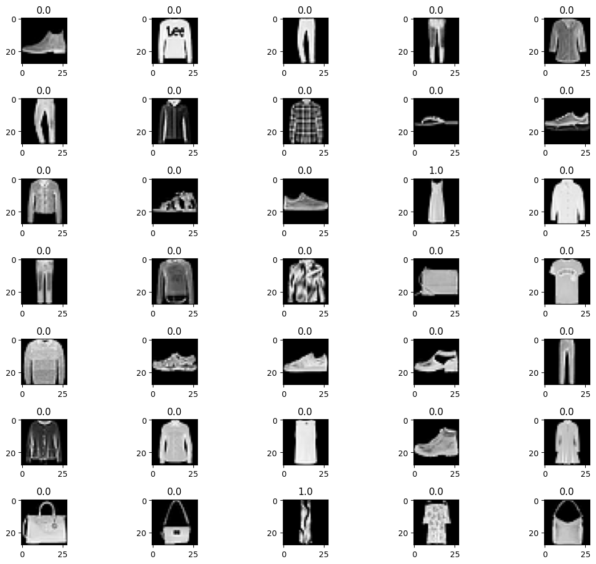
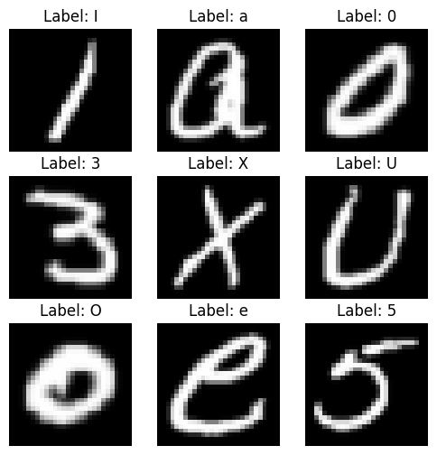
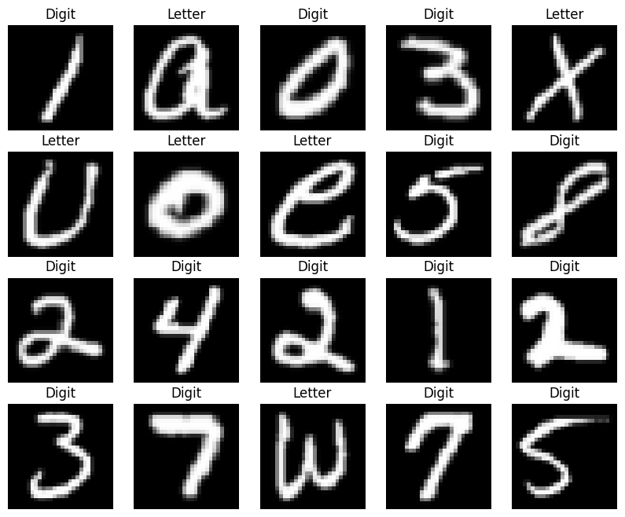

<!-- editorlm-hebrew-html-start -->
<style>
html, body, .vscode-body, .markdown-body, .markdown-preview, #write {
  direction: rtl !important; text-align: right !important;
}
ul, ol { padding-right: 2em !important; padding-left: 0 !important; }
blockquote { border-right: 3px solid #999; border-left: 0; padding-right: 1rem; padding-left: 0; }
@media print {
  html, body, .vscode-body, .markdown-body, .markdown-preview, #write {
    direction: rtl !important; text-align: right !important;
  }
}
</style>
<!-- editorlm-hebrew-html-end -->
<style>
.book { max-width: 900px; margin: auto; line-height: 1.8; font-family: Arial, sans-serif; }
.book .cover { min-height: 680px; box-sizing: border-box; padding: 64px 48px; margin: 24px 0 60px; background: #112b41; color: #f5f8fc; border-top: 9px solid #39c4b5; position: relative; }
.book .cover .eyebrow { color: #81e0d5; font-size: 15px; letter-spacing: 2px; }
.book .cover h1 { color: #fff; font-size: 48px; line-height: 1.3; border: 0; margin: 50px 0 18px; }
.book .cover .subtitle { font-size: 28px; color: #d8e6f0; }
.book .cover .author { font-size: 30px; color: #fff; margin-top: 52px; }
.book .cover .audience { color: #c1d3df; margin-top: 12px; }
.book .cover .motif { direction: ltr; text-align: left; font-family: Consolas, monospace; color: #81e0d5; font-size: 19px; margin-top: 54px; }
.book h1, .book h2, .book h3 { line-height: 1.4; font-weight: 700; }
.book > h1 { font-size: 32px !important; text-align: center !important; margin: 28px 0; }
.book h2 { font-size: 34px !important; text-align: center !important; color: #153b56 !important; background: #eef5fc; border: 0; border-bottom: 4px solid #299c91; border-radius: 10px 10px 0 0; padding: 28px 20px; margin: 24px 0 36px; }
.book h3 { font-size: 24px !important; text-align: right !important; color: #174e49 !important; background: #edf7f5; border: 0; border-right: 5px solid #299c91; border-radius: 6px; padding: 10px 16px; margin: 36px 0 18px; }
.book .chapter { height: 0; margin: 76px 0 0; border-top: 1px solid #ccd7df; break-before: page; page-break-before: always; break-after: avoid; page-break-after: avoid; }
.book .toc { padding: 24px; border-right: 5px solid #39a99d; background: rgba(70,150,155,.09); margin: 24px 0 48px; }
.book pre, .book pre code { direction: ltr !important; text-align: left !important; unicode-bidi: isolate; }
.book pre { box-sizing: border-box !important; width: 100% !important; max-width: 100% !important; margin: 0 !important; padding: 16px 20px; border: 1px solid #ccd7df; border-radius: 8px; line-height: 1.6; overflow-x: auto; }
.book code { direction: ltr; unicode-bidi: isolate; font-family: Consolas, "Courier New", monospace; }
.book pre { background: #f3f6fa !important; color: #1f2937 !important; }
.book pre code, .book pre code.hljs { background: transparent !important; color: #1f2937 !important; }
.book pre .hljs-keyword, .book pre .hljs-literal { color: #6f299c !important; }
.book pre .hljs-string { color: #216338 !important; }
.book pre .hljs-number { color: #075e68 !important; }
.book pre .hljs-comment { color: #526174 !important; }
.book pre .hljs-built_in, .book pre .hljs-title { color: #135b96 !important; }
.book table { width: 100%; }
.book th, .book td { text-align: right; }
.book .small { font-size: .9em; opacity: .8; }
.book .python-intro { display: flex; align-items: center; gap: 28px; padding: 22px 28px; margin: 24px 0; background: #eef5fc; color: #183e63; border-right: 6px solid #3776ab; border-radius: 10px; }
.book .python-intro strong { font-size: 30px; }
.book .python-fact { background: #fff7d6; color: #423611; border-right: 6px solid #ffd343; border-radius: 8px; padding: 18px 24px; margin: 22px 0; }
.book .python-fact strong { font-size: 24px; }
.book img { max-width: 100%; height: auto; }
.book figure { margin: 24px auto; text-align: center; }
.book figure img { display: block; margin: auto; }
.book figcaption { direction: rtl; text-align: center; font-size: .9em; color: #445566; }
@media print { .book > h2 { break-before: page; page-break-before: always; } }
.book .screen-strip { width: 760px; max-width: 100%; height: 220px; overflow: hidden; border: 1px solid #bccad5; border-radius: 8px; margin: 20px auto 8px; direction: ltr; }
.book .screen-strip.output { height: 265px; }
.book .screen-strip img { display: block; width: 1745px; max-width: none; }
.book .screen-menu { width: 400px; max-width: 100%; height: 295px; overflow: hidden; direction: ltr; margin: 20px auto 8px; border: 1px solid #bccad5; border-radius: 8px; }
.book .screen-menu img { display: block; width: 1745px; max-width: none; }
.book .code-panel { box-sizing: border-box !important; display: block !important; width: 50% !important; max-width: 50% !important; margin: 18px auto !important; }
@media print {
  .book .cover { min-height: 85vh; break-after: page; print-color-adjust: exact; -webkit-print-color-adjust: exact; }
  .book pre { white-space: pre-wrap; break-inside: avoid; }
  .book .chapter { margin: 0; border: 0; }
  .book h1, .book h2, .book h3 { break-after: avoid; page-break-after: avoid; break-inside: avoid; }
  .book h2 { margin-top: 0; }
  .book h2, .book h3 { print-color-adjust: exact; -webkit-print-color-adjust: exact; }
}
</style>

<style>
.book .book-nav { display: flex; flex-wrap: wrap; gap: 10px; justify-content: center; align-items: center; padding: 16px 0; margin: 20px 0 32px; border-top: 1px solid #ccd7df; border-bottom: 1px solid #ccd7df; }
.book .book-nav a { display: inline-block; padding: 10px 18px; border-radius: 8px; background: #eef5fc; color: #153b56 !important; border: 1px solid #b5ccd9; text-decoration: none !important; font-size: 16px; font-weight: bold; }
.book .book-nav a.toc-link { background: #174e49; color: #fff !important; border-color: #174e49; }
.book .book-nav a:hover, .book .book-nav a:focus { background: #d4eee8; color: #153b56 !important; outline: 2px solid #299c91; outline-offset: 2px; }
.book .section-list { line-height: 2; }
@media print { .book .book-nav { display: none; } }

/* Explicit Hebrew direction, including prose beginning with English. */
.book p, .book ul, .book ol, .book li,
.book blockquote, .book h1, .book h2, .book h3,
.book h4, .book th, .book td {
  direction: rtl !important;
  text-align: right !important;
  unicode-bidi: isolate;
}
/* Chapter titles keep their agreed centered layout. */
.book h2 { text-align: center !important; }
.book pre, .book pre code, .book .code-panel {
  direction: ltr !important;
  text-align: left !important;
  unicode-bidi: isolate;
}
</style>

<div class="book" dir="rtl" lang="he" style="direction: rtl !important; text-align: right !important;">

<nav class="book-nav" aria-label="ניווט בספר">
<a href="15-Moon%20-%20%D7%A1%D7%99%D7%95%D7%95%D7%92%20%D7%9C%D7%90%20%D7%9C%D7%99%D7%A0%D7%90%D7%A8%D7%99.md">→ הקודם</a>
<a class="toc-link" href="../index.md">תוכן העניינים</a>
<a href="17-%D7%A8%D7%A9%D7%AA%20%D7%91%D7%90%D7%9E%D7%A6%D7%A2%D7%95%D7%AA%20%D7%9E%D7%97%D7%9C%D7%A7%D7%94.md">הבא ←</a>
</nav>

## ב.16 סיווג בינארי של בגדים ואותיות

ניישם סיווג בינארי בשני מאגרי תמונות: תחילה נזהה שמלה במאגר Fashion-MNIST, ולאחר מכן נבחין בין ספרה לאות במאגר EMNIST.

**[השיעור וההרצאות באתר של גלעד מרקמן](https://webprogramming.azurewebsites.net/Pages/PyTorch/ANN.aspx)**

**חומרי הליווי:** [מצגת רשת נוירונים ANN](../../../sources/ML/8.%20%D7%A8%D7%A9%D7%AA%20%D7%A0%D7%95%D7%A8%D7%95%D7%A0%D7%99%D7%9D%20ANN.pptx) · [Fashion-MNIST — תרגיל](../../../sources/ML/Colab/Fashion_MNIST%20-%20unsolved.ipynb) · [Fashion-MNIST — פתרון](../../../sources/ML/Colab/Fashion_MNIST.ipynb) · [EMNIST — תרגיל](../../../sources/ML/Colab/EMNIST%20-%20unsolved.ipynb) · [EMNIST — פתרון](../../../sources/ML/Colab/EMNIST.ipynb)

### Fashion-MNIST — ייבוא ובחירת התקן

<div class="code-panel" dir="ltr">

```python
import torch
import torch.nn as nn
import numpy as np
import matplotlib.pyplot as plt
import torchvision
import torchvision.transforms as transforms
```

</div>

<!-- editorlm-source-ref: [sources/ML/converted/Fashion_MNIST/notebook.md#L7-L17] -->

נבחר GPU אם הוא זמין, ואחרת CPU:

<div class="code-panel" dir="ltr">

```python
if torch.cuda.is_available():
    device = torch.device('cuda')
else:
    device = torch.device('cpu')
print(device)
```

</div>

<!-- editorlm-source-ref: [sources/ML/converted/Fashion_MNIST/notebook.md#L22-L38] -->

### טעינת נתוני הבגדים

נטען את קבוצות האימון והבדיקה ונמיר את התמונות לטנסורים:

<div class="code-panel" dir="ltr">

```python
train_dataset = torchvision.datasets.FashionMNIST(root='./data',
                                           train=True,
                                           transform=transforms.ToTensor(),
                                           download=True)

test_dataset = torchvision.datasets.FashionMNIST(root='./data',
                                          train=False,
                                          transform=transforms.ToTensor(),
                                          download=True)
```

</div>

<!-- editorlm-source-ref: [sources/ML/converted/Fashion_MNIST/notebook.md#L43-L66] -->

נציג את פרטי המאגרים ואת שמות הקטגוריות:

<div class="code-panel" dir="ltr">

```python
print(train_dataset)
print(test_dataset)
```

</div>

**פלט**

<div class="code-panel" dir="ltr">

```text
Dataset FashionMNIST
    Number of datapoints: 60000
    Root location: ./data
    Split: Train
    StandardTransform
Transform: ToTensor()
Dataset FashionMNIST
    Number of datapoints: 10000
    Root location: ./data
    Split: Test
    StandardTransform
Transform: ToTensor()
```

</div>

<!-- editorlm-source-ref: [sources/ML/converted/Fashion_MNIST/notebook.md#L67-L91] -->


<div class="code-panel" dir="ltr">

```python
print(f'Class names: {train_dataset.classes}')
for number, name in enumerate(train_dataset.classes):
    print(f"Class Number: {number}, Class Name: {name}")
```

</div>

**פלט**

<div class="code-panel" dir="ltr">

```text
Class names: ['T-shirt/top', 'Trouser', 'Pullover', 'Dress', 'Coat', 'Sandal', 'Shirt', 'Sneaker', 'Bag', 'Ankle boot']
Class Number: 0, Class Name: T-shirt/top
Class Number: 1, Class Name: Trouser
Class Number: 2, Class Name: Pullover
Class Number: 3, Class Name: Dress
Class Number: 4, Class Name: Coat
Class Number: 5, Class Name: Sandal
Class Number: 6, Class Name: Shirt
Class Number: 7, Class Name: Sneaker
Class Number: 8, Class Name: Bag
Class Number: 9, Class Name: Ankle boot
```

</div>

<!-- editorlm-source-ref: [sources/ML/converted/Fashion_MNIST/notebook.md#L92-L116] -->

### אצוות ותמונות לדוגמה

נגדיר אצוות של 50 תמונות:

<div class="code-panel" dir="ltr">

```python
batch_size = 50

train_loader = torch.utils.data.DataLoader(dataset=train_dataset,
                                           batch_size=batch_size,
                                           shuffle=True)

test_loader = torch.utils.data.DataLoader(dataset=test_dataset,
                                          batch_size=batch_size,
                                          shuffle=False)
```

</div>

<!-- editorlm-source-ref: [sources/ML/converted/Fashion_MNIST/notebook.md#L121-L134] -->


<div class="code-panel" dir="ltr">

```python
print(len(train_loader))
print(len(test_loader))
```

</div>

**פלט**

<div class="code-panel" dir="ltr">

```text
1200
200
```

</div>

<!-- editorlm-source-ref: [sources/ML/converted/Fashion_MNIST/notebook.md#L135-L150] -->

נשלוף את האצווה השנייה, נציג תשעה פריטים ונדפיס גם שורת פיקסלים:

<div class="code-panel" dir="ltr">

```python
examples = iter(test_loader)
example_data, example_targets = next(examples)
example_data, example_targets = next(examples)

for i in range(9):
    plt.subplot(3,3,i+1)
    plt.title (train_dataset.classes[example_targets[i].item()])
    plt.imshow(example_data[i][0], cmap='gray')
    print(example_targets[i].item(), example_data[i].shape)

plt.show()
print(example_data[8][0][10])
```

</div>

**פלט**

<div class="code-panel" dir="ltr">

```text
4 torch.Size([1, 28, 28])
4 torch.Size([1, 28, 28])
5 torch.Size([1, 28, 28])
8 torch.Size([1, 28, 28])
2 torch.Size([1, 28, 28])
2 torch.Size([1, 28, 28])
8 torch.Size([1, 28, 28])
4 torch.Size([1, 28, 28])
8 torch.Size([1, 28, 28])
```

</div>

**פלט**

<div class="code-panel" dir="ltr">

```text
tensor([0.0000, 0.0000, 0.0000, 0.0588, 0.9843, 0.8039, 0.7961, 0.8353, 0.8275,
        0.8078, 0.8196, 0.8235, 0.8353, 0.8314, 0.8314, 0.8392, 0.8353, 0.8392,
        0.8471, 0.8392, 0.8314, 0.8196, 0.8392, 0.8275, 0.8235, 0.8235, 0.9020,
        0.2431])
```

</div>

<!-- editorlm-source-ref: [sources/ML/converted/Fashion_MNIST/notebook.md#L155-L205] -->


<figure>

<figcaption>תמונות פריטי לבוש עם שמות הקטגוריות.</figcaption>
</figure>
<!-- editorlm-source-ref: [sources/ML/converted/Fashion_MNIST/notebook.md#L194] -->

### בחירת המשימה ומבנה הרשת

נבחר את תווית 3 — שמלה. הרשת תכלול 784 קלטים, שתי שכבות חבויות של 200 ו־100 יחידות ופלט אחד.

<div class="code-panel" dir="ltr">

```python
input_size = 784 # 28x28
hidden_size1 = 200
hidden_size2 = 100
output_size = 1
epochs = 3
learning_rate = 0.01
required_label = 3
print (train_dataset.classes[required_label])
```

</div>

**פלט**

<div class="code-panel" dir="ltr">

```text
Dress
```

</div>

<!-- editorlm-source-ref: [sources/ML/converted/Fashion_MNIST/notebook.md#L214-L233] -->

נגדיר את הרשת:

<div class="code-panel" dir="ltr">

```python
Model = nn.Sequential(
    nn.Linear(input_size,hidden_size1,device=device),
    nn.ReLU(),
    nn.Linear(hidden_size1,hidden_size2,device=device),
    nn.ReLU(),
    nn.Linear(hidden_size2, 1, device=device),
    nn.Sigmoid()
)
```

</div>

<!-- editorlm-source-ref: [sources/ML/converted/Fashion_MNIST/notebook.md#L238-L251] -->

נגדיר BCE ואופטימייזר Adam:

<div class="code-panel" dir="ltr">

```python
Loss = nn.BCELoss()
optim = torch.optim.Adam(Model.parameters(), lr=learning_rate)
```

</div>

<!-- editorlm-source-ref: [sources/ML/converted/Fashion_MNIST/notebook.md#L256-L262] -->

### אימון — שמלה או לא שמלה

בכל אצווה נשטח את התמונות וניצור תווית 1 עבור שמלה ו־0 עבור שאר הפריטים.

<div class="code-panel" dir="ltr">

```python
n_total_steps = len(train_loader)
for epoch in range(epochs):
    for i, (images, lables) in enumerate(train_loader):

        # origin shape: [50, 1, 28, 28]
        # resized: [50, 784]
        images = images.reshape(-1, 28*28).to(device)
        lables = lables.reshape(-1,1).to(device)
        lables = (torch.eq(lables, required_label)).float()


        # forward
        Y_predict = Model(images)

        # backward
        loss = Loss(Y_predict, lables)
        loss.backward()

        # update wights
        optim.step()

        if (i + epoch * n_total_steps) % 100 == 0:
            print(f"epoch= {epoch} i= {i} num= {i+epoch * n_total_steps} loss={loss.item():.4f} ")

        # zero grads
        optim.zero_grad()
```

</div>

תחילת הפלט השמור וסופו:

**פלט**

<div class="code-panel" dir="ltr">

```text
epoch= 0 i= 0 num= 0 loss=0.6926 
epoch= 0 i= 100 num= 100 loss=0.0097 
epoch= 0 i= 200 num= 200 loss=0.0658 
epoch= 0 i= 300 num= 300 loss=0.1033 
...
epoch= 2 i= 1100 num= 3500 loss=0.0225
```

</div>

<!-- editorlm-source-ref: [sources/ML/converted/Fashion_MNIST/notebook.md#L267-L339] -->

הפלטים הם דוגמאות שמורות ועשויים להשתנות בהרצה חדשה.

### בדיקת המודל והצגת תחזיות

נעבור על תמונות הבדיקה ונחשב את שיעור הסיווגים הנכונים:

<div class="code-panel" dir="ltr">

```python
with torch.no_grad():
    n_correct = 0
    n_samples = 0
    for images, lables in test_loader:
        images = images.reshape(-1, 28*28).to(device)
        lables = lables.reshape(-1,1).to(device)
        lables = (torch.eq(lables, required_label)).float()
        y_predict = Model(images).round()
        # print(y_predict.T)
        # print(lables.T)

        n_samples += lables.size(0)
        n_correct += (y_predict == lables).sum().item()

    acc = 100 * n_correct / n_samples
    print(f'Accuracy of the network on the {n_samples} test images: {acc} %')
```

</div>

**פלט**

<div class="code-panel" dir="ltr">

```text
Accuracy of the network on the 10000 test images: 96.89 %
```

</div>

<!-- editorlm-source-ref: [sources/ML/converted/Fashion_MNIST/notebook.md#L344-L371] -->

נשלוף את האצווה הראשונה ונדפיס לכל פריט את ההסתברות, הקטגוריה המקורית וההחלטה הבינארית:

<div class="code-panel" dir="ltr">

```python
print(len(test_loader))
print (n_samples)
print(lables.shape)
examples = iter(test_loader)
example_data, example_targets = next(examples)
example_data = example_data.to(device)
example_targets = example_targets.to(device)
with torch.no_grad():
    example_predict = Model(example_data.reshape(-1, 28*28)).T #.round()
example_predict.shape
for i in range(len(example_data)):
    print (example_predict[0,i].item(), example_targets[i].item(), round(example_predict[0,i].item()) )
```

</div>

תחילת הפלט השמור וסופו:

**פלט**

<div class="code-panel" dir="ltr">

```text
200
10000
torch.Size([50, 1])
3.8038247885490236e-28 9 0
...
0.00022870743123348802 2 0
```

</div>

<!-- editorlm-source-ref: [sources/ML/converted/Fashion_MNIST/notebook.md#L372-L447] -->

נציג 35 תמונות עם הסיווג הבינארי בכותרת:

<div class="code-panel" dir="ltr">

```python
predict = example_predict.round().reshape(-1)
print(predict)
plt.figure(figsize=(12, 10))  # Adjust the figure size
for i in range(35):
    plt.subplot(7,5,i+1)

    plt.title (train_dataset.classes[example_targets[i].item()])
    plt.title(predict[i].item())
    plt.imshow(example_data[i][0].cpu(), cmap='gray')
    print(example_targets[i].item(), example_data[i].shape)
plt.tight_layout()
plt.show()
```

</div>

תחילת הפלט השמור וסופו:

**פלט**

<div class="code-panel" dir="ltr">

```text
tensor([0., 0., 0., 0., 0., 0., 0., 0., 0., 0., 0., 0., 0., 1., 0., 0., 0., 0.,
        0., 0., 0., 0., 0., 0., 0., 0., 0., 0., 0., 0., 0., 0., 1., 0., 0., 0.,
        0., 0., 0., 0., 0., 0., 0., 0., 0., 0., 0., 0., 0., 0.],
       device='cuda:0')
...
8 torch.Size([1, 28, 28])
```

</div>

<!-- editorlm-source-ref: [sources/ML/converted/Fashion_MNIST/notebook.md#L448-L517] -->


<figure>

<figcaption>תחזיות שמלה או לא שמלה. 1 מציין שמלה, ו־0 פריט אחר.</figcaption>
</figure>
<!-- editorlm-source-ref: [sources/ML/converted/Fashion_MNIST/notebook.md#L517] -->

### EMNIST — ספרה או אות

נעבור למאגר `byclass`, הכולל ספרות ואותיות גדולות וקטנות. נייבא את הספריות ונבחר התקן:

<div class="code-panel" dir="ltr">

```python
import torch
import torch.nn as nn
import torchvision
import torchvision.transforms as transforms
import matplotlib.pyplot as plt
```

</div>

<!-- editorlm-source-ref: [sources/ML/converted/EMNIST/notebook.md#L11-L21] -->


<div class="code-panel" dir="ltr">

```python
device = torch.device("cuda" if torch.cuda.is_available() else "cpu")
print("Device:", device)
```

</div>

<!-- editorlm-source-ref: [sources/ML/converted/EMNIST/notebook.md#L22-L36] -->

### טעינת EMNIST ותיקון כיוון התמונות

נמיר לטנסור, נשקף ונסובב את התמונות. נשתמש באותו עיבוד בשתי קבוצות הנתונים:

<div class="code-panel" dir="ltr">

```python
transform = transforms.Compose([
    transforms.ToTensor(),
    transforms.Lambda(lambda x: x.flip(2)),
    transforms.Lambda(lambda x: torch.rot90(x, 1, [1, 2]))  # 90° CCW
])

train_dataset = torchvision.datasets.EMNIST(
    root="./data",
    split="byclass",
    train=True,
    transform=transform,
    download=True
)

test_dataset = torchvision.datasets.EMNIST(
    root="./data",
    split="byclass",
    train=False,
    transform=transform,
    download=True
)

print(train_dataset)
print(test_dataset)
```

</div>

**פלט**

<div class="code-panel" dir="ltr">

```text
Dataset EMNIST
    Number of datapoints: 697932
    Root location: ./data
    Split: Train
    StandardTransform
Transform: Compose(
               ToTensor()
               Lambda()
               Lambda()
           )
Dataset EMNIST
    Number of datapoints: 116323
    Root location: ./data
    Split: Test
    StandardTransform
Transform: Compose(
               ToTensor()
               Lambda()
               Lambda()
           )
```

</div>

<!-- editorlm-source-ref: [sources/ML/converted/EMNIST/notebook.md#L41-L96] -->

### אצוות ומיפוי התוויות

נגדיר אצוות של 64 תמונות:

<div class="code-panel" dir="ltr">

```python
batch_size = 64

train_loader = torch.utils.data.DataLoader(
    dataset=train_dataset,
    batch_size=batch_size,
    shuffle=True
)

test_loader = torch.utils.data.DataLoader(
    dataset=test_dataset,
    batch_size=batch_size,
    shuffle=False
)

print(len(train_loader), len(test_loader))
```

</div>

**פלט**

<div class="code-panel" dir="ltr">

```text
10906 1818
```

</div>

<!-- editorlm-source-ref: [sources/ML/converted/EMNIST/notebook.md#L101-L128] -->

התוויות 0–9 מציינות ספרות, 10–35 אותיות גדולות ו־36–61 אותיות קטנות. נגדיר פונקציה להמרת התווית לתו לצורך הצגתו:

<div class="code-panel" dir="ltr">

```python
def emnist_label_to_char(label: int) -> str:
    """
    Convert an EMNIST 'byclass' numeric label to its corresponding character.

    EMNIST byclass mapping:
    0–9   -> '0'–'9'
    10–35 -> 'A'–'Z'
    36–61 -> 'a'–'z'
    """
    if 0 <= label <= 9:
        return chr(ord('0') + label)
    elif 10 <= label <= 35:
        return chr(ord('A') + (label - 10))
    elif 36 <= label <= 61:
        return chr(ord('a') + (label - 36))
    else:
        raise ValueError(f"Invalid EMNIST byclass label: {label}")
```

</div>

<!-- editorlm-source-ref: [sources/ML/converted/EMNIST/notebook.md#L141-L162] -->

נציג תשע תמונות עם התווים המקוריים:

<div class="code-panel" dir="ltr">

```python
examples = iter(test_loader)
example_data, example_targets = next(examples)

plt.figure(figsize=(6,6))
for i in range(9):
    plt.subplot(3,3,i+1)
    plt.imshow(example_data[i][0], cmap="gray")
    plt.title(f"Label: {emnist_label_to_char(example_targets[i].item())}")
    plt.axis("off")
plt.show()
```

</div>

<!-- editorlm-source-ref: [sources/ML/converted/EMNIST/notebook.md#L163-L187] -->


<figure>

<figcaption>תמונות EMNIST ותוויות התווים המקוריות.</figcaption>
</figure>
<!-- editorlm-source-ref: [sources/ML/converted/EMNIST/notebook.md#L186] -->

### הגדרת הרשת והאימון

נגדיר 784 קלטים, שתי שכבות חבויות של 200 ו־100 יחידות, חמישה מעברים וקצב למידה 0.001:

<div class="code-panel" dir="ltr">

```python
input_size = 28 * 28
hidden_size1 = 200
hidden_size2 = 100
epochs = 5
learning_rate = 0.001
```

</div>

<!-- editorlm-source-ref: [sources/ML/converted/EMNIST/notebook.md#L192-L202] -->


<div class="code-panel" dir="ltr">

```python
Model = nn.Sequential(
    nn.Linear(input_size, hidden_size1, device=device),
    nn.ReLU(),
    nn.Linear(hidden_size1, hidden_size2, device=device),
    nn.ReLU(),
    nn.Linear(hidden_size2, 1, device=device),
    nn.Sigmoid()
)
```

</div>

<!-- editorlm-source-ref: [sources/ML/converted/EMNIST/notebook.md#L207-L220] -->


<div class="code-panel" dir="ltr">

```python
Loss = nn.BCELoss()
optimizer = torch.optim.Adam(Model.parameters(), lr=learning_rate)
```

</div>

<!-- editorlm-source-ref: [sources/ML/converted/EMNIST/notebook.md#L225-L232] -->

### אימון — ספרה 1, אות 0

התנאי `labels < 10` הופך את התוויות לבינאריות. הפלט היחיד מציין אם התמונה היא ספרה, ולא איזו ספרה או אות היא.

<div class="code-panel" dir="ltr">

```python
n_total_steps = len(train_loader)

for epoch in range(epochs):
    for i, (images, labels) in enumerate(train_loader):

        # flatten images
        images = images.reshape(-1, 28*28).to(device)

        # binary labels:
        # digit (0–9)  -> 1
        # letter (>=10) -> 0
        labels = labels.to(device)
        labels = (labels < 10).float().view(-1, 1)

        # forward
        outputs = Model(images)
        loss = Loss(outputs, labels)

        # backward
        optimizer.zero_grad()
        loss.backward()
        optimizer.step()

        if (i + epoch * n_total_steps) % 200 == 0:
            print(f"epoch={epoch} step={i} loss={loss.item():.4f}")
```

</div>

תחילת הפלט השמור וסופו:

**פלט**

<div class="code-panel" dir="ltr">

```text
epoch=0 step=0 loss=0.6922
epoch=0 step=200 loss=0.3900
epoch=0 step=400 loss=0.4345
epoch=0 step=600 loss=0.4177
...
epoch=4 step=10776 loss=0.1791
```

</div>

<!-- editorlm-source-ref: [sources/ML/converted/EMNIST/notebook.md#L237-L546] -->

### בדיקת המודל

נשתמש באותו כלל תוויות גם בבדיקה:

<div class="code-panel" dir="ltr">

```python
Model.eval()
with torch.no_grad():
    n_correct = 0
    n_samples = 0

    for images, labels in test_loader:
        images = images.reshape(-1, 28*28).to(device)

        labels = labels.to(device)
        labels = (labels < 10).float().view(-1, 1)

        preds = Model(images).round()

        n_samples += labels.size(0)
        n_correct += (preds == labels).sum().item()

    acc = 100 * n_correct / n_samples
    print(f"Test Accuracy: {acc:.2f}%")
```

</div>

**פלט**

<div class="code-panel" dir="ltr">

```text
Test Accuracy: 90.93%
```

</div>

<!-- editorlm-source-ref: [sources/ML/converted/EMNIST/notebook.md#L551-L581] -->

### הצגת התחזיות

נציג 20 תמונות עם הכיתוב Digit או Letter לפי החלטת המודל:

<div class="code-panel" dir="ltr">

```python
examples = iter(test_loader)
example_data, example_targets = next(examples)
example_data = example_data.to(device)

with torch.no_grad():
    probs = Model(example_data.reshape(-1, 28*28))
    preds = probs.round().view(-1)

plt.figure(figsize=(10,8))
for i in range(20):
    plt.subplot(4,5,i+1)
    plt.imshow(example_data[i][0].cpu(), cmap="gray")
    title = "Digit" if preds[i].item() == 1 else "Letter"
    plt.title(title)
    plt.axis("off")
plt.show()
```

</div>

<!-- editorlm-source-ref: [sources/ML/converted/EMNIST/notebook.md#L586-L615] -->


<figure>

<figcaption>תחזיות המודל: ספרה או אות.</figcaption>
</figure>
<!-- editorlm-source-ref: [sources/ML/converted/EMNIST/notebook.md#L615] -->


<nav class="book-nav" aria-label="ניווט בספר">
<a href="15-Moon%20-%20%D7%A1%D7%99%D7%95%D7%95%D7%92%20%D7%9C%D7%90%20%D7%9C%D7%99%D7%A0%D7%90%D7%A8%D7%99.md">→ הקודם</a>
<a class="toc-link" href="../index.md">תוכן העניינים</a>
<a href="17-%D7%A8%D7%A9%D7%AA%20%D7%91%D7%90%D7%9E%D7%A6%D7%A2%D7%95%D7%AA%20%D7%9E%D7%97%D7%9C%D7%A7%D7%94.md">הבא ←</a>
</nav>

</div>

<!-- editorlm-source-versions: {"schemaVersion":1,"sources":{"sources/ML/converted/Fashion_MNIST/notebook.md":{"sourceSha256":"8ce43ae443894758da6d70962314d8229b340ba9fdc4eb7e7688e87a60b0c6f2","canonicalTextSha256":"8ce43ae443894758da6d70962314d8229b340ba9fdc4eb7e7688e87a60b0c6f2"},"sources/ML/converted/EMNIST/notebook.md":{"sourceSha256":"6fc38665167ae58bb2cea5d5cef3ac8452219f6a1043c34d4671c9f810aed853","canonicalTextSha256":"6fc38665167ae58bb2cea5d5cef3ac8452219f6a1043c34d4671c9f810aed853"}}} -->
