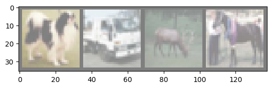
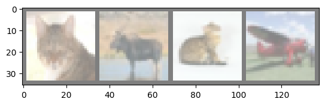

<!-- editorlm-hebrew-html-start -->
<style>
html, body, .vscode-body, .markdown-body, .markdown-preview, #write {
  direction: rtl !important; text-align: right !important;
}
ul, ol { padding-right: 2em !important; padding-left: 0 !important; }
blockquote { border-right: 3px solid #999; border-left: 0; padding-right: 1rem; padding-left: 0; }
@media print {
  html, body, .vscode-body, .markdown-body, .markdown-preview, #write {
    direction: rtl !important; text-align: right !important;
  }
}
</style>
<!-- editorlm-hebrew-html-end -->
<style>
.book { max-width: 900px; margin: auto; line-height: 1.8; font-family: Arial, sans-serif; }
.book .cover { min-height: 680px; box-sizing: border-box; padding: 64px 48px; margin: 24px 0 60px; background: #112b41; color: #f5f8fc; border-top: 9px solid #39c4b5; position: relative; }
.book .cover .eyebrow { color: #81e0d5; font-size: 15px; letter-spacing: 2px; }
.book .cover h1 { color: #fff; font-size: 48px; line-height: 1.3; border: 0; margin: 50px 0 18px; }
.book .cover .subtitle { font-size: 28px; color: #d8e6f0; }
.book .cover .author { font-size: 30px; color: #fff; margin-top: 52px; }
.book .cover .audience { color: #c1d3df; margin-top: 12px; }
.book .cover .motif { direction: ltr; text-align: left; font-family: Consolas, monospace; color: #81e0d5; font-size: 19px; margin-top: 54px; }
.book h1, .book h2, .book h3 { line-height: 1.4; font-weight: 700; }
.book > h1 { font-size: 32px !important; text-align: center !important; margin: 28px 0; }
.book h2 { font-size: 34px !important; text-align: center !important; color: #153b56 !important; background: #eef5fc; border: 0; border-bottom: 4px solid #299c91; border-radius: 10px 10px 0 0; padding: 28px 20px; margin: 24px 0 36px; }
.book h3 { font-size: 24px !important; text-align: right !important; color: #174e49 !important; background: #edf7f5; border: 0; border-right: 5px solid #299c91; border-radius: 6px; padding: 10px 16px; margin: 36px 0 18px; }
.book .chapter { height: 0; margin: 76px 0 0; border-top: 1px solid #ccd7df; break-before: page; page-break-before: always; break-after: avoid; page-break-after: avoid; }
.book .toc { padding: 24px; border-right: 5px solid #39a99d; background: rgba(70,150,155,.09); margin: 24px 0 48px; }
.book pre, .book pre code { direction: ltr !important; text-align: left !important; unicode-bidi: isolate; }
.book pre { box-sizing: border-box !important; width: 100% !important; max-width: 100% !important; margin: 0 !important; padding: 16px 20px; border: 1px solid #ccd7df; border-radius: 8px; line-height: 1.6; overflow-x: auto; }
.book code { direction: ltr; unicode-bidi: isolate; font-family: Consolas, "Courier New", monospace; }
.book pre { background: #f3f6fa !important; color: #1f2937 !important; }
.book pre code, .book pre code.hljs { background: transparent !important; color: #1f2937 !important; }
.book pre .hljs-keyword, .book pre .hljs-literal { color: #6f299c !important; }
.book pre .hljs-string { color: #216338 !important; }
.book pre .hljs-number { color: #075e68 !important; }
.book pre .hljs-comment { color: #526174 !important; }
.book pre .hljs-built_in, .book pre .hljs-title { color: #135b96 !important; }
.book table { width: 100%; }
.book th, .book td { text-align: right; }
.book .small { font-size: .9em; opacity: .8; }
.book .python-intro { display: flex; align-items: center; gap: 28px; padding: 22px 28px; margin: 24px 0; background: #eef5fc; color: #183e63; border-right: 6px solid #3776ab; border-radius: 10px; }
.book .python-intro strong { font-size: 30px; }
.book .python-fact { background: #fff7d6; color: #423611; border-right: 6px solid #ffd343; border-radius: 8px; padding: 18px 24px; margin: 22px 0; }
.book .python-fact strong { font-size: 24px; }
.book img { max-width: 100%; height: auto; }
.book figure { margin: 24px auto; text-align: center; }
.book figure img { display: block; margin: auto; }
.book figcaption { direction: rtl; text-align: center; font-size: .9em; color: #445566; }
@media print { .book > h2 { break-before: page; page-break-before: always; } }
.book .screen-strip { width: 760px; max-width: 100%; height: 220px; overflow: hidden; border: 1px solid #bccad5; border-radius: 8px; margin: 20px auto 8px; direction: ltr; }
.book .screen-strip.output { height: 265px; }
.book .screen-strip img { display: block; width: 1745px; max-width: none; }
.book .screen-menu { width: 400px; max-width: 100%; height: 295px; overflow: hidden; direction: ltr; margin: 20px auto 8px; border: 1px solid #bccad5; border-radius: 8px; }
.book .screen-menu img { display: block; width: 1745px; max-width: none; }
.book .code-panel { box-sizing: border-box !important; display: block !important; width: 50% !important; max-width: 50% !important; margin: 18px auto !important; }
@media print {
  .book .cover { min-height: 85vh; break-after: page; print-color-adjust: exact; -webkit-print-color-adjust: exact; }
  .book pre { white-space: pre-wrap; break-inside: avoid; }
  .book .chapter { margin: 0; border: 0; }
  .book h1, .book h2, .book h3 { break-after: avoid; page-break-after: avoid; break-inside: avoid; }
  .book h2 { margin-top: 0; }
  .book h2, .book h3 { print-color-adjust: exact; -webkit-print-color-adjust: exact; }
}
</style>

<style>
.book .book-nav { display: flex; flex-wrap: wrap; gap: 10px; justify-content: center; align-items: center; padding: 16px 0; margin: 20px 0 32px; border-top: 1px solid #ccd7df; border-bottom: 1px solid #ccd7df; }
.book .book-nav a { display: inline-block; padding: 10px 18px; border-radius: 8px; background: #eef5fc; color: #153b56 !important; border: 1px solid #b5ccd9; text-decoration: none !important; font-size: 16px; font-weight: bold; }
.book .book-nav a.toc-link { background: #174e49; color: #fff !important; border-color: #174e49; }
.book .book-nav a:hover, .book .book-nav a:focus { background: #d4eee8; color: #153b56 !important; outline: 2px solid #299c91; outline-offset: 2px; }
.book .section-list { line-height: 2; }
@media print { .book .book-nav { display: none; } }

/* Explicit Hebrew direction, including prose beginning with English. */
.book p, .book ul, .book ol, .book li,
.book blockquote, .book h1, .book h2, .book h3,
.book h4, .book th, .book td {
  direction: rtl !important;
  text-align: right !important;
  unicode-bidi: isolate;
}
/* Chapter titles keep their agreed centered layout. */
.book h2 { text-align: center !important; }
.book pre, .book pre code, .book .code-panel {
  direction: ltr !important;
  text-align: left !important;
  unicode-bidi: isolate;
}
</style>

<div class="book" dir="rtl" lang="he" style="direction: rtl !important; text-align: right !important;">

<nav class="book-nav" aria-label="ניווט בספר">
<a href="20-%D7%A9%D7%9E%D7%99%D7%A8%D7%94%20%D7%95%D7%98%D7%A2%D7%99%D7%A0%D7%94.md">→ הקודם</a>
<a class="toc-link" href="../index.md">תוכן העניינים</a>
<a href="22-%D7%97%D7%AA%D7%95%D7%9C%20%D7%90%D7%95%20%D7%9C%D7%90%20%D7%97%D7%AA%D7%95%D7%9C.md">הבא ←</a>
</nav>

## ב.21 רשתות קונבולוציה — CNN ו־CIFAR-10


**[השיעור וההרצאות באתר של גלעד מרקמן](https://webprogramming.azurewebsites.net/Pages/PyTorch/CNN.aspx)**

[פתיחת מחברת Colab 1](https://colab.research.google.com/drive/1xZoGACtS3LGqwTJl4fUedoVM35GOGY8B?usp=sharing)

**חומרי הליווי:** [11.רשתות קונבולוציה](../../../sources/ML/11.%D7%A8%D7%A9%D7%AA%D7%95%D7%AA%20%D7%A7%D7%95%D7%A0%D7%91%D7%95%D7%9C%D7%95%D7%A6%D7%99%D7%94.pptx) · [11_CNN_CIFAR10](../../../sources/ML/converted/11_CNN_CIFAR10/notebook.md) · [CatNoCat-solved](../../../sources/ML/converted/CatNoCat-solved/notebook.md)


### שומרים על המבנה של התמונה

ברשת הקודמת הפכנו תמונה לווקטור. **רשת קונבולוציה — CNN** מעבדת אזורים מקומיים בתמונה תוך שמירה על המבנה המרחבי. אותו מסנן פועל במקומות שונים, ולכן אפשר ללמוד לזהות תבנית גם כשהיא מופיעה במקום אחר.

### מפיקסלים למספרים

תמונה בינארית יכולה להציג בכל תא 0 או 1. בתמונת גוני אפור בעומק 8 סיביות, כל תא מכיל ערך בין 0 ל־255: שחור בקצה אחד ולבן באחר. המעבר לטנסור עשרוני מאפשר לחשב נגזרות ולעבד את העוצמות, אך אינו מוסיף מידע שלא היה בתמונה.

<figure>

<figcaption>תמונת גוני אפור כמטריצה של עוצמות: המיקום במטריצה קובע את מיקום הפיקסל בתמונה.</figcaption>
</figure>
<!-- editorlm-source-ref: [sources/ML/11.רשתות קונבולוציה.pptx#L13-L18] -->
בתמונה צבעונית לכל פיקסל שלושה ערכים. אדום מלא מיוצג כ־(255,0,0), שחור כ־(0,0,0) ולבן כ־(255,255,255). שלושת הערוצים מתארים את אותם מיקומים, ולא שלוש תמונות בלתי קשורות.

<figure>

<figcaption>פירוק תמונת RGB לערוצים אדום, ירוק וכחול מתוך המצגת.</figcaption>
</figure>
<!-- editorlm-source-ref: [sources/ML/11.רשתות קונבולוציה.pptx#L19-L24] -->
<figure>

<figcaption>כל ערוץ צבע הוא מטריצה. טנסור התמונה מאגד את שלוש המטריצות.</figcaption>
</figure>


### ערוצים ומסננים

תמונת RGB כוללת שלושה ערוצי צבע. בטנסור PyTorch של אצווה סדר הממדים הוא **מספר תמונות, ערוצים, גובה, רוחב**.

**Kernel** הוא מסנן קטן של משקלים נלמדים. בכל מיקום הוא מחשב סכום משוקלל של האזור שמולו. כל מסנן יוצר מפת תכונות; כמה מסננים יוצרים כמה ערוצי פלט.

### לחשב חלון אחד ביד

ניקח חלון 3×3 ונשתמש במסנן שמסכם את העמודה השמאלית ומחסר את הימנית. זו דוגמת הוראה של מסנן קבוע; ברשת מאומנת ערכי המסננים נלמדים מהנתונים.

<div class="code-panel" dir="ltr">

```python
import torch

patch = torch.tensor([[1., 2., 3.],
                      [4., 5., 6.],
                      [7., 8., 9.]])
kernel = torch.tensor([[1., 0., -1.],
                       [1., 0., -1.],
                       [1., 0., -1.]])
print((patch * kernel).sum().item())
```

</div>

**פלט**

<div class="code-panel" dir="ltr">

```text
-6.0
```

</div>

החישוב הוא ‎1−3+4−6+7−9. לאחר מכן מזיזים את החלון ומחשבים תא נוסף במפת הפלט. אותו מסנן מופעל בכל המיקומים, ולכן אותם משקלים לומדים לזהות קשר מקומי בלי להקצות סט משקלים חדש לכל מיקום.

<figure>

<figcaption>המסנן מחליק על הקלט. בכל מיקום מבצעים כפל איברי וסכימה לקבלת תא פלט אחד.</figcaption>
</figure>
<!-- editorlm-source-ref: [sources/ML/11.רשתות קונבולוציה.pptx#L25-L30] -->
<figure>

<figcaption>הנפשת הקונבולוציה מן המצגת: חלון מקומי נבחר מחדש בכל צעד.</figcaption>
</figure>

### מסנן צבעוני מכסה את כל ערוצי הקלט

אם לקלט שלושה ערוצים, למסנן 3×3 יש 27 משקלים: תשעה לכל ערוץ. מסכמים את המכפלות בכל שלושת הערוצים ומוסיפים הטיה אחת, ומתקבל מספר אחד. לכן מסנן אחד מפיק ערוץ פלט אחד. שישה מסננים מפיקים שישה ערוצי פלט.

<figure>

<figcaption>מסנן בעומק שלושה ערוצים מפיק מפת תכונות אחת; מסכמים גם לאורך ציר הערוצים.</figcaption>
</figure>
<!-- editorlm-source-ref: [sources/ML/11.רשתות קונבולוציה.pptx#L31-L36] -->
<figure>

<figcaption>שני מסננים על אותו קלט מפיקים שתי מפות תכונות שונות.</figcaption>
</figure>
<!-- editorlm-source-ref: [sources/ML/11.רשתות קונבולוציה.pptx#L41-L46] -->

### Stride ו־Padding

**Stride** הוא גודל ההתקדמות של המסנן. **Padding** מוסיף מסגרת סביב הקלט, לרוב של אפסים. גודל הפלט בכל ציר, כאשר אין דילוגים בתוך המסנן, הוא:

<div class="code-panel" dir="ltr">

```text
output = floor((input + 2*padding - kernel) / stride) + 1
```

</div>

לכן תמונה בגודל 32×32, מסנן 5×5, stride=1 וללא padding נותנים פלט בגודל 28×28.

### לבדוק את הנוסחה בדוגמאות קטנות

בקלט באורך 5, מסנן באורך 3 וצעד 1 ללא מסגרת, יש שלוש עמדות התחלה תקינות: 0,1,2. לכן הפלט באורך 3. אם מוסיפים תא אפס מכל צד, האורך האפקטיבי 7 והפלט באורך 5. אם הצעד 2, נדלג על חלק מעמדות ההתחלה ונקבל פלט קטן יותר.

Padding אינו משחזר מידע חסר; הוא מגדיר ערכים מחוץ לגבול כדי לאפשר גם לחלונות סמוכים לשוליים להשתתף בחישוב. Stride גדול חוסך חישוב ומקטין רזולוציה, אך עלול לדלג על פרטים עדינים.

<figure>

<figcaption>הנפשת padding מן המצגת: מסגרת מרחיבה את תחום החלונות האפשריים.</figcaption>
</figure>
<!-- editorlm-source-ref: [sources/ML/11.רשתות קונבולוציה.pptx#L47-L52] -->
<figure>

<figcaption>התקדמות המסנן ב־stride שנבחר קובעת כמה מיקומים ייכללו במפת הפלט.</figcaption>
</figure>
<!-- editorlm-source-ref: [sources/ML/11.רשתות קונבולוציה.pptx#L53-L58] -->

### Max Pooling

**MaxPool2d** בוחרת את הערך המרבי בכל חלון. חלון של 2×2 עם צעד 2 מקטין כל ממד מרחבי לחצי כאשר הגודל זוגי. לפעולת pooling הזאת אין משקלים נלמדים.

ב־MaxPool2d, כאשר לא מציינים stride, ברירת המחדל היא גודל החלון. בדוגמה נציין אותו במפורש. [תיעוד MaxPool2d](https://docs.pytorch.org/docs/stable/generated/torch.nn.MaxPool2d.html).

### מה נשאר אחרי pooling?

בחלון שמכיל 1,3,2,4, ‏Max Pooling תחזיר 4 ו־Average Pooling תחזיר 2.5. שתי הפעולות מקטינות את הייצוג, אך מדגישות מידע שונה: תגובה מקומית חזקה לעומת ממוצע האזור. שתיהן מאבדות פרטים על המיקום המדויק בתוך החלון.

<figure>

<figcaption>השוואת Max Pooling ל־Average Pooling על אותם חלונות מתוך המצגת.</figcaption>
</figure>
<!-- editorlm-source-ref: [sources/ML/11.רשתות קונבולוציה.pptx#L65-L70] -->
<figure>

<figcaption>חלונות 2×2 מצטמצמים לתאים בודדים. לכל ערוץ מבצעים את הצמצום בנפרד.</figcaption>
</figure>

Pooling אינו מחליף אקטיבציה ואינו לומד מסנן. במסלול שבקורס מבצעים קונבולוציה, אחריה ReLU ואחריה pooling. לכל פעולה תפקיד: הפקת תגובות, הוספת אי־לינאריות וצמצום מרחבי.

### דוגמת המחברת: CIFAR-10

המאגר כולל תמונות צבע בגודל 32×32 מעשר קטגוריות, ובהן מטוסים, מכוניות, ציפורים וחתולים: 50,000 תמונות אימון ו־10,000 תמונות בדיקה.

<div class="code-panel" dir="ltr">

```python
import torch
from torch import nn
from torch.utils.data import DataLoader
from torchvision import datasets, transforms
import matplotlib.pyplot as plt

device = torch.device(
    "cuda" if torch.cuda.is_available()
    else "cpu"
)
transform = transforms.Compose([
    transforms.ToTensor(),
    transforms.Normalize(
        (0.5, 0.5, 0.5), (0.5, 0.5, 0.5)
    )
])
train_data = datasets.CIFAR10(
    "data", train=True, download=True,
    transform=transform
)
test_data = datasets.CIFAR10(
    "data", train=False, download=True,
    transform=transform
)
```

</div>

Normalize מחסרת 0.5 ומחלקת ב־0.5 בכל ערוץ, כך שהערכים שבין 0 ל־1 עוברים לטווח −1 עד 1. אותו עיבוד מופעל גם על נתוני הבדיקה.

אם הורדת המאגר מחזירה שגיאת שרת, לא ממשיכים לתאים התלויים בנתונים שלא נטענו. אפשר לנסות שוב מאוחר יותר; במחברת נכללת גם חלופת טעינה דרך Hugging Face.

### הצגת התמונות

<div class="code-panel" dir="ltr">

```python
train_loader = DataLoader(
    train_data, batch_size=20, shuffle=True
)
test_loader = DataLoader(
    test_data, batch_size=20, shuffle=False
)
classes = train_data.classes
images, labels = next(iter(train_loader))
fig, axes = plt.subplots(1, 4, figsize=(8, 3))
for i, ax in enumerate(axes):
    image = images[i] / 2 + 0.5
    ax.imshow(image.permute(1, 2, 0).numpy())
    ax.set_title(classes[labels[i].item()])
    ax.axis("off")
plt.tight_layout()
plt.show()
```

</div>

לצורך התצוגה מחזירים את ערכי הצבע לטווח 0–1. permute מחליפה מסדר ערוצים־גובה־רוחב לסדר גובה־רוחב־ערוצים, כפי ש־imshow מצפה.

<figure>

<!-- editorlm-source-ref: [sources/ML/converted/11_CNN_CIFAR10/notebook.md#L333] -->
<figcaption>ארבע תמונות מתוך הפלט השמור במחברת. המקור הוא תמונות זעירות של 32×32 פיקסלים.</figcaption>
</figure>

<figure>

<!-- editorlm-source-ref: [sources/ML/converted/11_CNN_CIFAR10/notebook.md#L342] -->
<figcaption>דוגמאות נוספות מתוך אותה מחברת.</figcaption>
</figure>

### מבנה הרשת מהמחברת

שתי שכבות קונבולוציה מוציאות תכונות מהתמונה. אחרי כל אחת מפעילים ReLU ו־pooling. לאחר מכן משטחים את התוצאה ומסווגים באמצעות שכבות לינאריות.

<div class="code-panel" dir="ltr">

```python
class ConvNet(nn.Module):
    def __init__(self):
        super().__init__()
        self.conv1 = nn.Conv2d(3, 6, 5)
        self.conv2 = nn.Conv2d(6, 16, 5)
        self.pool = nn.MaxPool2d(2, stride=2)
        self.fc1 = nn.Linear(16 * 5 * 5, 120)
        self.fc2 = nn.Linear(120, 84)
        self.fc3 = nn.Linear(84, 10)

    def forward(self, x):
        x = self.pool(torch.relu(self.conv1(x)))
        x = self.pool(torch.relu(self.conv2(x)))
        x = torch.flatten(x, start_dim=1)
        x = torch.relu(self.fc1(x))
        x = torch.relu(self.fc2(x))
        return self.fc3(x)

model = ConvNet().to(device)
```

</div>

מעקב אחר הממדים של תמונה אחת:

- קלט: 3×32×32.
- קונבולוציה ראשונה: 6×28×28; אחרי pooling: ‏6×14×14.
- קונבולוציה שנייה: 16×10×10; אחרי pooling: ‏16×5×5.
- השטחה: 400 ערכים; שכבות לינאריות: 120, אחר כך 84, ולבסוף 10 ציונים.

מספר התמונות באצווה נשמר בכל השלבים. start_dim=1 משטיחה רק את צירי התמונה ומשאירה את ציר האצווה.

### חישוב פרמטרים לעומת חישוב ממדי פלט

ב־`Conv2d(3,6,5)` יש שישה מסננים שכל אחד מהם מכיל ‎3×5×5 משקלים והטיה. בסך הכול ‎6×(75+1)=456 פרמטרים. ב־`Conv2d(6,16,5)` יש ‎16×(150+1)=2,416. מספר הפיקסלים במפת הפלט אינו מספר הפרמטרים: אותם משקלים משותפים לכל מיקומי המסנן.

| שכבה | צורת פלט ללא ציר האצווה | מספר פרמטרים |
|---|---|---:|
| Conv1 | 6×28×28 | 456 |
| Pool1 | 6×14×14 | 0 |
| Conv2 | 16×10×10 | 2,416 |
| Pool2 | 16×5×5 | 0 |
| Linear1 | 120 | 48,120 |
| Linear2 | 84 | 10,164 |
| Linear3 | 10 | 850 |

לרשת כולה 62,006 פרמטרים. השכבה הלינארית הראשונה אחראית לחלק גדול מהם. אם גודל התמונה משתנה, מספר המשקלים במסננים יכול להישאר זהה, אך מספר הערכים לאחר ההשטחה עשוי להשתנות; לכן שכבת Linear עלולה לא להתאים.

<div class="code-panel" dir="ltr">

```python
with torch.no_grad():
    sample = torch.zeros(2, 3, 32, 32, device=device)
    print(model(sample).shape)
print(sum(p.numel() for p in model.parameters()))
```

</div>

**פלט**

<div class="code-panel" dir="ltr">

```text
torch.Size([2, 10])
62006
```

</div>

### אימון

כמו בזיהוי הספרות, יש עשר קטגוריות ולכן משתמשים ב־CrossEntropyLoss עם ציונים גולמיים. קצב הלמידה בדוגמת המחברת הוא 0.001, ומשך האימון חמש תקופות.

<div class="code-panel" dir="ltr">

```python
loss_function = nn.CrossEntropyLoss()
optimizer = torch.optim.Adam(
    model.parameters(), lr=0.001
)
losses = []
for epoch in range(5):
    model.train()
    total_loss = 0.
    for images, labels in train_loader:
        images = images.to(device)
        labels = labels.to(device)
        optimizer.zero_grad()
        logits = model(images)
        loss = loss_function(logits, labels)
        loss.backward()
        optimizer.step()
        total_loss += loss.item() * len(labels)
    losses.append(total_loss / len(train_data))
    print(epoch + 1, losses[-1])
```

</div>

### בדיקה ותחזית

<div class="code-panel" dir="ltr">

```python
model.eval()
correct = 0
total = 0
with torch.no_grad():
    for images, labels in test_loader:
        logits = model(images.to(device))
        prediction = logits.argmax(dim=1).cpu()
        correct += (prediction == labels).sum().item()
        total += len(labels)
print(f"Accuracy: {100 * correct / total:.2f}%")

plt.plot(range(1, 6), losses)
plt.xlabel("Epoch")
plt.ylabel("Training loss")
plt.show()
```

</div>

הדיוק וגרף ההפסד יתקבלו בהרצה שלכם; במחברת שנמסרה אין פלט סופי שמור של האימון הזה.

לצורך הצגת שמות התחזיות:

<div class="code-panel" dir="ltr">

```python
images, labels = next(iter(test_loader))
with torch.no_grad():
    prediction = model(images.to(device))
    prediction = prediction.argmax(dim=1).cpu()
for i in range(4):
    print("Predicted:", classes[prediction[i].item()])
    print("Actual:", classes[labels[i].item()])
```

</div>

הוספת קונבולוציות משנה את אופן הפקת התכונות, אך תהליך הלמידה מוכר: נתונים, מודל, הפסד, נגזרות, עדכון ובדיקה על דוגמאות שלא שימשו לאימון.

### חלופת טעינה מן המחברת: התאמת מאגר לממשק Dataset

כאשר מקור הורדה אינו זמין, המחברת מדגימה מאגר CIFAR-10 דרך Hugging Face. המעטפת מחזירה זוג תמונה־תווית ומאפשרת להשתמש ב־DataLoader המוכר. זו חלופה לתא טעינת הנתונים; אין צורך להפעיל את שתי הדרכים באותו ניסוי.

<div class="code-panel" dir="ltr">

```python
# Requires the datasets package used by this notebook.
from datasets import load_dataset
from torch.utils.data import Dataset

class ImageDatasetAdapter(Dataset):
    def __init__(self, records, transform):
        self.records = records
        self.transform = transform
        self.classes = records.features['label'].names

    def __len__(self):
        return len(self.records)

    def __getitem__(self, index):
        record = self.records[index]
        image = record['img'].convert('RGB')
        return self.transform(image), record['label']

records = load_dataset("cifar10")
train_data = ImageDatasetAdapter(records['train'], transform)
test_data = ImageDatasetAdapter(records['test'], transform)
```

</div>

לאחר החלפת מקור הנתונים יוצרים מחדש את הטוענים ובודקים תמונה, תווית וצורה. אם הטרנספורמציה כוללת רק ToTensor, התמונה כבר בטווח 0–1 ואין לבצע עליה `image/2+0.5`. ההמרה הזאת נכונה רק אם נרמול קודם העביר אותה לטווח ‎−1 עד 1. עקביות בין הכנה לתצוגה מונעת תמונות בהירות מדי ופרשנות שגויה.


<!-- editorlm-source-ref: [sources/ML/converted/CatNoCat-solved/notebook.md#L98] -->
<!-- editorlm-source-ref: [sources/ML/converted/CatNoCat-solved/notebook.md#L700] -->
<!-- editorlm-source-ref: [sources/ML/11.רשתות קונבולוציה.pptx#L1-L139] -->
<!-- editorlm-source-ref: [sources/ML/converted/11_CNN_CIFAR10/notebook.md#L1-L570] -->
<!-- editorlm-source-ref: [sources/ML/converted/CatNoCat-solved/notebook.md#L1-L700] -->
<!-- editorlm-source-ref: [sources/ML/converted/CatNoCat/notebook.md#L1-L86] -->

<nav class="book-nav" aria-label="ניווט בספר">
<a href="20-%D7%A9%D7%9E%D7%99%D7%A8%D7%94%20%D7%95%D7%98%D7%A2%D7%99%D7%A0%D7%94.md">→ הקודם</a>
<a class="toc-link" href="../index.md">תוכן העניינים</a>
<a href="22-%D7%97%D7%AA%D7%95%D7%9C%20%D7%90%D7%95%20%D7%9C%D7%90%20%D7%97%D7%AA%D7%95%D7%9C.md">הבא ←</a>
</nav>

</div>

<!-- editorlm-source-versions: {"schemaVersion": 1, "sources": {"sources/ML/11.רשתות קונבולוציה.pptx": {"sourceSha256": "6f51f2814a7ef5847417ed4d275f0b3c0f51a604a11fc1093c0bda90e715d35c", "canonicalTextSha256": "332e96822f5417f6be12a8f4a58ffdf575d1cbfe266d78ae07bde492c486f2b2"}, "sources/ML/converted/11_CNN_CIFAR10/notebook.md": {"sourceSha256": "ee47eb73b98c16b4d349cd36fffb38af3e1eac70c937d7cf90de645c83b9c913", "canonicalTextSha256": "ee47eb73b98c16b4d349cd36fffb38af3e1eac70c937d7cf90de645c83b9c913"}, "sources/ML/converted/CatNoCat-solved/notebook.md": {"sourceSha256": "fc74d815a6a19eaedef8cd4166c795650c34d84b5ec243aa6a2864779ec6b8ca", "canonicalTextSha256": "fc74d815a6a19eaedef8cd4166c795650c34d84b5ec243aa6a2864779ec6b8ca"}, "sources/ML/converted/CatNoCat/notebook.md": {"sourceSha256": "1ca990534c601eafb59297563599747b6b0c462a1cb792dd265081a26b81ff90", "canonicalTextSha256": "1ca990534c601eafb59297563599747b6b0c462a1cb792dd265081a26b81ff90"}}} -->
