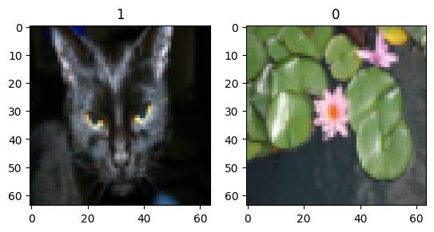
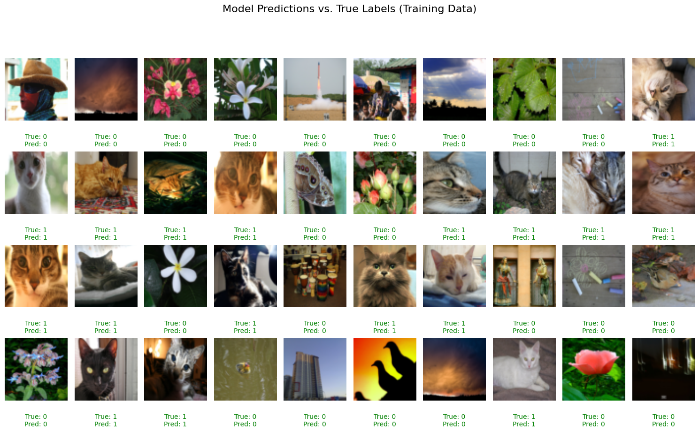
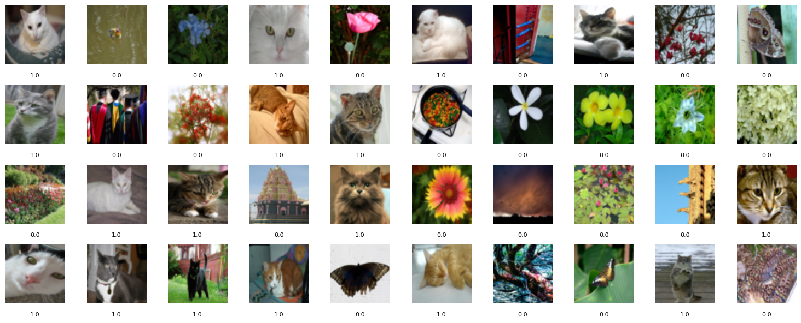
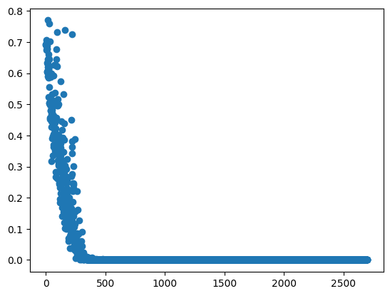

<!-- editorlm-hebrew-html-start -->
<style>
html, body, .vscode-body, .markdown-body, .markdown-preview, #write {
  direction: rtl !important; text-align: right !important;
}
ul, ol { padding-right: 2em !important; padding-left: 0 !important; }
blockquote { border-right: 3px solid #999; border-left: 0; padding-right: 1rem; padding-left: 0; }
@media print {
  html, body, .vscode-body, .markdown-body, .markdown-preview, #write {
    direction: rtl !important; text-align: right !important;
  }
}
</style>
<!-- editorlm-hebrew-html-end -->
<style>
.book { max-width: 900px; margin: auto; line-height: 1.8; font-family: Arial, sans-serif; }
.book .cover { min-height: 680px; box-sizing: border-box; padding: 64px 48px; margin: 24px 0 60px; background: #112b41; color: #f5f8fc; border-top: 9px solid #39c4b5; position: relative; }
.book .cover .eyebrow { color: #81e0d5; font-size: 15px; letter-spacing: 2px; }
.book .cover h1 { color: #fff; font-size: 48px; line-height: 1.3; border: 0; margin: 50px 0 18px; }
.book .cover .subtitle { font-size: 28px; color: #d8e6f0; }
.book .cover .author { font-size: 30px; color: #fff; margin-top: 52px; }
.book .cover .audience { color: #c1d3df; margin-top: 12px; }
.book .cover .motif { direction: ltr; text-align: left; font-family: Consolas, monospace; color: #81e0d5; font-size: 19px; margin-top: 54px; }
.book h1, .book h2, .book h3 { line-height: 1.4; font-weight: 700; }
.book > h1 { font-size: 32px !important; text-align: center !important; margin: 28px 0; }
.book h2 { font-size: 34px !important; text-align: center !important; color: #153b56 !important; background: #eef5fc; border: 0; border-bottom: 4px solid #299c91; border-radius: 10px 10px 0 0; padding: 28px 20px; margin: 24px 0 36px; }
.book h3 { font-size: 24px !important; text-align: right !important; color: #174e49 !important; background: #edf7f5; border: 0; border-right: 5px solid #299c91; border-radius: 6px; padding: 10px 16px; margin: 36px 0 18px; }
.book .chapter { height: 0; margin: 76px 0 0; border-top: 1px solid #ccd7df; break-before: page; page-break-before: always; break-after: avoid; page-break-after: avoid; }
.book .toc { padding: 24px; border-right: 5px solid #39a99d; background: rgba(70,150,155,.09); margin: 24px 0 48px; }
.book pre, .book pre code { direction: ltr !important; text-align: left !important; unicode-bidi: isolate; }
.book pre { box-sizing: border-box !important; width: 100% !important; max-width: 100% !important; margin: 0 !important; padding: 16px 20px; border: 1px solid #ccd7df; border-radius: 8px; line-height: 1.6; overflow-x: auto; }
.book code { direction: ltr; unicode-bidi: isolate; font-family: Consolas, "Courier New", monospace; }
.book pre { background: #f3f6fa !important; color: #1f2937 !important; }
.book pre code, .book pre code.hljs { background: transparent !important; color: #1f2937 !important; }
.book pre .hljs-keyword, .book pre .hljs-literal { color: #6f299c !important; }
.book pre .hljs-string { color: #216338 !important; }
.book pre .hljs-number { color: #075e68 !important; }
.book pre .hljs-comment { color: #526174 !important; }
.book pre .hljs-built_in, .book pre .hljs-title { color: #135b96 !important; }
.book table { width: 100%; }
.book th, .book td { text-align: right; }
.book .small { font-size: .9em; opacity: .8; }
.book .python-intro { display: flex; align-items: center; gap: 28px; padding: 22px 28px; margin: 24px 0; background: #eef5fc; color: #183e63; border-right: 6px solid #3776ab; border-radius: 10px; }
.book .python-intro strong { font-size: 30px; }
.book .python-fact { background: #fff7d6; color: #423611; border-right: 6px solid #ffd343; border-radius: 8px; padding: 18px 24px; margin: 22px 0; }
.book .python-fact strong { font-size: 24px; }
.book img { max-width: 100%; height: auto; }
.book figure { margin: 24px auto; text-align: center; }
.book figure img { display: block; margin: auto; }
.book figcaption { direction: rtl; text-align: center; font-size: .9em; color: #445566; }
@media print { .book > h2 { break-before: page; page-break-before: always; } }
.book .screen-strip { width: 760px; max-width: 100%; height: 220px; overflow: hidden; border: 1px solid #bccad5; border-radius: 8px; margin: 20px auto 8px; direction: ltr; }
.book .screen-strip.output { height: 265px; }
.book .screen-strip img { display: block; width: 1745px; max-width: none; }
.book .screen-menu { width: 400px; max-width: 100%; height: 295px; overflow: hidden; direction: ltr; margin: 20px auto 8px; border: 1px solid #bccad5; border-radius: 8px; }
.book .screen-menu img { display: block; width: 1745px; max-width: none; }
.book .code-panel { box-sizing: border-box !important; display: block !important; width: 50% !important; max-width: 50% !important; margin: 18px auto !important; }
@media print {
  .book .cover { min-height: 85vh; break-after: page; print-color-adjust: exact; -webkit-print-color-adjust: exact; }
  .book pre { white-space: pre-wrap; break-inside: avoid; }
  .book .chapter { margin: 0; border: 0; }
  .book h1, .book h2, .book h3 { break-after: avoid; page-break-after: avoid; break-inside: avoid; }
  .book h2 { margin-top: 0; }
  .book h2, .book h3 { print-color-adjust: exact; -webkit-print-color-adjust: exact; }
}
</style>

<style>
.book .book-nav { display: flex; flex-wrap: wrap; gap: 10px; justify-content: center; align-items: center; padding: 16px 0; margin: 20px 0 32px; border-top: 1px solid #ccd7df; border-bottom: 1px solid #ccd7df; }
.book .book-nav a { display: inline-block; padding: 10px 18px; border-radius: 8px; background: #eef5fc; color: #153b56 !important; border: 1px solid #b5ccd9; text-decoration: none !important; font-size: 16px; font-weight: bold; }
.book .book-nav a.toc-link { background: #174e49; color: #fff !important; border-color: #174e49; }
.book .book-nav a:hover, .book .book-nav a:focus { background: #d4eee8; color: #153b56 !important; outline: 2px solid #299c91; outline-offset: 2px; }
.book .section-list { line-height: 2; }
@media print { .book .book-nav { display: none; } }

/* Explicit Hebrew direction, including prose beginning with English. */
.book p, .book ul, .book ol, .book li,
.book blockquote, .book h1, .book h2, .book h3,
.book h4, .book th, .book td {
  direction: rtl !important;
  text-align: right !important;
  unicode-bidi: isolate;
}
/* Chapter titles keep their agreed centered layout. */
.book h2 { text-align: center !important; }
.book pre, .book pre code, .book .code-panel {
  direction: ltr !important;
  text-align: left !important;
  unicode-bidi: isolate;
}
</style>

<div class="book" dir="rtl" lang="he" style="direction: rtl !important; text-align: right !important;">

<nav class="book-nav" aria-label="ניווט בספר">
<a href="21-%D7%A8%D7%A9%D7%AA%D7%95%D7%AA%20%D7%A7%D7%95%D7%A0%D7%91%D7%95%D7%9C%D7%95%D7%A6%D7%99%D7%94.md">→ הקודם</a>
<a class="toc-link" href="../index.md">תוכן העניינים</a>
<a href="../index.md">הבא ←</a>
</nav>

## ב.22 חתול או לא חתול — CNN לסיווג בינארי


ניישם את רשת הקונבולוציה על תמונות גדולות יותר ועל שאלה בינארית: האם יש חתול בתמונה? שינוי גודל הקלט מחייב לחשב מחדש את הממדים, ושינוי השאלה מחייב לשנות את הפלט וההפסד. עיקר לולאת האימון נשאר מוכר.

**[השיעור וההרצאות באתר של גלעד מרקמן](https://webprogramming.azurewebsites.net/Pages/PyTorch/CNN.aspx)**

[פתיחת מחברת Colab 1](https://colab.research.google.com/drive/1xZoGACtS3LGqwTJl4fUedoVM35GOGY8B?usp=sharing)

**חומרי הליווי:** [11.רשתות קונבולוציה](../../../sources/ML/11.%D7%A8%D7%A9%D7%AA%D7%95%D7%AA%20%D7%A7%D7%95%D7%A0%D7%91%D7%95%D7%9C%D7%95%D7%A6%D7%99%D7%94.pptx) · [11_CNN_CIFAR10](../../../sources/ML/converted/11_CNN_CIFAR10/notebook.md) · [CatNoCat-solved](../../../sources/ML/converted/CatNoCat-solved/notebook.md)

### הכנת סביבת הפרק

<div class="code-panel" dir="ltr">

```python
import torch
from torch import nn
import numpy as np
import matplotlib.pyplot as plt
from torch.utils.data import DataLoader, TensorDataset

device = torch.device(
    "cuda" if torch.cuda.is_available() else "cpu"
)
```

</div>


### דוגמה נוספת מהמחברת: חתול או לא חתול

המחברת CatNoCat-solved משתמשת בתמונות צבע בגודל 64×64 ומחזירה הסתברות בינארית. קובץ הנתונים **cats.pth** נדרש להרצה ואינו חלק מקובצי הנתונים שנמצאו בפרויקט. כאשר מקבלים אותו ממקור מהימן של הקורס, מעלים אותו לסביבת Colab דרך חלונית Files.

הקובץ במחברת מכיל מערכי NumPy של תמונות ותוויות, ולכן שורת הטעינה משתמשת ב־weights_only=False. כפי שנלמד בפרק ב.20, אין להפעיל זאת על קובץ לא מהימן.

<div class="code-panel" dir="ltr">

```python
import numpy as np
from sklearn.model_selection import train_test_split
from torch.utils.data import TensorDataset

data, labels = torch.load(
    "cats.pth", weights_only=False
)
x_train, x_test, y_train, y_test = train_test_split(
    data, labels, train_size=0.8,
    random_state=10, shuffle=True
)

def prepare_images(array):
    tensor = torch.tensor(array, dtype=torch.float32)
    return tensor.permute(0, 3, 1, 2) / 255

x_train = prepare_images(x_train)
x_test = prepare_images(x_test)
y_train = torch.tensor(y_train, dtype=torch.float32)
y_test = torch.tensor(y_test, dtype=torch.float32)
y_train = y_train.reshape(-1, 1)
y_test = y_test.reshape(-1, 1)
```

</div>

<figure>

<!-- editorlm-source-ref: [sources/ML/converted/CatNoCat-solved/notebook.md#L98] -->
<figcaption>שתי תמונות עם התוויות שלהן מתוך הפלט השמור במחברת חתול או לא חתול.</figcaption>
</figure>

המעבר ל־64×64 משנה את ממדי הקלט לשכבה הלינארית: אחרי שתי קונבולוציות ושתי פעולות pooling נשארים 16×13×13 ערכים.

<div class="code-panel" dir="ltr">

```python
class CatNet(nn.Module):
    def __init__(self):
        super().__init__()
        self.conv1 = nn.Conv2d(3, 6, 5)
        self.conv2 = nn.Conv2d(6, 16, 5)
        self.pool = nn.MaxPool2d(2, 2)
        self.fc1 = nn.Linear(16 * 13 * 13, 120)
        self.fc2 = nn.Linear(120, 60)
        self.fc3 = nn.Linear(60, 1)

    def forward(self, x):
        x = self.pool(torch.relu(self.conv1(x)))
        x = self.pool(torch.relu(self.conv2(x)))
        x = torch.flatten(x, 1)
        x = torch.relu(self.fc1(x))
        x = torch.relu(self.fc2(x))
        return torch.sigmoid(self.fc3(x))
```

</div>

יוצרים TensorDataset לכל חלק וטוענים באצוות של 25. האימון במחברת נמשך 300 תקופות, עם BCELoss ו־Adam בקצב 0.001. משתמשים בלולאת האימון של CNN, אך מחליפים את המודל ואת ההפסד בגרסה הבינארית; הבדיקה משתמשת בסף 0.5 במקום argmax.

<figure>

<!-- editorlm-source-ref: [sources/ML/converted/CatNoCat-solved/notebook.md#L700] -->
<figcaption>תחזיות מול תוויות במחברת החתולים. אלה תמונות מקבוצת האימון, כפי שמצוין בכותרת המקורית.</figcaption>
</figure>

אין להסיק מגרף תמונות האימון על ההצלחה בתמונות חדשות. קבוצת הבדיקה במחברת כוללת רק 52 תמונות; הפלט השמור שלה הוא כ־78.85% הצלחה.

<!-- editorlm-source-ref: [sources/ML/11.רשתות קונבולוציה.pptx#L1-L139] -->
<!-- editorlm-source-ref: [sources/ML/converted/11_CNN_CIFAR10/notebook.md#L1-L570] -->
<!-- editorlm-source-ref: [sources/ML/converted/CatNoCat-solved/notebook.md#L1-L700] -->

### להשלים את אימון החתולים והבדיקה

כאן גודל הקלט 64, ולכן רצף הממדים הוא 64→60→30→26→13. לאחר ההשטחה יש ‎16×13×13=2,704 תכונות. הפלט הוא הסתברות אחת: חתול או לא חתול, ולכן BCE וסף החלטה מחליפים את cross entropy ואת argmax של CIFAR-10.

<div class="code-panel" dir="ltr">

```python
train_loader = DataLoader(TensorDataset(x_train, y_train),
                          batch_size=25, shuffle=True)
test_loader = DataLoader(TensorDataset(x_test, y_test),
                         batch_size=25, shuffle=False)
model = CatNet().to(device)
optimizer = torch.optim.Adam(model.parameters(), lr=0.001)
losses = []
for epoch in range(300):
    model.train()
    for images, labels in train_loader:
        images, labels = images.to(device), labels.to(device)
        optimizer.zero_grad()
        loss = nn.functional.binary_cross_entropy(
            model(images), labels
        )
        loss.backward()
        optimizer.step()
        losses.append(loss.item())

model.eval()
correct = total = 0
with torch.no_grad():
    for images, labels in test_loader:
        predictions = model(images.to(device)).cpu() >= 0.5
        correct += (predictions == labels.bool()).sum().item()
        total += len(labels)
print("Accuracy:", correct / total)
```

</div>

בקבוצת הבדיקה הקטנה שבמחברת כל טעות בודדת משנה את אחוז ההצלחה בכ־1.92 נקודות אחוז. הפלט השמור, כ־78.85%, תואם 41 תשובות נכונות מתוך 52. לכן כדאי לבדוק את התמונות שבהן הרשת שגתה, ולהבחין בין ראיה להצלחה על אותן 52 תמונות לבין טענה כללית על כל תמונת חתול.

המחברת מציגה גם עקומת הפסד ותמונות אימון עם תחזיות. ירידה בהפסד ומעט טעויות בתמונות אימון אינן סותרות דיוק נמוך יותר בבדיקה. זאת הזדמנות לחבר את כל מושגי הקורס: צורות טנסורים, נרמול, קיבולת מודל, נגזרות, עדכון והכללה.
<!-- editorlm-source-ref: [sources/ML/converted/CatNoCat/notebook.md#L1-L86] -->


<!-- editorlm-source-ref: [sources/ML/11.רשתות קונבולוציה.pptx#L13-L18] -->
<!-- editorlm-source-ref: [sources/ML/11.רשתות קונבולוציה.pptx#L19-L24] -->

<!-- editorlm-source-ref: [sources/ML/11.רשתות קונבולוציה.pptx#L25-L30] -->

<!-- editorlm-source-ref: [sources/ML/11.רשתות קונבולוציה.pptx#L31-L36] -->
<!-- editorlm-source-ref: [sources/ML/11.רשתות קונבולוציה.pptx#L41-L46] -->
<!-- editorlm-source-ref: [sources/ML/11.רשתות קונבולוציה.pptx#L47-L52] -->
<!-- editorlm-source-ref: [sources/ML/11.רשתות קונבולוציה.pptx#L53-L58] -->
<!-- editorlm-source-ref: [sources/ML/11.רשתות קונבולוציה.pptx#L65-L70] -->

<!-- editorlm-source-ref: [sources/ML/converted/11_CNN_CIFAR10/notebook.md#L333] -->
<!-- editorlm-source-ref: [sources/ML/converted/11_CNN_CIFAR10/notebook.md#L342] -->


<figure>

<figcaption>דוגמאות מקבוצת האימון עם תוויות בינאריות במאגר החתולים.</figcaption>
</figure>
<!-- editorlm-source-ref: [sources/ML/converted/CatNoCat-solved/notebook.md#L203] --><figure>

<figcaption>הפסד האימון השמור במחברת החתולים. ירידה כמעט לאפס אינה מבטיחה דיוק דומה בקבוצת הבדיקה.</figcaption>
</figure>
<!-- editorlm-source-ref: [sources/ML/converted/CatNoCat-solved/notebook.md#L636] -->

<nav class="book-nav" aria-label="ניווט בספר">
<a href="21-%D7%A8%D7%A9%D7%AA%D7%95%D7%AA%20%D7%A7%D7%95%D7%A0%D7%91%D7%95%D7%9C%D7%95%D7%A6%D7%99%D7%94.md">→ הקודם</a>
<a class="toc-link" href="../index.md">תוכן העניינים</a>
<a href="../index.md">הבא ←</a>
</nav>

</div>

<!-- editorlm-source-versions: {"schemaVersion": 1, "sources": {"sources/ML/11.רשתות קונבולוציה.pptx": {"sourceSha256": "6f51f2814a7ef5847417ed4d275f0b3c0f51a604a11fc1093c0bda90e715d35c", "canonicalTextSha256": "332e96822f5417f6be12a8f4a58ffdf575d1cbfe266d78ae07bde492c486f2b2"}, "sources/ML/converted/11_CNN_CIFAR10/notebook.md": {"sourceSha256": "ee47eb73b98c16b4d349cd36fffb38af3e1eac70c937d7cf90de645c83b9c913", "canonicalTextSha256": "ee47eb73b98c16b4d349cd36fffb38af3e1eac70c937d7cf90de645c83b9c913"}, "sources/ML/converted/CatNoCat-solved/notebook.md": {"sourceSha256": "fc74d815a6a19eaedef8cd4166c795650c34d84b5ec243aa6a2864779ec6b8ca", "canonicalTextSha256": "fc74d815a6a19eaedef8cd4166c795650c34d84b5ec243aa6a2864779ec6b8ca"}, "sources/ML/converted/CatNoCat/notebook.md": {"sourceSha256": "1ca990534c601eafb59297563599747b6b0c462a1cb792dd265081a26b81ff90", "canonicalTextSha256": "1ca990534c601eafb59297563599747b6b0c462a1cb792dd265081a26b81ff90"}}} -->
