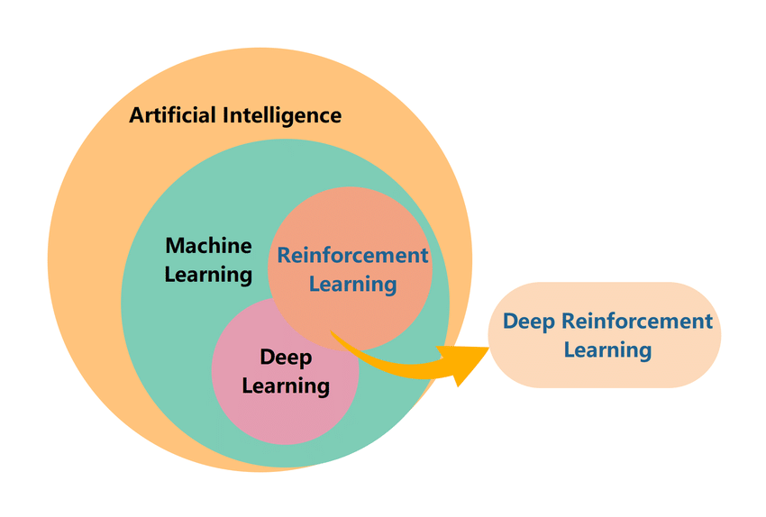
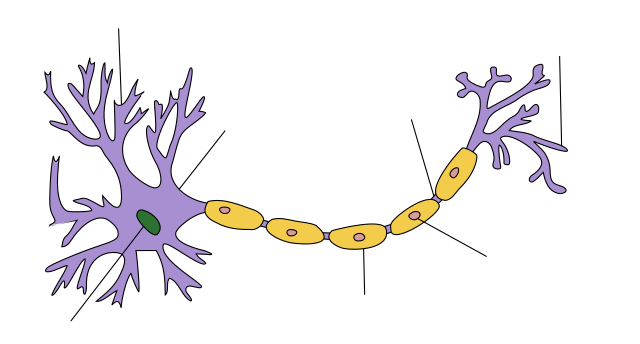
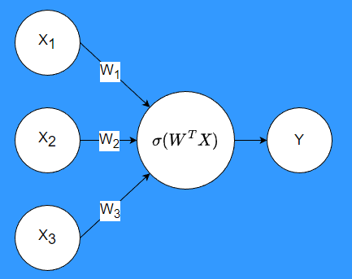
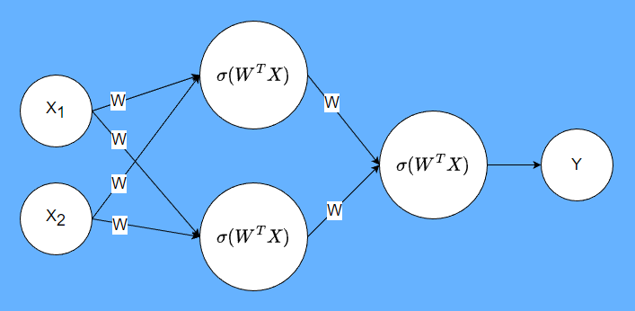
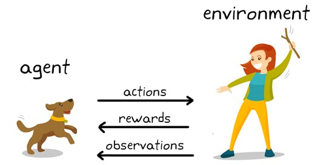

<!-- editorlm-hebrew-html-start -->

<!-- editorlm-hebrew-html-end -->

<nav class="book-nav" aria-label="ניווט בספר">
<a href="../02-pygame/13-%D7%A7%D7%91%D7%95%D7%A6%D7%95%D7%AA%20%D7%A1%D7%A4%D7%A8%D7%99%D7%99%D7%98%D7%99%D7%9D.md">→ הקודם</a>
<a class="toc-link" href="../index.md">תוכן העניינים</a>
<a href="02-%D7%94%D7%AA%D7%A7%D7%A0%D7%AA%20PyTorch.md">הבא ←</a>
</nav>

## ג.1 מהי למידת מכונה?

### מהי בינה מלאכותית?

**בינה מלאכותית — Artificial Intelligence, או AI — היא תחום במדעי המחשב העוסק בפיתוח מערכות המחקות יכולות של אינטליגנציה אנושית.** <!-- editorlm-source-ref: [sources/ML/pdf/1. מבוא והתקנה.pdf#L8-L11] -->

**[השיעור וההרצאות באתר של גלעד מרקמן](https://webprogramming.azurewebsites.net/Pages/PyTorch/Intro.aspx)**

**חומרי הליווי:** [1. מבוא והתקנה](../../../sources/ML/1.%20%D7%9E%D7%91%D7%95%D7%90%20%D7%95%D7%94%D7%AA%D7%A7%D7%A0%D7%94.pptx)

### בינה מלאכותית ולמידת מכונה

למידת מכונה היא תחום בתוך הבינה המלאכותית. נכיר שלושה סוגי למידה:

- **למידה מונחית — Supervised Learning:** לומדים מדוגמאות שהתשובה הרצויה עבורן ידועה.
- **למידה בלתי מונחית — Unsupervised Learning:** מחפשים מבנה בנתונים ללא תשובה נתונה לכל דוגמה.
- **למידת חיזוק — Reinforcement Learning:** לומדים מתוך פעולות והתגמולים שמתקבלים בעקבותיהן.

**למידה עמוקה — Deep Learning** מבוססת על רשתות נוירונים בעלות כמה שכבות חישוב. רשתות כאלה יכולות לשמש בסוגי הלמידה השונים, וגם בלמידת חיזוק. לכן בתרשים יש חפיפה בין למידה עמוקה ללמידת חיזוק; החפיפה נקראת **למידת חיזוק עמוקה**.

<figure>

<figcaption>למידת מכונה בתוך בינה מלאכותית, והחפיפה בין למידה עמוקה ללמידת חיזוק.</figcaption>
</figure>
<!-- editorlm-source-ref: [sources/ML/pdf/1. מבוא והתקנה.pdf#L14-L21] -->

### מהו נוירון בביולוגיה?

המוח בנוי מתאי עצב הנקראים **נוירונים**. התאים מחוברים זה לזה ומעבירים מידע באמצעות הקשרים ביניהם. המבנה הזה נתן השראה לרעיון של רשת נוירונים במחשב: יחידות רבות המחוברות זו לזו.

רשת נוירונים מלאכותית היא מודל מתמטי; היא אינה העתק של המוח. ההשראה הביולוגית עוזרת להבין את רעיון החיבורים, אך את החישוב עצמו נתאר באמצעות מספרים ופונקציות.

<figure>

<figcaption>נוירון ביולוגי: תא עצב בעל הסתעפויות וקשרים לתאים אחרים.</figcaption>
</figure>
<!-- editorlm-source-ref: [sources/ML/pdf/1. מבוא והתקנה.pdf#L24-L29] -->

### מהו נוירון ברשת נוירונים מלאכותית?

**נוירון מלאכותי הוא פונקציה המקבלת מספרים כקלט, מבצעת חישוב ומחזירה מספר כפלט.** נסמן את הקלטים באות X, את המשקלים באות W ואת הפלט באות Y. לכל קלט מוצמד משקל, הקובע כיצד הוא משתתף בחישוב.

החישוב מורכב משני שלבים:

1. **סכום משוקלל:** מכפילים כל קלט במשקל שלו ומחברים את המכפלות. בשלושה קלטים נקבל X₁W₁ + X₂W₂ + X₃W₃. הכתיב המקוצר של הסכום הוא WᵀX.
2. **הפעלת פונקציית אקטיבציה:** מפעילים על הסכום פונקציה לא לינארית המסומנת באות היוונית σ. הפלט הוא Y = σ(WᵀX). בשלב זה די להכיר את מקומה בחישוב; את צורת הפונקציה נלמד בהמשך.

<figure>

<figcaption>שלושה קלטים, שלושה משקלים ופונקציית אקטיבציה המפיקה את הפלט Y.</figcaption>
</figure>
<!-- editorlm-source-ref: [sources/ML/pdf/1. מבוא והתקנה.pdf#L32-L39] -->

### מהי רשת נוירונים?

ברשת נוירונים מחברים כמה נוירונים מלאכותיים: הפלטים של נוירונים משמשים כקלטים לנוירונים הבאים. כך מתקבלת פונקציה המורכבת מחישובים קטנים, והתוצאה שלה תלויה ב**משקלים (W)** שבחיבורים. הפלט הסופי יכול להיות מספר אחד או כמה מספרים.

בתרשים נראים שלושה חלקים:

- **שכבת קלט — Input:** הערכים המוזנים לרשת.
- **שכבה חבויה — Hidden:** נוירונים המבצעים חישובי ביניים.
- **שכבת פלט — Output:** הנוירונים המפיקים את תוצאת הרשת.

לדוגמה, בתרשים שלפנינו שני קלטים מזינים שני נוירונים. כל אחד מהם מחשב סכום משוקלל ומפעיל עליו אקטיבציה. שני הפלטים שלהם נכנסים לנוירון נוסף, שמפיק את התוצאה הסופית Y.

<figure>

<figcaption>שני קלטים מזינים שני נוירוני ביניים, המחוברים לנוירון המפיק את Y.</figcaption>
</figure>
<!-- editorlm-source-ref: [sources/ML/pdf/1. מבוא והתקנה.pdf#L42-L47] -->

כעת יש לנו רשת שיודעת לבצע חישוב. אבל אילו **משקלים (W)** יגרמו לה להחזיר תשובה מועילה? **אימון הוא התהליך שבו משנים את המשקלים (W) בעזרת דוגמאות.**

באימון המונחה המתואר כאן, לכל קלט ידועה גם התשובה הרצויה. מזינים את הקלט לרשת, משווים את הפלט לתשובה הרצויה ומשנים את המשקלים (W) כדי לשפר את התוצאה. המבנה שהכרנו נשאר דרך החישוב; המספרים שבמשקלים (W) הם שמתעדכנים. <!-- editorlm-source-ref: [sources/ML/pdf/1. מבוא והתקנה.pdf#L50-L53] -->

לדוגמה, נרצה לבנות רשת המקבלת תמונה ומחליטה אם מופיע בה חתול. **הקלט** הוא ערכי הפיקסלים של התמונה, ו**התשובה הרצויה** היא ״חתול״ או ״לא חתול״.

נאסוף תמונות משני הסוגים, כאשר התשובה לכל תמונה ידועה לנו. נתחיל במשקלים אקראיים, נזין תמונות לרשת ונעדכן את המשקלים לפי התשובות הרצויות. לאורך האימון ננסה להביא את הרשת למצב שבו היא מזהה נכון את התמונות שבאוסף. <!-- editorlm-source-ref: [sources/ML/pdf/1. מבוא והתקנה.pdf#L56-L61] -->

אנו רוצים שהרשת תזהה חתול גם בתמונה **חדשה**, שלא שימשה לאימון. היכולת להשתמש במה שנלמד מדוגמאות קודמות כדי לענות על קלט חדש נקראת **הכללה**; הצלחה בתמונות האימון לבדה אינה מבטיחה אותה. <!-- editorlm-source-ref: [sources/ML/pdf/1. מבוא והתקנה.pdf#L59-L60] --> <!-- editorlm-source-ref: [sources/ML/pdf/1. מבוא והתקנה.pdf#L64-L67] -->

### רשת נוירונים במשחקים

במשחק נרצה להעריך עד כמה מצב מסוים טוב עבור השחקן. נשתמש בשלושה מושגים: **מצב — State**, **פעולה — Action** ו**ערך — Value**. פעולה משנה את מצב המשחק, והרשת יכולה לעזור להעריך את המצב שאליו נגיע.

אם נוכל להעריך היטב את המצבים שאליהם מובילות הפעולות האפשריות, נוכל להיעזר בערכים האלה בבחירת פעולה. בלמידת חיזוק אפשר לאמן את הרשת מתוך ניסיון המשחק עצמו: צעדים שבוצעו מספקים דוגמאות ללמידה.

הגורם שבוחר את הפעולה נקרא **סוכן — Agent**. הוא פועל בתוך **סביבה — Environment**, ומקבל ממנה תצפיות ותגמולים. כך מתחברים הרעיון של רשת לומדת והמטרה של בניית שחקן במשחק. <!-- editorlm-source-ref: [sources/ML/pdf/1. מבוא והתקנה.pdf#L70-L74] -->

<figure>

<figcaption>הסוכן (Agent) מבצע פעולות (Actions), ומקבל מהסביבה (Environment) תגמולים (Rewards) ותצפיות (Observations).</figcaption>
</figure>
<!-- editorlm-source-ref: [sources/ML/pdf/1. מבוא והתקנה.pdf#L74] -->

### ספריית PyTorch

כדי לממש את הרעיונות האלה נשתמש ב־**PyTorch**, ספריית קוד פתוח ללמידת מכונה עם ממשק בשפת Python. היא מספקת רכיבים לבניית רשתות נוירונים וכלים לחישובים על מערכים הנקראים **טנסורים — Tensors**. היא מאפשרת גם חישובים באמצעות מעבד גרפי, GPU. <!-- editorlm-source-ref: [sources/ML/pdf/1. מבוא והתקנה.pdf#L77-L81] -->

בפרק הבא נכין את PyTorch לעבודה ב־Colab, ולאחר מכן נכיר את הטנסורים שעליהם יתבססו החישובים.

<nav class="book-nav" aria-label="ניווט בספר">
<a href="../02-pygame/13-%D7%A7%D7%91%D7%95%D7%A6%D7%95%D7%AA%20%D7%A1%D7%A4%D7%A8%D7%99%D7%99%D7%98%D7%99%D7%9D.md">→ הקודם</a>
<a class="toc-link" href="../index.md">תוכן העניינים</a>
<a href="02-%D7%94%D7%AA%D7%A7%D7%A0%D7%AA%20PyTorch.md">הבא ←</a>
</nav>

<!-- editorlm-source-versions: {"schemaVersion": 1, "sources": {"sources/ML/pdf/1. מבוא והתקנה.pdf": {"sourceSha256": "b7cfe85f512e67a3d3b3909dddeed6220a74d727df3bf44c6df80d4dfae14b87", "canonicalTextSha256": "6ee69632c6973871916d0a1527dcaa4d415571fccd7f07e8231071040efcaad2"}}} -->
