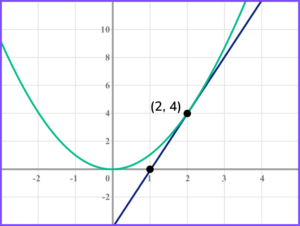
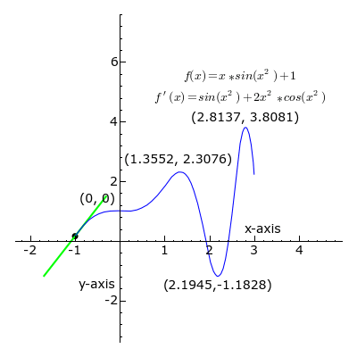
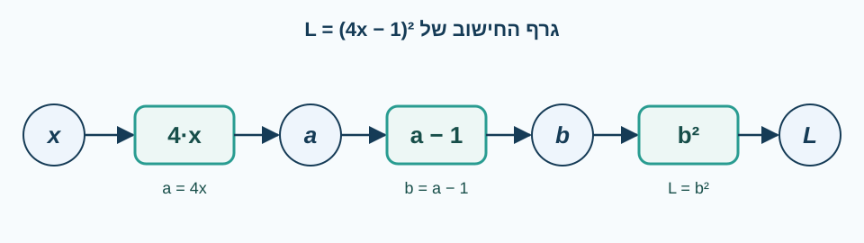
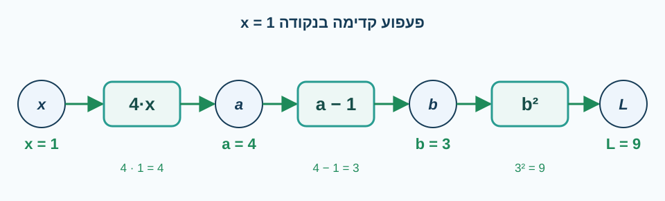
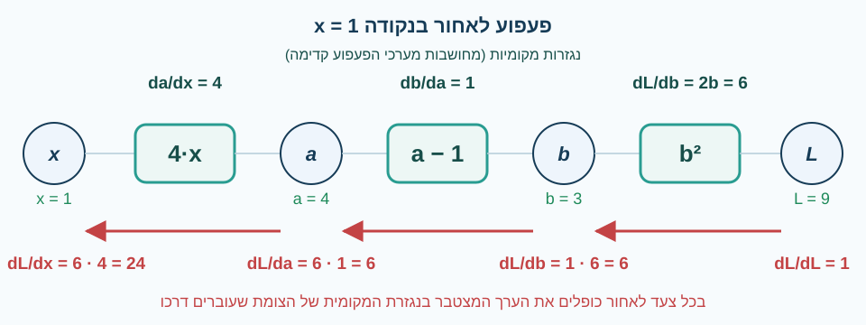
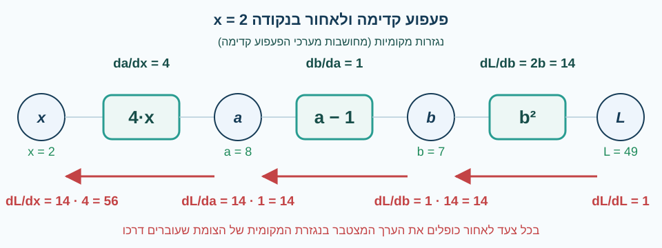

<!-- editorlm-hebrew-html-start -->
<style>
html, body, .vscode-body, .markdown-body, .markdown-preview, #write {
  direction: rtl !important; text-align: right !important;
}
ul, ol { padding-right: 2em !important; padding-left: 0 !important; }
blockquote { border-right: 3px solid #999; border-left: 0; padding-right: 1rem; padding-left: 0; }
@media print {
  html, body, .vscode-body, .markdown-body, .markdown-preview, #write {
    direction: rtl !important; text-align: right !important;
  }
}
</style>
<!-- editorlm-hebrew-html-end -->
<style>
.book { max-width: 900px; margin: auto; line-height: 1.8; font-family: Arial, sans-serif; }
.book .cover { min-height: 680px; box-sizing: border-box; padding: 64px 48px; margin: 24px 0 60px; background: #112b41; color: #f5f8fc; border-top: 9px solid #39c4b5; position: relative; }
.book .cover .eyebrow { color: #81e0d5; font-size: 15px; letter-spacing: 2px; }
.book .cover h1 { color: #fff; font-size: 48px; line-height: 1.3; border: 0; margin: 50px 0 18px; }
.book .cover .subtitle { font-size: 28px; color: #d8e6f0; }
.book .cover .author { font-size: 30px; color: #fff; margin-top: 52px; }
.book .cover .audience { color: #c1d3df; margin-top: 12px; }
.book .cover .motif { direction: ltr; text-align: left; font-family: Consolas, monospace; color: #81e0d5; font-size: 19px; margin-top: 54px; }
.book h1, .book h2, .book h3 { line-height: 1.4; font-weight: 700; }
.book > h1 { font-size: 32px !important; text-align: center !important; margin: 28px 0; }
.book h2 { font-size: 34px !important; text-align: center !important; color: #153b56 !important; background: #eef5fc; border: 0; border-bottom: 4px solid #299c91; border-radius: 10px 10px 0 0; padding: 28px 20px; margin: 24px 0 36px; }
.book h3 { font-size: 24px !important; text-align: right !important; color: #174e49 !important; background: #edf7f5; border: 0; border-right: 5px solid #299c91; border-radius: 6px; padding: 10px 16px; margin: 36px 0 18px; }
.book .chapter { height: 0; margin: 76px 0 0; border-top: 1px solid #ccd7df; break-before: page; page-break-before: always; break-after: avoid; page-break-after: avoid; }
.book .toc { padding: 24px; border-right: 5px solid #39a99d; background: rgba(70,150,155,.09); margin: 24px 0 48px; }
.book pre, .book pre code { direction: ltr !important; text-align: left !important; unicode-bidi: isolate; }
.book pre { box-sizing: border-box !important; width: 100% !important; max-width: 100% !important; margin: 0 !important; padding: 16px 20px; border: 1px solid #ccd7df; border-radius: 8px; line-height: 1.6; overflow-x: auto; }
.book code { direction: ltr; unicode-bidi: isolate; font-family: Consolas, "Courier New", monospace; }
.book pre { background: #f3f6fa !important; color: #1f2937 !important; }
.book pre code, .book pre code.hljs { background: transparent !important; color: #1f2937 !important; }
.book pre .hljs-keyword, .book pre .hljs-literal { color: #6f299c !important; }
.book pre .hljs-string { color: #216338 !important; }
.book pre .hljs-number { color: #075e68 !important; }
.book pre .hljs-comment { color: #526174 !important; }
.book pre .hljs-built_in, .book pre .hljs-title { color: #135b96 !important; }
.book table { width: 75%; max-width: 75%; margin: 18px auto; }
.book th, .book td { text-align: right; }
.book .small { font-size: .9em; opacity: .8; }
.book .python-intro { display: flex; align-items: center; gap: 28px; padding: 22px 28px; margin: 24px 0; background: #eef5fc; color: #183e63; border-right: 6px solid #3776ab; border-radius: 10px; }
.book .python-intro strong { font-size: 30px; }
.book .python-fact { background: #fff7d6; color: #423611; border-right: 6px solid #ffd343; border-radius: 8px; padding: 18px 24px; margin: 22px 0; }
.book .python-fact strong { font-size: 24px; }
.book img { max-width: 100%; height: auto; }
.book figure { margin: 24px auto; text-align: center; }
.book figure img { display: block; margin: auto; }
.book figcaption { direction: rtl; text-align: center; font-size: .9em; color: #445566; }
@media print { .book > h2 { break-before: page; page-break-before: always; } }
.book .screen-strip { width: 760px; max-width: 100%; height: 220px; overflow: hidden; border: 1px solid #bccad5; border-radius: 8px; margin: 20px auto 8px; direction: ltr; }
.book .screen-strip.output { height: 265px; }
.book .screen-strip img { display: block; width: 1745px; max-width: none; }
.book .screen-menu { width: 400px; max-width: 100%; height: 295px; overflow: hidden; direction: ltr; margin: 20px auto 8px; border: 1px solid #bccad5; border-radius: 8px; }
.book .screen-menu img { display: block; width: 1745px; max-width: none; }
.book .code-panel { box-sizing: border-box !important; display: block !important; width: 75% !important; max-width: 75% !important; margin: 18px auto !important; }
@media print {
  .book .cover { min-height: 85vh; break-after: page; print-color-adjust: exact; -webkit-print-color-adjust: exact; }
  .book pre { white-space: pre-wrap; break-inside: avoid; }
  .book .chapter { margin: 0; border: 0; }
  .book h1, .book h2, .book h3 { break-after: avoid; page-break-after: avoid; break-inside: avoid; }
  .book h2 { margin-top: 0; }
  .book h2, .book h3 { print-color-adjust: exact; -webkit-print-color-adjust: exact; }
}
</style>

<style>
.book .book-nav { display: flex; flex-wrap: wrap; gap: 10px; justify-content: center; align-items: center; padding: 16px 0; margin: 20px 0 32px; border-top: 1px solid #ccd7df; border-bottom: 1px solid #ccd7df; }
.book .book-nav a { display: inline-block; padding: 10px 18px; border-radius: 8px; background: #eef5fc; color: #153b56 !important; border: 1px solid #b5ccd9; text-decoration: none !important; font-size: 16px; font-weight: bold; }
.book .book-nav a.toc-link { background: #174e49; color: #fff !important; border-color: #174e49; }
.book .book-nav a:hover, .book .book-nav a:focus { background: #d4eee8; color: #153b56 !important; outline: 2px solid #299c91; outline-offset: 2px; }
.book .section-list { line-height: 2; }
@media print { .book .book-nav { display: none; } }

/* Explicit Hebrew direction, including prose beginning with English. */
.book p, .book ul, .book ol, .book li,
.book blockquote, .book h1, .book h2, .book h3,
.book h4, .book th, .book td {
  direction: rtl !important;
  text-align: right !important;
  unicode-bidi: isolate;
}
/* Chapter titles keep their agreed centered layout. */
.book h2 { text-align: center !important; }
.book pre, .book pre code, .book .code-panel {
  direction: ltr !important;
  text-align: left !important;
  unicode-bidi: isolate;
}
/* Display math renders left-to-right and centered, independent of the RTL page. */
.book .math-panel, .book .math-panel .katex-display, .book .math-panel .katex {
  direction: ltr !important;
  text-align: center !important;
  unicode-bidi: isolate;
}
</style>

<div class="book" dir="rtl" lang="he" style="direction: rtl !important; text-align: right !important;">

<nav class="book-nav" aria-label="ניווט בספר">
<a href="03-%D7%98%D7%A0%D7%A1%D7%95%D7%A8%D7%99%D7%9D.md">→ הקודם</a>
<a class="toc-link" href="../index.md">תוכן העניינים</a>
<a href="05-Gradient%20Descent%20%D7%91%D7%9E%D7%A9%D7%AA%D7%A0%D7%94%20%D7%90%D7%97%D7%93.md">הבא ←</a>
</nav>

## ג.4 נגזרות ו־Autograd

בפרק המבוא ראינו שאימון רשת פירושו לשנות את המשקלים כדי להקטין את הטעות, ונשארנו עם שאלה פתוחה: לאיזה כיוון לשנות כל משקל? נדמיין שאנו מסובבים כפתור ומודדים את הטעות. אם סיבוב קטן ימינה מגדיל את הטעות, כדאי לסובב שמאלה; אם הוא מקטין אותה, כדאי להמשיך ימינה. מה שאנו צריכים הוא מדד לכך: כמה הטעות משתנה כשמשנים מעט את המשקל. במתמטיקה למדד הזה קוראים נגזרת.

הנגזרת מתארת כיצד ערך הפונקציה משתנה בסביבת נקודה, ולכן יכולה להנחות אותנו בחיפוש מינימום. אם נדע לחשב את נגזרת הטעות לפי כל משקל, נדע לאיזה כיוון להזיז כל אחד מהם, וזה בדיוק מה שנעשה בפרקים הבאים כשנרד בצעדים קטנים אל המינימום של פונקציית הטעות. ברשת אמיתית יש אלפי משקלים ואלפי נגזרות לחשב, ולכן איננו רוצים לגזור ביד; PyTorch עושה זאת בשבילנו במנגנון הנקרא **Autograd**.

הפרק בנוי בשני חלקים. תחילה נרענן את המתמטיקה: נלמד כללי גזירה, נגזרות חלקיות וכלל השרשרת, ונבין כיצד פירוק חישוב לצעדים קטנים מאפשר לגזור פונקציה מורכבת. לאחר מכן נראה כיצד PyTorch מחשבת נגזרות באמצעות גרף חישוב, ונלמד את כללי השימוש במנגנון: איך מפעילים אותו, איך קוראים את התוצאה, ומתי צריך לכבות אותו או לאפס אותו.
<!-- editorlm-source-ref: [sources/ML/pdf/3. PyTorch Autograd.pdf#L8-L14] -->

**[השיעור וההרצאות באתר של גלעד מרקמן](https://webprogramming.azurewebsites.net/Pages/PyTorch/Autograd.aspx)**

**חומרי הליווי:** [3. PyTorch Autograd](../../../sources/ML/3.%20PyTorch%20Autograd.pptx) · [מחברת Autograd](../../../sources/ML/Colab/3_Torch_autograd.ipynb)

### מהי נגזרת?

נתחיל בפונקציה של משתנה אחד, כמו אלה שמכירים מבית הספר, ונבין מה הנגזרת אומרת לנו על הגרף. הנגזרת בנקודה מתארת את **שיפוע הישר המשיק לגרף** באותה נקודה. נגזרת חיובית מצביעה על עלייה, ונגזרת שלילית על ירידה, וככל שהערך המוחלט שלה גדול יותר, הגרף תלול יותר. בנקודת מינימום או מקסימום פנימית שבה הפונקציה גזירה, הנגזרת מתאפסת; נגזרת אפס לבדה אינה מבטיחה מינימום. שלוש העובדות האלה — סימן הנגזרת, גודלה והתאפסותה בנקודת קיצון — הן כל מה שנצטרך כדי לחפש מינימום בפרק הבא.

<figure>

<figcaption>שיפוע הישר המשיק לגרף בנקודה הוא הנגזרת באותה נקודה.</figcaption>
</figure>
<!-- editorlm-source-ref: [sources/ML/pdf/3. PyTorch Autograd.pdf#L17-L22] -->

### השתנות הנגזרת בהתאם לשיפוע הגרף

חשוב להבין שהנגזרת אינה מספר אחד לפונקציה כולה, אלא פונקציה בפני עצמה. השיפוע משתנה לאורך הגרף, ולכן גם ערך הנגזרת משתנה. למשל, עבור הפונקציה <span dir="ltr">f(x) = x·sin(x²) + 1</span> מוצגת הנגזרת <span dir="ltr">f′(x) = sin(x²) + 2x²·cos(x²)</span>. בכל נקודה ערכה קובע את שיפוע המשיק שם. לכן כשנחפש מינימום נצטרך לחשב את הנגזרת מחדש בכל נקודה שאליה נגיע.
<!-- editorlm-source-ref: [sources/ML/pdf/3. PyTorch Autograd.pdf#L26-L30] -->

<figure>

<figcaption>המשיק נע לאורך הגרף. בעלייה הוא ירוק והנגזרת חיובית, בירידה הוא אדום והנגזרת שלילית, ובנקודות הקיצון הוא אופקי והנגזרת מתאפסת.</figcaption>
</figure>

עקבו אחרי המשיק באנימציה: כל עוד הגרף עולה המשיק ירוק ושיפועו חיובי; בנקודת המקסימום (1.3552, 2.3076) הוא מתיישר והנגזרת מתאפסת; בירידה אל נקודת המינימום (2.1945, −1.1828) הוא אדום ושיפועו שלילי, ואחרי המינימום הוא שוב ירוק. זו בדיוק התמונה שתנחה אותנו בפרק הבא: סימן הנגזרת אומר לאן ללכת, והתאפסותה אומרת שהגענו לנקודת קיצון.

### חישוב נגזרת

איך מוצאים את הנגזרת? אין צורך לחשב שיפועים של משיקים בעין. כללי גזירה מאפשרים לקבל נוסחה לנגזרת מתוך נוסחת הפונקציה. נסתפק כאן בכללים הבסיסיים, שמספיקים לפולינומים; אלה גם הכללים ש־Autograd מפעיל מאחורי הקלעים.

נסמן את הנגזרת של <span dir="ltr">f(x)</span> ב־<span dir="ltr">f′(x)</span>. נשתמש בכללים הבאים:

| פונקציה | נגזרת |
|---|---|
| קבוע, למשל <span dir="ltr">f(x)=5</span> | <span dir="ltr">f′(x)=0</span> |
| <span dir="ltr">f(x)=x</span> | <span dir="ltr">f′(x)=1</span> |
| כפל בקבוע: <span dir="ltr">f(x)=k·g(x)</span> | <span dir="ltr">f′(x)=k·g′(x)</span> |
| סכום: <span dir="ltr">f(x)=g(x)+h(x)</span> | <span dir="ltr">f′(x)=g′(x)+h′(x)</span> |
| חזקה: <span dir="ltr">f(x)=xⁿ</span> | <span dir="ltr">f′(x)=n·xⁿ⁻¹</span> |

לדוגמה, הנגזרת של <span dir="ltr">x⁵</span> היא <span dir="ltr">5x⁴</span>. בשילוב הכללים אפשר לגזור כל פולינום איבר־איבר: גוזרים כל חזקה בנפרד, כופלים במקדם ומחברים.
<!-- editorlm-source-ref: [sources/ML/pdf/3. PyTorch Autograd.pdf#L35-L43] -->

### נגזרת חלקית

עד כאן גזרנו פונקציות של משתנה אחד, כמו בבית הספר. אבל הטעות של רשת נוירונים אינה תלויה במשקל אחד אלא בכל המשקלים יחד, ולכן היא פונקציה של משתנים רבים: <span dir="ltr">loss(w₁, w₂, …, wₙ)</span>. כדי להקטין את הטעות נצטרך לדעת, לכל משקל בנפרד, האם להגדיל אותו או להקטין אותו. לשם כך משתמשים ב**נגזרת חלקית**. זהו נושא שלא נלמד בשיעורי המתמטיקה בתיכון, אך הרעיון פשוט, ונסביר אותו מהתחלה.

#### הרעיון: מסובבים כפתור אחד בלבד

דמיינו מכשיר עם שני כפתורים, x ו־y, שמציג מספר אחד, <span dir="ltr">f(x, y)</span>. איך נדע מה כל כפתור עושה? מחזיקים את y במקומו ומסובבים רק את x: קצב השינוי של המספר הוא הנגזרת החלקית לפי x. אחר כך מחזיקים את x ומסובבים רק את y. **בנגזרת חלקית לפי משתנה אחד מתייחסים לכל שאר המשתנים כאל מספרים קבועים**, ואז גוזרים בדיוק לפי הכללים שכבר למדנו.

גם התמונה הגרפית עוזרת: הגרף של פונקציה בשני משתנים הוא משטח, כמו גבעה. בנקודה על הגבעה אפשר לשאול מה השיפוע כשהולכים בכיוון x, ומה השיפוע כשהולכים בכיוון y. אלה שני מספרים שונים, ואלה שתי הנגזרות החלקיות.

#### סימון

לנגזרת של פונקציה במשתנה אחד כתבנו <span dir="ltr">f′(x)</span>. כתיב נפוץ אחר, שנפגוש בספרים ובתיעוד של PyTorch, הוא שבר:

<div class="math-panel" dir="ltr">

$$
f'(x) = \frac{df}{dx}
$$

</div>

בנגזרת חלקית כותבים באותו אופן, ומציינים במכנה לפי איזה משתנה גוזרים:

<div class="math-panel" dir="ltr">

$$
\frac{df}{dx} \qquad \frac{df}{dy}
$$

</div>

בספרי מתמטיקה ובתיעוד של PyTorch תפגשו בנגזרת חלקית גם את האות המעוגלת ∂ במקום d, למשל <span dir="ltr">∂f/∂x</span>. האות נקראת דֶל, והמשמעות זהה לגמרי: נגזרת לפי x כשהמשתנים האחרים קבועים. בספר זה נמשיך לכתוב d, שמוכר לכם מנגזרת רגילה.

#### דוגמה ראשונה

ניקח את הפונקציה:

<div class="math-panel" dir="ltr">

$$
f(x, y) = x^2 + y^2
$$

</div>

**גזירה לפי x.** מתייחסים ל־y כאל מספר קבוע. אילו y היה 5, הפונקציה הייתה <span dir="ltr">x² + 25</span>, ונגזרתה <span dir="ltr">2x</span>: הנגזרת של <span dir="ltr">x²</span> היא <span dir="ltr">2x</span>, והנגזרת של הקבוע היא 0. אותו דבר קורה לכל y, ולכן:

<div class="math-panel" dir="ltr">

$$
\frac{df}{dx} = 2x
$$

</div>

**גזירה לפי y.** עכשיו x הוא הקבוע: האיבר <span dir="ltr">x²</span> נגזר לאפס, והאיבר <span dir="ltr">y²</span> נגזר ל־<span dir="ltr">2y</span>:

<div class="math-panel" dir="ltr">

$$
\frac{df}{dy} = 2y
$$

</div>

בנקודה <span dir="ltr">(x, y) = (1, 2)</span> נקבל <span dir="ltr">df/dx = 2</span> ו־<span dir="ltr">df/dy = 4</span>. המשמעות: בנקודה זו הגדלה קטנה של x מגדילה את f בקצב 2, והגדלה קטנה של y מגדילה את f בקצב 4. הפונקציה רגישה יותר ל־y מאשר ל־x.

#### דוגמה שנייה: איבר שבו שני המשתנים מוכפלים

<div class="math-panel" dir="ltr">

$$
f(x, y) = 3x^2 + 2y^3 + 4xy
$$

</div>

**גזירה לפי x**, איבר אחר איבר, כש־y קבוע:

- <span dir="ltr">3x²</span> נגזר ל־<span dir="ltr">6x</span>.
- <span dir="ltr">2y³</span> אינו מכיל x, ולכן הוא קבוע ונגזרתו 0.
- <span dir="ltr">4xy</span> הוא x כפול המספר הקבוע <span dir="ltr">4y</span>. כמו שהנגזרת של <span dir="ltr">20x</span> היא 20, הנגזרת של <span dir="ltr">4y·x</span> היא <span dir="ltr">4y</span>.

<div class="math-panel" dir="ltr">

$$
\frac{df}{dx} = 6x + 0 + 4y = 6x + 4y
$$

</div>

**גזירה לפי y**, כש־x קבוע:

- <span dir="ltr">3x²</span> קבוע, נגזרתו 0.
- <span dir="ltr">2y³</span> נגזר ל־<span dir="ltr">6y²</span>.
- <span dir="ltr">4xy</span> הוא y כפול הקבוע <span dir="ltr">4x</span>, ולכן נגזרתו <span dir="ltr">4x</span>.

<div class="math-panel" dir="ltr">

$$
\frac{df}{dy} = 0 + 6y^2 + 4x = 6y^2 + 4x
$$

</div>

נציב את הנקודה <span dir="ltr">(1, 2)</span>:

<div class="math-panel" dir="ltr">

$$
\frac{df}{dx} = 6 \cdot 1 + 4 \cdot 2 = 14
\qquad
\frac{df}{dy} = 6 \cdot 2^2 + 4 \cdot 1 = 28
$$

</div>

#### הגרדיאנט

אוסף הנגזרות החלקיות של פונקציה, אחת לכל משתנה, נקרא **גרדיאנט — Gradient** ומסומן <span dir="ltr">∇f</span>. בדוגמה השנייה, בנקודה <span dir="ltr">(1, 2)</span>:

<div class="math-panel" dir="ltr">

$$
\nabla f = \left( \frac{df}{dx},\ \frac{df}{dy} \right) = (14,\ 28)
$$

</div>

הגרדיאנט אומר לנו, לכל משתנה, כמה הפונקציה גדלה כשמזיזים אותו מעט, ולכן גם לאיזה כיוון ללכת כדי להקטין אותה: הפוך לסימן של כל רכיב. ברשת נוירונים המשתנים הם המשקלים, ולכל משקל יש רכיב משלו בגרדיאנט. זהו המונח שממנו נגזר שמו של Autograd, ושל אלגוריתם Gradient Descent שנלמד בפרק הבא.

<!-- editorlm-source-ref: [sources/ML/pdf/3. PyTorch Autograd.pdf#L57-L63] -->
<!-- editorlm-source-ref: [sources/ML/pdf/3. PyTorch Autograd.pdf#L67-L73] -->

### כלל השרשרת

רשת נוירונים היא פונקציה מורכבת: הפלט של שכבה אחת נכנס לשכבה הבאה, וזו שוב לבאה אחריה, ובסוף מחשבים מהכול את הטעות. כדי לגזור שרשרת כזו של פונקציות צריך כלל אחד נוסף, והוא הבסיס לכל מנגנון Autograd.

#### פונקציה מורכבת

ניקח את הפונקציה:

<div class="math-panel" dir="ltr">

$$
y = (2x + 1)^2
$$

</div>

כללי הגזירה שלמדנו מטפלים ב־<span dir="ltr">x²</span>, אבל כאן בריבוע נמצא לא x אלא ביטוי שלם, <span dir="ltr">2x + 1</span>. זו **פונקציה מורכבת**: קודם מחשבים מ־x את הביטוי הפנימי, ואחר כך מפעילים על התוצאה את הפונקציה החיצונית. נפריד בין שני השלבים ונסמן את התוצאה הפנימית באות v:

<div class="math-panel" dir="ltr">

$$
v = 2x + 1 \qquad y = v^2
$$

</div>

x קובע את v, ו־v קובע את y. כאשר x משתנה, v משתנה, ובעקבותיו גם y. השאלה היא באיזה קצב y משתנה ביחס ל־x, כלומר מהי <span dir="ltr">dy/dx</span>.

#### הכלל

כל אחד משני השלבים קל לגזור בנפרד. הקצב שבו v משתנה ביחס ל־x הוא <span dir="ltr">dv/dx</span>, והקצב שבו y משתנה ביחס ל־v הוא <span dir="ltr">dy/dv</span>. כלל השרשרת אומר שהקצב הכולל הוא **מכפלת** שני הקצבים:

<div class="math-panel" dir="ltr">

$$
\frac{dy}{dx} = \frac{dy}{dv} \cdot \frac{dv}{dx}
$$

</div>

ההיגיון: אם v גדל פי 2 מהר יותר מ־x, ו־y גדל פי 3 מהר יותר מ־v, אז y גדל פי <span dir="ltr">3 · 2 = 6</span> מהר יותר מ־x. הקצבים מצטברים בכפל לאורך השרשרת. הכתיב בשברים עוזר לזכור את הכלל: נדמה כאילו <span dir="ltr">dv</span> במונה ו־<span dir="ltr">dv</span> במכנה מצטמצמים ונשאר <span dir="ltr">dy/dx</span>. זו דרך לזכור, לא הוכחה, אבל היא עובדת תמיד.

#### דוגמה ראשונה

נחזור ל־<span dir="ltr">y = (2x + 1)²</span> ונגזור כל שלב:

<div class="math-panel" dir="ltr">

$$
\frac{dv}{dx} = 2 \qquad \frac{dy}{dv} = 2v
$$

</div>

נכפול, ונציב חזרה <span dir="ltr">v = 2x + 1</span> כדי לקבל תשובה במונחי x בלבד:

<div class="math-panel" dir="ltr">

$$
\frac{dy}{dx} = \frac{dy}{dv} \cdot \frac{dv}{dx} = 2v \cdot 2 = 4v = 4(2x + 1) = 8x + 4
$$

</div>

כאן אפשר לבדוק שהכלל נכון בלי להאמין לו: נפתח את הסוגריים, <span dir="ltr">(2x + 1)² = 4x² + 4x + 1</span>, ונגזור איבר־איבר לפי הכללים הרגילים. מתקבל <span dir="ltr">8x + 4</span>, בדיוק אותה תשובה.

#### דוגמה שנייה

כשהחזקה גבוהה, פתיחת סוגריים כבר אינה מעשית, וכלל השרשרת הוא הדרך היחידה הנוחה. ניקח:

<div class="math-panel" dir="ltr">

$$
y = (3x^2 + 2)^3
$$

</div>

נפרק לשני שלבים ונגזור כל אחד:

<div class="math-panel" dir="ltr">

$$
v = 3x^2 + 2 \quad \Rightarrow \quad \frac{dv}{dx} = 6x
$$

</div>
<div class="math-panel" dir="ltr">

$$
y = v^3 \quad \Rightarrow \quad \frac{dy}{dv} = 3v^2
$$

</div>

נכפול ונציב חזרה:

<div class="math-panel" dir="ltr">

$$
\frac{dy}{dx} = 3v^2 \cdot 6x = 18x \, v^2 = 18x \, (3x^2 + 2)^2
$$

</div>

נחשב את הנגזרת בנקודה <span dir="ltr">x = 1</span>. בשלב הפנימי <span dir="ltr">v = 3 + 2 = 5</span> ו־<span dir="ltr">dv/dx = 6</span>. בשלב החיצוני <span dir="ltr">dy/dv = 3 · 25 = 75</span>. מכפלתם:

<div class="math-panel" dir="ltr">

$$
\frac{dy}{dx}\Big|_{x=1} = 75 \cdot 6 = 450
$$

</div>

ואכן הצבה בנוסחה הסופית נותנת <span dir="ltr">18 · 1 · 25 = 450</span>.

#### הכלל במילים ובשרשרת ארוכה

**גוזרים את הפונקציה החיצונית כאילו הביטוי הפנימי הוא משתנה אחד, וכופלים בנגזרת של הביטוי הפנימי.** הכלל אינו מוגבל לשני שלבים. אם y תלוי ב־u, u תלוי ב־v, ו־v תלוי ב־x, כופלים את כל הנגזרות לאורך הדרך:

<div class="math-panel" dir="ltr">

$$
\frac{dy}{dx} = \frac{dy}{du} \cdot \frac{du}{dv} \cdot \frac{dv}{dx}
$$

</div>

זו בדיוק המבנה של רשת נוירונים: הקלט עובר שכבה אחר שכבה עד לטעות, וכדי לדעת כמה הטעות משתנה כשמשנים משקל בשכבה מוקדמת, כופלים את הנגזרות של כל השלבים שבין המשקל לטעות. בסעיף הבא נראה כיצד PyTorch מארגן את החישוב הזה.
<!-- editorlm-source-ref: [sources/ML/pdf/3. PyTorch Autograd.pdf#L77-L96] -->

### בניית גרף חישוב

כלל השרשרת נותן לנו שיטה מכנית: כל חישוב, מסובך ככל שיהיה, אפשר לפרק לפעולות בסיסיות שאת הנגזרת של כל אחת מהן קל לחשב, ואז לכפול את הנגזרות לאורך הדרך. את הפירוק הזה נוח לצייר כתרשים שבו כל צומת הוא פעולה אחת. לתרשים כזה קוראים **גרף חישוב — Computational Graph**, וזה בדיוק מה ש־PyTorch בונה מאחורי הקלעים. נבנה גרף כזה בעצמנו, צעד אחר צעד, ובסעיף הבא נשתמש בו כדי לחשב נגזרת.

ניקח את הפונקציה:

<div class="math-panel" dir="ltr">

$$
L = (4x - 1)^2
$$

</div>

כדי לפרק אותה נשאל איך היינו מחשבים אותה ביד, עבור x נתון. מתחילים מהפנים של הסוגריים: קודם כופלים את x ב־4, אחר כך מחסירים 1, ורק בסוף מעלים את התוצאה בריבוע. כל שלב כזה הוא פעולה אחת פשוטה, ואת התוצאה של כל שלב נשמור במשתנה, בדיוק כאילו הצבנו את הביטוי הפנימי במשתנה חדש:

<div class="math-panel" dir="ltr">

$$
a = 4x \qquad b = a - 1 \qquad L = b^2
$$

</div>

זהו אותו חישוב, רק כתוב בשלושה שלבים במקום בשורה אחת. עכשיו נצייר אותו כגרף. כל עיגול הוא משתנה, כל תיבה היא פעולה, והחצים מראים מה נכנס לכל פעולה ומה יוצא ממנה:

<figure>

<figcaption>גרף החישוב של L = (4x − 1)²: שלושה משתני ביניים ושלוש פעולות פשוטות.</figcaption>
</figure>

קוראים את הגרף משמאל לימין, בכיוון החצים, כמו את החישוב הידני: מ־x מגיעים ל־a, מ־a ל־b, ומ־b ל־L.

### חישוב הנגזרת באמצעות גרף החישוב

#### נגזרת בנקודה, לא נוסחת נגזרת

לפני שנשתמש בגרף חשוב להבהיר מה הוא מחשב. כשגזרנו ביד קיבלנו **נוסחה**, למשל <span dir="ltr">f′(x) = 2x</span>, שאפשר להציב בה כל x. גרף החישוב עובד אחרת: הוא מחשב את **הערך המספרי של הנגזרת בנקודה אחת**. בוחרים x מסוים, מחשבים את כל הערכים בגרף עבור אותו x, ומקבלים מספר אחד: שיפוע הגרף באותה נקודה. רוצים את הנגזרת בנקודה אחרת? מריצים את כל התהליך שוב עם ה־x החדש. זה בדיוק מה שדרוש ברשת נוירונים: בכל רגע יש למשקלים ערכים מסוימים, ורוצים לדעת את השיפוע שם.

בהמשך נבחר את הנקודה <span dir="ltr">x = 1</span> ונחשב את הנגזרת <span dir="ltr">dL/dx</span> בה. התהליך מורכב משני מעברים על הגרף: מעבר קדימה ומעבר לאחור.

#### פעפוע קדימה — Forward

במעבר הראשון הולכים לאורך החצים ומחשבים את ערך כל משתנה, בדיוק כמו בחישוב ידני. עבור <span dir="ltr">x = 1</span>:

<div class="math-panel" dir="ltr">

$$
a = 4 \cdot 1 = 4 \qquad b = 4 - 1 = 3 \qquad L = 3^2 = 9
$$

</div>

<figure>

<figcaption>פעפוע קדימה בנקודה x = 1: הערך של כל משתנה מחושב מהקודם לו.</figcaption>
</figure>

בסוף המעבר ידועים ערכי כל המשתנים: <span dir="ltr">x = 1, a = 4, b = 3, L = 9</span>. את ערכי הביניים שומרים, ולא רק את התוצאה הסופית, כי הם יידרשו במעבר הבא.

#### הנגזרות המקומיות

לכל פעולה בגרף יש **נגזרת מקומית**: הנגזרת של הפלט שלה ביחס לקלט שלה, בלי להתחשב בשאר הגרף. את החישוב נעשה בשני שלבים נפרדים, ובשלב שלישי נכפול. חשוב להפריד ביניהם: בשלב הראשון מקבלים נוסחאות, ורק בשלב השני מציבים בהן את הנקודה ומקבלים מספרים.

**שלב ראשון: נוסחאות הנגזרות המקומיות.** גוזרים כל פעולה בנפרד, לפי כללי הגזירה הרגילים, בלי להתייחס לשום ערך מספרי:

<div class="math-panel" dir="ltr">

$$
\frac{da}{dx} = 4 \qquad \frac{db}{da} = 1 \qquad \frac{dL}{db} = 2b
$$

</div>

הכפל ב־4 תורם שיפוע 4, החיסור של קבוע אינו משנה את השיפוע ותורם 1, והריבוע תורם <span dir="ltr">2b</span>. שתי הראשונות הן מספרים קבועים, אך השלישית היא נוסחה שתלויה ב־b: ערכה שונה בכל נקודה.

**שלב שני: הצבת הנקודה.** אנחנו מחשבים את הנגזרת בנקודה <span dir="ltr">x = 1</span>, ומהמעבר קדימה ידוע לנו שבנקודה זו <span dir="ltr">a = 4</span> ו־<span dir="ltr">b = 3</span>. נציב את הערכים האלה בנוסחאות של השלב הראשון, ונקבל לכל פעולה מספר אחד:

<div class="math-panel" dir="ltr">

$$
\frac{da}{dx} = 4 \qquad \frac{db}{da} = 1 \qquad \frac{dL}{db} = 2b = 2 \cdot 3 = 6
$$

</div>

מעכשיו הנגזרת המקומית של הריבוע היא המספר 6, לא הנוסחה <span dir="ltr">2b</span>. זו הסיבה שהגרף מחשב נגזרת בנקודה: הצבנו בנוסחאות את הערכים שהתקבלו במעבר קדימה, ובנקודה אחרת היינו מקבלים מספר אחר.

**שלב שלישי: הכפל.** נותר לחבר את שלושת המספרים לפי כלל השרשרת. זהו המעבר לאחור.

#### פעפוע לאחור — Backward

כעת נחבר את הנגזרות המקומיות לפי כלל השרשרת. L תלוי ב־b, b תלוי ב־a, ו־a תלוי ב־x, ולכן:

<div class="math-panel" dir="ltr">

$$
\frac{dL}{dx} = \frac{dL}{db} \cdot \frac{db}{da} \cdot \frac{da}{dx}
$$

</div>

את המכפלה מחשבים בהליכה על הגרף **בכיוון ההפוך לחצים**, מ־L חזרה אל x. מתחילים ב־L עצמו: הנגזרת של L ביחס לעצמו היא 1. בכל צעד לאחור עוברים דרך פעולה אחת וכופלים את הערך שצברנו עד כה בנגזרת המקומית שלה:

<div class="math-panel" dir="ltr">

$$
\frac{dL}{dL} = 1
$$

</div>
<div class="math-panel" dir="ltr">

$$
\frac{dL}{db} = 1 \cdot 6 = 6
$$

</div>
<div class="math-panel" dir="ltr">

$$
\frac{dL}{da} = \frac{dL}{db} \cdot \frac{db}{da} = 6 \cdot 1 = 6
$$

</div>
<div class="math-panel" dir="ltr">

$$
\frac{dL}{dx} = \frac{dL}{da} \cdot \frac{da}{dx} = 6 \cdot 4 = 24
$$

</div>

<figure>

<figcaption>פעפוע לאחור בנקודה x = 1: מתחילים מ־1 ב־L, ובכל צעד אחורה כופלים בנגזרת המקומית של הפעולה שעוברים דרכה.</figcaption>
</figure>

בסוף המעבר לאחור מתקבל המספר שחיפשנו: בנקודה <span dir="ltr">x = 1</span> הנגזרת היא <span dir="ltr">dL/dx = 24</span>. בדרך קיבלנו גם את הנגזרות של L ביחס לכל משתני הביניים, וברשת נוירונים אלה בדיוק הנגזרות ביחס לכל המשקלים, כולם במעבר אחד. השם "לאחור" מתאר את כיוון ההליכה: מהתוצאה הסופית צעד־צעד חזרה אל הקלט.

#### בדיקה

נוודא שהגרף צודק. נפתח את הסוגריים ונגזור ביד:

<div class="math-panel" dir="ltr">

$$
L = (4x - 1)^2 = 16x^2 - 8x + 1 \qquad \Rightarrow \qquad \frac{dL}{dx} = 32x - 8
$$

</div>

בנקודה <span dir="ltr">x = 1</span> מתקבל <span dir="ltr">32 − 8 = 24</span>, בדיוק כמו בגרף. שימו לב להבדל בין שתי הדרכים: הגזירה הידנית נתנה את הנוסחה <span dir="ltr">32x − 8</span>, שתקפה לכל x, ואילו הגרף נתן רק את המספר 24, שתקף לנקודה <span dir="ltr">x = 1</span> בלבד.

### דוגמה נוספת: אותו גרף בנקודה x = 2

כדי לקבל את הנגזרת בנקודה אחרת אין צורך לבנות גרף חדש. הגרף והנוסחאות של הנגזרות המקומיות נשארים בדיוק אותו דבר; רק המספרים משתנים. נחזור על שלושת השלבים עבור <span dir="ltr">x = 2</span>.

**פעפוע קדימה.** מחשבים את ערכי המשתנים לאורך החצים:

<div class="math-panel" dir="ltr">

$$
a = 4 \cdot 2 = 8 \qquad b = 8 - 1 = 7 \qquad L = 7^2 = 49
$$

</div>

**הנגזרות המקומיות בנקודה.** הנוסחאות מהשלב הראשון לא השתנו: <span dir="ltr">4</span>, <span dir="ltr">1</span> ו־<span dir="ltr">2b</span>. מציבים בהן את הערך החדש <span dir="ltr">b = 7</span>:

<div class="math-panel" dir="ltr">

$$
\frac{da}{dx} = 4 \qquad \frac{db}{da} = 1 \qquad \frac{dL}{db} = 2b = 2 \cdot 7 = 14
$$

</div>

**פעפוע לאחור.** מתחילים מ־1 ב־L וכופלים צעד אחר צעד:

<div class="math-panel" dir="ltr">

$$
\frac{dL}{dL} = 1 \qquad \frac{dL}{db} = 1 \cdot 14 = 14 \qquad \frac{dL}{da} = 14 \cdot 1 = 14 \qquad \frac{dL}{dx} = 14 \cdot 4 = 56
$$

</div>

<figure>

<figcaption>אותו גרף בנקודה x = 2: הערכים במעבר קדימה השתנו, ולכן גם הנגזרת המקומית של הריבוע והתוצאה במעבר לאחור.</figcaption>
</figure>

בנקודה <span dir="ltr">x = 2</span> הנגזרת היא 56, והנוסחה מסכימה: <span dir="ltr">32 · 2 − 8 = 56</span>. השוו בין שני התרשימים: המבנה זהה, הנגזרות המקומיות של הכפל והחיסור זהות, ורק הנגזרת המקומית של הריבוע השתנתה, מ־6 ל־14, כי היא תלויה בערך של b באותה נקודה. זה כל ההבדל בין נגזרת בנקודה אחת לנגזרת בנקודה אחרת.

זהו בדיוק התהליך ש־Autograd מבצע: בזמן החישוב קדימה הוא בונה את הגרף ושומר את ערכי הביניים, ובקריאה ל־`backward` הוא הולך לאחור וכופל את הנגזרות המקומיות. בהמשך הפרק נראה זאת בקוד.
<!-- editorlm-source-ref: [sources/ML/pdf/3. PyTorch Autograd.pdf#L101-L120] -->
<!-- computation-graph diagrams drawn by the editor: assets/autograd/graph-structure.svg, graph-forward.svg, graph-backward.svg, graph-x2.svg -->

### הפעלת Autograd

עברנו לחלק המעשי. את כל מה שעשינו ביד בסעיף הקודם — פירוק לפעולות, חישוב קדימה, חישוב לאחור עם כלל השרשרת — PyTorch יודעת לעשות בעצמה על כל חישוב שנכתוב בטנסורים. ל־PyTorch יש מנגנון לחישוב נגזרות אוטומטי. נייבא את הספריות:

<div class="code-panel" dir="ltr">

```python
import torch
import numpy as np
```

</div>

המעקב אחרי החישוב עולה בזיכרון ובזמן, ולכן PyTorch אינה עוקבת אחרי כל טנסור אלא רק אחרי אלה שסימנו. באימון אלה יהיו המשקלים; כאן זהו x. כדי לעקוב אחר המשתנה שלפיו נגזור, נגדיר `requires_grad=True`.

<div class="code-panel" dir="ltr">

```python
x = torch.tensor([1], dtype=torch.float, requires_grad=True)
print (x)
```

</div>

**פלט**

<div class="code-panel" dir="ltr">

```text
tensor([1.], requires_grad=True)
```

</div>

מרגע הסימון, כל פעולה שנבצע על x, ועל התוצאות שנובעות ממנו, נרשמת. נבנה את אותו חישוב <span dir="ltr">(4x−1)²</span> מהסעיף על גרף החישוב, בשלושה צעדים נפרדים. הפעולות על הטנסור נרשמות בגרף חישוב:

<div class="code-panel" dir="ltr">

```python
v = 4 * x
z = v - 1
w = z ** 2

print (v)
print (z)
print (w)
```

</div>

**פלט**

<div class="code-panel" dir="ltr">

```text
tensor([4.], grad_fn=<MulBackward0>)
tensor([3.], grad_fn=<SubBackward0>)
tensor([9.], grad_fn=<PowBackward0>)
```

</div>

המאפיין `grad_fn` מציין את הפעולה שיצרה את התוצאה: `MulBackward0` לכפל, `SubBackward0` לחיסור ו־`PowBackward0` לחזקה. אלה בדיוק הצמתים של גרף החישוב, וכל אחד מהם יודע לחשב את הנגזרת המקומית שלו. בשלב זה נבנה הגרף; הנגזרת המספרית תחושב בחישוב לאחור.
<!-- editorlm-source-ref: [sources/ML/converted/3_Torch_autograd/notebook.md#L20-L66] -->

### חישוב נגזרת באמצעות Autograd

כעת נסגור את המעגל ונקבל מ־PyTorch את המספר עצמו. כמו בגרף החישוב שציירנו, החישוב נעשה בשני שלבים: תחילה מחשבים את ערך הפונקציה, ולאחר מכן מפעילים `backward()` לחישוב הנגזרת. התוצאה אינה מוחזרת מהפונקציה אלא נכתבת לשדה `grad` של הטנסור שסומן למעקב. הפעם נציב x=2, ובהערה שבקוד מופיעה נוסחת הנגזרת שחישבנו ביד, כדי שנוכל להשוות.

<div class="code-panel" dir="ltr">

```python
x = torch.tensor([2.0], requires_grad=True)
#forward
l = (4*x-1)**2    # l' = 2(4x-1)4 = 8(4x-1)
print (l)
print(x.grad)

# backwrad
l.backward()
print (x.grad)
```

</div>

**פלט**

<div class="code-panel" dir="ltr">

```text
tensor([49.], grad_fn=<PowBackward0>)
None
tensor([56.])
```

</div>

לפני `backward()` מופיע `None` בשדה `x.grad`; לאחר הקריאה נשמרת בו הנגזרת. **שימו לב היכן התוצאה נשמרת:** `backward()` אינה מחזירה דבר. הנגזרת נכתבת לתוך הטנסור שסומן ב־`requires_grad=True`, בשדה `grad` שלו, וקוראים אותה משם. הערך 56 מתאים לנוסחה: <span dir="ltr">8(4·2−1)=56</span>. אפשר גם להגדיר את החישוב בתוך פונקציה, ואז נחזור לנקודה x=1 מגרף החישוב ונצפה לקבל 24:

<div class="code-panel" dir="ltr">

```python
def F (x):
    return (4*x-1)**2

x = torch.tensor([1.0], requires_grad=True)

#forward
f = F(x)
print(f)

#backward
f.backward()
print(x.grad)
```

</div>

**פלט**

<div class="code-panel" dir="ltr">

```text
tensor([9.], grad_fn=<PowBackward0>)
tensor([24.])
```

</div>
<!-- editorlm-source-ref: [sources/ML/converted/3_Torch_autograd/notebook.md#L68-L132] -->

### חישוב נגזרת חלקית במספר משתנים

כשהחישוב תלוי בכמה משתנים, נוכל לבקש נגזרת ביחס לכל אחד מהם. נחליף את הקבועים בפונקציה במשתנים ונחשב את <span dir="ltr">Loss=(wx−y)²</span>. השמות נבחרו בכוונה: x הוא הקלט, w הוא המשקל, y היא התשובה הרצויה, ו־wx הוא הפלט של "רשת" בת נוירון יחיד ללא אקטיבציה. ריבוע ההפרש בין הפלט לתשובה הרצויה הוא הטעות. מבין שלושת המשתנים, המשקל w הוא זה שנרצה לשנות באימון, ולכן הנגזרת לפיו היא המעניינת. את x נגדיר ללא מעקב, כמו שנעשה עם נתוני קלט אמיתיים.

<div class="code-panel" dir="ltr">

```python
x = torch.tensor([1.0], requires_grad=False)
w = torch.tensor([3.0], requires_grad=True)
y = torch.tensor([4.0], requires_grad=True)

def Loss(w, x, y):
    return (w * x - y) ** 2   #torch.sin

#forward
loss = Loss(w, x, y)

print(f"loss: {loss}")
```

</div>

**פלט**

<div class="code-panel" dir="ltr">

```text
loss: tensor([1.], grad_fn=<PowBackward0>)
```

</div>

הפלט של הרשת הוא 3 והתשובה הרצויה 4, ולכן הטעות היא 1. הנגזרת לפי w היא <span dir="ltr">2(wx−y)x</span>, ובנקודה הנתונה ערכה ‎−2. הנגזרת שלילית, כלומר הגדלת w תקטין את הטעות, וזה הגיוני: הפלט 3 קטן מהתשובה 4.

<div class="code-panel" dir="ltr">

```python
#backward
loss.backward()

print (f"loss'(x) (1,3,4) = {x.grad}")
print (f"loss'(w) (1,3,4) =  {w.grad}")
print (f"loss'(y) (1,3,4) =  {y.grad}")
```

</div>

**פלט**

<div class="code-panel" dir="ltr">

```text
loss'(x) (1,3,4) = None
loss'(w) (1,3,4) =  tensor([-2.])
loss'(y) (1,3,4) =  tensor([2.])
```

</div>

עבור x מתקבל `None` מפני שהוגדר ללא מעקב; אין פירוש הדבר שהנגזרת המתמטית שלו היא אפס. קריאה אחת ל־`backward()` חישבה את הנגזרות לפי כל המשתנים המסומנים בבת אחת. **כל משתנה שומר את הנגזרת שלו בתוך עצמו:** הנגזרת לפי w נמצאת ב־`w.grad`, והנגזרת לפי y ב־`y.grad`. כך, כשלפונקציה יש כמה משתנים, אין צורך במבנה נתונים נפרד לנגזרות: לכל משתנה, למשל `w1` ו־`w2`, יש שדה `grad` משלו ובו הנגזרת החלקית לפיו. כך יהיה גם ברשת עם אלפי משקלים: לכל משקל נגזרת משלו, השמורה בתוכו, וזה מה שיאפשר בפרק הבא לעדכן כל משקל לפי הנגזרת שלו.
<!-- editorlm-source-ref: [sources/ML/converted/3_Torch_autograd/notebook.md#L134-L194] -->

### נגזרת במספר נקודות בפונקציה המחזירה סקלר

באימון אמיתי איננו מודדים את הטעות על דוגמה אחת אלא על אוסף של דוגמאות, ומסכמים את הטעויות למספר אחד. לכן x, w ו־y יהיו עכשיו טנסורים בני כמה איברים, וההפסד יהיה סכום. פונקציה יכולה לקבל טנסור של ערכים ולהחזיר מספר יחיד, למשל סכום או ממוצע. בדוגמה הבאה נסכום את ריבועי ההפרשים:

<div class="code-panel" dir="ltr">

```python
x = torch.tensor([1,2,3,4], dtype=torch.float32, requires_grad=True)
w = torch.tensor([4.0, 4.5, 2.0, 3.0], requires_grad=True)
y = torch.tensor([1.5,3,4.5,6])

L = ((w * x - y) ** 2).sum()
print (L)
```

</div>

**פלט**

<div class="code-panel" dir="ltr">

```text
tensor(80.5000, grad_fn=<SumBackward0>)
```

</div>

נחשב את הנגזרות לפי רכיבי x ולפי רכיבי w:

<div class="code-panel" dir="ltr">

```python
L.backward()
print(x, w, y, L)
print (f"loss'(x) = {x.grad}")
print (f"loss'(w) =  {w.grad}")
```

</div>

**פלט**

<div class="code-panel" dir="ltr">

```text
tensor([1., 2., 3., 4.], requires_grad=True) tensor([4.0000, 4.5000, 2.0000, 3.0000], requires_grad=True) tensor([1.5000, 3.0000, 4.5000, 6.0000]) tensor(80.5000, grad_fn=<SumBackward0>)
loss'(x) = tensor([20., 54.,  6., 36.])
loss'(w) =  tensor([ 5., 24.,  9., 48.])
```

</div>

הנגזרת של טנסור היא טנסור באותה צורה: לכל איבר ב־x ולכל איבר ב־w מתקבלת נגזרת חלקית משלו, המתארת כמה ההפסד הכולל L משתנה כשמזיזים רק את האיבר הזה. לרכיב הראשון מתקבלים <span dir="ltr">dL/dx₁=20</span> ו־<span dir="ltr">dL/dw₁=5</span>.
<!-- editorlm-source-ref: [sources/ML/converted/3_Torch_autograd/notebook.md#L196-L253] -->

### נגזרת במספר נקודות בפונקציה המחזירה ערכים מרובים

`backward()` יודעת לפעול ישירות רק על תוצאה שהיא מספר יחיד, מפני שרק אז ברור מה גוזרים. מה עושים כשהתוצאה היא וקטור? אפשר לחשב נגזרות גם כאשר מתקבלות כמה תוצאות נפרדות. כעת נשאיר את ריבועי ההפרשים כווקטור, ללא סכימה:

<div class="code-panel" dir="ltr">

```python
x = torch.tensor([1,2,3,4], dtype=torch.float32, requires_grad=True)
w = torch.tensor([4.0, 4.0, 4.0, 4.0], requires_grad=True)
y = torch.tensor([1.5,3,4.5,6])
#forward
l = (w * x - y) ** 2
print (l)
```

</div>

**פלט**

<div class="code-panel" dir="ltr">

```text
tensor([  6.2500,  25.0000,  56.2500, 100.0000], grad_fn=<PowBackward0>)
```

</div>

כאשר הפלט מכיל כמה איברים, נעביר ל־`backward` וקטור באותה צורה כמו **הפלט**. הווקטור אומר ל־PyTorch באיזה משקל לצרף כל רכיב של הפלט לחישוב. כאן נבחר וקטור אחדות, השקול לחישוב נגזרת סכום הרכיבים; זו הבחירה הנפוצה, וכך נשתמש בה גם בתרגילים בסוף הפרק.

<div class="code-panel" dir="ltr">

```python
v = torch.tensor([1.0,1.0,1.0,1.0])
# backward
l.backward(v)
print (f"loss'(x) = {x.grad}")
print (f"loss'(w) =  {w.grad}")
```

</div>

**פלט**

<div class="code-panel" dir="ltr">

```text
loss'(x) = tensor([20., 40., 60., 80.])
loss'(w) =  tensor([ 5., 20., 45., 80.])
```

</div>

ברכיב הראשון, עבור w=4 ו־y=1.5, הנגזרת לפי x היא <span dir="ltr">8(4x−1.5)</span>, ולכן ב־x=1 מתקבל 20. עבור x=1 ו־y=1.5, הנגזרת לפי w היא <span dir="ltr">2(w−1.5)</span>, ולכן ב־w=4 מתקבל 5.
<!-- editorlm-source-ref: [sources/ML/converted/3_Torch_autograd/notebook.md#L255-L326] -->

### ביטול Autograd

למדנו להפעיל את המנגנון; עכשיו נלמד שלושה כללי זהירות שבלעדיהם קוד האימון ייתן תוצאות שגויות: הנגזרות נצברות, טנסור במעקב אינו ניתן להמרה ישירה ל־NumPy, ולעיתים צריך לבצע חישוב בלי שיירשם בגרף. נתחיל בצבירה. בכל קריאה ל־`backward()` הנגזרות מתווספות לערכים שכבר נצברו בשדה `grad`, במקום להחליף אותם.

<div class="code-panel" dir="ltr">

```python
x = torch.tensor([1.0], requires_grad=True)
l = (4*x-1)**2
print (l)
l.backward()
print ('dL/dx(1) = ', x.grad)

y = x**2
print (y)
y.backward()
print ('Accumulated x.grad = ', x.grad) # Y'=2X , Y'(1) = 2
```

</div>

**פלט**

<div class="code-panel" dir="ltr">

```text
tensor([9.], grad_fn=<PowBackward0>)
dL/dx(1) =  tensor([24.])
tensor([1.], grad_fn=<PowBackward0>)
Accumulated x.grad =  tensor([26.])
```

</div>

אחרי החישוב הראשון נצבר 24. הנגזרת של <span dir="ltr">y=x²</span> ב־x=1 היא 2, ולכן לאחר החישוב השני השדה מכיל 26, ולא 2. באימון, שבו קוראים ל־`backward()` שוב ושוב, צבירה כזו תשבש את הכיוון של כל צעד, ולכן נצטרך לאפס את השדה; נראה זאת בסעיף "איפוס הגרדיאנטים".
<!-- editorlm-source-ref: [sources/ML/converted/3_Torch_autograd/notebook.md#L329-L365] -->

הכלל השני נוגע להמרה ל־NumPy, שלמדנו בפרק הקודם. אי אפשר להמיר ישירות ל־NumPy טנסור שדורש מעקב נגזרות, מפני שמערך NumPy אינו יכול להשתתף בגרף החישוב. השורה הבאה מדגימה פעולה שתגרום לשגיאה:

<div class="code-panel" dir="ltr">

```python
x_np = x.numpy()
```

</div>

יש שתי דרכים לקבל מטנסור כזה טנסור רגיל שאפשר להמיר. אפשר לבטל את המעקב בטנסור עצמו:

<div class="code-panel" dir="ltr">

```python
x = torch.tensor([1.0], requires_grad=True)
print(x)
x.requires_grad_(False)
print(x)
```

</div>

**פלט**

<div class="code-panel" dir="ltr">

```text
tensor([1.], requires_grad=True)
tensor([1.])
```

</div>

אפשר גם לקבל טנסור מנותק באמצעות `detach()`:

<div class="code-panel" dir="ltr">

```python
x = torch.tensor([1.0], requires_grad=True)
print(x)
y = x.detach()
print(y)
print(x)
```

</div>

**פלט**

<div class="code-panel" dir="ltr">

```text
tensor([1.], requires_grad=True)
tensor([1.])
tensor([1.], requires_grad=True)
```

</div>

`detach()` מנתקת את המעקב, אך הטנסור המוחזר חולק את הנתונים בזיכרון עם המקור. ההבדל בין השתיים: `requires_grad_(False)` משנה את הטנסור עצמו ומפסיקה את המעקב אחריו לתמיד, ואילו `detach()` משאירה את המקור במעקב ונותנת עותק מנותק לשימוש צדדי, למשל לציור גרף.
<!-- editorlm-source-ref: [sources/ML/converted/3_Torch_autograd/notebook.md#L367-L424] -->

### השהיית Autograd

הכלל השלישי: לפעמים נרצה להשאיר את הטנסור במעקב, אך לבצע עליו פעולה מסוימת בלי שתירשם בגרף. הדוגמה החשובה ביותר תגיע בפרק הבא: עדכון המשקלים בעצמו אינו חלק מהחישוב שגוזרים, ולכן מבצעים אותו מחוץ למעקב. ההקשר `with torch.no_grad():` משהה את המעקב אחר חישובים שבתוכו. בדוגמה הבאה אפשר לבצע את ההמרה ל־NumPy בתוך ההקשר:

<div class="code-panel" dir="ltr">

```python
x = torch.tensor([1.0], requires_grad=True)
with torch.no_grad():
    x_np = x.numpy()
print (x_np)
print(x)
# np = np.array([1.0])
# print(np)
```

</div>

**פלט**

<div class="code-panel" dir="ltr">

```text
[1.]
tensor([1.], requires_grad=True)
```

</div>

לאחר היציאה מההקשר, הדגל `requires_grad` של x נשאר פעיל.
<!-- editorlm-source-ref: [sources/ML/converted/3_Torch_autograd/notebook.md#L426-L456] -->

### איפוס הגרדיאנטים

נחזור לבעיית הצבירה ונראה את הפתרון בתוך לולאה, בדומה ללולאת האימון שנכתוב בפרק הבא. כדי לחשב נגזרת חדשה בלי לצבור את הקודמת, נאפס את השדה בעזרת `zero_()`. בדוגמה W הוא טנסור של ארבעה "משקלים", ובכל חזרה של הלולאה מחשבים קדימה, גוזרים לאחור, מדפיסים את הגרדיאנט ומאפסים אותו. המשתנה `epoch` הוא השם המקובל למספר החזרה; **אפוק — epoch** הוא מעבר אחד על הנתונים בזמן אימון, ובפרקים הבאים נשתמש בשם הזה שוב ושוב.

<div class="code-panel" dir="ltr">

```python
W = torch.tensor([2.0, 3, 5, 8], requires_grad=True)

for epoch in range(3):
    #forward
    model = (W * 3).mean()
    print(model)
    #backward
    model.backward()
    print (W.grad)
    W.grad.zero_()
```

</div>

**פלט**

<div class="code-panel" dir="ltr">

```text
tensor(13.5000, grad_fn=<MeanBackward0>)
tensor([0.7500, 0.7500, 0.7500, 0.7500])
tensor(13.5000, grad_fn=<MeanBackward0>)
tensor([0.7500, 0.7500, 0.7500, 0.7500])
tensor(13.5000, grad_fn=<MeanBackward0>)
tensor([0.7500, 0.7500, 0.7500, 0.7500])
```

</div>

הממוצע של ארבעה איברים שכל אחד מהם הוא <span dir="ltr">3W</span> נגזר לפי כל רכיב ל־<span dir="ltr">3/4=0.75</span>. בלי שורת האיפוס היו מתקבלים ברכיבי הגרדיאנט 0.75, אחר כך 1.5 ולבסוף 2.25. עם האיפוס מתקבל בכל חזרה 0.75, כפי שרואים בפלט. שימו לב שהאיפוס נעשה במקום, בפעולת in-place עם קו תחתון, כפי שלמדנו בפרק הקודם.
<!-- editorlm-source-ref: [sources/ML/converted/3_Torch_autograd/notebook.md#L458-L496] -->
<!-- editorlm-source-ref: [sources/ML/pdf/3. PyTorch Autograd.pdf#L307-L335] -->

### תרגילים

בתרגילים הבאים נחשב נגזרות של פונקציות בכמה נקודות בבת אחת, בעזרת הטכניקה של וקטור האחדות שלמדנו. חשבו באמצעות PyTorch את הנגזרות הבאות, לפי הסדר:

1. <span dir="ltr">y=3x²+0.5x+5</span>, בנקודות ‎−3, 1, 4, 9.
2. הנגזרות לפי W של <span dir="ltr">loss=mean((W·X−Y)²)</span>, כאשר <span dir="ltr">W=[−0.5,1,2,3]</span>, <span dir="ltr">X=[1,2,3,4]</span>, <span dir="ltr">Y=[2,4,6,8]</span>.
3. <span dir="ltr">f=2x³−3x²</span>, בנקודות ‎−2, 0, 0.5, 1, 2. מה אפשר ללמוד מהנגזרות?

**התרגיל הראשון:** ארבע הנקודות מוכנסות לטנסור אחד, ולכן החישוב קדימה מחזיר ארבעה ערכים, וכדי לגזור נעביר ל־`backward` וקטור אחדות באורך 4.

<div class="code-panel" dir="ltr">

```python
x = torch.tensor([-3,1,4,9], dtype=torch.float32, requires_grad=True)
y = 3 * x**2 + 0.5 * x + 5 # forward
print(y)
```

</div>

**פלט**

<div class="code-panel" dir="ltr">

```text
tensor([ 30.5000,   8.5000,  55.0000, 252.5000], grad_fn=<AddBackward0>)
```

</div>

<div class="code-panel" dir="ltr">

```python
v = torch.ones(4)
y.backward(v)
print(x.grad )
```

</div>

**פלט**

<div class="code-panel" dir="ltr">

```text
tensor([-17.5000,   6.5000,  24.5000,  54.5000])
```

</div>

הנגזרת של הפונקציה היא <span dir="ltr">6x+0.5</span>; בנקודה ‎−3 היא שלילית, כלומר הפונקציה יורדת שם, ובשאר הנקודות היא חיובית.

**התרגיל השני:** כאן ההפסד הוא ממוצע של ארבעה ריבועי הפרשים, כלומר מספר יחיד, ולכן `backward()` נקראת ללא וקטור. שימו לב שהתשובה הרצויה Y היא בדיוק <span dir="ltr">2X</span>.

<div class="code-panel" dir="ltr">

```python
W = torch.tensor ([-0.5,1,2,3], dtype=torch.float32, requires_grad=True)
X = torch.tensor ([1,2,3,4])
Y = torch.tensor ([2,4,6,8])
loss = ((W*X-Y)**2).mean() # forward
print(loss)
loss.backward()
print(W.grad)
```

</div>

**פלט**

<div class="code-panel" dir="ltr">

```text
tensor(6.5625, grad_fn=<MeanBackward0>)
tensor([-1.2500, -2.0000,  0.0000,  8.0000])
```

</div>

הרכיב השלישי של W הוא 2, בדיוק הערך שמביא את <span dir="ltr">W·X</span> להיות שווה ל־Y, ולכן הנגזרת לפיו היא 0: אין טעם להזיז אותו. הרכיבים הראשון והשני קטנים מ־2 ונגזרתם שלילית, כלומר צריך להגדיל אותם; הרביעי גדול מ־2 ונגזרתו חיובית, כלומר צריך להקטין אותו. זהו בדיוק המידע שאלגוריתם האימון יזדקק לו.

**התרגיל השלישי:**

<div class="code-panel" dir="ltr">

```python
x = torch.tensor([-2,0,0.5,1,2], dtype=torch.float32, requires_grad=True)
f = 2*x**3 - 3 * x **2 # forward
v = torch.ones(5)
print (f)
f.backward(v)
print (x.grad)
```

</div>

**פלט**

<div class="code-panel" dir="ltr">

```text
tensor([-28.0000,   0.0000,  -0.5000,  -1.0000,   4.0000],
       grad_fn=<SubBackward0>)
tensor([36.0000,  0.0000, -1.5000,  0.0000, 12.0000])
```

</div>

הנגזרת מתאפסת בשתי נקודות, 0 ו־1. בין הנקודות האלה, ב־0.5, הנגזרת שלילית: הפונקציה יורדת. מחוץ להן, ב־‎−2 וב־2, הנגזרת חיובית: הפונקציה עולה. מכאן ש־0 היא נקודת מקסימום מקומי ו־1 היא נקודת מינימום מקומי. זו דוגמה לכך שנגזרת אפס לבדה אינה אומרת לנו אם הגענו למינימום, כפי שציינו בתחילת הפרק.
<!-- editorlm-source-ref: [sources/ML/converted/3_Torch_autograd/notebook.md#L498-L604] -->
<!-- editorlm-source-ref: [sources/ML/pdf/3. PyTorch Autograd.pdf#L338-L345] -->

**נגזרות חלקיות — דוגמה נוספת:** נסיים בשתי דוגמאות של נגזרות חלקיות, שבהן כל משתנה הוא טנסור נפרד במעקב ו־`backward()` ממלאת את השדה `grad` של כל אחד מהם. <span dir="ltr">f(x₁,x₂)=3x₁²+2(x₂+2)³</span>, בנקודה (1,2).

<div class="code-panel" dir="ltr">

```python
x1 = torch.tensor([1.0], requires_grad=True)
x2 = torch.tensor([2.0], requires_grad=True)
#forward
f = 3*x1**2 + 2*(x2 +2)**3
print(f)
#backward
f.backward()

print(x1.grad, x2.grad)
```

</div>

**פלט**

<div class="code-panel" dir="ltr">

```text
tensor([131.], grad_fn=<AddBackward0>)
tensor([6.]) tensor([96.])
```

</div>

אפשר לבדוק ביד: לפי x₁ הנגזרת היא <span dir="ltr">6x₁</span>, ובנקודה 1 מתקבל 6; לפי x₂ הנגזרת היא <span dir="ltr">6(x₂+2)²</span>, ובנקודה 2 מתקבל 96.
<!-- editorlm-source-ref: [sources/ML/converted/3_Torch_autograd/notebook.md#L606-L632] -->

**נגזרות חלקיות בשלושה משתנים:** <span dir="ltr">f(x₁,x₂,x₃)=(3x₁+x₂)²(x₃+5)</span>, בנקודה (2,1,3).

<div class="code-panel" dir="ltr">

```python
def F (x1, x2, x3):
    return (3*x1 + x2)**2*(x3 + 5)

#forward
x1 = torch.tensor([2.0], requires_grad=True)
x2 = torch.tensor([1.0], requires_grad=True)
x3 = torch.tensor([3.0], requires_grad=True)
f = F(x1, x2, x3)
print(f)

#backward
f.backward()
print(x1.grad, x2.grad, x3.grad)
```

</div>

**פלט**

<div class="code-panel" dir="ltr">

```text
tensor([392.], grad_fn=<MulBackward0>)
tensor([336.]) tensor([112.]) tensor([49.])
```

</div>
<!-- editorlm-source-ref: [sources/ML/converted/3_Torch_autograd/notebook.md#L634-L662] -->

יש לנו עתה את שני הכלים הדרושים לאימון: טנסורים שמחזיקים את הנתונים והמשקלים, ו־Autograd שמחשב לכל משקל את נגזרת הטעות לפיו. בפרק הבא נחבר אותם לאלגוריתם שמשתמש בנגזרות כדי לרדת, צעד אחר צעד, אל המינימום של פונקציית ההפסד.


<nav class="book-nav" aria-label="ניווט בספר">
<a href="03-%D7%98%D7%A0%D7%A1%D7%95%D7%A8%D7%99%D7%9D.md">→ הקודם</a>
<a class="toc-link" href="../index.md">תוכן העניינים</a>
<a href="05-Gradient%20Descent%20%D7%91%D7%9E%D7%A9%D7%AA%D7%A0%D7%94%20%D7%90%D7%97%D7%93.md">הבא ←</a>
</nav>

</div>

<!-- editorlm-source-versions: {"schemaVersion":1,"sources":{"sources/ML/pdf/3. PyTorch Autograd.pdf":{"sourceSha256":"49257cebfcfaf0ae6ade8fa5a99bc8694f18b37b115553f3f0cc392bbcda522e","canonicalTextSha256":"8c0b17efa31e89d62908053c1df0d0e66f92a3ad274654295f08a6a99aca3666"},"sources/ML/converted/3_Torch_autograd/notebook.md":{"sourceSha256":"457633280c3ac87bfeb9558cefee749e41976e54b330037a03f6341b344a8ebb","canonicalTextSha256":"457633280c3ac87bfeb9558cefee749e41976e54b330037a03f6341b344a8ebb"}}} -->
