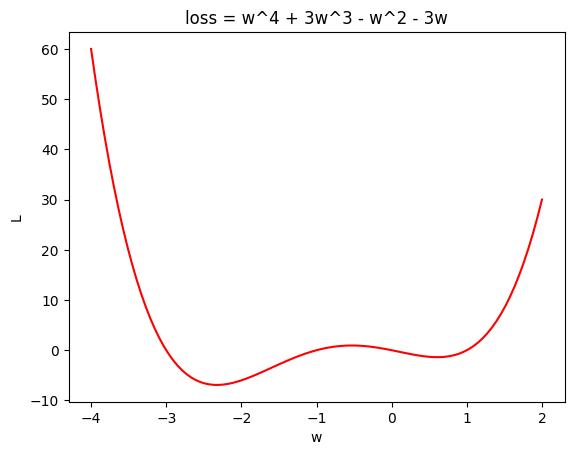
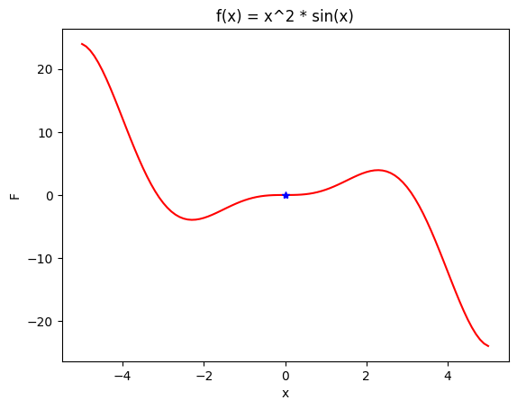
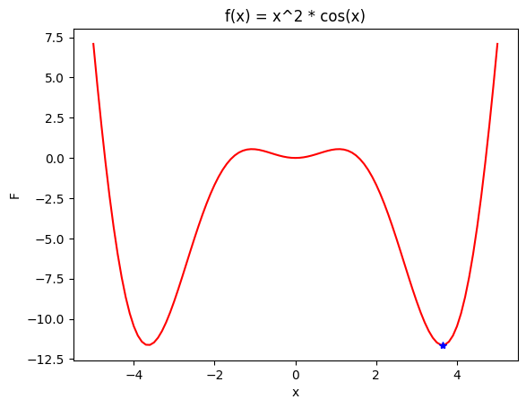

<!-- editorlm-hebrew-html-start -->
<style>
html, body, .vscode-body, .markdown-body, .markdown-preview, #write {
  direction: rtl !important; text-align: right !important;
}
ul, ol { padding-right: 2em !important; padding-left: 0 !important; }
blockquote { border-right: 3px solid #999; border-left: 0; padding-right: 1rem; padding-left: 0; }
@media print {
  html, body, .vscode-body, .markdown-body, .markdown-preview, #write {
    direction: rtl !important; text-align: right !important;
  }
}
</style>
<!-- editorlm-hebrew-html-end -->
<style>
.book { max-width: 900px; margin: auto; line-height: 1.8; font-family: Arial, sans-serif; }
.book .cover { min-height: 680px; box-sizing: border-box; padding: 64px 48px; margin: 24px 0 60px; background: #112b41; color: #f5f8fc; border-top: 9px solid #39c4b5; position: relative; }
.book .cover .eyebrow { color: #81e0d5; font-size: 15px; letter-spacing: 2px; }
.book .cover h1 { color: #fff; font-size: 48px; line-height: 1.3; border: 0; margin: 50px 0 18px; }
.book .cover .subtitle { font-size: 28px; color: #d8e6f0; }
.book .cover .author { font-size: 30px; color: #fff; margin-top: 52px; }
.book .cover .audience { color: #c1d3df; margin-top: 12px; }
.book .cover .motif { direction: ltr; text-align: left; font-family: Consolas, monospace; color: #81e0d5; font-size: 19px; margin-top: 54px; }
.book h1, .book h2, .book h3 { line-height: 1.4; font-weight: 700; }
.book > h1 { font-size: 32px !important; text-align: center !important; margin: 28px 0; }
.book h2 { font-size: 34px !important; text-align: center !important; color: #153b56 !important; background: #eef5fc; border: 0; border-bottom: 4px solid #299c91; border-radius: 10px 10px 0 0; padding: 28px 20px; margin: 24px 0 36px; }
.book h3 { font-size: 24px !important; text-align: right !important; color: #174e49 !important; background: #edf7f5; border: 0; border-right: 5px solid #299c91; border-radius: 6px; padding: 10px 16px; margin: 36px 0 18px; }
.book .chapter { height: 0; margin: 76px 0 0; border-top: 1px solid #ccd7df; break-before: page; page-break-before: always; break-after: avoid; page-break-after: avoid; }
.book .toc { padding: 24px; border-right: 5px solid #39a99d; background: rgba(70,150,155,.09); margin: 24px 0 48px; }
.book pre, .book pre code { direction: ltr !important; text-align: left !important; unicode-bidi: isolate; }
.book pre { box-sizing: border-box !important; width: 100% !important; max-width: 100% !important; margin: 0 !important; padding: 16px 20px; border: 1px solid #ccd7df; border-radius: 8px; line-height: 1.6; overflow-x: auto; }
.book code { direction: ltr; unicode-bidi: isolate; font-family: Consolas, "Courier New", monospace; }
.book pre { background: #f3f6fa !important; color: #1f2937 !important; }
.book pre code, .book pre code.hljs { background: transparent !important; color: #1f2937 !important; }
.book pre .hljs-keyword, .book pre .hljs-literal { color: #6f299c !important; }
.book pre .hljs-string { color: #216338 !important; }
.book pre .hljs-number { color: #075e68 !important; }
.book pre .hljs-comment { color: #526174 !important; }
.book pre .hljs-built_in, .book pre .hljs-title { color: #135b96 !important; }
.book table { width: 100%; }
.book th, .book td { text-align: right; }
.book .small { font-size: .9em; opacity: .8; }
.book .python-intro { display: flex; align-items: center; gap: 28px; padding: 22px 28px; margin: 24px 0; background: #eef5fc; color: #183e63; border-right: 6px solid #3776ab; border-radius: 10px; }
.book .python-intro strong { font-size: 30px; }
.book .python-fact { background: #fff7d6; color: #423611; border-right: 6px solid #ffd343; border-radius: 8px; padding: 18px 24px; margin: 22px 0; }
.book .python-fact strong { font-size: 24px; }
.book img { max-width: 100%; height: auto; }
.book figure { margin: 24px auto; text-align: center; }
.book figure img { display: block; margin: auto; }
.book figcaption { direction: rtl; text-align: center; font-size: .9em; color: #445566; }
@media print { .book > h2 { break-before: page; page-break-before: always; } }
.book .screen-strip { width: 760px; max-width: 100%; height: 220px; overflow: hidden; border: 1px solid #bccad5; border-radius: 8px; margin: 20px auto 8px; direction: ltr; }
.book .screen-strip.output { height: 265px; }
.book .screen-strip img { display: block; width: 1745px; max-width: none; }
.book .screen-menu { width: 400px; max-width: 100%; height: 295px; overflow: hidden; direction: ltr; margin: 20px auto 8px; border: 1px solid #bccad5; border-radius: 8px; }
.book .screen-menu img { display: block; width: 1745px; max-width: none; }
.book .code-panel { box-sizing: border-box !important; display: block !important; width: 75% !important; max-width: 75% !important; margin: 18px auto !important; }
@media print {
  .book .cover { min-height: 85vh; break-after: page; print-color-adjust: exact; -webkit-print-color-adjust: exact; }
  .book pre { white-space: pre-wrap; break-inside: avoid; }
  .book .chapter { margin: 0; border: 0; }
  .book h1, .book h2, .book h3 { break-after: avoid; page-break-after: avoid; break-inside: avoid; }
  .book h2 { margin-top: 0; }
  .book h2, .book h3 { print-color-adjust: exact; -webkit-print-color-adjust: exact; }
}
</style>

<style>
.book .book-nav { display: flex; flex-wrap: wrap; gap: 10px; justify-content: center; align-items: center; padding: 16px 0; margin: 20px 0 32px; border-top: 1px solid #ccd7df; border-bottom: 1px solid #ccd7df; }
.book .book-nav a { display: inline-block; padding: 10px 18px; border-radius: 8px; background: #eef5fc; color: #153b56 !important; border: 1px solid #b5ccd9; text-decoration: none !important; font-size: 16px; font-weight: bold; }
.book .book-nav a.toc-link { background: #174e49; color: #fff !important; border-color: #174e49; }
.book .book-nav a:hover, .book .book-nav a:focus { background: #d4eee8; color: #153b56 !important; outline: 2px solid #299c91; outline-offset: 2px; }
.book .section-list { line-height: 2; }
@media print { .book .book-nav { display: none; } }

/* Explicit Hebrew direction, including prose beginning with English. */
.book p, .book ul, .book ol, .book li,
.book blockquote, .book h1, .book h2, .book h3,
.book h4, .book th, .book td {
  direction: rtl !important;
  text-align: right !important;
  unicode-bidi: isolate;
}
/* Chapter titles keep their agreed centered layout. */
.book h2 { text-align: center !important; }
.book pre, .book pre code, .book .code-panel {
  direction: ltr !important;
  text-align: left !important;
  unicode-bidi: isolate;
}
</style>

<div class="book" dir="rtl" lang="he" style="direction: rtl !important; text-align: right !important;">

<nav class="book-nav" aria-label="ניווט בספר">
<a href="04-Autograd.md">→ הקודם</a>
<a class="toc-link" href="../index.md">תוכן העניינים</a>
<a href="06-Gradient%20Descent%20%D7%91%D7%A9%D7%A0%D7%99%20%D7%9E%D7%A9%D7%AA%D7%A0%D7%99%D7%9D.md">הבא ←</a>
</nav>

## ג.5 Gradient Descent במשתנה אחד

בפרק זה נכיר אלגוריתם שמטרתו פשוטה לניסוח: **למצוא את המינימום של פונקציה** — כלומר את הנקודה שבה הפונקציה מקבלת את ערכה הנמוך ביותר. נדמיין מטייל שעומד על צלע הר בערפל כבד ורוצה להגיע לתחתית העמק. הוא אינו רואה את העמק, אך הוא יכול להרגיש את שיפוע הקרקע מתחת לרגליו. אסטרטגיה סבירה היא לעשות צעד קטן בכיוון שבו הקרקע יורדת, לבדוק שוב את השיפוע, ולחזור על כך עד שהקרקע נעשית שטוחה. זהו בדיוק הרעיון של **ירידה בגרדיאנט — Gradient Descent**: השיפוע של הפונקציה בנקודה הוא הנגזרת שלה, שלמדנו לחשב בפרק הקודם, וכיוון הירידה הוא הכיוון ההפוך לנגזרת.

מדוע מציאת מינימום מעניינת אותנו? בלמידת מכונה כל מודל — ובפרט רשת נוירונים — מכיל פרמטרים מספריים, המכונים משקלים, שערכיהם קובעים את התוצאה שהמודל מפיק. עבור כל בחירה של משקלים אפשר למדוד עד כמה המודל טועה על הנתונים. הטעות הזו היא פונקציה של המשקלים, ואימון המודל פירושו למצוא את המשקלים שעבורם הטעות היא הקטנה ביותר — כלומר למצוא את המינימום של פונקציית הטעות. איננו צריכים עדיין להבין כיצד רשת נוירונים בנויה; מספיק לזכור שאימון הוא חיפוש מינימום, וש־Gradient Descent הוא הכלי שמבצע את החיפוש.

בפרק זה נתרכז במקרה הפשוט ביותר, פונקציה של משתנה אחד, כדי להבין את האלגוריתם עצמו לפני שנשתמש בו במודלים אמיתיים. נראה את כלל העדכון, נממש אותו בעצמנו בעזרת Autograd, נכיר את האופטימייזר של PyTorch שעושה זאת בשבילנו, ונלמד מהדוגמאות מה עלול להשתבש: קצב למידה לא מתאים ומינימום מקומי. בפרק הבא נרחיב את אותו רעיון לפונקציה של שני משתנים, ובהמשך למודלים עם אלפי פרמטרים.

באימון רשת נוירונים מתחילים מערכים התחלתיים של המשקלים ומעדכנים אותם כדי להקטין את הטעות. **פונקציית ההפסד — Loss**, הנקראת גם פונקציית מחיר — Cost, מתארת את הטעות כתלות במשקלים. אנו מחפשים ערכי משקלים שעבורם ההפסד קטן ככל האפשר.

<!-- editorlm-source-ref: [sources/ML/pdf/4. Gradient Descent.pdf#L8-L14] -->

**[השיעור וההרצאות באתר של גלעד מרקמן](https://webprogramming.azurewebsites.net/Pages/PyTorch/SGD.aspx)**

**חומרי הליווי:** [4. Gradient Descent](../../../sources/ML/4.%20Gradient%20Descent.pptx) · [מחברת Gradient Descent](../../../sources/ML/Colab/4_Gradient_Descent.ipynb) · [מחברת התרגול](../../../sources/ML/converted/4_Gradient_Descent_exe/notebook.md)

### Gradient Descent — ירידה בגרדיאנט

**גרדיאנט — Gradient** הוא השם הכללי לנגזרת של פונקציה, ובפונקציה של משתנה אחד הוא פשוט הנגזרת הרגילה. הנגזרת אומרת לנו לאן הפונקציה עולה: נגזרת חיובית פירושה שהפונקציה עולה כשמגדילים את המשתנה, ונגזרת שלילית פירושה שהיא יורדת. מכאן נובע האלגוריתם.

מתחילים בנקודה כלשהי ומתקדמים בצעדים בכיוון ההפוך לנגזרת. אם הנגזרת חיובית, מקטינים את המשקל; אם היא שלילית, מגדילים אותו. כך מחפשים מינימום מקומי של פונקציית ההפסד.

<!-- editorlm-source-ref: [sources/ML/pdf/4. Gradient Descent.pdf#L18-L38] -->

מדוע לא לפתור את הבעיה ישירות? בפונקציות פשוטות אפשר לחפש נקודות קיצון באמצעות גזירה והשוואת הנגזרת לאפס. ברשת נוירונים פונקציית ההפסד עשויה להיות מורכבת ותלויה בפרמטרים רבים, ולכן משתמשים בעדכונים חוזרים במקום בפתרון אלגברי ישיר. היתרון של הגישה הזו הוא שאיננו צריכים לדעת דבר על צורת הפונקציה; די בכך שנוכל לחשב את ערכה ואת נגזרתה בנקודה הנוכחית — וזה בדיוק מה ש־Autograd נותן לנו.

### שלבי האלגוריתם

נתרגם עתה את הרעיון לרצף פעולות קבוע שנחזור עליו שוב ושוב. מאתחלים את המשקל ואת **קצב הלמידה — learning rate**, מספר קטן שקובע עד כמה גדול יהיה כל צעד. בכל איטרציה מחשבים את ההפסד, מחשבים את הנגזרת במעבר לאחור, מעדכנים את המשקל ולבסוף מאפסים את הנגזרת. האיפוס נדרש מפני ש־Autograd צובר נגזרות, כפי שראינו בפרק הקודם, ואנו רוצים שכל איטרציה תתחיל מנגזרת נקייה.

כלל העדכון הוא:

<div class="code-panel" dir="ltr">

```text
w_new = w - learning_rate * gradient
```

</div>

לדוגמה, אם הנגזרת היא 2 וקצב הלמידה הוא 0.01, מקטינים את המשקל ב־0.02. שימו לב שגודל הצעד תלוי גם בנגזרת: רחוק מהמינימום, במקום שבו השיפוע תלול, הצעדים גדולים; ככל שמתקרבים למינימום השיפוע מתמתן והצעדים נעשים קטנים מאליהם.

<!-- editorlm-source-ref: [sources/ML/pdf/4. Gradient Descent.pdf#L42-L54] -->

### מציאת מינימום של פונקציה פשוטה

כדי לראות את האלגוריתם בפעולה נבחר תחילה פונקציה שאת המינימום שלה אנו יודעים לחשב בעצמנו: פרבולה. כך נוכל להשוות את תוצאת החיפוש לתשובה הנכונה. נדגים את החיפוש על הפונקציה:

$$
loss = w^2 - 4w + 8
$$

נייבא את הספריות ונגדיר את הפונקציה:

<div class="code-panel" dir="ltr">

```python
import torch
import numpy as np
import matplotlib.pyplot as plt
```

</div>


<div class="code-panel" dir="ltr">

```python
def Loss(w):
    return w**2 - 4*w + 8
```

</div>

לפני שנחפש את המינימום נצייר את הפונקציה, כדי שנוכל לראות בעין היכן הוא נמצא. לשם כך ניצור 101 ערכים במרווחים שווים בין 0 ל־4:

<div class="code-panel" dir="ltr">

```python
# 101 linearly spaced numbers
w_values = np.linspace(0,4,101)
print(w_values)
```

</div>

**פלט**

<div class="code-panel" dir="ltr">

```text
[0.   0.04 0.08 0.12 0.16 0.2  0.24 0.28 0.32 0.36 0.4  0.44 0.48 0.52
 0.56 0.6  0.64 0.68 0.72 0.76 0.8  0.84 0.88 0.92 0.96 1.   1.04 1.08
 1.12 1.16 1.2  1.24 1.28 1.32 1.36 1.4  1.44 1.48 1.52 1.56 1.6  1.64
 1.68 1.72 1.76 1.8  1.84 1.88 1.92 1.96 2.   2.04 2.08 2.12 2.16 2.2
 2.24 2.28 2.32 2.36 2.4  2.44 2.48 2.52 2.56 2.6  2.64 2.68 2.72 2.76
 2.8  2.84 2.88 2.92 2.96 3.   3.04 3.08 3.12 3.16 3.2  3.24 3.28 3.32
 3.36 3.4  3.44 3.48 3.52 3.56 3.6  3.64 3.68 3.72 3.76 3.8  3.84 3.88
 3.92 3.96 4.  ]
```

</div>

נחשב את ההפסד בכל ערך ונצייר את הפונקציה:

<div class="code-panel" dir="ltr">

```python
# Calculate loss values
loss_values = Loss(w_values)

def graph():
    plt.plot(w_values,loss_values, 'r')
    plt.title("loss = w^2 - 4w + 8")
    plt.ylabel("loss")
    plt.xlabel("W")

graph()
# print(w)
print(loss_values)
```

</div>

**פלט**

<div class="code-panel" dir="ltr">

```text
[8.     7.8416 7.6864 7.5344 7.3856 7.24   7.0976 6.9584 6.8224 6.6896
 6.56   6.4336 6.3104 6.1904 6.0736 5.96   5.8496 5.7424 5.6384 5.5376
 5.44   5.3456 5.2544 5.1664 5.0816 5.     4.9216 4.8464 4.7744 4.7056
 4.64   4.5776 4.5184 4.4624 4.4096 4.36   4.3136 4.2704 4.2304 4.1936
 4.16   4.1296 4.1024 4.0784 4.0576 4.04   4.0256 4.0144 4.0064 4.0016
 4.     4.0016 4.0064 4.0144 4.0256 4.04   4.0576 4.0784 4.1024 4.1296
 4.16   4.1936 4.2304 4.2704 4.3136 4.36   4.4096 4.4624 4.5184 4.5776
 4.64   4.7056 4.7744 4.8464 4.9216 5.     5.0816 5.1664 5.2544 5.3456
 5.44   5.5376 5.6384 5.7424 5.8496 5.96   6.0736 6.1904 6.3104 6.4336
 6.56   6.6896 6.8224 6.9584 7.0976 7.24   7.3856 7.5344 7.6864 7.8416
 8.    ]
```

</div>

בפלט רואים שערכי ההפסד יורדים עד 4 ואז עולים בחזרה. הערך הנמוך ביותר, 4, מתקבל באמצע הרשימה — עבור w=2. זהו המינימום שאנו מצפים שהאלגוריתם ימצא.

<!-- editorlm-source-ref: [sources/ML/converted/4_Gradient_Descent/notebook.md#L14-L108] -->

### מימוש ידני בעזרת Autograd

כעת נכתוב בעצמנו את עדכון המשקל וניעזר ב־Autograd לחישוב הנגזרת. נאתחל את המשקל ל־5.5 ואת קצב הלמידה ל־0.1, ונבצע 300 איטרציות. בקוד כל איטרציה נקראת `epoch`; בהמשך הספר נשתמש במונח **אפוק — epoch** לתיאור מעבר שלם על נתוני האימון, וכאן, כשאין נתונים, הוא פשוט מונה איטרציות. העדכון מתבצע בתוך `torch.no_grad()`, כדי ש־Autograd לא יתעד את פעולת העדכון עצמה כחלק מגרף החישוב, ולאחריו מאפסים את הנגזרת לקראת האיטרציה הבאה.

<div class="code-panel" dir="ltr">

```python
# Initialize weight and parameters
w = torch.tensor(5.5, requires_grad=True)
learning_rate = 0.1

for epoch in range (300):
    # Forward
    loss = Loss(w)

    # Backward - calculate gradients
    loss.backward()

    if epoch <= 10:
        print(f"epoch= {epoch} W= {w.item():.5f} model={loss:.5f} grad= {w.grad:.5f}")

    elif epoch % 10 == 0:
        print(f"epoch= {epoch} W= {w.item():.5f} model={loss:.5f} grad= {w.grad:.5f}")

    # Update weight
    with torch.no_grad():
        w -= learning_rate * w.grad

    # zero grads
    w.grad.zero_()

print(f"End W= {w.item():.3f} model={loss:.3f} ")
```

</div>


<!-- editorlm-source-ref: [sources/ML/converted/4_Gradient_Descent/notebook.md#L118-L160] -->

נציג את התוצאה ונסמן אותה על גרף הפונקציה:

<div class="code-panel" dir="ltr">

```python
min_w = w.item()
min_loss = loss.item()
print (min_w, min_loss)

plt.plot(w_values,loss_values, 'r')
plt.plot(min_w, min_loss, '*')
plt.title("loss = w^2 - 4w + 8")
plt.ylabel("loss")
plt.xlabel("W")
```

</div>

**פלט**

<div class="code-panel" dir="ltr">

```text
2.000000476837158 4.0
```

</div>

החיפוש הגיע בקירוב ל־w=2, שבו ההפסד הוא 4. זו בדיוק התשובה שראינו בגרף, אף שהאלגוריתם לא "ידע" דבר על צורת הפרבולה — הוא רק עקב אחרי הנגזרת.

<!-- editorlm-source-ref: [sources/ML/converted/4_Gradient_Descent/notebook.md#L169-L202] -->

### Optimizer SGD

את עדכון המשקל כתבנו בעצמנו, אך זהו קטע קוד שחוזר על עצמו בכל אימון. PyTorch מספקת לשם כך אובייקט מוכן: **אופטימייזר — Optimizer**. השם SGD הוא קיצור של Stochastic Gradient Descent, הגרסה של ירידה בגרדיאנט שבה משתמשים באימון רשתות; בדוגמה שלנו, שבה אין נתונים ויש משקל אחד, הוא מבצע בדיוק את כלל העדכון שכתבנו קודם.

האופטימייזר מעדכן את הפרמטרים לפי הנגזרות וקצב הלמידה. יוצרים אותו באמצעות `torch.optim.SGD` עם רשימת הפרמטרים לעדכון ועם קצב הלמידה; `step()` מעדכנת אותם, ו־`zero_grad()` מאפסת את הנגזרות.

נאתחל הפעם את המשקל ל־3.5 ונבצע 100 איטרציות:

<div class="code-panel" dir="ltr">

```python
# Initialize weight and parameters
w = torch.tensor(3.5, requires_grad=True)
learning_rate = 0.1

# init optimizer
optimizer = torch.optim.SGD([w], lr=learning_rate)

for epoch in range (100):
    # Forward
    loss = Loss(w)

    # Backward - calculate gradients
    loss.backward()

    # Update weight
    optimizer.step() # w = w - grad * LR

    if epoch % 10 == 0:
        print(f"epoch= {epoch} w= {w.item():.3f} model={loss:.3f} grad= {w.grad:.3f}")

    # zero Grads
    optimizer.zero_grad()

print(f"End W= {w.item():.3f} model={loss:.3f} ")
```

</div>

**פלט**

<div class="code-panel" dir="ltr">

```text
epoch= 0 w= 3.200 model=6.250 grad= 3.000
epoch= 10 w= 2.129 model=4.026 grad= 0.322
epoch= 20 w= 2.014 model=4.000 grad= 0.035
epoch= 30 w= 2.001 model=4.000 grad= 0.004
epoch= 40 w= 2.000 model=4.000 grad= 0.000
epoch= 50 w= 2.000 model=4.000 grad= 0.000
epoch= 60 w= 2.000 model=4.000 grad= 0.000
epoch= 70 w= 2.000 model=4.000 grad= 0.000
epoch= 80 w= 2.000 model=4.000 grad= 0.000
epoch= 90 w= 2.000 model=4.000 grad= 0.000
End W= 2.000 model=4.000
```

</div>

בפלט, `model` הוא הכינוי לערך ההפסד. המשקל מודפס אחרי העדכון, ואילו ההפסד והנגזרת חושבו לפניו. שימו לב כיצד הנגזרת קטנה מאיטרציה לאיטרציה, מ־3 ל־0.322 ואז ל־0.035, וכיצד בהתאם לכך הצעדים מתקצרים: כבר אחרי כ־40 איטרציות המשקל התייצב על 2, ומכאן ואילך העדכונים זניחים.

<!-- editorlm-source-ref: [sources/ML/converted/4_Gradient_Descent/notebook.md#L213-L269] -->

### קצב הלמידה

עד כה השתמשנו בקצב למידה 0.1 והכול עבד יפה, אך הבחירה בקצב אינה מובנת מאליה. קצב הלמידה, יחד עם הנגזרת, קובע את גודל הצעד בכל איטרציה. קצב קטן מדי עלול להאט את ההתקדמות, ונצטרך אלפי איטרציות כדי להתקרב למינימום; קצב גדול מדי עלול לגרום לקפיצות שמתרחקות מהמינימום — המשקל "מדלג" מעל התחתית מצד לצד, ובמקרה הגרוע ההפסד גדל בכל צעד במקום לקטון. בדוגמאות נבחן קצבים שונים ונשווה את התוצאות.

<!-- editorlm-source-ref: [sources/ML/converted/4_Gradient_Descent/notebook.md#L279-L287] -->

### השפעת הפרמטרים ההתחלתיים

הפרבולה שבדקנו נוחה במיוחד: יש לה תחתית אחת בלבד, ומכל נקודת התחלה נגיע אליה. פונקציות רבות אינן כאלה, ויש להן כמה "עמקים". לעיתים האלגוריתם מגיע ל**מינימום מקומי — Local Minimum**: ערך נמוך בסביבתו הקרובה, אך לא הנמוך ביותר בפונקציה. מכיוון שהאלגוריתם יורד תמיד במורד, הוא נעצר בעמק הראשון שאליו הגיע ואינו יודע שיש עמק עמוק יותר במקום אחר. לכן שינוי נקודת ההתחלה עשוי להוביל לתוצאה אחרת.

<!-- editorlm-source-ref: [sources/ML/converted/4_Gradient_Descent/notebook.md#L295-L302] -->

### תרגיל

נבדוק את התופעה הזו על פונקציה שיש לה יותר ממינימום אחד. מצאו מינימום של הפונקציה הבאה. הריצו מנקודות ההתחלה 0, 2 ו־‎−4, והשוו את התוצאות.

$$
L(w)=w^4+3w^3-w^2-3w
$$

<!-- editorlm-source-ref: [sources/ML/pdf/4. Gradient Descent.pdf#L177-L184] -->

נגדיר את הפונקציה ונצייר אותה:

<div class="code-panel" dir="ltr">

```python
def L (w):
    return w ** 4 + 3* w**3 - w**2 - 3* w
```

</div>

<div class="code-panel" dir="ltr">

```python
w = np.linspace(-4,2,100)

plt.plot(w, L(w), 'r')
plt.title("loss = w^4 + 3w^3 - w^2 - 3w")
plt.ylabel("L")
plt.xlabel("w")
```

</div>


<figure>

<figcaption>הפונקציה כוללת שני אזורי מינימום בעומקים שונים.</figcaption>
</figure>


<!-- editorlm-source-ref: [sources/ML/converted/4_Gradient_Descent/notebook.md#L320-L351] -->

בגרף רואים שני עמקים: עמק רדוד מימין, בסביבות w=0.6, ועמק עמוק בהרבה משמאל, בסביבות w=−2.3. נריץ את האופטימייזר מנקודת ההתחלה 2, בקצב למידה 0.01, במשך 1,000 איטרציות. קצב הלמידה כאן קטן מבעבר מפני שהפולינום תלול מאוד בקצוות, ונגזרת גדולה יחד עם קצב 0.1 הייתה מובילה לקפיצות עצומות:

<div class="code-panel" dir="ltr">

```python
# Initialize weight and parameters
W = torch.tensor(2.0, requires_grad=True) # 0.0, 1.0, 2, -1, -4
learning_rate = 0.01

# init optimizer
optimizer = torch.optim.SGD([W], lr=learning_rate)

for epoch in range (1000):
    # Forward
    l = L(W)

    # Backward - calculate gradients
    l.backward()

    # Update weight
    optimizer.step()

    if epoch % 10 == 0:
        print(f"epoch= {epoch} W= {W.item():.3f} model={l:.3f} grad= {W.grad:.3f}")

    # Zero gradients
    optimizer.zero_grad()

print(f"End W= {W.item():.3f} model={l:.3f} ")
```

</div>

השורה האחרונה של הפלט:

**פלט**

<div class="code-panel" dir="ltr">

```text
End W= 0.607 model=-1.383
```

</div>


<!-- editorlm-source-ref: [sources/ML/converted/4_Gradient_Descent/notebook.md#L360-L490] -->

נסמן את התוצאה על גרף הפונקציה:

<div class="code-panel" dir="ltr">

```python
plt.plot(w, L(w), 'r')
plt.title("loss = w^4 + 3w^3 - w^2 - 3w")
plt.ylabel("L")
plt.xlabel("w")
plt.plot(W.item(), l.item(), '*',color='b')
```

</div>


<figure>

<figcaption>הכוכב מסמן את המינימום המקומי שאליו הגיע החיפוש מנקודת ההתחלה 2.</figcaption>
</figure>


<!-- editorlm-source-ref: [sources/ML/converted/4_Gradient_Descent/notebook.md#L496-L523] -->

החיפוש שהתחיל ב־2 גלש למטה ונעצר בעמק הימני, הרדוד. זהו מינימום מקומי: מבחינת האלגוריתם הנגזרת התאפסה והחיפוש הסתיים, אף שבצד השמאלי של הגרף יש נקודה נמוכה בהרבה.

### תרגול נוסף

בסעיף זה נתרגל את מה שלמדנו על כמה פונקציות, ובעיקר נראה כיצד נקודת ההתחלה וצורת הפונקציה משפיעות על התוצאה. נריץ תחילה את הפולינום מהסעיף הקודם עם נקודת התחלה ‎−1, בקצב 0.01, במשך 100 איטרציות:

<div class="code-panel" dir="ltr">

```python
# Initialize parameter
W = torch.tensor(-1.0, requires_grad=True) # 0.0, 1.0, 2, -1, -4
learning_rate = 0.01

# init optimizer
optimizer = torch.optim.SGD([W], lr=learning_rate)

for epoch in range (100):
    # Forward
    l = L(W)

    # Calculate gradients
    l.backward()

    # Update parameter
    optimizer.step()

    if epoch % 10 == 0:
        print(f"epoch= {epoch} W= {W.item():.3f} model={l:.3f} grad= {W.grad:.3f}")

    # Zero gradients
    optimizer.zero_grad()

print(f"End W= {W.item():.3f} model={l:.3f} ")
```

</div>

השורה האחרונה של הפלט:

**פלט**

<div class="code-panel" dir="ltr">

```text
End W= -2.326 model=-6.914
```

</div>


<div class="code-panel" dir="ltr">

```python
plt.plot(w, L(w), 'r')
plt.title("loss = w^4 + 3w^3 - w^2 - 3w")
plt.ylabel("L")
plt.xlabel("w")
plt.plot(W.item(), l.item(), '*',color='b')
```

</div>

התחלה זו הובילה לעמק השמאלי, שערכו נמוך מזה שהתקבל בהתחלה מ־2. אותה פונקציה, אותו אלגוריתם ואותו קצב למידה — ובכל זאת תוצאה שונה, רק בגלל נקודת ההתחלה. זו הסיבה שבאימון רשתות נהוג לעיתים לאתחל את המשקלים באקראי ולהריץ כמה פעמים.

<!-- editorlm-source-ref: [sources/ML/converted/4_Gradient_Descent_exe/notebook.md#L466-L542] -->

כעת נבחן את ארבע הפונקציות הבאות בתחום ‎−5<x<5, לפי סדר התרגילים. בכל דוגמה נגדיר את הפונקציה, נבצע את החיפוש ונציג את התוצאה. בכל תרגיל נגדיר את הפונקציה פעמיים: גרסה עם `torch`, שעליה יופעל Autograd במהלך החיפוש, וגרסה עם `numpy` לציור הגרף.

**תרגיל 1 — x² sin(x)**

<div class="code-panel" dir="ltr">

```python
def F (x):
    return x**2 * torch.sin(x)

def F_numpy (x):
    return x**2 * np.sin(x)
```

</div>

<div class="code-panel" dir="ltr">

```python
# Initialize parameter
x = torch.tensor(2, requires_grad=True, dtype=torch.float32)   # -0.1, -5
learning_rate = 0.1

for epoch in range (300):
    # Forward
    f = F(x)

    # Calculate gradients
    f.backward()

    if epoch <= 10:
        print(f"epoch= {epoch} W= {x.item():.5f} model={f:.5f} grad= {x.grad:.5f}")

    elif epoch % 10 == 0:
        print(f"epoch= {epoch} W= {x.item():.5f} model={f:.5f} grad= {x.grad:.5f}")

    # Update parameter
    with torch.no_grad():
        x -= learning_rate * x.grad

    # zero grads
    x.grad.zero_()

print(f"End W= {x.item():.3f} model={f:.3f} ")
```

</div>

השורה האחרונה של הפלט:

**פלט**

<div class="code-panel" dir="ltr">

```text
End W= 0.011 model=0.000
```

</div>

<div class="code-panel" dir="ltr">

```python
x_values = np.linspace(-5,5,101)
f_values = F_numpy(x_values)

plt.plot(x_values, f_values, 'r')
plt.title("f(x) = x^2 * sin(x)")
plt.ylabel("F")
plt.xlabel("x")
plt.plot(x.item(), f.item(), '*',color='b')
```

</div>

<figure>

<figcaption>גרף הפונקציה ונקודת הסיום של החיפוש.</figcaption>
</figure>

החיפוש מתקרב לאפס, אך אפס אינו מינימום של הפונקציה: בסמוך לו יש גם ערכים שליליים. ב־x=0 הנגזרת מתאפסת מפני שהגרף שטוח שם לרגע, ואז ממשיך לרדת — נקודה כזו נקראת נקודת פיתול. האלגוריתם עוצר בה מפני שהצעדים, שגודלם תלוי בנגזרת, נעשים זעירים. לכן תוצאה עם נגזרת קטנה אינה מספיקה כדי לקבוע שנמצא מינימום.

<!-- editorlm-source-ref: [sources/ML/converted/4_Gradient_Descent_exe/notebook.md#L559-L690] -->

**תרגיל 2 — x² cos(x)**

<div class="code-panel" dir="ltr">

```python
def F (x):
    return x**2 * torch.cos(x)

def F_numpy (x):
    return x**2 * np.cos(x)
```

</div>

<div class="code-panel" dir="ltr">

```python
# Initialize parameter
x = torch.tensor(2, requires_grad=True, dtype=torch.float32)   # -0.1, -5, 2
learning_rate = 0.1

for epoch in range (300):
    # Forward
    f = F(x)

    # Calculate gradients
    f.backward()

    if epoch <= 10:
        print(f"epoch= {epoch} W= {x.item():.5f} model={f:.5f} grad= {x.grad:.5f}")

    elif epoch % 10 == 0:
        print(f"epoch= {epoch} W= {x.item():.5f} model={f:.5f} grad= {x.grad:.5f}")

    # Update parameter
    with torch.no_grad():
        x -= learning_rate * x.grad

    # zero grads
    x.grad.zero_()

print(f"End W= {x.item():.3f} model={f:.3f} ")
```

</div>

השורה האחרונה של הפלט:

**פלט**

<div class="code-panel" dir="ltr">

```text
End W= 3.644 model=-11.638
```

</div>

<div class="code-panel" dir="ltr">

```python
x_values = np.linspace(-5,5,101)
f_values = F_numpy(x_values)

plt.plot(x_values, f_values, 'r')
plt.title("f(x) = x^2 * cos(x)")
plt.ylabel("F")
plt.xlabel("x")
plt.plot(x.item(), f.item(), '*',color='b')
```

</div>

<figure>

<figcaption>גרף הפונקציה ונקודת הסיום של החיפוש.</figcaption>
</figure>

הפעם, מאותה נקודת התחלה 2, החיפוש גלש ימינה והגיע לעמק עמוק בסביבות x=3.6. נסו להריץ גם מנקודות ההתחלה ‎−0.1 ו־‎−5 המופיעות בהערה שבקוד, וראו לאיזה עמק מגיעים בכל פעם.

<!-- editorlm-source-ref: [sources/ML/converted/4_Gradient_Descent_exe/notebook.md#L692-L823] -->

**תרגיל 3 — סכום פונקציות מעריכיות**

<div class="code-panel" dir="ltr">

```python
def F (x):
    return torch.exp(-(x+2)**2) + torch.exp(-(x-2)**2)-0.5

def F_numpy (x):
    return np.exp(-(x+2)**2) + np.exp(-(x-2)**2)-0.5
```

</div>

<div class="code-panel" dir="ltr">

```python
# Initialize parameter
x = torch.tensor(1.5, requires_grad=True, dtype=torch.float32)   # -0.1, -5, 2
learning_rate = 0.1

# init optimizer
optimizer = torch.optim.SGD([x], lr=learning_rate)

for epoch in range (300):
    # Forward
    f = F(x)

    # Calculate gradients
    f.backward()

    if epoch <= 10:
        print(f"epoch= {epoch} W= {x.item():.5f} model={f:.5f} grad= {x.grad:.5f}")

    elif epoch % 10 == 0:
        print(f"epoch= {epoch} W= {x.item():.5f} model={f:.5f} grad= {x.grad:.5f}")

    # Update parameter
    optimizer.step()

    # zero grads
    optimizer.zero_grad()

print(f"End W= {x.item():.3f} model={f:.3f} ")
```

</div>

השורה האחרונה של הפלט:

**פלט**

<div class="code-panel" dir="ltr">

```text
End W= 0.000 model=-0.463
```

</div>

<div class="code-panel" dir="ltr">

```python
x_values = np.linspace(-5,5,101)
f_values = F_numpy(x_values)

plt.plot(x_values, f_values, 'r')
plt.title("f(x) = e^-(x+2)^2 + e^-(x-2)^2 - 0.5")
plt.ylabel("F")
plt.xlabel("x")
plt.plot(x.item(), f.item(), '*',color='b')
```

</div>

התוצאה נמצאת במינימום המקומי שבין שתי הפסגות. הפונקציה בנויה משתי "גבעות" סביב x=−2 ו־x=2, ובין שתיהן יש שקע קטן ב־x=0. נקודת ההתחלה 1.5 נמצאת על המדרון הפנימי של הגבעה הימנית, ולכן הירידה מובילה אל השקע שביניהן, אף שמחוץ לשתי הגבעות הפונקציה יורדת לערכים נמוכים עוד יותר.

<!-- editorlm-source-ref: [sources/ML/converted/4_Gradient_Descent_exe/notebook.md#L825-L958] -->

**תרגיל 4 — sin(3x) + cos(2x)**

<div class="code-panel" dir="ltr">

```python
def F (x):
    return torch.sin(3*x) + torch.cos(2*x)

def F_numpy (x):
    return np.sin(3*x) + np.cos(2*x)
```

</div>

<div class="code-panel" dir="ltr">

```python
# Initialize parameter
x = torch.tensor(0, requires_grad=True, dtype=torch.float32)   # -0.1, -5, 2
learning_rate = 0.1

# init optimizer
optimizer = torch.optim.SGD([x], lr=learning_rate)

for epoch in range (300):
    # Forward
    f = F(x)

    # Calculate gradients
    f.backward()

    if epoch <= 10:
        print(f"epoch= {epoch} W= {x.item():.5f} model={f:.5f} grad= {x.grad:.5f}")

    elif epoch % 10 == 0:
        print(f"epoch= {epoch} W= {x.item():.5f} model={f:.5f} grad= {x.grad:.5f}")

    # Update parameter
    optimizer.step()

    # zero grads
    optimizer.zero_grad()

print(f"End W= {x.item():.3f} model={f:.3f} ")
```

</div>

השורה האחרונה של הפלט:

**פלט**

<div class="code-panel" dir="ltr">

```text
End W= -0.767 model=-0.708
```

</div>

<div class="code-panel" dir="ltr">

```python
x_values = np.linspace(-5,5,101)
f_values = F_numpy(x_values)

plt.plot(x_values, f_values, 'r')
plt.title("f(x) = sin(3x) + cos(2x)")
plt.ylabel("F")
plt.xlabel("x")
plt.plot(x.item(), f.item(), '*',color='b')
```

</div>

פונקציה זו מחזורית, ויש לה עמקים רבים בעומקים שונים לאורך כל התחום. מנקודת ההתחלה 0 החיפוש התגלגל לעמק הקרוב, בסביבות x=−0.77. המסקנה מארבעת התרגילים אחת: ירידה בגרדיאנט מוצאת מינימום מקומי בסביבת נקודת ההתחלה, ולא בהכרח את המינימום הנמוך ביותר. באימון רשתות נוירונים נחיה עם המגבלה הזו, ונראה בהמשך שבפועל היא מפריעה פחות ממה שנדמה.

<!-- editorlm-source-ref: [sources/ML/converted/4_Gradient_Descent_exe/notebook.md#L960-L1097] -->


<nav class="book-nav" aria-label="ניווט בספר">
<a href="04-Autograd.md">→ הקודם</a>
<a class="toc-link" href="../index.md">תוכן העניינים</a>
<a href="06-Gradient%20Descent%20%D7%91%D7%A9%D7%A0%D7%99%20%D7%9E%D7%A9%D7%AA%D7%A0%D7%99%D7%9D.md">הבא ←</a>
</nav>

</div>

<!-- editorlm-source-versions: {"schemaVersion": 1, "sources": {"sources/ML/pdf/4. Gradient Descent.pdf": {"sourceSha256": "c18d2622343a1b388da9ab639c4bd006841cf2dda9bb5135d4390db873478c4e", "canonicalTextSha256": "80fecee360f06548411df640cf471709095926be7a3940fc5b99a14bbe235950"}, "sources/ML/converted/4_Gradient_Descent/notebook.md": {"sourceSha256": "207b2e48facd692f83e0bbe9a9616c5d643dda1fc30f43823eb9141dc9fcd9d2", "canonicalTextSha256": "207b2e48facd692f83e0bbe9a9616c5d643dda1fc30f43823eb9141dc9fcd9d2"}, "sources/ML/converted/4_Gradient_Descent_exe/notebook.md": {"sourceSha256": "f4c557c72e2f515fc58fc598b9b7f3e4aa22020e14400650f1c62e43c2524d4d", "canonicalTextSha256": "f4c557c72e2f515fc58fc598b9b7f3e4aa22020e14400650f1c62e43c2524d4d"}}} -->
