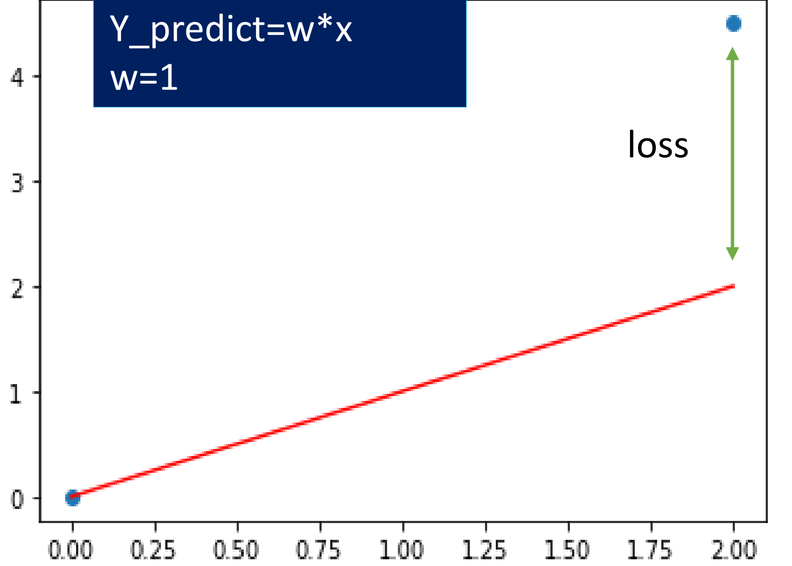
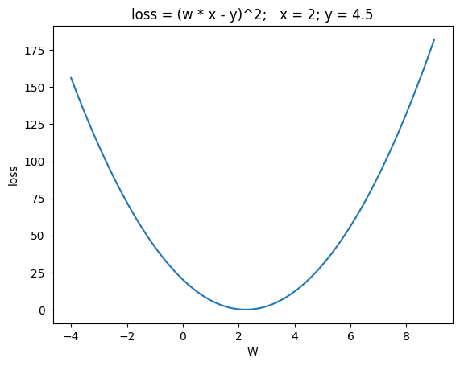
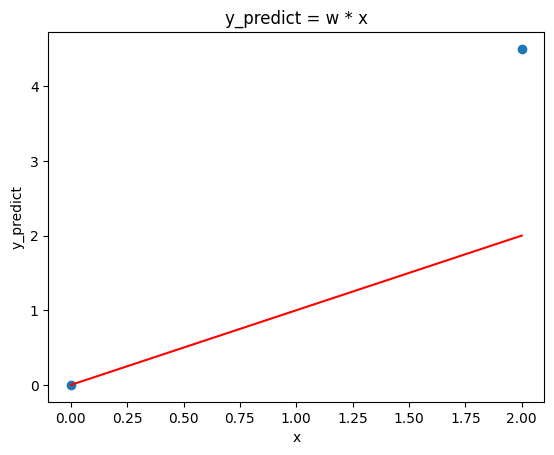

<!-- editorlm-hebrew-html-start -->
<style>
html, body, .vscode-body, .markdown-body, .markdown-preview, #write {
  direction: rtl !important; text-align: right !important;
}
ul, ol { padding-right: 2em !important; padding-left: 0 !important; }
blockquote { border-right: 3px solid #999; border-left: 0; padding-right: 1rem; padding-left: 0; }
@media print {
  html, body, .vscode-body, .markdown-body, .markdown-preview, #write {
    direction: rtl !important; text-align: right !important;
  }
}
</style>
<!-- editorlm-hebrew-html-end -->
<style>
.book { max-width: 900px; margin: auto; line-height: 1.8; font-family: Arial, sans-serif; }
.book .cover { min-height: 680px; box-sizing: border-box; padding: 64px 48px; margin: 24px 0 60px; background: #112b41; color: #f5f8fc; border-top: 9px solid #39c4b5; position: relative; }
.book .cover .eyebrow { color: #81e0d5; font-size: 15px; letter-spacing: 2px; }
.book .cover h1 { color: #fff; font-size: 48px; line-height: 1.3; border: 0; margin: 50px 0 18px; }
.book .cover .subtitle { font-size: 28px; color: #d8e6f0; }
.book .cover .author { font-size: 30px; color: #fff; margin-top: 52px; }
.book .cover .audience { color: #c1d3df; margin-top: 12px; }
.book .cover .motif { direction: ltr; text-align: left; font-family: Consolas, monospace; color: #81e0d5; font-size: 19px; margin-top: 54px; }
.book h1, .book h2, .book h3 { line-height: 1.4; font-weight: 700; }
.book > h1 { font-size: 32px !important; text-align: center !important; margin: 28px 0; }
.book h2 { font-size: 34px !important; text-align: center !important; color: #153b56 !important; background: #eef5fc; border: 0; border-bottom: 4px solid #299c91; border-radius: 10px 10px 0 0; padding: 28px 20px; margin: 24px 0 36px; }
.book h3 { font-size: 24px !important; text-align: right !important; color: #174e49 !important; background: #edf7f5; border: 0; border-right: 5px solid #299c91; border-radius: 6px; padding: 10px 16px; margin: 36px 0 18px; }
.book .chapter { height: 0; margin: 76px 0 0; border-top: 1px solid #ccd7df; break-before: page; page-break-before: always; break-after: avoid; page-break-after: avoid; }
.book .toc { padding: 24px; border-right: 5px solid #39a99d; background: rgba(70,150,155,.09); margin: 24px 0 48px; }
.book pre, .book pre code { direction: ltr !important; text-align: left !important; unicode-bidi: isolate; }
.book pre { box-sizing: border-box !important; width: 100% !important; max-width: 100% !important; margin: 0 !important; padding: 16px 20px; border: 1px solid #ccd7df; border-radius: 8px; line-height: 1.6; overflow-x: auto; }
.book code { direction: ltr; unicode-bidi: isolate; font-family: Consolas, "Courier New", monospace; }
.book pre { background: #f3f6fa !important; color: #1f2937 !important; }
.book pre code, .book pre code.hljs { background: transparent !important; color: #1f2937 !important; }
.book pre .hljs-keyword, .book pre .hljs-literal { color: #6f299c !important; }
.book pre .hljs-string { color: #216338 !important; }
.book pre .hljs-number { color: #075e68 !important; }
.book pre .hljs-comment { color: #526174 !important; }
.book pre .hljs-built_in, .book pre .hljs-title { color: #135b96 !important; }
.book table { width: 75%; max-width: 75%; margin: 18px auto; }
.book th, .book td { text-align: right; }
.book .small { font-size: .9em; opacity: .8; }
.book .python-intro { display: flex; align-items: center; gap: 28px; padding: 22px 28px; margin: 24px 0; background: #eef5fc; color: #183e63; border-right: 6px solid #3776ab; border-radius: 10px; }
.book .python-intro strong { font-size: 30px; }
.book .python-fact { background: #fff7d6; color: #423611; border-right: 6px solid #ffd343; border-radius: 8px; padding: 18px 24px; margin: 22px 0; }
.book .python-fact strong { font-size: 24px; }
.book img { max-width: 100%; height: auto; }
.book figure { margin: 24px auto; text-align: center; }
.book figure img { display: block; margin: auto; }
.book figcaption { direction: rtl; text-align: center; font-size: .9em; color: #445566; }
@media print { .book > h2 { break-before: page; page-break-before: always; } }
.book .screen-strip { width: 760px; max-width: 100%; height: 220px; overflow: hidden; border: 1px solid #bccad5; border-radius: 8px; margin: 20px auto 8px; direction: ltr; }
.book .screen-strip.output { height: 265px; }
.book .screen-strip img { display: block; width: 1745px; max-width: none; }
.book .screen-menu { width: 400px; max-width: 100%; height: 295px; overflow: hidden; direction: ltr; margin: 20px auto 8px; border: 1px solid #bccad5; border-radius: 8px; }
.book .screen-menu img { display: block; width: 1745px; max-width: none; }
.book .code-panel { box-sizing: border-box !important; display: block !important; width: 75% !important; max-width: 75% !important; margin: 18px auto !important; }
@media print {
  .book .cover { min-height: 85vh; break-after: page; print-color-adjust: exact; -webkit-print-color-adjust: exact; }
  .book pre { white-space: pre-wrap; break-inside: avoid; }
  .book .chapter { margin: 0; border: 0; }
  .book h1, .book h2, .book h3 { break-after: avoid; page-break-after: avoid; break-inside: avoid; }
  .book h2 { margin-top: 0; }
  .book h2, .book h3 { print-color-adjust: exact; -webkit-print-color-adjust: exact; }
}
</style>

<style>
.book .book-nav { display: flex; flex-wrap: wrap; gap: 10px; justify-content: center; align-items: center; padding: 16px 0; margin: 20px 0 32px; border-top: 1px solid #ccd7df; border-bottom: 1px solid #ccd7df; }
.book .book-nav a { display: inline-block; padding: 10px 18px; border-radius: 8px; background: #eef5fc; color: #153b56 !important; border: 1px solid #b5ccd9; text-decoration: none !important; font-size: 16px; font-weight: bold; }
.book .book-nav a.toc-link { background: #174e49; color: #fff !important; border-color: #174e49; }
.book .book-nav a:hover, .book .book-nav a:focus { background: #d4eee8; color: #153b56 !important; outline: 2px solid #299c91; outline-offset: 2px; }
.book .section-list { line-height: 2; }
@media print { .book .book-nav { display: none; } }

/* Explicit Hebrew direction, including prose beginning with English. */
.book p, .book ul, .book ol, .book li,
.book blockquote, .book h1, .book h2, .book h3,
.book h4, .book th, .book td {
  direction: rtl !important;
  text-align: right !important;
  unicode-bidi: isolate;
}
/* Chapter titles keep their agreed centered layout. */
.book h2 { text-align: center !important; }
.book pre, .book pre code, .book .code-panel {
  direction: ltr !important;
  text-align: left !important;
  unicode-bidi: isolate;
}
/* Display math renders left-to-right and centered, independent of the RTL page. */
.book .math-panel, .book .math-panel .katex-display, .book .math-panel .katex {
  direction: ltr !important;
  text-align: center !important;
  unicode-bidi: isolate;
}
</style>

<div class="book" dir="rtl" lang="he" style="direction: rtl !important; text-align: right !important;">

<nav class="book-nav" aria-label="ניווט בספר">
<a href="06-Gradient%20Descent%20%D7%91%D7%A9%D7%A0%D7%99%20%D7%9E%D7%A9%D7%AA%D7%A0%D7%99%D7%9D.md">→ הקודם</a>
<a class="toc-link" href="../index.md">תוכן העניינים</a>
<a href="08-%D7%A8%D7%92%D7%A8%D7%A1%D7%99%D7%94%20%D7%A2%D7%9D%20%D7%9B%D7%9E%D7%94%20%D7%A0%D7%A7%D7%95%D7%93%D7%95%D7%AA.md">הבא ←</a>
</nav>

## ג.7 רגרסיה לינארית — נקודה אחת

נדמיין חנות שרושמת, בכל יום, כמה מעלות היה חם בחוץ וכמה בקבוקי מים נמכרו. אחרי כמה שבועות יש בידינו טבלה של זוגות: טמפרטורה ומכירות. מבט בנתונים מגלה מגמה — ככל שחם יותר, מוכרים יותר — אך הנקודות אינן מסודרות על קו מושלם, כי בכל יום יש גם גורמים אקראיים. השאלה שמעניינת את בעל החנות אינה "כמה מכרנו ביום שכבר עבר", אלא "כמה נמכור מחר, כשהתחזית אומרת 34 מעלות" — טמפרטורה שאולי מעולם לא נמדדה בדיוק. כדי לענות עליה צריך לתאר את הקשר הכללי בין הקלט לתוצאה, ולא רק לזכור את הנקודות שנאספו.

זו בדיוק המטרה של **רגרסיה לינארית — Linear Regression**: למצוא קו ישר שמתאר היטב את הקשר בין הקלט x לבין התוצאה y. הקו מתאר את מגמת הנתונים, ואינו חייב לעבור בכל הנקודות. ברגע שיש בידינו הקו, אפשר להציב בו כל ערך של x — גם ערך שלא הופיע בנתונים — ולקבל הערכה של y. היכולת הזו, להסיק מהדוגמאות שראינו על מקרים שלא ראינו, נקראת **הכללה — Generalization**, והיא לב־לבה של למידת מכונה: המודל אינו לומד את הנתונים בעל־פה, אלא לומד את הכלל שמסתתר מאחוריהם.

בפרק זה נתחיל במקרה הפשוט ביותר: ישר העובר בראשית הצירים ונקודה אחת. בפרק הבא נתאים ישר כזה לכמה נקודות יחד, ואחריו נוסיף לישר פרמטר שני, ההטיה, שיאפשר לו שלא לעבור בראשית.

<!-- editorlm-source-ref: [sources/ML/pdf/5. רגרסיה לינארית.pdf#L8-L23] -->

**[השיעור וההרצאות באתר של גלעד מרקמן](https://webprogramming.azurewebsites.net/Pages/PyTorch/Linear_Reg.aspx)**

**חומרי הליווי:** [5. רגרסיה לינארית](../../../sources/ML/5.%20%D7%A8%D7%92%D7%A8%D7%A1%D7%99%D7%94%20%D7%9C%D7%99%D7%A0%D7%90%D7%A8%D7%99%D7%AA.pptx) · [מחברת רגרסיה לינארית](../../../sources/ML/Colab/5_Linear_Regresion.ipynb)

נייבא את הספריות שישמשו אותנו לאורך הפרק: PyTorch לחישובים ולאימון, NumPy ליצירת טווחי ערכים, ו־Matplotlib לציור הנקודות והישרים:

<div class="code-panel" dir="ltr">

```python
import torch
import numpy as np
import matplotlib.pyplot as plt
```

</div>

### רגרסיה בנקודה אחת

נתחיל מהמקרה הקטן ביותר האפשרי, שבו קל לבדוק כל שלב: נקודה אחת בלבד. קיבלנו את הנקודה (2, 4.5), ואנו מחפשים את נוסחת הקו הישר שעובר בראשית הצירים ומגיע לנקודה.

משיעורי המתמטיקה מוכר הישר **y = mx**: ישר העובר בראשית הצירים, ש־m הוא השיפוע שלו. בישר כזה יש נעלם אחד בלבד, השיפוע m, ומציאתו היא כל מה שנדרש כדי לדעת את הישר כולו. בלמידת מכונה נהוג לקרוא למספר שהמודל לומד **משקל — weight**, ולסמנו באות **w**. לכן מכאן ואילך נכתוב את הישר כ־**y = w·x**, ונחפש את w. זהו אותו m בשם אחר.

נסכם את המשימה במשפט אחד: אנחנו מחפשים **פונקציה לינארית**, ובפונקציה לינארית שעוברת בראשית הצירים יש רק דבר אחד לא ידוע — המשקל w. כל ערך של w נותן ישר אחר, ואנו רוצים את הישר שמגיע לנקודה. את התשובה אפשר כמובן לחשב בראש — 4.5 חלקי 2 — אבל נפתור אותה דווקא בדרך שהמחשב לומד, כדי לראות את כל שלבי התהליך במקרה שבו אפשר לבדוק את התוצאה.

#### הטעות — loss

נניח שהמחשב עדיין לא יודע דבר ומנחש ניחוש שרירותי: w = 1. הישר שמתקבל הוא y = 1·x. מה הוא מנבא עבור x = 2? את הערך y_predict = 1·2 = 2. אבל הערך הרצוי, זה שנתון בנקודה, הוא 4.5. הפער בין התחזית לתוצאה הרצויה הוא **הטעות**, ובלמידת מכונה קוראים לה **הפסד — loss**:

<figure>

<figcaption>הישר של הניחוש w = 1 (באדום) והנקודה הנתונה. החץ הירוק הוא הטעות: הפער האנכי בין מה שהישר מנבא עבור x = 2 לבין הערך הרצוי 4.5.</figcaption>
</figure>

נתבונן בתמונה. הנקודה הכחולה הימנית היא הנקודה הנתונה (2, 4.5). הישר האדום הוא הניחוש שלנו, y = 1·x, והוא מגיע ב־x = 2 רק לגובה 2. החץ הירוק מחבר בין קצה הישר לבין הנקודה: אורכו הוא <span dir="ltr">4.5 − 2 = 2.5</span>, וזוהי הטעות של הניחוש w = 1. אם נגדיל את w, הישר יהיה תלול יותר, קצהו יתקרב לנקודה והחץ יתקצר; ב־w = 2.25 הישר יגיע בדיוק לנקודה והחץ ייעלם. אם נגדיל את w יותר מדי, הישר יעבור מעל הנקודה ותיווצר טעות בכיוון ההפוך. לכן המטרה של האימון ניתנת לניסוח פשוט: **למצוא את w שעבורו הטעות קטנה ככל האפשר.**

#### בניית פונקציית הטעות

כדי שהמחשב יוכל לחפש את w הזה, לא מספיק לומר "הטעות קטנה". צריך לבנות **פונקציה** שמקבלת ערך של w ומחזירה מספר אחד שאומר עד כמה הישר עם המשקל הזה טועה. את הפונקציה הזו אנו בונים במיוחד לצורך החישוב שלנו, מתוך הנתונים שקיבלנו: הנקודה (2, 4.5) קבועה, והדבר היחיד שמשתנה הוא w. נגדיר:

<div class="math-panel" dir="ltr">

$$
loss(w)=(y_{predict}-y)^2=(w\cdot x-y)^2=(w\cdot 2-4.5)^2
$$

</div>

שימו לב לשינוי נקודת המבט. עד עכשיו x היה המשתנה ו־y תלוי בו. בפונקציית הטעות x ו־y הם מספרים קבועים שנלקחו מהנקודה, והמשתנה היחיד הוא w: הקלט של הפונקציה הוא משקל, והפלט הוא גודל הטעות של הישר עם המשקל הזה. עבור w = 1 מתקבל <span dir="ltr">loss = (2 − 4.5)² = 6.25</span>, ועבור w = 2.25 מתקבל loss = 0. מדוע מעלים את ההפרש בריבוע ולא משאירים אותו כמות שהוא? נדון בכך בסעיף נפרד בהמשך; בינתיים די לדעת שהריבוע הופך כל טעות למספר חיובי.

הפונקציה הזו היא בדיוק מה שצריך לכלי שכבר בידינו: פונקציה של משתנה אחד, w, שאנו מחפשים את המינימום שלה. זו המשימה שפתרנו בפרק ג.5 באמצעות Gradient Descent, ועכשיו נפעיל אותו על פונקציית הטעות.

<!-- editorlm-source-ref: [sources/ML/pdf/5. רגרסיה לינארית.pdf#L15-L23] -->

### האלגוריתם

האלגוריתם במילים, צעד אחר צעד:

1. **מתחילים מ־w שרירותי**, למשל w = 1.
2. **מחשבים את התחזית** של הישר הנוכחי עבור הנקודה: y_predict = w·x.
3. **מחשבים את הטעות בריבוע**: <span dir="ltr">loss = (y_predict − y)²</span>.
4. **מחשבים את הנגזרת** של ההפסד לפי w. הנגזרת אומרת לאיזה כיוון צריך להזיז את w כדי שהטעות תקטן, ובכמה בערך. את החישוב עושה Autograd מפרק ג.4.
5. **מעדכנים את המשקל** בכיוון ההפוך לנגזרת, לפי כלל העדכון מפרק ג.5: <span dir="ltr">w = w − learning_rate·grad</span>, ומאפסים את הנגזרת לקראת הסיבוב הבא.
6. **חוזרים לשלב 2** עם ה־w החדש.

נעקוב אחר סיבוב אחד עם המספרים שלנו. עבור w = 1 התחזית היא 2 וההפסד 6.25. הנגזרת של ההפסד לפי w היא <span dir="ltr">4·(2w − 4.5)</span>, ועבור w = 1 מתקבל <span dir="ltr">4·(−2.5) = −10</span>. הנגזרת שלילית, ולכן יש להגדיל את w: עם קצב למידה 0.01 נקבל <span dir="ltr">w = 1 − 0.01·(−10) = 1.1</span>. הישר נעשה תלול מעט יותר והתקרב לנקודה. בסיבוב הבא הטעות קטנה יותר, הנגזרת קטנה יותר, והצעד קטן יותר, וכך הלאה.

**הלולאה.** שלבים 2 עד 5 חוזרים על עצמם שוב ושוב, וכל סיבוב כזה נקרא **אפוק — epoch**. בכל אפוק יש שלושה חלקים קבועים: **מעבר קדימה** (Forward) — חישוב התחזית מהקלט; **מעבר לאחור** (Backward) — חישוב ההפסד והנגזרת; ו**עדכון המשקל** ואיפוס הנגזרת. עוצרים אחרי מספר אפוקים שנקבע מראש, כשההפסד כבר אינו יורד, כפי שראינו בסעיף "מתי עוצרים?" בפרק ג.5.

כשמתרגמים את האלגוריתם לתוכנית, היא מתחלקת תמיד לאותם חלקים:

1. **הכנת הנתונים** — Prepare data.
2. **בניית המודל** — Design model: כאן `model = w * x`.
3. **בניית פונקציית ההפסד והאופטימייזר** — Build loss and optimizer.
4. **לולאת האימון** — Training loop: מעבר קדימה, מעבר לאחור, עדכון המשקל ואיפוס הנגזרת.
5. **הדפסת התוצאות** — Print results.

מבנה זה ילווה אותנו בכל מודל שנבנה בהמשך הספר, גם כשהמודל יהיה רשת נוירונים עם אלפי משקלים; רק התוכן של כל חלק ישתנה.

<!-- editorlm-source-ref: [sources/ML/pdf/5. רגרסיה לינארית.pdf#L15-L32] -->

### למה טעות בריבוע?

לפני שנכתוב את הקוד נחזור לשאלה שדחינו. ההפרש הגולמי y_predict − y אינו מתאים לשמש כפונקציית טעות: כשהישר מתחת לנקודה ההפרש שלילי, וכשהוא מעליה ההפרש חיובי. אילו ניסינו להקטין את ההפרש הגולמי, היינו "משתפרים" בלי סוף על ידי הורדת הישר עוד ועוד, כי מספר שלילי גדול הוא קטן יותר. פונקציית טעות טובה חייבת להיות **אי־שלילית**, ולהתאפס רק כשהישר פוגע בנקודה. שתי דרכים טבעיות להשיג זאת: ערך מוחלט, <span dir="ltr">|y_predict − y|</span>, או ריבוע, <span dir="ltr">(y_predict − y)²</span>.

**הריבוע** נותן פרבולה חלקה עם **מינימום יחיד**. ככל שמתקרבים לתחתית, השיפוע שלה הולך וקטן ושואף לאפס בהדרגה, ולכן צעדי Gradient Descent מתקצרים מאליהם ככל שמתקרבים לפתרון, כפי שראינו בפרק ג.5. יתרון נוסף: טעות גדולה "נענשת" הרבה יותר מטעות קטנה, כי הריבוע מגדיל אותה.

**הערך המוחלט** נותן צורת V. בנקודת המינימום שלה יש פינה חדה, ושם **אין נגזרת** בכלל. גם משני צידי הפינה השיפוע אינו יורד לאפס אלא נשאר קבוע, ורק מחליף סימן פעם אחת במעבר דרך המינימום. לכן Gradient Descent היה פוסע בצעדים באותו גודל גם ליד הפתרון, מדלג מעליו הלוך ושוב ולא מתייצב. הירידה ההדרגתית לאפס היא היתרון המכריע של הריבוע.

נצייר את פונקציית הטעות שלנו עבור שיפועים בין ‎−4 ל־9. הציר האופקי הוא המשקל w, והציר האנכי הוא ההפסד:

<div class="code-panel" dir="ltr">

```python
x, y = 2, 4.5

w_np = np.linspace(-4, 9, 100)

loss_np = (w_np*x - y)**2
plt.plot(w_np, loss_np)
plt.title("loss = (w * x - y)^2;   x = 2; y = 4.5")
plt.ylabel("loss")
plt.xlabel("W")
```

</div>

<figure>

<figcaption>ההפסד כתלות במשקל עבור הנקודה (2, 4.5).</figcaption>
</figure>

התקבלה פרבולה עם מינימום יחיד, בדיוק הצורה שעבורה Gradient Descent עובד היטב. הנקודה הנמוכה ביותר שלה היא השיפוע שמעביר את הישר דרך הנקודה, w = 2.25, ובהמשך נראה שהאימון אכן מגיע אליה.

<!-- editorlm-source-ref: [sources/ML/converted/5_Linear_Regresion/notebook.md#L68-L104] -->

<!-- editorlm-source-ref: [sources/ML/pdf/5. רגרסיה לינארית.pdf#L17-L23] -->

### מימוש בקוד

נכתוב עתה את התוכנית לפי חמשת החלקים שהגדרנו באלגוריתם.

#### הכנת הנתונים

נגדיר את הנקודה ונצייר את הניחוש הראשון, w = 1, כדי לראות בקוד את התמונה שהסברנו לעיל: הישר האדום, הנקודה, והפער ביניהם שהוא הטעות:

<div class="code-panel" dir="ltr">

```python
x, y = 2, 4.5
w = 1

y_pre = w * x

plt.scatter([0,x],[0,y])
plt.plot([0,x], [0,y_pre], color = 'red')
plt.title("y_predict = w * x")
plt.ylabel("y_predict")
plt.xlabel("x")
```

</div>

<figure>

<figcaption>הנקודה הנתונה והישר ההתחלתי בעל שיפוע 1. הישר מגיע ב־x = 2 לגובה 2 בלבד.</figcaption>
</figure>

<!-- editorlm-source-ref: [sources/ML/converted/5_Linear_Regresion/notebook.md#L32-L67] -->

#### בניית המודל

**מודל — Model** הוא הפונקציה שמקבלת קלט ומחזירה תחזית. כאן המודל הוא בדיוק הישר שאנחנו מחפשים: הפונקציה הלינארית <span dir="ltr">y = w·x</span>, שמקבלת x ומחזירה את ערך ה־y של הישר. הפונקציה `model` בקוד היא נוסחת הישר הזו, והמשקל W שבתוכה הוא השיפוע שהאימון ילמד. בהמשך הספר המודלים יהיו רשתות נוירונים, אך הרעיון יישאר זהה: פונקציה עם פרמטרים שהאימון מכוון. נגדיר את הנתונים כטנסורים כדי ש־Autograd יוכל לחשב נגזרות, ואת המשקל נסמן ב־`requires_grad=True`. הפעם נאתחל את המשקל ל־‎−1.5 ולא ל־1: ערך התחלתי רחוק בכוונה מהפתרון, כדי שנוכל לראות את האימון מתקדם לאורך יותר צעדים. קצב הלמידה הוא 0.01:

<div class="code-panel" dir="ltr">

```python
X = torch.tensor(2)
Y = torch.tensor(4.5)
W =  torch.tensor(-1.5, dtype=torch.float32, requires_grad=True)
learning_rate = 0.01

def model (X):
    return W * X
```

</div>

<!-- editorlm-source-ref: [sources/ML/converted/5_Linear_Regresion/notebook.md#L105-L121] -->

#### בניית פונקציית ההפסד והאופטימייזר

הפונקציה `loss` היא פונקציית הטעות שבנינו: ריבוע ההפרש בין התחזית לתוצאה הרצויה. האופטימייזר, שהכרנו בפרק ג.5, מבצע את צעד העדכון של Gradient Descent; הוא מקבל את רשימת הפרמטרים שעליו לעדכן, כאן רק W, ואת קצב הלמידה:

<div class="code-panel" dir="ltr">

```python
def loss (Y_predict, Y):
    return (Y_predict - Y)**2  #(W * X - Y)**2

optim = torch.optim.SGD([W], lr=learning_rate) # W = W - grad * learning_rate
```

</div>

<!-- editorlm-source-ref: [sources/ML/converted/5_Linear_Regresion/notebook.md#L122-L134] -->

#### לולאת האימון

הלולאה מבצעת 300 אפוקים. בכל אפוק: מעבר קדימה — חישוב התחזית; מעבר לאחור — חישוב ההפסד והנגזרת; עדכון המשקל ב־`step()` ואיפוס הנגזרת ב־`zero_grad()`. אחת לעשרה אפוקים מדפיסים את המצב כדי לעקוב אחר ההתקדמות:

<div class="code-panel" dir="ltr">

```python
epochs = 300
for epoch in range(epochs):
    # Forward
    Y_predict = model(X)

    # Backward - calculate new grads
    l = loss(Y_predict, Y)
    l.backward()

    if (epoch) % 10 == 0:
        print (f"epoch={epoch} W={W:.3f}, Y_predict={Y_predict:.3f}, loss={l:.6f} grad={W.grad}")

    # Update weight
    optim.step()  # w = w - grad * LR

    # zero grads
    optim.zero_grad()
```

</div>

**פלט**

<div class="code-panel" dir="ltr">

```text
epoch=0 W=-1.500, Y_predict=-3.000, loss=56.250000 grad=-30.0
epoch=10 W=0.621, Y_predict=1.242, loss=10.614001 grad=-13.031654357910156
epoch=20 W=1.542, Y_predict=3.085, loss=2.002790 grad=-5.660799026489258
epoch=30 W=1.943, Y_predict=3.885, loss=0.377913 grad=-2.458986282348633
epoch=40 W=2.116, Y_predict=4.233, loss=0.071310 grad=-1.068155288696289
epoch=50 W=2.192, Y_predict=4.384, loss=0.013456 grad=-0.4639930725097656
epoch=60 W=2.225, Y_predict=4.450, loss=0.002539 grad=-0.2015552520751953
epoch=70 W=2.239, Y_predict=4.478, loss=0.000479 grad=-0.08755111694335938
epoch=80 W=2.245, Y_predict=4.490, loss=0.000090 grad=-0.03803062438964844
epoch=90 W=2.248, Y_predict=4.496, loss=0.000017 grad=-0.016519546508789062
epoch=100 W=2.249, Y_predict=4.498, loss=0.000003 grad=-0.007175445556640625
epoch=110 W=2.250, Y_predict=4.499, loss=0.000001 grad=-0.0031185150146484375
epoch=120 W=2.250, Y_predict=4.500, loss=0.000000 grad=-0.001354217529296875
epoch=130 W=2.250, Y_predict=4.500, loss=0.000000 grad=-0.0005893707275390625
epoch=140 W=2.250, Y_predict=4.500, loss=0.000000 grad=-0.0002536773681640625
epoch=150 W=2.250, Y_predict=4.500, loss=0.000000 grad=-0.000110626220703125
epoch=160 W=2.250, Y_predict=4.500, loss=0.000000 grad=-4.76837158203125e-05
epoch=170 W=2.250, Y_predict=4.500, loss=0.000000 grad=-2.09808349609375e-05
epoch=180 W=2.250, Y_predict=4.500, loss=0.000000 grad=-1.1444091796875e-05
epoch=190 W=2.250, Y_predict=4.500, loss=0.000000 grad=-1.1444091796875e-05
epoch=200 W=2.250, Y_predict=4.500, loss=0.000000 grad=-1.1444091796875e-05
epoch=210 W=2.250, Y_predict=4.500, loss=0.000000 grad=-1.1444091796875e-05
epoch=220 W=2.250, Y_predict=4.500, loss=0.000000 grad=-1.1444091796875e-05
epoch=230 W=2.250, Y_predict=4.500, loss=0.000000 grad=-1.1444091796875e-05
epoch=240 W=2.250, Y_predict=4.500, loss=0.000000 grad=-1.1444091796875e-05
epoch=250 W=2.250, Y_predict=4.500, loss=0.000000 grad=-1.1444091796875e-05
epoch=260 W=2.250, Y_predict=4.500, loss=0.000000 grad=-1.1444091796875e-05
epoch=270 W=2.250, Y_predict=4.500, loss=0.000000 grad=-1.1444091796875e-05
epoch=280 W=2.250, Y_predict=4.500, loss=0.000000 grad=-1.1444091796875e-05
epoch=290 W=2.250, Y_predict=4.500, loss=0.000000 grad=-1.1444091796875e-05
```

</div>

<!-- הערה טכנית: הפלט הוא תוצאת הרצה אמיתית של הקוד ב-C:\venvs\ai-rl (PyTorch 2.11.0+cu128) ב-14.9.2026, זהה שורה-בשורה לפלט השמור בתא 13 של המחברת. -->

נקרא את הפלט. באפוק 0 המשקל הוא ‎−1.5, התחזית ‎−3 (רחוקה מאוד מ־4.5), ההפסד 56.25 והנגזרת ‎−30: נגזרת שלילית גדולה פירושה שיש להגדיל את המשקל בצעדים גדולים. ואכן המשקל עולה במהירות: 0.62, 1.54, 1.94, 2.12, ומתקרב ל־2.25, בעוד ההפסד צונח מ־56 ל־0.07 בתוך ארבעים אפוקים. שימו לב לעמודת הנגזרת: היא הולכת וקטנה בהדרגה, ‎−30, ‎−13, ‎−5.7, ‎−2.5, ‎−1.1, ולכן גם הצעדים מתקצרים מאליהם ככל שמתקרבים לפתרון. זהו בדיוק היתרון של הטעות בריבוע שהסברנו קודם. מאפוק 120 בערך המשקל הוא 2.250, ההפסד אפס בדיוק המודפס והנגזרת כמעט אפס: הגענו לתחתית הפרבולה, ו־180 האפוקים הנותרים כבר אינם משנים דבר.

**מה פירוש e-05 בפלט?** מאפוק 160 הנגזרת מודפסת בצורה כמו <span dir="ltr">-1.1444091796875e-05</span>. זהו **כתיב מדעי**: האות e פירושה "כפול 10 בחזקת", והמספר שאחריה הוא החזקה. לכן <span dir="ltr">1.1444e-05</span> הוא <span dir="ltr">1.1444 × 10⁻⁵</span>, כלומר <span dir="ltr">0.000011444</span>: מזיזים את הנקודה העשרונית חמישה מקומות שמאלה. פייתון עוברת לכתיב הזה מאליה כשהמספר קטן מאוד (או גדול מאוד), כדי לא להדפיס שורה ארוכה של אפסים. כל שורות הפלט האחרונות מספרות אפוא את אותו דבר: הנגזרת היא כמה מיליוניות, כמעט אפס.

<!-- editorlm-source-ref: [sources/ML/converted/5_Linear_Regresion/notebook.md#L135-L196] -->

#### הדפסת התוצאות

נחשב את התחזית עם המשקל שנלמד ונצייר את הישר שהתקבל:

<div class="code-panel" dir="ltr">

```python
Y_predict = model(X)
l = loss(Y_predict, Y)
print (f"W={W:.3f}, Y_predict={Y_predict:.3f}, loss={l:.6f}")

plt.scatter(x,y)
plt.plot([0,x], [0,Y_predict.item()], color = 'red')
plt.show()
```

</div>

**פלט**

<div class="code-panel" dir="ltr">

```text
W=2.250, Y_predict=4.500, loss=0.000000
```

</div>

<figure>

<figcaption>הישר לאחר האימון עובר דרך הנקודה (2, 4.5).</figcaption>
</figure>

האלגוריתם מצא את w = 2.25, הישר עובר בדיוק בנקודה, וההפסד עבור משקל זה הוא 0, המינימום. הישר "למד" את הנקודה בלי שאמרנו לו את התשובה: מצאנו אותה דרך הקטנת הטעות בלבד.

<!-- editorlm-source-ref: [sources/ML/converted/5_Linear_Regresion/notebook.md#L197-L228] -->

<!-- editorlm-source-ref: [sources/ML/pdf/5. רגרסיה לינארית.pdf#L35-L37] -->

נקודה אחת היא מקרה מלאכותי: תמיד אפשר להעביר ישר דרך הראשית ודרך נקודה אחת, וההפסד יורד לאפס. בפרק הבא נעבור למצב המעניין באמת, שתיארנו בפתיחה: כמה נקודות שאינן על ישר אחד, וישר יחיד שצריך לתאר את כולן.


<nav class="book-nav" aria-label="ניווט בספר">
<a href="06-Gradient%20Descent%20%D7%91%D7%A9%D7%A0%D7%99%20%D7%9E%D7%A9%D7%AA%D7%A0%D7%99%D7%9D.md">→ הקודם</a>
<a class="toc-link" href="../index.md">תוכן העניינים</a>
<a href="08-%D7%A8%D7%92%D7%A8%D7%A1%D7%99%D7%94%20%D7%A2%D7%9D%20%D7%9B%D7%9E%D7%94%20%D7%A0%D7%A7%D7%95%D7%93%D7%95%D7%AA.md">הבא ←</a>
</nav>

</div>

<!-- editorlm-source-versions: {"schemaVersion":1,"sources":{"sources/ML/converted/5_Linear_Regresion/notebook.md":{"sourceSha256":"cbb2256b907203695559af190d5e84ceba2124d6324a38efa0b3e753ca817987","canonicalTextSha256":"cbb2256b907203695559af190d5e84ceba2124d6324a38efa0b3e753ca817987"},"sources/ML/pdf/5. רגרסיה לינארית.pdf":{"sourceSha256":"b6edb6ce53c6d4ccc8962522221d4feda2846db20739d5f25e3e1a75224774a1","canonicalTextSha256":"70acbc9e7948092a19f192468d53f645bbd431042a57db2602d05559f2c13e1c"}}} -->
