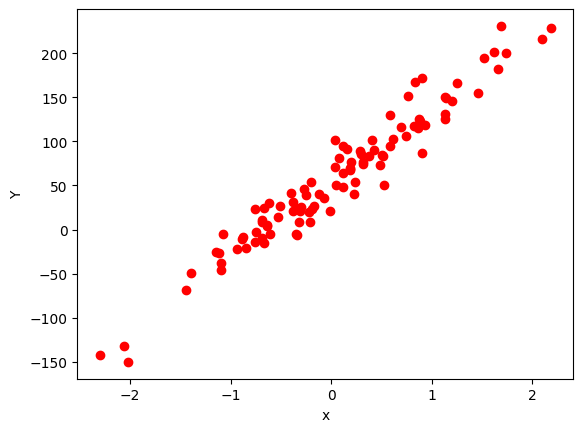
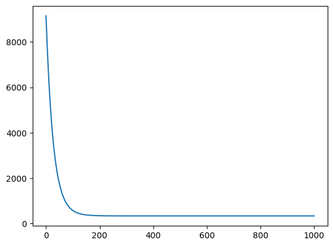
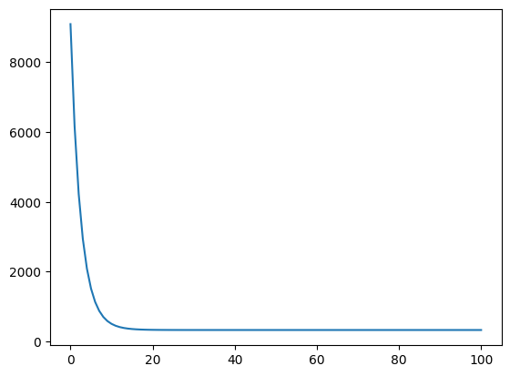
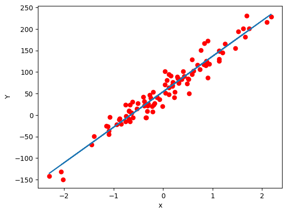

<!-- editorlm-hebrew-html-start -->
<style>
html, body, .vscode-body, .markdown-body, .markdown-preview, #write {
  direction: rtl !important; text-align: right !important;
}
ul, ol { padding-right: 2em !important; padding-left: 0 !important; }
blockquote { border-right: 3px solid #999; border-left: 0; padding-right: 1rem; padding-left: 0; }
@media print {
  html, body, .vscode-body, .markdown-body, .markdown-preview, #write {
    direction: rtl !important; text-align: right !important;
  }
}
</style>
<!-- editorlm-hebrew-html-end -->
<style>
.book { max-width: 900px; margin: auto; line-height: 1.8; font-family: Arial, sans-serif; }
.book .cover { min-height: 680px; box-sizing: border-box; padding: 64px 48px; margin: 24px 0 60px; background: #112b41; color: #f5f8fc; border-top: 9px solid #39c4b5; position: relative; }
.book .cover .eyebrow { color: #81e0d5; font-size: 15px; letter-spacing: 2px; }
.book .cover h1 { color: #fff; font-size: 48px; line-height: 1.3; border: 0; margin: 50px 0 18px; }
.book .cover .subtitle { font-size: 28px; color: #d8e6f0; }
.book .cover .author { font-size: 30px; color: #fff; margin-top: 52px; }
.book .cover .audience { color: #c1d3df; margin-top: 12px; }
.book .cover .motif { direction: ltr; text-align: left; font-family: Consolas, monospace; color: #81e0d5; font-size: 19px; margin-top: 54px; }
.book h1, .book h2, .book h3 { line-height: 1.4; font-weight: 700; }
.book > h1 { font-size: 32px !important; text-align: center !important; margin: 28px 0; }
.book h2 { font-size: 34px !important; text-align: center !important; color: #153b56 !important; background: #eef5fc; border: 0; border-bottom: 4px solid #299c91; border-radius: 10px 10px 0 0; padding: 28px 20px; margin: 24px 0 36px; }
.book h3 { font-size: 24px !important; text-align: right !important; color: #174e49 !important; background: #edf7f5; border: 0; border-right: 5px solid #299c91; border-radius: 6px; padding: 10px 16px; margin: 36px 0 18px; }
.book .chapter { height: 0; margin: 76px 0 0; border-top: 1px solid #ccd7df; break-before: page; page-break-before: always; break-after: avoid; page-break-after: avoid; }
.book .toc { padding: 24px; border-right: 5px solid #39a99d; background: rgba(70,150,155,.09); margin: 24px 0 48px; }
.book pre, .book pre code { direction: ltr !important; text-align: left !important; unicode-bidi: isolate; }
.book pre { box-sizing: border-box !important; width: 100% !important; max-width: 100% !important; margin: 0 !important; padding: 16px 20px; border: 1px solid #ccd7df; border-radius: 8px; line-height: 1.6; overflow-x: auto; }
.book code { direction: ltr; unicode-bidi: isolate; font-family: Consolas, "Courier New", monospace; }
.book pre { background: #f3f6fa !important; color: #1f2937 !important; }
.book pre code, .book pre code.hljs { background: transparent !important; color: #1f2937 !important; }
.book pre .hljs-keyword, .book pre .hljs-literal { color: #6f299c !important; }
.book pre .hljs-string { color: #216338 !important; }
.book pre .hljs-number { color: #075e68 !important; }
.book pre .hljs-comment { color: #526174 !important; }
.book pre .hljs-built_in, .book pre .hljs-title { color: #135b96 !important; }
.book table { width: 100%; }
.book th, .book td { text-align: right; }
.book .small { font-size: .9em; opacity: .8; }
.book .python-intro { display: flex; align-items: center; gap: 28px; padding: 22px 28px; margin: 24px 0; background: #eef5fc; color: #183e63; border-right: 6px solid #3776ab; border-radius: 10px; }
.book .python-intro strong { font-size: 30px; }
.book .python-fact { background: #fff7d6; color: #423611; border-right: 6px solid #ffd343; border-radius: 8px; padding: 18px 24px; margin: 22px 0; }
.book .python-fact strong { font-size: 24px; }
.book img { max-width: 100%; height: auto; }
.book figure { margin: 24px auto; text-align: center; }
.book figure img { display: block; margin: auto; }
.book figcaption { direction: rtl; text-align: center; font-size: .9em; color: #445566; }
@media print { .book > h2 { break-before: page; page-break-before: always; } }
.book .screen-strip { width: 760px; max-width: 100%; height: 220px; overflow: hidden; border: 1px solid #bccad5; border-radius: 8px; margin: 20px auto 8px; direction: ltr; }
.book .screen-strip.output { height: 265px; }
.book .screen-strip img { display: block; width: 1745px; max-width: none; }
.book .screen-menu { width: 400px; max-width: 100%; height: 295px; overflow: hidden; direction: ltr; margin: 20px auto 8px; border: 1px solid #bccad5; border-radius: 8px; }
.book .screen-menu img { display: block; width: 1745px; max-width: none; }
.book .code-panel { box-sizing: border-box !important; display: block !important; width: 75% !important; max-width: 75% !important; margin: 18px auto !important; }
@media print {
  .book .cover { min-height: 85vh; break-after: page; print-color-adjust: exact; -webkit-print-color-adjust: exact; }
  .book pre { white-space: pre-wrap; break-inside: avoid; }
  .book .chapter { margin: 0; border: 0; }
  .book h1, .book h2, .book h3 { break-after: avoid; page-break-after: avoid; break-inside: avoid; }
  .book h2 { margin-top: 0; }
  .book h2, .book h3 { print-color-adjust: exact; -webkit-print-color-adjust: exact; }
}
</style>

<style>
.book .book-nav { display: flex; flex-wrap: wrap; gap: 10px; justify-content: center; align-items: center; padding: 16px 0; margin: 20px 0 32px; border-top: 1px solid #ccd7df; border-bottom: 1px solid #ccd7df; }
.book .book-nav a { display: inline-block; padding: 10px 18px; border-radius: 8px; background: #eef5fc; color: #153b56 !important; border: 1px solid #b5ccd9; text-decoration: none !important; font-size: 16px; font-weight: bold; }
.book .book-nav a.toc-link { background: #174e49; color: #fff !important; border-color: #174e49; }
.book .book-nav a:hover, .book .book-nav a:focus { background: #d4eee8; color: #153b56 !important; outline: 2px solid #299c91; outline-offset: 2px; }
.book .section-list { line-height: 2; }
@media print { .book .book-nav { display: none; } }

/* Explicit Hebrew direction, including prose beginning with English. */
.book p, .book ul, .book ol, .book li,
.book blockquote, .book h1, .book h2, .book h3,
.book h4, .book th, .book td {
  direction: rtl !important;
  text-align: right !important;
  unicode-bidi: isolate;
}
/* Chapter titles keep their agreed centered layout. */
.book h2 { text-align: center !important; }
.book pre, .book pre code, .book .code-panel {
  direction: ltr !important;
  text-align: left !important;
  unicode-bidi: isolate;
}
</style>

<div class="book" dir="rtl" lang="he" style="direction: rtl !important; text-align: right !important;">

<nav class="book-nav" aria-label="ניווט בספר">
<a href="07-%D7%A8%D7%92%D7%A8%D7%A1%D7%99%D7%94%20%D7%9C%D7%99%D7%A0%D7%90%D7%A8%D7%99%D7%AA.md">→ הקודם</a>
<a class="toc-link" href="../index.md">תוכן העניינים</a>
<a href="09-%D7%A0%D7%A8%D7%9E%D7%95%D7%9C%20%D7%A0%D7%AA%D7%95%D7%A0%D7%99%D7%9D.md">הבא ←</a>
</nav>

## ג.8 רגרסיה עם הטיה ו־nn.Linear

בפרק הקודם למדנו להתאים לנתונים ישר מהצורה y = wx, וסיימנו בקבוצת נקודות שנוצרה מהנוסחה y = 2x + 5. ישר כזה אינו עובר בראשית הצירים, ולכן שום בחירה של w לבדה לא תתאר אותו: המודל שלנו "כבול" לנקודה (0, 0). זה מצב נפוץ מאוד בעולם האמיתי. מחיר של נסיעה במונית מתחיל מתעריף פתיחה גם לפני הקילומטר הראשון; חשבון חשמל כולל תשלום קבוע שאינו תלוי בצריכה; ובמדידת טמפרטורה יש קשר ישר בין צלזיוס לפרנהייט, אך 0 מעלות צלזיוס אינן 0 פרנהייט. בכל המקרים האלה הישר חוצה את ציר y בגובה שאינו אפס.

הפתרון הוא להוסיף למודל פרמטר שני, **ההטיה — Bias**, שמסומן b: המודל הופך ל־y = wx + b. המשקל w עדיין קובע את השיפוע, וההטיה b קובעת את הגובה שבו הישר חוצה את ציר y — כלומר את התחזית כשהקלט הוא אפס. שני הפרמטרים נלמדים יחד באותו תהליך בדיוק: לכל זוג (w, b) יש הפסד, ו־Gradient Descent מוצא את הזוג שממזער אותו, בדיוק כפי שמצאנו מינימום של פונקציה בשני משתנים בפרק ג.6.

בפרק זה נעשה את הדבר פעמיים. תחילה נבנה את המודל בעצמנו, עם שני טנסורים W ו־B, כדי לראות שאין כאן שום קסם. אחר כך נכיר את `torch.nn`, ספריית המודלים של PyTorch, ונראה שהיא מספקת את אותו מודל בשורה אחת — יחד עם פונקציית הפסד מוכנה. זהו הכלי שבו נבנה בהמשך גם רשתות נוירונים שלמות, ולכן חשוב לראות שהוא מסתיר בדיוק את מה שכתבנו ידנית.

נמשיך אפוא בהתאמת קו ישר, והפעם נוסיף הטיה המאפשרת לו לחתוך את ציר y גם מחוץ לראשית. נתאים את הקו ל־100 נקודות. נבנה תחילה את המודל באמצעות פרמטרים שנגדיר בעצמנו, ולאחר מכן נשתמש ב־`torch.nn` להגדרת אותו סוג של מודל.

<!-- editorlm-source-ref: [sources/ML/converted/5.2_Linear_Regresion/notebook.md#L7-L55] -->

**[השיעור וההרצאות באתר של גלעד מרקמן](https://webprogramming.azurewebsites.net/Pages/PyTorch/Linear_Reg.aspx)**

**חומרי הליווי:** [5.2. רגרסיה לינארית](../../../sources/ML/5.2.%20%D7%A8%D7%92%D7%A8%D7%A1%D7%99%D7%94%20%D7%9C%D7%99%D7%A0%D7%90%D7%A8%D7%99%D7%AA.pptx) · [מחברת רגרסיה עם nn.Linear](../../../sources/ML/Colab/5.2_Linear_Regresion.ipynb)

נייבא את הספריות. שתיים מהן חדשות: `torch.nn` היא ספריית המודלים של PyTorch, ו־`sklearn.datasets` היא חלק מספריית scikit-learn, שתשמש אותנו ליצירת נתוני דוגמה:

<div class="code-panel" dir="ltr">

```python
import torch
import numpy as np
import matplotlib.pyplot as plt
import torch.nn as nn
from sklearn import datasets
```

</div>

סדר העבודה נשאר כפי שהיה בפרק הקודם: הכנת נתונים, הגדרת מודל, הגדרת הפסד ואופטימייזר, ולולאת אימון הכוללת חיזוי, חישוב נגזרות ועדכון פרמטרים.

<!-- editorlm-source-ref: [sources/ML/converted/5.2_Linear_Regresion/notebook.md#L28-L39] -->

### הכנת הנתונים

במקום להקליד נקודות ידנית, ניעזר בפונקציה מוכנה שמייצרת נתונים המתאימים לרגרסיה: היא בוחרת ישר, מפזרת סביבו נקודות ומוסיפה רעש אקראי, בדומה למה שעשינו בפרק הקודם עם `torch.rand`. ניצור 100 זוגות (x, y) באמצעות `make_regression`. לכל דוגמה יש תכונת קלט אחת; `noise=20` מוסיף רעש, ו־`bias=50` מוסיף איבר קבוע לנתוני y — כלומר הישר שממנו נוצרו הנתונים אינו עובר בראשית, וזו בדיוק הסיבה שאנו זקוקים להטיה. `random_state=1` קובע את המספרים האקראיים כך שהנתונים יהיו זהים בכל הרצה.

<div class="code-panel" dir="ltr">

```python
x_np, y_np = datasets.make_regression(n_samples=100, n_features=1, noise=20, random_state=1, bias=50)
print (x_np.shape , y_np.shape)
plt.scatter(x_np, y_np, color='red')
plt.xlabel("x")
plt.ylabel("Y")
plt.show()
```

</div>

**פלט**

<div class="code-panel" dir="ltr">

```text
(100, 1) (100,)
```

</div>


<figure>

<figcaption>מאה נקודות שנוצרו לצורך התאמת ישר.</figcaption>
</figure>

הפלט `(100, 1) (100,)` מספר לנו על צורת הנתונים: x הוא מערך של 100 שורות ועמודה אחת, ואילו y הוא מערך חד־ממדי של 100 ערכים. ההבדל הזה יחייב אותנו לטפל בצורה של y בסעיף הבא. מי שרוצה לראות את הערכים עצמם יכול להדפיס את שני המערכים:

<div class="code-panel" dir="ltr">

```python
print(x_np)
print(y_np)
```

</div>


<!-- editorlm-source-ref: [sources/ML/converted/5.2_Linear_Regresion/notebook.md#L40-L216] -->

### המרה לטנסורים

הפונקציה `make_regression` מחזירה מערכי NumPy, ואילו האימון ב־PyTorch עובד על טנסורים. נמיר את הנתונים לטנסורים מסוג `float32`, הסוג שבו PyTorch עובד כברירת מחדל. מערך x כבר בנוי מ־100 שורות ועמודה אחת; מערך y הוא חד־ממדי, ולכן נעצב אותו גם כן ל־100 שורות ועמודה אחת. הפקודה `reshape(-1,1)` פירושה "עמודה אחת, ומספר השורות ייקבע לפי כמות הערכים".

<div class="code-panel" dir="ltr">

```python
# Prepare tensors

X = torch.from_numpy(x_np.astype(np.float32))
Y = torch.from_numpy(y_np.astype(np.float32))
# Y = Y.view(Y.shape[0],1)
Y = Y.reshape(-1,1)


print (X.shape, X.dtype)
print(Y.shape, Y.dtype)
# print (Y)
```

</div>

**פלט**

<div class="code-panel" dir="ltr">

```text
torch.Size([100, 1]) torch.float32
torch.Size([100, 1]) torch.float32
```

</div>

כך לכל שורת קלט מתאימה שורת תשובה אחת, ושני הטנסורים בעלי אותה צורה. ההקפדה על הצורות חשובה: כשנחסר בין התחזית ל־Y בפונקציית ההפסד, שני הטנסורים חייבים להיות באותה צורה, אחרת PyTorch עלול לחסר "כל אחד מכל אחד" ולתת תוצאה שגויה בלי הודעת שגיאה.

<!-- editorlm-source-ref: [sources/ML/converted/5.2_Linear_Regresion/notebook.md#L217-L253] -->

### הגדרת הפרמטרים, המודל, ההפסד והאופטימייזר

כעת נבנה את המודל בעצמנו, בדיוק כמו בפרק הקודם, אלא שיש בו פרמטר נוסף. המודל הוא `y = wx + b`: המשקל w קובע את השיפוע, וההטיה b קובעת את החיתוך עם ציר y. לכן נגדיר שני פרמטרים, W ו־B, ונעביר את שניהם לאופטימייזר. שניהם מאותחלים לאפס, כלומר הישר ההתחלתי הוא ציר x עצמו, והאופטימייזר יעדכן את שניהם בכל צעד לפי הנגזרת של כל אחד.

נוסיף גם רשימה בשם `losses` לשמירת ערכי ההפסד, כדי שנוכל לצייר בסוף האימון גרף המראה כיצד ההפסד ירד מאיטרציה לאיטרציה:

<div class="code-panel" dir="ltr">

```python
W = torch.tensor([0.0], requires_grad=True)
B = torch.tensor([0.0], requires_grad=True)

learning_rate = 0.01
epochs = 1000
losses = []

# design model
def Model(X):
    return W * X + B

#construct loss and optimizer
def Loss (Y_predict, Y):
    return ((Y_predict-Y)**2).mean()   # (W * X + B - Y)^2

# optimizer
optimizer = torch.optim.SGD([W, B], lr=learning_rate) # W = W - grad * LR / B -= grad * LR
```

</div>


<!-- editorlm-source-ref: [sources/ML/converted/5.2_Linear_Regresion/notebook.md#L254-L288] -->

### לולאת האימון

לולאת האימון זהה במבנה לזו שכתבנו בפרק הקודם. באימון נעדכן יחד את המשקל ואת ההטיה כדי להקטין את ההפסד: קריאה אחת ל־`backward()` מחשבת את הנגזרת לפי שני הפרמטרים, וקריאה אחת ל־`optimizer.step()` מעדכנת את שניהם. הלולאה `range(epochs+1)` מבצעת 1,001 איטרציות, ממספר 0 עד 1,000. בכל איטרציה נשמור את ההפסד ברשימה ונאפס את הנגזרות לאחר העדכון.

<div class="code-panel" dir="ltr">

```python
for epoch in range(epochs+1):
    # forward
    Y_predict = Model(X)

    # backward
    loss = Loss(Y_predict, Y)
    loss.backward()

    # Update parameters
    optimizer.step()  # W = W - grad * LR

    if epoch % 10 == 0:
        print(f"epoch= {epoch} loss={loss.item():.3f} ")

    losses.append(loss.item())

    # zero grads
    optimizer.zero_grad()
```

</div>


<!-- editorlm-source-ref: [sources/ML/converted/5.2_Linear_Regresion/notebook.md#L293-L321] -->

גרף ההפסד הוא הכלי הבסיסי ביותר לבדיקה שהאימון מתנהל כשורה: אנו מצפים לעקומה שיורדת במהירות בתחילה ואחר כך מתיישרת, כלומר ההפסד מתייצב ואין עוד מה לשפר. נציג את ההפסד לאורך האימון:

<div class="code-panel" dir="ltr">

```python
# print(losses)
plt.plot (losses)
```

</div>


<figure>

<figcaption>הציר האופקי מציג את מספר האיטרציה, והאנכי את ההפסד.</figcaption>
</figure>


<!-- editorlm-source-ref: [sources/ML/converted/5.2_Linear_Regresion/notebook.md#L322-L345] -->

### הצגת התוצאה

נציג את ההפסד האחרון ואת הקו שהתקבל. כדי לצייר את הישר נחשב את תחזית המודל עבור כל ערכי X, בתוך `torch.no_grad()` כי אין צורך בנגזרות, ונמיר את התוצאה למערך NumPy באמצעות `.detach().numpy()`:

<div class="code-panel" dir="ltr">

```python
print(f"END: loss={loss.item():.4f}")
plt.scatter(x_np, y_np, color='red')
plt.xlabel("x")
plt.ylabel("Y")

with torch.no_grad():
    predicted = Model(X).detach().numpy()
    plt.plot (x_np, predicted, color = "green")
    plt.show()
```

</div>

**פלט**

<div class="code-panel" dir="ltr">

```text
END: loss=332.5676
```

</div>


<figure>

<figcaption>הקו הירוק שנלמד באמצעות W ו־B, לצד הנקודות האדומות.</figcaption>
</figure>

ההפסד הסופי, כ־332, נראה גדול לעומת הפרק הקודם, אך יש לזכור שהוא ממוצע של ריבועי שגיאות: הנתונים נוצרו עם רעש בסדר גודל של 20, וריבוע של 20 הוא 400. ההפסד הזה משקף אפוא את הרעש שבנתונים ולא כשל של המודל; הישר עצמו עובר יפה במרכז ענן הנקודות.


<!-- editorlm-source-ref: [sources/ML/converted/5.2_Linear_Regresion/notebook.md#L346-L380] -->

### שימוש ב־torch.nn

עד עכשיו כתבנו את המודל ואת פונקציית ההפסד בעצמנו. עבור ישר עם שני פרמטרים זה קל, אך רשת נוירונים יכולה להכיל אלפי פרמטרים, ואיש אינו רוצה להגדיר כל אחד מהם ידנית. לשם כך קיימת הספרייה `torch.nn`, שמספקת אבני בניין מוכנות למודלים; כל אבן בניין כזו נקראת **שכבה — Layer**. PyTorch מספקת מודל לינארי מוכן. `nn.Linear(1, 1, bias=True)` מגדירה קלט אחד ופלט אחד, עם משקל והטיה, ומבצעת את החישוב `wx+b` — בדיוק הפונקציה `Model` שכתבנו למעלה. המספרים בסוגריים הם מספר ערכי הקלט ומספר ערכי הפלט; בפרקים הבאים נראה שכבות עם קלטים ופלטים רבים.

גם פונקציית ההפסד מוכנה: `nn.MSELoss()` מחשבת את ממוצע ריבועי השגיאות, בדיוק כמו הפונקציה `Loss` שלנו. השכבה יוצרת ומאתחלת את הפרמטרים בעצמה, בערכים אקראיים קטנים, ולכן איננו יכולים לכתוב `[W, B]` כבעבר; במקום זאת מעבירים לאופטימייזר את `Model.parameters()`, שמחזירה את כל הפרמטרים שהשכבה מחזיקה. שימו לב שהפעם נשתמש בקצב למידה גדול יותר, 0.1, ובפחות אפוקים — 100 במקום 1,000:

<div class="code-panel" dir="ltr">

```python
learning_rate = 0.1
epochs = 100
losses = []

# design model
Model = nn.Linear(1, 1, bias=True) # model = W * X + B

#construct loss and optimizer
Loss = nn.MSELoss() # Mean squared error

# init optimizer
optimizer = torch.optim.SGD(Model.parameters(), lr=learning_rate)
```

</div>


<!-- editorlm-source-ref: [sources/ML/converted/5.2_Linear_Regresion/notebook.md#L381-L446] -->

### אימון המודל המוכן

לולאת האימון אינה משתנה כלל — זהו היופי של הגישה: החלפנו את המודל ואת פונקציית ההפסד ברכיבים מוכנים, אך הקריאות `Model(X)`, `Loss(...)`, `backward()`, `step()` ו־`zero_grad()` נשארות בדיוק כפי שהיו. נריץ את אותה לולאת אימון, הפעם בקצב 0.1 וב־101 איטרציות:

<div class="code-panel" dir="ltr">

```python
for epoch in range(epochs+1):
    # forward
    Y_predict = Model(X)

    # backward
    loss = Loss(Y_predict, Y)
    loss.backward()

    # Update parameters
    optimizer.step()

    if epoch % 10 == 0:
        print(f"epoch= {epoch} loss={loss.item():.3f} ")

    losses.append(loss.item())

    # zero grads
    optimizer.zero_grad()
```

</div>

הפלט השמור הבא מדגים את הירידה בהפסד; ערכי ההתחלה עשויים להשתנות מהרצה להרצה, משום שפרמטרי השכבה מאותחלים באקראי בכל פעם שיוצרים אותה.

**פלט**

<div class="code-panel" dir="ltr">

```text
epoch= 0 loss=9087.091 
epoch= 10 loss=508.141 
epoch= 20 loss=337.327 
epoch= 30 loss=332.720 
epoch= 40 loss=332.573 
epoch= 50 loss=332.568 
epoch= 60 loss=332.568 
epoch= 70 loss=332.568 
epoch= 80 loss=332.568 
epoch= 90 loss=332.568 
epoch= 100 loss=332.568
```

</div>

ההפסד צונח מכ־9,087 לכ־508 כבר אחרי עשרה אפוקים, ומהאפוק ה־50 הוא מתייצב על 332.568 ואינו משתנה עוד. זהו אותו הפסד סופי שקיבלנו במודל הידני — שני המודלים מצאו את אותו ישר. בזכות קצב הלמידה הגדול פי 10 נדרשו כאן רק כמה עשרות אפוקים במקום מאות. נציג את גרף ההפסד:

<div class="code-panel" dir="ltr">

```python
# print(losses)
plt.plot (losses)
```

</div>


<figure>

<figcaption>ההפסד לאורך אימון המודל המבוסס על nn.Linear.</figcaption>
</figure>


<!-- editorlm-source-ref: [sources/ML/converted/5.2_Linear_Regresion/notebook.md#L447-L516] -->

### הצגת התוצאה והפרמטרים

נציג את ההפסד האחרון ואת הישר שהתקבל:

<div class="code-panel" dir="ltr">

```python
print(f"END: loss={loss.item():.4f}")
plt.scatter(x_np, y_np, color='red')
plt.xlabel("x")
plt.ylabel("Y")

with torch.no_grad():
    predicted = Model(X).detach().numpy()
    plt.plot (x_np, predicted)
    plt.show()
```

</div>

**פלט**

<div class="code-panel" dir="ltr">

```text
END: loss=332.5675
```

</div>


<figure>

<figcaption>הקו שנלמד באמצעות nn.Linear, לצד הנתונים.</figcaption>
</figure>


<!-- editorlm-source-ref: [sources/ML/converted/5.2_Linear_Regresion/notebook.md#L517-L551] -->

במודל הידני יכולנו פשוט להדפיס את W ואת B. בשכבה של `torch.nn` הפרמטרים חיים בתוך האובייקט, ואפשר לגשת אליהם באמצעות `named_parameters()`, שמחזירה לכל פרמטר את שמו ואת ערכו. נקרא את שמות הפרמטרים ואת ערכיהם:

<div class="code-panel" dir="ltr">

```python
# print(W)
for name, param in Model.named_parameters():
    print(name, param)
```

</div>

**פלט**

<div class="code-panel" dir="ltr">

```text
weight Parameter containing:
tensor([[82.4845]], requires_grad=True)
bias Parameter containing:
tensor([54.0540], requires_grad=True)
```

</div>

השכבה קוראת למשקל `weight` ולהטיה `bias`. הישר שנלמד הוא אפוא בקירוב y = 82.5x + 54. ההטיה שנלמדה, 54, קרובה ל־50 — הערך שנתנו ל־`bias` בעת יצירת הנתונים — והפער נובע מהרעש. המשקל מופיע כמטריצה של 1×1 ולא כמספר בודד, כי `nn.Linear` בנויה מראש למספר כלשהו של קלטים ופלטים.


<!-- editorlm-source-ref: [sources/ML/converted/5.2_Linear_Regresion/notebook.md#L552-L573] -->

### חיזוי

הגענו למטרה שלשמה עשינו את כל זה: לאחר האימון אפשר להשתמש במודל כדי לחזות תוצאות עבור קלטים חדשים, כאלה שלא היו בין 100 הנקודות. נעביר למודל שלוש דוגמאות חדשות: 0, 1 ו־1.5, ונציג את התחזיות. הקלט חייב להיות טנסור באותה צורה שעליה אומן המודל — עמודה אחת — ולכן כל דוגמה כתובה בסוגריים משלה:

<div class="code-panel" dir="ltr">

```python
test = torch.tensor(([0],[1], [1.5]), dtype=torch.float32);
with torch.no_grad():
    print(Model(test))
```

</div>

**פלט**

<div class="code-panel" dir="ltr">

```text
tensor([[ 54.0540],
        [136.5385],
        [177.7808]])
```

</div>

התחזיות מתיישבות עם הפרמטרים שקראנו: עבור קלט 0 המודל מחזיר בדיוק את ההטיה, 54.054; עבור קלט 1 הוא מחזיר משקל ועוד הטיה, כ־136.5; ועבור 1.5 — כ־177.8. זוהי ההכללה שדיברנו עליה בפרק הקודם: המודל לא ראה מעולם את הקלט 1.5, ובכל זאת נתן לו הערכה המבוססת על הקשר שלמד.


<!-- editorlm-source-ref: [sources/ML/converted/5.2_Linear_Regresion/notebook.md#L574-L593] -->


<nav class="book-nav" aria-label="ניווט בספר">
<a href="07-%D7%A8%D7%92%D7%A8%D7%A1%D7%99%D7%94%20%D7%9C%D7%99%D7%A0%D7%90%D7%A8%D7%99%D7%AA.md">→ הקודם</a>
<a class="toc-link" href="../index.md">תוכן העניינים</a>
<a href="09-%D7%A0%D7%A8%D7%9E%D7%95%D7%9C%20%D7%A0%D7%AA%D7%95%D7%A0%D7%99%D7%9D.md">הבא ←</a>
</nav>

</div>

<!-- editorlm-source-versions: {"schemaVersion":1,"sources":{"sources/ML/converted/5.2_Linear_Regresion/notebook.md":{"sourceSha256":"7d69a903b6a51f1744f4f8c4c4b0087eb7c73d03d46096e8d1e43c5a4301a795","canonicalTextSha256":"7d69a903b6a51f1744f4f8c4c4b0087eb7c73d03d46096e8d1e43c5a4301a795"}}} -->
