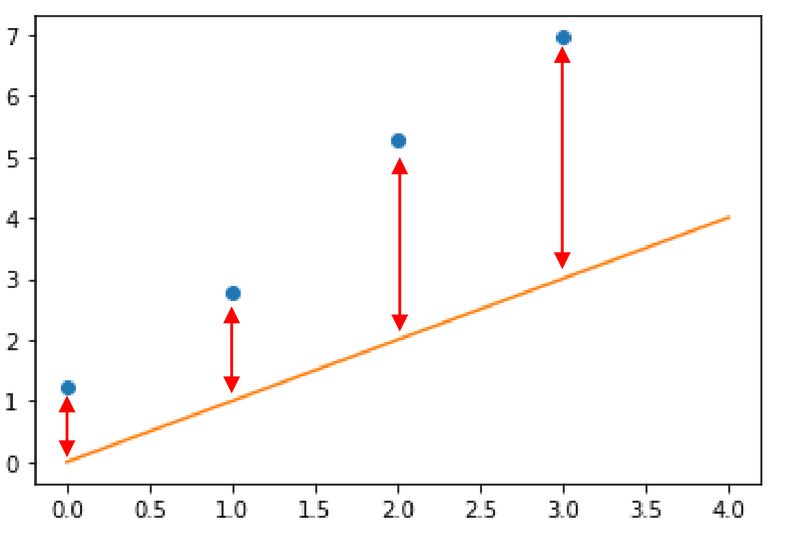
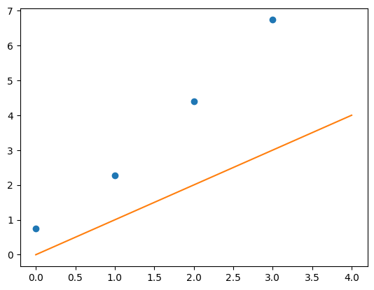
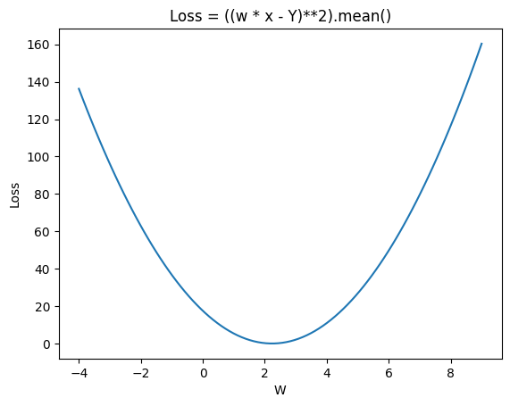

<!-- editorlm-hebrew-html-start -->
<style>
html, body, .vscode-body, .markdown-body, .markdown-preview, #write {
  direction: rtl !important; text-align: right !important;
}
ul, ol { padding-right: 2em !important; padding-left: 0 !important; }
blockquote { border-right: 3px solid #999; border-left: 0; padding-right: 1rem; padding-left: 0; }
@media print {
  html, body, .vscode-body, .markdown-body, .markdown-preview, #write {
    direction: rtl !important; text-align: right !important;
  }
}
</style>
<!-- editorlm-hebrew-html-end -->
<style>
.book { max-width: 900px; margin: auto; line-height: 1.8; font-family: Arial, sans-serif; }
.book .cover { min-height: 680px; box-sizing: border-box; padding: 64px 48px; margin: 24px 0 60px; background: #112b41; color: #f5f8fc; border-top: 9px solid #39c4b5; position: relative; }
.book .cover .eyebrow { color: #81e0d5; font-size: 15px; letter-spacing: 2px; }
.book .cover h1 { color: #fff; font-size: 48px; line-height: 1.3; border: 0; margin: 50px 0 18px; }
.book .cover .subtitle { font-size: 28px; color: #d8e6f0; }
.book .cover .author { font-size: 30px; color: #fff; margin-top: 52px; }
.book .cover .audience { color: #c1d3df; margin-top: 12px; }
.book .cover .motif { direction: ltr; text-align: left; font-family: Consolas, monospace; color: #81e0d5; font-size: 19px; margin-top: 54px; }
.book h1, .book h2, .book h3 { line-height: 1.4; font-weight: 700; }
.book > h1 { font-size: 32px !important; text-align: center !important; margin: 28px 0; }
.book h2 { font-size: 34px !important; text-align: center !important; color: #153b56 !important; background: #eef5fc; border: 0; border-bottom: 4px solid #299c91; border-radius: 10px 10px 0 0; padding: 28px 20px; margin: 24px 0 36px; }
.book h3 { font-size: 24px !important; text-align: right !important; color: #174e49 !important; background: #edf7f5; border: 0; border-right: 5px solid #299c91; border-radius: 6px; padding: 10px 16px; margin: 36px 0 18px; }
.book .chapter { height: 0; margin: 76px 0 0; border-top: 1px solid #ccd7df; break-before: page; page-break-before: always; break-after: avoid; page-break-after: avoid; }
.book .toc { padding: 24px; border-right: 5px solid #39a99d; background: rgba(70,150,155,.09); margin: 24px 0 48px; }
.book pre, .book pre code { direction: ltr !important; text-align: left !important; unicode-bidi: isolate; }
.book pre { box-sizing: border-box !important; width: 100% !important; max-width: 100% !important; margin: 0 !important; padding: 16px 20px; border: 1px solid #ccd7df; border-radius: 8px; line-height: 1.6; overflow-x: auto; }
.book code { direction: ltr; unicode-bidi: isolate; font-family: Consolas, "Courier New", monospace; }
.book pre { background: #f3f6fa !important; color: #1f2937 !important; }
.book pre code, .book pre code.hljs { background: transparent !important; color: #1f2937 !important; }
.book pre .hljs-keyword, .book pre .hljs-literal { color: #6f299c !important; }
.book pre .hljs-string { color: #216338 !important; }
.book pre .hljs-number { color: #075e68 !important; }
.book pre .hljs-comment { color: #526174 !important; }
.book pre .hljs-built_in, .book pre .hljs-title { color: #135b96 !important; }
.book table { width: 75%; max-width: 75%; margin: 18px auto; }
.book th, .book td { text-align: right; }
.book .small { font-size: .9em; opacity: .8; }
.book .python-intro { display: flex; align-items: center; gap: 28px; padding: 22px 28px; margin: 24px 0; background: #eef5fc; color: #183e63; border-right: 6px solid #3776ab; border-radius: 10px; }
.book .python-intro strong { font-size: 30px; }
.book .python-fact { background: #fff7d6; color: #423611; border-right: 6px solid #ffd343; border-radius: 8px; padding: 18px 24px; margin: 22px 0; }
.book .python-fact strong { font-size: 24px; }
.book img { max-width: 100%; height: auto; }
.book figure { margin: 24px auto; text-align: center; }
.book figure img { display: block; margin: auto; }
.book figcaption { direction: rtl; text-align: center; font-size: .9em; color: #445566; }
@media print { .book > h2 { break-before: page; page-break-before: always; } }
.book .screen-strip { width: 760px; max-width: 100%; height: 220px; overflow: hidden; border: 1px solid #bccad5; border-radius: 8px; margin: 20px auto 8px; direction: ltr; }
.book .screen-strip.output { height: 265px; }
.book .screen-strip img { display: block; width: 1745px; max-width: none; }
.book .screen-menu { width: 400px; max-width: 100%; height: 295px; overflow: hidden; direction: ltr; margin: 20px auto 8px; border: 1px solid #bccad5; border-radius: 8px; }
.book .screen-menu img { display: block; width: 1745px; max-width: none; }
.book .code-panel { box-sizing: border-box !important; display: block !important; width: 75% !important; max-width: 75% !important; margin: 18px auto !important; }
@media print {
  .book .cover { min-height: 85vh; break-after: page; print-color-adjust: exact; -webkit-print-color-adjust: exact; }
  .book pre { white-space: pre-wrap; break-inside: avoid; }
  .book .chapter { margin: 0; border: 0; }
  .book h1, .book h2, .book h3 { break-after: avoid; page-break-after: avoid; break-inside: avoid; }
  .book h2 { margin-top: 0; }
  .book h2, .book h3 { print-color-adjust: exact; -webkit-print-color-adjust: exact; }
}
</style>

<style>
.book .book-nav { display: flex; flex-wrap: wrap; gap: 10px; justify-content: center; align-items: center; padding: 16px 0; margin: 20px 0 32px; border-top: 1px solid #ccd7df; border-bottom: 1px solid #ccd7df; }
.book .book-nav a { display: inline-block; padding: 10px 18px; border-radius: 8px; background: #eef5fc; color: #153b56 !important; border: 1px solid #b5ccd9; text-decoration: none !important; font-size: 16px; font-weight: bold; }
.book .book-nav a.toc-link { background: #174e49; color: #fff !important; border-color: #174e49; }
.book .book-nav a:hover, .book .book-nav a:focus { background: #d4eee8; color: #153b56 !important; outline: 2px solid #299c91; outline-offset: 2px; }
.book .section-list { line-height: 2; }
@media print { .book .book-nav { display: none; } }

/* Explicit Hebrew direction, including prose beginning with English. */
.book p, .book ul, .book ol, .book li,
.book blockquote, .book h1, .book h2, .book h3,
.book h4, .book th, .book td {
  direction: rtl !important;
  text-align: right !important;
  unicode-bidi: isolate;
}
/* Chapter titles keep their agreed centered layout. */
.book h2 { text-align: center !important; }
.book pre, .book pre code, .book .code-panel {
  direction: ltr !important;
  text-align: left !important;
  unicode-bidi: isolate;
}
/* Display math renders left-to-right and centered, independent of the RTL page. */
.book .math-panel, .book .math-panel .katex-display, .book .math-panel .katex {
  direction: ltr !important;
  text-align: center !important;
  unicode-bidi: isolate;
}
</style>

<div class="book" dir="rtl" lang="he" style="direction: rtl !important; text-align: right !important;">

<nav class="book-nav" aria-label="ניווט בספר">
<a href="07-%D7%A8%D7%92%D7%A8%D7%A1%D7%99%D7%94%20%D7%9C%D7%99%D7%A0%D7%90%D7%A8%D7%99%D7%AA.md">→ הקודם</a>
<a class="toc-link" href="../index.md">תוכן העניינים</a>
<a href="09-%D7%94%D7%9E%D7%97%D7%9C%D7%A7%D7%94%20nn.Linear.md">הבא ←</a>
</nav>

## ג.8 רגרסיה לינארית — כמה נקודות

בפרק הקודם הישר נדרש להגיע לנקודה אחת, ולכן תמיד היה פתרון מושלם: הטעות ירדה לאפס. במציאות, כמו בדוגמת המכירות של החנות, אוספים נקודות רבות, ובגלל הרעש האקראי שבכל מדידה הן אינן מסודרות על קו אחד. שום ישר לא יעבור בכל הנקודות, ובכל זאת אנו מחפשים ישר יחיד שמתאר את כולן "הכי טוב שאפשר": כזה שהטעויות שלו, על כל הנקודות יחד, קטנות ככל האפשר.

המודל נשאר אותו מודל, הישר <span dir="ltr">y = w·x</span> עם משקל אחד, וגם האלגוריתם והלולאה נשארים כפי שלמדנו בפרק ג.7. הדבר היחיד שצריך לחשוב עליו מחדש הוא פונקציית הטעות: כשיש כמה נקודות יש כמה טעויות, ונחוץ מספר אחד שמסכם את כולן. זה הנושא של פרק זה.

**[השיעור וההרצאות באתר של גלעד מרקמן](https://webprogramming.azurewebsites.net/Pages/PyTorch/Linear_Reg.aspx)**

**חומרי הליווי:** [5. רגרסיה לינארית](../../../sources/ML/5.%20%D7%A8%D7%92%D7%A8%D7%A1%D7%99%D7%94%20%D7%9C%D7%99%D7%A0%D7%90%D7%A8%D7%99%D7%AA.pptx) · [מחברת רגרסיה לינארית](../../../sources/ML/Colab/5_Linear_Regresion.ipynb)

### רגרסיה בארבע נקודות

נתונות לנו ארבע נקודות:

<div class="math-panel" dir="ltr">

$$
X = 0,\ 1,\ 2,\ 3 \qquad Y = 0.7576,\ 2.2793,\ 4.4031,\ 6.7347
$$

</div>

עלינו למצוא את נוסחת הקו הישר, המתחיל בראשית הצירים, שמתאר בצורה הטובה ביותר את הנקודות הללו. ידוע לנו שנוסחת הישר היא <span dir="ltr">y = w·x</span>, ולכן, בדיוק כמו בפרק הקודם, אנחנו מחפשים מספר אחד: את המשקל w. מבט בנתונים מגלה ש־y גדל בערך פי 2 מ־x, אבל לא בדיוק: לכל נקודה נוסף מספר אקראי קטן, ולכן שום ישר לא יעבור בכל הארבע.

#### הטעות של כל נקודה

נבחר ניחוש שרירותי, w = 1, ונצייר את הישר <span dir="ltr">y = 1·x</span> יחד עם הנקודות. בפרק הקודם היה חץ אחד בין הישר לנקודה; עכשיו יש ארבעה חצים, אחד לכל נקודה, כי לכל נקודה יש טעות משלה:

<figure>

<figcaption>ישר ניחוש (בכתום) וארבע נקודות. כל חץ אדום הוא הטעות של נקודה אחת: הפער בין מה שהישר מנבא עבור ה־x שלה לבין ערך ה־y האמיתי שלה. איור עקרוני מהמצגת; ערכי הנקודות בו שונים מעט מהנתונים שבפרק.</figcaption>
</figure>

נחשב את הטעויות עם הנתונים שלנו. עבור w = 1 הישר מנבא <span dir="ltr">y_predict = 0, 1, 2, 3</span>, והערכים האמיתיים הם <span dir="ltr">0.7576, 2.2793, 4.4031, 6.7347</span>. הטעות של כל נקודה, <span dir="ltr">y_predict − y</span>, היא בהתאמה <span dir="ltr">−0.76, −1.28, −2.40, −3.73</span>: הישר נמוך מדי בכל הנקודות, ויותר ויותר ככל ש־x גדל. כמו בפרק הקודם נעלה כל טעות בריבוע, כדי שתהיה מספר חיובי, ונקבל <span dir="ltr">0.57, 1.64, 5.77, 13.95</span>.

#### ממוצע הטעויות — MSE

יש לנו עכשיו ארבעה מספרים, אבל Gradient Descent יודע למזער פונקציה שמחזירה **מספר אחד**. איך מאחדים ארבע טעויות למספר אחד? **מחשבים את הממוצע שלהן**: מסכמים את ריבועי הטעויות של כל הנקודות ומחלקים במספר הנקודות. עבור הניחוש w = 1: הסכום הוא <span dir="ltr">0.57 + 1.64 + 5.77 + 13.95 = 21.93</span>, והממוצע הוא <span dir="ltr">21.93 / 4 = 5.48</span>. זהו ההפסד של הישר w = 1 על ארבע הנקודות יחד. פונקציית טעות זו נקראת **ממוצע ריבועי השגיאות — MSE, Mean Squared Error**:

<div class="math-panel" dir="ltr">

$$
loss=\frac{1}{n}\sum_{i=1}^{n}(y_{predict,i}-y_i)^2=\frac{1}{n}\sum_{i=1}^{n}(w\cdot x_i-y_i)^2
$$

</div>

הסימן Σ (סיגמא) פירושו "סכום על כל הנקודות", n הוא מספר הנקודות, ו־<span dir="ltr">1/n</span> הופך את הסכום לממוצע. שימו לב שגם כאן המשתנה של הפונקציה הוא w ולא x: כל ערכי x ו־y קבועים מהנתונים, ולכל ערך של w הפונקציה מחזירה מספר אחד, הטעות הממוצעת של הישר עם המשקל הזה.

מדוע ממוצע ולא סכום? הסכום גדל ככל שאוספים יותר נקודות, גם אם הישר טוב באותה מידה; הממוצע נשאר "טעות לנקודה", ולכן אפשר להשוות בין הפסדים של קבוצות נתונים בגדלים שונים ולקרוא את המספר באותה דרך תמיד. עכשיו המשימה זהה לזו של הפרק הקודם: למצוא את w שמביא את פונקציית הטעות למינימום, באמצעות Gradient Descent.

<!-- editorlm-source-ref: [sources/ML/pdf/5. רגרסיה לינארית.pdf#L41-L57] -->

### האלגוריתם

האלגוריתם הוא זה שלמדנו בפרק ג.7, עם שני הבדלים קטנים בשלבים 2 ו־3: התחזית מחושבת לכל הנקודות בבת אחת, והטעות היא ממוצע ריבועי השגיאות של כולן.

1. **מתחילים מ־w שרירותי.**
2. **מחשבים את התחזיות** של הישר לכל הנקודות: <span dir="ltr">y_predict = w·x</span> עבור כל x בנתונים.
3. **מחשבים את הטעות הממוצעת**: ריבוע הטעות של כל נקודה, ואז ממוצע על כל הנקודות (MSE).
4. **מחשבים את הנגזרת** של ההפסד לפי w.
5. **מעדכנים את המשקל** בכיוון ההפוך לנגזרת, ומאפסים את הנגזרת.
6. **חוזרים לשלב 2** עם ה־w החדש, עד שההפסד מפסיק לרדת.

הלולאה והחלוקה לחמשת חלקי התוכנית (הכנת הנתונים, בניית המודל, ההפסד והאופטימייזר, לולאת האימון, הדפסת התוצאות) נשארות כפי שהיו. ההבדל היחיד בקוד יהיה בפונקציית ההפסד.

<!-- editorlm-source-ref: [sources/ML/pdf/5. רגרסיה לינארית.pdf#L59-L61] -->

### מימוש בקוד

הקוד ממשיך את המחברת של הפרק הקודם ומשתמש באותם ייבואים:

<div class="code-panel" dir="ltr">

```python
import torch
import numpy as np
import matplotlib.pyplot as plt
```

</div>

#### הכנת הנתונים

נכין את ארבע הנקודות. ערכי y מתקבלים מהכפלת x ב־2 ומהוספת מספר אקראי בין 0 ל־1 — הרעש האקראי מדמה את הגורמים שאינם בשליטתנו, כמו בדוגמת המכירות, ובגללו שום ישר לא יעבור בכל הנקודות. הפקודה `torch.manual_seed(1)` קובעת את המספרים האקראיים כך שנקבל אותם ערכים בכל הרצה. נצייר גם את ישר הניחוש w = 1:

<div class="code-panel" dir="ltr">

```python
torch.manual_seed(1)
X = torch.tensor([0, 1, 2, 3], dtype=torch.float32)
Y = X * 2 + torch.rand(4,)
print (Y)
plt.plot (0,0)
plt.scatter(X,Y)
plt.plot([0,4], [0,4])
```

</div>

**פלט**

<div class="code-panel" dir="ltr">

```text
tensor([0.7576, 2.2793, 4.4031, 6.7347])
```

</div>

<figure>

<figcaption>ארבע הנקודות והישר ההתחלתי בעל שיפוע 1. הפערים בין הנקודות לישר הם הטעויות שחישבנו לעיל.</figcaption>
</figure>

<!-- editorlm-source-ref: [sources/ML/converted/5_Linear_Regresion/notebook.md#L229-L272] -->

#### גרף פונקציית ההפסד

כמו במקרה של נקודה אחת, נצייר תחילה את פונקציית הטעות הממוצעת כדי לראות מה אנו עומדים למזער. ניקח 100 משקלים בין ‎−4 ל־9, ונחשב בלולאה, לכל משקל בנפרד, את ה־MSE שלו: `W[i]*X` נותן את ארבע התחזיות של הישר עם המשקל ה־i, מחסרים את Y, מעלים בריבוע ומחשבים ממוצע. כל תוצאה נשמרת במקום המתאים בטנסור `loss`, ובסוף מציירים את ההפסד כתלות במשקל:

<div class="code-panel" dir="ltr">

```python
W = torch.tensor(np.linspace(-4, 9, 100), dtype=torch.float32)
loss = torch.zeros(100)
for i in range(100):
    loss[i] = ((W[i]*X - Y)**2).mean()

plt.plot(W.numpy(), loss.numpy())
plt.title("Loss = ((w * x - Y)**2).mean()")
plt.ylabel("Loss")
plt.xlabel("W")
```

</div>

<figure>

<figcaption>ממוצע ריבועי השגיאות עבור משקלים שונים וארבע נקודות.</figcaption>
</figure>

ההפסד יורד מערכים של מעל 100 בקצוות הטווח לערכים קטנים מ־1 בסביבת המשקל 2, ואז עולה שוב. גם כאן קיבלנו פרבולה עם מינימום יחיד, אך שימו לב שהמינימום אינו אפס: מכיוון שהנקודות אינן על ישר אחד, אף משקל אינו מבטל את כל הטעויות בבת אחת, והמינימום הוא הפשרה הטובה ביותר ביניהן.

<!-- editorlm-source-ref: [sources/ML/converted/5_Linear_Regresion/notebook.md#L273-L335] -->

#### בניית המודל

עד כאן רק ציירנו את ההפסד; כעת נאמן את המודל כדי שימצא את המינימום בעצמו. נעבור לחמש נקודות ונאתחל משקל חדש שערכו 8, הרחק מהפתרון. המודל הוא אותו ישר <span dir="ltr">y = w·x</span>, אלא שהפעם X הוא טנסור של חמישה ערכים, ולכן קריאה אחת ל־`Model` מחזירה טנסור של חמש תחזיות בבת אחת, אחת לכל נקודה:

<div class="code-panel" dir="ltr">

```python
torch.manual_seed(1)
X = torch.tensor([0, 1, 2, 3, 4], dtype=torch.float32)
Y = X * 2 + torch.rand(5,)
W = torch.tensor(8.0, requires_grad=True)
learning_rate = 0.01
print (X, Y, W)

def Model (X):
    return W * X
Y_predict = Model(X)
print (Y_predict)
```

</div>

**פלט**

<div class="code-panel" dir="ltr">

```text
tensor([0., 1., 2., 3., 4.]) tensor([0.7576, 2.2793, 4.4031, 6.7347, 8.0293]) tensor(8., requires_grad=True)
tensor([ 0.,  8., 16., 24., 32.], grad_fn=<MulBackward0>)
```

</div>

התחזיות ההתחלתיות (0, 8, 16, 24, 32) גדולות בהרבה מהערכים האמיתיים (כ־0.76 עד 8.03), כצפוי ממשקל 8 כשהשיפוע האמיתי הוא בערך 2. הפעם הישר גבוה מדי, ולכן הטעויות חיוביות.

<!-- editorlm-source-ref: [sources/ML/converted/5_Linear_Regresion/notebook.md#L336-L363] -->

#### בניית פונקציית ההפסד והאופטימייזר

ההבדל היחיד לעומת הפרק הקודם הוא בפונקציית ההפסד: `(Y_predict - Y)**2` מחשב את ריבוע הטעות של כל אחת מחמש הנקודות, ו־`.mean()` מחשב את הממוצע שלהן, המספר האחד שהאלגוריתם ימזער. האופטימייזר זהה:

<div class="code-panel" dir="ltr">

```python
def Loss (Y_predict, Y):
    return ((Y_predict - Y)**2).mean() #((W * X - Y)**2).mean()

optimizer = torch.optim.SGD([W], lr=learning_rate) # W = W - W.grad * LR
```

</div>

<!-- editorlm-source-ref: [sources/ML/converted/5_Linear_Regresion/notebook.md#L364-L376] -->

#### לולאת האימון

לולאת האימון זהה לחלוטין לזו של הנקודה היחידה — זהו יתרון גדול של הגישה: אותו קוד עובד לנקודה אחת, לחמש נקודות ולאלפי נקודות. נבצע 200 אפוקים ונדפיס את המצב אחת לעשרה:

<div class="code-panel" dir="ltr">

```python
for epoch in range(200):

    # forward
    Y_predict = Model(X)

    # backward
    loss = Loss(Y_predict, Y)
    loss.backward()

    if epoch % 10 == 0:
        print(f"epoch= {epoch} W= {W.item():.3f} loss={loss.item():.3f} grad= {W.grad.item():.3f}")

    # Update weight
    optimizer.step()

    # zero grads
    optimizer.zero_grad()
```

</div>

**פלט**

<div class="code-panel" dir="ltr">

```text
epoch= 0 W= 8.000 loss=208.095 grad= 70.637
epoch= 10 W= 3.753 loss=16.319 grad= 19.673
epoch= 20 W= 2.570 loss=1.444 grad= 5.479
epoch= 30 W= 2.241 loss=0.291 grad= 1.526
epoch= 40 W= 2.149 loss=0.201 grad= 0.425
epoch= 50 W= 2.123 loss=0.194 grad= 0.118
epoch= 60 W= 2.116 loss=0.194 grad= 0.033
epoch= 70 W= 2.114 loss=0.194 grad= 0.009
epoch= 80 W= 2.114 loss=0.194 grad= 0.003
epoch= 90 W= 2.114 loss=0.194 grad= 0.001
epoch= 100 W= 2.114 loss=0.194 grad= 0.000
epoch= 110 W= 2.114 loss=0.194 grad= 0.000
epoch= 120 W= 2.114 loss=0.194 grad= 0.000
epoch= 130 W= 2.114 loss=0.194 grad= 0.000
epoch= 140 W= 2.114 loss=0.194 grad= 0.000
epoch= 150 W= 2.114 loss=0.194 grad= 0.000
epoch= 160 W= 2.114 loss=0.194 grad= 0.000
epoch= 170 W= 2.114 loss=0.194 grad= 0.000
epoch= 180 W= 2.114 loss=0.194 grad= 0.000
epoch= 190 W= 2.114 loss=0.194 grad= 0.000
```

</div>

<!-- הערה טכנית: הפלט הוא תוצאת הרצה אמיתית ב-C:\venvs\ai-rl (PyTorch 2.11.0+cu128) ב-14.9.2026. במחברת המקור ההדפסה היא בכל אפוק (epoch % 1); בספר שונה ל-% 10, והשורות המודפסות זהות לשורות המתאימות בפלט השמור בתא 25. -->

נקרא את הפלט. בתחילת האימון ההפסד הממוצע הוא 208 והנגזרת חיובית וגדולה (70.6): הישר גבוה מדי, ולכן יש להקטין את המשקל, ובצעדים גדולים. ואכן המשקל צונח מ־8 ל־3.75 בתוך עשרה אפוקים, ול־2.24 אחרי שלושים. הנגזרת מתכווצת בהדרגה ומתאפסת, והמשקל מתייצב על 2.114, קרוב ל־2, השיפוע שממנו יצרנו את הנתונים. שימו לב להבדל מהפרק הקודם: ההפסד נעצר על 0.194 ואינו יורד לאפס. זה אינו כישלון של האלגוריתם; זהו המינימום של הפרבולה שראינו, הטעות הממוצעת הקטנה ביותר שישר דרך הראשית יכול להשיג על נקודות שאינן על קו אחד.

<!-- editorlm-source-ref: [sources/ML/converted/5_Linear_Regresion/notebook.md#L377-L609] -->

#### הדפסת התוצאות

נציג את המשקל ואת הישר שהתקבל. הבלוק `with torch.no_grad()` אומר ל־PyTorch שלא לעקוב אחר החישוב לצורך נגזרות, כי כאן אנו רק מציירים ולא מאמנים:

<div class="code-panel" dir="ltr">

```python
print(W)
print(f"END: W= {W.item():.3f} loss={loss.item():.3f}")
plt.scatter(X, Y, color='b')
plt.xlabel("x")
plt.ylabel("Y")
with torch.no_grad():
    plt.plot(X, Model(X), color='r')
plt.show()
```

</div>

**פלט**

<div class="code-panel" dir="ltr">

```text
tensor(2.1136, requires_grad=True)
END: W= 2.114 loss=0.194
```

</div>

<figure>

<figcaption>הישר המותאם לחמש הנקודות עובר בראשית ובקרבת הנתונים.</figcaption>
</figure>

הישר אינו עובר בכל הנקודות בדיוק, אלא עובר ביניהן: מעל חלקן ומתחת לאחרות, כך שהטעות הממוצעת קטנה ככל האפשר. זה בדיוק מה שרצינו: הישר תופס את המגמה הכללית ולא את הרעש האקראי של כל נקודה. עכשיו אפשר לעשות את מה שדיברנו עליו בפתיחת הפרק הקודם — להציב בישר ערך x חדש, למשל 2.5, ולקבל הערכה סבירה ל־y, אף שמעולם לא ראינו נקודה כזו. זוהי ההכללה. בפרק הבא נראה מה קורה כשהנקודות מונחות על ישר שאינו עובר בראשית הצירים, ומה צריך להוסיף למודל כדי לתאר אותו.

<!-- editorlm-source-ref: [sources/ML/converted/5_Linear_Regresion/notebook.md#L610-L643] -->

<nav class="book-nav" aria-label="ניווט בספר">
<a href="07-%D7%A8%D7%92%D7%A8%D7%A1%D7%99%D7%94%20%D7%9C%D7%99%D7%A0%D7%90%D7%A8%D7%99%D7%AA.md">→ הקודם</a>
<a class="toc-link" href="../index.md">תוכן העניינים</a>
<a href="09-%D7%94%D7%9E%D7%97%D7%9C%D7%A7%D7%94%20nn.Linear.md">הבא ←</a>
</nav>

</div>

<!-- editorlm-source-versions: {"schemaVersion":1,"sources":{"sources/ML/converted/5_Linear_Regresion/notebook.md":{"sourceSha256":"cbb2256b907203695559af190d5e84ceba2124d6324a38efa0b3e753ca817987","canonicalTextSha256":"cbb2256b907203695559af190d5e84ceba2124d6324a38efa0b3e753ca817987"},"sources/ML/pdf/5. רגרסיה לינארית.pdf":{"sourceSha256":"b6edb6ce53c6d4ccc8962522221d4feda2846db20739d5f25e3e1a75224774a1","canonicalTextSha256":"70acbc9e7948092a19f192468d53f645bbd431042a57db2602d05559f2c13e1c"}}} -->
