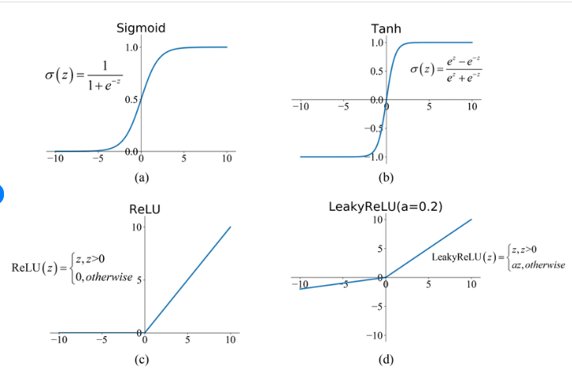
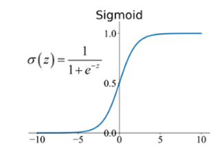
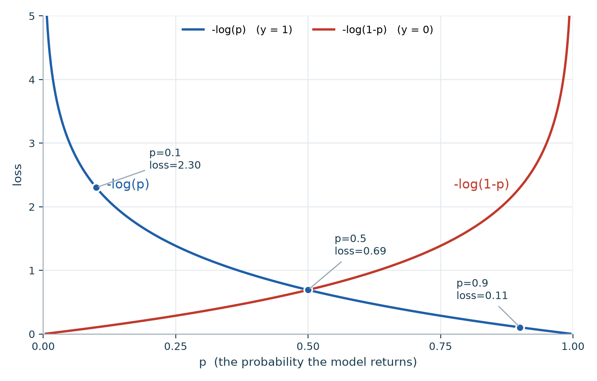

<!-- editorlm-hebrew-html-start -->

<!-- editorlm-hebrew-html-end -->

<nav class="book-nav" aria-label="ניווט בספר">
<a href="12-%D7%A8%D7%92%D7%A8%D7%A1%D7%99%D7%94%20%D7%91%D7%9E%D7%A1%D7%A4%D7%A8%20%D7%9E%D7%A9%D7%AA%D7%A0%D7%99%D7%9D%20-%20%D7%93%D7%95%D7%92%D7%9E%D7%94.md">→ הקודם</a>
<a class="toc-link" href="../index.md">תוכן העניינים</a>
<a href="14-%D7%A8%D7%92%D7%A8%D7%A1%D7%99%D7%94%20%D7%9C%D7%95%D7%92%D7%99%D7%A1%D7%98%D7%99%D7%AA%20-%20%D7%93%D7%95%D7%92%D7%9E%D7%90%D7%95%D7%AA.md">הבא ←</a>
</nav>

## ג.13 רגרסיה לוגיסטית

בכל הפרקים עד כה המודל שלנו ענה על שאלה מסוג "כמה?": כמה שווה הדירה, כמה גבוה יהיה הילד. אבל רבות מהשאלות שאנו רוצים שמחשב יענה עליהן הן שאלות של כן או לא. האם ההודעה הזו היא ספאם? האם הלקוח יחזיר את ההלוואה? האם בתמונה יש חתול? האם הגידול שנמצא בבדיקה ממאיר או שפיר? האם הפרח הזה הוא מהמין המסוים שמחפשים? בכל אחת מהשאלות האלה יש קלט — טקסט, נתונים פיננסיים, תמונה, מדידות רפואיות — והתשובה היא אחת משתי אפשרויות בלבד. שאלה כזו נקראת **סיווג בינארי — Binary Classification**, ושתי התשובות האפשריות נקראות **קטגוריות** או **תוויות — Labels**, ומסומנות ב־0 וב־1.

מה בעצם ההבדל מרגרסיה? ברגרסיה הפלט הוא מספר על ציר רציף, וכל ערך הוא תשובה אפשרית. בסיווג יש רק שתי תשובות, ואם המודל יחזיר "0.7 ממאיר" זה חסר משמעות. ובכל זאת, במקום להמציא מודל חדש נעשה דבר פשוט: ניקח את אותו מודל לינארי שכבר יש לנו, ונגרום לו להחזיר מספר בין 0 ל־1 שנפרש כ**הסתברות** שהתשובה היא "כן". הסתברות 0.97 פירושה "כמעט בטוח כן", 0.03 פירושה "כמעט בטוח לא", ו־0.5 פירושה שהמודל אינו יודע. כדי להחליט, נעגל: מעל 0.5 נסווג כ־1, ומתחת — כ־0. השיטה הזו נקראת **רגרסיה לוגיסטית — Logistic Regression**, ולמרות שמה זהו אלגוריתם סיווג; השם נובע מכך שהיא בנויה על אותו חישוב לינארי של הרגרסיה.

כדי להפוך את פלט המודל הלינארי, שיכול להיות כל מספר, להסתברות בין 0 ל־1, נזדקק לרכיב חדש: פונקציה שמופעלת על התוצאה ו"מועכת" אותה לטווח הרצוי. זו הפעם הראשונה שנפגוש **פונקציית אקטיבציה**, רכיב שנמצא בלב כל רשת נוירונים ושילווה אותנו עד סוף הספר. גם פונקציית ההפסד תשתנה: MSE מתאים למדידת מרחק בין מספרים, אך למדידת טעות בהסתברויות יש פונקציה מתאימה יותר. אחרי ההסבר העקרוני נבנה שני מסווגים אמיתיים: אחד שמבחין בין גידולים ממאירים לשפירים לפי מדידות רפואיות, ואחד שמזהה מין של פרח לפי מידות עליו.

כעת נעבור מחיזוי מספר לסיווג דוגמה לאחת משתי קטגוריות. נכיר פונקציות אקטיבציה ונראה כיצד משלבים אותן במודל ובפונקציית ההפסד.

**[השיעור וההרצאות באתר של גלעד מרקמן](https://webprogramming.azurewebsites.net/Pages/PyTorch/Logic_Reg.aspx)**

**חומרי הליווי:** [7. רגרסיה לוגית](../../../sources/ML/7.%20%D7%A8%D7%92%D7%A8%D7%A1%D7%99%D7%94%20%D7%9C%D7%95%D7%92%D7%99%D7%AA.pptx) · [‏‏7. רגרסיה לוגית - אקטיבציה](../../../sources/ML/%E2%80%8F%E2%80%8F7.%20%D7%A8%D7%92%D7%A8%D7%A1%D7%99%D7%94%20%D7%9C%D7%95%D7%92%D7%99%D7%AA%20-%20%D7%90%D7%A7%D7%98%D7%99%D7%91%D7%A6%D7%99%D7%94.pptx)

### פרספטרון ופונקציית אקטיבציה

נזכיר תחילה את נקודת המוצא. המודל שבנינו עד כה מחשב כפל וחיבור: כל קלט X מוכפל במשקל שלו (W), ומחברים את המכפלות (ובדרך כלל גם הטיה, שנשמיט כאן לשם הפשטות). עבור שלושה קלטים החישוב הוא:

$$
W^{T}X = X_1\cdot W_1 + X_2\cdot W_2 + X_3\cdot W_3
$$

הסימון WᵀX הוא הדרך המקוצרת לכתוב את הסכום הזה: מכפלה של וקטור המשקלים בווקטור הקלטים. התוצאה של החישוב הזה יכולה להיות כל מספר — שלילי, אפס או גדול מאוד — וזה בדיוק מה שאינו מתאים לשאלת כן/לא.

<!-- editorlm-source-ref: [sources/ML/pdf/‏‏7. רגרסיה לוגית - אקטיבציה.pdf#L8-L19] -->

הפתרון הוא להוסיף שלב אחד אחרי החישוב הלינארי. כדי להוסיף חישוב לא־לינארי, מפעילים על תוצאת החישוב הלינארי פונקציה נוספת, הנקראת **פונקציית אקטיבציה** ומסומנת ב־σ. תחילה מחשבים WᵀX, ואחר כך מפעילים את האקטיבציה. יחידה כזו — סכום משוקלל של קלטים ואחריו פונקציית אקטיבציה — נקראת **פרספטרון — Perceptron**, והיא הנוירון המלאכותי הבסיסי. רשת נוירונים, שנכיר בפרק הבא, אינה אלא הרבה פרספטרונים כאלה המחוברים זה לזה. השם "אקטיבציה" (הפעלה) לקוח מהנוירון הביולוגי, ש"נדלק" רק כשהגירוי שהוא מקבל חזק מספיק.

<figure>

<figcaption>פרספטרון: שלושה קלטים, שלושה משקלים, סכום משוקלל ופונקציית אקטיבציה σ המפיקה את הפלט Y.</figcaption>
</figure>
<!-- editorlm-source-ref: [sources/ML/pdf/1. מבוא והתקנה.pdf#L32-L39] -->
<!-- editorlm-source-ref: [sources/ML/pdf/‏‏7. רגרסיה לוגית - אקטיבציה.pdf#L21-L26] -->

### פונקציות אקטיבציה

יש כמה פונקציות אקטיבציה מקובלות, וכל אחת מתאימה למטרה אחרת; ההבדל העיקרי ביניהן הוא טווח הערכים שהן מחזירות. פונקציות אקטיבציה משנות את תוצאת החישוב הלינארי בדרכים שונות. נכיר את צורת הפעולה וטווח הערכים של כמה מהן. בטבלה z מסמן את תוצאת החישוב הלינארי, כלומר את WᵀX.

| פונקציה | הפעולה |
| --- | --- |
| Sigmoid | מחזירה ערך בין 0 ל־1: `1 / (1 + exp(-z))` |
| Tanh | מחזירה ערך בין ‎−1 ל־1: `(exp(z) - exp(-z)) / (exp(z) + exp(-z))` |
| ReLU | מחזירה את z כאשר הוא חיובי, ואפס אחרת |
| Leaky ReLU | מחזירה את z כאשר הוא חיובי, ו־a כפול z אחרת; בדוגמה a=0.2 |

<figure>

<figcaption>ארבע פונקציות אקטיבציה נפוצות: (a) Sigmoid, (b) Tanh, (c) ReLU, (d) Leaky ReLU עם a=0.2. הציר האופקי הוא z, תוצאת החישוב הלינארי.</figcaption>
</figure>

Sigmoid ו־Tanh "מועכות" כל מספר לטווח קבוע וחסום, ולכן מתאימות לפלט שצריך להתפרש כהסתברות או כערך מנורמל. ReLU ו־Leaky ReLU פשוטות בהרבה ואינן חוסמות ערכים חיוביים; הן משמשות בעיקר בתוך רשתות נוירונים, כפי שנראה בפרקים הבאים. קיימת גם פונקציית Softmax, שאותה נלמד בהמשך.

<!-- editorlm-source-ref: [sources/ML/pdf/‏‏7. רגרסיה לוגית - אקטיבציה.pdf#L28-L39] -->

### Sigmoid וסיווג בינארי

לשאלת כן/לא מתאימה במיוחד Sigmoid, כי הפלט שלה נמצא תמיד בין 0 ל־1 ואפשר לקרוא אותו כהסתברות. נשתמש ב־Sigmoid כאשר התשובה היא אחת משתי קטגוריות, המסומנות ב־0 וב־1. הפונקציה מחזירה ערך בין 0 ל־1: מעל 0.5 נסווג כ־1, ומתחת ל־0.5 נסווג כ־0. עבור קלט 0 הפונקציה מחזירה 0.5. ככל שהקלט z חיובי וגדול יותר, הפלט מתקרב ל־1; ככל שהוא שלילי יותר, הפלט מתקרב ל־0. כך המודל הלינארי "מצביע" בעד או נגד, ו־Sigmoid מתרגמת את עוצמת ההצבעה להסתברות.

<figure>

<figcaption>Sigmoid: הפלט נמצא תמיד בין 0 ל־1, ועבור z = 0 הוא בדיוק 0.5.</figcaption>
</figure>

<!-- editorlm-source-ref: [sources/ML/pdf/‏‏7. רגרסיה לוגית - אקטיבציה.pdf#L41-L48] -->

### פונקציית ההפסד

אחרי שהמודל מחזיר הסתברות, צריך למדוד עד כמה היא טעתה. בוחרים את פונקציית ההפסד בהתאם למשימה ולפלט של המודל. בסיווג הבינארי שנבנה כאן נשתמש ב־Sigmoid וב־Binary Cross Entropy, ובסיווג למספר קטגוריות נפגוש Cross Entropy. הטבלה הבאה מסכמת אילו זוגות של אקטיבציה והפסד הולכים יחד:

<table class="ltr" dir="ltr">
<thead><tr><th>Activation Function</th><th>Loss Function</th></tr></thead>
<tbody>
<tr><td>Sigmoid</td><td>Binary Cross Entropy</td></tr>
<tr><td>Softmax</td><td>Categorical Cross Entropy</td></tr>
<tr><td>ReLU</td><td>Mean Squared Error (במשימת רגרסיה מתאימה)</td></tr>
<tr><td>Tanh</td><td>Mean Squared Error (במשימת רגרסיה מתאימה)</td></tr>
<tr><td>Leaky ReLU</td><td>Mean Squared Error (במשימת רגרסיה מתאימה)</td></tr>
</tbody>
</table>

פלט Tanh עשוי להיות שלילי, ולכן אינו מתאים ישירות ל־BCE, המקבלת הסתברויות בין 0 ל־1.

<!-- editorlm-source-ref: [sources/ML/pdf/‏‏7. רגרסיה לוגית - אקטיבציה.pdf#L50-L62] -->

כל הפונקציות האלה זמינות ב־PyTorch כרכיבים מוכנים בספריית `torch.nn`, ואפשר לשלב אותן במודל בדיוק כמו `nn.Linear`:

<table class="ltr" dir="ltr">
<thead><tr><th>Activation Function</th><th>Loss Function</th></tr></thead>
<tbody>
<tr><td><code>nn.Sigmoid()</code></td><td><code>nn.BCELoss()</code></td></tr>
<tr><td><code>nn.Softmax(dim=1)</code> (להצגת הסתברויות)</td><td><code>nn.CrossEntropyLoss()</code> (מקבלת את הציונים שלפני Softmax)</td></tr>
<tr><td><code>nn.ReLU()</code></td><td><code>nn.MSELoss()</code> (במשימת רגרסיה מתאימה)</td></tr>
<tr><td><code>nn.Tanh()</code></td><td><code>nn.MSELoss()</code> (במשימת רגרסיה מתאימה)</td></tr>
<tr><td><code>nn.LeakyReLU()</code></td><td><code>nn.MSELoss()</code> (במשימת רגרסיה מתאימה)</td></tr>
</tbody>
</table>

<!-- editorlm-source-ref: [sources/ML/pdf/‏‏7. רגרסיה לוגית - אקטיבציה.pdf#L64-L76] -->

### Binary Cross Entropy — BCE

מדוע לא להמשיך עם MSE? אפשר, אך כשהפלט הוא הסתברות יש מדד טבעי יותר: במקום לשאול "כמה רחוק המספר מהתשובה", שואלים "איזו הסתברות המודל נתן לתשובה הנכונה", ומענישים קשה במיוחד מודל שהיה בטוח בתשובה שגויה. BCE היא פונקציית הפסד לבדיקת הטעות בשאלות בינאריות.

לפני הנוסחה חשוב להבחין בין שני הסימנים שבה, כי הם שונים באופיים:

- **y היא התשובה האמיתית.** היא מגיעה מהנתונים, לא מהמודל, והיא תמיד אחד משני ערכים בלבד: 1 (אמת, למשל "הגידול ממאיר") או 0 (שקר). אין y של 0.7.
- **p היא מה שהמודל שלנו מוציא.** זהו הפלט של Sigmoid, ולכן p הוא מספר כלשהו בין 0 ל־1, למשל 0.93 או 0.08. המודל אינו אומר "כן" או "לא", אלא "בהסתברות 0.93 התשובה היא 1".

פונקציית ההפסד משווה בין השניים: עד כמה ההסתברות p שהמודל נתן קרובה לתשובה האמיתית y.

$$
BCE = -\big(\,y_i\cdot\log(p_i) + (1-y_i)\cdot\log(1-p_i)\,\big).\mathrm{mean}()
$$

הנוסחה נראית מסובכת, אך כיוון ש־y הוא תמיד 0 או 1, בכל דוגמה אחד משני האיברים מוכפל באפס ונעלם, ורק האיבר השני נשאר "פעיל". נדגים זאת בהצבה של שתי דוגמאות שבשתיהן המודל החזיר p=0.9:

**דוגמה 1: התשובה האמיתית היא y=1.** מציבים y=1 ו־p=0.9 בסוגריים:

$$
1\cdot\log(0.9) + (1-1)\cdot\log(1-0.9) = \log(0.9) + 0\cdot\log(0.1) = \log(0.9)
$$

האיבר השני התאפס, ונשאר רק −log(0.9) = 0.105. ההפסד קטן, כי המודל נתן הסתברות גבוהה לתשובה הנכונה.

**דוגמה 2: התשובה האמיתית היא y=0.** אותו פלט של המודל, p=0.9, אך הפעם מציבים y=0:

$$
0\cdot\log(0.9) + (1-0)\cdot\log(1-0.9) = 0 + 1\cdot\log(0.1) = \log(0.1)
$$

הפעם האיבר הראשון התאפס, ונשאר רק −log(0.1) = 2.303. ההפסד גדול, כי המודל היה בטוח בתשובה השגויה.

הכלל: כאשר y=1 נשאר `−log(p)`, וכאשר y=0 נשאר `−log(1−p)`. הסיומת `.mean()` כתובה כמו בפייתון: מחשבים את הערך לכל דוגמה בנפרד, ואז לוקחים את הממוצע על כל הדוגמאות, בדיוק כמו ב־MSE.

<!-- editorlm-source-ref: [sources/ML/pdf/‏‏7. רגרסיה לוגית - אקטיבציה.pdf#L78-L87] -->

#### שני הגרפים: −log(p) ו־−log(1−p)

כדי להבין מדוע דווקא log, נזכור שתי עובדות על הפונקציה: log של 1 הוא 0, ו־log של מספר חיובי שמתקרב לאפס שואף למינוס אינסוף. הסימן מינוס שלפני ה־log הופך את התוצאה למספר חיובי, כפי שנדרש מהפסד. הגרף הבא מציג את שני האיברים כפונקציה של p, ההסתברות שהמודל מחזיר:

<figure>

<figcaption>העקומה הכחולה −log(p) היא ההפסד כאשר התשובה האמיתית היא 1; העקומה האדומה −log(1−p) היא ההפסד כאשר התשובה האמיתית היא 0. הנקודות המסומנות הן דוגמאות על העקומה הכחולה.</figcaption>
</figure>

**העקומה הכחולה, −log(p), פעילה כאשר y=1.** ב־p=1 היא מתאפסת: המודל נתן הסתברות מלאה לתשובה הנכונה, ואין מה להעניש. ככל ש־p קטן, העקומה עולה, ובקרבת p=0 היא מזנקת לאינסוף: המודל היה בטוח שהתשובה היא 0 בעוד שהיא 1, וזו הטעות החמורה ביותר.

**העקומה האדומה, −log(1−p), פעילה כאשר y=0.** היא תמונת מראה של הכחולה: מתאפסת ב־p=0, שבו המודל צדק בביטחון, ומזנקת לאינסוף בקרבת p=1, שבו המודל היה בטוח בתשובה השגויה.

שתי העקומות נחתכות ב־p=0.5, בגובה 0.69. זו הנקודה שבה המודל "לא יודע" ומחזיר הסתברות אמצעית: ההפסד זהה בשני המקרים, ובינוני בגודלו. הטבלה הבאה מחשבת כמה נקודות מהגרף (log טבעי, כפי ש־PyTorch מחשבת):

| ההסתברות p שהמודל החזיר | ההפסד כאשר y=1: −log(p) | ההפסד כאשר y=0: −log(1−p) |
| --- | --- | --- |
| 0.99 | 0.01 | 4.61 |
| 0.9 | 0.11 | 2.30 |
| 0.5 | 0.69 | 0.69 |
| 0.1 | 2.30 | 0.11 |
| 0.01 | 4.61 | 0.01 |

קראו את הטבלה לפי העמודות: כאשר התשובה האמיתית היא 1, ההפסד קטן בשורות העליונות (p גבוה) וגדל כלפי מטה; כאשר התשובה האמיתית היא 0, ההפסד קטן בשורות התחתונות וגדל כלפי מעלה. שימו לב ליחס: ניחוש נכון ובטוח (0.99) נענש ב־0.01 בלבד, בעוד ניחוש שגוי באותה מידת ביטחון נענש ב־4.61, פי כמה מאות. במילים אחרות: ניחוש נכון ובטוח כמעט אינו נענש, ניחוש שגוי ובטוח נענש בחומרה, וניחוש הססני נענש במידה בינונית. זה בדיוק מה שרוצים מפונקציית הפסד לסיווג.

לסיום, דוגמה לחישוב `.mean()` על שלוש דוגמאות: (y=1, p=0.9) נותנת 0.105; (y=0, p=0.2) נותנת −log(0.8) = 0.223; (y=1, p=0.4) נותנת −log(0.4) = 0.916. הממוצע הוא (0.105 + 0.223 + 0.916) / 3 = 0.415, וזהו ערך ה־BCE של המודל על שלוש הדוגמאות. הדוגמה השלישית, שבה המודל טעה בסיווג (p מתחת ל־0.5 בעוד התשובה היא 1), תורמת את רוב ההפסד.

<!-- editorlm-source-ref: [sources/ML/pdf/‏‏7. רגרסיה לוגית - אקטיבציה.pdf#L89-L98] -->

יש לנו עתה את כל הרכיבים: מודל לינארי, Sigmoid שהופכת את הפלט להסתברות בין 0 ל־1, ו־BCE שמודדת עד כמה ההסתברות הזו קרובה לתשובה האמיתית. בפרק הבא נחבר אותם לפתרון בעיה אמיתית — סיווג גידולים לממאירים ושפירים — ונעבור על כל התהליך, מהכרת הנתונים ועד בדיקת המודל.

<nav class="book-nav" aria-label="ניווט בספר">
<a href="12-%D7%A8%D7%92%D7%A8%D7%A1%D7%99%D7%94%20%D7%91%D7%9E%D7%A1%D7%A4%D7%A8%20%D7%9E%D7%A9%D7%AA%D7%A0%D7%99%D7%9D%20-%20%D7%93%D7%95%D7%92%D7%9E%D7%94.md">→ הקודם</a>
<a class="toc-link" href="../index.md">תוכן העניינים</a>
<a href="14-%D7%A8%D7%92%D7%A8%D7%A1%D7%99%D7%94%20%D7%9C%D7%95%D7%92%D7%99%D7%A1%D7%98%D7%99%D7%AA%20-%20%D7%93%D7%95%D7%92%D7%9E%D7%90%D7%95%D7%AA.md">הבא ←</a>
</nav>

<!-- editorlm-source-versions: {"schemaVersion": 1, "sources": {"sources/ML/7. רגרסיה לוגית.pptx": {"sourceSha256": "a92c997f6c1254fc7b3db621da823ffdcbda718a78b1f0b3426dcbe25c757932", "canonicalTextSha256": "429f04c69c436b52fc5dcd968b2979d6376980d984af1ecbfe142b136e544214"}, "sources/ML/‏‏7. רגרסיה לוגית - אקטיבציה.pptx": {"sourceSha256": "841709a292a051af10ad5c46831ee2286ab80d955b4adfc1758a0d7184a507f6", "canonicalTextSha256": "4260704ff7278388758008928c938bdf80e63848b727873f6253afa6cc4b1b22"}, "sources/ML/converted/7_Logic_regression/notebook.md": {"sourceSha256": "27938126cfd0bb3b2dcc628a5e0b36c24fc0d82f66ad8549731432f366dd7b03", "canonicalTextSha256": "27938126cfd0bb3b2dcc628a5e0b36c24fc0d82f66ad8549731432f366dd7b03"}, "sources/ML/converted/Iris/notebook.md": {"sourceSha256": "66222a66bb405b21a6eea3f1f8d8fcc70b8ee82622989dc029e1c10ccb7c7661", "canonicalTextSha256": "66222a66bb405b21a6eea3f1f8d8fcc70b8ee82622989dc029e1c10ccb7c7661"}, "sources/ML/pdf/‏‏7. רגרסיה לוגית - אקטיבציה.pdf": {"sourceSha256": "ae2c0fe6f2aa409320e9d5fb43f5841bfd7597cd72ea7118f03eddd404069e8a", "canonicalTextSha256": "b7d7f35f375d1bc1952dfd8e18bae75eac7dbbf7f0e25d26a485955f7735169f"}}} -->
