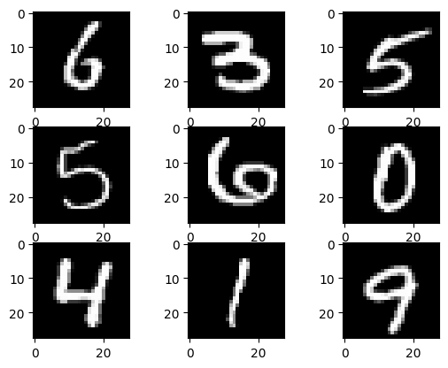
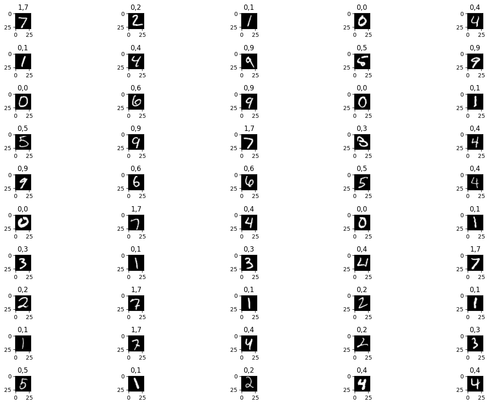

<!-- editorlm-hebrew-html-start -->
<style>
html, body, .vscode-body, .markdown-body, .markdown-preview, #write {
  direction: rtl !important; text-align: right !important;
}
ul, ol { padding-right: 2em !important; padding-left: 0 !important; }
blockquote { border-right: 3px solid #999; border-left: 0; padding-right: 1rem; padding-left: 0; }
@media print {
  html, body, .vscode-body, .markdown-body, .markdown-preview, #write {
    direction: rtl !important; text-align: right !important;
  }
}
</style>
<!-- editorlm-hebrew-html-end -->
<style>
.book { max-width: 900px; margin: auto; line-height: 1.8; font-family: Arial, sans-serif; }
.book .cover { min-height: 680px; box-sizing: border-box; padding: 64px 48px; margin: 24px 0 60px; background: #112b41; color: #f5f8fc; border-top: 9px solid #39c4b5; position: relative; }
.book .cover .eyebrow { color: #81e0d5; font-size: 15px; letter-spacing: 2px; }
.book .cover h1 { color: #fff; font-size: 48px; line-height: 1.3; border: 0; margin: 50px 0 18px; }
.book .cover .subtitle { font-size: 28px; color: #d8e6f0; }
.book .cover .author { font-size: 30px; color: #fff; margin-top: 52px; }
.book .cover .audience { color: #c1d3df; margin-top: 12px; }
.book .cover .motif { direction: ltr; text-align: left; font-family: Consolas, monospace; color: #81e0d5; font-size: 19px; margin-top: 54px; }
.book h1, .book h2, .book h3 { line-height: 1.4; font-weight: 700; }
.book > h1 { font-size: 32px !important; text-align: center !important; margin: 28px 0; }
.book h2 { font-size: 34px !important; text-align: center !important; color: #153b56 !important; background: #eef5fc; border: 0; border-bottom: 4px solid #299c91; border-radius: 10px 10px 0 0; padding: 28px 20px; margin: 24px 0 36px; }
.book h3 { font-size: 24px !important; text-align: right !important; color: #174e49 !important; background: #edf7f5; border: 0; border-right: 5px solid #299c91; border-radius: 6px; padding: 10px 16px; margin: 36px 0 18px; }
.book .chapter { height: 0; margin: 76px 0 0; border-top: 1px solid #ccd7df; break-before: page; page-break-before: always; break-after: avoid; page-break-after: avoid; }
.book .toc { padding: 24px; border-right: 5px solid #39a99d; background: rgba(70,150,155,.09); margin: 24px 0 48px; }
.book pre, .book pre code { direction: ltr !important; text-align: left !important; unicode-bidi: isolate; }
.book pre { box-sizing: border-box !important; width: 100% !important; max-width: 100% !important; margin: 0 !important; padding: 16px 20px; border: 1px solid #ccd7df; border-radius: 8px; line-height: 1.6; overflow-x: auto; }
.book code { direction: ltr; unicode-bidi: isolate; font-family: Consolas, "Courier New", monospace; }
.book pre { background: #f3f6fa !important; color: #1f2937 !important; }
.book pre code, .book pre code.hljs { background: transparent !important; color: #1f2937 !important; }
.book pre .hljs-keyword, .book pre .hljs-literal { color: #6f299c !important; }
.book pre .hljs-string { color: #216338 !important; }
.book pre .hljs-number { color: #075e68 !important; }
.book pre .hljs-comment { color: #526174 !important; }
.book pre .hljs-built_in, .book pre .hljs-title { color: #135b96 !important; }
.book table { width: 100%; }
.book th, .book td { text-align: right; }
.book .small { font-size: .9em; opacity: .8; }
.book .python-intro { display: flex; align-items: center; gap: 28px; padding: 22px 28px; margin: 24px 0; background: #eef5fc; color: #183e63; border-right: 6px solid #3776ab; border-radius: 10px; }
.book .python-intro strong { font-size: 30px; }
.book .python-fact { background: #fff7d6; color: #423611; border-right: 6px solid #ffd343; border-radius: 8px; padding: 18px 24px; margin: 22px 0; }
.book .python-fact strong { font-size: 24px; }
.book img { max-width: 100%; height: auto; }
.book figure { margin: 24px auto; text-align: center; }
.book figure img { display: block; margin: auto; }
.book figcaption { direction: rtl; text-align: center; font-size: .9em; color: #445566; }
@media print { .book > h2 { break-before: page; page-break-before: always; } }
.book .screen-strip { width: 760px; max-width: 100%; height: 220px; overflow: hidden; border: 1px solid #bccad5; border-radius: 8px; margin: 20px auto 8px; direction: ltr; }
.book .screen-strip.output { height: 265px; }
.book .screen-strip img { display: block; width: 1745px; max-width: none; }
.book .screen-menu { width: 400px; max-width: 100%; height: 295px; overflow: hidden; direction: ltr; margin: 20px auto 8px; border: 1px solid #bccad5; border-radius: 8px; }
.book .screen-menu img { display: block; width: 1745px; max-width: none; }
.book .code-panel { box-sizing: border-box !important; display: block !important; width: 50% !important; max-width: 50% !important; margin: 18px auto !important; }
@media print {
  .book .cover { min-height: 85vh; break-after: page; print-color-adjust: exact; -webkit-print-color-adjust: exact; }
  .book pre { white-space: pre-wrap; break-inside: avoid; }
  .book .chapter { margin: 0; border: 0; }
  .book h1, .book h2, .book h3 { break-after: avoid; page-break-after: avoid; break-inside: avoid; }
  .book h2 { margin-top: 0; }
  .book h2, .book h3 { print-color-adjust: exact; -webkit-print-color-adjust: exact; }
}
</style>

<style>
.book .book-nav { display: flex; flex-wrap: wrap; gap: 10px; justify-content: center; align-items: center; padding: 16px 0; margin: 20px 0 32px; border-top: 1px solid #ccd7df; border-bottom: 1px solid #ccd7df; }
.book .book-nav a { display: inline-block; padding: 10px 18px; border-radius: 8px; background: #eef5fc; color: #153b56 !important; border: 1px solid #b5ccd9; text-decoration: none !important; font-size: 16px; font-weight: bold; }
.book .book-nav a.toc-link { background: #174e49; color: #fff !important; border-color: #174e49; }
.book .book-nav a:hover, .book .book-nav a:focus { background: #d4eee8; color: #153b56 !important; outline: 2px solid #299c91; outline-offset: 2px; }
.book .section-list { line-height: 2; }
@media print { .book .book-nav { display: none; } }

/* Explicit Hebrew direction, including prose beginning with English. */
.book p, .book ul, .book ol, .book li,
.book blockquote, .book h1, .book h2, .book h3,
.book h4, .book th, .book td {
  direction: rtl !important;
  text-align: right !important;
  unicode-bidi: isolate;
}
/* Chapter titles keep their agreed centered layout. */
.book h2 { text-align: center !important; }
.book pre, .book pre code, .book .code-panel {
  direction: ltr !important;
  text-align: left !important;
  unicode-bidi: isolate;
}
</style>

<div class="book" dir="rtl" lang="he" style="direction: rtl !important; text-align: right !important;">

<nav class="book-nav" aria-label="ניווט בספר">
<a href="12-%D7%A8%D7%92%D7%A8%D7%A1%D7%99%D7%94%20%D7%9C%D7%95%D7%92%D7%99%D7%AA.md">→ הקודם</a>
<a class="toc-link" href="../index.md">תוכן העניינים</a>
<a href="14-%D7%A8%D7%92%D7%A8%D7%A1%D7%99%D7%94%20%D7%9C%D7%90%20%D7%9C%D7%99%D7%A0%D7%90%D7%A8%D7%99%D7%AA.md">הבא ←</a>
</nav>

## ג.13 רשת נוירונים — זיהוי הספרה 7

רשת נוירונים מלאכותית — **Artificial Neural Network, ANN** — מחברת יחידות חישוב זו לזו: תוצאות החישוב של יחידות בשכבה אחת משמשות קלט ליחידות בשכבה הבאה.

<!-- editorlm-source-ref: [sources/ML/pdf/8. רשת נורונים ANN.pdf#L8-L12] -->

**[השיעור וההרצאות באתר של גלעד מרקמן](https://webprogramming.azurewebsites.net/Pages/PyTorch/ANN.aspx)**

**חומרי הליווי:** [8. רשת נורונים ANN](../../../sources/ML/8.%20%D7%A8%D7%A9%D7%AA%20%D7%A0%D7%95%D7%A8%D7%95%D7%A0%D7%99%D7%9D%20ANN.pptx) · [מחברת MNIST](../../../sources/ML/Colab/8_ANN_MNIST.ipynb)

### שכבות ברשת

ברשת **Fully Connected**, כל יחידה מקבלת את תוצאות כל היחידות בשכבה הקודמת. מחלקים את הרשת לשכבת קלט, שכבות חבויות ושכבת פלט. מבנה הפלט נקבע לפי השאלה: עבור תשובה בינארית נשתמש ביחידת פלט אחת.

<!-- editorlm-source-ref: [sources/ML/pdf/8. רשת נורונים ANN.pdf#L14-L25] -->

### הגדרת רשת ב־PyTorch

נגדיר את הרשת באמצעות `nn.Sequential`, עם שכבות לינאריות ופונקציות אקטיבציה. מספר הפלטים של שכבה חייב להתאים למספר הקלטים של השכבה הבאה; האימון נשאר כפי שהכרנו.

זו תבנית לרשת בעלת שתי שכבות חבויות וארבעה פלטים. גדלי השכבות ו־`device` צריכים להיות מוגדרים לפני השימוש בה:

<div class="code-panel" dir="ltr">

```python
Model = nn.Sequential(
    nn.Linear(input_size, hidden_size_1, device=device),
    nn.ReLU(),
    nn.Linear(hidden_size_1, hidden_size_2, device=device),
    nn.ReLU(),
    nn.Linear(hidden_size_2, 4, device=device),
    nn.Sigmoid()
)
```

</div>


<!-- editorlm-source-ref: [sources/ML/pdf/8. רשת נורונים ANN.pdf#L27-L45] -->

### בחירת מבנה הרשת

מספר השכבות והיחידות נקבע בניסוי ובבדיקת התוצאות. בשכבות החבויות מקובל להשתמש ב־ReLU או Leaky ReLU. בשכבת הפלט בוחרים לפי המשימה:

- תשובה בינארית: Sigmoid עם BCE.
- מספר קטגוריות: Cross Entropy; להצגת הסתברויות משתמשים ב־Softmax.
- תשובה מספרית: MSE, עם פלט לינארי או אקטיבציה המתאימה לטווח התשובות.

כפי שראינו בפרק הקודם, BCE אינה מקבלת ישירות ערכי Tanh שליליים, ו־`nn.CrossEntropyLoss` מקבלת את הציונים שלפני Softmax.

<!-- editorlm-source-ref: [sources/ML/pdf/8. רשת נורונים ANN.pdf#L47-L56] -->

### המשימה — זיהוי ספרה בודדת

MNIST מכיל 70,000 תמונות של ספרות בכתב יד, בגודל 28×28 פיקסלים בגוני אפור. לכל תמונה מצורפת תווית המציינת את הספרה. נבחר את הספרה 7 ונבנה מודל שמחליט אם התמונה מציגה אותה או ספרה אחרת.

<!-- editorlm-source-ref: [sources/ML/pdf/8. רשת נורונים ANN.pdf#L58-L74] -->

### הזנת תמונה לרשת

כל תמונה מיוצגת כטנסור בצורה `[1, 28, 28]`. נשטח אותה לשורה של 784 ערכי פיקסלים; בקבוצה של 50 תמונות נקבל טבלה בצורה `[50, 784]`.

<!-- editorlm-source-ref: [sources/ML/pdf/8. רשת נורונים ANN.pdf#L76-L81] -->

### Torchvision ו־DataLoader

Torchvision מספקת מאגרי תמונות ובהם MNIST. באמצעות DataLoader מחלקים את הנתונים לקבוצות — **batches**.

בכל קבוצה נחשב תחזיות, הפסד ונגזרות, ונעדכן את המשקלים. מעבר על כל קבוצות האימון נקרא **epoch**; אפשר לחזור על המעבר כמה פעמים.

<!-- editorlm-source-ref: [sources/ML/pdf/8. רשת נורונים ANN.pdf#L83-L100] -->

### שלבי העבודה והייבוא

נכין את הנתונים, נגדיר את הפרמטרים, המודל, ההפסד והאופטימייזר, נבצע אימון ולבסוף נציג את התוצאות.

<!-- editorlm-source-ref: [sources/ML/converted/8_ANN_MNIST/notebook.md#L11-L24] -->


<div class="code-panel" dir="ltr">

```python
import torch
import torch.nn as nn
import numpy as np
import matplotlib.pyplot as plt
import torchvision
import torchvision.transforms as transforms
from torch.utils.data import DataLoader
```

</div>

<!-- editorlm-source-ref: [sources/ML/converted/8_ANN_MNIST/notebook.md#L26-L37] -->

### בחירת התקן החישוב

נבחר GPU כאשר הוא זמין, ואחרת CPU:

<div class="code-panel" dir="ltr">

```python
if torch.cuda.is_available():
    device = torch.device('cuda')
else:
    device = torch.device('cpu')
print(device)
```

</div>

<!-- editorlm-source-ref: [sources/ML/converted/8_ANN_MNIST/notebook.md#L42-L59] -->

הקוד ידפיס `cuda` או `cpu`, בהתאם להתקן שנבחר.

### טעינת MNIST

נטען בנפרד את קבוצת האימון ואת קבוצת הבדיקה. `ToTensor` ממירה את התמונות לטנסורים, עם ערכי פיקסלים בין 0 ל־1.

<div class="code-panel" dir="ltr">

```python
train_dataset = torchvision.datasets.MNIST(root='./data',
                                           train=True,
                                           transform=transforms.ToTensor(),
                                           download=True)

test_dataset = torchvision.datasets.MNIST(root='./data',
                                          train=False,
                                          transform=transforms.ToTensor(),
                                          download=True)
```

</div>

<!-- editorlm-source-ref: [sources/ML/converted/8_ANN_MNIST/notebook.md#L68-L81] -->

נציג את פרטי שתי הקבוצות:

<div class="code-panel" dir="ltr">

```python
print(train_dataset)
print(test_dataset)
```

</div>

**פלט**

<div class="code-panel" dir="ltr">

```text
Dataset MNIST
    Number of datapoints: 60000
    Root location: ./data
    Split: Train
    StandardTransform
Transform: ToTensor()
Dataset MNIST
    Number of datapoints: 10000
    Root location: ./data
    Split: Test
    StandardTransform
Transform: ToTensor()
```

</div>

<!-- editorlm-source-ref: [sources/ML/converted/8_ANN_MNIST/notebook.md#L82-L106] -->

### חלוקה לאצוות

נגדיר אצוות של 50 תמונות. נערבב את סדר דוגמאות האימון:

<div class="code-panel" dir="ltr">

```python
batch_size = 50

train_loader = torch.utils.data.DataLoader(dataset=train_dataset,
                                           batch_size=batch_size,
                                           shuffle=True)

test_loader = torch.utils.data.DataLoader(dataset=test_dataset,
                                          batch_size=batch_size,
                                          shuffle=False)
```

</div>

<!-- editorlm-source-ref: [sources/ML/converted/8_ANN_MNIST/notebook.md#L111-L124] -->

נבדוק את מספר האצוות:

<div class="code-panel" dir="ltr">

```python
print(len(train_loader))
print(len(test_loader))
```

</div>

**פלט**

<div class="code-panel" dir="ltr">

```text
1200
200
```

</div>

<!-- editorlm-source-ref: [sources/ML/converted/8_ANN_MNIST/notebook.md#L125-L139] -->

מתקבלות 1,200 אצוות אימון ו־200 אצוות בדיקה.

### שליפת אצווה והצגת תמונות

ניצור איטרטור ונשלוף את האצווה הראשונה:

<div class="code-panel" dir="ltr">

```python
examples = iter(test_loader)
example_data, example_targets = next(examples)
# example_data, example_targets = next(examples)
```

</div>

<!-- editorlm-source-ref: [sources/ML/converted/8_ANN_MNIST/notebook.md#L140-L148] -->


<div class="code-panel" dir="ltr">

```python
print(example_data.shape, example_targets.shape)
```

</div>

**פלט**

<div class="code-panel" dir="ltr">

```text
torch.Size([50, 1, 28, 28]) torch.Size([50])
```

</div>

<!-- editorlm-source-ref: [sources/ML/converted/8_ANN_MNIST/notebook.md#L149-L161] -->

נשלוף את האצווה הבאה מאותו איטרטור:

<div class="code-panel" dir="ltr">

```python
example_data, example_targets = next(examples)
```

</div>

<!-- editorlm-source-ref: [sources/ML/converted/8_ANN_MNIST/notebook.md#L162-L167] -->

נציג תשע תמונות, נדפיס את תוויותיהן ואת צורתן, וגם שורת פיקסלים מאחת התמונות:

<div class="code-panel" dir="ltr">

```python
for i in range(9):
    plt.subplot(3,3,i+1)
    plt.imshow(example_data[i][0], cmap='gray')
    print(example_targets[i].item(), example_data[i].shape)
plt.show()
print(example_data[7][0][13])
```

</div>

**פלט**

<div class="code-panel" dir="ltr">

```text
6 torch.Size([1, 28, 28])
3 torch.Size([1, 28, 28])
5 torch.Size([1, 28, 28])
5 torch.Size([1, 28, 28])
6 torch.Size([1, 28, 28])
0 torch.Size([1, 28, 28])
4 torch.Size([1, 28, 28])
1 torch.Size([1, 28, 28])
9 torch.Size([1, 28, 28])
```

</div>

**פלט**

<div class="code-panel" dir="ltr">

```text
tensor([0.0000, 0.0000, 0.0000, 0.0000, 0.0000, 0.0000, 0.0000, 0.0000, 0.0000,
        0.0000, 0.0000, 0.0000, 0.0000, 0.3922, 0.9882, 0.9529, 0.0392, 0.0000,
        0.0000, 0.0000, 0.0000, 0.0000, 0.0000, 0.0000, 0.0000, 0.0000, 0.0000,
        0.0000])
```

</div>

<!-- editorlm-source-ref: [sources/ML/converted/8_ANN_MNIST/notebook.md#L168-L212] -->


<figure>

<figcaption>תשע תמונות מהאצווה שנשלפה.</figcaption>
</figure>

<!-- editorlm-source-ref: [sources/ML/converted/8_ANN_MNIST/notebook.md#L201-L201] -->

### הגדרת הפרמטרים והמודל

נגדיר 784 קלטים, 100 יחידות חבויות, שני מעברים על המאגר וקצב למידה 0.01. `required_label` מגדיר את הספרה שאותה נזהה.

<div class="code-panel" dir="ltr">

```python
input_size = 28*28 # 784
hidden_size = 100
epochs = 2
learning_rate = 0.01
required_label = 7
```

</div>

<!-- editorlm-source-ref: [sources/ML/converted/8_ANN_MNIST/notebook.md#L221-L230] -->

ניצור את השכבות הלינאריות על התקן החישוב שנבחר, עם ReLU בשכבה החבויה ו־Sigmoid בפלט:

<div class="code-panel" dir="ltr">

```python
Model = nn.Sequential(
    nn.Linear(input_size,hidden_size,device=device),
    nn.ReLU(),
    nn.Linear(hidden_size, 1, device=device),
    nn.Sigmoid()
)
```

</div>

<!-- editorlm-source-ref: [sources/ML/converted/8_ANN_MNIST/notebook.md#L235-L246] -->

אפשר גם ליצור את הרשת ולהעביר אותה בשלמותה באמצעות `.to(device)`; זו החלופה המופיעה בהערות:

<div class="code-panel" dir="ltr">

```python
# Model = nn.Sequential(
#     nn.Linear(input_size,hidden_size),
#     nn.ReLU(),
#     nn.Linear(hidden_size, 1),
#     nn.Sigmoid()
# ).to(device)
```

</div>

<!-- editorlm-source-ref: [sources/ML/converted/8_ANN_MNIST/notebook.md#L247-L258] -->

### פונקציית ההפסד והאופטימייזר

<div class="code-panel" dir="ltr">

```python
Loss = nn.BCELoss()

# init optimizer
optim = torch.optim.Adam(Model.parameters(), lr=learning_rate)
```

</div>

<!-- editorlm-source-ref: [sources/ML/converted/8_ANN_MNIST/notebook.md#L263-L273] -->

### לולאת האימון

בכל אצווה נשטח את התמונות, נעביר את התמונות והתוויות לאותו התקן ונמיר את התוויות ל־1 עבור הספרה 7 ול־0 עבור היתר. לאחר מכן נחשב את ההפסד והנגזרות ונעדכן את המשקלים.

<div class="code-panel" dir="ltr">

```python
n_total_steps = len(train_loader)


for epoch in range(epochs): # 2
    for i, (images, lables) in enumerate(train_loader):

        # origin shape: [50, 1, 28, 28]
        # resized: [50, 784]
        images = images.reshape(-1, 28*28).to(device)
        lables = lables.reshape(-1,1).to(device)
        lables = (torch.eq(lables, required_label)).float()

        # forward
        Y_predict = Model(images)

        # backward
        # optim.zero_grad()
        loss = Loss(Y_predict, lables)
        loss.backward()

        # update wights
        optim.step()

        if (i + epoch * n_total_steps) % 100 == 0:
            print(f"epoch= {epoch} i= {i} num= {i+epoch * n_total_steps} loss={loss.item():.4f} ")

        # zero grads
        optim.zero_grad()
```

</div>

תחילת הפלט השמור וסופו:

**פלט**

<div class="code-panel" dir="ltr">

```text
epoch= 0 i= 0 num= 0 loss=1.2409 
epoch= 0 i= 100 num= 100 loss=0.1208 
epoch= 0 i= 200 num= 200 loss=0.0162 
epoch= 0 i= 300 num= 300 loss=0.0307 
...
epoch= 1 i= 1100 num= 2300 loss=0.0035
```

</div>

<!-- editorlm-source-ref: [sources/ML/converted/8_ANN_MNIST/notebook.md#L282-L344] -->

הפלט הוא דוגמה שמורה; האתחול האקראי וערבוב הדוגמאות עשויים לשנות את הערכים בהרצה חדשה.

נציג את התוויות הבינאריות של האצווה האחרונה:

<div class="code-panel" dir="ltr">

```python
print(lables)
```

</div>

תחילת הפלט השמור וסופו:

**פלט**

<div class="code-panel" dir="ltr">

```text
tensor([[0.],
        [0.],
        [0.],
        [0.],
...
        [0.]], device='cuda:0')
```

</div>

<!-- editorlm-source-ref: [sources/ML/converted/8_ANN_MNIST/notebook.md#L345-L407] -->

ואת התחזיות שחושבו עבורה:

<div class="code-panel" dir="ltr">

```python
print(Y_predict)
```

</div>

תחילת הפלט השמור וסופו:

**פלט**

<div class="code-panel" dir="ltr">

```text
tensor([[2.7814e-10],
        [7.6960e-14],
        [2.5009e-10],
        [1.0268e-11],
...
        [4.0485e-08]], device='cuda:0', grad_fn=<SigmoidBackward0>)
```

</div>

<!-- editorlm-source-ref: [sources/ML/converted/8_ANN_MNIST/notebook.md#L408-L469] -->

### בדיקת המודל

נעבור על כל אצוות הבדיקה, נעגל את פלט הרשת ונספור את הסיווגים הנכונים:

<div class="code-panel" dir="ltr">

```python
with torch.no_grad():
    n_correct = 0
    n_samples = 0
    for images, lables in test_loader:
        images = images.reshape(-1, 28*28).to(device)
        lables = lables.reshape(-1,1).to(device)
        lables = (torch.eq(lables, required_label)).float()
        y_predict = Model(images).round()
        # print(y_predict.T)
        # print(lables.T)

        n_samples += lables.size(0)
        n_correct += (y_predict == lables).sum().item()

    acc = 100 * n_correct / n_samples
    print(f'Accuracy of the network on the {n_samples} test images: {acc} %')
```

</div>

**פלט**

<div class="code-panel" dir="ltr">

```text
Accuracy of the network on the 10000 test images: 99.21 %
```

</div>

<!-- editorlm-source-ref: [sources/ML/converted/8_ANN_MNIST/notebook.md#L474-L503] -->

זהו דיוק בסיווג **7 או לא 7**, ולא בזיהוי כל עשר הספרות.

### הצגת התחזיות לצד התמונות

נשלוף שוב את האצווה הראשונה מקבוצת הבדיקה. נדפיס לכל תמונה את פלט הרשת, הספרה האמיתית והסיווג לאחר העיגול:

<div class="code-panel" dir="ltr">

```python
print(len(test_loader))
print (n_samples)
print(lables.shape)
examples = iter(test_loader)
example_data, example_targets = next(examples)
example_data = example_data.to(device)
example_targets = example_targets.to(device)
example_predict = Model(example_data.reshape(-1, 28*28)).T #.round()
example_predict.shape
for i in range(len(example_data)):
    print (round(example_predict[0,i].item(),4), example_targets[i].item(), round(example_predict[0,i].item()) )
```

</div>

תחילת הפלט השמור וסופו:

**פלט**

<div class="code-panel" dir="ltr">

```text
200
10000
torch.Size([50, 1])
0.9999 7 1
...
0.0 4 0
```

</div>

<!-- editorlm-source-ref: [sources/ML/converted/8_ANN_MNIST/notebook.md#L504-L580] -->

נציג את כל 50 התמונות. בכל כותרת מופיעים הסיווג הבינארי ולאחריו הספרה האמיתית:

<div class="code-panel" dir="ltr">

```python
plt.figure(figsize=(15, 10))  # Width: 15 inches, Height: 10 inches
for i in range(len(example_data)):
    plt.subplot(10,5,i+1)
    plt.title(str(round(example_predict[0,i].item())) +","+ str(example_targets[i].item()) )
    plt.imshow(example_data[i][0].cpu(), cmap='gray')
plt.tight_layout()
plt.show()
```

</div>

<!-- editorlm-source-ref: [sources/ML/converted/8_ANN_MNIST/notebook.md#L581-L600] -->


<figure>

<figcaption>50 תמונות: סיווג בינארי וספרה אמיתית בכותרת כל תמונה.</figcaption>
</figure>

<!-- editorlm-source-ref: [sources/ML/converted/8_ANN_MNIST/notebook.md#L600-L600] -->


<nav class="book-nav" aria-label="ניווט בספר">
<a href="12-%D7%A8%D7%92%D7%A8%D7%A1%D7%99%D7%94%20%D7%9C%D7%95%D7%92%D7%99%D7%AA.md">→ הקודם</a>
<a class="toc-link" href="../index.md">תוכן העניינים</a>
<a href="14-%D7%A8%D7%92%D7%A8%D7%A1%D7%99%D7%94%20%D7%9C%D7%90%20%D7%9C%D7%99%D7%A0%D7%90%D7%A8%D7%99%D7%AA.md">הבא ←</a>
</nav>

</div>

<!-- editorlm-source-versions: {"schemaVersion":1,"sources":{"sources/ML/converted/8_ANN_MNIST/notebook.md":{"sourceSha256":"6b122579197bdfc71afc7510728cd17344b20b04f6ea6197a9699440ee3e6ede","canonicalTextSha256":"6b122579197bdfc71afc7510728cd17344b20b04f6ea6197a9699440ee3e6ede"},"sources/ML/pdf/8. רשת נורונים ANN.pdf":{"sourceSha256":"0c16c420b28170d1d258cd20b02c63f1d7f5cae01120592e60d07cdc7e374357","canonicalTextSha256":"0fe2e77e96bb5106cc0c058824efecc459da22c3d82b1d26ce4b6ab092e77ed8"}}} -->
