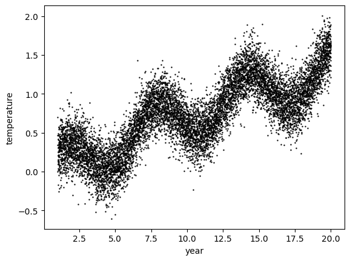
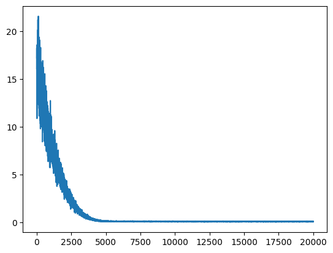
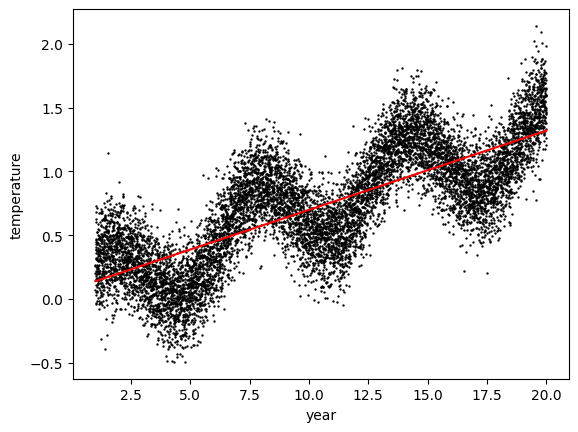
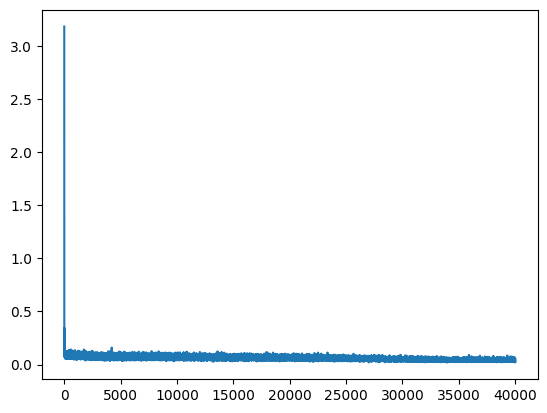
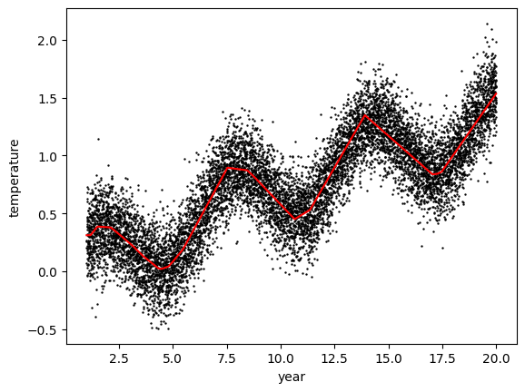

<!-- editorlm-hebrew-html-start -->
<style>
html, body, .vscode-body, .markdown-body, .markdown-preview, #write {
  direction: rtl !important; text-align: right !important;
}
ul, ol { padding-right: 2em !important; padding-left: 0 !important; }
blockquote { border-right: 3px solid #999; border-left: 0; padding-right: 1rem; padding-left: 0; }
@media print {
  html, body, .vscode-body, .markdown-body, .markdown-preview, #write {
    direction: rtl !important; text-align: right !important;
  }
}
</style>
<!-- editorlm-hebrew-html-end -->
<style>
.book { max-width: 900px; margin: auto; line-height: 1.8; font-family: Arial, sans-serif; }
.book .cover { min-height: 680px; box-sizing: border-box; padding: 64px 48px; margin: 24px 0 60px; background: #112b41; color: #f5f8fc; border-top: 9px solid #39c4b5; position: relative; }
.book .cover .eyebrow { color: #81e0d5; font-size: 15px; letter-spacing: 2px; }
.book .cover h1 { color: #fff; font-size: 48px; line-height: 1.3; border: 0; margin: 50px 0 18px; }
.book .cover .subtitle { font-size: 28px; color: #d8e6f0; }
.book .cover .author { font-size: 30px; color: #fff; margin-top: 52px; }
.book .cover .audience { color: #c1d3df; margin-top: 12px; }
.book .cover .motif { direction: ltr; text-align: left; font-family: Consolas, monospace; color: #81e0d5; font-size: 19px; margin-top: 54px; }
.book h1, .book h2, .book h3 { line-height: 1.4; font-weight: 700; }
.book > h1 { font-size: 32px !important; text-align: center !important; margin: 28px 0; }
.book h2 { font-size: 34px !important; text-align: center !important; color: #153b56 !important; background: #eef5fc; border: 0; border-bottom: 4px solid #299c91; border-radius: 10px 10px 0 0; padding: 28px 20px; margin: 24px 0 36px; }
.book h3 { font-size: 24px !important; text-align: right !important; color: #174e49 !important; background: #edf7f5; border: 0; border-right: 5px solid #299c91; border-radius: 6px; padding: 10px 16px; margin: 36px 0 18px; }
.book .chapter { height: 0; margin: 76px 0 0; border-top: 1px solid #ccd7df; break-before: page; page-break-before: always; break-after: avoid; page-break-after: avoid; }
.book .toc { padding: 24px; border-right: 5px solid #39a99d; background: rgba(70,150,155,.09); margin: 24px 0 48px; }
.book pre, .book pre code { direction: ltr !important; text-align: left !important; unicode-bidi: isolate; }
.book pre { box-sizing: border-box !important; width: 100% !important; max-width: 100% !important; margin: 0 !important; padding: 16px 20px; border: 1px solid #ccd7df; border-radius: 8px; line-height: 1.6; overflow-x: auto; }
.book code { direction: ltr; unicode-bidi: isolate; font-family: Consolas, "Courier New", monospace; }
.book pre { background: #f3f6fa !important; color: #1f2937 !important; }
.book pre code, .book pre code.hljs { background: transparent !important; color: #1f2937 !important; }
.book pre .hljs-keyword, .book pre .hljs-literal { color: #6f299c !important; }
.book pre .hljs-string { color: #216338 !important; }
.book pre .hljs-number { color: #075e68 !important; }
.book pre .hljs-comment { color: #526174 !important; }
.book pre .hljs-built_in, .book pre .hljs-title { color: #135b96 !important; }
.book table { width: 100%; }
.book th, .book td { text-align: right; }
.book .small { font-size: .9em; opacity: .8; }
.book .python-intro { display: flex; align-items: center; gap: 28px; padding: 22px 28px; margin: 24px 0; background: #eef5fc; color: #183e63; border-right: 6px solid #3776ab; border-radius: 10px; }
.book .python-intro strong { font-size: 30px; }
.book .python-fact { background: #fff7d6; color: #423611; border-right: 6px solid #ffd343; border-radius: 8px; padding: 18px 24px; margin: 22px 0; }
.book .python-fact strong { font-size: 24px; }
.book img { max-width: 100%; height: auto; }
.book figure { margin: 24px auto; text-align: center; }
.book figure img { display: block; margin: auto; }
.book figcaption { direction: rtl; text-align: center; font-size: .9em; color: #445566; }
@media print { .book > h2 { break-before: page; page-break-before: always; } }
.book .screen-strip { width: 760px; max-width: 100%; height: 220px; overflow: hidden; border: 1px solid #bccad5; border-radius: 8px; margin: 20px auto 8px; direction: ltr; }
.book .screen-strip.output { height: 265px; }
.book .screen-strip img { display: block; width: 1745px; max-width: none; }
.book .screen-menu { width: 400px; max-width: 100%; height: 295px; overflow: hidden; direction: ltr; margin: 20px auto 8px; border: 1px solid #bccad5; border-radius: 8px; }
.book .screen-menu img { display: block; width: 1745px; max-width: none; }
.book .code-panel { box-sizing: border-box !important; display: block !important; width: 75% !important; max-width: 75% !important; margin: 18px auto !important; }
@media print {
  .book .cover { min-height: 85vh; break-after: page; print-color-adjust: exact; -webkit-print-color-adjust: exact; }
  .book pre { white-space: pre-wrap; break-inside: avoid; }
  .book .chapter { margin: 0; border: 0; }
  .book h1, .book h2, .book h3 { break-after: avoid; page-break-after: avoid; break-inside: avoid; }
  .book h2 { margin-top: 0; }
  .book h2, .book h3 { print-color-adjust: exact; -webkit-print-color-adjust: exact; }
}
</style>

<style>
.book .book-nav { display: flex; flex-wrap: wrap; gap: 10px; justify-content: center; align-items: center; padding: 16px 0; margin: 20px 0 32px; border-top: 1px solid #ccd7df; border-bottom: 1px solid #ccd7df; }
.book .book-nav a { display: inline-block; padding: 10px 18px; border-radius: 8px; background: #eef5fc; color: #153b56 !important; border: 1px solid #b5ccd9; text-decoration: none !important; font-size: 16px; font-weight: bold; }
.book .book-nav a.toc-link { background: #174e49; color: #fff !important; border-color: #174e49; }
.book .book-nav a:hover, .book .book-nav a:focus { background: #d4eee8; color: #153b56 !important; outline: 2px solid #299c91; outline-offset: 2px; }
.book .section-list { line-height: 2; }
@media print { .book .book-nav { display: none; } }

/* Explicit Hebrew direction, including prose beginning with English. */
.book p, .book ul, .book ol, .book li,
.book blockquote, .book h1, .book h2, .book h3,
.book h4, .book th, .book td {
  direction: rtl !important;
  text-align: right !important;
  unicode-bidi: isolate;
}
/* Chapter titles keep their agreed centered layout. */
.book h2 { text-align: center !important; }
.book pre, .book pre code, .book .code-panel {
  direction: ltr !important;
  text-align: left !important;
  unicode-bidi: isolate;
}
</style>

<div class="book" dir="rtl" lang="he" style="direction: rtl !important; text-align: right !important;">

<nav class="book-nav" aria-label="ניווט בספר">
<a href="13-%D7%A8%D7%A9%D7%AA%20%D7%A0%D7%95%D7%99%D7%A8%D7%95%D7%A0%D7%99%D7%9D%20ANN.md">→ הקודם</a>
<a class="toc-link" href="../index.md">תוכן העניינים</a>
<a href="15-Moon%20-%20%D7%A1%D7%99%D7%95%D7%95%D7%92%20%D7%9C%D7%90%20%D7%9C%D7%99%D7%A0%D7%90%D7%A8%D7%99.md">הבא ←</a>
</nav>

## ג.14 מגבלות הקו הישר ורגרסיה באמצעות רשת

נבחן את מגבלות הרגרסיה הלינארית באמצעות נתונים בעלי קשר גלי ורעש. תחילה נתאים להם קו ישר, ואחר כך נשתמש ברשת עם שכבות חבויות.

<!-- editorlm-source-ref: [sources/ML/converted/5.4_Linear_Regresion-Limitation/notebook.md#L7-L33] -->

**[השיעור וההרצאות באתר של גלעד מרקמן](https://webprogramming.azurewebsites.net/Pages/PyTorch/ANN.aspx)**

**חומרי הליווי:** [מצגת רשת נוירונים ANN](../../../sources/ML/8.%20%D7%A8%D7%A9%D7%AA%20%D7%A0%D7%95%D7%A8%D7%95%D7%A0%D7%99%D7%9D%20ANN.pptx) · [מחברת מגבלות הרגרסיה](../../../sources/ML/Colab/5.4_Linear_Regresion-Limitation.ipynb)

### ייבוא הספריות

<div class="code-panel" dir="ltr">

```python
import torch
import numpy as np
import matplotlib.pyplot as plt
import torch.nn as nn
from sklearn.model_selection import train_test_split
from torch.utils.data import DataLoader, Dataset
```

</div>

<!-- editorlm-source-ref: [sources/ML/converted/5.4_Linear_Regresion-Limitation/notebook.md#L11-L21] -->

### יצירת הנתונים

ניצור 10,000 ערכי x בין 1 ל־20. ערכי y יכללו מגמה עולה, גל סינוס, איבר לוגריתמי ורעש אקראי.

<div class="code-panel" dir="ltr">

```python
N_data = 10000

data_x = np.linspace(1.0, 20.0, N_data)[:, np.newaxis]
data_y = 0.02*data_x + 0.3*np.sin(data_x) + 1e-1  * np.log( data_x ) **2 + 0.2*np.random.randn(N_data,1)
# data_x = data_x / 10
data_x.shape, data_y.shape
```

</div>

**פלט**

<div class="code-panel" dir="ltr">

```text
((10000, 1), (10000, 1))
```

</div>

<!-- editorlm-source-ref: [sources/ML/converted/5.4_Linear_Regresion-Limitation/notebook.md#L35-L53] -->

נציג את הנתונים:

<div class="code-panel" dir="ltr">

```python
plt.scatter( data_x, data_y, s=0.5, color='black')
plt.xlabel('year')
plt.ylabel('temperature')
```

</div>

<!-- editorlm-source-ref: [sources/ML/converted/5.4_Linear_Regresion-Limitation/notebook.md#L54-L78] -->


<figure>

<figcaption>הנתונים המדומים: מגמה גלית ורעש.</figcaption>
</figure>

<!-- editorlm-source-ref: [sources/ML/converted/5.4_Linear_Regresion-Limitation/notebook.md#L77-L77] -->

אלה נתונים מדומים; שמות הצירים מתארים המחשה של טמפרטורה לאורך זמן.

### אימון, ולידציה ובדיקה

נתוני האימון משמשים לעדכון המודל. נתוני ולידציה משמשים לבחינת אימון יתר במהלך האימון, ונתוני בדיקה נשמרים להערכת הביצועים לאחריו. בדוגמה שלפנינו לא מתבצעת חלוקה בפועל, וכל הנתונים משמשים לאימון.

<!-- editorlm-source-ref: [sources/ML/converted/5.4_Linear_Regresion-Limitation/notebook.md#L79-L123] -->

### Dataset ו־DataLoader

נגדיר מחלקה השומרת את הקלט ואת התשובות כטנסורים. `__len__` מחזירה את מספר הדוגמאות, ו־`__getitem__` מחזירה זוג קלט ותשובה לפי אינדקס.

<div class="code-panel" dir="ltr">

```python
class TempDataset(Dataset):

    def __init__(self, x, y):
        self.x = torch.tensor(x, dtype=torch.float32)
        self.y = torch.tensor(y, dtype=torch.float32)

    def __len__(self):
        return len(self.x)

    def __getitem__(self, index):
        return self.x[index], self.y[index]
```

</div>

<!-- editorlm-source-ref: [sources/ML/converted/5.4_Linear_Regresion-Limitation/notebook.md#L95-L111] -->

ניצור את אוסף הנתונים:

<div class="code-panel" dir="ltr">

```python
ds = TempDataset(data_x, data_y)
```

</div>

<!-- editorlm-source-ref: [sources/ML/converted/5.4_Linear_Regresion-Limitation/notebook.md#L112-L117] -->

נחלק לאצוות של 50 דוגמאות ונערבב את הסדר:

<div class="code-panel" dir="ltr">

```python
dl = DataLoader(ds, batch_size=50, shuffle=True)
```

</div>

<!-- editorlm-source-ref: [sources/ML/converted/5.4_Linear_Regresion-Limitation/notebook.md#L118-L124] -->

### הגדרת המודל הלינארי

נגדיר מודל בעל קלט אחד ופלט אחד, עם הטיה. נשתמש ב־MSE וב־Adam בקצב 0.0001, במשך 100 מעברים על הנתונים.

<div class="code-panel" dir="ltr">

```python
learning_rate = 1e-4 # 0.1
epochs = 100
losses = []

# design model
Model = nn.Linear(1, 1, bias=True)

#construct loss and optimizer
Loss = nn.MSELoss()

# init optimizer
# optim = torch.optim.SGD(Model.parameters(), lr=learning_rate)
optim = torch.optim.Adam(Model.parameters(), lr=learning_rate)
```

</div>

<!-- editorlm-source-ref: [sources/ML/converted/5.4_Linear_Regresion-Limitation/notebook.md#L129-L146] -->

### אימון המודל הלינארי

בכל אצווה נחשב תחזיות והפסד, נחשב נגזרות ונעדכן את הפרמטרים.

<div class="code-panel" dir="ltr">

```python
for epoch in range(epochs):
    for x_batch, y_batch in dl:
        # forward
        Y_predict = Model(x_batch)

        # backward
        loss = Loss(Y_predict, y_batch)
        loss.backward()

        # update wights
        optim.step()

        if epoch < 10 :
            print(f"epoch= {epoch} loss={loss.item():.4f} ")


        if epoch % 10 == 0:
            print(f"epoch= {epoch} loss={loss.item():.4f} ")
            # print (Y_predict)

        losses.append(loss.item())

        # zero grads
        optim.zero_grad()
```

</div>

תחילת הפלט השמור וסופו:

**פלט**

<div class="code-panel" dir="ltr">

```text
epoch= 0 loss=17.2386 
epoch= 0 loss=17.2386 
epoch= 0 loss=18.2715 
epoch= 0 loss=18.2715 
...
epoch= 90 loss=0.0786
```

</div>

<!-- editorlm-source-ref: [sources/ML/converted/5.4_Linear_Regresion-Limitation/notebook.md#L151-L4186] -->

הפלט הוא דוגמה שמורה ועשוי להשתנות בהרצה חדשה. שני תנאי ההדפסה מתקיימים ב־epoch=0, ולכן כל הפסד אצווה בו מודפס פעמיים.

### הפסד האימון והקו שנלמד

נציג את ההפסדים שנשמרו בכל אצווה:

<div class="code-panel" dir="ltr">

```python
plt.plot(losses)
```

</div>

<!-- editorlm-source-ref: [sources/ML/converted/5.4_Linear_Regresion-Limitation/notebook.md#L4187-L4209] -->


<figure>

<figcaption>הפסד המודל הלינארי לפי צעדי האצוות.</figcaption>
</figure>

<!-- editorlm-source-ref: [sources/ML/converted/5.4_Linear_Regresion-Limitation/notebook.md#L4208-L4208] -->

נציג את הקו מול הנתונים:

<div class="code-panel" dir="ltr">

```python
plt.scatter( data_x, data_y, s=0.5, color='black')
plt.xlabel('year')
plt.ylabel('temperature')
with torch.no_grad():
    plt.plot(data_x, Model(torch.tensor(data_x, dtype=torch.float32)), color='r')
```

</div>

<!-- editorlm-source-ref: [sources/ML/converted/5.4_Linear_Regresion-Limitation/notebook.md#L4214-L4232] -->


<figure>

<figcaption>הקו שנלמד לעומת הנתונים.</figcaption>
</figure>

<!-- editorlm-source-ref: [sources/ML/converted/5.4_Linear_Regresion-Limitation/notebook.md#L4231-L4231] -->

הקו מתאר מגמה כללית, אך אינו עוקב אחר הפסגות והעמקים.

נציג את המשקל ואת ההטיה:

<div class="code-panel" dir="ltr">

```python
for name, param in Model.named_parameters():
    print(name, param)
```

</div>

**פלט**

<div class="code-panel" dir="ltr">

```text
weight Parameter containing:
tensor([[0.0621]], requires_grad=True)
bias Parameter containing:
tensor([0.0780], requires_grad=True)
```

</div>

<!-- editorlm-source-ref: [sources/ML/converted/5.4_Linear_Regresion-Limitation/notebook.md#L4237-L4253] -->

### מעבר לרשת עם שכבות חבויות

נחליף את הקו הישר ברשת בעלת שתי שכבות חבויות של 64 יחידות, עם ReLU. הפלט נשאר מספר, ללא אקטיבציה בשכבה האחרונה, ופונקציית ההפסד נשארת MSE. נגדיר Adam בקצב 0.001 ו־200 מעברים על הנתונים.

<div class="code-panel" dir="ltr">

```python
learning_rate = 1e-3 # 0.1
epochs =200
losses = []

# design model
Model = nn.Sequential(
    nn.Linear(1, 64, bias=True),
    nn.ReLU(),
    nn.Linear(64, 64, bias=True),
    nn.ReLU(),
    # nn.Linear(64, 64, bias=True),
    # nn.ReLU(),
    nn.Linear(64, 1, bias=True)
)


#construct loss and optimizer
Loss = nn.MSELoss()

# init optimizer
# optim = torch.optim.SGD(Model.parameters(), lr=learning_rate)
optim = torch.optim.Adam(Model.parameters(), lr=learning_rate)
```

</div>

<!-- editorlm-source-ref: [sources/ML/converted/5.4_Linear_Regresion-Limitation/notebook.md#L4262-L4288] -->

### אימון הרשת

<div class="code-panel" dir="ltr">

```python
for epoch in range(epochs):
    for x_batch, y_batch in dl:
        # forward
        Y_predict = Model(x_batch)

        # backward
        loss = Loss(Y_predict, y_batch)
        loss.backward()

        # update wights
        optim.step()

        losses.append(loss.item())

        # zero grads
        optim.zero_grad()

    if epoch % 1 == 0:
        print(f"epoch= {epoch} loss={loss.item():.4f} ")
```

</div>

תחילת הפלט השמור וסופו:

**פלט**

<div class="code-panel" dir="ltr">

```text
epoch= 0 loss=0.0775 
epoch= 1 loss=0.1374 
epoch= 2 loss=0.0980 
epoch= 3 loss=0.1153 
...
epoch= 199 loss=0.0224
```

</div>

<!-- editorlm-source-ref: [sources/ML/converted/5.4_Linear_Regresion-Limitation/notebook.md#L4293-L4524] -->

בכל מעבר מודפס כאן ההפסד של האצווה האחרונה; הרשימה `losses` שומרת את ההפסד של כל אצווה.

### הפסד האימון ותחזיות הרשת

<div class="code-panel" dir="ltr">

```python
plt.plot(losses)
```

</div>

<!-- editorlm-source-ref: [sources/ML/converted/5.4_Linear_Regresion-Limitation/notebook.md#L4525-L4547] -->


<figure>

<figcaption>הפסד הרשת לפי צעדי האצוות.</figcaption>
</figure>

<!-- editorlm-source-ref: [sources/ML/converted/5.4_Linear_Regresion-Limitation/notebook.md#L4546-L4546] -->

נציג את התחזיות מול הנתונים:

<div class="code-panel" dir="ltr">

```python
plt.scatter( data_x, data_y, s=0.5, color='black')
plt.xlabel('year')
plt.ylabel('temperature')
with torch.no_grad():
    plt.plot(data_x, Model(torch.tensor(data_x, dtype=torch.float32)), color='r')
```

</div>

<!-- editorlm-source-ref: [sources/ML/converted/5.4_Linear_Regresion-Limitation/notebook.md#L4552-L4570] -->


<figure>

<figcaption>תחזיות הרשת לעומת הנתונים.</figcaption>
</figure>

<!-- editorlm-source-ref: [sources/ML/converted/5.4_Linear_Regresion-Limitation/notebook.md#L4569-L4569] -->

הרשת עוקבת אחר השינוי הגלי טוב יותר מהקו הישר.

לבסוף נציג את הפרמטרים של כל שכבות הרשת:

<div class="code-panel" dir="ltr">

```python
for name, param in Model.named_parameters():
    print(name, param)
```

</div>

<!-- editorlm-source-ref: [sources/ML/converted/5.4_Linear_Regresion-Limitation/notebook.md#L4575-L4590] -->


<nav class="book-nav" aria-label="ניווט בספר">
<a href="13-%D7%A8%D7%A9%D7%AA%20%D7%A0%D7%95%D7%99%D7%A8%D7%95%D7%A0%D7%99%D7%9D%20ANN.md">→ הקודם</a>
<a class="toc-link" href="../index.md">תוכן העניינים</a>
<a href="15-Moon%20-%20%D7%A1%D7%99%D7%95%D7%95%D7%92%20%D7%9C%D7%90%20%D7%9C%D7%99%D7%A0%D7%90%D7%A8%D7%99.md">הבא ←</a>
</nav>

</div>

<!-- editorlm-source-versions: {"schemaVersion":1,"sources":{"sources/ML/converted/5.4_Linear_Regresion-Limitation/notebook.md":{"sourceSha256":"f44c2c2a3a476b01ba6b68ea0bd0e85a4cd7007e0678c34c5ea0ee6bc3c99563","canonicalTextSha256":"f44c2c2a3a476b01ba6b68ea0bd0e85a4cd7007e0678c34c5ea0ee6bc3c99563"}}} -->
