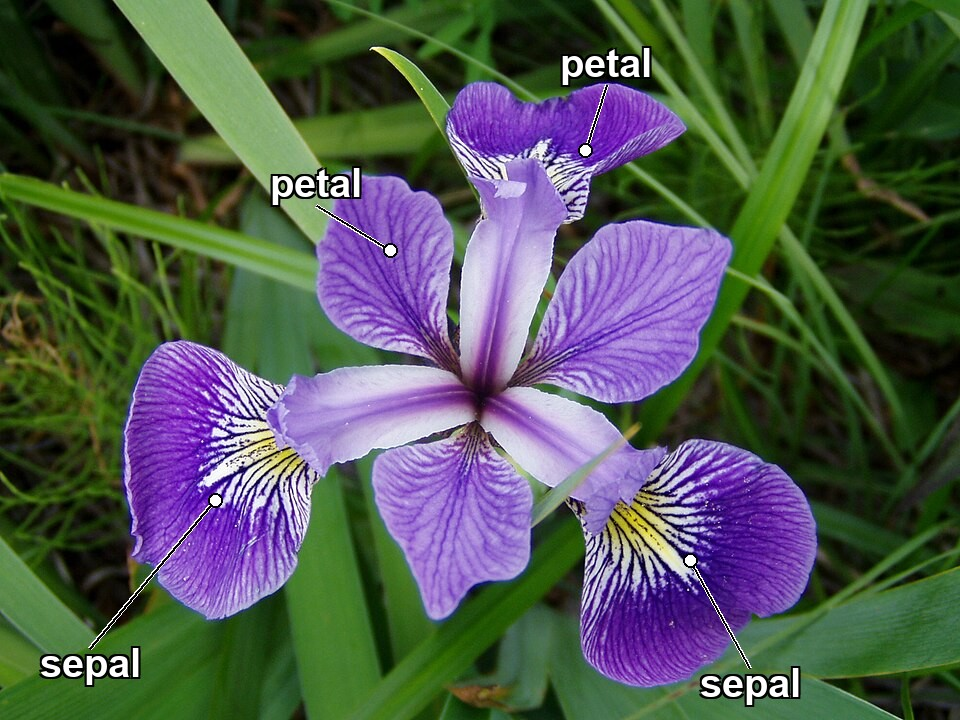
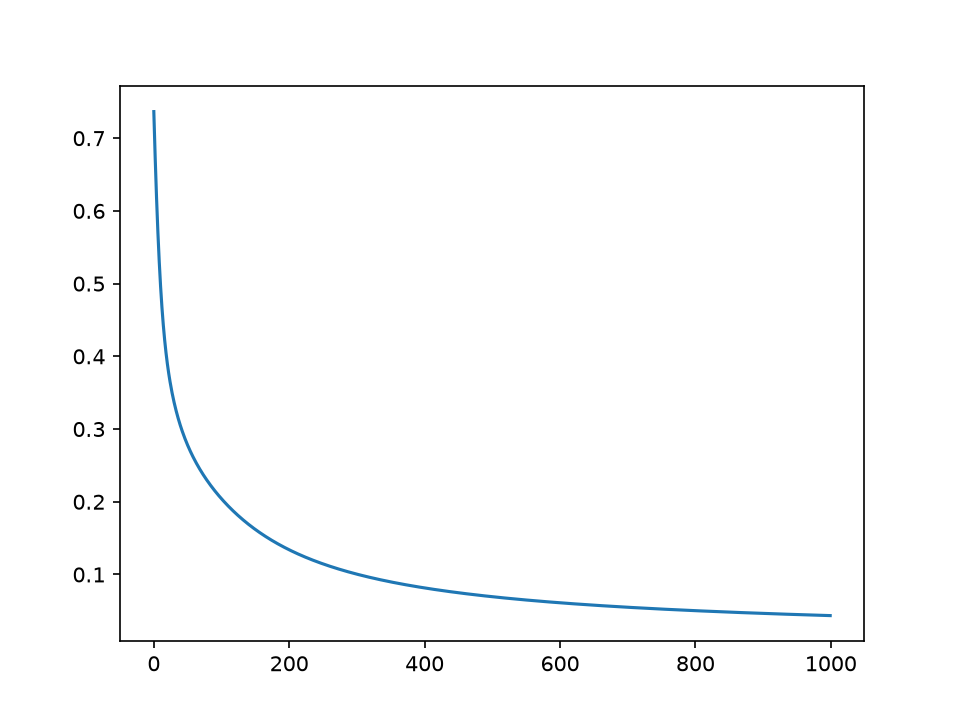

<!-- editorlm-hebrew-html-start -->
<style>
html, body, .vscode-body, .markdown-body, .markdown-preview, #write {
  direction: rtl !important; text-align: right !important;
}
ul, ol { padding-right: 2em !important; padding-left: 0 !important; }
blockquote { border-right: 3px solid #999; border-left: 0; padding-right: 1rem; padding-left: 0; }
@media print {
  html, body, .vscode-body, .markdown-body, .markdown-preview, #write {
    direction: rtl !important; text-align: right !important;
  }
}
</style>
<!-- editorlm-hebrew-html-end -->
<style>
.book { max-width: 900px; margin: auto; line-height: 1.8; font-family: Arial, sans-serif; }
.book .cover { min-height: 680px; box-sizing: border-box; padding: 64px 48px; margin: 24px 0 60px; background: #112b41; color: #f5f8fc; border-top: 9px solid #39c4b5; position: relative; }
.book .cover .eyebrow { color: #81e0d5; font-size: 15px; letter-spacing: 2px; }
.book .cover h1 { color: #fff; font-size: 48px; line-height: 1.3; border: 0; margin: 50px 0 18px; }
.book .cover .subtitle { font-size: 28px; color: #d8e6f0; }
.book .cover .author { font-size: 30px; color: #fff; margin-top: 52px; }
.book .cover .audience { color: #c1d3df; margin-top: 12px; }
.book .cover .motif { direction: ltr; text-align: left; font-family: Consolas, monospace; color: #81e0d5; font-size: 19px; margin-top: 54px; }
.book h1, .book h2, .book h3 { line-height: 1.4; font-weight: 700; }
.book > h1 { font-size: 32px !important; text-align: center !important; margin: 28px 0; }
.book h2 { font-size: 34px !important; text-align: center !important; color: #153b56 !important; background: #eef5fc; border: 0; border-bottom: 4px solid #299c91; border-radius: 10px 10px 0 0; padding: 28px 20px; margin: 24px 0 36px; }
.book h3 { font-size: 24px !important; text-align: right !important; color: #174e49 !important; background: #edf7f5; border: 0; border-right: 5px solid #299c91; border-radius: 6px; padding: 10px 16px; margin: 36px 0 18px; }
.book .chapter { height: 0; margin: 76px 0 0; border-top: 1px solid #ccd7df; break-before: page; page-break-before: always; break-after: avoid; page-break-after: avoid; }
.book .toc { padding: 24px; border-right: 5px solid #39a99d; background: rgba(70,150,155,.09); margin: 24px 0 48px; }
.book pre, .book pre code { direction: ltr !important; text-align: left !important; unicode-bidi: isolate; }
.book pre { box-sizing: border-box !important; width: 100% !important; max-width: 100% !important; margin: 0 !important; padding: 16px 20px; border: 1px solid #ccd7df; border-radius: 8px; line-height: 1.6; overflow-x: auto; }
.book code { direction: ltr; unicode-bidi: isolate; font-family: Consolas, "Courier New", monospace; }
.book pre { background: #f3f6fa !important; color: #1f2937 !important; }
.book pre code, .book pre code.hljs { background: transparent !important; color: #1f2937 !important; }
.book pre .hljs-keyword, .book pre .hljs-literal { color: #6f299c !important; }
.book pre .hljs-string { color: #216338 !important; }
.book pre .hljs-number { color: #075e68 !important; }
.book pre .hljs-comment { color: #526174 !important; }
.book pre .hljs-built_in, .book pre .hljs-title { color: #135b96 !important; }
.book table { width: 75%; max-width: 75%; margin: 18px auto; }
.book th, .book td { text-align: right; }
.book .small { font-size: .9em; opacity: .8; }
.book .python-intro { display: flex; align-items: center; gap: 28px; padding: 22px 28px; margin: 24px 0; background: #eef5fc; color: #183e63; border-right: 6px solid #3776ab; border-radius: 10px; }
.book .python-intro strong { font-size: 30px; }
.book .python-fact { background: #fff7d6; color: #423611; border-right: 6px solid #ffd343; border-radius: 8px; padding: 18px 24px; margin: 22px 0; }
.book .python-fact strong { font-size: 24px; }
.book img { max-width: 100%; height: auto; }
.book figure { margin: 24px auto; text-align: center; }
.book figure img { display: block; margin: auto; }
.book figcaption { direction: rtl; text-align: center; font-size: .9em; color: #445566; }
.book .gallery { display: flex; flex-wrap: wrap; gap: 16px; justify-content: center; margin: 24px 0; }
.book .gallery figure { flex: 1 1 200px; max-width: 280px; margin: 0; }
.book .gallery img { width: 100%; height: 220px; object-fit: cover; border-radius: 8px; }
@media print { .book > h2 { break-before: page; page-break-before: always; } }
.book .screen-strip { width: 760px; max-width: 100%; height: 220px; overflow: hidden; border: 1px solid #bccad5; border-radius: 8px; margin: 20px auto 8px; direction: ltr; }
.book .screen-strip.output { height: 265px; }
.book .screen-strip img { display: block; width: 1745px; max-width: none; }
.book .screen-menu { width: 400px; max-width: 100%; height: 295px; overflow: hidden; direction: ltr; margin: 20px auto 8px; border: 1px solid #bccad5; border-radius: 8px; }
.book .screen-menu img { display: block; width: 1745px; max-width: none; }
.book .code-panel { box-sizing: border-box !important; display: block !important; width: 75% !important; max-width: 75% !important; margin: 18px auto !important; }
@media print {
  .book .cover { min-height: 85vh; break-after: page; print-color-adjust: exact; -webkit-print-color-adjust: exact; }
  .book pre { white-space: pre-wrap; break-inside: avoid; }
  .book .chapter { margin: 0; border: 0; }
  .book h1, .book h2, .book h3 { break-after: avoid; page-break-after: avoid; break-inside: avoid; }
  .book h2 { margin-top: 0; }
  .book h2, .book h3 { print-color-adjust: exact; -webkit-print-color-adjust: exact; }
}
</style>

<style>
.book .book-nav { display: flex; flex-wrap: wrap; gap: 10px; justify-content: center; align-items: center; padding: 16px 0; margin: 20px 0 32px; border-top: 1px solid #ccd7df; border-bottom: 1px solid #ccd7df; }
.book .book-nav a { display: inline-block; padding: 10px 18px; border-radius: 8px; background: #eef5fc; color: #153b56 !important; border: 1px solid #b5ccd9; text-decoration: none !important; font-size: 16px; font-weight: bold; }
.book .book-nav a.toc-link { background: #174e49; color: #fff !important; border-color: #174e49; }
.book .book-nav a:hover, .book .book-nav a:focus { background: #d4eee8; color: #153b56 !important; outline: 2px solid #299c91; outline-offset: 2px; }
.book .section-list { line-height: 2; }
@media print { .book .book-nav { display: none; } }

/* Explicit Hebrew direction, including prose beginning with English. */
.book p, .book ul, .book ol, .book li,
.book blockquote, .book h1, .book h2, .book h3,
.book h4, .book th, .book td {
  direction: rtl !important;
  text-align: right !important;
  unicode-bidi: isolate;
}
/* Chapter titles keep their agreed centered layout. */
.book h2 { text-align: center !important; }
.book pre, .book pre code, .book .code-panel {
  direction: ltr !important;
  text-align: left !important;
  unicode-bidi: isolate;
}
/* Display math renders left-to-right and centered, independent of the RTL page. */
.book .math-panel, .book .math-panel .katex-display, .book .math-panel .katex {
  direction: ltr !important;
  text-align: center !important;
  unicode-bidi: isolate;
}
.book .math-panel { box-sizing: border-box; width: 75%; max-width: 75%; margin: 20px auto; padding: 16px 20px; background: #f3f6fa; color: #1f2937; border: 1px solid #ccd7df; border-radius: 8px; overflow-x: auto; font-size: 1.1em; }
.book .math-panel .katex-display { margin: 0; }
.book .math-panel p { margin: 0; }
/* English-only tables read left-to-right. */
.book table.ltr, .book table.ltr th, .book table.ltr td {
  direction: ltr !important;
  text-align: left !important;
  unicode-bidi: isolate;
}
.book table.ltr span[dir="rtl"] { white-space: nowrap; }
</style>

<div class="book" dir="rtl" lang="he" style="direction: rtl !important; text-align: right !important;">

<nav class="book-nav" aria-label="ניווט בספר">
<a href="13-%D7%A8%D7%92%D7%A8%D7%A1%D7%99%D7%94%20%D7%9C%D7%95%D7%92%D7%99%D7%A1%D7%98%D7%99%D7%AA.md">→ הקודם</a>
<a class="toc-link" href="../index.md">תוכן העניינים</a>
<a href="15-%D7%A8%D7%A9%D7%AA%20%D7%A0%D7%95%D7%99%D7%A8%D7%95%D7%A0%D7%99%D7%9D.md">הבא ←</a>
</nav>

## ג.14 רגרסיה לוגיסטית — דוגמאות

בפרק הקודם הכרנו את הרכיבים של סיווג בינארי: מודל לינארי, פונקציית האקטיבציה Sigmoid שהופכת את הפלט להסתברות, ופונקציית ההפסד BCE. בפרק זה נחבר אותם לפתרון של בעיה אמיתית מתחום הרפואה: לפי מדידות של גידול, האם הוא ממאיר או שפיר?

הדגש בפרק הוא על התהליך המלא, ולא רק על המודל. נתחיל בהבנת הבעיה והנתונים — מה המאגר מכיל, מה אומרת כל שורה ומה אנחנו מנסים לחזות — רק אחר כך נעבור לקוד: פיצול לאימון ולבדיקה, נרמול, בניית המודל, אימון ובדיקה. בסוף הפרק נחזור על אותו תהליך בדוגמה שנייה, מאגר Iris, כדי לראות שהמתכון חוזר על עצמו.

**[השיעור וההרצאות באתר של גלעד מרקמן](https://webprogramming.azurewebsites.net/Pages/PyTorch/Logic_Reg.aspx)**

[פתיחת מחברת Colab 1](https://colab.research.google.com/drive/11Tbo2bNWLKPkbrf-yDvldKzpFNvQ2Jdm?usp=sharing)

**חומרי הליווי:** [7_Logic_regression](../../../sources/ML/converted/7_Logic_regression/notebook.md) · [Iris](../../../sources/ML/converted/Iris/notebook.md)

### המאגר Breast Cancer — מהי הבעיה?

לפני שנכתוב שורת קוד, נבין את הבעיה. אישה מגיעה לבדיקת דימות, כמו ממוגרפיה, ובבדיקה מתגלה גוש בשד. השאלה החשובה ביותר היא האם הגוש **ממאיר — malignant**, כלומר סרטני: גוש שעלול לגדול ולהתפשט לאיברים אחרים ודורש טיפול מהיר. או שהוא **שפיר — benign**, כלומר לא סרטני: גוש שאינו מתפשט ובדרך כלל אינו מסכן חיים.

השלב הבא הוא **ביופסיית מחט דקה** (Fine Needle Aspiration): בדיקה פשוטה ומהירה, ללא חתך וללא הרדמה, שבה שואבים מהגוש כמה תאים במחט דקה ומצלמים אותם במיקרוסקופ. הבדיקה נותנת מידע חשוב על התאים, אך לא תשובה סופית: הדגימה קטנה, והתשובה הוודאית והטיפול מגיעים רק ב**ניתוח**, שבו מוציאים את הגוש ובודקים אותו במלואו במעבדה.

וכאן נוצרת הבעיה. בכל יום מגיעות תוצאות ביופסיה רבות, ואי אפשר לנתח את כולן מיד. הרופאים צריכים להחליט **מי דחופה יותר**: למי לעשות ניתוח בהקדם, ולמי אפשר להמתין ולעקוב בלי ניתוח. מודל שמקבל את המדידות מהביופסיה ומחזיר את ההסתברות שהגוש ממאיר יכול לעזור לסדר את התור: להפנות מהר לניתוח את המקרים החשודים, ולחסוך ניתוח מיותר למקרים שכמעט בוודאות שפירים. המודל אינו מחליף את הרופא, אך הוא כלי עזר בעל חשיבות של ממש בהחלטה על הניתוח.

מהיכן מגיעות המדידות? במאגר **Breast Cancer Wisconsin**, המצורף לספריית scikit-learn, כל שורה היא ביופסיית מחט אחת. מהתמונה הדיגיטלית של התאים חושבו עשרה מאפיינים של גרעיני התאים: רדיוס, מרקם (שינוי בגווני האפור), היקף, שטח, חלקות, קומפקטיות, קעירות, מספר נקודות קעורות, סימטריה ומימד פרקטלי. לכל מאפיין חושבו הממוצע (mean), שגיאת התקן (error) והערך הקיצוני ביותר (worst), ובסך הכול 30 תכונות מספריות לכל גוש. המאגר מכיל 569 גושים, ולכל אחד ידועה התשובה האמיתית: ממאיר או שפיר.

<!-- editorlm-source-ref: [sources/ML/converted/7_Logic_regression/notebook.md#L108-L192] -->

### הכרת הנתונים — כמה שורות מהטבלה

נטען את המאגר לטבלת pandas, כפי שעשינו בפרק ג.12, ונציג שש שורות — שלוש הראשונות ושלוש נוספות — בארבע תכונות בלבד מתוך השלושים:

<div class="code-panel" dir="ltr">

```python
import pandas as pd
from sklearn import datasets

bc = datasets.load_breast_cancer()
df = pd.DataFrame(bc.data, columns=bc.feature_names)
df["target"] = bc.target

print(df.shape)
print(bc.target_names)
cols = ["mean radius", "mean texture", "mean area", "mean concave points", "target"]
print(df.iloc[[0, 1, 2, 19, 20, 21]][cols])
```

</div>

**פלט**

<div class="code-panel" dir="ltr">

```text
(569, 31)
['malignant' 'benign']
    mean radius  mean texture  mean area  mean concave points  target
0        17.990         10.38     1001.0              0.14710       0
1        20.570         17.77     1326.0              0.07017       0
2        19.690         21.25     1203.0              0.12790       0
19       13.540         14.36      566.3              0.04781       1
20       13.080         15.71      520.0              0.03110       1
21        9.504         12.44      273.9              0.02076       1
```

</div>

מה אומרת כל שורה? כל שורה היא גוש אחד. `mean radius` הוא הרדיוס הממוצע של גרעיני התאים בתמונה, `mean texture` הוא מידת השינוי בגווני האפור, `mean area` הוא השטח הממוצע של הגרעין, ו־`mean concave points` הוא מספר הנקודות הקעורות בקו המתאר של הגרעין, כלומר עד כמה הגרעין "משונן" ולא עגול. העמודה `target` היא התשובה האמיתית, וכאן יש פרט קטן שחשוב לזכור: ב־scikit-learn **0 פירושו malignant (ממאיר) ו־1 פירושו benign (שפיר)**, לפי הסדר ב־`target_names`.

עכשיו אפשר להשוות. שלושת הגושים הממאירים (שורות 0–2) גדולים יותר: רדיוס של 18–21 ושטח של 1000–1300, ויש להם יותר נקודות קעורות. שלושת השפירים (שורות 19–21) קטנים יותר: רדיוס של 9.5–13.5 ושטח של 270–570, וקו המתאר שלהם חלק יותר. זהו בדיוק סוג ההבדל שאנחנו מקווים שהמודל ילמד לזהות בעצמו, מתוך כל 30 התכונות יחד.

נבדוק גם כמה גושים יש מכל סוג, ואת הממוצעים של שלוש תכונות לפי הסוג:

<div class="code-panel" dir="ltr">

```python
print(df["target"].value_counts())
print(df.groupby("target")[["mean radius", "mean area", "mean concave points"]].mean().round(2))
```

</div>

**פלט**

<div class="code-panel" dir="ltr">

```text
target
1    357
0    212
Name: count, dtype: int64
        mean radius  mean area  mean concave points
target
0             17.46     978.38                 0.09
1             12.15     462.79                 0.03
```

</div>

במאגר 357 גושים שפירים ו־212 ממאירים. הממוצעים מאשרים את מה שראינו בשש השורות: הגושים הממאירים גדולים בממוצע פי שניים בשטח, ויש להם פי שלושה נקודות קעורות. עכשיו, כשאנחנו מבינים מה יש בטבלה ומה אנחנו רוצים לחזות, נעבור למימוש.

### המימוש — ייבוא הספריות וטעינת הנתונים

נייבא את הספריות:

<div class="code-panel" dir="ltr">

```python
import torch
import torch.nn as nn
import numpy as np
import matplotlib.pyplot as plt
from sklearn import datasets
from sklearn.model_selection import train_test_split
```

</div>

<!-- editorlm-source-ref: [sources/ML/converted/7_Logic_regression/notebook.md#L24-L34] -->

נטען את המאגר כמערכי NumPy, כפי שהמודל צריך אותם, ונציג את שמות הקטגוריות, צורות המערכים ודוגמאות מהנתונים:

<div class="code-panel" dir="ltr">

```python
bc = datasets.load_breast_cancer()
X, y = bc.data, bc.target
print ("target_names",bc.target_names)
print ("X, y",X.shape, y.shape)
print (X[0:5])
print (y)
```

</div>

תחילת הפלט השמור:

**פלט**

<div class="code-panel" dir="ltr">

```text
target_names ['malignant' 'benign']
X, y (569, 30) (569,)
```

</div>

<!-- editorlm-source-ref: [sources/ML/converted/7_Logic_regression/notebook.md#L39-L98] -->

נציג גם את תיאור המאגר המלא, שממנו לקוחים פרטי התכונות שהסברנו:

<div class="code-panel" dir="ltr">

```python
print (bc.DESCR)
```

</div>

<!-- editorlm-source-ref: [sources/ML/converted/7_Logic_regression/notebook.md#L99-L229] -->

התיאור מפרט את התכונות, ובהן רדיוס, מרקם, היקף ושטח. התכונות חושבו מתמונות של דגימות שנלקחו במחט.
<!-- editorlm-source-ref: [sources/ML/converted/7_Logic_regression/notebook.md#L113-L192] -->

### פיצול הנתונים ובניית טנסורים

כדי לדעת אם המודל באמת למד להכליל, ולא רק שינן את הדוגמאות שראה, נשמור חלק מהנתונים בצד ולא נשתמש בו באימון. את החלק הזה, **נתוני הבדיקה — Test**, נבחן רק בסוף. נחלק את הנתונים באקראי ל־80% אימון ו־20% בדיקה. נמיר את המערכים לטנסורים ואת התשובות לעמודה:

<div class="code-panel" dir="ltr">

```python
n_samples, n_features = X.shape
X_train_np, X_test_np, y_train_np, y_test_np = train_test_split (X,y, test_size=0.2, random_state = 2)

X_train = torch.from_numpy(X_train_np.astype(np.float32))
X_test = torch.from_numpy(X_test_np.astype(np.float32))

y_train = torch.from_numpy(y_train_np.astype(np.float32))
y_test = torch.from_numpy(y_test_np.astype(np.float32))

y_train = y_train.view(-1,1)
y_test = y_test.view(-1,1)
```

</div>

<!-- editorlm-source-ref: [sources/ML/converted/7_Logic_regression/notebook.md#L234-L249] -->

נציג את הצורות:

<div class="code-panel" dir="ltr">

```python
print (X_train.shape, y_train.shape)
print (X_test.shape, y_test.shape)
```

</div>

**פלט**

<div class="code-panel" dir="ltr">

```text
torch.Size([455, 30]) torch.Size([455, 1])
torch.Size([114, 30]) torch.Size([114, 1])
```

</div>

<!-- editorlm-source-ref: [sources/ML/converted/7_Logic_regression/notebook.md#L250-L264] -->

### נרמול הנתונים

התכונות במאגר נמדדות בסולמות שונים מאוד: שטח יכול להגיע למאות ואלפים, ואילו מדדי צורה הם שברים קטנים מ־1. כפי שראינו בפרק הנרמול, הפרשי סולם כאלה מקשים על האימון ועלולים לגרום להתבדרות, ולכן ננרמל. כדי לנרמל כל תכונה לפי הערכים שלה, נחשב גדלים לכל עמודה בנפרד. נתחיל בחישוב מקסימום בכל עמודה:

<div class="code-panel" dir="ltr">

```python
t = torch.tensor([
    [4, 6, 3, 7, 9],
    [4, 2, 6, 9, 1]])

print(t.max(dim=0))
```

</div>

**פלט**

<div class="code-panel" dir="ltr">

```text
torch.return_types.max(
values=tensor([4, 6, 6, 9, 9]),
indices=tensor([0, 0, 1, 1, 0]))
```

</div>

<!-- editorlm-source-ref: [sources/ML/converted/7_Logic_regression/notebook.md#L269-L287] -->

נחשב את פרמטרי הנרמול מנתוני האימון ונגדיר את שתי הפונקציות:

<div class="code-panel" dir="ltr">

```python
max,__ = X_train.max(dim=0)
min, __ = X_train.min(dim=0)

def Normalize_minMax(X):
    return (X - min) / (max - min)

mean = X_train.mean(dim=0)
std = X_train.std(dim=0)

def Normalize_z(X):
    return (X - mean) / std

print (max.shape, min.shape)
print (mean.shape, std.shape)
```

</div>

**פלט**

<div class="code-panel" dir="ltr">

```text
torch.Size([30]) torch.Size([30])
torch.Size([30]) torch.Size([30])
```

</div>

<!-- editorlm-source-ref: [sources/ML/converted/7_Logic_regression/notebook.md#L288-L314] -->

נשתמש ב־Min–Max עבור שתי הקבוצות, עם אותם מינימום ומקסימום:

<div class="code-panel" dir="ltr">

```python
X_train = Normalize_minMax(X_train)
X_test = Normalize_minMax(X_test)
# X_train = Normalize_z(X_train)
# X_test = Normalize_z(X_test)
print (X_train[0:5])
print (X_train.max(dim=0))
```

</div>

**פלט**

<div class="code-panel" dir="ltr">

```text
tensor([[0.3346, 0.5898, 0.3289, 0.1938, 0.4212, 0.2769, 0.1045, 0.2139, 0.1975,
         0.2566, 0.0916, 0.2501, 0.1004, 0.0430, 0.1884, 0.1795, 0.0682, 0.3976,
         0.1573, 0.2007, 0.2622, 0.5637, 0.2480, 0.1282, 0.3495, 0.1932, 0.1059,
         0.3610, 0.1636, 0.1839],
        [0.1964, 0.2337, 0.1844, 0.1008, 0.2607, 0.0463, 0.0321, 0.0681, 0.1837,
         0.2516, 0.0109, 0.1341, 0.0099, 0.0054, 0.1418, 0.0246, 0.0309, 0.1513,
         0.1470, 0.0675, 0.1334, 0.2204, 0.1192, 0.0580, 0.2102, 0.0339, 0.0366,
         0.1393, 0.1972, 0.1026],
        [0.5774, 0.4322, 0.5785, 0.4261, 0.2943, 0.3707, 0.2610, 0.3366, 0.3203,
         0.1164, 0.1174, 0.1575, 0.1449, 0.0886, 0.1296, 0.2566, 0.0891, 0.2985,
         0.0609, 0.1139, 0.5489, 0.5341, 0.5777, 0.3693, 0.4030, 0.5169, 0.3087,
         0.5884, 0.4020, 0.2430],
        [0.3232, 0.4748, 0.3301, 0.1927, 0.7192, 0.4763, 0.3650, 0.4561, 0.5788,
         0.5296, 0.1641, 0.3469, 0.1485, 0.0858, 0.2417, 0.2120, 0.1024, 0.3156,
         0.1454, 0.1644, 0.4009, 0.7950, 0.3889, 0.2379, 1.0000, 0.4789, 0.3711,
         0.6934, 0.7153, 0.3506],
        [0.1878, 0.3936, 0.1943, 0.0965, 0.6326, 0.3055, 0.2446, 0.2818, 0.3887,
         0.4093, 0.0453, 0.2360, 0.0502, 0.0190, 0.2159, 0.1105, 0.0854, 0.2535,
         0.0525, 0.0977, 0.1747, 0.6215, 0.1833, 0.0808, 0.7907, 0.2353, 0.3213,
         0.4905, 0.3441, 0.2682]])
torch.return_types.max(
values=tensor([1., 1., 1., 1., 1., 1., 1., 1., 1., 1., 1., 1., 1., 1., 1., 1., 1., 1.,
        1., 1., 1., 1., 1., 1., 1., 1., 1., 1., 1., 1.]),
indices=tensor([ 39, 354,  39, 358, 241, 319, 289, 289,  53, 200,  39,  35,  39, 358,
        238, 208,  83,  11, 319, 286, 358, 146, 358, 358,   3, 276,  83, 189,
        433, 276]))
```

</div>

<!-- editorlm-source-ref: [sources/ML/converted/7_Logic_regression/notebook.md#L315-L357] -->

### הגדרת המודל, ההפסד והאופטימייזר

נבנה מודל שמפיק ערך בין 0 ל־1 לצורך הסיווג הבינארי. `nn.Sequential` מפעילה את השכבות לפי סדרן: שכבה לינארית בעלת 30 קלטים ופלט אחד, ואחריה Sigmoid. נגדיר BCE ואופטימייזר Adam, בקצב למידה 0.1 וב־1,000 צעדים.

<div class="code-panel" dir="ltr">

```python
learning_rate = 0.1
epochs = 1000
losses = torch.zeros(epochs) # tensor to save losses for print

# design model
Model = nn.Sequential(
        nn.Linear(30,1),
        nn.Sigmoid()
)

#construct loss and optimizer
Loss = nn.BCELoss()

# init optimizer
optim = torch.optim.Adam(Model.parameters(), lr=learning_rate)
```

</div>

<!-- editorlm-source-ref: [sources/ML/converted/7_Logic_regression/notebook.md#L362-L381] -->

### לולאת האימון

הלולאה נשארת כפי שהכרנו: חיזוי, חישוב הפסד ונגזרות, עדכון המשקלים ואיפוס הנגזרות.

<div class="code-panel" dir="ltr">

```python
for epoch in range(epochs):
    # forward
    y_predict = Model(X_train)

    # backward
    loss = Loss(y_predict, y_train)
    loss.backward()

    # update wights
    optim.step()
    losses[epoch]=loss.item()

    if epoch % 10 == 0:
        print(f"epoch= {epoch} loss={loss.item():.4f} ")

    # zero grads
    optim.zero_grad()
```

</div>

שורות ראשונות ואחרונה מתוך הפלט השמור:

**פלט**

<div class="code-panel" dir="ltr">

```text
epoch= 0 loss=0.7413 
epoch= 10 loss=0.3653 
epoch= 20 loss=0.2684 
...
epoch= 990 loss=0.0466
```

</div>

<!-- editorlm-source-ref: [sources/ML/converted/7_Logic_regression/notebook.md#L386-L513] -->

נציג את ההפסד לאורך האימון:

<div class="code-panel" dir="ltr">

```python
plt.plot(losses.detach())
plt.show()
```

</div>

<!-- editorlm-source-ref: [sources/ML/converted/7_Logic_regression/notebook.md#L518-L533] -->


<figure>

<figcaption>ירידת הפסד האימון בדוגמת Breast Cancer.</figcaption>
</figure>
<!-- editorlm-source-ref: [sources/ML/converted/7_Logic_regression/notebook.md#L532] -->

### בדיקת המודל

ההפסד יורד, אבל המדד שבאמת מעניין אותנו הוא כמה מהגידולים המודל מסווג נכון. וכאן יש שינוי חשוב לעומת כל מה שעשינו עד עכשיו.

**בבדיקה משתמשים בנתוני הבדיקה (Test), ולא בנתוני האימון (Train).** בלולאת האימון המודל ראה שוב ושוב את 455 הדוגמאות של `X_train` ו־`y_train`, וכיוון את המשקלים לפיהן. אם נבדוק אותו על אותן דוגמאות, הציון יהיה גבוה גם אם המודל רק שינן אותן. לכן עכשיו ניתן לו את 114 הדוגמאות של `X_test` — הגידולים שהפרדנו בצד לפני האימון, ושהמודל **מעולם לא ראה** — ונשווה את התחזיות שלו ל־`y_test`. הצלחה על דוגמאות חדשות היא ההוכחה היחידה שהמודל למד להכליל, וזה בדיוק המצב במציאות: גידול חדש שמגיע למרפאה אינו נמצא בטבלת האימון.

המודל מחזיר הסתברות, ולכן כדי לקבל תשובה של כן/לא נקבע סף: הסתברות מעל 0.5 תיחשב 1, ומתחתיו 0. נחשב תחזיות על נתוני הבדיקה, נעגל אותן ל־0 או ל־1 ונחשב את שיעור הסיווגים הנכונים — מדד שנקרא **דיוק — Accuracy**. `round()` מעגלת גם ערך של 0.5 בדיוק ל־0.

<div class="code-panel" dir="ltr">

```python
with torch.no_grad():
    y_predicted = Model(X_test)
    y_predicted_bin = y_predicted.round()
    accuracy = y_predicted_bin.eq(y_test).sum() / float(y_test.shape[0])
    print (f'accuracy = {accuracy:.4f}')

print(y_test.shape)
print(y_predicted_bin.shape)
```

</div>

**פלט**

<div class="code-panel" dir="ltr">

```text
accuracy = 0.9649
torch.Size([114, 1])
torch.Size([114, 1])
```

</div>

<!-- editorlm-source-ref: [sources/ML/converted/7_Logic_regression/notebook.md#L538-L559] -->

#### איך חישבנו את הדיוק?

הקוד קצר, אבל כל שורה בו עושה פעולה אחרת. נעקוב אחריו שלב אחר שלב, עם דוגמה קטנה של חמישה גידולים מתוך נתוני הבדיקה:

1. **`with torch.no_grad():`** — אנחנו רק בודקים, לא מאמנים, ולכן אין צורך לחשב נגזרות. הבלוק חוסך זמן וזיכרון.
2. **`y_predicted = Model(X_test)`** — מעבירים את נתוני הבדיקה במודל ומקבלים לכל גידול הסתברות בין 0 ל־1, למשל: <span dir="ltr">[0.99, 0.55, 0.02, 0.41, 0.90]</span>.
3. **`y_predicted_bin = y_predicted.round()`** — מעגלים כל הסתברות ל־0 או ל־1, כלומר מחליטים לפי הסף 0.5: <span dir="ltr">[1, 1, 0, 0, 1]</span>. אלו התחזיות של המודל.
4. **`y_predicted_bin.eq(y_test)`** — משווים כל תחזית לתשובה האמיתית. נניח שהתשובות האמיתיות הן <span dir="ltr">[1, 1, 0, 1, 1]</span>; `eq` (equal) מחזירה לכל גידול אמת או שקר: <span dir="ltr">[True, True, True, False, True]</span>. הגידול הרביעי הוא טעות: המודל אמר 0 והאמת היא 1.
5. **`.sum()`** — סוכמים את התוצאות. פייתון סופרת `True` כ־1 ו־`False` כ־0, ולכן הסכום הוא מספר הסיווגים הנכונים: 4.
6. **`/ float(y_test.shape[0])`** — מחלקים במספר הגידולים שנבדקו. `y_test.shape[0]` הוא מספר השורות ב־`y_test`, כאן 5. התוצאה: <span dir="ltr">4 / 5 = 0.8</span>, כלומר דיוק של 80%.

הדיוק הוא אפוא פשוט **מספר הסיווגים הנכונים (correct predictions) חלקי מספר דוגמאות הבדיקה (test examples)**:

<div class="math-panel" dir="ltr">

$$
Accuracy = \frac{\text{correct predictions}}{\text{test examples}} = \frac{110}{114} = 0.9649
$$

</div>

בנתונים האמיתיים שלנו `y_test` מכיל 114 גידולים, הסכום של ההשוואות הנכונות הוא 110, ומכאן הדיוק שבפלט.

**קיבלנו דיוק של 96.49% — מדהים!** המודל שלנו יודע לזהות אם גידול הוא ממאיר או שפיר: מתוך 114 גידולים שלא ראה מעולם, הוא סיווג נכון 110. וכל זה עם מודל של שורה אחת, `nn.Linear` ואחריה `Sigmoid`, שלמד את המשקלים בעצמו מתוך 455 דוגמאות. שימו לב גם לצורות בפלט: 114 שורות, בדיוק כמספר דוגמאות הבדיקה, ולא 455 של האימון. הפלטים הם דוגמאות שמורות; האתחול האקראי עשוי לשנות מעט את התוצאה בהרצה חדשה.

נציג זו לצד זו את ההסתברות, התווית החזויה והתווית האמיתית:

<div class="code-panel" dir="ltr">

```python
print ("predicted, test \n", torch.cat((y_predicted,y_predicted_bin, y_test), dim=1))
```

</div>

שורות ראשונות ואחרונה מתוך הפלט השמור:

**פלט**

<div class="code-panel" dir="ltr">

```text
predicted, test 
 tensor([[9.9294e-01, 1.0000e+00, 1.0000e+00],
        [5.5413e-01, 1.0000e+00, 1.0000e+00],
...
        [1.8337e-05, 0.0000e+00, 0.0000e+00]])
```

</div>

<!-- editorlm-source-ref: [sources/ML/converted/7_Logic_regression/notebook.md#L560-L685] -->

### דוגמה נוספת — Iris

כדי לראות שאותו מתכון עובד גם על נתונים מסוג אחר, נחזור עליו על מאגר קטן ומפורסם, Iris, שבו כל דוגמה היא פרח ולא גידול. במאגר יש שלושה מיני פרחים, אבל בפרק זה נהפוך את השאלה לשאלת כן/לא: האם הפרח שייך למין מסוים או לא. סיווג לשלוש קטגוריות בבת אחת יחכה לפרק ג.18. וכמו בדוגמה הקודמת, לפני הקוד נכיר את הנתונים.

### מאגר Iris — רקע

**Iris** הוא האירוס, פרח בר מוכר שגדל גם בישראל. המאגר נאסף בשנות השלושים של המאה העשרים על ידי הבוטנאי אדגר אנדרסון, ופורסם ב־1936 במאמר של הסטטיסטיקאי רונלד פישר (R.A. Fisher), שהשתמש בו כדי להראות שאפשר להבחין בין מינים לפי מדידות מספריות. מאז הוא הפך למאגר הלימוד המפורסם ביותר בלמידת מכונה. המאגר מכיל 150 פרחים משלושה מינים של אירוס, 50 מכל מין:

<div class="gallery">
<figure>

<figcaption>Iris setosa<br><span class="small">צילום: Radomil, ויקישיתוף, CC BY-SA 3.0</span></figcaption>
</figure>
<figure>

<figcaption>Iris versicolor<br><span class="small">צילום: Danielle Langlois, ויקישיתוף, CC BY-SA 3.0</span></figcaption>
</figure>
<figure>

<figcaption>Iris virginica<br><span class="small">צילום: Frank Mayfield, ויקישיתוף, CC BY-SA 2.0</span></figcaption>
</figure>
</div>

**מה מדדו בכל פרח?** בפרח יש שני סוגים של "עלים" צבעוניים:

- **עלי גביע — sepals.** ברוב הפרחים אלו העלים הירוקים החיצוניים שעוטפים את הניצן. באירוס הם הפכו לחלק הבולט ביותר של הפרח: שלושה עלים גדולים וצבעוניים, שנוטים כלפי מטה ונושאים כתם צהוב או לבן.
- **עלי כותרת — petals.** שלושה עלים פנימיים, בדרך כלל קטנים וצרים יותר, שעומדים זקופים במרכז הפרח.

<figure>

<figcaption>עלי הגביע (sepal) הם העלים הגדולים הנטויים, ועלי הכותרת (petal) הם העלים הזקופים.<br><span class="small">על בסיס צילום של Danielle Langlois, ויקישיתוף, CC BY-SA 3.0</span></figcaption>
</figure>

לכל פרח נמדדו ארבעה מספרים בסנטימטרים, וזו כל הטבלה:

| התכונה | באנגלית | מה מודדים |
| --- | --- | --- |
| אורך עלה הגביע | sepal length | מבסיס עלה הגביע עד קצהו |
| רוחב עלה הגביע | sepal width | הרוחב במקום הרחב ביותר |
| אורך עלה הכותרת | petal length | מבסיס עלה הכותרת עד קצהו |
| רוחב עלה הכותרת | petal width | הרוחב במקום הרחב ביותר |

כך, השורה הראשונה במאגר, <span dir="ltr">[5.1, 3.5, 1.4, 0.2]</span>, מתארת פרח שעלה הגביע שלו באורך 5.1 ס"מ וברוחב 3.5 ס"מ, ועלה הכותרת שלו קצר וצר במיוחד: 1.4 על 0.2 ס"מ. זהו פרח מהמין setosa, שעלי הכותרת שלו קטנים בהרבה משל שני המינים האחרים, ולכן קל להבדיל אותו מהם. לעומת זאת versicolor ו־virginica דומים יותר זה לזה, ולהפריד ביניהם קשה יותר. התוויות במאגר הן 0 עבור setosa, 1 עבור versicolor ו־2 עבור virginica.

<!-- editorlm-source-ref: [sources/ML/converted/Iris/notebook.md#L41-L85] -->

### טעינת Iris

נתחיל בטעינת המאגר ובבחינת התכונות והתוויות שלו.

<div class="code-panel" dir="ltr">

```python
import torch
import torch.nn as nn
import numpy as np
import matplotlib.pyplot as plt
from sklearn import datasets
from sklearn.model_selection import train_test_split
```

</div>

<!-- editorlm-source-ref: [sources/ML/converted/Iris/notebook.md#L7-L18] -->


<div class="code-panel" dir="ltr">

```python
iris = datasets.load_iris()
data, targets = iris.data, iris.target

print(iris.DESCR)
```

</div>

<!-- editorlm-source-ref: [sources/ML/converted/Iris/notebook.md#L23-L102] -->

המאגר מכיל 150 פרחים משלושה מינים, ולכל פרח ארבע מדידות: אורך ורוחב של עלי הגביע ושל עלי הכותרת, בסנטימטרים.
<!-- editorlm-source-ref: [sources/ML/converted/Iris/notebook.md#L41-L53] -->

<div class="code-panel" dir="ltr">

```python
print ("target_names",iris.target_names)
print ("X, y",data.shape, targets.shape)
print(data[0:5],'\n', targets)
```

</div>

**פלט**

<div class="code-panel" dir="ltr">

```text
target_names ['setosa' 'versicolor' 'virginica']
X, y (150, 4) (150,)
[[5.1 3.5 1.4 0.2]
 [4.9 3.  1.4 0.2]
 [4.7 3.2 1.3 0.2]
 [4.6 3.1 1.5 0.2]
 [5.  3.6 1.4 0.2]] 
 [0 0 0 0 0 0 0 0 0 0 0 0 0 0 0 0 0 0 0 0 0 0 0 0 0 0 0 0 0 0 0 0 0 0 0 0 0
 0 0 0 0 0 0 0 0 0 0 0 0 0 1 1 1 1 1 1 1 1 1 1 1 1 1 1 1 1 1 1 1 1 1 1 1 1
 1 1 1 1 1 1 1 1 1 1 1 1 1 1 1 1 1 1 1 1 1 1 1 1 1 1 2 2 2 2 2 2 2 2 2 2 2
 2 2 2 2 2 2 2 2 2 2 2 2 2 2 2 2 2 2 2 2 2 2 2 2 2 2 2 2 2 2 2 2 2 2 2 2 2
 2 2]
```

</div>

<!-- editorlm-source-ref: [sources/ML/converted/Iris/notebook.md#L103-L128] -->

### הצגת זוגות התכונות

נציג גרף לכל זוג תכונות, כשהצבעים מציינים את שלושת המינים המקוריים:

<div class="code-panel" dir="ltr">

```python
fig, axes = plt.subplots(4, 4, figsize=(15, 15))
features = iris.feature_names

for i in range(4):
    for j in range(4):
        ax = axes[i, j]
        # Plot scatter plots only on off-diagonal combinations
        if i != j:
            scatter = ax.scatter(data[:, j], data[:, i], c=iris.target, cmap='viridis', s=15)

        # Add labels to the outer edges of the grid
        if i == 3:
            ax.set_xlabel(features[j])
        if j == 0:
            ax.set_ylabel(features[i])

# Add a main legend to the figure
handles, labels = scatter.legend_elements()
fig.legend(handles, iris.target_names, loc='upper right', title="Classes")

plt.tight_layout()
plt.show()
```

</div>

<!-- editorlm-source-ref: [sources/ML/converted/Iris/notebook.md#L133-L168] -->


<figure>

<figcaption>זוגות תכונות בנתוני Iris, בצבעים לפי המין.</figcaption>
</figure>
<!-- editorlm-source-ref: [sources/ML/converted/Iris/notebook.md#L167] -->

**מה אנחנו רואים?** הרשת היא 4×4: כל משבצת מציגה זוג תכונות, התכונה שבשורה על הציר האנכי והתכונה שבעמודה על הציר האופקי. האלכסון ריק, כי אין טעם להציג תכונה מול עצמה. כל נקודה היא פרח אחד, והצבע הוא המין: סגול setosa, ירוק-כחול versicolor, צהוב virginica. הרשת מאפשרת לראות במבט אחד אילו מינים קל להפריד ואילו קשה:

- **setosa נפרד בקלות.** בכל משבצת, הנקודות הסגולות יושבות בקבוצה משלהן, רחוק מהשאר. הבולט ביותר הוא זוג עלי הכותרת (petal length מול petal width, המשבצת השלישית בשורה הרביעית): כל פרחי setosa מרוכזים בפינה השמאלית התחתונה, עם עלי כותרת קצרים מ־2 ס"מ וצרים מ־0.6 ס"מ, ויש רווח ניכר בינם לבין שני המינים האחרים. אפשר להעביר קו ישר שמפריד את setosa מכל השאר בלי טעות אחת. זה מה שנקרא **הפרדה לינארית**, ומודל לינארי עם Sigmoid יפתור אותה בקלות.
- **versicolor ו־virginica קשים להפרדה.** הנקודות הירוקות והצהובות שוכנות זו לצד זו. בזוגות עלי הגביע (sepal length מול sepal width) הן מעורבבות ממש, ואי אפשר להפריד ביניהן. בזוגות עלי הכותרת ההפרדה טובה יותר, אבל גם שם הקבוצות נוגעות זו בזו סביב אורך עלה כותרת של 5 ס"מ ורוחב של 1.6 ס"מ, וכמה פרחים "חוצים את הגבול". כל קו ישר שנבחר יטעה בכמה פרחים.
- **versicolor נמצא באמצע.** שימו לב שהמין הירוק-כחול לכוד בין שני המינים האחרים: setosa מצד אחד ו־virginica מהצד השני. זה יהיה חשוב בהמשך.

הגרפים מציגים רק שתי תכונות בכל פעם, ואילו המודל שנבנה יראה את כל ארבע התכונות יחד, ולכן הוא עשוי להפריד טוב יותר ממה שנראה במשבצת בודדת. ובכל זאת, המבט על הנתונים כבר מלמד אותנו למה לצפות: השאלה "האם זה setosa?" קלה, והשאלה "האם זה versicolor?" קשה, כי versicolor יושב בין שני המינים האחרים ואין קו ישר אחד שמפריד אותו משניהם. בהמשך נבחר את השאלה "האם זה virginica?": המין הצהוב יושב בקצה, ולכן קו ישר יכול להפריד אותו כמעט לגמרי מכל השאר. בסוף נבדוק גם מה קורה כשבוחרים דווקא בשאלה הקשה.

### מעבר לתוויות בינאריות

כדי להפוך את זיהוי שלושת המינים לשאלת כן/לא, נבחר מין אחד ונבדיל בינו לבין כל השאר. לפי מה שראינו בגרפים נבחר את virginica, שיושב בקצה ולכן קל יחסית להפריד אותו: נגדיר 1 לפרח מסוג virginica, שתוויתו המקורית היא 2, ו־0 לשאר הפרחים, setosa ו־versicolor:

<div class="code-panel" dir="ltr">

```python
targets = (targets == 2).astype(int)
print(targets)
```

</div>

**פלט**

<div class="code-panel" dir="ltr">

```text
[0 0 0 0 0 0 0 0 0 0 0 0 0 0 0 0 0 0 0 0 0 0 0 0 0 0 0 0 0 0 0 0 0 0 0 0 0
 0 0 0 0 0 0 0 0 0 0 0 0 0 0 0 0 0 0 0 0 0 0 0 0 0 0 0 0 0 0 0 0 0 0 0 0 0
 0 0 0 0 0 0 0 0 0 0 0 0 0 0 0 0 0 0 0 0 0 0 0 0 0 0 1 1 1 1 1 1 1 1 1 1 1
 1 1 1 1 1 1 1 1 1 1 1 1 1 1 1 1 1 1 1 1 1 1 1 1 1 1 1 1 1 1 1 1 1 1 1 1 1
 1 1]
```

</div>

<!-- editorlm-source-ref: [sources/ML/converted/Iris/notebook.md#L173-L194] -->

### פיצול הנתונים ובניית טנסורים

נחלק ל־80% אימון ו־20% בדיקה ונמיר לטנסורים:

<div class="code-panel" dir="ltr">

```python
n_samples, n_features = data.shape
X_train_np, X_test_np, y_train_np, y_test_np = train_test_split (data,targets, test_size=0.2, random_state = 4)

X_train = torch.from_numpy(X_train_np.astype(np.float32))
X_test = torch.from_numpy(X_test_np.astype(np.float32))

y_train = torch.from_numpy(y_train_np.astype(np.float32))
y_test = torch.from_numpy(y_test_np.astype(np.float32))

y_train = y_train.view(-1,1)
y_test = y_test.view(-1,1)
```

</div>

<!-- editorlm-source-ref: [sources/ML/converted/Iris/notebook.md#L199-L214] -->


<div class="code-panel" dir="ltr">

```python
print (X_train.shape, y_train.shape)
print (X_test.shape, y_test.shape)
```

</div>

**פלט**

<div class="code-panel" dir="ltr">

```text
torch.Size([120, 4]) torch.Size([120, 1])
torch.Size([30, 4]) torch.Size([30, 1])
```

</div>

<!-- editorlm-source-ref: [sources/ML/converted/Iris/notebook.md#L215-L229] -->

### נרמול Iris

נחשב מינימום ומקסימום מתוך קבוצת האימון ונשתמש בהם לנרמול שתי הקבוצות:

<div class="code-panel" dir="ltr">

```python
max_train,__ = X_train.max(dim=0)
min_train, __ = X_train.min(dim=0)

def Normalize_minMax(X):
    return (X - min_train) / (max_train - min_train)


print (max_train, min_train)
```

</div>

**פלט**

<div class="code-panel" dir="ltr">

```text
tensor([7.9000, 4.4000, 6.9000, 2.5000]) tensor([4.3000, 2.2000, 1.0000, 0.1000])
```

</div>

<!-- editorlm-source-ref: [sources/ML/converted/Iris/notebook.md#L234-L254] -->


<div class="code-panel" dir="ltr">

```python
X_train = Normalize_minMax(X_train)
X_test = Normalize_minMax(X_test)
# X_train = Normalize_z(X_train)
# X_test = Normalize_z(X_test)
print (X_train[0:5])
max_val, max_idx = X_train.max(dim=0)
print (max_val, max_idx)
```

</div>

**פלט**

<div class="code-panel" dir="ltr">

```text
tensor([[0.3056, 0.3636, 0.5932, 0.5833],
        [0.0833, 0.4545, 0.0678, 0.0417],
        [0.6667, 0.1364, 0.8136, 0.7083],
        [0.1667, 0.3636, 0.0678, 0.0417],
        [0.1944, 0.0455, 0.3898, 0.3750]])
tensor([1., 1., 1., 1.]) tensor([102,  16,  22,   5])
```

</div>

<!-- editorlm-source-ref: [sources/ML/converted/Iris/notebook.md#L255-L278] -->

### המודל והאימון

נגדיר מודל עם ארבעה קלטים, Sigmoid ו־BCE. נשתמש ב־Adam בקצב 0.1 וב־1,000 צעדים. כדי שההרצה שלכם תיתן בדיוק את המספרים שבספר, נקבע את הזרע האקראי של האתחול בעזרת `torch.manual_seed`:

<div class="code-panel" dir="ltr">

```python
torch.manual_seed(0)
learning_rate = 0.1
epochs = 1000
losses = [] # list to save losses for print

# design model
Model = nn.Sequential(
        nn.Linear(4,1),
        nn.Sigmoid()
)

#construct loss and optimizer
Loss = nn.BCELoss()

# init optimizer
optim = torch.optim.Adam(Model.parameters(), lr=learning_rate)
```

</div>

<!-- editorlm-source-ref: [sources/ML/converted/Iris/notebook.md#L283-L302] -->


<div class="code-panel" dir="ltr">

```python
for epoch in range(epochs):
    # forward
    y_predict = Model(X_train)

    # backward
    loss = Loss(y_predict, y_train)
    loss.backward()

    # update wights
    optim.step()
    losses.append(loss.item())

    if epoch % 10 == 0:
        print(f"epoch= {epoch} loss={loss.item():.4f} ")

    # zero grads
    optim.zero_grad()
```

</div>

שורות ראשונות ואחרונה מתוך פלט ההרצה:

**פלט**

<div class="code-panel" dir="ltr">

```text
epoch= 0 loss=0.7365 
epoch= 10 loss=0.4961 
epoch= 20 loss=0.3898 
...
epoch= 990 loss=0.0437
```

</div>

<!-- editorlm-source-ref: [sources/ML/converted/Iris/notebook.md#L307-L434] -->

נציג את הפסד האימון:

<div class="code-panel" dir="ltr">

```python
plt.plot(losses)
plt.show()
```

</div>

<!-- editorlm-source-ref: [sources/ML/converted/Iris/notebook.md#L439-L454] -->


<figure>

<figcaption>הפסד האימון בדוגמת Iris: ההפסד יורד מכ־0.74 לכ־0.04.</figcaption>
</figure>
<!-- editorlm-source-ref: [sources/ML/converted/Iris/notebook.md#L453] -->

### בדיקת הסיווג ב־Iris

גם כאן הבדיקה נעשית על נתוני הבדיקה בלבד — 30 הפרחים ב־`X_test` שהמודל לא ראה באימון — ולא על 120 פרחי האימון. נחשב את שיעור הסיווגים הנכונים ונציג אותו באחוזים:

<div class="code-panel" dir="ltr">

```python
with torch.no_grad():
    y_predicted = Model(X_test)
    y_predicted_bin = y_predicted.round()
    accuracy = y_predicted_bin.eq(y_test).sum() / float(y_test.shape[0])
    print (f'accuracy = {accuracy*100:.4f}%')

print(y_test.shape)
print(y_predicted_bin.shape)
```

</div>

**פלט**

<div class="code-panel" dir="ltr">

```text
accuracy = 93.3333%
torch.Size([30, 1])
torch.Size([30, 1])
```

</div>

<!-- editorlm-source-ref: [sources/ML/converted/Iris/notebook.md#L459-L480] -->

**דיוק של 93.33%: 28 מתוך 30 פרחי הבדיקה סווגו נכון.** גם כאן מודל של שורה אחת, שראה רק ארבע מדידות לכל פרח, מזהה כמעט תמיד אם הפרח הוא virginica. נציג את התווית החזויה לצד התווית האמיתית:

<div class="code-panel" dir="ltr">

```python
print ("predicted, test \n", torch.cat((y_predicted_bin, y_test), dim=1))
```

</div>

**פלט**

<div class="code-panel" dir="ltr">

```text
predicted, test
 tensor([[1., 1.],
        [0., 0.],
        [1., 1.],
        [1., 1.],
        [1., 1.],
        [0., 0.],
        [1., 0.],
        [0., 0.],
        [0., 0.],
        [0., 1.],
        [0., 0.],
        [0., 0.],
        [0., 0.],
        [0., 0.],
        [1., 1.],
        [0., 0.],
        [0., 0.],
        [0., 0.],
        [0., 0.],
        [1., 1.],
        [0., 0.],
        [1., 1.],
        [0., 0.],
        [0., 0.],
        [0., 0.],
        [0., 0.],
        [0., 0.],
        [0., 0.],
        [0., 0.],
        [1., 1.]])
```

</div>

שתי הטעויות נראות בטבלה: בשורה השביעית המודל אמר virginica (1) על פרח שאינו כזה, ובשורה העשירית הוא פספס virginica אמיתי. שני הפרחים האלה נמצאים כנראה באזור שבו virginica ו־versicolor נוגעים זה בזה בגרפים.

**ומה אם היינו בוחרים בשאלה הקשה?** כפי שראינו בגרפים, versicolor לכוד בין שני המינים האחרים, ואין קו ישר אחד שמפריד אותו משניהם. ואכן, אותו קוד בדיוק עם `targets = (targets == 1).astype(int)` נותן דיוק של 73.33% בלבד: 22 מתוך 30. לא משהו. הלקח חשוב: מודל לינארי יכול להפריד רק מה שניתן להפרדה בקו ישר, וכשהנתונים אינם כאלה צריך מודל חזק יותר. זה בדיוק מה שנעשה בפרקים הבאים, כשנעבור לרשת נוירונים.

<!-- editorlm-source-ref: [sources/ML/converted/Iris/notebook.md#L481-L522] -->


<nav class="book-nav" aria-label="ניווט בספר">
<a href="13-%D7%A8%D7%92%D7%A8%D7%A1%D7%99%D7%94%20%D7%9C%D7%95%D7%92%D7%99%D7%A1%D7%98%D7%99%D7%AA.md">→ הקודם</a>
<a class="toc-link" href="../index.md">תוכן העניינים</a>
<a href="15-%D7%A8%D7%A9%D7%AA%20%D7%A0%D7%95%D7%99%D7%A8%D7%95%D7%A0%D7%99%D7%9D.md">הבא ←</a>
</nav>

</div>

<!-- editorlm-source-versions: {"schemaVersion": 1, "sources": {"sources/ML/7. רגרסיה לוגית.pptx": {"sourceSha256": "a92c997f6c1254fc7b3db621da823ffdcbda718a78b1f0b3426dcbe25c757932", "canonicalTextSha256": "429f04c69c436b52fc5dcd968b2979d6376980d984af1ecbfe142b136e544214"}, "sources/ML/‏‏7. רגרסיה לוגית - אקטיבציה.pptx": {"sourceSha256": "841709a292a051af10ad5c46831ee2286ab80d955b4adfc1758a0d7184a507f6", "canonicalTextSha256": "4260704ff7278388758008928c938bdf80e63848b727873f6253afa6cc4b1b22"}, "sources/ML/converted/7_Logic_regression/notebook.md": {"sourceSha256": "27938126cfd0bb3b2dcc628a5e0b36c24fc0d82f66ad8549731432f366dd7b03", "canonicalTextSha256": "27938126cfd0bb3b2dcc628a5e0b36c24fc0d82f66ad8549731432f366dd7b03"}, "sources/ML/converted/Iris/notebook.md": {"sourceSha256": "66222a66bb405b21a6eea3f1f8d8fcc70b8ee82622989dc029e1c10ccb7c7661", "canonicalTextSha256": "66222a66bb405b21a6eea3f1f8d8fcc70b8ee82622989dc029e1c10ccb7c7661"}, "sources/ML/pdf/‏‏7. רגרסיה לוגית - אקטיבציה.pdf": {"sourceSha256": "ae2c0fe6f2aa409320e9d5fb43f5841bfd7597cd72ea7118f03eddd404069e8a", "canonicalTextSha256": "b7d7f35f375d1bc1952dfd8e18bae75eac7dbbf7f0e25d26a485955f7735169f"}}} -->
