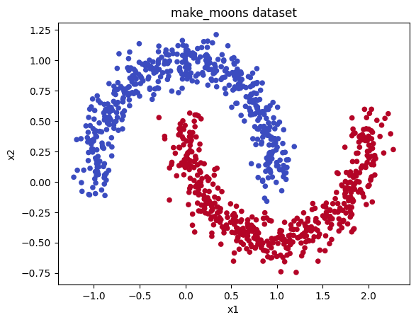
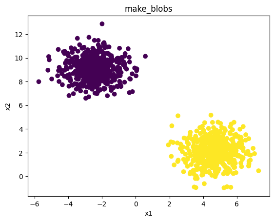
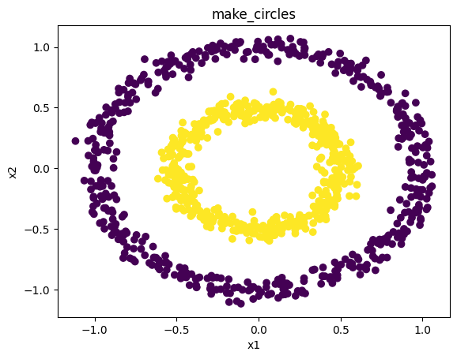
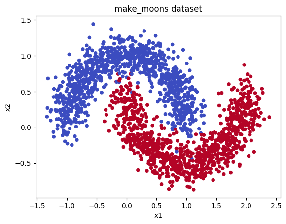
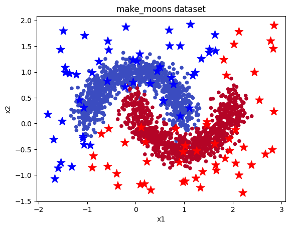

<!-- editorlm-hebrew-html-start -->
<style>
html, body, .vscode-body, .markdown-body, .markdown-preview, #write {
  direction: rtl !important; text-align: right !important;
}
ul, ol { padding-right: 2em !important; padding-left: 0 !important; }
blockquote { border-right: 3px solid #999; border-left: 0; padding-right: 1rem; padding-left: 0; }
@media print {
  html, body, .vscode-body, .markdown-body, .markdown-preview, #write {
    direction: rtl !important; text-align: right !important;
  }
}
</style>
<!-- editorlm-hebrew-html-end -->
<style>
.book { max-width: 900px; margin: auto; line-height: 1.8; font-family: Arial, sans-serif; }
.book .cover { min-height: 680px; box-sizing: border-box; padding: 64px 48px; margin: 24px 0 60px; background: #112b41; color: #f5f8fc; border-top: 9px solid #39c4b5; position: relative; }
.book .cover .eyebrow { color: #81e0d5; font-size: 15px; letter-spacing: 2px; }
.book .cover h1 { color: #fff; font-size: 48px; line-height: 1.3; border: 0; margin: 50px 0 18px; }
.book .cover .subtitle { font-size: 28px; color: #d8e6f0; }
.book .cover .author { font-size: 30px; color: #fff; margin-top: 52px; }
.book .cover .audience { color: #c1d3df; margin-top: 12px; }
.book .cover .motif { direction: ltr; text-align: left; font-family: Consolas, monospace; color: #81e0d5; font-size: 19px; margin-top: 54px; }
.book h1, .book h2, .book h3 { line-height: 1.4; font-weight: 700; }
.book > h1 { font-size: 32px !important; text-align: center !important; margin: 28px 0; }
.book h2 { font-size: 34px !important; text-align: center !important; color: #153b56 !important; background: #eef5fc; border: 0; border-bottom: 4px solid #299c91; border-radius: 10px 10px 0 0; padding: 28px 20px; margin: 24px 0 36px; }
.book h3 { font-size: 24px !important; text-align: right !important; color: #174e49 !important; background: #edf7f5; border: 0; border-right: 5px solid #299c91; border-radius: 6px; padding: 10px 16px; margin: 36px 0 18px; }
.book .chapter { height: 0; margin: 76px 0 0; border-top: 1px solid #ccd7df; break-before: page; page-break-before: always; break-after: avoid; page-break-after: avoid; }
.book .toc { padding: 24px; border-right: 5px solid #39a99d; background: rgba(70,150,155,.09); margin: 24px 0 48px; }
.book pre, .book pre code { direction: ltr !important; text-align: left !important; unicode-bidi: isolate; }
.book pre { box-sizing: border-box !important; width: 100% !important; max-width: 100% !important; margin: 0 !important; padding: 16px 20px; border: 1px solid #ccd7df; border-radius: 8px; line-height: 1.6; overflow-x: auto; }
.book code { direction: ltr; unicode-bidi: isolate; font-family: Consolas, "Courier New", monospace; }
.book pre { background: #f3f6fa !important; color: #1f2937 !important; }
.book pre code, .book pre code.hljs { background: transparent !important; color: #1f2937 !important; }
.book pre .hljs-keyword, .book pre .hljs-literal { color: #6f299c !important; }
.book pre .hljs-string { color: #216338 !important; }
.book pre .hljs-number { color: #075e68 !important; }
.book pre .hljs-comment { color: #526174 !important; }
.book pre .hljs-built_in, .book pre .hljs-title { color: #135b96 !important; }
.book table { width: 100%; }
.book th, .book td { text-align: right; }
.book .small { font-size: .9em; opacity: .8; }
.book .python-intro { display: flex; align-items: center; gap: 28px; padding: 22px 28px; margin: 24px 0; background: #eef5fc; color: #183e63; border-right: 6px solid #3776ab; border-radius: 10px; }
.book .python-intro strong { font-size: 30px; }
.book .python-fact { background: #fff7d6; color: #423611; border-right: 6px solid #ffd343; border-radius: 8px; padding: 18px 24px; margin: 22px 0; }
.book .python-fact strong { font-size: 24px; }
.book img { max-width: 100%; height: auto; }
.book figure { margin: 24px auto; text-align: center; }
.book figure img { display: block; margin: auto; }
.book figcaption { direction: rtl; text-align: center; font-size: .9em; color: #445566; }
@media print { .book > h2 { break-before: page; page-break-before: always; } }
.book .screen-strip { width: 760px; max-width: 100%; height: 220px; overflow: hidden; border: 1px solid #bccad5; border-radius: 8px; margin: 20px auto 8px; direction: ltr; }
.book .screen-strip.output { height: 265px; }
.book .screen-strip img { display: block; width: 1745px; max-width: none; }
.book .screen-menu { width: 400px; max-width: 100%; height: 295px; overflow: hidden; direction: ltr; margin: 20px auto 8px; border: 1px solid #bccad5; border-radius: 8px; }
.book .screen-menu img { display: block; width: 1745px; max-width: none; }
.book .code-panel { box-sizing: border-box !important; display: block !important; width: 75% !important; max-width: 75% !important; margin: 18px auto !important; }
@media print {
  .book .cover { min-height: 85vh; break-after: page; print-color-adjust: exact; -webkit-print-color-adjust: exact; }
  .book pre { white-space: pre-wrap; break-inside: avoid; }
  .book .chapter { margin: 0; border: 0; }
  .book h1, .book h2, .book h3 { break-after: avoid; page-break-after: avoid; break-inside: avoid; }
  .book h2 { margin-top: 0; }
  .book h2, .book h3 { print-color-adjust: exact; -webkit-print-color-adjust: exact; }
}
</style>

<style>
.book .book-nav { display: flex; flex-wrap: wrap; gap: 10px; justify-content: center; align-items: center; padding: 16px 0; margin: 20px 0 32px; border-top: 1px solid #ccd7df; border-bottom: 1px solid #ccd7df; }
.book .book-nav a { display: inline-block; padding: 10px 18px; border-radius: 8px; background: #eef5fc; color: #153b56 !important; border: 1px solid #b5ccd9; text-decoration: none !important; font-size: 16px; font-weight: bold; }
.book .book-nav a.toc-link { background: #174e49; color: #fff !important; border-color: #174e49; }
.book .book-nav a:hover, .book .book-nav a:focus { background: #d4eee8; color: #153b56 !important; outline: 2px solid #299c91; outline-offset: 2px; }
.book .section-list { line-height: 2; }
@media print { .book .book-nav { display: none; } }

/* Explicit Hebrew direction, including prose beginning with English. */
.book p, .book ul, .book ol, .book li,
.book blockquote, .book h1, .book h2, .book h3,
.book h4, .book th, .book td {
  direction: rtl !important;
  text-align: right !important;
  unicode-bidi: isolate;
}
/* Chapter titles keep their agreed centered layout. */
.book h2 { text-align: center !important; }
.book pre, .book pre code, .book .code-panel {
  direction: ltr !important;
  text-align: left !important;
  unicode-bidi: isolate;
}
</style>

<div class="book" dir="rtl" lang="he" style="direction: rtl !important; text-align: right !important;">

<nav class="book-nav" aria-label="ניווט בספר">
<a href="14-%D7%A8%D7%92%D7%A8%D7%A1%D7%99%D7%94%20%D7%9C%D7%90%20%D7%9C%D7%99%D7%A0%D7%90%D7%A8%D7%99%D7%AA.md">→ הקודם</a>
<a class="toc-link" href="../index.md">תוכן העניינים</a>
<a href="16-%D7%A1%D7%99%D7%95%D7%95%D7%92%20%D7%91%D7%92%D7%93%D7%99%D7%9D%20%D7%95%D7%90%D7%95%D7%AA%D7%99%D7%95%D7%AA.md">הבא ←</a>
</nav>

## ג.15 Moon — ללמוד גבול סיווג שאינו ישר

בפרק הקודם ראינו שקו ישר אינו מספיק לרגרסיה כשהקשר בנתונים גלי. אותה מגבלה קיימת גם בסיווג. ברגרסיה הלוגיסטית המודל מחשב סכום משוקלל אחד של הקלטים ומעביר אותו ב־Sigmoid; כשיש שני קלטים, פירוש הדבר שהוא מותח קו ישר אחד במישור ומכריז: כל מה שמצד אחד שייך לקטגוריה הראשונה, וכל מה שמצד השני — לשנייה. קו זה נקרא **גבול הסיווג — Decision Boundary**: הוא מפריד בין האזורים שבהם המודל בוחר בכל קטגוריה. אבל בעולם האמיתי הקבוצות לא תמיד ניתנות להפרדה בקו ישר. דמיינו מפה שבה בתי עיר מסוימת מקיפים אגם: "בתוך העיר" ו"באגם" אינם ניתנים להפרדה בשום קו ישר, ורק גבול עקום — מעגל — יעשה זאת. גבול הסיווג, אם כן, עשוי להיות עקום, ונדרש מודל שיכול ללמוד גבול כזה.

בפרק זה נבחן שלושה מבנים של נתונים בשתי קטגוריות: סהרונים, אשכולות וטבעות. הנתונים דו־ממדיים בכוונה, כדי שנוכל לצייר אותם ולראות בעין איזו צורת גבול נדרשת לכל אחד: האשכולות ניתנים להפרדה בקו ישר, ואילו הסהרונים והטבעות — לא. לאחר מכן נאמן על הסהרונים את אותה רשת שהכרנו — שכבות לינאריות עם ReLU ו־Sigmoid בפלט — ונציג כיצד היא מסווגת נקודות נוספות במישור, כלומר איזה גבול היא למדה.

**[השיעור וההרצאות באתר של גלעד מרקמן](https://webprogramming.azurewebsites.net/Pages/PyTorch/ANN.aspx)**

**חומרי הליווי:** [מצגת רשת נוירונים ANN](../../../sources/ML/8.%20%D7%A8%D7%A9%D7%AA%20%D7%A0%D7%95%D7%A8%D7%95%D7%A0%D7%99%D7%9D%20ANN.pptx) · [מחברת Moon](../../../sources/ML/Colab/Moon.ipynb)

### סהרונים — Moons

ספריית scikit-learn מספקת פונקציות ליצירת נתונים מדומים בצורות מוגדרות, וכך נוכל לבחון את המודל על נתונים שאנו יודעים בדיוק כיצד הם בנויים. נתחיל ב־`make_moons`: ניצור 1,000 נקודות בשתי קבוצות בצורת סהר, עם רעש 0.1. הפרמטר `noise` קובע כמה הנקודות יתפזרו סביב הצורה המדויקת, ו־`random_state` מבטיח שנקבל את אותן נקודות בכל הרצה:

<div class="code-panel" dir="ltr">

```python
from sklearn.datasets import make_moons

X, y = make_moons(
    n_samples=1000,
    noise=0.1,
    random_state=42
)
```

</div>

<!-- editorlm-source-ref: [sources/ML/converted/Moon/notebook.md#L7-L18] -->

`X` הוא מערך של 1,000 שורות ושתי עמודות — הקואורדינטות x1 ו־x2 של כל נקודה — ו־`y` הוא התווית, 0 או 1. נציג את הנקודות בצבעים לפי הקטגוריה:

<div class="code-panel" dir="ltr">

```python
import matplotlib.pyplot as plt

plt.scatter(X[:, 0], X[:, 1], c=y, cmap="coolwarm", s=20)
plt.xlabel("x1")
plt.ylabel("x2")
plt.title("make_moons dataset")
plt.show()
```

</div>

<!-- editorlm-source-ref: [sources/ML/converted/Moon/notebook.md#L19-L39] -->


<figure>

<figcaption>שתי קבוצות בצורת סהר.</figcaption>
</figure>
<!-- editorlm-source-ref: [sources/ML/converted/Moon/notebook.md#L38] -->

שני הסהרונים משולבים זה בזה: הקצה של האחד נכנס לתוך הקעורה של השני. כל קו ישר שנמתח יחתוך לפחות את אחד מהם, ולכן רגרסיה לוגיסטית לבדה הייתה טועה כאן בחלק ניכר מהנקודות.

### אשכולות — Blobs

לשם השוואה נראה מבנה פשוט יותר. ניצור 1,000 נקודות סביב שני מרכזים, כל קבוצה מפוזרת סביב המרכז שלה בסטיית תקן 1.0:

<div class="code-panel" dir="ltr">

```python
from sklearn.datasets import make_blobs

X, y = make_blobs(
    n_samples=1000,
    centers=2,
    cluster_std=1.0,
    random_state=42
)
```

</div>

<!-- editorlm-source-ref: [sources/ML/converted/Moon/notebook.md#L40-L53] -->

נציג את האשכולות:

<div class="code-panel" dir="ltr">

```python
plt.figure()
plt.scatter(X[:, 0], X[:, 1], c=y)
plt.xlabel("x1")
plt.ylabel("x2")
plt.title("make_blobs")
plt.show()
```

</div>

<!-- editorlm-source-ref: [sources/ML/converted/Moon/notebook.md#L54-L73] -->


<figure>

<figcaption>שתי קבוצות נקודות סביב מרכזים.</figcaption>
</figure>
<!-- editorlm-source-ref: [sources/ML/converted/Moon/notebook.md#L72] -->

כאן שתי הקבוצות נמצאות משני צדדים של המישור, וקו ישר אחד מפריד ביניהן כמעט לחלוטין. זהו המקרה שבו רגרסיה לוגיסטית מספיקה.

### טבעות — Circles

המבנה השלישי הוא הקשה ביותר לקו ישר. ניצור שתי טבעות, עם רעש 0.05 ויחס רדיוסים 0.5 — הטבעת הפנימית ברדיוס חצי מזה של החיצונית:

<div class="code-panel" dir="ltr">

```python
from sklearn.datasets import make_circles

X, y = make_circles(
    n_samples=1000,
    noise=0.05,
    factor=0.5,
    random_state=42
)
```

</div>

<!-- editorlm-source-ref: [sources/ML/converted/Moon/notebook.md#L74-L87] -->

נציג את הטבעות:

<div class="code-panel" dir="ltr">

```python
plt.figure()
plt.scatter(X[:, 0], X[:, 1], c=y)
plt.xlabel("x1")
plt.ylabel("x2")
plt.title("make_circles")
plt.show()
```

</div>

<!-- editorlm-source-ref: [sources/ML/converted/Moon/notebook.md#L88-L107] -->


<figure>

<figcaption>קבוצה פנימית וקבוצה המקיפה אותה.</figcaption>
</figure>
<!-- editorlm-source-ref: [sources/ML/converted/Moon/notebook.md#L106] -->

קבוצה אחת מקיפה את השנייה מכל הצדדים. מכל צד שנמתח קו ישר, יהיו נקודות משתי הקבוצות משני צדדיו; כאן רק גבול סגור, כמו מעגל, יכול להפריד.

### הכנת דוגמת האימון

אחרי שהכרנו את שלוש צורות הנתונים, נחזור לסהרונים ונכין אותם לאימון הרשת. סדר העבודה מוכר: יצירת הנתונים ופיצולם, המרה לטנסורים ואצוות, הגדרת הרשת, אימון ובדיקה.

נייבא את הספריות הדרושות לאימון:

<div class="code-panel" dir="ltr">

```python
import numpy as np
import torch
import torch.nn as nn
from torch.utils.data import TensorDataset, DataLoader
from sklearn.datasets import make_moons
from sklearn.model_selection import train_test_split
import matplotlib.pyplot as plt
```

</div>

<!-- editorlm-source-ref: [sources/ML/converted/Moon/notebook.md#L108-L119] -->

ניצור הפעם 2,000 נקודות בצורת סהר, עם רעש 0.15 — קצת יותר מבעבר, כדי שהמשימה לא תהיה קלה מדי — ונחלק ל־80% אימון ו־20% בדיקה, כדי שנוכל למדוד את הדיוק על נקודות שהרשת לא ראתה. הפרמטר `stratify=y` שומר בקירוב על יחס הקטגוריות בחלוקה, כך שבשתי הקבוצות יהיו בערך אותו מספר נקודות מכל סהרון.

<div class="code-panel" dir="ltr">

```python
# -----------------------
# 1) Create dataset
# -----------------------
X, y = make_moons(n_samples=2000, noise=0.15, random_state=42)

X_train, X_test, y_train, y_test = train_test_split(
    X, y, test_size=0.2, random_state=42, stratify=y
)
```

</div>

<!-- editorlm-source-ref: [sources/ML/converted/Moon/notebook.md#L120-L132] -->

נגדיר פונקציה להצגת הנתונים ונפעיל אותה. הפונקציה תשמש אותנו שוב בסוף הפרק, כשנרצה לצייר את התחזיות מעל הנתונים:

<div class="code-panel" dir="ltr">

```python
def plot_moons ():
    plt.scatter(X[:, 0], X[:, 1], c=y, cmap="coolwarm", s=20)
    plt.xlabel("x1")
    plt.ylabel("x2")
    plt.title("make_moons dataset")

plot_moons ()
```

</div>

<!-- editorlm-source-ref: [sources/ML/converted/Moon/notebook.md#L133-L153] -->


<figure>

<figcaption>נתוני הסהרונים שישמשו בדוגמת האימון.</figcaption>
</figure>
<!-- editorlm-source-ref: [sources/ML/converted/Moon/notebook.md#L152] -->

### טנסורים ואצוות

נמיר את הקלטים והתוויות לטנסורים. התוויות מומרות ל־float ומסודרות בעמודה (`view(-1, 1)`), משום ש־BCE משווה אותן לפלט הרשת, שהוא עמודה של הסתברויות. בפרק הקודם כתבנו מחלקת Dataset בעצמנו; כשהנתונים כבר טנסורים אפשר להשתמש ב־`TensorDataset` המוכנה, שמצמידה כל קלט לתווית שלו. נגדיר אצוות אימון של 64 דוגמאות ואצוות בדיקה של 256 — בבדיקה אין עדכון משקלים, ולכן אפשר להשתמש באצוות גדולות יותר.

<div class="code-panel" dir="ltr">

```python
# To torch tensors
X_train_t = torch.tensor(X_train, dtype=torch.float32)
y_train_t = torch.tensor(y_train, dtype=torch.float32).view(-1, 1)

X_test_t  = torch.tensor(X_test, dtype=torch.float32)
y_test_t  = torch.tensor(y_test, dtype=torch.float32).view(-1, 1)

# DataLoaders
train_loader = DataLoader(TensorDataset(X_train_t, y_train_t), batch_size=64, shuffle=True)
test_loader  = DataLoader(TensorDataset(X_test_t, y_test_t), batch_size=256, shuffle=False)
```

</div>

<!-- editorlm-source-ref: [sources/ML/converted/Moon/notebook.md#L154-L169] -->

### פרמטרים ומבנה הרשת

נבחר התקן חישוב ונגדיר את גדלי הרשת ופרמטרי האימון: שני קלטים (הקואורדינטות x1 ו־x2 של כל נקודה), שתי שכבות חבויות של 16 יחידות, 50 מעברים (אפוקים) וקצב למידה 0.01. הרשת קטנה בהרבה מזו של MNIST, כי הקלט הוא שני מספרים בלבד ולא 784:

<div class="code-panel" dir="ltr">

```python
device = torch.device("cuda" if torch.cuda.is_available() else "cpu")

# -----------------------
# 2) Build Sequential FNN
# -----------------------
input_size = 2
hidden1 = 16
hidden2 = 16
epochs = 50
learning_rate = 0.01
```

</div>

<!-- editorlm-source-ref: [sources/ML/converted/Moon/notebook.md#L170-L184] -->

נגדיר רשת עם ReLU בשכבות החבויות ו־Sigmoid בפלט, הפסד BCE ואופטימייזר Adam. שכבת הפלט וההפסד זהים לאלה של הרגרסיה הלוגיסטית, כי השאלה עדיין בינארית; מה שנוסף הוא השכבות החבויות, והן שיאפשרו לגבול הסיווג להתעקם:

<div class="code-panel" dir="ltr">

```python
Model = nn.Sequential(
    nn.Linear(input_size, hidden1, device=device),
    nn.ReLU(),
    nn.Linear(hidden1, hidden2, device=device),
    nn.ReLU(),
    nn.Linear(hidden2, 1, device=device),
    nn.Sigmoid()
)

Loss = nn.BCELoss()
optim = torch.optim.Adam(Model.parameters(), lr=learning_rate)
```

</div>

<!-- editorlm-source-ref: [sources/ML/converted/Moon/notebook.md#L185-L200] -->

### אימון ובדיקה בכל מעבר

עד כה בדקנו את המודל רק בסוף האימון. הפעם נשלב את הבדיקה בתוך הלולאה: בכל אפוק נעבור על אצוות האימון ונעדכן את המשקלים, ולאחר מכן נחשב את דיוק הסיווג על קבוצת הבדיקה כולה. כך נוכל לעקוב אחר השיפור מאפוק לאפוק ולראות מתי הרשת מפסיקה להשתפר. הקריאות `Model.train()` ו־`Model.eval()` מודיעות לרשת אם היא במצב אימון או במצב בדיקה; ברשת הפשוטה שלנו אין להן השפעה בפועל, אך זהו הרגל טוב, כי יש שכבות שמתנהגות אחרת בשני המצבים. הבדיקה מתבצעת בתוך `torch.no_grad()`, ונקודה מסווגת ל־1 כשההסתברות היא לפחות 0.5:

<div class="code-panel" dir="ltr">

```python
# -----------------------
# 3) Train loop
# -----------------------
for epoch in range(epochs):
    Model.train()
    for Xb, yb in train_loader:
        Xb = Xb.to(device)
        yb = yb.to(device)

        probs = Model(Xb)
        loss = Loss(probs, yb)

        optim.zero_grad()
        loss.backward()
        optim.step()

    # -----------------------
    # 4) Evaluate each epoch
    # -----------------------
    Model.eval()
    with torch.no_grad():
        probs_test = Model(X_test_t.to(device))
        preds_test = (probs_test >= 0.5).float().cpu()
        acc = (preds_test == y_test_t).float().mean().item()

    if (epoch + 1) % 5 == 0 or epoch == 0:
        print(f"epoch={epoch+1:02d} loss={loss.item():.4f} test_acc={acc*100:.2f}%")
```

</div>

**פלט**

<div class="code-panel" dir="ltr">

```text
epoch=01 loss=0.3519 test_acc=84.00%
epoch=05 loss=0.2133 test_acc=94.25%
epoch=10 loss=0.0145 test_acc=98.75%
epoch=15 loss=0.0079 test_acc=98.50%
epoch=20 loss=0.0305 test_acc=98.25%
epoch=25 loss=0.0851 test_acc=98.75%
epoch=30 loss=0.1121 test_acc=98.75%
epoch=35 loss=0.0579 test_acc=98.50%
epoch=40 loss=0.0297 test_acc=98.75%
epoch=45 loss=0.1111 test_acc=98.25%
epoch=50 loss=0.1097 test_acc=98.50%
```

</div>

<!-- editorlm-source-ref: [sources/ML/converted/Moon/notebook.md#L201-L250] -->

הפלט הוא דוגמה שמורה. `loss` הוא הפסד האצווה האחרונה באימון, ואילו `test_acc` הוא הדיוק על כל קבוצת הבדיקה. הדיוק עולה מ־84.00% אחרי האפוק הראשון ל־98.75% כבר באפוק 10, ומשם הוא נשאר יציב סביב 98.25%–98.75%. הנקודות הבודדות שנותרות שגויות הן כנראה אלה שהרעש העביר אל תוך הסהרון השני, ואותן לא יוכל לסווג נכון שום גבול סביר. ההפסד, לעומת זאת, קופץ מאפוק לאפוק (0.0079 באפוק 15 ו־0.1121 באפוק 30) משום שהוא נמדד על אצווה אחת של 64 נקודות בלבד, ולא על כל הנתונים.

### חיזוי ל־100 נקודות חדשות

הדיוק על קבוצת הבדיקה מספר לנו כמה נקודות סווגו נכון, אך לא איזה גבול הרשת למדה. כדי לראות כיצד הרשת מחלקת את המישור לקטגוריות, נבדוק גם נקודות שלא נכללו באימון, ובכלל זה נקודות באזורים הריקים שבין הסהרונים ומחוצה להם. נגריל 100 נקודות באופן אחיד במלבן שסביב הנתונים, עם שוליים של 0.5 מכל צד:

<div class="code-panel" dir="ltr">

```python
n_random = 100

x_min, x_max = X[:, 0].min() - 0.5, X[:, 0].max() + 0.5
y_min, y_max = X[:, 1].min() - 0.5, X[:, 1].max() + 0.5

X_rand = np.random.uniform(
    low=[x_min, y_min],
    high=[x_max, y_max],
    size=(n_random, 2)
)
```

</div>

<!-- editorlm-source-ref: [sources/ML/converted/Moon/notebook.md#L251-L266] -->

נחשב לכל נקודה הסתברות ונסווג לפי סף 0.5, בדיוק כפי שעשינו בבדיקה. את התוצאה נחזיר ל־CPU ונמיר למערך NumPy כדי שנוכל לצייר אותה:

<div class="code-panel" dir="ltr">

```python
with torch.no_grad():
    X_rand_t = torch.tensor(X_rand, dtype=torch.float32).to(device)

    probs = Model(X_rand_t)
    preds = (probs >= 0.5).float().cpu().numpy().reshape(-1)
```

</div>

<!-- editorlm-source-ref: [sources/ML/converted/Moon/notebook.md#L267-L277] -->

נצבע את הנקודות החדשות באדום או בכחול ונציג אותן ככוכבים מעל נתוני הסהרונים:

<div class="code-panel" dir="ltr">

```python
colors = ["red" if p == 1 else "blue" for p in preds]
plot_moons ()
plt.scatter(
    X_rand[:, 0],
    X_rand[:, 1],
    c=colors,
    marker="*",
    s=150
)
```

</div>

<!-- editorlm-source-ref: [sources/ML/converted/Moon/notebook.md#L278-L308] -->


<figure>

<figcaption>תחזיות ל־100 נקודות חדשות, המסומנות בכוכבים.</figcaption>
</figure>
<!-- editorlm-source-ref: [sources/ML/converted/Moon/notebook.md#L308] -->

לנקודות החדשות לא הוגדרו תוויות אמת; הצבע מציג את החלטת המודל, ולא בדיקת דיוק נוספת. מה שהתמונה מראה הוא ההכללה של הרשת: גם נקודות שנמצאות רחוק מכל נקודת אימון מקבלות צבע, לפי הצד של הגבול העקום שבו הן נמצאות. הכוכבים האדומים והכחולים מתחלקים לאורך קו מפותל שעוקב אחר צורת הסהרונים — גבול סיווג שקו ישר אחד לא היה יכול לתת. באותה דרך אפשר לאמן את הרשת גם על הטבעות, שבהן הגבול הנדרש סגור לחלוטין.


<nav class="book-nav" aria-label="ניווט בספר">
<a href="14-%D7%A8%D7%92%D7%A8%D7%A1%D7%99%D7%94%20%D7%9C%D7%90%20%D7%9C%D7%99%D7%A0%D7%90%D7%A8%D7%99%D7%AA.md">→ הקודם</a>
<a class="toc-link" href="../index.md">תוכן העניינים</a>
<a href="16-%D7%A1%D7%99%D7%95%D7%95%D7%92%20%D7%91%D7%92%D7%93%D7%99%D7%9D%20%D7%95%D7%90%D7%95%D7%AA%D7%99%D7%95%D7%AA.md">הבא ←</a>
</nav>

</div>

<!-- editorlm-source-versions: {"schemaVersion":1,"sources":{"sources/ML/converted/Moon/notebook.md":{"sourceSha256":"bfdb56fd97fdc59a74d75c33fb5616d6de8fae016ab30e3aa7205ed69d7e03d2","canonicalTextSha256":"bfdb56fd97fdc59a74d75c33fb5616d6de8fae016ab30e3aa7205ed69d7e03d2"}}} -->
