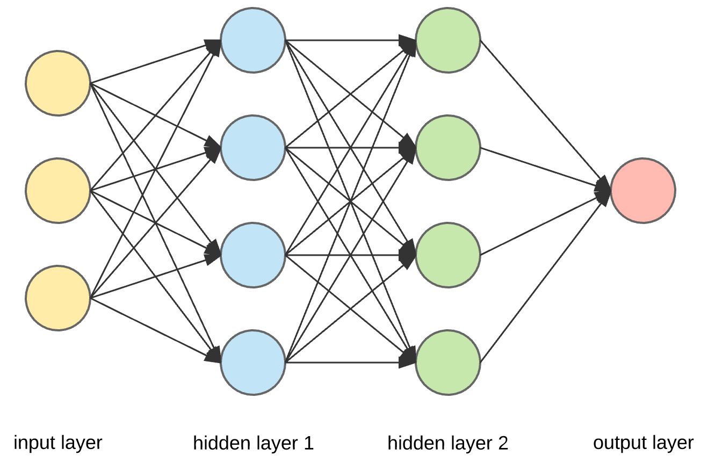
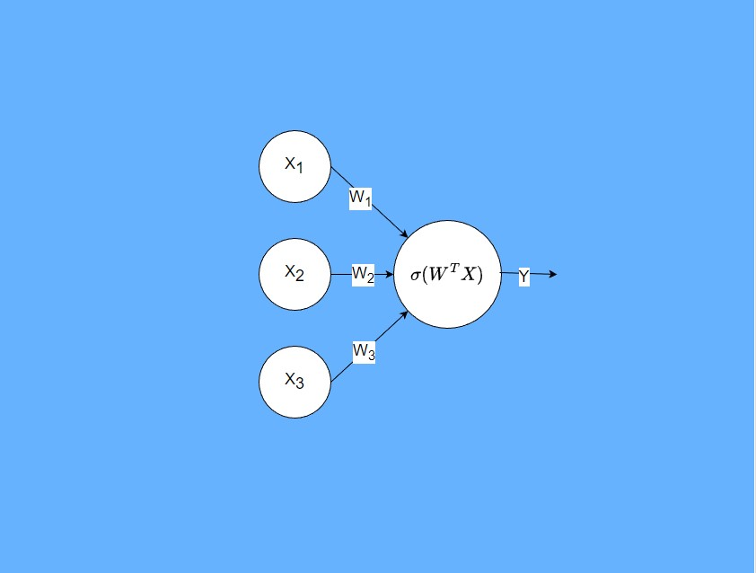
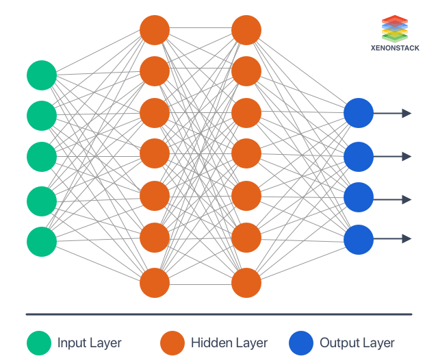
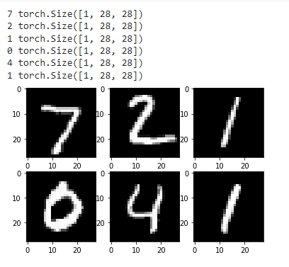
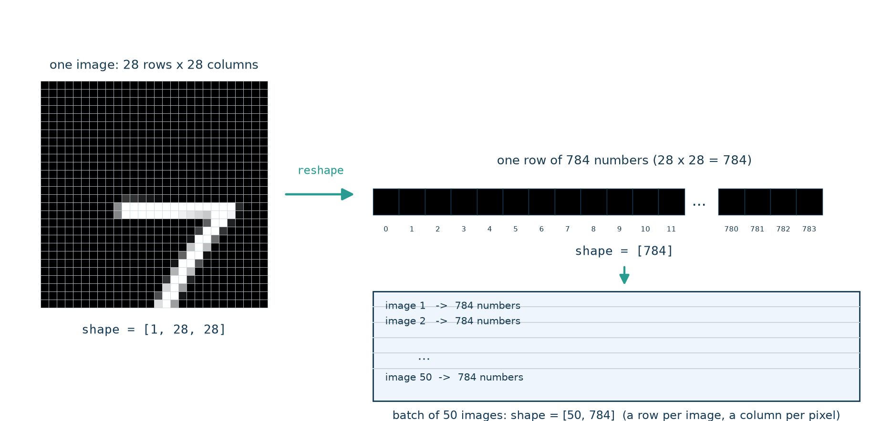
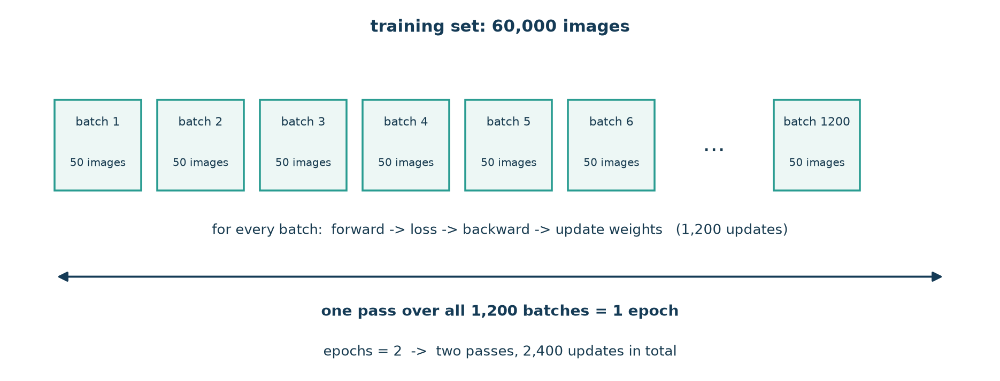
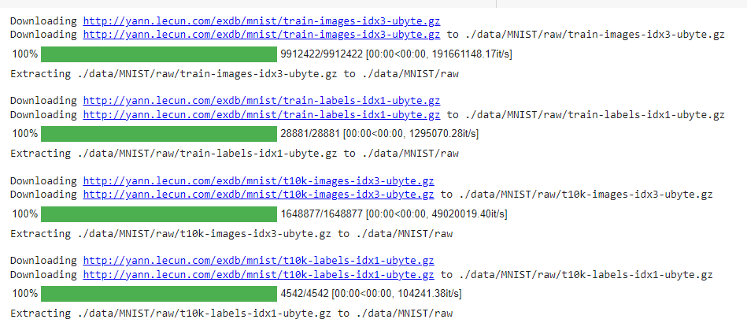
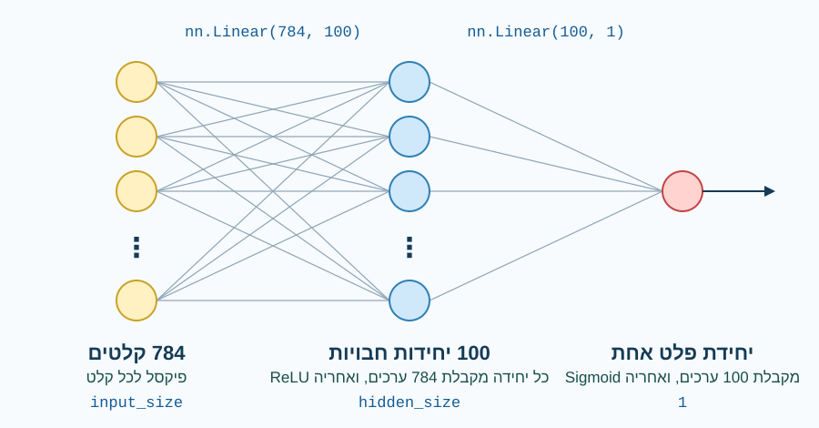

<!-- editorlm-hebrew-html-start -->
<style>
html, body, .vscode-body, .markdown-body, .markdown-preview, #write {
  direction: rtl !important; text-align: right !important;
}
ul, ol { padding-right: 2em !important; padding-left: 0 !important; }
blockquote { border-right: 3px solid #999; border-left: 0; padding-right: 1rem; padding-left: 0; }
@media print {
  html, body, .vscode-body, .markdown-body, .markdown-preview, #write {
    direction: rtl !important; text-align: right !important;
  }
}
</style>
<!-- editorlm-hebrew-html-end -->
<style>
.book { max-width: 900px; margin: auto; line-height: 1.8; font-family: Arial, sans-serif; }
.book .cover { min-height: 680px; box-sizing: border-box; padding: 64px 48px; margin: 24px 0 60px; background: #112b41; color: #f5f8fc; border-top: 9px solid #39c4b5; position: relative; }
.book .cover .eyebrow { color: #81e0d5; font-size: 15px; letter-spacing: 2px; }
.book .cover h1 { color: #fff; font-size: 48px; line-height: 1.3; border: 0; margin: 50px 0 18px; }
.book .cover .subtitle { font-size: 28px; color: #d8e6f0; }
.book .cover .author { font-size: 30px; color: #fff; margin-top: 52px; }
.book .cover .audience { color: #c1d3df; margin-top: 12px; }
.book .cover .motif { direction: ltr; text-align: left; font-family: Consolas, monospace; color: #81e0d5; font-size: 19px; margin-top: 54px; }
.book h1, .book h2, .book h3 { line-height: 1.4; font-weight: 700; }
.book > h1 { font-size: 32px !important; text-align: center !important; margin: 28px 0; }
.book h2 { font-size: 34px !important; text-align: center !important; color: #153b56 !important; background: #eef5fc; border: 0; border-bottom: 4px solid #299c91; border-radius: 10px 10px 0 0; padding: 28px 20px; margin: 24px 0 36px; }
.book h3 { font-size: 24px !important; text-align: right !important; color: #174e49 !important; background: #edf7f5; border: 0; border-right: 5px solid #299c91; border-radius: 6px; padding: 10px 16px; margin: 36px 0 18px; }
.book .chapter { height: 0; margin: 76px 0 0; border-top: 1px solid #ccd7df; break-before: page; page-break-before: always; break-after: avoid; page-break-after: avoid; }
.book .toc { padding: 24px; border-right: 5px solid #39a99d; background: rgba(70,150,155,.09); margin: 24px 0 48px; }
.book pre, .book pre code { direction: ltr !important; text-align: left !important; unicode-bidi: isolate; }
.book pre { box-sizing: border-box !important; width: 100% !important; max-width: 100% !important; margin: 0 !important; padding: 16px 20px; border: 1px solid #ccd7df; border-radius: 8px; line-height: 1.6; overflow-x: auto; }
.book code { direction: ltr; unicode-bidi: isolate; font-family: Consolas, "Courier New", monospace; }
.book pre { background: #f3f6fa !important; color: #1f2937 !important; }
.book pre code, .book pre code.hljs { background: transparent !important; color: #1f2937 !important; }
.book pre .hljs-keyword, .book pre .hljs-literal { color: #6f299c !important; }
.book pre .hljs-string { color: #216338 !important; }
.book pre .hljs-number { color: #075e68 !important; }
.book pre .hljs-comment { color: #526174 !important; }
.book pre .hljs-built_in, .book pre .hljs-title { color: #135b96 !important; }
.book table { width: 75%; max-width: 75%; margin: 18px auto; }
.book th, .book td { text-align: right; }
.book .small { font-size: .9em; opacity: .8; }
.book .python-intro { display: flex; align-items: center; gap: 28px; padding: 22px 28px; margin: 24px 0; background: #eef5fc; color: #183e63; border-right: 6px solid #3776ab; border-radius: 10px; }
.book .python-intro strong { font-size: 30px; }
.book .python-fact { background: #fff7d6; color: #423611; border-right: 6px solid #ffd343; border-radius: 8px; padding: 18px 24px; margin: 22px 0; }
.book .python-fact strong { font-size: 24px; }
.book img { max-width: 100%; height: auto; }
.book figure { margin: 24px auto; text-align: center; }
.book figure img { display: block; margin: auto; }
.book figcaption { direction: rtl; text-align: center; font-size: .9em; color: #445566; }
@media print { .book > h2 { break-before: page; page-break-before: always; } }
.book .screen-strip { width: 760px; max-width: 100%; height: 220px; overflow: hidden; border: 1px solid #bccad5; border-radius: 8px; margin: 20px auto 8px; direction: ltr; }
.book .screen-strip.output { height: 265px; }
.book .screen-strip img { display: block; width: 1745px; max-width: none; }
.book .screen-menu { width: 400px; max-width: 100%; height: 295px; overflow: hidden; direction: ltr; margin: 20px auto 8px; border: 1px solid #bccad5; border-radius: 8px; }
.book .screen-menu img { display: block; width: 1745px; max-width: none; }
.book .code-panel { box-sizing: border-box !important; display: block !important; width: 75% !important; max-width: 75% !important; margin: 18px auto !important; }
@media print {
  .book .cover { min-height: 85vh; break-after: page; print-color-adjust: exact; -webkit-print-color-adjust: exact; }
  .book pre { white-space: pre-wrap; break-inside: avoid; }
  .book .chapter { margin: 0; border: 0; }
  .book h1, .book h2, .book h3 { break-after: avoid; page-break-after: avoid; break-inside: avoid; }
  .book h2 { margin-top: 0; }
  .book h2, .book h3 { print-color-adjust: exact; -webkit-print-color-adjust: exact; }
}
</style>

<style>
.book .book-nav { display: flex; flex-wrap: wrap; gap: 10px; justify-content: center; align-items: center; padding: 16px 0; margin: 20px 0 32px; border-top: 1px solid #ccd7df; border-bottom: 1px solid #ccd7df; }
.book .book-nav a { display: inline-block; padding: 10px 18px; border-radius: 8px; background: #eef5fc; color: #153b56 !important; border: 1px solid #b5ccd9; text-decoration: none !important; font-size: 16px; font-weight: bold; }
.book .book-nav a.toc-link { background: #174e49; color: #fff !important; border-color: #174e49; }
.book .book-nav a:hover, .book .book-nav a:focus { background: #d4eee8; color: #153b56 !important; outline: 2px solid #299c91; outline-offset: 2px; }
.book .section-list { line-height: 2; }
@media print { .book .book-nav { display: none; } }

/* Explicit Hebrew direction, including prose beginning with English. */
.book p, .book ul, .book ol, .book li,
.book blockquote, .book h1, .book h2, .book h3,
.book h4, .book th, .book td {
  direction: rtl !important;
  text-align: right !important;
  unicode-bidi: isolate;
}
/* Chapter titles keep their agreed centered layout. */
.book h2 { text-align: center !important; }
.book pre, .book pre code, .book .code-panel {
  direction: ltr !important;
  text-align: left !important;
  unicode-bidi: isolate;
}
</style>

<div class="book" dir="rtl" lang="he" style="direction: rtl !important; text-align: right !important;">

<nav class="book-nav" aria-label="ניווט בספר">
<a href="14-%D7%A8%D7%92%D7%A8%D7%A1%D7%99%D7%94%20%D7%9C%D7%95%D7%92%D7%99%D7%A1%D7%98%D7%99%D7%AA%20-%20%D7%93%D7%95%D7%92%D7%9E%D7%90%D7%95%D7%AA.md">→ הקודם</a>
<a class="toc-link" href="../index.md">תוכן העניינים</a>
<a href="16-%D7%A8%D7%A9%D7%AA%20%D7%A0%D7%95%D7%99%D7%A8%D7%95%D7%A0%D7%99%D7%9D%20-%20%D7%93%D7%95%D7%92%D7%9E%D7%90%D7%95%D7%AA.md">הבא ←</a>
</nav>

## ג.15 רשת נוירונים

כל המודלים שבנינו עד כה היו יחידת חישוב אחת: חישוב לינארי — כל קלט מוכפל במשקל שלו והמכפלות מחוברות — ובפרק הקודם גם פונקציית אקטיבציה על התוצאה. יחידה כזו יכולה לתאר קו ישר (ברגרסיה) או להפריד בין שתי קבוצות בקו ישר (ברגרסיה לוגיסטית). אבל קשרים רבים בעולם אינם ישרים: עקומה שעולה ויורדת, קבוצה של נקודות שמוקפת בקבוצה אחרת, או תמונה שבה הספרה 7 יכולה להופיע בכתבי יד שונים, בעובי שונה ובזווית שונה. יחידה אחת, ויהיו משקליה אשר יהיו, אינה יכולה ללכוד קשר כזה, כי כל מה שהיא יודעת לחשב הוא סכום משוקלל אחד שעובר דרך פונקציה אחת.

הפתרון הוא לחבר יחידות רבות זו לזו. רשת נוירונים מלאכותית — **Artificial Neural Network, ANN** — מחברת יחידות חישוב זו לזו: תוצאות החישוב של יחידות בשכבה אחת משמשות קלט ליחידות בשכבה הבאה. כל יחידה עדיין מבצעת את אותו חישוב פשוט שהכרנו, אך כשמעבירים את התוצאות של שכבה שלמה לשכבה נוספת, ובכל מעבר מפעילים פונקציית אקטיבציה לא לינארית, הרשת כולה יכולה לתאר קשרים מורכבים ומעוקלים. הרעיון דומה לבניית תמונה מפסיפס: כל אבן פשוטה, אך מצירוף אבנים רבות מתקבלת צורה שאבן אחת לא יכלה לתאר.

הבשורה הטובה היא שכל מה שלמדנו נשאר בתוקף. את המשקלים של כל היחידות מוצאים באותו תהליך: מחשבים תחזית, מודדים את ההפסד, מחשבים נגזרות בעזרת Autograd ומעדכנים את המשקלים בכיוון שמקטין את ההפסד. ההבדל היחיד הוא שיש הרבה יותר משקלים, ו־PyTorch מטפלת בכולם בשבילנו. בפרק זה נכיר את מבנה הרשת ואת הדרך להגדירה ב־PyTorch, ואז נשתמש ברשת כזו כדי לזהות אם בתמונה מופיעה הספרה 7 — משימה שבה כל תמונה היא מאות מספרים, ושאלת כן/לא שאי אפשר לענות עליה בקו ישר אחד.

<!-- editorlm-source-ref: [sources/ML/pdf/8. רשת נורונים ANN.pdf#L8-L12] -->

**[השיעור וההרצאות באתר של גלעד מרקמן](https://webprogramming.azurewebsites.net/Pages/PyTorch/ANN.aspx)**

**חומרי הליווי:** [8. רשת נורונים ANN](../../../sources/ML/8.%20%D7%A8%D7%A9%D7%AA%20%D7%A0%D7%95%D7%A8%D7%95%D7%A0%D7%99%D7%9D%20ANN.pptx) · [מחברת MNIST](../../../sources/ML/Colab/8_ANN_MNIST.ipynb)

### שכבות ברשת

היחידות ברשת מאורגנות ב**שכבות**. התרשים הבא מציג רשת קטנה: כל עיגול הוא יחידת חישוב (נוירון), וכל חץ הוא חיבור שדרכו עובר מספר אחד מיחידה ליחידה שאחריה.

<figure>

<figcaption>רשת קטנה: שכבת קלט של שלוש יחידות, שתי שכבות חבויות של ארבע יחידות כל אחת, ויחידת פלט אחת.</figcaption>
</figure>

נקרא את התרשים משמאל לימין, בכיוון שבו הנתונים זורמים:

- **שכבת הקלט — Input Layer** (צהוב): שלוש יחידות, אחת לכל תכונה של הדוגמה. שכבה זו אינה מחשבת דבר; היא פשוט הנתונים עצמם — שלוש עמודות בטבלת הדוגמאות שהכרנו, או, בהמשך הפרק, ערכי הפיקסלים של תמונה.
- **השכבות החבויות — Hidden Layers** (כחול וירוק): שתי שכבות של ארבע יחידות כל אחת. כאן מתבצע רוב החישוב. הן נקראות חבויות משום שאיננו רואים את הפלט שלהן ישירות: הוא משמש רק כקלט לשכבה הבאה.
- **שכבת הפלט — Output Layer** (אדום): יחידה אחת שמחזירה את התשובה. מבנה הפלט נקבע לפי השאלה: לתשובה בינארית מספיקה יחידת פלט אחת, בדיוק כמו ברגרסיה הלוגיסטית; לשאלות אחרות יהיו כמה יחידות פלט, כפי שנראה בפרקים הבאים.

מה קורה בתוך יחידה אחת? נתמקד ביחידה כחולה אחת מהשכבה החבויה הראשונה ונביט בה מקרוב:

<figure>

<figcaption>יחידה אחת מקרוב: שלושה קלטים, משקל לכל קלט, ופונקציית אקטיבציה על הסכום המשוקלל.</figcaption>
</figure>

זהו בדיוק הפרספטרון שהכרנו בפרק ג.13: היחידה מקבלת את שלושת הקלטים x₁, x₂, x₃, מכפילה כל אחד במשקל משלו w₁, w₂, w₃, מחברת את המכפלות (ומוסיפה הטיה), ומעבירה את הסכום דרך פונקציית האקטיבציה σ. התוצאה Y היא מספר אחד, והוא נשלח הלאה לכל היחידות בשכבה הבאה. כל היחידות בשכבה מבצעות את אותו חישוב, אך לכל אחת משקלים משלה, ולכן כל יחידה "מתמחה" בצירוף אחר של הקלטים.

הרשת שבתרשים היא **Fully Connected** (מחוברת במלואה): כל יחידה מקבלת את תוצאות **כל** היחידות בשכבה הקודמת, ותוצאתה נשלחת ל**כל** היחידות בשכבה הבאה. אפשר לחשוב על כך כאילו הפלט של כל יחידה "משוכפל" כמספר היחידות בשכבה הבאה. לכל חץ בתרשים יש משקל משלו שהרשת לומדת: בין שכבת הקלט לשכבה החבויה הראשונה יש 3×4 = 12 חצים, בין שתי השכבות החבויות 4×4 = 16 חצים, ובין השכבה החבויה השנייה לפלט 4×1 = 4 חצים. בהמשך הפרק נספור במדויק כמה פרמטרים רשת כזו לומדת.

<!-- editorlm-source-ref: [sources/ML/pdf/8. רשת נורונים ANN.pdf#L14-L25] -->

### הגדרת רשת ב־PyTorch

ב־PyTorch אין צורך לכתוב את היחידות אחת־אחת. שכבה שלמה של יחידות היא `nn.Linear` שכבר הכרנו — רק שהפעם היא מקבלת כמה קלטים ומחזירה כמה פלטים — ופונקציית האקטיבציה היא שכבה נוספת שבאה מיד אחריה. כלומר, כל שכבה חבויה בתרשים היא זוג: פונקציה לינארית ואחריה פונקציית אקטיבציה.

שני המספרים שמעבירים ל־`nn.Linear` מתארים את השכבה במלואה:

- המספר הראשון, `in_features`, הוא מספר הערכים שכל יחידה בשכבה מקבלת. הוא שווה למספר היחידות בשכבה **הקודמת**.
- המספר השני, `out_features`, הוא מספר היחידות **בשכבה עצמה**, וזהו גם מספר הערכים שהשכבה מחזירה.

שימו לב ששכבת הקלט אינה שכבה בקוד: מספר התכונות בקלט הוא פשוט המספר הראשון של ה־`nn.Linear` הראשונה. את הרשת הקטנה מהתרשים — 3 קלטים, שתי שכבות חבויות של 4 יחידות ופלט אחד — נכתוב כך:

<div class="code-panel" dir="ltr">

```python
Model = nn.Sequential(
    nn.Linear(3, 4),   # 3 inputs -> 4 hidden units
    nn.ReLU(),
    nn.Linear(4, 4),   # 4 -> 4
    nn.ReLU(),
    nn.Linear(4, 1),   # 4 -> 1 output
    nn.Sigmoid()
)
```

</div>

`nn.Sequential` מחברת את השכבות בזו אחר זו: הפלט של כל שכבה נכנס ישירות לשכבה שאחריה. מכאן נובע הכלל החשוב ביותר בבניית רשת:

<div class="python-fact">
<strong>מספר הפלטים של שכבה חייב להיות שווה למספר הקלטים של השכבה הבאה אחריה.</strong><br>
המספר השני בכל <code>nn.Linear</code> הוא המספר הראשון ב־<code>nn.Linear</code> שאחריה: <span dir="ltr" style="unicode-bidi:isolate;">3→<strong>4</strong>, <strong>4</strong>→<strong>4</strong>, <strong>4</strong>→1</span>. השכבה הבאה מקבלת בדיוק את מה שהשכבה הקודמת החזירה, לא יותר ולא פחות. פונקציות האקטיבציה (ReLU, Sigmoid) אינן משנות את מספר הערכים, ולכן אינן משפיעות על החשבון.
</div>

התרשים הבא מציג רשת גדולה מעט יותר: חמישה קלטים, שתי שכבות חבויות של שבע יחידות כל אחת, וארבע יחידות פלט.

<figure>

<figcaption>רשת עם חמישה קלטים, שתי שכבות חבויות של שבע יחידות וארבעה פלטים. כל מסגרת כחולה היא שכבה אחת בקוד.</figcaption>
</figure>

זו התבנית הכללית לרשת בעלת שתי שכבות חבויות. השכבה הראשונה מקבלת `input_size` קלטים ומחזירה `hidden_size_1` ערכים, אחריה ReLU, וכן הלאה עד שכבת הפלט. עבור הרשת שבתרשים נציב `input_size = 5`, `hidden_size_1 = 7`, `hidden_size_2 = 7`, ומספר הפלטים 4. גדלי השכבות ו־`device` צריכים להיות מוגדרים לפני השימוש בתבנית:

<div class="code-panel" dir="ltr">

```python
Model = nn.Sequential(
    nn.Linear(input_size, hidden_size_1, device=device),
    nn.ReLU(),
    nn.Linear(hidden_size_1, hidden_size_2, device=device),
    nn.ReLU(),
    nn.Linear(hidden_size_2, 4, device=device),
    nn.Sigmoid()
)
```

</div>

עקבו אחרי השרשרת: `hidden_size_1` מופיע פעמיים — פעם כמספר הפלטים של השכבה הראשונה ופעם כמספר הקלטים של השכבה השנייה — וכך גם `hidden_size_2`. זו הדרך הבטוחה לכתוב רשת: כל גודל של שכבה חבויה מוגדר במשתנה אחד, והמשתנה משמש בשתי השכבות שהוא מחבר.

מה קורה אם טועים? נניח שכתבנו בשכבה השנייה 50 קלטים במקום 100, אף שהשכבה הראשונה מחזירה 100 ערכים:

<div class="code-panel" dir="ltr">

```python
Model = nn.Sequential(
    nn.Linear(784, 100),
    nn.ReLU(),
    nn.Linear(50, 1),   # wrong: previous layer returns 100 values
    nn.Sigmoid()
)
Model(torch.rand(50, 784))
```

</div>

**פלט**

<div class="code-panel" dir="ltr">

```text
RuntimeError: mat1 and mat2 shapes cannot be multiplied (50x100 and 50x1)
```

</div>

PyTorch אינה מתלוננת בזמן ההגדרה אלא רק כשמעבירים נתונים דרך הרשת. ההודעה מתארת את שתי הטבלאות שאי אפשר להכפיל: הראשונה, 50×100, היא הטבלה שיצאה מהשכבה הראשונה — 50 דוגמאות ו־100 ערכים לכל דוגמה; השנייה שייכת לשכבה השגויה, שמצפה ל־50 ערכים בלבד לכל דוגמה. כשמופיעה שגיאה כזו, בדקו את זוגות המספרים בין שכבה לשכבה.

האימון נשאר כפי שהכרנו: `Model.parameters()` מחזירה את המשקלים של כל השכבות, והאופטימייזר מעדכן את כולם.

<!-- editorlm-source-ref: [sources/ML/pdf/8. רשת נורונים ANN.pdf#L27-L45] -->

### בחירת מבנה הרשת

כמה שכבות צריך, וכמה יחידות בכל שכבה? אין לכך נוסחה. רשת קטנה מדי לא תצליח ללכוד את הקשר שבנתונים, ורשת גדולה מדי תתאמן לאט ועלולה לשנן את דוגמאות האימון במקום להכליל. לכן מספר השכבות והיחידות נקבע בניסוי ובבדיקת התוצאות. בשכבות החבויות מקובל להשתמש ב־ReLU או Leaky ReLU, שהכרנו בפרק הקודם: הן פשוטות לחישוב ומאפשרות לרשת ללמוד ביעילות. בשכבת הפלט, לעומת זאת, האקטיבציה ופונקציית ההפסד נקבעות לפי סוג התשובה שאנו מצפים לה:

- תשובה בינארית: Sigmoid עם BCE.
- כמה קטגוריות: נלמד בהמשך.
- תשובה מספרית: MSE, עם פלט לינארי או אקטיבציה המתאימה לטווח התשובות.

בפרק זה התשובה בינארית — האם זו הספרה 7 — ולכן נשתמש ב־Sigmoid ו־BCE. בהמשך נלמד לסווג לכמה קטגוריות, ולא רק לאמת או שקר.

<!-- editorlm-source-ref: [sources/ML/pdf/8. רשת נורונים ANN.pdf#L47-L56] -->

### המשימה — זיהוי ספרה בודדת

עד כה הקלט למודלים שלנו היה כמה מספרים לכל דוגמה — מדידות של פרח או תוצאות בדיקה רפואית. הפעם הקלט הוא תמונה. מאגר MNIST הוא אחד המאגרים המוכרים ביותר בלמידת מכונה: הוא מכיל 70,000 תמונות של ספרות בכתב יד, בגודל 28×28 פיקסלים בגוני אפור. לכל תמונה מצורפת תווית המציינת את הספרה. המשימה המלאה היא לזהות איזו מעשר הספרות מופיעה בתמונה, אך נתחיל בגרסה פשוטה יותר שמתאימה לכלים שכבר בידינו: נבחר את הספרה 7 ונבנה מודל שמחליט אם התמונה מציגה אותה או ספרה אחרת. זוהי שאלת כן/לא, ולכן שכבת הפלט והפסד BCE נשארים כפי שהיו ברגרסיה הלוגיסטית.

<!-- editorlm-source-ref: [sources/ML/pdf/8. רשת נורונים ANN.pdf#L58-L74] -->

כך נראות שש תמונות מהמאגר. מעל כל תמונה מודפסות התווית שלה וצורת הטנסור, ובכולן היא <span dir="ltr">[1, 28, 28]</span>: ערוץ אחד של גוני אפור, 28 שורות ו־28 עמודות. הצירים מסמנים את מספרי הפיקסלים, 0 עד 27. שימו לב שכל ספרה כתובה אחרת — ה־1 השני נטוי יותר מהראשון — ובדיוק את ההבדלים האלה הרשת צריכה ללמוד להתעלם מהם:

<figure>

<figcaption>שש תמונות מ־MNIST עם התווית וצורת הטנסור של כל אחת.</figcaption>
</figure>
<!-- editorlm-source-ref: [sources/ML/pdf/8. רשת נורונים ANN.pdf#L58-L74] -->

### הזנת תמונה לרשת

הרשת שלנו מקבלת שורה של מספרים, לא תמונה דו־ממדית. לכן צריך להחליט כיצד להפוך תמונה לקלט. כל תמונה מיוצגת כטנסור בצורה `[1, 28, 28]` — ערוץ צבע אחד (גוני אפור), 28 שורות ו־28 עמודות. נשטח אותה לשורה של 784 ערכי פיקסלים (28×28), כך שכל פיקסל הופך לקלט אחד של הרשת; בקבוצה של 50 תמונות נקבל טבלה בצורה `[50, 784]` — שורה לכל תמונה, בדיוק כמו טבלת הדוגמאות שהכרנו בפרקים הקודמים.

<!-- editorlm-source-ref: [sources/ML/pdf/8. רשת נורונים ANN.pdf#L76-L81] -->

<figure>

<figcaption>השטחה: התמונה הופכת לשורה של 784 מספרים, ואצווה של 50 תמונות הופכת לטבלה של 50 שורות ו־784 עמודות. הספרה בתרשים סכמטית.</figcaption>
</figure>

בתרשים רואים למה השטחה אינה מאבדת מידע: כל פיקסל שומר על ערכו ועל מקומו הקבוע בשורה, כך שהפיקסל בשורה 3 ובעמודה 5 תמיד יגיע לאותו קלט של הרשת. מה שכן הולך לאיבוד הוא השכנות הדו־ממדית, העובדה שפיקסלים סמוכים בתמונה סמוכים גם זה לזה. רשת מלאה כמו שלנו אינה מנצלת זאת; בפרק על רשתות קונבולוציה נראה מודל שמנצל.

### Torchvision ו־DataLoader

עד כה טענו נתונים מטבלאות ומ־scikit-learn. לתמונות משתמשים ב־Torchvision, ספריית העזר של PyTorch, המספקת מאגרי תמונות ובהם MNIST. גודל המאגר מעלה בעיה חדשה: עשרות אלפי תמונות, כל אחת בת 784 ערכים, הן יותר מדי מכדי להעביר ברשת בבת אחת ולחשב הפסד אחד על כולן. לכן, באמצעות DataLoader מחלקים את הנתונים לקבוצות — **batches** (אצוות).

בכל קבוצה נחשב תחזיות, הפסד ונגזרות, ונעדכן את המשקלים. כך במקום עדכון אחד לכל מעבר על המאגר מתבצעים עדכונים רבים, אחד לכל אצווה. מעבר על כל קבוצות האימון נקרא **epoch** (אפוק); אפשר לחזור על המעבר כמה פעמים, וכל חזרה נותנת לרשת הזדמנות נוספת ללמוד מאותן דוגמאות.

<!-- editorlm-source-ref: [sources/ML/pdf/8. רשת נורונים ANN.pdf#L83-L100] -->

<figure>

<figcaption>אצוות ואפוקים: 60,000 תמונות האימון מחולקות ל־1,200 אצוות של 50, וכל מעבר על כולן הוא אפוק אחד.</figcaption>
</figure>

### שלבי העבודה והייבוא

סדר העבודה מוכר לנו מהפרקים הקודמים: נכין את הנתונים, נגדיר את הפרמטרים, המודל, ההפסד והאופטימייזר, נבצע אימון ולבסוף נציג את התוצאות. נייבא את הספריות, ובהן שתי חדשות — `torchvision` לטעינת התמונות ו־`DataLoader` לחלוקה לאצוות.

<!-- editorlm-source-ref: [sources/ML/converted/8_ANN_MNIST/notebook.md#L11-L24] -->


<div class="code-panel" dir="ltr">

```python
import torch
import torch.nn as nn
import numpy as np
import matplotlib.pyplot as plt
import torchvision
import torchvision.transforms as transforms
from torch.utils.data import DataLoader
```

</div>

<!-- editorlm-source-ref: [sources/ML/converted/8_ANN_MNIST/notebook.md#L26-L37] -->

### בחירת התקן החישוב

אימון רשת על עשרות אלפי תמונות דורש חישובים רבים, ומעבד גרפי (GPU) מבצע אותם מהר בהרבה מהמעבד הרגיל. נבחר GPU כאשר הוא זמין, ואחרת CPU. את ההתקן נשמור במשתנה `device`, ובהמשך נדאג שהרשת והנתונים יהיו על אותו התקן:

<div class="code-panel" dir="ltr">

```python
if torch.cuda.is_available():
    device = torch.device('cuda')
else:
    device = torch.device('cpu')
print(device)
```

</div>

<!-- editorlm-source-ref: [sources/ML/converted/8_ANN_MNIST/notebook.md#L42-L59] -->

הקוד ידפיס `cuda` או `cpu`, בהתאם להתקן שנבחר.

### טעינת MNIST

בפרקים הקודמים פיצלנו את הנתונים בעצמנו לקבוצת אימון ולקבוצת בדיקה. ב־MNIST הפיצול קיים מראש, ונטען בנפרד את קבוצת האימון (`train=True`) ואת קבוצת הבדיקה (`train=False`). `ToTensor` ממירה את התמונות לטנסורים, עם ערכי פיקסלים בין 0 ל־1 — כלומר היא מבצעת עבורנו גם את הנרמול, כך שאין צורך בשלב נרמול נפרד. הפרמטר `download=True` מוריד את המאגר לתיקייה `./data` בפעם הראשונה.

<div class="code-panel" dir="ltr">

```python
train_dataset = torchvision.datasets.MNIST(root='./data',
                                           train=True,
                                           transform=transforms.ToTensor(),
                                           download=True)

test_dataset = torchvision.datasets.MNIST(root='./data',
                                          train=False,
                                          transform=transforms.ToTensor(),
                                          download=True)
```

</div>

<!-- editorlm-source-ref: [sources/ML/converted/8_ANN_MNIST/notebook.md#L68-L81] -->

בהרצה הראשונה `download=True` מוריד את ארבעת קובצי המאגר, שתי קבוצות של תמונות ותוויות, אל התיקייה `./data`. כך נראה הפלט של ההורדה; בהרצות הבאות הקבצים כבר קיימים והשלב מדולג:

<figure>

<figcaption>פלט ההורדה בהרצה הראשונה: ארבעה קבצים, כל אחד מורד ונפרש לתיקייה <span dir="ltr">./data/MNIST/raw</span>.</figcaption>
</figure>
<!-- editorlm-source-ref: [sources/ML/pdf/8. רשת נורונים ANN.pdf#L155-L161] -->

נציג את פרטי שתי הקבוצות כדי לוודא שהטעינה הצליחה ולראות את גודלן:

<div class="code-panel" dir="ltr">

```python
print(train_dataset)
print(test_dataset)
```

</div>

**פלט**

<div class="code-panel" dir="ltr">

```text
Dataset MNIST
    Number of datapoints: 60000
    Root location: ./data
    Split: Train
    StandardTransform
Transform: ToTensor()
Dataset MNIST
    Number of datapoints: 10000
    Root location: ./data
    Split: Test
    StandardTransform
Transform: ToTensor()
```

</div>

<!-- editorlm-source-ref: [sources/ML/converted/8_ANN_MNIST/notebook.md#L82-L106] -->

בקבוצת האימון 60,000 תמונות ובקבוצת הבדיקה 10,000, ולשתיהן הוחל ההמרה `ToTensor()`.

### חלוקה לאצוות

כעת נעטוף כל קבוצה ב־DataLoader, שיספק לנו את התמונות אצווה אחר אצווה. נגדיר אצוות של 50 תמונות. את סדר דוגמאות האימון נערבב (`shuffle=True`), כדי שכל אצווה תכיל תערובת אקראית של ספרות ולא רצף של תמונות דומות; בקבוצת הבדיקה אין צורך בערבוב, כי שם רק מודדים את הדיוק:

<div class="code-panel" dir="ltr">

```python
batch_size = 50

train_loader = torch.utils.data.DataLoader(dataset=train_dataset,
                                           batch_size=batch_size,
                                           shuffle=True)

test_loader = torch.utils.data.DataLoader(dataset=test_dataset,
                                          batch_size=batch_size,
                                          shuffle=False)
```

</div>

<!-- editorlm-source-ref: [sources/ML/converted/8_ANN_MNIST/notebook.md#L111-L124] -->

נבדוק את מספר האצוות:

<div class="code-panel" dir="ltr">

```python
print(len(train_loader))
print(len(test_loader))
```

</div>

**פלט**

<div class="code-panel" dir="ltr">

```text
1200
200
```

</div>

<!-- editorlm-source-ref: [sources/ML/converted/8_ANN_MNIST/notebook.md#L125-L139] -->

מתקבלות 1,200 אצוות אימון ו־200 אצוות בדיקה: 60,000 תמונות חלקי 50 תמונות באצווה, ו־10,000 חלקי 50. פירוש הדבר שבכל אפוק המשקלים יתעדכנו 1,200 פעמים.

### שליפת אצווה והצגת תמונות

לפני האימון נבחן אצווה כדי לראות אילו תמונות ונתונים מגיעים לרשת. DataLoader אינו מחזיק את כל האצוות בזיכרון אלא מייצר אותן אחת אחרי השנייה; לכן ניצור ממנו איטרטור, ובכל קריאה ל־`next` נקבל את האצווה הבאה — זוג של טנסור תמונות וטנסור תוויות. נשלוף את האצווה הראשונה:

<div class="code-panel" dir="ltr">

```python
examples = iter(test_loader)
example_data, example_targets = next(examples)
# example_data, example_targets = next(examples)
```

</div>

<!-- editorlm-source-ref: [sources/ML/converted/8_ANN_MNIST/notebook.md#L140-L148] -->

נדפיס את צורת שני הטנסורים:

<div class="code-panel" dir="ltr">

```python
print(example_data.shape, example_targets.shape)
```

</div>

**פלט**

<div class="code-panel" dir="ltr">

```text
torch.Size([50, 1, 28, 28]) torch.Size([50])
```

</div>

<!-- editorlm-source-ref: [sources/ML/converted/8_ANN_MNIST/notebook.md#L149-L161] -->

טנסור התמונות הוא בצורה `[50, 1, 28, 28]` — 50 תמונות, ערוץ אחד, 28 שורות ו־28 עמודות — וטנסור התוויות מכיל 50 ספרות, אחת לכל תמונה.

נשלוף את האצווה הבאה מאותו איטרטור:

<div class="code-panel" dir="ltr">

```python
example_data, example_targets = next(examples)
```

</div>

<!-- editorlm-source-ref: [sources/ML/converted/8_ANN_MNIST/notebook.md#L162-L167] -->

נציג תשע תמונות, נדפיס את תוויותיהן ואת צורתן, וגם שורת פיקסלים מאחת התמונות — השורה ה־13 בתמונה השמינית — כדי לראות אילו מספרים הרשת מקבלת בפועל:

<div class="code-panel" dir="ltr">

```python
for i in range(9):
    plt.subplot(3,3,i+1)
    plt.imshow(example_data[i][0], cmap='gray')
    print(example_targets[i].item(), example_data[i].shape)
plt.show()
print(example_data[7][0][13])
```

</div>

**פלט**

<div class="code-panel" dir="ltr">

```text
6 torch.Size([1, 28, 28])
3 torch.Size([1, 28, 28])
5 torch.Size([1, 28, 28])
5 torch.Size([1, 28, 28])
6 torch.Size([1, 28, 28])
0 torch.Size([1, 28, 28])
4 torch.Size([1, 28, 28])
1 torch.Size([1, 28, 28])
9 torch.Size([1, 28, 28])
```

</div>

**פלט**

<div class="code-panel" dir="ltr">

```text
tensor([0.0000, 0.0000, 0.0000, 0.0000, 0.0000, 0.0000, 0.0000, 0.0000, 0.0000,
        0.0000, 0.0000, 0.0000, 0.0000, 0.3922, 0.9882, 0.9529, 0.0392, 0.0000,
        0.0000, 0.0000, 0.0000, 0.0000, 0.0000, 0.0000, 0.0000, 0.0000, 0.0000,
        0.0000])
```

</div>

<!-- editorlm-source-ref: [sources/ML/converted/8_ANN_MNIST/notebook.md#L168-L212] -->

שורת הפיקסלים ממחישה את הנרמול של `ToTensor`: רוב הערכים הם 0 (רקע שחור), והפיקסלים שדרכם עובר קו הספרה מקבלים ערכים קרובים ל־1 (לבן). כל תמונה היא 784 מספרים כאלה.


<figure>

<figcaption>תשע תמונות מהאצווה שנשלפה.</figcaption>
</figure>

<!-- editorlm-source-ref: [sources/ML/converted/8_ANN_MNIST/notebook.md#L201-L201] -->

### הגדרת הפרמטרים והמודל

כעת נבחר את מבנה הרשת ואת פרמטרי האימון. נגדיר 784 קלטים (פיקסל לכל קלט), שכבה חבויה אחת של 100 יחידות, שני מעברים על המאגר (שני אפוקים) וקצב למידה 0.01. מספר האפוקים קטן מכפי שהיה בפרקים הקודמים, כי בכל אפוק מתבצעים כאן 1,200 עדכוני משקלים. `required_label` מגדיר את הספרה שאותה נזהה; החלפת הערך תאפשר לזהות כל ספרה אחרת בלי לשנות דבר בשאר הקוד.

<div class="code-panel" dir="ltr">

```python
input_size = 28*28 # 784
hidden_size = 100
epochs = 2
learning_rate = 0.01
required_label = 7
```

</div>

<!-- editorlm-source-ref: [sources/ML/converted/8_ANN_MNIST/notebook.md#L221-L230] -->

ניצור את הרשת לפי התבנית שראינו בתחילת הפרק, הפעם עם שכבה חבויה אחת: שכבה לינארית מ־784 קלטים ל־100 יחידות חבויות, ReLU, ושכבה לינארית מ־100 היחידות ליחידת פלט אחת עם Sigmoid, שמחזירה מספר בין 0 ל־1 — ההסתברות שהתמונה היא 7. כל אחת מ־100 היחידות החבויות מקבלת את כל 784 הפיקסלים, ויחידת הפלט מקבלת את 100 התוצאות שלהן:

<figure>

<figcaption>הרשת לזיהוי הספרה 7: 784 קלטים, 100 יחידות חבויות ויחידת פלט אחת. המספר 100 מופיע בשתי השכבות שהוא מחבר.</figcaption>
</figure>

את השכבות ניצור ישירות על התקן החישוב שנבחר:

<div class="code-panel" dir="ltr">

```python
Model = nn.Sequential(
    nn.Linear(input_size,hidden_size,device=device),
    nn.ReLU(),
    nn.Linear(hidden_size, 1, device=device),
    nn.Sigmoid()
)
```

</div>

<!-- editorlm-source-ref: [sources/ML/converted/8_ANN_MNIST/notebook.md#L235-L246] -->

אפשר גם ליצור את הרשת ולהעביר אותה בשלמותה באמצעות `.to(device)`; זו החלופה המופיעה בהערות:

<div class="code-panel" dir="ltr">

```python
# Model = nn.Sequential(
#     nn.Linear(input_size,hidden_size),
#     nn.ReLU(),
#     nn.Linear(hidden_size, 1),
#     nn.Sigmoid()
# ).to(device)
```

</div>

<!-- editorlm-source-ref: [sources/ML/converted/8_ANN_MNIST/notebook.md#L247-L258] -->

### כמה פרמטרים לומדת הרשת?

בפרק ג.9 ראינו ש־`nn.Linear` מחזיקה מטריצת משקלים `weight` ווקטור הטיות `bias`. בשכבה עם `in` קלטים ו־`out` יחידות יש לכל יחידה משקל אחד לכל קלט ועוד הטיה אחת. לכן:

**מספר הפרמטרים בשכבה = in × out משקלים + out הטיות**

נחשב תחילה לרשת הקטנה מתחילת הפרק, <span dir="ltr" style="unicode-bidi:isolate;">3 → 4 → 4 → 1</span>:

| שכבה | משקלים | הטיות | סה"כ |
|---|---|---|---|
| `nn.Linear(3, 4)` | 3 × 4 = 12 | 4 | 16 |
| `nn.Linear(4, 4)` | 4 × 4 = 16 | 4 | 20 |
| `nn.Linear(4, 1)` | 4 × 1 = 4 | 1 | 5 |
| **סה"כ** | **32** | **9** | **41** |

32 המשקלים הם בדיוק 32 החצים שספרנו בתרשים, וכל יחידה חבויה או יחידת פלט מוסיפה הטיה אחת. ReLU ו־Sigmoid אינן מוסיפות פרמטרים: הן רק מפעילות פונקציה קבועה על כל ערך.

כעת לרשת שבנינו זה עתה לזיהוי הספרה 7, <span dir="ltr" style="unicode-bidi:isolate;">784 → 100 → 1</span>:

| שכבה | משקלים | הטיות | סה"כ |
|---|---|---|---|
| `nn.Linear(784, 100)` | 784 × 100 = 78,400 | 100 | 78,500 |
| `nn.Linear(100, 1)` | 100 × 1 = 100 | 1 | 101 |
| **סה"כ** | **78,500** | **101** | **78,601** |

הרשת לומדת 78,601 מספרים. כמעט כולם נמצאים בשכבה הראשונה, כי כל אחת מ־100 היחידות החבויות "מסתכלת" על כל 784 הפיקסלים עם משקל משלה לכל פיקסל. לשם השוואה, רגרסיה לוגיסטית על אותם פיקסלים — יחידה אחת בלבד — הייתה לומדת 784 + 1 = 785 פרמטרים; השכבה החבויה הכפילה את המספר פי מאה, וזה המחיר של היכולת ללכוד קשרים מורכבים.

נבדוק את החשבון בקוד. `print(Model)` מציג את השכבות ואת גודליהן; `named_parameters()`, שהכרנו בפרק ג.9, מחזירה כל פרמטר עם שמו; ו־`numel()` (number of elements) מחזירה את מספר הערכים בטנסור:

<div class="code-panel" dir="ltr">

```python
print(Model)
for name, param in Model.named_parameters():
    print(name, param.shape, param.numel())
print(sum(param.numel() for param in Model.parameters()))
```

</div>

**פלט**

<div class="code-panel" dir="ltr">

```text
Sequential(
  (0): Linear(in_features=784, out_features=100, bias=True)
  (1): ReLU()
  (2): Linear(in_features=100, out_features=1, bias=True)
  (3): Sigmoid()
)
0.weight torch.Size([100, 784]) 78400
0.bias torch.Size([100]) 100
2.weight torch.Size([1, 100]) 100
2.bias torch.Size([1]) 1
78601
```

</div>

השמות `0` ו־`2` הם מיקומי השכבות בתוך `nn.Sequential`; לשכבות 1 ו־3, ReLU ו־Sigmoid, אין פרמטרים ולכן הן אינן מופיעות ברשימה. מטריצת המשקלים של השכבה הראשונה היא בצורה `[100, 784]` — שורה לכל יחידה חבויה, ובה 784 משקלים, אחד לכל פיקסל — והסכום הכולל, 78,601, תואם לחשבון שעשינו ביד.

### פונקציית ההפסד והאופטימייזר

נגדיר כיצד למדוד את טעות הסיווג וכיצד לעדכן את המשקלים כדי להקטין אותה. מכיוון שהתשובה בינארית ופלט הרשת עבר Sigmoid, פונקציית ההפסד היא BCE, כמו ברגרסיה הלוגיסטית. כאופטימייזר נשתמש שוב ב־Adam, שהוכיח את עצמו בפרקים הקודמים.

<div class="code-panel" dir="ltr">

```python
Loss = nn.BCELoss()

# init optimizer
optim = torch.optim.Adam(Model.parameters(), lr=learning_rate)
```

</div>

<!-- editorlm-source-ref: [sources/ML/converted/8_ANN_MNIST/notebook.md#L263-L273] -->

### לולאת האימון

לולאת האימון דומה לזו שהכרנו, אך הפעם היא כפולה: הלולאה החיצונית עוברת על האפוקים והפנימית על האצוות שמספק `train_loader`. בכל אצווה נשטח את התמונות מצורה `[50, 1, 28, 28]` לצורה `[50, 784]` באמצעות `reshape`, נעביר את התמונות והתוויות לאותו התקן שעליו נמצאת הרשת, ונמיר את התוויות ל־1 עבור הספרה 7 ול־0 עבור היתר — `torch.eq` משווה כל תווית ל־`required_label` ומחזירה אמת או שקר, ו־`.float()` הופך זאת ל־1.0 או 0.0. לאחר מכן נחשב את התחזית, ההפסד והנגזרות, ונעדכן את המשקלים. ההדפסה מתבצעת פעם בכל 100 אצוות, ו־`num` הוא מונה כולל של האצוות משני האפוקים יחד.

<div class="code-panel" dir="ltr">

```python
n_total_steps = len(train_loader)


for epoch in range(epochs): # 2
    for i, (images, lables) in enumerate(train_loader):

        # origin shape: [50, 1, 28, 28]
        # resized: [50, 784]
        images = images.reshape(-1, 28*28).to(device)
        lables = lables.reshape(-1,1).to(device)
        lables = (torch.eq(lables, required_label)).float()

        # forward
        Y_predict = Model(images)

        # backward
        # optim.zero_grad()
        loss = Loss(Y_predict, lables)
        loss.backward()

        # update wights
        optim.step()

        if (i + epoch * n_total_steps) % 100 == 0:
            print(f"epoch= {epoch} i= {i} num= {i+epoch * n_total_steps} loss={loss.item():.4f} ")

        # zero grads
        optim.zero_grad()
```

</div>

תחילת הפלט השמור וסופו:

**פלט**

<div class="code-panel" dir="ltr">

```text
epoch= 0 i= 0 num= 0 loss=1.2409 
epoch= 0 i= 100 num= 100 loss=0.1208 
epoch= 0 i= 200 num= 200 loss=0.0162 
epoch= 0 i= 300 num= 300 loss=0.0307 
...
epoch= 1 i= 1100 num= 2300 loss=0.0035
```

</div>

<!-- editorlm-source-ref: [sources/ML/converted/8_ANN_MNIST/notebook.md#L282-L344] -->

ההפסד יורד במהירות: מ־1.2409 באצווה הראשונה ל־0.0162 כבר אחרי 200 אצוות, ובסוף האפוק השני הוא 0.0035. הירידה המהירה מתאפשרת משום שכל אצווה מביאה עדכון משקלים משלה. הפלט הוא דוגמה שמורה; האתחול האקראי וערבוב הדוגמאות עשויים לשנות את הערכים בהרצה חדשה.

נציג את התוויות הבינאריות של האצווה האחרונה, כדי לראות את ההמרה שביצענו בלולאה:

<div class="code-panel" dir="ltr">

```python
print(lables)
```

</div>

תחילת הפלט השמור וסופו:

**פלט**

<div class="code-panel" dir="ltr">

```text
tensor([[0.],
        [0.],
        [0.],
        [0.],
...
        [0.]], device='cuda:0')
```

</div>

<!-- editorlm-source-ref: [sources/ML/converted/8_ANN_MNIST/notebook.md#L345-L407] -->

רוב התוויות הן 0, כצפוי: רק כעשירית מהתמונות במאגר הן הספרה 7. הטנסור נמצא על `cuda:0`, כלומר על ה־GPU.

ואת התחזיות שחושבו עבורה:

<div class="code-panel" dir="ltr">

```python
print(Y_predict)
```

</div>

תחילת הפלט השמור וסופו:

**פלט**

<div class="code-panel" dir="ltr">

```text
tensor([[2.7814e-10],
        [7.6960e-14],
        [2.5009e-10],
        [1.0268e-11],
...
        [4.0485e-08]], device='cuda:0', grad_fn=<SigmoidBackward0>)
```

</div>

<!-- editorlm-source-ref: [sources/ML/converted/8_ANN_MNIST/notebook.md#L408-L469] -->

התחזיות הן הסתברויות זעירות, בסדר גודל של 10 בחזקת מינוס 10, עבור תמונות שתוויתן 0: הרשת "בטוחה" כמעט לחלוטין שאין שם 7. הסימון `grad_fn=<SigmoidBackward0>` מזכיר לנו שהטנסור עדיין קשור לגרף החישוב של Autograd, כי הוא חושב בתוך לולאת האימון.

### בדיקת המודל

כמו בפרקים הקודמים, הדיוק האמיתי נמדד על קבוצת הבדיקה — תמונות שהרשת לא ראתה באימון. נעבור על כל אצוות הבדיקה, נעגל את פלט הרשת (ערך מעל 0.5 יהפוך ל־1, ומתחתיו ל־0) ונספור את הסיווגים הנכונים. הכול בתוך `torch.no_grad()`, כי בבדיקה אין צורך בנגזרות:

<div class="code-panel" dir="ltr">

```python
with torch.no_grad():
    n_correct = 0
    n_samples = 0
    for images, lables in test_loader:
        images = images.reshape(-1, 28*28).to(device)
        lables = lables.reshape(-1,1).to(device)
        lables = (torch.eq(lables, required_label)).float()
        y_predict = Model(images).round()
        # print(y_predict.T)
        # print(lables.T)

        n_samples += lables.size(0)
        n_correct += (y_predict == lables).sum().item()

    acc = 100 * n_correct / n_samples
    print(f'Accuracy of the network on the {n_samples} test images: {acc} %')
```

</div>

**פלט**

<div class="code-panel" dir="ltr">

```text
Accuracy of the network on the 10000 test images: 99.21 %
```

</div>

<!-- editorlm-source-ref: [sources/ML/converted/8_ANN_MNIST/notebook.md#L474-L503] -->

הרשת סיווגה נכון 99.21% מ־10,000 תמונות הבדיקה. זהו דיוק בסיווג **7 או לא 7**, ולא בזיהוי כל עשר הספרות. כדאי לזכור שגם מודל שעונה תמיד "לא 7" היה צודק בכ־90% מהמקרים, ולכן הדיוק הגבוה משמעותי בעיקר משום שהוא מתקבל גם על התמונות של 7 עצמן, כפי שנראה בסעיף הבא.

### הצגת התחזיות לצד התמונות

מספר יחיד של דיוק אינו מספר לנו איך הרשת מתנהגת על תמונות בודדות. נשלוף שוב את האצווה הראשונה מקבוצת הבדיקה. נדפיס לכל תמונה את פלט הרשת, הספרה האמיתית והסיווג לאחר העיגול:

<div class="code-panel" dir="ltr">

```python
print(len(test_loader))
print (n_samples)
print(lables.shape)
examples = iter(test_loader)
example_data, example_targets = next(examples)
example_data = example_data.to(device)
example_targets = example_targets.to(device)
example_predict = Model(example_data.reshape(-1, 28*28)).T #.round()
example_predict.shape
for i in range(len(example_data)):
    print (round(example_predict[0,i].item(),4), example_targets[i].item(), round(example_predict[0,i].item()) )
```

</div>

תחילת הפלט השמור וסופו:

**פלט**

<div class="code-panel" dir="ltr">

```text
200
10000
torch.Size([50, 1])
0.9999 7 1
...
0.0 4 0
```

</div>

<!-- editorlm-source-ref: [sources/ML/converted/8_ANN_MNIST/notebook.md#L504-L580] -->

בשורה הראשונה של התחזיות הרשת החזירה 0.9999 לתמונה של הספרה 7, והסיווג לאחר העיגול הוא 1 — נכון. בשורה האחרונה היא החזירה 0.0 לתמונה של 4, והסיווג הוא 0 — נכון גם כן.

נציג את כל 50 התמונות. בכל כותרת מופיעים הסיווג הבינארי ולאחריו הספרה האמיתית, כך שאפשר לאתר בעין את התמונות שבהן הרשת טעתה:

<div class="code-panel" dir="ltr">

```python
plt.figure(figsize=(15, 10))  # Width: 15 inches, Height: 10 inches
for i in range(len(example_data)):
    plt.subplot(10,5,i+1)
    plt.title(str(round(example_predict[0,i].item())) +","+ str(example_targets[i].item()) )
    plt.imshow(example_data[i][0].cpu(), cmap='gray')
plt.tight_layout()
plt.show()
```

</div>

<!-- editorlm-source-ref: [sources/ML/converted/8_ANN_MNIST/notebook.md#L581-L600] -->


<figure>

<figcaption>50 תמונות: סיווג בינארי וספרה אמיתית בכותרת כל תמונה.</figcaption>
</figure>

<!-- editorlm-source-ref: [sources/ML/converted/8_ANN_MNIST/notebook.md#L600-L600] -->


<nav class="book-nav" aria-label="ניווט בספר">
<a href="14-%D7%A8%D7%92%D7%A8%D7%A1%D7%99%D7%94%20%D7%9C%D7%95%D7%92%D7%99%D7%A1%D7%98%D7%99%D7%AA%20-%20%D7%93%D7%95%D7%92%D7%9E%D7%90%D7%95%D7%AA.md">→ הקודם</a>
<a class="toc-link" href="../index.md">תוכן העניינים</a>
<a href="16-%D7%A8%D7%A9%D7%AA%20%D7%A0%D7%95%D7%99%D7%A8%D7%95%D7%A0%D7%99%D7%9D%20-%20%D7%93%D7%95%D7%92%D7%9E%D7%90%D7%95%D7%AA.md">הבא ←</a>
</nav>

</div>

<!-- editorlm-source-versions: {"schemaVersion":1,"sources":{"sources/ML/converted/8_ANN_MNIST/notebook.md":{"sourceSha256":"6b122579197bdfc71afc7510728cd17344b20b04f6ea6197a9699440ee3e6ede","canonicalTextSha256":"6b122579197bdfc71afc7510728cd17344b20b04f6ea6197a9699440ee3e6ede"},"sources/ML/pdf/8. רשת נורונים ANN.pdf":{"sourceSha256":"0c16c420b28170d1d258cd20b02c63f1d7f5cae01120592e60d07cdc7e374357","canonicalTextSha256":"0fe2e77e96bb5106cc0c058824efecc459da22c3d82b1d26ce4b6ab092e77ed8"}}} -->
