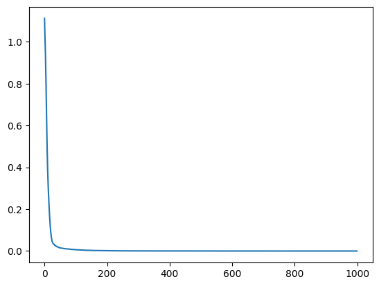
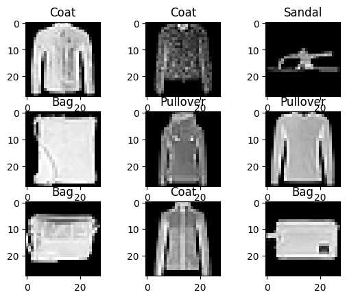
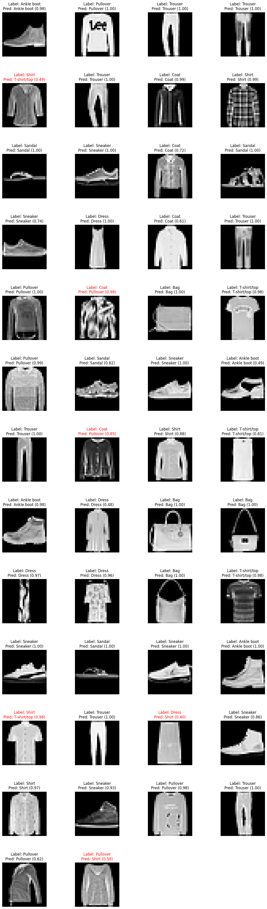

<!-- editorlm-hebrew-html-start -->
<style>
html, body, .vscode-body, .markdown-body, .markdown-preview, #write {
  direction: rtl !important; text-align: right !important;
}
ul, ol { padding-right: 2em !important; padding-left: 0 !important; }
blockquote { border-right: 3px solid #999; border-left: 0; padding-right: 1rem; padding-left: 0; }
@media print {
  html, body, .vscode-body, .markdown-body, .markdown-preview, #write {
    direction: rtl !important; text-align: right !important;
  }
}
</style>
<!-- editorlm-hebrew-html-end -->
<style>
.book { max-width: 900px; margin: auto; line-height: 1.8; font-family: Arial, sans-serif; }
.book .cover { min-height: 680px; box-sizing: border-box; padding: 64px 48px; margin: 24px 0 60px; background: #112b41; color: #f5f8fc; border-top: 9px solid #39c4b5; position: relative; }
.book .cover .eyebrow { color: #81e0d5; font-size: 15px; letter-spacing: 2px; }
.book .cover h1 { color: #fff; font-size: 48px; line-height: 1.3; border: 0; margin: 50px 0 18px; }
.book .cover .subtitle { font-size: 28px; color: #d8e6f0; }
.book .cover .author { font-size: 30px; color: #fff; margin-top: 52px; }
.book .cover .audience { color: #c1d3df; margin-top: 12px; }
.book .cover .motif { direction: ltr; text-align: left; font-family: Consolas, monospace; color: #81e0d5; font-size: 19px; margin-top: 54px; }
.book h1, .book h2, .book h3 { line-height: 1.4; font-weight: 700; }
.book > h1 { font-size: 32px !important; text-align: center !important; margin: 28px 0; }
.book h2 { font-size: 34px !important; text-align: center !important; color: #153b56 !important; background: #eef5fc; border: 0; border-bottom: 4px solid #299c91; border-radius: 10px 10px 0 0; padding: 28px 20px; margin: 24px 0 36px; }
.book h3 { font-size: 24px !important; text-align: right !important; color: #174e49 !important; background: #edf7f5; border: 0; border-right: 5px solid #299c91; border-radius: 6px; padding: 10px 16px; margin: 36px 0 18px; }
.book .chapter { height: 0; margin: 76px 0 0; border-top: 1px solid #ccd7df; break-before: page; page-break-before: always; break-after: avoid; page-break-after: avoid; }
.book .toc { padding: 24px; border-right: 5px solid #39a99d; background: rgba(70,150,155,.09); margin: 24px 0 48px; }
.book pre, .book pre code { direction: ltr !important; text-align: left !important; unicode-bidi: isolate; }
.book pre { box-sizing: border-box !important; width: 100% !important; max-width: 100% !important; margin: 0 !important; padding: 16px 20px; border: 1px solid #ccd7df; border-radius: 8px; line-height: 1.6; overflow-x: auto; }
.book code { direction: ltr; unicode-bidi: isolate; font-family: Consolas, "Courier New", monospace; }
.book pre { background: #f3f6fa !important; color: #1f2937 !important; }
.book pre code, .book pre code.hljs { background: transparent !important; color: #1f2937 !important; }
.book pre .hljs-keyword, .book pre .hljs-literal { color: #6f299c !important; }
.book pre .hljs-string { color: #216338 !important; }
.book pre .hljs-number { color: #075e68 !important; }
.book pre .hljs-comment { color: #526174 !important; }
.book pre .hljs-built_in, .book pre .hljs-title { color: #135b96 !important; }
.book table { width: 100%; }
.book th, .book td { text-align: right; }
.book .small { font-size: .9em; opacity: .8; }
.book .python-intro { display: flex; align-items: center; gap: 28px; padding: 22px 28px; margin: 24px 0; background: #eef5fc; color: #183e63; border-right: 6px solid #3776ab; border-radius: 10px; }
.book .python-intro strong { font-size: 30px; }
.book .python-fact { background: #fff7d6; color: #423611; border-right: 6px solid #ffd343; border-radius: 8px; padding: 18px 24px; margin: 22px 0; }
.book .python-fact strong { font-size: 24px; }
.book img { max-width: 100%; height: auto; }
.book figure { margin: 24px auto; text-align: center; }
.book figure img { display: block; margin: auto; }
.book figcaption { direction: rtl; text-align: center; font-size: .9em; color: #445566; }
@media print { .book > h2 { break-before: page; page-break-before: always; } }
.book .screen-strip { width: 760px; max-width: 100%; height: 220px; overflow: hidden; border: 1px solid #bccad5; border-radius: 8px; margin: 20px auto 8px; direction: ltr; }
.book .screen-strip.output { height: 265px; }
.book .screen-strip img { display: block; width: 1745px; max-width: none; }
.book .screen-menu { width: 400px; max-width: 100%; height: 295px; overflow: hidden; direction: ltr; margin: 20px auto 8px; border: 1px solid #bccad5; border-radius: 8px; }
.book .screen-menu img { display: block; width: 1745px; max-width: none; }
.book .code-panel { box-sizing: border-box !important; display: block !important; width: 75% !important; max-width: 75% !important; margin: 18px auto !important; }
@media print {
  .book .cover { min-height: 85vh; break-after: page; print-color-adjust: exact; -webkit-print-color-adjust: exact; }
  .book pre { white-space: pre-wrap; break-inside: avoid; }
  .book .chapter { margin: 0; border: 0; }
  .book h1, .book h2, .book h3 { break-after: avoid; page-break-after: avoid; break-inside: avoid; }
  .book h2 { margin-top: 0; }
  .book h2, .book h3 { print-color-adjust: exact; -webkit-print-color-adjust: exact; }
}
</style>

<style>
.book .book-nav { display: flex; flex-wrap: wrap; gap: 10px; justify-content: center; align-items: center; padding: 16px 0; margin: 20px 0 32px; border-top: 1px solid #ccd7df; border-bottom: 1px solid #ccd7df; }
.book .book-nav a { display: inline-block; padding: 10px 18px; border-radius: 8px; background: #eef5fc; color: #153b56 !important; border: 1px solid #b5ccd9; text-decoration: none !important; font-size: 16px; font-weight: bold; }
.book .book-nav a.toc-link { background: #174e49; color: #fff !important; border-color: #174e49; }
.book .book-nav a:hover, .book .book-nav a:focus { background: #d4eee8; color: #153b56 !important; outline: 2px solid #299c91; outline-offset: 2px; }
.book .section-list { line-height: 2; }
@media print { .book .book-nav { display: none; } }

/* Explicit Hebrew direction, including prose beginning with English. */
.book p, .book ul, .book ol, .book li,
.book blockquote, .book h1, .book h2, .book h3,
.book h4, .book th, .book td {
  direction: rtl !important;
  text-align: right !important;
  unicode-bidi: isolate;
}
/* Chapter titles keep their agreed centered layout. */
.book h2 { text-align: center !important; }
.book pre, .book pre code, .book .code-panel {
  direction: ltr !important;
  text-align: left !important;
  unicode-bidi: isolate;
}
</style>

<div class="book" dir="rtl" lang="he" style="direction: rtl !important; text-align: right !important;">

<nav class="book-nav" aria-label="ניווט בספר">
<a href="17-%D7%A8%D7%A9%D7%AA%20%D7%91%D7%90%D7%9E%D7%A6%D7%A2%D7%95%D7%AA%20%D7%9E%D7%97%D7%9C%D7%A7%D7%94.md">→ הקודם</a>
<a class="toc-link" href="../index.md">תוכן העניינים</a>
<a href="19-Pima%20-%20%D7%A8%D7%A9%D7%AA%20%D7%9C%D7%98%D7%91%D7%9C%D7%94.md">הבא ←</a>
</nav>

## ג.18 סיווג רב־קטגוריות — Iris ו־Fashion-MNIST

נסווג תחילה פרחי Iris לאחד משלושה מינים לפי ארבע מדידות, ואחר כך תמונות Fashion-MNIST לאחת מעשר קטגוריות לבוש.

**[השיעור וההרצאות באתר של גלעד מרקמן](https://webprogramming.azurewebsites.net/Pages/PyTorch/ANN_Class_Softmax.aspx)**

**חומרי הליווי:** [מצגת רשת נוירונים באמצעות מחלקה](../../../sources/ML/9.%20%D7%A8%D7%A9%D7%AA%20%D7%A0%D7%95%D7%A8%D7%95%D7%A0%D7%99%D7%9D%20%D7%91%D7%90%D7%9E%D7%A6%D7%A2%D7%95%D7%AA%20%D7%9E%D7%97%D7%9C%D7%A7%D7%94.pptx) · [מחברת Iris ו־Fashion-MNIST](../../../sources/ML/Colab/Classified_Iris_FashionMNIST.ipynb)

### סיווג מיני Iris

נייבא את הספריות לעבודה עם הנתונים והרשת:

<div class="code-panel" dir="ltr">

```python
import torch
import torch.nn as nn
import numpy as np
import matplotlib.pyplot as plt
from sklearn import datasets
from sklearn.model_selection import train_test_split
```

</div>

<!-- editorlm-source-ref: [sources/ML/converted/Classified_Iris_FashionMNIST/notebook.md#L11-L22] -->

נטען את Iris ונדפיס את תיאור המאגר. יש בו 150 פרחים משלושה מינים וארבע מדידות בסנטימטרים לכל פרח: אורך ורוחב עלה הגביע ואורך ורוחב עלה הכותרת.

<div class="code-panel" dir="ltr">

```python
iris = datasets.load_iris()
data, targets = iris.data, iris.target

print(iris.DESCR)
```

</div>

<!-- editorlm-source-ref: [sources/ML/converted/Classified_Iris_FashionMNIST/notebook.md#L27-L106] -->

נבדוק את שמות המינים, צורת הנתונים, חמש הדוגמאות הראשונות והתוויות:

<div class="code-panel" dir="ltr">

```python
print ("target_names",iris.target_names)
print ("X, y",data.shape, targets.shape)
print(data[0:5],'\n', targets)
```

</div>

**פלט**

<div class="code-panel" dir="ltr">

```text
target_names ['setosa' 'versicolor' 'virginica']
X, y (150, 4) (150,)
[[5.1 3.5 1.4 0.2]
 [4.9 3.  1.4 0.2]
 [4.7 3.2 1.3 0.2]
 [4.6 3.1 1.5 0.2]
 [5.  3.6 1.4 0.2]] 
 [0 0 0 0 0 0 0 0 0 0 0 0 0 0 0 0 0 0 0 0 0 0 0 0 0 0 0 0 0 0 0 0 0 0 0 0 0
 0 0 0 0 0 0 0 0 0 0 0 0 0 1 1 1 1 1 1 1 1 1 1 1 1 1 1 1 1 1 1 1 1 1 1 1 1
 1 1 1 1 1 1 1 1 1 1 1 1 1 1 1 1 1 1 1 1 1 1 1 1 1 1 2 2 2 2 2 2 2 2 2 2 2
 2 2 2 2 2 2 2 2 2 2 2 2 2 2 2 2 2 2 2 2 2 2 2 2 2 2 2 2 2 2 2 2 2 2 2 2 2
 2 2]
```

</div>

<!-- editorlm-source-ref: [sources/ML/converted/Classified_Iris_FashionMNIST/notebook.md#L107-L132] -->

נציג את זוגות התכונות בגרפי פיזור. הצבעים מסמנים את מיני הפרחים; האלכסון נשאר ריק.

<div class="code-panel" dir="ltr">

```python
fig, axes = plt.subplots(4, 4, figsize=(15, 15))
features = iris.feature_names

for i in range(4):
    for j in range(4):
        ax = axes[i, j]
        # Plot scatter plots only on off-diagonal combinations
        if i != j:
            scatter = ax.scatter(data[:, j], data[:, i], c=iris.target, cmap='viridis', s=15)

        # Add labels to the outer edges of the grid
        if i == 3:
            ax.set_xlabel(features[j])
        if j == 0:
            ax.set_ylabel(features[i])

# Add a main legend to the figure
handles, labels = scatter.legend_elements()
fig.legend(handles, iris.target_names, loc='upper right', title="Classes")

plt.tight_layout()
plt.show()
```

</div>

<figure>

<figcaption>זוגות תכונות Iris, בצבעי המינים.</figcaption>
</figure>

<!-- editorlm-source-ref: [sources/ML/converted/Classified_Iris_FashionMNIST/notebook.md#L137-L172] -->

### פיצול הנתונים ויצירת טנסורים

נפצל ל־80% אימון ו־20% בדיקה, ונמיר את המדידות לטנסורים מסוג float32 ואת התוויות לווקטורים מסוג long:

<div class="code-panel" dir="ltr">

```python
n_samples, n_features = data.shape
X_train_np, X_test_np, y_train_np, y_test_np = train_test_split (data,targets, test_size=0.2, random_state = 4)

X_train = torch.from_numpy(X_train_np.astype(np.float32))
X_test = torch.from_numpy(X_test_np.astype(np.float32))

y_train = torch.from_numpy(y_train_np).long() # Target labels should be 1D and of type long
y_test = torch.from_numpy(y_test_np).long()   # Target labels should be 1D and of type long
```

</div>

<!-- editorlm-source-ref: [sources/ML/converted/Classified_Iris_FashionMNIST/notebook.md#L177-L189] -->

נבדוק את צורת הטנסורים:

<div class="code-panel" dir="ltr">

```python
print (X_train.shape, y_train.shape)
print (X_test.shape, y_test.shape)
```

</div>

**פלט**

<div class="code-panel" dir="ltr">

```text
torch.Size([120, 4]) torch.Size([120])
torch.Size([30, 4]) torch.Size([30])
```

</div>

<!-- editorlm-source-ref: [sources/ML/converted/Classified_Iris_FashionMNIST/notebook.md#L190-L204] -->

### נרמול

נחשב מינימום ומקסימום לכל תכונה לפי קבוצת האימון ונגדיר נרמול Min–Max:

<div class="code-panel" dir="ltr">

```python
max_train,__ = X_train.max(dim=0)
min_train, __ = X_train.min(dim=0)

def Normalize_minMax(X):
    return (X - min_train) / (max_train - min_train)


print (max_train, min_train)
```

</div>

**פלט**

<div class="code-panel" dir="ltr">

```text
tensor([7.9000, 4.4000, 6.9000, 2.5000]) tensor([4.3000, 2.2000, 1.0000, 0.1000])
```

</div>

<!-- editorlm-source-ref: [sources/ML/converted/Classified_Iris_FashionMNIST/notebook.md#L209-L229] -->

ננרמל את שתי הקבוצות באמצעות אותם ערכי אימון ונבדוק את התוצאה:

<div class="code-panel" dir="ltr">

```python
X_train = Normalize_minMax(X_train)
X_test = Normalize_minMax(X_test)
# X_train = Normalize_z(X_train)
# X_test = Normalize_z(X_test)
print (X_train[0:5])
max_val, max_idx = X_train.max(dim=0)
print (max_val, max_idx)
```

</div>

**פלט**

<div class="code-panel" dir="ltr">

```text
tensor([[0.3056, 0.3636, 0.5932, 0.5833],
        [0.0833, 0.4545, 0.0678, 0.0417],
        [0.6667, 0.1364, 0.8136, 0.7083],
        [0.1667, 0.3636, 0.0678, 0.0417],
        [0.1944, 0.0455, 0.3898, 0.3750]])
tensor([1., 1., 1., 1.]) tensor([102,  16,  22,   5])
```

</div>

<!-- editorlm-source-ref: [sources/ML/converted/Classified_Iris_FashionMNIST/notebook.md#L230-L253] -->

### התקן החישוב

נבחר GPU אם הוא זמין, ואחרת CPU:

<div class="code-panel" dir="ltr">

```python
if torch.cuda.is_available():
    device = torch.device('cuda')
else:
    device = torch.device('cpu')
print(device)
```

</div>

<!-- editorlm-source-ref: [sources/ML/converted/Classified_Iris_FashionMNIST/notebook.md#L258-L274] -->

נעביר את נתוני האימון והבדיקה לאותו התקן:

<div class="code-panel" dir="ltr">

```python
X_train = X_train.to(device)
X_test = X_test.to(device)
y_train = y_train.to(device)
y_test = y_test.to(device)
```

</div>

<!-- editorlm-source-ref: [sources/ML/converted/Classified_Iris_FashionMNIST/notebook.md#L275-L283] -->

### רשת Iris, הפסד ואופטימייזר

נגדיר רשת עם ארבעה קלטים, שתי שכבות נסתרות בגודל 64 ו־128 ושלושה פלטים. נשתמש ב־CrossEntropyLoss וב־Adam, בקצב למידה 0.01 ולמשך 1,000 תקופות.

<div class="code-panel" dir="ltr">

```python
learning_rate = 1e-2
epochs = 1000
losses = [] # tensor to save losses for print

# design model
class ANN_Model(nn.Module):
    def __init__(self, input_size, num_classes):
        super().__init__()
        self.linear1 = nn.Linear(input_size,64)
        self.linear2 = nn.Linear(64, 128)
        self.linear3 = nn.Linear(128, num_classes)
        self.relu = nn.ReLU()

    def forward(self, x):
        x = self.linear1(x)
        x = self.relu(x)         # torch.nn.functional as F
        x = self.linear2(x)
        x = self.relu(x)
        x = self.linear3(x)
        return x

Model = ANN_Model(input_size=4, num_classes=3).to(device)

#construct loss and optimizer
Loss = nn.CrossEntropyLoss ()

# init optimizer
optim = torch.optim.Adam(Model.parameters(), lr=learning_rate)
```

</div>

<!-- editorlm-source-ref: [sources/ML/converted/Classified_Iris_FashionMNIST/notebook.md#L288-L320] -->

### אימון Iris

בכל תקופה נעביר את כל קבוצת האימון ברשת, נחשב הפסד ונגזרות, נעדכן משקלים ונאפס גרדיאנטים. נשמור את ההפסדים לציור גרף:

<div class="code-panel" dir="ltr">

```python
for epoch in range(epochs):
    # forward
    y_predict = Model(X_train)

    # backward
    loss = Loss(y_predict, y_train)
    loss.backward()

    # update wights
    optim.step()
    losses.append(loss.item())

    if epoch % 10 == 0:
        print(f"epoch= {epoch} loss={loss.item():.4f} ")

    # zero grads
    optim.zero_grad()
```

</div>

תחילת הפלט וסופו, בדילוג על שורות הביניים:

**פלט**

<div class="code-panel" dir="ltr">

```text
epoch= 0 loss=1.1119 
epoch= 10 loss=0.3873 
...
epoch= 990 loss=0.0000
```

</div>

<!-- editorlm-source-ref: [sources/ML/converted/Classified_Iris_FashionMNIST/notebook.md#L325-L452] -->

### תוצאות האימון

נציג את ההפסד לאורך האימון:

<div class="code-panel" dir="ltr">

```python
plt.plot(losses)
plt.show()
```

</div>

<figure>

<figcaption>הפסד האימון של רשת Iris.</figcaption>
</figure>

<!-- editorlm-source-ref: [sources/ML/converted/Classified_Iris_FashionMNIST/notebook.md#L457-L472] -->

### בדיקת Iris

נבחר לכל פרח את אינדקס הציון המרבי ונשווה לתווית האמיתית:

<div class="code-panel" dir="ltr">

```python
with torch.no_grad():
    y_predicted = Model(X_test)
    __,y_predict_arg = torch.max(y_predicted,1)
    n_correct = (y_predict_arg == y_test).sum().item()
    accuracy = n_correct / float(y_predicted.shape[0])
    print (f'accuracy = {accuracy*100:.4f}%')
```

</div>

**פלט**

<div class="code-panel" dir="ltr">

```text
accuracy = 93.3333%
```

</div>

<!-- editorlm-source-ref: [sources/ML/converted/Classified_Iris_FashionMNIST/notebook.md#L477-L496] -->

נציג את התחזית והתווית זו לצד זו:

<div class="code-panel" dir="ltr">

```python
print ("predicted, test \n", torch.cat((y_predict_arg.view(-1,1), y_test.view(-1,1)), dim=1))
```

</div>

**פלט**

<div class="code-panel" dir="ltr">

```text
predicted, test 
 tensor([[2, 2],
        [0, 0],
        [2, 2],
        [2, 2],
        [2, 2],
        [1, 1],
        [2, 1],
        [0, 0],
        [0, 0],
        [1, 2],
        [0, 0],
        [0, 0],
        [0, 0],
        [1, 1],
        [2, 2],
        [0, 0],
        [1, 1],
        [0, 0],
        [0, 0],
        [2, 2],
        [0, 0],
        [2, 2],
        [1, 1],
        [0, 0],
        [0, 0],
        [0, 0],
        [0, 0],
        [0, 0],
        [0, 0],
        [2, 2]], device='cuda:0')
```

</div>

בפלט השמור יש שתי טעויות מתוך 30 פרחים; הפסד אימון המעוגל לאפס אינו מבטיח שכל תחזיות הבדיקה נכונות.

<!-- editorlm-source-ref: [sources/ML/converted/Classified_Iris_FashionMNIST/notebook.md#L497-L539] -->

### סיווג Fashion-MNIST

כעת נסווג תמונות לעשר קטגוריות לבוש. נייבא את הספריות עבור דוגמה זו:

<div class="code-panel" dir="ltr">

```python
import torch
import torch.nn as nn
import numpy as np
import matplotlib.pyplot as plt
import torchvision
import torchvision.transforms as transforms
```

</div>

<!-- editorlm-source-ref: [sources/ML/converted/Classified_Iris_FashionMNIST/notebook.md#L548-L558] -->

נבחר שוב את התקן החישוב:

<div class="code-panel" dir="ltr">

```python
if torch.cuda.is_available():
    device = torch.device('cuda')
else:
    device = torch.device('cpu')
print(device)
```

</div>

<!-- editorlm-source-ref: [sources/ML/converted/Classified_Iris_FashionMNIST/notebook.md#L559-L575] -->

### טעינת נתוני הבגדים

נטען את קבוצות האימון והבדיקה. ToTensor ממירה כל תמונה לטנסור:

<div class="code-panel" dir="ltr">

```python
train_dataset = torchvision.datasets.FashionMNIST(root='./data',
                                           train=True,
                                           transform=transforms.ToTensor(),
                                           download=True)

test_dataset = torchvision.datasets.FashionMNIST(root='./data',
                                          train=False,
                                          transform=transforms.ToTensor(),
                                          download=True)
```

</div>

<!-- editorlm-source-ref: [sources/ML/converted/Classified_Iris_FashionMNIST/notebook.md#L580-L593] -->

נציג את פרטי שתי הקבוצות:

<div class="code-panel" dir="ltr">

```python
print(train_dataset)
print(test_dataset)
```

</div>

**פלט**

<div class="code-panel" dir="ltr">

```text
Dataset FashionMNIST
    Number of datapoints: 60000
    Root location: ./data
    Split: Train
    StandardTransform
Transform: ToTensor()
Dataset FashionMNIST
    Number of datapoints: 10000
    Root location: ./data
    Split: Test
    StandardTransform
Transform: ToTensor()
```

</div>

<!-- editorlm-source-ref: [sources/ML/converted/Classified_Iris_FashionMNIST/notebook.md#L594-L618] -->

נציג את שמות הקטגוריות ואת מספריהן:

<div class="code-panel" dir="ltr">

```python
print(f'Class names: {train_dataset.classes}')
for number, name in enumerate(train_dataset.classes):
    print(f"Class Number: {number}, Class Name: {name}")
```

</div>

**פלט**

<div class="code-panel" dir="ltr">

```text
Class names: ['T-shirt/top', 'Trouser', 'Pullover', 'Dress', 'Coat', 'Sandal', 'Shirt', 'Sneaker', 'Bag', 'Ankle boot']
Class Number: 0, Class Name: T-shirt/top
Class Number: 1, Class Name: Trouser
Class Number: 2, Class Name: Pullover
Class Number: 3, Class Name: Dress
Class Number: 4, Class Name: Coat
Class Number: 5, Class Name: Sandal
Class Number: 6, Class Name: Shirt
Class Number: 7, Class Name: Sneaker
Class Number: 8, Class Name: Bag
Class Number: 9, Class Name: Ankle boot
```

</div>

<!-- editorlm-source-ref: [sources/ML/converted/Classified_Iris_FashionMNIST/notebook.md#L619-L643] -->

### יצירת אצוות

נחלק לאצוות של 50 תמונות; את קבוצת האימון נערבב:

<div class="code-panel" dir="ltr">

```python
batch_size = 50

train_loader = torch.utils.data.DataLoader(dataset=train_dataset,
                                           batch_size=batch_size,
                                           shuffle=True)

test_loader = torch.utils.data.DataLoader(dataset=test_dataset,
                                          batch_size=batch_size,
                                          shuffle=False)
```

</div>

<!-- editorlm-source-ref: [sources/ML/converted/Classified_Iris_FashionMNIST/notebook.md#L648-L661] -->

נבדוק כמה אצוות יש בכל קבוצה:

<div class="code-panel" dir="ltr">

```python
print(len(train_loader))
print(len(test_loader))
```

</div>

**פלט**

<div class="code-panel" dir="ltr">

```text
1200
200
```

</div>

<!-- editorlm-source-ref: [sources/ML/converted/Classified_Iris_FashionMNIST/notebook.md#L662-L677] -->

### דוגמאות מהנתונים

ניקח את האצווה השנייה ונציג ממנה תשע תמונות, את תוויותיהן ואת צורת הטנסורים. בסוף נדפיס שורת פיקסלים מהתמונה התשיעית:

<div class="code-panel" dir="ltr">

```python
examples = iter(test_loader)
example_data, example_targets = next(examples)
example_data, example_targets = next(examples)

for i in range(9):
    plt.subplot(3,3,i+1)
    plt.title (train_dataset.classes[example_targets[i].item()])
    plt.imshow(example_data[i][0], cmap='gray')
    print(example_targets[i].item(), example_data[i].shape)

plt.show()
print(example_data[8][0][10])
```

</div>

**פלט**

<div class="code-panel" dir="ltr">

```text
4 torch.Size([1, 28, 28])
4 torch.Size([1, 28, 28])
5 torch.Size([1, 28, 28])
8 torch.Size([1, 28, 28])
2 torch.Size([1, 28, 28])
2 torch.Size([1, 28, 28])
8 torch.Size([1, 28, 28])
4 torch.Size([1, 28, 28])
8 torch.Size([1, 28, 28])
```

</div>


<figure>

<figcaption>תשע תמונות מאצוות הבדיקה השנייה.</figcaption>
</figure>

**פלט**

<div class="code-panel" dir="ltr">

```text
tensor([0.0000, 0.0000, 0.0000, 0.0588, 0.9843, 0.8039, 0.7961, 0.8353, 0.8275,
        0.8078, 0.8196, 0.8235, 0.8353, 0.8314, 0.8314, 0.8392, 0.8353, 0.8392,
        0.8471, 0.8392, 0.8314, 0.8196, 0.8392, 0.8275, 0.8235, 0.8235, 0.9020,
        0.2431])
```

</div>

<!-- editorlm-source-ref: [sources/ML/converted/Classified_Iris_FashionMNIST/notebook.md#L682-L732] -->

### פרמטרים ורשת לבגדים

נגדיר 784 קלטים, שכבות נסתרות בגודל 256 ו־128, עשרה פלטים, חמש תקופות וקצב למידה 0.001:

<div class="code-panel" dir="ltr">

```python
input_size = 784 # 28x28
hidden_size1 = 256
hidden_size2 = 128
output_size = 10
epochs = 5
learning_rate = 1e-3
```

</div>

<!-- editorlm-source-ref: [sources/ML/converted/Classified_Iris_FashionMNIST/notebook.md#L741-L752] -->

נגדיר מחדש את מחלקת הרשת וניצור מודל עבור תמונות הבגדים:

<div class="code-panel" dir="ltr">

```python
# design model
class ANN_Model(nn.Module):
    def __init__(self, input_size, num_classes):
        super().__init__()
        self.linear1 = nn.Linear(input_size,hidden_size1)
        self.linear2 = nn.Linear(hidden_size1, hidden_size2)
        self.linear3 = nn.Linear(hidden_size2, num_classes)
        self.relu = nn.ReLU()

    def forward(self, x):
        x = self.linear1(x)
        x = self.relu(x)
        x = self.linear2(x)
        x = self.relu(x)
        x = self.linear3(x)
        return x

Model = ANN_Model(input_size, output_size).to(device)
```

</div>

<!-- editorlm-source-ref: [sources/ML/converted/Classified_Iris_FashionMNIST/notebook.md#L757-L782] -->

נגדיר CrossEntropyLoss ואופטימייזר Adam עבור המודל החדש:

<div class="code-panel" dir="ltr">

```python
#construct loss and optimizer
Loss = nn.CrossEntropyLoss ()

# init optimizer
optim = torch.optim.Adam(Model.parameters(), lr=learning_rate)
```

</div>

<!-- editorlm-source-ref: [sources/ML/converted/Classified_Iris_FashionMNIST/notebook.md#L787-L796] -->

### אימון Fashion-MNIST

בכל אצווה נפרוש את התמונות לשורות של 784 ערכים, נעביר אותן ואת התוויות להתקן ונבצע צעד אימון:

<div class="code-panel" dir="ltr">

```python
n_total_steps = len(train_loader)
for epoch in range(epochs):
    for i, (images, lables) in enumerate(train_loader):

        # origin shape: [50, 1, 28, 28]
        # resized: [50, 784]
        images = images.reshape(-1, 28*28).to(device)
        lables = lables.to(device)

        # forward
        Y_predict = Model(images)

        # backward
        loss = Loss(Y_predict, lables)
        loss.backward()

        # update wights
        optim.step()

        if (i + epoch * n_total_steps) % 100 == 0:
            print(f"epoch= {epoch} i= {i} num= {i+epoch * n_total_steps} loss={loss.item():.4f} ")

        # zero grads
        optim.zero_grad()
```

</div>

תחילת הפלט וסופו, בדילוג על שורות הביניים:

**פלט**

<div class="code-panel" dir="ltr">

```text
epoch= 0 i= 0 num= 0 loss=2.2812 
epoch= 0 i= 100 num= 100 loss=0.6721 
...
epoch= 4 i= 1100 num= 5900 loss=0.1990
```

</div>

<!-- editorlm-source-ref: [sources/ML/converted/Classified_Iris_FashionMNIST/notebook.md#L801-L895] -->

### בדיקת Fashion-MNIST

נעבור על קבוצת הבדיקה ונחשב את אחוז התחזיות הנכונות:

<div class="code-panel" dir="ltr">

```python
with torch.no_grad():
    n_correct = 0
    n_samples = 0
    for images, lables in test_loader:
        images = images.reshape(-1, 28*28).to(device)
        labels = lables.to(device)
        labels_pre = Model(images)
        __,labels_pre_arg = torch.max(labels_pre,1)
        n_correct += (labels_pre_arg == labels).sum().item()
        n_samples += lables.size(0)


    acc = 100 * n_correct / n_samples
    print(f'Accuracy of the network on the {n_samples} test images: {acc} %')
```

</div>

**פלט**

<div class="code-panel" dir="ltr">

```text
Accuracy of the network on the 10000 test images: 87.56 %
```

</div>

<!-- editorlm-source-ref: [sources/ML/converted/Classified_Iris_FashionMNIST/notebook.md#L900-L925] -->

### תחזיות והסתברויות

ניקח את אצוות הבדיקה הראשונה. argmax בוחרת את הקטגוריה, ו־Softmax מחשבת את ההסתברויות שנדפיס לצד התחזיות:

<div class="code-panel" dir="ltr">

```python
print(len(test_loader))
print (n_samples)
print(lables.shape)
examples = iter(test_loader)
example_data, example_targets = next(examples)
example_data = example_data.to(device)
example_targets = example_targets.to(device)
with torch.no_grad():
    # Get raw model outputs (logits)
    raw_predictions = Model(example_data.reshape(-1, 28*28))
    # Calculate probabilities using softmax
    probabilities = torch.softmax(raw_predictions, dim=1)
    # Apply argmax to find the predicted class for each example
    predicted_classes = torch.argmax(raw_predictions, dim=1)

print("Predicted, True (Class Index) and Probability")
for i in range(len(example_data)):
    predicted_class_index = predicted_classes[i].item()
    predicted_prob = probabilities[i, predicted_class_index].item()
    print (f"Pred: {predicted_class_index}, True: {example_targets[i].item()}, Prob: {predicted_prob:.2f}")
```

</div>

**פלט**

<div class="code-panel" dir="ltr">

```text
200
10000
torch.Size([50])
Predicted, True (Class Index) and Probability
Pred: 9, True: 9, Prob: 0.98
Pred: 2, True: 2, Prob: 1.00
Pred: 1, True: 1, Prob: 1.00
Pred: 1, True: 1, Prob: 1.00
Pred: 0, True: 6, Prob: 0.49
Pred: 1, True: 1, Prob: 1.00
Pred: 4, True: 4, Prob: 0.99
Pred: 6, True: 6, Prob: 0.99
Pred: 5, True: 5, Prob: 1.00
Pred: 7, True: 7, Prob: 1.00
Pred: 4, True: 4, Prob: 0.72
Pred: 5, True: 5, Prob: 1.00
Pred: 7, True: 7, Prob: 0.74
Pred: 3, True: 3, Prob: 1.00
Pred: 4, True: 4, Prob: 0.61
Pred: 1, True: 1, Prob: 1.00
Pred: 2, True: 2, Prob: 1.00
Pred: 2, True: 4, Prob: 0.98
Pred: 8, True: 8, Prob: 1.00
Pred: 0, True: 0, Prob: 0.98
Pred: 2, True: 2, Prob: 0.99
Pred: 5, True: 5, Prob: 0.82
Pred: 7, True: 7, Prob: 1.00
Pred: 9, True: 9, Prob: 0.49
Pred: 1, True: 1, Prob: 1.00
Pred: 2, True: 4, Prob: 0.85
Pred: 6, True: 6, Prob: 0.88
Pred: 0, True: 0, Prob: 0.81
Pred: 9, True: 9, Prob: 0.98
Pred: 3, True: 3, Prob: 0.48
Pred: 8, True: 8, Prob: 1.00
Pred: 8, True: 8, Prob: 1.00
Pred: 3, True: 3, Prob: 0.97
Pred: 3, True: 3, Prob: 0.96
Pred: 8, True: 8, Prob: 1.00
Pred: 0, True: 0, Prob: 0.98
Pred: 7, True: 7, Prob: 1.00
Pred: 5, True: 5, Prob: 1.00
Pred: 7, True: 7, Prob: 1.00
Pred: 9, True: 9, Prob: 1.00
Pred: 0, True: 6, Prob: 0.98
Pred: 1, True: 1, Prob: 1.00
Pred: 6, True: 3, Prob: 0.40
Pred: 7, True: 7, Prob: 0.86
Pred: 6, True: 6, Prob: 0.97
Pred: 7, True: 7, Prob: 0.93
Pred: 2, True: 2, Prob: 0.98
Pred: 1, True: 1, Prob: 1.00
Pred: 2, True: 2, Prob: 0.62
Pred: 6, True: 2, Prob: 0.58
```

</div>

גם תחזית עם הסתברות גבוהה יכולה להיות שגויה: בפלט מופיעה, למשל, תחזית 2 במקום 4 בהסתברות 0.98.

<!-- editorlm-source-ref: [sources/ML/converted/Classified_Iris_FashionMNIST/notebook.md#L926-L1010] -->

נציג את 50 התמונות עם שם הקטגוריה האמיתית, שם התחזית וההסתברות שלה. כותרת אדומה מסמנת טעות:

<div class="code-panel" dir="ltr">

```python
examples = iter(test_loader)
example_data, example_targets = next(examples)
example_data = example_data.to(device)
example_targets = example_targets.to(device)

with torch.no_grad():
    raw_predictions_plot = Model(example_data.reshape(-1, 28*28))
    probabilities = torch.softmax(raw_predictions_plot, dim=1)
    predicted_classes_plot = torch.argmax(raw_predictions_plot, dim=1)

num_images = 50
cols = 4
rows = (num_images + cols - 1) // cols

plt.figure(figsize=(16, rows * 4))

for i in range(num_images):
    plt.subplot(rows, cols, i + 1)

    true_label = train_dataset.classes[example_targets[i].item()]
    pred_idx = predicted_classes_plot[i].item()
    pred_label = train_dataset.classes[pred_idx]
    pred_prob = probabilities[i, pred_idx].item()

    color = 'black' # Default color for correct answers
    if pred_idx != example_targets[i].item():
        color = 'red' # Red for incorrect answers

    plt.title(
        f"Label: {true_label}\nPred: {pred_label} ({pred_prob:.2f})",
        fontsize=12,
        pad=8,
        color=color
    )

    plt.imshow(example_data[i][0].cpu(), cmap="gray")
    plt.axis("off")

plt.subplots_adjust(wspace=0.25, hspace=0.6)
plt.show()
```

</div>

<figure>

<figcaption>תחזיות ל־50 תמונות; טעויות מסומנות באדום.</figcaption>
</figure>

<!-- editorlm-source-ref: [sources/ML/converted/Classified_Iris_FashionMNIST/notebook.md#L1011-L1063] -->


<nav class="book-nav" aria-label="ניווט בספר">
<a href="17-%D7%A8%D7%A9%D7%AA%20%D7%91%D7%90%D7%9E%D7%A6%D7%A2%D7%95%D7%AA%20%D7%9E%D7%97%D7%9C%D7%A7%D7%94.md">→ הקודם</a>
<a class="toc-link" href="../index.md">תוכן העניינים</a>
<a href="19-Pima%20-%20%D7%A8%D7%A9%D7%AA%20%D7%9C%D7%98%D7%91%D7%9C%D7%94.md">הבא ←</a>
</nav>

</div>

<!-- editorlm-source-versions: {"schemaVersion": 1, "sources": {"sources/ML/converted/Classified_Iris_FashionMNIST/notebook.md": {"sourceSha256": "7dfb75ffe4938bebf86d7b44c48234583049a6010b19cdb4669b9444dbfe3565", "canonicalTextSha256": "7dfb75ffe4938bebf86d7b44c48234583049a6010b19cdb4669b9444dbfe3565"}}} -->
