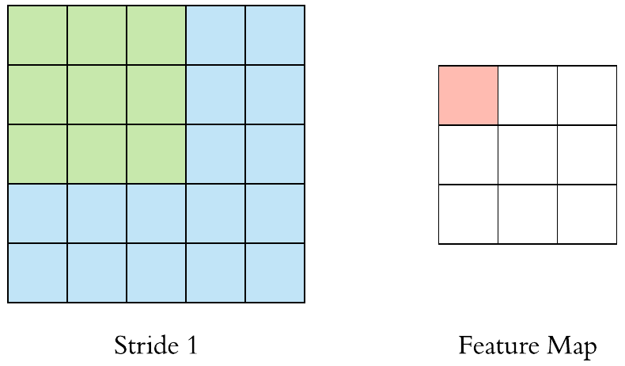
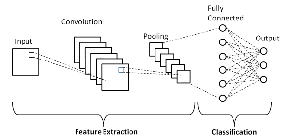
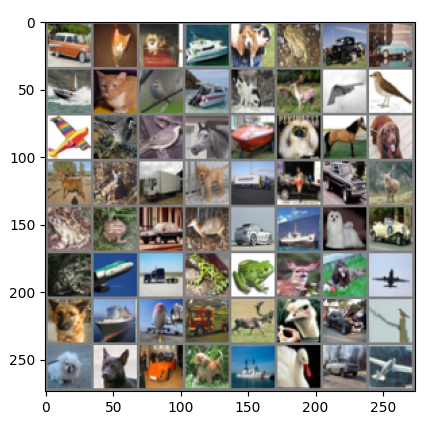
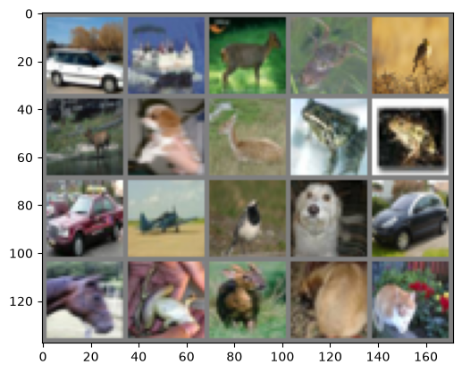
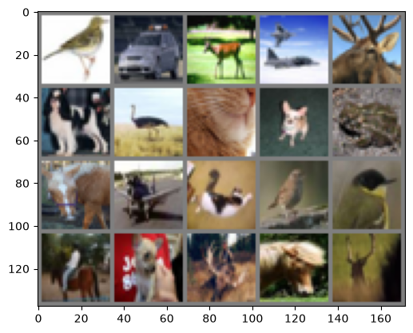
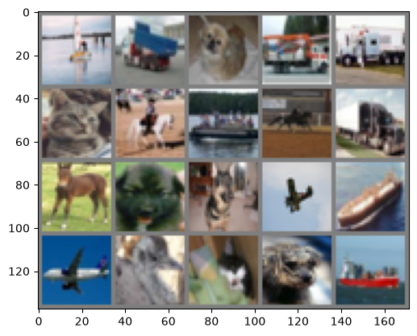

<!-- editorlm-hebrew-html-start -->
<style>
html, body, .vscode-body, .markdown-body, .markdown-preview, #write {
  direction: rtl !important; text-align: right !important;
}
ul, ol { padding-right: 2em !important; padding-left: 0 !important; }
blockquote { border-right: 3px solid #999; border-left: 0; padding-right: 1rem; padding-left: 0; }
@media print {
  html, body, .vscode-body, .markdown-body, .markdown-preview, #write {
    direction: rtl !important; text-align: right !important;
  }
}
</style>
<!-- editorlm-hebrew-html-end -->
<style>
.book { max-width: 900px; margin: auto; line-height: 1.8; font-family: Arial, sans-serif; }
.book .cover { min-height: 680px; box-sizing: border-box; padding: 64px 48px; margin: 24px 0 60px; background: #112b41; color: #f5f8fc; border-top: 9px solid #39c4b5; position: relative; }
.book .cover .eyebrow { color: #81e0d5; font-size: 15px; letter-spacing: 2px; }
.book .cover h1 { color: #fff; font-size: 48px; line-height: 1.3; border: 0; margin: 50px 0 18px; }
.book .cover .subtitle { font-size: 28px; color: #d8e6f0; }
.book .cover .author { font-size: 30px; color: #fff; margin-top: 52px; }
.book .cover .audience { color: #c1d3df; margin-top: 12px; }
.book .cover .motif { direction: ltr; text-align: left; font-family: Consolas, monospace; color: #81e0d5; font-size: 19px; margin-top: 54px; }
.book h1, .book h2, .book h3 { line-height: 1.4; font-weight: 700; }
.book > h1 { font-size: 32px !important; text-align: center !important; margin: 28px 0; }
.book h2 { font-size: 34px !important; text-align: center !important; color: #153b56 !important; background: #eef5fc; border: 0; border-bottom: 4px solid #299c91; border-radius: 10px 10px 0 0; padding: 28px 20px; margin: 24px 0 36px; }
.book h3 { font-size: 24px !important; text-align: right !important; color: #174e49 !important; background: #edf7f5; border: 0; border-right: 5px solid #299c91; border-radius: 6px; padding: 10px 16px; margin: 36px 0 18px; }
.book .chapter { height: 0; margin: 76px 0 0; border-top: 1px solid #ccd7df; break-before: page; page-break-before: always; break-after: avoid; page-break-after: avoid; }
.book .toc { padding: 24px; border-right: 5px solid #39a99d; background: rgba(70,150,155,.09); margin: 24px 0 48px; }
.book pre, .book pre code { direction: ltr !important; text-align: left !important; unicode-bidi: isolate; }
.book pre { box-sizing: border-box !important; width: 100% !important; max-width: 100% !important; margin: 0 !important; padding: 16px 20px; border: 1px solid #ccd7df; border-radius: 8px; line-height: 1.6; overflow-x: auto; }
.book code { direction: ltr; unicode-bidi: isolate; font-family: Consolas, "Courier New", monospace; }
.book pre { background: #f3f6fa !important; color: #1f2937 !important; }
.book pre code, .book pre code.hljs { background: transparent !important; color: #1f2937 !important; }
.book pre .hljs-keyword, .book pre .hljs-literal { color: #6f299c !important; }
.book pre .hljs-string { color: #216338 !important; }
.book pre .hljs-number { color: #075e68 !important; }
.book pre .hljs-comment { color: #526174 !important; }
.book pre .hljs-built_in, .book pre .hljs-title { color: #135b96 !important; }
.book table { width: 75%; max-width: 75%; margin: 18px auto; }
.book th, .book td { text-align: right; }
.book .small { font-size: .9em; opacity: .8; }
.book .python-intro { display: flex; align-items: center; gap: 28px; padding: 22px 28px; margin: 24px 0; background: #eef5fc; color: #183e63; border-right: 6px solid #3776ab; border-radius: 10px; }
.book .python-intro strong { font-size: 30px; }
.book .python-fact { background: #fff7d6; color: #423611; border-right: 6px solid #ffd343; border-radius: 8px; padding: 18px 24px; margin: 22px 0; }
.book .python-fact strong { font-size: 24px; }
.book img { max-width: 100%; height: auto; }
.book figure { margin: 24px auto; text-align: center; }
.book figure img { display: block; margin: auto; }
.book figcaption { direction: rtl; text-align: center; font-size: .9em; color: #445566; }
@media print { .book > h2 { break-before: page; page-break-before: always; } }
.book .screen-strip { width: 760px; max-width: 100%; height: 220px; overflow: hidden; border: 1px solid #bccad5; border-radius: 8px; margin: 20px auto 8px; direction: ltr; }
.book .screen-strip.output { height: 265px; }
.book .screen-strip img { display: block; width: 1745px; max-width: none; }
.book .screen-menu { width: 400px; max-width: 100%; height: 295px; overflow: hidden; direction: ltr; margin: 20px auto 8px; border: 1px solid #bccad5; border-radius: 8px; }
.book .screen-menu img { display: block; width: 1745px; max-width: none; }
.book .code-panel { box-sizing: border-box !important; display: block !important; width: 75% !important; max-width: 75% !important; margin: 18px auto !important; }
@media print {
  .book .cover { min-height: 85vh; break-after: page; print-color-adjust: exact; -webkit-print-color-adjust: exact; }
  .book pre { white-space: pre-wrap; break-inside: avoid; }
  .book .chapter { margin: 0; border: 0; }
  .book h1, .book h2, .book h3 { break-after: avoid; page-break-after: avoid; break-inside: avoid; }
  .book h2 { margin-top: 0; }
  .book h2, .book h3 { print-color-adjust: exact; -webkit-print-color-adjust: exact; }
}
</style>

<style>
.book .book-nav { display: flex; flex-wrap: wrap; gap: 10px; justify-content: center; align-items: center; padding: 16px 0; margin: 20px 0 32px; border-top: 1px solid #ccd7df; border-bottom: 1px solid #ccd7df; }
.book .book-nav a { display: inline-block; padding: 10px 18px; border-radius: 8px; background: #eef5fc; color: #153b56 !important; border: 1px solid #b5ccd9; text-decoration: none !important; font-size: 16px; font-weight: bold; }
.book .book-nav a.toc-link { background: #174e49; color: #fff !important; border-color: #174e49; }
.book .book-nav a:hover, .book .book-nav a:focus { background: #d4eee8; color: #153b56 !important; outline: 2px solid #299c91; outline-offset: 2px; }
.book .section-list { line-height: 2; }
@media print { .book .book-nav { display: none; } }

/* Explicit Hebrew direction, including prose beginning with English. */
.book p, .book ul, .book ol, .book li,
.book blockquote, .book h1, .book h2, .book h3,
.book h4, .book th, .book td {
  direction: rtl !important;
  text-align: right !important;
  unicode-bidi: isolate;
}
/* Chapter titles keep their agreed centered layout. */
.book h2 { text-align: center !important; }
.book pre, .book pre code, .book .code-panel {
  direction: ltr !important;
  text-align: left !important;
  unicode-bidi: isolate;
}
/* Display math renders left-to-right and centered, independent of the RTL page. */
.book .math-panel, .book .math-panel .katex-display, .book .math-panel .katex {
  direction: ltr !important;
  text-align: center !important;
  unicode-bidi: isolate;
}
.book .math-panel { box-sizing: border-box; width: 75%; max-width: 75%; margin: 20px auto; padding: 16px 20px; background: #f3f6fa; color: #1f2937; border: 1px solid #ccd7df; border-radius: 8px; overflow-x: auto; font-size: 1.1em; }
.book .math-panel .katex-display { margin: 0; }
.book .math-panel p { margin: 0; }
</style>

<div class="book" dir="rtl" lang="he" style="direction: rtl !important; text-align: right !important;">

<nav class="book-nav" aria-label="ניווט בספר">
<a href="19-%D7%A9%D7%9E%D7%99%D7%A8%D7%94%20%D7%95%D7%98%D7%A2%D7%99%D7%A0%D7%94.md">→ הקודם</a>
<a class="toc-link" href="../index.md">תוכן העניינים</a>
<a href="21-%D7%97%D7%AA%D7%95%D7%9C%20%D7%90%D7%95%20%D7%9C%D7%90%20%D7%97%D7%AA%D7%95%D7%9C.md">הבא ←</a>
</nav>

## ג.20 רשתות קונבולוציה — CNN ו־CIFAR-10

עד כה סיווגנו תמונות ברשת נוירונים "רגילה": שיטחנו כל תמונה לווקטור ארוך של פיקסלים והזנו אותו לשכבות לינאריות, שבהן כל נוירון מחובר לכל קלט. על ספרות ופריטי לבוש קטנים בגוני אפור זה עבד לא רע, אבל לגישה הזו שתי בעיות שמתגלות ברגע שהתמונות נעשות גדולות וצבעוניות. הראשונה היא כמות המשקלים: תמונת CIFAR-10 קטנה יחסית, 32×32 פיקסלים בשלושה ערוצי צבע, ובכל זאת יש בה 3×32×32 ערכים, וכל נוירון בשכבה הראשונה זקוק למשקל נפרד לכל אחד מהם. בתמונה של מצלמה רגילה, עם מיליוני פיקסלים, מספר המשקלים בשכבה הראשונה בלבד היה עצום — קשה לאמן, קל להתאים יתר על המידה.

הבעיה השנייה עמוקה יותר: ההשטחה מוחקת את המבנה של התמונה. אחרי ההשטחה, פיקסל ושכנו הצמוד הם בעיני הרשת שני קלטים סתמיים, לא יותר קרובים זה לזה מפיקסל בפינה הנגדית. אבל בתמונה, מה שמשמעותי הוא דווקא הקשר בין שכנים — קו הוא רצף של פיקסלים כהים זה לצד זה, פינה היא מפגש של שני קווים, אוזן של חתול היא שילוב של כמה עקומות. יתרה מזו, חתול שמופיע בצד ימין של התמונה וחתול זהה בצד שמאל מפעילים קלטים שונים לגמרי, והרשת הרגילה צריכה ללמוד לזהות כל אחד מהם בנפרד.

**רשת קונבולוציה — Convolutional Neural Network (CNN)** פותרת את שתי הבעיות ברעיון אחד. במקום נוירון שמסתכל על כל התמונה, היא משתמשת ב**מסנן — Filter (או Kernel)**: מטריצה קטנה של משקלים, למשל 3×3 או 5×5, ש"מחליקה" על פני התמונה ובודקת בכל מיקום עד כמה האזור הקטן שמתחתיה דומה לתבנית שהיא מחפשת. מסנן אחד עשוי לזהות קו אנכי, אחר קו אופקי, שלישי מעבר חד מבהיר לכהה. אותם משקלים משמשים בכל מיקום, ולכן מספר הפרמטרים קטן, וקו אנכי מזוהה בכל מקום בתמונה. מה שהמסננים מחפשים אינו נקבע מראש: הרשת לומדת את משקליהם באימון, בדיוק כפי שלמדה את המשקלים בשכבות הלינאריות. שכבות מוקדמות לומדות תבניות פשוטות כמו קווים וקצוות, ושכבות עמוקות יותר מצרפות אותן לצורות מורכבות — עין, גלגל, כנף.

רשת CNN מעבדת אזורים קטנים בתמונה באמצעות מסננים, וכך מפיקה מידע שישמש לסיווג. פעולת החישוב הזו נקראת **קונבולוציה — Convolution**. הרשת מתחילה בשכבות קונבולוציה, שתפקידן להפיק מהתמונה תכונות, וממשיכה ברשת נוירונים רגילה, שמסווגת על סמך התכונות האלה; לפני שנכיר את הפעולה, נכיר את ייצוג התמונה בזיכרון.

<figure>

<figcaption>מתמונת הקלט אל פלט הסיווג.</figcaption>
</figure>

<!-- editorlm-source-ref: [sources/ML/pdf/11.רשתות קונבולוציה.pdf#L8-L12] -->

**[השיעור וההרצאות באתר של גלעד מרקמן](https://webprogramming.azurewebsites.net/Pages/PyTorch/CNN.aspx)**

[פתיחת מחברת Colab](https://colab.research.google.com/drive/1xZoGACtS3LGqwTJl4fUedoVM35GOGY8B?usp=sharing)

**חומרי הליווי:** [מצגת רשתות קונבולוציה](../../../sources/ML/11.%D7%A8%D7%A9%D7%AA%D7%95%D7%AA%20%D7%A7%D7%95%D7%A0%D7%91%D7%95%D7%9C%D7%95%D7%A6%D7%99%D7%94.pptx) · [מחברת CIFAR-10](../../../sources/ML/Colab/11_CNN_CIFAR10.ipynb)

### ייצוג תמונה בזיכרון

כדי להבין מה המסנן עושה, עלינו לדעת על מה בדיוק הוא פועל. בשביל המחשב תמונה אינה "ציור" אלא טבלה של מספרים: תמונה מיוצגת כמטריצה של פיקסלים, וממדי המטריצה — מספר השורות ומספר העמודות — הם הרזולוציה שלה. כל תא במטריצה מכיל את הבהירות של פיקסל אחד. בתמונה בינארית הערכים הם 0 או 1; בתמונת גוני אפור של 8 סיביות הערכים הם 0–255, משחור ללבן.

<figure>

<figcaption>תמונה בינארית: 0 בשחור ו־1 בלבן.</figcaption>
</figure>

<figure>

<figcaption>תמונת גוני אפור כמטריצה של ערכי פיקסלים.</figcaption>
</figure>

<!-- editorlm-source-ref: [sources/ML/pdf/11.רשתות קונבולוציה.pdf#L16-L22] -->

### תמונה צבעונית — RGB

בתמונה צבעונית אין די במספר אחד לפיקסל, כי צבע נוצר מעירוב של שלושה אורות בסיסיים. לכן תמונה צבעונית מיוצגת בשלוש מטריצות באותם ממדים: אדום, ירוק וכחול. אלה שלושת **ערוצי הצבע — Channels**. לכל פיקסל שלושה ערכים, אחד מכל ערוץ: שחור הוא `(0,0,0)`, לבן הוא `(255,255,255)`, ואדום טהור הוא ערך גבוה בערוץ הראשון ואפס בשניים האחרים. כך תמונת CIFAR-10 של 32×32 פיקסלים נשמרת כטנסור בצורה `3×32×32`.

<figure>

<figcaption>פירוק תמונת RGB לשלושה ערוצי צבע.</figcaption>
</figure>

<figure>

<figcaption>מטריצה לכל ערוץ צבע.</figcaption>
</figure>

<!-- editorlm-source-ref: [sources/ML/pdf/11.רשתות קונבולוציה.pdf#L26-L32] -->

### קונבולוציה בתמונה בגוני אפור

כעת נראה כיצד המסנן "מחליק" על התמונה בפועל. המסנן, Kernel, הוא מטריצה קטנה של משקלים, והוא עובר על התמונה בחלונות בגודלו. בכל מיקום כופלים את האיברים המתאימים בחלון ובמסנן וסוכמים את כל המכפלות למספר אחד, שנרשם בתא אחד של הפלט; אחר כך מזיזים את המסנן ימינה ולמטה בצעדים קבועים וחוזרים על החישוב. התוצאה היא מטריצה חדשה, **מפת תכונות — Feature Map**, שבה כל תא אומר עד כמה התבנית של המסנן נמצאה באזור המתאים בתמונה.

בחלון הראשון בדוגמה, העמודה השמאלית היא 7, 4, 3 והימנית היא 3, 3, 2. המסנן מחבר את השמאלית ומחסר את הימנית, ולכן מתקבל `7+4+3−3−3−2=6`. שימו לב מה המסנן הזה "מחפש": הוא מחזיר ערך גדול כשהצד השמאלי של החלון בהיר מהימני, ערך קרוב לאפס באזור אחיד, וערך שלילי כשהכיוון הפוך. כלומר זהו גלאי של קצה אנכי — מעבר מבהיר לכהה.

<figure>

<figcaption>כפל איברים מתאימים וסכימה לקבלת תא פלט אחד.</figcaption>
</figure>

<figure>

<figcaption>הזזת המסנן וחישוב תאי הפלט.</figcaption>
</figure>

<!-- editorlm-source-ref: [sources/ML/pdf/11.רשתות קונבולוציה.pdf#L36-L67] -->

### קונבולוציה בתמונה צבעונית

בתמונה צבעונית הקלט הוא שלוש מטריצות, ולכן גם המסנן צריך "עומק": המסנן כולל מטריצה לכל ערוץ קלט, ומסנן 3×3 לתמונת RGB מכיל בפועל 3×3×3 משקלים. מחשבים את המכפלות בכל ערוץ בנפרד וסוכמים את התוצאות של שלושת הערוצים למספר אחד; לכן מסנן אחד יוצר מפת פלט אחת, ולא שלוש.

<figure>

<figcaption>מסנן המכסה שלושה ערוצים מפיק מפת פלט אחת.</figcaption>
</figure>

<!-- editorlm-source-ref: [sources/ML/pdf/11.רשתות קונבולוציה.pdf#L71-L75] -->

בדוגמה המספרית של שלושת הערוצים מתקבלות התוצאות 308, ‎−498 ו־164. כמו לנוירון בשכבה לינארית, גם למסנן יש הטיה (bias), מספר יחיד שמתווסף לסכום; לאחר הוספת הטיה של 1 מתקבל תא הפלט `308−498+164+1=−25`.

<figure>

<figcaption>סכימת תוצאות שלושת הערוצים והוספת ההטיה לקבלת תא פלט אחד.</figcaption>
</figure>

<!-- editorlm-source-ref: [sources/ML/pdf/11.רשתות קונבולוציה.pdf#L79-L117] -->

### מספר ערוצי הפלט

מסנן אחד מזהה תבנית אחת, וזה מעט מאוד. כדי לתאר תמונה צריך לחפש בה במקביל קווים בכיוונים שונים, קצוות, כתמי צבע ועוד. לכן מפעילים כמה מסננים על אותו קלט, לכל אחד משקלים משלו. כל מסנן מפיק מפת תכונות אחת, ולכן **מספר המסננים הוא שקובע את מספר ערוצי הפלט**.

נעקוב אחרי הממדים באיור. הקלט הוא תמונה בגודל 6×6 עם שלושה ערוצי צבע, כלומר <span dir="ltr">6×6×3</span>. מפעילים עליה שני מסננים, וכל מסנן הוא בגודל <span dir="ltr">3×3×3</span>: שלוש שורות, שלוש עמודות ועומק שלוש, כי עומק המסנן שווה תמיד למספר ערוצי הקלט. מסנן 3×3 שמחליק על תמונה 6×6 מפיק מפה בגודל 4×4, ומכיוון שיש שני מסננים מתקבלות שתי מפות 4×4. כלומר, מתמונה של שלושה ערוצים בגודל 6×6 קיבלנו תמונה חדשה של **שני** ערוצים בגודל 4×4, <span dir="ltr">4×4×2</span>. מספר ערוצי הפלט אינו תלוי במספר ערוצי הקלט אלא רק במספר המסננים שבחרנו: אפשר היה להפעיל על אותה תמונה למשל 32 מסננים ולקבל תמונה בגודל 4×4 עם 32 ערוצים, <span dir="ltr">4×4×32</span>. מפות התכונות האלה הן ה"ערוצים" של השכבה הבאה, ממש כפי ששלושת ערוצי הצבע היו הערוצים של השכבה הראשונה; מסנן בשכבה הבאה יהיה אז בעומק 32.

<figure>

<figcaption>קלט <span dir="ltr">6×6×3</span>, שני מסננים <span dir="ltr">3×3×3</span>, ופלט <span dir="ltr">4×4×2</span>: מספר המסננים קובע את מספר ערוצי הפלט.</figcaption>
</figure>

<!-- editorlm-source-ref: [sources/ML/pdf/11.רשתות קונבולוציה.pdf#L121-L140] -->

### Padding

בחישוב שראינו המסנן אינו יכול לחרוג מגבולות התמונה, ולכן מפת הפלט קטנה מהקלט, והפיקסלים שבשוליים נכנסים לפחות חלונות מאלה שבמרכז. **ריפוד — Padding** מוסיף מסגרת אפסים סביב התמונה ומגדיל את התחום שעליו אפשר להפעיל את המסנן. כך אפשר לשמור על ממדי הפלט שווים לממדי הקלט ולתת גם לשוליים משקל שווה.

<figure>

<figcaption>הוספת מסגרת אפסים סביב הקלט.</figcaption>
</figure>

<!-- editorlm-source-ref: [sources/ML/pdf/11.רשתות קונבולוציה.pdf#L144-L162] -->

### Stride

**צעד — Stride** הוא גודל הצעד של המסנן: בכמה פיקסלים מזיזים אותו בין חישוב לחישוב. צעד גדול יותר פירושו פחות חלונות, ולכן מפת פלט קטנה יותר וחישוב מהיר יותר, במחיר של דילוג על חלק מהמיקומים. בקלט 5×5 ומסנן 3×3 ללא padding, צעד 1 נותן פלט 3×3, וצעד 2 נותן פלט 2×2.

<figure>

<figcaption>צעד 1: מסנן 3×3 על קלט 5×5 מפיק מפת תכונות 3×3.</figcaption>
</figure>

<figure>

<figcaption>צעד 2: אותו מסנן על אותו קלט מפיק מפת תכונות 2×2 בלבד.</figcaption>
</figure>

<!-- editorlm-source-ref: [sources/ML/pdf/11.רשתות קונבולוציה.pdf#L166-L171] -->

### חישוב ממדי הקונבולוציה

כשבונים רשת צריך לדעת מראש מה גודל הפלט של כל שכבה, כי השכבה הבאה חייבת לקבל קלט בגודל מתאים — בייחוד השכבה הלינארית הראשונה, שמספר הקלטים שלה נקבע מראש. ממדי הפלט תלויים בגודל הקלט והמסנן, בריפוד ובצעד. נחשב אותם כדי לדעת מה עובר לשכבה הבאה:

<div class="math-panel" dir="ltr">

$$
n_{out}=\left\lfloor\frac{n_{in}+2p-k}{s}\right\rfloor+1
$$

</div>

- <span dir="ltr">n_in</span> — גודל הקלט בציר אחד (רוחב או גובה), במספר פיקסלים.
- <span dir="ltr">n_out</span> — גודל הפלט באותו ציר.
- k — גודל המסנן (kernel): מסנן 3×3 הוא <span dir="ltr">k = 3</span>.
- p — הריפוד (padding): מספר שורות האפסים שנוספו בכל צד.
- s — הצעד (stride).
- <span dir="ltr">⌊ ⌋</span> — עיגול כלפי מטה למספר שלם (floor).

הנוסחה מחושבת בנפרד לכל ציר, רוחב וגובה; בתמונות ריבועיות התוצאה זהה בשניהם.

**דוגמה:** נחזור לאיורים מסעיף Stride. הקלט 5×5, המסנן 3×3, ללא ריפוד וצעד 1, כלומר <span dir="ltr">n_in = 5, k = 3, p = 0, s = 1</span>:

<div class="math-panel" dir="ltr">

$$
n_{out}=\left\lfloor\frac{5+2\cdot 0-3}{1}\right\rfloor+1=\lfloor 2\rfloor+1=3
$$

</div>

מתקבלת מפת תכונות 3×3, כמו באיור הראשון. עם צעד 2, <span dir="ltr">s = 2</span>, מתקבל <span dir="ltr">⌊2/2⌋ + 1 = 2</span>, כלומר מפה 2×2 כמו באיור השני. ואם נוסיף ריפוד של שורה אחת, <span dir="ltr">p = 1</span>, עם צעד 1, מתקבל <span dir="ltr">⌊(5 + 2 − 3)/1⌋ + 1 = 5</span>: הפלט שומר על גודל הקלט, וזה בדיוק השימוש הנפוץ בריפוד.

<!-- editorlm-source-ref: [sources/ML/pdf/11.רשתות קונבולוציה.pdf#L175-L184] -->

### Pooling

אחרי הקונבולוציה מפות התכונות עדיין גדולות, ולרוב אין צורך לדעת בדיוק באיזה פיקסל נמצא קצה — מספיק לדעת שיש קצה באזור. **Pooling** מצמצם את הממדים באמצעות בחירת מספר אחד מכל חלון: Max Pooling בוחרת את המקסימום, כלומר "האם התבנית נמצאה איפשהו בחלון", ו־Average Pooling את הממוצע. כך כמות החישוב בשכבות הבאות קטנה, והרשת נעשית פחות רגישה להזזות קטנות של העצם בתמונה.

בחלון הראשון בדוגמת המקסימום הערכים הם 29, 15, 0, 100, ולכן מתקבל 100. בדוגמת הממוצע הערכים הם 31, 15, 0, 100, ולכן הממוצע המדויק הוא 36.5.

<figure>

<figcaption>דוגמאות Pooling. בתא הראשון של פלט הממוצע מודפס 36; הערך המדויק הוא 36.5.</figcaption>
</figure>

<figure>

<figcaption>Max Pooling בחלונות 2×2.</figcaption>
</figure>


גם ל־Pooling יש חלון וצעד, ולכן גם את גודל הפלט שלו אפשר לחשב באותו אופן. ללא ריפוד, גודל הפלט הוא:

<div class="math-panel" dir="ltr">

$$
n_{out}=\left\lfloor\frac{W-F}{S}\right\rfloor+1
$$

</div>

- W — גודל הקלט בציר אחד (רוחב או גובה).
- F — גודל חלון ה־Pooling: חלון 2×2 הוא <span dir="ltr">F = 2</span>.
- S — הצעד שבו החלון זז.
- <span dir="ltr">n_out</span> — גודל הפלט באותו ציר.

**דוגמה:** באיור ה־Max Pooling הקלט הוא 4×4, החלון 2×2 והצעד 2, כלומר <span dir="ltr">W = 4, F = 2, S = 2</span>:

<div class="math-panel" dir="ltr">

$$
n_{out}=\left\lfloor\frac{4-2}{2}\right\rfloor+1=1+1=2
$$

</div>

מתקבלת מפה 2×2, כפי שרואים באיור. בחלון 2×2 ובצעד 2, המקרה הנפוץ, הפלט הוא תמיד חצי מהקלט בכל ציר: מפה 28×28 הופכת ל־<span dir="ltr">⌊(28 − 2)/2⌋ + 1 = 14</span>, כלומר 14×14.

<!-- editorlm-source-ref: [sources/ML/pdf/11.רשתות קונבולוציה.pdf#L188-L221] -->

### Conv2d ו־MaxPool2d ב־PyTorch

אחרי שהבנו את הפעולות, נראה כיצד מגדירים אותן ב־PyTorch. שכבת קונבולוציה, `nn.Conv2d`, היא שכבה כמו `nn.Linear`: משקלי המסננים וההטיות שלהם הם הפרמטרים הנלמדים במהלך האימון, ו־Gradient Descent מעדכן אותם בדיוק כפי שהוא מעדכן משקלים בשכבה לינארית. ל־Pooling, לעומת זאת, אין משקלים נלמדים — זו פעולה קבועה. הפרמטרים של `nn.Conv2d` הם, לפי הסדר: מספר ערוצי הקלט, מספר ערוצי הפלט (מספר המסננים), גודל המסנן, הצעד והריפוד. נגדיר קונבולוציה משלושה ערוצים לשישה, כלומר שישה מסננים על תמונת RGB, עם מסנן 5×5, צעד 1 וללא ריפוד; אחריה Pooling בחלון 2×2 ובצעד 2:

<div class="code-panel" dir="ltr">

```python
import torch.nn as nn

in_Channels, out_channels, kernel, stride, padding = 3, 6, 5, 1, 0
c = nn.Conv2d(in_Channels, out_channels, kernel, stride, padding)

pool_kernel, pool_stride = 2, 2
mp = nn.MaxPool2d(pool_kernel, pool_stride)
```

</div>

נעבור על שתי הפקודות ועל מה שכל אחת מקבלת.

**`nn.Conv2d(in_channels, out_channels, kernel_size, stride, padding)`** יוצרת שכבת קונבולוציה:

- `in_channels = 3` — מספר ערוצי הקלט. הוא חייב להתאים לתמונה שתיכנס לשכבה: תמונת RGB היא שלושה ערוצים. זהו גם העומק של כל מסנן.
- `out_channels = 6` — מספר המסננים, ולכן מספר ערוצי הפלט: השכבה תחזיר שש מפות תכונות.
- `kernel_size = 5` — גודל המסנן. מספר יחיד פירושו מסנן ריבועי 5×5.
- `stride = 1` ו־`padding = 0` — הצעד והריפוד. אלה ערכי ברירת המחדל, ואפשר להשמיט אותם.

השכבה יוצרת שישה מסננים בגודל <span dir="ltr">3×5×5</span>, כלומר 450 משקלים ועוד שש הטיות. הם מאותחלים באקראי ומתעדכנים בכל צעד אימון, בדיוק כמו המשקלים של `nn.Linear`.

**`nn.MaxPool2d(kernel_size, stride)`** יוצרת שכבת Max Pooling: `kernel_size = 2` הוא חלון 2×2 ו־`stride = 2` הוא הצעד. לשכבה הזו אין משקלים, ולכן אין בה מה ללמוד; היא רק בוחרת את המקסימום בכל חלון.

**סדר הממדים של הקלט.** `nn.Conv2d` אינה מקבלת תמונה בודדת אלא טנסור בארבעה ממדים, ובסדר קבוע: **מספר התמונות באצווה, מספר הערוצים, מספר השורות ומספר העמודות** — בקיצור <span dir="ltr">N×C×H×W</span>. תמונת RGB אחת בגודל 32×32 צריכה להגיע כטנסור <span dir="ltr">1×3×32×32</span>. הבעיה היא שתמונות מגיעות בדרך כלל בסדר אחר: ספריות התמונות, NumPy ו־matplotlib שומרות תמונה כשורות, עמודות וערוצים, <span dir="ltr">H×W×C</span>, למשל <span dir="ltr">32×32×3</span>. לכן צריך לסדר מחדש את הצירים באמצעות `permute`, שמקבלת את הסדר החדש של הצירים, ולהוסיף בתחילת הטנסור את ממד האצווה באמצעות `unsqueeze(0)`:

<div class="code-panel" dir="ltr">

```python
import torch

img = torch.rand(32, 32, 3)   # rows, columns, channels - the usual image order
print(img.shape)
x = img.permute(2, 0, 1)      # -> channels, rows, columns
print(x.shape)
x = x.unsqueeze(0)            # -> batch of one image
print(x.shape)

out = c(x)
print(out.shape)
print(mp(out).shape)
```

</div>

**פלט**

<div class="code-panel" dir="ltr">

```text
torch.Size([32, 32, 3])
torch.Size([3, 32, 32])
torch.Size([1, 3, 32, 32])
torch.Size([1, 6, 28, 28])
torch.Size([1, 6, 14, 14])
```

</div>

הקונבולוציה קיבלה תמונה אחת של שלושה ערוצים בגודל 32×32 והחזירה תמונה אחת של שישה ערוצים בגודל 28×28, בהתאם לנוסחה שראינו: <span dir="ltr">⌊(32 − 5)/1⌋ + 1 = 28</span>. ה־Pooling הקטין אותה ל־14×14. ממד האצווה נשאר 1 לאורך כל הדרך. בהמשך הפרק לא נצטרך לסדר את הצירים בעצמנו: `transforms.ToTensor` של torchvision ממירה כל תמונה מסדר שורות־עמודות־ערוצים לסדר ערוצים־שורות־עמודות, ו־`DataLoader` מצרף את התמונות לאצווה ומוסיף את הממד הראשון. ולהפך, כשנרצה להציג תמונה ב־matplotlib נצטרך להחזיר את הצירים לסדר שורות־עמודות־ערוצים.

<!-- editorlm-source-ref: [sources/ML/pdf/11.רשתות קונבולוציה.pdf#L225-L236] -->

### מבנה CNN

כעת נרכיב את אבני הבניין לרשת שלמה. בשונה מהרשתות הקודמות, התמונה נכנסת בלי השטחה — כטנסור של ערוצים, שורות ועמודות — כדי שהמסננים יוכלו לנצל את הקרבה בין פיקסלים שכנים. בכל שלב מפעילים קונבולוציה, אקטיבציה (ReLU) ו־Pooling: הקונבולוציה מחפשת תבניות, האקטיבציה מוסיפה אי־לינאריות כמו בכל רשת, וה־Pooling מקטין את המפות. אחרי כמה שלבים כאלה נשארות מפות תכונות קטנות שמתארות "מה יש בתמונה" במקום "מה הערך של כל פיקסל". רק אז משטחים את הפלט ומעבירים אותו לשכבות לינאריות לסיווג, כפי שהכרנו — החלק הזה של הרשת זהה לרשתות מהפרקים הקודמים.

<figure>

<figcaption>שני חלקי הרשת: הפקת תכונות (קונבולוציה ו־Pooling) וסיווג (השכבות המקושרות).</figcaption>
</figure>

<figure>

<figcaption>שלבי עיבוד התמונה והסיווג ברשת.</figcaption>
</figure>

<!-- editorlm-source-ref: [sources/ML/pdf/11.רשתות קונבולוציה.pdf#L240-L247] -->

### דוגמה לרשת וחישוב הממדים

ברשת הבאה שתי קונבולוציות ושלוש שכבות לינאריות. זהו מבנה הרשת שנממש בהמשך על תמונות CIFAR-10 בגודל `3×32×32`. הקונבולוציה הראשונה מפעילה שישה מסננים 5×5 על שלושת ערוצי הצבע, והשנייה מפעילה 16 מסננים על שש מפות התכונות שיצאו מהראשונה. ההערות בקוד מציינות את צורת הנתונים אחרי כל שלב, כש־`n` הוא מספר התמונות באצווה. את ReLU נגדיר הפעם כשכבה, `nn.ReLU()`, בתוך `__init__` לצד שאר השכבות, ונפעיל אותה ב־`forward` כמו כל שכבה אחרת; זו דרך נוספת לכתוב את אותה אקטיבציה, במקום הפונקציה `F.relu` שבה השתמשנו קודם. לשכבת ReLU אין פרמטרים, ולכן מספיק להגדיר אותה פעם אחת ולהשתמש בה בכל מקום ברשת:

<div class="code-panel" dir="ltr">

```python
class CNN_Model(nn.Module):
    def __init__(self):
        super(CNN_Model, self).__init__()
        self.conv1 = nn.Conv2d(3, 6, 5)
        self.relu = nn.ReLU()
        self.pool = nn.MaxPool2d(2, 2)
        self.conv2 = nn.Conv2d(6, 16, 5)
        self.fc1 = nn.Linear(16 * 5 * 5, 120)
        self.fc2 = nn.Linear(120, 84)
        self.fc3 = nn.Linear(84, 10)

    def forward(self, x):
        # -> n, 3, 32, 32
        x = self.pool(self.relu(self.conv1(x)))  # -> n, 6, 14, 14
        x = self.pool(self.relu(self.conv2(x)))  # -> n, 16, 5, 5
        x = x.view(-1, 16 * 5 * 5)               # -> n, 400
        x = self.relu(self.fc1(x))               # -> n, 120
        x = self.relu(self.fc2(x))               # -> n, 84
        x = self.fc3(x)                          # -> n, 10
        return x
```

</div>

| שלב | צורת הנתונים לתמונה אחת |
| --- | --- |
| קלט | `3×32×32` |
| קונבולוציה ראשונה | `6×28×28` |
| Pooling | `6×14×14` |
| קונבולוציה שנייה | `16×10×10` |
| Pooling | `16×5×5` |
| השטחה | `400` |
| שכבות לינאריות | `120 → 84 → 10` |

למשל, הקונבולוציה הראשונה נותנת `floor((32−5)/1)+1=28`, ואחריה Pooling נותנת `floor((28−2)/2+1)=14`. באותו אופן הקונבולוציה השנייה מקטינה את 14 ל־10 וה־Pooling ל־5. לכן אחרי ההשטחה יש לכל תמונה 16 מפות של 5×5, כלומר 400 ערכים — וזה המספר שחייב להופיע כמספר הקלטים של `fc1`. אם היינו טועים בחישוב, השכבה הלינארית הייתה מקבלת קלט בגודל לא מתאים והתוכנית הייתה נכשלת.

<!-- editorlm-source-ref: [sources/ML/pdf/11.רשתות קונבולוציה.pdf#L251-L329] -->

### CIFAR-10

מהתיאוריה נעבור למימוש מלא. CIFAR-10 הוא מאגר של תמונות צבעוניות קטנות, ובניגוד לספרות ולפריטי לבוש בגוני אפור, אלה תמונות של עצמים אמיתיים בצבע, ברקעים שונים ובזוויות שונות — משימה קשה בהרבה לרשת רגילה, ובדיוק המקרה שרשת קונבולוציה נועדה לו. נבנה רשת לסיווג תמונות צבעוניות בגודל 32×32 לעשר קטגוריות: מטוס, מכונית, ציפור, חתול, אייל, כלב, צפרדע, סוס, ספינה ומשאית. במאגר 50,000 תמונות אימון ו־10,000 תמונות בדיקה; הנה דוגמה למה שיש בו:

<figure>

<figcaption>דוגמאות תמונות ממאגר CIFAR-10. התמונות קטנות ומטושטשות, וגם אדם מתקשה לעיתים לזהות מה יש בהן.</figcaption>
</figure>

<!-- editorlm-source-ref: [sources/ML/pdf/11.רשתות קונבולוציה.pdf#L332-L343] -->

נייבא את הספריות:

<div class="code-panel" dir="ltr">

```python
import torch
import torch.nn as nn
import numpy as np
import matplotlib.pyplot as plt
import torchvision
import torchvision.transforms as transforms
```

</div>

<!-- editorlm-source-ref: [sources/ML/converted/11_CNN_CIFAR10/notebook.md#L27-L38] -->

נבחר התקן חישוב:

<div class="code-panel" dir="ltr">

```python
if torch.cuda.is_available():
    device = torch.device('cuda')
else:
    device = torch.device('cpu')
print(device)
```

</div>

<!-- editorlm-source-ref: [sources/ML/converted/11_CNN_CIFAR10/notebook.md#L43-L59] -->

### טעינה ללא נרמול

נבחן תחילה את ייצוג התמונה לפני הוספת הנרמול, כדי לראות במו עינינו את מה שתיארנו בתחילת הפרק. נטען תמונות באמצעות ToTensor בלבד ונדפיס תמונה אחת ואת צורתה; נצפה לטנסור בצורה `3×32×32`, שלושה ערוצי צבע של 32 שורות ו־32 עמודות, עם ערכים בין 0 ל־1:

<div class="code-panel" dir="ltr">

```python
batch_size = 4
transform = transforms.Compose([
    transforms.ToTensor()
    ])
test_dataset = torchvision.datasets.CIFAR10(root='./data',
                                            transform=transform,
                                            train=False,
                                            download=True
                                            )
test_loader = torch.utils.data.DataLoader(dataset=test_dataset,
                                          batch_size=batch_size,
                                          shuffle=False)
examples = iter(test_loader)
example = next(examples)
ex1 = example[0][0]
print(ex1)
print (ex1.shape)
```

</div>

אם הורדת הנתונים נכשלת, אפשר להשתמש בחלופת Hugging Face שמופיעה בהמשך סעיף הטעינה.

<!-- editorlm-source-ref: [sources/ML/converted/11_CNN_CIFAR10/notebook.md#L68-L183] -->

### נרמול התמונות

כמו בכל רשת, גם כאן נרצה קלט מנורמל סביב האפס, כדי שהאימון יתכנס בקלות. ToTensor ממירה את ערכי התמונה מ־0–255 לטווח 0–1. Normalize מחסרת 0.5 ומחלקת ב־0.5 בכל ערוץ, כך שמתקבל הטווח ‎−1 עד 1. שני השלבים משורשרים ב־`Compose`, ויופעלו אוטומטית על כל תמונה בזמן הטעינה:

<div class="code-panel" dir="ltr">

```python
# ToTensor maps these image values to [0, 1].
# We transform them to Tensors of normalized range [-1, 1]
transform = transforms.Compose([
    transforms.ToTensor(),
    transforms.Normalize(mean=(0.5, 0.5, 0.5),std= (0.5, 0.5, 0.5))
    ])
```

</div>

<!-- editorlm-source-ref: [sources/ML/converted/11_CNN_CIFAR10/notebook.md#L188-L198] -->

נטען את קבוצות האימון והבדיקה עם הנרמול, וניצור אצוות של 20 תמונות; קבוצת האימון מעורבבת וקבוצת הבדיקה לא:

<div class="code-panel" dir="ltr">

```python
batch_size = 20

train_dataset = torchvision.datasets.CIFAR10(root='./data',
                                           train=True,
                                           transform=transform,
                                           download=True)

test_dataset = torchvision.datasets.CIFAR10(root='./data',
                                          train=False,
                                          transform=transform)

# Data loader
train_loader = torch.utils.data.DataLoader(dataset=train_dataset,
                                           batch_size=batch_size,
                                           shuffle=True)

test_loader = torch.utils.data.DataLoader(dataset=test_dataset,
                                          batch_size=batch_size,
                                          shuffle=False)
```

</div>

<!-- editorlm-source-ref: [sources/ML/converted/11_CNN_CIFAR10/notebook.md#L199-L223] -->

### חלופת טעינה באמצעות Hugging Face

לעיתים ההורדה מהשרת של torchvision נכשלת. במקרה כזה אפשר להוריד את אותו מאגר מ־Hugging Face, אתר שמרכז מאגרי נתונים ומודלים. חלופה זו מחליפה את טעינת הנתונים באמצעות torchvision ומצריכה את הספרייה `datasets`; מי שהטעינה הרגילה עבדה אצלו יכול לדלג על סעיף זה:

<div class="code-panel" dir="ltr">

```python
from datasets import load_dataset

dataset = load_dataset("cifar10")

# Convert to PyTorch-style
train_dataset = dataset["train"]
test_dataset = dataset["test"]
```

</div>

<!-- editorlm-source-ref: [sources/ML/converted/11_CNN_CIFAR10/notebook.md#L228-L239] -->

המאגר שהתקבל מ־Hugging Face אינו באותו מבנה שמצפה לו DataLoader, ולכן נעטוף אותו במחלקה שיורשת מ־`Dataset` ומממשת את שתי הפעולות שהטוען זקוק להן: `__len__` (כמה דוגמאות יש) ו־`__getitem__` (החזרת תמונה ותווית לפי אינדקס, אחרי הפעלת ה־transform). לאחר מכן ניצור מחדש את הטוענים, ושאר הפרק ימשיך ללא שינוי:

<div class="code-panel" dir="ltr">

```python
from torch.utils.data import Dataset

# Create a PyTorch Dataset wrapper to mimic torchvision exactly
class HFDatasetWrapper(Dataset):
    def __init__(self, hf_dataset, transform=None):
        self.hf_dataset = hf_dataset
        self.transform = transform
        # Add the .classes attribute that torchvision datasets have
        self.classes = hf_dataset.features['label'].names

    def __len__(self):
        return len(self.hf_dataset)

    def __getitem__(self, idx):
        item = self.hf_dataset[idx]
        image = item['img'].convert("RGB")
        label = item['label']

        if self.transform:
            image = self.transform(image)

        return image, label

    def __repr__(self):
        head = "Dataset CIFAR10 (Hugging Face)"
        body = [f"Number of datapoints: {self.__len__()}"]
        if self.transform is not None:
            body.append(f"StandardTransform\nTransform: {self.transform}")
        lines = [head] + ["    " + line for line in body]
        return '\n'.join(lines)

# Wrap the original Hugging Face dataset splits
# ('dataset' is from the previous cell, 'transform' from earlier)
train_dataset = HFDatasetWrapper(dataset['train'], transform=transform)
test_dataset = HFDatasetWrapper(dataset['test'], transform=transform)

# Data loader - behaves completely normally now!
train_loader = torch.utils.data.DataLoader(dataset=train_dataset,
                                           batch_size=batch_size,
                                           shuffle=True)

test_loader = torch.utils.data.DataLoader(dataset=test_dataset,
                                          batch_size=batch_size,
                                          shuffle=False)

print("Hugging Face dataset wrapped to behave exactly like torchvision!")
```

</div>

<!-- editorlm-source-ref: [sources/ML/converted/11_CNN_CIFAR10/notebook.md#L240-L297] -->

### הצגת התמונות

כדאי תמיד להסתכל על הנתונים לפני שמאמנים עליהם. אבל התמונות שבידינו מנורמלות לטווח ‎−1 עד 1, ו־PyTorch שומר אותן בסדר ערוצים־שורות־עמודות, בעוד matplotlib מצפה לערכים בטווח 0–1 ולסדר שורות־עמודות־ערוצים. כדי להציג את התמונות בצבעיהן הרגילים, נתאים בחזרה את הערכים (כפל ב־0.5 והוספת 0.5 — ההפך מהנרמול) ואת סדר הצירים באמצעות `transpose`. נגדיר פונקציה שמבצעת זאת:

<div class="code-panel" dir="ltr">

```python
def imshow(img):
    img = img / 2 + 0.5  # unnormalize
    npimg = img.numpy()
    plt.imshow(np.transpose(npimg, (1, 2, 0)))
    plt.show()
```

</div>

<!-- editorlm-source-ref: [sources/ML/converted/11_CNN_CIFAR10/notebook.md#L302-L311] -->

נציג שלוש אצוות, בחמש תמונות לשורה; `make_grid` מסדרת את 20 תמונות האצווה בתמונה אחת גדולה:

<div class="code-panel" dir="ltr">

```python
# get some random training images
dataiter = iter(train_loader)
for i in range(3):
    images, labels = next(dataiter)

    # show images
    imshow(torchvision.utils.make_grid(images, nrow=5))
```

</div>

**פלט**

<figure>

</figure>

<figure>

</figure>

<figure>

<figcaption>שלוש אצוות של 20 תמונות אימון, כפי שהתקבלו בהרצה. קבוצת האימון מעורבבת, ולכן בכל הרצה יתקבלו תמונות אחרות.</figcaption>
</figure>

<!-- editorlm-source-ref: [sources/ML/converted/11_CNN_CIFAR10/notebook.md#L312-L352] -->

נבדוק את מבנה המאגר, תמונה אחת ותוויתה, ונגדיר את שמות הקטגוריות. התווית במאגר היא מספר בין 0 ל־9, והטאפל `classes` מתרגם אותו לשם — האינדקס 3, למשל, הוא `cat`:

<div class="code-panel" dir="ltr">

```python
print(train_dataset, '\nlength=',len(train_dataset))
print(type(train_dataset[0]), len(train_dataset[0]))
print(type(train_dataset[0][0]), type(train_dataset[0][1]) )
print(train_dataset[0][0].shape)
print(train_dataset[0][0])
print(train_dataset[0][1])
classes = ('plane', 'car', 'bird', 'cat', 'deer', 'dog', 'frog', 'horse', 'ship', 'truck')
print(train_dataset.classes)
```

</div>

<!-- editorlm-source-ref: [sources/ML/converted/11_CNN_CIFAR10/notebook.md#L353-L406] -->

### פרמטרים ומודל

כעת נרכיב את הרשת שמבנהּ הוצג קודם ונגדיר את פרטי האימון. נאמן במשך חמש תקופות בקצב למידה 0.001:

<div class="code-panel" dir="ltr">

```python
epochs = 5
learning_rate = 0.001
```

</div>

<!-- editorlm-source-ref: [sources/ML/converted/11_CNN_CIFAR10/notebook.md#L415-L421] -->

נממש את רשת הקונבולוציה — זו בדיוק המחלקה שניתחנו בסעיף "דוגמה לרשת וחישוב הממדים". ההשטחה, באמצעות `view`, מתבצעת רק אחרי שתי הקונבולוציות וה־Pooling, כשלכל תמונה נותרו 400 ערכים; שכבת הפלט מחזירה עשרה ציונים גולמיים, אחד לכל קטגוריה:

<div class="code-panel" dir="ltr">

```python
class CNN_Model(nn.Module):
    def __init__(self):
        super(CNN_Model, self).__init__()
        self.conv1 = nn.Conv2d(3, 6, 5)
        self.relu = nn.ReLU()
        self.pool = nn.MaxPool2d(2, 2)
        self.conv2 = nn.Conv2d(6, 16, 5)
        self.fc1 = nn.Linear(16 * 5 * 5, 120)
        self.fc2 = nn.Linear(120, 84)
        self.fc3 = nn.Linear(84, 10)

    def forward(self, x):
        # -> n, 3, 32, 32
        x = self.pool(self.relu(self.conv1(x)))  # -> n, 6, 14, 14
        x = self.pool(self.relu(self.conv2(x)))  # -> n, 16, 5, 5
        x = x.view(-1, 16 * 5 * 5)               # -> n, 400
        x = self.relu(self.fc1(x))               # -> n, 120
        x = self.relu(self.fc2(x))               # -> n, 84
        x = self.fc3(x)                          # -> n, 10
        return x


Model = CNN_Model().to(device)
```

</div>

<!-- editorlm-source-ref: [sources/ML/converted/11_CNN_CIFAR10/notebook.md#L426-L452] -->

נגדיר את פונקציית ההפסד CrossEntropyLoss ואת האופטימייזר Adam, כמו בסיווג רב־קטגוריות בפרקים הקודמים; CrossEntropyLoss מפעילה בעצמה Softmax, ולכן אין להוסיף Softmax לשכבת הפלט לפני ההפסד:

<div class="code-panel" dir="ltr">

```python
# loss function
Loss = nn.CrossEntropyLoss () # applies nn.LogSoftmax + nn.NLLLoss, No softmax in last layer

# init optimizer
optim = torch.optim.Adam(Model.parameters(), lr=learning_rate)
```

</div>

<!-- editorlm-source-ref: [sources/ML/converted/11_CNN_CIFAR10/notebook.md#L457-L466] -->

### אימון

לולאת האימון זהה לזו של הרשתות הקודמות, בהבדל אחד בולט: אין בה `reshape` של התמונות לווקטור. התמונות נכנסות לרשת בצורתן המקורית, `n×3×32×32`, והרשת עצמה משטחת אותן במקום הנכון. בכל אצווה נעביר את התמונות והתוויות להתקן ונבצע חישוב קדימה, חישוב הפסד ונגזרות, עדכון משקלים ואיפוס גרדיאנטים. שימו לב שהאימון כאן איטי יותר מברשתות הקודמות — הקונבולוציה היא פעולה כבדה, ו־GPU מאיץ אותה משמעותית:

<div class="code-panel" dir="ltr">

```python
n_total_steps = len(train_loader)


for epoch in range(epochs):
    for i, (images, lables) in enumerate(train_loader):

        images = images.to(device)
        lables = lables.to(device)

        # forward
        Y_predict = Model(images)

        # backward
        loss = Loss(Y_predict, lables)
        loss.backward()

        # update wights
        optim.step()

        if i % 100 == 0:
            print(f"epoch= {epoch} i= {i+epoch * n_total_steps} loss={loss.item():.4f} ")

        # zero grads
        optim.zero_grad()
```

</div>

<!-- editorlm-source-ref: [sources/ML/converted/11_CNN_CIFAR10/notebook.md#L478-L506] -->

### בדיקת המודל

נמדוד את הדיוק על קבוצת הבדיקה, ללא מעקב גרדיאנטים. לכל תמונה הרשת מחזירה עשרה ציונים; נבחר את אינדקס הציון המרבי, שהוא הקטגוריה שהרשת בחרה, ונחשב את אחוז התחזיות הנכונות. אל תצפו לדיוק כמו ב־MNIST: CIFAR-10 קשה בהרבה, ורשת קטנה שאומנה חמש תקופות בלבד מגיעה לדיוק צנוע יותר:

<div class="code-panel" dir="ltr">

```python
with torch.no_grad():
    n_correct = 0
    n_samples = 0
    for images, lables in test_loader:
        images = images.to(device)
        lables = lables.to(device)
        __,y_predict = torch.max(Model(images),1)
        n_samples += lables.size(0)
        n_correct += (y_predict == lables).sum().item()

    acc = 100 * n_correct / n_samples
    print(f'Accuracy of the network on the {n_samples} test images: {acc} %')
```

</div>

<!-- editorlm-source-ref: [sources/ML/converted/11_CNN_CIFAR10/notebook.md#L511-L529] -->

אחוז יחיד אינו מספר לנו איפה הרשת טועה. נעבור על עשר אצוות בדיקה ונדפיס לכל תמונה את התחזית, את התווית והאם הן שוות, כדי לראות את התוצאות תמונה־תמונה:

<div class="code-panel" dir="ltr">

```python
examples = iter(test_loader)
for j in range(10):
    example_data, example_targets = next(examples)
    example_data = example_data.to(device)
    example_targets = example_targets.to(device)
    _, example_predict_arg = torch.max(Model(example_data),1)

    for i in range(len(example_data)):
        print (example_predict_arg[i].item(), example_targets[i].item(), example_predict_arg[i].item()== example_targets[i].item()  )
```

</div>

<!-- editorlm-source-ref: [sources/ML/converted/11_CNN_CIFAR10/notebook.md#L530-L545] -->

מספרים קשה לפרש בעין; נציג את האצווה האחרונה שנותרה מהלולאה כתמונות, ולצידן את שמות התחזיות והתוויות. כך אפשר לראות אילו טעויות "מובנות" — למשל בין בעלי חיים דומים — ואילו מפתיעות. את התמונות מעבירים חזרה ל־CPU לפני ההצגה, כי matplotlib אינו עובד עם טנסורים שעל GPU:

<div class="code-panel" dir="ltr">

```python
# Show test
def img_target_show(img):
        img = img / 2 + 0.5  # unnormalize
        npimg = img.numpy()
        plt.imshow(np.transpose(npimg, (1, 2, 0)))
        plt.show()

print('target\n',example_targets.reshape(-1,5))
print('predict\n',example_predict_arg.reshape(-1,5) )

imshow(torchvision.utils.make_grid(example_data.to('cpu'),nrow=5))
for i in range(4):
    for j in range (5):
        print(classes[example_targets[i*5+j]], classes[example_predict_arg[i*5+j]])
```

</div>

<!-- editorlm-source-ref: [sources/ML/converted/11_CNN_CIFAR10/notebook.md#L546-L565] -->

לסיום נדפיס את שמות הקטגוריות כפי שהם שמורים במאגר עצמו, כדי לוודא שהסדר שלהם תואם את הטאפל `classes` שהגדרנו:

<div class="code-panel" dir="ltr">

```python
print(train_dataset.classes)
```

</div>

<!-- editorlm-source-ref: [sources/ML/converted/11_CNN_CIFAR10/notebook.md#L566-L570] -->


<nav class="book-nav" aria-label="ניווט בספר">
<a href="19-%D7%A9%D7%9E%D7%99%D7%A8%D7%94%20%D7%95%D7%98%D7%A2%D7%99%D7%A0%D7%94.md">→ הקודם</a>
<a class="toc-link" href="../index.md">תוכן העניינים</a>
<a href="21-%D7%97%D7%AA%D7%95%D7%9C%20%D7%90%D7%95%20%D7%9C%D7%90%20%D7%97%D7%AA%D7%95%D7%9C.md">הבא ←</a>
</nav>

</div>

<!-- editorlm-source-versions: {"schemaVersion":1,"sources":{"sources/ML/converted/11_CNN_CIFAR10/notebook.md":{"sourceSha256":"ee47eb73b98c16b4d349cd36fffb38af3e1eac70c937d7cf90de645c83b9c913","canonicalTextSha256":"ee47eb73b98c16b4d349cd36fffb38af3e1eac70c937d7cf90de645c83b9c913"},"sources/ML/pdf/11.רשתות קונבולוציה.pdf":{"sourceSha256":"74bdd2eca1f305218e4348e00494fd2313eb56c4bd128741e10af34999fe7056","canonicalTextSha256":"1995b334e52d4795e8ca42c04fb605f9838979c5f088f3d6e8053cbe100189c1"}}} -->
