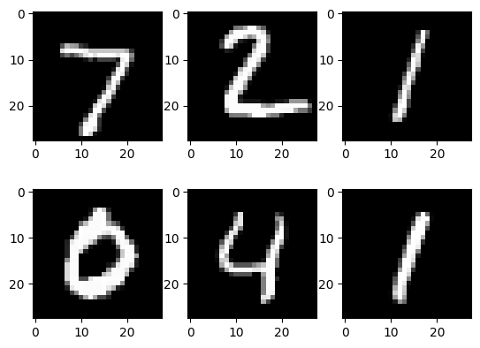

<!-- editorlm-hebrew-html-start -->
<style>
html, body, .vscode-body, .markdown-body, .markdown-preview, #write {
  direction: rtl !important; text-align: right !important;
}
ul, ol { padding-right: 2em !important; padding-left: 0 !important; }
blockquote { border-right: 3px solid #999; border-left: 0; padding-right: 1rem; padding-left: 0; }
@media print {
  html, body, .vscode-body, .markdown-body, .markdown-preview, #write {
    direction: rtl !important; text-align: right !important;
  }
}
</style>
<!-- editorlm-hebrew-html-end -->
<style>
.book { max-width: 900px; margin: auto; line-height: 1.8; font-family: Arial, sans-serif; }
.book .cover { min-height: 680px; box-sizing: border-box; padding: 64px 48px; margin: 24px 0 60px; background: #112b41; color: #f5f8fc; border-top: 9px solid #39c4b5; position: relative; }
.book .cover .eyebrow { color: #81e0d5; font-size: 15px; letter-spacing: 2px; }
.book .cover h1 { color: #fff; font-size: 48px; line-height: 1.3; border: 0; margin: 50px 0 18px; }
.book .cover .subtitle { font-size: 28px; color: #d8e6f0; }
.book .cover .author { font-size: 30px; color: #fff; margin-top: 52px; }
.book .cover .audience { color: #c1d3df; margin-top: 12px; }
.book .cover .motif { direction: ltr; text-align: left; font-family: Consolas, monospace; color: #81e0d5; font-size: 19px; margin-top: 54px; }
.book h1, .book h2, .book h3 { line-height: 1.4; font-weight: 700; }
.book > h1 { font-size: 32px !important; text-align: center !important; margin: 28px 0; }
.book h2 { font-size: 34px !important; text-align: center !important; color: #153b56 !important; background: #eef5fc; border: 0; border-bottom: 4px solid #299c91; border-radius: 10px 10px 0 0; padding: 28px 20px; margin: 24px 0 36px; }
.book h3 { font-size: 24px !important; text-align: right !important; color: #174e49 !important; background: #edf7f5; border: 0; border-right: 5px solid #299c91; border-radius: 6px; padding: 10px 16px; margin: 36px 0 18px; }
.book .chapter { height: 0; margin: 76px 0 0; border-top: 1px solid #ccd7df; break-before: page; page-break-before: always; break-after: avoid; page-break-after: avoid; }
.book .toc { padding: 24px; border-right: 5px solid #39a99d; background: rgba(70,150,155,.09); margin: 24px 0 48px; }
.book pre, .book pre code { direction: ltr !important; text-align: left !important; unicode-bidi: isolate; }
.book pre { box-sizing: border-box !important; width: 100% !important; max-width: 100% !important; margin: 0 !important; padding: 16px 20px; border: 1px solid #ccd7df; border-radius: 8px; line-height: 1.6; overflow-x: auto; }
.book code { direction: ltr; unicode-bidi: isolate; font-family: Consolas, "Courier New", monospace; }
.book pre { background: #f3f6fa !important; color: #1f2937 !important; }
.book pre code, .book pre code.hljs { background: transparent !important; color: #1f2937 !important; }
.book pre .hljs-keyword, .book pre .hljs-literal { color: #6f299c !important; }
.book pre .hljs-string { color: #216338 !important; }
.book pre .hljs-number { color: #075e68 !important; }
.book pre .hljs-comment { color: #526174 !important; }
.book pre .hljs-built_in, .book pre .hljs-title { color: #135b96 !important; }
.book table { width: 100%; }
.book th, .book td { text-align: right; }
.book .small { font-size: .9em; opacity: .8; }
.book .python-intro { display: flex; align-items: center; gap: 28px; padding: 22px 28px; margin: 24px 0; background: #eef5fc; color: #183e63; border-right: 6px solid #3776ab; border-radius: 10px; }
.book .python-intro strong { font-size: 30px; }
.book .python-fact { background: #fff7d6; color: #423611; border-right: 6px solid #ffd343; border-radius: 8px; padding: 18px 24px; margin: 22px 0; }
.book .python-fact strong { font-size: 24px; }
.book img { max-width: 100%; height: auto; }
.book figure { margin: 24px auto; text-align: center; }
.book figure img { display: block; margin: auto; }
.book figcaption { direction: rtl; text-align: center; font-size: .9em; color: #445566; }
@media print { .book > h2 { break-before: page; page-break-before: always; } }
.book .screen-strip { width: 760px; max-width: 100%; height: 220px; overflow: hidden; border: 1px solid #bccad5; border-radius: 8px; margin: 20px auto 8px; direction: ltr; }
.book .screen-strip.output { height: 265px; }
.book .screen-strip img { display: block; width: 1745px; max-width: none; }
.book .screen-menu { width: 400px; max-width: 100%; height: 295px; overflow: hidden; direction: ltr; margin: 20px auto 8px; border: 1px solid #bccad5; border-radius: 8px; }
.book .screen-menu img { display: block; width: 1745px; max-width: none; }
.book .code-panel { box-sizing: border-box !important; display: block !important; width: 75% !important; max-width: 75% !important; margin: 18px auto !important; }
@media print {
  .book .cover { min-height: 85vh; break-after: page; print-color-adjust: exact; -webkit-print-color-adjust: exact; }
  .book pre { white-space: pre-wrap; break-inside: avoid; }
  .book .chapter { margin: 0; border: 0; }
  .book h1, .book h2, .book h3 { break-after: avoid; page-break-after: avoid; break-inside: avoid; }
  .book h2 { margin-top: 0; }
  .book h2, .book h3 { print-color-adjust: exact; -webkit-print-color-adjust: exact; }
}
</style>

<style>
.book .book-nav { display: flex; flex-wrap: wrap; gap: 10px; justify-content: center; align-items: center; padding: 16px 0; margin: 20px 0 32px; border-top: 1px solid #ccd7df; border-bottom: 1px solid #ccd7df; }
.book .book-nav a { display: inline-block; padding: 10px 18px; border-radius: 8px; background: #eef5fc; color: #153b56 !important; border: 1px solid #b5ccd9; text-decoration: none !important; font-size: 16px; font-weight: bold; }
.book .book-nav a.toc-link { background: #174e49; color: #fff !important; border-color: #174e49; }
.book .book-nav a:hover, .book .book-nav a:focus { background: #d4eee8; color: #153b56 !important; outline: 2px solid #299c91; outline-offset: 2px; }
.book .section-list { line-height: 2; }
@media print { .book .book-nav { display: none; } }

/* Explicit Hebrew direction, including prose beginning with English. */
.book p, .book ul, .book ol, .book li,
.book blockquote, .book h1, .book h2, .book h3,
.book h4, .book th, .book td {
  direction: rtl !important;
  text-align: right !important;
  unicode-bidi: isolate;
}
/* Chapter titles keep their agreed centered layout. */
.book h2 { text-align: center !important; }
.book pre, .book pre code, .book .code-panel {
  direction: ltr !important;
  text-align: left !important;
  unicode-bidi: isolate;
}
</style>

<div class="book" dir="rtl" lang="he" style="direction: rtl !important; text-align: right !important;">

<nav class="book-nav" aria-label="ניווט בספר">
<a href="19-Pima%20-%20%D7%A8%D7%A9%D7%AA%20%D7%9C%D7%98%D7%91%D7%9C%D7%94.md">→ הקודם</a>
<a class="toc-link" href="../index.md">תוכן העניינים</a>
<a href="21-%D7%A8%D7%A9%D7%AA%D7%95%D7%AA%20%D7%A7%D7%95%D7%A0%D7%91%D7%95%D7%9C%D7%95%D7%A6%D7%99%D7%94.md">הבא ←</a>
</nav>

## ג.20 שמירה וטעינה של מודלים

בכל הפרקים עד כה אימנו רשת, בדקנו אותה — וברגע שסגרנו את המחברת, כל מה שהיא למדה נעלם. בפעם הבאה היה צריך לאמן מחדש מאפס. באימונים קצרים של כמה שניות זה לא מפריע, אבל מודלים אמיתיים מתאמנים שעות או ימים על מחשבים יקרים, ואף אחד לא מאמן אותם מחדש בכל פעם שרוצים לזהות תמונה. גם המשחק שנבנה בהמשך הספר יצטרך "מוח" מאומן שנטען מקובץ, ולא רשת שמתחילה ללמוד בכל הפעלה.

מה בעצם צריך לשמור? כל הידע שהרשת רכשה באימון נמצא בפרמטרים שלה — המשקלים וההטיות של כל שכבה. מבנה הרשת, לעומת זאת, כתוב בקוד שלנו. לכן יש שתי אפשרויות: לשמור את אובייקט המודל כולו, מבנה ופרמטרים יחד, או לשמור את הפרמטרים בלבד ולבנות את המבנה מחדש מהקוד בזמן הטעינה. הדרך השנייה נפוצה יותר בפועל, ונראה בהמשך מדוע.

לאחר אימון נרצה לשמור את המודל כדי להשתמש בו בהמשך בלי לאמן אותו מחדש. נלמד שתי דרכים: שמירת המודל כולו ושמירת הפרמטרים בלבד. כדי שיהיה לנו מה לשמור, נאמן תחילה רשת קטנה לסיווג עשר הספרות של MNIST, כפי שעשינו בפרק ג.17, ונוודא שהמודל שנטען מקובץ נותן את אותן תחזיות כמו המודל המקורי.

**[השיעור וההרצאות באתר של גלעד מרקמן](https://webprogramming.azurewebsites.net/Pages/PyTorch/Save_Load_Model.aspx)**

[פתיחת מחברת Colab](https://colab.research.google.com/drive/1TiUZz2nB2WrFiKWyXJK_AT-l8W0NUhy7?usp=sharing)

**חומרי הליווי:** [מצגת שמירה וטעינה](../../../sources/ML/10.%D7%A9%D7%9E%D7%99%D7%A8%D7%94%20%D7%95%D7%98%D7%A2%D7%99%D7%A0%D7%94%20%D7%A9%D7%9C%20%D7%9E%D7%95%D7%93%D7%9C%D7%99%D7%9D.pptx) · [מחברת שמירה וטעינה](../../../sources/ML/Colab/10_Model_Save.ipynb)

<!-- editorlm-source-ref: [sources/ML/pdf/10.שמירה וטעינה של מודלים.pdf#L8-L17] -->

### הכנת הנתונים והרשת

נכין מודל ודוגמאות אימון שישמשו להדגמת השמירה והטעינה. החלק הזה של הפרק אינו חדש: הוא חוזר על בניית רשת לסיווג ספרות MNIST שכבר הכרנו, ולכן נעבור עליו בקצרה. החידוש מתחיל בסעיף "שמירת המודל כולו".

נייבא את הספריות. הפעם נשתמש גם ב־`torch.nn.functional`, שמאפשר להפעיל את ReLU כפונקציה בתוך `forward` במקום להגדיר אותה כשכבה:

<div class="code-panel" dir="ltr">

```python
import torch
import torch.nn as nn
import torch.nn.functional as F
import numpy as np
import matplotlib.pyplot as plt
import torchvision
import torchvision.transforms as transforms
```

</div>

<!-- editorlm-source-ref: [sources/ML/converted/10_Model_Save/notebook.md#L25-L36] -->

נבחר התקן חישוב: מעבד גרפי (GPU) אם הוא זמין, ואחרת המעבד הרגיל:

<div class="code-panel" dir="ltr">

```python
if torch.cuda.is_available():
    device = torch.device('cuda')
else:
    device = torch.device('cpu')
```

</div>

<!-- editorlm-source-ref: [sources/ML/converted/10_Model_Save/notebook.md#L41-L49] -->

נטען את MNIST — קבוצת אימון וקבוצת בדיקה — וניצור באמצעות DataLoader אצוות של 50 תמונות. את קבוצת האימון נערבב, ואת קבוצת הבדיקה נשאיר בסדרה המקורי, כדי שאותה אצווה ראשונה תשמש אותנו להשוואה לפני השמירה ואחרי הטעינה:

<div class="code-panel" dir="ltr">

```python
batch_size = 50

train_dataset = torchvision.datasets.MNIST(root='./data',
                                           train=True,
                                           transform=transforms.ToTensor(),
                                           download=True)

test_dataset = torchvision.datasets.MNIST(root='./data',
                                          train=False,
                                          transform=transforms.ToTensor())

# Data loader
train_loader = torch.utils.data.DataLoader(dataset=train_dataset,
                                           batch_size=batch_size,
                                           shuffle=True)

test_loader = torch.utils.data.DataLoader(dataset=test_dataset,
                                          batch_size=batch_size,
                                          shuffle=False)
```

</div>

<!-- editorlm-source-ref: [sources/ML/converted/10_Model_Save/notebook.md#L58-L92] -->

נציג שש תמונות מהאצווה הראשונה של הבדיקה ואת התוויות שלהן, רק כדי לראות עם מה אנחנו עובדים:

<div class="code-panel" dir="ltr">

```python
examples = iter(test_loader)
example_data, example_targets = next(examples)

for i in range(6):
    plt.subplot(2,3,i+1)
    plt.imshow(example_data[i][0], cmap='gray')
    print(example_targets[i].item(),end = " ")
plt.show()
```

</div>

**פלט**

<div class="code-panel" dir="ltr">

```text
7 2 1 0 4 1
```

</div>

<figure>

<figcaption>הספרות 7, 2, 1, 0, 4, 1 מתוך נתוני הבדיקה.</figcaption>
</figure>

<!-- editorlm-source-ref: [sources/ML/converted/10_Model_Save/notebook.md#L93-L122] -->

נגדיר את הפרמטרים של הרשת והאימון: 784 קלטים (28×28 פיקסלים), שכבה נסתרת של 200 נוירונים, עשרה פלטים — אחד לכל ספרה — ושתי תקופות אימון בקצב למידה 0.01. שתי תקופות מספיקות כאן, כי המטרה היא רק מודל סביר להדגמת השמירה, לא מודל מושלם:

<div class="code-panel" dir="ltr">

```python
input_size = 784 # 28x28
hidden_size = 200
num_classes = 10
epochs = 2
learning_rate = 0.01
# losses = torch.zeros(epochs*len(train_loader)//10)
```

</div>

<!-- editorlm-source-ref: [sources/ML/converted/10_Model_Save/notebook.md#L131-L141] -->

נגדיר את מחלקת הרשת `ANN_Model`, עם ReLU אחרי השכבה הראשונה. השורות בהערה מראות שאפשר היה לבנות אותה רשת גם ב־`nn.Sequential`, אך המחלקה חשובה לנו במיוחד בפרק זה: כשנטען מודל מקובץ, ההגדרה שלה תצטרך להיות זמינה בקוד:

<div class="code-panel" dir="ltr">

```python
# Model = nn.Sequential(
#     nn.Linear(input_size,hidden_size,device=device),
#     nn.ReLU(),
#     nn.Linear(hidden_size, num_classes, device=device),
# )

class ANN_Model(nn.Module):
    def __init__(self):
        super().__init__()
        self.linear1 = nn.Linear(input_size,hidden_size,device=device)
        self.linear2 = nn.Linear(hidden_size, num_classes, device=device)

    def forward(self, x):
        x = self.linear1(x)
        x = F.relu(x)
        x = self.linear2(x)
        return x

Model = ANN_Model().to(device)
```

</div>

<!-- editorlm-source-ref: [sources/ML/converted/10_Model_Save/notebook.md#L148-L173] -->

נגדיר את פונקציית ההפסד CrossEntropyLoss, המתאימה לסיווג לעשר קטגוריות ומפעילה בעצמה Softmax על הפלט, ואת האופטימייזר Adam:

<div class="code-panel" dir="ltr">

```python
# Loss = nn.MSELoss()
# Loss = nn.BCELoss()
Loss = nn.CrossEntropyLoss () # applies nn.LogSoftmax + nn.NLLLoss, No softmax in last layer

# init optimizer
# optim = torch.optim.SGD(Model.parameters(), lr=learning_rate,momentum=0.9)
optim = torch.optim.Adam(Model.parameters(), lr=learning_rate)
```

</div>

<!-- editorlm-source-ref: [sources/ML/converted/10_Model_Save/notebook.md#L178-L191] -->

### אימון המודל

נאמן את הרשת באצוות, בלולאה שהכרנו: בכל אצווה נשטח את התמונות לווקטורים של 784 ערכים, נעביר אותן ואת התוויות להתקן, נחשב פלט והפסד, נחשב נגזרות, נעדכן משקלים ונאפס את הגרדיאנטים. כל 100 אצוות נדפיס את ההפסד:

<div class="code-panel" dir="ltr">

```python
n_total_steps = len(train_loader)

for epoch in range(epochs):
    for i, (images, lables) in enumerate(train_loader):

        # origin shape: [50, 1, 28, 28]
        # resized: [50, 784]
        images = images.reshape(-1, 28*28).to(device)
        lables = lables.to(device)

        # forward
        Y_predict = Model(images)

        # backward
        loss = Loss(Y_predict, lables)
        loss.backward()

        # update wights
        optim.step()

        if i % 100 == 0:
            print(f"epoch= {epoch} i= {i+epoch * n_total_steps} loss={loss.item():.4f} ")

        # zero grads
        optim.zero_grad()
```

</div>

תחילת הפלט וסופו, בדילוג על שורות הביניים:

**פלט**

<div class="code-panel" dir="ltr">

```text
epoch= 0 i= 0 loss=2.3142 
epoch= 0 i= 100 loss=0.3428 
...
epoch= 1 i= 2300 loss=0.2180
```

</div>

ההפסד ההתחלתי, כ־2.3, הוא הערך הצפוי מרשת שעדיין אינה יודעת דבר ומחלקת את ההסתברות שווה בשווה בין עשר ספרות (ln 10 ≈ 2.3). כבר אחרי 100 אצוות הוא יורד ל־0.34, ובסוף התקופה השנייה הוא סביב 0.22.

<!-- editorlm-source-ref: [sources/ML/converted/10_Model_Save/notebook.md#L206-L265] -->

### בדיקת המודל לפני השמירה

לפני שנשמור את המודל נמדוד את ביצועיו, כדי שיהיה לנו למה להשוות אחרי הטעינה. נחשב את אחוז התחזיות הנכונות על קבוצת הבדיקה; `torch.max` על ציר 1 מחזיר לכל תמונה את הציון הגבוה ביותר ואת מיקומו, והמיקום הוא הספרה שהרשת בחרה:

<div class="code-panel" dir="ltr">

```python
with torch.no_grad():
    n_correct = 0
    n_samples = 0
    for images, lables in test_loader:
        images = images.reshape(-1, 28*28).to(device)
        lables = lables.to(device)
        __,y_predict = torch.max(Model(images),1)
        n_samples += lables.size(0)
        n_correct += (y_predict == lables).sum().item()

    acc = 100 * n_correct / n_samples
    print(f'Accuracy of the network on the {n_samples} test images: {acc} %')
```

</div>

**פלט**

<div class="code-panel" dir="ltr">

```text
Accuracy of the network on the 10000 test images: 96.01 %
```

</div>

המודל מזהה נכון כ־96% מ־10,000 תמונות הבדיקה. את המספר הזה נרצה לקבל גם מהמודל שנטען מקובץ.

<!-- editorlm-source-ref: [sources/ML/converted/10_Model_Save/notebook.md#L270-L295] -->

נציג תחזיות ותוויות מאצוות הבדיקה הראשונה, 50 התמונות. רשימה זו תשמש אותנו כ"טביעת אצבע" של המודל: אם המודל שנטען יחזיר בדיוק את אותן תחזיות, נדע שהשמירה והטעינה הצליחו:

<div class="code-panel" dir="ltr">

```python
examples = iter(test_loader)
example_data, example_targets = next(examples)
example_data = example_data.to(device)
example_targets = example_targets.to(device)
_, example_predict_arg = torch.max(Model(example_data.reshape(-1, 28*28)),1)
# print(example_predict_arg)
for i in range(len(example_data)):
    print ("Predict: ",example_predict_arg[i].item(), "target Label: ",example_targets[i].item() )
```

</div>

**פלט**

<div class="code-panel" dir="ltr">

```text
Predict:  7 target Label:  7
Predict:  2 target Label:  2
Predict:  1 target Label:  1
Predict:  0 target Label:  0
Predict:  4 target Label:  4
Predict:  1 target Label:  1
Predict:  4 target Label:  4
Predict:  9 target Label:  9
Predict:  6 target Label:  5
Predict:  9 target Label:  9
Predict:  0 target Label:  0
Predict:  6 target Label:  6
Predict:  9 target Label:  9
Predict:  0 target Label:  0
Predict:  1 target Label:  1
Predict:  5 target Label:  5
Predict:  9 target Label:  9
Predict:  7 target Label:  7
Predict:  8 target Label:  3
Predict:  4 target Label:  4
Predict:  9 target Label:  9
Predict:  6 target Label:  6
Predict:  6 target Label:  6
Predict:  5 target Label:  5
Predict:  4 target Label:  4
Predict:  0 target Label:  0
Predict:  7 target Label:  7
Predict:  4 target Label:  4
Predict:  0 target Label:  0
Predict:  1 target Label:  1
Predict:  3 target Label:  3
Predict:  1 target Label:  1
Predict:  3 target Label:  3
Predict:  4 target Label:  4
Predict:  7 target Label:  7
Predict:  2 target Label:  2
Predict:  7 target Label:  7
Predict:  1 target Label:  1
Predict:  2 target Label:  2
Predict:  1 target Label:  1
Predict:  1 target Label:  1
Predict:  7 target Label:  7
Predict:  4 target Label:  4
Predict:  2 target Label:  2
Predict:  3 target Label:  3
Predict:  5 target Label:  5
Predict:  1 target Label:  1
Predict:  2 target Label:  2
Predict:  4 target Label:  4
Predict:  4 target Label:  4
```

</div>

ברוב השורות התחזית תואמת את התווית; אפשר למצוא ברשימה שתי טעויות, למשל 5 שזוהה כ־6 ו־3 שזוהה כ־8. גם הטעויות האלה הן חלק מ"טביעת האצבע" — מודל שנטען נכון יטעה בדיוק באותם מקומות.

<!-- editorlm-source-ref: [sources/ML/converted/10_Model_Save/notebook.md#L296-L366] -->

### שמירת המודל כולו

הדרך הפשוטה ביותר היא לשמור את אובייקט המודל כפי שהוא: `torch.save` מקבלת את המודל ושם קובץ, ורושמת לדיסק את האובייקט כולו — אילו שכבות יש בו ומהם הפרמטרים של כל אחת. הסיומת `.pth` מקובלת לקובצי PyTorch. נשמור את אובייקט המודל המאומן בקובץ:

<div class="code-panel" dir="ltr">

```python
File = "MINST_Model.pth"
torch.save (Model, File)
```

</div>

<!-- editorlm-source-ref: [sources/ML/converted/10_Model_Save/notebook.md#L375-L381] -->

כעת נעשה את הפעולה ההפוכה: `torch.load` קוראת את הקובץ ומחזירה אובייקט מודל חדש, `new_model`, שמכיל את אותם פרמטרים מאומנים. נעביר אותו למצב הערכה באמצעות `eval()`, כפי שעושים תמיד לפני חיזוי. שימו לב לשתי נקודות. ראשית, הקובץ מכיל את הפרמטרים ואת שמות השכבות, אך לא את הקוד של המחלקה עצמה, ולכן ההגדרה של `ANN_Model` צריכה להיות זמינה בעת הטעינה — אם נטען את הקובץ במחברת אחרת בלי להגדיר בה את המחלקה, הטעינה תיכשל. שנית, `weights_only=False` מאפשרת טעינת אובייקט מלא; משתמשים בה רק לקובץ ששמרנו בעצמנו או שמקורו מהימן, משום שטעינה כזו יכולה להפעיל קוד שנמצא בקובץ.

<div class="code-panel" dir="ltr">

```python
new_model = torch.load(File, weights_only=False)
new_model.eval()
```

</div>

<!-- editorlm-source-ref: [sources/ML/converted/10_Model_Save/notebook.md#L386-L423] -->

### הפעלת המודל שנטען

נבדוק שהמודל שנטען יכול לשמש לחיזוי, בלי שאימנו אותו אפילו צעד אחד. נחשב תחזיות באמצעות `new_model` על אותה אצווה ראשונה של הבדיקה; הפלט אמור להיות זהה לרשימת התחזיות שקיבלנו מ־`Model` לפני השמירה:

<div class="code-panel" dir="ltr">

```python
examples = iter(test_loader)
example_data, example_targets = next(examples)
example_data = example_data.to(device)
example_targets = example_targets.to(device)
_, example_predict_arg = torch.max(new_model(example_data.reshape(-1, 28*28)),1)
# print(example_predict_arg)
for i in range(len(example_data)):
    print ("Predict: ",example_predict_arg[i].item(), "target Label: ",example_targets[i].item() )
```

</div>

<!-- editorlm-source-ref: [sources/ML/converted/10_Model_Save/notebook.md#L428-L440] -->

### שמירת הפרמטרים בלבד

הדרך השנייה, המומלצת בתיעוד של PyTorch, מפרידה בין שני הדברים: מבנה הרשת נשאר בקוד, ולקובץ נשמרים רק הערכים שנלמדו. כך הקובץ קטן יותר, אינו תלוי בגרסת הקוד המדויקת שבה נוצר, וטעינתו בטוחה יותר. הפעולה `state_dict()` מחזירה **מילון מצב — state_dict**: מילון שבו לכל שכבה יש מפתחות כמו `linear1.weight` ו־`linear1.bias`, והערכים הם טנסורי המשקלים וההטיות. נשמור אותו בנפרד:

<div class="code-panel" dir="ltr">

```python
FILE2 = "model2.pth"
torch.save(Model.state_dict(), FILE2)
```

</div>

<!-- editorlm-source-ref: [sources/ML/converted/10_Model_Save/notebook.md#L449-L455] -->

בטעינה עלינו לבנות תחילה "שלד" — ניצור רשת חדשה מאותה מחלקה, עם משקלים אקראיים. אחר כך נטען את המילון מהקובץ ונעביר את הפרמטרים לרשת באמצעות `load_state_dict`, שמתאימה כל ערך במילון לשכבה בעלת אותו שם. מכאן ואילך `new_model2` זהה למודל המאומן:

<div class="code-panel" dir="ltr">

```python
new_model2 = ANN_Model().to(device)
state_dict = torch.load(FILE2)
new_model2.load_state_dict(state_dict)
new_model2.eval()
```

</div>

<!-- editorlm-source-ref: [sources/ML/converted/10_Model_Save/notebook.md#L460-L468] -->

נפעיל את `new_model2` על אצוות הבדיקה הראשונה, ונצפה שוב לאותן תחזיות בדיוק:

<div class="code-panel" dir="ltr">

```python
examples = iter(test_loader)
example_data, example_targets = next(examples)
example_data = example_data.to(device)
example_targets = example_targets.to(device)
_, example_predict_arg = torch.max(new_model2(example_data.reshape(-1, 28*28)),1)
# print(example_predict_arg)
for i in range(len(example_data)):
    print ("Predict: ",example_predict_arg[i].item(), "target Label: ",example_targets[i].item() )
```

</div>

<!-- editorlm-source-ref: [sources/ML/converted/10_Model_Save/notebook.md#L473-L485] -->

### שמירה ב־Google Drive

נשארה בעיה מעשית אחת. הקבצים בסביבת הריצה של Colab זמניים: כשהמחברת נסגרת או שסביבת הריצה מתאפסת, `MINST_Model.pth` ו־`model2.pth` נמחקים יחד איתה, ואיבדנו את מה ששמרנו. לשמירה מתמשכת מחברים את Drive באמצעות אייקון Mount Drive בתפריט הקבצים, ומוודאים שהתיקייה `Colab Notebooks/Models` קיימת ב־MyDrive לפני השמירה:

<div class="code-panel" dir="ltr">

```python
FILE3 = "/content/drive/MyDrive/Colab Notebooks/Models/model2.pth"
torch.save(Model, FILE3)
```

</div>

הפקודה כאן שומרת את המודל כולו, משום שנמסר לה `Model`, למרות שם הקובץ `model2.pth`. ההבדל בין שתי הדרכים אינו בשם הקובץ אלא במה שמעבירים ל־`torch.save`: האובייקט עצמו או המילון שמחזירה `state_dict()`. את הקובץ ששמרנו ב־Drive נוכל לטעון בכל מחברת עתידית, וכך "המוח" המאומן ילווה אותנו הלאה — גם למשחקים שנבנה בחלק ד.

<!-- editorlm-source-ref: [sources/ML/converted/10_Model_Save/notebook.md#L502-L508] -->


<nav class="book-nav" aria-label="ניווט בספר">
<a href="19-Pima%20-%20%D7%A8%D7%A9%D7%AA%20%D7%9C%D7%98%D7%91%D7%9C%D7%94.md">→ הקודם</a>
<a class="toc-link" href="../index.md">תוכן העניינים</a>
<a href="21-%D7%A8%D7%A9%D7%AA%D7%95%D7%AA%20%D7%A7%D7%95%D7%A0%D7%91%D7%95%D7%9C%D7%95%D7%A6%D7%99%D7%94.md">הבא ←</a>
</nav>

</div>

<!-- editorlm-source-versions: {"schemaVersion":1,"sources":{"sources/ML/converted/10_Model_Save/notebook.md":{"sourceSha256":"829a2a83c1cdea059c2ef5e282e0fe40784141aee079625a0a4bd14e0dbcf85e","canonicalTextSha256":"829a2a83c1cdea059c2ef5e282e0fe40784141aee079625a0a4bd14e0dbcf85e"},"sources/ML/pdf/10.שמירה וטעינה של מודלים.pdf":{"sourceSha256":"65e7117a0c65cc055660750e7e5d3da73b6eaeb10838210fed8a211dd29b325f","canonicalTextSha256":"30d18b5ab6ea154e27087b03645a23134020d30c0a61ce2e2316b41b1caa6969"}}} -->
