<!-- editorlm-hebrew-html-start -->
<style>
html, body, .vscode-body, .markdown-body, .markdown-preview, #write {
  direction: rtl !important; text-align: right !important;
}
ul, ol { padding-right: 2em !important; padding-left: 0 !important; }
blockquote { border-right: 3px solid #999; border-left: 0; padding-right: 1rem; padding-left: 0; }
@media print {
  html, body, .vscode-body, .markdown-body, .markdown-preview, #write {
    direction: rtl !important; text-align: right !important;
  }
}
</style>
<!-- editorlm-hebrew-html-end -->
<style>
.book { max-width: 900px; margin: auto; line-height: 1.8; font-family: Arial, sans-serif; }
.book .cover { min-height: 680px; box-sizing: border-box; padding: 64px 48px; margin: 24px 0 60px; background: #112b41; color: #f5f8fc; border-top: 9px solid #39c4b5; position: relative; }
.book .cover .eyebrow { color: #81e0d5; font-size: 15px; letter-spacing: 2px; }
.book .cover h1 { color: #fff; font-size: 48px; line-height: 1.3; border: 0; margin: 50px 0 18px; }
.book .cover .subtitle { font-size: 28px; color: #d8e6f0; }
.book .cover .author { font-size: 30px; color: #fff; margin-top: 52px; }
.book .cover .audience { color: #c1d3df; margin-top: 12px; }
.book .cover .motif { direction: ltr; text-align: left; font-family: Consolas, monospace; color: #81e0d5; font-size: 19px; margin-top: 54px; }
.book h1, .book h2, .book h3 { line-height: 1.4; font-weight: 700; }
.book > h1 { font-size: 32px !important; text-align: center !important; margin: 28px 0; }
.book h2 { font-size: 34px !important; text-align: center !important; color: #153b56 !important; background: #eef5fc; border: 0; border-bottom: 4px solid #299c91; border-radius: 10px 10px 0 0; padding: 28px 20px; margin: 24px 0 36px; }
.book h3 { font-size: 24px !important; text-align: right !important; color: #174e49 !important; background: #edf7f5; border: 0; border-right: 5px solid #299c91; border-radius: 6px; padding: 10px 16px; margin: 36px 0 18px; }
.book .chapter { height: 0; margin: 76px 0 0; border-top: 1px solid #ccd7df; break-before: page; page-break-before: always; break-after: avoid; page-break-after: avoid; }
.book .toc { padding: 24px; border-right: 5px solid #39a99d; background: rgba(70,150,155,.09); margin: 24px 0 48px; }
.book pre, .book pre code { direction: ltr !important; text-align: left !important; unicode-bidi: isolate; }
.book pre { box-sizing: border-box !important; width: 100% !important; max-width: 100% !important; margin: 0 !important; padding: 16px 20px; border: 1px solid #ccd7df; border-radius: 8px; line-height: 1.6; overflow-x: auto; }
.book code { direction: ltr; unicode-bidi: isolate; font-family: Consolas, "Courier New", monospace; }
.book pre { background: #f3f6fa !important; color: #1f2937 !important; }
.book pre code, .book pre code.hljs { background: transparent !important; color: #1f2937 !important; }
.book pre .hljs-keyword, .book pre .hljs-literal { color: #6f299c !important; }
.book pre .hljs-string { color: #216338 !important; }
.book pre .hljs-number { color: #075e68 !important; }
.book pre .hljs-comment { color: #526174 !important; }
.book pre .hljs-built_in, .book pre .hljs-title { color: #135b96 !important; }
.book table { width: 100%; }
.book th, .book td { text-align: right; }
.book .small { font-size: .9em; opacity: .8; }
.book .python-intro { display: flex; align-items: center; gap: 28px; padding: 22px 28px; margin: 24px 0; background: #eef5fc; color: #183e63; border-right: 6px solid #3776ab; border-radius: 10px; }
.book .python-intro strong { font-size: 30px; }
.book .python-fact { background: #fff7d6; color: #423611; border-right: 6px solid #ffd343; border-radius: 8px; padding: 18px 24px; margin: 22px 0; }
.book .python-fact strong { font-size: 24px; }
.book img { max-width: 100%; height: auto; }
.book figure { margin: 24px auto; text-align: center; }
.book figure img { display: block; margin: auto; }
.book figcaption { direction: rtl; text-align: center; font-size: .9em; color: #445566; }
@media print { .book > h2 { break-before: page; page-break-before: always; } }
.book .screen-strip { width: 760px; max-width: 100%; height: 220px; overflow: hidden; border: 1px solid #bccad5; border-radius: 8px; margin: 20px auto 8px; direction: ltr; }
.book .screen-strip.output { height: 265px; }
.book .screen-strip img { display: block; width: 1745px; max-width: none; }
.book .screen-menu { width: 400px; max-width: 100%; height: 295px; overflow: hidden; direction: ltr; margin: 20px auto 8px; border: 1px solid #bccad5; border-radius: 8px; }
.book .screen-menu img { display: block; width: 1745px; max-width: none; }
.book .code-panel { box-sizing: border-box !important; display: block !important; width: 75% !important; max-width: 75% !important; margin: 18px auto !important; }
@media print {
  .book .cover { min-height: 85vh; break-after: page; print-color-adjust: exact; -webkit-print-color-adjust: exact; }
  .book pre { white-space: pre-wrap; break-inside: avoid; }
  .book .chapter { margin: 0; border: 0; }
  .book h1, .book h2, .book h3 { break-after: avoid; page-break-after: avoid; break-inside: avoid; }
  .book h2 { margin-top: 0; }
  .book h2, .book h3 { print-color-adjust: exact; -webkit-print-color-adjust: exact; }
}
</style>

<style>
.book .book-nav { display: flex; flex-wrap: wrap; gap: 10px; justify-content: center; align-items: center; padding: 16px 0; margin: 20px 0 32px; border-top: 1px solid #ccd7df; border-bottom: 1px solid #ccd7df; }
.book .book-nav a { display: inline-block; padding: 10px 18px; border-radius: 8px; background: #eef5fc; color: #153b56 !important; border: 1px solid #b5ccd9; text-decoration: none !important; font-size: 16px; font-weight: bold; }
.book .book-nav a.toc-link { background: #174e49; color: #fff !important; border-color: #174e49; }
.book .book-nav a:hover, .book .book-nav a:focus { background: #d4eee8; color: #153b56 !important; outline: 2px solid #299c91; outline-offset: 2px; }
.book .section-list { line-height: 2; }
@media print { .book .book-nav { display: none; } }

/* Explicit Hebrew direction, including prose beginning with English. */
.book p, .book ul, .book ol, .book li,
.book blockquote, .book h1, .book h2, .book h3,
.book h4, .book th, .book td {
  direction: rtl !important;
  text-align: right !important;
  unicode-bidi: isolate;
}
/* Chapter titles keep their agreed centered layout. */
.book h2 { text-align: center !important; }
.book pre, .book pre code, .book .code-panel {
  direction: ltr !important;
  text-align: left !important;
  unicode-bidi: isolate;
}
</style>

<div class="book" dir="rtl" lang="he" style="direction: rtl !important; text-align: right !important;">

<nav class="book-nav" aria-label="ניווט בספר">
<a href="20-%D7%A9%D7%9E%D7%99%D7%A8%D7%94%20%D7%95%D7%98%D7%A2%D7%99%D7%A0%D7%94.md">→ הקודם</a>
<a class="toc-link" href="../index.md">תוכן העניינים</a>
<a href="22-%D7%97%D7%AA%D7%95%D7%9C%20%D7%90%D7%95%20%D7%9C%D7%90%20%D7%97%D7%AA%D7%95%D7%9C.md">הבא ←</a>
</nav>

## ג.21 רשתות קונבולוציה — CNN ו־CIFAR-10

רשת CNN היא רשת נוירונים המבצעת קונבולוציה ומשמשת בעיקר לעיבוד תמונות. היא מתחילה בשכבות קונבולוציה וממשיכה ברשת נוירונים רגילה; לפני שנכיר את הפעולה, נכיר את ייצוג התמונה בזיכרון.

<figure>
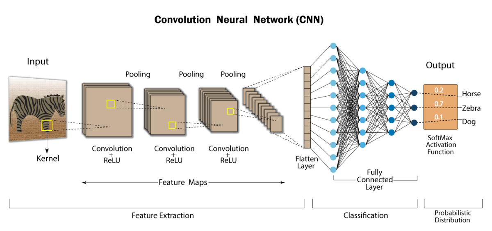
<figcaption>מתמונת הקלט אל פלט הסיווג.</figcaption>
</figure>

<!-- editorlm-source-ref: [sources/ML/pdf/11.רשתות קונבולוציה.pdf#L8-L12] -->

**[השיעור וההרצאות באתר של גלעד מרקמן](https://webprogramming.azurewebsites.net/Pages/PyTorch/CNN.aspx)**

[פתיחת מחברת Colab](https://colab.research.google.com/drive/1xZoGACtS3LGqwTJl4fUedoVM35GOGY8B?usp=sharing)

**חומרי הליווי:** [מצגת רשתות קונבולוציה](../../../sources/ML/11.%D7%A8%D7%A9%D7%AA%D7%95%D7%AA%20%D7%A7%D7%95%D7%A0%D7%91%D7%95%D7%9C%D7%95%D7%A6%D7%99%D7%94.pptx) · [מחברת CIFAR-10](../../../sources/ML/Colab/11_CNN_CIFAR10.ipynb)

### ייצוג תמונה בזיכרון

תמונה מיוצגת כמטריצה של פיקסלים, וממדי המטריצה הם הרזולוציה שלה. בתמונה בינארית הערכים הם 0 או 1; בתמונת גוני אפור של 8 סיביות הערכים הם 0–255, משחור ללבן.

<figure>
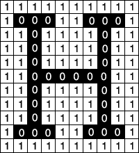
<figcaption>תמונה בינארית: 0 בשחור ו־1 בלבן.</figcaption>
</figure>

<figure>
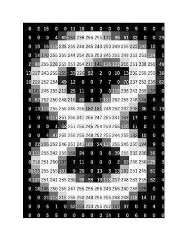
<figcaption>תמונת גוני אפור כמטריצה של ערכי פיקסלים.</figcaption>
</figure>

<!-- editorlm-source-ref: [sources/ML/pdf/11.רשתות קונבולוציה.pdf#L16-L22] -->

### תמונה צבעונית — RGB

תמונה צבעונית מיוצגת בשלוש מטריצות: אדום, ירוק וכחול. אלה שלושת ערוצי הצבע — channels. לכל פיקסל שלושה ערכים: שחור הוא `(0,0,0)` ולבן הוא `(255,255,255)`.

<figure>
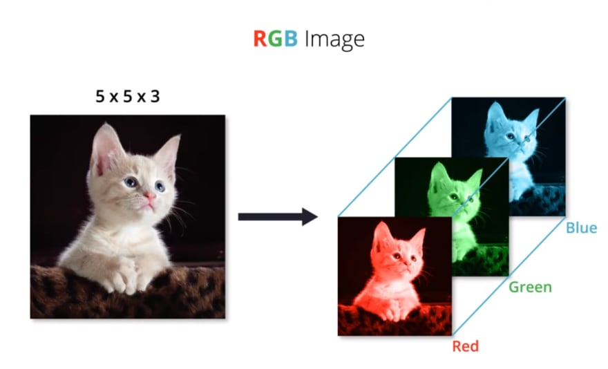
<figcaption>פירוק תמונת RGB לשלושה ערוצי צבע.</figcaption>
</figure>

<figure>
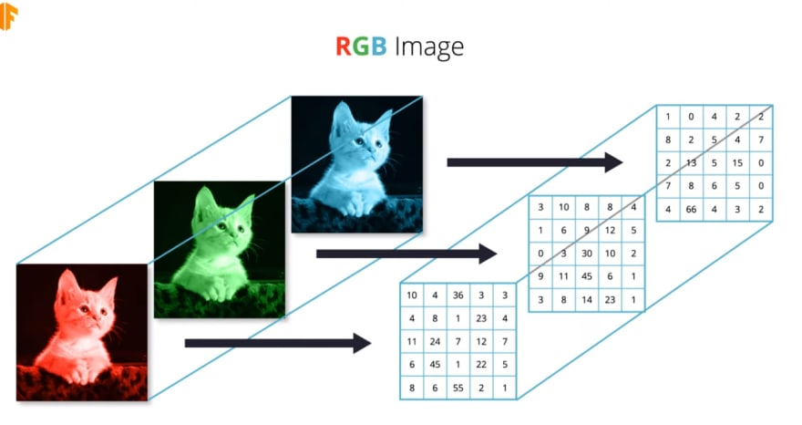
<figcaption>מטריצה לכל ערוץ צבע.</figcaption>
</figure>

<!-- editorlm-source-ref: [sources/ML/pdf/11.רשתות קונבולוציה.pdf#L26-L32] -->

### קונבולוציה בתמונה בגוני אפור

המסנן, Kernel, עובר על התמונה בחלונות. בכל מיקום כופלים את האיברים המתאימים בחלון ובמסנן וסוכמים; אחר כך מזיזים את המסנן ימינה ולמטה בצעדים קבועים.

בחלון הראשון בדוגמה, העמודה השמאלית היא 7, 4, 3 והימנית היא 3, 3, 2. המסנן מחבר את השמאלית ומחסר את הימנית, ולכן מתקבל `7+4+3−3−3−2=6`.

<figure>
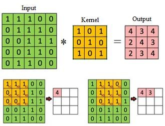
<figcaption>כפל איברים מתאימים וסכימה לקבלת תא פלט אחד.</figcaption>
</figure>

<figure>
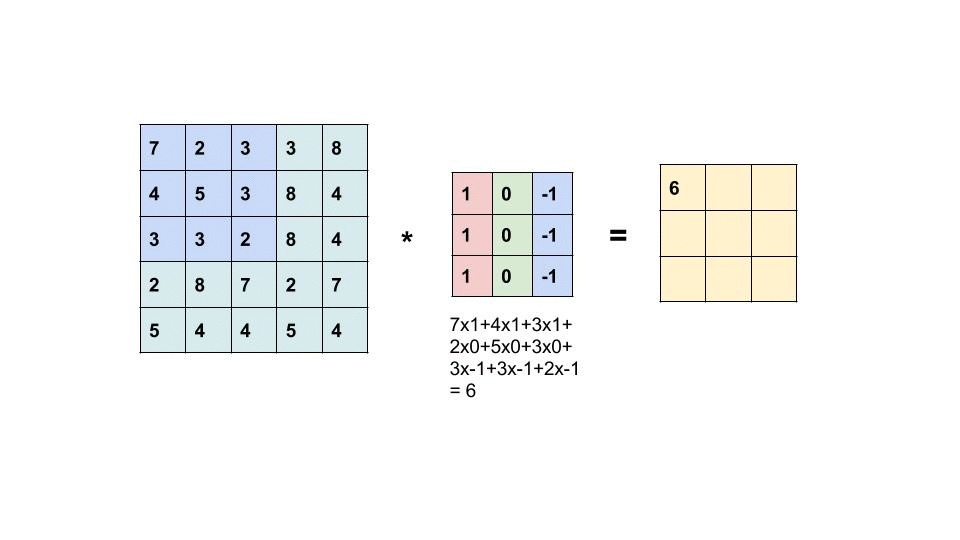
<figcaption>הזזת המסנן וחישוב תאי הפלט.</figcaption>
</figure>

<!-- editorlm-source-ref: [sources/ML/pdf/11.רשתות קונבולוציה.pdf#L36-L67] -->

### קונבולוציה בתמונה צבעונית

המסנן כולל מטריצה לכל ערוץ קלט. מחשבים את המכפלות בכל ערוץ וסוכמים את התוצאות למספר אחד; לכן מסנן אחד יוצר מפת פלט אחת.

<figure>
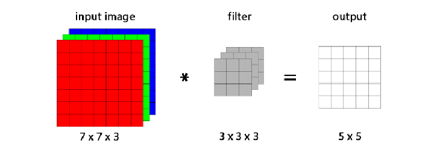
<figcaption>מסנן המכסה שלושה ערוצים מפיק מפת פלט אחת.</figcaption>
</figure>

<!-- editorlm-source-ref: [sources/ML/pdf/11.רשתות קונבולוציה.pdf#L71-L75] -->

בדוגמה המספרית של שלושת הערוצים מתקבלות התוצאות 308, ‎−498 ו־164. לאחר הוספת הטיה של 1 מתקבל תא הפלט `308−498+164+1=−25`.

<figure>

<figcaption>סכימת תוצאות שלושת הערוצים והוספת ההטיה לקבלת תא פלט אחד.</figcaption>
</figure>

<!-- editorlm-source-ref: [sources/ML/pdf/11.רשתות קונבולוציה.pdf#L79-L117] -->

### מספר ערוצי הפלט

אפשר להפעיל כמה מסננים על אותו קלט. כל מסנן מפיק מפת תכונות אחת, ולכן מספר המסננים קובע את מספר ערוצי הפלט.

<figure>

<figcaption>שני מסננים מפיקים שתי מפות תכונות.</figcaption>
</figure>

<!-- editorlm-source-ref: [sources/ML/pdf/11.רשתות קונבולוציה.pdf#L121-L140] -->

### Padding

Padding מוסיף מסגרת אפסים סביב התמונה ומגדיל את התחום שעליו אפשר להפעיל את המסנן.

<figure>
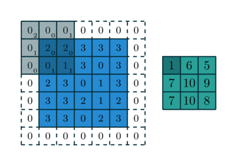
<figcaption>הוספת מסגרת אפסים סביב הקלט.</figcaption>
</figure>

<!-- editorlm-source-ref: [sources/ML/pdf/11.רשתות קונבולוציה.pdf#L144-L162] -->

### Stride

Stride הוא גודל הצעד של המסנן. בקלט 5×5 ומסנן 3×3 ללא padding, צעד 1 נותן פלט 3×3, וצעד 2 נותן פלט 2×2.

<figure>
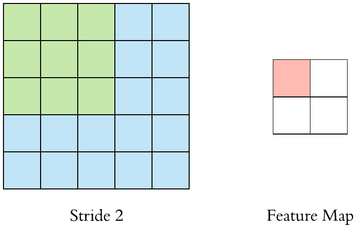
<figcaption>גודל הצעד משפיע על ממדי הפלט.</figcaption>
</figure>

<!-- editorlm-source-ref: [sources/ML/pdf/11.רשתות קונבולוציה.pdf#L166-L171] -->

### חישוב ממדי הקונבולוציה

את גודל הפלט בכל ציר מחשבים כך:

<div class="code-panel" dir="ltr">

```text
n_out = floor((n_in + 2*p - k) / s) + 1
```

</div>

כאן `n_in` הוא גודל הקלט בציר, `k` גודל המסנן, `p` הריפוד ו־`s` הצעד.

<!-- editorlm-source-ref: [sources/ML/pdf/11.רשתות קונבולוציה.pdf#L175-L184] -->

### Pooling

Pooling מצמצם את הממדים באמצעות בחירת מספר מכל חלון: Max Pooling בוחרת את המקסימום, ו־Average Pooling את הממוצע.

בחלון הראשון בדוגמת המקסימום הערכים הם 29, 15, 0, 100, ולכן מתקבל 100. בדוגמת הממוצע הערכים הם 31, 15, 0, 100, ולכן הממוצע המדויק הוא 36.5.

<figure>
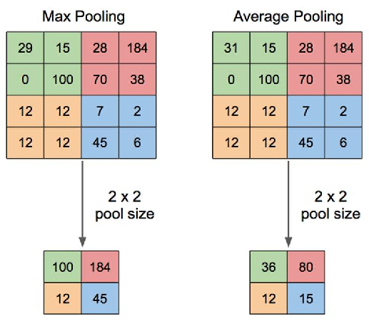
<figcaption>דוגמאות Pooling. בתא הראשון של פלט הממוצע מודפס 36; הערך המדויק הוא 36.5.</figcaption>
</figure>

<figure>

<figcaption>Max Pooling בחלונות 2×2.</figcaption>
</figure>


ללא padding, גודל הפלט הוא:

<div class="code-panel" dir="ltr">

```text
floor((W - F) / S + 1)
```

</div>

`W` הוא גודל הקלט בציר, `F` גודל החלון ו־`S` הצעד.

<!-- editorlm-source-ref: [sources/ML/pdf/11.רשתות קונבולוציה.pdf#L188-L221] -->

### Conv2d ו־MaxPool2d ב־PyTorch

משקלי המסננים הם הפרמטרים הנלמדים במהלך האימון. ל־Pooling אין משקלים נלמדים. נגדיר קונבולוציה משלושה ערוצים לשישה, עם מסנן 5×5, צעד 1 וללא ריפוד; אחריה Pooling בחלון 2×2 ובצעד 2:

<div class="code-panel" dir="ltr">

```python
import torch.nn as nn

in_Channels, out_channels, kernel, stride, padding = 3, 6, 5, 1, 0
c = nn.Conv2d(in_Channels, out_channels, kernel, stride, padding)

pool_kernel, pool_stride = 2, 2
mp = nn.MaxPool2d(pool_kernel, pool_stride)
```

</div>

<!-- editorlm-source-ref: [sources/ML/pdf/11.רשתות קונבולוציה.pdf#L225-L236] -->

### מבנה CNN

התמונה נכנסת בלי השטחה. בכל שלב מפעילים קונבולוציה, אקטיבציה ו־Pooling; לאחר מכן משטחים את הפלט ומעבירים אותו לשכבות לינאריות לסיווג.

<figure>
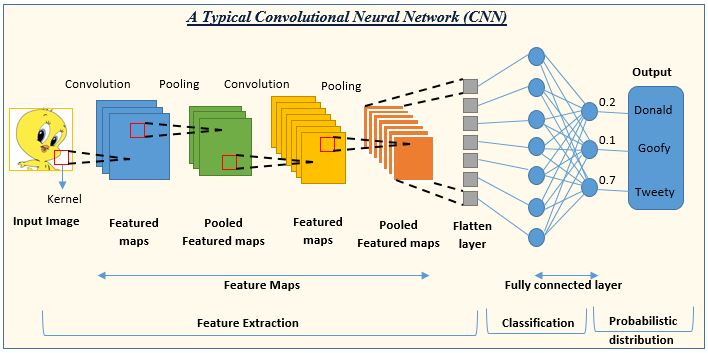
<figcaption>שלבי עיבוד התמונה והסיווג ברשת.</figcaption>
</figure>

<!-- editorlm-source-ref: [sources/ML/pdf/11.רשתות קונבולוציה.pdf#L240-L247] -->

### דוגמה לרשת וחישוב הממדים

ברשת הבאה שתי קונבולוציות ושלוש שכבות לינאריות. זהו מבנה הרשת שנממש בהמשך:


<div class="code-panel" dir="ltr">

```python
import torch.nn.functional as F

class CNN_Model(nn.Module):
    def __init__(self):
        super(CNN_Model, self).__init__()
        self.conv1 = nn.Conv2d(3, 6, 5)
        self.pool = nn.MaxPool2d(2, 2)
        self.conv2 = nn.Conv2d(6, 16, 5)
        self.fc1 = nn.Linear(16 * 5 * 5, 120)
        self.fc2 = nn.Linear(120, 84)
        self.fc3 = nn.Linear(84, 10)

    def forward(self, x):
        # -> n, 3, 32, 32
        x = self.pool(F.relu(self.conv1(x)))  # -> n, 6, 14, 14
        x = self.pool(F.relu(self.conv2(x)))  # -> n, 16, 5, 5
        x = x.view(-1, 16 * 5 * 5)            # -> n, 400
        x = F.relu(self.fc1(x))               # -> n, 120
        x = F.relu(self.fc2(x))               # -> n, 84
        x = self.fc3(x)                       # -> n, 10
        return x
```

</div>

| שלב | צורת הנתונים לתמונה אחת |
| --- | --- |
| קלט | `3×32×32` |
| קונבולוציה ראשונה | `6×28×28` |
| Pooling | `6×14×14` |
| קונבולוציה שנייה | `16×10×10` |
| Pooling | `16×5×5` |
| השטחה | `400` |
| שכבות לינאריות | `120 → 84 → 10` |

למשל, הקונבולוציה הראשונה נותנת `floor((32−5)/1)+1=28`, ואחריה Pooling נותנת `floor((28−2)/2+1)=14`.

<!-- editorlm-source-ref: [sources/ML/pdf/11.רשתות קונבולוציה.pdf#L251-L329] -->

### CIFAR-10

נבנה רשת לסיווג תמונות צבעוניות בגודל 32×32 לעשר קטגוריות: מטוס, מכונית, ציפור, חתול, אייל, כלב, צפרדע, סוס, ספינה ומשאית.

<!-- editorlm-source-ref: [sources/ML/pdf/11.רשתות קונבולוציה.pdf#L332-L343] -->

נייבא את הספריות:

<div class="code-panel" dir="ltr">

```python
import torch
import torch.nn as nn
import torch.nn.functional as F
import numpy as np
import matplotlib.pyplot as plt
import torchvision
import torchvision.transforms as transforms
```

</div>

<!-- editorlm-source-ref: [sources/ML/converted/11_CNN_CIFAR10/notebook.md#L27-L38] -->

נבחר התקן חישוב:

<div class="code-panel" dir="ltr">

```python
if torch.cuda.is_available():
    device = torch.device('cuda')
else:
    device = torch.device('cpu')
print(device)
```

</div>

<!-- editorlm-source-ref: [sources/ML/converted/11_CNN_CIFAR10/notebook.md#L43-L59] -->

### טעינה ללא נרמול

תחילה נטען תמונות באמצעות ToTensor בלבד ונדפיס תמונה אחת ואת צורתה:

<div class="code-panel" dir="ltr">

```python
batch_size = 4
transform = transforms.Compose([
    transforms.ToTensor()
    ])
test_dataset = torchvision.datasets.CIFAR10(root='./data',
                                            transform=transform,
                                            train=False,
                                            download=True
                                            )
test_loader = torch.utils.data.DataLoader(dataset=test_dataset,
                                          batch_size=batch_size,
                                          shuffle=False)
examples = iter(test_loader)
example = next(examples)
ex1 = example[0][0]
print(ex1)
print (ex1.shape)
```

</div>

אם הורדת הנתונים נכשלת, אפשר להשתמש בחלופת Hugging Face שמופיעה בהמשך סעיף הטעינה.

<!-- editorlm-source-ref: [sources/ML/converted/11_CNN_CIFAR10/notebook.md#L68-L183] -->

### נרמול התמונות

ToTensor ממירה את ערכי התמונה לטווח 0–1. Normalize מחסרת 0.5 ומחלקת ב־0.5 בכל ערוץ, כך שמתקבל הטווח ‎−1 עד 1:

<div class="code-panel" dir="ltr">

```python
# ToTensor maps these image values to [0, 1].
# We transform them to Tensors of normalized range [-1, 1]
transform = transforms.Compose([
    transforms.ToTensor(),
    transforms.Normalize(mean=(0.5, 0.5, 0.5),std= (0.5, 0.5, 0.5))
    ])
```

</div>

<!-- editorlm-source-ref: [sources/ML/converted/11_CNN_CIFAR10/notebook.md#L188-L198] -->

נטען את קבוצות האימון והבדיקה וניצור אצוות של 20 תמונות:

<div class="code-panel" dir="ltr">

```python
batch_size = 20

train_dataset = torchvision.datasets.CIFAR10(root='./data',
                                           train=True,
                                           transform=transform,
                                           download=True)

test_dataset = torchvision.datasets.CIFAR10(root='./data',
                                          train=False,
                                          transform=transform)

# Data loader
train_loader = torch.utils.data.DataLoader(dataset=train_dataset,
                                           batch_size=batch_size,
                                           shuffle=True)

test_loader = torch.utils.data.DataLoader(dataset=test_dataset,
                                          batch_size=batch_size,
                                          shuffle=False)
```

</div>

<!-- editorlm-source-ref: [sources/ML/converted/11_CNN_CIFAR10/notebook.md#L199-L223] -->

### חלופת טעינה באמצעות Hugging Face

חלופה זו מחליפה את טעינת הנתונים באמצעות torchvision ומצריכה את הספרייה `datasets`:

<div class="code-panel" dir="ltr">

```python
from datasets import load_dataset

dataset = load_dataset("cifar10")

# Convert to PyTorch-style
train_dataset = dataset["train"]
test_dataset = dataset["test"]
```

</div>

<!-- editorlm-source-ref: [sources/ML/converted/11_CNN_CIFAR10/notebook.md#L228-L239] -->

נעטוף את המאגר במחלקת Dataset וניצור מחדש את הטוענים:

<div class="code-panel" dir="ltr">

```python
from torch.utils.data import Dataset

# Create a PyTorch Dataset wrapper to mimic torchvision exactly
class HFDatasetWrapper(Dataset):
    def __init__(self, hf_dataset, transform=None):
        self.hf_dataset = hf_dataset
        self.transform = transform
        # Add the .classes attribute that torchvision datasets have
        self.classes = hf_dataset.features['label'].names

    def __len__(self):
        return len(self.hf_dataset)

    def __getitem__(self, idx):
        item = self.hf_dataset[idx]
        image = item['img'].convert("RGB")
        label = item['label']

        if self.transform:
            image = self.transform(image)

        return image, label

    def __repr__(self):
        head = "Dataset CIFAR10 (Hugging Face)"
        body = [f"Number of datapoints: {self.__len__()}"]
        if self.transform is not None:
            body.append(f"StandardTransform\nTransform: {self.transform}")
        lines = [head] + ["    " + line for line in body]
        return '\n'.join(lines)

# Wrap the original Hugging Face dataset splits
# ('dataset' is from the previous cell, 'transform' from earlier)
train_dataset = HFDatasetWrapper(dataset['train'], transform=transform)
test_dataset = HFDatasetWrapper(dataset['test'], transform=transform)

# Data loader - behaves completely normally now!
train_loader = torch.utils.data.DataLoader(dataset=train_dataset,
                                           batch_size=batch_size,
                                           shuffle=True)

test_loader = torch.utils.data.DataLoader(dataset=test_dataset,
                                          batch_size=batch_size,
                                          shuffle=False)

print("Hugging Face dataset wrapped to behave exactly like torchvision!")
```

</div>

<!-- editorlm-source-ref: [sources/ML/converted/11_CNN_CIFAR10/notebook.md#L240-L297] -->

### הצגת התמונות

נגדיר פונקציה שמבטלת את הנרמול ומחליפה את סדר הצירים לצורך התצוגה:

<div class="code-panel" dir="ltr">

```python
def imshow(img):
    img = img / 2 + 0.5  # unnormalize
    npimg = img.numpy()
    plt.imshow(np.transpose(npimg, (1, 2, 0)))
    plt.show()
```

</div>

<!-- editorlm-source-ref: [sources/ML/converted/11_CNN_CIFAR10/notebook.md#L302-L311] -->

נציג שלוש אצוות, בחמש תמונות לשורה:

<div class="code-panel" dir="ltr">

```python
# get some random training images
dataiter = iter(train_loader)
for i in range(3):
    images, labels = next(dataiter)

    # show images
    imshow(torchvision.utils.make_grid(images, nrow=5))
```

</div>

<!-- editorlm-source-ref: [sources/ML/converted/11_CNN_CIFAR10/notebook.md#L312-L352] -->

נבדוק את מבנה המאגר, תמונה אחת ותוויתה, ונגדיר את שמות הקטגוריות:

<div class="code-panel" dir="ltr">

```python
print(train_dataset, '\nlength=',len(train_dataset))
print(type(train_dataset[0]), len(train_dataset[0]))
print(type(train_dataset[0][0]), type(train_dataset[0][1]) )
print(train_dataset[0][0].shape)
print(train_dataset[0][0])
print(train_dataset[0][1])
classes = ('plane', 'car', 'bird', 'cat', 'deer', 'dog', 'frog', 'horse', 'ship', 'truck')
print(train_dataset.classes)
```

</div>

<!-- editorlm-source-ref: [sources/ML/converted/11_CNN_CIFAR10/notebook.md#L353-L406] -->

### פרמטרים ומודל

נאמן במשך חמש תקופות בקצב למידה 0.001:

<div class="code-panel" dir="ltr">

```python
epochs = 5
learning_rate = 0.001
```

</div>

<!-- editorlm-source-ref: [sources/ML/converted/11_CNN_CIFAR10/notebook.md#L415-L421] -->

נממש את רשת הקונבולוציה. ההשטחה מתבצעת אחרי שתי הקונבולוציות וה־Pooling:

<div class="code-panel" dir="ltr">

```python
class CNN_Model(nn.Module):
    def __init__(self):
        super(CNN_Model, self).__init__()
        self.conv1 = nn.Conv2d(3, 6, 5)
        self.pool = nn.MaxPool2d(2, 2)
        self.conv2 = nn.Conv2d(6, 16, 5)
        self.fc1 = nn.Linear(16 * 5 * 5, 120)
        self.fc2 = nn.Linear(120, 84)
        self.fc3 = nn.Linear(84, 10)

    def forward(self, x):
        # -> n, 3, 32, 32
        x = self.pool(F.relu(self.conv1(x)))  # -> n, 6, 14, 14
        x = self.pool(F.relu(self.conv2(x)))  # -> n, 16, 5, 5
        x = x.view(-1, 16 * 5 * 5)            # -> n, 400
        x = F.relu(self.fc1(x))               # -> n, 120
        x = F.relu(self.fc2(x))               # -> n, 84
        x = self.fc3(x)                       # -> n, 10
        return x


Model = CNN_Model().to(device)
```

</div>

<!-- editorlm-source-ref: [sources/ML/converted/11_CNN_CIFAR10/notebook.md#L426-L452] -->

נגדיר CrossEntropyLoss ו־Adam; אין להוסיף Softmax לשכבת הפלט לפני ההפסד:

<div class="code-panel" dir="ltr">

```python
# loss function
Loss = nn.CrossEntropyLoss () # applies nn.LogSoftmax + nn.NLLLoss, No softmax in last layer

# init optimizer
optim = torch.optim.Adam(Model.parameters(), lr=learning_rate)
```

</div>

<!-- editorlm-source-ref: [sources/ML/converted/11_CNN_CIFAR10/notebook.md#L457-L466] -->

### אימון

נעביר את התמונות והתוויות להתקן ונבצע חישוב קדימה, חישוב הפסד ונגזרות, עדכון משקלים ואיפוס גרדיאנטים:

<div class="code-panel" dir="ltr">

```python
n_total_steps = len(train_loader)


for epoch in range(epochs):
    for i, (images, lables) in enumerate(train_loader):

        images = images.to(device)
        lables = lables.to(device)

        # forward
        Y_predict = Model(images)

        # backward
        loss = Loss(Y_predict, lables)
        loss.backward()

        # update wights
        optim.step()

        if i % 100 == 0:
            print(f"epoch= {epoch} i= {i+epoch * n_total_steps} loss={loss.item():.4f} ")

        # zero grads
        optim.zero_grad()
```

</div>

<!-- editorlm-source-ref: [sources/ML/converted/11_CNN_CIFAR10/notebook.md#L478-L506] -->

### בדיקת המודל

נבחר את אינדקס הציון המרבי לכל תמונה ונחשב את אחוז התחזיות הנכונות:

<div class="code-panel" dir="ltr">

```python
with torch.no_grad():
    n_correct = 0
    n_samples = 0
    for images, lables in test_loader:
        images = images.to(device)
        lables = lables.to(device)
        __,y_predict = torch.max(Model(images),1)
        n_samples += lables.size(0)
        n_correct += (y_predict == lables).sum().item()

    acc = 100 * n_correct / n_samples
    print(f'Accuracy of the network on the {n_samples} test images: {acc} %')
```

</div>

<!-- editorlm-source-ref: [sources/ML/converted/11_CNN_CIFAR10/notebook.md#L511-L529] -->

נעבור על עשר אצוות בדיקה ונדפיס לכל תמונה תחזית, תווית והאם הן שוות:

<div class="code-panel" dir="ltr">

```python
examples = iter(test_loader)
for j in range(10):
    example_data, example_targets = next(examples)
    example_data = example_data.to(device)
    example_targets = example_targets.to(device)
    _, example_predict_arg = torch.max(Model(example_data),1)

    for i in range(len(example_data)):
        print (example_predict_arg[i].item(), example_targets[i].item(), example_predict_arg[i].item()== example_targets[i].item()  )
```

</div>

<!-- editorlm-source-ref: [sources/ML/converted/11_CNN_CIFAR10/notebook.md#L530-L545] -->

נציג את האצווה האחרונה שנותרה מהלולאה, ואת שמות התחזיות והתוויות:

<div class="code-panel" dir="ltr">

```python
# Show test
def img_target_show(img):
        img = img / 2 + 0.5  # unnormalize
        npimg = img.numpy()
        plt.imshow(np.transpose(npimg, (1, 2, 0)))
        plt.show()

print('target\n',example_targets.reshape(-1,5))
print('predict\n',example_predict_arg.reshape(-1,5) )

imshow(torchvision.utils.make_grid(example_data.to('cpu'),nrow=5))
for i in range(4):
    for j in range (5):
        print(classes[example_targets[i*5+j]], classes[example_predict_arg[i*5+j]])
```

</div>

<!-- editorlm-source-ref: [sources/ML/converted/11_CNN_CIFAR10/notebook.md#L546-L565] -->

נדפיס את שמות הקטגוריות במאגר:

<div class="code-panel" dir="ltr">

```python
print(train_dataset.classes)
```

</div>

<!-- editorlm-source-ref: [sources/ML/converted/11_CNN_CIFAR10/notebook.md#L566-L570] -->


<nav class="book-nav" aria-label="ניווט בספר">
<a href="20-%D7%A9%D7%9E%D7%99%D7%A8%D7%94%20%D7%95%D7%98%D7%A2%D7%99%D7%A0%D7%94.md">→ הקודם</a>
<a class="toc-link" href="../index.md">תוכן העניינים</a>
<a href="22-%D7%97%D7%AA%D7%95%D7%9C%20%D7%90%D7%95%20%D7%9C%D7%90%20%D7%97%D7%AA%D7%95%D7%9C.md">הבא ←</a>
</nav>

</div>

<!-- editorlm-source-versions: {"schemaVersion":1,"sources":{"sources/ML/converted/11_CNN_CIFAR10/notebook.md":{"sourceSha256":"ee47eb73b98c16b4d349cd36fffb38af3e1eac70c937d7cf90de645c83b9c913","canonicalTextSha256":"ee47eb73b98c16b4d349cd36fffb38af3e1eac70c937d7cf90de645c83b9c913"},"sources/ML/pdf/11.רשתות קונבולוציה.pdf":{"sourceSha256":"74bdd2eca1f305218e4348e00494fd2313eb56c4bd128741e10af34999fe7056","canonicalTextSha256":"1995b334e52d4795e8ca42c04fb605f9838979c5f088f3d6e8053cbe100189c1"}}} -->
