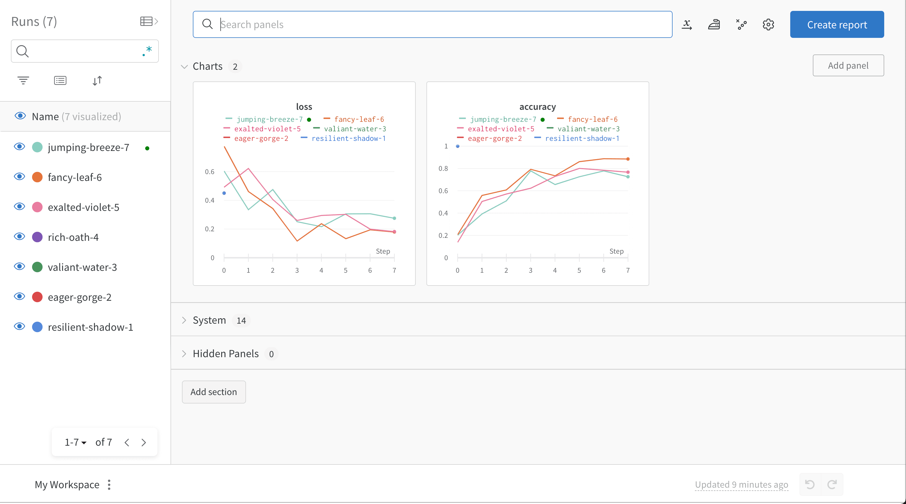
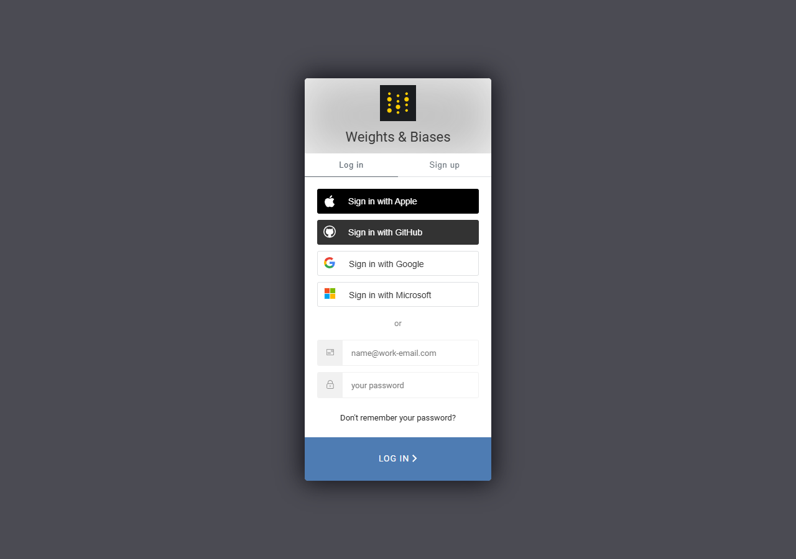
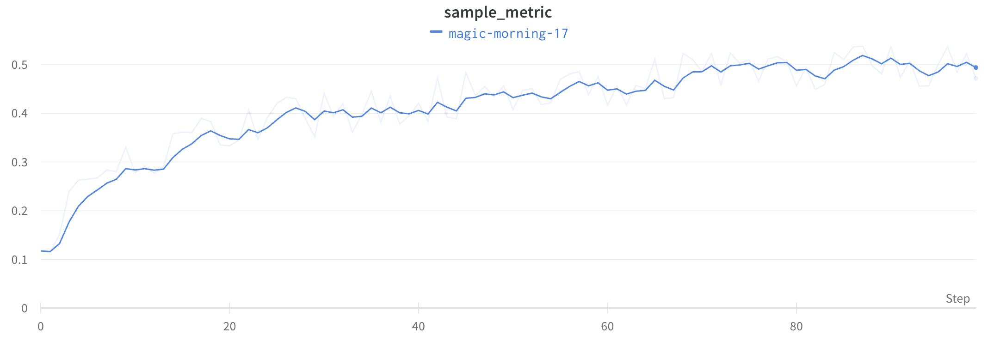

<!-- editorlm-hebrew-html-start -->
<style>
html, body, .vscode-body, .markdown-body, .markdown-preview, #write {
  direction: rtl !important; text-align: right !important;
}
ul, ol { padding-right: 2em !important; padding-left: 0 !important; }
blockquote { border-right: 3px solid #999; border-left: 0; padding-right: 1rem; padding-left: 0; }
@media print {
  html, body, .vscode-body, .markdown-body, .markdown-preview, #write {
    direction: rtl !important; text-align: right !important;
  }
}
</style>
<!-- editorlm-hebrew-html-end -->
<style>
.book { max-width: 900px; margin: auto; line-height: 1.8; font-family: Arial, sans-serif; }
.book .cover { min-height: 680px; box-sizing: border-box; padding: 64px 48px; margin: 24px 0 60px; background: #112b41; color: #f5f8fc; border-top: 9px solid #39c4b5; position: relative; }
.book .cover .eyebrow { color: #81e0d5; font-size: 15px; letter-spacing: 2px; }
.book .cover h1 { color: #fff; font-size: 48px; line-height: 1.3; border: 0; margin: 50px 0 18px; }
.book .cover .subtitle { font-size: 28px; color: #d8e6f0; }
.book .cover .author { font-size: 30px; color: #fff; margin-top: 52px; }
.book .cover .audience { color: #c1d3df; margin-top: 12px; }
.book .cover .motif { direction: ltr; text-align: left; font-family: Consolas, monospace; color: #81e0d5; font-size: 19px; margin-top: 54px; }
.book h1, .book h2, .book h3 { line-height: 1.4; font-weight: 700; }
.book > h1 { font-size: 32px !important; text-align: center !important; margin: 28px 0; }
.book h2 { font-size: 34px !important; text-align: center !important; color: #153b56 !important; background: #eef5fc; border: 0; border-bottom: 4px solid #299c91; border-radius: 10px 10px 0 0; padding: 28px 20px; margin: 24px 0 36px; }
.book h3 { font-size: 24px !important; text-align: right !important; color: #174e49 !important; background: #edf7f5; border: 0; border-right: 5px solid #299c91; border-radius: 6px; padding: 10px 16px; margin: 36px 0 18px; }
.book .chapter { height: 0; margin: 76px 0 0; border-top: 1px solid #ccd7df; break-before: page; page-break-before: always; break-after: avoid; page-break-after: avoid; }
.book .toc { padding: 24px; border-right: 5px solid #39a99d; background: rgba(70,150,155,.09); margin: 24px 0 48px; }
.book pre, .book pre code { direction: ltr !important; text-align: left !important; unicode-bidi: isolate; }
.book pre { box-sizing: border-box !important; width: 100% !important; max-width: 100% !important; margin: 0 !important; padding: 16px 20px; border: 1px solid #ccd7df; border-radius: 8px; line-height: 1.6; overflow-x: auto; }
.book code { direction: ltr; unicode-bidi: isolate; font-family: Consolas, "Courier New", monospace; }
.book pre { background: #f3f6fa !important; color: #1f2937 !important; }
.book pre code, .book pre code.hljs { background: transparent !important; color: #1f2937 !important; }
.book pre .hljs-keyword, .book pre .hljs-literal { color: #6f299c !important; }
.book pre .hljs-string { color: #216338 !important; }
.book pre .hljs-number { color: #075e68 !important; }
.book pre .hljs-comment { color: #526174 !important; }
.book pre .hljs-built_in, .book pre .hljs-title { color: #135b96 !important; }
.book table { width: 100%; }
.book th, .book td { text-align: right; }
.book .small { font-size: .9em; opacity: .8; }
.book .python-intro { display: flex; align-items: center; gap: 28px; padding: 22px 28px; margin: 24px 0; background: #eef5fc; color: #183e63; border-right: 6px solid #3776ab; border-radius: 10px; }
.book .python-intro strong { font-size: 30px; }
.book .python-fact { background: #fff7d6; color: #423611; border-right: 6px solid #ffd343; border-radius: 8px; padding: 18px 24px; margin: 22px 0; }
.book .python-fact strong { font-size: 24px; }
.book img { max-width: 100%; height: auto; }
.book figure { margin: 24px auto; text-align: center; }
.book figure img { display: block; margin: auto; }
.book figcaption { direction: rtl; text-align: center; font-size: .9em; color: #445566; }
@media print { .book > h2 { break-before: page; page-break-before: always; } }
.book .screen-strip { width: 760px; max-width: 100%; height: 220px; overflow: hidden; border: 1px solid #bccad5; border-radius: 8px; margin: 20px auto 8px; direction: ltr; }
.book .screen-strip.output { height: 265px; }
.book .screen-strip img { display: block; width: 1745px; max-width: none; }
.book .screen-menu { width: 400px; max-width: 100%; height: 295px; overflow: hidden; direction: ltr; margin: 20px auto 8px; border: 1px solid #bccad5; border-radius: 8px; }
.book .screen-menu img { display: block; width: 1745px; max-width: none; }
.book .code-panel { box-sizing: border-box !important; display: block !important; width: 75% !important; max-width: 75% !important; margin: 18px auto !important; }
@media print {
  .book .cover { min-height: 85vh; break-after: page; print-color-adjust: exact; -webkit-print-color-adjust: exact; }
  .book pre { white-space: pre-wrap; break-inside: avoid; }
  .book .chapter { margin: 0; border: 0; }
  .book h1, .book h2, .book h3 { break-after: avoid; page-break-after: avoid; break-inside: avoid; }
  .book h2 { margin-top: 0; }
  .book h2, .book h3 { print-color-adjust: exact; -webkit-print-color-adjust: exact; }
}
</style>

<style>
.book .book-nav { display: flex; flex-wrap: wrap; gap: 10px; justify-content: center; align-items: center; padding: 16px 0; margin: 20px 0 32px; border-top: 1px solid #ccd7df; border-bottom: 1px solid #ccd7df; }
.book .book-nav a { display: inline-block; padding: 10px 18px; border-radius: 8px; background: #eef5fc; color: #153b56 !important; border: 1px solid #b5ccd9; text-decoration: none !important; font-size: 16px; font-weight: bold; }
.book .book-nav a.toc-link { background: #174e49; color: #fff !important; border-color: #174e49; }
.book .book-nav a:hover, .book .book-nav a:focus { background: #d4eee8; color: #153b56 !important; outline: 2px solid #299c91; outline-offset: 2px; }
.book .section-list { line-height: 2; }
@media print { .book .book-nav { display: none; } }

/* Explicit Hebrew direction, including prose beginning with English. */
.book p, .book ul, .book ol, .book li,
.book blockquote, .book h1, .book h2, .book h3,
.book h4, .book th, .book td {
  direction: rtl !important;
  text-align: right !important;
  unicode-bidi: isolate;
}
/* Chapter titles keep their agreed centered layout. */
.book h2 { text-align: center !important; }
.book pre, .book pre code, .book .code-panel {
  direction: ltr !important;
  text-align: left !important;
  unicode-bidi: isolate;
}
</style>


<style>
.book p, .book li, .book th, .book td {direction:rtl!important;text-align:right!important;}
.book .code-panel {direction:ltr!important;text-align:left!important;}
</style>

<div class="book" dir="rtl" lang="he">

<nav class="book-nav" aria-label="ניווט בספר">
<a href="22-%D7%97%D7%AA%D7%95%D7%9C%20%D7%90%D7%95%20%D7%9C%D7%90%20%D7%97%D7%AA%D7%95%D7%9C.md">→ הקודם</a>
<a class="toc-link" href="../index.md">תוכן העניינים</a>
<a href="../04-%D7%9C%D7%9E%D7%99%D7%93%D7%AA%20%D7%97%D7%99%D7%96%D7%95%D7%A7/01-%D7%9E%D7%91%D7%95%D7%90.md">הבא ←</a>
</nav>

## ג.23 — מעקב והשוואת ניסויים עם <span dir="ltr">W&amp;B</span>

לאורך חלק ג אימנו עשרות רשתות, ובכל פעם בחרנו ערכים: קצב למידה, מספר תקופות, גודל אצווה, מספר נוירונים בשכבה, שיטת נרמול. את הבחירות האלה עשינו בלי הרבה הסבר, אבל בעבודה אמיתית הן לב העניין: אימון רשת הוא תהליך של ניסוי וטעייה, שבו משנים הגדרה, מריצים שוב, ומשווים. בפרק ג.19, למשל, הרשת השנייה הגיעה לדיוק גבוה יותר, אך שינינו בה שלושה דברים בבת אחת ולא יכולנו לומר איזה מהם עזר. כדי לענות על שאלות כאלה צריך להריץ ניסויים רבים ולשמור סדר ביניהם.

נניח שאימנו רשת פעמיים: פעם בקצב למידה קטן ופעם בקצב גדול יותר. את תוצאת הריצה האחרונה קל לראות במסוף, אבל כיצד נשווה את שני תהליכי האימון? וכיצד נזכור באילו הגדרות השתמשנו בכל ריצה? הפתרונות המאולתרים — להעתיק הדפסות למסמך, לצלם גרפים, לרשום בטבלה מה שינינו — מתפרקים כבר אחרי כמה ריצות: הגרף לא נשמר, ההגדרות נשכחו, ושתי ריצות עם אותו שם מתערבבות. **מעקב ניסויים — Experiment Tracking** הוא הפתרון המסודר: התוכנית עצמה רושמת, בכל ריצה, את ההגדרות שבהן השתמשה ואת המדדים שהתקבלו לאורך האימון, ושומרת אותם במקום מרכזי שבו אפשר לצייר, להשוות ולחזור אליהם גם בעוד חודש. כל מי שמאמן מודלים ברצינות — בתעשייה ובמחקר — עובד כך.

**<span dir="ltr">Weights &amp; Biases — W&amp;B</span>** הוא שירות לתיעוד ניסויים בלמידת מכונה, ואחד הכלים הנפוצים למעקב ניסויים. הקוד שולח אליו את הגדרות הניסוי ואת המדדים שבחרנו לתעד. באתר אפשר לעקוב אחרי הגרפים בזמן האימון ולחזור אליהם לאחר שהסתיים. חבילת Python שמחברת את הקוד לשירות נקראת `wandb`. בפרק זה נפתח חשבון, נחבר אליו את סביבת העבודה, ונוסיף לתוכנית אימון שלוש קריאות בלבד — פתיחת ריצה, דיווח מדדים וסיום — כדי להשוות בין שני קצבי למידה. אותן שלוש קריאות אפשר להוסיף לכל לולאת אימון שכתבנו בספר, וגם לאימון הסוכנים שנבנה בחלק ד, שבו הריצות ארוכות והמדדים תנודתיים במיוחד.

**חומרי ליווי:** [מצגת הקורס](../../../sources/RL/9.DDQN%20-%20Space_Invaders.pptx) · [תיעוד W&B](https://docs.wandb.ai/models/quickstart) · [קוד הדוגמה המלא](../assets/wandb/wandb_example.py)

<!-- editorlm-source-ref: [sources/RL/9.DDQN - Space_Invaders.pptx#L173-L175] -->

### ג.23.1 — פרויקט וריצות ניסוי

כדי לשמור סדר בין ניסויים, W&B מארגן אותם בשתי רמות, בדומה לתיקייה וקבצים בתוכה. **Project** מרכז ריצות הקשורות לאותה משימה. **Run** הוא ביצוע מסוים של הניסוי, עם הגדרות ותוצאות משלו; כל הפעלה של תוכנית האימון יוצרת ריצה חדשה. לדוגמה, בפרויקט סיווג תמונות נרשום ריצה אחת לכל קצב למידה שנבדוק. כך נוכל להשוות את השגיאה והדיוק, ולראות מה היו ההגדרות שהובילו לכל תוצאה.

<figure>
<a href="../assets/wandb/workspace.png"></a>
<figcaption>סביבת עבודה לדוגמה: כל צבע מייצג ריצה. צילום מתוך <a href="https://docs.wandb.ai/models/quickstart">התיעוד הרשמי</a>, המציג נתוני הדגמה. לחיצה פותחת את התמונה בגודל מלא.</figcaption>
</figure>

### ג.23.2 — פתיחת חשבון וכניסה לאתר

W&B הוא שירות ענן: הנתונים שהתוכנית שולחת נשמרים בשרתים של החברה ומוצגים בדפדפן, ולכן צריך חשבון. החשבון מרכז את הפרויקטים והריצות שנרצה לתעד. נפתח חשבון או ניכנס לחשבון קיים לפני קישור הקוד לשירות.

1. פותחים את [אתר W&B](https://wandb.ai/) ובוחרים **Sign up**. אם כבר יש חשבון, בוחרים **Log in**.
2. נרשמים באמצעות אחת מאפשרויות ההזדהות המוצגות, למשל Google או GitHub, או באמצעות דוא״ל וסיסמה. משלימים את אימות החשבון אם מתבקשים.
3. משלימים את פרטי המשתמש והסביבה שהאתר מבקש. במהלך העבודה נשתמש באותו חשבון גם לצפייה בניסויים וגם לקישור המחשב.

<figure>
<a href="../assets/wandb/signup.png"></a>
<figcaption>מסך הכניסה והרישום באתר, כפי שנצפה בספטמבר 2026. למשתמש חדש בוחרים בלשונית Sign up.</figcaption>
</figure>

### ג.23.3 — התקנה מקומית ויבוא החבילה

לשירות שני צדדים: האתר מציג את הניסויים בדפדפן, ובמחשב מתקינים את **חבילת Python** שמדווחת אליו — היא זו שתוכנית האימון שלנו קוראת לה. לשימוש בשירות הענן אין צורך להתקין שרת W&B או תוכנת שולחן עבודה נפרדת.

פותחים טרמינל בסביבת העבודה שבה מריצים את תוכנית האימון ומפעילים:

<div class="code-panel" dir="ltr">

```powershell
python -m pip install wandb
```

</div>

זו התקנת `pip install wandb` באמצעות מפרש ה־Python הפעיל. אם עובדים בסביבה וירטואלית, מפעילים אותה לפני ההתקנה. יש לבחור בעורך את אותו מפרש Python; חבילה שהותקנה בסביבה אחרת לא בהכרח תהיה זמינה לתוכנית.

בקובץ ה־Python מייבאים את החבילה:

<div class="code-panel" dir="ltr">

```python
import wandb
```

</div>

`pip install` מתקין את החבילה בסביבה; `import` מאפשר לתוכנית להשתמש בה. אפשר לבדוק את היבוא בטרמינל:

<div class="code-panel" dir="ltr">

```powershell
python -c "import wandb; print(wandb.__version__)"
```

</div>

הפקודה אמורה להדפיס את מספר הגרסה שהותקנה. ב־Colab מתקינים בסביבת המחברת באמצעות `%pip install wandb`, ואז מריצים `import wandb` בתא Python. התקנה במחשב אינה מתקינה את החבילה ב־Colab.

התקנת החבילה והיבוא מתוארים ב־[מדריך ההתחלה הרשמי](https://docs.wandb.ai/models/quickstart).

### ג.23.4 — קישור המחשב לחשבון: הזדהות מקומית

לאחר ההתקנה צריך להזדהות גם מסביבת העבודה המקומית. הכניסה לאתר בדפדפן לבדה אינה מוסרת לתוכנית Python את פרטי ההזדהות — התוכנית רצה בנפרד מהדפדפן, ועליה להוכיח לשירות שהיא שולחת נתונים בשמך. הקישור נעשה באמצעות **API key** — מחרוזת סודית ארוכה, מעין סיסמה לתוכניות, המאפשרת לחבילה לפעול בחשבון שלך.

1. באתר, פותחים את תפריט המשתמש ובוחרים **User Settings**.
2. בוחרים **Create new API key**, נותנים למפתח שם כגון `school-laptop`, ולוחצים **Create**.
3. מעתיקים את המפתח המלא שמוצג. לפי הממשק הנוכחי הוא מוצג במלואו רק בזמן יצירתו.
4. בטרמינל של סביבת האימון מריצים:

<div class="code-panel" dir="ltr">

```powershell
wandb login
```

</div>

כשמתבקשים, מדביקים את המפתח. לאחר הצלחת ההזדהות פרטי האימות נשמרים מקומית, ובדרך כלל אין צורך להזינם בכל ריצה. במחשב אחר או בסביבה שאינה שומרת אותם צריך להזדהות מחדש. אין להכניס את המפתח לקוד, לצילום מסך או למאגר GitHub. [יצירת מפתח](https://docs.wandb.ai/models/quickstart) · [אופן ההזדהות ושמירתה](https://docs.wandb.ai/models/ref/python/functions/login).

אפשר לבצע את ההזדהות גם מתוך Python:

<div class="code-panel" dir="ltr">

```python
import wandb

wandb.login()
```

</div>

אלו שתי דרכים לבצע את אותו שלב: `wandb login` היא פקודת טרמינל, ו־`wandb.login()` היא קריאת Python. אין להקליד את קריאת ה־Python ישירות ב־PowerShell. אם פקודת הטרמינל אינה מזוהה, אפשר להשתמש בגרסת ה־Python לאחר שווידאנו שהיבוא מצליח.

<!-- editorlm-source-ref: [sources/RL/9.DDQN - Space_Invaders.pptx#L179-L181] -->

### ג.23.5 — אתחול הניסוי ושמירת ההגדרות

משהסביבה מחוברת, נעבור לקוד. שילוב W&B בתוכנית אימון מורכב משלושה שלבים: פתיחת ריצה לפני האימון, דיווח מדדים בתוך הלולאה, וסגירת הריצה בסופה. נתחיל בראשון. לפני לולאת האימון פותחים ריצה באמצעות `wandb.init`. כאן קובעים לאיזה פרויקט הריצה שייכת, נותנים לה שם, ומתעדים את המידע שיאפשר להבין אותה מאוחר יותר: סוג המודל, הנתונים, קצב הלמידה ומספר האפוקים. זהו בדיוק המידע שבפרקים הקודמים היה "מוסתר" בתוך הקוד ונשכח אחרי כל שינוי.

<div class="code-panel" dir="ltr">

```python
config = {
    "model": "single_weight",
    "learning_rate": 0.05,
    "epochs": 40,
    "initial_weight": 0.0,
    "target_weight": 3.0,
}

run = wandb.init(
    project="learning-rate-comparison",
    name="lr-0.05",
    config=config,
)
```

</div>

| פרמטר | מה נשמר בו? |
| --- | --- |
| `project` | שם הפרויקט המשותף לריצות שנרצה להשוות |
| `name` | שם קריא לריצה המסוימת |
| `config` | מילון ההגדרות והמידע על המודל והניסוי |

החזרה מ־`init` היא אובייקט הריצה, `run`, שבו נשתמש לדיווח. אם צריך לבחור צוות מסוים, מוסיפים `entity` עם שם המשתמש או הצוות הקיים שבו מורשים לעבוד. [פרטי האתחול](https://docs.wandb.ai/models/ref/python/functions/init).

שמירת `learning_rate` ב־`config` אינה משנה בעצמה את האופטימייזר. הקוד צריך להשתמש באותו ערך גם באימון. בדוגמה ניגש אל `config["learning_rate"]` בחישוב העדכון. שמירת תיאור המודל במילון גם אינה שמירה של המשקלים שאומנו; לשמירה וטעינה של המשקלים ראו [פרק ג.20](20-שמירה%20וטעינה.md). [הגדרות ניסוי](https://docs.wandb.ai/models/track/config).

<!-- editorlm-source-ref: [sources/RL/9.DDQN - Space_Invaders.pptx#L185-L187] -->

### ג.23.6 — דיווח מדדים במהלך האימון

השלב השני הוא לב המעקב. את הגדרות הניסוי שומרים בתחילת הריצה, כי הן קבועות. את הערכים שמשתנים — למשל שגיאה ודיוק — מדווחים **במהלך הלולאה**, באמצעות `run.log`. הקריאה מקבלת מילון של שמות מדדים וערכיהם, ושולחת אותו לשירות; כל קריאה כזו מוסיפה נקודה אחת לגרף של כל מדד, במקום שורת ההדפסה שהשתמשנו בה עד כה:

<div class="code-panel" dir="ltr">

```python
run.log(
    {"train_loss": loss_value, "epoch": epoch},
    step=epoch,
)
```

</div>

זהו קטע לשילוב בלולאה קיימת: `loss_value` הוא ערך השגיאה שחושב, ו־`epoch` הוא מספר האפוק. בקריאה אחת אפשר לשלוח כמה מדדים מאותה נקודת זמן. למשל, בסוף אפוק בסיווג תמונות נשלח יחד `train_loss`, ‏`val_loss` ו־`val_accuracy`, לאחר שחושבו.

ב־PyTorch ממירים שגיאה שהיא טנסור סקלרי למספר באמצעות `loss.item()`. אם רוצים לדווח שגיאה ממוצעת של אפוק, מחשבים תחילה את הממוצע מכל האצוות; שגיאת האצווה האחרונה אינה הממוצע הזה.

הפרמטר `step` קובע את מיקום הנקודה על ציר X של הגרף. ללא `step` מפורש, מספר צעד הדיווח מתקדם אוטומטית עם הקריאות. הוא אינו בהכרח מספר האפוק: אם מדווחים בכל אצווה, הצעד יספור אצוות. בדוגמה שלנו נשלח פעם אחת בסוף כל אפוק עם `step=epoch`, בסדר עולה. השלב השלישי והאחרון: בסיום קוראים `run.finish()` כדי לסיים את הריצה ולהשלים את הדיווח — הנתונים נשלחים ברקע, והקריאה מוודאת שכולם הגיעו ליעדם לפני שהתוכנית מסתיימת. [דיווח מדדים וציר הצעדים](https://docs.wandb.ai/models/track/log) · [סיום ריצה](https://docs.wandb.ai/models/ref/python/functions/init).

### ג.23.7 — דוגמה מלאה: השוואת שני קצבי למידה

נשתמש במשימה הקטנה של [Gradient Descent במשתנה אחד](05-Gradient%20Descent%20במשתנה%20אחד.md): מזעור השגיאה <span dir="ltr">L(w) = (w − 3)²</span>. כאן נתמקד בתיעוד. שתי הריצות מתחילות מאותו משקל, ומשנות רק את קצב הלמידה. אין צורך בנתונים חיצוניים או ב־PyTorch כדי להריץ את הדוגמה.

<div class="code-panel" dir="ltr">

```python
import wandb


def train(learning_rate):
    config = {
        "model": "single_weight",
        "learning_rate": learning_rate,
        "epochs": 40,
        "initial_weight": 0.0,
        "target_weight": 3.0,
    }
    run = wandb.init(
        project="learning-rate-comparison",
        name=f"lr-{learning_rate}",
        config=config,
    )

    weight = config["initial_weight"]
    target = config["target_weight"]
    for epoch in range(1, config["epochs"] + 1):
        gradient = 2 * (weight - target)
        weight -= config["learning_rate"] * gradient
        loss_value = (weight - target) ** 2
        run.log(
            {
                "epoch": epoch,
                "train_loss": loss_value,
                "weight": weight,
            },
            step=epoch,
        )

    run.finish()


if __name__ == "__main__":
    wandb.login()
    for learning_rate in (0.05, 0.2):
        train(learning_rate)
```

</div>

שומרים את [קובץ הדוגמה](../assets/wandb/wandb_example.py) ומריצים אותו בסביבה שהותקנה וקושרה לחשבון:

<div class="code-panel" dir="ltr">

```powershell
python wandb_example.py
```

</div>

נוצרות שתי ריצות באותו פרויקט. בכל אפוק מדווחים את המשקל ואת השגיאה **אחרי העדכון**. השמות `train_loss` ו־`weight` יופיעו באתר כשמות מדדים. הנתונים כאן מחושבים באימון הפשוט שבקוד; צילומי האתר בפרק הם דוגמאות ממשק ואינם תוצאות של ריצה זו.

### ג.23.8 — צפייה בתוצאות והשוואת ריצות

נשווה את הגרפים של שתי הריצות כדי לראות כיצד קצב הלמידה השפיע על ההתקדמות. פותחים את הקישור לפרויקט שמופיע במסוף, או נכנסים לאתר ובוחרים את הפרויקט `learning-rate-comparison`. בסביבת העבודה **Workspace** מאתרים את שתי הריצות ברשימת **Runs** ומפעילים את הצגת שתיהן. לכל ריצה צבע משלה.

פותחים גרף של `train_loss`. אם הוא אינו מוצג, בוחרים **Add panel**, אחר כך **Line plot**, ומגדירים בציר Y את `train_loss`. בציר X בוחרים `Step` או `epoch`; בדוגמה הם מייצגים אותם אפוקים, משום שדיווחנו כך במפורש. פותחים גם גרף של `weight` ורואים כיצד הוא מתקרב ל־3. [אפשרויות הגרף](https://docs.wandb.ai/models/app/features/panels/line-plot/reference).

ברשימת הריצות פותחים ריצה ובודקים את ערכי `config`. כך מחברים בין הקו בגרף לבין קצב הלמידה שיצר אותו. לצורך השוואה בוחרים אותו מדד, אותו ציר ואותו טווח אפוקים. בדוגמה זו אפשר להשוות את מהירות ירידת השגיאה; במשימות סיווג משווים גם מדדי אימות כדי לבחון ביצועים על נתונים שלא שימשו לאימון.

### ג.23.9 — החלקת הגרף: Smoothing

באימון עם אצוות, המדדים עשויים לעלות ולרדת בין דיווחים. **Smoothing** מחליק את הקו המוצג כדי להקל על זיהוי המגמה. הוא משנה את התצוגה, ולא את המשקלים, תהליך האימון או המדידות שנשלחו.

1. פותחים את הגדרות הגרף באמצעות סמל גלגל השיניים.
2. בלשונית **Data** מאתרים את **Smoothing**.
3. בוחרים, למשל, **Time-weighted EMA**, ומעלים בהדרגה את עוצמת ההחלקה. בשיטה זו 0 פירושו ללא החלקה; ככל שהערך קרוב יותר ל־1 ההחלקה חזקה יותר.
4. משאירים את **Show Original** פעיל כדי לראות גם את הנתונים הגולמיים בקו בהיר. שמות הכפתורים ומיקומם עשויים להשתנות עם עדכון האתר. [הגדרות ההחלקה](https://docs.wandb.ai/models/app/features/panels/line-plot/reference).

<figure>
<a href="../assets/wandb/smoothing.png"></a>
<figcaption>צילום מתוך <a href="https://docs.wandb.ai/models/app/features/panels/line-plot/smoothing">תיעוד W&B</a>: הקו הבהיר מציג את התנודות המקוריות, והקו הכהה את ההחלקה.</figcaption>
</figure>

החלקה חזקה יכולה להסתיר קפיצה בשגיאה או ירידה זמנית בדיוק. לכן בודקים גם את הקו המקורי ומשווים ריצות באותה שיטת החלקה ובאותה עוצמה. קו יפה יותר אינו הוכחה למודל טוב יותר. בדוגמה הקטנה שלנו הירידה ממילא חלקה למדי; התועלת בולטת יותר באימון שבו המדדים תנודתיים. [החלקה והצגת הנתונים המקוריים](https://docs.wandb.ai/models/app/features/panels/line-plot/smoothing).


<nav class="book-nav" aria-label="ניווט בספר">
<a href="22-%D7%97%D7%AA%D7%95%D7%9C%20%D7%90%D7%95%20%D7%9C%D7%90%20%D7%97%D7%AA%D7%95%D7%9C.md">→ הקודם</a>
<a class="toc-link" href="../index.md">תוכן העניינים</a>
<a href="../04-%D7%9C%D7%9E%D7%99%D7%93%D7%AA%20%D7%97%D7%99%D7%96%D7%95%D7%A7/01-%D7%9E%D7%91%D7%95%D7%90.md">הבא ←</a>
</nav>

</div>

<!-- editorlm-source-versions: {"schemaVersion": 1, "sources": {"sources/RL/9.DDQN - Space_Invaders.pptx": {"sourceSha256": "d6981fbcaece328c93f467f0106324e69f912c6b6b1614359703bdb294703b0d", "canonicalTextSha256": "9277e70122fd5412f1d8e6812fe67075e5cbacc59fdf975a808df997638dee83"}}} -->
