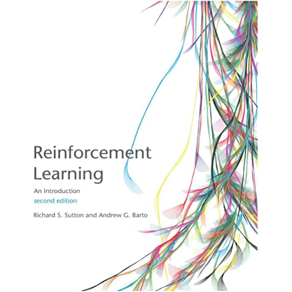

<!-- editorlm-hebrew-html-start -->

<!-- editorlm-hebrew-html-end -->

<nav class="book-nav" aria-label="ניווט בספר">
<a href="../03-%D7%9C%D7%9E%D7%99%D7%93%D7%AA%20%D7%9E%D7%9B%D7%95%D7%A0%D7%94/24-%D7%94%D7%A9%D7%9C%D7%9E%D7%95%D7%AA%20-%20Moon%20%D7%A1%D7%99%D7%95%D7%95%D7%92%20%D7%9C%D7%90%20%D7%9C%D7%99%D7%A0%D7%90%D7%A8%D7%99.md">→ הקודם</a>
<a class="toc-link" href="../index.md">תוכן העניינים</a>
<a href="02-%D7%94%D7%AA%D7%A7%D7%A0%D7%AA%20PyTorch%20%D7%91%D7%9E%D7%97%D7%A9%D7%91.md">הבא ←</a>
</nav>

## ד.1 — מבוא ללמידת חיזוק

**המצגת:** [מבוא ללמידת חיזוק](../../../sources/RL/1.%20למידת%20חיזוק%20-%20מבוא.pptx)

בחלק ג בנינו מודלים שלומדים מדוגמאות: הראינו להם תמונות או נתונים מספריים לצד התשובה הנכונה, והם למדו לחקות אותה. אבל יש בעיות שבהן איש אינו יכול לתת לנו "תשובה נכונה" לכל מצב. איך מלמדים תוכנה לנצח במשחק איקס־עיגול, לנהוג במכונית או לשלוט ברובוט, כשאין טבלה שאומרת מהו המהלך הנכון בכל רגע? בשאלה הזאת עוסק חלק ד של הספר, והתשובה לה נקראת **למידת חיזוק — Reinforcement Learning**.

בלמידה מפוקחת נתנו למודל דוגמאות עם תשובות יעד. בלמידת חיזוק אין ליד כל מצב תשובה האומרת לסוכן איזה צעד עליו לבחור. במקום זאת יש **סוכן — Agent** (התוכנה שמקבלת החלטות) ו**סביבה — Environment** (העולם שבו הוא פועל: המשחק, הכביש, החדר). הסוכן פועל, רואה מה קרה ומקבל משוב — **תגמול — Reward**. באמצעות התנסות חוזרת הוא לומד אילו בחירות מובילות לתוצאות טובות לאורך זמן, ולא רק ברגע הבא.

אפשר לחשוב על כלב הלומד התנהגות חדשה: הוא מנסה פעולה ומקבל תגמול בעקבות התנהגות רצויה. התגמול אינו רשימת הוראות לכל מצב; הוא מידע שממנו אפשר ללמוד. באופן דומה, סוכן במשחק מנסה מהלכים ומשתפר מתוך תוצאות המשחקים, גם כשלא נאמר לו מראש מהו המהלך הנכון.

ההבדל הזה משנה את כל דרך העבודה. בלמידה מפוקחת הטעות מחושבת מיד עבור כל דוגמה; בלמידת חיזוק התגמול עשוי להגיע רק בסוף — למשל ניצחון או הפסד אחרי עשרות מהלכים — והסוכן צריך להבין אילו מן המהלכים בדרך תרמו לתוצאה. בפרקים הבאים נבנה את הכלים לכך בהדרגה: תחילה נגדיר במדויק מהם מצב, פעולה, תגמול ומדיניות, אחר כך נלמד לחשב את המהלך הטוב ביותר כשחוקי המשחק ידועים לנו במלואם, ולבסוף נלמד מתוך ניסיון בלבד, בלי לדעת את החוקים מראש — עד לשילוב רשתות נוירונים בלמידת חיזוק.

<figure>

</figure>

<!-- editorlm-source-ref: [sources/RL/1. למידת חיזוק - מבוא.pptx#L1-L11] -->

המושגים והאלגוריתמים שנלמד בחלק זה מבוססים על הספר המרכזי בתחום. ספר לעיון נוסף הוא *Reinforcement Learning: An Introduction*, מהדורה שנייה, מאת Richard S. Sutton ו־Andrew G. Barto; מי שירצה להעמיק מעבר לחומר של הספר שלנו ימצא בו את הרקע המתמטי המלא.

<figure>

</figure>

<!-- editorlm-source-ref: [sources/RL/1. למידת חיזוק - מבוא.pptx#L13-L17] -->

<nav class="book-nav" aria-label="ניווט בספר">
<a href="../03-%D7%9C%D7%9E%D7%99%D7%93%D7%AA%20%D7%9E%D7%9B%D7%95%D7%A0%D7%94/24-%D7%94%D7%A9%D7%9C%D7%9E%D7%95%D7%AA%20-%20Moon%20%D7%A1%D7%99%D7%95%D7%95%D7%92%20%D7%9C%D7%90%20%D7%9C%D7%99%D7%A0%D7%90%D7%A8%D7%99.md">→ הקודם</a>
<a class="toc-link" href="../index.md">תוכן העניינים</a>
<a href="02-%D7%94%D7%AA%D7%A7%D7%A0%D7%AA%20PyTorch%20%D7%91%D7%9E%D7%97%D7%A9%D7%91.md">הבא ←</a>
</nav>

<!-- editorlm-source-versions: {"schemaVersion": 1, "sources": {"sources/RL/1. למידת חיזוק - מבוא.pptx": {"sourceSha256": "defd826ae3d3a367e718d3de8269f4547b72a21ddecf35e86550f7b23be6d317", "canonicalTextSha256": "af8fd640ca6d5d39200fadc1a76e598f767fd7b1fd436c0c23264aa227cb2ea7"}}} -->
