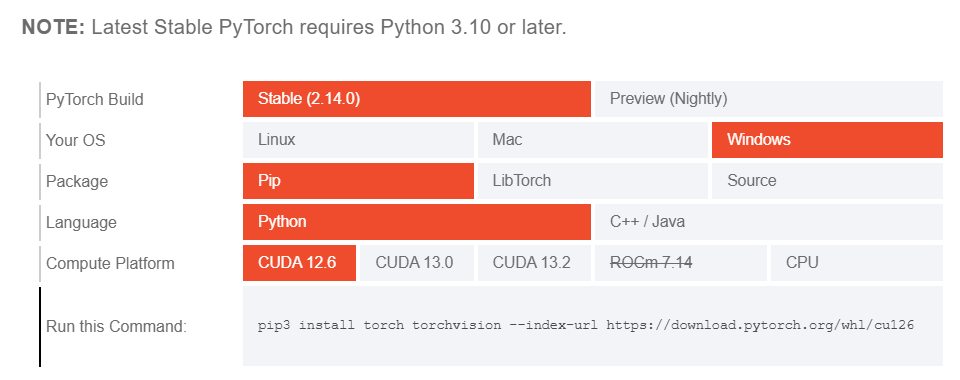
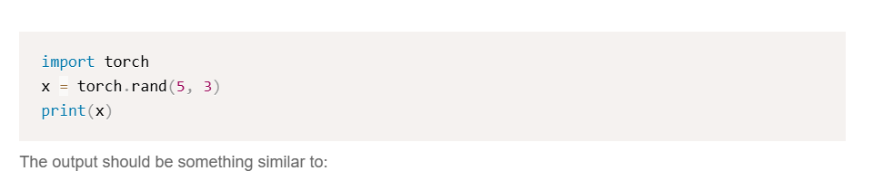

<!-- editorlm-hebrew-html-start -->
<style>
html, body, .vscode-body, .markdown-body, .markdown-preview, #write {
  direction: rtl !important; text-align: right !important;
}
ul, ol { padding-right: 2em !important; padding-left: 0 !important; }
blockquote { border-right: 3px solid #999; border-left: 0; padding-right: 1rem; padding-left: 0; }
@media print {
  html, body, .vscode-body, .markdown-body, .markdown-preview, #write {
    direction: rtl !important; text-align: right !important;
  }
}
</style>
<!-- editorlm-hebrew-html-end -->
<style>
.book { max-width: 900px; margin: auto; line-height: 1.8; font-family: Arial, sans-serif; }
.book .cover { min-height: 680px; box-sizing: border-box; padding: 64px 48px; margin: 24px 0 60px; background: #112b41; color: #f5f8fc; border-top: 9px solid #39c4b5; position: relative; }
.book .cover .eyebrow { color: #81e0d5; font-size: 15px; letter-spacing: 2px; }
.book .cover h1 { color: #fff; font-size: 48px; line-height: 1.3; border: 0; margin: 50px 0 18px; }
.book .cover .subtitle { font-size: 28px; color: #d8e6f0; }
.book .cover .author { font-size: 30px; color: #fff; margin-top: 52px; }
.book .cover .audience { color: #c1d3df; margin-top: 12px; }
.book .cover .motif { direction: ltr; text-align: left; font-family: Consolas, monospace; color: #81e0d5; font-size: 19px; margin-top: 54px; }
.book h1, .book h2, .book h3 { line-height: 1.4; font-weight: 700; }
.book > h1 { font-size: 32px !important; text-align: center !important; margin: 28px 0; }
.book h2 { font-size: 34px !important; text-align: center !important; color: #153b56 !important; background: #eef5fc; border: 0; border-bottom: 4px solid #299c91; border-radius: 10px 10px 0 0; padding: 28px 20px; margin: 24px 0 36px; }
.book h3 { font-size: 24px !important; text-align: right !important; color: #174e49 !important; background: #edf7f5; border: 0; border-right: 5px solid #299c91; border-radius: 6px; padding: 10px 16px; margin: 36px 0 18px; }
.book .chapter { height: 0; margin: 76px 0 0; border-top: 1px solid #ccd7df; break-before: page; page-break-before: always; break-after: avoid; page-break-after: avoid; }
.book .toc { padding: 24px; border-right: 5px solid #39a99d; background: rgba(70,150,155,.09); margin: 24px 0 48px; }
.book pre, .book pre code { direction: ltr !important; text-align: left !important; unicode-bidi: isolate; }
.book pre { box-sizing: border-box !important; width: 100% !important; max-width: 100% !important; margin: 0 !important; padding: 16px 20px; border: 1px solid #ccd7df; border-radius: 8px; line-height: 1.6; overflow-x: auto; }
.book code { direction: ltr; unicode-bidi: isolate; font-family: Consolas, "Courier New", monospace; }
.book pre { background: #f3f6fa !important; color: #1f2937 !important; }
.book pre code, .book pre code.hljs { background: transparent !important; color: #1f2937 !important; }
.book pre .hljs-keyword, .book pre .hljs-literal { color: #6f299c !important; }
.book pre .hljs-string { color: #216338 !important; }
.book pre .hljs-number { color: #075e68 !important; }
.book pre .hljs-comment { color: #526174 !important; }
.book pre .hljs-built_in, .book pre .hljs-title { color: #135b96 !important; }
.book table { width: 75%; max-width: 75%; margin: 18px auto; background: #f3f6fa; }
.book th, .book td { border: 1px solid #ccd7df; padding: 8px 12px; }
.book th, .book td { text-align: right; }
.book .small { font-size: .9em; opacity: .8; }
.book .python-intro { display: flex; align-items: center; gap: 28px; padding: 22px 28px; margin: 24px 0; background: #eef5fc; color: #183e63; border-right: 6px solid #3776ab; border-radius: 10px; }
.book .python-intro strong { font-size: 30px; }
.book .python-fact { background: #fff7d6; color: #423611; border-right: 6px solid #ffd343; border-radius: 8px; padding: 18px 24px; margin: 22px 0; }
.book .python-fact strong { font-size: 24px; }
.book img { max-width: 100%; height: auto; }
.book figure { box-sizing: border-box; width: 75%; max-width: 75%; margin: 24px auto; padding: 16px 20px; background: #f3f6fa; border: 1px solid #ccd7df; border-radius: 8px; text-align: center; }
.book figure img { display: block; margin: auto; }
.book figcaption { direction: rtl; text-align: center; font-size: .9em; color: #445566; }
@media print { .book > h2 { break-before: page; page-break-before: always; } }
.book .screen-strip { width: 760px; max-width: 100%; height: 220px; overflow: hidden; border: 1px solid #bccad5; border-radius: 8px; margin: 20px auto 8px; direction: ltr; }
.book .screen-strip.output { height: 265px; }
.book .screen-strip img { display: block; width: 1745px; max-width: none; }
.book .screen-menu { width: 400px; max-width: 100%; height: 295px; overflow: hidden; direction: ltr; margin: 20px auto 8px; border: 1px solid #bccad5; border-radius: 8px; }
.book .screen-menu img { display: block; width: 1745px; max-width: none; }
.book .code-panel { box-sizing: border-box !important; display: block !important; width: 75% !important; max-width: 75% !important; margin: 18px auto !important; }
@media print {
  .book .cover { min-height: 85vh; break-after: page; print-color-adjust: exact; -webkit-print-color-adjust: exact; }
  .book pre { white-space: pre-wrap; break-inside: avoid; }
  .book .chapter { margin: 0; border: 0; }
  .book h1, .book h2, .book h3 { break-after: avoid; page-break-after: avoid; break-inside: avoid; }
  .book h2 { margin-top: 0; }
  .book h2, .book h3 { print-color-adjust: exact; -webkit-print-color-adjust: exact; }
}
</style>

<style>
.book .book-nav { display: flex; flex-wrap: wrap; gap: 10px; justify-content: center; align-items: center; padding: 16px 0; margin: 20px 0 32px; border-top: 1px solid #ccd7df; border-bottom: 1px solid #ccd7df; }
.book .book-nav a { display: inline-block; padding: 10px 18px; border-radius: 8px; background: #eef5fc; color: #153b56 !important; border: 1px solid #b5ccd9; text-decoration: none !important; font-size: 16px; font-weight: bold; }
.book .book-nav a.toc-link { background: #174e49; color: #fff !important; border-color: #174e49; }
.book .book-nav a:hover, .book .book-nav a:focus { background: #d4eee8; color: #153b56 !important; outline: 2px solid #299c91; outline-offset: 2px; }
.book .section-list { line-height: 2; }
@media print { .book .book-nav { display: none; } }

/* Explicit Hebrew direction, including prose beginning with English. */
.book p, .book ul, .book ol, .book li,
.book blockquote, .book h1, .book h2, .book h3,
.book h4, .book th, .book td {
  direction: rtl !important;
  text-align: right !important;
  unicode-bidi: isolate;
}
/* Chapter titles keep their agreed centered layout. */
.book h2 { text-align: center !important; }
.book pre, .book pre code, .book .code-panel {
  direction: ltr !important;
  text-align: left !important;
  unicode-bidi: isolate;
}
</style>

<style>
.book .formula { box-sizing:border-box; width:75%; max-width:75%; direction:ltr!important; text-align:center!important; overflow-x:auto;
  padding:16px 20px; background:#f3f6fa; color:#1f2937; border:1px solid #ccd7df; border-radius:8px; margin:20px auto; font-size:1.15em; }
.book .grid-panel { box-sizing:border-box; width:75%; max-width:75%; margin:20px auto; padding:16px 20px; background:#f3f6fa; border:1px solid #ccd7df; border-radius:8px; }
.book .grid { direction:ltr!important; width:auto!important; max-width:100%!important; margin:0 auto; border-collapse:collapse; background:#fff; }
.book .grid td { direction:ltr!important; text-align:center!important; width:64px; height:48px; border:1px solid #8199aa; }
.book .grid .goal { background:#d3efdc; } .book .grid .bad { background:#f4d7d7; }
</style>

<div class="book" dir="rtl" lang="he">

<nav class="book-nav" aria-label="ניווט בספר">
<a href="01-%D7%9E%D7%91%D7%95%D7%90.md">→ הקודם</a>
<a class="toc-link" href="../index.md">תוכן העניינים</a>
<a href="03-%D7%9E%D7%95%D7%93%D7%9C%20%D7%A1%D7%91%D7%99%D7%91%D7%94%20%D7%A1%D7%95%D7%9B%D7%9F%20%D7%95-MDP.md">הבא ←</a>
</nav>

## ד.2 — התקנת PyTorch במחשב האישי

**המצגת:** [מבוא והתקנה](../../../sources/ML/1.%20מבוא%20והתקנה.pptx) · **אתר PyTorch:** [Get Started Locally](https://pytorch.org/get-started/locally/)

בחלק ג עבדנו עם PyTorch בתוך Colab, ולא היה צורך להתקין דבר. בחלק הזה המצב משתנה: הסוכנים שנבנה ישחקו במשחקים שכתבנו ב־Pygame, ומשחק כזה פותח חלון על המסך של המחשב שלנו. Colab רץ בשרת מרוחק ואינו יכול להציג חלון כזה, ולכן מעתה נריץ את הקוד במחשב האישי, בתוך Visual Studio Code, כפי שעשינו בחלק ב. סיבה נוספת היא משך האימון: אימון סוכן במשחק יכול להימשך שעות, ונוח שהוא ירוץ אצלנו ברקע, בלי תלות בחיבור לשרת של Google.

לכן, לפני שנתחיל ללמוד את האלגוריתמים, נתקין את PyTorch על המחשב. ההתקנה עצמה היא פקודה אחת בטרמינל, אבל לפניה יש החלטה אחת חשובה: האם להתקין גרסה שעובדת רק על המעבד הראשי (CPU), או גרסה שיודעת להשתמש גם בכרטיס הגרפי (GPU). בפרק זה נבין את ההבדל, נבדוק מה יש במחשב שלנו, נקבל מאתר PyTorch את פקודת ההתקנה המתאימה, נריץ אותה ונוודא שהכול עובד. הפרק מיועד ל־Windows, שהיא הסביבה שבה אנו עובדים בספר.

### גרסה ל־CPU או גרסה ל־GPU?

בפרק [ג.2](../03-%D7%9C%D7%9E%D7%99%D7%93%D7%AA%20%D7%9E%D7%9B%D7%95%D7%A0%D7%94/02-%D7%94%D7%AA%D7%A7%D7%A0%D7%AA%20PyTorch.md) הסברנו ש־GPU מבצע במקביל פעולות חשבון רבות, ולכן הוא מאיץ מאוד את אימון הרשתות. כדי ש־PyTorch תוכל להשתמש בכרטיס הגרפי, היא צריכה לדבר איתו בשפה שלו. **CUDA** היא הפלטפורמה של חברת NVIDIA שמאפשרת להריץ חישובים כלליים על הכרטיסים הגרפיים שלה, ו־PyTorch מגיעה בשתי גרסאות עיקריות: גרסה עם תמיכה ב־CUDA וגרסה ל־CPU בלבד.

- **גרסת CUDA** מתאימה רק למחשב שיש בו כרטיס גרפי של NVIDIA עם מנהל התקן (Driver) עדכני. חבילת ההתקנה כבר כוללת את ספריות CUDA הדרושות ל־PyTorch, ולכן אין צורך להתקין בנפרד את ערכת הפיתוח המלאה של CUDA. החבילה גדולה, כמה ג׳יגה־בייט, וההורדה נמשכת זמן.
- **גרסת CPU** מתאימה לכל מחשב, כולל מחשבים ניידים עם כרטיס גרפי משולב או כרטיס של AMD או Intel. היא קטנה יותר ומתקינים אותה מהר.

**כל הקוד בספר רץ בשתי הגרסאות.** ההבדל היחיד הוא מהירות האימון. הדוגמאות בחלק ד נכתבו כך שירוצו על CPU, ולכן אם אין לכם כרטיס של NVIDIA, או אם אינכם בטוחים, בחרו בגרסת CPU והמשיכו הלאה. אפשר תמיד להתקין את גרסת CUDA מאוחר יותר באותה דרך.

### שלב 1 — בדיקת גרסת פייתון

פותחים את Visual Studio Code, ובתפריט **Terminal** בוחרים **New Terminal**. בטרמינל שנפתח מקלידים:

<div class="code-panel" dir="ltr">

```text
python --version
```

</div>

**פלט**

<div class="code-panel" dir="ltr">

```text
Python 3.12.10
```

</div>

המספר אצלכם עשוי להיות שונה. הגרסה היציבה הנוכחית של PyTorch דורשת **Python 3.10 ומעלה**, ובאתר PyTorch מצוין ש־Windows נתמכת עם Python 3.10 עד 3.14. אם מודפסת גרסה ישנה יותר, או שהפקודה אינה מוכרת, יש להתקין פייתון עדכני מ־[python.org](https://www.python.org/downloads/) כפי שעשינו בחלק א, ולפתוח טרמינל חדש. <!-- editorlm-source-ref: [sources/ML/pdf/1. מבוא והתקנה.pdf#L100-L104] -->

### שלב 2 — האם יש במחשב כרטיס גרפי של NVIDIA?

הדרך הפשוטה ביותר לבדוק היא באמצעות הכלי `nvidia-smi`, שמותקן יחד עם מנהל ההתקן של NVIDIA. באותו טרמינל מקלידים:

<div class="code-panel" dir="ltr">

```text
nvidia-smi
```

</div>

**פלט**

<div class="code-panel" dir="ltr">

```text
+-------------------------------------------------------------------------+
| NVIDIA-SMI 591.86         Driver Version: 591.86    CUDA Version: 13.1  |
|-----------------------------------------+-------------------------------+
| GPU  Name                               |          Memory-Usage         |
|=========================================+===============================|
|   0  NVIDIA GeForce RTX 3090 Ti         |     1710MiB / 24564MiB        |
+-----------------------------------------+-------------------------------+
```

</div>

הפלט כאן קוצר. אם מופיעה טבלה כזו, במחשב יש כרטיס של NVIDIA ומנהל התקן פעיל, ואפשר להתקין את גרסת CUDA. שימו לב לערך **CUDA Version** בפינה הימנית העליונה של הטבלה: זו גרסת CUDA הגבוהה ביותר שמנהל ההתקן תומך בה. בשלב הבא נבחר באתר PyTorch גרסת CUDA שאינה גבוהה ממנה. אם הערך אצלכם נמוך מהגרסאות המוצעות באתר, עדכנו את מנהל ההתקן מאתר [NVIDIA](https://www.nvidia.com/en-us/drivers/) ובדקו שוב.

אם במקום טבלה מתקבלת הודעה שהפקודה אינה מוכרת, יש שתי אפשרויות: במחשב אין כרטיס של NVIDIA, ואז מתקינים את גרסת CPU; או שיש כרטיס אבל מנהל ההתקן שלו לא הותקן, ואז מתקינים אותו מאתר NVIDIA ובודקים שוב. <!-- editorlm-source-ref: [sources/ML/pdf/1. מבוא והתקנה.pdf#L94-L98] -->

### שלב 3 — קבלת פקודת ההתקנה מאתר PyTorch

נכנסים לאתר [pytorch.org](https://pytorch.org/) ולוחצים על **Get started**. הכפתור מופיע בפס השחור שמתחת לכותרת הראשית.

<figure>

<figcaption>דף הבית של PyTorch: הכפתור Get started מוביל למסך ההתקנה.</figcaption>
</figure>

בדף שנפתח, **Start Locally**, מופיעה טבלת בחירה. בכל שורה לוחצים על האפשרות המתאימה, והאתר מרכיב עבורנו את פקודת ההתקנה בשורה התחתונה, **Run this Command**.

<figure>

<figcaption>טבלת הבחירה באתר PyTorch. כאן נבחרו Windows, Pip, Python ו־CUDA 12.6, והאתר הרכיב את הפקודה בשורה התחתונה.</figcaption>
</figure>

כך בוחרים בכל שורה:

1. **PyTorch Build:** בוחרים **Stable**, הגרסה היציבה והנבדקת. גרסת Preview מיועדת למפתחים שרוצים את הקוד החדש ביותר, לפני שנבדק במלואו.
2. **Your OS:** בוחרים **Windows**.
3. **Package:** בוחרים **Pip**, מנהל החבילות שמגיע עם פייתון ושבו השתמשנו להתקנת Pygame.
4. **Language:** בוחרים **Python**.
5. **Compute Platform:** כאן מיושמת ההחלטה מתחילת הפרק. אם אין כרטיס של NVIDIA בוחרים **CPU**. אם יש, בוחרים גרסת **CUDA** שאינה גבוהה מהערך שראינו בפלט של `nvidia-smi`. האתר מציין שבדרך כלל עדיף לבחור את גרסת CUDA העדכנית ביותר שמנהל ההתקן תומך בה.

הפקודה שמתקבלת נראית כך. לגרסת CPU:

<div class="code-panel" dir="ltr">

```text
pip3 install torch torchvision --index-url https://download.pytorch.org/whl/cpu
```

</div>

ולגרסת CUDA, למשל CUDA 12.6:

<div class="code-panel" dir="ltr">

```text
pip3 install torch torchvision --index-url https://download.pytorch.org/whl/cu126
```

</div>

ההבדל בין הפקודות הוא רק בסוף הכתובת: `cpu` לעומת מספר גרסת CUDA בלי נקודה, כמו `cu126`, `cu130` או `cu132`. הכתובת אומרת ל־pip מאיזה מאגר להוריד את החבילה, ולכן חשוב להעתיק את הפקודה כפי שהאתר מציג אותה ולא להקליד אותה מהזיכרון. מספרי הגרסאות באתר מתעדכנים מדי כמה חודשים, ולכן הפקודה אצלכם עשויה להיות שונה מעט מזו שבתמונה. <!-- editorlm-source-ref: [sources/ML/pdf/1. מבוא והתקנה.pdf#L82-L92] -->

### שלב 4 — הרצת ההתקנה בטרמינל של VS Code

מעתיקים את הפקודה מהאתר, מדביקים אותה בטרמינל של Visual Studio Code ומקישים Enter. pip מוריד את החבילות ומתקין אותן. בגרסת CPU ההורדה קצרה; בגרסת CUDA היא עשויה להימשך דקות ארוכות, כי החבילה כוללת את ספריות CUDA. ההתקנה הסתיימה כשמופיעה שורה שמתחילה ב־**Successfully installed** ואחריה שמות החבילות, ובהן `torch` ו־`torchvision`. <!-- editorlm-source-ref: [sources/ML/pdf/1. מבוא והתקנה.pdf#L88-L92] -->

אם הטרמינל מודיע ש־`pip3` אינו מוכר, מחליפים את תחילת הפקודה ב־`python -m pip install` ומשאירים את שאר הפקודה כפי שהיא. כך מבטיחים שהחבילה מותקנת עבור אותו פייתון שבדקנו בשלב 1.

### שלב 5 — בדיקת ההתקנה

כמו במצגת, נבדוק את ההתקנה בכמה צעדים בטרמינל חדש. תחילה מפעילים את פייתון במצב אינטראקטיבי בפקודה `python`; מופיעה שורת הפקודה של פייתון, שמתחילה ב־`>>>`. מקלידים שורה אחר שורה:

<div class="code-panel" dir="ltr">

```python
import torch
print(torch.__version__)
print(torch.cuda.is_available())
```

</div>

**פלט**

<div class="code-panel" dir="ltr">

```text
2.14.0+cu126
True
```

</div>

- אם `import torch` עובר בלי הודעת שגיאה, PyTorch מותקנת. הפקודה השנייה מדפיסה את הגרסה שהותקנה; הסיומת מציינת את הפלטפורמה, `cu126` לגרסת CUDA או `cpu` לגרסת CPU.
- `torch.cuda.is_available()` מחזירה `True` כאשר PyTorch מזהה כרטיס גרפי שאפשר להשתמש בו, ו־`False` אחרת. בגרסת CPU התשובה תמיד `False`, וזה תקין. אם התקנתם את גרסת CUDA ובכל זאת התקבל `False`, בדרך כלל מנהל ההתקן ישן מדי לגרסת CUDA שנבחרה; עדכנו אותו והריצו שוב את הבדיקה.

באתר PyTorch מוצעת בדיקה נוספת: יצירת טנסור אקראי בגודל 5×3 והדפסתו.

<figure>

<figcaption>בדיקת ההתקנה המוצעת באתר PyTorch: יצירת טנסור אקראי והדפסתו.</figcaption>
</figure>

אם מודפסת טבלה של חמש שורות ושלושה מספרים אקראיים בין 0 ל־1, הכול מוכן. יוצאים מפייתון בפקודה `exit()`. <!-- editorlm-source-ref: [sources/ML/pdf/1. מבוא והתקנה.pdf#L100-L104] -->

### בחירת המעבד בקוד

בחלק ג הרצנו את כל הטנסורים והרשתות על המעבד שבחר עבורנו Colab. במחשב האישי הבחירה בידינו, והשורה המקובלת לכך היא:

<div class="code-panel" dir="ltr">

```python
import torch

device = torch.device("cuda" if torch.cuda.is_available() else "cpu")
print(device)
```

</div>

**פלט**

<div class="code-panel" dir="ltr">

```text
cuda
```

</div>

המשתנה `device` מקבל את הערך `cuda` אם יש כרטיס גרפי זמין, ו־`cpu` אחרת. כשהקוד מעביר רשת או טנסור אל `device`, אותו קוד רץ נכון בשני המקרים. הדוגמאות בחלק ד נשארות על CPU כדי שכל תלמיד יוכל להריץ אותן; מי שהתקין את גרסת CUDA יוכל להוסיף את השורה הזו ולהאיץ את האימון בפרקים שעוסקים ברשתות נוירונים, החל מפרק ד.10.

זהו. סביבת העבודה מוכנה: פייתון, Pygame ו־PyTorch מותקנים על המחשב, והתרגילים בחלק זה ירוצו מקומית. בפרק הבא נחזור לרעיונות של למידת חיזוק ונגדיר במדויק מהם סביבה, סוכן, מצב, פעולה ותגמול.

<nav class="book-nav" aria-label="ניווט בספר">
<a href="01-%D7%9E%D7%91%D7%95%D7%90.md">→ הקודם</a>
<a class="toc-link" href="../index.md">תוכן העניינים</a>
<a href="03-%D7%9E%D7%95%D7%93%D7%9C%20%D7%A1%D7%91%D7%99%D7%91%D7%94%20%D7%A1%D7%95%D7%9B%D7%9F%20%D7%95-MDP.md">הבא ←</a>
</nav>

</div>

<!-- editorlm-source-versions: {"schemaVersion": 1, "sources": {"sources/ML/pdf/1. מבוא והתקנה.pdf": {"sourceSha256": "b7cfe85f512e67a3d3b3909dddeed6220a74d727df3bf44c6df80d4dfae14b87", "canonicalTextSha256": "6ee69632c6973871916d0a1527dcaa4d415571fccd7f07e8231071040efcaad2"}}} -->
