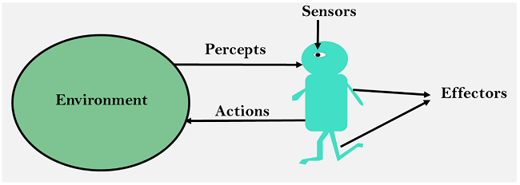
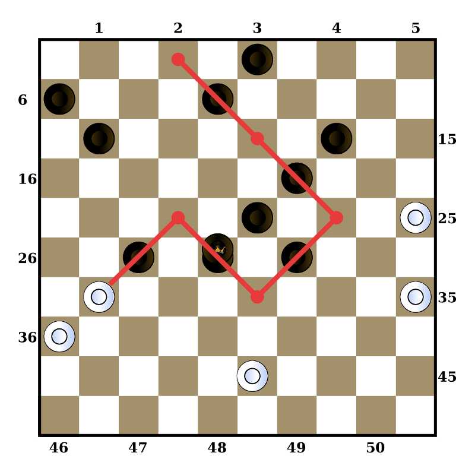
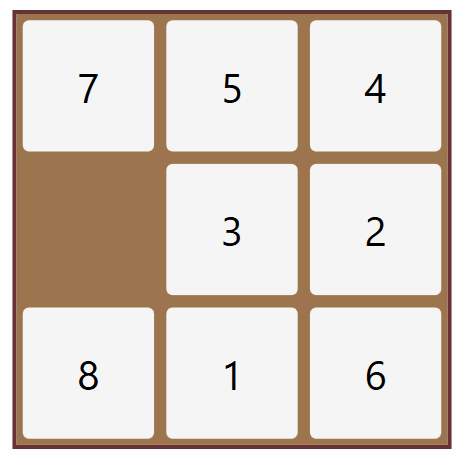
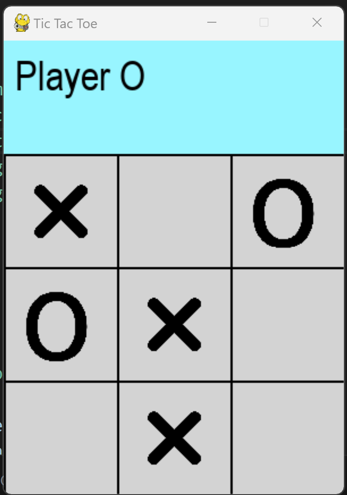
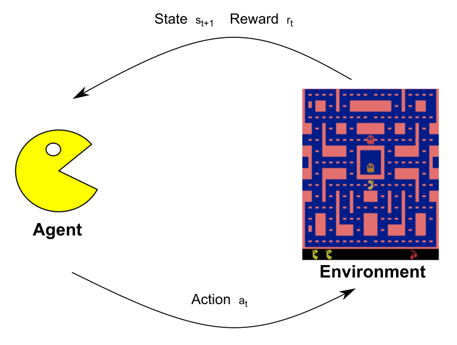
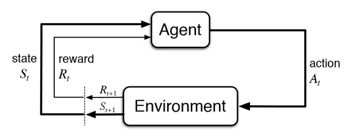

<!-- editorlm-hebrew-html-start -->

<!-- editorlm-hebrew-html-end -->

<nav class="book-nav" aria-label="ניווט בספר">
<a href="01-%D7%9E%D7%91%D7%95%D7%90.md">→ הקודם</a>
<a class="toc-link" href="../index.md">תוכן העניינים</a>
<a href="04-Policy%20Iteration.md">הבא ←</a>
</nav>

## ד.3 — מודל סביבה–סוכן ו־MDP

**המצגות:** [מודל סביבה–סוכן](../../../sources/PyGame/1.%20מודל%20סביבה%20סוכן.pptx) · [מבוא ללמידת חיזוק](../../../sources/RL/1.%20למידת%20חיזוק%20-%20מבוא.pptx)

בפרק הקודם ראינו את הרעיון הכללי: סוכן פועל בסביבה, מקבל תגמולים ולומד מהם. אבל כדי לכתוב קוד שלומד, רעיון כללי אינו מספיק. השאלה שהפרק הזה עונה עליה היא: איך מתארים משחק — או כל משימה אחרת — בצורה מדויקת מספיק כדי שאלגוריתם יוכל ללמוד אותה? מה בדיוק "רואה" הסוכן, מה הוא יכול לעשות, ומהו המדד שלפיו נשפוט אם הוא משחק טוב?

כדי שתוכנה תלמד לשחק, לא מספיק שיהיה על המסך לוח יפה. היא צריכה לקבל תיאור של המצב, לבחור פעולה ולדעת מה השתנה בעקבותיה. לכן נבנה את המשחק לפי **מודל סביבה–סוכן**: מבנה המפריד בין העולם שבו משחקים לבין מי שבוחר את המהלכים. בהמשך נחליף סוכן אקראי בסוכן לומד, תוך שימוש באותם חוקי משחק ובאותו ממשק.

הפרק בנוי בשני רבדים. תחילה נגדיר את המושגים מצד התוכנה — סביבה, סוכן, מצב, פעולה והממשק ביניהם — כפי שנממש אותם ב־Pygame. אחר כך נעבור לרובד המתמטי: נראה שאותם מושגים בדיוק מרכיבים מודל שנקרא MDP, ונוסיף לו את המושגים שכל שאר הפרקים בחלק ד יישענו עליהם — תשואה, מדיניות, ערך של מצב וערך של פעולה. כדי שהמושגים לא יישארו מופשטים, נמחיש כל אחד מהם על לוח קטן של 4×4 משבצות.

### מהו מודל סביבה–סוכן

**מודל סביבה–סוכן** הוא דרך לבנות מערכת שפותרת בעיה בעזרת בינה מלאכותית. הרעיון פשוט: מפרידים בין **העולם** שבו הבעיה מתרחשת לבין **מי שפועל** בתוכו. העולם מתואר על ידי רכיב אחד, הסביבה; הפועל מתואר על ידי רכיב אחר, הסוכן; וביניהם עוברים רק שני דברים: הסוכן מקבל מהסביבה תיאור של מה שקורה בה, ומחזיר לה פעולה. המודל מתאים לתיאור רובוט שנע בחדר, מכונית שנוסעת בכביש, וגם משחק שבו המחשב הוא אחד המשתתפים. בהמשך הפרק נראה שהמודל הזה הוא גם הבסיס למודל המתמטי MDP, שעליו נבנית למידת החיזוק.

<figure>

<figcaption>המודל בציור אחד: הסביבה (Environment) שולחת לסוכן את מה שהוא קולט (Percepts) דרך החיישנים שלו, והסוכן מחזיר לסביבה פעולות (Actions) שמשנות אותה.</figcaption>
</figure>

במודל ארבעה מושגים, וכל אחד מהם יהיה בקוד שלנו מחלקה או מבנה נתונים נפרד:

- **סביבה — Environment:** העולם שבו פועל הסוכן, יחד עם חוקיו. במשחק אלה חוקי המשחק.
- **סוכן — Agent:** הרובוט או התוכנה שאנחנו מתכנתים. הסוכן קולט את הסביבה ומבצע פעולות שמשנות אותה.
- **מצב — State:** תיאור של העולם ברגע מסוים, "הקפאה" של הסביבה.
- **פעולה — Action:** מה שהסוכן יכול לעשות, ומה שמשנה את הסביבה. במשחק אלה צעדי המשחק.

נעבור עכשיו על כל אחד מהם בנפרד, ונראה מה כל רכיב צריך להכיל.

### הסביבה — Environment

הסביבה מייצגת את העולם שבו פועל הסוכן, והיא זו שקובעת את החוקים. באיקס עיגול היא יודעת אילו משבצות פנויות, מה קורה ללוח כשמניחים בו סימן, ומתי המשחק נגמר. הסוכן אינו מחליט על החוקים; הוא רק בוחר פעולה, והסביבה קובעת מה תוצאתה. לכן המחלקה שמייצגת את הסביבה תכלול, למשל במשחק, את הרכיבים הבאים:

| מהות | שם | סוג |
| --- | --- | --- |
| המצב הנוכחי של הסביבה | `state` | מאפיין |
| משנה את המצב הנוכחי בהתאם לפעולה שהתקבלה | `move(action)` | פונקציה |
| בודקת אם פעולה חוקית | `is_legal(action)` | פונקציה |
| מחזירה אמת אם המצב הוא סוף משחק | `end_of_game(state)` | פונקציה |
| מקבלת מצב ופעולה ומחזירה את המצב הבא, בלי לשנות את מצב הסביבה | `next_state(state, action)` | פונקציה |
| מקבלת מצב ומחזירה את כל הפעולות החוקיות בו | `get_actions(state)` | פונקציה |
| מקבלת מצב ופעולה ומחזירה את התגמול שהסוכן מקבל בעקבות הפעולה | `reward(state, action)` | פונקציה |

שימו לב להבדל בין שתי הפונקציות הדומות: `move` משנה את המשחק החי, ואילו `next_state` רק מחשבת ומחזירה מצב חדש ומשאירה את המשחק כפי שהיה. ההבדל הזה יהיה חשוב כשנרצה לבדוק כמה אפשרויות לפני שבוחרים, בלי לבצע את כולן בפועל. התגמול, השורה האחרונה בטבלה, הוא המשוב המספרי שממנו הסוכן ילמד; נגדיר אותו במדויק בהמשך הפרק. השמות בטבלה הם השמות שבהם נשתמש בקוד הספר; במאגרי הקורס חלקם כתובים מעט אחרת, אך התפקיד זהה.

### המצב — State

המצב מתאר רגע מסוים בסביבה, מעין "צילום" או "הקפאה" שלה. הכלל החשוב הוא שהמצב צריך לכלול **את כל הנתונים** שמתארים את הסביבה באותו רגע, כך שמי שמקבל את המצב יוכל להמשיך את המשחק בלי לדעת דבר על מה שקרה קודם.

- **בשחמט** המצב יהיה מערך 8×8, ובכל תא יצוין הכלי שנמצא בו. זה לא מספיק: צריך לשמור גם **תור של מי** לשחק, כי אותו לוח בתור הלבן ובתור השחור הם שני מצבים שונים.
- **במשחק Atari Breakout** (מחבט שמקפיץ כדור אל לבנים) המצב יכלול את מערך הלבנים שעדיין קיימות, את מיקום המחבט, את מיקום הכדור, את מהירותו ואת כיוונו. בלי המהירות והכיוון אי אפשר לדעת לאן הכדור ינוע בפריים הבא, ולכן צילום של מיקום הכדור בלבד אינו מצב שלם.
- **באיקס עיגול** די בלוח 3×3 ובתור השחקן.

המחלקה שמייצגת מצב במשחק לוח תכלול לכן:

| מהות | שם | סוג |
| --- | --- | --- |
| מערך המתאר את מצב המשחק | `board` | מאפיין |
| תור של מי לשחק | `player` | מאפיין |
| יצירת המצב ההתחלתי של המשחק | `init_board()` | פעולה |

### הסוכן — Agent

סוכן הוא כל מערכת שמקבלת נתונים מהסביבה ושפעולותיה משנות את הסביבה. ההגדרה רחבה בכוונה: היא כוללת אדם, תוכנה פשוטה ותוכנה לומדת, כל עוד יש למי שמדובר בו קלט מהסביבה ופלט שמשנה אותה. באותו משחק אפשר להגדיר כמה סוגי סוכנים:

- **סוכן אדם — Human Agent:** סוכן אנושי. במשחק מחשב זו המחלקה שמקבלת קלט מהמשתמש, למשל לחיצת עכבר על משבצת, ומתרגמת אותו לפעולה.
- **סוכן AI:** תוכנת מחשב שפועלת בסביבה בעצמה. הוא יכול להגריל פעולה, לחשב אותה לפי חוקים קבועים, או, כפי שנלמד בחלק זה, לבחור אותה לפי מה שלמד מניסיון.

מה שמשותף לכל הסוכנים הוא הממשק שלהם: הסוכן מחזיק את הסביבה שבה הוא פועל, ויש לו פעולה אחת מרכזית, שמקבלת מצב ומחזירה פעולה. בזכות זה אפשר להחליף סוכן אדם בסוכן לומד בלי לשנות את המשחק עצמו.

| מהות | שם | סוג |
| --- | --- | --- |
| הסביבה שבה פועל הסוכן | `env` | מאפיין |
| מקבלת מצב ומחזירה את הפעולה שהסוכן בוחר לבצע בו | `get_action(state)` | פעולה |

### הפעולה — Action

פעולה היא תיאור של מה שהסוכן יכול לעשות במצב מסוים. צורת הפעולה תלויה במשחק, וכדאי לבחור אותה כך שהסביבה תוכל לבצע אותה בקלות:

- **באיקס עיגול** הפעולה היא ציון המקום הנבחר בלוח: זוג `(row, col)` של שורה ועמודה.
- **בדמקה** הפעולה היא רשימה של נקודות. בצעד רגיל יש בה שתי נקודות, נקודת ההתחלה ונקודת הסיום; בצעד אכילה, שבו כלי אחד קופץ מעל כמה כלים של היריב, הרשימה כוללת את כל הנקודות שבהן הוא נוחת בדרך.
- **בפאזל המספרים** הפעולה היא כיוון ההזזה של המשבצת הריקה: `Up`, `Down`, `Right` או `Left`.

<figure>

<figcaption>פעולה בדמקה: הקו האדום הוא צעד אכילה אחד, ולכן הפעולה היא רשימה של כל הנקודות שבמסלול.</figcaption>
</figure>

<figure>

<figcaption>פאזל המספרים: בכל צעד הפעולה היא כיוון אחד מארבעה, והמשבצת הריקה זזה אליו. (אנימציה; בגרסה המודפסת מוצג פריים אחד.)</figcaption>
</figure>

### המחלקה הגרפית

רכיב אחד נשאר מחוץ לארבעת מושגי המודל: הציור על המסך. אנחנו מפרידים את הגרפיקה של המשחק מן הלוגיקה שלו, ובונים אותה במחלקה נפרדת, בעזרת ספריית Pygame שהכרנו בחלק ב. למחלקה הגרפית פעולה מרכזית אחת:

| מהות | שם | סוג |
| --- | --- | --- |
| מקבלת מצב ומציירת אותו על המסך | `draw(state)` | פעולה |

ההפרדה הזאת היא שמאפשרת לאמן סוכן בלי לפתוח חלון בכלל: הסביבה והסוכן משחקים ביניהם אלפי משחקים בזיכרון, ורק כשרוצים לצפות במשחק קוראים ל־`draw`. כך ייראה משחק איקס עיגול שנבנה לפי המודל, כשהחלון מצויר ב־Pygame:

<figure>

<figcaption>איקס עיגול שנבנה לפי המודל: הסביבה מחזיקה את הלוח ואת התור, הסוכנים בוחרים משבצות, והמחלקה הגרפית מציירת את המצב.</figcaption>
</figure>

בקורס בונים את המשחק הזה שלב אחר שלב: תחילה עם סוכן אדם שמקבל קלט מן המשתמש, ובשלבים הבאים עם סוכני AI שמשחקים בעצמם. בספר לא נבנה את המשחק; נניח שהוא קיים ונשתמש בפונקציות שבטבלאות שלמעלה. חוזה הפונקציה, כלומר מה היא מקבלת, מחזירה ומשנה, חשוב יותר מן השם שניתן לה.

<!-- editorlm-source-ref: [sources/PyGame/1. מודל סביבה סוכן.pptx#L7-L81] -->

### מן המשחק אל MDP

עד כאן תיארנו את המשחק במונחי תוכנה: פונקציות, ממשק וחוזה. כדי לנסח אלגוריתמי למידה ולהוכיח שהם עובדים, נצטרך תיאור מתמטי של אותו הדבר. המודל המתמטי שבו נשתמש נקרא **Markov Decision Process**, ובקיצור **MDP** — תהליך קבלת החלטות מרקובי. הוא מתאר מצבים, פעולות, מעברים בין מצבים ותגמולים. בכל צעד הסוכן מקבל מצב, בוחר פעולה, והסביבה מחזירה מצב חדש ותגמול.

st → at → (rt, st+1)

הסימן התחתון מציין את הזמן: st הוא המצב בצעד t, ו־at הפעולה שנבחרה בו. כאן נסמן את התגמול שמתקבל אחרי הפעולה בזמן t באמצעות rt. רצף הצעדים ממשיך עד למצב סופי, אם קיים כזה במשימה. רצף שלם כזה — מהמצב ההתחלתי ועד הסיום — נקרא **אפיזודה — Episode**; משחק אחד של איקס־עיגול הוא אפיזודה אחת.

<figure>

</figure>

<!-- editorlm-source-ref: [sources/RL/1. למידת חיזוק - מבוא.pptx#L19-L29] -->

### תגמול: המשוב מן הסביבה

**פונקציית התגמול** מקבלת את המצב שבו היה הסוכן, את הפעולה שביצע ואת המצב שאליו הגיע, ומחזירה מספר. המספר יכול להיות חיובי, שלילי או אפס. כמה דוגמאות לבחירת תגמולים:

- **בשחמט:** 0 על כל צעד, 1 על ניצחון, ‎−1 על הפסד ו־0 על תיקו.
- **במשחק מחשב כמו פקמן:** התגמול הוא מספר הנקודות שפקמן מקבל על אכילת מזון או רוחות, ו־‎−100 במקרה שנאכל על ידי רוח.
- **סוכן שמטיס רחפן:** 1 על כל שנייה שהרחפן באוויר, ו־‎−50 על התרסקות.
- **סוכן שמשקיע בבורסה:** התגמול בהתאם לרווחים ולהפסדים היומיים.

הבחירה בתגמולים מגדירה לסוכן מה אנחנו רוצים להשיג: הרחפן "ירצה" להישאר באוויר כמה שיותר זמן, והמשקיע "ירצה" להרוויח.

באופן כללי התגמול עשוי להיות תלוי במצב, בפעולה ובמצב החדש:

r = R(s, a, s′)

תגמול אינו הוראה לגבי הפעולה הבאה. הוא מספר המתאר את תוצאת הפעולה שבוצעה, וממנו הסוכן צריך ללמוד.

<!-- editorlm-source-ref: [sources/RL/1. למידת חיזוק - מבוא.pptx#L31-L33] -->

### מטרה ומדיניות

עכשיו, כשיש לנו תגמולים, אפשר לשאול מה בדיוק הסוכן מנסה להשיג. מטרת הסוכן היא להשיג תגמול מצטבר גבוה לאורך זמן, ולא רק ברגע הבא. פעולה שנותנת מעט עכשיו עשויה לפתוח דרך לניצחון בהמשך — כמו הקרבת כלי בשחמט כדי לזכות במט כמה מהלכים אחר כך; לכן אין די בבחירת התגמול המיידי הגדול ביותר. כדי לדבר על "סך התגמולים מכאן והלאה" נצטרך מושג משלו. אם משחק מסתיים בזמן T, נגדיר תחילה את **התשואה — Return** מן הזמן t כסכום התגמולים שיגיעו אחריו:

Gt = rt + rt+1 + … + rT−1

**המטרה — Goal** של הסוכן היא למקסם את התגמול הכולל לאורך זמן, כלומר את התשואה. במודל שלנו אנחנו מניחים שכל מטרה שנרצה להציב לסוכן אפשר להגדיר כך: כמקסום של התגמול העתידי. אם רוצים שהרחפן יישאר באוויר, נותנים תגמול על כל שנייה באוויר; אם רוצים שהסוכן ינצח, נותנים תגמול על ניצחון. את המטרה מגדירים דרך התגמולים, והסוכן מחפש את הדרך שתצבור מהם הכי הרבה.

התשואה מודדת עד כמה הצליח משחק אחד. אבל מה שאנחנו רוצים לשפר אינו משחק בודד אלא דרך ההחלטה של הסוכן. **מדיניות — Policy** היא פונקציה שמקבלת מצב ומחזירה את הפעולה שבה נוקט הסוכן באותו מצב. נסמן מדיניות באות היוונית π (פאי); במצגות היא מסומנת גם P. במדיניות דטרמיניסטית הפעולה נקבעת ישירות מן המצב:

a = π(s)

״בכל מקום נסה לנוע למעלה״ היא מדיניות, גם אם היא גרועה. הלמידה נועדה לשפר את בחירת הפעולות, ולא רק לזכור תוצאה של משחק יחיד. במילים אחרות: כשאנחנו אומרים שסוכן "למד לשחק", הכוונה היא שהמדיניות שלו השתפרה — התוצר של למידת חיזוק הוא תמיד מדיניות. נרחיב על המדיניות מיד אחרי שנראה איך נראה רצף שלם של משחק.

<!-- editorlm-source-ref: [sources/RL/1. למידת חיזוק - מבוא.pptx#L35-L45] -->

### שרשרת מרקוב ותכונת מרקוב

את פעילות הסוכן בסביבה אפשר לרשום כרצף: מצב, פעולה, תגמול, מצב חדש, פעולה, תגמול, וכן הלאה עד המצב הסופי. הרצף הזה נקרא **שרשרת מרקוב — Markov Chain**, והוא נקבע לפי המדיניות של הסוכן:

S0, A0, R0, S1, A1, R1, … , ST

S0 הוא המצב ההתחלתי, A0 הפעולה שהסוכן בחר בו, R0 התגמול שהתקבל עליה, S1 המצב שאליו הגיעה הסביבה, וכך הלאה עד ST, המצב הסופי. משחק שלם של איקס עיגול הוא שרשרת אחת כזאת. הציור הבא מראה חוליה אחת בשרשרת: הסוכן מקבל מצב ותגמול, מחזיר פעולה, והסביבה משיבה בתגמול ובמצב הבא.

<figure>

<figcaption>חוליה אחת בשרשרת: הסוכן (Agent) מקבל מצב St ותגמול Rt, בוחר פעולה At, והסביבה (Environment) מחזירה את התגמול ואת המצב של הצעד הבא. בציור, שלקוח מספרם של Sutton ו־Barto, מה שחוזר מהסביבה מסומן Rt+1 ו־St+1; בספר אנחנו מסמנים את התגמול על הפעולה שבזמן t ב־rt.</figcaption>
</figure>

המדיניות שהגדרנו מסתכלת רק על המצב הנוכחי: a = π(s). זה מעלה שאלה — האם מותר לנו להתעלם מכל מה שקרה קודם בשרשרת? התשובה תלויה בשאלה כמה מידע המצב מכיל. כדי לבחור את ההמשך על סמך המצב הנוכחי, המצב צריך לכלול את המידע הדרוש לתיאור המעבר הבא. כאשר המצב מספיק לשם כך, אין צורך לדעת באיזה מסלול הגענו אליו. זו **תכונת מרקוב — Markov Property**: הערך של מצב תלוי אך ורק במצב שבו נמצאים, ואין חשיבות למצבים שביקרנו בהם בעבר; המצב הבא והתגמול נקבעים לפי המצב הנוכחי והפעולה בלבד.

למשל, אם אנחנו נמצאים במצב S במשחק, הערך של S אינו תלוי בדרך שבה הגענו אליו: אין חשיבות אם הגענו ל־S באמצעות הפעולה A1 מהמצב S1, או באמצעות הפעולה A2 מהמצב S2. מה שמעניין הוא רק מה אפשר להשיג מכאן והלאה. בפאזל המספרים אותו לוח ואותה הזזה חוקית יתנו אותו לוח חדש, גם אם הגענו ללוח הנוכחי בדרכים שונות. במשחק כדור, לעומת זאת, שני צילומים של כדור באותו מקום עשויים להוביל להמשך שונה אם הוא נע בכיוונים שונים. לכן יש לכלול במצב גם את נתוני התנועה.

<!-- editorlm-source-ref: [sources/RL/1. למידת חיזוק - מבוא.pptx#L39-L41] -->
<!-- editorlm-source-ref: [sources/PyGame/1. מודל סביבה סוכן.pptx#L41-L45] -->

### מדיניות ומדיניות מיטבית

נחזור למדיניות, עכשיו כשיש לנו את מושג השרשרת. המדיניות היא הפונקציה שמקבלת מצב ומחזירה פעולה:

π(s) → action

המדיניות היא שקובעת את שרשרת מרקוב של הסוכן: היא קובעת איזו פעולה הוא יעשה בכל אחד מהצעדים, ולכן לאיזה מצב יגיע ואילו תגמולים יקבל. שתי מדיניות שונות מאותו מצב התחלתי יוצרות שתי שרשראות שונות.

המדיניות לא חייבת להיות טובה. אם במבוך אנחנו תמיד הולכים ימינה, זו מדיניות, גם אם היא מובילה לקיר ואינה מגיעה ליציאה. אם מדיניות היא דרך לבחור פעולות, טבעי לשאול מהי הדרך הטובה ביותר. **מדיניות מיטבית — Optimal Policy**, המסומנת π* (ובמצגות P*), היא המדיניות שאם נפעל לפיה בכל מצב, נקבל את סכום התגמולים העתידיים הגבוה ביותר שאפשר להשיג במשימה. מציאת π*, או קירוב טוב שלה, היא המטרה של כל האלגוריתמים שנלמד בפרקים הבאים. כעת נוכל להמחיש מדיניות ולבחון מה היא משיגה באמצעות לוח קטן.

<!-- editorlm-source-ref: [sources/RL/1. למידת חיזוק - מבוא.pptx#L43-L45] -->

### Grid World: רואים מדיניות על לוח

איקס־עיגול הוא משחק קטן, אבל יש בו אלפי מצבים אפשריים — קשה לצייר אותם על דף. לכן נמחיש את המושגים על משחק פשוט עוד יותר, שכל מצביו נראים בבת אחת: **Grid World**, לוח משבצות שהסוכן נע בו. נשתמש בלוח 4×4. המצב הוא מיקום הסוכן, והפעולות הן למעלה, למטה, שמאלה וימינה. מתחילים בפינה השמאלית העליונה. כניסה ליעד הירוק נותנת 1, וכניסה לתא האדום נותנת ‎−1; שני המצבים האלה מסיימים את המשחק. בשאר המעברים התגמול 0. שורות ועמודות בקוד נספרות מאפס.

<table class="grid" dir="ltr" aria-label="לוח Grid World בגודל ארבע על ארבע">
<tr><td>התחלה</td><td>0</td><td>0</td><td>0</td></tr>
<tr><td>0</td><td>0</td><td class="bad">−1</td><td>0</td></tr>
<tr><td>0</td><td>0</td><td>0</td><td>0</td></tr>
<tr><td>0</td><td>0</td><td>0</td><td class="goal">+1</td></tr>
</table>

נסכם את ארבעת מרכיבי ה־MDP במשחק הזה: **המצב** הוא מיקום הסוכן, זוג (שורה, עמודה); **הפעולות** הן up, down, left, right; **התגמול** הוא 1 בכניסה לירוק, ‎−1 בכניסה לאדום ו־0 בכל צעד אחר; ו**המדיניות** היא הכלל שלפיו הסוכן בוחר לאן לנוע מכל תא.

אפשר לייצג מדיניות בטבלת חצים: חץ בכל תא אומר לאן לנוע ממנו. נבחן תחילה את המדיניות ״למעלה״: הסוכן הולך תמיד למעלה, אלא אם הוא צמוד לתא הירוק, ואז הולך לכיוונו. כלומר שני חריגים: מהתא שמשמאל ליעד פונים ימינה, ומהתא שמעליו יורדים.

<table class="grid" dir="ltr" aria-label="מדיניות למעלה עם שני חריגים ליד היעד">
<tr><td>↑</td><td>↑</td><td>↑</td><td>↑</td></tr>
<tr><td>↑</td><td>↑</td><td class="bad"></td><td>↑</td></tr>
<tr><td>↑</td><td>↑</td><td>↑</td><td>↓</td></tr>
<tr><td>↑</td><td>↑</td><td>→</td><td class="goal"></td></tr>
</table>

הסוכן אינו משנה את המדיניות רק משום שהיא אינה מביאה אותו ליעד. לצורך ההמחשה, ניסיון לצאת מהלוח אינו משנה את המצב, ולכן במקומות מסוימים מדיניות זו משאירה את הסוכן ללא התקדמות: מהתא (1,0), למשל, הוא יעלה ל־(0,0) ויישאר שם לנצח.

הנה עוד שלוש דוגמאות לפונקציית מדיניות על אותו לוח. בראשונה הסוכן בוחר בכל תא צעד אקראי מבין ארבעת הכיוונים; בשנייה הוא הולך לאורך השורה העליונה ויורד בעמודה הימנית אל היעד, ומהשורות התחתונות מגיע אליו דרך השורה התחתונה; בשלישית יש תאים שבהם המדיניות מתירה שתי פעולות, והסוכן בוחר ביניהן.

<table class="grid" dir="ltr" aria-label="מדיניות אקראית: ארבעה כיוונים בכל תא">
<tr><td>↑↓←→</td><td>↑↓←→</td><td>↑↓←→</td><td>↑↓←→</td></tr>
<tr><td>↑↓←→</td><td>↑↓←→</td><td class="bad"></td><td>↑↓←→</td></tr>
<tr><td>↑↓←→</td><td>↑↓←→</td><td>↑↓←→</td><td>↑↓←→</td></tr>
<tr><td>↑↓←→</td><td>↑↓←→</td><td>↑↓←→</td><td class="goal"></td></tr>
</table>

<table class="grid" dir="ltr" aria-label="מדיניות ימינה ולמטה">
<tr><td>→</td><td>→</td><td>→</td><td>↓</td></tr>
<tr><td>→</td><td>→</td><td class="bad"></td><td>↓</td></tr>
<tr><td>↑</td><td>↑</td><td>↓</td><td>↓</td></tr>
<tr><td>→</td><td>→</td><td>→</td><td class="goal"></td></tr>
</table>

<table class="grid" dir="ltr" aria-label="מדיניות שבחלק מהתאים שתי פעולות אפשריות">
<tr><td>↑ →</td><td>→</td><td>→</td><td>↓</td></tr>
<tr><td>→</td><td>→ ↓</td><td class="bad"></td><td>↓</td></tr>
<tr><td>↑</td><td>↑</td><td>↑</td><td>↓</td></tr>
<tr><td>→</td><td>→</td><td>↑ →</td><td class="goal"></td></tr>
</table>

שימו לב שהמדיניות השנייה מובילה חלק מהתאים היישר אל התא האדום: מ־(1,0) הולכים ימינה, ומ־(1,1) ימינה שוב, אל ההפסד. מדיניות אינה חייבת להיות טובה; היא רק חייבת לומר מה עושים בכל מצב.

הפונקציה יכולה לקבוע פעולה לכל מצב על סמך טבלה כזאת, אך זה אינו הכרחי, ולעיתים גם לא אפשרי: כשמספר המצבים עצום אי אפשר לשמור טבלה, ואז המדיניות תהיה חישוב (למשל רשת נוירונים) ולא טבלה. בלמידת חיזוק אנחנו מחפשים את המדיניות המיטבית π*, זו שבכל מצב נותנת את הפעולה שתזכה אותנו בתגמול העתידי המצטבר הטוב ביותר.

<!-- editorlm-source-ref: [sources/RL/1. למידת חיזוק - מבוא.pptx#L47-L107] -->

### V: ערך של מצב

ראינו שתי מדיניות על אותו לוח, ואחת נראית טובה מהאחרת. כדי להשוות מדיניות — ובהמשך כדי לשפר אותה — נצטרך דרך למדוד במספר עד כמה טוב להיות במצב מסוים. **פונקציית ערך המצב — State Value**, המסומנת V, שואלת: אם נתחיל במצב s ונמשיך לפי מדיניות π, מהי התשואה שנקבל? בסביבה דטרמיניסטית ובמדיניות קבועה יש מהמצב s מסלול אחד בלבד, ולכן פשוט עוקבים אחריו וסוכמים את התגמולים. כך נכתוב את הנוסחאות בספר: כאשר st = s וממשיכים לפי π, ערך המצב הוא התשואה מאותו רגע:

Vπ(s) = rt + rt+1 + … + rT−1 = Gt

כאשר בסביבה יש אקראיות, מאותו מצב יכולים לצאת כמה המשכים שונים, והערך הוא הממוצע של התשואות שלהם. נחזור לכך בפרק מונטה קרלו; עד אז נעבוד בסביבות שבהן המסלול נקבע לחלוטין.

במדיניות ״למעלה״ שתוארה, המצב שמתחת לתא האדום מוביל מיד להפסד, ולכן ערכו ‎−1. שני התאים הצמודים ליעד שהוגדרו כחריגים מובילים לניצחון, ולכן ערכם 1. תא סופי מקבל ערך 0: התגמול כבר התקבל בכניסה אליו, וממנו לא נותרו תגמולים עתידיים. כל שאר התאים מקבלים אף הם 0, אך מסיבה אחרת: המדיניות ״למעלה״ מובילה מהם אל השורה העליונה ושם הסוכן נתקע ואינו מגיע לעולם לא ליעד ולא לתא האדום, כך שסכום התגמולים בדרך הוא 0.

טבלת הערכים של מדיניות זו, לפי סדר השורות בלוח:

<table class="grid" dir="ltr" aria-label="ערכי מדיניות למעלה">
<tr><td>0</td><td>0</td><td>0</td><td>0</td></tr>
<tr><td>0</td><td>0</td><td class="bad">0</td><td>0</td></tr>
<tr><td>0</td><td>0</td><td>−1</td><td>1</td></tr>
<tr><td>0</td><td>0</td><td>1</td><td class="goal">0</td></tr>
</table>

ערך המצב תלוי במדיניות. אותו מיקום יכול להיות טוב במדיניות אחת ורע באחרת, מפני שהמשך הדרך יהיה שונה. נחשב את V גם למדיניות ״ימינה ולמטה״ שראינו קודם:

<table class="grid" dir="ltr" aria-label="מדיניות ימינה ולמטה">
<tr><td>→</td><td>→</td><td>→</td><td>↓</td></tr>
<tr><td>→</td><td>→</td><td class="bad"></td><td>↓</td></tr>
<tr><td>↑</td><td>↑</td><td>↓</td><td>↓</td></tr>
<tr><td>→</td><td>→</td><td>→</td><td class="goal"></td></tr>
</table>

מהשורה העליונה הסוכן הולך ימינה, יורד בעמודה הימנית ומגיע ליעד, ולכן ערך כל התאים שם הוא 1; כך גם לתאים (2,2), (2,3) ולשורה התחתונה. לעומת זאת מהתאים (1,0) ו־(1,1) הסוכן הולך ימינה היישר אל התא האדום, ולכן ערכם ‎−1; ומהתאים (2,0) ו־(2,1) הוא עולה לשורה 1 ומגיע לאותו הפסד, ולכן גם ערכם ‎−1. אם המדיניות תשתנה, גם פונקציית הערך תשתנה:

<table class="grid" dir="ltr" aria-label="ערכי מדיניות ימינה ולמטה ללא היוון">
<tr><td>1</td><td>1</td><td>1</td><td>1</td></tr>
<tr><td>−1</td><td>−1</td><td class="bad">0</td><td>1</td></tr>
<tr><td>−1</td><td>−1</td><td>1</td><td>1</td></tr>
<tr><td>1</td><td>1</td><td>1</td><td class="goal">0</td></tr>
</table>

<!-- editorlm-source-ref: [sources/RL/1. למידת חיזוק - מבוא.pptx#L109-L171] -->

### Q: ערך של מצב ופעולה

V אומרת לנו כמה טוב מצב, אבל כשהסוכן עומד במצב ומתלבט, השאלה המעשית שלו היא אחרת: איזו פעולה לבחור עכשיו? כדי להשוות בין פעולות באותו מצב, נגדיר **ערך מצב–פעולה — Action Value**, Q. הפעם קובעים גם את הפעולה הראשונה: מתחילים ב־s, מבצעים a, ורק לאחר מכן ממשיכים לפי π.

Qπ(s,a) = rt + rt+1 + … + rT−1 = Gt &nbsp; (at = a)

גם כאן הערך הוא סכום מצטבר של התגמולים, והתגמולים נקבעים לפי שרשרת הפעולות S0, A0, R0, S1, A1, R1, … ; ההבדל היחיד הוא שהפעולה הראשונה בשרשרת ניתנת לפונקציה מבחוץ, ורק הפעולות שאחריה נקבעות לפי המדיניות.

V נותנת מספר אחד למצב תחת מדיניות נתונה. Q מאפשרת לשאול באותו מצב מה יקרה אם נבחר למעלה, למטה או פעולה אחרת. כך אפשר להבחין בין מצב שנראה מסוכן לבין פעולה מסוימת שמחלצת אותנו ממנו. היתרון המעשי של Q יתברר בהמשך: אם נדע את ערכי Q של כל הפעולות במצב, בחירת הפעולה הטובה ביותר היא פשוט בחירת הערך הגדול ביותר.

<!-- editorlm-source-ref: [sources/RL/1. למידת חיזוק - מבוא.pptx#L173-L175] -->

### γ: משקל התגמולים העתידיים

בהגדרת התשואה שנתנו, כל התגמולים נספרים באותו משקל: ניצחון בעוד צעד אחד וניצחון בעוד מאה צעדים שווים אותו דבר. אם שני מסלולים נותנים אותו תגמול, אך אחד מגיע אליו מהר יותר, נרצה לעיתים להעדיף אותו. גם בחיים "שקל היום שווה יותר משקל בעוד שנה". לשם כך נוסיף **מקדם היוון — Discount Factor**, γ (גמא), מספר בין 0 ל־1 המקטין את משקלם של תגמולים רחוקים:

Gt = rt + γrt+1 + γ²rt+2 + …

γ הוא מספר בין 0 ל־1, ובדרך כלל בוחרים מספר קרוב ל־1, כגון 0.90 או 0.99. כאשר γ=0 מתחשבים רק בתגמול המיידי. כש־γ קרוב ל־1, גם העתיד מקבל משקל רב. בדוגמה נבחר γ=0.9: תגמול 1 שמתקבל בצעד הקרוב שווה 1; אם לפניו יש צעד אחד עם תגמול 0, ערכו 0.9; ואם יש שניים, ערכו 0.81.

מדוע משתמשים במקדם ההיוון?

- הוא תואם את ההתנהגות האנושית, שלפיה תמורה מיידית עדיפה על תמורה בעתיד.
- הוא נוח מבחינת החישובים המתמטיים.
- הוא מונע לולאות אינסופיות: אם הסוכן מסתובב במעגל בלי סוף, התגמולים הרחוקים מוכפלים ב־γ שוב ושוב, והמכפלה שואפת ל־0, כך שהסכום נשאר מספר סופי.

נחשב את פונקציית הערך עם γ=0.9 עבור המדיניות ״ימינה ולמטה״ מהסעיף הקודם. מהתא (0,0) עוברים ששה צעדים עד היעד, וחמישה מהם ללא תגמול, ולכן ערכו 0.95≈0.590; מהתא (1,0) צעד אחד ללא תגמול ואז כניסה לתא האדום, ולכן ‎−0.9; ומהתא (2,0) עולים קודם ל־(1,0), ולכן ‎−0.81:

<table class="grid" dir="ltr" aria-label="ערכי מדיניות ימינה ולמטה עם גמא תשע עשיריות">
<tr><td>0.590</td><td>0.656</td><td>0.729</td><td>0.810</td></tr>
<tr><td>−0.900</td><td>−1</td><td class="bad">0</td><td>0.900</td></tr>
<tr><td>−0.810</td><td>−0.900</td><td>0.900</td><td>1</td></tr>
<tr><td>0.810</td><td>0.900</td><td>1</td><td class="goal">0</td></tr>
</table>

לעומת זאת, במדיניות שמביאה מכל מצב שאינו סופי ליעד בדרך קצרה, מתקבלת הטבלה הבאה. המספרים מעוגלים לשלוש ספרות אחרי הנקודה. שימו לב שהערך הולך וקטן ככל שמתרחקים מהיעד: כל צעד נוסף בדרך מכפיל את הערך ב־0.9. כך ההיוון נותן לנו בחינם מידע על המרחק — מצב "קרוב לניצחון" מקבל ערך גבוה יותר ממצב רחוק, גם כששניהם מובילים בסופו של דבר לאותו תגמול:

<table class="grid" dir="ltr" aria-label="ערכי מדיניות המובילה ליעד עם גמא תשע עשיריות">
<tr><td>0.590</td><td>0.656</td><td>0.729</td><td>0.810</td></tr>
<tr><td>0.656</td><td>0.729</td><td class="bad">0</td><td>0.900</td></tr>
<tr><td>0.729</td><td>0.810</td><td>0.900</td><td>1</td></tr>
<tr><td>0.810</td><td>0.900</td><td>1</td><td class="goal">0</td></tr>
</table>

היוון מפחית את השפעת העתיד; הוא אינו פקודת עצירה של המשחק. אם רוצים להגביל את משך הריצה, צריך לעשות זאת בנפרד. בהשוואת מדיניות נשתמש באותה הגדרת תגמולים ובאותו γ.

<!-- editorlm-source-ref: [sources/RL/1. למידת חיזוק - מבוא.pptx#L177-L239] -->

### מודל ידוע ומודל לא ידוע

נותרה שאלה אחת שתקבע איזה סוג אלגוריתם נוכל להפעיל: האם הסוכן יודע מראש את חוקי המשחק? **מודל של הסביבה — Model** מאפשר לצפות מה יקרה בעקבות פעולה: לאיזה מצב נעבור ומה יהיה התגמול. בחלק מהמקרים המודל ידוע: בפאזל המספרים או בקובייה הונגרית אנחנו יודעים בדיוק כיצד כל הזזה חוקית משנה את הלוח. במקרים אחרים המודל אינו ידוע לנו. במשחק מול יריב, אחרי המהלך שלנו איננו יודעים מה יעשה היריב, ולכן איננו יודעים מה יהיה המצב שנקבל בתור הבא שלנו כדי להחליט על הפעולה הבאה. במשחקים הסתברותיים, עם קוביות או קלפים, המצב הבא תלוי בתוצאת ההטלה, ולכן גם הוא אינו ידוע מראש.

צריך להפריד בין שני דברים: המשחק בנוי לפי מודל סביבה–סוכן, אך לסוכן הלומד לא בהכרח ידוע מודל המעברים. אפשר לתת לו רק להתנסות ולקבל תוצאות, בלי לאפשר לו לחשב מראש כל המשך אפשרי.

### סביבה דטרמיניסטית וסביבה אקראית

מודל **אקראי (סטוכסטי)** הוא מודל שבו הסוכן אינו יודע בוודאות לאיזה מצב יגיע בעקבות פעולה מסוימת:

- **נהיגה על קרח:** פעולה של פנייה ימינה יכולה להוביל בחלק מהמקרים להחלקה קדימה.
- **משחקי מזל עם קוביות:** תוצאת הפעולה אקראית ותלויה בתוצאת ההטלה.
- **משחקי קלפים:** תוצאה של פעולה כמו "תן קלף נוסף" אינה חד־משמעית, אלא אקראית.

מודל **דטרמיניסטי** (לא אקראי) הוא מודל שבו ידוע לנו מראש מה תהיה התוצאה של ביצוע פעולה מסוימת: מצב ופעולה קובעים את המצב הבא. אם הסתברויות התוצאות ידועות, אפשר עדיין להחזיק מודל ידוע גם בסביבה אקראית; אקראיות ואי־ידיעת המודל אינן אותו דבר.

מודל MDP המלא כולל גם התחשבות באקראיות, כלומר בהסתברויות. בספר זה נפשט את המודל: נלמד בהתחלה את המודל הדטרמיניסטי, והנוסחאות בפרקים הקרובים לא יכללו הסתברויות. את האקראיות נפגוש שוב כשנלמד מדגימות, בפרק מונטה קרלו.

<!-- editorlm-source-ref: [sources/RL/1. למידת חיזוק - מבוא.pptx#L241-L255] -->

### מטרת למידת החיזוק

המטרה שלנו בחלק זה היא לפתח אלגוריתם למציאת המדיניות המיטבית:

π*(s) → action

למדיניות המיטבית יש גם פונקציית ערך תואמת. נכנה אותה **פונקציית הערך המיטבית**, ונסמן אותה בכוכבית: V* היא הערך של כל מצב כשפועלים לפי π*, ו־Q* הוא הערך של כל זוג מצב–פעולה כשאחרי הפעולה הראשונה ממשיכים לפי π*.

V*(s) → value Q*(s,a) → value

תחום למידת החיזוק פיתח אלגוריתמים למציאת המדיניות המיטבית, הן כאשר המודל ידוע והן כאשר המודל אינו ידוע. ההבחנה הזאת מסדרת את הפרקים הבאים. נתחיל בתכנון בסביבה דטרמיניסטית שהמודל שלה ידוע: בפרקים ד.4 ו־ד.5 נראה איך, כשחוקי המשחק ידועים במלואם, אפשר לחשב את V* ואת π* ישירות, בלי לשחק אפילו משחק אחד. בהמשך, החל מפרק ד.6, נלמד מתוך דגימות גם כאשר אי אפשר לחשב מראש את התגובה של הסביבה — הסוכן ישחק, יצבור ניסיון וילמד ממנו.

<!-- editorlm-source-ref: [sources/RL/1. למידת חיזוק - מבוא.pptx#L257-L263] -->

### שאלות לתרגול

ב־Grid World שהצגנו:

1. הציעו מדיניות מיטבית נוספת על המדיניות שהוצגה בפרק, וחשבו עבורה את פונקציית הערך כאשר γ=0.9.
2. מדוע V(s) של מצב סופי הוא 0?
3. הציעו מדיניות מיטבית כאשר γ=1, וחשבו את פונקציית הערך המתאימה.
4. כיצד משתנה התנהגות הסוכן (לפי מדיניות מיטבית) בין מקרה שבו γ שווה ל־1 לבין מקרה שבו γ קטן מ־1, מבחינת מספר הצעדים עד למטרה?

<!-- editorlm-source-ref: [sources/RL/1. למידת חיזוק - מבוא.pptx#L265-L267] -->

לצפייה במבנה משחק מוכן לפי המודל אפשר לעיין ב־[GridWorld](https://github.com/MarkmanGilad/GridWorld) וב־[חומרי הקורס](https://webprogramming.azurewebsites.net/Pages/RL/RL_Intro.aspx). בהדגמות הספר נשתמש בלוח 4×4 שתואר כאן, ובסוף פרק ד.4 נראה את הסוכן פותר מבוך 5×5 מתוך אותו פרויקט.

<nav class="book-nav" aria-label="ניווט בספר">
<a href="01-%D7%9E%D7%91%D7%95%D7%90.md">→ הקודם</a>
<a class="toc-link" href="../index.md">תוכן העניינים</a>
<a href="04-Policy%20Iteration.md">הבא ←</a>
</nav>

<!-- editorlm-source-versions: {"schemaVersion": 1, "sources": {"sources/RL/1. למידת חיזוק - מבוא.pptx": {"sourceSha256": "defd826ae3d3a367e718d3de8269f4547b72a21ddecf35e86550f7b23be6d317", "canonicalTextSha256": "af8fd640ca6d5d39200fadc1a76e598f767fd7b1fd436c0c23264aa227cb2ea7"}, "sources/PyGame/1. מודל סביבה סוכן.pptx": {"sourceSha256": "441f9cf19500f412afa5d221ef07fa37055493e315bffa019a8cffb3116dd359", "canonicalTextSha256": "f4ddcf97368e857ad8433887e1944e7aa08006c2d8b32c6244a4ebd538f110a1"}}} -->
