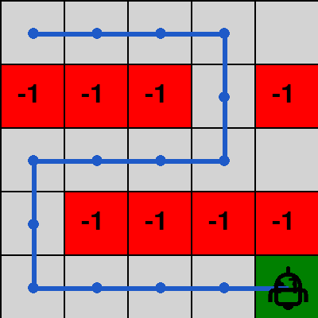
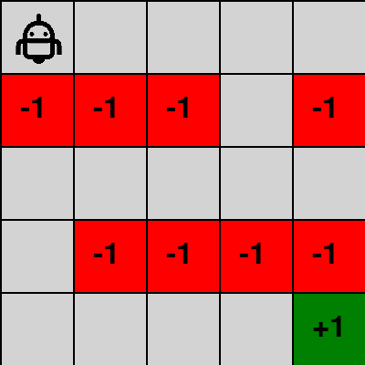

<!-- editorlm-hebrew-html-start -->
<style>
html, body, .vscode-body, .markdown-body, .markdown-preview, #write {
  direction: rtl !important; text-align: right !important;
}
ul, ol { padding-right: 2em !important; padding-left: 0 !important; }
blockquote { border-right: 3px solid #999; border-left: 0; padding-right: 1rem; padding-left: 0; }
@media print {
  html, body, .vscode-body, .markdown-body, .markdown-preview, #write {
    direction: rtl !important; text-align: right !important;
  }
}
</style>
<!-- editorlm-hebrew-html-end -->
<style>
.book { max-width: 900px; margin: auto; line-height: 1.8; font-family: Arial, sans-serif; }
.book .cover { min-height: 680px; box-sizing: border-box; padding: 64px 48px; margin: 24px 0 60px; background: #112b41; color: #f5f8fc; border-top: 9px solid #39c4b5; position: relative; }
.book .cover .eyebrow { color: #81e0d5; font-size: 15px; letter-spacing: 2px; }
.book .cover h1 { color: #fff; font-size: 48px; line-height: 1.3; border: 0; margin: 50px 0 18px; }
.book .cover .subtitle { font-size: 28px; color: #d8e6f0; }
.book .cover .author { font-size: 30px; color: #fff; margin-top: 52px; }
.book .cover .audience { color: #c1d3df; margin-top: 12px; }
.book .cover .motif { direction: ltr; text-align: left; font-family: Consolas, monospace; color: #81e0d5; font-size: 19px; margin-top: 54px; }
.book h1, .book h2, .book h3 { line-height: 1.4; font-weight: 700; }
.book > h1 { font-size: 32px !important; text-align: center !important; margin: 28px 0; }
.book h2 { font-size: 34px !important; text-align: center !important; color: #153b56 !important; background: #eef5fc; border: 0; border-bottom: 4px solid #299c91; border-radius: 10px 10px 0 0; padding: 28px 20px; margin: 24px 0 36px; }
.book h3 { font-size: 24px !important; text-align: right !important; color: #174e49 !important; background: #edf7f5; border: 0; border-right: 5px solid #299c91; border-radius: 6px; padding: 10px 16px; margin: 36px 0 18px; }
.book .chapter { height: 0; margin: 76px 0 0; border-top: 1px solid #ccd7df; break-before: page; page-break-before: always; break-after: avoid; page-break-after: avoid; }
.book .toc { padding: 24px; border-right: 5px solid #39a99d; background: rgba(70,150,155,.09); margin: 24px 0 48px; }
.book pre, .book pre code { direction: ltr !important; text-align: left !important; unicode-bidi: isolate; }
.book pre { box-sizing: border-box !important; width: 100% !important; max-width: 100% !important; margin: 0 !important; padding: 16px 20px; border: 1px solid #ccd7df; border-radius: 8px; line-height: 1.6; overflow-x: auto; }
.book code { direction: ltr; unicode-bidi: isolate; font-family: Consolas, "Courier New", monospace; }
.book pre { background: #f3f6fa !important; color: #1f2937 !important; }
.book pre code, .book pre code.hljs { background: transparent !important; color: #1f2937 !important; }
.book pre .hljs-keyword, .book pre .hljs-literal { color: #6f299c !important; }
.book pre .hljs-string { color: #216338 !important; }
.book pre .hljs-number { color: #075e68 !important; }
.book pre .hljs-comment { color: #526174 !important; }
.book pre .hljs-built_in, .book pre .hljs-title { color: #135b96 !important; }
.book table { width: 100%; }
.book th, .book td { text-align: right; }
.book .small { font-size: .9em; opacity: .8; }
.book .python-intro { display: flex; align-items: center; gap: 28px; padding: 22px 28px; margin: 24px 0; background: #eef5fc; color: #183e63; border-right: 6px solid #3776ab; border-radius: 10px; }
.book .python-intro strong { font-size: 30px; }
.book .python-fact { background: #fff7d6; color: #423611; border-right: 6px solid #ffd343; border-radius: 8px; padding: 18px 24px; margin: 22px 0; }
.book .python-fact strong { font-size: 24px; }
.book img { max-width: 100%; height: auto; }
.book figure { margin: 24px auto; text-align: center; }
.book figure img { display: block; margin: auto; }
.book figcaption { direction: rtl; text-align: center; font-size: .9em; color: #445566; }
@media print { .book > h2 { break-before: page; page-break-before: always; } }
.book .screen-strip { width: 760px; max-width: 100%; height: 220px; overflow: hidden; border: 1px solid #bccad5; border-radius: 8px; margin: 20px auto 8px; direction: ltr; }
.book .screen-strip.output { height: 265px; }
.book .screen-strip img { display: block; width: 1745px; max-width: none; }
.book .screen-menu { width: 400px; max-width: 100%; height: 295px; overflow: hidden; direction: ltr; margin: 20px auto 8px; border: 1px solid #bccad5; border-radius: 8px; }
.book .screen-menu img { display: block; width: 1745px; max-width: none; }
.book .code-panel { box-sizing: border-box !important; display: block !important; width: 75% !important; max-width: 75% !important; margin: 18px auto !important; }
@media print {
  .book .cover { min-height: 85vh; break-after: page; print-color-adjust: exact; -webkit-print-color-adjust: exact; }
  .book pre { white-space: pre-wrap; break-inside: avoid; }
  .book .chapter { margin: 0; border: 0; }
  .book h1, .book h2, .book h3 { break-after: avoid; page-break-after: avoid; break-inside: avoid; }
  .book h2 { margin-top: 0; }
  .book h2, .book h3 { print-color-adjust: exact; -webkit-print-color-adjust: exact; }
}
</style>

<style>
.book .book-nav { display: flex; flex-wrap: wrap; gap: 10px; justify-content: center; align-items: center; padding: 16px 0; margin: 20px 0 32px; border-top: 1px solid #ccd7df; border-bottom: 1px solid #ccd7df; }
.book .book-nav a { display: inline-block; padding: 10px 18px; border-radius: 8px; background: #eef5fc; color: #153b56 !important; border: 1px solid #b5ccd9; text-decoration: none !important; font-size: 16px; font-weight: bold; }
.book .book-nav a.toc-link { background: #174e49; color: #fff !important; border-color: #174e49; }
.book .book-nav a:hover, .book .book-nav a:focus { background: #d4eee8; color: #153b56 !important; outline: 2px solid #299c91; outline-offset: 2px; }
.book .section-list { line-height: 2; }
@media print { .book .book-nav { display: none; } }

/* Explicit Hebrew direction, including prose beginning with English. */
.book p, .book ul, .book ol, .book li,
.book blockquote, .book h1, .book h2, .book h3,
.book h4, .book th, .book td {
  direction: rtl !important;
  text-align: right !important;
  unicode-bidi: isolate;
}
/* Chapter titles keep their agreed centered layout. */
.book h2 { text-align: center !important; }
.book pre, .book pre code, .book .code-panel {
  direction: ltr !important;
  text-align: left !important;
  unicode-bidi: isolate;
}
</style>

<style>
.book .formula { direction:ltr!important; text-align:center!important; overflow-x:auto;
  padding:16px; background:#eef5fc; color:#173b52; margin:20px auto; font-size:1.15em; }
.book .grid { direction:ltr!important; width:auto!important; margin:20px auto; border-collapse:collapse; }
.book .grid td { direction:ltr!important; text-align:center!important; width:64px; height:48px; border:1px solid #8199aa; }
.book .grid .goal { background:#d3efdc; } .book .grid .bad { background:#f4d7d7; }
</style>

<div class="book" dir="rtl" lang="he">

<nav class="book-nav" aria-label="ניווט בספר">
<a href="03-%D7%9E%D7%95%D7%93%D7%9C%20%D7%A1%D7%91%D7%99%D7%91%D7%94%20%D7%A1%D7%95%D7%9B%D7%9F%20%D7%95-MDP.md">→ הקודם</a>
<a class="toc-link" href="../index.md">תוכן העניינים</a>
<a href="05-Value%20Iteration.md">הבא ←</a>
</nav>

## ד.4 — תכנון דינמי: Policy Iteration

**המצגת:** [תכנון דינמי](../../../sources/RL/2.תכנון%20דינמי.pptx) · **קוד:** [הסביבה הנתונה](../assets/rl/code/gridworld.py) · [Policy Iteration](../assets/rl/code/policy_iteration.py) · [מבוך 5×5](../assets/rl/code/gridworld_maze.py) · [הרצת המדיניות במבוך](../assets/rl/code/maze_demo.py)

בפרק הקודם הגדרנו את המושגים: מצב, פעולה, תגמול, מדיניות וערך של מצב. עכשיו אפשר לשאול את השאלה המעשית הראשונה: אם אנחנו יודעים את חוקי המשחק במלואם — לאיזה מצב מוביל כל מהלך ומה התגמול עליו — איך מחשבים את המהלך הטוב ביותר בכל מצב? זה המצב ב־Grid World, בפאזל המספרים ובכל משחק שהמודל שלו ידוע לנו. בפרק זה ובפרק הבא הסוכן עדיין אינו "לומד" מניסיון; הוא מחשב, כמו שמחשבים מסלול קצר במפה שכל כבישיה ידועים.

בלוח קטן שהחוקים שלו ידועים אפשר לחשב אילו מהלכים כדאי לבצע, עוד לפני שמשחקים בפועל. לכל מצב נשמור ערך בטבלה. נתחיל ממדיניות פשוטה, נחשב לאן היא מובילה, ונשפר אותה על סמך התוצאות. השיטה הזו נקראת **תכנון דינמי — Dynamic Programming**: מפרקים חישוב של מסלול ארוך לחישובים קטנים הקשורים זה בזה.

הרעיון שמאחורי הפירוק פשוט: הערך של מצב הוא התגמול על הצעד הבא ועוד הערך של המצב שאליו הגענו. אם נדע את ערכי השכנים, נדע את ערך המצב בלי לעקוב אחר המסלול כולו. על הרעיון הזה — משוואת בלמן — נבנה בפרק הזה אלגוריתם בשני שלבים שחוזרים לסירוגין: **הערכה** של המדיניות הנוכחית (חישוב הערכים שלה) ו**שיפור** שלה (החלפת פעולות בפעולות טובות יותר לפי הערכים). האלגוריתם נקרא Policy Iteration, ובפרק הבא נכיר גרסה חסכונית יותר שלו, Value Iteration.

### משוואת בלמן: צעד אחד וההמשך שלו

בפרק הקודם חישבנו את ערך המצב V כסכום כל התגמולים לאורך המסלול עד סוף המשחק. חישוב כזה יקר: בכל מצב צריך לעקוב אחר מסלול שלם, ובלוח גדול המסלולים ארוכים. נחפש דרך לחשב את הערך צעד אחד קדימה בלבד. נניח שהמדיניות בוחרת במצב s את הפעולה a, ושהמודל הידוע מחזיר מצב חדש s′ ותגמול r. את ערך המצב אפשר לפרק לשני חלקים: התגמול שמתקבל עכשיו, והערך של ההמשך כשהוא מוכפל במקדם ההיוון. למושגי הערך וההיוון ראו [פרק המודל](03-מודל%20סביבה%20סוכן%20ו-MDP.md#discount).

<a id="bellman"></a>
<div class="formula" dir="ltr">a = π(s), &nbsp; (s′,r) = model(s,a)<br>V<sup>π</sup>(s) = r + γV<sup>π</sup>(s′)</div>

זו **משוואת בלמן — Bellman Equation** למדיניות נתונה בסביבה דטרמיניסטית. היא מאפשרת לעדכן תא בטבלה באמצעות תא אחר, במקום לסכום מחדש מסלול שלם בכל פעם. שימו לב שהמשוואה מגדירה את V באמצעות V עצמה — הערך של מצב תלוי בערך של המצב הבא. זה לא מעגל סתום: כפי שנראה מיד, אפשר להתחיל מטבלה של אפסים ולהחיל את המשוואה שוב ושוב עד שהערכים מתייצבים. אם המצב הבא סופי, ערכו 0, ולכן נשאר רק התגמול המיידי.

אותו פירוק חל על ערך מצב–פעולה. אם אחרי הפעולה הראשונה ממשיכים לפי המדיניות ובוחרים a′=π(s′), מקבלים:

<div class="formula" dir="ltr">Q<sup>π</sup>(s,a) = r + γQ<sup>π</sup>(s′,a′)</div>

למשל, עם γ=0.9 כמו בפרק הקודם: אם הפעולה מגיעה מיד ליעד, נקבל 1. אם קודם צריך לבצע צעד ללא תגמול, ואחריו נגיע למצב שערכו 1, נקבל 0+0.9×1=0.9. צעד נוסף אחורה נותן 0.81. כך המידע על היעד יכול להתפשט בטבלה — מהיעד אחורה, תא אחר תא, כמו גלים במים.

<!-- editorlm-source-ref: [sources/RL/2.תכנון דינמי.pptx#L1-L17] -->

### מתחילים ממדיניות נתונה

כדי להפעיל את משוואת בלמן צריך מדיניות כלשהי — המשוואה מחשבת ערכים עבור מדיניות נתונה. לכן נתחיל בבניית מדיניות התחלתית. נשתמש ב־[לוח 4×4 שהוגדר בפרק הקודם](03-מודל%20סביבה%20סוכן%20ו-MDP.md). נשמור שתי טבלאות: V מכילה מספר לכל מצב, ו־π מכילה פעולה לכל מצב שאינו סופי. נאתחל את הערכים באפס. המדיניות הראשונית יכולה להיות פשוטה מאוד; בשלב הזה היא אינה חייבת להיות טובה.

בפרק הזה נתחיל ממדיניות ״למטה״, ובתא שמשמאל ליעד נפנה ימינה. בשני התאים השמאליים בשורה התחתונה נפנה למעלה, כדי שכל הפעולות שבקוד יהיו חוקיות. כך נוצרות שם לולאות ללא תגמול. זו מדיניות התחלתית חלשה, שאותה נשפר.

<table class="grid" dir="ltr">
<tr><td>↓</td><td>↓</td><td>↓</td><td>↓</td></tr>
<tr><td>↓</td><td>↓</td><td class="bad">סיום</td><td>↓</td></tr>
<tr><td>↓</td><td>↓</td><td>↓</td><td>↓</td></tr>
<tr><td>↑</td><td>↑</td><td>→</td><td class="goal">סיום</td></tr>
</table>

בקוד נייצג מדיניות כמילון: המפתח הוא מצב (זוג שורה ועמודה) והערך הוא הפעולה שנבחרה בו. הפונקציה הבאה יוצרת אותה בעזרת קבועי הסביבה:

<div class="code-panel" dir="ltr">

```python
from gridworld import Action, GOAL

def initial_policy(env):
    policy = {}
    for state in env.states:
        if env.end_of_game(state):
            continue
        actions = env.get_actions(state)
        action = Action.DOWN if Action.DOWN in actions else Action.UP
        if state == (GOAL[0], GOAL[1] - 1):
            action = Action.RIGHT
        policy[state] = action
    return policy
```

</div>

ממשק הסביבה בקוד כבר נתון: `env.states` מכיל את המצבים, `env.get_actions(state)` מחזירה פעולות חוקיות, `env(state, action)` מחזירה מצב חדש ותגמול, ו־`env.end_of_game(state)` בודקת סיום. פעולות מחוץ לגבולות הלוח אינן נכללות ברשימת הפעולות החוקיות.

<!-- editorlm-source-ref: [sources/RL/2.תכנון דינמי.pptx#L19-L99] -->

<a id="policy-evaluation"></a>
### Policy Evaluation — מעריכים את המדיניות

יש לנו מדיניות, אבל עדיין איננו יודעים כמה היא טובה. השלב הראשון של האלגוריתם עונה על כך: הוא מחשב את V של המדיניות הנוכחית. בשלב **הערכת המדיניות — Policy Evaluation** לא משנים את הפעולות שנבחרו. עוברים שוב ושוב על המצבים ומעדכנים את V לפי משוואת בלמן ולפי אותה מדיניות. בכל סריקה מודדים את השינוי הגדול ביותר בערכים. כשהשינוי קטן מן הדיוק שבחרנו, מפסיקים — הטבלה התייצבה ואינה משתנה עוד.

נעקוב אחר ההתפשטות של הערכים במדיניות ״למטה״ שבנינו. תחילה מתקבל ‎−1 מעל תא ההפסד, ו־1 בשני שכני היעד. לאחר מכן מתפשט 0.9 אל המצבים שמגיעים לשכנים האלה לפי המדיניות, ולבסוף 0.81 לתא הימני העליון. בסיום ההערכה הראשונה מתקבלת:

<table class="grid" dir="ltr">
<tr><td>0</td><td>0</td><td>−1</td><td>0.81</td></tr>
<tr><td>0</td><td>0</td><td class="bad">0</td><td>0.9</td></tr>
<tr><td>0</td><td>0</td><td>0.9</td><td>1</td></tr>
<tr><td>0</td><td>0</td><td>1</td><td class="goal">0</td></tr>
</table>

העמודות השמאליות אינן מקבלות ערך חיובי רק משום שיש יעד במקום אחר בלוח: המדיניות הנוכחית עדיין אינה מובילה אותן אליו. זו נקודה חשובה — V מודדת את המדיניות, לא את הלוח. מצב שממנו המדיניות מסתובבת בלולאה ללא תגמול שווה 0, גם אם היעד נמצא במרחק צעד ממנו.

<!-- editorlm-source-ref: [sources/RL/2.תכנון דינמי.pptx#L49-L99] -->

הפונקציה הבאה מממשת את ההערכה. היא מקבלת את הסביבה, את המדיניות ואת טבלת הערכים, ומעדכנת את הטבלה במקום:

<div class="code-panel" dir="ltr">

```python
def policy_eval(env, policy, values, gamma=0.9, accuracy=0.0001):
    while True:
        delta = 0
        for state in env.states:
            if env.end_of_game(state):
                continue
            old_value = values[state]
            action = policy[state]
            next_state, reward = env(state, action)
            values[state] = reward + gamma * values[next_state]
            delta = max(delta, abs(old_value - values[state]))
        if delta < accuracy:
            return
```

</div>

השורה המרכזית היא `values[state] = reward + gamma * values[next_state]` — זו משוואת בלמן בדיוק כפי שכתבנו אותה. `old_value` שומר את המספר שלפני העדכון, ו־`delta` מודד עד כמה הטבלה עדיין משתנה; הפרמטר `accuracy` קובע מתי השינוי קטן מספיק כדי לעצור. מצבים סופיים נשארים באפס. העדכון נעשה בטבלה עצמה, ולכן מצב שנבדק בהמשך הסריקה עשוי להשתמש בערך שכבר התעדכן באותה סריקה. אין צורך לחכות לסריקה נוספת כדי להשתמש במידע החדש.

<!-- editorlm-source-ref: [sources/RL/2.תכנון דינמי.pptx#L101-L121] -->

<a id="policy-improvement"></a>
### Policy Improvement — משפרים את המדיניות

עכשיו יש לנו טבלת ערכים שמתארת את המדיניות הנוכחית, והיא מגלה לנו היכן המדיניות חלשה: למשל, התא שמעל תא ההפסד יורד היישר אל ‎−1, בעוד שכנו מימין שווה 0.81. השלב השני, **שיפור המדיניות — Policy Improvement**, מנצל את המידע הזה. כעת נשאל בכל מצב אם פעולה אחרת תיתן תוצאה טובה יותר. לכל פעולה חוקית מחשבים את התגמול המיידי ואת ערך ההמשך. בוחרים פעולה עם הציון הגדול ביותר ומשנים את המדיניות בהתאם. זו בחירה **חמדנית — Greedy**: בכל מצב לוקחים את הפעולה שנראית הכי טובה לפי הטבלה הנוכחית.

<div class="formula" dir="ltr">π<sub>new</sub>(s) = argmax<sub>a</sub> [R(s,a,s′) + γV<sup>π</sup>(s′)]</div>

`argmax` מחזירה את הפעולה שמביאה למקסימום, ולא את הערך המספרי עצמו. בשלב הזה משתמשים בטבלת הערכים שחושבה עבור המדיניות הקודמת. הפונקציה הבאה עוברת על כל המצבים ומבצעת את הבחירה הזאת:

<div class="code-panel" dir="ltr">

```python
def policy_improv(env, policy, values, gamma=0.9):
    stable = True
    for state in env.states:
        if env.end_of_game(state):
            continue
        old_action = policy[state]
        best_action = old_action
        next_state, reward = env(state, old_action)
        best_value = reward + gamma * values[next_state]
        for action in env.get_actions(state):
            next_state, reward = env(state, action)
            candidate = reward + gamma * values[next_state]
            if candidate > best_value + 1e-12:
                best_value = candidate
                best_action = action
        policy[state] = best_action
        if best_action != old_action:
            stable = False
    return stable
```

</div>

הפונקציה מחזירה `True` אם לא נדרשה החלפה בשום מצב — סימן שהמדיניות **יציבה** ואי אפשר לשפר אותה עוד לפי הערכים הנוכחיים. כאשר כמה פעולות נותנות אותו ערך, נשמור את הפעולה הקודמת. כך לא נחליף הלוך ושוב פעולות שקולות. התוספת הזעירה `1e-12` מונעת החלפה בגלל הבדלי עיגול מזעריים.

<!-- editorlm-source-ref: [sources/RL/2.תכנון דינמי.pptx#L123-L163] -->

### מעריכים שוב ומשפרים שוב

שיפור אחד אינו מספיק. לאחר שינוי המדיניות, הטבלה עדיין מתארת את המדיניות הישנה — הערכים חושבו לפי הפעולות הקודמות. לכן מפעילים שוב הערכת מדיניות, הפעם עבור הפעולות החדשות. הערכים החדשים עשויים לחשוף הזדמנויות לשיפור נוסף, שלא נראו קודם משום שהערכים הישנים היו אפס.

בשיפור הראשון התא שמעל תא ההפסד פונה ימינה. גם שני התאים התחתונים בעמודה השנייה פונים ימינה. לאחר הערכה מחדש מתקבלת הטבלה הבאה, בעיגול לשלוש ספרות:

<table class="grid" dir="ltr">
<tr><td>0</td><td>0.656</td><td>0.729</td><td>0.810</td></tr>
<tr><td>0</td><td>0.729</td><td class="bad">0</td><td>0.900</td></tr>
<tr><td>0</td><td>0.810</td><td>0.900</td><td>1</td></tr>
<tr><td>0</td><td>0.900</td><td>1</td><td class="goal">0</td></tr>
</table>

כעת השיפור הבא יכול להפנות גם את תאי העמודה הראשונה ימינה. הערכה נוספת מפיצה אליהם את ערכי ההמשך:

<table class="grid" dir="ltr">
<tr><td>0.590</td><td>0.656</td><td>0.729</td><td>0.810</td></tr>
<tr><td>0.656</td><td>0.729</td><td class="bad">0</td><td>0.900</td></tr>
<tr><td>0.729</td><td>0.810</td><td>0.900</td><td>1</td></tr>
<tr><td>0.810</td><td>0.900</td><td>1</td><td class="goal">0</td></tr>
</table>

זהו התפקיד של ההחלפה בין השלבים: שינוי המדיניות מאפשר לערכים חדשים להתפשט, והערכים האלה מאפשרים למצוא שינוי נוסף במדיניות. הטבלה האחרונה זהה לטבלה שראינו בפרק הקודם עבור המדיניות שמובילה ליעד בדרך קצרה — הגענו אליה מבלי שמישהו כתב אותה בידיים, רק מתוך חוקי המשחק.

<!-- editorlm-source-ref: [sources/RL/2.תכנון דינמי.pptx#L165-L319] -->

### Policy Iteration — מחברים את השלבים

עשינו את שני השלבים בידיים כמה פעמים; עכשיו נכתוב לולאה שעושה זאת בשבילנו. האלגוריתם המלא, **Policy Iteration**, מפעיל הערכה ושיפור לסירוגין עד שהמדיניות יציבה — כלומר עד ששלב השיפור אינו משנה אף פעולה. נתחיל במדיניות שיצרנו בתחילת הפרק ונשתמש באותן שתי פונקציות בכל סבב.

<div class="code-panel" dir="ltr">

```python
def policy_iteration(env, gamma=0.9):
    values = {state: 0.0 for state in env.states}
    policy = initial_policy(env)
    while True:
        policy_eval(env, policy, values, gamma)
        if policy_improv(env, policy, values, gamma):
            return policy, values
```

</div>

הלולאה `while True` מסתיימת רק כש־`policy_improv` מחזירה `True`, ואז הפונקציה מחזירה את המדיניות ואת טבלת הערכים הסופיות. בסביבה הסופית שלנו, עם γ=0.9 והערכת מדיניות מדויקת מספיק, ההחלפה החוזרת בין השלבים נותנת מדיניות מיטבית עד לדיוק החישוב — בכל סבב המדיניות אינה נעשית גרועה יותר, ומספר המדיניות האפשריות סופי, ולכן התהליך חייב להיעצר. אין פירוש הדבר שיש רק טבלת פעולות מיטבית אחת: לעיתים שתי דרכים שונות מגיעות ליעד באותה תשואה.

כדי להריץ, שמרו את שני קובצי הקוד המקושרים בראש הפרק באותה תיקייה והפעילו את `policy_iteration.py`. ההרצה מחשבת את המדיניות ואת טבלת הערכים; אין צורך לפתוח חלון משחק.

<!-- editorlm-source-ref: [sources/RL/2.תכנון דינמי.pptx#L321-L373] -->

### הסוכן פותר מבוך 5×5

לוח 4×4 מספיק כדי לעקוב אחר החישוב ביד, אבל בו הדרך ליעד כמעט מתבקשת. כדי לראות שהמדיניות שחושבה באמת "יודעת" ללכת, נפעיל את אותו אלגוריתם בדיוק על לוח גדול יותר: מבוך 5×5 מתוך [פרויקט GridWorld](https://github.com/MarkmanGilad/GridWorld) של הקורס. שמונה תאים אדומים משמשים כקירות: כניסה לכל אחד מהם מסיימת את המשחק בתגמול ‎−1, כמו התא האדום בלוח הקטן. היעד הירוק בפינה הימנית התחתונה נותן 1, ומתחילים בפינה השמאלית העליונה. כדי להגיע ליעד הסוכן חייב לעקוף את שתי שורות הקירות: ימינה לאורך השורה העליונה, למטה דרך הפתח היחיד, שמאלה לאורך השורה האמצעית, למטה בעמודה השמאלית, ומשם ימינה עד היעד.

<figure>

<figcaption>המבוך בחלון המשחק: הרובוט במצב ההתחלה, תאי הקיר האדומים והיעד הירוק.</figcaption>
</figure>

הסביבה כתובה באותו ממשק בדיוק: `env.states`, `env.get_actions(state)`, `env.end_of_game(state)` והקריאה `env(state, action)`; רק גודל הלוח ורשימת התאים הסופיים השתנו. לכן `policy_eval` ו־`policy_improv` מהפרק פועלות עליה ללא שינוי. המדיניות ההתחלתית כאן היא פשוט הפעולה החוקית הראשונה בכל תא. אין צורך לתכנן אותה בחוכמה; האלגוריתם ישפר אותה:

<div class="code-panel" dir="ltr">

```python
from gridworld_maze import COLS, ROWS, START, GridWorld
from policy_iteration import policy_eval, policy_improv

def first_action_policy(env):
    return {state: env.get_actions(state)[0]
            for state in env.states if not env.end_of_game(state)}

def solve_policy(env, gamma=0.9):
    values = {state: 0.0 for state in env.states}
    policy = first_action_policy(env)
    while True:
        policy_eval(env, policy, values, gamma)
        if policy_improv(env, policy, values, gamma):
            return policy, values
```

</div>

עד כאן חישבנו; עכשיו נשחק. מריצים את המדיניות: מתחילים במצב ההתחלה, ובכל צעד מבצעים את הפעולה שהמדיניות קובעת למצב הנוכחי, עד שמגיעים למצב סופי. הפונקציה מחזירה את רשימת המצבים שעברנו בהם:

<div class="code-panel" dir="ltr">

```python
def run_policy(env, policy, start):
    state = start
    path = [state]
    while not env.end_of_game(state):
        state, reward = env(state, policy[state])
        path.append(state)
    return path

env = GridWorld()
policy, values = solve_policy(env)
path = run_policy(env, policy, START)
print(f'{len(path) - 1} steps: {path}')
```

</div>

**פלט**

<div class="code-panel" dir="ltr">

```text
14 steps: [(0, 0), (0, 1), (0, 2), (0, 3), (1, 3), (2, 3), (2, 2), (2, 1), (2, 0), (3, 0), (4, 0), (4, 1), (4, 2), (4, 3), (4, 4)]
```

</div>

הסוכן הגיע ליעד ב־14 צעדים, שהם המסלול הקצר ביותר האפשרי, בלי להיכנס לאף תא אדום ובלי צעד מיותר. הקובץ `maze_demo.py` מדפיס גם את המדיניות ואת טבלת הערכים. הנה המדיניות כחצים; לתאים הסופיים אין פעולה:

<table class="grid" dir="ltr" aria-label="מדיניות מיטבית במבוך חמש על חמש">
<tr><td>→</td><td>→</td><td>→</td><td>↓</td><td>←</td></tr>
<tr><td class="bad">−1</td><td class="bad">−1</td><td class="bad">−1</td><td>↓</td><td class="bad">−1</td></tr>
<tr><td>↓</td><td>←</td><td>←</td><td>←</td><td>←</td></tr>
<tr><td>↓</td><td class="bad">−1</td><td class="bad">−1</td><td class="bad">−1</td><td class="bad">−1</td></tr>
<tr><td>→</td><td>→</td><td>→</td><td>→</td><td class="goal">+1</td></tr>
</table>

שימו לב שגם תאים שאינם על המסלול קיבלו פעולה: המדיניות מוגדרת לכל מצב, לא רק למצבים שנעבור בהם מההתחלה. התא הימני העליון, למשל, פונה שמאלה, כי הפתח בשורת הקירות נמצא משמאלו. וטבלת הערכים, בעיגול לשלוש ספרות:

<table class="grid" dir="ltr" aria-label="ערכי המצבים במבוך חמש על חמש">
<tr><td>0.254</td><td>0.282</td><td>0.314</td><td>0.349</td><td>0.314</td></tr>
<tr><td class="bad">0</td><td class="bad">0</td><td class="bad">0</td><td>0.387</td><td class="bad">0</td></tr>
<tr><td>0.590</td><td>0.531</td><td>0.478</td><td>0.430</td><td>0.387</td></tr>
<tr><td>0.656</td><td class="bad">0</td><td class="bad">0</td><td class="bad">0</td><td class="bad">0</td></tr>
<tr><td>0.729</td><td>0.810</td><td>0.900</td><td>1.000</td><td class="goal">0</td></tr>
</table>

לאורך המסלול הערכים יורדים מהיעד אחורה: 1, 0.9, 0.81 וכן הלאה, כפל ב־0.9 בכל צעד. מצב ההתחלה מרוחק 14 צעדים מהיעד, ולכן ערכו 0.9<sup>13</sup>≈0.254: התגמול 1 מתקבל בצעד ה־14, ולפניו 13 צעדים ללא תגמול. כך אפשר לקרוא מהטבלה את המרחק ליעד בלי לצייר את המסלול.

<figure>

<figcaption>סיום ההרצה: הרובוט על היעד הירוק; הקו הכחול מסמן את המסלול שעבר.</figcaption>
</figure>

<figure>

<figcaption>הסוכן עוקב אחר המדיניות שחושבה, צעד אחר צעד, עד היעד. (אנימציה; בגרסה המודפסת מוצג פריים אחד.)</figcaption>
</figure>

התמונות צולמו מחלון המשחק של פרויקט GridWorld; קו המסלול נוסף לצילום לצורך ההמחשה. כדי לראות את הרובוט נע במחשב שלכם, הריצו את `Game.py` שבמאגר: הוא מחשב את המדיניות באותה דרך ומזיז את הרובוט לפיה עד היעד.

<nav class="book-nav" aria-label="ניווט בספר">
<a href="03-%D7%9E%D7%95%D7%93%D7%9C%20%D7%A1%D7%91%D7%99%D7%91%D7%94%20%D7%A1%D7%95%D7%9B%D7%9F%20%D7%95-MDP.md">→ הקודם</a>
<a class="toc-link" href="../index.md">תוכן העניינים</a>
<a href="05-Value%20Iteration.md">הבא ←</a>
</nav>

</div>

<!-- editorlm-source-versions: {"schemaVersion": 1, "sources": {"sources/RL/2.תכנון דינמי.pptx": {"sourceSha256": "b0a3761327313388bf171c0a0728ff48dd9c79c9ac07c9eb0be6097c6baef54b", "canonicalTextSha256": "959261a50b6797e2cb5d9c182b8237bb81839ba17322f567107a974fe087255d"}}} -->
