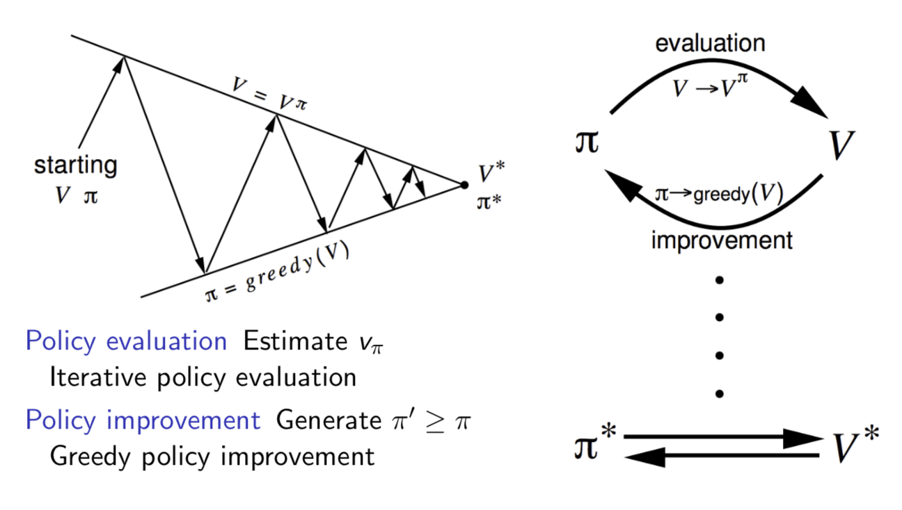

<!-- editorlm-hebrew-html-start -->
<style>
html, body, .vscode-body, .markdown-body, .markdown-preview, #write {
  direction: rtl !important; text-align: right !important;
}
ul, ol { padding-right: 2em !important; padding-left: 0 !important; }
blockquote { border-right: 3px solid #999; border-left: 0; padding-right: 1rem; padding-left: 0; }
@media print {
  html, body, .vscode-body, .markdown-body, .markdown-preview, #write {
    direction: rtl !important; text-align: right !important;
  }
}
</style>
<!-- editorlm-hebrew-html-end -->
<style>
.book { max-width: 900px; margin: auto; line-height: 1.8; font-family: Arial, sans-serif; }
.book .cover { min-height: 680px; box-sizing: border-box; padding: 64px 48px; margin: 24px 0 60px; background: #112b41; color: #f5f8fc; border-top: 9px solid #39c4b5; position: relative; }
.book .cover .eyebrow { color: #81e0d5; font-size: 15px; letter-spacing: 2px; }
.book .cover h1 { color: #fff; font-size: 48px; line-height: 1.3; border: 0; margin: 50px 0 18px; }
.book .cover .subtitle { font-size: 28px; color: #d8e6f0; }
.book .cover .author { font-size: 30px; color: #fff; margin-top: 52px; }
.book .cover .audience { color: #c1d3df; margin-top: 12px; }
.book .cover .motif { direction: ltr; text-align: left; font-family: Consolas, monospace; color: #81e0d5; font-size: 19px; margin-top: 54px; }
.book h1, .book h2, .book h3 { line-height: 1.4; font-weight: 700; }
.book > h1 { font-size: 32px !important; text-align: center !important; margin: 28px 0; }
.book h2 { font-size: 34px !important; text-align: center !important; color: #153b56 !important; background: #eef5fc; border: 0; border-bottom: 4px solid #299c91; border-radius: 10px 10px 0 0; padding: 28px 20px; margin: 24px 0 36px; }
.book h3 { font-size: 24px !important; text-align: right !important; color: #174e49 !important; background: #edf7f5; border: 0; border-right: 5px solid #299c91; border-radius: 6px; padding: 10px 16px; margin: 36px 0 18px; }
.book .chapter { height: 0; margin: 76px 0 0; border-top: 1px solid #ccd7df; break-before: page; page-break-before: always; break-after: avoid; page-break-after: avoid; }
.book .toc { padding: 24px; border-right: 5px solid #39a99d; background: rgba(70,150,155,.09); margin: 24px 0 48px; }
.book pre, .book pre code { direction: ltr !important; text-align: left !important; unicode-bidi: isolate; }
.book pre { box-sizing: border-box !important; width: 100% !important; max-width: 100% !important; margin: 0 !important; padding: 16px 20px; border: 1px solid #ccd7df; border-radius: 8px; line-height: 1.6; overflow-x: auto; }
.book code { direction: ltr; unicode-bidi: isolate; font-family: Consolas, "Courier New", monospace; }
.book pre { background: #f3f6fa !important; color: #1f2937 !important; }
.book pre code, .book pre code.hljs { background: transparent !important; color: #1f2937 !important; }
.book pre .hljs-keyword, .book pre .hljs-literal { color: #6f299c !important; }
.book pre .hljs-string { color: #216338 !important; }
.book pre .hljs-number { color: #075e68 !important; }
.book pre .hljs-comment { color: #526174 !important; }
.book pre .hljs-built_in, .book pre .hljs-title { color: #135b96 !important; }
.book table { width: 75%; max-width: 75%; margin: 18px auto; background: #f3f6fa; }
.book th, .book td { border: 1px solid #ccd7df; padding: 8px 12px; }
.book th, .book td { text-align: right; }
.book .small { font-size: .9em; opacity: .8; }
.book .python-intro { display: flex; align-items: center; gap: 28px; padding: 22px 28px; margin: 24px 0; background: #eef5fc; color: #183e63; border-right: 6px solid #3776ab; border-radius: 10px; }
.book .python-intro strong { font-size: 30px; }
.book .python-fact { background: #fff7d6; color: #423611; border-right: 6px solid #ffd343; border-radius: 8px; padding: 18px 24px; margin: 22px 0; }
.book .python-fact strong { font-size: 24px; }
.book .optional { background: #fff7d6; color: #423611; border-right: 6px solid #ffd343; border-radius: 8px; padding: 18px 24px; margin: 22px 0; font-size: .95em; }
.book .optional .formula { width: 90%; max-width: 90%; background: #fffdf3; }
.book .grid-row { display:flex; flex-wrap:wrap; justify-content:center; align-items:flex-start; gap:14px 18px; }
.book .grid-row figure { width:auto; max-width:100%; margin:0; padding:0; background:transparent; border:0; }
.book .grid-row figcaption { margin-top:6px; font-size:.85em; }
.book .grid.small td { width:46px; height:36px; font-size:.9em; }
.book .grid .changed { color:#c8102e; font-weight:700; }
.book .bellman { box-sizing:border-box; width:75%; max-width:75%; margin:26px auto; border:2px solid #1f7a70; border-radius:10px; background:#e6f7f4; overflow:hidden; }
.book .bellman .bellman-title { background:#1f7a70; color:#fff; font-weight:700; font-size:1.15em; padding:8px 18px; direction:rtl; text-align:right; }
.book .bellman .bellman-cond { direction:ltr!important; text-align:center!important; unicode-bidi:isolate; padding:14px 20px 0; font-size:1.05em; color:#1f2937; }
.book .bellman .bellman-eq { direction:ltr!important; text-align:center!important; unicode-bidi:isolate; padding:12px 20px 18px; font-size:1.5em; font-weight:700; color:#0b3d5c; }
.book .bellman .bellman-eq span { background:#fff3b0; padding:4px 14px; border-radius:8px; border:1px solid #e6c94a; }
/* Display math renders left-to-right and centered, independent of the RTL page. */
.book .math-panel, .book .math-panel .katex-display, .book .math-panel .katex {
  direction: ltr !important;
  text-align: center !important;
  unicode-bidi: isolate;
}
.book .math-panel { box-sizing: border-box; width: 75%; max-width: 75%; margin: 20px auto; padding: 16px 20px; background: #f3f6fa; color: #1f2937; border: 1px solid #ccd7df; border-radius: 8px; overflow-x: auto; font-size: 1.1em; }
.book .math-panel .katex-display { margin: 0; }
.book .math-panel p { margin: 0; }
.book img { max-width: 100%; height: auto; }
.book figure { box-sizing: border-box; width: 75%; max-width: 75%; margin: 24px auto; padding: 16px 20px; background: #f3f6fa; border: 1px solid #ccd7df; border-radius: 8px; text-align: center; }
.book figure img { display: block; margin: auto; }
.book figcaption { direction: rtl; text-align: center; font-size: .9em; color: #445566; }
@media print { .book > h2 { break-before: page; page-break-before: always; } }
.book .screen-strip { width: 760px; max-width: 100%; height: 220px; overflow: hidden; border: 1px solid #bccad5; border-radius: 8px; margin: 20px auto 8px; direction: ltr; }
.book .screen-strip.output { height: 265px; }
.book .screen-strip img { display: block; width: 1745px; max-width: none; }
.book .screen-menu { width: 400px; max-width: 100%; height: 295px; overflow: hidden; direction: ltr; margin: 20px auto 8px; border: 1px solid #bccad5; border-radius: 8px; }
.book .screen-menu img { display: block; width: 1745px; max-width: none; }
.book .code-panel { box-sizing: border-box !important; display: block !important; width: 75% !important; max-width: 75% !important; margin: 18px auto !important; }
@media print {
  .book .cover { min-height: 85vh; break-after: page; print-color-adjust: exact; -webkit-print-color-adjust: exact; }
  .book pre { white-space: pre-wrap; break-inside: avoid; }
  .book .chapter { margin: 0; border: 0; }
  .book h1, .book h2, .book h3 { break-after: avoid; page-break-after: avoid; break-inside: avoid; }
  .book h2 { margin-top: 0; }
  .book h2, .book h3 { print-color-adjust: exact; -webkit-print-color-adjust: exact; }
}
</style>

<style>
.book .book-nav { display: flex; flex-wrap: wrap; gap: 10px; justify-content: center; align-items: center; padding: 16px 0; margin: 20px 0 32px; border-top: 1px solid #ccd7df; border-bottom: 1px solid #ccd7df; }
.book .book-nav a { display: inline-block; padding: 10px 18px; border-radius: 8px; background: #eef5fc; color: #153b56 !important; border: 1px solid #b5ccd9; text-decoration: none !important; font-size: 16px; font-weight: bold; }
.book .book-nav a.toc-link { background: #174e49; color: #fff !important; border-color: #174e49; }
.book .book-nav a:hover, .book .book-nav a:focus { background: #d4eee8; color: #153b56 !important; outline: 2px solid #299c91; outline-offset: 2px; }
.book .section-list { line-height: 2; }
@media print { .book .book-nav { display: none; } }

/* Explicit Hebrew direction, including prose beginning with English. */
.book p, .book ul, .book ol, .book li,
.book blockquote, .book h1, .book h2, .book h3,
.book h4, .book th, .book td {
  direction: rtl !important;
  text-align: right !important;
  unicode-bidi: isolate;
}
/* Chapter titles keep their agreed centered layout. */
.book h2 { text-align: center !important; }
.book pre, .book pre code, .book .code-panel {
  direction: ltr !important;
  text-align: left !important;
  unicode-bidi: isolate;
}
</style>

<style>
.book .formula { box-sizing:border-box; width:75%; max-width:75%; direction:ltr!important; text-align:center!important; overflow-x:auto;
  padding:16px 20px; background:#f3f6fa; color:#1f2937; border:1px solid #ccd7df; border-radius:8px; margin:20px auto; font-size:1.15em; }
.book .grid-panel { box-sizing:border-box; width:75%; max-width:75%; margin:20px auto; padding:16px 20px; background:#f3f6fa; border:1px solid #ccd7df; border-radius:8px; }
.book .grid { direction:ltr!important; width:auto!important; max-width:100%!important; margin:0 auto; border-collapse:collapse; background:#fff; }
.book .grid td { direction:ltr!important; text-align:center!important; width:64px; height:48px; border:1px solid #8199aa; }
.book .grid .goal { background:#d3efdc; } .book .grid .bad { background:#f4d7d7; }
</style>

<div class="book" dir="rtl" lang="he">

<nav class="book-nav" aria-label="ניווט בספר">
<a href="03-%D7%9E%D7%95%D7%93%D7%9C%20%D7%A1%D7%91%D7%99%D7%91%D7%94%20%D7%A1%D7%95%D7%9B%D7%9F%20%D7%95-MDP.md">→ הקודם</a>
<a class="toc-link" href="../index.md">תוכן העניינים</a>
<a href="05-Value%20Iteration.md">הבא ←</a>
</nav>

## ד.4 — תכנון דינמי: Policy Iteration

**המצגת:** [תכנון דינמי](../../../sources/RL/2.תכנון%20דינמי.pptx) · **קוד:** [הסביבה הנתונה](https://github.com/MarkmanGilad/book/blob/main/assets/rl/code/gridworld.py) · [Policy Iteration](https://github.com/MarkmanGilad/book/blob/main/assets/rl/code/policy_iteration.py) · [מבוך 5×5](https://github.com/MarkmanGilad/book/blob/main/assets/rl/code/gridworld_maze.py) · [הרצת המדיניות במבוך](https://github.com/MarkmanGilad/book/blob/main/assets/rl/code/maze_demo.py) · [כל קובצי הקוד בגיטהב](https://github.com/MarkmanGilad/book/tree/main/assets/rl/code)

בפרק הקודם הגדרנו את המושגים: מצב, פעולה, תגמול, מדיניות וערך של מצב. עכשיו אפשר לשאול את השאלה המעשית הראשונה: אם אנחנו יודעים את חוקי המשחק במלואם — לאיזה מצב מוביל כל מהלך ומה התגמול עליו — איך מחשבים את המהלך הטוב ביותר בכל מצב? זה המצב ב־Grid World, בפאזל המספרים ובכל משחק שהמודל שלו ידוע לנו. בפרק זה ובפרק הבא הסוכן עדיין אינו "לומד" מניסיון; הוא מחשב, כמו שמחשבים מסלול קצר במפה שכל כבישיה ידועים.

בפרק הקודם הצבנו את המטרה: למצוא אלגוריתם שמחשב את המדיניות המיטבית, שנסמן <span dir="ltr">π*</span> (במצגות: <span dir="ltr">P*</span>). בלוח קטן שהחוקים שלו ידועים אפשר לחשב אילו מהלכים כדאי לבצע, עוד לפני שמשחקים בפועל. לכל מצב נשמור ערך בטבלה. נתחיל ממדיניות פשוטה, נחשב לאן היא מובילה, ונשפר אותה על סמך התוצאות. השיטה הזו נקראת **תכנון דינמי — Dynamic Programming**: מפרקים חישוב של מסלול ארוך לחישובים קטנים הקשורים זה בזה, והתוצאות של החישובים הקטנים נשמרות בטבלה (או במבנה נתונים אחר) שמחזיקה את כל המצבים האפשריים בסביבה.

הפתרון הזה מתאים רק לסביבה שבה מרחב המצבים קטן יחסית וניתן לשמירה בזיכרון המחשב: בלוח 4×4 יש 16 מצבים, ואפילו איקס עיגול נכנס בטבלה. בשחמט או במשחק מחשב מספר המצבים גדול מכדי לשמור טבלה, ושם נצטרך לשדרג את האלגוריתם של בלמן; זה מה שנעשה בהמשך החלק, כשנחליף את הטבלה ברשת נוירונים.

את השיטה פיתח בשנות החמישים המתמטיקאי האמריקני ריצ׳ארד בלמן, והמשוואה שעליה היא נשענת קרויה על שמו. נלמד אותה תחילה, ואחריה נבנה בעזרתה את האלגוריתם הראשון שלנו, Policy Iteration.

<figure>

<figcaption>ריצ׳ארד בלמן (1920–1984), המתמטיקאי האמריקני שפיתח את התכנון הדינמי ואת המשוואה הקרויה על שמו.</figcaption>
</figure>

### משוואת בלמן: צעד אחד וההמשך שלו

בפרק הקודם חישבנו את ערך המצב V כסכום כל התגמולים לאורך המסלול עד סוף המשחק, כשכל תגמול רחוק מוכפל ב־γ פעם נוספת. חישוב כזה יקר: בכל מצב צריך לעקוב אחר מסלול שלם, ובלוח גדול המסלולים ארוכים. בלמן הראה שאפשר לחשב את הערך מצעד אחד קדימה בלבד. הפיתוח הוא אלגברה פשוטה בארבעה צעדים, ונעבור עליהם בזה אחר זה. למושגי הערך וההיוון ראו [פרק המודל](03-מודל%20סביבה%20סוכן%20ו-MDP.md#discount).

**צעד 1 — כותבים את הערך כסכום.** נניח שהסוכן נמצא במצב s<sub>0</sub> ופועל לפי מדיניות נתונה π. הסביבה דטרמיניסטית: בכל מצב המדיניות קובעת פעולה אחת, והמודל קובע מצב הבא אחד ותגמול אחד. לכן המסלול קבוע מראש: s<sub>0</sub> → s<sub>1</sub> → s<sub>2</sub> → … → s<sub>T</sub>, ובדרך מתקבלים התגמולים r<sub>1</sub>, r<sub>2</sub>, …, r<sub>T</sub>. ערך המצב s<sub>0</sub> לפי המדיניות π הוא התשואה של המסלול הזה:

<div class="math-panel" dir="ltr">

$$
V_\pi(s_0) = r_1 + \gamma r_2 + \gamma^2 r_3 + \gamma^3 r_4 + \cdots + \gamma^{T-1} r_T
$$

</div>

**צעד 2 — מוציאים γ מחוץ לסוגריים.** נסתכל על כל האיברים מלבד הראשון: γr<sub>2</sub>, γ²r<sub>3</sub>, γ³r<sub>4</sub> וכן הלאה. בכל אחד מהם מופיע γ לפחות פעם אחת. נכתוב כל איבר כך שיהיה בו γ אחד "מבחוץ" וכל השאר "מבפנים": γ²r<sub>3</sub> הוא γ·γr<sub>3</sub>, ו־γ³r<sub>4</sub> הוא γ·γ²r<sub>4</sub>. עכשיו ה־γ שמבחוץ משותף לכל האיברים האלה, ואפשר להוציא אותו מחוץ לסוגריים, בדיוק כמו ש־6+9 = 3·(2+3):

<div class="math-panel" dir="ltr">

$$
\begin{gathered} V_\pi(s_0) = r_1 + \gamma \cdot r_2 + \gamma \cdot \gamma r_3 + \gamma \cdot \gamma^2 r_4 + \cdots + \gamma \cdot \gamma^{T-2} r_T \\ V_\pi(s_0) = r_1 + \gamma \cdot \left( r_2 + \gamma r_3 + \gamma^2 r_4 + \cdots + \gamma^{T-2} r_T \right) \end{gathered}
$$

</div>

במספרים, עם γ=0.9 ותגמולים 1, 2, 3: הסכום 1 + 0.9·2 + 0.81·3 שווה ל־1 + 0.9·(2 + 0.9·3). בשני המקרים התוצאה 5.23.

**צעד 3 — מזהים את הסוגריים.** נסתכל על מה שנשאר בתוך הסוגריים: r<sub>2</sub> + γr<sub>3</sub> + γ²r<sub>4</sub> + …. זה בדיוק אותו סוג של סכום כמו בצעד 1, רק שהוא מתחיל צעד אחד מאוחר יותר, מהמצב s<sub>1</sub>. כלומר, הסוגריים הם ערך המצב s<sub>1</sub>:

<div class="math-panel" dir="ltr">

$$
V_\pi(s_1) = r_2 + \gamma r_3 + \gamma^2 r_4 + \cdots + \gamma^{T-2} r_T
$$

</div>

כאן נכנסת תכונת מרקוב מהפרק הקודם: הערך של s<sub>1</sub> תלוי רק ב־s<sub>1</sub> עצמו ובמדיניות, ולא בדרך שבה הגענו אליו. לכן מותר לנו לקרוא לסכום שבסוגריים "הערך של s<sub>1</sub>", בלי לזכור שבאנו מ־s<sub>0</sub>.

**צעד 4 — מציבים.** מחליפים את הסוגריים ב־V<sub>π</sub>(s<sub>1</sub>) ומקבלים:

<div class="math-panel" dir="ltr">

$$
V_\pi(s_0) = r_1 + \gamma V_\pi(s_1)
$$

</div>

הפיתוח לא תלוי בכך שהתחלנו דווקא מ־s<sub>0</sub>; הוא נכון לכל מצב s, למצב הבא שלו s′ ולתגמול r שמתקבל במעבר ביניהם. בכתיב הכללי:

<div class="bellman" id="bellman">
<div class="bellman-title">משוואת בלמן — Bellman Equation</div>
<div class="bellman-cond" dir="ltr">a = π(s), &nbsp;&nbsp; (s′, r) = model(s, a)</div>
<div class="bellman-eq" dir="ltr"><span>V<sub>π</sub>(s) = r + γ·V<sub>π</sub>(s′)</span></div>
</div>

זו **משוואת בלמן — Bellman Equation** למדיניות נתונה בסביבה דטרמיניסטית. היא תלווה אותנו בכל הספר: כל אלגוריתם שנלמד מכאן והלאה, עד DQN, בנוי עליה. במילים: הערך של מצב הוא התגמול שמקבלים בצעד הקרוב, ועוד הערך של המצב שמגיעים אליו, מוכפל ב־γ. המשוואה מאפשרת לעדכן תא בטבלה באמצעות תא אחר, במקום לסכום מחדש מסלול שלם בכל פעם. שימו לב שהמשוואה מגדירה את V באמצעות V עצמה — הערך של מצב תלוי בערך של המצב הבא. זה לא מעגל סתום: כפי שנראה מיד, אפשר להתחיל מטבלה של אפסים ולהחיל את המשוואה שוב ושוב עד שהערכים מתייצבים. אם המצב הבא סופי, ערכו 0, ולכן נשאר רק התגמול המיידי.

**בדיקה במספרים.** ניקח γ=0.9 כמו בפרק הקודם, ומסלול של שלושה צעדים שבו שני הצעדים הראשונים נותנים 0 והצעד השלישי מגיע ליעד ונותן 1. לפי הסכום המלא מצעד 1:

<div class="math-panel" dir="ltr">

$$
V_\pi(s_0) = 0 + 0.9 \cdot 0 + 0.9^2 \cdot 1 = 0.81
$$

</div>

ולפי משוואת בלמן, מהסוף להתחלה: המצב s<sub>2</sub> נמצא צעד אחד לפני היעד, ולכן V(s<sub>2</sub>) = 1 + 0.9·0 = 1. אחריו V(s<sub>1</sub>) = 0 + 0.9·1 = 0.9, ולבסוף V(s<sub>0</sub>) = 0 + 0.9·0.9 = 0.81. שתי הדרכים נותנות אותו מספר, אבל בדרך של בלמן כל חישוב הוא חיבור אחד וכפל אחד. כך המידע על היעד יכול להתפשט בטבלה — מהיעד אחורה, תא אחר תא, כמו גלים במים.

**אותו פיתוח עבור Q.** ערך מצב–פעולה Q<sub>π</sub>(s,a) הוא התשואה כשמתחילים ב־s, מבצעים את הפעולה a, ומכאן והלאה ממשיכים לפי המדיניות. הסכום זהה לסכום שבצעד 1, ולכן ארבעת הצעדים חוזרים על עצמם מילה במילה. ההבדל היחיד: הסוגריים שמתקבלים בצעד 2 הם התשואה מ־s′ כשממשיכים לפי המדיניות, כלומר Q של s′ עם הפעולה שהמדיניות בוחרת בו, a′=π(s′):

<div class="bellman">
<div class="bellman-title">משוואת בלמן עבור Q</div>
<div class="bellman-cond" dir="ltr">(s′, r) = model(s, a), &nbsp;&nbsp; a′ = π(s′)</div>
<div class="bellman-eq" dir="ltr"><span>Q<sub>π</sub>(s, a) = r + γ·Q<sub>π</sub>(s′, a′)</span></div>
</div>

<div class="optional">
<strong>רשות: משוואת בלמן המלאה.</strong> בסביבה אקראית (סטוכסטית) אותה פעולה באותו מצב עשויה להוביל למצבים שונים, כל אחד בהסתברות אחרת. במקרה כזה אי אפשר לדבר על "המצב הבא", ובמקום ערך יחיד מחשבים ממוצע משוקלל של כל האפשרויות, כל אחת לפי ההסתברות שלה. זו הצורה המלאה של משוואת בלמן:

<div class="math-panel" dir="ltr">

$$
V_\pi(s) = \sum_a \pi(a \mid s) \sum_{s',r} p(s',r \mid s,a) \left[ r + \gamma V_\pi(s') \right]
$$

</div>

π(a|s) היא ההסתברות שהמדיניות תבחר את הפעולה a במצב s, ו־p(s′,r|s,a) היא ההסתברות שהסביבה תעבור למצב s′ ותיתן תגמול r. הביטוי בסוגריים המרובעים הוא בדיוק הצד הימני של המשוואה הפשוטה שלנו. בסביבה דטרמיניסטית יש בכל סכום רק אפשרות אחת, בהסתברות 1, ושני הסכומים נעלמים — ונשארת המשוואה שפיתחנו. הסביבות בספר הזה דטרמיניסטיות, ולכן לא נשתמש בצורה המלאה; היא מובאת כאן רק כדי שתזהו אותה כשתפגשו אותה בספרים ובמאמרים.
</div>

<!-- editorlm-source-ref: [sources/RL/2.תכנון דינמי.pptx#L16-L40] -->

### מתחילים ממדיניות נתונה

כדי להפעיל את משוואת בלמן צריך מדיניות כלשהי — המשוואה מחשבת ערכים עבור מדיניות נתונה. לכן נתחיל בבניית מדיניות התחלתית. נשתמש ב־[לוח 4×4 שהוגדר בפרק הקודם](03-מודל%20סביבה%20סוכן%20ו-MDP.md). נשמור שתי טבלאות: V מכילה מספר לכל מצב, ו־π מכילה פעולה לכל מצב שאינו סופי. נאתחל את הערכים באפס. המדיניות הראשונית יכולה להיות פשוטה מאוד; בשלב הזה היא אינה חייבת להיות טובה.

בפרק הזה נתחיל ממדיניות ״למטה״: הסוכן הולך תמיד למטה, אלא אם הוא צמוד ליעד, ואז הולך לכיוונו; כלומר בתא שמשמאל ליעד נפנה ימינה. בשורה התחתונה ״למטה״ פירושו ניסיון לצאת מהלוח, והסוכן נשאר במקומו בלי תגמול. זו מדיניות התחלתית חלשה, שאותה נשפר. לצד המדיניות נחזיק את טבלת הערכים V(s): באתחול כל הערכים 0, ולשני תאי הסיום הערך יישאר 0 לאורך כל הדרך, כי מהם המשחק אינו ממשיך. התגמולים כמו בפרק הקודם: 0 בכל צעד רגיל, 1 בכניסה למשבצת הירוקה, ‎−1 בכניסה למשבצת האדומה, ו־γ=0.9.

<div class="grid-panel"><div class="grid-row">
<figure>
<table class="grid" dir="ltr">
<tr><td>↓</td><td>↓</td><td>↓</td><td>↓</td></tr>
<tr><td>↓</td><td>↓</td><td class="bad">סיום</td><td>↓</td></tr>
<tr><td>↓</td><td>↓</td><td>↓</td><td>↓</td></tr>
<tr><td>↓</td><td>↓</td><td>→</td><td class="goal">סיום</td></tr>
</table>
<figcaption>המדיניות ההתחלתית (Policy)</figcaption>
</figure>
<figure>
<table class="grid" dir="ltr">
<tr><td>0</td><td>0</td><td>0</td><td>0</td></tr>
<tr><td>0</td><td>0</td><td class="bad">0</td><td>0</td></tr>
<tr><td>0</td><td>0</td><td>0</td><td>0</td></tr>
<tr><td>0</td><td>0</td><td>0</td><td class="goal">0</td></tr>
</table>
<figcaption>טבלת הערכים V(s) באתחול</figcaption>
</figure>
</div></div>

בקוד נייצג מדיניות כמילון: המפתח הוא מצב (זוג שורה ועמודה) והערך הוא הפעולה שנבחרה בו. הפונקציה הבאה יוצרת אותה בעזרת קבועי הסביבה:

<div class="code-panel" dir="ltr">

```python
from gridworld import Action, GOAL

def initial_policy(env):
    policy = {}
    for state in env.states:
        if env.end_of_game(state):
            continue
        action = Action.DOWN
        if state == (GOAL[0], GOAL[1] - 1):
            action = Action.RIGHT
        policy[state] = action
    return policy
```

</div>

ממשק הסביבה בקוד כבר נתון: `env.states` מכיל את המצבים, `env.get_actions(state)` מחזירה פעולות חוקיות, `env(state, action)` מחזירה מצב חדש ותגמול, ו־`env.end_of_game(state)` בודקת סיום. כל ארבע הפעולות חוקיות בכל מצב שאינו סופי; פעולה לכיוון קצה הלוח מחזירה את אותו מצב עם תגמול 0, כפי שהוגדר בפרק הקודם.

<!-- editorlm-source-ref: [sources/RL/2.תכנון דינמי.pptx#L19-L99] -->

<a id="policy-evaluation"></a>
### Policy Evaluation — מעריכים את המדיניות

יש לנו מדיניות, אבל עדיין איננו יודעים כמה היא טובה. השלב הראשון של האלגוריתם עונה על כך: הוא מחשב את V של המדיניות הנוכחית. בשלב **הערכת המדיניות — Policy Evaluation** לא משנים את הפעולות שנבחרו. עוברים שוב ושוב על המצבים ומעדכנים את V לפי משוואת בלמן ולפי אותה מדיניות. בכל סריקה מודדים את השינוי הגדול ביותר בערכים. כשהשינוי קטן מן הדיוק שבחרנו, מפסיקים — הטבלה התייצבה ואינה משתנה עוד.

האלגוריתם של בלמן מציע לבצע חישוב חוזר ונשנה של המשוואה V<sub>π</sub>(s) = r + γV<sub>π</sub>(s′) על כל תאי הטבלה, עד אשר לא יהיו יותר שינויים בטבלה (או שהשינויים יהיו קטנים מאוד). נעקוב אחר ההתפשטות של הערכים במדיניות ״למטה״ שבנינו, גל אחר גל. תחילה מקבלים ערך רק התאים שהפעולה שלהם נכנסת ישירות לתא סיום: ‎−1 בתא שמעל התא האדום, ו־1 בשני שכני היעד (מעליו ומשמאלו). בגל הבא מקבלים 0.9 התאים שהמדיניות מובילה מהם אל תא שערכו 1: התא הימני בשורה השנייה יורד אל התא שערכו 1, והתא שמעל שכנו השמאלי של היעד יורד אליו. בגל השלישי מקבל 0.81 התא הימני העליון, שיורד אל התא שערכו 0.9. מכאן אין עוד שינוי:

<div class="grid-panel"><div class="grid-row">
<figure>
<table class="grid small" dir="ltr">
<tr><td>0</td><td>0</td><td>0</td><td>0</td></tr>
<tr><td>0</td><td>0</td><td class="bad">0</td><td>0</td></tr>
<tr><td>0</td><td>0</td><td>0</td><td>0</td></tr>
<tr><td>0</td><td>0</td><td>0</td><td class="goal">0</td></tr>
</table>
<figcaption>אתחול</figcaption>
</figure>
<figure>
<table class="grid small" dir="ltr">
<tr><td>0</td><td>0</td><td>−1</td><td>0</td></tr>
<tr><td>0</td><td>0</td><td class="bad">0</td><td>0</td></tr>
<tr><td>0</td><td>0</td><td>0</td><td>1</td></tr>
<tr><td>0</td><td>0</td><td>1</td><td class="goal">0</td></tr>
</table>
<figcaption>גל ראשון</figcaption>
</figure>
<figure>
<table class="grid small" dir="ltr">
<tr><td>0</td><td>0</td><td>−1</td><td>0</td></tr>
<tr><td>0</td><td>0</td><td class="bad">0</td><td>0.9</td></tr>
<tr><td>0</td><td>0</td><td>0.9</td><td>1</td></tr>
<tr><td>0</td><td>0</td><td>1</td><td class="goal">0</td></tr>
</table>
<figcaption>גל שני</figcaption>
</figure>
<figure>
<table class="grid small" dir="ltr">
<tr><td>0</td><td>0</td><td>−1</td><td>0.81</td></tr>
<tr><td>0</td><td>0</td><td class="bad">0</td><td>0.9</td></tr>
<tr><td>0</td><td>0</td><td>0.9</td><td>1</td></tr>
<tr><td>0</td><td>0</td><td>1</td><td class="goal">0</td></tr>
</table>
<figcaption>גל שלישי</figcaption>
</figure>
</div></div>

הגלים כאן הם דרך להמחיש את ההתפשטות; מספר הסריקות המדויק בקוד תלוי בסדר שבו עוברים על התאים, אבל הטבלה הסופית זהה.

העמודות השמאליות אינן מקבלות ערך חיובי רק משום שיש יעד במקום אחר בלוח: המדיניות הנוכחית עדיין אינה מובילה אותן אליו. זו נקודה חשובה — V מודדת את המדיניות, לא את הלוח. מצב שממנו המדיניות מסתובבת בלולאה ללא תגמול שווה 0, גם אם היעד נמצא במרחק צעד ממנו.

<!-- editorlm-source-ref: [sources/RL/2.תכנון דינמי.pptx#L49-L99] -->

במצגת האלגוריתם כתוב בפסאודו־קוד: מאתחלים את V בערכים אקראיים, פרט לתאי הסיום שמקבלים 0; קובעים דיוק קטן, accuracy=0.0001; ובכל סריקה שומרים את הערך הישן, מבקשים מן המדיניות פעולה, מבקשים מן הסביבה את המצב הבא והתגמול, מחשבים ערך חדש לפי משוואת בלמן ורושמים את השינוי הגדול ביותר. בלמן הוכיח שאם γ<1 האלגוריתם מתכנס: התיקון שואף לאפס ובסוף ייעצר. הפונקציה הבאה היא אותו אלגוריתם בפייתון. היא מקבלת את הסביבה, את המדיניות ואת טבלת הערכים, ומעדכנת את הטבלה במקום. אצלנו האתחול הוא באפסים, וזה מקרה פרטי של האתחול האקראי שבמצגת:

<div class="code-panel" dir="ltr">

```python
def policy_eval(env, policy, values, gamma=0.9, accuracy=0.0001):
    while True:
        delta = 0
        for state in env.states:
            if env.end_of_game(state):
                continue
            old_value = values[state]
            action = policy[state]
            next_state, reward = env(state, action)
            values[state] = reward + gamma * values[next_state]
            delta = max(delta, abs(old_value - values[state]))
        if delta < accuracy:
            return
```

</div>

השורה המרכזית היא `values[state] = reward + gamma * values[next_state]` — זו משוואת בלמן בדיוק כפי שכתבנו אותה. `old_value` שומר את המספר שלפני העדכון, ו־`delta` מודד עד כמה הטבלה עדיין משתנה; הפרמטר `accuracy` קובע מתי השינוי קטן מספיק כדי לעצור. מצבים סופיים נשארים באפס. העדכון נעשה בטבלה עצמה, ולכן מצב שנבדק בהמשך הסריקה עשוי להשתמש בערך שכבר התעדכן באותה סריקה. אין צורך לחכות לסריקה נוספת כדי להשתמש במידע החדש.

<!-- editorlm-source-ref: [sources/RL/2.תכנון דינמי.pptx#L101-L121] -->

<a id="policy-improvement"></a>
### Policy Improvement — משפרים את המדיניות

עכשיו יש לנו טבלת ערכים שמתארת את המדיניות הנוכחית, והיא מגלה לנו היכן המדיניות חלשה: למשל, התא שמעל תא ההפסד יורד היישר אל ‎−1, בעוד שכנו מימין שווה 0.81. השלב השני, **שיפור המדיניות — Policy Improvement**, מנצל את המידע הזה. כעת נשאל בכל מצב אם פעולה אחרת תיתן תוצאה טובה יותר. לכל פעולה חוקית מחשבים את התגמול המיידי ואת ערך ההמשך. בוחרים פעולה עם הציון הגדול ביותר ומשנים את המדיניות בהתאם. זו בחירה **חמדנית — Greedy**: בכל מצב לוקחים את הפעולה שנראית הכי טובה לפי הטבלה הנוכחית.

<div class="math-panel" dir="ltr">

$$
\pi_{\text{new}}(s) = \operatorname*{argmax}_a \left[ R(s,a,s') + \gamma V_\pi(s') \right]
$$

</div>

`argmax` מחזירה את הפעולה שמביאה למקסימום, ולא את הערך המספרי עצמו. במילים אחרות: לכל מצב s אנחנו בוחרים את הפעולה שתביא אותנו לתגמול המרבי, כשמחשבים תגמול מיידי ועוד γ כפול ערך המצב הבא. בשלב הזה משתמשים בטבלת הערכים שחושבה עבור המדיניות הקודמת, ו־Policy Improvement מצריך מעבר אחד בלבד על הטבלה.

נפעיל את הכלל על טבלת הערכים שקיבלנו. בתא שמעל התא האדום ״למטה״ נותן ‎−1, ואילו ״ימינה״ מוביל לתא שערכו 0.81 ולכן שווה 0+0.9·0.81=0.73: החץ מתחלף לימינה. באותו אופן, בשני התאים התחתונים של העמודה השנייה ״ימינה״ מוביל לתאים שערכם 0.9 ו־1, ואילו ״למטה״ מוביל לתאים שערכם 0. שלושת החצים שהשתנו מסומנים באדום; יתר החצים נשארים כפי שהיו:

<div class="grid-panel"><div class="grid-row">
<figure>
<table class="grid" dir="ltr">
<tr><td>0</td><td>0</td><td>−1</td><td>0.81</td></tr>
<tr><td>0</td><td>0</td><td class="bad">0</td><td>0.9</td></tr>
<tr><td>0</td><td>0</td><td>0.9</td><td>1</td></tr>
<tr><td>0</td><td>0</td><td>1</td><td class="goal">0</td></tr>
</table>
<figcaption>טבלת הערכים של המדיניות הקודמת</figcaption>
</figure>
<figure>
<table class="grid" dir="ltr">
<tr><td>↓</td><td>↓</td><td class="changed">→</td><td>↓</td></tr>
<tr><td>↓</td><td>↓</td><td class="bad">סיום</td><td>↓</td></tr>
<tr><td>↓</td><td class="changed">→</td><td>↓</td><td>↓</td></tr>
<tr><td>↓</td><td class="changed">→</td><td>→</td><td class="goal">סיום</td></tr>
</table>
<figcaption>המדיניות אחרי השיפור</figcaption>
</figure>
</div></div>

הפונקציה הבאה עוברת על כל המצבים ומבצעת את הבחירה הזאת. במצגת היא כתובה בפסאודו־קוד: לכל מצב אוספים את הפעולות החוקיות, מתחילים מ־v_max=−inf, בודקים כל פעולה מול הסביבה ושומרים את הפעולה הטובה ביותר; אם היא שונה מן הפעולה הנוכחית במדיניות, מעדכנים את המדיניות ומסמנים שהיא אינה יציבה. הנה אותו אלגוריתם בפייתון:

<div class="code-panel" dir="ltr">

```python
def policy_improv(env, policy, values, gamma=0.9):
    stable = True
    for state in env.states:
        if env.end_of_game(state):
            continue
        old_action = policy[state]
        best_action = old_action
        next_state, reward = env(state, old_action)
        best_value = reward + gamma * values[next_state]
        for action in env.get_actions(state):
            next_state, reward = env(state, action)
            candidate = reward + gamma * values[next_state]
            if candidate > best_value + 1e-12:
                best_value = candidate
                best_action = action
        policy[state] = best_action
        if best_action != old_action:
            stable = False
    return stable
```

</div>

הפונקציה מחזירה `True` אם לא נדרשה החלפה בשום מצב — סימן שהמדיניות **יציבה** ואי אפשר לשפר אותה עוד לפי הערכים הנוכחיים. כאשר כמה פעולות נותנות אותו ערך, נשמור את הפעולה הקודמת. כך לא נחליף הלוך ושוב פעולות שקולות. התוספת הזעירה `1e-12` מונעת החלפה בגלל הבדלי עיגול מזעריים.

<!-- editorlm-source-ref: [sources/RL/2.תכנון דינמי.pptx#L123-L163] -->

### מעריכים שוב ומשפרים שוב

שיפור אחד אינו מספיק. לאחר שינוי המדיניות, הטבלה עדיין מתארת את המדיניות הישנה — הערכים חושבו לפי הפעולות הקודמות. לכן מפעילים שוב הערכת מדיניות, הפעם עבור הפעולות החדשות. הערכים החדשים עשויים לחשוף הזדמנויות לשיפור נוסף, שלא נראו קודם משום שהערכים הישנים היו אפס.

**שוב Policy Evaluation.** לאחר שעדכנו את המדיניות, עלינו לבצע שוב עדכון של טבלת הערכים. במצגת ההמחשה מתחילה מטבלה חדשה, וגם כאן נעקוב אחר הגלים. ראשית 1 בשני שכני היעד. אחר כך 0.9 בשלושה תאים שהמדיניות מובילה מהם אל תא שערכו 1: התא הימני בשורה השנייה, התא שמעל שכנו השמאלי של היעד, והתא התחתון בעמודה השנייה (שעכשיו פונה ימינה). בגל השלישי 0.81, בגל הרביעי 0.73, ובחמישי 0.66. הערכים מעוגלים לשתי ספרות, כמו במצגת: 0.729 נכתב 0.73, ו־0.656 נכתב 0.66:

<div class="grid-panel"><div class="grid-row">
<figure>
<table class="grid small" dir="ltr">
<tr><td>0</td><td>0</td><td>0</td><td>0</td></tr>
<tr><td>0</td><td>0</td><td class="bad">0</td><td>0</td></tr>
<tr><td>0</td><td>0</td><td>0</td><td>1</td></tr>
<tr><td>0</td><td>0</td><td>1</td><td class="goal">0</td></tr>
</table>
<figcaption>גל ראשון</figcaption>
</figure>
<figure>
<table class="grid small" dir="ltr">
<tr><td>0</td><td>0</td><td>0</td><td>0</td></tr>
<tr><td>0</td><td>0</td><td class="bad">0</td><td>0.9</td></tr>
<tr><td>0</td><td>0</td><td>0.9</td><td>1</td></tr>
<tr><td>0</td><td>0.9</td><td>1</td><td class="goal">0</td></tr>
</table>
<figcaption>גל שני</figcaption>
</figure>
<figure>
<table class="grid small" dir="ltr">
<tr><td>0</td><td>0</td><td>0</td><td>0.81</td></tr>
<tr><td>0</td><td>0</td><td class="bad">0</td><td>0.9</td></tr>
<tr><td>0</td><td>0.81</td><td>0.9</td><td>1</td></tr>
<tr><td>0</td><td>0.9</td><td>1</td><td class="goal">0</td></tr>
</table>
<figcaption>גל שלישי</figcaption>
</figure>
<figure>
<table class="grid small" dir="ltr">
<tr><td>0</td><td>0</td><td>0.73</td><td>0.81</td></tr>
<tr><td>0</td><td>0.73</td><td class="bad">0</td><td>0.9</td></tr>
<tr><td>0</td><td>0.81</td><td>0.9</td><td>1</td></tr>
<tr><td>0</td><td>0.9</td><td>1</td><td class="goal">0</td></tr>
</table>
<figcaption>גל רביעי</figcaption>
</figure>
<figure>
<table class="grid small" dir="ltr">
<tr><td>0</td><td>0.66</td><td>0.73</td><td>0.81</td></tr>
<tr><td>0</td><td>0.73</td><td class="bad">0</td><td>0.9</td></tr>
<tr><td>0</td><td>0.81</td><td>0.9</td><td>1</td></tr>
<tr><td>0</td><td>0.9</td><td>1</td><td class="goal">0</td></tr>
</table>
<figcaption>גל חמישי</figcaption>
</figure>
</div></div>

שימו לב שהתא שמעל התא האדום, שקודם ירד היישר אל ‎−1, שווה עכשיו 0.73: השיפור עזר. אבל העמודה הראשונה עדיין כולה 0: המדיניות בה עדיין ״למטה״, והסוכן נתקע בשורה התחתונה בלי להגיע ליעד.

**Policy Evaluation + Policy Improvement.** נעדכן שוב את המדיניות בהתאם לטבלת הערכים החדשה. הפעם, בכל אחד מארבעת תאי העמודה הראשונה, ״ימינה״ מוביל לתא בעל ערך חיובי, ואילו ״למטה״ מוביל לתא שערכו 0. לכן כל ארבעת החצים מתחלפים לימינה (מסומנים באדום). לאחר מכן נעדכן שוב את טבלת הערכים:

<div class="grid-panel"><div class="grid-row">
<figure>
<table class="grid" dir="ltr">
<tr><td class="changed">→</td><td>↓</td><td>→</td><td>↓</td></tr>
<tr><td class="changed">→</td><td>↓</td><td class="bad">סיום</td><td>↓</td></tr>
<tr><td class="changed">→</td><td>→</td><td>↓</td><td>↓</td></tr>
<tr><td class="changed">→</td><td>→</td><td>→</td><td class="goal">סיום</td></tr>
</table>
<figcaption>המדיניות אחרי השיפור השני</figcaption>
</figure>
</div></div>

<div class="grid-panel"><div class="grid-row">
<figure>
<table class="grid small" dir="ltr">
<tr><td>0</td><td>0</td><td>0</td><td>0</td></tr>
<tr><td>0</td><td>0</td><td class="bad">0</td><td>0</td></tr>
<tr><td>0</td><td>0</td><td>0</td><td>0</td></tr>
<tr><td>0</td><td>0</td><td>0</td><td class="goal">0</td></tr>
</table>
<figcaption>אתחול</figcaption>
</figure>
<figure>
<table class="grid small" dir="ltr">
<tr><td>0</td><td>0</td><td>0</td><td>0</td></tr>
<tr><td>0</td><td>0</td><td class="bad">0</td><td>0</td></tr>
<tr><td>0</td><td>0</td><td>0</td><td>1</td></tr>
<tr><td>0</td><td>0</td><td>1</td><td class="goal">0</td></tr>
</table>
<figcaption>גל ראשון</figcaption>
</figure>
<figure>
<table class="grid small" dir="ltr">
<tr><td>0</td><td>0</td><td>0</td><td>0</td></tr>
<tr><td>0</td><td>0</td><td class="bad">0</td><td>0.9</td></tr>
<tr><td>0</td><td>0</td><td>0.9</td><td>1</td></tr>
<tr><td>0</td><td>0.9</td><td>1</td><td class="goal">0</td></tr>
</table>
<figcaption>גל שני</figcaption>
</figure>
<figure>
<table class="grid small" dir="ltr">
<tr><td>0</td><td>0</td><td>0</td><td>0.81</td></tr>
<tr><td>0</td><td>0</td><td class="bad">0</td><td>0.9</td></tr>
<tr><td>0</td><td>0.81</td><td>0.9</td><td>1</td></tr>
<tr><td>0.81</td><td>0.9</td><td>1</td><td class="goal">0</td></tr>
</table>
<figcaption>גל שלישי</figcaption>
</figure>
<figure>
<table class="grid small" dir="ltr">
<tr><td>0</td><td>0</td><td>0.73</td><td>0.81</td></tr>
<tr><td>0</td><td>0.73</td><td class="bad">0</td><td>0.9</td></tr>
<tr><td>0.73</td><td>0.81</td><td>0.9</td><td>1</td></tr>
<tr><td>0.81</td><td>0.9</td><td>1</td><td class="goal">0</td></tr>
</table>
<figcaption>גל רביעי</figcaption>
</figure>
<figure>
<table class="grid small" dir="ltr">
<tr><td>0</td><td>0.66</td><td>0.73</td><td>0.81</td></tr>
<tr><td>0.66</td><td>0.73</td><td class="bad">0</td><td>0.9</td></tr>
<tr><td>0.73</td><td>0.81</td><td>0.9</td><td>1</td></tr>
<tr><td>0.81</td><td>0.9</td><td>1</td><td class="goal">0</td></tr>
</table>
<figcaption>גל חמישי</figcaption>
</figure>
<figure>
<table class="grid small" dir="ltr">
<tr><td>0.59</td><td>0.66</td><td>0.73</td><td>0.81</td></tr>
<tr><td>0.66</td><td>0.73</td><td class="bad">0</td><td>0.9</td></tr>
<tr><td>0.73</td><td>0.81</td><td>0.9</td><td>1</td></tr>
<tr><td>0.81</td><td>0.9</td><td>1</td><td class="goal">0</td></tr>
</table>
<figcaption>גל שישי</figcaption>
</figure>
</div></div>

הפעם הערכים מתפשטים גם לעמודה הראשונה: 0.81 בתא התחתון שלה, אחר כך 0.73, 0.66 ולבסוף 0.59 בפינה השמאלית העליונה. ההמחשה במצגת מתחילה כל הערכה מטבלת אפסים כדי שיהיה קל לעקוב אחר הגלים. בקוד לא מאפסים את הטבלה בין הסבבים אלא ממשיכים מן הערכים הקיימים; התוצאה הסופית זהה, רק מגיעים אליה בפחות סריקות.

**Policy Iteration.** נמשיך לבצע לסירוגין עדכון של טבלת הערכים ושל המדיניות: Policy Evaluation ואחריו Policy Improvement, שוב ושוב, עד אשר נגיע למצב שבו המדיניות כבר לא משתנה (יציבה). בדוגמה שלנו השיפור הבא אינו משנה אף חץ, כי בכל תא הפעולה הנוכחית כבר מובילה לשכן בעל הערך הגבוה ביותר. בשלב זה סיימנו ומצאנו את המדיניות המיטבית ואת טבלת הערכים שלה:

<div class="grid-panel"><div class="grid-row">
<figure>
<table class="grid" dir="ltr">
<tr><td>0.59</td><td>0.66</td><td>0.73</td><td>0.81</td></tr>
<tr><td>0.66</td><td>0.73</td><td class="bad">0</td><td>0.9</td></tr>
<tr><td>0.73</td><td>0.81</td><td>0.9</td><td>1</td></tr>
<tr><td>0.81</td><td>0.9</td><td>1</td><td class="goal">0</td></tr>
</table>
<figcaption>טבלת הערכים הסופית</figcaption>
</figure>
<figure>
<table class="grid" dir="ltr">
<tr><td>→</td><td>↓</td><td>→</td><td>↓</td></tr>
<tr><td>→</td><td>↓</td><td class="bad">סיום</td><td>↓</td></tr>
<tr><td>→</td><td>→</td><td>↓</td><td>↓</td></tr>
<tr><td>→</td><td>→</td><td>→</td><td class="goal">סיום</td></tr>
</table>
<figcaption>המדיניות המיטבית</figcaption>
</figure>
</div></div>

זהו התפקיד של ההחלפה בין השלבים: שינוי המדיניות מאפשר לערכים חדשים להתפשט, והערכים האלה מאפשרים למצוא שינוי נוסף במדיניות. הטבלה הסופית זהה לטבלה שראינו בפרק הקודם עבור המדיניות שמובילה ליעד בדרך קצרה — הגענו אליה מבלי שמישהו כתב אותה בידיים, רק מתוך חוקי המשחק. במדיניות המיטבית יש גם תאים שבהם שתי פעולות שקולות: מהפינה השמאלית העליונה גם ״ימינה״ וגם ״למטה״ מובילות לתא שערכו 0.66, ולכן שתיהן נותנות 0.59; הפונקציה שלנו שומרת במקרה כזה את הפעולה הקודמת.

<figure>

<figcaption>שני השלבים לסירוגין. מימין: הערכה (evaluation) מובילה מהמדיניות π אל טבלת הערכים V שלה, ושיפור חמדני (improvement) מוביל מ־V למדיניות חדשה, וחוזר חלילה עד <span dir="ltr">π*</span> ו־<span dir="ltr">V*</span>. משמאל: כל הערכה מקרבת אותנו לקו העליון (הערכים מתאימים למדיניות), וכל שיפור מקרב אותנו לקו התחתון (המדיניות חמדנית לפי הערכים); המסלול המזגזג מתכנס לנקודת המפגש.</figcaption>
</figure>

<!-- editorlm-source-ref: [sources/RL/2.תכנון דינמי.pptx#L165-L319] -->

### Policy Iteration — מחברים את השלבים

עשינו את שני השלבים בידיים כמה פעמים; עכשיו נכתוב לולאה שעושה זאת בשבילנו. **Policy Iteration** הוא אלגוריתם למציאת המדיניות המיטבית. אנו מבצעים לסירוגין: Policy Evaluation לעדכון טבלת הערכים לפי המדיניות, ו־Policy Improvement לעדכון המדיניות לפי טבלת הערכים החדשה, עד שהמדיניות יציבה — כלומר עד ששלב השיפור אינו משנה אף פעולה. בלמן הוכיח כי בסופו של דבר אנחנו מתכנסים למדיניות המיטבית.

במצגת האלגוריתם לסביבה דטרמיניסטית כתוב בפסאודו־קוד בשני שלבים: אתחול, ואז לולאה:

<div class="code-panel" dir="ltr">

```text
# Policy iteration for Deterministic environment
def Policy_iteration():
    # 1. Initialization
    for all s in S:
        V(s) = random(float) except V(terminal) = 0
        P(s) = random(actions)
    policy_stable = False
    # 2. loop
    while not policy_stable:
        Policy_Evaluation(P, V)
        policy_stable = Policy_Improvement(P, V)
```

</div>

לצדו מובא במצגת גם הניסוח הכללי של האלגוריתם מספרם של Sutton ו־Barto, שבו ההערכה והשיפור מסכמים על כל המצבים הבאים האפשריים לפי ההסתברויות שלהם; זו הגרסה שמתאימה למשוואת בלמן המלאה שהוזכרה כרשות, ולא נשתמש בה. בפייתון, נתחיל במדיניות שיצרנו בתחילת הפרק ונשתמש באותן שתי פונקציות בכל סבב:

<div class="code-panel" dir="ltr">

```python
def policy_iteration(env, gamma=0.9):
    values = {state: 0.0 for state in env.states}
    policy = initial_policy(env)
    while True:
        policy_eval(env, policy, values, gamma)
        if policy_improv(env, policy, values, gamma):
            return policy, values
```

</div>

הלולאה `while True` מסתיימת רק כש־`policy_improv` מחזירה `True`, ואז הפונקציה מחזירה את המדיניות ואת טבלת הערכים הסופיות. בסביבה הסופית שלנו, עם γ=0.9 והערכת מדיניות מדויקת מספיק, ההחלפה החוזרת בין השלבים נותנת מדיניות מיטבית עד לדיוק החישוב — בכל סבב המדיניות אינה נעשית גרועה יותר, ומספר המדיניות האפשריות סופי, ולכן התהליך חייב להיעצר. אין פירוש הדבר שיש רק טבלת פעולות מיטבית אחת: לעיתים שתי דרכים שונות מגיעות ליעד באותה תשואה.

כדי להריץ, שמרו את שני קובצי הקוד המקושרים בראש הפרק באותה תיקייה והפעילו את `policy_iteration.py`. ההרצה מחשבת את המדיניות ואת טבלת הערכים; אין צורך לפתוח חלון משחק.

<!-- editorlm-source-ref: [sources/RL/2.תכנון דינמי.pptx#L321-L373] -->

### הסוכן פותר מבוך 5×5

לוח 4×4 מספיק כדי לעקוב אחר החישוב ביד, אבל בו הדרך ליעד כמעט מתבקשת. כדי לראות שהמדיניות שחושבה באמת "יודעת" ללכת, נפעיל את אותו אלגוריתם בדיוק על לוח גדול יותר: מבוך 5×5 מתוך [פרויקט GridWorld](https://github.com/MarkmanGilad/GridWorld) של הקורס. שמונה תאים אדומים משמשים כקירות: כניסה לכל אחד מהם מסיימת את המשחק בתגמול ‎−1, כמו התא האדום בלוח הקטן. היעד הירוק בפינה הימנית התחתונה נותן 1, ומתחילים בפינה השמאלית העליונה. כדי להגיע ליעד הסוכן חייב לעקוף את שתי שורות הקירות: ימינה לאורך השורה העליונה, למטה דרך הפתח היחיד, שמאלה לאורך השורה האמצעית, למטה בעמודה השמאלית, ומשם ימינה עד היעד.

<figure>

<figcaption>המבוך בחלון המשחק: הרובוט במצב ההתחלה, תאי הקיר האדומים והיעד הירוק.</figcaption>
</figure>

הסביבה כתובה באותו ממשק בדיוק: `env.states`, `env.get_actions(state)`, `env.end_of_game(state)` והקריאה `env(state, action)`; רק גודל הלוח ורשימת התאים הסופיים השתנו. לכן `policy_eval` ו־`policy_improv` מהפרק פועלות עליה ללא שינוי. המדיניות ההתחלתית כאן היא פשוט הפעולה החוקית הראשונה בכל תא. אין צורך לתכנן אותה בחוכמה; האלגוריתם ישפר אותה:

<div class="code-panel" dir="ltr">

```python
from gridworld_maze import COLS, ROWS, START, GridWorld
from policy_iteration import policy_eval, policy_improv

def first_action_policy(env):
    return {state: env.get_actions(state)[0]
            for state in env.states if not env.end_of_game(state)}

def solve_policy(env, gamma=0.9):
    values = {state: 0.0 for state in env.states}
    policy = first_action_policy(env)
    while True:
        policy_eval(env, policy, values, gamma)
        if policy_improv(env, policy, values, gamma):
            return policy, values
```

</div>

עד כאן חישבנו; עכשיו נשחק. מריצים את המדיניות: מתחילים במצב ההתחלה, ובכל צעד מבצעים את הפעולה שהמדיניות קובעת למצב הנוכחי, עד שמגיעים למצב סופי. הפונקציה מחזירה את רשימת המצבים שעברנו בהם:

<div class="code-panel" dir="ltr">

```python
def run_policy(env, policy, start):
    state = start
    path = [state]
    while not env.end_of_game(state):
        state, reward = env(state, policy[state])
        path.append(state)
    return path

env = GridWorld()
policy, values = solve_policy(env)
path = run_policy(env, policy, START)
print(f'{len(path) - 1} steps: {path}')
```

</div>

**פלט**

<div class="code-panel" dir="ltr">

```text
14 steps: [(0, 0), (0, 1), (0, 2), (0, 3), (1, 3), (2, 3), (2, 2), (2, 1), (2, 0), (3, 0), (4, 0), (4, 1), (4, 2), (4, 3), (4, 4)]
```

</div>

הסוכן הגיע ליעד ב־14 צעדים, שהם המסלול הקצר ביותר האפשרי, בלי להיכנס לאף תא אדום ובלי צעד מיותר. הקובץ `maze_demo.py` מדפיס גם את המדיניות ואת טבלת הערכים. הנה המדיניות כחצים; לתאים הסופיים אין פעולה:

<div class="grid-panel">
<table class="grid" dir="ltr" aria-label="מדיניות מיטבית במבוך חמש על חמש">
<tr><td>→</td><td>→</td><td>→</td><td>↓</td><td>←</td></tr>
<tr><td class="bad">−1</td><td class="bad">−1</td><td class="bad">−1</td><td>↓</td><td class="bad">−1</td></tr>
<tr><td>↓</td><td>←</td><td>←</td><td>←</td><td>←</td></tr>
<tr><td>↓</td><td class="bad">−1</td><td class="bad">−1</td><td class="bad">−1</td><td class="bad">−1</td></tr>
<tr><td>→</td><td>→</td><td>→</td><td>→</td><td class="goal">+1</td></tr>
</table>
</div>

שימו לב שגם תאים שאינם על המסלול קיבלו פעולה: המדיניות מוגדרת לכל מצב, לא רק למצבים שנעבור בהם מההתחלה. התא הימני העליון, למשל, פונה שמאלה, כי הפתח בשורת הקירות נמצא משמאלו. וטבלת הערכים, בעיגול לשלוש ספרות:

<div class="grid-panel">
<table class="grid" dir="ltr" aria-label="ערכי המצבים במבוך חמש על חמש">
<tr><td>0.254</td><td>0.282</td><td>0.314</td><td>0.349</td><td>0.314</td></tr>
<tr><td class="bad">0</td><td class="bad">0</td><td class="bad">0</td><td>0.387</td><td class="bad">0</td></tr>
<tr><td>0.590</td><td>0.531</td><td>0.478</td><td>0.430</td><td>0.387</td></tr>
<tr><td>0.656</td><td class="bad">0</td><td class="bad">0</td><td class="bad">0</td><td class="bad">0</td></tr>
<tr><td>0.729</td><td>0.810</td><td>0.900</td><td>1.000</td><td class="goal">0</td></tr>
</table>
</div>

לאורך המסלול הערכים יורדים מהיעד אחורה: 1, 0.9, 0.81 וכן הלאה, כפל ב־0.9 בכל צעד. מצב ההתחלה מרוחק 14 צעדים מהיעד, ולכן ערכו 0.9<sup>13</sup>≈0.254: התגמול 1 מתקבל בצעד ה־14, ולפניו 13 צעדים ללא תגמול. כך אפשר לקרוא מהטבלה את המרחק ליעד בלי לצייר את המסלול.

<figure>

<figcaption>סיום ההרצה: הרובוט על היעד הירוק; הקו הכחול מסמן את המסלול שעבר.</figcaption>
</figure>

<figure>

<figcaption>הסוכן עוקב אחר המדיניות שחושבה, צעד אחר צעד, עד היעד. (אנימציה; בגרסה המודפסת מוצג פריים אחד.)</figcaption>
</figure>

התמונות צולמו מחלון המשחק של פרויקט GridWorld; קו המסלול נוסף לצילום לצורך ההמחשה. כדי לראות את הרובוט נע במחשב שלכם, הריצו את `Game.py` שבמאגר: הוא מחשב את המדיניות באותה דרך ומזיז את הרובוט לפיה עד היעד.

<!-- editorlm-source-ref: [sources/RL/2.תכנון דינמי.pptx#L338-L350] -->

### תרגיל

נתון לכם ממשק של Grid World לפי מודל סוכן–סביבה, במאגר [GridWorld_2](https://github.com/MarkmanGilad/GridWorld_2):

- **State** — מיקום הרובוט, זוג <span dir="ltr">(row, col)</span>.
- הפונקציה `move` בסביבה מחזירה שני ערכים: <span dir="ltr">new_state, reward</span>.
- בקובץ Agent יש שני סוכנים: סוכן רנדומלי, מוכן לעבודה, וסוכן AI להשלמת הקוד.

1. אתחלו את המדיניות של הסוכן AI במדיניות אקראית לפי בחירתכם.
2. כתבו את הפונקציות הבאות של הסוכן AI והריצו אותן:

<div class="code-panel" dir="ltr">

```python
def policy_eval()
def Policy_improv()
def Policy_iteration()
```

</div>

היעזרו בפונקציות שכתבנו בפרק; שימו לב שבמאגר הממשק של הסביבה שונה במקצת מזה שבקוד הספר, ולכן יש להתאים את הקריאות לסביבה.

<nav class="book-nav" aria-label="ניווט בספר">
<a href="03-%D7%9E%D7%95%D7%93%D7%9C%20%D7%A1%D7%91%D7%99%D7%91%D7%94%20%D7%A1%D7%95%D7%9B%D7%9F%20%D7%95-MDP.md">→ הקודם</a>
<a class="toc-link" href="../index.md">תוכן העניינים</a>
<a href="05-Value%20Iteration.md">הבא ←</a>
</nav>

</div>

<!-- editorlm-source-versions: {"schemaVersion": 1, "sources": {"sources/RL/2.תכנון דינמי.pptx": {"sourceSha256": "b0a3761327313388bf171c0a0728ff48dd9c79c9ac07c9eb0be6097c6baef54b", "canonicalTextSha256": "959261a50b6797e2cb5d9c182b8237bb81839ba17322f567107a974fe087255d"}}} -->
