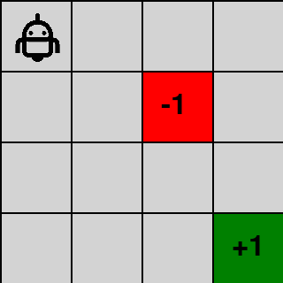

<!-- editorlm-hebrew-html-start -->
<style>
html, body, .vscode-body, .markdown-body, .markdown-preview, #write {
  direction: rtl !important; text-align: right !important;
}
ul, ol { padding-right: 2em !important; padding-left: 0 !important; }
blockquote { border-right: 3px solid #999; border-left: 0; padding-right: 1rem; padding-left: 0; }
@media print {
  html, body, .vscode-body, .markdown-body, .markdown-preview, #write {
    direction: rtl !important; text-align: right !important;
  }
}
</style>
<!-- editorlm-hebrew-html-end -->
<style>
.book { max-width: 900px; margin: auto; line-height: 1.8; font-family: Arial, sans-serif; }
.book .cover { min-height: 680px; box-sizing: border-box; padding: 64px 48px; margin: 24px 0 60px; background: #112b41; color: #f5f8fc; border-top: 9px solid #39c4b5; position: relative; }
.book .cover .eyebrow { color: #81e0d5; font-size: 15px; letter-spacing: 2px; }
.book .cover h1 { color: #fff; font-size: 48px; line-height: 1.3; border: 0; margin: 50px 0 18px; }
.book .cover .subtitle { font-size: 28px; color: #d8e6f0; }
.book .cover .author { font-size: 30px; color: #fff; margin-top: 52px; }
.book .cover .audience { color: #c1d3df; margin-top: 12px; }
.book .cover .motif { direction: ltr; text-align: left; font-family: Consolas, monospace; color: #81e0d5; font-size: 19px; margin-top: 54px; }
.book h1, .book h2, .book h3 { line-height: 1.4; font-weight: 700; }
.book > h1 { font-size: 32px !important; text-align: center !important; margin: 28px 0; }
.book h2 { font-size: 34px !important; text-align: center !important; color: #153b56 !important; background: #eef5fc; border: 0; border-bottom: 4px solid #299c91; border-radius: 10px 10px 0 0; padding: 28px 20px; margin: 24px 0 36px; }
.book h3 { font-size: 24px !important; text-align: right !important; color: #174e49 !important; background: #edf7f5; border: 0; border-right: 5px solid #299c91; border-radius: 6px; padding: 10px 16px; margin: 36px 0 18px; }
.book .chapter { height: 0; margin: 76px 0 0; border-top: 1px solid #ccd7df; break-before: page; page-break-before: always; break-after: avoid; page-break-after: avoid; }
.book .toc { padding: 24px; border-right: 5px solid #39a99d; background: rgba(70,150,155,.09); margin: 24px 0 48px; }
.book pre, .book pre code { direction: ltr !important; text-align: left !important; unicode-bidi: isolate; }
.book pre { box-sizing: border-box !important; width: 100% !important; max-width: 100% !important; margin: 0 !important; padding: 16px 20px; border: 1px solid #ccd7df; border-radius: 8px; line-height: 1.6; overflow-x: auto; }
.book code { direction: ltr; unicode-bidi: isolate; font-family: Consolas, "Courier New", monospace; }
.book pre { background: #f3f6fa !important; color: #1f2937 !important; }
.book pre code, .book pre code.hljs { background: transparent !important; color: #1f2937 !important; }
.book pre .hljs-keyword, .book pre .hljs-literal { color: #6f299c !important; }
.book pre .hljs-string { color: #216338 !important; }
.book pre .hljs-number { color: #075e68 !important; }
.book pre .hljs-comment { color: #526174 !important; }
.book pre .hljs-built_in, .book pre .hljs-title { color: #135b96 !important; }
.book table { width: 75%; max-width: 75%; margin: 18px auto; background: #f3f6fa; }
.book th, .book td { border: 1px solid #ccd7df; padding: 8px 12px; }
.book th, .book td { text-align: right; }
.book .small { font-size: .9em; opacity: .8; }
.book .python-intro { display: flex; align-items: center; gap: 28px; padding: 22px 28px; margin: 24px 0; background: #eef5fc; color: #183e63; border-right: 6px solid #3776ab; border-radius: 10px; }
.book .python-intro strong { font-size: 30px; }
.book .python-fact { background: #fff7d6; color: #423611; border-right: 6px solid #ffd343; border-radius: 8px; padding: 18px 24px; margin: 22px 0; }
.book .python-fact strong { font-size: 24px; }
.book .optional { background: #fff7d6; color: #423611; border-right: 6px solid #ffd343; border-radius: 8px; padding: 18px 24px; margin: 22px 0; font-size: .95em; }
.book .optional .formula { width: 90%; max-width: 90%; background: #fffdf3; }
.book .key-note { box-sizing:border-box; width:75%; max-width:75%; margin:26px auto; border:2px solid #1f7a70; border-radius:10px; background:#e6f7f4; overflow:hidden; }
.book .key-note .key-title { background:#1f7a70; color:#fff; font-weight:700; font-size:1.15em; padding:8px 18px; direction:rtl; text-align:right; }
.book .key-note .key-body { padding:14px 18px 16px; font-size:1.05em; direction:rtl; text-align:right; }
.book .grid-row { display:flex; flex-wrap:wrap; justify-content:center; align-items:flex-start; gap:14px 18px; }
.book .grid-row figure { width:auto; max-width:100%; margin:0; padding:0; background:transparent; border:0; }
.book .grid-row figcaption { margin-top:6px; font-size:.85em; }
.book .grid.small td { width:46px; height:36px; font-size:.9em; }
.book .grid .changed { color:#c8102e; font-weight:700; }
.book .grid.actions-table, .book .grid.actions-table th, .book .grid.actions-table td { direction:rtl!important; text-align:center!important; }
.book .grid.actions-table th { background:#eef5fc; border:1px solid #8199aa; font-weight:700; }
.book .bellman { box-sizing:border-box; width:75%; max-width:75%; margin:26px auto; border:2px solid #1f7a70; border-radius:10px; background:#e6f7f4; overflow:hidden; }
.book .bellman .bellman-title { background:#1f7a70; color:#fff; font-weight:700; font-size:1.15em; padding:8px 18px; direction:rtl; text-align:right; }
.book .bellman .bellman-cond { direction:ltr!important; text-align:center!important; unicode-bidi:isolate; padding:14px 20px 0; font-size:1.05em; color:#1f2937; }
.book .bellman .bellman-cond + .bellman-cond { padding-top:4px; }
.book .bellman .bellman-eq { direction:ltr!important; text-align:center!important; unicode-bidi:isolate; padding:12px 20px 18px; font-size:1.5em; font-weight:700; color:#0b3d5c; }
.book .bellman .bellman-eq span { background:#fff3b0; padding:4px 14px; border-radius:8px; border:1px solid #e6c94a; }
/* Display math renders left-to-right and centered, independent of the RTL page. */
.book .math-panel, .book .math-panel .katex-display, .book .math-panel .katex {
  direction: ltr !important;
  text-align: center !important;
  unicode-bidi: isolate;
}
.book .math-panel { box-sizing: border-box; width: 75%; max-width: 75%; margin: 20px auto; padding: 16px 20px; background: #f3f6fa; color: #1f2937; border: 1px solid #ccd7df; border-radius: 8px; overflow-x: auto; font-size: 1.1em; }
.book .math-panel .katex-display { margin: 0; }
.book .math-panel p { margin: 0; }
.book img { max-width: 100%; height: auto; }
.book figure { box-sizing: border-box; width: 75%; max-width: 75%; margin: 24px auto; padding: 16px 20px; background: #f3f6fa; border: 1px solid #ccd7df; border-radius: 8px; text-align: center; }
.book figure img { display: block; margin: auto; }
.book figcaption { direction: rtl; text-align: center; font-size: .9em; color: #445566; }
@media print { .book > h2 { break-before: page; page-break-before: always; } }
.book .screen-strip { width: 760px; max-width: 100%; height: 220px; overflow: hidden; border: 1px solid #bccad5; border-radius: 8px; margin: 20px auto 8px; direction: ltr; }
.book .screen-strip.output { height: 265px; }
.book .screen-strip img { display: block; width: 1745px; max-width: none; }
.book .screen-menu { width: 400px; max-width: 100%; height: 295px; overflow: hidden; direction: ltr; margin: 20px auto 8px; border: 1px solid #bccad5; border-radius: 8px; }
.book .screen-menu img { display: block; width: 1745px; max-width: none; }
.book .code-panel { box-sizing: border-box !important; display: block !important; width: 75% !important; max-width: 75% !important; margin: 18px auto !important; }
@media print {
  .book .cover { min-height: 85vh; break-after: page; print-color-adjust: exact; -webkit-print-color-adjust: exact; }
  .book pre { white-space: pre-wrap; break-inside: avoid; }
  .book .chapter { margin: 0; border: 0; }
  .book h1, .book h2, .book h3 { break-after: avoid; page-break-after: avoid; break-inside: avoid; }
  .book h2 { margin-top: 0; }
  .book h2, .book h3 { print-color-adjust: exact; -webkit-print-color-adjust: exact; }
}
</style>

<style>
.book .book-nav { display: flex; flex-wrap: wrap; gap: 10px; justify-content: center; align-items: center; padding: 16px 0; margin: 20px 0 32px; border-top: 1px solid #ccd7df; border-bottom: 1px solid #ccd7df; }
.book .book-nav a { display: inline-block; padding: 10px 18px; border-radius: 8px; background: #eef5fc; color: #153b56 !important; border: 1px solid #b5ccd9; text-decoration: none !important; font-size: 16px; font-weight: bold; }
.book .book-nav a.toc-link { background: #174e49; color: #fff !important; border-color: #174e49; }
.book .book-nav a:hover, .book .book-nav a:focus { background: #d4eee8; color: #153b56 !important; outline: 2px solid #299c91; outline-offset: 2px; }
.book .section-list { line-height: 2; }
@media print { .book .book-nav { display: none; } }

/* Explicit Hebrew direction, including prose beginning with English. */
.book p, .book ul, .book ol, .book li,
.book blockquote, .book h1, .book h2, .book h3,
.book h4, .book th, .book td {
  direction: rtl !important;
  text-align: right !important;
  unicode-bidi: isolate;
}
/* Chapter titles keep their agreed centered layout. */
.book h2 { text-align: center !important; }
.book pre, .book pre code, .book .code-panel {
  direction: ltr !important;
  text-align: left !important;
  unicode-bidi: isolate;
}
</style>

<style>
.book .formula { box-sizing:border-box; width:75%; max-width:75%; direction:ltr!important; text-align:center!important; overflow-x:auto;
  padding:16px 20px; background:#f3f6fa; color:#1f2937; border:1px solid #ccd7df; border-radius:8px; margin:20px auto; font-size:1.15em; }
.book .grid-panel { box-sizing:border-box; width:75%; max-width:75%; margin:20px auto; padding:16px 20px; background:#f3f6fa; border:1px solid #ccd7df; border-radius:8px; }
.book .grid { direction:ltr!important; width:auto!important; max-width:100%!important; margin:0 auto; border-collapse:collapse; background:#fff; }
.book .grid td { direction:ltr!important; text-align:center!important; width:64px; height:48px; border:1px solid #8199aa; }
.book .grid .goal { background:#d3efdc; } .book .grid .bad { background:#f4d7d7; }
</style>

<div class="book" dir="rtl" lang="he">

<nav class="book-nav" aria-label="ניווט בספר">
<a href="03-%D7%9E%D7%95%D7%93%D7%9C%20%D7%A1%D7%91%D7%99%D7%91%D7%94%20%D7%A1%D7%95%D7%9B%D7%9F%20%D7%95-MDP.md">→ הקודם</a>
<a class="toc-link" href="../index.md">תוכן העניינים</a>
<a href="05-Value%20Iteration.md">הבא ←</a>
</nav>

## ד.4 — תכנון דינמי: Policy Iteration

**המצגת:** [תכנון דינמי](../../../sources/RL/2.תכנון%20דינמי.pptx) · **קוד:** [Agent.py](https://github.com/MarkmanGilad/GridWorld/blob/main/Agent.py) · [Environement.py](https://github.com/MarkmanGilad/GridWorld/blob/main/Environement.py) · [Game.py](https://github.com/MarkmanGilad/GridWorld/blob/main/Game.py) · [מאגר GridWorld בגיטהב](https://github.com/MarkmanGilad/GridWorld)

בפרק הקודם הגדרנו את המושגים: מצב, פעולה, תגמול, מדיניות וערך של מצב. עכשיו אפשר לשאול את השאלה המעשית הראשונה: אם אנחנו יודעים את חוקי המשחק במלואם — לאיזה מצב מוביל כל מהלך ומה התגמול עליו — איך מחשבים את המהלך הטוב ביותר בכל מצב? זה המצב ב־Grid World, בפאזל המספרים ובכל משחק שהמודל שלו ידוע לנו. בפרק זה ובפרק הבא הסוכן עדיין אינו "לומד" מניסיון; הוא מחשב, כמו שמחשבים מסלול קצר במפה שכל כבישיה ידועים.

בפרק הקודם הצבנו את המטרה: למצוא אלגוריתם שמחשב את המדיניות המיטבית, שנסמן <span dir="ltr">π*</span> (במצגות: <span dir="ltr">P*</span>). בלוח קטן שהחוקים שלו ידועים אפשר לחשב אילו מהלכים כדאי לבצע, עוד לפני שמשחקים בפועל. לכל מצב נשמור ערך בטבלה. נתחיל ממדיניות פשוטה, נחשב לאן היא מובילה, ונשפר אותה על סמך התוצאות. השיטה הזו נקראת **תכנון דינמי — Dynamic Programming**: מפרקים חישוב של מסלול ארוך לחישובים קטנים הקשורים זה בזה, והתוצאות של החישובים הקטנים נשמרות בטבלה (או במבנה נתונים אחר) שמחזיקה את כל המצבים האפשריים בסביבה.

הפתרון הזה מתאים רק לסביבה שבה מרחב המצבים קטן יחסית וניתן לשמירה בזיכרון המחשב: בלוח 4×4 יש 16 מצבים, ואפילו איקס עיגול נכנס בטבלה. בשחמט או במשחק מחשב מספר המצבים גדול מכדי לשמור טבלה, ושם נצטרך לשדרג את האלגוריתם של בלמן; זה מה שנעשה בהמשך החלק, כשנחליף את הטבלה ברשת נוירונים.

את השיטה פיתח בשנות החמישים המתמטיקאי האמריקני ריצ׳ארד בלמן, והמשוואה שעליה היא נשענת קרויה על שמו. נלמד אותה תחילה, ואחריה נבנה בעזרתה את האלגוריתם הראשון שלנו, Policy Iteration.

<figure>

<figcaption>ריצ׳ארד בלמן (1920–1984), המתמטיקאי האמריקני שפיתח את התכנון הדינמי ואת המשוואה הקרויה על שמו.</figcaption>
</figure>

### משוואת בלמן: צעד אחד וההמשך שלו

בפרק הקודם חישבנו את ערך המצב V כסכום כל התגמולים לאורך המסלול עד סוף המשחק, כשכל תגמול רחוק מוכפל ב־γ פעם נוספת. חישוב כזה יקר: בכל מצב צריך לעקוב אחר מסלול שלם, ובלוח גדול המסלולים ארוכים. בלמן הראה שאפשר לחשב את הערך מצעד אחד קדימה בלבד. הפיתוח הוא אלגברה פשוטה בארבעה צעדים, ונעבור עליהם בזה אחר זה. למושגי הערך וההיוון ראו [פרק המודל](03-מודל%20סביבה%20סוכן%20ו-MDP.md#discount).

**צעד 1 — כותבים את הערך כסכום.** נניח שהסוכן נמצא במצב s<sub>0</sub> ופועל לפי מדיניות נתונה π. הסביבה דטרמיניסטית: בכל מצב המדיניות קובעת פעולה אחת, והמודל קובע מצב הבא אחד ותגמול אחד. לכן המסלול קבוע מראש: s<sub>0</sub> → s<sub>1</sub> → s<sub>2</sub> → … → s<sub>T</sub>, ובדרך מתקבלים התגמולים r<sub>1</sub>, r<sub>2</sub>, …, r<sub>T</sub>. ערך המצב s<sub>0</sub> לפי המדיניות π הוא התשואה של המסלול הזה:

<div class="math-panel" dir="ltr">

$$
V_\pi(s_0) = r_1 + \gamma r_2 + \gamma^2 r_3 + \gamma^3 r_4 + \cdots + \gamma^{T-1} r_T
$$

</div>

**צעד 2 — מוציאים γ מחוץ לסוגריים.** נסתכל על כל האיברים מלבד הראשון: γr<sub>2</sub>, γ²r<sub>3</sub>, γ³r<sub>4</sub> וכן הלאה. בכל אחד מהם מופיע γ לפחות פעם אחת. נכתוב כל איבר כך שיהיה בו γ אחד "מבחוץ" וכל השאר "מבפנים": γ²r<sub>3</sub> הוא γ·γr<sub>3</sub>, ו־γ³r<sub>4</sub> הוא γ·γ²r<sub>4</sub>. עכשיו ה־γ שמבחוץ משותף לכל האיברים האלה, ואפשר להוציא אותו מחוץ לסוגריים, בדיוק כמו ש־6+9 = 3·(2+3):

<div class="math-panel" dir="ltr">

$$
\begin{gathered} V_\pi(s_0) = r_1 + \gamma \cdot r_2 + \gamma \cdot \gamma r_3 + \gamma \cdot \gamma^2 r_4 + \cdots + \gamma \cdot \gamma^{T-2} r_T \\ V_\pi(s_0) = r_1 + \gamma \cdot \left( r_2 + \gamma r_3 + \gamma^2 r_4 + \cdots + \gamma^{T-2} r_T \right) \end{gathered}
$$

</div>

במספרים, עם γ=0.9 ותגמולים 1, 2, 3: הסכום 1 + 0.9·2 + 0.81·3 שווה ל־1 + 0.9·(2 + 0.9·3). בשני המקרים התוצאה 5.23.

**צעד 3 — מזהים את הסוגריים.** נסתכל על מה שנשאר בתוך הסוגריים: r<sub>2</sub> + γr<sub>3</sub> + γ²r<sub>4</sub> + …. זה בדיוק אותו סוג של סכום כמו בצעד 1, רק שהוא מתחיל צעד אחד מאוחר יותר, מהמצב s<sub>1</sub>. כלומר, הסוגריים הם ערך המצב s<sub>1</sub>:

<div class="math-panel" dir="ltr">

$$
V_\pi(s_1) = r_2 + \gamma r_3 + \gamma^2 r_4 + \cdots + \gamma^{T-2} r_T
$$

</div>

כאן נכנסת תכונת מרקוב מהפרק הקודם: הערך של s<sub>1</sub> תלוי רק ב־s<sub>1</sub> עצמו ובמדיניות, ולא בדרך שבה הגענו אליו. לכן מותר לנו לקרוא לסכום שבסוגריים "הערך של s<sub>1</sub>", בלי לזכור שבאנו מ־s<sub>0</sub>.

**צעד 4 — מציבים.** מחליפים את הסוגריים ב־V<sub>π</sub>(s<sub>1</sub>) ומקבלים:

<div class="math-panel" dir="ltr">

$$
V_\pi(s_0) = r_1 + \gamma V_\pi(s_1)
$$

</div>

הפיתוח לא תלוי בכך שהתחלנו דווקא מ־s<sub>0</sub>; הוא נכון לכל מצב s, למצב הבא שלו s′ ולתגמול r שמתקבל במעבר ביניהם. בכתיב הכללי:

<div class="bellman" id="bellman">
<div class="bellman-title">משוואת בלמן — Bellman Equation</div>
<div class="bellman-cond" dir="ltr">&#x2066;π(s) = a&#x2069;</div>
<div class="bellman-cond" dir="ltr">&#x2066;model(s, a) = (s′, r)&#x2069;</div>
<div class="bellman-eq" dir="ltr"><span>&#x2066;V<sub>π</sub>(s) = r + γ·V<sub>π</sub>(s′)&#x2069;</span></div>
</div>

זו **משוואת בלמן — Bellman Equation** למדיניות נתונה בסביבה דטרמיניסטית. היא תלווה אותנו בכל הספר: כל אלגוריתם שנלמד מכאן והלאה, עד DQN, בנוי עליה. במילים: הערך של מצב הוא התגמול שמקבלים בצעד הקרוב, ועוד הערך של המצב שמגיעים אליו, מוכפל ב־γ. המשוואה מאפשרת לעדכן תא בטבלה באמצעות תא אחר, במקום לסכום מחדש מסלול שלם בכל פעם. שימו לב שהמשוואה מגדירה את V באמצעות V עצמה — הערך של מצב תלוי בערך של המצב הבא. זה לא מעגל סתום: כפי שנראה מיד, אפשר להתחיל מטבלה של אפסים ולהחיל את המשוואה שוב ושוב עד שהערכים מתייצבים. אם המצב הבא סופי, ערכו 0, ולכן נשאר רק התגמול המיידי.

**בדיקה במספרים.** ניקח γ=0.9 כמו בפרק הקודם, ומסלול של שלושה צעדים שבו שני הצעדים הראשונים נותנים 0 והצעד השלישי מגיע ליעד ונותן 1. לפי הסכום המלא מצעד 1:

<div class="math-panel" dir="ltr">

$$
V_\pi(s_0) = 0 + 0.9 \cdot 0 + 0.9^2 \cdot 1 = 0.81
$$

</div>

ולפי משוואת בלמן, מהסוף להתחלה: המצב s<sub>2</sub> נמצא צעד אחד לפני היעד, ולכן V(s<sub>2</sub>) = 1 + 0.9·0 = 1. אחריו V(s<sub>1</sub>) = 0 + 0.9·1 = 0.9, ולבסוף V(s<sub>0</sub>) = 0 + 0.9·0.9 = 0.81. שתי הדרכים נותנות אותו מספר, אבל בדרך של בלמן כל חישוב הוא חיבור אחד וכפל אחד. כך המידע על היעד יכול להתפשט בטבלה — מהיעד אחורה, תא אחר תא, כמו גלים במים.

**אותו פיתוח עבור Q.** ערך מצב–פעולה Q<sub>π</sub>(s,a) הוא התשואה כשמתחילים ב־s, מבצעים את הפעולה a, ומכאן והלאה ממשיכים לפי המדיניות. הסכום זהה לסכום שבצעד 1, ולכן ארבעת הצעדים חוזרים על עצמם מילה במילה. ההבדל היחיד: הסוגריים שמתקבלים בצעד 2 הם התשואה מ־s′ כשממשיכים לפי המדיניות, כלומר Q של s′ עם הפעולה שהמדיניות בוחרת בו, a′=π(s′):

<div class="bellman">
<div class="bellman-title">משוואת בלמן עבור Q</div>
<div class="bellman-cond" dir="ltr">&#x2066;model(s, a) = (s′, r)&#x2069;</div>
<div class="bellman-cond" dir="ltr">&#x2066;π(s′) = a′&#x2069;</div>
<div class="bellman-eq" dir="ltr"><span>&#x2066;Q<sub>π</sub>(s, a) = r + γ·Q<sub>π</sub>(s′, a′)&#x2069;</span></div>
</div>

<div class="optional">
<strong>רשות: משוואת בלמן המלאה.</strong> בסביבה אקראית (סטוכסטית) אותה פעולה באותו מצב עשויה להוביל למצבים שונים, כל אחד בהסתברות אחרת. במקרה כזה אי אפשר לדבר על "המצב הבא", ובמקום ערך יחיד מחשבים ממוצע משוקלל של כל האפשרויות, כל אחת לפי ההסתברות שלה. זו הצורה המלאה של משוואת בלמן:

<div class="math-panel" dir="ltr">

$$
V_\pi(s) = \sum_a \pi(a \mid s) \sum_{s',r} p(s',r \mid s,a) \left[ r + \gamma V_\pi(s') \right]
$$

</div>

π(a|s) היא ההסתברות שהמדיניות תבחר את הפעולה a במצב s, ו־p(s′,r|s,a) היא ההסתברות שהסביבה תעבור למצב s′ ותיתן תגמול r. הביטוי בסוגריים המרובעים הוא בדיוק הצד הימני של המשוואה הפשוטה שלנו. בסביבה דטרמיניסטית יש בכל סכום רק אפשרות אחת, בהסתברות 1, ושני הסכומים נעלמים — ונשארת המשוואה שפיתחנו. הסביבות בספר הזה דטרמיניסטיות, ולכן לא נשתמש בצורה המלאה; היא מובאת כאן רק כדי שתזהו אותה כשתפגשו אותה בספרים ובמאמרים.
</div>

<!-- editorlm-source-ref: [sources/RL/2.תכנון דינמי.pptx#L16-L40] -->

<a id="policy-evaluation"></a>
### חישוב פונקציית הערך למדיניות נתונה — Policy Evaluation

נדגים עכשיו איך מקבלים מדיניות כלשהי ומוצאים את טבלת הערכים התואמת לה באמצעות משוואת בלמן. זו עדיין לא המדיניות המיטבית ולא פונקציית הערך המיטבית: מטרת האלגוריתם הראשון היא רק למצוא את טבלת הערכים המתאימה למדיניות שבחרנו, ולכל מדיניות אפשר למצוא בדרך הזו את טבלת הערכים שלה. זהו האלגוריתם של בלמן המכונה **Policy Evaluation**. שימו לב למילה: ״הערכה״ (evaluation) כאן פירושה לחשב ערך, ולא לשפוט כמה המדיניות טובה.

כדי להפעיל את משוואת בלמן צריך מדיניות כלשהי — המשוואה מחשבת ערכים עבור מדיניות נתונה. לכן נתחיל בבניית מדיניות התחלתית. נשתמש ב־[לוח 4×4 שהוגדר בפרק הקודם](03-מודל%20סביבה%20סוכן%20ו-MDP.md). נשמור שתי טבלאות: V מכילה מספר לכל מצב, ו־π מכילה פעולה לכל מצב שאינו סופי. נאתחל את הערכים באפס. המדיניות הראשונית יכולה להיות פשוטה מאוד; בשלב הזה היא אינה חייבת להיות טובה.

בפרק הזה נתחיל ממדיניות ״למטה״: הסוכן הולך תמיד למטה, אלא אם הוא צמוד ליעד, ואז הולך לכיוונו; כלומר בתא שמשמאל ליעד נפנה ימינה. בשורה התחתונה ״למטה״ פירושו ניסיון לצאת מהלוח, והסוכן נשאר במקומו בלי תגמול. זו מדיניות התחלתית חלשה, שאותה נשפר. לצד המדיניות נחזיק את טבלת הערכים V(s): באתחול כל הערכים 0, ולשני תאי הסיום הערך יישאר 0 לאורך כל הדרך, כי מהם המשחק אינו ממשיך. התגמולים כמו בפרק הקודם: 0 בכל צעד רגיל, 1 בכניסה למשבצת הירוקה, ‎−1 בכניסה למשבצת האדומה, ו־γ=0.9.

<div class="grid-panel"><div class="grid-row">
<figure>
<table class="grid" dir="ltr">
<tr><td>↓</td><td>↓</td><td>↓</td><td>↓</td></tr>
<tr><td>↓</td><td>↓</td><td class="bad">סיום</td><td>↓</td></tr>
<tr><td>↓</td><td>↓</td><td>↓</td><td>↓</td></tr>
<tr><td>↓</td><td>↓</td><td>→</td><td class="goal">סיום</td></tr>
</table>
<figcaption>המדיניות ההתחלתית (Policy)</figcaption>
</figure>
<figure>
<table class="grid" dir="ltr">
<tr><td>0</td><td>0</td><td>0</td><td>0</td></tr>
<tr><td>0</td><td>0</td><td class="bad">0</td><td>0</td></tr>
<tr><td>0</td><td>0</td><td>0</td><td>0</td></tr>
<tr><td>0</td><td>0</td><td>0</td><td class="goal">0</td></tr>
</table>
<figcaption>טבלת הערכים V(s) באתחול</figcaption>
</figure>
</div></div>

<!-- editorlm-source-ref: [sources/RL/2.תכנון דינמי.pptx#L19-L99] -->

יש לנו מדיניות, ועכשיו נמצא את טבלת הערכים V שלה. במהלך החישוב לא משנים את הפעולות שנבחרו. עוברים שוב ושוב על המצבים ומעדכנים את V לפי משוואת בלמן ולפי אותה מדיניות. בכל סריקה מודדים את השינוי הגדול ביותר בערכים. כשהשינוי קטן מן הדיוק שבחרנו, מפסיקים — הטבלה התייצבה ואינה משתנה עוד.

האלגוריתם של בלמן מציע לבצע חישוב חוזר ונשנה של המשוואה V<sub>π</sub>(s) = r + γV<sub>π</sub>(s′) על כל תאי הטבלה, עד אשר לא יהיו יותר שינויים בטבלה (או שהשינויים יהיו קטנים מאוד). מה זה אומר בפועל? **סורקים** את הטבלה: עוברים על התאים שורה אחר שורה, מלמעלה למטה, ובכל שורה משמאל לימין. בכל תא שאינו תא סיום מבצעים חישוב אחד:

1. מסתכלים בטבלת המדיניות ורואים איזו פעולה נבחרה בתא הזה.
2. שואלים את המודל לאן הפעולה מובילה ומה התגמול r על המעבר.
3. מסתכלים בטבלת הערכים וקוראים את הערך הנוכחי של התא שאליו הגענו, V(s′).
4. מחשבים לפי נוסחת בלמן r + 0.9·V(s′) וכותבים את התוצאה בתא הנוכחי במקום הערך הישן.

הערך החדש נכתב מיד בטבלה, ולכן תא שנסרק מאוחר יותר באותה סריקה כבר רואה אותו. תאי הסיום מדלגים עליהם, וערכם נשאר 0. כשמסיימים את כל התאים, זו סריקה אחת; אז מתחילים סריקה חדשה מן התא הראשון.

**סריקה ראשונה, יד ביד.** נסמן כל תא לפי (שורה, עמודה), כשהספירה מתחילה ב־0 מלמעלה ומשמאל, בדיוק כמו בקוד: התא האדום הוא (1,2) והיעד הירוק הוא (3,3). מתחילים מטבלה שכולה אפסים ומן המדיניות ״למטה״ שבנינו.

- **התא (0,0):** המדיניות אומרת ״למטה״, והמודל מוביל ל־(1,0) עם תגמול 0. הערך של (1,0) בטבלה הוא 0, ולכן מחשבים 0 + 0.9·0 = 0. כותבים 0; שום דבר לא השתנה. גם התא (0,1) מסתיים כך.
- **התא (0,2):** ״למטה״ מוביל לתא האדום (1,2). התגמול על הכניסה אליו הוא ‎−1, וערכו של תא סיום הוא 0. מחשבים ‎−1 + 0.9·0 = ‎−1, וכותבים ‎−1 בתא (0,2). זה השינוי הראשון בטבלה.
- **התא (0,3):** ״למטה״ מוביל ל־(1,3). תגמול 0, והערך של (1,3) הוא בינתיים 0. התוצאה 0.
- **השורה השנייה:** (1,0) ו־(1,1) נותנים 0, את (1,2) מדלגים כי הוא תא סיום, ו־(1,3) יורד אל (2,3). התגמול 0, והערך של (2,3) הוא עדיין 0, כי טרם הגענו אליו בסריקה הזאת. התוצאה 0.
- **השורה השלישית:** שלושת התאים הראשונים נותנים 0. התא (2,3) יורד אל היעד הירוק: תגמול 1, וערכו של תא סיום 0. מחשבים 1 + 0.9·0 = 1 וכותבים 1 בתא (2,3).
- **השורה התחתונה:** ב־(3,0) וב־(3,1) ״למטה״ פירושו ניסיון לצאת מהלוח, הסוכן נשאר במקומו עם תגמול 0, ולכן 0 + 0.9·0 = 0. התא (3,2) פונה ימינה אל היעד: 1 + 0.9·0 = 1. את (3,3) מדלגים.

בסיום הסריקה הראשונה השתנו שלושה תאים בלבד, והם מסומנים באדום:

<div class="grid-panel"><div class="grid-row">
<figure>
<table class="grid" dir="ltr">
<tr><td>0</td><td>0</td><td class="changed">−1</td><td>0</td></tr>
<tr><td>0</td><td>0</td><td class="bad">0</td><td>0</td></tr>
<tr><td>0</td><td>0</td><td>0</td><td class="changed">1</td></tr>
<tr><td>0</td><td>0</td><td class="changed">1</td><td class="goal">0</td></tr>
</table>
<figcaption>טבלת הערכים אחרי הסריקה הראשונה</figcaption>
</figure>
</div></div>

שימו לב שרק תאים שהפעולה שלהם נכנסת ישירות לתא סיום קיבלו ערך: כל השאר הובילו לתאים שערכם עדיין היה 0 ברגע החישוב.

**סריקה שנייה, יד ביד.** חוזרים על אותו חישוב מן התא הראשון, אבל עכשיו יש בטבלה שלושה מספרים שאינם אפס, והם משפיעים על התאים שמובילים אליהם.

- **התא (0,0) והתא (0,1):** ״למטה״ מוביל ל־(1,0) ול־(1,1), ששניהם עדיין 0. התוצאה 0 + 0.9·0 = 0, ללא שינוי.
- **התא (0,2):** ״למטה״ מוביל שוב לתא האדום: ‎−1 + 0.9·0 = ‎−1. אותו מספר שכבר כתוב בתא, ולכן אין שינוי.
- **התא (0,3):** ״למטה״ מוביל ל־(1,3). ברגע הזה הערך של (1,3) הוא עדיין 0, כי נגיע אליו רק בשורה הבאה של הסריקה. התוצאה 0. התא הזה יקבל ערך רק בסריקה הבאה.
- **התא (1,3):** ״למטה״ מוביל ל־(2,3), שערכו כבר 1 מן הסריקה הקודמת. מחשבים 0 + 0.9·1 = 0.9 וכותבים 0.9. זה השינוי הראשון בסריקה הזאת.
- **התא (2,2):** ״למטה״ מוביל ל־(3,2), שערכו 1. מחשבים 0 + 0.9·1 = 0.9 וכותבים 0.9.
- **התא (2,3) והתא (3,2):** שניהם נכנסים ליעד ונותנים שוב 1 + 0.9·0 = 1, ללא שינוי. כל שאר התאים מובילים לתאים שערכם 0 ונשארים 0.

בסיום הסריקה השנייה השתנו שני תאים, והם מסומנים באדום:

<div class="grid-panel"><div class="grid-row">
<figure>
<table class="grid" dir="ltr">
<tr><td>0</td><td>0</td><td>−1</td><td>0</td></tr>
<tr><td>0</td><td>0</td><td class="bad">0</td><td class="changed">0.9</td></tr>
<tr><td>0</td><td>0</td><td class="changed">0.9</td><td>1</td></tr>
<tr><td>0</td><td>0</td><td>1</td><td class="goal">0</td></tr>
</table>
<figcaption>טבלת הערכים אחרי הסריקה השנייה</figcaption>
</figure>
</div></div>

שימו לב ל־(0,3): הוא נסרק לפני (1,3), ולכן ראה שם עדיין 0. כך פועל עדכון במקום: בכל סריקה המידע מתקדם צעד אחד לאחור, מן היעד אל התאים שמובילים אליו.

**הסריקות הבאות.** בסריקה השלישית התא (0,3) יורד אל (1,3), שערכו עכשיו 0.9, ומקבל 0 + 0.9·0.9 = 0.81; זה השינוי היחיד. בסריקה הרביעית מחשבים שוב את כל התאים, וכל אחד מהם נותן בדיוק את המספר שכבר כתוב בו: השינוי הגדול ביותר הוא 0, קטן מן הדיוק שקבענו, ולכן עוצרים. כך זה תמיד: כדי לדעת שהטבלה התייצבה צריך לבצע סריקה אחת נוספת שלא משנה דבר.

<div class="grid-panel"><div class="grid-row">
<figure>
<table class="grid small" dir="ltr">
<tr><td>0</td><td>0</td><td>−1</td><td class="changed">0.81</td></tr>
<tr><td>0</td><td>0</td><td class="bad">0</td><td>0.9</td></tr>
<tr><td>0</td><td>0</td><td>0.9</td><td>1</td></tr>
<tr><td>0</td><td>0</td><td>1</td><td class="goal">0</td></tr>
</table>
<figcaption>סריקה 3</figcaption>
</figure>
<figure>
<table class="grid small" dir="ltr">
<tr><td>0</td><td>0</td><td>−1</td><td>0.81</td></tr>
<tr><td>0</td><td>0</td><td class="bad">0</td><td>0.9</td></tr>
<tr><td>0</td><td>0</td><td>0.9</td><td>1</td></tr>
<tr><td>0</td><td>0</td><td>1</td><td class="goal">0</td></tr>
</table>
<figcaption>סריקה 4 — ללא שינוי, עוצרים</figcaption>
</figure>
</div></div>

הערכים מתקדמים מן היעד אחורה, סריקה אחר סריקה: קודם התאים הצמודים לתאי הסיום, אחר כך התאים שמובילים אליהם, וכן הלאה. תא שהמדיניות אינה מובילה ממנו לשום תגמול נשאר 0.

שימו לב לשתי העמודות השמאליות: כל התאים בהן נשארו 0, אף שהיעד נמצא באותו לוח. הסיבה היא המדיניות. מכל תא בעמודות האלה הסוכן הולך ״למטה״ עד השורה התחתונה, ושם ״למטה״ משאיר אותו במקום לנצח. הוא אינו מגיע לעולם לא ליעד ולא לתא האדום, ולכן סכום התגמולים שלו הוא 0. למשל, התא (3,1) נמצא שני צעדים בלבד מהיעד, אבל במדיניות הזאת הסוכן לא הולך לשם, ולכן ערכו 0. זו נקודה חשובה: V מודדת כמה תגמול צובר הסוכן כשהוא הולך לפי המדיניות הנתונה, ולא כמה קרוב היעד.

<!-- editorlm-source-ref: [sources/RL/2.תכנון דינמי.pptx#L49-L99] -->

לסיכום, הנה האלגוריתם Policy Evaluation בפסאודו־קוד. מאתחלים את V בערכים אקראיים, פרט לתאי הסיום שמקבלים 0; קובעים דיוק קטן, accuracy=0.0001; ובכל סריקה שומרים את הערך הישן, מבקשים מן המדיניות פעולה, מבקשים מן הסביבה את המצב הבא והתגמול, מחשבים ערך חדש לפי משוואת בלמן ורושמים את השינוי הגדול ביותר. מסיימים את הסריקות כאשר תיקון הטבלה קטן מן הסף שנקבע:

<div class="code-panel" dir="ltr">

```text
# Iterative Policy Evaluation for Deterministic environment

# Initialization
for all s in S:
    V(s) = random(float) except V(terminal) = 0

def Policy_Evaluation(P, V):
    accuracy = 0.0001 (small number)
    acc = maxNumber
    while acc > accuracy:
        acc = 0
        for s in all states:
            if s is terminal: continue
            old_value = V(s)
            action = P(s)
            s', r = environment(s, action)
            new_value = r + gamma * V(s')
            V(s) = new_value
            acc = max(acc, abs(old_value - new_value))
```

</div>

<div class="key-note">
<div class="key-title">בלמן הוכיח: כאשר γ&lt;1 האלגוריתם תמיד מתכנס</div>
<div class="key-body">למה אפשר להיות בטוחים שהסריקות ייעצרו? בכל סריקה המידע מתקדם צעד אחד לאחור מן היעד, וכל צעד כזה מכפיל את הערך ב־γ פעם נוספת: 1, אחר כך 0.9, אחר כך 0.81, 0.73 וכן הלאה. ככל שהמידע רחוק יותר מן היעד, התיקון שהוא מביא לטבלה קטן יותר, כי 0.9 בחזקה גדולה הוא מספר קטן מאוד. לכן השינוי הגדול ביותר בסריקה הולך וקטן מסריקה לסריקה, עד שהוא יורד מתחת לדיוק שקבענו והלולאה נעצרת. בלמן הוכיח שזה קורה תמיד כאשר γ&lt;1: בכל מדיניות, בכל לוח ומכל טבלת התחלה (לכן מותר לאתחל את V במספרים אקראיים, כפי שעושה הפסאודו־קוד), והטבלה שמתקבלת בסוף היא בדיוק טבלת הערכים של המדיניות. לעומת זאת, כאשר γ=1 מסלול שמסתובב בלולאה וצובר תגמולים יכול לגדול בלי גבול, והאלגוריתם לא ייעצר. זו סיבה נוספת לבחור γ קטן מ־1, נוסף על הסיבות שראינו בפרק הקודם.</div>
</div>

<!-- editorlm-source-ref: [sources/RL/2.תכנון דינמי.pptx#L101-L121] -->

<a id="policy-improvement"></a>
### שיפור המדיניות — Policy Improvement

עכשיו יש לנו טבלת ערכים שמתארת את המדיניות הנוכחית, והיא מגלה לנו היכן המדיניות חלשה: למשל, התא שמעל תא ההפסד יורד היישר אל ‎−1, בעוד שכנו מימין שווה 0.81. השלב השני, **שיפור המדיניות — Policy Improvement**, מנצל את המידע הזה. כעת נשאל בכל מצב אם פעולה אחרת תיתן תוצאה טובה יותר. לכל פעולה חוקית מחשבים את התגמול המיידי ואת ערך ההמשך. בוחרים פעולה עם הציון הגדול ביותר ומשנים את המדיניות בהתאם. זו בחירה **חמדנית — Greedy**: בכל מצב לוקחים את הפעולה שנראית הכי טובה לפי הטבלה הנוכחית. בשלב הזה משתמשים בטבלת הערכים שחושבה עבור המדיניות הקודמת, ו־Policy Improvement מצריך מעבר אחד בלבד על הטבלה.

**סריקה אחת, יד ביד.** גם כאן סורקים את הטבלה שורה אחר שורה, אבל יש הבדל גדול מן השלב הקודם: הפעם עוברים על הטבלה **פעם אחת בלבד**, ולא חוזרים עליה עד התייצבות. טבלת הערכים אינה משתנה בסריקה הזאת; משתנים רק החצים בטבלת המדיניות. בכל תא שאינו תא סיום עושים את הדבר הבא:

1. רושמים את ארבע הפעולות האפשריות בתא: למעלה, ימינה, שמאלה ולמטה. פעולה אל מחוץ ללוח משאירה את הסוכן במקומו, ולכן גם היא אפשרית.
2. לכל אחת מארבע הפעולות בנפרד: שואלים את המודל לאן היא מובילה ומה התגמול, ומחשבים לפי נוסחת בלמן r + 0.9·V(s′), כשאת V(s′) קוראים מטבלת הערכים שחישבנו זה עתה.
3. משווים את ארבעת המספרים ובוחרים את הפעולה שנתנה את המספר הגדול ביותר.
4. כותבים את הפעולה הזאת בטבלת המדיניות. אם היא שונה מן הפעולה שהייתה שם, המדיניות השתנתה. כשכמה פעולות נותנות אותו מספר, ואחת מהן היא הפעולה הנוכחית, משאירים אותה.

נעשה זאת במלואו על התא (0,2), התא שמעל התא האדום, שערכו כרגע ‎−1 והחץ שלו ״למטה״:

<div class="grid-panel">
<table class="grid actions-table" dir="rtl" style="width:auto" aria-label="ארבע הפעולות בתא (0,2)">
<tr><th style="padding:6px 14px">פעולה</th><th style="padding:6px 14px">לאן מובילה</th><th style="padding:6px 14px">r</th><th style="padding:6px 14px">V(s′)</th><th style="padding:6px 14px">r + 0.9·V(s′)</th></tr>
<tr><td style="width:auto;padding:6px 14px">למעלה</td><td style="width:auto;padding:6px 14px">מחוץ ללוח, נשאר ב־(0,2)</td><td style="width:auto">0</td><td style="width:auto">‎−1</td><td style="width:auto">‎−0.9</td></tr>
<tr><td style="width:auto;padding:6px 14px">ימינה</td><td style="width:auto;padding:6px 14px">(0,3)</td><td style="width:auto">0</td><td style="width:auto">0.81</td><td style="width:auto" class="changed">0.73</td></tr>
<tr><td style="width:auto;padding:6px 14px">שמאלה</td><td style="width:auto;padding:6px 14px">(0,1)</td><td style="width:auto">0</td><td style="width:auto">0</td><td style="width:auto">0</td></tr>
<tr><td style="width:auto;padding:6px 14px">למטה</td><td style="width:auto;padding:6px 14px">התא האדום (1,2)</td><td style="width:auto">‎−1</td><td style="width:auto">0</td><td style="width:auto">‎−1</td></tr>
</table>
</div>

המספר הגדול ביותר הוא 0.73, של ״ימינה״, ולכן החץ בתא (0,2) מתחלף מ״למטה״ ל״ימינה״. הנה אותו חישוב, בקצרה, בשאר התאים:

- **התא (0,0):** ״ימינה״ מוביל ל־(0,1) ו״למטה״ ל־(1,0), ושניהם שווים 0; ״למעלה״ ו״שמאלה״ משאירים במקום, וגם זה 0. כל הפעולות שקולות, החץ ״למטה״ נשאר. כך גם בכל התאים של שתי העמודות השמאליות שכל שכניהם 0: (0,1), (1,0), (1,1), (2,0) ו־(3,0).
- **התא (0,2):** ראינו למעלה: ״ימינה״ נותנת 0.73, יותר מכל פעולה אחרת, והחץ מתחלף ל״ימינה״. זה השינוי הראשון.
- **התא (0,3):** ״למטה״ מוביל ל־(1,3), שערכו 0.9: 0.9·0.9 = 0.81. ״שמאלה״ מוביל ל־(0,2), שערכו ‎−1: ‎−0.9. ״למטה״ מנצח, החץ נשאר.
- **התא (1,3):** ״למעלה״ נותן 0.9·0.81 = 0.73, ״למטה״ מוביל ל־(2,3) שערכו 1 ונותן 0.9, ו״שמאלה״ מוביל לתא האדום ונותן ‎−1. ״למטה״ נשאר.
- **התא (2,1):** ״ימינה״ מוביל ל־(2,2), שערכו 0.9: 0.81. כל שאר הפעולות מובילות לתאים שערכם 0. החץ מתחלף ל״ימינה״. זה השינוי השני.
- **התא (2,2):** ״ימינה״ מוביל ל־(2,3) ו״למטה״ ל־(3,2), ושניהם שווים 1, כלומר 0.9 לשתי הפעולות; ״למעלה״ מוביל לתא האדום (‎−1) ו״שמאלה״ ל־0. ״ימינה״ ו״למטה״ שקולות, ולכן ״למטה״ הנוכחי נשאר.
- **התא (2,3):** ״למטה״ נכנס ליעד ונותן 1, יותר מכל פעולה אחרת. נשאר.
- **התא (3,1):** ״ימינה״ מוביל ל־(3,2), שערכו 1: 0.9. ״למעלה״ מוביל ל־(2,1) שערכו 0, ו״שמאלה״ ו״למטה״ נותנים 0. החץ מתחלף ל״ימינה״. זה השינוי השלישי.
- **התא (3,2):** ״ימינה״ נכנס ליעד ונותן 1; ״למעלה״ נותן 0.9·0.9 = 0.81. ״ימינה״ נשאר.

בסיום הסריקה היחידה הזאת השתנו שלושה חצים, והם מסומנים באדום; יתר החצים נשארים כפי שהיו. טבלת הערכים משמאל היא הטבלה שלפיה חישבנו, והיא לא השתנתה:

<div class="grid-panel"><div class="grid-row">
<figure>
<table class="grid" dir="ltr">
<tr><td>0</td><td>0</td><td>−1</td><td>0.81</td></tr>
<tr><td>0</td><td>0</td><td class="bad">0</td><td>0.9</td></tr>
<tr><td>0</td><td>0</td><td>0.9</td><td>1</td></tr>
<tr><td>0</td><td>0</td><td>1</td><td class="goal">0</td></tr>
</table>
<figcaption>טבלת הערכים של המדיניות הקודמת</figcaption>
</figure>
<figure>
<table class="grid" dir="ltr">
<tr><td>↓</td><td>↓</td><td class="changed">→</td><td>↓</td></tr>
<tr><td>↓</td><td>↓</td><td class="bad">סיום</td><td>↓</td></tr>
<tr><td>↓</td><td class="changed">→</td><td>↓</td><td>↓</td></tr>
<tr><td>↓</td><td class="changed">→</td><td>→</td><td class="goal">סיום</td></tr>
</table>
<figcaption>המדיניות אחרי השיפור</figcaption>
</figure>
</div></div>

שימו לב שאחרי הסריקה טבלת המדיניות כבר אינה תואמת לטבלת הערכים: הערכים חושבו למדיניות הישנה. זו בדיוק הסיבה שבסעיף הבא נחזור ונחשב את הערכים מחדש. לסיכום, הנה האלגוריתם Policy Improvement בפסאודו־קוד. לכל מצב שאינו מצב סיום (על מצבי הסיום מדלגים, כמו בהערכת המדיניות: אין בהם פעולה) אוספים את הפעולות החוקיות, מתחילים מ־v_max=−inf, בודקים כל פעולה מול הסביבה ושומרים את הפעולה הטובה ביותר. אם היא שונה מן הפעולה הנוכחית במדיניות, מעדכנים את המדיניות ומסמנים שהיא אינה יציבה. מחזירים True אם לא היו שינויים, כלומר המדיניות יציבה:

<div class="code-panel" dir="ltr">

```text
# policy improvement for Deterministic environment
# return true if policy stable

def Policy_improvement(P, V):
    stable = true
    for all s in States:
        if s is terminal: continue
        actions = legal_actions(s)
        v_max = -inf
        for all action in actions:
            s', r = environment(s, action)
            if v_max < r + gamma * V(s'):
                v_max = r + gamma * V(s')
                best_action = action
        if P(s) != best_action:
            P(s) = best_action
            stable = false
    return stable
```

</div>

**ואפשר גם בנוסחה.** את אותו אלגוריתם בדיוק נהוג לכתוב בספרים בשורה מתמטית אחת. אין בה שום דבר חדש, רק סימון מקוצר של מה שעשינו זה עתה:

<div class="math-panel" dir="ltr">

$$
\pi_{\text{new}}(s) = \operatorname*{argmax}_a \left[ R(s,a,s') + \gamma V_\pi(s') \right]
$$

</div>

קוראים אותה כך: המדיניות החדשה, π<sub>new</sub>, בוחרת במצב s את הפעולה a שעבורה הביטוי שבסוגריים הוא הגדול ביותר. R(s,a,s′) הוא התגמול על המעבר מ־s אל s′ בפעולה a, ו־γV<sub>π</sub>(s′) הוא ערך ההמשך לפי טבלת הערכים של המדיניות הקודמת. הסימון argmax (״הארגומנט של המקסימום״) פירושו: לא הערך המקסימלי עצמו, אלא הפעולה שמביאה אליו. זה בדיוק מה שעושה הלולאה הפנימית בפסאודו־קוד: v_max הוא המקסימום, ו־best_action הוא ה־argmax.

<!-- editorlm-source-ref: [sources/RL/2.תכנון דינמי.pptx#L123-L163] -->

### מציאת מדיניות מיטבית — Policy Iteration

עכשיו יש בידינו את שני הכלים, ומהם בלמן בנה את האלגוריתם **Policy Iteration** למציאת המדיניות המיטבית. הרעיון פשוט: מבצעים לסירוגין **הערכת מדיניות** (Policy Evaluation), שמחשבת את טבלת הערכים של המדיניות הנוכחית, ו**שיפור מדיניות** (Policy Improvement), שמעדכן את המדיניות לפי טבלת הערכים החדשה. חוזרים על שני השלבים שוב ושוב, עד שהשיפור אינו משנה אף חץ, כלומר המדיניות יציבה.

<div class="key-note">
<div class="key-title">בלמן הוכיח: הערכה ושיפור לסירוגין מגיעים למדיניות המיטבית</div>
<div class="key-body">אם מבצעים שוב ושוב הערכת מדיניות ואחריה שיפור מדיניות, מגיעים בסוף למדיניות שאי אפשר לשפר עוד, והיא המדיניות המיטבית <span dir="ltr">π*</span>, ואיתה טבלת הערכים המיטבית <span dir="ltr">V*</span>. הסיבה: בכל סבב המדיניות אינה נעשית גרועה יותר, ובלוח סופי מספר המדיניות האפשריות הוא סופי, ולכן התהליך חייב להיעצר, ומקום העצירה היחיד האפשרי הוא המדיניות המיטבית. לכן מותר להתחיל מכל מדיניות שהיא, אפילו ״למטה״ בכל התאים, ומכל טבלת ערכים התחלתית.</div>
</div>

האלגוריתם לסביבה דטרמיניסטית כתוב בפסאודו־קוד בשני שלבים: אתחול, ואז לולאה:

<div class="code-panel" dir="ltr">

```text
# Policy iteration for Deterministic environment
def Policy_iteration():
    # 1. Initialization
    for all s in S:
        V(s) = random(float) except V(terminal) = 0
        P(s) = random(actions)
    policy_stable = False
    # 2. loop
    while not policy_stable:
        Policy_Evaluation(P, V)
        policy_stable = Policy_Improvement(P, V)
```

</div>

בספרם של Sutton ו־Barto האלגוריתם כתוב בניסוח כללי יותר, שבו ההערכה והשיפור מסכמים על כל המצבים הבאים האפשריים לפי ההסתברויות שלהם; זו הגרסה שמתאימה למשוואת בלמן המלאה שהוזכרה כרשות, ולא נשתמש בה.

נראה עכשיו את האלגוריתם פועל על הלוח שלנו, סבב אחר סבב, מן הנקודה שבה עצרנו. זו נקודת המוצא: טבלת הערכים שהתקבלה בהערכה הראשונה, והמדיניות שהתקבלה בשיפור הראשון:

<div class="grid-panel"><div class="grid-row">
<figure>
<table class="grid small" dir="ltr">
<tr><td>0</td><td>0</td><td>−1</td><td>0.81</td></tr>
<tr><td>0</td><td>0</td><td class="bad">0</td><td>0.9</td></tr>
<tr><td>0</td><td>0</td><td>0.9</td><td>1</td></tr>
<tr><td>0</td><td>0</td><td>1</td><td class="goal">0</td></tr>
</table>
<figcaption>טבלת הערכים הקודמת</figcaption>
</figure>
<figure>
<table class="grid small" dir="ltr">
<tr><td>↓</td><td>↓</td><td>→</td><td>↓</td></tr>
<tr><td>↓</td><td>↓</td><td class="bad">סיום</td><td>↓</td></tr>
<tr><td>↓</td><td>→</td><td>↓</td><td>↓</td></tr>
<tr><td>↓</td><td>→</td><td>→</td><td class="goal">סיום</td></tr>
</table>
<figcaption>המדיניות החדשה</figcaption>
</figure>
</div></div>

**סבב 2, שלב א — הערכת המדיניות החדשה.** שיפור אחד אינו מספיק. אחרי שינוי החצים, טבלת הערכים עדיין מתארת את המדיניות הישנה: הערכים חושבו לפי הפעולות הקודמות. לכן מפעילים שוב הערכת מדיניות, הפעם עבור המדיניות החדשה.

שימו לב: לא מאפסים את הטבלה. ממשיכים מן הטבלה הקודמת, כי רוב הערכים בה כבר נכונים גם למדיניות החדשה, ורק התאים שהחץ שלהם השתנה, ואלה שמובילים אליהם, צריכים תיקון. כך נדרשות פחות סריקות. סורקים כרגיל, שורה אחר שורה, ובכל תא מחשבים לפי נוסחת בלמן r + 0.9·V(s′) עם הפעולה **החדשה**:

- **סריקה 1:** התא (0,2) פונה עכשיו ימינה אל (0,3), שערכו 0.81: 0 + 0.9·0.81 = 0.73 במקום ‎−1. התא (2,1) פונה ימינה אל (2,2), שערכו 0.9: 0.81 במקום 0. התא (3,1) פונה ימינה אל (3,2), שערכו 1: 0.9 במקום 0. כל שאר התאים נותנים בדיוק את המספר שכבר כתוב בהם.
- **סריקה 2:** התא (1,1) יורד אל (2,1), שערכו עכשיו 0.81: 0.9·0.81 = 0.73. זה השינוי היחיד.
- **סריקה 3:** התא (0,1) יורד אל (1,1), שערכו עכשיו 0.73: 0.9·0.73 = 0.66. זה השינוי היחיד.
- **סריקה 4:** אין שינוי, עוצרים.

<div class="grid-panel"><div class="grid-row">
<figure>
<table class="grid small" dir="ltr">
<tr><td>0</td><td>0</td><td class="changed">0.73</td><td>0.81</td></tr>
<tr><td>0</td><td>0</td><td class="bad">0</td><td>0.9</td></tr>
<tr><td>0</td><td class="changed">0.81</td><td>0.9</td><td>1</td></tr>
<tr><td>0</td><td class="changed">0.9</td><td>1</td><td class="goal">0</td></tr>
</table>
<figcaption>סריקה 1</figcaption>
</figure>
<figure>
<table class="grid small" dir="ltr">
<tr><td>0</td><td>0</td><td>0.73</td><td>0.81</td></tr>
<tr><td>0</td><td class="changed">0.73</td><td class="bad">0</td><td>0.9</td></tr>
<tr><td>0</td><td>0.81</td><td>0.9</td><td>1</td></tr>
<tr><td>0</td><td>0.9</td><td>1</td><td class="goal">0</td></tr>
</table>
<figcaption>סריקה 2</figcaption>
</figure>
<figure>
<table class="grid small" dir="ltr">
<tr><td>0</td><td class="changed">0.66</td><td>0.73</td><td>0.81</td></tr>
<tr><td>0</td><td>0.73</td><td class="bad">0</td><td>0.9</td></tr>
<tr><td>0</td><td>0.81</td><td>0.9</td><td>1</td></tr>
<tr><td>0</td><td>0.9</td><td>1</td><td class="goal">0</td></tr>
</table>
<figcaption>סריקה 3</figcaption>
</figure>
<figure>
<table class="grid small" dir="ltr">
<tr><td>0</td><td>0.66</td><td>0.73</td><td>0.81</td></tr>
<tr><td>0</td><td>0.73</td><td class="bad">0</td><td>0.9</td></tr>
<tr><td>0</td><td>0.81</td><td>0.9</td><td>1</td></tr>
<tr><td>0</td><td>0.9</td><td>1</td><td class="goal">0</td></tr>
</table>
<figcaption>סריקה 4 — ללא שינוי, עוצרים</figcaption>
</figure>
</div></div>

הערכים מעוגלים לשתי ספרות: 0.729 נכתב 0.73, ו־0.656 נכתב 0.66. שימו לב שהתא שמעל התא האדום, שקודם ירד היישר אל ‎−1, שווה עכשיו 0.73: השיפור עזר. אבל העמודה הראשונה עדיין כולה 0: המדיניות בה עדיין ״למטה״, והסוכן נתקע בשורה התחתונה בלי להגיע ליעד.

**סבב 2, שלב ב — שיפור המדיניות.** סריקה אחת על הטבלה החדשה. בכל אחד מארבעת תאי העמודה הראשונה ״ימינה״ מוביל לתא בעל ערך חיובי, ואילו כל שאר הפעולות מובילות לתאים שערכם 0 או משאירות במקום: ב־(0,0) ״ימינה״ נותנת 0.9·0.66 = 0.59, ב־(1,0) 0.9·0.73 = 0.66, ב־(2,0) 0.9·0.81 = 0.73, וב־(3,0) 0.9·0.9 = 0.81. לכן כל ארבעת החצים מתחלפים לימינה (מסומנים באדום). ביתר התאים הפעולה הנוכחית נשארת הטובה ביותר או שקולה לטובה ביותר; למשל ב־(0,1) ״ימינה״ ו״למטה״ נותנות שתיהן 0.9·0.73 = 0.66, ולכן ״למטה״ נשאר:

<div class="grid-panel"><div class="grid-row">
<figure>
<table class="grid small" dir="ltr">
<tr><td>0</td><td>0.66</td><td>0.73</td><td>0.81</td></tr>
<tr><td>0</td><td>0.73</td><td class="bad">0</td><td>0.9</td></tr>
<tr><td>0</td><td>0.81</td><td>0.9</td><td>1</td></tr>
<tr><td>0</td><td>0.9</td><td>1</td><td class="goal">0</td></tr>
</table>
<figcaption>טבלת הערכים אחרי ההערכה</figcaption>
</figure>
<figure>
<table class="grid small" dir="ltr">
<tr><td class="changed">→</td><td>↓</td><td>→</td><td>↓</td></tr>
<tr><td class="changed">→</td><td>↓</td><td class="bad">סיום</td><td>↓</td></tr>
<tr><td class="changed">→</td><td>→</td><td>↓</td><td>↓</td></tr>
<tr><td class="changed">→</td><td>→</td><td>→</td><td class="goal">סיום</td></tr>
</table>
<figcaption>המדיניות אחרי השיפור השני</figcaption>
</figure>
</div></div>

**סבב 3, שלב א — הערכה.** שוב ממשיכים מן הטבלה הקודמת, עם המדיניות החדשה. הפעם רק ארבעת תאי העמודה הראשונה שינו חץ, ולכן רק הם משתנים:

- **סריקה 1:** (0,0) פונה ימינה אל (0,1): 0.9·0.66 = 0.59. (1,0) פונה ימינה אל (1,1): 0.9·0.73 = 0.66. (2,0) פונה ימינה אל (2,1): 0.9·0.81 = 0.73. (3,0) פונה ימינה אל (3,1): 0.9·0.9 = 0.81. כל שאר התאים ללא שינוי.
- **סריקה 2:** אין שינוי, עוצרים.

<div class="grid-panel"><div class="grid-row">
<figure>
<table class="grid small" dir="ltr">
<tr><td class="changed">0.59</td><td>0.66</td><td>0.73</td><td>0.81</td></tr>
<tr><td class="changed">0.66</td><td>0.73</td><td class="bad">0</td><td>0.9</td></tr>
<tr><td class="changed">0.73</td><td>0.81</td><td>0.9</td><td>1</td></tr>
<tr><td class="changed">0.81</td><td>0.9</td><td>1</td><td class="goal">0</td></tr>
</table>
<figcaption>סריקה 1</figcaption>
</figure>
<figure>
<table class="grid small" dir="ltr">
<tr><td>0.59</td><td>0.66</td><td>0.73</td><td>0.81</td></tr>
<tr><td>0.66</td><td>0.73</td><td class="bad">0</td><td>0.9</td></tr>
<tr><td>0.73</td><td>0.81</td><td>0.9</td><td>1</td></tr>
<tr><td>0.81</td><td>0.9</td><td>1</td><td class="goal">0</td></tr>
</table>
<figcaption>סריקה 2 — ללא שינוי, עוצרים</figcaption>
</figure>
</div></div>

**סבב 3, שלב ב — שיפור.** סורקים שוב את כל התאים ובודקים את ארבע הפעולות בכל אחד. הפעם אף חץ אינו משתנה: בכל תא הפעולה הנוכחית כבר מובילה לשכן בעל הערך הגבוה ביותר (או שקולה לו; למשל ב־(0,0) גם ״ימינה״ וגם ״למטה״ נותנות 0.9·0.66 = 0.59, ו״ימינה״ הנוכחית נשארת). השיפור מחזיר ״יציב״, וכאן האלגוריתם נעצר. אחרי שלושה סבבים בלבד מצאנו את המדיניות המיטבית ואת טבלת הערכים שלה:

<div class="grid-panel"><div class="grid-row">
<figure>
<table class="grid small" dir="ltr">
<tr><td>0.59</td><td>0.66</td><td>0.73</td><td>0.81</td></tr>
<tr><td>0.66</td><td>0.73</td><td class="bad">0</td><td>0.9</td></tr>
<tr><td>0.73</td><td>0.81</td><td>0.9</td><td>1</td></tr>
<tr><td>0.81</td><td>0.9</td><td>1</td><td class="goal">0</td></tr>
</table>
<figcaption>טבלת הערכים הסופית</figcaption>
</figure>
<figure>
<table class="grid small" dir="ltr">
<tr><td>→</td><td>↓</td><td>→</td><td>↓</td></tr>
<tr><td>→</td><td>↓</td><td class="bad">סיום</td><td>↓</td></tr>
<tr><td>→</td><td>→</td><td>↓</td><td>↓</td></tr>
<tr><td>→</td><td>→</td><td>→</td><td class="goal">סיום</td></tr>
</table>
<figcaption>המדיניות המיטבית</figcaption>
</figure>
</div></div>

זהו התפקיד של ההחלפה בין השלבים: שינוי המדיניות מאפשר לערכים חדשים להתפשט, והערכים האלה מאפשרים למצוא שינוי נוסף במדיניות. הטבלה הסופית זהה לטבלה שראינו בפרק הקודם עבור המדיניות שמובילה ליעד בדרך קצרה — הגענו אליה מבלי שמישהו כתב אותה בידיים, רק מתוך חוקי המשחק. במדיניות המיטבית יש גם תאים שבהם שתי פעולות שקולות: מהפינה השמאלית העליונה גם ״ימינה״ וגם ״למטה״ מובילות לתא שערכו 0.66, ולכן שתיהן נותנות 0.59; הפונקציה שלנו שומרת במקרה כזה את הפעולה הקודמת.

<figure>

<figcaption>שני השלבים לסירוגין. מימין: הערכה (evaluation) מובילה מהמדיניות π אל טבלת הערכים V שלה, ושיפור חמדני (improvement) מוביל מ־V למדיניות חדשה, וחוזר חלילה עד <span dir="ltr">π*</span> ו־<span dir="ltr">V*</span>. משמאל: כל הערכה מקרבת אותנו לקו העליון (הערכים מתאימים למדיניות), וכל שיפור מקרב אותנו לקו התחתון (המדיניות חמדנית לפי הערכים); המסלול המזגזג מתכנס לנקודת המפגש.</figcaption>
</figure>

<!-- editorlm-source-ref: [sources/RL/2.תכנון דינמי.pptx#L165-L319] -->

<!-- editorlm-source-ref: [sources/RL/2.תכנון דינמי.pptx#L338-L350] -->

### תרגיל — עולם הגריד

סיימנו את החלק התיאורטי, ועכשיו מממשים בקוד. במאגר [GridWorld_2](https://github.com/MarkmanGilad/GridWorld_2) בגיטהב נתון משחק Grid World שלם לפי מודל סוכן–סביבה, וחסר בו דבר אחד בלבד: האלגוריתמים שלמדנו בפרק הזה. התרגיל הוא להשלים אותם.

**הממשק.** הסביבה `Environement` מחזיקה את הלוח כטבלת numpy בשם `board`: 0 בתא רגיל, ‎−1 בתא האדום ו־1 בתא הירוק. המצב (State) הוא מיקום הרובוט, זוג <span dir="ltr">(row, col)</span>. הקריאה `env(state, action)` (או `env.move`) מחזירה שני ערכים, מצב חדש ותגמול; פעולה לכיוון קצה הלוח משאירה את הסוכן במקומו. `env.get_actions(state)` מחזירה את הפעולות החוקיות, ו־`env.end_of_game(state)` בודקת אם הגענו לתא סיום. הפעולות הן `Enum` בשם `Action` עם הערכים UP=0, RIGHT=1, LEFT=2, DOWN=3. הקובץ `Game.py` מריץ את לולאת המשחק: בכל צעד הוא שואל את הסוכן לפעולה, מזיז את הרובוט, מצייר את הלוח, ובהגיעו לתא סיום מחזיר אותו להתחלה. בקובץ `Agent.py` יש שני סוכנים: `Random_Agent`, שבוחר פעולה אקראית ומוכן לעבודה, ו־`AI_Agent`, שאותו עלינו להשלים.

**השלד להשלמה.** המחלקה `AI_Agent` כבר מכילה את שתי הטבלאות ואת החיבור למשחק: `Policy` היא טבלת numpy בגודל הלוח שבכל תא שלה מספר הפעולה (באתחול 3, כלומר ״למטה״ בכל תא), ו־`Value` היא טבלת הערכים, שבאתחול כולה אפסים. `get_action` מתרגמת את המספר שבטבלת המדיניות לפעולה, וכך הסוכן משחק לפי המדיניות. שלוש השיטות של האלגוריתם ריקות:

<div class="code-panel" dir="ltr">

```python
class AI_Agent:
    def __init__(self, env) -> None:
        self.env : Env = env
        self.Reward = 0
        self.Policy = np.full((ROWS, COLS), 3)  # Random policy always down
        self.Value = np.zeros((ROWS, COLS))     # Random Value all zero
        self.gamma = 0.9

    def get_action(self, state):
        return Action(self.Policy[state])

    def add_reward(self, reward):
        self.Reward += reward

    def policy_eval (self):
        accuracy = 0.0001


    def Policy_improv (self):
        pass

    def Policy_Iteration (self):
        pass


    def Value_Iteration():
        pass

    def __call__(self, state):
        return self.get_action(state)
```

</div>

**הקובץ Game.py.** זה הקובץ שמריצים. הוא יוצר סביבה, גרפיקה וסוכן, ואז מפעיל את לולאת המשחק:

<div class="code-panel" dir="ltr">

```python
import pygame
from Graphics import *
from Environement import Environement
from Agent import *

pygame.init()
clock = pygame.time.Clock()
env = Environement((0,0))
graphics = Graphics(env)
# agent = Random_Agent(env)
agent = AI_Agent(env)
print(agent.Policy_Iteration())
print ('Value*: \n', agent.Value)
print ('Policy*: \n', agent.Policy)

def main ():
    run = True
    while (run):
        events = pygame.event.get()
        for event in events:
            if event.type == pygame.QUIT:
               run = False

        action = agent(env.state)
        pygame.time.wait(100)
        env.state, reward = env.move(env.state, action)
        agent.add_reward(reward)
        graphics(env.state)
        print (f'{agent.Reward} ', end='\r')
        if env.end_of_game(env.state):
            pygame.time.wait(500)
            env.reset()
            graphics(env.state)
        clock.tick(FPS)

    pygame.time.wait(200)

if __name__ == '__main__':
    main()
```

</div>

שלוש השורות שאחרי יצירת הסוכן הן החלק המעניין: `agent.Policy_Iteration()` מחשב את המדיניות המיטבית עוד לפני שהמשחק מתחיל, ושתי ההדפסות מציגות בטרמינל את טבלת הערכים ואת טבלת המדיניות שהתקבלו. אחר כך `main` מריצה את המשחק: בכל סיבוב היא שואלת את הסוכן לפעולה (`agent(env.state)` קורא ל־`get_action`), מזיזה את הרובוט, צוברת את התגמול, מציירת את הלוח ומדפיסה את סך התגמול באותה שורה בטרמינל. כשהרובוט מגיע לתא סיום, המשחק ממתין חצי שנייה, מחזיר את הרובוט להתחלה וממשיך.

**הרצה לפני ההשלמה.** כדאי להריץ את המשחק עוד לפני שכותבים שורת קוד: הפכו את שלוש השורות של `Policy_Iteration` וההדפסות להערות (או מחקו אותן לרגע) והריצו. הסוכן פועל לפי המדיניות ההתחלתית, ״למטה״ בכל תא: הרובוט יורד עד השורה התחתונה, ושם ״למטה״ משאיר אותו במקום לנצח. הוא לא מגיע לעולם ליעד, ובטרמינל סך התגמול נשאר 0:

<figure>

<figcaption>לפני ההשלמה: המדיניות ההתחלתית מורידה את הרובוט למטה, והוא נתקע בפינה. (אנימציה; בגרסה המודפסת מוצג פריים אחד.)</figcaption>
</figure>

**המשימה.** עכשיו תורכם. עצרו כאן ונסו לפתור לבד לפי הפסאודו־קוד שבפרק, לפני שתמשיכו לפתרון:

1. ממשו את `policy_eval` לפי הפסאודו־קוד של Policy Evaluation: סריקות חוזרות על הטבלה לפי נוסחת בלמן, עד שהתיקון קטן מ־`accuracy`.
2. ממשו את `Policy_improv` לפי הפסאודו־קוד של Policy Improvement: סריקה אחת, בכל תא בודקים את ארבע הפעולות ובוחרים את הטובה ביותר. החזירו `True` אם אף חץ לא השתנה.
3. ממשו את `Policy_Iteration`, שמפעיל את שתי השיטות לסירוגין עד שהמדיניות יציבה.
4. הריצו את `Game.py` בלוח 4×4 וצפו ברובוט מגיע ליעד. את `Value_Iteration` נשאיר לפרק הבא.
5. אחר כך נסו לוח 5×5 עם קירות, ואפילו לוח 10×10 עם מבוך שתבנו בעצמכם: משנים את `ROWS, COLS` ב־`Graphics.py` ומסמנים את תאי הקיר והיעד ב־`board` שב־`Environement.py`. קוד הסוכן אינו משתנה.

### פתרון — Policy Evaluation

הפתרון המלא נמצא במאגר [GridWorld](https://github.com/MarkmanGilad/GridWorld) בגיטהב (הקישורים בראש הפרק). נבנה אותו בשלושה שלבים, ואחרי כל שלב נריץ ונבדוק בטרמינל שהתוצאה נכונה. לשם כך `Game.py` כולל שורות הדפסה מוכנות בהערה; בכל שלב מפעילים את השורות המתאימות ומשאירים את השאר בהערה.

השיטה הראשונה, בדיוק לפי הפסאודו־קוד:

<div class="code-panel" dir="ltr">

```python
    def policy_eval (self):
        accuracy = 0.0001
        acc = 1
        while acc > accuracy:
            acc = 0
            for row in range(ROWS):
                for col in range(COLS):
                    state = row,col
                    if self.env.board[state] != 0:
                        continue
                    old_value = self.Value[state]
                    action = Action(self.Policy[state])
                    new_state, reward = self.env(state, action)
                    new_value = reward + self.gamma * self.Value[new_state]
                    self.Value[state] = new_value
                    acc = max(acc, abs(old_value - new_value))
```

</div>

שתי הלולאות עוברות על כל תאי הלוח. תא שערכו ב־`board` שונה מאפס הוא תא סיום, ומדלגים עליו כדי שערכו יישאר 0. השורה המרכזית היא `new_value = reward + self.gamma * self.Value[new_state]` — זו משוואת בלמן בדיוק כפי שכתבנו אותה. `acc` שומר את השינוי הגדול ביותר בסריקה, וכשהוא קטן מ־`accuracy` הטבלה התייצבה והלולאה נעצרת. העדכון נעשה בטבלה עצמה, ולכן תא שנבדק בהמשך הסריקה כבר משתמש בערך שהתעדכן באותה סריקה.

**בדיקה.** ב־`Game.py` הפעילו את השורות `agent.policy_eval()` ו־<span dir="ltr">`print ('Value: \n', agent.Value)`</span>, והריצו. הרצה אחת של השיטה על המדיניות ההתחלתית, ״למטה״ בכל תא, צריכה להדפיס:

**פלט**

<div class="code-panel" dir="ltr">

```text
Value:
 [[ 0.    0.   -1.    0.81]
 [ 0.    0.    0.    0.9 ]
 [ 0.    0.    0.    1.  ]
 [ 0.    0.    0.    0.  ]]
```

</div>

זו טבלת הערכים של מדיניות ״למטה״: ‎−1 בתא שמעל התא האדום, ובעמודה הימנית 0.81, 0.9 ו־1. שימו לב להבדל אחד מן ההדגמה שבפרק: התא שמשמאל ליעד שווה כאן 0 ולא 1, כי המדיניות ההתחלתית של הקוד היא ״למטה״ גם בו (בהדגמה נתנו לו חץ ימינה). אם קיבלתם טבלה אחרת, בדקו את הדילוג על תאי הסיום ואת שורת נוסחת בלמן.

### פתרון — Policy Improvement

השיטה השנייה:

<div class="code-panel" dir="ltr">

```python
    def Policy_improv (self):
        stable = True
        for row in range(ROWS):
            for col in range(COLS):
                state = row,col
                if self.env.board[state] != 0:
                    continue
                v_max = -1000
                best_action = None
                for action in Action:
                    new_state, reward = self.env.move(state, action)
                    if v_max < reward + self.gamma * self.Value[new_state]:
                        v_max = reward + self.gamma * self.Value[new_state]
                        best_action = action
                if self.Policy[state] != best_action.value:
                    self.Policy[state] = best_action.value
                    stable = False
        return stable
```

</div>

בכל תא בודקים את ארבע הפעולות (פעולה אל מחוץ ללוח פשוט משאירה את הסוכן במקומו, ולכן אין צורך לסנן אותה), ושומרים את הפעולה שנותנת את הערך הגדול ביותר של תגמול ועוד γ כפול ערך המצב הבא. בטבלת המדיניות נשמר מספר הפעולה, `best_action.value`. אם באחד התאים הפעולה השתנתה, `stable` נעשה `False`.

**בדיקה.** הוסיפו אחרי ההערכה את השורות <span dir="ltr">`print(agent.Policy_improv())`</span> ו־<span dir="ltr">`print ('Policy: \n', agent.Policy)`</span>. ההדפסה:

**פלט**

<div class="code-panel" dir="ltr">

```text
False
Policy:
 [[0 0 1 3]
 [0 0 3 3]
 [0 0 1 3]
 [0 0 1 3]]
```

</div>

`False` פירושו שהמדיניות השתנתה, כלומר עדיין אינה יציבה. בטבלה 1 הוא ימינה, 3 למטה ו־0 למעלה. שלושה תאים בעמודה השלישית קיבלו ימינה: מעל התא האדום, ליד היעד ובאמצע. בשתי העמודות השמאליות מופיע 0, ״למעלה״: שם כל ארבע הפעולות נותנות 0, והקוד בוחר את הראשונה לפי סדר ה־`Enum`, בעוד שבהדגמה השארנו את ״למטה״. שתי הבחירות שקולות, וזה לא ישפיע על התוצאה הסופית.

### פתרון — Policy Iteration

ולבסוף, השיטה שמחברת את שתי הקודמות:

<div class="code-panel" dir="ltr">

```python
    def Policy_Iteration (self):
        policy_stable = False

        while not policy_stable:
            self.policy_eval()
            policy_stable = self.Policy_improv()
        return policy_stable
```

</div>

הלולאה ממשיכה כל עוד השיפור שינה משהו, ונעצרת כשהמדיניות יציבה.

**בדיקה.** החליפו את שורות הבדיקה של השלבים הקודמים בשלוש השורות של `Policy_Iteration` וההדפסות, כמו בקובץ `Game.py` שהוצג למעלה, והריצו. עוד לפני שחלון המשחק נפתח, בטרמינל מודפס:

**פלט**

<div class="code-panel" dir="ltr">

```text
True
Value*:
 [[0.59049 0.6561  0.729   0.81   ]
 [0.6561  0.729   0.      0.9    ]
 [0.729   0.81    0.9     1.     ]
 [0.81    0.9     1.      0.     ]]
Policy*:
 [[1 1 1 3]
 [1 3 3 3]
 [1 1 1 3]
 [1 1 1 3]]
```

</div>

טבלת הערכים זהה לטבלה הסופית שקיבלנו בהדגמה (0.59049 הוא 0.9<sup>5</sup> לפני עיגול). בטבלת המדיניות 1 פירושו ימינה ו־3 למטה, וזו בדיוק המדיניות המיטבית שראינו בחצים. שני הבדלים קטנים בין הקוד להדגמה: הקוד מתחיל ממדיניות ״למטה״ בכל התאים, בלי החץ ימינה ליד היעד, וכשכמה פעולות שקולות הוא בוחר את הראשונה לפי סדר ה־`Enum`. לכן טבלאות הביניים בהרצה עשויות להיות שונות מעט מאלה שבהדגמה, אבל התוצאה הסופית זהה.

<!-- editorlm-source-ref: [sources/RL/2.תכנון דינמי.pptx#L321-L373] -->

`True` הוא הערך שמחזירה `Policy_Iteration` (המדיניות יציבה). אחר כך נפתח חלון המשחק, והרובוט הולך לפי המדיניות שחושבה מהפינה השמאלית העליונה עד היעד הירוק. בטרמינל סך התגמול עולה ל־1 ברגע הכניסה ליעד; המשחק מתחיל מחדש, והמונה ממשיך לעלות בכל סיבוב: 2, 3, וכן הלאה:

<figure>

<figcaption>הסוכן בלוח 4×4 עוקב אחר המדיניות המיטבית עד היעד. (אנימציה; בגרסה המודפסת מוצג פריים אחד.)</figcaption>
</figure>

**ובשביל הכיף: מבוך 5×5.** אותו קוד סוכן בדיוק, בלי לשנות בו שורה, פותר גם מבוך גדול יותר. במאגר GridWorld הלוח כבר מוגדר כך: ב־`Graphics.py` נקבע `ROWS, COLS = 5, 5`, וב־`Environement.py` מסומנים שמונה תאי קיר והיעד בטבלת `board`:

<div class="code-panel" dir="ltr">

```python
        self.board = np.zeros((ROWS, COLS))
        self.board[1,0] = -1
        self.board[1,1] = -1
        self.board[1,2] = -1
        self.board[1,4] = -1
        self.board[3,1] = -1
        self.board[3,2] = -1
        self.board[3,3] = -1
        self.board[3,4] = -1
        self.board[4,4] = 1
```

</div>

הסוכן קורא את גודל הלוח ואת תאי הסיום מן הסביבה, ולכן `Policy_Iteration` מוצא את המדיניות המיטבית גם כאן, והרובוט מגיע ליעד ב־14 צעדים, המסלול הקצר ביותר האפשרי: ימינה לאורך השורה העליונה, למטה דרך הפתח, שמאלה לאורך השורה האמצעית, למטה בעמודה השמאלית וימינה עד היעד:

<figure>

<figcaption>אותו סוכן במבוך 5×5, ללא שינוי בקוד. (אנימציה; בגרסה המודפסת מוצג פריים אחד.)</figcaption>
</figure>

<nav class="book-nav" aria-label="ניווט בספר">
<a href="03-%D7%9E%D7%95%D7%93%D7%9C%20%D7%A1%D7%91%D7%99%D7%91%D7%94%20%D7%A1%D7%95%D7%9B%D7%9F%20%D7%95-MDP.md">→ הקודם</a>
<a class="toc-link" href="../index.md">תוכן העניינים</a>
<a href="05-Value%20Iteration.md">הבא ←</a>
</nav>

</div>

<!-- editorlm-source-versions: {"schemaVersion": 1, "sources": {"sources/RL/2.תכנון דינמי.pptx": {"sourceSha256": "b0a3761327313388bf171c0a0728ff48dd9c79c9ac07c9eb0be6097c6baef54b", "canonicalTextSha256": "959261a50b6797e2cb5d9c182b8237bb81839ba17322f567107a974fe087255d"}}} -->
