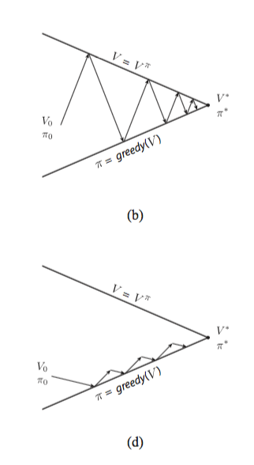
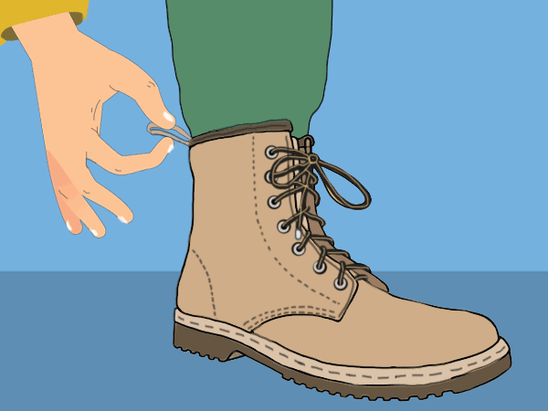
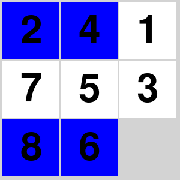

<!-- editorlm-hebrew-html-start -->
<style>
html, body, .vscode-body, .markdown-body, .markdown-preview, #write {
  direction: rtl !important; text-align: right !important;
}
ul, ol { padding-right: 2em !important; padding-left: 0 !important; }
blockquote { border-right: 3px solid #999; border-left: 0; padding-right: 1rem; padding-left: 0; }
@media print {
  html, body, .vscode-body, .markdown-body, .markdown-preview, #write {
    direction: rtl !important; text-align: right !important;
  }
}
</style>
<!-- editorlm-hebrew-html-end -->
<style>
.book { max-width: 900px; margin: auto; line-height: 1.8; font-family: Arial, sans-serif; }
.book .cover { min-height: 680px; box-sizing: border-box; padding: 64px 48px; margin: 24px 0 60px; background: #112b41; color: #f5f8fc; border-top: 9px solid #39c4b5; position: relative; }
.book .cover .eyebrow { color: #81e0d5; font-size: 15px; letter-spacing: 2px; }
.book .cover h1 { color: #fff; font-size: 48px; line-height: 1.3; border: 0; margin: 50px 0 18px; }
.book .cover .subtitle { font-size: 28px; color: #d8e6f0; }
.book .cover .author { font-size: 30px; color: #fff; margin-top: 52px; }
.book .cover .audience { color: #c1d3df; margin-top: 12px; }
.book .cover .motif { direction: ltr; text-align: left; font-family: Consolas, monospace; color: #81e0d5; font-size: 19px; margin-top: 54px; }
.book h1, .book h2, .book h3 { line-height: 1.4; font-weight: 700; }
.book > h1 { font-size: 32px !important; text-align: center !important; margin: 28px 0; }
.book h2 { font-size: 34px !important; text-align: center !important; color: #153b56 !important; background: #eef5fc; border: 0; border-bottom: 4px solid #299c91; border-radius: 10px 10px 0 0; padding: 28px 20px; margin: 24px 0 36px; }
.book h3 { font-size: 24px !important; text-align: right !important; color: #174e49 !important; background: #edf7f5; border: 0; border-right: 5px solid #299c91; border-radius: 6px; padding: 10px 16px; margin: 36px 0 18px; }
.book .chapter { height: 0; margin: 76px 0 0; border-top: 1px solid #ccd7df; break-before: page; page-break-before: always; break-after: avoid; page-break-after: avoid; }
.book .toc { padding: 24px; border-right: 5px solid #39a99d; background: rgba(70,150,155,.09); margin: 24px 0 48px; }
.book pre, .book pre code { direction: ltr !important; text-align: left !important; unicode-bidi: isolate; }
.book pre { box-sizing: border-box !important; width: 100% !important; max-width: 100% !important; margin: 0 !important; padding: 16px 20px; border: 1px solid #ccd7df; border-radius: 8px; line-height: 1.6; overflow-x: auto; }
.book code { direction: ltr; unicode-bidi: isolate; font-family: Consolas, "Courier New", monospace; }
.book pre { background: #f3f6fa !important; color: #1f2937 !important; }
.book pre code, .book pre code.hljs { background: transparent !important; color: #1f2937 !important; }
.book pre .hljs-keyword, .book pre .hljs-literal { color: #6f299c !important; }
.book pre .hljs-string { color: #216338 !important; }
.book pre .hljs-number { color: #075e68 !important; }
.book pre .hljs-comment { color: #526174 !important; }
.book pre .hljs-built_in, .book pre .hljs-title { color: #135b96 !important; }
.book table { width: 75%; max-width: 75%; margin: 18px auto; background: #f3f6fa; }
.book th, .book td { border: 1px solid #ccd7df; padding: 8px 12px; }
.book th, .book td { text-align: right; }
.book .small { font-size: .9em; opacity: .8; }
.book .python-intro { display: flex; align-items: center; gap: 28px; padding: 22px 28px; margin: 24px 0; background: #eef5fc; color: #183e63; border-right: 6px solid #3776ab; border-radius: 10px; }
.book .python-intro strong { font-size: 30px; }
.book .python-fact { background: #fff7d6; color: #423611; border-right: 6px solid #ffd343; border-radius: 8px; padding: 18px 24px; margin: 22px 0; }
.book .python-fact strong { font-size: 24px; }
.book img { max-width: 100%; height: auto; }
.book figure { box-sizing: border-box; width: 75%; max-width: 75%; margin: 24px auto; padding: 16px 20px; background: #f3f6fa; border: 1px solid #ccd7df; border-radius: 8px; text-align: center; }
.book figure img { display: block; margin: auto; }
.book figcaption { direction: rtl; text-align: center; font-size: .9em; color: #445566; }
@media print { .book > h2 { break-before: page; page-break-before: always; } }
.book .screen-strip { width: 760px; max-width: 100%; height: 220px; overflow: hidden; border: 1px solid #bccad5; border-radius: 8px; margin: 20px auto 8px; direction: ltr; }
.book .screen-strip.output { height: 265px; }
.book .screen-strip img { display: block; width: 1745px; max-width: none; }
.book .screen-menu { width: 400px; max-width: 100%; height: 295px; overflow: hidden; direction: ltr; margin: 20px auto 8px; border: 1px solid #bccad5; border-radius: 8px; }
.book .screen-menu img { display: block; width: 1745px; max-width: none; }
.book .code-panel { box-sizing: border-box !important; display: block !important; width: 75% !important; max-width: 75% !important; margin: 18px auto !important; }
@media print {
  .book .cover { min-height: 85vh; break-after: page; print-color-adjust: exact; -webkit-print-color-adjust: exact; }
  .book pre { white-space: pre-wrap; break-inside: avoid; }
  .book .chapter { margin: 0; border: 0; }
  .book h1, .book h2, .book h3 { break-after: avoid; page-break-after: avoid; break-inside: avoid; }
  .book h2 { margin-top: 0; }
  .book h2, .book h3 { print-color-adjust: exact; -webkit-print-color-adjust: exact; }
}
</style>

<style>
.book .book-nav { display: flex; flex-wrap: wrap; gap: 10px; justify-content: center; align-items: center; padding: 16px 0; margin: 20px 0 32px; border-top: 1px solid #ccd7df; border-bottom: 1px solid #ccd7df; }
.book .book-nav a { display: inline-block; padding: 10px 18px; border-radius: 8px; background: #eef5fc; color: #153b56 !important; border: 1px solid #b5ccd9; text-decoration: none !important; font-size: 16px; font-weight: bold; }
.book .book-nav a.toc-link { background: #174e49; color: #fff !important; border-color: #174e49; }
.book .book-nav a:hover, .book .book-nav a:focus { background: #d4eee8; color: #153b56 !important; outline: 2px solid #299c91; outline-offset: 2px; }
.book .section-list { line-height: 2; }
@media print { .book .book-nav { display: none; } }

/* Explicit Hebrew direction, including prose beginning with English. */
.book p, .book ul, .book ol, .book li,
.book blockquote, .book h1, .book h2, .book h3,
.book h4, .book th, .book td {
  direction: rtl !important;
  text-align: right !important;
  unicode-bidi: isolate;
}
/* Chapter titles keep their agreed centered layout. */
.book h2 { text-align: center !important; }
.book pre, .book pre code, .book .code-panel {
  direction: ltr !important;
  text-align: left !important;
  unicode-bidi: isolate;
}
</style>

<style>
.book .formula { box-sizing:border-box; width:75%; max-width:75%; direction:ltr!important; text-align:center!important; overflow-x:auto;
  padding:16px 20px; background:#f3f6fa; color:#1f2937; border:1px solid #ccd7df; border-radius:8px; margin:20px auto; font-size:1.15em; }
.book .grid-panel { box-sizing:border-box; width:75%; max-width:75%; margin:20px auto; padding:16px 20px; background:#f3f6fa; border:1px solid #ccd7df; border-radius:8px; }
.book .grid { direction:ltr!important; width:auto!important; max-width:100%!important; margin:0 auto; border-collapse:collapse; background:#fff; }
.book .grid td { direction:ltr!important; text-align:center!important; width:64px; height:48px; border:1px solid #8199aa; }
.book .grid .goal { background:#d3efdc; } .book .grid .bad { background:#f4d7d7; }
</style>

<div class="book" dir="rtl" lang="he">

<nav class="book-nav" aria-label="ניווט בספר">
<a href="04-Policy%20Iteration.md">→ הקודם</a>
<a class="toc-link" href="../index.md">תוכן העניינים</a>
<a href="06-%D7%9E%D7%95%D7%A0%D7%98%D7%94%20%D7%A7%D7%A8%D7%9C%D7%95.md">הבא ←</a>
</nav>

## ד.5 — תכנון דינמי: Value Iteration

**המצגת:** [תכנון דינמי — המשך](../../../sources/RL/3.תכנון%20דינמי-המשך.pptx) · **קוד:** [ממשק הפאזל](https://github.com/MarkmanGilad/book/blob/main/assets/rl/code/puzzle_env.py) · [Value Iteration בפאזל](https://github.com/MarkmanGilad/book/blob/main/assets/rl/code/puzzle_value_iteration.py)

הפרק הזה עונה על אותה שאלה כמו הפרק הקודם: כשחוקי המשחק ידועים לנו במלואם, איך מחשבים את המהלך הטוב ביותר בכל מצב? ההבדל הוא בדרך. ב־Policy Iteration עבדנו בשני שלבים נפרדים — הערכה מלאה של המדיניות הנוכחית, ורק אחר כך שיפור שלה — וחזרנו עליהם עד שהמדיניות התייצבה. הערכה מלאה בכל סבב היא עבודה רבה, וחלק גדול ממנה מתבזבז: אנחנו מחשבים במדויק את ערכיה של מדיניות שממילא עומדים להחליף.

כשטבלת הערכים משתנה, היא כבר רומזת לנו שייתכן שכדאי לבחור פעולות אחרות. האם חייבים להמתין עד שהערכת המדיניות תסתיים לפני שמשתמשים ברמז הזה? **Value Iteration** משתמש בכל עדכון בטבלה כדי לבחור מיד את ההמשך הכדאי ביותר. הוא נשען על [משוואת בלמן](04-Policy%20Iteration.md#bellman), אך משלב את בחירת הפעולה בחישוב הערך עצמו. התוצאה היא אלגוריתם קצר יותר, שאינו צריך לשמור טבלת מדיניות כלל, ומגיע לאותה טבלת ערכים.

בחלקו הראשון של הפרק נבנה את האלגוריתם על לוח 4×4 המוכר. בחלקו השני ניישם אותו על בעיה גדולה בהרבה — פאזל המספרים בלוח 3×3, שבו מספר המצבים הוא מאות אלפים — ונראה שאותו כלל עדכון עובד גם שם, כל עוד המודל ידוע.

### האם נחוצה טבלת מדיניות?

בפרק הקודם שמרנו שתי טבלאות: V לערכים ו־π לפעולות. לפני שנבנה את האלגוריתם החדש נשאל אם שתיהן באמת נחוצות. כאשר מודל המעברים ידוע, אפשר לבחור פעולה ישירות מתוך V. בודקים כל פעולה חוקית, מחשבים לאיזה מצב היא תוביל ומה התגמול שלה, ובוחרים לפי הציון המשולב של התגמול וההמשך. לכן אפשר לוותר על שמירת טבלת מדיניות נפרדת במהלך החישוב. אופן הבחירה מפורט ב־[Policy Improvement](04-Policy%20Iteration.md#policy-improvement).

יש להבחין בין **בחירת פעולה בעזרת V** לבין בחירת השכן בעל V הגבוה ביותר. ליד היעד, למשל, ערכו של מצב הסיום הוא 0, ובכל זאת כניסה אליו נותנת תגמול 1. אם נתעלם מהתגמול המיידי, נוכל לפספס דווקא את הפעולה שמסיימת בהצלחה.

<!-- editorlm-source-ref: [sources/RL/3.תכנון דינמי-המשך.pptx#L111-L119] -->

### Value Iteration — בוחרים ומעדכנים יחד

אם אפשר לבחור פעולה מתוך V בכל רגע, אפשר לשלב את הבחירה בתוך העדכון עצמו. במקום להעריך שוב ושוב מדיניות קבועה, בכל ביקור במצב נבחן את כל הפעולות החוקיות. הערך החדש יהיה הציון הגבוה ביותר שהתקבל — כאילו במצב הזה נבחרה תמיד הפעולה הטובה ביותר:

<a id="value-update"></a>
<div class="formula" dir="ltr">V(s) ← max<sub>a∈A(s)</sub> [r + γV(s′)]<br>(s′,r) = model(s,a)</div>

השוו זאת למשוואת בלמן מהפרק הקודם: שם הפעולה a הייתה נתונה מן המדיניות, וכאן במקומה מופיע `max` על כל הפעולות. זהו ההבדל היחיד, והוא זה שמייתר את טבלת המדיניות. כאן `max` מחזירה מספר שנשמר בטבלת הערכים. בזמן המשחק נשתמש ב־`argmax` כדי לקבל את הפעולה שמביאה למספר הזה. ההבדל בין שתי הפעולות חשוב: אחת מחשבת את הערך, והאחרת בוחרת מה לעשות.

<figure>

<figcaption>אותו ציור של שני הקווים מהפרק הקודם. למעלה (b): Policy Iteration מבצע הערכה מלאה ואחריה שיפור, ולכן מתקדם בצעדים גדולים. למטה (d): Value Iteration משלב בכל סריקה צעד הערכה אחד עם שיפור, ומתקדם בצעדים קטנים ורבים אל אותה נקודת מפגש.</figcaption>
</figure>

נראה איך זה נראה בפועל. בלוח 4×4 שלנו נתחיל מכל הערכים באפס ונשתמש ב־γ=0.9. לשני השכנים של היעד יש פעולה שנותנת מיד 1, ולכן הערך שלהם עולה ל־1. מצבים שיכולים להגיע אליהם יקבלו בהמשך 0.9, ואחריהם יתפשטו 0.81, 0.729 וכן הלאה. מעל תא ההפסד אין הכרח לבחור בירידה אליו: העדכון בוחן גם את שאר הפעולות.

אפשר לעקוב אחרי ההתפשטות באמצעות כמה תאים לאורך המסלול מהיעד (3,3) ולמעלה בעמודה הימנית ואז שמאלה בשורה העליונה, עד לפינה (0,0). בכל שורה בטבלה מוצג שלב שבו המידע על היעד מגיע למרחק נוסף ממנו; מניחים לצורך ההמחשה שכל סריקה קוראת את ערכי הסריקה הקודמת.

| שלב | V(2,3) | V(1,3) | V(0,3) | V(0,2) | V(0,1) | V(0,0) |
| --- | --- | --- | --- | --- | --- | --- |
| אתחול | 0 | 0 | 0 | 0 | 0 | 0 |
| 1 | 1 | 0 | 0 | 0 | 0 | 0 |
| 2 | 1 | 0.9 | 0 | 0 | 0 | 0 |
| 3 | 1 | 0.9 | 0.81 | 0 | 0 | 0 |
| 4 | 1 | 0.9 | 0.81 | 0.729 | 0 | 0 |
| 5 | 1 | 0.9 | 0.81 | 0.729 | 0.6561 | 0 |
| 6 | 1 | 0.9 | 0.81 | 0.729 | 0.6561 | 0.59049 |

בסיום מתקבלת הטבלה הבאה, בעיגול לשלוש ספרות. השורות נספרות מלמעלה והעמודות משמאל; תאי הסיום מסומנים בצבע ונשארים בערך 0, מפני שהתגמול ניתן בכניסה אליהם. זו בדיוק הטבלה שאליה הגיע Policy Iteration בפרק הקודם — אבל הפעם בלי טבלת מדיניות ובלי הפרדה בין הערכה לשיפור.

<div class="grid-panel">
<table class="grid" dir="ltr">
<tr><td>0.590</td><td>0.656</td><td>0.729</td><td>0.810</td></tr>
<tr><td>0.656</td><td>0.729</td><td class="bad">0</td><td>0.900</td></tr>
<tr><td>0.729</td><td>0.810</td><td>0.900</td><td>1.000</td></tr>
<tr><td>0.810</td><td>0.900</td><td>1.000</td><td class="goal">0</td></tr>
</table>
</div>

<!-- editorlm-source-ref: [sources/RL/3.תכנון דינמי-המשך.pptx#L121-L203] -->

אותו כלל עדכון פועל גם על [מבוך 5×5 שפתרנו בסוף הפרק הקודם](04-Policy%20Iteration.md). מתחילים מטבלת אפסים, סורקים את המצבים ובכל תא שומרים את הציון הגבוה ביותר מבין הפעולות החוקיות; המידע על היעד מתפשט לאורך המסדרון, מסביב לשורות הקירות, עד מצב ההתחלה. הטבלה המתקבלת זהה לזו ש־Policy Iteration הגיע אליה, ולכן גם המסלול שהסוכן יבחר לפיה זהה: 14 צעדים אל היעד.

<div class="grid-panel">
<table class="grid" dir="ltr" aria-label="ערכי המצבים במבוך חמש על חמש לפי Value Iteration">
<tr><td>0.254</td><td>0.282</td><td>0.314</td><td>0.349</td><td>0.314</td></tr>
<tr><td class="bad">0</td><td class="bad">0</td><td class="bad">0</td><td>0.387</td><td class="bad">0</td></tr>
<tr><td>0.590</td><td>0.531</td><td>0.478</td><td>0.430</td><td>0.387</td></tr>
<tr><td>0.656</td><td class="bad">0</td><td class="bad">0</td><td class="bad">0</td><td class="bad">0</td></tr>
<tr><td>0.729</td><td>0.810</td><td>0.900</td><td>1.000</td><td class="goal">0</td></tr>
</table>
</div>

<a id="bootstrapping"></a>
### Bootstrapping — לומדים מהערכות קיימות

כדאי לעצור רגע ולשים לב למה שעשינו, כי הרעיון יחזור בפרקים הבאים בלבוש אחר. הערך של מצב מתעדכן מתוך ערך משוער של מצב אחר. בתחילת החישוב גם ההערכה הזאת אינה מדויקת — הרי התחלנו מטבלה של אפסים — ובכל זאת היא מאפשרת להתקדם. שימוש באומדנים קיימים כדי לעדכן אומדנים נקרא **Bootstrapping** (מילולית: "להרים את עצמך בשרוכי הנעליים").

<figure>

<figcaption>מקור המונח: להרים את עצמך בעזרת שרוכי הנעליים. בלמידת חיזוק פירושו לשפר אומדן בעזרת אומדן אחר, עוד לפני שאחד מהם מדויק. (אנימציה; בגרסה המודפסת מוצג פריים אחד.)</figcaption>
</figure>

בדוגמת הלוח אין לנו מראש טבלה נכונה. התגמול הידוע ליד היעד מספק נקודת התחלה, והעדכונים החוזרים מפיצים את המידע. אין צורך לחכות שכל ערכי ההמשך יהיו סופיים לפני שמשתמשים בהם.

<!-- editorlm-source-ref: [sources/RL/3.תכנון דינמי-המשך.pptx#L199-L209] -->

### סדר הפעולות ותנאי העצירה

לפני שנכתוב קוד אמיתי, נסכם את האלגוריתם כולו בכמה שורות. החישוב חוזר על סריקות של טבלת הערכים עד שהשינוי קטן מספיק — אותו תנאי עצירה שהכרנו בהערכת המדיניות. הפסאודו־קוד מרכז את סדר העדכונים ואת תנאי העצירה:

<div class="code-panel" dir="ltr">

```text
Initialize V(s) = 0 for every state
Repeat:
    delta = 0
    For every nonterminal state s:
        old_value = V(s)
        V(s) = maximum of r + gamma * V(next_state)
               over all legal actions
        delta = max(delta, abs(old_value - V(s)))
Until delta < accuracy
```

</div>

`delta` מודד את השינוי המרבי במהלך סריקה מלאה. אין לעצור רק מפני שתא מסוים לא השתנה: ייתכן שמידע עוד לא הגיע אליו. הקוד בהמשך מעדכן את הטבלה במקום, ולכן משתמש גם בערכים שהתעדכנו מוקדם יותר באותה סריקה. מספר הסריקות עשוי להיות שונה מהדגמת ההתפשטות, אך כלל העדכון נשאר זהה.

<!-- editorlm-source-ref: [sources/RL/3.תכנון דינמי-המשך.pptx#L211-L219] -->

### ממשק פאזל המספרים הנתון

לוח 4×4 עם 16 מצבים נוח להמחשה, אבל לא משכנע: את הטבלה שלו אפשר למלא גם ביד. כדי לראות שהאלגוריתם באמת מועיל, ניישם אותו על בעיה שאי אפשר לפתור בעיון. כעת ניישם את האלגוריתם על פאזל של שמונה מספרים ומשבצת ריקה בלוח 3×3, שהזכרנו כדוגמה בפרק ד.3. המטרה היא להגיע לסדר 1 עד 8, כשהמשבצת הריקה נמצאת בפינה הימנית התחתונה. בניגוד לגריד 4×4, כאן **מצב הוא סידור הלוח כולו**, ולא מיקומו של הסוכן בתא. הפעולות הן ארבע הזזות אפשריות של המשבצת הריקה, והמודל ידוע: אנחנו יודעים בדיוק איזה סידור יתקבל מכל הזזה.

לצורך טבלת הערכים נייצג מצב באמצעות tuple של תשעה מספרים, לפי סדר השורות; 0 מציין את המשבצת הריקה. בקוד המקור משתמשים גם באובייקט `State`, וממירים את הלוח ל־tuple כמפתח. בעותק המצורף ממשק המשחק מקבל את ה־tuple ישירות כדי למקד את הקוד בחישוב הערכים.

<div class="code-panel" dir="ltr">

```python
start = (1, 2, 3,
         4, 5, 6,
         0, 7, 8)

goal = (1, 2, 3,
        4, 5, 6,
        7, 8, 0)
```

</div>

| רכיב בממשק | תפקיד באלגוריתם |
| --- | --- |
| `env.goal` | מצב היעד; בודקים אם `state == env.goal` |
| `env.get_actions(state)` | הפעולות החוקיות להזזת המשבצת הריקה |
| `env(state, action)` | מחזירה `(next_state, reward)` בלי לשנות את המצב שהתקבל |
| התגמול | 1 בכניסה ליעד, 0 בכל מעבר אחר |

הסוכן יכול לבקש את תוצאתה של כל פעולה בלי לבצע משחק אמיתי. זו בדיוק הסיבה שאפשר להשתמש כאן בתכנון המבוסס על מודל ידוע.

<!-- editorlm-source-ref: [sources/RL/3.תכנון דינמי-המשך.pptx#L221-L225] -->

### אתחול טבלת הערכים וקוד התכנון

טבלת הערכים צריכה שורה לכל מצב אפשרי. יש 9! = 362,880 סידורים של תשעת התאים — לעומת 16 בלוח הקטן. כמו בקוד הפתרון, ניצור מילון המכיל את כולם. חלק מהסידורים אינם ניתנים להגעה ממצב היעד; עצם הוספתם למילון אינה הופכת אותם לפתירים. בדוגמה נבחר מצב התחלתי פתיר.

<div class="code-panel" dir="ltr">

```python
from itertools import permutations
from puzzle_env import Puzzle

def init_values():
    return {state: 0.0 for state in permutations(range(9))}
```

</div>

`permutations` מייצרת את כל הסידורים, וכל סידור משמש מפתח במילון. כעת נפעיל סריקות על המילון, עם γ=0.95 ודיוק 0.001, לפי גרסת הפתרון. הפונקציה היא תרגום ישיר של הפסאודו־קוד שראינו למעלה:

<div class="code-panel" dir="ltr">

```python
def value_iteration(env, values, gamma=0.95, accuracy=0.001):
    sweeps = 0
    while True:
        delta = 0.0
        for state, old_value in values.items():
            if state == env.goal:
                continue
            best_value = float('-inf')
            for action in env.get_actions(state):
                next_state, reward = env(state, action)
                candidate = reward + gamma * values[next_state]
                best_value = max(best_value, candidate)
            values[state] = best_value
            delta = max(delta, abs(old_value - best_value))
        sweeps += 1
        if delta < accuracy:
            return sweeps
```

</div>

הלולאה הפנימית מחשבת את הערך הטוב ביותר למצב אחד. הלולאה שמעליה מבקרת בכל המצבים, והלולאה החיצונית חוזרת על הסריקות עד שהטבלה מתייצבת. `float('-inf')` מבטיח שהפעולה הראשונה שנבדוק תחליף את ערך האתחול. לא מוסיפים או מסירים מפתחות בזמן המעבר על המילון, אלא מעדכנים ערכים של מפתחות קיימים.

מצב היעד אינו מתעדכן: אין בו המשך אפיזודה. התגמול על ההגעה אליו כבר נכלל בעדכון של המצב הקודם. הסידורים שלא יכולים להגיע ליעד נשארים באפס באתחול ובתגמולים האלה.

### בחירת פעולה ופתרון פאזל

הטבלה מוכנה; עכשיו צריך להשתמש בה כדי לשחק. כאן נכנס ה־`argmax` שהזכרנו: לאחר חישוב הטבלה אין צורך לחזור על כל הסריקות בכל מהלך. בודקים רק את הפעולות האפשריות במצב הנוכחי, ובוחרים את זו שהתגמול המיידי שלה ועוד ערך ההמשך הם הגדולים ביותר:

<div class="code-panel" dir="ltr">

```python
def get_action(env, state, values, gamma=0.95):
    if state == env.goal:
        return None
    best_action = None
    best_value = float('-inf')
    for action in env.get_actions(state):
        next_state, reward = env(state, action)
        candidate = reward + gamma * values[next_state]
        if candidate > best_value:
            best_value = candidate
            best_action = action
    return best_action
```

</div>

כך מפעילים את התכנון ומשתמשים בתוצאה על מצב המרוחק שני צעדים מהיעד:

<div class="code-panel" dir="ltr">

```python
env = Puzzle()
values = init_values()
sweeps = value_iteration(env, values)
state = (1, 2, 3, 4, 5, 6, 0, 7, 8)
print(state)

while state != env.goal:
    action = get_action(env, state, values)
    state, reward = env(state, action)
    print(state)
```

</div>

**פלט**

<div class="code-panel" dir="ltr">

```text
(1, 2, 3, 4, 5, 6, 0, 7, 8)
(1, 2, 3, 4, 5, 6, 7, 0, 8)
(1, 2, 3, 4, 5, 6, 7, 8, 0)
```

</div>

כל שורה בפלט היא סידור הלוח, לפי סדר השורות, ו־0 מסמן את המשבצת הריקה. המשבצת הריקה זזה פעמיים ימינה, ובסוף הלוח מסודר. הערך של מצב ההתחלה הוא 0.95, משום שהתגמול 1 מתקבל בצעד השני: 0 + 0.95×1. הטבלה שחושבה יכולה לשמש גם מצבי התחלה אחרים; אין מחשבים אותה מחדש עבור כל פאזל.

ההרצה הזאת קצרה, שני מהלכים בלבד, ואפשר לבדוק אותה בעין. כדי לראות שהטבלה באמת פותרת פאזל, ניקח סידור רחוק יותר: הלוח שבתמונה מרוחק 14 מהלכים מהיעד, וזהו המרחק הקצר ביותר האפשרי ממנו. אותה לולאה, עם אותה `get_action` ואותה טבלה, מסדרת אותו ב־14 מהלכים בדיוק, בלי מהלך מיותר. ערך מצב ההתחלה הוא 0.95<sup>13</sup>≈0.513, כי התגמול 1 מגיע במהלך ה־14.

<figure>

<figcaption>מצב ההתחלה בחלון המשחק: 14 מהלכים מהיעד.</figcaption>
</figure>

<figure>

<figcaption>הסוכן פותר את הפאזל לפי טבלת הערכים, מהלך אחר מהלך, עד הסידור המלא. (אנימציה; בגרסה המודפסת מוצג פריים אחד.)</figcaption>
</figure>

התמונות צולמו מחלון המשחק של פרויקט הפאזל; טבלת הערכים שהניעה את הפתרון חושבה בקוד הפרק. במאגר עצמו `Game.py` מערבב את הלוח באקראי, פותר אותו לעיני המשתמש ומערבב שוב.

שמרו את שני קובצי הקוד המקושרים בראש הפרק באותה תיקייה והפעילו את `puzzle_value_iteration.py`. ההרצה המלאה סורקת מאות אלפי מצבים. בקובץ המצורף נוספה גם בדיקת חזרה למצב שכבר בוקר, כדי שפתרון מתוך טבלה לא מתאימה לא יסתובב בלולאה ללא סוף.

בסיס הדוגמה הוא [AI_Agent.py בענף הפתרון של הפאזל](https://github.com/MarkmanGilad/PuzzleNumber-AI/blob/a79bbb81aeb547f10fd7b1c4a967b0d5b80bec08/AI_Agent.py). הושמטו התצוגה, ההשהיה והדפסות האבחון בכל עדכון. מבנה האתחול, סריקות הערכים ובחירת הפעולה נשמרו.

### מה קורה כשהמודל אינו ידוע?

שני פרקי התכנון הדינמי נשענו על הנחה חזקה. החישוב השתמש ביכולת לשאול את הסביבה מה תהיה תוצאתה של כל פעולה — `env(state, action)` — בלי לשחק בפועל. בפאזל זה טבעי, אבל בעולם האמיתי ההנחה הזאת נשברת מהר. מול יריב, למשל, לא תמיד ידוע מראש באיזו פעולה הוא יבחר, ולכן לא ידוע בדיוק באיזה מצב נקבל שוב את התור. רובוט שלומד ללכת אינו יודע מראש איך הרצפה תגיב. מכאן נעבור ללמידה מתוך התנסות בפועל.

אקראיות כשלעצמה אינה מונעת תכנון דינמי: אם הסתברויות המעברים ידועות, אפשר לחשב תוחלת במקום תוצאה יחידה. הקושי בפרקים הבאים הוא שהמודל אינו נתון לסוכן, והוא צריך ללמוד מדגימות.

<!-- editorlm-source-ref: [sources/RL/3.תכנון דינמי-המשך.pptx#L227-L231] -->

<nav class="book-nav" aria-label="ניווט בספר">
<a href="04-Policy%20Iteration.md">→ הקודם</a>
<a class="toc-link" href="../index.md">תוכן העניינים</a>
<a href="06-%D7%9E%D7%95%D7%A0%D7%98%D7%94%20%D7%A7%D7%A8%D7%9C%D7%95.md">הבא ←</a>
</nav>

</div>

<!-- editorlm-source-versions: {"schemaVersion": 1, "sources": {"sources/RL/3.תכנון דינמי-המשך.pptx": {"sourceSha256": "150bbb3f5ac1849fbbb832aa0d98f04752cd737e16307ad421d219a90a653269", "canonicalTextSha256": "9c6cfec01a1a579ccbd0f7906ac31f2f22e1cd88d7917cdb26c7a053a07a124b"}}} -->
