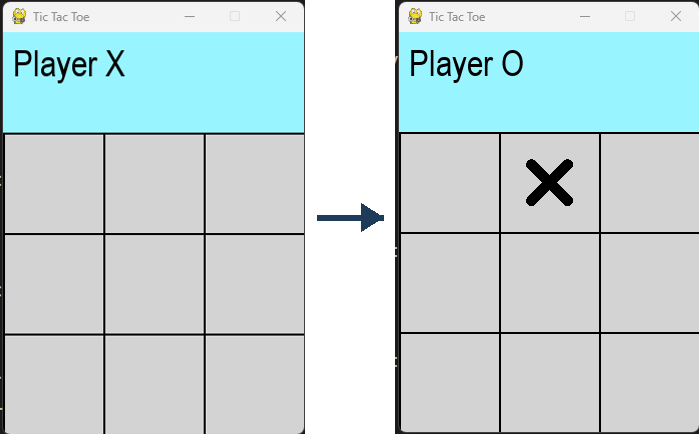
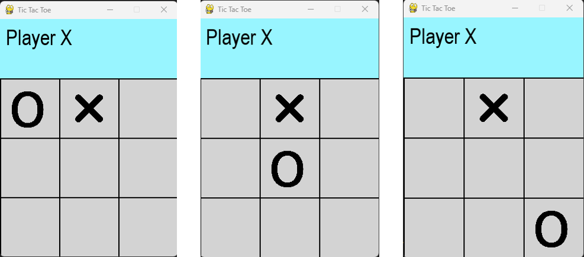
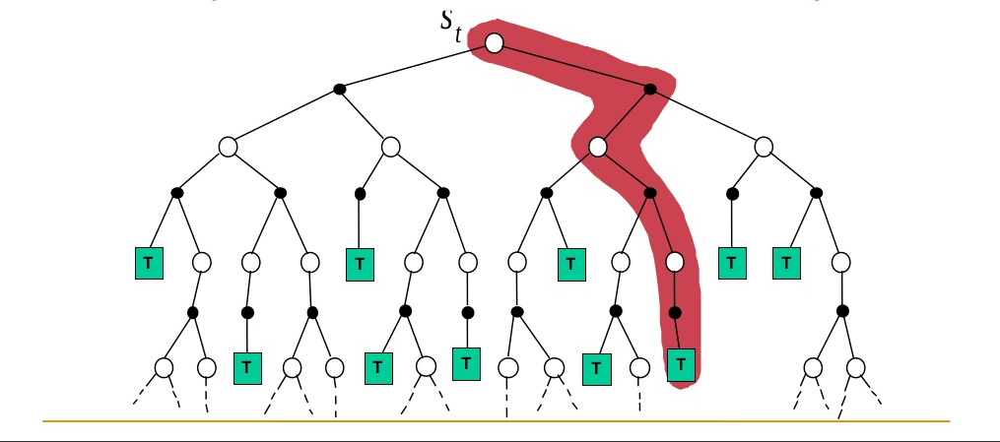
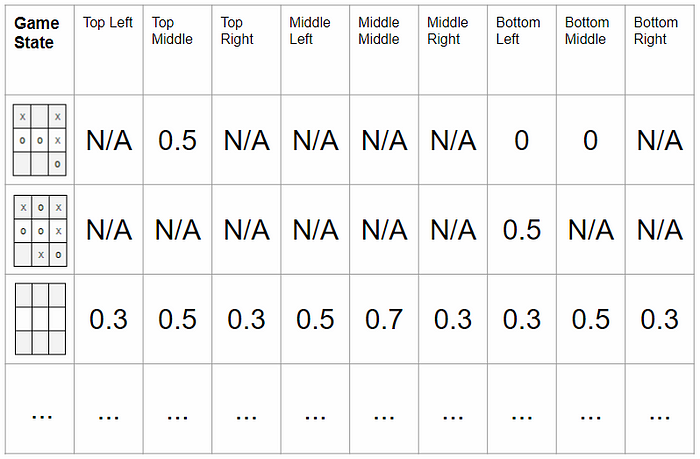

<!-- editorlm-hebrew-html-start -->
<style>
html, body, .vscode-body, .markdown-body, .markdown-preview, #write {
  direction: rtl !important; text-align: right !important;
}
ul, ol { padding-right: 2em !important; padding-left: 0 !important; }
blockquote { border-right: 3px solid #999; border-left: 0; padding-right: 1rem; padding-left: 0; }
@media print {
  html, body, .vscode-body, .markdown-body, .markdown-preview, #write {
    direction: rtl !important; text-align: right !important;
  }
}
</style>
<!-- editorlm-hebrew-html-end -->
<style>
.book { max-width: 900px; margin: auto; line-height: 1.8; font-family: Arial, sans-serif; }
.book .cover { min-height: 680px; box-sizing: border-box; padding: 64px 48px; margin: 24px 0 60px; background: #112b41; color: #f5f8fc; border-top: 9px solid #39c4b5; position: relative; }
.book .cover .eyebrow { color: #81e0d5; font-size: 15px; letter-spacing: 2px; }
.book .cover h1 { color: #fff; font-size: 48px; line-height: 1.3; border: 0; margin: 50px 0 18px; }
.book .cover .subtitle { font-size: 28px; color: #d8e6f0; }
.book .cover .author { font-size: 30px; color: #fff; margin-top: 52px; }
.book .cover .audience { color: #c1d3df; margin-top: 12px; }
.book .cover .motif { direction: ltr; text-align: left; font-family: Consolas, monospace; color: #81e0d5; font-size: 19px; margin-top: 54px; }
.book h1, .book h2, .book h3 { line-height: 1.4; font-weight: 700; }
.book > h1 { font-size: 32px !important; text-align: center !important; margin: 28px 0; }
.book h2 { font-size: 34px !important; text-align: center !important; color: #153b56 !important; background: #eef5fc; border: 0; border-bottom: 4px solid #299c91; border-radius: 10px 10px 0 0; padding: 28px 20px; margin: 24px 0 36px; }
.book h3 { font-size: 24px !important; text-align: right !important; color: #174e49 !important; background: #edf7f5; border: 0; border-right: 5px solid #299c91; border-radius: 6px; padding: 10px 16px; margin: 36px 0 18px; }
.book .chapter { height: 0; margin: 76px 0 0; border-top: 1px solid #ccd7df; break-before: page; page-break-before: always; break-after: avoid; page-break-after: avoid; }
.book .toc { padding: 24px; border-right: 5px solid #39a99d; background: rgba(70,150,155,.09); margin: 24px 0 48px; }
.book pre, .book pre code { direction: ltr !important; text-align: left !important; unicode-bidi: isolate; }
.book pre { box-sizing: border-box !important; width: 100% !important; max-width: 100% !important; margin: 0 !important; padding: 16px 20px; border: 1px solid #ccd7df; border-radius: 8px; line-height: 1.6; overflow-x: auto; }
.book code { direction: ltr; unicode-bidi: isolate; font-family: Consolas, "Courier New", monospace; }
.book pre { background: #f3f6fa !important; color: #1f2937 !important; }
.book pre code, .book pre code.hljs { background: transparent !important; color: #1f2937 !important; }
.book pre .hljs-keyword, .book pre .hljs-literal { color: #6f299c !important; }
.book pre .hljs-string { color: #216338 !important; }
.book pre .hljs-number { color: #075e68 !important; }
.book pre .hljs-comment { color: #526174 !important; }
.book pre .hljs-built_in, .book pre .hljs-title { color: #135b96 !important; }
.book table { width: 75%; max-width: 75%; margin: 18px auto; background: #f3f6fa; }
.book th, .book td { border: 1px solid #ccd7df; padding: 8px 12px; }
.book th, .book td { text-align: right; }
.book .small { font-size: .9em; opacity: .8; }
.book .python-intro { display: flex; align-items: center; gap: 28px; padding: 22px 28px; margin: 24px 0; background: #eef5fc; color: #183e63; border-right: 6px solid #3776ab; border-radius: 10px; }
.book .python-intro strong { font-size: 30px; }
.book .python-fact { background: #fff7d6; color: #423611; border-right: 6px solid #ffd343; border-radius: 8px; padding: 18px 24px; margin: 22px 0; }
.book .python-fact strong { font-size: 24px; }
.book img { max-width: 100%; height: auto; }
.book figure { box-sizing: border-box; width: 75%; max-width: 75%; margin: 24px auto; padding: 16px 20px; background: #f3f6fa; border: 1px solid #ccd7df; border-radius: 8px; text-align: center; }
.book figure img { display: block; margin: auto; }
.book figcaption { direction: rtl; text-align: center; font-size: .9em; color: #445566; }
@media print { .book > h2 { break-before: page; page-break-before: always; } }
.book .screen-strip { width: 760px; max-width: 100%; height: 220px; overflow: hidden; border: 1px solid #bccad5; border-radius: 8px; margin: 20px auto 8px; direction: ltr; }
.book .screen-strip.output { height: 265px; }
.book .screen-strip img { display: block; width: 1745px; max-width: none; }
.book .screen-menu { width: 400px; max-width: 100%; height: 295px; overflow: hidden; direction: ltr; margin: 20px auto 8px; border: 1px solid #bccad5; border-radius: 8px; }
.book .screen-menu img { display: block; width: 1745px; max-width: none; }
.book .code-panel { box-sizing: border-box !important; display: block !important; width: 75% !important; max-width: 75% !important; margin: 18px auto !important; }
@media print {
  .book .cover { min-height: 85vh; break-after: page; print-color-adjust: exact; -webkit-print-color-adjust: exact; }
  .book pre { white-space: pre-wrap; break-inside: avoid; }
  .book .chapter { margin: 0; border: 0; }
  .book h1, .book h2, .book h3 { break-after: avoid; page-break-after: avoid; break-inside: avoid; }
  .book h2 { margin-top: 0; }
  .book h2, .book h3 { print-color-adjust: exact; -webkit-print-color-adjust: exact; }
}
</style>

<style>
.book .book-nav { display: flex; flex-wrap: wrap; gap: 10px; justify-content: center; align-items: center; padding: 16px 0; margin: 20px 0 32px; border-top: 1px solid #ccd7df; border-bottom: 1px solid #ccd7df; }
.book .book-nav a { display: inline-block; padding: 10px 18px; border-radius: 8px; background: #eef5fc; color: #153b56 !important; border: 1px solid #b5ccd9; text-decoration: none !important; font-size: 16px; font-weight: bold; }
.book .book-nav a.toc-link { background: #174e49; color: #fff !important; border-color: #174e49; }
.book .book-nav a:hover, .book .book-nav a:focus { background: #d4eee8; color: #153b56 !important; outline: 2px solid #299c91; outline-offset: 2px; }
.book .section-list { line-height: 2; }
@media print { .book .book-nav { display: none; } }

/* Explicit Hebrew direction, including prose beginning with English. */
.book p, .book ul, .book ol, .book li,
.book blockquote, .book h1, .book h2, .book h3,
.book h4, .book th, .book td {
  direction: rtl !important;
  text-align: right !important;
  unicode-bidi: isolate;
}
/* Chapter titles keep their agreed centered layout. */
.book h2 { text-align: center !important; }
.book pre, .book pre code, .book .code-panel {
  direction: ltr !important;
  text-align: left !important;
  unicode-bidi: isolate;
}
</style>

<style>
.book .formula { box-sizing:border-box; width:75%; max-width:75%; direction:ltr!important; text-align:center!important; overflow-x:auto;
  padding:16px 20px; background:#f3f6fa; color:#1f2937; border:1px solid #ccd7df; border-radius:8px; margin:20px auto; font-size:1.15em; }
.book .grid-panel { box-sizing:border-box; width:75%; max-width:75%; margin:20px auto; padding:16px 20px; background:#f3f6fa; border:1px solid #ccd7df; border-radius:8px; }
.book .grid { direction:ltr!important; width:auto!important; max-width:100%!important; margin:0 auto; border-collapse:collapse; background:#fff; }
.book .grid td { direction:ltr!important; text-align:center!important; width:64px; height:48px; border:1px solid #8199aa; }
.book .grid .goal { background:#d3efdc; } .book .grid .bad { background:#f4d7d7; }
</style>

<div class="book" dir="rtl" lang="he">

<nav class="book-nav" aria-label="ניווט בספר">
<a href="05-Value%20Iteration.md">→ הקודם</a>
<a class="toc-link" href="../index.md">תוכן העניינים</a>
<a href="07-%D7%9E%D7%95%D7%A0%D7%98%D7%94%20%D7%A7%D7%A8%D7%9C%D7%95%20%D7%91%D7%90%D7%99%D7%A7%D7%A1%20%D7%A2%D7%99%D7%92%D7%95%D7%9C.md">הבא ←</a>
</nav>

## ד.6 — מונטה קרלו — למידה מהתנסות

**המצגת:** [מונטה קרלו](../../../sources/RL/4.%20מונטה%20קרלו.pptx)

בשני הפרקים הקודמים ענינו על השאלה "מה המהלך הטוב ביותר?" בהנחה שאנחנו יודעים את חוקי המשחק במלואם: לכל מצב ופעולה יכולנו לשאול את המודל מה יקרה. הפרק הזה שואל שאלה חדשה: מה עושים כשאין לנו מודל כזה, וכל מה שאנחנו יכולים לעשות הוא לשחק ולראות מה קורה? זהו המצב הנפוץ בעולם האמיתי — מול יריב, בשוק, בשליטה ברובוט — ולכן זהו הרגע שבו הסוכן מתחיל באמת **ללמוד** ולא רק לחשב.

נניח שאנחנו משחקים X באיקס עיגול ומניחים סימן במשבצת העליונה האמצעית. אנחנו יודעים איך הלוח נראה מיד אחרי הפעולה שלנו, אבל לא יודעים איפה היריב יניח O. באחד המשחקים הוא יבחר במרכז, ובמשחק אחר בפינה. לכן איננו יודעים מראש איזה מצב נקבל כשיגיע שוב תורנו.

<figure>

<figcaption>הלוח הריק (משמאל) והלוח מיד אחרי הפעולה של X (מימין). זה עדיין אינו המצב הבא של X: היריב טרם שיחק.</figcaption>
</figure>

<figure>

<figcaption>שלושה המשכים אפשריים לאותה פעולה: היריב יכול להניח O בפינה, במרכז או בפינה הנגדית. רק אחרי תגובתו X מקבל שוב את התור, ובכל פעם במצב אחר.</figcaption>
</figure>

עד כה חישבנו ערכים באמצעות מודל שנתן לנו את תוצאתה של כל פעולה. כעת נלמד **מהתנסות**: נשחק משחקים, נשמור את מה שקרה בהם ונשתמש בתוצאות כדי לשפר את ההערכות שלנו. זו הגישה של **Monte Carlo — מונטה קרלו**. השם לקוח מעיר הקזינו המפורסמת: במקום לחשב הסתברויות מדויקות, "מטילים קובייה" פעמים רבות ולומדים מהממוצע של התוצאות.

<figure>

<figcaption>גלגל רולטה. השיטה קרויה על שם מונטה קרלו, עיר הקזינו שבה מהמרים על תוצאות אקראיות.</figcaption>
</figure>

הרעיון הכללי פשוט: משחקים משחק שלם, מסתכלים אחורה על כל המהלכים שבו, ומעדכנים את ההערכה של כל מהלך לפי התוצאה הסופית. ככל שמשחקים יותר, ההערכות מתקרבות לערך האמיתי. במהלך הפרק נצטרך לפתור שלוש בעיות שהתכנון הדינמי לא הכיר: איך ממצעים תוצאות שונות של אותו מהלך, איך בוחרים פעולה כשאי אפשר לחשב את המצב הבא, ואיך מאזנים בין ניסוי של מהלכים חדשים לבין שימוש במה שכבר למדנו.

### דוגמים אפיזודה מלאה

יחידת הלמידה הבסיסית במונטה קרלו היא משחק שלם. נשחק עד שהמשחק מסתיים ונרשום את המצבים, הפעולות והתגמולים. רצף אחד מההתחלה עד הסיום נקרא, כזכור, **אפיזודה**. אנחנו דוגמים מסלול שהתרחש בפועל; אין צורך לסרוק את כל הענפים האפשריים של המשחק. זהו ההבדל הראשון מהתכנון הדינמי: שם סרקנו את כל המצבים בטבלה; כאן אנחנו רואים רק את המצבים שהמשחק עבר בהם בפועל.

<figure>

<figcaption>עץ המשחק: עיגול לבן הוא מצב, נקודה שחורה היא פעולה, וריבוע T הוא מצב סופי. הקו האדום מסמן אפיזודה אחת שנדגמה: מסלול אחד מתוך כל הענפים האפשריים, מהמצב S<sub>t</sub> ועד הסיום.</figcaption>
</figure>

מה עושים עם הרשימה הזאת? באיקס־עיגול התגמול מגיע רק בסוף — ניצחון, הפסד או תיקו — וכל המהלכים שלפניו קיבלו 0. כדי לייחס את התוצאה גם למהלכים המוקדמים, נחשב לכל צעד את התשואה שלו, כלומר מה יצא ממנו בסופו של דבר. כזכור מפרק המודל, התגמול שהתקבל בעקבות הפעולה A<sub>t</sub> מסומן R<sub>t+1</sub>. לאחר סיום האפיזודה נוכל לחשב את התשואה מכל נקודה ברצף באמצעות [סכום התגמולים המהוון](03-מודל%20סביבה%20סוכן%20ו-MDP.md#discount) שהוגדר בפרק המודל.

<a id="return"></a>

למשל, עבור שלושה צעדים עם תגמולים 0, 0, 1 ו־γ=0.9, התשואות הן 0.81, 0.9 ו־1: הצעד האחרון הביא מיד ל־1, הצעד שלפניו שווה 0.9×1, והראשון 0.9×0.9. זה חישוב מתוך משחק אחד שהסתיים בניצחון. הוא אינו מוכיח שכל משחק שמתחיל באותו מצב יסתיים כך — ייתכן שהניצחון נבע ממהלך גרוע של היריב.

כדי לחשב את כל התשואות ביעילות, אפשר לעבור על האפיזודה מהסוף להתחלה. מתחילים ב־G=0, ובכל צעד מחשבים `G = reward + gamma * G`. כך כל תגמול עתידי מקבל את ההיוון המתאים בלי לסכום את שאר האפיזודה מחדש.

<!-- editorlm-source-ref: [sources/RL/4. מונטה קרלו.pptx#L5-L25] -->

### אותה פעולה, תוצאות שונות

משחק יחיד נותן לנו דגימה אחת. הבעיה היא שדגימה אחת עלולה להטעות. במשחק מול יריב, אותו מצב ואותה פעולה שלנו יכולים להוביל להמשכים שונים. כך גם בקבלת קלף או בהטלת קובייה. מכאן עולות שלוש שאלות: כיצד נחבר תוצאות שונות להערכה אחת, כיצד נבחר פעולה בלי לדעת את המצב הבא, וכיצד נחליט אילו פעולות לנסות בזמן האימון.

נתחיל בשאלה הראשונה, והתשובה פשוטה: ממוצע. נניח שביצענו את אותה פעולה מאותו מצב 100 פעמים. ב־80 מהן ההמשך הוביל לתשואה ‎−0.4, וב־20 לתשואה 0.7. הערך שנרשום לזוג הזה הוא ממוצע כל התוצאות:

<div class="formula" dir="ltr">[80 × (−0.4) + 20 × 0.7] / 100 = −0.18</div>

בפרק המודל אמרנו שכאשר יש אקראיות, ערך של מצב הוא הממוצע של התשואות על ההמשכים האפשריים. למספר הזה קוראים **תוחלת — Expected Value**: הערך שנקבל "בממוצע" אם נחזור על אותה פעולה פעמים רבות מאוד. הנקודה החשובה היא שאיננו צריכים לדעת מראש באיזו הסתברות היריב בוחר כל תגובה; הידע הזה הוא חלק מהמודל שאין לנו. די לנו לשחק, לרשום תוצאות ולמצע. מדגם אחר של 100 משחקים עשוי לתת יחס מעט שונה, למשל 78 ו־22; זו הסיבה שאין להסתמך על משחק יחיד. ככל שנשחק יותר, הממוצע יתקרב לתוחלת האמיתית.

<!-- editorlm-source-ref: [sources/RL/4. מונטה קרלו.pptx#L27-L51] -->

### ממוצע שמתעדכן אחרי כל דגימה

אם נשחק מאות אלפי משחקים, לא נרצה לשמור את כל התשואות של כל מצב כדי לחשב ממוצע בסוף. נעדיף לעדכן את הממוצע בכל פעם שמגיעה דגימה חדשה. אין צורך לשמור את כל התשואות כדי לחשב ממוצע. נשמור את הממוצע הקודם ואת מספר הדגימות. אם G הוא התוצאה החדשה ו־n הוא מספר הדגימות כולל הדגימה החדשה, נעדכן:

<div class="formula" dir="ltr">V(s) ← V(s) + [G − V(s)] / n</div>

אם הממוצע של שלוש דגימות הוא 0.2, והדגימה הרביעית נותנת 1, נקבל 0.2+(1−0.2)/4=0.4. הנוסחה מזיזה את הממוצע לכיוון התוצאה החדשה במידה התלויה במספר הדגימות שכבר נאספו.

אפשר להחליף את ‎1/n במקדם קבוע, **מקדם הלמידה — α (אלפא)**, ולא להחזיק מונה לכל מצב. זהו אותו רעיון של קצב הלמידה שהכרנו ב־Gradient Descent בחלק ג — מספר קטן שקובע את גודל הצעד לכיוון המידע החדש:

<a id="incremental-update"></a>
<div class="formula" dir="ltr">V(s) ← V(s) + α[G − V(s)]</div>

ההפרש בסוגריים הוא הפער בין התוצאה שדגמנו לבין האומדן הנוכחי. אם התוצאה גדולה יותר, נעלה את הערך; אם היא קטנה יותר, נוריד אותו. מקדם הלמידה קובע כמה נזוז בכל עדכון.

כאשר α קבוע, זהו ממוצע משוקלל שנותן משקל רב יותר לדגימות האחרונות, ולא הממוצע החשבוני המדויק של כל הדגימות. זה דווקא יתרון כשהמדיניות שלנו משתנה במהלך האימון: משחקים ישנים, ששוחקו כשעדיין שיחקנו גרוע, מאבדים בהדרגה את השפעתם. זה העדכון שבו נשתמש בקוד. במונטה קרלו נבצע אותו רק לאחר שהאפיזודה הסתיימה ו־G ידוע.

<!-- editorlm-source-ref: [sources/RL/4. מונטה קרלו.pptx#L43-L59] -->

### Q-Table — בוחרים פעולה גם בלי מודל

פתרנו את השאלה הראשונה — איך ממצעים. עכשיו לשאלה השנייה: איך בוחרים פעולה. נניח שכבר הערכנו את V של מצבים רבים. עדיין חסר מידע לבחירת הפעולה: אם איננו יודעים לאיזה מצב תוביל הפעולה לאחר תגובת היריב, לא נוכל לבחור לפי ערך המצב הבא כפי שעשינו בתכנון הדינמי.

לכן נשמור את התשואה המשוערת עבור **זוג של מצב ופעולה**, בטבלה שנקראת **Q-Table**. לכל פעולה חוקית במצב הנוכחי נוכל לקרוא ערך ישירות מהטבלה, בלי לשאול "לאן הפעולה תוביל". בקוד תהיה זו פשוט מילון שהמפתח שלו הוא הזוג (מצב, פעולה). ההגדרה של ערך מצב–פעולה נמצאת ב־[פרק המודל](03-מודל%20סביבה%20סוכן%20ו-MDP.md#action-value); כעת אנחנו לומדים אותו מתוך דגימות.

<a id="mc-update"></a>
<div class="formula" dir="ltr">Q(S<sub>t</sub>,A<sub>t</sub>) ← Q(S<sub>t</sub>,A<sub>t</sub>) + α[G<sub>t</sub> − Q(S<sub>t</sub>,A<sub>t</sub>)]</div>

זהו אותו עדכון ממוצע מהסעיף הקודם, רק שהפעם מעדכנים תא של זוג מצב–פעולה במקום תא של מצב. אחרי העדכונים נוכל לבחור כך:

<div class="formula" dir="ltr">π(s) = argmax<sub>a∈A(s)</sub> Q(s,a)</div>

אין להוסיף כאן שוב את התגמול המיידי: הוא כבר נכלל בתשואה שעל פיה Q נלמד. הבחירה מוגבלת לפעולות חוקיות; תא שכבר תפוס באיקס עיגול אינו מועמד.

לדוגמה, נניח שבמצב של לוח ריק הטבלה מכילה את הערכים הבאים. אלה ערכי המחשה, ולא תוצאה של האימון שלנו:

<div class="grid-panel">
<table class="grid" dir="ltr">
<tr><td>0.3</td><td>0.5</td><td>0.3</td></tr>
<tr><td>0.5</td><td>0.7</td><td>0.3</td></tr>
<tr><td>0.3</td><td>0.5</td><td>0.3</td></tr>
</table>
</div>

כל משבצת מציגה את Q של פעולה בלוח הריק. בחירה חמדנית תבחר במרכז, שערכו 0.7. אין צורך לנבא במפורש היכן היריב יגיב כדי לבחור לפי הטבלה.

<figure>

<figcaption>טבלת Q של כמה מצבים: שורה לכל מצב, עמודה לכל אחת מתשע המשבצות. N/A מסמן משבצת תפוסה, שאינה פעולה חוקית באותו מצב. השורה של הלוח הריק היא הטבלה שלמעלה, ובמצבים אחרים נותרות רק הפעולות הפנויות.</figcaption>
</figure>

<!-- editorlm-source-ref: [sources/RL/4. מונטה קרלו.pptx#L61-L73] -->

### חקירה וניצול

נותרה השאלה השלישית: אילו פעולות לנסות בזמן האימון. כדי למלא את הטבלה צריך לשחק, ובהתחלה הטבלה ריקה — כל הערכים 0 ואין ממה לבחור. בחירה אקראית מאפשרת לנסות פעולות רבות, אבל אינה משתמשת במה שכבר למדנו. לעומת זאת, אם תמיד נבחר רק את הפעולה שנראית כרגע הטובה ביותר, אולי לעולם לא נגלה פעולה טובה יותר שלא ניסינו מספיק.

זה המתח בין **Exploration — חקירה**, לבין **Exploitation — ניצול הידע הקיים**. הוא מוכר גם מחוץ למשחקים: מי שתמיד מזמין במסעדה את המנה שהוא כבר אוהב לא יגלה לעולם מנה טובה יותר, ומי שתמיד מנסה משהו חדש לא נהנה ממה שכבר יודע שטוב. פתרון פשוט הוא **ε-greedy** (אפסילון־חמדני): בהסתברות ε (אפסילון, מספר קטן בין 0 ל־1) בוחרים פעולה חוקית אקראית, וביתר המקרים בוחרים פעולה בעלת Q מרבי.

<div class="code-panel" dir="ltr">

```python
import random

def choose_action(state, actions, Q, epsilon):
    if random.random() < epsilon:
        return random.choice(actions)
    return max(actions, key=lambda a: Q.get((state, a), 0.0))
```

</div>

`random.random()` מגרילה מספר בין 0 ל־1, ולכן התנאי מתקיים בהסתברות ε. `Q.get` מחזירה 0 אם עדיין אין בטבלה ערך לזוג הזה, וכך אין צורך למלא את הטבלה מראש. אם ε=0.1, ב־10% מהבחירות בממוצע תתבצע הגרלה. גם בהגרלה אפשר לבחור במקרה את הפעולה בעלת הערך המרבי.

<!-- editorlm-source-ref: [sources/RL/4. מונטה קרלו.pptx#L75-L85] -->

<a id="epsilon-decay"></a>
### מקטינים את החקירה במהלך האימון

ערך קבוע של ε אינו אידיאלי. בהתחלה הטבלה כמעט ריקה, ולכן נרצה לחקור הרבה. בהמשך, כשהטבלה כבר משקפת ניסיון רב, נוכל להסתמך עליה יותר. נשתמש בדעיכה מעריכית של ε לפי מספר האפיזודה — ε מתחיל גבוה ויורד בהדרגה לערך קטן:

<div class="code-panel" dir="ltr">

```python
import math

def epsilon_at(epoch, start=1.0, final=0.01, decay=100000):
    return final + (start - final) * math.exp(-epoch / decay)
```

</div>

הפרמטר `epoch` הוא כאן מספר האפיזודה (המשחק) הנוכחית. באפיזודה 0 נקבל ε=1, כלומר משחק אקראי לחלוטין. אחרי 100,000 אפיזודות נקבל בערך 0.374, ואחרי 200,000 בערך 0.144. `decay` קובע את קצב הירידה; הוא אינו מספר האפיזודה שבה נגיע בדיוק ל־`final`. הערך מתקרב בהדרגה ל־0.01.

<!-- editorlm-source-ref: [sources/RL/4. מונטה קרלו.pptx#L87-L91] -->

### האלגוריתם המלא

יש לנו עכשיו את כל החלקים: חישוב תשואה מהסוף להתחלה, עדכון ממוצע עם α, טבלת Q ובחירה ב־ε-greedy. נחבר את בחירת הפעולות, איסוף האפיזודה ועדכון הערכים לתהליך אימון אחד, לפי סדר ביצועם:

<div class="code-panel" dir="ltr">

```text
Initialize Q and choose alpha, gamma
For each episode:
    Compute epsilon for this episode
    Play until termination using epsilon-greedy
    Store each (state, action, reward)
    G = 0
    For each stored step, from last to first:
        G = reward + gamma * G
        Q(state, action) += alpha * (G - Q(state, action))
```

</div>

בזמן איסוף האפיזודה בוחרים פעולות באמצעות הטבלה הנוכחית. בסיומה מעדכנים את הערכים של הזוגות שביקרנו בהם. במשחק הבא כבר נשתמש בטבלה המעודכנת, ולכן המדיניות משתפרת מאפיזודה לאפיזודה — כמו ב־Policy Iteration, רק שכאן "ההערכה" היא משחק אחד ו"השיפור" הוא הבחירה החמדנית מהטבלה. שימו לב שהעדכון מתבצע רק אחרי סיום המשחק: זהו המאפיין של מונטה קרלו, ובפרקים הבאים נראה שיטה שמעדכנת כבר במהלך המשחק. לא מוצגת כאן בדיקה שמדלגת על ביקורים חוזרים; מעדכנים כל צעד שנשמר.

באיקס עיגול יש לכל היותר 3⁹ סידורי לוח, ורק חלקם חוקיים. זה מרחב קטן מספיק כדי להדגים למידה באמצעות מילון. בפרק הבא נממש את Q ואת האימון של X מול יריב אקראי, כאשר ממשק המשחק כבר נתון.

<!-- editorlm-source-ref: [sources/RL/4. מונטה קרלו.pptx#L93-L111] -->

<nav class="book-nav" aria-label="ניווט בספר">
<a href="05-Value%20Iteration.md">→ הקודם</a>
<a class="toc-link" href="../index.md">תוכן העניינים</a>
<a href="07-%D7%9E%D7%95%D7%A0%D7%98%D7%94%20%D7%A7%D7%A8%D7%9C%D7%95%20%D7%91%D7%90%D7%99%D7%A7%D7%A1%20%D7%A2%D7%99%D7%92%D7%95%D7%9C.md">הבא ←</a>
</nav>

</div>

<!-- editorlm-source-versions: {"schemaVersion": 1, "sources": {"sources/RL/4. מונטה קרלו.pptx": {"sourceSha256": "ee320746d35546683d37dec9724a60a82a1059b128cde5dbb3ca0c54a7cdd9e8", "canonicalTextSha256": "09ba5a091f7fb828952fc7d0946ee6c1a6b047a98ce58c52ad4238a2d289142e"}}} -->
