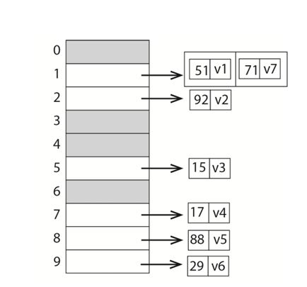
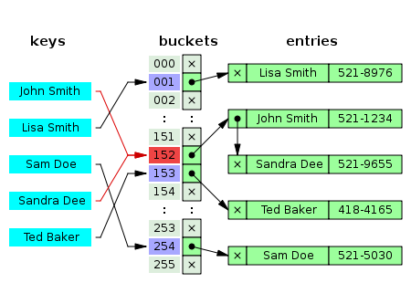
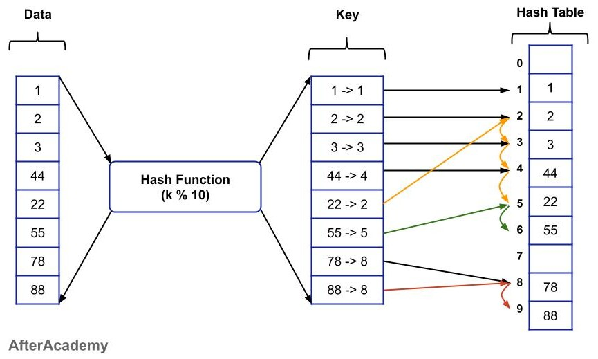
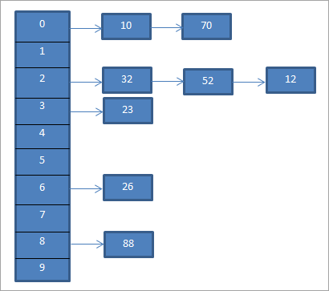

<!-- editorlm-hebrew-html-start -->
<style>
html, body, .vscode-body, .markdown-body, .markdown-preview, #write {
  direction: rtl !important; text-align: right !important;
}
ul, ol { padding-right: 2em !important; padding-left: 0 !important; }
blockquote { border-right: 3px solid #999; border-left: 0; padding-right: 1rem; padding-left: 0; }
@media print {
  html, body, .vscode-body, .markdown-body, .markdown-preview, #write {
    direction: rtl !important; text-align: right !important;
  }
}
</style>
<!-- editorlm-hebrew-html-end -->
<style>
.book { max-width: 900px; margin: auto; line-height: 1.8; font-family: Arial, sans-serif; }
.book .cover { min-height: 680px; box-sizing: border-box; padding: 64px 48px; margin: 24px 0 60px; background: #112b41; color: #f5f8fc; border-top: 9px solid #39c4b5; position: relative; }
.book .cover .eyebrow { color: #81e0d5; font-size: 15px; letter-spacing: 2px; }
.book .cover h1 { color: #fff; font-size: 48px; line-height: 1.3; border: 0; margin: 50px 0 18px; }
.book .cover .subtitle { font-size: 28px; color: #d8e6f0; }
.book .cover .author { font-size: 30px; color: #fff; margin-top: 52px; }
.book .cover .audience { color: #c1d3df; margin-top: 12px; }
.book .cover .motif { direction: ltr; text-align: left; font-family: Consolas, monospace; color: #81e0d5; font-size: 19px; margin-top: 54px; }
.book h1, .book h2, .book h3 { line-height: 1.4; font-weight: 700; }
.book > h1 { font-size: 32px !important; text-align: center !important; margin: 28px 0; }
.book h2 { font-size: 34px !important; text-align: center !important; color: #153b56 !important; background: #eef5fc; border: 0; border-bottom: 4px solid #299c91; border-radius: 10px 10px 0 0; padding: 28px 20px; margin: 24px 0 36px; }
.book h3 { font-size: 24px !important; text-align: right !important; color: #174e49 !important; background: #edf7f5; border: 0; border-right: 5px solid #299c91; border-radius: 6px; padding: 10px 16px; margin: 36px 0 18px; }
.book .chapter { height: 0; margin: 76px 0 0; border-top: 1px solid #ccd7df; break-before: page; page-break-before: always; break-after: avoid; page-break-after: avoid; }
.book .toc { padding: 24px; border-right: 5px solid #39a99d; background: rgba(70,150,155,.09); margin: 24px 0 48px; }
.book pre, .book pre code { direction: ltr !important; text-align: left !important; unicode-bidi: isolate; }
.book pre { box-sizing: border-box !important; width: 100% !important; max-width: 100% !important; margin: 0 !important; padding: 16px 20px; border: 1px solid #ccd7df; border-radius: 8px; line-height: 1.6; overflow-x: auto; }
.book code { direction: ltr; unicode-bidi: isolate; font-family: Consolas, "Courier New", monospace; }
.book pre { background: #f3f6fa !important; color: #1f2937 !important; }
.book pre code, .book pre code.hljs { background: transparent !important; color: #1f2937 !important; }
.book pre .hljs-keyword, .book pre .hljs-literal { color: #6f299c !important; }
.book pre .hljs-string { color: #216338 !important; }
.book pre .hljs-number { color: #075e68 !important; }
.book pre .hljs-comment { color: #526174 !important; }
.book pre .hljs-built_in, .book pre .hljs-title { color: #135b96 !important; }
.book table { width: 75%; max-width: 75%; margin: 18px auto; background: #f3f6fa; }
.book th, .book td { border: 1px solid #ccd7df; padding: 8px 12px; }
.book th, .book td { text-align: right; }
.book .small { font-size: .9em; opacity: .8; }
.book .python-intro { display: flex; align-items: center; gap: 28px; padding: 22px 28px; margin: 24px 0; background: #eef5fc; color: #183e63; border-right: 6px solid #3776ab; border-radius: 10px; }
.book .python-intro strong { font-size: 30px; }
.book .python-fact { background: #fff7d6; color: #423611; border-right: 6px solid #ffd343; border-radius: 8px; padding: 18px 24px; margin: 22px 0; }
.book .python-fact strong { font-size: 24px; }
.book img { max-width: 100%; height: auto; }
.book figure { box-sizing: border-box; width: 75%; max-width: 75%; margin: 24px auto; padding: 16px 20px; background: #f3f6fa; border: 1px solid #ccd7df; border-radius: 8px; text-align: center; }
.book figure img { display: block; margin: auto; }
.book figcaption { direction: rtl; text-align: center; font-size: .9em; color: #445566; }
@media print { .book > h2 { break-before: page; page-break-before: always; } }
.book .screen-strip { width: 760px; max-width: 100%; height: 220px; overflow: hidden; border: 1px solid #bccad5; border-radius: 8px; margin: 20px auto 8px; direction: ltr; }
.book .screen-strip.output { height: 265px; }
.book .screen-strip img { display: block; width: 1745px; max-width: none; }
.book .screen-menu { width: 400px; max-width: 100%; height: 295px; overflow: hidden; direction: ltr; margin: 20px auto 8px; border: 1px solid #bccad5; border-radius: 8px; }
.book .screen-menu img { display: block; width: 1745px; max-width: none; }
.book .code-panel { box-sizing: border-box !important; display: block !important; width: 75% !important; max-width: 75% !important; margin: 18px auto !important; }
@media print {
  .book .cover { min-height: 85vh; break-after: page; print-color-adjust: exact; -webkit-print-color-adjust: exact; }
  .book pre { white-space: pre-wrap; break-inside: avoid; }
  .book .chapter { margin: 0; border: 0; }
  .book h1, .book h2, .book h3 { break-after: avoid; page-break-after: avoid; break-inside: avoid; }
  .book h2 { margin-top: 0; }
  .book h2, .book h3 { print-color-adjust: exact; -webkit-print-color-adjust: exact; }
}
</style>

<style>
.book .book-nav { display: flex; flex-wrap: wrap; gap: 10px; justify-content: center; align-items: center; padding: 16px 0; margin: 20px 0 32px; border-top: 1px solid #ccd7df; border-bottom: 1px solid #ccd7df; }
.book .book-nav a { display: inline-block; padding: 10px 18px; border-radius: 8px; background: #eef5fc; color: #153b56 !important; border: 1px solid #b5ccd9; text-decoration: none !important; font-size: 16px; font-weight: bold; }
.book .book-nav a.toc-link { background: #174e49; color: #fff !important; border-color: #174e49; }
.book .book-nav a:hover, .book .book-nav a:focus { background: #d4eee8; color: #153b56 !important; outline: 2px solid #299c91; outline-offset: 2px; }
.book .section-list { line-height: 2; }
@media print { .book .book-nav { display: none; } }

/* Explicit Hebrew direction, including prose beginning with English. */
.book p, .book ul, .book ol, .book li,
.book blockquote, .book h1, .book h2, .book h3,
.book h4, .book th, .book td {
  direction: rtl !important;
  text-align: right !important;
  unicode-bidi: isolate;
}
/* Chapter titles keep their agreed centered layout. */
.book h2 { text-align: center !important; }
.book pre, .book pre code, .book .code-panel {
  direction: ltr !important;
  text-align: left !important;
  unicode-bidi: isolate;
}
</style>

<style>
.book .formula { box-sizing:border-box; width:75%; max-width:75%; direction:ltr!important; text-align:center!important; overflow-x:auto;
  padding:16px 20px; background:#f3f6fa; color:#1f2937; border:1px solid #ccd7df; border-radius:8px; margin:20px auto; font-size:1.15em; }
.book .grid-panel { box-sizing:border-box; width:75%; max-width:75%; margin:20px auto; padding:16px 20px; background:#f3f6fa; border:1px solid #ccd7df; border-radius:8px; }
.book .grid { direction:ltr!important; width:auto!important; max-width:100%!important; margin:0 auto; border-collapse:collapse; background:#fff; }
.book .grid td { direction:ltr!important; text-align:center!important; width:64px; height:48px; border:1px solid #8199aa; }
.book .grid .goal { background:#d3efdc; } .book .grid .bad { background:#f4d7d7; }
</style>

<div class="book" dir="rtl" lang="he">

<nav class="book-nav" aria-label="ניווט בספר">
<a href="06-%D7%9E%D7%95%D7%A0%D7%98%D7%94%20%D7%A7%D7%A8%D7%9C%D7%95.md">→ הקודם</a>
<a class="toc-link" href="../index.md">תוכן העניינים</a>
<a href="08-Temporal%20Difference.md">הבא ←</a>
</nav>

## ד.7 — מונטה קרלו באיקס עיגול — טבלת Q וקוד האימון

**המצגת:** [מונטה קרלו באיקס עיגול](../../../sources/RL/4.1.%20איקס%20עיגול.pptx) · **קוד:** [ממשק המשחק](../assets/rl/code/ttt_env.py) · [הסוכן הטבלאי](../assets/rl/code/tabular_agent.py) · [דגימה ובדיקה](../assets/rl/code/ttt_training.py) · [האימון](../assets/rl/code/mc_tictactoe.py)

בפרק הקודם הצגנו את רעיון מונטה קרלו בפסאודו־קוד: משחקים אפיזודה שלמה, מחשבים תשואות מהסוף להתחלה ומעדכנים טבלת Q. השאלה של הפרק הזה מעשית: איך הופכים את הרעיון לתוכנית פייתון שבאמת לומדת לשחק איקס־עיגול? זו הפעם הראשונה בחלק ד שסוכן ילמד ממשחקים אמיתיים, בלי מודל של היריב — ובסוף הפרק נוכל למדוד כמה טוב הוא משחק.

נבנה סוכן שמשחק X, מתנסה במשחקים מול יריב אקראי ומעדכן את ההערכות שלו אחרי כל משחק. האלגוריתם כבר הוסבר ב־[מונטה קרלו](06-מונטה%20קרלו.md#mc-update). כאן נחבר אותו לקוד: נחליט איך לשמור מצב–פעולה במילון, נאסוף אפיזודה ונעדכן את הזוגות שהופיעו בה.

בדרך נתעכב על שאלה שנראית טכנית אך היא הכרחית: טבלת Q באיקס־עיגול צריכה להכיל אלפי מצבים, וכל מצב הוא לוח שלם. איך משתמשים בלוח כמפתח במילון, ואיך המילון מוצא אותו במהירות? לשם כך נכיר את רעיון הגיבוב, שעליו מבוסס המילון של פייתון. אחר כך נחזור לקוד האימון עצמו: דגימת צעד, איסוף אפיזודה, עדכון, ולולאת האימון עם בדיקת התוצאה.

### ממשק המשחק הדרוש לאימון

לפני שכותבים את הסוכן, נבהיר מה הוא צריך לקבל מהמשחק — זהו הממשק שתיארנו באופן כללי בפרק ד.3, וכאן הוא מופיע בגרסה קונקרטית לאיקס־עיגול. המשחק כבר נתון. אין צורך בגרפיקה כדי לאמן את הסוכן: הוא מקבל מצב, בוחר משבצת חוקית ומבקש מהסביבה לבצע את המהלך. בקובץ המצורף `State.board` הוא tuple של תשעה תאים לפי סדר השורות: 1 עבור X, ‎−1 עבור O ו־0 לתא ריק. `State.player` הוא השחקן שתורו כעת. פעולה מיוצגת בזוג `(row, col)`, כשמספור השורות והעמודות מתחיל באפס.

<a id="game-interface"></a>

| קריאה או שדה | המשמעות באימון |
| --- | --- |
| `State()` | לוח ריק, תור X |
| `env.get_actions(state)` | רשימת המשבצות החוקיות |
| `env.next_state(state, action)` | מצב חדש ותגמול לאחר מהלך אחד; המצב הישן נשמר |
| `env.end_of_game(state)` | האם המשחק הסתיים |
| `state.end_of_game` | 0 למשחק ממשיך, 1 לניצחון X, ‎−1 לניצחון O, 2 לתיקו |

התגמול הוא מנקודת המבט של X: ניצחון 1, הפסד ‎−1, תיקו 0. גם במהלך משחק שטרם הסתיים התגמול הוא 0. לכן בודקים סיום בנפרד מהתגמול; תגמול 0 לבדו אינו אומר אם צריך להמשיך.

נקודה חשובה: מנקודת מבטו של הסוכן הלומד, תגובת היריב היא חלק מ"הסביבה", בדיוק כמו החלקה על כביש חלק בדוגמה מפרק ד.3. לכן צעד למידה אחד יכלול את הפעולה של X ואת תגובת O, אם המשחק לא הסתיים קודם. כך המצב הבא של צעד למידה הוא מצב שבו X שוב צריך לבחור, או מצב סופי. את פונקציית הדגימה נציג אחרי מבנה הטבלה.

### מילון של מצב–פעולה וערך

בפרק הקודם דיברנו על "טבלת Q" באופן כללי. עכשיו צריך להחליט איך לשמור אותה בזיכרון. מערך דו־ממדי אינו מתאים: המצבים אינם מספרים רצים אלא לוחות, ואיננו יודעים מראש באילו מהם נבקר. מבנה הנתונים המתאים הוא מילון. כדי למצוא את ההערכה של פעולה במצב מסוים, נשמור את טבלת Q כמילון. המפתח הוא זוג המכיל מצב ופעולה, והערך הוא מספר:

<div class="code-panel" dir="ltr">

```python
Q = {}
state = State()
action = (1, 1)
Q[(state, action)] = 0.7
value = Q.get((state, action), 0.0)
```

</div>

המפתח בדוגמה מתאר בחירה במרכז מתוך לוח ריק. הצבה נוספת לאותו מפתח תחליף את הערך הקודם. מצב או פעולה אחרים יוצרים מפתח אחר. המספר 0.7 כאן הוא דוגמת אחסון בלבד; בתחילת האימון נתחיל ממילון ריק ונשתמש ב־0 עבור זוג שטרם עודכן.

כדי ש־`State` יוכל לשמש כחלק ממפתח, על פייתון לדעת כיצד להשוות בין מצבים וכיצד למצוא אותם במילון. לשם כך נבין את רעיון הגיבוב.

<!-- editorlm-source-ref: [sources/RL/4.1. איקס עיגול.pptx#L5-L13] -->

### טבלת גיבוב — ממפתח למקום בטבלה

במהלך האימון נפנה למילון Q מיליוני פעמים — בכל בחירת פעולה ובכל עדכון. אם כל פנייה הייתה דורשת לעבור על כל המפתחות, האימון היה איטי מאוד. מילון בפייתון מהיר בזכות המבנה שמאחוריו: הוא מבוסס על **טבלת גיבוב — Hash Table**. במקום לחפש מפתח ברשימה מתחילתה ועד סופה, מחשבים ממנו מספר באמצעות פונקציית `hash`, ומשתמשים במספר כדי למצוא מקום מתאים בטבלה — כמו מספר תא בארון תאים, שמוביל ישירות לתא הנכון.

חשוב להפריד בין שלושה דברים: **המפתח** שבאמצעותו מחפשים, **הערך** שרוצים לשמור, ו־**האינדקס הפנימי** שבו המידע נמצא. לדוגמה, המפתח יכול להיות שם של אדם והערך מספר הטלפון שלו. השם אינו אינדקס מספרי, אבל פונקציית גיבוב יכולה להמיר אותו למספר.

בטבלת דוגמה בת עשרה מקומות אפשר לחשב אינדקס למפתח מספרי באמצעות `key % 10`. המפתח 23 יגיע לאינדקס 3. זו המחשה בלבד; אין זו פונקציית המימוש של מילון פייתון.

<figure>

<figcaption>טבלה בת עשרה תאים עם האינדקס key % 10: המפתח 92 נמצא בתא 2, המפתח 15 בתא 5 ו־88 בתא 8. לכל מפתח מוצמד הערך שלו (v1, v2 וכן הלאה). בתא 1 נפגשו שני מפתחות, 51 ו־71, ונשמרו זה אחר זה.</figcaption>
</figure>

<!-- editorlm-source-ref: [sources/RL/4.1. איקס עיגול.pptx#L15-L25] -->

### מחרוזות, ספר טלפונים וסיבוכיות

בדוגמת המודולו המפתח היה מספר. אבל המפתחות שלנו — מצבים ופעולות — אינם מספרים, ולכן חשוב לראות שגיבוב עובד גם על מפתחות מורכבים יותר. גם מחרוזת יכולה לעבור גיבוב. בספר טלפונים, למשל, נרצה שהביטוי `phones["Dana"]` ימצא את המספר של דנה בלי להשוות את השם לכל השמות ששמורים בספר.

<div class="code-panel" dir="ltr">

```python
phones = {"Dana": "050-0000000", "Noam": "052-0000000"}
print(phones["Dana"])
```

</div>

**פלט**

<div class="code-panel" dir="ltr">

```text
050-0000000
```

</div>

כמה זמן לוקח חיפוש כזה? נהוג לתאר זאת ב**סימון O** — Big-O — שאומר איך זמן הפעולה גדל עם גודל הנתונים. כאשר המפתחות מתפזרים היטב בטבלה ויש בה מקום מתאים, חיפוש, הכנסה ומחיקה הם O(1) בממוצע: זמן קבוע, שאינו תלוי בכמות המפתחות. במקרה הגרוע, כאשר נדרשות בדיקות רבות בגלל התנגשויות, הם יכולים להיות O(n) — זמן שגדל ביחס ישר למספר המפתחות, כמו חיפוש ברשימה. הסימון מתייחס למספר המפתחות n; הוא אינו אומר שכל פעולה במחשב לוקחת בדיוק אותו זמן.

<figure>

<figcaption>ספר טלפונים כטבלת גיבוב: השם עובר בפונקציית הגיבוב (החצים האדומים) ומוביל לתא בטבלה, ומהתא מגיעים ישירות לרשומה עם מספר הטלפון, בלי לעבור על כל השמות.</figcaption>
</figure>

<!-- editorlm-source-ref: [sources/RL/4.1. איקס עיגול.pptx#L27-L39] -->

### מה עושים כששני מפתחות מגיעים לאותו מקום?

הטבלה קטנה ממספר המפתחות האפשריים, ולכן בהכרח יקרה שמפתחות שונים יקבלו אותו אינדקס. בדוגמת המודולו, גם 23 וגם 43 מגיעים לאינדקס 3. זו **התנגשות — Collision**. אין פירושה שהמפתחות שווים או שעלינו למחוק את אחד הערכים. צריך לשמור דרך להבחין ביניהם.

<figure>

<figcaption>פונקציית הגיבוב k % 10 על שמונה מפתחות. המפתחות 2 ו־22 מגיעים שניהם לתא 2, והמפתחות 8 ו־88 לתא 8. החצים הצבעוניים מסמנים את ההתנגשויות.</figcaption>
</figure>

שתי דרכים מקובלות להמחיש טיפול בהתנגשות הן שמירת שרשרת של זוגות מפתח–ערך באותו תא, או חיפוש תא פנוי אחר לפי סדר בדיקה מוסכם. בזמן חיפוש מפעילים את אותה שיטה ובודקים גם שוויון של המפתח. אין צורך לממש אף אחת מהדרכים האלה באימון; מילון פייתון מטפל בכך עבורנו.

<figure>

<figcaption>הדרך הראשונה, שרשרת: לתא 2 הגיעו שלושה מפתחות (32, 52 ו־12), והם נשמרים ברשימה שיוצאת מהתא. בחיפוש עוברים על השרשרת הקצרה ומשווים את המפתח.</figcaption>
</figure>

<!-- editorlm-source-ref: [sources/RL/4.1. איקס עיגול.pptx#L41-L45] -->

### State כמפתח — גיבוב ושוויון

עכשיו אפשר לחזור ל־`State` שלנו ולהבין מה נדרש כדי שישמש מפתח. אם שני אובייקטים מתארים בדיוק את אותו מצב, אנחנו רוצים שיגיעו לאותה רשומה ב־Q. במהלך האימון אותו לוח יופיע פעמים רבות, בכל פעם כאובייקט חדש שנוצר על ידי `next_state`. אין טעם ללמוד מחדש את אותו לוח רק משום שנוצר עבורו אובייקט חדש בזיכרון.

בעותק הסביבה שלנו הלוח כבר נשמר כ־tuple, שאפשר לחשב לו גיבוב. נשמור גם את זהות השחקן כחלק מהזהות של המצב. אלה שתי המתודות הרלוונטיות מתוך `State`:

<div class="code-panel" dir="ltr">

```python
def __hash__(self):
    return hash((self.board, self.player))

def __eq__(self, other):
    if not isinstance(other, State):
        return NotImplemented
    return self.board == other.board and self.player == other.player
```

</div>

אלה שתי מתודות מיוחדות של פייתון (הכרנו מתודות כאלה, כמו `__init__`, בחלק א): המילון קורא להן בעצמו בכל פנייה למפתח. `__hash__` עוזרת למילון למצוא את מקום החיפוש; `__eq__` בודקת אם אכן מדובר באותו מצב. מצבים שווים חייבים לקבל אותו hash, אבל hash שווה אינו מחייב שמצבים יהיו שווים, בגלל האפשרות להתנגשות.

אין לשנות את תוכנו של מצב לאחר ששימש מפתח. אחרת הגיבוב או ההשוואה עלולים להשתנות. בממשק המצורף המצבים אינם ניתנים לשינוי, וכל מהלך מחזיר מצב חדש. בקוד המקור, שבו הלוח הוא מערך, משתמשים בהעתקת המצב לפני שמירתו. קוד הגיבוב שבענף הפתרון ממיר את המערך ל־tuple; ההתאמה שלנו שומרת על אותו רעיון.

<!-- editorlm-source-ref: [sources/RL/4.1. איקס עיגול.pptx#L47-L51] -->

### דוגמים את פעולתנו ואת תגובת היריב

סיימנו עם מבנה הטבלה, וחוזרים ללמידה עצמה. הצעד הראשון הוא לייצר את הניסיון שממנו לומדים. נציג פונקציה שמרכזת צעד למידה אחד, כפי שהגדרנו אותו קודם — הפעולה של X ותגובת O. היא אינה מחליטה מה הפעולה של X; זו אחריות הסוכן. היא מבצעת את הפעולה שהתקבלה, בודקת סיום, ואם צריך — מגרילה את תגובת היריב.

<a id="sample-step"></a>

<div class="code-panel" dir="ltr">

```python
def sample_step(env, state, action, opponent_rng):
    if state.player != 1:
        raise ValueError('The learner is X')
    after_state, reward = env.next_state(state, action)
    if env.end_of_game(after_state):
        return after_state, reward, True
    opponent_action = opponent_rng.choice(env.get_actions(after_state))
    next_state, reward = env.next_state(after_state, opponent_action)
    return next_state, reward, env.end_of_game(next_state)
```

</div>

הפונקציה מחזירה שלושה ערכים: המצב שבו X יבחר בפעם הבאה, התגמול של הצעד, ודגל שמציין אם המשחק הסתיים. אם X ניצח או מילא את הלוח לתיקו, אין לתת ליריב תור נוסף. אם המשחק נמשך, ההחזרה השנייה כוללת גם את תגובת O. ניצחון של O נותן ‎−1, בהתאם לנקודת המבט של הסוכן שאנחנו מאמנים.

`opponent_rng` הוא מחולל אקראי שממנו בוחרים משבצת חוקית. בפרק זה היריב אקראי בסיסי, כפי שנבחר בהדגמה; אנחנו לומדים את ההתנהגות מולו, ולא מניחים שהוא משחק באופן מיטבי.

### אוספים אפיזודה

צעד אחד אינו מספיק למונטה קרלו — העדכון מחכה לסוף המשחק. כעת נאסוף משחק שלם שישמש לעדכון הטבלה. הסוכן הטבלאי בקובץ המצורף (המחלקה `TabularAgent`) מחזיק את המילון `Q` וכולל `get_Q`, שמחזירה את הערך מהמילון או 0, ו־`get_action`, שבוחרת לפי ε-greedy. מימוש הבחירה והדעיכה נמצא ב־[פרק מונטה קרלו](06-מונטה%20קרלו.md#epsilon-decay). כעת נשתמש בו כדי ליצור משחק שלם:

<div class="code-panel" dir="ltr">

```python
def generate_episode(env, agent, epsilon, opponent_rng):
    episode = []
    state = State()
    while not env.end_of_game(state):
        action = agent.get_action(state, epsilon)
        next_state, reward, done = sample_step(
            env, state, action, opponent_rng)
        episode.append((state, action, reward))
        state = next_state
    return episode
```

</div>

בכל רשומה נשמור את המצב **שלפני** הפעולה, את הפעולה של X ואת התגמול של צעד הלמידה. הלוח אחרי תגובת היריב יהפוך למצב של הרשומה הבאה. מצב סופי אינו דורש רשומת פעולה נוספת, משום שאין בו בחירה של הסוכן.

### מעדכנים את Q מהסוף להתחלה

האפיזודה בידינו, ועכשיו מגיע שלב הלמידה. לאחר סיום המשחק נפעיל את [עדכון מונטה קרלו](06-מונטה%20קרלו.md#mc-update) על הרשומות שנאספו. הפונקציה עוברת על הרשומות מהסוף להתחלה, צוברת את התשואה G ומזיזה כל ערך Q לכיוונה:

<div class="code-panel" dir="ltr">

```python
def update_episode(agent, episode, gamma=0.95, alpha=0.01):
    G = 0.0
    for state, action, reward in reversed(episode):
        G = reward + gamma * G
        old_value = agent.get_Q(state, action)
        agent.Q[(state, action)] = old_value + alpha * (G - old_value)
```

</div>

`reversed` מאפשרת להתחיל בצעד האחרון בלי למחוק את הרשימה. באפיזודה שניצחה, הצעד האחרון יקבל יעד 1; אם כל התגמולים הקודמים היו 0, הצעד שלפניו יקבל 0.95, וזה שלפניו 0.95². כך המהלך שסגר את הניצחון מקבל את הקרדיט הגדול ביותר, ומהלכי הפתיחה מקבלים חלק קטן יותר ממנו. בהפסד הסימן שלילי. בתיקו כל התשואות כאן יהיו 0, ועדיין נעדכן את הערכים אם הם היו שונים מאפס.

<!-- editorlm-source-ref: [sources/RL/4. מונטה קרלו.pptx#L99-L105] -->

### לולאת האימון ובדיקת הסוכן

כל החלקים מוכנים, ונותר לחבר אותם ללולאת אימון: לשחק משחק, לעדכן, ולחזור. נחזור על התהליך 200,000 פעמים, עם α=0.01 ו־γ=0.95. אלה פרמטרי מאמן מונטה קרלו בענף הפתרון. α קטן פירושו שכל משחק מזיז את הערכים רק מעט, ולכן צריך משחקים רבים; זה מתאים לסביבה שבה תוצאות של משחקים בודדים רועשות. ε יתעדכן לפי הפונקציה המעריכית שהוסברה בפרק הקודם.

<div class="code-panel" dir="ltr">

```python
import random
from ttt_env import State, TicTacToe
from tabular_agent import TabularAgent, epsilon_at
from ttt_training import sample_step, evaluate

def train(epochs=200000, seed=0):
    env = TicTacToe()
    agent = TabularAgent(env, seed)
    opponent_rng = random.Random(seed + 1)
    for epoch in range(epochs):
        episode = generate_episode(
            env, agent, epsilon_at(epoch), opponent_rng)
        update_episode(agent, episode)
    return env, agent
```

</div>

מספרי הזרעים (`seed`) מאפשרים לשחזר את בחירות המחוללים בהרצה חוזרת באותה סביבה — מחולל אקראי שמאותחל באותו זרע מפיק את אותה סדרת מספרים, וכך אפשר לשחזר ניסוי בדיוק. נשמור מחולל נפרד לסוכן וליריב.

איך נדע אם הסוכן באמת למד? האימון עצמו כולל חקירה אקראית, ולכן תוצאותיו אינן משקפות את איכות הטבלה. לאחר האימון נבדוק את הסוכן ללא חקירה וללא עדכונים ל־Q:

<div class="code-panel" dir="ltr">

```python
env, agent = train()
results = evaluate(env, agent.get_action, games=1000, seed=100)
print(results)
```

</div>

ברירת המחדל של `agent.get_action` היא ε=0, ולכן הבדיקה חמדנית. `evaluate` מתחילה בכל פעם בלוח ריק, מפעילה את אותו ממשק דגימה מול יריב אקראי וסופרת ניצחונות, הפסדים ותיקו. היא אינה קוראת ל־`update_episode`.

בהרצה שבוצעה עבור עותק הקוד המצורף התקבל:

**פלט**

<div class="code-panel" dir="ltr">

```text
{'wins': 989, 'losses': 0, 'draws': 11}
```

</div>

הסוכן ניצח ב־989 מתוך 1,000 משחקים, סיים 11 בתיקו ולא הפסיד אף פעם. זו תוצאה של 1,000 משחקי בדיקה מול היריב האקראי, לאחר 200,000 משחקי אימון עם הזרעים המוצגים. הסוכן הגיע לכך בלי שאיש הסביר לו את חוקי איקס־עיגול או אסטרטגיה כלשהי — רק מתוך תוצאות המשחקים. עם זאת, התוצאה אינה הוכחה שהסוכן אינו יכול להפסיד מול יריב אחר: הוא למד לשחק מול יריב אקראי, ומצבים שיריב חכם יוצר אולי לא הופיעו באימון כלל. אפשר לבדוק סוכן חדש באותה דרך ולבחון כיצד הפרמטרים משפיעים על התוצאות, בלי לערב את הגרפיקה של המשחק.

לריצה מלאה, שמרו את ארבעת קובצי הקוד המקושרים בראש הפרק באותה תיקייה והפעילו את `mc_tictactoe.py`. הקוד מבוסס על [MC_Trainer.py מענף solved](https://github.com/MarkmanGilad/Tic_Tac_Toe_2/blob/36416a995ce68c40e9799a792ef8c45c348ff451/MC_Trainer.py). בעותק הספר הופרדו דגימת המעבר והבדיקה לפונקציות, ייצוג המצב הוקפא, ונבחרו יריב אקראי בסיסי ודעיכת ε מעריכית. לחומרי Pygame אפשר לפנות לחלק ב של הספר ול־[אתר הקורס](https://webprogramming.azurewebsites.net/Pages/RL/RL_Intro.aspx).

<nav class="book-nav" aria-label="ניווט בספר">
<a href="06-%D7%9E%D7%95%D7%A0%D7%98%D7%94%20%D7%A7%D7%A8%D7%9C%D7%95.md">→ הקודם</a>
<a class="toc-link" href="../index.md">תוכן העניינים</a>
<a href="08-Temporal%20Difference.md">הבא ←</a>
</nav>

</div>

<!-- editorlm-source-versions: {"schemaVersion": 1, "sources": {"sources/RL/4.1. איקס עיגול.pptx": {"sourceSha256": "c643d0fd17400a16490ebc2c57d57a6de179948d9ad02479f2031b0271c73026", "canonicalTextSha256": "c3e1678b3628cd89a5cb4e0dba2b7d05cb6b4aeeda65dd547bd3ccc40b4ac905"}, "sources/RL/4. מונטה קרלו.pptx": {"sourceSha256": "ee320746d35546683d37dec9724a60a82a1059b128cde5dbb3ca0c54a7cdd9e8", "canonicalTextSha256": "09ba5a091f7fb828952fc7d0946ee6c1a6b047a98ce58c52ad4238a2d289142e"}}} -->
